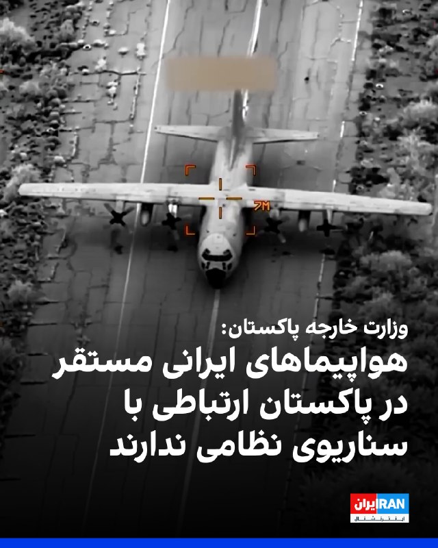
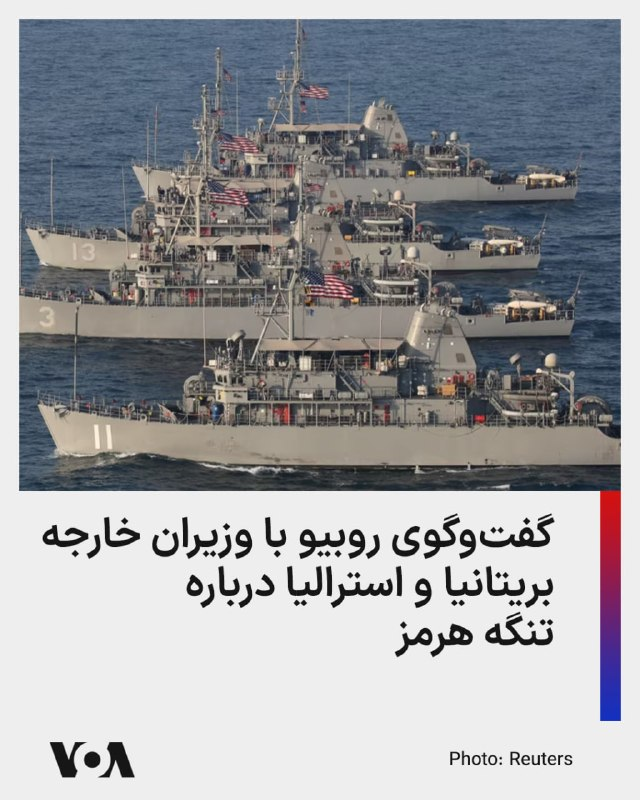
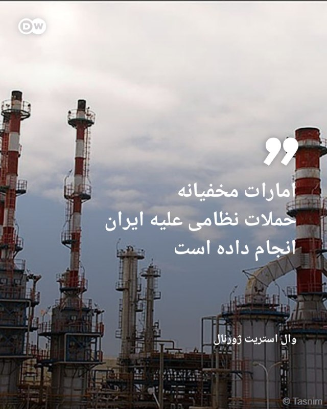
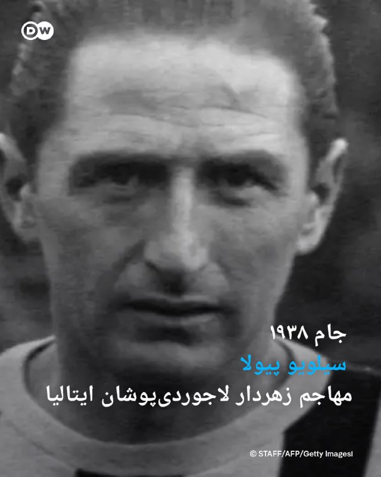
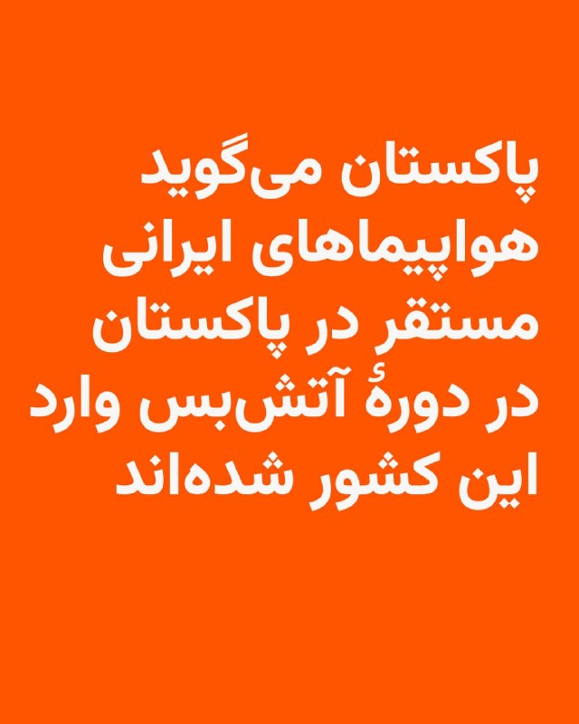
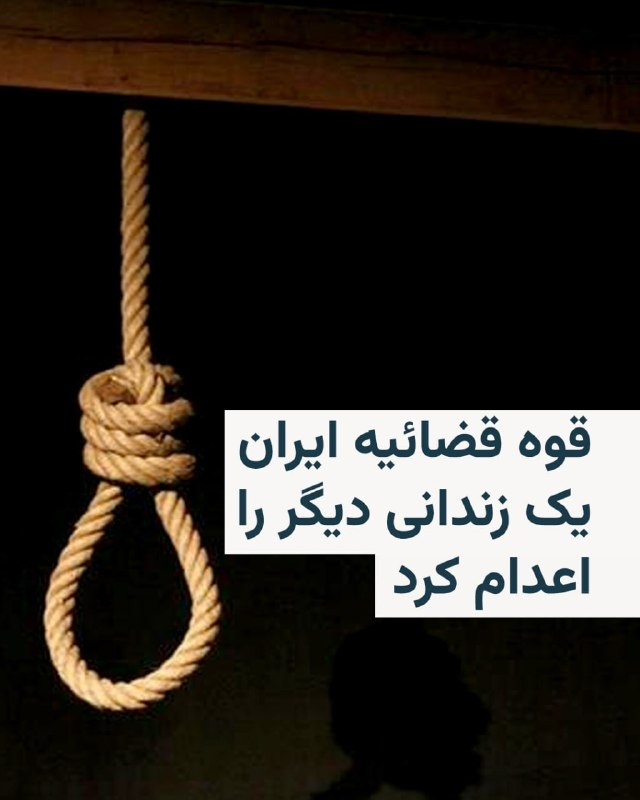
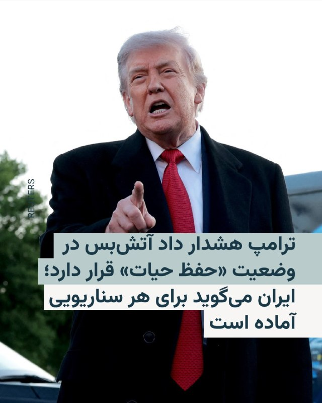
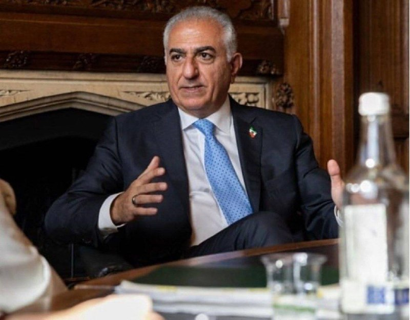
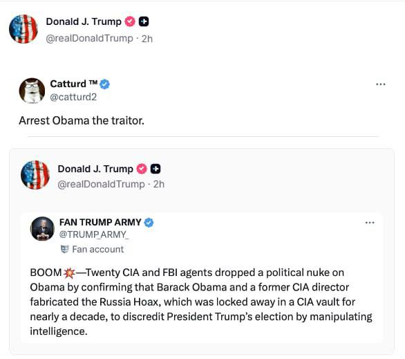
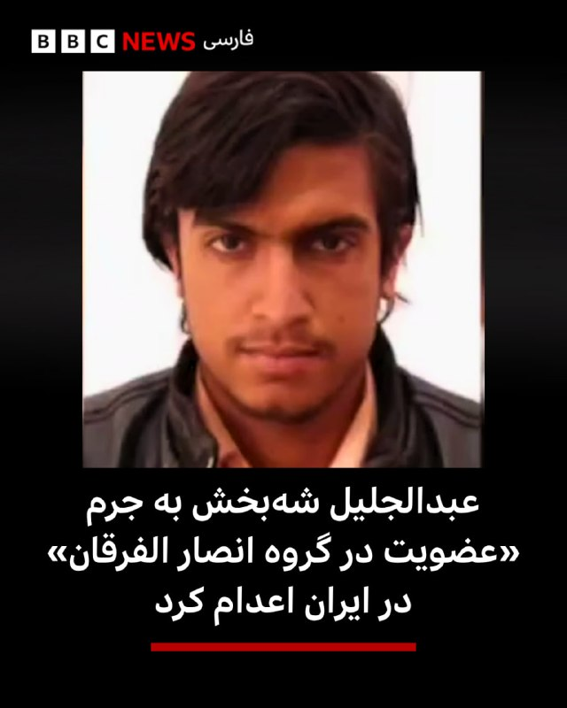

# خواننده تلگرام

<!-- TOP_NAV START -->

<a href="https://github.com/benyamin-najmi/aio-downloader/blob/main/telegram/content/archive_1.md" style="display:inline-block; padding:6px 12px; margin:0 4px; background-color:#2ea44f; color:white; text-decoration:none; border-radius:4px; font-weight:bold;">صفحه بعد</a>

<!-- TOP_NAV END -->

<!-- MSG START -->

---
📅 بروزرسانی: 1405/02/22 10:24
---

## VahidOOnLine — post 239648

  

وزارت خارجه پاکستان گزارش درباره اعزام هواپیماهای نظامی و غیرنظامی جمهوری اسلامی به پاکستان برای در امان ماندن از حملات، را «گمراه‌کننده» توصیف کرد و آن را رد کرد.

این وزارتخانه در بیانیه‌ای اعلام کرد که پس از برقراری آتش‌بس و در جریان مذاکرات، شماری از هواپیماها وارد پاکستان شدند تا جابه‌جایی تیم‌ها را تسهیل کنند و برخی از این هواپیماها و نیروهای پشتیبانی «به‌طور موقت» در این کشور باقی ماندند تا برای دورهای بعدی تعامل آماده باشند.

در این بیانیه آمده است: «هواپیماهای ایرانی که هم‌اکنون در پاکستان مستقر هستند، در دوره آتش‌بس وارد این کشور شدند و هیچ‌گونه ارتباطی با هیچ سناریوی نظامی یا ترتیبات حفاظتی ندارند.»

شبکه خبری سی‌بی‌اس به نقل از «مقام‌های آگاه آمریکایی» گزارش داده بود که جمهوری اسلامی، شماری از هواپیماهای نظامی خود را به پایگاه نورخان پاکستان و همچنین چند هواپیمای غیرنظامی را به افغانستان اعزام کرده است تا از خسارات ناشی از جنگ در امان بمانند.
‌🏁 🇬🇧 IranintlTV

🤖 @VahidOOnLine

## VahidOOnLine — post 239647

🗣روایت شما از بحران اقتصادی و زندگی در آتش‌بس- سه‌شنبه ۲۲ اردیبهشت:

🔹دانه قهوه شده کیلویی ۲ میلیون تومان، قهوه فوری شده کیلویی ۳ میلیون تومان! دیگه نمی‌شه قهوه خورد

🔹لوازم بهداشتی به‌شدت گران شده‌ان. قیمت مام ضد تعریقی که می‌گرفتم ۲۰۰ هزار تومان به ۶۰۰ هزار تومان افزایش یافته.

🔹با ۲۸ میلیون حقوق ماهیانه، زندگی دو نفره رزیدنتی ما به بن‌بست رسیده. پس‌اندازهایمان تمام شده و حتی توان تعمیر وسایل را نداریم.

🔹من فارغ‌التحصیل ارشدم، دو سال با بدبختی پول جور کردم یه لپ‌تاپ خریدم تحقیقات انجام دادم همین که اومدم مقاله رو چاپ کنم نت قطع شد. این وضعیت برای یکی مثل من که هیچ‌وقت دست از تلاش برنمی‌داشتم یعنی خود مرگ.

🔹از میانکوه خوزستان پیام می‌دهم؛ منطقه یک انتقال گاز در سال جدید حقوق ارکان ثالث را پرداخت نکرده که سابقه نداشته، همیشه برج یک دستمزدها پرداخت می‌شد.

🔹جمهوری اسلامی دقیقا به سبک کارتل‌های مواد مخدر عمل می‌کند. یک عده وفادار به خودش را با تطمیع و پول‌پاشی نگه داشته، ملت ایران را ول کرده در فقر و گرونی دست و پا بزنند. الحق که جمهوری اسلامی جمع رذایل همه‌ حکومت‌های تاریخ است.
‌🏁 🇬🇧 IranintlTV

🤖 @VahidOOnLine

## VahidOOnLine — post 239646

  

خبرگزاری میزان، رسانه قوه قضاییه جمهوری اسلامی، اعلام کرد که حکم اعدام عبدالجلیل شه‌بخش، زندانی بلوچ، بامداد سه‌شنبه ۲۲ اردیبهشت اجرا شده است. میزان اتهام او را «عضویت در گروه انصارالفرقان» و «بغی» عنوان کرده است.

در گزارش منتشرشده از سوی این رسانه، به تاریخ دقیق بازداشت عبدالجلیل شه‌بخش اشاره‌ای نشده است. همچنین پیشتر اطلاعی درباره بازداشت و روند طی شدن مراحل قضایی پرونده او منتشر نشده بود.
‌🏁 🇬🇧 IranintlTV

🤖 @VahidOOnLine

## VahidOOnLine — post 239645

  

♦️قیمت دلار صبح سه‌شنبه ۲۲ اردیبهشت و در زمان آغاز کار بازار با سه هزار تومان افزایش نسبت به روز قبل به ۱۸۵ هزار تومان رسید.
روند صعودی افزایش بهای ارزهای خارجی در بازارهای ایران در حالی ادامه دارد که با ادامه محاصره دریایی بنادر جنوب، تشدید تحریم‌ها و احتمال وقوع دوباره جنگ، نگرانی از کمبود دلار دوچندان شده است.

روز سه‌شنبه قیمت یورو به ۲۱۸ هزار تومان رسید و هر پوند بریتانیا در برابر ۲۵۱ هزار و ۸۰۰ تومان فروخته شد.

احتمال افزایش قیمت ارز تا پایان روز بسیار بالا است.
‌🇸🇦 Indypersian

🤖 @VahidOOnLine

## VahidOOnLine — post 239644

  <a href="telegram/content/VahidOOnLine_239644_1778568856.mp4" target="_blank">🎬 Download video</a>

وزارت خارجه استرالیا اعلام کرد این کشور تحریم‌های مالی هدفمند و ممنوعیت سفر تازه‌ای را علیه هفت فرد و چهار نهاد وابسته به جمهوری اسلامی اعمال کرده است.

پنی وانگ، وزیر خارجه استرالیا، گفت این تحریم‌ها در واکنش به «سرکوب خشونت‌بار مردم ایران»، قطع اینترنت، فشار بر زنان و دختران و اقدامات بی‌ثبات‌کننده جمهوری اسلامی در منطقه اعمال می‌شود.

بر اساس اعلام دفتر تحریم‌های استرالیا، افراد تحریم‌شده شامل اسکندر مومنی، مجید فیض جعفری، روح‌الله مومن‌نسب، قربان‌محمد ولی‌زاده، محسن ابراهیمی، ناصر زرین‌قلم و منصور زرین‌قلم هستند. نیروی انتظامی جمهوری اسلامی، سراج سایبرسپیس، صرافی برلیان و صرافی جی‌سی‌ام نیز در فهرست نهادهای تحریم‌شده قرار گرفته‌اند.
‌🏁 🇬🇧 ManotoTV

🤖 @VahidOOnLine

## VahidOOnLine — post 239643

  <a href="telegram/content/VahidOOnLine_239643_1778568857.mp4" target="_blank">🎬 Download video</a>

تصویری از نفتکش ایرانی «سی‌استار سه» منتشر شده که آتش‌سوزی در بخش دودکش آن را پس از هدف قرار گرفتن در دریای عمان نشان می‌دهد.

تانکر ترکرز گزارش داد این نفتکش متعلق به شرکت ملی نفتکش ایران، نزدیک جاسک هدف قرار گرفته است. به گفته این وب‌سایت تخصصی ردیابی نفتکش‌ها، «سی‌استار سه» از نفتکش‌های بسیار بزرگ حمل نفت خام است، نام اولیه آن «سنندج» بوده و پس از تحریم‌ها چند بار تغییر نام داده است.

در این گزارش آمده است خدمه نفتکش آسیبی ندیده‌اند.

پیشتر سنتکام، فرماندهی مرکزی ارتش آمریکا، اعلام کرده بود یک جنگنده نیروی دریایی آمریکا از ناو هواپیمابر «جورج اچ دبلیو بوش» ۱۸ اردیبهشت دودکش این نفتکش را هدف قرار داده است. سنتکام گفته بود این اقدام برای جلوگیری از ورود این نفتکش به یکی از بنادر ایران انجام شد.
‌🏁 🇬🇧 ManotoTV

🤖 @VahidOOnLine

## VahidOOnLine — post 239642

  <a href="telegram/content/VahidOOnLine_239642_1778568858.mp4" target="_blank">🎬 Download video</a>

پلیس منطقه یورک در کانادا اعلام کرد مهران محققی، ۳۹ ساله و ساکن ریچموند هیل، در ارتباط با حادثه‌ای در جریان یک تجمع درباره ایران در این شهر بازداشت و متهم شده است.

بر اساس بیانیه پلیس، این حادثه روز یکشنبه ۲۱ اردیبهشت در حوالی تقاطع خیابان یانگ و میجر مکنزی رخ داد. پلیس می‌گوید مظنون با خودرو به شکلی خطرناک در نزدیکی تجمع حرکت کرده، با یک راننده تحویل غذا که در تجمع حضور نداشت برخورد کرده و هنگام فرار نیز با خودرویی دیگر تصادف کرده است.

به گفته پلیس، محققی به حمله با سلاح، رانندگی خطرناک، تهدید و توقف نکردن پس از تصادف متهم شده است. تحقیقات در این پرونده ادامه دارد و پلیس از شاهدان و دارندگان تصاویر دوربین خودرو، تلفن همراه یا دوربین‌های امنیتی خواسته است اطلاعات خود را در اختیار بازرسان بگذارند.
‌🏁 🇬🇧 ManotoTV

🤖 @VahidOOnLine

## VahidOOnLine — post 239641

  

جانشین پایگاه دریابانی بندرعباس از شناسایی و انهدام یک خط لوله انتقال سوخت قاچاق به طول شش کیلومتر خبر داد. به گزارش فارس، وابسته به سپاه، قاچاقچیان این خطوط لوله را زیر ماسه‌ها و آب دریا جاسازی کرده بودند و از آن طریق، سوخت را از ساحل به دریا و شناورهای متخلف انتقال می‌دادند.
‌🏁 🇬🇧 IranintlTV

🤖 @VahidOOnLine

## VahidOOnLine — post 239640

  

وزارت خارجه استرالیا اعلام کرد این کشور سه‌شنبه ۲۲ اردیبهشت در واکنش به اقدامات جمهوری اسلامی در ادامه سرکوب خشونت‌بار مردم ایران، قطع اینترنت و ایجاد بی‌ثباتی در منطقه، تحریم‌های مالی هدفمند و ممنوعیت‌های سفر بیشتری را علیه هفت فرد و چهار نهاد حکومت ایران اعمال می‌کند.
هفت فرد و چهار نهادی که امروز تحریم شده‌اند، شامل مقام‌ها و نهادهای ارشدی هستند که در این اقدامات، از جمله خشونت علیه زنان و کودکان، نقش داشته‌اند.
یکی از این افراد مسئول هدایت سرکوب زنان و دختران در ایران بوده و با به‌کارگیری ۸۰ هزار نیرو، نظارت و اجرای حجاب اجباری را پیش برده است.
فرد دیگری پایگاه‌های اطلاعاتی محلی ایجاد کرده و با جمع‌آوری اطلاعات خانه‌به‌خانه و گشت‌زنی، مخالفان جمهوری اسلامی را شناسایی و مجازات کرده است.
برخی دیگر نیز مسئول بازداشت ناعادلانه شهروندان خارجی بوده‌اند.
این تحریم‌ها همچنین نظام بانکداری پنهان جمهوری اسلامی را هدف قرار می‌دهد.

‌🏁 🇬🇧 IranintlTV

🤖 @VahidOOnLine

## VahidOOnLine — post 239639

  <a href="telegram/content/VahidOOnLine_239639_1778568861.mp4" target="_blank">🎬 Download video</a>

وزارت خارجه آمریکا از طریق برنامه «پاداش برای عدالت» اعلام کرد برای دریافت اطلاعاتی که به مختل شدن سازوکارهای مالی سپاه و شاخه‌های مختلف آن، از جمله نیروی قدس سپاه، منجر شود، تا سقف ۱۵ میلیون دلار پاداش پرداخت می‌کند.

بر اساس اعلام این برنامه، سپاه بخشی از فعالیت‌های خارجی خود را از طریق فروش نفت تحریم‌شده جمهوری اسلامی و با استفاده از شبکه‌ای از شرکت‌های پوششی تامین مالی می‌کند. وزارت خارجه آمریکا می‌گوید این شبکه‌ها درآمدهای حاصل از فروش نفت را از مسیرهای غیرشفاف و از جمله از طریق نظام بانکی آمریکا جابه‌جا کرده‌اند.

در اطلاعیه برنامه «پاداش برای عدالت» از وانگ شائویون، تبعه چین، و محمود راشد عامر الحبسی، تبعه عمان، نام برده شده است. به گفته مقام‌های آمریکایی، این دو نفر به همراه افراد و شرکت‌های وابسته در چین، عمان و ترکیه، فروش و انتقال نفت تحریم‌شده ایران به پالایشگاه‌ها و شرکت‌های دولتی چین را سازمان‌دهی کرده‌اند تا درآمد آن به نیروی قدس سپاه برسد.
‌🏁 🇬🇧 ManotoTV

🤖 @VahidOOnLine

## VahidOOnLine — post 239638

  <a href="telegram/content/VahidOOnLine_239638_1778568861.mp4" target="_blank">🎬 Download video</a>

سی‌بی‌اس نیوز به نقل از مقام‌های آمریکایی گزارش داد پاکستان، همزمان با ایفای نقش میانجی میان تهران و واشینگتن، به چند هواپیمای نظامی جمهوری اسلامی اجازه داد در پایگاه‌های هوایی این کشور مستقر شوند.

بر اساس این گزارش، این اقدام احتمالا برای دور نگه داشتن بخشی از دارایی‌های هوایی جمهوری اسلامی از حملات آمریکا انجام شده است. مقام‌های آمریکایی گفته‌اند یکی از این هواپیماها یک فروند آرسی-۱۳۰ نیروی هوایی ایران بود که به پایگاه نورخان پاکستان منتقل شد.

یک مقام ارشد پاکستانی این گزارش را رد کرد و گفت پنهان کردن چنین هواپیماهایی در پایگاه نورخان، به دلیل موقعیت آن در قلب شهر، ممکن نیست.
‌🏁 🇬🇧 ManotoTV

🤖 @VahidOOnLine

## VahidOOnLine — post 239637

  <a href="telegram/content/VahidOOnLine_239637_1778568862.mp4" target="_blank">🎬 Download video</a>

رزا پرتو، روزنامه‌نگار «منوتو»، در گردهمایی ایرانیان روبروی دادگاه لاهه در هلند گفت: «جمهوری اسلامی باید در دادگاه لاهه محاکمه شود».
‌🏁 🇬🇧 ManotoTV

🤖 @VahidOOnLine

## mwarmonitor — post 8937

  <a href="telegram/content/mwarmonitor_8937_1778568865.mp4" target="_blank">🎬 Download video</a>

📌موقعیت احتمالی یک پایگاه نظامی محرمانه اسرائیل در صحرای عراق در مختصات 31.66697°N, 42.44864°E که دارای یک باند خاکی حدود ۱.۷ کیلومتری است. 🔸این محل که تنها ۷۰ کیلومتر با مرز عربستان فاصله دارد، به نظر می‌رسد چند روز پیش از آغاز جنگ با ایران ساخته شده باشد.…

## mwarmonitor — post 8936

🔴رئیس‌جمهور ترامپ از افشای اطلاعات در رسانه‌ها درباره جنگ با ایران به دادستان کل موقت شکایت کرد؛ موضوعی که باعث شد وزارت دادگستری تحقیقات را آغاز کند. WSJ

@mwarmomitor

## pm_afshaa — post 90605

🔴کانال 14 اسرائیل:کارخانه های خودرو سازی ایران از اهداف بعدی اسرائیل هستن

💧 Rainbet.com the #1 Non-KYC Crypto Casino & Sportsbook @rainbetcom

😁 @Pm_Afshaa

## pm_afshaa — post 90604

🔴سی ان ان:ترامپ تا قبل از سفرش به چین تصمیمی برای حمله به ایران نمی گیرد و پس از اتمام این سفر، تصمیم حمله را خواهد گرفت

💧 Rainbet.com the #1 Non-KYC Crypto Casino & Sportsbook @rainbetcom

😁 @Pm_Afshaa

## pm_afshaa — post 90603

🔴ترامپ:سیاست‌های دموکرات‌ها دیوانه‌وار است و آن‌ها کشور ما را به ویرانی خواهند کشاند.

ما باید در انتخابات میان‌دوره‌ای عملکرد خوبی داشته باشیم، و اگر نداشته باشیم، آن‌ها هر کاری که بتوانند انجام خواهند داد تا کشور ما را نابود کنن

💧 Rainbet.com the #1 Non-KYC Crypto Casino & Sportsbook @rainbetcom

😁 @Pm_Afshaa

## pm_afshaa — post 90602

  <a href="telegram/content/pm_afshaa_90602_1778568868.mp4" target="_blank">🎬 Download video</a>

ترامپ درباره ایران:نیروهای نظامی ما عالی هستند. ما داریم حسابی ضربه می‌زنیم

💧 Rainbet.com the #1 Non-KYC Crypto Casino & Sportsbook @rainbetcom

😁 @Pm_Afshaa

## iaghapour — post 2600

🔻نمیتونم خبر رو تایید کنم ولی میگن:
— افغانستان اینترنت 5G آورده.
— عراق تلگرام رو رفع فیلتر کرده.
— سوریه هم که ویزا و مستر کارت و...

این که ما درگیر فیلترینگ مسخره هستیم واقعا گریه داره...

## IranIntlTV — post 336763

  <a href="telegram/content/IranIntlTV_336763_1778568870.mp4" target="_blank">🎬 Download video</a>

اسرائیل به تصمیم اتحادیه اروپا برای تحریم برخی شهرک‌نشینان اسرائیلی در کرانه باختری واکنش نشان داد و با این اقدام مخالفت کرد.

بابک اسحاقی، خبرنگار ایران‌اینترنشنال، گزارش می‌دهد
@iranintltv

## IranIntlTV — post 336762

  <a href="telegram/content/IranIntlTV_336762_1778568872.mp4" target="_blank">🎬 Download video</a>

نمایشگاهی با هدف «بیدارسازی افکار عمومی» اروپا نسبت به نقض گسترده حقوق بشر و موج اعدام‌ها در ایران، به‌مدت یک ماه در شهرهای برلین، لاهه، آمستردام، بروکسل، پاریس و ژنو برگزار شد.

مهدی تهرانی، خبرنگار ایران‌اینترنشنال، گزارش می‌دهد
@iranintltv

## IranIntlTV — post 336761

  

وزارت خارجه پاکستان گزارش درباره اعزام هواپیماهای نظامی و غیرنظامی جمهوری اسلامی به پاکستان برای در امان ماندن از حملات، را «گمراه‌کننده» توصیف کرد و آن را رد کرد.

این وزارتخانه در بیانیه‌ای اعلام کرد که پس از برقراری آتش‌بس و در جریان مذاکرات، شماری از هواپیماها وارد پاکستان شدند تا جابه‌جایی تیم‌ها را تسهیل کنند و برخی از این هواپیماها و نیروهای پشتیبانی «به‌طور موقت» در این کشور باقی ماندند تا برای دورهای بعدی تعامل آماده باشند.

در این بیانیه آمده است: «هواپیماهای ایرانی که هم‌اکنون در پاکستان مستقر هستند، در دوره آتش‌بس وارد این کشور شدند و هیچ‌گونه ارتباطی با هیچ سناریوی نظامی یا ترتیبات حفاظتی ندارند.»

شبکه خبری سی‌بی‌اس به نقل از «مقام‌های آگاه آمریکایی» گزارش داده بود که جمهوری اسلامی، شماری از هواپیماهای نظامی خود را به پایگاه نورخان پاکستان و همچنین چند هواپیمای غیرنظامی را به افغانستان اعزام کرده است تا از خسارات ناشی از جنگ در امان بمانند.
https://iranintl.com/202605125000

## IranIntlTV — post 336760

🗣روایت شما از بحران اقتصادی و زندگی در آتش‌بس- سه‌شنبه ۲۲ اردیبهشت:

🔹دانه قهوه شده کیلویی ۲ میلیون تومان، قهوه فوری شده کیلویی ۳ میلیون تومان! دیگه نمی‌شه قهوه خورد

🔹لوازم بهداشتی به‌شدت گران شده‌ان. قیمت مام ضد تعریقی که می‌گرفتم ۲۰۰ هزار تومان به ۶۰۰ هزار تومان افزایش یافته.

🔹با ۲۸ میلیون حقوق ماهیانه، زندگی دو نفره رزیدنتی ما به بن‌بست رسیده. پس‌اندازهایمان تمام شده و حتی توان تعمیر وسایل را نداریم.

🔹من فارغ‌التحصیل ارشدم، دو سال با بدبختی پول جور کردم یه لپ‌تاپ خریدم تحقیقات انجام دادم همین که اومدم مقاله رو چاپ کنم نت قطع شد. این وضعیت برای یکی مثل من که هیچ‌وقت دست از تلاش برنمی‌داشتم یعنی خود مرگ.

🔹از میانکوه خوزستان پیام می‌دهم؛ منطقه یک انتقال گاز در سال جدید حقوق ارکان ثالث را پرداخت نکرده که سابقه نداشته، همیشه برج یک دستمزدها پرداخت می‌شد.

🔹جمهوری اسلامی دقیقا به سبک کارتل‌های مواد مخدر عمل می‌کند. یک عده وفادار به خودش را با تطمیع و پول‌پاشی نگه داشته، ملت ایران را ول کرده در فقر و گرونی دست و پا بزنند. الحق که جمهوری اسلامی جمع رذایل همه‌ حکومت‌های تاریخ است.

## IranIntlTV — post 336759

  <a href="https://t.me/IranintlTV/336759" target="_blank">📎 Download file</a>

🎧نسخه صوتی اخبار بامدادی | سه‌شنبه ۲۲ اردیبهشت
@iranintlTV

## IranIntlTV — post 336758

  

خبرگزاری میزان، رسانه قوه قضاییه جمهوری اسلامی، اعلام کرد که حکم اعدام عبدالجلیل شه‌بخش، زندانی بلوچ، بامداد سه‌شنبه ۲۲ اردیبهشت اجرا شده است. میزان اتهام او را «عضویت در گروه انصارالفرقان» و «بغی» عنوان کرده است.

در گزارش منتشرشده از سوی این رسانه، به تاریخ دقیق بازداشت عبدالجلیل شه‌بخش اشاره‌ای نشده است. همچنین پیشتر اطلاعی درباره بازداشت و روند طی شدن مراحل قضایی پرونده او منتشر نشده بود.
https://iranintl.com/202605126293

## IranIntlTV — post 336757

  <a href="telegram/content/IranIntlTV_336757_1778568877.mp4" target="_blank">🎬 Download video</a>

تصویری از یک راهب که هر صبح با گروهی از سگ‌های یک معبد در تایلند برای جمع‌آوری نذورات و غذا در اطراف محله حرکت می‌کند، در روزهای اخیر در شبکه‌های اجتماعی بازتاب گسترده‌ای داشته و میلیون‌ها بار دیده شده است.

گزارش فرزیا ثابتی، خبرنگار ایران‌اینترنشنال
@iranintltv

## IranIntlTV — post 336756

  <a href="telegram/content/IranIntlTV_336756_1778568878.mp4" target="_blank">🎬 Download video</a>

آیلین وانگ، شهردار شهر آرکادیا در ایالت کالیفرنیا، پس از متهم شدن به «همکاری پنهانی با دولت چین»، از سمت خود کناره‌گیری کرد.

گفت‌وگو با رضا گوهرزاد، روزنامه‌نگار و تحلیلگر سیاسی
@iranintltv

## IranIntlTV — post 336755

  <a href="telegram/content/IranIntlTV_336755_1778568881.mp4" target="_blank">🎬 Download video</a>

حمله به یک کشتی کره جنوبی در تنگه هرمز بازتاب گسترده‌ای در رسانه‌ها و محافل بین‌المللی داشته است. در همین ارتباط، سفیر جمهوری اسلامی در سئول هرگونه دخالت ایران در این حادثه را رد کرد.

گفت‌وگو با توماج طاهباز، خبرنگار ایران‌اینترنشنال
@iranintltv

## IranIntlTV — post 336754

  

جانشین پایگاه دریابانی بندرعباس از شناسایی و انهدام یک خط لوله انتقال سوخت قاچاق به طول شش کیلومتر خبر داد. به گزارش فارس، وابسته به سپاه، قاچاقچیان این خطوط لوله را زیر ماسه‌ها و آب دریا جاسازی کرده بودند و از آن طریق، سوخت را از ساحل به دریا و شناورهای متخلف انتقال می‌دادند.
https://iranintl.com/202605125372

## IranIntlTV — post 336753

  <a href="telegram/content/IranIntlTV_336753_1778568884.mp4" target="_blank">🎬 Download video</a>

🔻امانوئل مکرون، رییس‌جمهوری فرانسه، که برای شرکت در نشست «آفریقا فوروارد ۲۰۲۶» به کنیا سفر کرده است، صبح دوشنبه همراه با الیود کیپچوگه، قهرمان ماراتن المپیک‌های ۲۰۱۶ و ۲۰۲۰، دقایقی در خیابان‌های نایروبی، پایتخت کنیا دوید.

🔹الیود کیپچوگه با انتشار تصاویری درباره دویدن رییس‌جمهور فرانسه با او‌ نوشت: «فرصت داشتیم درباره این صحبت کنیم که چگونه می‌توانیم حمایت و فرصت‌های بیشتری برای نسل بعدی ورزشکاران آفریقایی فراهم کنیم.»

🔹او نوشت: «چنین لحظاتی به من یادآوری می‌کند که دویدن فراتر از حرکت است. این یک زبان جهانی است که مردم، فرهنگ‌ها و ایده‌ها را به هم پیوند می‌دهد.»

@iranintltvsport

## IranIntlTV — post 336752

  <a href="telegram/content/IranIntlTV_336752_1778568887.mp4" target="_blank">🎬 Download video</a>

دولت استرالیا از اعمال تحریم‌های جدید علیه مقام‌ها و نهادهای جمهوری اسلامی، از جمله وزیر کشور، فرماندهان امنیتی و نیروی انتظامی، به‌دلیل نقش آن‌ها در سرکوب معترضان و همچنین محدود کردن اینترنت در ایران خبر داد.

علیرضا محبی، خبرنگار ایران‌اینترنشنال،‌گزارش می‌دهد
@iranintltv

## IranIntlTV — post 336751

  <a href="telegram/content/IranIntlTV_336751_1778568889.mp4" target="_blank">🎬 Download video</a>

دونالد ترامپ، رییس‌جمهوری ایالات متحده، دوشنبه در کاخ سفید با تیم امنیت ملی و شماری از فرماندهان نظامی آمریکا درباره ایران گفت‌وگو کرد. بر اساس گزارش‌ها، در این نشست مسیر پیشروی جنگ با جمهوری اسلامی بررسی شد.

گزارش سمیرا قرایی، خبرنگار ایران‌اینترنشنال
@iranintltv

## IranIntlTV — post 336750

  <a href="telegram/content/IranIntlTV_336750_1778568892.mp4" target="_blank">🎬 Download video</a>

وزارت خزانه‌داری آمریکا دوشنبه ۱۲ فرد و نهاد مرتبط با سپاه پاسداران را به‌دلیل نقش آن‌ها در تسهیل فروش و انتقال نفت ایران به چین در فهرست تحریم‌های ایالات متحده قرار داد.

گفت‌وگو با امیر گیتی، عضو تحریریه ایران‌اینترنشنال
@iranintltv

## IranIntlTV — post 336749

  

وزارت خارجه استرالیا اعلام کرد این کشور سه‌شنبه ۲۲ اردیبهشت در واکنش به اقدامات جمهوری اسلامی در ادامه سرکوب خشونت‌بار مردم ایران، قطع اینترنت و ایجاد بی‌ثباتی در منطقه، تحریم‌های مالی هدفمند و ممنوعیت‌های سفر بیشتری را علیه هفت فرد و چهار نهاد حکومت ایران اعمال می‌کند.
هفت فرد و چهار نهادی که امروز تحریم شده‌اند، شامل مقام‌ها و نهادهای ارشدی هستند که در این اقدامات، از جمله خشونت علیه زنان و کودکان، نقش داشته‌اند.
یکی از این افراد مسئول هدایت سرکوب زنان و دختران در ایران بوده و با به‌کارگیری ۸۰ هزار نیرو، نظارت و اجرای حجاب اجباری را پیش برده است.
فرد دیگری پایگاه‌های اطلاعاتی محلی ایجاد کرده و با جمع‌آوری اطلاعات خانه‌به‌خانه و گشت‌زنی، مخالفان جمهوری اسلامی را شناسایی و مجازات کرده است.
برخی دیگر نیز مسئول بازداشت ناعادلانه شهروندان خارجی بوده‌اند.
این تحریم‌ها همچنین نظام بانکداری پنهان جمهوری اسلامی را هدف قرار می‌دهد.

https://iranintl.com/202605128683

## IranIntlTV — post 336748

  <a href="telegram/content/IranIntlTV_336748_1778568895.mp4" target="_blank">🎬 Download video</a>

جاویدنامان انقلاب ملی ایرانیان
«محمد جباری» در شامگاه ۱۸ دی‌ماه در اعتراضات کرج با شلیک مستقیم نیروهای سرکوب کشته شد. نامش در حافظه‌ی این سرزمین می‌ماند و یادش چراغ راه آزادی‌خواهان است.
@iranintltv

## IranIntlTV — post 336747

  <a href="telegram/content/IranIntlTV_336747_1778568897.mp4" target="_blank">🎬 Download video</a>

سرخط خبرهای سه‌شنبه ۲۲ اردیبهشت
@iranintltv

## IranIntlTV — post 336746

  <a href="telegram/content/IranIntlTV_336746_1778568899.mp4" target="_blank">🎬 Download video</a>

شهروندی از انزلی با ارسال پیامی به ایران‌اینترنشنال، درباره وضعیت قطعی برق در این شهر روایت می‌کند که «افتضاح» است و می‌گوید چند ساعت در روز برق را بدون اطلاع قطع می‌کنند و هنوز تابستان شروع نشده، جمهوری اسلامی عذاب دادن مردم را آغاز کرده‌ است.

## ManotoTV — post 105333

  <a href="telegram/content/ManotoTV_105333_1778568901.mp4" target="_blank">🎬 Download video</a>

وزارت خارجه استرالیا اعلام کرد این کشور تحریم‌های مالی هدفمند و ممنوعیت سفر تازه‌ای را علیه هفت فرد و چهار نهاد وابسته به جمهوری اسلامی اعمال کرده است.

پنی وانگ، وزیر خارجه استرالیا، گفت این تحریم‌ها در واکنش به «سرکوب خشونت‌بار مردم ایران»، قطع اینترنت، فشار بر زنان و دختران و اقدامات بی‌ثبات‌کننده جمهوری اسلامی در منطقه اعمال می‌شود.

بر اساس اعلام دفتر تحریم‌های استرالیا، افراد تحریم‌شده شامل اسکندر مومنی، مجید فیض جعفری، روح‌الله مومن‌نسب، قربان‌محمد ولی‌زاده، محسن ابراهیمی، ناصر زرین‌قلم و منصور زرین‌قلم هستند. نیروی انتظامی جمهوری اسلامی، سراج سایبرسپیس، صرافی برلیان و صرافی جی‌سی‌ام نیز در فهرست نهادهای تحریم‌شده قرار گرفته‌اند.

## ManotoTV — post 105332

  <a href="telegram/content/ManotoTV_105332_1778568902.mp4" target="_blank">🎬 Download video</a>

تصویری از نفتکش ایرانی «سی‌استار سه» منتشر شده که آتش‌سوزی در بخش دودکش آن را پس از هدف قرار گرفتن در دریای عمان نشان می‌دهد.

تانکر ترکرز گزارش داد این نفتکش متعلق به شرکت ملی نفتکش ایران، نزدیک جاسک هدف قرار گرفته است. به گفته این وب‌سایت تخصصی ردیابی نفتکش‌ها، «سی‌استار سه» از نفتکش‌های بسیار بزرگ حمل نفت خام است، نام اولیه آن «سنندج» بوده و پس از تحریم‌ها چند بار تغییر نام داده است.

در این گزارش آمده است خدمه نفتکش آسیبی ندیده‌اند.

پیشتر سنتکام، فرماندهی مرکزی ارتش آمریکا، اعلام کرده بود یک جنگنده نیروی دریایی آمریکا از ناو هواپیمابر «جورج اچ دبلیو بوش» ۱۸ اردیبهشت دودکش این نفتکش را هدف قرار داده است. سنتکام گفته بود این اقدام برای جلوگیری از ورود این نفتکش به یکی از بنادر ایران انجام شد.

## ManotoTV — post 105331

  <a href="telegram/content/ManotoTV_105331_1778568903.mp4" target="_blank">🎬 Download video</a>

پلیس منطقه یورک در کانادا اعلام کرد مهران محققی، ۳۹ ساله و ساکن ریچموند هیل، در ارتباط با حادثه‌ای در جریان یک تجمع درباره ایران در این شهر بازداشت و متهم شده است.

بر اساس بیانیه پلیس، این حادثه روز یکشنبه ۲۱ اردیبهشت در حوالی تقاطع خیابان یانگ و میجر مکنزی رخ داد. پلیس می‌گوید مظنون با خودرو به شکلی خطرناک در نزدیکی تجمع حرکت کرده، با یک راننده تحویل غذا که در تجمع حضور نداشت برخورد کرده و هنگام فرار نیز با خودرویی دیگر تصادف کرده است.

به گفته پلیس، محققی به حمله با سلاح، رانندگی خطرناک، تهدید و توقف نکردن پس از تصادف متهم شده است. تحقیقات در این پرونده ادامه دارد و پلیس از شاهدان و دارندگان تصاویر دوربین خودرو، تلفن همراه یا دوربین‌های امنیتی خواسته است اطلاعات خود را در اختیار بازرسان بگذارند.

## ManotoTV — post 105330

  <a href="telegram/content/ManotoTV_105330_1778568903.mp4" target="_blank">🎬 Download video</a>

وزارت خارجه آمریکا از طریق برنامه «پاداش برای عدالت» اعلام کرد برای دریافت اطلاعاتی که به مختل شدن سازوکارهای مالی سپاه و شاخه‌های مختلف آن، از جمله نیروی قدس سپاه، منجر شود، تا سقف ۱۵ میلیون دلار پاداش پرداخت می‌کند.

بر اساس اعلام این برنامه، سپاه بخشی از فعالیت‌های خارجی خود را از طریق فروش نفت تحریم‌شده جمهوری اسلامی و با استفاده از شبکه‌ای از شرکت‌های پوششی تامین مالی می‌کند. وزارت خارجه آمریکا می‌گوید این شبکه‌ها درآمدهای حاصل از فروش نفت را از مسیرهای غیرشفاف و از جمله از طریق نظام بانکی آمریکا جابه‌جا کرده‌اند.

در اطلاعیه برنامه «پاداش برای عدالت» از وانگ شائویون، تبعه چین، و محمود راشد عامر الحبسی، تبعه عمان، نام برده شده است. به گفته مقام‌های آمریکایی، این دو نفر به همراه افراد و شرکت‌های وابسته در چین، عمان و ترکیه، فروش و انتقال نفت تحریم‌شده ایران به پالایشگاه‌ها و شرکت‌های دولتی چین را سازمان‌دهی کرده‌اند تا درآمد آن به نیروی قدس سپاه برسد.

## ManotoTV — post 105329

  <a href="telegram/content/ManotoTV_105329_1778568904.mp4" target="_blank">🎬 Download video</a>

سی‌بی‌اس نیوز به نقل از مقام‌های آمریکایی گزارش داد پاکستان، همزمان با ایفای نقش میانجی میان تهران و واشینگتن، به چند هواپیمای نظامی جمهوری اسلامی اجازه داد در پایگاه‌های هوایی این کشور مستقر شوند.

بر اساس این گزارش، این اقدام احتمالا برای دور نگه داشتن بخشی از دارایی‌های هوایی جمهوری اسلامی از حملات آمریکا انجام شده است. مقام‌های آمریکایی گفته‌اند یکی از این هواپیماها یک فروند آرسی-۱۳۰ نیروی هوایی ایران بود که به پایگاه نورخان پاکستان منتقل شد.

یک مقام ارشد پاکستانی این گزارش را رد کرد و گفت پنهان کردن چنین هواپیماهایی در پایگاه نورخان، به دلیل موقعیت آن در قلب شهر، ممکن نیست.

## ManotoTV — post 105328

  <a href="telegram/content/ManotoTV_105328_1778568905.mp4" target="_blank">🎬 Download video</a>

رزا پرتو، روزنامه‌نگار «منوتو»، در گردهمایی ایرانیان روبروی دادگاه لاهه در هلند گفت: «جمهوری اسلامی باید در دادگاه لاهه محاکمه شود».

## FarsiVOA — post 217504

🔺اسلام‌آباد: حضور هواپیماهای ایرانی در پاکستان برای حفاظت از آنها نیست

▪️وزارت خارجه پاکستان اعلام کرد که حضور برخی هواپیماهای ایرانی در پاکستان در چارچوب «وضعیت اضطراری نظامی یا ترتیبات حفاظتی» نیست و صرفاً برای «تسهیل جابه‌جایی» مقامات جمهوری اسلامی در چارچوب مذاکرات است.

▪️پیشتر شبکه خبری سی‌بی‌اس گزارش داده بود که پاکستان به هواپیماهای نظامی جمهوری اسلامی اجازه داده در خاک آن کشور مستقر شوند و این اقدام به‌طور بالقوه آن هواپیماها را از حملات هوایی آمریکا محافظت می‌‌کند.

▪️در واکنش به این خبر، سناتور لیندزی گراهام، گفته بود: «اگر این گزارش درست باشد، باید نقش پاکستان به‌عنوان میانجی میان [جمهوری اسلامی] ایران، ایالات متحده و دیگر طرف‌ها به‌طور کامل بازنگری شود.»

⬇️ بیشتر بخوانید:
https://ir.voanews.com/a/8149150.html

## FarsiVOA — post 217503

🔺استرالیا نیروی انتظامی، وزیر کشور و چند فرد و نهاد دیگر جمهوری اسلامی را تحریم کرد

▪️استرالیا تحریم‌هایی را علیه نیروی انتظامی، وزیر کشور و چندین فرد و نهاد دیگر جمهوری اسلامی وضع و آن‌ها را به دست داشتن در نقض حقوق بشر، برنامه موشکی تهران، حمایت از گروه حماس و دیگر «اقدامات بی‌ثبات‌کننده» متهم کرد.

▪️وزیر کشور، رئیس‌ پلیس امنیت عمومی فراجا، دبیر ستاد امر به معروف و نهی از منکر تهران، فرمانده سپاه سیدالشهدا، فرمانده نیروهای موسوم به «نوپو»، و دو فردی که گفته می‌شود نقش کلیدی در پول‌شویی برای جمهوری اسلامی دارند، در فهرست این تحریم‌ها هستند.

▪️همچنین علاوه بر نیروی انتظامی، سازمان فضای مجازی سراج، صرافی برلیان و صرافی جی‌سی‌ام توسط استرالیا تحریم شده‌اند.

⬇️ بیشتر بخوانید:
https://ir.voanews.com/a/8149148.html

## FarsiVOA — post 217502

  

خبرگزاری قوه قضائیه اعلام کرد حکم اعدام عبدالجلیل شه‌بخش، معروف به «شکیب»، بامداد سه‌شنبه ۲۲ اردیبهشت اجرا شده است.

بر اساس این گزارش، مقام‌های قضایی جمهوری اسلامی او را «از اعضای عملیاتی گروه انصارالفرقان» معرفی کرده و گفته‌اند پرونده او با اتهام «بغی»، از طریق حمله مسلحانه به مقرهای انتظامی و عضویت در این گروه، در دادگاه انقلاب بررسی شده بود.

رئیس کل دادگستری سیستان و بلوچستان گفته است مدارک استخراج‌شده از وسایل ارتباطی، فایل‌های صوتی و آنچه «اقاریر» متهم خوانده شده، مبنای صدور حکم قرار گرفته و دیوان عالی کشور نیز حکم را تأیید کرده بود.

جزئیات دادرسی، دسترسی متهم به وکیل مستقل و روند اخذ اعترافات به‌طور مستقل تأیید نشده است.
@FarsiVOA

## FarsiVOA — post 217501

🔺نماینده آمریکا استقرار «گنبد آهنین» در امارات را تأیید کرد

▪️مایک والتز، سفیر آمریکا در سازمان ملل، استقرار سامانه دفاع موشکی «گنبد آهنین» اسرائیل برای رهگیری موشک‌های جمهوری اسلامی در امارات متحده عربی را تأیید کرد.

▪️والتز در جریان سخنرانی خود در مراسم روز استقلال که از سوی هیئت اسرائیل در سازمان ملل در نیویورک برگزار شد، گفت: «ما دیدیم که امارات متحده عربی از گنبد آهنینی که اسرائیل در اختیارش قرار داده بود استفاده کرد.»

▪️پیشتر اکسیوس گزارش کرده بود که در اوایل جنگ اخیر با جمهوری اسلامی، نتانیاهو به ارتش اسرائیل دستور داد که یک واحد سامانه گنبد آهنین همراه با رهگیرها و چند ده نیروی ارتش اسرائیل به امارات ارسال شود.

⬇️ بیشتر بخوانید:
https://ir.voanews.com/a/8149149.html

## FarsiVOA — post 217500

🔺دیده‌بان حقوق بشر: فناوری‌های نظارتی اروپا به کشورهای ناقض حقوق بشر صادر شده است

▪️دیده‌بان حقوق بشر در گزارشی تازه اعلام کرد اتحادیه اروپا، با وجود مقرراتی که برای کنترل صادرات فناوری‌های حساس تصویب کرده، همچنان در جلوگیری از انتقال ابزارهای نظارتی به دولت‌هایی با سابقه نقض حقوق بشر ناکام بوده است.

▪️بر اساس این گزارش، فناوری‌های نظارتی اروپایی به بیش از ۲۴ کشور رسیده‌اند؛ کشورهایی که سابقه مستند در سرکوب مخالفان، روزنامه‌نگاران یا فعالان مدنی دارند.

▪️ایران در گزارش تازه دیده‌بان حقوق بشر به‌عنوان مقصد صادرات ذکر نشده، اما پیش‌تر نام چند شرکت خارجی در ارتباط با فروش یا انتقال فناوری‌های شنود و نظارت به ایران مطرح شده بود.

⬇️ بیشتر بخوانید:
https://ir.voanews.com/a/8149147.html

## FarsiVOA — post 217499

  

وزارت خارجه آمریکا اعلام کرد مارکو روبیو، وزیر خارجه این کشور، در تماس‌هایی جداگانه با پنی وانگ، وزیر خارجه استرالیا، و ایوت کوپر، وزیر خارجه بریتانیا، درباره ایران و تلاش‌ها برای بازگرداندن آزادی کشتیرانی در تنگه هرمز گفت‌وگو کرده است.

به گزارش رویترز، جنگ آمریکا و جمهوری اسلامی عملاً عبور از تنگه هرمز را مختل کرده و بزرگ‌ترین اختلال در بازار انرژی را رقم زده است. پیش از جنگ، حدود ۲۰ درصد محموله‌های جهانی نفت و گاز طبیعی مایع از این تنگه عبور می‌کرد.

تهران تقریباً همه کشتی‌ها به‌جز کشتی‌های خود را از عبور از این مسیر منع کرده و دونالد ترامپ نیز محاصره جداگانه‌ای علیه بنادر ایران اعمال کرده است. ترامپ روز دوشنبه گفت آتش‌بس با ایران که بیش از یک ماه پیش به دست آمد، «در وضعیت بسیار شکننده» قرار دارد.
@FarsiVOA

## DW_Farsi — post 124583

  

🔶 سی‌ان‌ان: ترامپ به از سرگیری حملات نظامی علیه ایران جدی‌تر فکر می‌کند

شبکه خبری سی‌ان‌ان گزارش داد دونالد ترامپ، رئیس‌ جمهور آمریکا، به‌طور فزاینده‌ای از نحوه مدیریت مذاکرات توسط مقام‌های ایرانی برای پایان دادن به جنگ دچار نارضایتی شده و برخی از مشاوران ترامپ می‌گویند که او اکنون نسبت به هفته‌های اخیر، "با جدیت بیشتری به ازسرگیری عملیات‌های گسترده نظامی علیه ایران فکر می‌کند".

@dw_farsi

## DW_Farsi — post 124582

  

🔶 آمریکا ۱۲ فرد و نهاد را به دلیل فروش نفت ایران به چین تحریم کرد

دولت آمریکا روز دوشنبه ۱۱ مه (۲۱ اردیبهشت) اعلام کرد که سه فرد و ۹ شرکت از جمله چهار شرکت مستقر در هنگ‌کنگ و چهار شرکت در امارات متحده عربی را به دلیل کمک به ارسال نفت ایران به چین تحریم کرده است. شرکت نهم نیز در عمان مستقر است.

وزارت خزانه‌داری آمریکا در بیانیه‌ای گفت که این تحریم‌های جدید که توسط دفتر کنترل دارایی‌های خارجی (OFAC) اعمال شده، افراد و نهادهایی را هدف قرار می‌دهد که به سپاه پاسداران انقلاب اسلامی ایران کمک کرده‌اند تا سهم خود از نفت ایران را از طریق مجموعه‌ای از شرکت‌های پوششی به چین بفروشد و ارسال کند.

اسکات بسنت، وزیر خزانه‌داری، تأکید کرد که دولت ترامپ به استفاده از تحریم‌ها برای محروم کردن حکومت و ارتش ایران از منابع مالی لازم برای تأمین تسلیحات، برنامه هسته‌ای یا حمایت از نیروهای نیابتی در منطقه ادامه خواهد داد.

@dw_farsi

## DW_Farsi — post 124581

  

🔶 وال استریت ژورنال: امارات مخفیانه حملات نظامی علیه ایران انجام داده است

روزنامه وال استریت ژورنال به نقل از منابع مطلع گزارش داد که امارات متحده عربی به طور مخفیانه "حملات نظامی" جمهوری اسلامی انجام داده است. این روزنامه آمریکایی روز دوشنبه (۱۱ مه) ۲۱ اردیبهشت در گزارشی نوشت که حملات امارات پالایشگاهی واقع در جزیره لاوان را هدف قرار داده و "تقریباً هم‌زمان" با اعلام آتش‌بس جنگ از سوی دونالد ترامپ، رئیس ‌جمهور آمریکا، رخ داده است.

در این گزارش به نقل از یک منبع ناشناس ذکر شده است که آمریکا به طور محرمانه از حملات امارات و همچنین از هر کشور عربی حاشیه خلیج فارس که بخواهد به این جنگ با ایران بپیوندد، استقبال کرده است.

جمهوری اسلامی پس از آغاز جنگ چندین کشور عربی حاشیه خلیج فارس را هدف حملات موشکی و پهپادی قرار داد و در این میان امارات بیشترین حجم حملات را متحمل شد.

وال استریت ژورنال اشاره دقیقی به تاریخ حمله امارات به ایران نکرده و نوشته است این حمله که تا کنون به صورت علنی از سوی امارات تأیید نشده، اوایل ماه آوریل انجام شد.

@dw_farsi

## DW_Farsi — post 124580

  

🔶 قالیباف: هیچ راه‌حلی جز پذیرفتن طرح ۱۴ ماده‌ای ایران وجود ندارد

محمدباقر قالیباف،‌ رئیس مجلس شورای اسلامی، با انتشار پیامی در شبکه ایکس به زبان انگلیسی در واکنش به ابراز ناخرسندی و انتقاد شدید دونالد ترامپ در مورد پاسخ تهران به پیشنهاد واشنگتن برای پایان جنگ، نوشت: «هیچ راه‌حلی جز پذیرش حقوق مردم ایران، آن‌گونه که در طرح ۱۴ ماده‌ای بیان شده است، وجود ندارد.»

او در این پیام که شامگاه دوشنبه ۲۱ اردیبهشت منتشر شد تأکید کرد: «هر رویکرد دیگری کاملاً بی‌نتیجه خواهد بود؛ چیزی جز شکست‌های پی‌درپی در پی نخواهد داشت.»

قالیباف به آمریکا نسبت به تعلل در پایان جنگ هشدار داد و افزود: «هرچه بیشتر وقت‌کشی کنند، مالیات‌دهندگان آمریکایی هزینه بیشتری برای آن خواهند پرداخت.»

@dw_farsi

## DW_Farsi — post 124579

  

🔶 جام ۱۹۳۸؛ سیلویو پیولا، مهاجم زهردار لاجوردی‌پوشان ایتالیا

تیم ملی ایتالیا در مسابقات جام جهانی ۱۹۳۸ فرانسه مهاجمی جوان را در صف خود داشت که با ۲۷۴ گل، بهترین گلزن تاریخ لیگ فوتبال این کشور محسوب می‌شود: سیلویو پیولا که او را از مبتکران ضربه‌برگردان نیز می‌دانند.

سیلویو پیولا اگر چه در مسابقات جام جهانی ۱۹۳۸ فرانسه عنوان بهترین گلزن را به لئونیداس، ملی‌پوش برزیل واگذار کرد، اما با گل‌های مهم و سرنوشت‌ساز خود دومین عنوان قهرمانی جهان را برای لاجوردی‌های ایتالیا به ارمغان آورد.

خطرآفرینی و قابلیت‌های گلزنی پیولا سبب شده بود که ایتالیایی‌ها او را "سیلویو گل" بنامند. گل‌های او در مرحله یک‌چهارم نهایی جام جهانی ۳۸ مقابل فرانسه که حذف تیم میزبان را به دنبال داشت نیز باعث شد که نشریات فرانسوی پیولا را "جلادی" بخوانند که موجب نابودی فرانسویان شده بود.

@dw_farsi

## Persian_Trend_Official — post 13959

  

رویترز، تولید نفت اوپک در ماه آوریل بار دیگر کاهش یافت و به پایین‌ترین سطح خود در بیش از دو دهه گذشته رسید.

بر اساس این نظرسنجی، تولید نفت خام ۱۲ عضو اوپک نسبت به ماه قبل، روزانه ۸۳۰ هزار بشکه کاهش یافته و به ۲۰.۰۴ میلیون بشکه در روز رسیده است. همچنین برآورد تولید ماه مارس نیز، پس از بازنگری در داده‌های عربستان سعودی، ۷۰۰ هزار بشکه در روز کمتر اعلام شد.

کویت بیشترین افت تولید را در میان اعضای اوپک ثبت کرد. عربستان سعودی و عراق نیز کاهش قابل‌توجهی در تولید داشتند. در مقابل، امارات متحده عربی تنها تولیدکننده بزرگ خلیج فارس بود که توانست تولید خود را افزایش دهد؛ اقدامی که با بهره‌گیری از مسیرهای صادراتی خارج از تنگه هرمز امکان‌پذیر شد. داده‌های ردیابی نفتکش‌ها نیز افزایش صادرات امارات در ماه آوریل را تأیید می‌کند.

رویترز گزارش داده است که سطح تولید اوپک در آوریل، پایین‌ترین میزان از سال ۲۰۰۰ تاکنون بوده است؛ البته با در نظر گرفتن تغییرات بعدی در عضویت این سازمان.

علاوه بر امارات، ونزوئلا و لیبی نیز از جمله کشورهایی بودند که در ماه آوریل افزایش تولید را تجربه کردند.

☆Phantom☆

📌 @persian_trend_official
پرشین ترند | متفاوت‌ترین کانال نظامی

## Persian_Trend_Official — post 13958

🔴 ارتش اسرائیل: بیش از ۳۵۰ نیروی حزب‌الله در جنوب لبنان کشته شدند

ارتش اسرائیل اعلام کرد طی هفته‌های اخیر، در جریان عملیات‌های انجام‌شده در جنوب لبنان، بیش از ۳۵۰ نفر از نیروهایی که آن‌ها را «تهدیدی علیه غیرنظامیان و نیروهای اسرائیلی» توصیف کرده، کشته شده‌اند.

بر اساس بیانیه ارتش اسرائیل:

▪️ بیش از ۱۱۰۰ هدف وابسته به حزب‌الله نیز هدف حمله قرار گرفته است

▪️ این اهداف شامل:

▪️ساختمان‌های مورد استفاده نظامی

▪️انبارهای تسلیحات

▪️سکوهای آماده شلیک

▪️زیرساخت‌های وابسته به حزب‌الله

بوده‌اند.

ارتش اسرائیل تأکید کرده عملیات‌ها در چارچوب تفاهمات میان اسرائیل و لبنان و طبق دستور مقامات سیاسی ادامه خواهد داشت.

🫆:Tony

📌 @persian_trend_official
پرشین ترند | متفاوت‌ترین کانال نظامی

## Persian_Trend_Official — post 13957

  <a href="telegram/content/Persian_Trend_Official_13957_1778568915.webm" target="_blank">🎬 Download video</a>

سنتکام؛ در تاریخ ۹ مه یک هواپیمای B-1B لانسر نیروی هوایی ایالات متحده در طول یک مأموریت آموزشی بر فراز خاورمیانه پرواز می‌کند،

☆Phantom☆

📌 @persian_trend_official
پرشین ترند | متفاوت‌ترین کانال نظامی

## Persian_Trend_Official — post 13956

کانال رسمی پرشین ترند pinned a video

## Persian_Trend_Official — post 13955

  <a href="telegram/content/Persian_Trend_Official_13955_1778568915.mp4" target="_blank">🎬 Download video</a>

خب اینم ضد حمله جنگ تبلیغاتی لگویی
جرات داری نت رو وصل کن ببین جطور جواب اراجیفت رو مردم ایران میدن !

📌 @persian_trend_official
پرشین ترند | متفاوت‌ترین کانال نظامی

## Persian_Trend_Official — post 13954

  

دو روز ۱۸ و ۱۹ دی ۱۴۰۴، ۲۳۶ کودک رو کشتید.
۵۵۵ بچه رو هم بازداشت کردید.
از جنایت هاتون در سوریه هم یه روزی وقتش برسه حرف میزنیم.
تاریخ قضاوت خواهد کرد بلایی که شما سر ایران آوردید مغول نیاورد ...

📌 @persian_trend_official
پرشین ترند | متفاوت‌ترین کانال نظامی

## Persian_Trend_Official — post 13953

#صبحانه_خبری

📍 بولتن صبحگاهی پرشین ترند
🗓 ۲۲ اردیبهشت ۱۴۰۵

━━━━━━━━━━━━━━

◾️ ایران به فرانسه و بریتانیا درباره حضور نظامی در تنگه هرمز هشدار داد

◾️ بیش از ۴۰ کشور درباره اسکورت کشتی‌ها در هرمز جلسه برگزار می‌کنند

◾️ ترامپ در حال بررسی گسترش «پروژه آزادی» در تنگه هرمز است

◾️ تمرکز مذاکرات تهران و واشنگتن روی پایان جنگ و امنیت هرمز قرار گرفت

◾️ ناو هواپیمابر شارل دوگل وارد دریای سرخ شد

◾️ جنگنده‌ها و سوخت‌رسان‌های فرانسوی به سمت خاورمیانه حرکت کردند

◾️ سنتکام: بیش از ۲۰ ناو جنگی آمریکا در محاصره دریایی ایران مشارکت دارند

◾️ دومین سیگنال اضطراری F-35 آمریکا طی ۲۴ ساعت گذشته ثبت شد

◾️ نفتکش قطری مسیر خود را در تنگه هرمز تغییر داد

◾️ حمله به کشتی فله‌بر نزدیک قطر نگرانی امنیت دریایی را افزایش داد

◾️ فرمانده نیروی دریایی ایران: زیردریایی‌های سبک به هرمز اعزام شدند

◾️ اتحادیه اروپا: تمرکز فعلی بر بازگشایی تنگه هرمز است

◾️ ترامپ چین را درباره روابطش با ایران تحت فشار قرار می‌دهد

◾️ احتمال ارسال سامانه‌های پدافندی چین به ایران بررسی می‌شود

◾️ نتانیاهو: سقوط حکومت ایران ممکن است اما تضمینی نیست

◾️ نتانیاهو: چین در تولید موشک به ایران کمک کرده است

◾️ اسرائیل آماده گسترش عملیات زمینی در لبنان می‌شود

◾️ رئیس رافائل: اسرائیل کمبود موشک رهگیر ندارد

◾️ ترکیه نخستین زیردریایی کوچک اژدرافکن خود را آزمایش کرد

◾️ ترکیه تولید انبوه بمب هدایت‌شونده TOLUN را آغاز کرد

◾️ عرفان شکورزاده به اتهام همکاری با موساد و سیا اعدام شد

◾️ وزارت اطلاعات: دو هسته وابسته به موساد متلاشی شدند

◾️ احتمال سفر عراقچی به هند برای نشست بریکس

◾️ تماس تلفنی عراقچی و وزیر خارجه عربستان درباره مذاکرات با آمریکا

◾️ کره جنوبی حمله به کشتی باری خود را محکوم کرد

◾️ جنگ ایران امنیت غذایی آسیا را تحت تاثیر قرار داده است

◾️ اروپا درباره تبعات اقتصادی جنگ ایران هشدار داد

◾️ پدافند ایران یک پهپاد شناسایی «دشمن» را سرنگون کرد

━━━━━━━━━━━━━━
📌 @persian_trend_official
پرشین ترند | متفاوت‌ترین کانال نظامی

## RadioFarda — post 157075

  

🔸پاکستان گزارش سی‌بی‌اس مبنی بر اجازه دادن این کشور به ایران برای استقرار هواپیماهای نظامی در فرودگاه نورخان اسلام‌آباد را رد کرد، اما تأیید کرد که پس از دور نخست مذاکرات، شماری هواپیما و نیروهای پشتیبانی در پایگاه هوایی نورخان باقی ماندند.

🔸شبکه سی‌بی‌اس روز دوشنبه ۲۱ اردیبهشت در گزارشی به‌نقل از مقام‌های آمریکایی نوشت پاکستان، «پس از اعلام آتش‌بس میان ایران و آمریکا، به‌طور بی‌سر و صدا به چندین هواپیمای نظامی ایران اجازه داد در پایگاه هوایی نورخان مستقر شوند».

🔸این گزارش همچنین مدعی شد که در میان تجهیزات نظامی منتقل‌شده، «یک فروند هواپیمای RC-130 نیروی هوایی ارتش ایران» نیز وجود داشت.

🔸پاکستان اما روز سه‌شنبه با انتشار بیانیه‌ای، این گزارش را «گمراه‌کننده» خواند و در عین حال اعلام کرد: «هواپیماهای ایرانی که اکنون در پاکستان مستقر هستند، در دورهٔ آتش‌بس وارد این کشور شده‌اند و هیچ ارتباطی با هیچ‌گونه نیروی نظامی یا ترتیبات حفاظتی ندارند.»

@RadioFarda

## RadioFarda — post 157074

  

🔸دستگاه قضایی جمهوری اسلامی ایران از اجرای حکم اعدام یک زندانی دیگر به نام عبدالجلیل شه‌بخش در بامداد سه‌شنبه ۲۲ اردیبهشت خبر داد.

🔸ارگان رسمی قوه قضاییه، ادعا کرد عبدالجلیل شه‌بخش «تروریست آموزش‌دیده» گروه «انصارالفرقان» بوده است.

🔸در این گزارش آمده که در پی بازداشت عبدالجلیل شه‌بخش در جریان اقدامات «ضدتروریستی در شرق کشور، پرونده‌ای علیه وی تشکیل و دادسرا او را با عناوین اتهامی بغی از طریق حمله مسلحانه به مقر‌های انتظامی و عضویت در گروه باغی انصارالفرقان به دادگاه انقلاب معرفی کرد.»

🔸میزان نوشته که صدور حکم اعدام برای او به‌دلیل «وجود مدارک و مستندات متقن استخراج شده از وسایل ارتباطی و فایل‌های صوتی متهم و همچنین اقاریر صریح وی در مراحل مختلف بازجویی و بازپرسی» صورت گرفت. با این حال، در گزارش، مدارک و مستنداتی در این باره ارائه نشده و از جزئیات روند محاکمه نیز اطلاعی در دست نیست.

🔸از زمان حملات آمریکا و اسرائیل به ایران، جمهوری اسلامی اجرای احکام اعدام را افزایش داده است و در برخی روزها چند نفر را اعدام کرده است.

@RadioFarda

## RadioFarda — post 157073

🔸تصاویری از خرس‌های قهوه‌ای در معرض خطر انقراض به همراه توله‌هایشان در کوه‌های سبلان ایران که به تازگی مشاهده شدند، منتشر شده است.

🔸خبرگزاری تسنیم گزارش داد که فعالان محیط زیست و سازمان حفاظت از محیط زیست ایران در مشاهده خرس‌های قهوه‌ای در معرض خطر انقراض، از جمله چندین توله، در منطقه کوهستانی سبلان مشارکت داشته‌اند.

🔸این تصاویر پس از آن ثبت شد که تصور می‌شد نسل خرس قهوه‌ای در برخی مناطق ایران منقرض شده است.

🔸بازگشت این خرس‌ها که در لیست «گونه‌های در خط انقراض» بودند سبب امیدواری برای حفظ تنوع زیستی در کوه‌های شمال غرب ایران شده است.

🔸خرس قهوه‌ای در ایران به‌عنوان گونه‌ای در خطر انقراض شناخته می‌شود.

🔸این گونه به‌ویژه در مناطق کوهستانی البرز، زاگرس و بخش‌هایی از استان‌های شمالی و شمال غرب ایران مانند مازندران، کردستان و لرستان پراکنده است.

@RadioFarda

## RadioFarda — post 157072

  

🔸دولت استرالیا اعلام کرد که در واکنش به سرکوب خشن و مداوم مردم ایران و بی‌ثبات‌سازی منطقه توسط حکومت ایران، تحریم‌های مالی هدفمند و ممنوعیت‌های سفر بیشتری را علیه افراد و نهادهای ایرانی اعمال می‌کند.

🔸در بیانیه وزارت خارجه استرالیا آمده که «در ماه ژانویه، حکومت ایران هزاران نفر از شهروندان خود را قتل‌عام کرد و دست به بازداشت گسترده معترضان مسالمت‌آمیز زد؛ بازداشت‌شدگانی که تحت شکنجه قرار گرفتند، مجبور به اعترافات اجباری شدند و از ارتباط با عزیزانشان محروم ماندند.»

🔸این بیانیه همچنین به محدودیت دسترسی مردم ایران به اینترنت اشاره کرده و گفته هدف حکومت ایران از این اعمال محدودیت این بود که «جهان از این جنایات مطلع نشود».

🔸این بیانیه نوشته: «هفت فرد و چهار نهادی که امروز تحریم شده‌اند، شامل مقام‌ها و سازمان‌های ارشدی هستند که در این اقدامات هولناک، از جمله خشونت علیه زنان و کودکان، نقش داشته‌اند.»

🔸از جمله مقام‌هایی که تحت تحریم استرالیا قرار گرفته‌اند، وزیر کشور، رئیس پلیس امنیت عمومی فراجا، دبیر ستاد امر به معروف و نهی از منکر استان تهران و فرمانده سپاه «سیدالشهدا» در استان تهران هستند.

@RadioFarda

## RadioFarda — post 157071

  

🔸دونالد ترامپ، رئیس‌جمهور آمریکا، روز دوشنبه ۲۱ اردیبهشت پس از رد آخرین پیشنهاد متقابل ایران، هشدار داد که آتش‌بس در وضعیت شکننده‌ای است و «به دستگاه حفظ حیات» متصل است.

🔸ترامپ پس از آنکه پاسخ تهران را «کاملاً غیرقابل قبول» خواند، تأکید کرد که ایالات متحده شاهد «پیروزی کامل» بر ایران خواهد بود و افزود که آتش‌بس که بیش از یک ماه است جنگ در خلیج فارس را تا حد زیادی متوقف کرده است، در آخرین لحظات خود قرار دارد.

🔸او روز دوشنبه به خبرنگاران گفت که آتش‌بس در وضعیت «حفظ حیات» قرار دارد، جایی که پزشک وارد می‌شود و می‌گوید: «آقا، عزیز شما تقریباً یک درصد شانس زنده ماندن دارد.»

🔸محمد باقر قالیباف، رئیس مجلس شورای اسلامی، اندکی پس از آن گفت که نیروهای مسلح آماده هر سناریویی هستند.

🔸قالیباف همچنین اعلام کرد که «هیچ جایگزینی» جز پذیرش نکات مطرح شده در پیشنهاد ۱۴ ماده‌ای ایران که توسط ترامپ رد شد، وجود ندارد.

@RadioFarda

## RadioFarda — post 157070

  

🔸محمدباقر قالیباف، رئیس مجلس شورای اسلامی در واکنش به مواضع دونالد ترامپ رئیس جمهوری آمریکا در قبال ایران روز دوشنبه ۲۱ اردیبهشت بر ضرورت پذیرش شروط تهران از سوی واشینگتن تاکید و اعلام کرد: «هیچ جایگزینی جز پذیرش حقوق ملت ایران وجود ندارد.»

🔸قالیباف در پیامی در شبکه اجتماعی ایکس نوشت: «هر رویکردی دیگری بی‌نتیجه خوواهد بود و تنها به شکست‌های پیاپی منجر می‌شود.»

🔸او همچنین هشدار داد که ادامه این روند هزینه بیشتری برای مالیات دهندگان آمریکایی به همراه خواهد داشت.

🔸این پیام پس از آن منتشر شد که دونالد ترامپ، رئیس‌جمهور آمریکا، شامگاه یکشنبه ۲۰ اردیبهشت پاسخ ایران به طرح پیشنهادی آمریکا برای پایان جنگ را «کاملا غیر قابل‌ قبول» خواند.

🔸او در پیام کوتاهی در شبکه اجتماعی تروث سوشال نوشت: «من همین حالا پاسخِ به‌اصطلاح “نمایندگان” ایران را خواندم. از آن خوشم نمی‌آید. کاملاً غیرقابل‌قبول است!»

@RadioFarda

## IranianMinds — post 19991

  

🔴 شاهزاده رضا پهلوی :

شرایط امروز جمهوری اسلامی نسبت به گذشته ضعیف‌تره و مردم ایران آمادگی تغییر وضعیت رو دارن. یک سیاست درست در این مقطع می‌تونه آینده کشور رو شکل بده!

@IranianMinds

## IranianMinds — post 19990

  <a href="https://t.me/IranianMinds/19990" target="_blank">📎 Download file</a>

📲#اپلیکیشن اندروید سایت جهانی دربی بت

👍اسپانسر لیگ انگلیس
👍
🔥امکان شارژ امن از طریق کارت بانکی
➖➖➖➖➖➖➖➖➖

🪙همین حالا عضو شوید 👇
https://t.me/+aCbq7yy8QY80NzQ0

## IranianMinds — post 19989

  

😤دنبال یه سایت شرط بندی بین المللی بودی که به ایرانیا خدمات بده؟!
⛔

👍دربی بت همون انتخاب  100%

💎ویژگی های سایت جهانی Derby Bet:

⬅️امکان شارژ امن با کارت بانکی

⬅️واریز اول دوبل شارژ می شوید(بونوس۱۰۰٪)

⬅️پر اپشن ترین سایت فعال در ایران

⬅️تسویه حساب کمتر از 5 دقیقه

⬅️برگشت بخشی از باخت به صورت هفتگی

🚨کد هدیه ثبت نام:GG007

⚠️برای دانلود اپلکیشن کلیک کنید
👉
re22

🔔کانال دربی بت :

🪙https://t.me/+aCbq7yy8QY80NzQ0

## IranianMinds — post 19988

  

انگار‌ دیگه مستقیم خودشون عضوت میکنن دوروز دیگه اومدن گفتن آمار شد ۹۵ میلیون‌ نفر تعجب نکنید

@IranianMinds

## IranianMinds — post 19987

  <a href="telegram/content/IranianMinds_19987_1778568926.mp4" target="_blank">🎬 Download video</a>

🔴 ترامپ :

من نه قراره خسته بشم نه قراره کوتاه بیام جلو ایران ، تا پیروزی کامل ادامه میدم !

@IranianMinds

## IranianMinds — post 19986

🔴 وزارت خارجه پاکستان:

پاکستان همچنان به حمایت از تمامی تلاش‌های صادقانه برای تقویت گفت‌وگو متعهد است.

@IranianMinds

## IranianMinds — post 19985

🔴 ایالات متحده جایزه ۱۵ میلیون دلاری برای اطلاعاتی که به مختل شدن سازوکارهای مالی سپاه و شاخه‌های مختلف اون منجر بشه، تعیین کرد.

@IranianMinds

## IranianMinds — post 19984

  

ترامپ یه سری پستارو داره ریپوست میکنه که خواهان بازداشت اوباما هستن

@IranianMinds

## BBCPersian — post 280813

  

🔻۲۷ وزير خارجه اتحاديه اروپا روز دوشنبه با اعمال تحريم‌های جديد عليه شهرک‌نشينان اسرائيلی به دليل افزايش خشونت‌ها عليه فلسطينيان در کرانه باختری اشغالی، موافقت کردند.

بر اساس آمار سازمان ملل متحد، از زمان آغاز جنگ غزه در اکتبر ۲۰۲۳، حملات شهرک‌نشينان افزايش چشمگيری داشته است.

شهرک‌های اسرائيلی — که طبق حقوق بين‌الملل غيرقانونی محسوب می‌شوند — بر روی اراضی اشغالی اسرائيل در کرانه باختری و بيت‌المقدس شرقی ساخته شده‌اند؛ مناطقی که فلسطينيان آنها را برای تشکيل کشور آينده خود مطالبه می‌کنند.

کايا کالاس، مسئول سیاست خارجی اتحادیه اروپا، روز دوشنبه گفت: «زمان آن رسيده که از بن‌بست به مرحله اقدام برسيم... افراط‌گرايی و خشونت بايد پيامد داشته باشد.»

تغيير دولت در مجارستان به ماه‌ها تأخير در اجرای تحريم‌های جديد اتحاديه اروپا پايان داد؛ تحريم‌هايی که پيش‌تر توسط نخست‌وزير راست‌گرای سابق اين کشور، ويکتور اوربان، از متحدان نزديک اسرائيل، متوقف شده بود.

ادامه مطلب⬇️
📸GettyImages
https://bbc.in/42sS8Nm
@BBCPersian

## BBCPersian — post 280812

🔻 قوه قضائیه جمهوری اسلامی ایران از اعدام عبدالجلیل شه‌بخش به جرم عضویت در گروه «انصار الفرقان» خبر داد. میزان، خبرگزاری قوه قضائیه اعلام کرد که او بامداد امروز (سه‌شنبه) اعدام شد. در بیانیه قوه قضائیه آمده است عبدالجلیل شه‌بخش «در جریان اقدامات ضد تروریستی…

## BBCPersian — post 280811

  

🔻 قوه قضائیه جمهوری اسلامی ایران از اعدام عبدالجلیل شه‌بخش به جرم عضویت در گروه «انصار الفرقان» خبر داد.

میزان، خبرگزاری قوه قضائیه اعلام کرد که او بامداد امروز (سه‌شنبه) اعدام شد.

در بیانیه قوه قضائیه آمده است عبدالجلیل شه‌بخش «در جریان اقدامات ضد تروریستی در شرق کشور» بازداشت شده بود.

انصارالفرقان، یک گروه مسلح سنی است که در سال های گذشته، در مواردی در جنوب شرقی ایران به نیروهای حکومتی حمله کرده است.

جمهوری اسلامی ایران این گروه را «باغی و تروریستی» می‌خواند.

عبدالجلیل شه‌بخش پس از بازداشت متهم به عضویت در این گروه شد و قوه قضائیه همچنین ادعا کرده است که او شش سال قبل برای دریافت آموزش‌های نظامی «به یکی از کشورهای همسایه» رفته بود. قوه قضائیه همچنین ویدیویی از او را به عنوان «اعترافات» منتشر کرده است. مشخص نیست که این ویدیو از او در چه شرایطی گرفته شده است.

📷MIZAN
@BBCPersian

## BBCPersian — post 280810

  

🔸تیم ملی فوتبال مردان ایران که آخرین تمرین‌های خود پیش از شرکت در جام جهانی را پشت سر می‌گذارد با انتشار عکسی دسته جمعی در روز دوشنبه - ۲۱ اردیبهشت - از نام‌گذاری رختکن کمپ تیم ملی به یاد کشته‌شدگان دبستان شجره طیبه میناب پرده برداشتند.

در این عکس که خبرگزاری ایرنا منتشر کرده تابلو «میناب ۱۶۸» در پشت سر بازیکنان حاضر در اردوی تیم ملی فوتبال دیده می‌شود.

تیم ملی فوتبال ایران برای برگزاری یک اردو تدارکاتی به زودی راهی ترکیه خواهد شد.

این تیم سه مسابقه مرحله گروهی خود را باید ماه آینده در لس‌آنجلس و سیاتل آمریکا برگزار کند و انتظار می‌رود در آنجا با حواشی فراونی از جمله اعتراضات ایرانیان مخالف جمهوری اسلامی روبرو شود.

📸IRNA
https://bbc.in/4dCcLg6
@BBCPersian

## BBCPersian — post 280809

  

🔸لامین یامال، فوق ستاره فوتبال اسپانیا و جهان که عصر یکشنبه به همراه تیم بارسلونا توانست با شکست رئال مادرید در ال‌کلاسیکو، قهرمانی این تیم در لالیگا را قطعی کند، روز دوشنبه در هنگام جشن خیابانی این تیم با بالا بردن پرچم فلسطین خبرساز شد.

بارسلونا در بازی اخیرش با نتیجه دو بر صفر، رئال مادرید را برد و سه هفته مانده به پایان مسابقات این فصل قهرمانی خود را مسجل کرد و و برای ۲۹مین بار جام قهرمانی باشگاه‌های اسپانیا را تصاحب کرد.

اسپانیا از کشورهای پیشگام اتحادیه اروپا در به رسمیت شناختن کشور مستقل فلسطینی است.

📸INSTAGRAM/Reuters
https://bbc.in/4wpg69U
@BBCPersian

## Dirty_Kids — post 389296

زندگی اینجوری شده که ۲-۳ ساعت بهت خوش می‌گذره؛
بعد یهو ته دلت خالی می‌شه و یک دلشوره عجیبی میاد سراغت.

@Dirty_Kids 👻۰

## Dirty_Kids — post 389295

  

من هیچ جانوری رو ندیده بودم که آرزوی مرگ یک نوزاد رو بکنه!
کس ننه آقای دبیر و همه ۷۸۴ نفری که لایک کردن

@Dirty_Kids 👻

## manototv — post 105333

  <a href="telegram/content/manototv_105333_1778568934.mp4" target="_blank">🎬 Download video</a>

وزارت خارجه استرالیا اعلام کرد این کشور تحریم‌های مالی هدفمند و ممنوعیت سفر تازه‌ای را علیه هفت فرد و چهار نهاد وابسته به جمهوری اسلامی اعمال کرده است.

پنی وانگ، وزیر خارجه استرالیا، گفت این تحریم‌ها در واکنش به «سرکوب خشونت‌بار مردم ایران»، قطع اینترنت، فشار بر زنان و دختران و اقدامات بی‌ثبات‌کننده جمهوری اسلامی در منطقه اعمال می‌شود.

بر اساس اعلام دفتر تحریم‌های استرالیا، افراد تحریم‌شده شامل اسکندر مومنی، مجید فیض جعفری، روح‌الله مومن‌نسب، قربان‌محمد ولی‌زاده، محسن ابراهیمی، ناصر زرین‌قلم و منصور زرین‌قلم هستند. نیروی انتظامی جمهوری اسلامی، سراج سایبرسپیس، صرافی برلیان و صرافی جی‌سی‌ام نیز در فهرست نهادهای تحریم‌شده قرار گرفته‌اند.

## manototv — post 105332

  <a href="telegram/content/manototv_105332_1778568935.mp4" target="_blank">🎬 Download video</a>

تصویری از نفتکش ایرانی «سی‌استار سه» منتشر شده که آتش‌سوزی در بخش دودکش آن را پس از هدف قرار گرفتن در دریای عمان نشان می‌دهد.

تانکر ترکرز گزارش داد این نفتکش متعلق به شرکت ملی نفتکش ایران، نزدیک جاسک هدف قرار گرفته است. به گفته این وب‌سایت تخصصی ردیابی نفتکش‌ها، «سی‌استار سه» از نفتکش‌های بسیار بزرگ حمل نفت خام است، نام اولیه آن «سنندج» بوده و پس از تحریم‌ها چند بار تغییر نام داده است.

در این گزارش آمده است خدمه نفتکش آسیبی ندیده‌اند.

پیشتر سنتکام، فرماندهی مرکزی ارتش آمریکا، اعلام کرده بود یک جنگنده نیروی دریایی آمریکا از ناو هواپیمابر «جورج اچ دبلیو بوش» ۱۸ اردیبهشت دودکش این نفتکش را هدف قرار داده است. سنتکام گفته بود این اقدام برای جلوگیری از ورود این نفتکش به یکی از بنادر ایران انجام شد.

## manototv — post 105331

  <a href="telegram/content/manototv_105331_1778568936.mp4" target="_blank">🎬 Download video</a>

پلیس منطقه یورک در کانادا اعلام کرد مهران محققی، ۳۹ ساله و ساکن ریچموند هیل، در ارتباط با حادثه‌ای در جریان یک تجمع درباره ایران در این شهر بازداشت و متهم شده است.

بر اساس بیانیه پلیس، این حادثه روز یکشنبه ۲۱ اردیبهشت در حوالی تقاطع خیابان یانگ و میجر مکنزی رخ داد. پلیس می‌گوید مظنون با خودرو به شکلی خطرناک در نزدیکی تجمع حرکت کرده، با یک راننده تحویل غذا که در تجمع حضور نداشت برخورد کرده و هنگام فرار نیز با خودرویی دیگر تصادف کرده است.

به گفته پلیس، محققی به حمله با سلاح، رانندگی خطرناک، تهدید و توقف نکردن پس از تصادف متهم شده است. تحقیقات در این پرونده ادامه دارد و پلیس از شاهدان و دارندگان تصاویر دوربین خودرو، تلفن همراه یا دوربین‌های امنیتی خواسته است اطلاعات خود را در اختیار بازرسان بگذارند.

## manototv — post 105330

  <a href="telegram/content/manototv_105330_1778568937.mp4" target="_blank">🎬 Download video</a>

وزارت خارجه آمریکا از طریق برنامه «پاداش برای عدالت» اعلام کرد برای دریافت اطلاعاتی که به مختل شدن سازوکارهای مالی سپاه و شاخه‌های مختلف آن، از جمله نیروی قدس سپاه، منجر شود، تا سقف ۱۵ میلیون دلار پاداش پرداخت می‌کند.

بر اساس اعلام این برنامه، سپاه بخشی از فعالیت‌های خارجی خود را از طریق فروش نفت تحریم‌شده جمهوری اسلامی و با استفاده از شبکه‌ای از شرکت‌های پوششی تامین مالی می‌کند. وزارت خارجه آمریکا می‌گوید این شبکه‌ها درآمدهای حاصل از فروش نفت را از مسیرهای غیرشفاف و از جمله از طریق نظام بانکی آمریکا جابه‌جا کرده‌اند.

در اطلاعیه برنامه «پاداش برای عدالت» از وانگ شائویون، تبعه چین، و محمود راشد عامر الحبسی، تبعه عمان، نام برده شده است. به گفته مقام‌های آمریکایی، این دو نفر به همراه افراد و شرکت‌های وابسته در چین، عمان و ترکیه، فروش و انتقال نفت تحریم‌شده ایران به پالایشگاه‌ها و شرکت‌های دولتی چین را سازمان‌دهی کرده‌اند تا درآمد آن به نیروی قدس سپاه برسد.

## manototv — post 105329

  <a href="telegram/content/manototv_105329_1778568937.mp4" target="_blank">🎬 Download video</a>

سی‌بی‌اس نیوز به نقل از مقام‌های آمریکایی گزارش داد پاکستان، همزمان با ایفای نقش میانجی میان تهران و واشینگتن، به چند هواپیمای نظامی جمهوری اسلامی اجازه داد در پایگاه‌های هوایی این کشور مستقر شوند.

بر اساس این گزارش، این اقدام احتمالا برای دور نگه داشتن بخشی از دارایی‌های هوایی جمهوری اسلامی از حملات آمریکا انجام شده است. مقام‌های آمریکایی گفته‌اند یکی از این هواپیماها یک فروند آرسی-۱۳۰ نیروی هوایی ایران بود که به پایگاه نورخان پاکستان منتقل شد.

یک مقام ارشد پاکستانی این گزارش را رد کرد و گفت پنهان کردن چنین هواپیماهایی در پایگاه نورخان، به دلیل موقعیت آن در قلب شهر، ممکن نیست.

## manototv — post 105328

  <a href="telegram/content/manototv_105328_1778568938.mp4" target="_blank">🎬 Download video</a>

رزا پرتو، روزنامه‌نگار «منوتو»، در گردهمایی ایرانیان روبروی دادگاه لاهه در هلند گفت: «جمهوری اسلامی باید در دادگاه لاهه محاکمه شود».

## alonews — post 119427

  <a href="telegram/content/alonews_119427_1778568941.webm" target="_blank">🎬 Download video</a>

👈سخنگوی ارتش اسرائیل، آویخای آدراعی، هشدار فوری به ساکنان ارزون، طیر دبّه، البازوریه و الحوش در لبنان صادر کرده است تا فوراً خانه‌های خود را تخلیه کرده و حداقل ۱۰۰۰ متر به سمت مناطق باز حرکت کنند، با اشاره به نقض آتش‌بس توسط حزب‌الله و هشدار اینکه هر کسی که در نزدیکی اعضا، تأسیسات یا تجهیزات حزب‌الله باشد در معرض خطر است.

✅ @AloNews خبر جنگ

## alonews — post 119426

  <a href="telegram/content/alonews_119426_1778568941.mp4" target="_blank">🎬 Download video</a>

👈عوستاد خوش چشم سری قبل گفت جنگ نمیشه اما شد، اینسری گفته جنگ میشه ظرف ۱هفته و باید ببینیم دوباره گلشعر گفته یا نه

✅ @AloNews خبر جنگ

## alonews — post 119425

  <a href="telegram/content/alonews_119425_1778568944.mp4" target="_blank">🎬 Download video</a>

👈انفجار پالایشگاه سالیناکروز در مکزیک

🔴براثر انفجار پالایشگاه سالیناکروز در مکزیک، ۶ نفر زخمی و بخشی از این پالایشگاه تخریب شده است.

✅ @AloNews خبر جنگ

## alonews — post 119424

  <a href="telegram/content/alonews_119424_1778568945.webm" target="_blank">🎬 Download video</a>

👈ارتش اسرائیل تصمیم گرفته است کارخانه‌ای برای تولید پهپادهای انفجاری به عنوان بخشی از پاسخ خود به توانمندی‌های پهپادی حزب‌الله تأسیس کند، طبق گزارش یدیعوت آحارونوت

✅ @AloNews خبر جنگ

## alonews — post 119423

  <a href="telegram/content/alonews_119423_1778568946.webm" target="_blank">🎬 Download video</a>

👈سفیر پاکستان در مسکو: مذاکرات ادامه دارد و ما معتقدیم که دیر یا زود به نتیجه خواهیم رسید

🔴بن‌بست زمانی است که شما کاملاً از گفتگو با یکدیگر دست بکشید

🔴 خدا را شکر، آنها هنوز از طریق پاکستان در حال گفتگو هستند و مذاکرات ادامه دارد. این چیزی است که به من امید زیادی می‌دهد

🔴مهم‌ترین مسئله در حال حاضر باز شدن تنگه هرمز است که در ابتدا حتی روی میز هم نبود

✅ @AloNews خبر جنگ

## alonews — post 119422

  <a href="telegram/content/alonews_119422_1778568946.webm" target="_blank">🎬 Download video</a>

👈ترامپ پستی را بازنشر داده که خواستار بازداشت اوباما شده

✅ @AloNews خبر جنگ

## alonews — post 119421

  <a href="telegram/content/alonews_119421_1778568946.webm" target="_blank">🎬 Download video</a>

👈انفجار برنامه ريزی شده در 3 شهرستان آذربایجان شرقی

✅ @AloNews خبر جنگ

## alonews — post 119420

  <a href="telegram/content/alonews_119420_1778568946.webm" target="_blank">🎬 Download video</a>

👈روزنامه تایمز: وزیر کشور انگلیس، به همراه شماری دیگر از وزرای دولت از استارمر، نخست‌وزیر این کشور خواسته‌اند که به تعیین زمانی برای کناره‌ گیری از مقام خود فکر کند.

✅ @AloNews خبر جنگ

## alonews — post 119419

  <a href="telegram/content/alonews_119419_1778568947.webm" target="_blank">🎬 Download video</a>

👈وزارت علوم: به دنبال حضوری شدن کلاس‌های درس و امتحانات هستیم

🔴دفاع دانشجویان حضوری شد

✅ @AloNews خبر جنگ

## alonews — post 119418

  <a href="telegram/content/alonews_119418_1778568947.webm" target="_blank">🎬 Download video</a>

👈 طبق گزارش سی‌ان‌ان، بسیاری از افراد در دایره نزدیک ترامپ می‌خواهند میانجی‌گران پاکستان رویکردی سخت‌گیرانه‌تر و مستقیم‌تر با ایران در طول مذاکرات داشته باشند.

🔴برخی مقامات دولت ترامپ به این موضوع شک کرده‌اند که آیا واسطه‌های پاکستانی به طور کامل ناامیدی ترامپ از مذاکرات متوقف شده را منتقل می‌کنند یا خیر.

🔴 دیگران معتقدند پاکستان ممکن است تفسیری خوش‌بینانه‌تر از موضع ایران را به ایالات متحده ارائه دهد تا آنچه مقامات فکر می‌کنند واقعیت را منعکس کند.

✅ @AloNews خبر جنگ

## alonews — post 119417

  <a href="telegram/content/alonews_119417_1778568948.webm" target="_blank">🎬 Download video</a>

👈ترامپ: بی‌صبرانه منتظر سفرم به چین هستم؛ اتفاقات بزرگی برای هر دو کشور رخ خواهد داد

✅ @AloNews خبر جنگ

## alonews — post 119416

  <a href="telegram/content/alonews_119416_1778568948.webm" target="_blank">🎬 Download video</a>

👈سنتکام : لنسر B-1B نیروی هوایی آمریکا در طول یه ماموریت آموزشی تو خاورمیانه پرواز می‌کنه

✅ @AloNews خبر جنگ

## alonews — post 119415

  <a href="telegram/content/alonews_119415_1778568948.webm" target="_blank">🎬 Download video</a>

👈فایننشال‌تایمز: قیمت کودهای نیتروژنه که بخش عمده‌ای از آن در خاورمیانه تولید می‌شود، از زمان آغاز جنگ با ایران بیش از ۳۰ درصد افزایش یافته است

✅ @AloNews خبر جنگ

## alonews — post 119414

  <a href="telegram/content/alonews_119414_1778568949.webm" target="_blank">🎬 Download video</a>

👈بلومبرگ: آمریکا تصمیم دارد بیش از ۵۳ میلیون بشکه از ذخایر استراتژیک نفت را برای جلوگیری از افزایش قیمت‌ها به دلیل جنگ آزاد کند

✅ @AloNews خبر جنگ

## alonews — post 119413

  <a href="telegram/content/alonews_119413_1778568949.webm" target="_blank">🎬 Download video</a>

👈پاکستان هرگونه حضور نظامی هواپیماهای ایران را رد کرد و بر تعهد خود به صلح تأکید نمود

✅ @AloNews خبر جنگ

## alonews — post 119412

  <a href="telegram/content/alonews_119412_1778568949.webm" target="_blank">🎬 Download video</a>

👈استرالیا 7 فرد و 4 نهاد ایرانی رو تحریم کرد

✅ @AloNews خبر جنگ

## alonews — post 119411

  <a href="telegram/content/alonews_119411_1778568950.webm" target="_blank">🎬 Download video</a>

👈وال استریت ژورنال: هنوز شکاف‌های بزرگی بین مواضع واشنگتن و تهران در مورد مدیریت آینده تنگه هرمز وجود دارد.

🔴همچنین در مورد نوع محدودیت‌هایی که تهران برای برنامه هسته‌ای خود خواهد پذیرفت، شکاف‌های عمدهای وجود دارد.

🔴دولت ترامپ، تاکنون هیچ هدف راهبردی را محقق نکرده است

✅ @AloNews خبر جنگ

## alonews — post 119410

  <a href="telegram/content/alonews_119410_1778568950.webm" target="_blank">🎬 Download video</a>

👈وال استریت ژورنال: ترامپ به طور جدی در حال پیگیری تحقیقات درباره نشت اطلاعات پس از جنگ ایران است.

🔴ترامپ شخصاً به دادستان کل موقت تاد بلانچ دسته‌ای از مقالات خبری با برچسب «خیانت» تحویل داد و وزارت دادگستری را تحت فشار قرار داد تا سوابق خبرنگاران از رسانه‌هایی مانند وال استریت ژورنال، نیویورک تایمز و واشنگتن پست را احضار کند.

🔴این احضاریه‌ها مربوط به داستان‌هایی درباره هشدارهای نظامی پیش از جنگ، لابی‌گری نتانیاهو با ترامپ و عملیات نجات جت‌های سرنگون شده است.

✅ @AloNews خبر جنگ

## alonews — post 119409

  <a href="telegram/content/alonews_119409_1778568950.webm" target="_blank">🎬 Download video</a>

👈دفتر نتانیاهو خطاب به اروپا : چاز آنجا که اسرائیل و آمریکا «کار کثیف اروپا را انجام می‌دهند» با مبارزه برای تمدن در برابر دیوانگان جهادی در ایران و جاهای دیگر، اتحادیه اروپا ورشکستگی اخلاقی خود را با ایجاد تقارن نادرست بین شهروندان اسرائیلی و تروریست‌های حماس نشان داد.

🔴تلاش‌های اتحادیه اروپا برای تحریم غیرنظامیان اسرائیلی نشانه‌ای دیگر از ضعف است و موفق نخواهد شد.

✅ @AloNews خبر جنگ

---
📅 بروزرسانی: 1405/02/22 07:39
---

## VahidOOnLine — post 239636

  

چاک شومر، رهبر اقلیت دموکرات در سنا، در ایکس نوشت دموکرات‌های سنا در هفته جاری هفتمین قطعنامه اختیارات جنگی برای خروج نیروهای آمریکایی از در‌گیری‌‌ها با جمهوری اسلامی را به رای می‌گذارند. تاکنون شش قطعنامه دموکرات‌‌ها در این زمینه شکست خورده است.
شومر جنگ علیه جمهوری اسلامی را «جنگی پرهزینه و بدون هیچ هدف» دانست و افزود: «بهترین راه برای کاهش هزینه‌ها و پایان دادن به این هرج و مرج، پایان دادن به این جنگ غیرقانونی است.»

‌🏁 🇬🇧 IranintlTV

🤖 @VahidOOnLine

## VahidOOnLine — post 239635

  

تامی پیگوت، سخنگوی وزارت خارجه آمریکا، درباره خواست ایالات‌متحده از توافق با جمهوری اسلامی به فاکس نیوز گفت: «ترامپ قرار است توافقی خوب برای مردم آمریکا انجام دهد که از ایالات متحده، جهان و نسل‌های آینده محافظت کند.»
او گفت: «هیچ ابهامی درباره آنچه ترامپ می‌خواهد وجود ندارد. آنچه او می‌خواهد این است که حکومت ایران نباید به سلاح هسته‌ای دست یابد.»
پیگوت افزود: «نکته مهم دیگر این است که ما در دوران دولت باراک اوباما شاهد یک توافق بد بودیم که به حکومت ایران نقشه راهی برای دستیابی به سلاح هسته‌ای داد.»

‌🏁 🇬🇧 IranintlTV

🤖 @VahidOOnLine

## VahidOOnLine — post 239634

♦️دونالد ترامپ، رئیس‌جمهوری ایالات متحده، روز دوشنبه در جریان سخنرانی در جمع نیروهای پلیس با لحنی طنزآمیز دست به نظرسنجی از میان جمعیت حاضر زد تا محبوبیت گزینه‌های احتمالی برای پست معاونت ریاست‌جمهوری را بسنجد. او به چهره‌های شاخصی چون جی‌دی ونس و مارکو روبیو اشاره کرد. ترامپ پس از دریافت واکنش‌های مثبت و تشویق‌های بلند برای هر دو نفر، خاطرنشان کرد که ترکیب این دو می‌تواند یک «گروه رویایی» را تشکیل دهد، اما بلافاصله افزود: «البته این‌ها جزئیات است و به این معنا نیست که من در حال حاضر از کسی حمایت رسمی کرده‌ام، اما این ترکیب واقعا عالی به نظر می‌رسد. چیزی شبیه به یک زوج ایده‌آل برای ریاست‌جمهوری و معاونت ریاست‌جمهوری.»
‌🇸🇦 Indypersian

🤖 @VahidOOnLine

## VahidOOnLine — post 239633

  <a href="telegram/content/VahidOOnLine_239633_1778558973.mp4" target="_blank">🎬 Download video</a>

ارتش اسرائیل با انتشار ویدیویی در تلگرام، از انهدام تونل‌های حماس در نوار غزه خبر داد.
به گزارش ارتش اسرائیل، چهار تونل زیرزمینی، به طول مجموع حدود چهار کیلومتر، تخریب شدند. یکی از این تونل‌ها بخشی از مجموعه‌ای بود که به‌عنوان زیرساخت نگهداری گروگان‌ها مورد استفاده قرار می‌گرفت.
‌🏁 🇬🇧 IranintlTV

🤖 @VahidOOnLine

## VahidOOnLine — post 239632

♦️ولادیمیر پوتین، رئیس‌جمهور روسیه، روز دوشنبه  ۲۱ اردیبهشت در مسکو با معلم سابق خود، ورا دیمیتریونا گورویچ، دیدار کرد.
بر اساس اعلام کرملین، پوتین شخصا با خودروی خود به محل اقامت معلمش رفت و او را به کاخ کرملین برد؛ جایی که آن‌ها شام را در کنار یکدیگر صرف کردند. این دیدار در ادامه روابط صمیمانه‌ای صورت گرفت که میان این دو از دهه‌ها پیش برقرار بوده است.
گورویچ که در مدرسه شماره ۱۹۳ لنینگراد (سن‌پترزبورگ کنونی) به پوتین تدریس می‌کرد، به دعوت رئیس‌جمهور روسیه برای حضور در مراسم روز پیروزی و برنامه‌های فرهنگی مرتبط به مسکو سفر کرده است. پوتین پیش‌تر نیز بارها از نقش این معلم در شکل‌گیری مسیر زندگی و تحصیلی خود قدردانی کرده است.
‌🇸🇦 Indypersian

🤖 @VahidOOnLine

## VahidOOnLine — post 239631

  

♦️«تانکر ترکرز»، سامانه رصد موقعیت نفتکش‌ها در جهان، با انتشار تصاویری در اکس به بررسی فرضیه ایجاد یک مسیر جایگزین در شبه‌جزیره «مسندم» عمان پرداخته است. این سامانه با اشاره به وجود یک گذرگاه باریک صخره‌ای در منطقه «مقصه» با عرض تنها ۲۲۸ متر، عنوان کرد که از نظر فرضی امکان بازگشایی این مسیر برای عبور شناورهایی با عمق آبخور ۲۵ متر وجود دارد. هرچند تانکر ترکرز تاکید کرده که نباید این فرضیه را چندان جدی گرفت، چرا که بعید است دولت عمان تمایلی به اجرای چنین پروژه‌ای داشته باشد، اما مقایسه ابعاد این پل صخره‌ای با طول ۱۹۳ کیلومتری کانال سوئز، از نگاه فنی توجه تحلیلگران حوزه ترانزیت دریایی را به خود جلب کرده است.
‌🇸🇦 Indypersian

🤖 @VahidOOnLine

## VahidOOnLine — post 239630

  

پلیس منطقه یورک تورنتو کانادا اعلام کرد فردی به نام مهران محققی، ۳۹ ساله را در ارتباط با حادثه‌ای در جریان تجمع ایرانیان علیه جمهوری اسلامی بازداشت کرده است. این شخص به رانندگی خطرناک نزدیک تجمع، حمله با سلاح، تهدید تجمع‌کنندگان و فرار پس از تصادف متهم شده است.
طبق گزارش‌های ارائه شده به پلیس، این فرد یک‌شنبه ۲۰ اردیبهشت با رانندگی خطرناک به این تجمع نزدیک شد و پرچم جمهوری اسلامی را تکان می‌داد. او پس از برخورد به راننده یک خودروی تحویل غذا سعی داشت متواری شود، اما پس از برخورد با یک خودروی دیگر متوقف شد.
طبق گزارش پلیس یورک، مظنون سپس خودرو را متوقف کرد تا معترضان را تهدید کند و پس از آن بازداشت شد. یک فرد مصدوم در این حادثه با جراحات جزئی به بیمارستان منتقل شده است.
پلیس کانادا گفت تحقیقات درباره این پرونده همچنان ادامه دارد و جزئیات بیشتر پس از تکمیل بررسی‌ها منتشر خواهد شد.
پلیس از شاهدانی که هنوز با بازرسان گفت‌وگو نکرده‌اند و یا افرادی که فیلم و تصویری از این حمله دارند خواست هرچه سریع‌تر برای ارائه اطلاعات خود به پلیس مراجعه کنند.

‌🏁 🇬🇧 IranintlTV

🤖 @VahidOOnLine

## VahidOOnLine — post 239629

  

♦️پس از انتشار ویدیوهایی در شبکه‌های اجتماعی در پی حمله مردی با پرچم جمهوری اسلامی به تجمع اعتراضی ایرانیان در تورنتو دست‌کم یک نفر زخمی شده و به چند خودرو نیز خسارت وارد شده است.
پلیس منطقه یورک کانادا با انتشار بیانیه‌ای اعلام کرد فردی به نام مهران محققی، ۳۹ ساله و ساکن ریچموند هیل، در ارتباط با این حادثه بازداشت شده است. به گفته پلیس، او با اتهاماتی از جمله حمله با خودرو، تهدید و ترک صحنه تصادف مواجه است.
پلیس تأکید کرده تحقیقات درباره این پرونده همچنان ادامه دارد و اطلاعات تکمیلی پس از پایان بررسی‌ها منتشر خواهد شد.
‌🇸🇦 Indypersian

🤖 @VahidOOnLine

## VahidOOnLine — post 239628

  <a href="telegram/content/VahidOOnLine_239628_1778558976.mp4" target="_blank">🎬 Download video</a>

♦️همزمان با هفتادوسومین روز قطع اینترنت جهانی در ایران، حسین افشین، معاون علمی و فناوری مسعود پزشکیان، در مصاحبه‌ با خبرگزاری جوان با اشاره به اینکه «در شرایط جنگی هم بستن اینترنت نمی‌تواند راهکار باشد» گفت: «دیدیم وقتی اینترنت کاملا بسته بود، ترورها همچنان وجود داشت.»
‌🇸🇦 Indypersian

🤖 @VahidOOnLine

## VahidOOnLine — post 239627

  

♦️به گزارش سی‌ان‌ان، بعید است پیش از سفر دونالد ترامپ به چین، تصمیم نهایی و مهمی درباره نحوه برخورد با ایران اتخاذ شود، اما رئیس‌جمهوری ایالات متحده به‌طور فزاینده‌ای از مدیریت مذاکرات توسط تهران ناامید شده و اکنون با جدیتی بیش از هفته‌های گذشته، موضوع ازسرگیری عملیات‌های گسترده نظامی را بررسی می‌کند. ترامپ که از تداوم انسداد تنگه هرمز و آنچه «شکاف در رهبری جمهوری اسلامی» می‌نامد به ستوه آمده، آخرین پاسخ ایران را «احمقانه» توصیف کرده است؛ موضوعی که باعث شده مقامات واشینگتن در جدیت تهران برای مذاکره تردید کنند. در حالی که پنتاگون بر گزینه‌های تهاجمی‌تر و حملات هدفمند تأکید دارد، برخی دیگر همچنان خواهان ادامه دیپلماسی هستند. هم‌زمان، مقامات آمریکایی نسبت به نقش میانجی‌گری پاکستان مشکوک بوده و معتقدند اسلام‌آباد خشم ترامپ را با شدت کافی به تهران منتقل نمی‌کند و تصویری خوش‌بینانه از مواضع رژیم ارائه می‌دهد. با وجود تلاش‌های فشرده منطقه‌ای برای هشدار به تهران مبنی بر اینکه این «آخرین فرصت برای دیپلماسی» است، به نظر نمی‌رسد جمهوری اسلامی این هشدارها را جدی گرفته باشد و اکنون همه نگاه‌ها به نتایج دیدارهای ترامپ با مقامات چینی در پکن دوخته شده است.
‌🇸🇦 Indypersian

🤖 @VahidOOnLine

## VahidOOnLine — post 239626

  

♦️آمریکا تا ۱۵ میلیون دلار جایزه برای «اطلاعاتی که به مختل شدن سازوکارهای مالی» سپاه پاسداران جمهوری اسلامی منجر شود، تعیین کرده است.
این جایزه از سوی برنامه «پاداش برای عدالت» وزارت خارجه آمریکا ارائه شده است.
برنامه «پاداش برای عدالت» اعلام کرد این جایزه برای اطلاعاتی درباره «منابع درآمد سپاه پاسداران، نیروی قدس سپاه، شاخه‌های وابسته یا سازوکارهای کلیدی تسهیل مالی آن‌ها» در نظر گرفته شده است؛ از جمله شرکت‌های پوششی، افرادی که به سپاه برای دور زدن تحریم‌ها کمک می‌کنند یا موسسات مالی‌ای که با آن‌ها همکاری دارند.
این برنامه همچنین به‌دنبال اطلاعاتی درباره «نحوه انتقال پول و تجهیزات از سوی سپاه به نیروهای نیابتی و گروه‌های شبه‌نظامی وابسته»، «موسسات مالی یا صرافی‌هایی که تراکنش‌های سپاه را تسهیل می‌کنند» یا شرکت‌های تحت مالکیت سپاه است.
دولت ترامپ اوایل روز دوشنبه نیز ۱۲ فرد و نهاد را به‌دلیل نقش ادعایی‌شان در کمک به فروش و انتقال نفت ایران به چین از سوی سپاه پاسداران تحریم کرد.
‌🇸🇦 Indypersian

🤖 @VahidOOnLine

## VahidOOnLine — post 239625

  

♦️به گزارش سی‌ان‌ان، دونالد ترامپ به‌طور فزاینده‌ای از نحوه مدیریت مذاکرات پایان جنگ از سوی رژیم ایران ناامید شده و برخی مشاوران او می‌گویند اکنون بیش از هفته‌های اخیر، جدی‌تر به ازسرگیری عملیات گسترده نظامی فکر می‌کند.
به گفته منابع آگاه از گفت‌وگوها، ترامپ از ادامه بسته ماندن تنگه هرمز و همچنین آنچه شکاف در رهبری جمهوری اسلامی می‌داند، خسته شده است. ترامپ پیش‌تر بسیاری از گزارش‌های رسانه های جریان اصلی آمریکا به ویژه سی‌ان‌ان را که به نقل از منابع ناشناس ادعاهایی را از آنچه پشت پرده می‌گذرد مطرح می‌کنند، رد کرده است
به گزارش سی‌ان‌ان این منابع ناشناس گفتند آخرین پاسخ ایران، که ترامپ آن را هم «کاملا غیرقابل‌قبول» و هم «احمقانه» توصیف کرده، باعث شده چندین مقام آمریکایی تردید کنند که آیا تهران واقعا آماده اتخاذ موضعی جدی در مذاکرات هست یا نه.
به گفته منابع، در داخل دولت آمریکا دیدگاه‌های متفاوتی درباره مسیر پیش‌رو وجود دارد. برخی، از جمله مقام‌هایی در پنتاگون، خواهان رویکردی تهاجمی‌تر از جمله حملات هدفمند هستند و برخی هم می‌خواهند دیپلماسی ادامه پیدا کند.
به نوشته سی‌ان‌ان، بسیاری از افراد نزدیک به ترامپ می‌خواهند میانجی‌های پاکستان در پیام‌رسانی به ایران بسیار صریح‌تر عمل کنند. برخی مقام‌های دولت آمریکا مدت‌هاست تردید دارند که آیا پاکستان نارضایتی ترامپ از روند مذاکرات را ــ آن‌گونه که او علنا بیان کرده ــ با شدت کافی به تهران منتقل می‌کند یا نه.
دو منبع گفتند برخی مقام‌های دولت آمریکا همچنین معتقدند پاکستان اغلب تصویری مثبت‌تر از مواضع رژیم ایران نسبت به واقعیت، به واشینگتن ارائه می‌دهد.
یک مقام منطقه‌ای روز دوشنبه گفت کشورهای مختلف منطقه و همچنین پاکستان تلاش فشرده‌ای داشته‌اند تا به ایران منتقل کنند که ترامپ خشمگین است و این آخرین فرصت تهران برای ورود جدی به دیپلماسی است، اما به‌نظر نمی‌رسد جمهوری اسلامی به این هشدارها توجهی داشته باشد یا آن‌ها را جدی بگیرد.
این مقام افزود آمریکا و ایران با دو سطح متفاوت از تحمل فشار و دو جدول زمانی متفاوت وارد مذاکرات شده‌اند و تهران دهه‌ها فشار اقتصادی را تحمل کرده است.
ترامپ روز دوشنبه بار دیگر با تیم امنیت ملی خود در کاخ سفید دیدار کرد تا گزینه‌های پیش‌رو را بررسی کند.
منابع آگاه از این گفت‌وگوها می‌گویند بعید است پیش از سفر ترامپ به چین ــ که قرار است بعدازظهر سه‌شنبه انجام شود ــ تصمیم مهمی درباره نحوه ادامه مسیر گرفته شود.
‌🇸🇦 Indypersian

🤖 @VahidOOnLine

## VahidOOnLine — post 239624

  <a href="telegram/content/VahidOOnLine_239624_1778558979.mp4" target="_blank">🎬 Download video</a>

♦️دونالد ترامپ، رئیس‌جمهوری ایالات متحده، روز دوشنبه، ضمن ابراز افتخار از حضور در جمع نیروهای پلیس در واشنگتن، به اولویت‌بندی برنامه‌های خود اشاره کرد و گفت: «امشب بسیار سرم شلوغ بود و وقت شام خوردن نداشتم، اما وقتی شنیدم که قرار است از نیروهای پلیس تجلیل شود، گفتم حتما برای شام خواهم ماند.» او در ادامه با تاکید بر اهمیت این مراسم، با لحنی طنزآمیز خطاب به حاضران گفت: «من امشب مسائل مربوط به ایرانی‌ها را کنار می‌گذارم تا در کنار شما باشم؛ شما افرادی واقعا خاص و شگفت‌انگیز هستید و از حضور در اینجا بسیار سپاسگزارم.»
‌🇸🇦 Indypersian

🤖 @VahidOOnLine

## VahidOOnLine — post 239623

  

♦️علی‌اکبر ولایتی، از مشاوران رهبر جمهوری اسلامی با اشاره به سفر دونالد ترامپ به چین، ادعا کرد که رئیس‌جمهوری آمریکا نمی‌تواند نبود درگیری مستقیم میان آمریکا و ایران در حال حاضر را نشانه پیروزی تلقی کند.
به گزارش تسنیم ولایتی گفت: «آقای ترامپ، هرگز تصور نکنید که با سوءاستفاده از آرامش کنونی ایران، خواهید توانست پیروزمندانه وارد پکن شوید.»
او افزود: «ما شما را در میدان نبرد شکست دادیم؛ بنابراین هرگز فکر نکنید که در عرصه دیپلماسی نیز پیروز خواهید شد.»
ترامپ روز دوشنبه گفت آتش‌بس یک‌ماهه میان آمریکا و ایران «فقط با دستگاه زنده نگه داشته شده است.»
از زمان اجرایی شدن آتش‌بس، هم رژیم ایران و هم آمریکا در تنگه هرمز به‌سوی یکدیگر شلیک کرده‌اند.
‌🇸🇦 Indypersian

🤖 @VahidOOnLine

## VahidOOnLine — post 239622

  

سی‌ان‌ان به نقل از منابع آگاه گزارش داد ترامپ به طور فزاینده‌ای از نحوه مدیریت مذاکرات از سوی مقام‌های ایران ابراز نارضایتی می‌کند و برخی از دستیاران او می‌گویند که ترامپ اکنون نسبت به هفته‌های اخیر، با جدیت بیشتری در حال بررسی ازسرگیری عملیات گسترده نظامی است.
به گفته منابع آگاه از گفت‌وگوها، ترامپ از ادامه بسته بودن تنگه هرمز و نیز آنچه آن را اختلاف در رهبری ایران می‌داند که مانع ارائه امتیازهای اساسی در مذاکرات هسته‌ای می‌شود، بی‌صبر شده است. آن‌ها گفتند آخرین پاسخ ایران که ترامپ آن را «کاملا غیرقابل قبول» و «احمقانه» خوانده، باعث شده چندین مقام این پرسش را مطرح کنند که آیا تهران مایل است موضعی جدی در مذاکرات اتخاذ کند یا نه.
به گفته این منابع، در داخل دولت آمریکا دیدگاه‌های متفاوتی درباره نحوه پیشبرد کار وجود دارد. برخی استدلال کرده‌اند که برای اعمال فشار بر تهران به منظور بازگرداندن آن‌ها به میز مذاکره باید رویکردی تهاجمی‌تر، از جمله حملات هدفمند، در پیش گرفت. با این حال، برخی دیگر همچنان بر این باورند که باید به دیپلماسی فرصت منصفانه‌ای داده شود.

‌🏁 🇬🇧 IranintlTV

🤖 @VahidOOnLine

## VahidOOnLine — post 239621

  <a href="telegram/content/VahidOOnLine_239621_1778558982.mp4" target="_blank">🎬 Download video</a>

♦️دونالد ترامپ، رئیس‌جمهوری ایالات متحده، در سخنرانی در کاخ سفید با اشاره به حضور پهپادها در صحنه‌های مختلف گفت این تجهیزات در اندازه‌های گوناگون ظاهر می‌شوند و می‌توانند نقش قابل‌توجهی ایفا کنند. او با بیان اینکه در برخی موارد هم‌زمان با رویدادها یا فعالیت‌ها، پهپادها نیز حضور داشته‌اند، افزود: «امروزه آن‌ها در اندازه‌های مختلفی هستند و همان‌طور که شنیده‌اید، می‌توانند بسیار مخرب باشند.»
این درحالی است از زمان انتخابات ریاست جمهوری در ایالات متحده تا کنون بارها تلاش برای ترور ترامپ انجام شده است. یک بار در زمان سخرانی اش قبل از انتخابات در پنسیلوانیا سپس در محل اقامتش در مارالاگو و آخرین سوقصد در شب ضیافت خبرنگاران در هتل هیلتون واشنگتن می‌توان اشاره کرد.
‌🇸🇦 Indypersian

🤖 @VahidOOnLine

## VahidOOnLine — post 239620

  

♦️بر اساس اعلام یک مقام کاخ سفید به نشریه هیل، ایلان ماسک، مدیرعامل تسلا، تیم کوک، مدیرعامل اپل، و بیش از ۱۲ رهبر تجاری دیگر قرار است اواخر این هفته در سفر دونالد ترامپ، رئیس‌جمهوری آمریکا، به چین او را همراهی کنند.
ترامپ که قرار است پنجشنبه و جمعه برای دیدار با شی جین‌پینگ، رئیس‌جمهوری چین، به پکن سفر کند، قصد دارد گروهی از مدیران برجسته حوزه تجارت و فناوری را نیز با خود ببرد.
در فهرست همراهان او نام لری فینک، مدیرعامل بلک‌راک، استیون شوارتزمن، مدیرعامل بلک‌استون، جین فریزر، مدیرعامل سیتی‌گروپ، دیوید سولومون، مدیرعامل گلدمن ساکس، مایکل میباخ، مدیرعامل مسترکارت، و رایان مک‌اینرنی، مدیرعامل ویزا، دیده می‌شود.
همچنین کلی اورتبرگ، مدیرعامل بوئینگ، برایان سایکس، مدیرعامل کارگیل، چاک رابینز، مدیرعامل سیسکو، جیم اندرسون، مدیرعامل کوهرنت، لری کالپ، مدیرعامل جنرال الکتریک، یاکوب تیسن، مدیرعامل ایلومینا، دینا پاول مک‌کورمیک، رئیس متا، سانجی مهروترا، مدیرعامل مایکرون، و کریستیانو آمون، مدیرعامل کوالکام نیز رئیس‌جمهوری آمریکا را همراهی خواهند کرد.
ترامپ در سفر خود به عربستان سعودی در ماه مه سال گذشته نیز گروهی از رهبران تجاری را با خود برده بود. شماری از مدیرانی که اکنون عازم پکن هستند، در سفر ریاض نیز حضور داشتند؛ از جمله ماسک، شوارتزمن، فینک، فریزر، اورتبرگ و پاول مک‌کورمیک.
سفر به پکن که در ابتدا قرار بود اوایل آوریل انجام شود، در پی جنگ آمریکا با ایران به تعویق افتاد.
‌🇸🇦 Indypersian

🤖 @VahidOOnLine

## VahidOOnLine — post 239619

  

قالیباف در ایکس نوشت: «هیچ جایگزینی جز پذیرش آنچه در طرح ۱۴ ماده‌ای پیشنهادی تهران آمده، وجود ندارد. هر رویکرد دیگری کاملا بی‌نتیجه خواهد بود و چیزی جز یک شکست از پس شکستی دیگر نخواهد داشت. هرچه بیشتر تعلل کنند، هزینه بیشتری بر دوش مالیات‌دهندگان آمریکایی خواهد بود.»
‌🏁 🇬🇧 IranintlTV

🤖 @VahidOOnLine

## VahidOOnLine — post 239618

  <a href="telegram/content/VahidOOnLine_239618_1778558984.mp4" target="_blank">🎬 Download video</a>

♦️تامی پیگوت، سخنگوی وزارت امور خارجه ایالات متحده، در گفتگو با «فاکس‌نیوز» بر موضع قاطع دولت ترامپ در قبال فعالیت‌های هسته‌ای تهران تاکید کرد و گفت: «هیچ ابهامی درباره خواسته رئیس‌جمهور وجود ندارد؛ رژیم ایران نمی‌تواند سلاح هسته‌ای داشته باشد.» پیگوت با انتقاد از رویکرد دولت‌های پیشین، توافق دوران اوباما را «توافقی بد» توصیف کرد که در عمل «نقشه راه دستیابی به سلاح هسته‌ای را برای رژیم ایران فراهم کرد.» او در ادامه خاطرنشان کرد که دونالد ترامپ متعهد به دستیابی به «توافقی خوب برای مردم آمریکا» است؛ توافقی که نه‌تنها از ایالات متحده و جهان، بلکه از نسل‌های آینده نیز در برابر تهدیدات هسته‌ای محافظت کند.
‌🇸🇦 Indypersian

🤖 @VahidOOnLine

## VahidOOnLine — post 239617

  

وال استریت ژورنال به نقل از مقام‌های آمریکایی آگاه گزارش‌ها داد که ترامپ از درز اطلاعات محرمانه مربوط به جنگ با جمهوری اسلامی به رسانه‌ها ابراز خشم کرده و از وزارت دادگستری خواسته است که این پرونده‌ها را به طور جدی‌تری پیگیری کنند.
به گفته افرادی که در جریان درخواست‌ها بودند، دادستان‌ها در ماه‌های اخیر برای رسانه‌ها و نیز ارائه‌دهندگان خدمات ایمیل و تلفن در چارچوب تحقیقات مربوط به افشاگری‌ها احضاریه ارسال کرده‌اند.
مقام‌ها گفتند ترامپ ماه گذشته به طور مشخص از مقاله‌ای در تاریخ ۷ آوریل در نیویورک تایمز خشمگین بود که توضیح می‌داد چگونه بنیامین نتانیاهو، نخست‌وزیر اسرائیل، ترامپ را برای بمباران ایران ترغیب کرده است. این گزارش جزئیات روشنی از نشست‌های مقام‌های ارشد درباره این موضوع، از جمله جلساتی در اتاق وضعیت محرمانه، ارائه کرده بود.

‌🏁 🇬🇧 IranintlTV

🤖 @VahidOOnLine

## mamlekate — post 103509

  <a href="telegram/content/mamlekate_103509_1778558986.mp4" target="_blank">🎬 Download video</a>

رئیس‌جمهور ایالات متحده درباره ایران:

آن‌ها افراد بسیار بی‌اعتباری هستند؛ [منظورم] رهبری‌شان است. آن‌ها مدام نظرشان را عوض می‌کنند. من در تجارت بارها با این موضوع روبه‌رو شده‌ام. شما با این افراد معامله می‌کنید و بعد آن‌ها برایتان یک سند می‌فرستند که باید در ۲۰ دقیقه به دست شما برسد، اما پنج روز طول می‌کشد تا برسد.

آن‌ها هرگز سلاح هسته‌ای نخواهند داشت.

USABehFarsi
@mamlekate

## mamlekate — post 103508

📝 وال‌استریت ژورنال: امارات به‌طور مخفیانه حملاتی علیه جمهوری اسلامی انجام داده است

روزنامه وال‌استریت ژٰورنال دوشنبه ۲۱ اردیبهشت به‌نقل از منابع آگاه خبر داد که امارات متحده عربی به‌طور مخفیانه حملاتی علیه جمهوری اسلامی انجام و در یکی از این حملات در ماه آوریل پالایشگاه نفتی جزیره لاوان ایران را هدف قرار داده است.

@mamlekate

## mamlekate — post 103507

📝 گزارش: دونالد ترامپ با تیم امنیت ملی خود درباره ایران جلسه گذاشت

دونالد ترامپ، رئيس جمهوری آمریکا روز دوشنبه بار دیگر با تیم امنیت ملی خود در کاخ سفید دیدار و گفت‌وگو کرد.

📝 نتانیاهو: جمهوری اسلامی اکنون می‌داند بستن تنگه هرمز چه خطر بزرگی برای خودش دارد

بنیامین نتانیاهو، نخست‌وزیر اسرائیل، در نخستین مصاحبه تلویزیونی با رسانه‌‌های آمریکایی پس از آغاز جنگ، به سی‌بی‌اس نیوز گفت جنگ ایران «دستاوردهای زیادی» داشته، اما به پایان نرسیده است.

📝 سی‌ان‌ان: ترامپ با جدیت بیشتری عملیات گسترده نظامی علیه جمهوری اسلامی را بررسی می‌کند

سی ان ان به نقل از منابع آگاه گزارش داد ترامپ به طور فزاینده ای از نحوه مدیریت مذاکرات از سوی مقام های ایران ابراز نارضایتی می کند و برخی از دستیاران او می گویند که ترامپ اکنون نسبت به هفته های اخیر، با جدیت بیشتری در حال بررسی ازسرگیری عملیات گسترده نظامی است.

@mamlekate

## mamlekate — post 103505

  

📞 شرح زندگی خامنه ای در تورات
[تورات، کتاب اشعیا، باب ۱۴، آیه ۱۸ تا ۲۱]

@mamlekate

## IranIntlTV — post 336745

  

چاک شومر، رهبر اقلیت دموکرات در سنا، در ایکس نوشت دموکرات‌های سنا در هفته جاری هفتمین قطعنامه اختیارات جنگی برای خروج نیروهای آمریکایی از در‌گیری‌‌ها با جمهوری اسلامی را به رای می‌گذارند. تاکنون شش قطعنامه دموکرات‌‌ها در این زمینه شکست خورده است.
شومر جنگ علیه جمهوری اسلامی را «جنگی پرهزینه و بدون هیچ هدف» دانست و افزود: «بهترین راه برای کاهش هزینه‌ها و پایان دادن به این هرج و مرج، پایان دادن به این جنگ غیرقانونی است.»

https://iranintl.com/202605123934

## IranIntlTV — post 336744

  

تامی پیگوت، سخنگوی وزارت خارجه آمریکا، درباره خواست ایالات‌متحده از توافق با جمهوری اسلامی به فاکس نیوز گفت: «ترامپ قرار است توافقی خوب برای مردم آمریکا انجام دهد که از ایالات متحده، جهان و نسل‌های آینده محافظت کند.»
او گفت: «هیچ ابهامی درباره آنچه ترامپ می‌خواهد وجود ندارد. آنچه او می‌خواهد این است که حکومت ایران نباید به سلاح هسته‌ای دست یابد.»
پیگوت افزود: «نکته مهم دیگر این است که ما در دوران دولت باراک اوباما شاهد یک توافق بد بودیم که به حکومت ایران نقشه راهی برای دستیابی به سلاح هسته‌ای داد.»

https://iranintl.com/202605122667

## IranIntlTV — post 336743

  <a href="telegram/content/IranIntlTV_336743_1778558988.mp4" target="_blank">🎬 Download video</a>

ارتش اسرائیل با انتشار ویدیویی در تلگرام، از انهدام تونل‌های حماس در نوار غزه خبر داد.
به گزارش ارتش اسرائیل، چهار تونل زیرزمینی، به طول مجموع حدود چهار کیلومتر، تخریب شدند. یکی از این تونل‌ها بخشی از مجموعه‌ای بود که به‌عنوان زیرساخت نگهداری گروگان‌ها مورد استفاده قرار می‌گرفت.

## IranIntlTV — post 336742

  <a href="telegram/content/IranIntlTV_336742_1778558989.mp4" target="_blank">🎬 Download video</a>

از مداحی بندری تا عروسی با جیپ جنگی؛
ازدواج نظامی برای زوج‌های «جان‌فدا»

سپاه تهران از برگزاری مراسم «پیوند آسمانی زوج‌های جان‌فدا» خبر داده؛ مراسمی که قرار است عروس و دامادها با جیپ‌های جنگی گل‌آرایی‌شده در سطح شهر حرکت کنند.

در شرایطی که جوانان با بحران اقتصادی، بیکاری، مهاجرت و دشواری ازدواج روبه‌رو هستند، نظامی‌کردن حتی مراسم عروسی، نشانه‌ای از گسترش نگاه امنیتی جمهوری اسلامی به تمام ابعاد زندگی مردم است.

کامبیز حسینی در «برنامه» به این موضوع می‌پردازد.

«یک ایران صدای شما را می‌شنود»
دوشنبه تا پنجشنبه ۱۱ شب تهران
از تلویزیون ایران اینترنشنال

تماشای نسخه کامل این قسمت از «برنامه» در یوتیوب:
https://youtu.be/upmpJfvQdS8
@iranintltv

## IranIntlTV — post 336741

  <a href="telegram/content/IranIntlTV_336741_1778558991.mp4" target="_blank">🎬 Download video</a>

رویا از آلمان: مردم نمی‌دانند نان بخرند برای خوردن یا استامینوفن برای دردشان

«یک ایران صدای شما را می‌شنود»
دوشنبه تا پنجشنبه ۱۱ شب تهران
از تلویزیون ایران اینترنشنال

تماشای نسخه کامل این قسمت از «برنامه» در یوتیوب:
https://youtu.be/upmpJfvQdS8
@iranintltv

## IranIntlTV — post 336740

  

پلیس منطقه یورک تورنتو کانادا اعلام کرد فردی به نام مهران محققی، ۳۹ ساله را در ارتباط با حادثه‌ای در جریان تجمع ایرانیان علیه جمهوری اسلامی بازداشت کرده است. این شخص به رانندگی خطرناک نزدیک تجمع، حمله با سلاح، تهدید تجمع‌کنندگان و فرار پس از تصادف متهم شده است.
طبق گزارش‌های ارائه شده به پلیس، این فرد یک‌شنبه ۲۰ اردیبهشت با رانندگی خطرناک به این تجمع نزدیک شد و پرچم جمهوری اسلامی را تکان می‌داد. او پس از برخورد به راننده یک خودروی تحویل غذا سعی داشت متواری شود، اما پس از برخورد با یک خودروی دیگر متوقف شد.
طبق گزارش پلیس یورک، مظنون سپس خودرو را متوقف کرد تا معترضان را تهدید کند و پس از آن بازداشت شد. یک فرد مصدوم در این حادثه با جراحات جزئی به بیمارستان منتقل شده است.
پلیس کانادا گفت تحقیقات درباره این پرونده همچنان ادامه دارد و جزئیات بیشتر پس از تکمیل بررسی‌ها منتشر خواهد شد.
پلیس از شاهدانی که هنوز با بازرسان گفت‌وگو نکرده‌اند و یا افرادی که فیلم و تصویری از این حمله دارند خواست هرچه سریع‌تر برای ارائه اطلاعات خود به پلیس مراجعه کنند.

https://iranintl.com/202605126848

## IranIntlTV — post 336739

  <a href="telegram/content/IranIntlTV_336739_1778558993.mp4" target="_blank">🎬 Download video</a>

افشار از تهران: من پرستارم. فروردین ۱۵ میلیون تومان به من دادند که حتی نصف حقوقم هم نیست

«یک ایران صدای شما را می‌شنود»
دوشنبه تا پنجشنبه ۱۱ شب تهران
از تلویزیون ایران اینترنشنال

تماشای نسخه کامل این قسمت از «برنامه» در یوتیوب:
https://youtu.be/upmpJfvQdS8
@iranintltv

## IranIntlTV — post 336738

  <a href="telegram/content/IranIntlTV_336738_1778558994.mp4" target="_blank">🎬 Download video</a>

مازیار از رشت: قیمت داروهای بیماران ام‌اس و دیابتی‌ها ۵ تا ۶ برابر شده است

«یک ایران صدای شما را می‌شنود»
دوشنبه تا پنجشنبه ۱۱ شب تهران
از تلویزیون ایران اینترنشنال

تماشای نسخه کامل این قسمت از «برنامه» در یوتیوب:
https://youtu.be/upmpJfvQdS8
@iranintltv

## IranIntlTV — post 336737

  <a href="telegram/content/IranIntlTV_336737_1778558995.mp4" target="_blank">🎬 Download video</a>

شهیاد از بجنورد: رفتم برای نوه‌ام دارو بگیرم؛ دیدم قیمت سه برابر شده، همان هم پیدا نمی‌شود

«یک ایران صدای شما را می‌شنود»
دوشنبه تا پنجشنبه ۱۱ شب تهران
از تلویزیون ایران اینترنشنال

تماشای نسخه کامل این قسمت از «برنامه» در یوتیوب:
https://youtu.be/upmpJfvQdS8
@iranintltv

## IranIntlTV — post 336736

  <a href="telegram/content/IranIntlTV_336736_1778558997.mp4" target="_blank">🎬 Download video</a>

رسانه‌های اسرائیلی گزارش دادند پس از رد پاسخ تهران از سوی دونالد ترامپ، بنیامین نتانیاهو جلسه امنیتی فوری برگزار کرده است.

بنابر این گزارش‌ها، نتانیاهو برای حضور در این نشست، جلسه دادگاه خود را ترک کرده است.

گفت‌وگو با بن سبطی، پژوهشگر ایران و اسرائیل
@iranintltv

## IranIntlTV — post 336735

  <a href="telegram/content/IranIntlTV_336735_1778558998.mp4" target="_blank">🎬 Download video</a>

وزارت خزانه‌داری آمریکا ۱۲ فرد و نهاد مرتبط با سپاه پاسداران را به‌دلیل نقش آن‌ها در تسهیل فروش و انتقال نفت ایران به چین تحریم کرد.

گفت‌وگو با فرهاد علوی، حقوقدان و کارشناس تحریم مالی و بانکی
@iranintltv

## IranIntlTV — post 336734

  <a href="telegram/content/IranIntlTV_336734_1778559000.mp4" target="_blank">🎬 Download video</a>

دونالد ترامپ در کاخ سفید با تیم امنیت ملی و شماری از فرماندهان نظامی آمریکا درباره ایران گفت‌وگو کرد.

براساس گزارش‌ها، در این نشست مسیر پیش‌روی جنگ با جمهوری اسلامی مورد بررسی قرار گرفت.

گزارش مرضیه حسینی، خبرنگار ایران‌اینترنشنال
@iranintltv

## IranIntlTV — post 336733

  <a href="telegram/content/IranIntlTV_336733_1778559001.mp4" target="_blank">🎬 Download video</a>

حسین افشین، معاون علمی و فناوری مسعود پزشکیان، در مصاحبه‌ای، ضمن اشاره به اینکه حتی در زمان جنگ هم بستن اینترنت نمی‌تواند راهکار باشد، گفت: «دیدیم وقتی اینترنت کاملا بسته بود، ترورها [هنوز] وجود داشت.»

نت‌بلاکس، نهاد ناظر بر اختلال‌های اینترنتی، دوشنبه اعلام کرد قطعی اینترنت وارد هفتادوسومین روز خود شده است.

بر اساس این گزارش، دسترسی آزاد به اینترنت حقی است که زیربنای همه آزادی‌های دیگر به شمار می‌رود و محرومیت از آن، توانایی مردم برای مستندسازی و رسیدگی به نقض‌های بنیادین حقوق بشر را به‌شدت محدود می‌کند.
@iranintltv

## IranIntlTV — post 336732

  

سی‌ان‌ان به نقل از منابع آگاه گزارش داد ترامپ به طور فزاینده‌ای از نحوه مدیریت مذاکرات از سوی مقام‌های ایران ابراز نارضایتی می‌کند و برخی از دستیاران او می‌گویند که ترامپ اکنون نسبت به هفته‌های اخیر، با جدیت بیشتری در حال بررسی ازسرگیری عملیات گسترده نظامی است.
به گفته منابع آگاه از گفت‌وگوها، ترامپ از ادامه بسته بودن تنگه هرمز و نیز آنچه آن را اختلاف در رهبری ایران می‌داند که مانع ارائه امتیازهای اساسی در مذاکرات هسته‌ای می‌شود، بی‌صبر شده است. آن‌ها گفتند آخرین پاسخ ایران که ترامپ آن را «کاملا غیرقابل قبول» و «احمقانه» خوانده، باعث شده چندین مقام این پرسش را مطرح کنند که آیا تهران مایل است موضعی جدی در مذاکرات اتخاذ کند یا نه.
به گفته این منابع، در داخل دولت آمریکا دیدگاه‌های متفاوتی درباره نحوه پیشبرد کار وجود دارد. برخی استدلال کرده‌اند که برای اعمال فشار بر تهران به منظور بازگرداندن آن‌ها به میز مذاکره باید رویکردی تهاجمی‌تر، از جمله حملات هدفمند، در پیش گرفت. با این حال، برخی دیگر همچنان بر این باورند که باید به دیپلماسی فرصت منصفانه‌ای داده شود.

https://iranintl.com/202605126803

## IranIntlTV — post 336731

  

قالیباف در ایکس نوشت: «هیچ جایگزینی جز پذیرش آنچه در طرح ۱۴ ماده‌ای پیشنهادی تهران آمده، وجود ندارد. هر رویکرد دیگری کاملا بی‌نتیجه خواهد بود و چیزی جز یک شکست از پس شکستی دیگر نخواهد داشت. هرچه بیشتر تعلل کنند، هزینه بیشتری بر دوش مالیات‌دهندگان آمریکایی خواهد بود.»
https://iranintl.com/202605120458

## IranIntlTV — post 336730

  

وال استریت ژورنال به نقل از مقام‌های آمریکایی آگاه گزارش‌ها داد که ترامپ از درز اطلاعات محرمانه مربوط به جنگ با جمهوری اسلامی به رسانه‌ها ابراز خشم کرده و از وزارت دادگستری خواسته است که این پرونده‌ها را به طور جدی‌تری پیگیری کنند.
به گفته افرادی که در جریان درخواست‌ها بودند، دادستان‌ها در ماه‌های اخیر برای رسانه‌ها و نیز ارائه‌دهندگان خدمات ایمیل و تلفن در چارچوب تحقیقات مربوط به افشاگری‌ها احضاریه ارسال کرده‌اند.
مقام‌ها گفتند ترامپ ماه گذشته به طور مشخص از مقاله‌ای در تاریخ ۷ آوریل در نیویورک تایمز خشمگین بود که توضیح می‌داد چگونه بنیامین نتانیاهو، نخست‌وزیر اسرائیل، ترامپ را برای بمباران ایران ترغیب کرده است. این گزارش جزئیات روشنی از نشست‌های مقام‌های ارشد درباره این موضوع، از جمله جلساتی در اتاق وضعیت محرمانه، ارائه کرده بود.

https://iranintl.com/202605123621

## IranIntlTV — post 336729

  <a href="telegram/content/IranIntlTV_336729_1778559004.mp4" target="_blank">🎬 Download video</a>

ویدیوهای دریافت‌شده نشان می‌دهد جمعی از ایرانیان مقیم آلمان، روز یک‌شنبه ۲۰ اردیبهشت، در پی فراخوان شاهزاده رضا پهلوی، هم‌صدا با کارزار جهانی «یک ملت در گروگان» علیه اعدام‌های جمهوری اسلامی و قطع اینترنت کاروانی از موتورها و خودروها را در اشتوتگارت به حرکت درآوردند و حمایت خود را از مردم ایران نشان دادند.

## FarsiVOA — post 217498

🔺گزارش: دونالد ترامپ با تیم امنیت ملی خود درباره ایران جلسه گذاشت

▪️دونالد ترامپ، رئيس جمهوری آمریکا روز دوشنبه بار دیگر با تیم امنیت ملی خود در کاخ سفید دیدار و گفت‌وگو کرد.

⬇️ بیشتر بخوانید:
https://ir.voanews.com/a/8149146.html
@FarsiVOA

## FarsiVOA — post 217497

  

⚡️ارتش اسرائيل با صدور هشداری فوری به ساکنان روستای سحمر در لبنان، از آن‌ها خواست برای حفظ امنیت خود، فوراً خانه‌های خود را ترک کنند و دست‌کم به فاصله ۱۰۰۰ متری از روستا، به مناطق باز منتقل شوند. ارتش اسرائيل در این هشدار گفت حزب‌الله لبنان توافق آتش‌بس را نقض کرده است و «ارتش دفاعی ناچار است علیه آن با قدرت اقدام کند. ارتش قصد آسیب رساندن به شما را ندارد.» ارتش اسرائيل افزود «هر فردی که در نزدیکی عناصر حزب‌الله، تأسیسات یا تجهیزات نظامی آن‌ها حضور داشته باشد، جان خود را در معرض خطر قرار می‌دهد.»
@FarsiVOA

## FarsiVOA — post 217496

  

⚡️کاخ سفید دوشنبه شب اعلام کرد که دونالد ترامپ، رئیس‌جمهوری آمریکا، در تاریخ ۵ خرداد (۲۶ مه) برای انجام معاینات سالانه پزشکی و دندان‌پزشکی خود به «مرکز پزشکی نظامی والتر رید» مراجعه می‌کند.
@FarsiVOA

## FarsiVOA — post 217495

  

⚡️دونالد ترامپ، رئیس‌جمهوری آمریکا، شامگاه دوشنبه در کاخ سفید، میزبان ضیافت شامی در «باغ رز» کاخ سفید بود. این مراسم به افتخار هفته پلیس بود. آقای ترامپ در پایان سخنرانی خود برای مهمانان، به شوخی گفت: «گفتم امشب خیلی سرم شلوغ است و وقت شام خوردن ندارم. بعد به من گفتند، اوه، این [ضیافت شام] برای قدردانی از پلیس است. گفتم اوم، پس شام می‌خورم. پس به شما ملحق می‌شوم برای شام ایرادی ندارد؟ پس من [مسئله] ایرانی‌ها را برای خوردن شام کنار می‌گذارم. ایرانی‌ها را می‌گذارم کنار و می‌رویم یک شام کوچک بخوریم.»
@FarsiVOA

## Persian_Trend_Official — post 13952

  

امروز میخوام یه ویدیو تحلیلی در مورد این تصویر برم

اما به نظر شما چه اتفاقاتی از این پیشبینی محقق شده ؟

## Persian_Trend_Official — post 13951

  <a href="telegram/content/Persian_Trend_Official_13951_1778559007.mp4" target="_blank">🎬 Download video</a>

صبحتون بخیر ❤️

📝 Nick
📌 @persian_trend_official
پرشین ترند | متفاوت‌ترین کانال نظامی

## RadioFarda — post 157069

  <a href="https://t.me/radiofarda/157069" target="_blank">📎 Download file</a>

📻بشنوید: سرخط خبرها با رادیوفردا، ۲۲ اردیبهشت ۱۴۰۵‌

@RadioFarda

## BBCPersian — post 280808

  

🔻بنابر گزارش رسانه‌های ایران،‌ رضا رحمانی، دبیر کارگروه نجات دریاچه ارومیه گفته است در چند ماه گذشته حدود ۳۰ میلیون متر مکعب آب به حوضچه دریاچه ارومیه افزوده شده که موجب شکسته شدن رکود ۶ ساله تراز آبی این دریاچه شده است.

استاندار آذربایجان غربی «لایروبی نهرها ، تامین حق آب و آبگیری تالاب های اقماری در کنار وضعیت مناسب بارش‌ها» را از دلایل بهبود وضعیت دریاچه ارومیه دانسته است و بر ادامه اصلاح الگوهای آبخیزداری به ویژه در بخش کشاورزی تاکید کرده است.

خشکی دریاچه ارومیه سالهاست که موجب نگرانی کارشناسان و فعالان محیط زیست شده است.

📸IRNA
https://bbc.in/4u5xbUz
@BBCPersian

## BBCPersian — post 280807

  

🔻جان رابرتز، گزارشگر و از مجریان شبکه خبری فاکس نیوز در حساب ایکس خود نوشته که در تماسی تلفنی با دونالد ترامپ، رئیس جمهور آمریکا به او گفته به ایده انضمام ونزوئلا به عنوان ایالت پنجاه و یکم آمریکا «به طور جدی» فکر می‌کند.

آقای ترامپ پیش‌تر هم از ایده پیوستن کانادا به ایالات متحده به طور جدی سخن گفته بود که با واکنش تند دولت این کشور و بسیاری از رهبران غربی روبرو شد.

او همچنین از «به دست آوردن» گرینلند به طور جدی سخن گفته و حتی ایده خود را به اجلاس رهبران اروپا و ناتو هم برده بود هر چند در نهایت با طرح پیشنهادهایی از سوی کشورهای اروپایی و متحد واشنگتن، دیگر آن را مطرح نکرد.

📸EPA/Shutterstock
https://bbc.in/4wpH3Ko
@BBCPersian

## BBCPersian — post 280806

🔻مقامات لبنان از سفیر آمریکا خواستند اسرائیل را برای توقف حملات تحت فشار بگذارد

مقامات لبنان از سفیر آمریکا در بیروت خواسته‌اند که واشنگتن را برای متوقف کردن حملات اسرائیل به لبنان تحت فشار بگذارد. حملاتی که با وجود آتش‌بس در جنگ اسرائیل و حزب‌الله، همچنان ادامه دارد.

مقام‌های لبنانی اعلام کرده‌اند شمار کشته‌شدگان حملات اسرائیل از دوم مارس تاکنون به ۲ هزار و ۸۶۹ نفر رسیده که ده‌ها نفر از آن‌ها پس از اجرایی شدن آتش‌بس در ۱۷ آوریل کشته شده‌اند.

ژوزف عون، رئیس‌جمهوری لبنان و نواف سلام نخست‌وزیر جداگانه با میشل عیسی، سفیر آمریکا دیدار کردند. دیدارهایی که در آستانه سومین نشست نمایندگان لبنان و اسرائیل در واشنگتن انجام شد.

نواف سلام گفته است که از سفیر آمریکا خواسته برای توقف حملات و نقض‌ مداوم آتش‌بس از سوی اسرائیل اقدام کند.

در روزهای اخیر، اسرائیل حملات خود به لبنان را تشدید کرده و برخی حملات تا حدود ۲۰ کیلومتری بیروت پیش رفته است.

خبرگزاری رسمی لبنان گزارش داده که اسرائیل روز دوشنبه بیش از ۳۰ نقطه در جنوب و شرق این کشور را هدف حملات هوایی قرار داده است.

https://bbc.in/3RyM0k8
@BBCPersian

## BBCPersian — post 280805

  

🔻محمدباقر قالیباف، رئیس مجلس شوری اسلامی ایران در واکنشی تازه به اظهارات دونالد ترامپ گفته است: «هيچ جايگزينی جز پذيرش حقوق مردم ايران، آن‌گونه که در پيشنهاد ۱۴ بندی آمده، وجود ندارد.»

این اظهارات را حساب کاربری آقای قالیباف عصر دوشنبه در شبکه ایکس و به زبان انگلیسی منتشر کرده و نوشته است: «هر رويکرد ديگری کاملا بی‌نتيجه خواهد بود و چيزی جز شکست‌های پياپی به همراه نخواهد داشت. هرچه بیشتر تعلل کنند، مالیات‌دهندگان آمریکایی هزینه بیشتری از جیب خود خواهند پرداخت.»

آقای قالیباف در پست قبلی هم گفته بود ایران برای هر سناریویی آماده است.

به نظر می‌رسد اظهارات رئیس مجلس ایران در واکنش به اظهارات دونالد ترامپ است که در آنها رئیس جمهور آمریکا از نارضایتی کامل خود از پاسخ ایران به پیشنهادهای او خبر داده است.

آقای ترامپ روز دوشنبه گفته بود با توجه به نارضایتی او از پاسخ ایران، آتش بس میان دو کشور در وضعیتی شبیه زنده ماندن به کمک «دستگاه تنفس مصنوعی» است.

📸Handout via Getty Images
https://bbc.in/437QfWl
@BBCPersian

## BBCPersian — post 280804

🔻گزارش‌ها درباره احداث یک پایگاه مخفی اسرائیل در خاک عراق، ابعاد تازه‌ای از جنگ ۳۹ روزه آمریکا و اسرائیل با ایران را آشکار کرده است.
گفته می‌شود اسرائیل از این پایگاه که در وسط صحرای عراق ساخته شده بود، برای پشتیبانی عملیات علیه ایران استفاده می‌کرد.

گزارش فرزاد صیفی‌کاران از بخش راستی‌آزمایی بی‌بی‌سی

@BBCPERSIAN

## BBCPersian — post 280803

  

🔻شبکه سی بی اس - شریک کاری بی‌بی‌سی در آمریکا - به نقل از دو مقام آمریکایی گزارش کرده است پاکستان در میان تلاش‌ها برای متوقف کردن جنگ میان ايران و ايالات متحده آمريکا، «به‌طور غيرعلنی به هواپيماهای نظامی ايران اجازه داد در پايگاه‌های هوايی اين کشور مستقر» شوند؛ اقدامی که به گفته مقام‌های امريکايی مطلع در گفتگو با سی‌بی‌اس، ممکن است حاکی از تلاش ایران برای محافظت از هواپیماهای خود در بربر حملات هوايی آمريکا بوده باشد.

دو مقام امريکايی به سی‌بی‌اس نيوز گفتند ايران همچنين هواپيماهای غيرنظامی را برای استقرار به افغانستان فرستاده است، هرچند مشخص نيست که آيا در ميان آنها هواپيماهای نظامی هم وجود داشته يا نه.

به گفته اين مقام‌ها، اين جابه‌جايی‌ها نشان‌دهنده تلاش آشکار تهران برای محافظت از بخشی از دارايی‌های باقی‌مانده نظامی و هوايی خود در برابر گسترش درگيری‌ها بوده؛ در حالی که مقام‌ها در اسلام آباد به‌طور علنی نقش ميانجی برای کاهش تنش را ايفا می‌کردند.
ادامه مطلب⬇️

📸AFP via Getty Images
https://bbc.in/4wn3TCv
@BBCPersian

---
📅 بروزرسانی: 1405/02/22 03:44
---

## VahidOOnLine — post 239607

در این فهرست،
زندگی‌ها درست در آغاز راه متوقف شدند؛
کسی که می‌خواست به دوستانش هشدار بدهد،
کسی که تازه کار موردعلاقه‌اش را شروع کرده بود،
دختری که مقاومت کرد،
و جوانی که پیکرش در سکوت و ارعاب دفن شود.

وحید هاشمی، محمدمهدی رضایی آدریانی، ساغر سیف‌اللهی، رضا اکبری، نیما عباسی، عرفان صفری، علی (فرزان) عربی و محمد جهاندیده

جاویدنامان انقلاب ملی ایرانیان؛
نام‌هایی که با هر تکرار، یادآوری می‌کنند این فهرست فقط از مرگ نوشته نشده؛ از زندگی‌هایی‌ست که ناگهان ناتمام ماندند.
#جاویدنامان_انقلاب_ملی_ایرانیان
‌🏁 🇬🇧 IranintlTV

🤖 @VahidOOnLine

## VahidOOnLine — post 239606

  

♦️درحالی که حکومت ایران از سال‌ها قبل پروژه «اینترنت بومی» یا «اینترانت» را پیش‌برد و به بهانه جنگ آن را اجرا کرد و با معرفی «اینترنت طبقاتی»،آن را به طرحی برای دریافت پول از مردم تبدیل کرد، دنیای اقتصاد به خسارت‌های اقتصادی هنگفت قطع اینترنت پرداخته و آمار و ارقامی از این ضرر هنگفت برای اقتصاد ایران و معیشت مردم ارایه می‌دهد که عمق فاجعه را نشان می‌دهد. فاجعه‌ای که با برنامه‌ریزی قبلی حکومت ایران و به‌طور آگاهانه ایجاد شده است. در این گزارش آمده است: . به عقیده وزیر ارتباطات، خسارت روزانه به هسته اقتصاد دیجیتال حدود ۵۰۰میلیارد تومان برآورد شده که عمدتا به اپراتورها و بخش شبکه‌ای مربوط است. خسارت روزانه به ‌اقتصاد کلان هم حدود ۵ هزارمیلیارد تومان برآورد می‌شود که لایه‌های دوم و سوم اقتصاد دیجیتال را نیز شامل می‌شود. به این ترتیب در ۶۰ روز قطعی اینترنت، اقتصاد ایران ۳۰۰ هزار‌میلیارد تومان زیان دیده است. افشین کلاهی، رئیس کمیسیون دانش‌بنیان اتاق بازرگانی ایران، خسارت مستقیم روزانه بر اثر قطعی اینترنت را ۳۰ تا ۴۰‌میلیون دلار اعلام کرده است. او تاکید دارد خسارت غیرمستقیم قطعی اینترنت معادل ۸۰-۷۰‌میلیون دلار در روز است.
به این ترتیب در ۶۰ روز حداقل یک‌میلیارد و هشتصد‌ میلیون دلار خسارت مستقیم به اقتصاد ایران وارد شده است. این زیان با احتساب زیان غیرمستقیم به بیش از چهار‌میلیارد دلار می‌رسد. (اقتصادنیوز، ۹ اردیبهشت۱۴۰۵) از سوی دیگر، گفته می‌شود حدود ۱۰میلیون نفر عمدتا از اقشار متوسط و پایین جامعه مستقیما درگیر فعالیت‌های وابسته به اینترنت هستند لذا محدودیت دسترسی به اینترنت، شغل و معیشت آنها را در معرض تهدید قرار می‌دهد. از این رو مشاور وزیر ارتباطات و فناوری اطلاعات نسبت به بحران امنیتی ناشی از محدودیت‌های اینترنتی هشدار می‌دهد (ایرانیان استارت‌آپ، ۱۲ اردیبهشت ۱۴۰۵).»
‌🇸🇦 Indypersian

🤖 @VahidOOnLine

## VahidOOnLine — post 239605

  <a href="telegram/content/VahidOOnLine_239605_1778544882.mp4" target="_blank">🎬 Download video</a>

♦️بهبود تراز آبی دریاچه ارومیه باعث شده تا جزیره «شاهسون» بار دیگر به زیستگاهی امن برای پرندگان مهاجر تبدیل شود. بر اساس تصاویر منتشر شده، با احیای نسبی وضعیت دریاچه، دسته‌های پرندگان «کاکایی» به این منطقه بازگشته‌اند تا بار دیگر در آشیانه‌های قدیمی خود استقرار یابند.
‌🇸🇦 Indypersian

🤖 @VahidOOnLine

## VahidOOnLine — post 239604

  

♦️کنفدراسیون فوتبال آسیا (AFC) روز دوشنبه ۲۱ اردیبهشت درخواست تغییر زمان‌بندی معرفی نمایندگان ایران را رد کرد و احتمال حذف پرسپولیس از سهمیه‌های آسیایی فصل آینده افزایش یافت. این درخواست با هدف تمدید مهلت معرفی نمایندگان ایران تا پایان لیگ مطرح شده بود، اما کنفدراسیون فوتبال آسیا با تغییر زمان‌بندی موافقت نکرد.
پس از توقف رقابت‌های لیگ برتر به‌دلیل شرایط اخیر و باقی ماندن هشت هفته تا پایان فصل، تعیین نمایندگان آسیایی به یکی از چالش‌های اصلی فوتبال ایران تبدیل شد. در حالی که برخی باشگاه‌ها خواستار مشخص شدن سهمیه‌ها بر اساس جدول نهایی بودند، فدراسیون بر مبنای جدول فعلی، استقلال و تراکتور را برای لیگ نخبگان آسیا و سپاهان را برای سطح دوم لیگ قهرمانان معرفی کرده است.
با توجه به اینکه مهلت معرفی تیم‌ها تا ۱۰ خرداد تعیین شده، احتمالا همین ترکیب نهایی خواهد شد و شانس تیم‌هایی مانند پرسپولیس برای حضور در رقابت‌های آسیایی از بین می‌رود. با این حال، فدراسیون فوتبال اعلام کرده همچنان در حال رایزنی با کنفدراسیون فوتبال آسیا برای بررسی برخی جزئیات است.
‌🇸🇦 Indypersian

🤖 @VahidOOnLine

## VahidOOnLine — post 239603

  

♦️به موازات گزارش‌های مربوط به مشکلات شدید دانشجویان برای دسترسی به اینترنت و صف انتظار برای دسترسی به اینترنت در دانشگاه‌ها، بیژن رنجبر، رئیس دانشگاه آزاد اعلام کرده که برای برای ۲۰ هزار عضو هیئت علمی دانشگاه نیز درخواست‌هایی برای دست دسترسی به اینترنت ارائه شده و «منتظر پاسخ نهایی هستیم.»بر اساس گزارش‌ها، در اردیبهشت ۱۴۰۵، وضعیت دسترسی به اینترنت در برخی دانشگاه‌های بزرگ ایران، از جمله دانشگاه علوم پزشکی تهران و دانشگاه آزاد، با چالش‌های جدی مواجه شده است.به دلیل کمبود زیرساخت‌ها، استادان و پژوهشگران ناچارند برای استفاده از اینترنت در محیط دانشگاه، در صف‌های انتظار بمانند و به‌صورت نوبتی از آن استفاده کنند.دسترسی پایدار به اینترنت تنها در چند نقطه خاص از محوطه دانشگاه امکان‌پذیر است.این وضعیت، به‌ویژه برای دانشجویان تحصیلات تکمیلی که نیاز به دسترسی مداوم به پایگاه‌های علمی خارجی دارند، اختلال جدی در روند تحقیقات و نگارش رساله ایجاد کرده است.
‌🇸🇦 Indypersian

🤖 @VahidOOnLine

## VahidOnline — post 75427

  

به گزارش نشریه آمریکایی وال استریت ژورنال، امارات متحده عربی به‌طور مخفیانه حملات نظامی علیه ایران انجام داده است؛ موضوعی که به گفته منابع آگاه به این نشریه، می تواند امارات را به یکی از طرف‌های فعال مخاصمه با ایران مطرح کند.

منابع آگاه به وال استریت ژورنال گفته‌اند حملاتی که امارات تاکنون به‌صورت علنی تایید نکرده، شامل حمله به یک پالایشگاه در جزیره لاوان در خلیج فارس بوده است.

در اوایل آوریل گذشته و هم‌زمان با اعلام آتش‌بس از سوی دونالد ترامپ چند حمله هوایی به تاسیسات نفتی ایران در جزایر این کشور و اصطلاحا مناطق فلات قاره شرکت ملی نفت ایران صورت گرفت که باعث آتش‌سوزی گسترده و خروج بخش بزرگی از ظرفیت پالایشگاه لاوان از مدار برای چندین ماه شد.

ایران در آن زمان اعلام کرده بود این پالایشگاه در یک «حمله دشمن» هدف قرار گرفته و در پاسخ، موجی از حملات موشکی و پهپادی علیه امارات و کویت انجام داده است.
@VahidHeadline

📡 @VahidOnline

## IranIntlTV — post 336720

در این فهرست،
زندگی‌ها درست در آغاز راه متوقف شدند؛
کسی که می‌خواست به دوستانش هشدار بدهد،
کسی که تازه کار موردعلاقه‌اش را شروع کرده بود،
دختری که مقاومت کرد،
و جوانی که پیکرش در سکوت و ارعاب دفن شود.

وحید هاشمی، محمدمهدی رضایی آدریانی، ساغر سیف‌اللهی، رضا اکبری، نیما عباسی، عرفان صفری، علی (فرزان) عربی و محمد جهاندیده

جاویدنامان انقلاب ملی ایرانیان؛
نام‌هایی که با هر تکرار، یادآوری می‌کنند این فهرست فقط از مرگ نوشته نشده؛ از زندگی‌هایی‌ست که ناگهان ناتمام ماندند.
#جاویدنامان_انقلاب_ملی_ایرانیان

## FarsiVOA — post 217494

🔺وال‌استریت ژورنال: امارات به‌طور مخفیانه حملاتی به جمهوری اسلامی انجام داده است

▪️روزنامه وال‌استریت ژورنال به نقل از افراد آگاه گزارش داد که امارات به‌طور مخفیانه حملاتی نظامی علیه جمهوری اسلامی انجام داده است.

⬇️ بیشتر بخوانید:
https://ir.voanews.com/a/8148938.html
@FarsiVOA

## FarsiVOA — post 217493

⚡️«درهای باز اتحادیه اروپا» در واشنگتن دی‌سی
@FarsiVOA

## FarsiVOA — post 217492

⚡️افشای جزئیات جدید از پایگاه مشترک آمریکا و اسرائیل در قلب صحرای عراق
@FarsiVOA

## FarsiVOA — post 217491

  

⚡️دونالد ترامپ، رئیس جمهوری آمریکا، صبح دوشنبه پاسخ جمهوری اسلامی به پیشنهاد آمریکا برای چارچوب مذاکرات صلح را به شدت رد کرد و آن را «به‌طرز باورنکردنی ضعیف» خواند. او گفت: «بعد از خواندن آن آشغالی که برای ما فرستادند، باید بگویم این ضعیف‌ترین واکنش [جمهوری اسلامی] تا الان بوده است.» آقای ترامپ گفت: «حتی خواندنش را هم تمام نکردم. وقت خودم را برای خواندنش تلف نمی‌کنم.» جمهوری اسلامی، از طریق پاکستان، پاسخ خود را ارائه داد.
@FarsiVOA

## BBCPersian — post 280802

  

🔻رئیس شورای شهر تهران گفته است محل انبار نفت شهران در تهران باید تغییر کند،‌ زیرا که در مجاورت منازل مسکونی قرار دارد که این از نظر ایمنی و زیست محیطی مناسب نیست.

مهدی چمران گفت که این شورا از دوره سوم پیگیر جابجایی انبار نفت شهران بوده،‌ اما هنوز این اتفاق نیفتاده است.

به گفته رئیس شورای شهر تهران موقعیت جغرافیایی این انبار نفت مناسب نیست و در طول جنگ هم پس از هدف قرار گرفتن و آتش سوزی، بنزین در خیابان‌ها جاری شد که این باعث شد خودروهای اطراف این محل دچار آتش سوزی شوند.

پس از حملات آمریکا و اسرائیل به انبار نفت شهران تصاویری از دود غلیظ و آثار دوده بر خودروها و منازل در غرب تهران منتشر شد.

مقامات بهداشتی ایران در آن زمان به شهروندان هشدار دادند که فقط در موارد ضروری از خانه خارج شوند.

📸GettyImages
https://bbc.in/4wpu4IE
@BBCPersian

## alonews — post 119408

  <a href="telegram/content/alonews_119408_1778544887.webm" target="_blank">🎬 Download video</a>

👈طبق گزارش والای اسرائیلی: ایالات متحده هفته گذشته به از سرگیری حملات به ایران نزدیک شد، اما تصمیم به تعویق افتاد پس از آنکه مشاوران در دایره نزدیک ترامپ به او توصیه کردند که قبل از تشدید نظامی، یک تلاش نهایی برای مذاکرات را مجاز کند

همزمان، مقامات ارشد ارتش اسرائیل به گزارش در جلسات بسته موضعی سخت‌گیرانه یکپارچه ارائه می‌دهند و استدلال می‌کنند که رهبری سیاسی اسرائیل باید به طور جدی حملات استراتژیک به زیرساخت‌های ملی ایران را در نظر بگیرد.


✅ @AloNews خبر جنگ

---
📅 بروزرسانی: 1405/02/22 02:44
---

## VahidOOnLine — post 239602

  

وزارت خارجه آمریکا بر اساس برنامه «پاداش برای عدالت» این وزارتخانه تا سقف ۱۵ میلیون دلار برای اطلاعاتی که به مختل شدن سازوکارهای مالی سپاه و شاخه‌های مختلف آن منجر شود، پاداش تعیین کرد.
پیش‌تر در روز دوشنبه، دولت آمریکا تحریم‌های جدیدی مرتبط با جمهوری اسلامی علیه سه فرد و ۹ نهاد، از جمله چهار نهاد مستقر در هنگ‌کنگ، چهار نهاد در امارات متحده عربی و یک نهاد در عمان وضع کرد.

‌🏁 🇬🇧 IranintlTV

🤖 @VahidOOnLine

## VahidOOnLine — post 239601

  <a href="telegram/content/VahidOOnLine_239601_1778541262.mp4" target="_blank">🎬 Download video</a>

♦️دونالد ترامپ، رئیس‌جمهوری ایالات متحده، روز دوشنبه ۲۱ اردیبهشت در پاسخ به پرسش خبرنگاران درباره سفر پیش‌رو به چین، به موضوع ایران نیز اشاره کرد.
او با بیان اینکه بخشی از گفتگوها ممکن است به مسائل انرژی و موضوعات مرتبط با برخی کشورها از جمله ایران بپردازد، گفت: «ایران کشور بسیار زیبایی است، اما افرادی آن را اداره می‌کنند که نباید آنجا باشند و آن‌ها باعث سقوط و نابودی آن شده‌اند.»
ترامپ همچنین افزود این وضعیت «نباید رخ می‌داد» و اشاره کرد که احتمال دارد در جریان این سفر، موضوعات دیگری نیز در سطح گفتگوهای دوجانبه مطرح شود.
‌🇸🇦 Indypersian

🤖 @VahidOOnLine

## VahidOOnLine — post 239600

  

♦️رسانه والا روز دوشنبه گزارش داد ایالات متحده هفته گذشته تا آستانه ازسرگیری حملات به ایران پیش رفت، اما این تصمیم «در آخرین لحظه» متوقف شد تا «آخرین تلاش برای مذاکرات پیش از تشدید دوباره درگیری نظامی» انجام شود. هفته گذشته گزارش هایی درباره تلاش پاکستان و قطر و برخی کشورهای منطقه برای میانجی‌گری منتشر شد.
‌🇸🇦 Indypersian

🤖 @VahidOOnLine

## VahidOOnLine — post 239599

  

♦️براساس تصاویر ماهواره «سنتینل»، ورود آب از رودخانه‌های کرخه و دجله به تالاب هورالعظیم در مرز ایران و عراق همچنان ادامه دارد. این تصاویر ماهواره‌ای که آخرین وضعیت هورالهویزه را به تصویر کشیده‌اند، نشان‌دهنده تداوم جریان آب به بخش‌های مختلف این تالاب بین‌المللی است. همچنین در تصاویر ثبت‌شده با طیف رنگی کاذب (False color)، وضعیت پراکندگی و تراکم نیزارها در پهنه آبی تالاب به وضوح قابل مشاهده است که از بهبود نسبی شرایط زیست‌محیطی در این منطقه مرزی حکایت دارد.
‌🇸🇦 Indypersian

🤖 @VahidOOnLine

## VahidOOnLine — post 239598

  

♦️کانال ۱۴ تلویزیون اسرائیل به نقش ترکیه در پولشویی برای رژیم ایران اشاره کرده و می گوید گزارش‌هایی درباره هواپیماهای خصوصی حامل پول نقد و طلا، صراف‌ها و انتقال آزادانه منابع مالی حکومت از طریق مرز زمینی باز منتشر شده است.
صراف‌های غیررسمی ترکیه پس از تنش ها بین رژیم ایران و امارات متحده عربی به شریان مالی جدید حکومت ایران تبدیل شده‌اند.
کانال ۱۴می گوید، بدون اینکه اردوغان چشم خود را بر این فعالیت‌ها ببندد، بقای حکومت زیر فشار اقتصادی بسیار دشوار خواهد بود.»
این گزارش می گوید، حکومت ایران به‌طور فزاینده‌ای فعالیت‌های مالی خود را به سیستم «حواله» منتقل می‌کند؛ سازوکاری غیررسمی برای انتقال پول. این سیستم به این شکل عمل می‌کند.
‌🇸🇦 Indypersian

🤖 @VahidOOnLine

## VahidOOnLine — post 239597

  

♦️نشریه تایمز روز دوشنبه ۲۱ اردیبهشت گزارش داد که دست‌کم ۸۰ نماینده حزب کارگر در نامه‌ای که کاترین وست، نماینده پارلمان، ارائه کرده است از کی‌یر استارمر، نخست‌وزیر بریتانیا، خواسته شده برای کناره‌گیری خود جدول زمانی مشخصی ارائه دهد.
بر اساس این گزارش، برخی اعضای ارشد این کابینه از جمله شابانا محمود، وزیر کشور، نیز به استارمر توصیه کرده‌اند درباره ادامه حضور خود در قدرت تجدیدنظر کند. هم‌زمان، یکی از دستیاران وزارتی نیز در اعتراض به وضعیت فعلی استعفا داده و خواستار کناره‌گیری نخست‌وزیر شده است.
در همین حال، اختلافات درون‌حزبی در میان نمایندگان حزب کارگر افزایش یافته و تلاش‌ها برای جلب حمایت از برگزاری انتخابات رهبری تا ماه سپتامبر ادامه دارد. با این حال، استارمر با رد این درخواست‌ها تاکید کرده که از «مبارزه برای آینده بریتانیا» عقب‌نشینی نخواهد کرد.
‌🇸🇦 Indypersian

🤖 @VahidOOnLine

## VahidOOnLine — post 239596

  

♦️لیندزی گراهام، سناتور جمهوری‌خواه، در واکنش به گزارش‌های اخیر مبنی بر پناه دادن پاکستان به هواپیماهای نظامی رژیم ایران، خواستار بازنگری در نقش دیپلماتیک اسلام‌آباد شد و در اکس نوشت: «اگر این گزارش‌ها دقیق باشد، مستلزم ارزیابی مجدد کامل نقشی است که پاکستان به عنوان میانجی بین ایران، ایالات متحده و سایر طرف‌ها ایفا می‌کند.» او همچنین با اشاره به مواضع پیشین مقامات دفاعی پاکستان در قبال اسرائیل، تاکید کرد که از شنیدن چنین خبری شوکه نخواهد شد، چرا که این اقدامات با رویکرد اخیر اسلام‌آباد همخوانی دارد.
پیش از این، «سی‌بی‌اس» روز دوشنبه، ۲۱ اردیبهشت‌ماه، گزارش داد که پاکستان برخلاف نقش خود به عنوان میانجی دیپلماتیک میان تهران و واشنگتن، به طور مخفیانه اجازه داده است هواپیماهای نظامی رژیم ایران در پایگاه‌های هوایی این کشور مستقر شوند تا از حملات هوایی آمریکا در امان بمانند. خبری که مقامات ارشد پاکستان در گفتگو با «سی‌بی‌اس نیوز» آن را تکذیب کرده‌اند.
‌🇸🇦 Indypersian

🤖 @VahidOOnLine

## VahidOOnLine — post 239595

  

لیندسی گراهام، سناتور جمهوری‌خواه، در واکنش به گزارش سی‌بی‌اس درباره انتقال هواپیماهای نظامی ایران به پاکستان گفت: «اگر این گزارش درست باشد، باید نقش پاکستان به‌عنوان میانجی میان ایران، آمریکا و سایر طرف‌ها به‌طور کامل بازنگری شود.»
لیندسی گراهام افزود با توجه به برخی اظهارات گذشته مقام‌های دفاعی پاکستان درباره اسرائیل، صحت این گزارش درباره کمک اسلام آباد به حکومت ایران برای او دور از انتظار نیست.
‌🏁 🇬🇧 IranintlTV

🤖 @VahidOOnLine

## VahidOOnLine — post 239594

  

♦️دونالد ترامپ روز دوشنبه، ۲۱ اردیبهشت‌ماه، با انتشار پیامی در شبکه اجتماعی «تروث سوشال»، در آستانه سفر به پکن، با ابراز خرسندی نوشت: «بسیار مشتاق سفرم به چین هستم. کشوری شگفت‌انگیز با رهبری همچون رئیس‌جمهور شی که مورد احترام همگان است.» رئیس‌جمهوری ایالات متحده در ادامه پیام خود با خوش‌بینی نسبت به نتایج این دیدار تاکید کرد که «اتفاقات بزرگی برای هر دو کشور رقم خواهد خورد.» ترامپ قرار است از ۲۳ تا ۲۵ اردیبهشت‌ماه به پکن سفر کند.
‌🇸🇦 Indypersian

🤖 @VahidOOnLine

## kianmeli1 — post 87355

  <a href="telegram/content/kianmeli1_87355_1778541268.mp4" target="_blank">🎬 Download video</a>

🔴 شبکه 14 اسرائیل: بخشی از اهداف بعدی ایران

-تاسیسات انرژی و صنعت پتروشیمی
-صنعت خودروسازی و پایگاه‌ های موشک بالستیک
-صنعت نفت و صنعت فولاد
https://t.me/kianmeli1

## IranIntlTV — post 336719

  

وزارت خارجه آمریکا بر اساس برنامه «پاداش برای عدالت» این وزارتخانه تا سقف ۱۵ میلیون دلار برای اطلاعاتی که به مختل شدن سازوکارهای مالی سپاه و شاخه‌های مختلف آن منجر شود، پاداش تعیین کرد.
پیش‌تر در روز دوشنبه، دولت آمریکا تحریم‌های جدیدی مرتبط با جمهوری اسلامی علیه سه فرد و ۹ نهاد، از جمله چهار نهاد مستقر در هنگ‌کنگ، چهار نهاد در امارات متحده عربی و یک نهاد در عمان وضع کرد.

https://iranintl.com/202605119344

## IranIntlTV — post 336718

  <a href="telegram/content/IranIntlTV_336718_1778541271.mp4" target="_blank">🎬 Download video</a>

شهروندی با ارسال پیامی به ایران‌اینترنشنال، به مزاحمت‌های شبانه حامیان جمهوری اسلامی در خیابان‌های کرج اشاره می‌کند و می‌گوید آن‌ها هیچ ملاحظه‌ای برای کسی ندارند.
او در ادامه می‌گوید: «کسی به داد ما نمی‌رسد؛ جوانان ما دارند از بین می‌روند.»

## IranIntlTV — post 336717

  <a href="https://t.me/IranintlTV/336717" target="_blank">📎 Download file</a>

🎧نسخه صوتی سیاست با مراد ویسی: از شاه‌ تا مجتبی، اوج و افول نفت ایران
@iranintlTV

## IranIntlTV — post 336716

  <a href="telegram/content/IranIntlTV_336716_1778541274.mp4" target="_blank">🎬 Download video</a>

مراد ویسی، تحلیل‌گر ارشد ایران‌اینترنشنال، گفت: «این روزها در رسانه‌های جمهوری اسلامی از علی لاریجانی به‌عنوان چهره‌ای اهل تدبیر یاد می‌شود، در حالی که او به‌عنوان دبیر شورای عالی امنیت ملی نقش اصلی را در کشتار دی‌ماه داشته است. لاریجانی پس از خامنه‌ای، آمر اصلی بزرگ‌ترین کشتار خیابانی تاریخ ایران است.»
@iranintltv

## IranIntlTV — post 336715

  

لیندسی گراهام، سناتور جمهوری‌خواه، در واکنش به گزارش سی‌بی‌اس درباره انتقال هواپیماهای نظامی ایران به پاکستان گفت: «اگر این گزارش درست باشد، باید نقش پاکستان به‌عنوان میانجی میان ایران، آمریکا و سایر طرف‌ها به‌طور کامل بازنگری شود.»
لیندسی گراهام افزود با توجه به برخی اظهارات گذشته مقام‌های دفاعی پاکستان درباره اسرائیل، صحت این گزارش درباره کمک اسلام آباد به حکومت ایران برای او دور از انتظار نیست.
https://iranintl.com/202605115329

## IranIntlTV — post 336714

  <a href="https://t.me/IranintlTV/336714" target="_blank">📎 Download file</a>

🎧نسخه صوتی «برنامه با کامبیز حسینی»؛ دارو؛ کالایی لوکس در میانهٔ فروپاشی معیشت در ایران
@iranintlTV

## Shin_Persian — post 5962

  

U.S. Central Command ✓ @CENTCOM
Mon, 11 May 2026 23:00:36 UTC

A U.S. Air Force B-1B Lancer flies over the Middle East during a training mission, May 9.

فارسی

یک فروند بمب‌افکن بی-۱بی لنسر نیروی هوایی ایالات متحده (USAF) در جریان یک ماموریت آموزشی، ۹ می، برفراز خاورمیانه پرواز می‌کند.

𝕏 · @shin_persian

## ManotoTV — post 105327

  <a href="telegram/content/ManotoTV_105327_1778541278.mp4" target="_blank">🎬 Download video</a>

سهیلا یوسفی فعال سیاسی و عضو حزب ایران نوین در گردهمایی ایرانیان روبروی دادگاه لاهه در هلند گفت: «شاهزاده رضا پهلوی تنها رهبر ماست».

## FarsiVOA — post 217490

🔺سناتور لیندزی گراهام به گزارش‌های پناه‌گرفتن هواپیماهای جمهوری اسلامی در پاکستان واکنش نشان داد

◾️شبکه خبری آمریکایی سی‌بی‌اس در گزارشی نوشت که حالی که پاکستان خود را به‌عنوان کانال دیپلماتیک میان تهران و واشنگتن مطرح می‌کند، بی ‌سروصدا به هواپیماهای نظامی جمهوری اسلامی اجازه داده است در خاک آن کشور مستقر شوند.

⬇️ بیشتر بخوانید:
https://ir.voanews.com/a/8148935.html
@FarsiVOA

## FarsiVOA — post 217489

  

⚡️وزارت خارجه آمریکا، با اعلام خبر تحریم‌های روز دوشنبه علیه شبکه بین‌المللی فروش نفت سپاه، گفت «برنامه پاداش برای عدالت» وزارت امور خارجه ایالات متحده، تا سقف ۱۵ میلیون دلار برای اطلاعاتی که منجر به اختلال در سازوکارهای مالی سپاه پاسداران انقلاب اسلامی و شاخه‌های مختلف آن شود، پاداش می‌دهد.
@FarsiVOA

## FarsiVOA — post 217488

⚡️تازه‌ترین واکنش‌های قانون‌گذاران آمریکایی به تحولات مرتبط با ایران
@FarsiVOA

## Persian_Trend_Official — post 13950

  <a href="telegram/content/Persian_Trend_Official_13950_1778541281.mp4" target="_blank">🎬 Download video</a>

شبتون بخیر 🔥
📝 Nick

## IranianMinds — post 19983

## IranianMinds — post 19982

  

🔴 سی بی اس نیوز:

پاکستان به‌طور پنهانی به ایران اجازه داد تا هواپیماهای نظامی از جمله یک هواپیمای شناسایی RC-130 را در پایگاه هوایی راهبردی نورخان نزدیک راولپندی پارک کند، حتی در حالی که اسلام‌آباد به‌طور عمومی خود را به‌عنوان میانجی بین تهران و واشنگتن معرفی می‌کرد.

ایران همچنین هواپیماهای غیرنظامی خود را به افغانستان منتقل کرد؛ از جمله یک هواپیمای ماهان ایر که از کابل به هرات منتقل شد تا در جریان حملات هوایی پاکستان به کابل در ماه مارس در امنیت باشد.

مقامات پاکستان و طالبان افغانستان این ادعاها را رد کردند، در حالی که مقامات آمریکایی می‌گویند این اقدام به‌نظر می‌رسد با هدف محافظت از دارایی‌های ایرانی در برابر حملات آمریکا انجام شده باشد

@IranianMinds

## IranianMinds — post 19981

فقط کافیه مرغ از خیابون رد کنی و‌پولت چند برابر کنی
💵👌

## IranianMinds — post 19980

  <a href="telegram/content/IranianMinds_19980_1778541283.mp4" target="_blank">🎬 Download video</a>

بچه ها اسم این بازی عبور مرغ از خیابون  هست ویدئو نگاه کنید خیلی راحت 8 میلیون ازش سود گرفتیم😍

😤اگ توم دوس داری خیلی راحت از بازی های انلاین پول در بیاری حتما عضو کازینو شبانه شو
✅

توی کازینو شبانه بهت اموزش میدیم از بازی های انلاین پول دربیاری👌

کازینو شبانه راهی برای چند برابر کردن سرمایت 🤷‍♂

کسب درامد انلاین با یه ادم حرفه ای یاد بگیر و‌ پول دربیار 
💵
ae21
🎯همین حالا عضو شو و شروع کن👇
https://t.me/+OS-QBvyDO4M2ZGY0
https://t.me/+OS-QBvyDO4M2ZGY0

## BBCPersian — post 280801

🔻پایان پوشش زنده

با ورود به بامداد ۲۲ اردیبهشت پوشش زنده ما از آخرین تحولات ایران و خاورمیانه به صفحه جدید روز سه شنبه منتقل می‌شود.

لطفا برای مرور تحولات ۲۴ ساعت گذشته به لینک پایین مراجعه کنید و از جمله آخرین اظهارات مقام‌های ایران و آمریکا درباره مذاکرات آتش‌بس را بخوانید.

https://bbc.in/4tnabzf
@BBCPersian

## BBCPersian — post 280795

🖋کیتی گورنال و سارا داوکینز/ بی‌بی‌سی

اگر از کاربران شبکه‌های اجتماعی باشید، احتمالا آن‌ها را دیده‌اید؛ ویدئوهای پر زرق‌وبرق بدنسازی که وعده می‌دهند هیکل شما را در عرض چند هفته به‌کلی دگرگون می‌کنند.

این ویدئوها بدن‌هایی تراشیده و تصاویر خیره‌کننده «قبل و بعد» نشان می‌دهند و ادعا می‌کنند که با دنبال کردن یک روتین ساده، می‌توانید چندین سال جوان‌تر به نظر برسید.

نتایج اغلب آن‌قدر خوب به نظر می‌رسند که باورکردنی نیستند و البته در بسیاری از موارد، واقعا هم نباید باورشان کرد.

طبق تحقیقات بی‌بی‌سی، آگهی‌های ورزشی گمراه‌کننده‌ای با استفاده از شخصیت‌های ساخته‌شده توسط هوش مصنوعی در حال انتشار هستند که قوانین تبلیغات بریتانیا را نقض می‌کنند. بسیاری از این آگهی‌ها همچنین به وضوح اعلام نکرده بودند که افراد نمایش‌داده‌شده واقعی نیستند.

ادامه مطلب⬇️

📸GettyImages
https://bbc.in/4u6vu9q
@BBCPersian

## BBCPersian — post 280794

🔻بازداشت یک نفر در تورنتو همزمان با تجمع هواداران سلطنت

پلیس تورنتو با انتشار بیانیه‌ای از بازداشت یک مرد ایرانی به اتهام «حمله با سلاح، تهدید،‌ رانندگی خطرناک و عدم توقف بعد از سانحه رانندگی» در حاشیه تجمع روز گذشته هواداران سلطنت در این شهر کانادا خبر داده است.

روز یکشنبه - ۲۰ اردیبهشت - گزارش‌هایی در شبکه‌های اجتماعی از تلاش برای اختلال در تجمعی در شهر ریچموند هیل تورنتو منتشر شد که در ویدیوهای منتسب به آن مردی که پرچم رسمی جمهوری اسلامی ایران در دست داشت در میان افسران پلیس دیده می‌شد که دقایقی بعد در حالی که دستبند به دست داشت افسران او را سوار خودرو پلیس می‌کردند.

در بیانیه روز دوشنبه - ۱۱ مه / ۲۱ اردیبهشت - پلیس تورنتو این حادثه چنین تشریح شده است: «روز يکشنبه ۱۰ مه ۲۰۲۶، حدود ساعت ۳:۱۵ بعدازظهر، پليس در پی گزارش‌هايی درباره يک راننده خطرناک در محدوده ميجر مکنزی درايو وست و خیابان يانگ به محل اعزام شد. مظنون در نزديکی يک تجمع اعتراضی، خودرو را به شکلی خطرناک هدايت می‌کرد. او با يک راننده تحويل غذا — که در اين تجمع نقشی نداشت — برخورد کرد و هنگام فرار از صحنه، به خودروی ديگری نيز زد. پليس می‌گويد مظنون سپس خودرويش را متوقف کرد و اقدام به فرياد زدن تهديدهايی عليه معترضان کرد، پيش از آنکه بازداشت شود.»

دهها ایرانی روز گذشته در تورنتو با پرچم‌های شیر و خورشید و پوسترهای رضا پهلوی، فرزند آخرین پادشاه ایران، تجمع کرده بودند که به گفته پلیس تورنتو این حادثه در خلال زمان برگزاری این تجمع روی داده است.

https://bbc.in/4uCcSxT
@BBCPersian

## Dirty_Kids — post 389294

  <a href="https://t.me/Dirty_Kids/389294" target="_blank">📎 Download file</a>

✅ اپلیکیشن اندروید سایت جهانی دربی بت

💰اولین سایت جهانی با امکان شارژ و برداشت ریالی(کارت به کارت)

🔗 برای ورود فیلترشکن روی کشور مناسب قرار دهید مانند فنلاند و المان و....

😀Telegram Channel
👇
https://t.me/+bcynkEgSW2dlYTc0

## Dirty_Kids — post 389293

  

😤دنبال یه سایت شرط بندی بین المللی بودی که به ایرانیا خدمات بده؟!
⛔

👍دربی بت همون انتخاب  100%

💎ویژگی های سایت جهانی Derby Bet:

⬅️امکان شارژ امن با کارت بانکی

⬅️واریز اول دوبل شارژ می شوید(بونوس۱۰۰٪)

⬅️پر اپشن ترین سایت فعال در ایران

⬅️تسویه حساب کمتر از 5 دقیقه

⬅️برگشت بخشی از باخت به صورت هفتگی

🚨کد هدیه ثبت نام:GG007

⚠️برای دانلود اپلکیشن کلیک کنید
👉

🔔کانال دربی بت :

🪙https://t.me/+bcynkEgSW2dlYTc0

## Dirty_Kids — post 389292

  

#بخوابیم

@Dirty_Kids 👻

## Dirty_Kids — post 389291

  

سریال Margo's Got Money Troubles
مشکلات مالی مارگو

یه سریال خوب کمدی-درام که سرشار از سکس و نود ایناس...

از شبکه +AppleTV توقع نداشتم

@Dirty_Kids 👻

## Dirty_Kids — post 389290

کاش زودتر آیفون ۱۸ بیاد که آیفون ۱۷ ارزون‌تر بشه بتونیم تن ماهی بخریم

@Dirty_Kids 👻

## Dirty_Kids — post 389289

  <a href="telegram/content/Dirty_Kids_389289_1778541287.mp4" target="_blank">🎬 Download video</a>

مجتبی‌پور محسن مورد علاقم 😂😂

@Dirty_Kids 👻

## Dirty_Kids — post 389288

  <a href="telegram/content/Dirty_Kids_389288_1778541289.mp4" target="_blank">🎬 Download video</a>

پارگی پرچم شیر و خورشید و آزار فیزیکی؛ درگیری کوثر افتخاری با تجمع‌کنندگان پرو-فلسطین

برلین، آلمان – کوثر افتخاری، یکی از نمادهای آسیب‌دیدگان جنبش زن، زندگی، آزادی، در جریان تجمعات اخیر در برلین هدف حمله گروهی از تجمع‌کنندگان حامی فلسطین و جمهوری اسلامی قرار گرفت.
کوثر افتخاری در مهرماه ۱۴۰۱ (اکتبر ۲۰۲۲) طی اعتراضات تهران با سلاح پینت‌بال یا گلوله مستقیم به چشم راستش مورد اصابت قرار گرفت و بینایی یک چشم خود را از دست داد. او پس از این حادثه به آلمان پناهنده شد و در برلین ساکن گردید.
بر اساس ویدیوهای منتشرشده، کوثر در مقابل تجمع حامیان جمهوری اسلامی و گروه‌های pro-Palestine در برلین حضور یافت، پرچم شیر و خورشید را برافراشت و شعارهایی مانند «سپاه پاسداران تروریست است» و روایت شخصی خود از شلیک به چشمش را فریاد زد. در ادامه، تعدادی از حاضران به سمت او هجوم بردند، پرچم را از دستش ربودند و پاره کردند، او را محاصره کرده و با رفتارهای خشن فیزیکی و جنسیتی آزار دادند. پلیس آلمان دخالت کرد و حداقل دو نفر را بازداشت کرد.
قبل از این درگیری، در دوزهای گذشته...

@Dirty_Kids 👻

## manototv — post 105327

  <a href="telegram/content/manototv_105327_1778541291.mp4" target="_blank">🎬 Download video</a>

سهیلا یوسفی فعال سیاسی و عضو حزب ایران نوین در گردهمایی ایرانیان روبروی دادگاه لاهه در هلند گفت: «شاهزاده رضا پهلوی تنها رهبر ماست».

## alonews — post 119407

  <a href="telegram/content/alonews_119407_1778541293.mp4" target="_blank">🎬 Download video</a>

👈شبکه 14 اسرائیل: بخشی از اهداف بعدی در خاک ایران:

🔴تاسیسات انرژی و صنعت پتروشیمی

🔴صنعت خودروسازی و پایگاه‌ های موشک بالستیک

🔴صنعت نفت و صنعت فولاد

✅ @AloNews خبر جنگ

## alonews — post 119405

  <a href="telegram/content/alonews_119405_1778541296.webm" target="_blank">🎬 Download video</a>

👈دو روزنامه تندرو و کم مخاطب داخلی مذاکرات با ایالات متحده را رد کردند

✅ @AloNews خبر جنگ

## alonews — post 119404

  <a href="telegram/content/alonews_119404_1778541296.webm" target="_blank">🎬 Download video</a>

👈تیتر جالب روزنامه سازندگی

✅ @AloNews خبر جنگ

## alonews — post 119403

  <a href="telegram/content/alonews_119403_1778541296.webm" target="_blank">🎬 Download video</a>

👈خبرگزاری والا: ساختار دفاعی اسرائیل ارزیابی می‌کند که مجتبی خامنه‌ای مانع اصلی پیشرفت در مذاکرات ایالات متحده و جمهوری اسلامی است.

✅ @AloNews خبر جنگ

## alonews — post 119402

  

🔥
🔝از اول جنگ کانفیگ های اینجا وصله بدون قطعی، سروراش تضمین بازگشت وجه داره، درجه یک با کیفیت. قیمت خیلی مناسب گیگی 250 پرداخت ارزی و تومن داره

🖥آیدی خود عسل @Asal_vpn021

آیدی کانالش
⬇️

👑
⭐️https://t.me/+wXrSv4IM6p9kNGQ0

👑
⭐️https://t.me/+wXrSv4IM6p9kNGQ0

<!-- MSG END -->

<!-- NAV START -->

<a href="https://github.com/benyamin-najmi/aio-downloader/blob/main/telegram/content/archive_1.md" style="display:inline-block; padding:6px 12px; margin:0 4px; background-color:#2ea44f; color:white; text-decoration:none; border-radius:4px; font-weight:bold;">صفحه بعد</a>

<!-- NAV END -->
