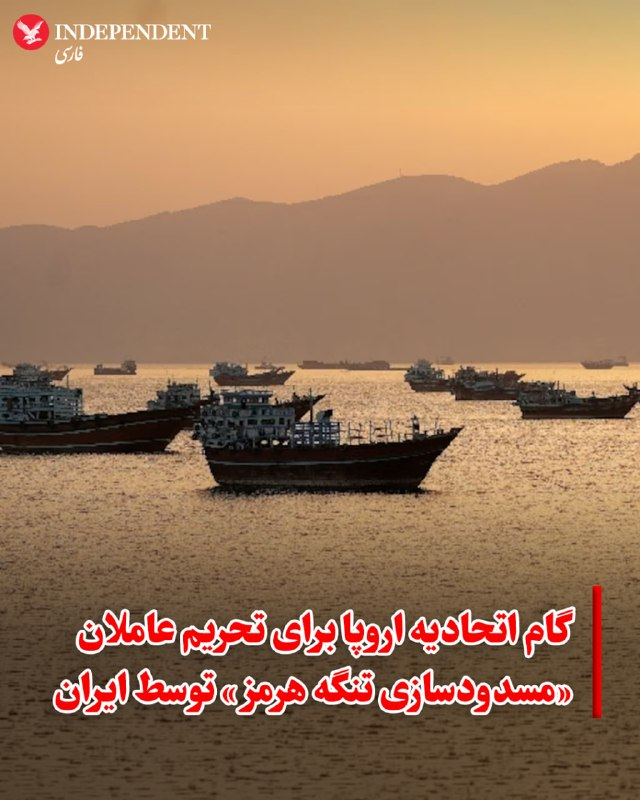
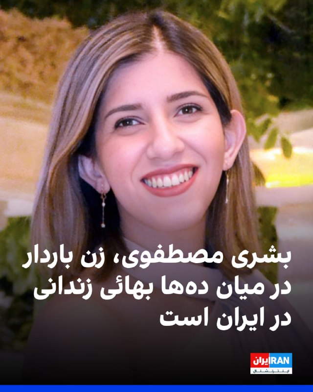
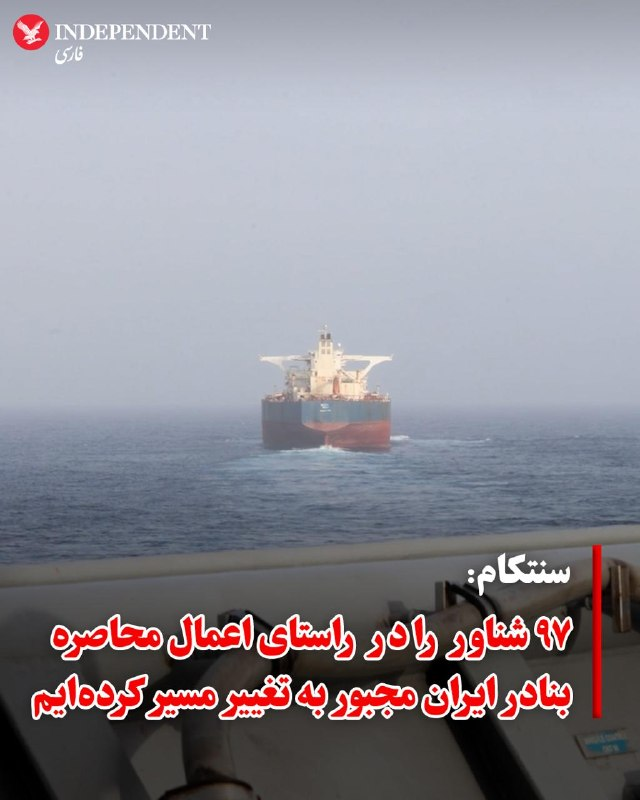
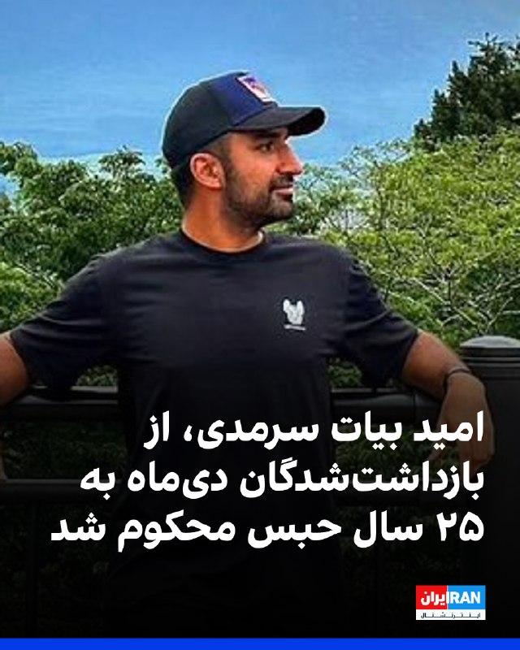
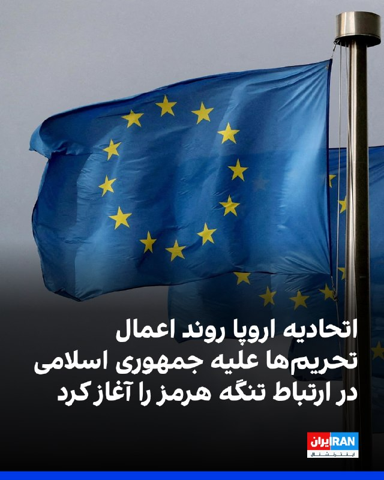
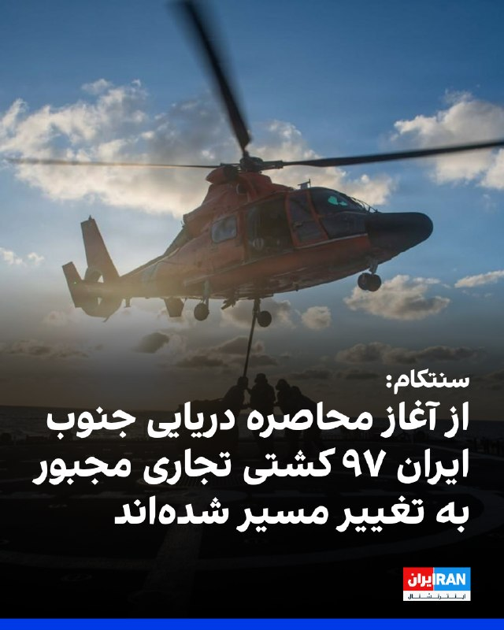
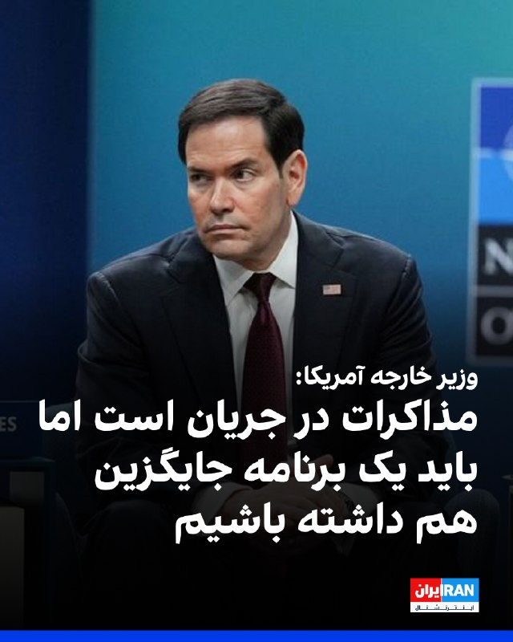
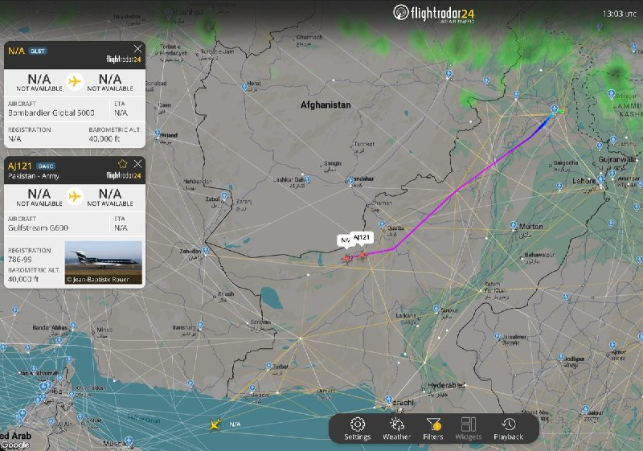
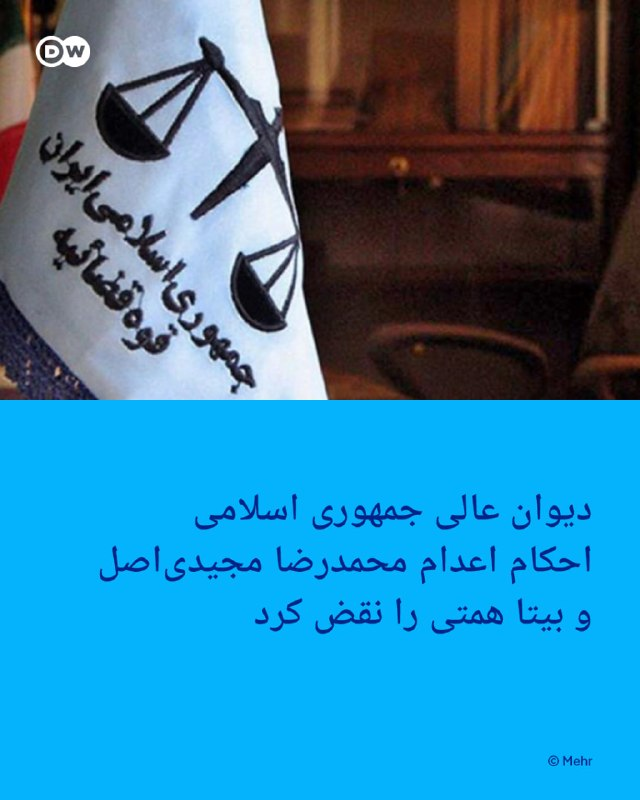
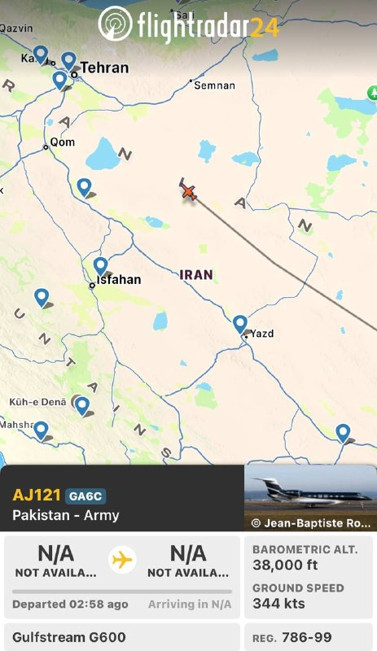

# خواننده تلگرام

<!-- TOP_NAV START -->

<a href="https://github.com/benyamin-najmi/aio-downloader/blob/main/telegram/content/archive_1.md" style="display:inline-block; padding:6px 12px; margin:0 4px; background-color:#2ea44f; color:white; text-decoration:none; border-radius:4px; font-weight:bold;">صفحه بعد</a>

<!-- TOP_NAV END -->

<!-- MSG START -->

---
📅 بروزرسانی: 1405/03/01 19:07
---

## VahidOOnLine — post 241544

  

دادستانی بریتانیا اعلام کرد مردی به دلیل مجموعه‌ای از تهدیدهای یهودستیزانه علیه اعضای جامعه یهودیان در شمال لندن، به پنج‌سال زندان محکوم شده است.

پیش‌تر بریتانیا سطح تهدید تروریسم در این کشور را از «قابل توجه» به «شدید» افزایش داده است.

کی‌یر استارمر، نخست‌وزیر بریتانیا، گفته است که یهودیان این کشور در ترس زندگی می‌کنند و وعده داد اقدامات برای حفاظت از آنان تقویت شود.
‌🏁 🇬🇧 IranintlTV

🤖 @VahidOOnLine

## VahidOOnLine — post 241543

  

اتحادیه اروپا اعلام کرد کشورهای عضو این اتحادیه جمعه روند اعمال تحریم علیه مقام‌های جمهوری اسلامی و دیگر افراد مرتبط با بستن تنگه هرمز را آغاز کردند.

شورای اتحادیه اروپا افزود که این اتحادیه از این پس می‌تواند در واکنش به اقداماتی که آزادی کشتیرانی در تنگه هرمز را مختل می‌کند، تحریم‌ها و محدودیت‌های بیشتری علیه جمهوری اسلامی اعمال کند.
‌🏁 🇬🇧 IranintlTV

🤖 @VahidOOnLine

## VahidOOnLine — post 241542

  

♦️ اتحادیه اروپا روز جمعه اول خرداد، اعلام کرد که کشورهای عضو این اتحادیه در حال حرکت به سمت اعمال تحریم علیه مقامات جمهوری اسلامی و سایر افرادی هستند که مسئول مسدود کردن تنگه هرمز شناخته می‌شوند.

دولت‌های اروپایی با «مغایر با قوانین بین‌المللی» دانستن این اقدام، گامی فنی برای گسترش دامنه رژیم تحریم‌های موجود علیه جمهوری اسلامی برداشته‌اند تا افراد بیشتری هدف قرار گیرند. شورای اروپا در این باره اعلام کرد: «اتحادیه اروپا اکنون قادر خواهد بود اقدامات تنبیهی بیشتری را در پاسخ به اقدامات ایران که آزادی کشتیرانی در تنگه هرمز را مخدوش می‌کند، اعمال کند.»

بسته شدن تنگه هرمز که به طور معمول یک‌پنجم تولید نفت جهان از آن عبور می‌کند، به همراه جنگ جاری، شوک شدیدی به اقتصاد جهانی وارد کرده و قیمت انرژی را به شدت افزایش داده است. تحریم‌های جدید که شامل ممنوعیت سفر و مسدود کردن دارایی‌ها خواهد بود، فراتر از تحریم‌های پیشین اتحادیه اروپا در زمینه‌های حقوق بشر و حمایت نظامی ایران از روسیه و گروه‌های منطقه‌ای است. هنوز نام افراد یا نهادهای هدف در این بسته تحریمی اعلام نشده است.
‌🇸🇦 Indypersian

🤖 @VahidOOnLine

## VahidOOnLine — post 241541

  <a href="telegram/content/VahidOOnLine_241541_1779464237.mp4" target="_blank">🎬 Download video</a>

اجمین مسیحی، جوان ۲۷ ساله ارمنی، شامگاه ۱۸ دی ۱۴۰۴ در میدان هفت‌حوض تهران هدف شلیک مستقیم گلوله جنگی قرار گرفت و کشته شد. پیکر او در بیمارستان الغدیر رها شد که در پی کارزار ایران‌اینترنشنال برای شناسایی جاویدنامان این بیمارستان، اطلاعات و تصاویری از او به دست ما رسیده است.
‌🏁 🇬🇧 IranintlTV

🤖 @VahidOOnLine

## VahidOOnLine — post 241540

  

♦️.منابع عالی‌رتبه دیپلماتیک در گفتگو با شبکه العربیه اعلام کردند در صورت دستیابی به توافق میان واشنگتن و تهران، گفتگوهای جامع و همه‌جانبه میان دو کشور در آینده و در یک بازه زمانی مشخص و تعیین‌شده برگزار می‌شود.

به گفته این منابع، سند توافق احتمالی که ممکن است میان دو طرف حاصل شود، یک متن یک‌صفحه‌ای خواهد بود که احتمالا «اعلامیه اسلام‌آباد» نام می‌گیرد و زمینه را برای مذاکرات تفصیلی بعدی فراهم می‌کند.

همزمان با اعلام این خبر از سوی العربیه، خبرگزاری فرانسه نیز به نقل از منابع خود تایید کرد که عاصم منیر، فرمانده کل ارتش پاکستان برای پیشبرد این گفتگوها به تهران سفر کرده است.
‌🇸🇦 Indypersian

🤖 @VahidOOnLine

## VahidOOnLine — post 241539

  <a href="telegram/content/VahidOOnLine_241539_1779464239.mp4" target="_blank">🎬 Download video</a>

♦️مراسم رژه نیروهای امنیتی حج برای سال ۱۴۰۵ (۱۴۴۷ هجری قمری) برگزار شد؛ رویدادی که با حضور مقامات ارشد عربستان از جمله وزیر کشور و رئیس کمیته عالی حج همراه بود.
در این مراسم تاکید شد که نیروهای امنیتی از سطح بالایی از آمادگی برخوردارند و در قالب یک منظومه امنیتی یکپارچه، ماموریت حفظ امنیت و سلامت زائران و تسهیل انجام مناسک حج را بر عهده دارند.
بر اساس برنامه‌ریزی‌ها، زائران روز سه‌شنبه آینده در عرفات وقوف خواهند داشت و آغاز عید قربان نیز روز چهارشنبه پیش‌بینی شده است.
‌🇸🇦 Indypersian

🤖 @VahidOOnLine

## VahidOOnLine — post 241538

  <a href="telegram/content/VahidOOnLine_241538_1779464240.mp4" target="_blank">🎬 Download video</a>

یک شهروند در پیامی به ایران اینترنشنال می‌پرسد که جوانان ایران چه گناهی کردند که باید تاوان «نسل ۵۷» در انقلاب را بدهند. پیام او با هوش مصنوعی خوانده شده است.
‌🏁 🇬🇧 IranintlTV

🤖 @VahidOOnLine

## VahidOOnLine — post 241537

  

یک منبع آگاه به رویترز گفت قطر در هماهنگی با ایالات متحده، یک تیم مذاکره‌کننده به تهران فرستاده است تا به تلاش‌ها برای دستیابی به توافقی برای پایان دادن به جنگ ایران کمک کند.

این منبع آگاه که نامش فاش نشده، گفت این تیم مذاکره‌کننده جمعه وارد تهران شد.

دوحه که در جنگ غزه و دیگر تنش‌های بین‌المللی نقش میانجی را ایفا کرده است، پس از آنکه در جریان درگیری‌های اخیر هدف حملات موشکی و پهپادی جمهوری اسلامی قرار گرفت، از ایفای نقش میانجی در جنگ ایران فاصله گرفته بود.
‌🏁 🇬🇧 IranintlTV

🤖 @VahidOOnLine

## VahidOOnLine — post 241536

  

محمدمهدی حسینی همدانی، امام جمعه کرج، با اشاره به تجمعات شبانه حامیان حکومت گفت: «وقتی که می‌دانیم حضور در این تجمعات دشمن را مایوس می‌کند، باید با هر کسوتی شرکت کرد و شرکت نکردن در آن ترک فعلی است که باید در محضر خدا نسبت به آن پاسخگو بود.»

او ادامه داد: «ما به خوبی فهمیدیم راهکار مقابله با دشمن ایستادگی و مقاومت است نه مذاکره و سازش. دشمن با مذاکره به زانو در نمی‌آید.»
‌🏁 🇬🇧 IranintlTV

🤖 @VahidOOnLine

## VahidOOnLine — post 241535

  

کامران غضنفری، نماینده تهران در مجلس، خطاب به مسعود پزشکیان گفت: «چرا بدون اجازه رهبری، آتش‌بس را پذیرفتید؟ اینکه رهبری در پیام‌های خود اشاره‌ای به آتش‌بس نمی‌کند، یعنی آن را قبول ندارد. همان‌طور که در ماجرای جنگ ۱۲ روزه بدون اجازه رهبری آتش‌بس را پذیرفتید و با این کار اسرائیل را از نابودی نجات دادید.»

او افزود: «این بار هم با پذیرش آتش‌بس آمریکا و اسرائیل را از زیر ضربات خردکننده موشک‌ها و پهپادهای ما نجات دادید.»
‌🏁 🇬🇧 IranintlTV

🤖 @VahidOOnLine

## VahidOOnLine — post 241534

  <a href="telegram/content/VahidOOnLine_241534_1779464244.mp4" target="_blank">🎬 Download video</a>

♦️مارکو روبیو، وزیر امور خارجه آمریکا، روز جمعه اول خرداد، در حاشیه نشست وزیران خارجه ناتو در هلسینبورگ سوئد، به تلاش جمهوری اسلامی برای وضع عوارض در تنگه هرمز واکنش نشان داد. او که در کنار مارک روته، دبیرکل ناتو به سوالات خبرنگاران پاسخ می‌داد، هشدار داد که این اقدام می‌تواند یک بدعت خطرناک جهانی ایجاد کند.

روبیو با تاکید بر اهمیت این مسیر دریایی گفت: «اگر چنین اتفاقی در تنگه هرمز رخ دهد، در پنج نقطه دیگر جهان نیز تکرار خواهد شد؛ چرا که کشورهای دیگر هم با خود می‌گویند ما هم می‌خواهیم این کار را بکنیم.»

وزیر خارجه آمریکا با حیاتی خواندن این تنگه برای تمام جهان، به‌ویژه منطقه اقیانوس‌های هند و آرام، ابراز امیدواری کرد که نشست جاری ثمربخش باشد و زمینه‌ساز دیدار رهبران در شش هفته آینده شود.
‌🇸🇦 Indypersian

🤖 @VahidOOnLine

## VahidOOnLine — post 241533

♦️مارکو روبیو، وزیر امور خارجه ایالات متحده، روز اول خردادماه در نشست وزرای خارجه ناتو در هلسینبورگ سوئد اعلام کرد که در گفتگوهای جاری درباره ایران «پیشرفت‌هایی هرچند محدود» حاصل شده، اما این تحولات نباید بزرگ‌نمایی شود.
او با تاکید بر موضع واشنگتن گفت: «ایران هرگز نباید به سلاح هسته‌ای دست پیدا کند» و افزود برای تحقق این هدف، مسائل مربوط به غنی‌سازی و ذخایر اورانیوم با غنای بالا باید به‌طور جدی مورد رسیدگی قرار گیرد.
روبیو همچنین به موضوع تنگه‌ها اشاره کرد ایران در تلاش برای ایجاد یک سیستم عوارض‌گیری در آبراه‌های بین‌المللی است و حتی سعی دارد عمان را نیز در این روند مشارکت دهد. به گفته او، چنین اقدامی از نظر آمریکا غیرقابل قبول است و نباید از سوی جامعه جهانی پذیرفته شود.
‌🇸🇦 Indypersian

🤖 @VahidOOnLine

## VahidOOnLine — post 241532

  

جامعه جهانی بهائی در بیانیه‌ای اعلام کرد بشری مصطفوی، زن باردار بهائی اهل رفسنجان، در میان ده‌ها شهروند بهائی است که هم‌زمان با تشدید کارزار بی‌رحمانه جمهوری اسلامی برای آزار و سرکوب بهائیان در ایران بازداشت و زندانی شده‌اند.

در این بیانیه آمده است از زمان آغاز درگیری‌های اخیر آمریکا و اسرائیل با جمهوری اسلامی، حدود ۸۰ شهروند بهائی در ایران بازداشت، دستگیر یا زندانی شده‌اند و بیش از ۴۰۰ مورد نقض حقوق بشر علیه بهائیان، از جمله یورش به خانه‌ها، مصادره اموال، بازداشت و محرومیت از دادرسی عادلانه ثبت شده است.

جامعه جهانی بهائی اعلام کرد بشری مصطفوی که پیش‌تر تبرئه شده بود، پس از نقض حکم در دادگاه تجدیدنظر، اکنون باید در دوران بارداری چهار ماه را در زندان کرمان بگذراند و درخواست‌های او برای مرخصی، از جمله برای مراجعه پزشکی و انجام آزمایش ضروری بارداری، رد شده است.

جامعه جهانی بهائی همچنین به اظهارات قاضی در جریان فرجام‌خواهی دادستان علیه حکم تبرئه مصطفوی اشاره کرد و آن را نشانه‌ای از نقش تعصبات مذهبی در آزار بهائیان دانست. به گفته این بیانیه، قاضی خطاب به او گفته بود: «شما بهائی هستید و در کشور اسلامی باید تاوان بهائی بودن خود را بدهید.»

در این بیانیه همچنین آمده است دیدار احمدی و ناهید نعیمی، دو زن بهائی که پیش‌تر همراه با مصطفوی بازداشت و سپس تبرئه شده بودند، از پنجم اردیبهشت دوران محکومیت خود را آغاز کرده‌اند و شکیلا قاسمی، زن ۲۶ ساله بهائی اهل کرمان، بیش از ۱۰۰ روز است در بازداشت به سر می‌برد.

این بیانیه همچنین به وضعیت پیوند نعیمی و برنا نعیمی اشاره کرده و از شکنجه، اعدام نمایشی و اعتراف‌گیری اجباری از این دو شهروند بهائی خبر داده است.
‌🏁 🇬🇧 IranintlTV

🤖 @VahidOOnLine

## VahidOOnLine — post 241531

  

سنتکام اعلام کرد از زمان آغاز محاصره دریایی جنوب ایران ۹۷ کشتی تجاری مجبور به تغییر مسیر شده و چهار کشتی نیز توسط نیروهای آمریکایی پس از حمله از کار افتاده‌اند.
پیش‌تر سنتکام اعلام کرده بود گروه رزمی ناو هواپیمابر آبراهام لینکلن در منطقه در بالاترین سطح آمادگی عملیاتی قرار دارد.
‌🏁 🇬🇧 IranintlTV

🤖 @VahidOOnLine

## VahidOOnLine — post 241530

  <a href="telegram/content/VahidOOnLine_241530_1779464247.mp4" target="_blank">🎬 Download video</a>

یک شهروند در پیامی به ایران اینترنشنال درباره تصاویر و گزارش‌های مربوط به پیکرهای جان‌باختگان اعتراضات دی‌ماه در حیاط پشت بیمارستان الغدیر تهران می‌گوید که این حیاط می‌تواند حیاط خانه هر یک از شهروندان باشد. پیام او با هوش مصنوعی خوانده شده است.
‌🏁 🇬🇧 IranintlTV

🤖 @VahidOOnLine

## VahidOOnLine — post 241529

  

مارکو روبیو، وزیر خارجه ایالات متحده، با اشاره به مذاکرات با جمهوری اسلامی گفت: «ما باید یک برنامه جایگزین هم داشته باشیم و برنامه جایگزین این است که اگر جمهوری اسلامی بگوید که ما تنگه‌ها را باز نمی‌کنیم، کنترل تنگه‌ها را در دست می‌گیریم و برای عبور از آن عوارض می‌گیریم چه؟ خب، در آن صورت باید کاری انجام شود.»

او ادامه داد: «در آن صورت، یک نفر باید اقدامی انجام دهد. یعنی در آن سناریو، قرار نیست ایران داوطلبانه تنگه‌ها را دوباره باز کند. پس باید از الان درباره‌اش فکر کنیم.»

روبیو افزود: «می‌دانم برنامه‌ای برای زمانی که درگیری‌ها متوقف شود وجود دارد؛ اما ما باید یک برنامه جایگزین هم برای حالتی داشته باشیم که هنوز تیراندازی ادامه دارد؛ اینکه در آن وضعیت چگونه می‌شود تنگه‌ها را دوباره باز کرد.»
‌🏁 🇬🇧 IranintlTV

🤖 @VahidOOnLine

## VahidOOnLine — post 241528

  

♦️ یک منبع آگاه روز جمعه اول خرداد، به خبرگزاری رویترز گفت که یک تیم مذاکره‌کننده قطری در هماهنگی با ایالات متحده وارد تهران شده است تا به دستیابی به توافقی برای پایان دادن به جنگ با ایران و حل‌وفصل مسائل باقی‌مانده کمک کند.

دوحه که پیش از این به عنوان میانجی در جنگ غزه و دیگر تنش‌های بین‌المللی نقش‌آفرینی کرده بود، تا پیش از این از ایفای نقش میانجی در جنگ ایران فاصله گرفته بود؛ چرا که در جریان مناقشات اخیر، خود هدف حملات موشکی و پهپادی ایران قرار گرفته بود.
‌🇸🇦 Indypersian

🤖 @VahidOOnLine

## VahidOOnLine — post 241527

  

♦️فرماندهی مرکزی ایالات متحده (سنتکام) روز جمعه اول خرداد، در شبکه اجتماعی ایکس اعلام کرد که ارتش آمریکا در جریان اجرای طرح محاصره بنادر ایران، تاکنون مسیر ۹۷کشتی را تغییر داده است.

 سنتکام در ادامه افزود نیروهای آمریکایی «برای تضمین پایبندی به این محاصره»، چهار شناور دیگر را نیز «زمین‌گیر و غیرفعال» کرده‌اند.
‌🇸🇦 Indypersian

🤖 @VahidOOnLine

## VahidOOnLine — post 241526

  

کاوه راد، وکیل دادگستری، در پستی اینستاگرامی خبر داد امید بیات سرمدی، از بازداشت‌شدگان اعتراضات دی‌ماه، از سوی دادگاه انقلاب تهران به ۲۵ سال حبس محکوم شده است.

امید بیات سرمدی، ۲۳ دی ۱۴۰۴، بازداشت و به زندان تهران بزرگ منتقل شده بود.

وکیل او اعلام کرده که حکم ۲۵ سال حبس، غیرقطعی و قابل فرجام‌خواهی در دیوان عالی کشور است.
‌🏁 🇬🇧 IranintlTV

🤖 @VahidOOnLine

## VahidOOnLine — post 241525

  <a href="telegram/content/VahidOOnLine_241525_1779464251.mp4" target="_blank">🎬 Download video</a>

هامبورگ؛ به‌مناسبت سالگرد ریزش ساختمان متروپل، جمعه اول خرداد ۱۴۰۵
‌🏁 🇬🇧 ManotoTV

🤖 @VahidOOnLine

## mwarmonitor — post 9479

📰 رویترز: بر اساس منابع مطلع، قطر یک هیئت مذاکره‌کننده به تهران اعزام کرده است که با هماهنگی ایالات متحده فعالیت می‌کند تا به دستیابی به توافقی برای پایان دادن به جنگ با ایران کمک کند.

@mwarmonitor

## mwarmonitor — post 9478

🔹نخست‌وزیر هلند، Rob Jetten، می‌گوید دولت هلند با اعمال ممنوعیت واردات کالاهایی که در شهرک‌های یهودی در سرزمین‌های فلسطینی تحت اشغال اسرائیل تولید می‌شوند موافقت کرده است.

@mwarmonitor

## mwarmonitor — post 9477

🔸وزیر خارجه اوکراین، Andrii Sybiha، می‌گوید مذاکرات میان روسیه که با میانجی‌گری آمریکا انجام می‌شود به‌تدریج به نقطه فرسودگی و بن‌بست نزدیک می‌شود.

@mwarmonitor

## mwarmonitor — post 9476

🔴رئیس سازمان جهانی بهداشت (WHO) می‌گوید هلند یک مورد جدید ابتلا به ویروس هانتا را در یکی از خدمه یک کشتی تأیید کرده است.

@mwarmonitor

## mwarmonitor — post 9475

  

🔴رسانه‌های ایرانی به نقل از یک منبع دیپلماتیک در اسلام‌آباد: فرمانده ارتش پاکستان به ایران سفر کرده است. @mwarmonitor

## mwarmonitor — post 9474

🛸مرحله دوم از افشای پدیده‌های ناشناخته هوایی (UAP) توسط وزارت دفاع آمریکا منتشر شده است که شامل ۵.۶ گیگابایت ویدئو و بیش از ۷۰ مگابایت اسناد طبقه‌بندی‌زدایی‌شده می‌شود.

@mwarmonitor

## mwarmonitor — post 9473

🔴رسانه‌های ایرانی به نقل از یک منبع دیپلماتیک در اسلام‌آباد: فرمانده ارتش پاکستان به ایران سفر کرده است.

@mwarmonitor

## pm_afshaa — post 91211

🔴2000 ساعت از قطع اینترنت مردم ایران توسط جمهوری اسلامی گذشت

💧 Rainbet.com the #1 Non-KYC Crypto Casino & Sportsbook @rainbetcom

😁 @Pm_Afshaa

## pm_afshaa — post 91210

  <a href="telegram/content/pm_afshaa_91210_1779464253.webm" target="_blank">🎬 Download video</a>

🔴حسینی همدانی، امام جمعه کرج:
هرکسی که در تجمعات شبانه شرکت نمیکنه، باید در محضر خدا پاسخگو باشه.

💧 Rainbet.com the #1 Non-KYC Crypto Casino & Sportsbook @rainbetcom

😁 @Pm_Afshaa

## pm_afshaa — post 91209

🔴نورمن، خبرنگار وال استریت ژورنال : یه منبع میگه هر چیزی درباره پیش‌نویس توافقی که داره می‌چرخه، دروغه و صحت نداره

💧 Rainbet.com the #1 Non-KYC Crypto Casino & Sportsbook @rainbetcom

😁 @Pm_Afshaa

## pm_afshaa — post 91208

  <a href="telegram/content/pm_afshaa_91208_1779464253.webm" target="_blank">🎬 Download video</a>

🔴العربیه: عاصم ملک، رئیس سازمان اطلاعات پاکستان هم عازم تهران شد.

💧 Rainbet.com the #1 Non-KYC Crypto Casino & Sportsbook @rainbetcom

😁 @Pm_Afshaa

## pm_afshaa — post 91207

🔴پوتین: اوکراین یک خوابگاه دانشجویی را هدف قرار داد و 15 نفر مفقود شده‌اند، شش نفر کشته و 39 نفر دیگر زخمی شدن

💧 Rainbet.com the #1 Non-KYC Crypto Casino & Sportsbook @rainbetcom

😁 @Pm_Afshaa

## pm_afshaa — post 91206

🔴اختلال گسترده Gps در تنگه هرمز ، عربستان ، اسرائیل ، اردن ، سوریه ، عراق ، ایران

💧 Rainbet.com the #1 Non-KYC Crypto Casino & Sportsbook @rainbetcom

😁 @Pm_Afshaa

## pm_afshaa — post 91204

🔴مارک لوین:زمان نابودی رژیم ایران فرا رسیده است. بیایید کار را تمام کنیم، بگذارید کار را به انجام برسانیم

💧 Rainbet.com the #1 Non-KYC Crypto Casino & Sportsbook @rainbetcom

😁 @Pm_Afshaa

## pm_afshaa — post 91203

🔴آکسیوس:نتانیاهو بزرگ ترین عامل برای عدم توافق بین دو کشور است

💧 Rainbet.com the #1 Non-KYC Crypto Casino & Sportsbook @rainbetcom

😁 @Pm_Afshaa

## pm_afshaa — post 91202

  <a href="telegram/content/pm_afshaa_91202_1779464254.webm" target="_blank">🎬 Download video</a>

🔴اکسیوس: واسطه‌ها در تلاش برای نهایی‌سازی یک تفاهم‌نامه هستن که شامل توافق برای پایان جنگ و اصولی برای 30 روز مذاکره بر سر یک توافق گسترده‌تره که به برنامه هسته‌ای ایران نیز بپردازه.

پاکستان، قطر، عربستان، مصر و ترکیه همگی در میانجیگری مشارکت داشتن.

💧 Rainbet.com the #1 Non-KYC Crypto Casino & Sportsbook @rainbetcom

😁 @Pm_Afshaa

## pm_afshaa — post 91201

  <a href="telegram/content/pm_afshaa_91201_1779464254.webm" target="_blank">🎬 Download video</a>

🔴روبیو، وزیر خارجه آمریکا: عاصم‌ منیر برای میانجی گری راهی تهرانه و ما در بالاترین رده‌های سیاسی با او در ارتباط هستیم.

💧 Rainbet.com the #1 Non-KYC Crypto Casino & Sportsbook @rainbetcom

😁 @Pm_Afshaa

## pm_afshaa — post 91200

🔴بلومبرگ:حمله به نیروگاه هسته‌ای امارات متحده عربی، نگرانی‌ها در مورد انتقام‌جویی ایران و افزایش نقش گروه‌های نیابتی آن در عراق را افزایش داد

💧 Rainbet.com the #1 Non-KYC Crypto Casino & Sportsbook @rainbetcom

😁 @Pm_Afshaa

## pm_afshaa — post 91198

  <a href="telegram/content/pm_afshaa_91198_1779464255.webm" target="_blank">🎬 Download video</a>

🔴مارکو روبیو، وزیر خارجه آمریکا:
باید تنگه هرمز کامل باز و آزاد باشه و ایران به طور کامل قید برنامه هسته‌ای رو بزنه!

💧 Rainbet.com the #1 Non-KYC Crypto Casino & Sportsbook @rainbetcom

😁 @Pm_Afshaa

## pm_afshaa — post 91197

یه هیئت قطری و ‌پاکستانی دارن میان تهران بله رو از عروس خانوم بگیرن

## pm_afshaa — post 91196

  <a href="telegram/content/pm_afshaa_91196_1779464255.webm" target="_blank">🎬 Download video</a>

🔴وال استریت ژورنال: ترامپ درحال بررسی امکان تکیه بر گروه‌های مخالف مسلح ایرانی، از جمله جناح‌های کرد، در صورت اقدام مسلحانه اونا برعلیه دولت تهرانه.

💧 Rainbet.com the #1 Non-KYC Crypto Casino & Sportsbook @rainbetcom

😁 @Pm_Afshaa

## pm_afshaa — post 91195

  <a href="telegram/content/pm_afshaa_91195_1779464256.webm" target="_blank">🎬 Download video</a>

🔴رویترز به نقل از منابع آگاه:
قطر با هماهنگی آمریکا تیم مذاکره کننده‌ای رو برای کمک به دستیابی به توافق برای پایان جنگ با ایران به تهران اعزام کرده.

💧 Rainbet.com the #1 Non-KYC Crypto Casino & Sportsbook @rainbetcom

😁 @Pm_Afshaa

## pm_afshaa — post 91194

  <a href="telegram/content/pm_afshaa_91194_1779464256.webm" target="_blank">🎬 Download video</a>

🔴اکسیوس: فرمانده ارتش پاکستان عاصم منیر، در تلاش برای بستن توافقنامه بین آمریکا و ایران و پایان جنگ، راهی تهران شد.

💧 Rainbet.com the #1 Non-KYC Crypto Casino & Sportsbook @rainbetcom

😁 @Pm_Afshaa

## pm_afshaa — post 91193

  <a href="telegram/content/pm_afshaa_91193_1779464257.webm" target="_blank">🎬 Download video</a>

🔴2 هواپیمای دولتی پاکستان از اسلام‌آباد، حرکت کرده و در مسیر تهران هستن.

💧 Rainbet.com the #1 Non-KYC Crypto Casino & Sportsbook @rainbetcom

😁 @Pm_Afshaa

## pm_afshaa — post 91192

  <a href="telegram/content/pm_afshaa_91192_1779464258.webm" target="_blank">🎬 Download video</a>

🔴وزیر نیروی دریایی ارتش آمریکا: دولت ترامپ فروش تسلیحات به ارزش 14 میلیارد دلار به تایوان رو متوقف کرد تا مهمات ایالات متحده رو برای جنگ با ایران حفظ کنه.

💧 Rainbet.com the #1 Non-KYC Crypto Casino & Sportsbook @rainbetcom

😁 @Pm_Afshaa

## pm_afshaa — post 91191

  <a href="telegram/content/pm_afshaa_91191_1779464258.webm" target="_blank">🎬 Download video</a>

🔴یک منبع دیپلماتیک در اسلام‌آباد به خبرنگار ایرنا: عاصم منیر، فرمانده ارتش پاکستان راهی ایران خواهد شد و قراره با مقامات بلندپایه جمهوری اسلامی دیدار کنه و پیامی رو آمریکا به ایران منتقل کنه. 
💧 Rainbet.com the #1 Non-KYC Crypto Casino & Sportsbook @rainbetcom…

## pm_afshaa — post 91190

  <a href="telegram/content/pm_afshaa_91190_1779464258.webm" target="_blank">🎬 Download video</a>

🔴یک منبع دیپلماتیک در اسلام‌آباد به خبرنگار ایرنا: عاصم منیر، فرمانده ارتش پاکستان راهی ایران خواهد شد و قراره با مقامات بلندپایه جمهوری اسلامی دیدار کنه و پیامی رو آمریکا به ایران منتقل کنه.

💧 Rainbet.com the #1 Non-KYC Crypto Casino & Sportsbook @rainbetcom

😁 @Pm_Afshaa

## DEJradio — post 4849

  <a href="telegram/content/DEJradio_4849_1779464259.mp4" target="_blank">🎬 Download video</a>

🚨
🔸 پرتوی دیگر، به میزبانی کیهان لندن؛
آدینه ساعت ۱۹:۳۰ به‌وقت ایران

#پرتوی_دیگر
@DEJradio

## DEJradio — post 4848

⭕️ آمریکا سفیر اخراجی جمهوری اسلامی در لبنان و ۸ فرد مرتبط با حزب‌الله را تحریم کرد

وزارت خزانه‌داری آمریکا ۹ تن از جمله محمدرضا شیبانی رئوف، سفیر معرفی‌شدۀ جمهوری اسلامی در لبنان را تحریم کرد.
واشینگتن می‌گوید این افراد در روند صلح لبنان مانع‌تراشی کرده و از خلع سلاح حزب‌الله جلوگیری کرده‌اند.
آمریکا همچنین اعلام کرد برخی افراد تحریم‌شده، از مقام‌های لبنانی همسو با حزب‌الله در پارلمان، ارتش و نهادهای امنیتی‌اند.
اسکات بسنت، وزیر خزانه‌داری آمریکا، گفت حزب‌الله یک سازمان تروریستی است و باید کاملاً خلع سلاح شود.
اعتبارنامۀ سفیر معرفی‌شدۀ جمهوری اسلامی، پیش‌تر در لبنان رد شده بود و او ناچار به بازگشت به تهران شد.

#تحریم
@DEJradio

## DEJradio — post 4847

⭕️ آمریکا فروش تسلیحات به تایوان را به دلیل جنگ با جمهوری اسلامی کاهش داد

رویترز به نقل از یک مقام ارشد آمریکایی گزارش داد واشینگتن برای تأمین مهمات مورد نیاز جنگ علیه جمهوری اسلامی، به‌طور موقت در روند فروش تسلیحات به تایوان وقفه ایجاد کرده است.
هانگ کائو، سرپرست وزارت نیروی دریایی آمریکا گفت ایالات متحده می‌خواهد مطمئن شود مهمات کافی برای عملیات علیه جمهوری اسلامی، در اختیار دارد.
او تأکید کرد فروش‌ تجهیزات نظامی به کشورهای خارجی، تا هر زمان که دولت آمریکا لازم بداند ادامه می‌یابد.

#جنگ
@DEJradio

## DEJradio — post 4846

🌐 
🚨 قطعی سراسری اینترنت در ایران وارد هشتادوچهارمین روز شد

نت‌بلاکس اعلام کرد قطعی گستردۀ اینترنت در ایران وارد هشتادوچهارمین روز شده و شبکه‌های بین‌المللی عملا بیش از ۱۹۹۲ ساعت از دسترس عموم مردم خارج شده‌اند.
این نهاد جهانی پایش اینترنت هشدار داد که با ادامۀ خاموشی دیجیتال، شکاف‌های اقتصادی و اجتماعی در ایران عمیق‌تر شده و ارتباط با جهان خارج به دسترسی‌های محدود و گزینشی وابسته است.
بنا بر گزارش‌ها فروشگاه‌های آنلاین داخلی با سقوط درحدود هشتاد درصدی در فروش مواجه‌اند.
ناظران می‌گویند این مسئله بیشترین فشار را بر کسب‌وکارهای کوچک وارد کرده است.
جمهوری اسلامی دسترسی محدود به اینترنت جهانی را تنها برای برخی نهادها، سازمان‌ها و هواداران حکومت فراهم کرده است.

#اینترنت
@DEJradio

## DEJradio — post 4845

⭕️ یک مقام دولتی گفت دوازده درصد از آب کشور در شبکۀ فرسوده هدر می‌رود

هاشم امینی، مدیرعامل شرکت مهندسی آب و فاضلاب ایران، اعلام کرد ۱۲ درصد از آب ایران به علت فرسودگی شبکۀ انتقال و توزیع در کشور هدر می‌رود. به گفتۀ این مقام دولتی، بودجۀ کافی برای کاهش این تلفات وجود ندارد.
هاشم امینی به خبرگزاری ایرنا گفت کاهش تنها یک درصد از هدررفت آب، سالانه حدود ۲۱ همت اعتبار نیاز دارد. به گفتۀ او این رقم با افزایش تورم همچنان بالاتر می‌رود.
امینی افزود در هر شهر و روستا باید سالانه حدود ۱۰ درصد از شبکه‌های فرسوده بازسازی شود، اما محدودیت منابع مالی مانع تحقق این هدف است.
بر اساس آمار رسمی، مصرف آب شرب ایران درحدود ۹ میلیارد متر مکعب در سال است.
این در حالی است که تنها نیمی از خانوارهای شهری به شبکۀ فاضلاب متصل‌اند. از سویی تنها یک‌پنجم از فاضلاب تولیدی تصفیه و بازیافت می‌شود.
طبق ارزیابی‌های بین‌المللی، ایران از نظر تنش آبی در رتبۀ سیزدهم دنیا قرار دارد.

#آب #ایران
@DEJradio

## DEJradio — post 4844

⭕️ ارتش اسرائیل: پنج عضو حزب‌الله در جنوب لبنان کشته شدند

ارتش اسرائیل اعلام کرد پنج عضو حزب‌الله لبنان را پس از ورود به یک مرکز فرماندهی متعلق به این گروه در جنوب لبنان هدف گرفته است.
شبه‌نظامیان حزب‌الله در سیاهۀ تروریستی اتحادیۀ اروپا و ایالات متحده قرار دارند.
بر پایۀ بیانیۀ ارتش اسرائیل، این افراد روز پنج‌شنبه در مناطق جنوبی لبنان شناسایی و در پی حملۀ هوایی کشته شدند. این مناطق تحت کنترل شبه‌نظامیان حزب‌الله قرار دارد.
ارتش اسرائیل همچنین اعلام کرد در ساعت گذشته، انبارهای تسلیحاتی حزب‌الله و دیگر زیرساخت‌های تروریستی را هدف گرفته است. در پی این حملات و چندین عضو دیگر حزب‌الله حذف شدند.
صبح آدینه اول خرداد نیز ارتش اسرائیل خبر داد دو فرد مسلح مشکوک را پیش از نزدیک شدن به مرز این کشور با لبنان هدف قرار داده است.

#اسرائیل #حزب‌الله
@DEJradio

## DEJradio — post 4843

⭕️ مشاور رئیس امارات گفت تهران ممکن است از هر سلاحی که در دست داشته باشد استفاده کند

انور قرقاش، مشاور دیپلماتیک رئیس امارات متحدۀ عربی گفت رژیم حاکم بر ایران نشان داد قادر است از هر سلاحی که در اختیار دارد، استفاده کند.
او از کشورهای اروپایی خواست بحران تنگۀ هرمز را نه یک مشکل دوردست، بلکه مسئله‌ای مرتبط با انرژی و تجارت خود بدانند.
قرقاش روز آدینه در نشست امنیتی گلوبسک در پراگ، گفت هرگونه کنترل بر تنگۀ هرمز سابقه‌ای خطرناک ایجاد می‌کند. به گفتۀ او این موضوع در دست جمهوری اسلامی به یک ابزار سیاسی تبدیل می‌شود.
مشاور ارشد حاکم امارات افزود شانس دستیابی تهران و واشینگتن برای دستیابی به توافقی که به باز شدن تنگۀ هرمز منجر شود «پنجاه به پنجاه» است.
او گفت مقام‌های جمهوری اسلامی در سال‌های پیشین بارها توان و اهرم‌های قدرت خود را بیش از اندازۀ واقعی برآورد کردند.
مشاور رئیس امارات از سویی هشدار داد که برنامۀ هسته‌ای جمهوری اسلامی، اکنون به نخستین نگرانی ابوظبی تبدیل شده است.
او تأکید کرد امارات خواهان راه‌حل سیاسی است، اما نگران است که هر توافقی بدون حل ریشه‌ای بحران، به پیچیدگی‌های تازه در منطقه منجر شود.
قرقاش خطاب به مقامات غربی گفت اروپا باید بحران تنگۀ هرمز را مسئله خود بداند.

#امارات #جمهوری_اسلامی
@DEJradio

## DEJradio — post 4842

⭕️ روبیو: باجگیری جمهوری اسلامی در تنگۀ هرمز غیرقابل قبول است

مارکو روبیو، وزیر امور خارجۀ آمریکا، روز آدینه هشدار داد که اجرای هرگونه سیستم عوارض‌گیری از سوی جمهوری اسلامی در تنگۀ هرمز، غیرقابل پذیرش است.
روبیو پیش از نشست ناتو در هلسینگبورگ سوئد گفت این پیمان باید برای همۀ اعضای آن مفید باشد.
وزیر امور خارجۀ آمریکا تأکید کرد ناتو به‌سان هر ائتلافی، باید برای همۀ کسانی که در آن حضور دارند، خوب باشد.
روبیو پیش‌تر گفته بود دونالد ترامپ از برخی اعضای ناتو که اجازۀ استفاده از پایگاه‌هایشان برای جنگ علیه جمهوری اسلامی را نداده‌اند، «بسیار ناامید» است. او به‌طور مشخص از اسپانیا نام برده بود.

#مارکو_روبیو #تنگه_هرمز
@DEJradio

## DEJradio — post 4841

⭕️ مارک لوین: وقت نابودی جمهوری اسلامی است

مارک لوین، مفسر محافظه‌کار آمریکایی در شبکۀ اکس نوشت: وقت نابودی رژیم حاکم بر ایران است. بیایید کار را تمام کنیم.
این مجری و مفسر برجسته افزود: زمان دارد از دست می‌رود.
مارک لوین از چهره‌های نزدیک به جریان جمهوری‌خواه آمریکا است. لوین از حامیان سرسخت دونالد ترامپ و سیاست فشار حداکثری او علیه جمهوری اسلامی، به شمار می‌رود.

#جمهوری_اسلامی
@DEJradio

## DEJradio — post 4840

⭕️ خط قرمز آمریکا توقف غنی‌سازی و مهار جمهوری اسلامی است

لیندزی گراهام، سناتور جمهوری‌خواه آمریکا گفت دونالد ترامپ همچنان تأکید دارد که جمهوری اسلامی نباید اورانیوم‌ با غنای بالا را درون کشور نگه دارد.
او گفت این مواد می‌تواند برای ساخت «بمب کثیف» یا در آینده برای تولید سلاح هسته‌ای استفاده شود.
لیندزی گراهام افزود ترامپ همچنان بر جلوگیری کامل از دستیابی جمهوری اسلامی به سلاح هسته‌ای پافشاری می‌کند.
این سیاستمدار نزدیک به رئیس جمهوری آمریکا تأکید کرد بدون قابلیت غنی‌سازی، هیچ راهی برای دستیابی به سلاح هسته‌ای وجود ندارد.

#ترامپ #اورانیوم
@DEJradio

## DEJradio — post 4839

  <a href="telegram/content/DEJradio_4839_1779464260.webm" target="_blank">🎬 Download video</a>

🔺📢 رودرویی سـ.ـپاه و ارتش بعد از جنگ

*شهاب عنایتی، پرسنل پیشین نیروی هوایی

#جنگ #IRGCterrorists
@DEJradio

## DEJradio — post 4838

⭕️جمهوری اسلامی امکان جایگزینی سریع موشک‌های پیشرفته را ندارد

کامرون چل، مدیرعامل شرکت دراگان‌فلای، گزارش‌ها دربارۀ بازسازی سریع توان موشکی جمهوری اسلامی را زیر سؤال برد. او گفت توان تولید موشک در ایران در پی حملات اخیر آمریکا و اسرائیل به‌شدت آسیب دیده است.
این کارشناس دفاعی به فاکس‌نیوز گفت بسیار بعید است که جمهوری اسلامی بتواند انبار موشک‌های ماورای صوت یا کروز را در کوتاه‌مدت دوباره پر کند.
کامرون چل افزود ساخت این سلاح‌ها بسیار دشوار است و به تأسیساتی پیشرفته‌ نیاز دارد که بیشتر آن‌ها هدف حملات آمریکا قرار گرفته‌ است.
او همچنین گفت دسترسی جمهوری اسلامی به قطعات و تجهیزات مورد نیاز این سامانه‌ها اکنون بسیار سخت‌تر از پیش است.

#جمهوری_اسلامی #موشک
@DEJradio

## mamlekate — post 103566

📝 نماینده مجلس: با تصمیم نهادهای بالادستی، فعلاً نیاز به باز کردن اینترنت وجود ندارد

نایب‌رئیس کمیسیون فرهنگی مجلس شورای اسلامی می‌گوید بر اساس تصمیم «نهادهای بالادستی، فعلاً نیازی به باز کردن اینترنت وجود ندارد» و مدعی شد دلیل آن «خطرات امنیتی و تهدید شخصیت‌ها و کشور» است.

@mamlekate

## mamlekate — post 103565

📝 گزارش وال‌استریت جورنال از «کمک» بابک زنجانی به انتقال میلیون‌ها دلار پول برای ایران

وال‌استریت جورنال از استفاده گسترده حکومت ایران از صرافی دیجیتال بایننس و با کمک شبکۀ مالی بابک زنجانی خبر داد. این روزنامه می‌گوید این تراکنش‌ها تا همین اواخر ادامه داشته است.

@mamlekate

## VahidOnline — post 75621

🔴بنیاد عبدالرحمن برومند تا کنون ۶۵۵ مورد اعدام را در سال ۲۰۲۶ ثبت کرده است، که ۳۴ مورد که از آغاز ماه می تاکنون اجرا شده است.. آمار واقعی احتمالاً بسیار بیشتر از این رقم است. جمهوری اسلامی در حالی این اعدام‌ها را پشت درهای بسته اجرا می‌کند که ۸۳ روزه است که اینترنت کشور قطع شده است. حاکمیت با قطع ارتباط جامعه از ۹ اسفند ۱۴۰۴ صدای زندانیان، خانواده‌ها و شاهدان عینی را به شدت سرکوب کرده و نظارت مستقل بر وضعیت حقوق بشر را به‌طور خاص دشوار ساخته است.

🔸از آنجا که دستگاه قضایی همواره تنها بخش کوچکی از احکام مرگ خود را به‌طور رسمی اعلام می‌کند، قطع اینترنت داده‌های فعلی را به شدت محدود به منابع دولتی ایران کرده است. بنابراین کاهش در آمارهای ثبت‌شده، تنها نشان‌دهنده خفقان اطلاعاتی است، نه کاهش کشتار.
#نه_به_اعدام
@IranRights

## VahidOnline — post 75620

  

دختر حسین ناصری: MNaseri23595

📡 @VahidOnline

## VahidOnline — post 75619

  

به گزارش رسانه‌های دولتی پاکستان، فیلد مارشال عاصم منیر،‌ فرمانده ارتش این کشور راهی تهران شده است.

خبرگزاری اسوشیتد پرس پاکستان به نقل از منابع امنیتی گزارش داده است که فیلد مارشال عاصم منیر در طول این سفر رسمی، درباره «مذاکرات جاری ایران و آمریکا و صلح و ثبات منطقه‌ و منافع دوجانبه دیگر» با مقام‌های ایران گفت‌و‌گو خواهد کرد.

فرمانده ارتش پاکستان چهل روز پیش هم در تهران بود و با محمدباقر قالیباف و اعضای تیم مذاکره‌ ایران و آمریکا دیدار و گفت‌وگو کرده بود.

این در حالی است که وزیر کشور پاکستان هم برای دومین بار طی هفته اخیر به تهران رفته و در حال گفت‌وگو با مقامات ایرانی است.
@VahidHeadline

📡 @VahidOnline

## VahidOnline — post 75614

  <a href="telegram/content/VahidOnline_75614_1779464262.mp4" target="_blank">🎬 Download video</a>

مارکو روبیو، وزیر خارجه آمریکا، در حاشیه نشست ناتو درباره مذاکرات جاری با جمهوری اسلامی گفت که واشینگتن در انتظار نتایج گفت‌وگوهای در حال انجام است؛ گفت‌وگوهایی که به گفته او نشانه‌هایی از پیشرفت داشته‌اند.
او افزود: «ما در انتظار نتایج این گفت‌وگوها هستیم که نشانه‌هایی از پیشرفت دارد. نمی‌خواهم در این باره اغراق کنم؛ تحرک محدودی صورت گرفته و این مثبت است، اما اصول اساسی تغییری نکرده است.»
وزیر خارجه آمریکا تاکید کرد که حکومت ایران هرگز نباید به سلاح هسته‌ای دست یابد و گفت: «برای تحقق این هدف، باید به مسئله غنی‌سازی و نیز موضوع اورانیوم با غنای بالا رسیدگی کنیم و افزون بر آن، موضوع تنگه هرمز را نیز مد نظر قرار دهیم.»
@VahidOOnLine
مارکو روبیو، وزیر خارجه آمریکا، جمعه یکم خرداد در حاشیه نشست ناتو گفت جمهوری اسلامی در پی ایجاد نظامی اختصاصی برای اخذ عوارض در یک آبراه بین‌المللی است و تلاش می‌کند عمان را نیز به پیوستن به این سازوکار متقاعد کند. روبیو تاکید کرد که این اقدام «غیرقابل قبول» است.
او افزود: «هیچ کشوری در جهان نباید چنین چیزی را بپذیرد. من کشوری را نمی‌شناسم که جز ایران از آن حمایت کند.»
روبیو با اشاره به تحرکات دیپلماتیک در سازمان ملل متحد گفت قطعنامه‌ای با پیشنهاد بحرین در شورای امنیت مطرح شده که آمریکا در آن نقش فعالی داشته و به گفته او، بیشترین تعداد هم‌پیشنهاددهنده را در تاریخ شورای امنیت دارد. او هشدار داد چند کشور در حال بررسی وتوی این قطعنامه هستند و افزود: «این مایه تاسف خواهد بود.»
وزیر خارجه آمریکا تاکید کرد واشینگتن برای دستیابی به اجماع جهانی جهت جلوگیری از اجرای چنین طرحی تلاش می‌کند و گفت: «باید دید آیا سازمان ملل همچنان کارآمد است یا نه. ما می‌کوشیم از این مسیر به نتیجه برسیم.»
او تصریح کرد اگر اخذ عوارض در تنگه هرمز اجرایی شود، ممکن است در دیگر آبراه‌های مهم جهان نیز تکرار شود و افزود: «این قابل قبول نیست و نمی‌تواند رخ دهد.»
روبیو با اشاره به اهمیت تنگه هرمز گفت این آبراه برای کشورهای حاضر در نشست و نیز برای دیگر کشورها، به‌ویژه در منطقه هند-آرام، حیاتی است.
او در پایان با ابراز امیدواری نسبت به نتایج نشست ناتو گفت این دیدار زمینه را برای نشست رهبران در حدود شش هفته آینده فراهم خواهد کرد و افزود که تا آن زمان کارهای زیادی پیش رو است.
@VahidOOnLine
مارکو روبیو، وزیر خارجه آمریکا، پس از نشست ناتو در سوئد درباره مذاکرات با تهران گفت: «همه ما دوست داریم توافقی با ایران شکل بگیرد که در آن تنگه‌ها باز باشند و ایران از جاه‌طلبی‌های هسته‌ای خود دست بردارد.»
او افزود: «این چیزی است که همه ما امیدواریم و همچنان برایش تلاش خواهیم کرد و همین حالا هم که با شما صحبت می‌کنم، کار و مذاکرات در این زمینه ادامه دارد.»
وزیر خارجه آمریکا با اشاره به این که باید یک «برنامه جایگزین» هم وجود داشته باشد، گفت که برنامه جایگزین در صورتی باید عملی شود که حکومت ایران از باز کردن تنگه‌ هرمز خودداری کند.
او گفت: «پس باید از الان درباره‌اش فکر کنیم. من امروز این موضوع را مطرح کردم. واکنش‌های تاییدآمیز زیادی دیدم. اما هنوز چیزی برای اعلام رسمی درباره اقدام مشخصی که در حال انجام باشد نداریم.»
وزیر خارجه آمریکا درباره برنامه جایگزین در صورت امتناع جمهوری اسلامی از بازگشایی تنگه هرمز افزود: «نمی‌دانم لزوما این می‌تواند ماموریت ناتو باشد یا نه، اما قطعا کشور‌های عضو ناتو می‌توانند در آن مشارکت کنند.»
@VahidOOnLine

📡 @VahidOnline

## VahidOnline — post 75611

اطلاعیه منوتو درباره پایان پخش برنامه‌ها
@VahidOOnLine

📡 @VahidOnline

## VahidOnline — post 75607

  <a href="telegram/content/VahidOnline_75607_1779464262.mp4" target="_blank">🎬 Download video</a>

فیلم مستند «تمرین‌هایی برای یک انقلاب»، ساخته پگاه آهنگرانی جایزه «چشم طلایی» هفتاد و نهمین جشنواره فیلم کن را از آن خود کرد.

 «لوئی دور» یا چشم طلایی، مهم‌ترین جایزه بخش مستند جشنواره فیلم کن است.
 پگاه آهنگرانی جایزه‌اش را به مردم ایران تقدیم کرد و گفت: «(مردم ایران) با وجود تمام سرکوب‌هایی که در طول این سال‌ها تحمل کرده‌اند، هرگز از تلاش برای حقوقشان، آزادی‌شان و آرزوهایشان دست نکشیده‌‌اند و مطمئنم که آنها هرگز تسلیم نخواهند شد. مطمئنم و یک آرزو دارم که می‌خواهم اینجا بگویم: این‌که روزی دختر کوچکم لی‌لی و همه بچه‌های ایران در آینده‌ای نزدیک در ایرانی آزاد و دموکراتیک زندگی کنند.»

به گفته خانم آهنگرانی او با استفاده از آرشیوهای شخصی، ویدئوهای خانگی، تصاویر اعتراضات خیابانی، روزنامه‌ها و صداهای ضبط‌ شده، بیش از ۴۰ سال از تاریخ ایران را بازخوانی ‌کرده است.
@VahidHeadline

📡 @VahidOnline

## VahidOnline — post 75606

  

کشورهای عرب حوزه خلیج فارس از جامعه جهانی خواستند که طرح جمهوری اسلامی برای مدیریت تنگه هرمز را رد کنند.

به گزارش بلومبرگ، در میانه مذاکرات دیپلماتیک سازمان بین‌المللی دریانوردی با ایران و عمان پیرامون بازگرداندن آزادی تردد و امنیت کامل کشتیرانی در این آبراه راهبردی، کشورهای عرب حوزه خلیج فارس طی نامه‌های به اعضای این نهاد زیرمجموعه سازمان ملل، نسبت به طرح جمهوری اسلامی موسوم به «نهاد مدیریت آبراه خلیج فارس» هشدار دادند.

پنج کشور عربستان، امارات، بحرین، کویت و قطر در نامه خود گفته‌اند که به رسمیت شناختن مسیر پیشنهادی جمهوری اسلامی می‌تواند یک «سابقه خطرناک» ایجاد کند.

سفیر ایران در فرانسه روز گذشته تأیید کرد که تهران با عمان درباره اعمال دائمی عوارض عبور در حال مذاکره است.
@VahidHeadline

📡 @VahidOnline

## VahidOnline — post 75605

  

نهاد بین‌المللی ناظر بر وضعیت اینترنت، نت‌بلاکس، صبح جمعه اول خرداد اعلام کرد قطع گسترده اینترنت در ایران وارد هشتاد‌وچهارمین روز خود شده و بیش از هزار و ۹۹۲ ساعت است که دسترسی کاربران در ایران به شبکه‌های بین‌المللی همچنان قطع است.

این نهاد ناظر بر اینترنت نوشت با ادامه این وضعیت، شکاف‌های اجتماعی و اقتصادی عمیق‌تر می‌شود و هر ساعت از قطع اینترنت، ارتباط با جهان خارج را بیش از پیش به جایگاه، همراهی با حکومت و برخورداری از امتیاز وابسته می‌کند.
@VahidOOnLine

📡 @VahidOnline

## VahidOnline — post 75604

  

دیوان عالی کشور احکام اعدام محمدرضا مجیدی‌اصل و همسرش بیتا همتی، از بازداشت‌شدگان اعتراضات دی‌ماه ۱۴۰۴، را نقض کرد.

هرانا خبر داد که پرونده این دو متهم برای رسیدگی مجدد به شعبه هم‌عرض ارجاع شده است.

این دو پیش‌تر به همراه بهروز زمانی‌نژاد و کوروش زمانی‌نژاد با حکم صادرشده از سوی قاضی ایمان افشاری، رئیس شعبه ۲۶ دادگاه انقلاب تهران، از بابت اتهام «اقدام عملیاتی برای دولت متخاصم ایالات متحده و گروه‌های متخاصم» به اعدام محکوم شده بودند.
@VahidHeadline

📡 @VahidOnline

## kianmeli1 — post 87554

  

🔴به گزارش رویترز، به نقل از افراد آگاه، با هماهنگی ایالات متحده، یک هیئت قطری امروز صبح وارد تهران شد تا به تلاش‌ها برای دستیابی به توافق بین ایالات متحده و ایران کمک کند.

در گذشته، قطر نقش میانجی بین ایران و ایالات متحده را ایفا کرده است و تصور می‌شود که ارتباط آنها با تصمیم‌گیرندگان اصلی ایران ممکن است تلاش‌های مذاکرات را تسهیل کند.
این در حالی است که فیلد مارشال عاصم منیر، تصمیم‌گیرنده اصلی پاکستان، نیز برای تسهیل توافق به تهران سفر کرده است.
https://t.me/kianmeli1

## kianmeli1 — post 87553

🔴عاصم منیر، فرمانده ارتش پاکستان هم اکنون راهی تهران است.

انعقاد توافق؟ یا رساندن اولتیماتوم نهائی ترامپ؟
https://t.me/kianmeli1

## IranIntlTV — post 338437

  

دادستانی بریتانیا اعلام کرد مردی به دلیل مجموعه‌ای از تهدیدهای یهودستیزانه علیه اعضای جامعه یهودیان در شمال لندن، به پنج‌سال زندان محکوم شده است.

پیش‌تر بریتانیا سطح تهدید تروریسم در این کشور را از «قابل توجه» به «شدید» افزایش داده است.

کی‌یر استارمر، نخست‌وزیر بریتانیا، گفته است که یهودیان این کشور در ترس زندگی می‌کنند و وعده داد اقدامات برای حفاظت از آنان تقویت شود.
https://iranintl.com/202605220677

## IranIntlTV — post 338436

  <a href="telegram/content/IranIntlTV_338436_1779464265.mp4" target="_blank">🎬 Download video</a>

تازه‌واردهای پایگاه آموزشی تفنگداران دریایی پاریس آیلند در کارولینای جنوبی گفتند تنش‌های جهانی، از جمله حملات آمریکا به ایران، از دلایل اصلی تصمیم آن‌ها برای پیوستن به ارتش بوده است. هم‌زمان، شاخه‌های مختلف نیروهای مسلح آمریکا از افزایش شمار داوطلبان خبر داده‌اند. سرهنگ کنت جیمز دل ماتسو، مسئول جذب نیرو در تفنگداران دریایی، گفت این نیرو پیش از هدف‌گذاری رشد پنج‌درصدی برای کل ارتش آمریکا نیز روند افزایشی جذب نیرو را تجربه می‌کرد.
@iranintltv

## IranIntlTV — post 338435

  

اتحادیه اروپا اعلام کرد کشورهای عضو این اتحادیه جمعه روند اعمال تحریم علیه مقام‌های جمهوری اسلامی و دیگر افراد مرتبط با بستن تنگه هرمز را آغاز کردند.

شورای اتحادیه اروپا افزود که این اتحادیه از این پس می‌تواند در واکنش به اقداماتی که آزادی کشتیرانی در تنگه هرمز را مختل می‌کند، تحریم‌ها و محدودیت‌های بیشتری علیه جمهوری اسلامی اعمال کند.
https://iranintl.com/202605223943

## IranIntlTV — post 338434

  <a href="telegram/content/IranIntlTV_338434_1779464267.mp4" target="_blank">🎬 Download video</a>

اجمین مسیحی، جوان ۲۷ ساله ارمنی، شامگاه ۱۸ دی ۱۴۰۴ در میدان هفت‌حوض تهران هدف شلیک مستقیم گلوله جنگی قرار گرفت و کشته شد. پیکر او در بیمارستان الغدیر رها شد که در پی کارزار ایران‌اینترنشنال برای شناسایی جاویدنامان این بیمارستان، اطلاعات و تصاویری از او به دست ما رسیده است.

## IranIntlTV — post 338433

  

🔻روزنامه گاردین در گزارشی به بررسی تاثیر پپ گواردیولا بر فوتبال انگلیس پرداخت و نوشت او نه‌تنها منچسترسیتی، بلکه ساختار فوتبال انگلیس را نیز متحول کرد.

🔹گاردین نوشت زمانی که گواردیولا در سال ۲۰۱۶ هدایت منچسترسیتی را بر عهده گرفت، بسیاری نسبت به موفقیت سبک مبتنی بر پاس‌کاری و مالکیت توپ او در فوتبال فیزیکی انگلیس تردید داشتند. این تردیدها پس از شکست ۴ بر ۲ سیتی مقابل لسترسیتی در نخستین فصل حضور او بیشتر شد.

🔹گواردیولا پس از آن مسابقه گفته بود: «من مربی تکل‌ها نیستم و آن را تمرین نمی‌دهم.»

🔹این گزارش می‌افزاید که با گذشت زمان، سبک بازی گواردیولا به الگویی فراگیر در فوتبال انگلیس تبدیل شد؛ به‌گونه‌ای که حتی در دسته‌های پایین فوتبال این کشور نیز بازی‌سازی از خط دفاع و پاس‌های کوتاه به بخشی از استاندارد رایج تبدیل شده است.

🔹گاردین همچنین تاکید کرد که پیشرفت کیفیت زمین‌های فوتبال، تغییرات در سیستم آموزش بازیکنان جوان و سرمایه‌گذاری گسترده منچسترسیتی، در موفقیت این سبک نقش داشته‌اند اما گواردیولا بیش از هر عامل دیگری، نگاه فوتبال انگلیس را تغییر داده است.

https://t.me/iranintltvsport

## IranIntlTV — post 338432

  <a href="telegram/content/IranIntlTV_338432_1779464270.mp4" target="_blank">🎬 Download video</a>

یک شهروند در پیامی به ایران اینترنشنال می‌پرسد که جوانان ایران چه گناهی کردند که باید تاوان «نسل ۵۷» در انقلاب را بدهند. پیام او با هوش مصنوعی خوانده شده است.

## IranIntlTV — post 338431

  

یک منبع آگاه به رویترز گفت قطر در هماهنگی با ایالات متحده، یک تیم مذاکره‌کننده به تهران فرستاده است تا به تلاش‌ها برای دستیابی به توافقی برای پایان دادن به جنگ ایران کمک کند.

این منبع آگاه که نامش فاش نشده، گفت این تیم مذاکره‌کننده جمعه وارد تهران شد.

دوحه که در جنگ غزه و دیگر تنش‌های بین‌المللی نقش میانجی را ایفا کرده است، پس از آنکه در جریان درگیری‌های اخیر هدف حملات موشکی و پهپادی جمهوری اسلامی قرار گرفت، از ایفای نقش میانجی در جنگ ایران فاصله گرفته بود.
https://iranintl.com/202605229672

## IranIntlTV — post 338430

  

محمدمهدی حسینی همدانی، امام جمعه کرج، با اشاره به تجمعات شبانه حامیان حکومت گفت: «وقتی که می‌دانیم حضور در این تجمعات دشمن را مایوس می‌کند، باید با هر کسوتی شرکت کرد و شرکت نکردن در آن ترک فعلی است که باید در محضر خدا نسبت به آن پاسخگو بود.»

او ادامه داد: «ما به خوبی فهمیدیم راهکار مقابله با دشمن ایستادگی و مقاومت است نه مذاکره و سازش. دشمن با مذاکره به زانو در نمی‌آید.»
https://iranintl.com/202605225011

## IranIntlTV — post 338429

  

کامران غضنفری، نماینده تهران در مجلس، خطاب به مسعود پزشکیان گفت: «چرا بدون اجازه رهبری، آتش‌بس را پذیرفتید؟ اینکه رهبری در پیام‌های خود اشاره‌ای به آتش‌بس نمی‌کند، یعنی آن را قبول ندارد. همان‌طور که در ماجرای جنگ ۱۲ روزه بدون اجازه رهبری آتش‌بس را پذیرفتید و با این کار اسرائیل را از نابودی نجات دادید.»

او افزود: «این بار هم با پذیرش آتش‌بس آمریکا و اسرائیل را از زیر ضربات خردکننده موشک‌ها و پهپادهای ما نجات دادید.»
https://iranintl.com/202605227025

## IranIntlTV — post 338428

  

جامعه جهانی بهائی در بیانیه‌ای اعلام کرد بشری مصطفوی، زن باردار بهائی اهل رفسنجان، در میان ده‌ها شهروند بهائی است که هم‌زمان با تشدید کارزار بی‌رحمانه جمهوری اسلامی برای آزار و سرکوب بهائیان در ایران بازداشت و زندانی شده‌اند.

در این بیانیه آمده است از زمان آغاز درگیری‌های اخیر آمریکا و اسرائیل با جمهوری اسلامی، حدود ۸۰ شهروند بهائی در ایران بازداشت، دستگیر یا زندانی شده‌اند و بیش از ۴۰۰ مورد نقض حقوق بشر علیه بهائیان، از جمله یورش به خانه‌ها، مصادره اموال، بازداشت و محرومیت از دادرسی عادلانه ثبت شده است.

جامعه جهانی بهائی اعلام کرد بشری مصطفوی که پیش‌تر تبرئه شده بود، پس از نقض حکم در دادگاه تجدیدنظر، اکنون باید در دوران بارداری چهار ماه را در زندان کرمان بگذراند و درخواست‌های او برای مرخصی، از جمله برای مراجعه پزشکی و انجام آزمایش ضروری بارداری، رد شده است.

جامعه جهانی بهائی همچنین به اظهارات قاضی در جریان فرجام‌خواهی دادستان علیه حکم تبرئه مصطفوی اشاره کرد و آن را نشانه‌ای از نقش تعصبات مذهبی در آزار بهائیان دانست. به گفته این بیانیه، قاضی خطاب به او گفته بود: «شما بهائی هستید و در کشور اسلامی باید تاوان بهائی بودن خود را بدهید.»

در این بیانیه همچنین آمده است دیدار احمدی و ناهید نعیمی، دو زن بهائی که پیش‌تر همراه با مصطفوی بازداشت و سپس تبرئه شده بودند، از پنجم اردیبهشت دوران محکومیت خود را آغاز کرده‌اند و شکیلا قاسمی، زن ۲۶ ساله بهائی اهل کرمان، بیش از ۱۰۰ روز است در بازداشت به سر می‌برد.

این بیانیه همچنین به وضعیت پیوند نعیمی و برنا نعیمی اشاره کرده و از شکنجه، اعدام نمایشی و اعتراف‌گیری اجباری از این دو شهروند بهائی خبر داده است.

## IranIntlTV — post 338427

  

سنتکام اعلام کرد از زمان آغاز محاصره دریایی جنوب ایران ۹۷ کشتی تجاری مجبور به تغییر مسیر شده و چهار کشتی نیز توسط نیروهای آمریکایی پس از حمله از کار افتاده‌اند.
پیش‌تر سنتکام اعلام کرده بود گروه رزمی ناو هواپیمابر آبراهام لینکلن در منطقه در بالاترین سطح آمادگی عملیاتی قرار دارد.
https://iranintl.com/202605223902

## IranIntlTV — post 338426

  <a href="telegram/content/IranIntlTV_338426_1779464274.mp4" target="_blank">🎬 Download video</a>

یک شهروند در پیامی به ایران اینترنشنال درباره تصاویر و گزارش‌های مربوط به پیکرهای جان‌باختگان اعتراضات دی‌ماه در حیاط پشت بیمارستان الغدیر تهران می‌گوید که این حیاط می‌تواند حیاط خانه هر یک از شهروندان باشد. پیام او با هوش مصنوعی خوانده شده است.

## IranIntlTV — post 338425

بشری مصطفوی، زن باردار، در میان ده‌ها بهائی زندانی در ایران است

جامعه جهانی بهائی در بیانیه‌ای اعلام کرد بشری مصطفوی، زن باردار اهل رفسنجان، در میان ده‌ها شهروند بهائی است که در پی تشدید کارزار بی‌رحمانه جمهوری اسلامی برای آزار و سرکوب بهائیان در ایران، بازداشت و زندانی شده‌اند.

بر اساس این بیانیه که جمعه اول خرداد منتشر شد، از زمان آغاز جنگ اخیر، حدود ۸۰ شهروند بهائی در ایران دستگیر یا زندانی شده‌اند.

همچنین در این بازه زمانی، بیش از ۴۰۰ مورد نقض حقوق بشر علیه بهائیان، از جمله یورش به خانه‌ها، مصادره اموال، بازداشت و محرومیت از دادرسی عادلانه، به ثبت رسیده است.

جامعه جهانی بهائی با اشاره به وضعیت مصطفوی افزود او پیش‌تر تبرئه شده بود، اما پس از نقض حکم در دادگاه تجدیدنظر، اکنون باید در دوران بارداری چهار ماه را در زندان کرمان بگذراند.

این سازمان هشدار داد درخواست‌های مصطفوی برای دریافت مرخصی، از جمله جهت مراجعه پزشکی و انجام آزمایش ضروری بارداری، رد شده است.

جامعه جهانی بهائی همچنین به اظهارات قاضی در جریان فرجام‌خواهی دادستان علیه حکم تبرئه مصطفوی اشاره کرد و آن را نشانه‌ای از نقش تعصبات مذهبی در آزار بهائیان دانست.

بر اساس این بیانیه، قاضی خطاب به او گفته بود: «شما بهائی هستید و در کشور اسلامی باید تاوان بهائی بودن خود را بدهید.»

در این بیانیه همچنین آمده است دیدار احمدی و ناهید نعیمی، دو زن بهائی که پیش‌تر همراه با مصطفوی بازداشت و سپس تبرئه شده بودند، از پنجم اردیبهشت دوران محکومیت خود را آغاز کرده‌اند.

همچنین شکیلا قاسمی، زن ۲۶ ساله بهائی اهل کرمان، بیش از ۱۰۰ روز است که در بازداشت به سر می‌برد.

این بیانیه همچنین به وضعیت پیوند نعیمی و برنا نعیمی پرداخت و از شکنجه، اعدام نمایشی و اعتراف‌گیری اجباری از این دو شهروند بهائی خبر داد.

سرکوب‌های اخیر علیه بهائیان ایران
جمهوری اسلامی پیش از آغاز جنگ اخیر نیز سرکوب نظام‌مند شهروندان بهائی را در دستور کار خود قرار داده بود.

دفتر جامعه جهانی بهائی در ژنو ۱۴ بهمن سال گذشته اعلام کرد هم‌زمان با تشدید اعتراضات سراسری در ایران، جمهوری اسلامی تلاش‌های خود را برای سرکوب و نفرت‌پراکنی علیه بهائیان را افزایش داده و کوشیده است این اقلیت دینی را به‌عنوان عامل یا محرک ناآرامی‌ها معرفی کند.

پارلمان اروپا ۳۱ اردیبهشت در نشست خود در استراسبورگ، قطعنامه‌ای در محکومیت سرکوب معترضان، مخالفان، زندانیان سیاسی و اقلیت‌های مذهبی در ایران تصویب کرد.

نمایندگان پارلمان اروپا در این قطعنامه خواستار توقف فوری اعدام‌ها، آزادی زندانیان سیاسی و پاسخگو کردن مقام‌های جمهوری اسلامی در قبال نقض حقوق بشر شدند.
در این قطعنامه همچنین درباره افزایش فشارها بر زنان، فعالان مدنی و اقلیت‌های مذهبی در ایران ابراز نگرانی شده است.

طبق اعلام منابع غیررسمی، جمعیت بهائیان ایران بیش از ۳۰۰ هزار نفر برآورد می‌شود، اما قانون اساسی جمهوری اسلامی تنها ادیان اسلام، مسیحیت، یهودیت و زرتشتی را به رسمیت می‌شناسد.

🔗وب‌سایت ایران‌اینترنشنال
@iranintltv

## IranIntlTV — post 338424

  

مارکو روبیو، وزیر خارجه ایالات متحده، با اشاره به مذاکرات با جمهوری اسلامی گفت: «ما باید یک برنامه جایگزین هم داشته باشیم و برنامه جایگزین این است که اگر جمهوری اسلامی بگوید که ما تنگه‌ها را باز نمی‌کنیم، کنترل تنگه‌ها را در دست می‌گیریم و برای عبور از آن عوارض می‌گیریم چه؟ خب، در آن صورت باید کاری انجام شود.»

او ادامه داد: «در آن صورت، یک نفر باید اقدامی انجام دهد. یعنی در آن سناریو، قرار نیست ایران داوطلبانه تنگه‌ها را دوباره باز کند. پس باید از الان درباره‌اش فکر کنیم.»

روبیو افزود: «می‌دانم برنامه‌ای برای زمانی که درگیری‌ها متوقف شود وجود دارد؛ اما ما باید یک برنامه جایگزین هم برای حالتی داشته باشیم که هنوز تیراندازی ادامه دارد؛ اینکه در آن وضعیت چگونه می‌شود تنگه‌ها را دوباره باز کرد.»
https://iranintl.com/202605227847

## IranIntlTV — post 338423

  <a href="https://t.me/IranintlTV/338423" target="_blank">📎 Download file</a>

🎧نسخه صوتی دومینو: ایران در مرز جنگ و توافق
@iranintlTV

## IranIntlTV — post 338422

  

کاوه راد، وکیل دادگستری، در پستی اینستاگرامی خبر داد امید بیات سرمدی، از بازداشت‌شدگان اعتراضات دی‌ماه، از سوی دادگاه انقلاب تهران به ۲۵ سال حبس محکوم شده است.

امید بیات سرمدی، ۲۳ دی ۱۴۰۴، بازداشت و به زندان تهران بزرگ منتقل شده بود.

وکیل او اعلام کرده که حکم ۲۵ سال حبس، غیرقطعی و قابل فرجام‌خواهی در دیوان عالی کشور است.
https://iranintl.com/202605226078

## IranIntlTV — post 338421

🔻مقام اماراتی: شانس توافق آمریکا و جمهوری اسلامی «پنجاه-پنجاه» است

انور قرقاش، مشاور دیپلماتیک رییس امارات متحده عربی، احتمال دستیابی تهران و واشینگتن به توافق را «پنجاه-پنجاه» ارزیابی کرد و هشدار داد دور تازه درگیری نظامی می‌تواند وضعیت منطقه را پیچیده‌تر کند.

به گزارش رویترز، قرقاش جمعه اول خرداد در کنفرانسی در پراگ گفت هرگونه توافق سیاسی میان تهران و واشینگتن باید ریشه‌های بی‌ثباتی در منطقه را حل کند تا از وقوع درگیری‌ها در آینده جلوگیری شود.

او ادامه داد: «نگرانی من این است که ایرانی‌ها همیشه بیش از حد مذاکره می‌کنند.»

قرقاش افزود: «این موضوع تازه‌ای نیست. آنها طی سال‌ها به‌دلیل تمایل به بزرگ‌نمایی برگ‌های خود، فرصت‌های زیادی را از دست داده‌اند. امیدوارم این بار چنین نکنند.»
در هفته‌های اخیر، پاکستان نقش میانجی را برای پایان جنگ میان آمریکا و جمهوری اسلامی ایفا کرده است؛ مناقشه‌ای که اقتصاد جهانی را تحت تاثیر قرار داده و تجارت در تنگه هرمز، مسیر عبور حدود یک‌پنجم صادرات جهانی نفت و گاز طبیعی مایع، را مختل کرده است.

سرنوشت ذخایر اورانیوم غنی‌شده و ادامه برنامه هسته‌ای جمهوری اسلامی از مهم‌ترین محورهای اختلاف دو طرف در جریان مذاکرات بوده است.

مشاور رییس امارات در ادامه سخنان خود گفت منطقه به راه‌حل سیاسی نیاز دارد و دور بعدی رویارویی نظامی می‌تواند به دشوارتر شدن شرایط بینجامد.

او هشدار داد اگر گفت‌وگوها تنها بر برقراری آتش‌بس متمرکز باشد و به حل‌وفصل «مسائل اصلی» نپردازد، ممکن است بستر درگیری‌های آینده را فراهم کند.

قرقاش تاکید کرد: «این چیزی نیست که ما به دنبال آن هستیم.»

به گزارش رویترز، جمهوری اسلامی از زمان آغاز جنگ اخیر، بارها امارات متحده عربی را هدف قرار داد و به زیرساخت‌های غیرنظامی و مناطق اطراف پایگاه‌های نظامی آمریکا در این کشور حمله کرد.

روزنامه اورشلیم‌پست ۲۷ اردیبهشت در مطلبی تحلیلی نوشت جمهوری اسلامی ممکن است حملات به امارات را تشدید کند.
قرقاش در ادامه هشدار داد هرگونه کنترل بر تنگه هرمز «رویه‌ای خطرناک» ایجاد می‌کند و این آبراه راهبردی را به ابزاری سیاسی تحت نفوذ جمهوری اسلامی تبدیل خواهد کرد.

او افزود هرگونه تغییر در وضعیت فعلی تنگه هرمز برای جامعه جهانی، از جمله اروپا، پیامدهای جدی به دنبال خواهد داشت و از کشورهای اروپایی خواست امنیت این آبراه را به‌طور مستقیم با امنیت انرژی و تجارت خود مرتبط بدانند.

این مقام اماراتی تاکید کرد تنگه هرمز باید به وضعیت پیش از جنگ بازگردد؛ وضعیتی که در آن، این گذرگاه به‌عنوان مسیر آزاد بین‌المللی برای انتقال انرژی، تجارت و کشتیرانی عمل می‌کرد.

مارکو روبیو، وزیر امور خارجه آمریکا، اول خرداد در سخنانی در حاشیه نشست ناتو، اقدامات تهران در تنگه هرمز را «غیرقابل قبول» خواند و گفت جمهوری اسلامی در پی جلب همراهی عمان و ایجاد سازوکاری برای دریافت عوارض در یک آبراه بین‌المللی است.

پیش‌تر فاکس‌نیوز با استناد به برخی گزارش‌ها نوشت تهران یک پلتفرم بیمه دیجیتال برای کشتی‌های باری فعال در تنگه هرمز راه‌اندازی کرده و تمامی پرداخت‌های این سامانه با بیت‌کوین تسویه می‌شود.
🔗وب‌سایت ایران‌اینترنشنال
@iranintltv

## IranIntlTV — post 338420

  <a href="telegram/content/IranIntlTV_338420_1779464277.mp4" target="_blank">🎬 Download video</a>

جاویدنامان انقلاب ملی ایرانیان
«پرهام آقامحمدی» در ۱۹ دی در محله کاشانی تهران در جریان اعتراضات توسط نیروهای سرکوب خامنه‌ای کشته شد. نامش در حافظه‌ این سرزمین می‌ماند و یادش چراغ راه آزادی‌خواهان است.
@iranintltv

## IranIntlTV — post 338419

مقام اماراتی: شانس توافق آمریکا و جمهوری اسلامی «پنجاه-پنجاه» است

انور قرقاش، مشاور دیپلماتیک رییس امارات متحده عربی، احتمال دستیابی تهران و واشینگتن به توافق را «پنجاه-پنجاه» ارزیابی کرد و هشدار داد دور تازه درگیری نظامی می‌تواند وضعیت منطقه را پیچیده‌تر کند.

به گزارش رویترز، قرقاش جمعه اول خرداد در کنفرانسی در پراگ گفت هرگونه توافق سیاسی میان تهران و واشینگتن باید ریشه‌های بی‌ثباتی در منطقه را حل کند تا از وقوع درگیری‌ها در آینده جلوگیری شود.

او ادامه داد: «نگرانی من این است که ایرانی‌ها همیشه بیش از حد مذاکره می‌کنند.»

قرقاش افزود: «این موضوع تازه‌ای نیست. آنها طی سال‌ها به‌دلیل تمایل به بزرگ‌نمایی برگ‌های خود، فرصت‌های زیادی را از دست داده‌اند. امیدوارم این بار چنین نکنند.»

در هفته‌های اخیر، پاکستان نقش میانجی را برای پایان جنگ میان آمریکا و جمهوری اسلامی ایفا کرده است؛ مناقشه‌ای که اقتصاد جهانی را تحت تاثیر قرار داده و تجارت در تنگه هرمز، مسیر عبور حدود یک‌پنجم صادرات جهانی نفت و گاز طبیعی مایع، را مختل کرده است.

سرنوشت ذخایر اورانیوم غنی‌شده و ادامه برنامه هسته‌ای جمهوری اسلامی از مهم‌ترین محورهای اختلاف دو طرف در جریان مذاکرات بوده است.

مشاور رییس امارات در ادامه سخنان خود گفت منطقه به راه‌حل سیاسی نیاز دارد و دور بعدی رویارویی نظامی می‌تواند به دشوارتر شدن شرایط بینجامد.

او هشدار داد اگر گفت‌وگوها تنها بر برقراری آتش‌بس متمرکز باشد و به حل‌وفصل «مسائل اصلی» نپردازد، ممکن است بستر درگیری‌های آینده را فراهم کند.

قرقاش تاکید کرد: «این چیزی نیست که ما به دنبال آن هستیم.»

به گزارش رویترز، جمهوری اسلامی از زمان آغاز جنگ اخیر، بارها امارات متحده عربی را هدف قرار داد و به زیرساخت‌های غیرنظامی و مناطق اطراف پایگاه‌های نظامی آمریکا در این کشور حمله کرد.

روزنامه اورشلیم‌پست ۲۷ اردیبهشت در مطلبی تحلیلی نوشت جمهوری اسلامی ممکن است حملات به امارات را تشدید کند.

قرقاش در ادامه هشدار داد هرگونه کنترل بر تنگه هرمز «رویه‌ای خطرناک» ایجاد می‌کند و این آبراه راهبردی را به ابزاری سیاسی تحت نفوذ جمهوری اسلامی تبدیل خواهد کرد.

او افزود هرگونه تغییر در وضعیت فعلی تنگه هرمز برای جامعه جهانی، از جمله اروپا، پیامدهای جدی به دنبال خواهد داشت و از کشورهای اروپایی خواست امنیت این آبراه را به‌طور مستقیم با امنیت انرژی و تجارت خود مرتبط بدانند.

این مقام اماراتی تاکید کرد تنگه هرمز باید به وضعیت پیش از جنگ بازگردد؛ وضعیتی که در آن، این گذرگاه به‌عنوان مسیر آزاد بین‌المللی برای انتقال انرژی، تجارت و کشتیرانی عمل می‌کرد.

مارکو روبیو، وزیر امور خارجه آمریکا، اول خرداد در سخنانی در حاشیه نشست ناتو، اقدامات تهران در تنگه هرمز را «غیرقابل قبول» خواند و گفت جمهوری اسلامی در پی جلب همراهی عمان و ایجاد سازوکاری برای دریافت عوارض در یک آبراه بین‌المللی است.

پیش‌تر فاکس‌نیوز با استناد به برخی گزارش‌ها نوشت تهران یک پلتفرم بیمه دیجیتال برای کشتی‌های باری فعال در تنگه هرمز راه‌اندازی کرده و تمامی پرداخت‌های این سامانه با بیت‌کوین تسویه می‌شود.
 
🔗وب‌سایت ایران‌اینترنشنال
@iranintltv

## IranIntlTV — post 338418

  <a href="telegram/content/IranIntlTV_338418_1779464278.mp4" target="_blank">🎬 Download video</a>

همزمان با هشتاد‌ و چهارمین روز خاموشی دیجیتال در ایران، کاربران رسانه‌های اجتماعی از دشوارتر شدن زندگی روزمره و آسیب به کسب‌وکارها نوشته‌اند.
آیه دریس، عضو تحریریه ایران‌اینترنشنال، از واکنش کاربران می‌گوید
@iranintltv

## Shin_Persian — post 6141

  

↩️ Quoted tweet:
NetBlocks ✓ @netblocks
Fri, 22 May 2026 15:21:07 UTC

2000 hours.

↩️ توییت نقل‌قول شده — برای پاسخ، پست زیر را ببینید.

فارسی

۲۰۰۰ زولو (۲۳:۳۰ به وقت تهران)

𝕏 · @shin_persian

## Shin_Persian — post 6140

Shin ✓ @hey_itsmyturn
Fri, 22 May 2026 15:24:02 UTC

A Qatari delegation landed in Tehran as per some rumors (which I believe they’re true)

فارسی

بر اساس برخی شایعات (که معتقدم حقیقت دارند)، یک هیئت قطری در تهران به زمین نشست.

𝕏 · @shin_persian

## Shin_Persian — post 6139

laurence norman @laurnorman
Fri, 22 May 2026 13:19:03 UTC

Source tells me the draft “deals” circulating are inaccurate.

فارسی

منبع به من می‌گوید پیش‌نویس «توافق‌هایی» که در حال انتشار است، دقیق نیستند.

𝕏 · @shin_persian

## Shin_Persian — post 6138

📦 mhrv-rs v1.9.34 released

• Migrate config from JSON to TOML with automatic upgrade support (PR #1317)

Files (Android APKs, Windows, macOS, Linux, OpenWRT) on the files channel:

👉 v1.9.34 — all files with SHA-256

Channel:
https://t.me/mhrv_rs
or: https://t.me/+R1OyoHX2boA1ZDgx

#v1934

## Shin_Persian — post 6137

  

Shin ✓ @hey_itsmyturn
Fri, 22 May 2026 13:05:00 UTC

Munir might actually be on board one of these birds en route to Tehran.

فارسی

منیر ممکن است واقعاً در هواپیمای در حال پرواز به مقصد تهران باشد.

𝕏 · @shin_persian

## Shin_Persian — post 6136

  

↩️ Quoted tweet: Al Arabiya English @AlArabiya_Eng Fri, 22 May 2026 12:19:07 UTC 🔴 BREAKING: Pakistan’s army chief Asim Munir is en route to Iran’s Tehran, Al Arabiya sources say. ↩️ توییت نقل‌قول شده — برای پاسخ، پست زیر را ببینید. فارسی 🔴 فوری: منابع…

## Shin_Persian — post 6135

  

↩️ Quoted tweet:
Al Arabiya English @AlArabiya_Eng
Fri, 22 May 2026 12:19:07 UTC

🔴 BREAKING: Pakistan’s army chief Asim Munir is en route to Iran’s Tehran, Al Arabiya sources say.

↩️ توییت نقل‌قول شده — برای پاسخ، پست زیر را ببینید.

فارسی

🔴 فوری: منابع العربیه می‌گویند عاصم منیر، فرمانده ارتش پاکستان، در راه تهران، ایران است.

𝕏 · @shin_persian

## ManotoTV — post 105744

  <a href="telegram/content/ManotoTV_105744_1779464281.mp4" target="_blank">🎬 Download video</a>

هامبورگ؛ به‌مناسبت سالگرد ریزش ساختمان متروپل، جمعه اول خرداد ۱۴۰۵

## FarsiVOA — post 218369

🔺روبیو درباره مذاکرات: ترجیح پرزیدنت ترامپ دیپلماسی است، اما باید برای گزینه‌های دیگر هم آماده باشیم

▪️وزیر امور خارجه ایالات متحده روز جمعه اول خردادماه، پس از شرکت در اجلاس وزیران امور خارجه عضو ناتو در سوئد به خبرنگاران گفت عدم دستیابی جمهوری اسلامی به سلاح هسته‌ای، تحویل همه اورانیوم‌های غنی‌شده، و بازگشایی تنگه هرمز، ارکان اصلی و خلل‌ناپذیر آمریکا در مذاکرات با رژیم ایران هستند.

⬇️ بیشتر بخوانید:

https://ir.voanews.com/a/nato-marco-rubio-us-euorpe-iran/8152766.html/?nocach=1

## FarsiVOA — post 218367

فرماندهی مرکزی ایالات متحده، سنتکام، اعلام کرد نیروهای تفنگدار دریایی آمریکا سامانه موشکی «هایمارس» را به یک ایستگاه سوخت‌گیری در خاورمیانه منتقل کرده‌اند. سنتکام می‌گوید این سامانه‌های متحرک که توسط ارتش و تفنگداران دریایی آمریکا استفاده می‌شوند، از قابلیت جابه‌جایی سریع برخوردارند.

@FarsiVOA

## FarsiVOA — post 218366

مارکو روبیو، وزیر امور خارجه آمریکا، روز جمعه ۲ خرداد در پایان نشست وزیران امور خارجه کشورهای عضو ناتو در سوئد و پیش از ترک آن کشور به مقصد هند، به پرسش‌های خبرنگاران پاسخ داد. صدای آمریکا این کنفرانس خبری را به طور زنده و با ترجمه همزمان پژواک کیومرثی پخش کرد.

## FarsiVOA — post 218365

مارکو روبیو، وزیر امور خارجه آمریکا، روز جمعه ۲ خرداد در پایان نشست وزیران امور خارجه کشورهای عضو ناتو در سوئد و پیش از ترک آن کشور به مقصد هند، به پرسش‌های خبرنگاران پاسخ داد. صدای آمریکا این کنفرانس خبری را به طور زنده و با ترجمه همزمان پژواک کیومرثی پخش کرد.

## FarsiVOA — post 218364

مارکو روبیو، وزیر امور خارجه آمریکا، روز جمعه ۲ خرداد در پایان نشست وزیران امور خارجه کشورهای عضو ناتو در سوئد و پیش از ترک آن کشور به مقصد هند، به پرسش‌های خبرنگاران پاسخ داد. صدای آمریکا این کنفرانس خبری را به طور زنده و با ترجمه همزمان پژواک کیومرثی پخش کرد.

## FarsiVOA — post 218363

  <a href="telegram/content/FarsiVOA_218363_1779464283.mp4" target="_blank">🎬 Download video</a>

کاخ سفید ویدیویی با عنوان «چهار شی ناشناس پرنده بر فراز آب‌های ایران» منتشر کرد و اعلام کرد این تصاویر احتمالا توسط حسگر مادون قرمز یک پلتفرم نظامی آمریکا در محدوده مسئولیت فرماندهی مرکزی ایالات متحده، سنتکام، در چهارم شهریور ۱۴۰۱ ثبت شده‌اند.

@FarsiVOA

## FarsiVOA — post 218362

  

فرماندهی مرکزی ایالات متحده، سنتکام، اعلام کرد یک ملوان آمریکایی از ناو «یواس‌اس کامستاک» در جریان اجرای محاصره دریایی علیه جمهوری اسلامی، یک کشتی تجاری را زیر نظر دارد.

سنتکام گفت از آغاز این محاصره، نیروهای آمریکایی مسیر ۹۷ کشتی تجاری را تغییر داده و ۴ کشتی را نیز از کار انداخته‌اند.

@FarsiVOA

## FarsiVOA — post 218360

مارکو روبیو، وزیر امور خارجه آمریکا، پس از دیدار با دبیرکل ناتو اعلام کرد اعضای این ائتلاف باید در نشست آینده آنکارا به‌طور جدی متعهد شوند که به‌سرعت تولیدات و صنایع دفاعی خود را گسترش دهند و تعهدات مالی خود را به «قابلیت‌های واقعی جنگی» تبدیل کنند. او گفت: «اروپای قوی‌تر به معنای ناتوی قوی‌تر است.»

@FarsiVOA

## FarsiVOA — post 218359

تعطیلی بی‌سابقه مجلس جمهوری اسلامی؛ جنگ قالیباف و جلیلی وارد فاز علنی شد

## FarsiVOA — post 218357

فرماندهی مرکزی ایالات متحده، سنتکام، اعلام کرد جنگنده‌های نیروی دریایی آمریکا از ناو هواپیمابر «یواس‌اس آبراهام لینکلن» در دریای عرب به پرواز درآمده‌اند.

سنتکام می‌گوید گروه رزمی آبراهام لینکلن در جریان اجرای محاصره دریایی آمریکا علیه جمهوری اسلامی، در بالاترین سطح آمادگی عملیاتی قرار دارد.

@FarsiVOA

## FarsiVOA — post 218356

  <a href="telegram/content/FarsiVOA_218356_1779464283.mp4" target="_blank">🎬 Download video</a>

ارتش اسرائیل اعلام کرد که روز پنجشنبه ۳۱ اردیبهشت، پنج عضو حزب‌الله را پس از آنکه وارد یک مرکز فرماندهی متعلق به این گروه شدند، هدف حمله قرار داده است.

بر اساس اعلام ارتش، این افراد در شمال منطقه تحت کنترل در جنوب لبنان شناسایی شده و پس از یک حمله هوایی کشته شده‌اند.

ارتش اسرائیل همچنین اعلام کرد که طی ۲۴ ساعت گذشته، انبارهای تسلیحاتی حزب‌الله و دیگر «زیرساخت‌های تروریستی» در لبنان را هدف قرار داده‌ و چندین عضو دیگر که تهدید محسوب می‌شدند را از پای درآورده است.

صبح روز جمعه اول خرداد نیز ارتش اسرائیل از هدف قرار دادن دو فرد مسلح مشکوک پیش از نزدیک شدن به مرز این کشور با لبنان، خبر داده بود.

ایالات متحده، اسرائیل و شماری دیگر از کشورها حزب‌الله لبنان را در فهرست گروه‌های تروریستی قرار داده‌اند.

@FarsiVOA

## DW_Farsi — post 125014

🔶 چرا پرونده تجاوز پژمان جمشیدی به حکم شلاق ختم شد؟

🔻گزارشی از میترا خلعتبری

فضای رسانه‌ای و هنری ایران از پاییز سال گذشته تا کنون با یکی از جنجالی‌ترین پرونده‌ها دست‌وپنجه نرم می‌کند.

نام پژمان جمشیدی ستاره سال‌های نه چندان دور فوتبال و بازیگر پرکار سینما و تلویزیون، ماه‌هاست که نه برای هنرنمایی روی پرده، بلکه به خاطر یک پرونده جنجالی قضایی در صدر اخبار قرار گرفته است. اتهام اولیه "تجاوز به عنف" و "آدم‌ربایی" که با شکایت یک هنرجوی جوان بازیگری مطرح شد، جامعه را در بهت و حیرت فرو برد.

چندین ماه پس از مطرح شدن این شکایت جنجالی، حالا حکم پرونده صادر و مجازات "۹۹ ضربه شلاق تعزیری" اعلام شده است.

اما پرونده این چهره سرشناس با صدور این رای، نه تنها به نقطه‌ای روشن و مشخص نرسیده، بلکه موج جدیدی از ابهامات، سوالات و تناقض‌ها را در افکار عمومی ایجاد کرده است.
@dw_farsi

## DW_Farsi — post 125013

  

🔶 قرقاش: کنترل ایران بر تنگه هرمز یک سابقه خطرناک ایجاد می‌کند

انور قرقاش، مشاور رئیس دولت امارات متحده عربی در سیاست خارجی، روز جمعه ۲۲ مه، اعلام کرد که شانس دستیابی به توافق صلح میان آمریکا و ایران "۵۰-۵۰" است، اما تاکید کرد که هرگونه حل‌وفصل سیاسی برای جلوگیری از درگیری‌های آینده، باید به ریشه‌های اصلی بی‌ثباتی در منطقه بپردازد.

پاکستان در حال میانجیگری برای برقراری یک آتش‌بس میان ایالات متحده و ایران است تا به جنگی که اقتصاد جهانی را تکان داده و تجارت را در تنگه هرمز ، شاهراه حیاتی برای انتقال حدود یک‌پنجم محموله‌های نفت و گاز طبیعی مایع (LNG) جهان، مختل کرده است، پایان دهد.

انور قرقاش، مشاور دیپلماتیک رئیس دولت امارات، در کنفرانس «گلوبسک» (Globsec) در پراگ گفت: «شانس دستیابی به توافق ۵۰-۵۰ است. نگرانی من این است که ایرانی‌ها همیشه در مذاکرات زیاده‌خواهی کرده‌اند.»

قرقاش افزود: «این موضوع جدیدی نیست. آن‌ها در طول سال‌ها به دلیل تمایل به دست‌بالا گرفتن برگ‌های بازی خود، فرصت‌های زیادی را از دست داده‌اند. امیدوارم این بار این کار را نکنند.»
@dw_farsi

## DW_Farsi — post 125012

🔶 "استفاده وسیع آمریکا از موشک‌های رهگیر برای دفاع از اسرائیل"

واشنگتن‌پست گزارش داد آمریکا در جریان جنگ اخیر با ایران، بیش از ۳۰۰ موشک رهگیر برای دفاع از اسرائیل شلیک کرده، در حالی که اسرائیل حدود ۱۹۰ رهگیر به کار برده است.

بر اساس این گزارش، واشنگتن بیش از ۲۰۰ سامانه پدافندی "تاد" و بیش از ۱۰۰ موشک "اس‌ام-۳" و "اس‌ام-۶" شلیک کرده، در حالی که اسرائیل کمتر از ۱۰۰ موشک رهگیر "پیکان" و حدود ۹۰ موشک از سامانه "فلاخن داوود" استفاده کرده است.
@dw_farsi

## DW_Farsi — post 125011

  

🔶 انتقاد شدید مارکو روبیو از ناتو به دلیل عدم همکاری در جنگ با ایران

مارکو روبیو، وزیر امور خارجه ایالات متحده، کمی پیش از پرواز به مقصد سوئد برای شرکت در نشست ناتو، انتقادها از این پیمان نظامی را مجددا تکرار کرد.

این سیاستمدار آمریکایی گفت: «فکر نمی‌کنم کسی از اینکه ایالات متحده و به ویژه شخص رئیس‌جمهور در حال حاضر تا این حد از ناتو و عملکرد آن ناامید شده‌اند، غافلگیر شده باشد.»

روبیو به عنوان دلیل مشخص این نارضایتی، به مخالفت و امتناع کشورهایی مانند اسپانیا از اجازه دادن به آمریکا برای استفاده از پایگاه‌های نظامی‌شان در جنگ علیه ایران اشاره کرد.

او در ادامه توضیحات خود افزود که عضویت ایالات متحده در یک ائتلاف باید برای این کشور ارزش و منفعتی داشته باشد و یکی از ارزش‌های محوری ناتو، پایگاه‌های نظامی موجود در اروپا هستند.

به گفته او، این پایگاه‌ها به ایالات متحده امکان می‌دهند تا در صورت بروز بحران در خاورمیانه یا هر جای دیگر، قدرت نظامی خود را اعمال کند.
@dw_farsi

## DW_Farsi — post 125010

  

🔶 دیوان عالی جمهوری اسلامی احکام اعدام محمدرضا مجیدی‌اصل و بیتا همتی را نقض کرد

بنا بر داده‌های منابع حقوق بشری دیوان عالی جمهوری اسلامی احکام اعدام محمدرضا مجیدی‌اصل و بیتا همتی را نقض کرده و آن را برای بررسی مجدد به شعبه هم‌عرض ارجاع داده است.

این زوج جوان ساکن تهران و از بازداشت‌شدگان اعتراضات دی‌ماه پیش‌تر در یک پرونده مشترک به همراه دو شهروند دیگر به اعدام محکوم شده بودند.

مجیدی‌‌اصل و همتی اواخر فروردین‌ماه سال جاری به همراه دو هم‌پرونده‌ای خود به‌نام‌های بهروز زمانی‌نژاد و کوروش زمانی‌نژاد توسط شعبه ۲۶ دادگاه انقلاب تهران به ریاست قاضی ایمان افشاری به اعدام، حبس و مصادره اموال محکوم شدند. یک متهم دیگر این پرونده نیز به نام امیر همتی به حبس محکوم شد.

"اقدام عملیاتی برای دولت متخاصم آمریکا و گروه‌های متخاصم" اتهاماتی بود که بر اساس آن برای محمدرضا مجیدی‌اصل، بیتا همتی، بهروز زمانی‌نژاد و کورش زمانی‌نژاد حکم اعدام صادر شد.

این چهار شهروند همچنین مشمول ۵ سال حبس تعزیزی به اتهام "اجتماع و تبانی علیه امنیت کشور" شده و به عنوان مجازات تکمیلی حکم مصادره کلیه اموال آنها نیز صادر شده است.
@dw_farsi

## DW_Farsi — post 125009

🔶 واکنش محتاطانه وزیر امور خارجه به ماموریت احتمالی ناتو در تنگه هرمز

یوهان واده‌فول، وزیر امور خارجه آلمان، در اظهارنظری محتاطانه در مورد مأموریت احتمالی ناتو در آزادسازی تنگه هرمز گفت که آلمان همیشه اعلام کرده که آماده است تا امنیت تردد آزاد در آنجا را تضمین کند و تحت رهبری بریتانیا و فرانسه در حال آماده‌سازی برای این عملیات‌ است.

این سیاستمدار حزب دموکرات مسیحی که در جریان نشست وزرای امور خارجه ناتو در شهر بندری هلسینگبوری سوئد سخن می‌گفت، در عین حال افزود: «اما من هیچ مأموریت فوری ناتو به معنای کلاسیک آن را در تنگه هرمز پیش‌بینی نمی‌کنم.»

دولت آلمان پیشنهاد داده است که پس از پایان جنگ ایران، در زمینه‌هایی مانند پاکسازی مین‌ها در این آبراه حیاتی که برای تأمین انرژی (نفت و گاز) بین‌المللی بسیار مهم است، کمک کند. آماده‌سازی‌ها برای این منظور در حال انجام است.

واده‌فول با وجود اظهارات محتاطانه‌اش درباره مأموریت ناتو در تنگه هرمز، تأکید کرد: «با این حال یک چیز روشن است، ما به ائتلاف فراآتلانتیک (ناتو) پایبندیم و ایالات متحده آمریکا می‌تواند مطمئن باشد که در هر زمانی می‌تواند روی ما حساب کند.»
@dw_farsi

## DW_Farsi — post 125008

🔶 کاهش مالیات بلیط پروازها در آلمان تحت تاثیر بحران خاورمیانه

پارلمان آلمان طرح کاهش مالیات بلیط در سفرهای هوایی را تصویب کرد. با این حال، قیمت بلیط هواپیما در بسیاری از مسیرها اخیراً به دلیل جنگ خاورمیانه به شدت افزایش یافته است، به طوری که مشتریان خطوط هوایی ممکن است در نهایت ارزانی چندانی را احساس نکنند.

به طور دقیق‌تر، قرار است عوارض پروازهای کوتاه دست‌کم ۲.۵۰ یورو، پروازهای میان‌برد ۶.۳۳ یورو و پروازهای بلندمدت (قاره‌ای) ۱۱.۴۰ یورو کاهش یابد.
@dw_farsi

## Persian_Trend_Official — post 14675

  <a href="telegram/content/Persian_Trend_Official_14675_1779464286.mp4" target="_blank">🎬 Download video</a>

کلیپ «تشکیل UAP بر فراز ایران» در دومین دسته از پرونده‌های یوفو پیدا شد

فیلم سال ۲۰۲۲ احتمالاً از حسگر مادون قرمز نصب شده روی یک سکوی نظامی آمریکا گرفته شده و در سال ۲۰۲۴ به شبکه‌ای محرمانه آپلود شده است.

👩‍💻:PhantomDirective

🆔 @persian_trend_official
پرشین ترند | متفاوت‌ترین کانال نظامی

## Persian_Trend_Official — post 14674

  <a href="telegram/content/Persian_Trend_Official_14674_1779464288.mp4" target="_blank">🎬 Download video</a>

یک شیء ناشناس پرنده (UFO) توسط جنگنده اف-۱۶ نیروی هوایی آمریکا سرنگون شد

ویدئویی با عنوان «نیروی هوایی ملی گارد اف-۱۶ سی آمریکا یک شیء پرنده ناشناس را بر فراز دریاچه هورون در ۱۲ فوریه ۲۰۲۳ سرنگون می‌کند» احتمالاً با استفاده از حسگر مادون قرمز نصب شده روی یک سکوی نظامی آمریکا ضبط شده است

## Persian_Trend_Official — post 14673

کلیپ «شیء پرنده ناشناس کروی در ابرها» در دومین دسته از پرونده‌های یوفو منتشر شد

تصویری از سال ۲۰۲۳ احتمالاً از حسگر مادون قرمز نظامی آمریکا بالای دریای زرد گرفته شده است — AARO

از نظر بصری، با اندازه یک هواپیمای معمولی مطابقت ندارد و حرکت آن با موشک عادی همخوانی ندارد

👩‍💻:PhantomDirective

🆔 @persian_trend_official
پرشین ترند | متفاوت‌ترین کانال نظامی

## Persian_Trend_Official — post 14672

💢هواپیما گلف استریم ارتش پاکستان به سمت تهران در حرکت است. 🫆:Tony 📌 @persian_trend_official پرشین ترند | متفاوت‌ترین کانال نظامی

## Persian_Trend_Official — post 14671

  <a href="telegram/content/Persian_Trend_Official_14671_1779464289.mp4" target="_blank">🎬 Download video</a>

💢فیلم منتشر شده در دومین دسته از پرونده‌های مرتبط با یوفو ها

💢پنتاگون، یک جسم پرنده را بر فراز سوریه نشان می‌دهد که با شتاب لحظه ای زیاد نا‌پدید میشود.

🫆:Tony

📌 @persian_trend_official
پرشین ترند | متفاوت‌ترین کانال نظامی

## Persian_Trend_Official — post 14670

  <a href="telegram/content/Persian_Trend_Official_14670_1779464290.webm" target="_blank">🎬 Download video</a>

‼️همزمان با ورود فرمانده ارتش پاکستان.
وزیر کشور پاکستان اندکی قبل تهران را ترک کرد،

👩‍💻:PhantomDirective

🆔 @persian_trend_official
پرشین ترند | متفاوت‌ترین کانال نظامی

## Persian_Trend_Official — post 14669

  <a href="telegram/content/Persian_Trend_Official_14669_1779464291.mp4" target="_blank">🎬 Download video</a>

💢 روبیو، وزیرخارجه آمریکا: ما در ارتباط مداوم با فیلد مارشال عاصم منیر در بالاترین سطوح دولت خود هستیم.

👩‍💻:PhantomDirective

📣 @persian_trend_official
پرشین ترند | متفاوت‌ترین کانال نظامی

## Persian_Trend_Official — post 14668

  

🔴فرمانده ارتش پاکستان راهی تهران شد؟؟؟ 💢به گزارش الحدث به نقل از منابع خود گزارش داد که عاصم منیر فرمانده ارتش پاکستان عازم تهران شد. 🫆:Tony 📌 @persian_trend_official پرشین ترند | متفاوت‌ترین کانال نظامی

## Persian_Trend_Official — post 14667

🔴 آکسیوس: چند کشور منطقه در تلاش برای نهایی‌کردن توافق اولیه میان ایران و آمریکا هستند

💢وب‌سایت آکسیوس گزارش داد پاکستان، قطر، عربستان سعودی، مصر و ترکیه در تلاش‌های میانجیگرانه میان تهران و واشینگتن مشارکت دارند.

بر اساس این گزارش:
▪️ هدف این مذاکرات، نهایی‌کردن «نامه اعلام نیت» میان ایران و آمریکا است
▪️ این توافق شامل پایان جنگ و آغاز ۳۰ روز مذاکره درباره توافقی گسترده‌تر بر سر برنامه هسته‌ای ایران خواهد بود
▪️ مذاکرات بر روی اصول اولیه کاهش تنش و چارچوب ادامه گفت‌وگوها متمرکز است
آکسیوس همچنین نوشت:
▪️ هنوز مشخص نیست تهران حاضر به امضای چنین توافقی خواهد شد یا نه
▪️ برخی جریان‌ها در ایران معتقدند در شرایط فعلی، اهرم فشار به نفع تهران است
🫆:Tony

📌 @persian_trend_official
پرشین ترند | متفاوت‌ترین کانال نظامی

## Persian_Trend_Official — post 14666

  <a href="telegram/content/Persian_Trend_Official_14666_1779464293.webm" target="_blank">🎬 Download video</a>

🔴 روبیو: پاکستان همچنان مذاکره‌کننده اصلی پرونده ایران است

💢مارکو روبیو، وزیر خارجه آمریکا، اعلام کرد پاکستان نقش اصلی در مذاکرات مرتبط با ایران را بر عهده داشته و همچنان این نقش را حفظ کرده است.

او گفت:
▪️ «مذاکره‌کننده اصلی درباره ایران، پاکستان بوده و همچنان هست»
▪️ فیلد مارشال «عاصم منیر» به‌زودی به ایران سفر خواهد کرد
▪️ واشینگتن به‌صورت مداوم و در بالاترین سطوح با او در ارتباط است
🫆:Tony

📌 @persian_trend_official
پرشین ترند | متفاوت‌ترین کانال نظامی

## Persian_Trend_Official — post 14665

  <a href="telegram/content/Persian_Trend_Official_14665_1779464293.mp4" target="_blank">🎬 Download video</a>

التماس تفکر 🤲

📝 Nick

📌 @persian_trend_official
پرشین ترند | متفاوت‌ترین کانال نظامی

## Persian_Trend_Official — post 14664

  

🔴فرمانده ارتش پاکستان راهی تهران شد؟؟؟

💢به گزارش الحدث به نقل از منابع خود گزارش داد که عاصم منیر فرمانده ارتش پاکستان عازم تهران شد.

🫆:Tony

📌 @persian_trend_official
پرشین ترند | متفاوت‌ترین کانال نظامی

## RadioFarda — post 157456

  

🔸خبرگزاری رویترز به نقل از یک منبع آگاه نوشت که یک تیم مذاکره‌کننده قطری روز جمعه با «هماهنگی» ایالات متحده وارد تهران شد.

🔸این گزارش، هدف از این سفر را «کمک» به دستیابی به توافقی برای پایان دادن به جنگ با ایران و حل مسائل باقی‌مانده عنوان کرده است.

🔸دوحه که پیش‌تر در جنگ غزه و دیگر تنش‌های بین‌المللی نقش میانجی را ایفا کرده بود، تا کنون از ایفای نقش میانجی‌گری در جنگ ایران فاصله گرفته بود.

🔸این کشور در جریان درگیری‌های اخیر بارها هدف حملات موشکی و پهپادی ایران قرار گرفته بود.

@RadioFarda

## RadioFarda — post 157455

گزارش وال‌استریت جورنال از «کمک» بابک زنجانی به انتقال میلیون‌ها دلار پول برای ایران

🔸روزنامۀ وال‌استریت جورنال در گزارشی مفصل که پنجشنبه ۳۱ اردیبهشت‌ماه منتشر کرده، از نقش بابک زنجانی و شبکه‌اش در «تأمین منابع هنگفت مالی» برای سپاه پاسداران، آن‌هم با استفاده از بزرگترین صرافی رمزارز جهان خبر داده است.

🔸بر اساس این گزارش، اقدامات بابک زنجانی، دست‌کم تا همین چند ماه پیش هم ادامه داشته است.

🔸وال‌استریت جورنال با استناد به گزارش‌های داخلی صرافی «بایننس» در مورد انطباق تراکنش‌ها با قوانین ضد پولشویی و تأمین مالی تروریسم، می‌گوید شبکۀ مالی مخفی بابک زنجانی ظرف دو سال تا پایان سال میلادی گذشته، ۸۵۰ میلیون دلار تراکنش در این صرافی ارز دیجیتال داشته است؛ تراکنش‌هایی که عمدتاً هم از یک حساب کاربری انجام می‌شده‌اند.

🔸کارشناسان بایننس متوجه شده بودند که خواهر، یکی از دوستان نزدیک، و مدیر شرکت بابک زنجانی، همگی حساب‌هایی را در این صرافی «اداره» می‌کرده‌اند که در واقع از سخت‌افزارهای واحدی مدیریت می‌شده‌اند؛ الگویی که از نظر کارشناسان این صرافی، به‌عنوان مدرکی دال بر تلاش برای دور زدن تحریم‌های ایالات متحده شناخته شد.

🔸با وجود این حساب اصلی این شبکه، دست‌کم تا آغاز سال جاری میلادی، اواسط دی‌ماه گذشته همچنان باز و فعال بوده است.

🔸بر اساس یافته‌های بازرسان بایننس و گزارش‌های داخلی این صرافی، تحقیقات اف‌بی‌آی و نهادهای امنیتی‌ بین‌المللی که رد پول‌های مرتبط با تروریسم را دنبال می‌کنند، پژوهشگران رمزارز و داده‌های بلاک‌چِین، جابجایی این ۸۵۰ میلیون دلار، در قالب میلیاردها تراکنش ارز دیجیتال انجام شده که تا پیش از آغاز جنگ جاری آمریکا و اسرائیل با ایران، از طریق بایننس و با هدف تأمین مالی شبکه‌های مرتبط با سپاه پاسداران انجام می‌شده‌اند.

🔸جزئیات بیشتر را در وب سایت رادیوفردا بخوانید.

@RadioFarda

## RadioFarda — post 157454

فرمانده ارتش پاکستان «عازم ایران شده است»

🔸خبرگزاری جمهوری اسلامی، ایرنا، به نقل از منابع دیپلماتیک در اسلام‌آباد اعلام کرد که فیلد مارشال عاصم منیر، فرمانده ارتش پاکستان، روز جمعه «عازم ایران شده است».

🔸رسانه‌های ایران روز پنجشنبه گفته بودند که منیر قرار است به تهران برود اما این سفر با ۲۴ ساعت تأخیر انجام شده است.

🔸مارکو روبیو، وزیر خارجه آمریکا، که برای شرکت در اجلاس وزاری ناتو به سوئد سفر کرده است، نیز گفت که واشینگتن با فرمانده ارتش پاکستان در تماس است و انتظار می‌رود او خیلی زود وارد تهران شود.

🔸برخی رسانه‌ها می‌گویند سفر عاصم منیر به تهران نشانه «پیشرفت» مذاکرات است. روبیو نیز از برخی پیشرفت‌ها در گفت‌وگوهای آمریکا و ایران خبر داده و در عین حال افزوده که هنوز توافق نهایی نشده است.

🔸پاکستان از زمان برقراری آتش‌بس بعد از ۴۰ روز جنگ آمریکا و اسرائیل با ایران، در نقش میانجی ظاهر شده است و یک دور گفت‌وگو میان نمایندگان بلندپایه واشینگتن و تهران در پایتخت این کشور برگزار شد.

@RadioFarda

## RadioFarda — post 157453

مصاحبه اختصاصی با قرقاش: ایران در موقعیت ضعیفی است، دور دوم جنگ فاجعه‌بار خواهد بود

🔸انور قرقاش، مشاور رئیس امارات متحده عربی در امور خارجی، می‌گوید دور دیگر درگیری میان ایران، آمریکا و اسرائیل «فاجعه‌بار» خواهد بود.

🔸آقای قرقاش که در نشست امنیتی گلوبسک در پراگ حضور دارد، در گفتگویی اختصاصی با گلناز اسفندیاری از رادیو فردا، گفت که کشورش از یک راه‌حل سیاسی حمایت می‌کند، اما در صورت بروز یک دور دیگر از درگیری‌ها از خود دفاع خواهد کرد. او همچنین گفت جنگ کنونی نفوذ آمریکا در خلیج فارس را پررنگ‌تر خواهد کرد.

🔸رادیو فردا: آیا امارات از مذاکرات با ایران برای پایان دادن به جنگ حمایت می‌کند یا ترجیح می‌دهد آمریکا و اسرائیل فشار نظامی بیشتری بر ایران وارد کنند و همان‌طور که برخی می‌گویند «کار را تمام کنند»؟

🔸انور قرقاش: نه، ما به‌وضوح تلاش زیادی کردیم تا از وقوع جنگ جلوگیری کنیم، زیرا روابط ما با ایران در حدود ۴۰ سال گذشته همواره رابطه‌ای پیچیده بوده است. ما همسایه هستیم؛ تجارت، سرمایه‌گذاری و پیوندهای زیادی با یکدیگر داریم. موضع ما این است که حل این مسئله باید از طریق سیاسی باشد.
راه‌حل‌های نظامی، همان‌طور که امروز دیده‌ایم، پیچیدگی‌های بسیاری به همراه دارند. ما همچنان از یک راه‌حل سیاسی حمایت می‌کنیم، اما این نباید بهانه‌ای برای درگیری‌های آینده باشد. مسئله تنگه هرمز روابط را پیچیده‌تر می‌کند، به‌ویژه در مورد دسترسی آزاد برای تجارت و انرژی جهانی.

🔸رادیو فردا: پس در واقع، همه‌چیز به جزئیات بستگی دارد.

🔸انور قرقاش: بله، جزئیات بسیار مهم هستند، اما ما همچنان نمی‌خواهیم شاهد تشدید نظامی باشیم، چراکه می‌دانیم تشدید درگیری‌ها در منطقه همیشه به بن‌بست منجر می‌شود و آن بن‌بست مشکلات بیشتری ایجاد می‌کند. همچنین باید در نظر داشته باشیم که منطقه نیازمند ترمیم فراوان است. به‌طور مشخص، امارات هدف ۳۳۰۰ موشک قرار گرفته است.

🔸رادیو فردا: که حتی بیشتر از حملات ایران به اسرائیل بود.

🔸انور قرقاش: بله بیشتر از اسرائیل و ما همچنان در حال پیدا کردن پهپادهای زیادی هستیم، بنابراین شمار نهایی از ۳۰۰۰ فراتر خواهد رفت. کار زیادی برای ترمیم روابط باقی مانده و پل‌هایی که سوزانده شده‌اند باید دوباره بازسازی شوند.

🔸کامل این گفت‌وگو را در وب‌سایت رادیوفردا بخوانید.

@RadioFarda

## IranianMinds — post 20554

  

🔴 نت بلاکس: ۲ هزار ساعت ، ۸۴ روز از قطعی اینترنت ایران گذشت …

@IranianMinds

## IranianMinds — post 20553

  <a href="telegram/content/IranianMinds_20553_1779464296.mp4" target="_blank">🎬 Download video</a>

🔴 زمین گرده ، ایشون شهردار جدید بیرمنگام انگلیس هستند !

@IranianMinds

## IranianMinds — post 20552

  

🔴 طبق گزارش وال استریت ژورنال، بایننس میلیاردها دلار تراکنش رمزارز مرتبط با شبکه‌های ایرانی تأمین‌کننده سپاه و گروه‌های نیابتی مثل حماس، حزب‌الله و انصارالله داشته است.

حساب‌های مرتبط با بابک زنجانی و خانواده‌اش به‌عنوان دور زدن تحریم و پول‌شویی برای جمهوری اسلامی شناسایی شدند، اما ماه‌ ها در این صرافی باز ماندند.

@IranianMinds

## IranianMinds — post 20551

❌دیگه فریب بونوس سایت های متفرقه رو نخورید!

💖توی این سایت که مورد #تایید ماست، با عضویت 500 هزارتومان بگیر!

🌐 Winro.io

🌐 Winro.io

## IranianMinds — post 20550

  <a href="telegram/content/IranianMinds_20550_1779464298.webm" target="_blank">🎬 Download video</a>

👍 
👍 #اختصاصی #وینرو :

✅ ثبت نام کن 
🤩 
🤩 
🤩 هزارتومان شارژ بی قیدوشرط بگیر!

💵 
💬 به مدت محدود 
📣

😮 تنها سایتی که با عضویت بدون واریز 500,000 تومان شارژ بی قیدو شرط میده #وینرو هست
💰

👑 #معتبرترین سایت ایرانی 
⬇️

🌐 Winro.io

🌐 Winro.io

📱کانال اخبار و هدایا g1 
🎁

📱 @winro_io

## IranianMinds — post 20548

  

🔴نورمن، خبرنگار وال‌استریت‌ژورنال:

یک منبع میگه هر چیزی درباره پیش‌نویس توافق که داره می‌چرخه، دروغه و صحت نداره.

@IranianMinds

## IranianMinds — post 20547

  

🔴 ترامپ:

اخراج استیون کولبرت از CBS «آغاز پایان» مجریان تلویزیون شبانه بی‌استعداد، بدجنس، پول‌پرست، خنده‌دار نبودن و با رتبه پایین است. بقیه کم‌استعدادها هم به زودی دنبال می‌شوند. روح همه‌شان شاد!

@IranianMinds

## IranianMinds — post 20546

🔴 آکسیوس :

میانجی‌ ها در حال آماده کردن نامه‌ای برای پایان جنگ ایران و آغاز ۳۰ روز مذاکرات درباره توافق جامع هسته‌ای هستند.

@IranianMinds

## IranianMinds — post 20545

🔴 مارکو روبیو وزیر خارجه آمریکا:

می‌خواهیم با ایران به توافقی برسیم که شامل باز کردن تنگه هرمز و کنار گذاشتن برنامه هسته‌ای آن باشد.

@IranianMinds

## IranianMinds — post 20544

🔴 مارکو روبیو وزیر امور خارجه آمریکا:

فکر میکنم پیشرفت‌هایی در مورد ایران وجود دارد، اما هنوز به پایان نزدیک نشده‌ایم.

@IranianMinds

## IranianMinds — post 20543

  

🔴 الحدث: فرمانده ارتش پاکستان، عاصم منیر، به سمت تهران حرکت کرد. @IranianMinds

## IranianMinds — post 20542

  

🔴مارک لوین:

زمان نابودی رژیم ایران فرا رسیده است. بیایید کار را تمام کنیم، بگذارید کار را به انجام برسانیم.

@IranianMinds

## IranianMinds — post 20541

  

🔴 سنتکام :

از زمان آغاز محاصره دریایی ایران مسیر ۹۷ کشتی را تغییر داده و ۴ کشتی را از کار انداخته ایم.

@IranianMinds

## IranianMinds — post 20540

🔴 بلومبرگ :

امارات متحده عربی به عربستان و قطر پیوسته و از ترامپ خواسته تا به جای شروع دوباره اقدام نظامی، به دیپلماسی با ایران فرصت بدهد.

کشورهای خلیج فارس نگرانند که درگیری دوباره منطقه را بی‌ثبات کند و به اقتصادشان آسیب بزند.

هرچند امارات، عربستان و قطر نظر متفاوتی درباره شدت برخورد آمریکا با ایران دارند، همه‌شان می‌خواهند از جنگ دیگری جلوگیری کنند.

@IranianMinds

## IranianMinds — post 20539

  

🔴 ترامپ :

دست از بازی بردارید و قانون نجات آمریکا (SAVE AMERICA ACT) را تصویب کنید!

@IranianMinds

## IranianMinds — post 20536

  <a href="telegram/content/IranianMinds_20536_1779464302.mp4" target="_blank">🎬 Download video</a>

🔴 حملات سنگین ارتش اسرائیل به حزب الله

@IranianMinds

## IranianMinds — post 20534

🔴 ویدیوهای مربوط به فاز ۲ پرونده‌های پنتاگون درباره UFO/UAP نشان‌دهنده برخورد با اشیای ناشناس شکل کروی هستند:

ویدیوی اول: یک UAP کروی شکل دیده می‌شود که بر روی آب می‌تپد (ژوئن ۲۰۲۴)

ویدیوی دوم: UAP کروی شکل در حال پرواز بر فراز یک شهر و کوه‌ها دیده می‌شود (۷ اکتبر ۲۰۲۰)

@IranianMinds

## BBCPersian — post 281798

🔻دادگستری ایلام می‌گوید اموال هفت نفر را توقیف کرده است

رئیس دادگستری استان ایلام اعلام کرده است که «اموال و دارایی‌های» هفت نفر از شهروندان یکی از شهرستان‌های این استان را به دلیل آنچه که او «خائنین به وطن» خوانده «به نفع حقوق عامه» توقیف کرده است.

عمران علی‌محمدی به خبرگزاری قوه قضائیه گفت این توقیف «در راستای اعمال مجازات مصادره اموال موضوع قانون تشدید مجازات جاسوسی و نیز قانون نحوه اجرای اصل ۴۹ قانون اساسی» و پس از «تشکیل پرونده قضایی برای متهمین» انجام شده است.

به گفته رئیس دادگستری ایلام این اموال توقیف شده «شامل مسکن، خودرو، دارایی های بانکی و سایر اموال بوده است.»

در روزها و هفته‌های اخیر دادگستری‌ها در استان‌های مختلف ایران اعلام کرده‌اند که اموال شهروندان را با چنین اتهاماتی توقیف کرده‌اند.

در برخی موارد نام افراد نیز منتشر شده است.

https://bbc.in/4v3pH4G
@BBCPersian

## BBCPersian — post 281797

🔻رویترز: یک هیئت قطری در هماهنگی با آمریکا در تهران است

رویترز به نقل از یک منابع آگاه گزارش داده است که هیئتی از قطر در هماهنگی با آمریکا، وارد تهران شده است.

بر اساس گزارش این خبرگزاری، هدف این هیئت از سفر به تهران، کمک به حصول توافقی برای پایان دادن به جنگ با ایران و حل اختلافات باقی‌مانده است.

قطر که پیشتر در جنگ غزه و دیگر تنش‌های بین‌المللی نقش میانجی را ایفا می‌کرد، از زمان آغاز جنگ اخیر آمریکا و اسرائیل با ایران، از میانجیگری فاصله گرفته بود.

این کشور در جریان حملات اخیر آمریکا و اسرائیل به ایران، هدف حملات موشکی و پهپادی جمهوری اسلامی قرار گرفت.

https://bbc.in/4v3pH4G
@BBCPersian

## BBCPersian — post 281796

  

🔻به گزارش رسانه‌های دولتی پاکستان، فیلد مارشال عاصم منیر،‌ فرمانده ارتش این کشور راهی تهران شده است.

خبرگزاری اسوشیتد پرس پاکستان به نقل از منابع امنیتی گزارش داده است که فیلد مارشال عاصم منیر در طول این سفر رسمی، درباره «مذاکرات جاری ایران و آمریکا و صلح و ثبات منطقه‌ و منافع دوجانبه دیگر» با مقام‌های ایران گفت‌و‌گو خواهد کرد.

فرمانده ارتش پاکستان چهل روز پیش هم در تهران بود و با محمدباقر قالیباف و اعضای تیم مذاکره‌ ایران و آمریکا دیدار و گفت‌وگو کرده بود.

این در حالی است که وزیر کشور پاکستان هم برای دومین بار طی هفته اخیر به تهران رفته و در حال گفت‌وگو با مقامات ایرانی است.

مارکو روبیو، وزیر خارجه آمریکا، امروز گفت که واشنگتن در انتظار شنیدن نتیجه این گفت‌وگوهاست.

📸 Getty

https://bbc.in/4v3pH4G
@BBCPersian

## BBCPersian — post 281794

فیلم مستند «تمرین‌هایی برای یک انقلاب»، ساخته پگاه آهنگرانی جایزه «چشم طلایی» هفتاد و نهمین جشنواره فیلم کن را از آن خود کرد.

 «لوئی دور» یا چشم طلایی، مهم‌ترین جایزه بخش مستند جشنواره فیلم کن است.
 پگاه آهنگرانی جایزه‌اش را به مردم ایران تقدیم کرد و گفت: «(مردم ایران) با وجود تمام سرکوب‌هایی که در طول این سال‌ها تحمل کرده‌اند، هرگز از تلاش برای حقوقشان، آزادی‌شان و آرزوهایشان دست نکشیده‌‌اند و مطمئنم که آنها هرگز تسلیم نخواهند شد. مطمئنم و یک آرزو دارم که می‌خواهم اینجا بگویم: این‌که روزی دختر کوچکم لی‌لی و همه بچه‌های ایران در آینده‌ای نزدیک در ایرانی آزاد و دموکراتیک زندگی کنند.»

به گفته خانم آهنگرانی او با استفاده از آرشیوهای شخصی، ویدئوهای خانگی، تصاویر اعتراضات خیابانی، روزنامه‌ها و صداهای ضبط‌ شده، بیش از ۴۰ سال از تاریخ ایران را بازخوانی ‌کرده است.
@BBCPersian

## BBCPersian — post 281793

🔻روبیو: جابه‌جایی نیروهای آمریکایی در اروپا برای تنبیه متحدان مخالف جنگ با ایران نیست

وزیر خارجه آمریکا می‌گوید که جابه‌جایی نیروهای آمریکایی در اروپا با هدف «تنبیه» متحدان به‌دلیل حمایت نکردن از جنگ با ایران نیست.

مارکو روبیو روز جمعه در آستانه نشست ناتو در سوئد به خبرنگاران گفت: «آمریکا تعهداتی جهانی دارد که باید در زمینه استقرار نیروهایش به آنها عمل کند و همین موضوع به‌طور مداوم ما را وادار می‌کند که محل استقرار نیروها را دوباره بررسی کنیم. این اقدام تنبیهی نیست، بلکه یک روند جاری و معمول است.»

وزرای خارجه کشورهای عضو ناتو امروز در نشستی در سوئد در تلاش هستند تا درباره میزان تعهدات نظامی آمریکا در اروپا شفافیت بیشتری به دست آورند. آقای ترامپ پیشتر اعلام کرد که ۵ هزار نیروی نظامی به لهستان اعزام می‌کند.

آمریکا قبل از آن یک رزمایش بزرگ در لهستان را لغو کرده و گفته بود که قصد دارد هزاران سرباز خود را از آلمان خارج کند.

دونالد ترامپ بارها از موضع کشورهای عضو ناتو در قبال جنگ ایران و عدم حمایتشان از آمریکا در این جنگ علنا انتقاد کرده بود.

https://bbc.in/4v3pH4G
@BBCPersian

## BBCPersian — post 281792

  <a href="telegram/content/BBCPersian_281792_1779464303.mp4" target="_blank">🎬 Download video</a>

🔻سرخط خبرها، جمعه ۱ خرداد ۱۴۰۵

@BBCPersian

## BBCPersian — post 281790

🔻عراق، ازبکستان و قزاقستان کمک‌های بشردوستانه به ایران فرستادند

معاون جمعیت هلال احمر ایران می‌گوید که عراق، ازبکستان و قزاقستان کمک‌های بشردوستانه به ایران فرستادند و محموله‌های اهدایی آنها وارد کشور شده است.

راضیه عالیشوندی گفت: «این کمک‌ها شامل اقلام غذایی، دارویی و تجهیزات پزشکی است که در راستای حمایت از عملیات امدادی و تامین نیازهای اقشار آسیب‌پذیر در اختیار جمعیت هلال‌احمر قرار گرفته است.»

بر اساس اعلام جمعیت هلال احمر ایران، عراق ۹ تریلی حامل حدود ۱۸۰ تن اقلام غذایی، دارویی و تجهیزات پزشکی، ازبکستان ۱۵ تریلی به وزن ۳۰۰ تن و قزاقستان محموله‌هایی در ۳۰ واگن قطار با وزن هزار و ۷۰۰ تن به ایران فرستادند.

معاون جمعیت هلال احمر ایران گفت که «حجم قابل‌توجهی» از کمک های قزاقستان آرد و شکر است.

https://bbc.in/4v3pH4G
@BBCPersian

## BBCPersian — post 281789

🔻اسماعیل بقایی سخنگوی هیئت مذاکره کننده ایران با آمریکا شد

محمدباقر قالیباف، رئیس هیئت مذاکره کننده ایران با آمریکا، در حکمی اسماعیل بقایی، را به عنوان سخنگوی این هیئت منصوب کرد.

آقای بقایی در حال حاضر سخنگوی وزارت خارجه ایران نیز هست.

در اولین دور مذاکرات ایران و آمریکا پس از جنگ که در اسلام‌آباد انجام شد، آقای بقایی یکی از اعضای هیئت ایرانی بود که به پاکستان رفت.

در دو روز گذشته و با سفر وزیر کشور پاکستان به ایران، گفت‌و‌گوهای فشرده‌ای در جریان بوده است که به گزارش خبرگزاری فارس «برای بررسی پیشنهادهایی جهت حل اختلافات» میان ایران و آمریکا بوده است.

مارکو روبیو، وزیر خارجه آمریکا، امروز گفت که واشنگتن در انتظار شنیدن نتیجه این گفت‌وگوهاست.

https://bbc.in/4v3pH4G
@BBCPersian

## Dirty_Kids — post 389950

  <a href="telegram/content/Dirty_Kids_389950_1779464305.mp4" target="_blank">🎬 Download video</a>

چرا رژیم چنج برای ترامپ حیاتی هست

@Dirty_Kids 👻

## Dirty_Kids — post 389949

  <a href="telegram/content/Dirty_Kids_389949_1779464306.mp4" target="_blank">🎬 Download video</a>

آخر شب در خیابونای مملکت چه میگذرد:

@Dirty_Kids 👻

## Dirty_Kids — post 389947

دختر آیت‌الله vs طرفداران آیت‌الله

@Dirty_Kids 👻

## Dirty_Kids — post 389946

  <a href="telegram/content/Dirty_Kids_389946_1779464307.mp4" target="_blank">🎬 Download video</a>

مردم ایران برای چکش کردند هوا باید به وی پی ان وصل شوند
لعنت بر ج ا

@Dirty_Kids 👻

## Dirty_Kids — post 389942

  <a href="telegram/content/Dirty_Kids_389942_1779464308.mp4" target="_blank">🎬 Download video</a>

چالش Booty Transition🍑 تو کمترین زمان ممکن به ترند ترین چالش کل فضای مجازی تبدیل شد؛

طوری که حتی پسرای خارجی هم صداشون دراومده:

@Dirty_Kids 👻

## Dirty_Kids — post 389941

قديما
قيمتا ثبات داشت
اينقدرى كه اجناس با قيمتاشون نامگذاری ميشد
مثلا
كاغذ ده شاهى
كلوجه پنج زارى
آدامس ته شاهى

حتى روحانيون هم با قيمتشون ميشناختن
آخوند دوزارى

@Dirty_Kids 👻

## Dirty_Kids — post 389940

  

روش جدید وصل شدن به اینترنت بین الملل که آموزشش رو در تصویر گذاشتم

@Dirty_Kids 👻

## Dirty_Kids — post 389939

  <a href="telegram/content/Dirty_Kids_389939_1779464310.mp4" target="_blank">🎬 Download video</a>

یادی کنیم از سکس کال یه آخوند با یه جنده: 🔞

@Dirty_Kids 👻

## Hranews — post 113095

  

معاون وزیر راه‌وشهرسازی و مدیرعامل شرکت بازآفرینی شهری کشور نسبت به وضعیت بافت‌های فرسوده و ناپایدار در ایران هشدار داد. به گفته علیرضا گلپایگانی، نزدیک به ۵ میلیون نفر در واحدهای مسکونی به‌شدت ناپایدار سکونت دارند و حدود ۲۰ میلیون شهروند نیز در بافت‌های فرسوده و ناکارآمد شهری زندگی می‌کنند. این در حالی است که این شهروندان از نظر تاب‌آوری، سرانه‌های خدماتی و کیفیت فضای زندگی با مشکلات زیادی مواجه هستند.

وی با تأکید بر ضرورت توجه به بازآفرینی شهری اعلام کرد که بی‌توجهی به وضعیت این مناطق می‌تواند هزینه‌های سنگینی را برای کشور به همراه داشته باشد.

↘️
@hranews_bot تماس ✉️ - @Hranews کانال هرانا 🆑

## Hranews — post 113094

  

ایران در محاصره بحران‌های محیط‌ زیستی؛ مروری بر رویدادهای دو هفته گذشته

❗️
❗️
❗️
❗️
❗️– حق بر #محیط_زیست و برخورداری از منابع طبیعی سالم، از بنیادی‌ترین حقوق انسانی به شمار می‌رود. با این حال، تداوم بهره‌برداری بی‌رویه از منابع طبیعی، کاهش نظارت مؤثر، گسترش آلاینده‌ها، خشکسالی‌های پی‌درپی و تخریب زیستگاه‌های طبیعی، محیط زیست ایران را با بحران‌های گسترده‌ای روبه‌رو کرده است. گزارش پیش‌رو حاصل ثبت ۸۴ گزارش و رویداد محیط زیستی منتشرشده در دو هفته اخیر است که با هدف آگاه‌سازی افکار عمومی گردآوری شده است.

به گزارش خبرگزاری هرانا، ارگان خبری مجموعه فعالان حقوق بشر در ایران، در دو هفته‌ای که گذشت، دست‌کم ۷۸ شکارچی، صیاد، متخلف محیط زیستی و قاچاقچی چوب بازداشت و شناسایی شدند. همچنین، بیش از ۴۳ تن چوب قاچاق و مقادیر قابل توجهی گیاهان کوهی و محصولات طبیعی کشف و ضبط شد. افزون بر این، شاخص کیفیت هوا در دست‌کم ۴۲ شهر در وضعیت ناسالم، بسیار ناسالم و خطرناک قرار گرفت. از سوی دیگر، گزارش‌های متعددی درباره تشدید تنش آبی، خشکسالی، تهدید گونه‌های جانوری، تخریب زیستگاه‌ها، بحران پسماند و اثرات جنگ و آلاینده‌های صنعتی بر محیط زیست منتشر شد که در ادامه به بخشی از آنها پرداخته می‌شود.

آسیب رسانی به جنبه‌های مختلف محیط زیست در ایران کماکان ادامه دارد. از یک سو، فقر، نبود آموزش‌های محیط زیستی و سودجویی موجب تخریب منابع طبیعی و حیات وحش شده و از سوی دیگر، نهادهای متولی با محدودیت امکانات و کمبود نیرو در تلاش برای کاهش ابعاد این بحران‌ها هستند؛ هرچند به نظر نمی‌رسد حجم اقدامات انجام‌شده متناسب با شدت بحران‌های محیط زیستی کشور باشد.

ادامه مطلب

↘️
@hranews_bot تماس ✉️ - @Hranews کانال هرانا 🆑

## Hranews — post 113093

  

جامعه جهانی بهائی با نگارش بیانیه‌ای اعلام کرد که درخواست‌های بشری مصطفوی، زن باردار محبوس در زندان کرمان، در خصوص ارائه مرخصی برای مراجعه‌های پزشکی و انجام آزمایشات ضروری مربوط به بارداری او رد شده است. این در شرایطی است که وی می‌بایست چهار ماه از دوران بارداری خود را در زندان کرمان سپری کند. وضعیتی که باعث تشدید نگرانی این جامعه شده است.

همچنین در ادامه این بیانیه، جامعه #بهائی نسبت به تشدید سرکوب بهائیان طی جنگ اخیر در سراسر کشور ابراز نگرانی کرد. سیمین فهندژ، نماینده جامعۀ جهانی بهائی در سازمان ملل متحد در ژنو ضمن بیان اینکه زمامداری نباید ابزاری برای سرکوب انسان‌ها به خاطر باورها، قومیت یا جنسیت آن‌ها باشد، اظهار داشت که باور کردنی نیست که حکومت ایران، در شرایطی که در همه عرصه‌ها با بحران‌های فزاینده روبه‌روست، به‌جای آن‌که توجه خود را به نیازهای شهروندانش معطوف کند، آزار و سرکوب بیشتر جامعه‌ای بی‌گناه را در پیش گرفته است.

#بشری_مصطفوی

↘️
@hranews_bot تماس ✉️ - @Hranews کانال هرانا 🆑

## manototv — post 105744

  <a href="telegram/content/manototv_105744_1779464312.mp4" target="_blank">🎬 Download video</a>

هامبورگ؛ به‌مناسبت سالگرد ریزش ساختمان متروپل، جمعه اول خرداد ۱۴۰۵

## alonews — post 121810

  <a href="telegram/content/alonews_121810_1779464313.webm" target="_blank">🎬 Download video</a>

👈العربیه: اگر تفاهمی بین آمریکا و ایران حاصل شود، توافق تک صفحه‌ای به نام «بیانیه اسلام‌آباد» خواهد بود

🔴پس از دستیابی به توافق احتمالی، مذاکرات جامعی در یک بازه زمانی مشخص انجام خواهد شد

✅ @AloNews خبر جنگ

## alonews — post 121809

  <a href="telegram/content/alonews_121809_1779464314.mp4" target="_blank">🎬 Download video</a>

👈فیلم هایی از دومین دسته فایل‌های مرتبط با یوفو/یواپو نشان می‌دهد که یک جنگنده اف-۱۶ فالکون آمریکایی در تاریخ ۱۲ فوریه ۲۰۲۳ با استفاده از موشک AIM-9 سایدویندر، یک شیء ناشناس پروازی را بر فراز دریاچه هورون سرنگون کرده است.

🔴بایدن دستور شلیک را صادر کرد و اسناد منتشر شده در نوامبر ۲۰۲۴ نشان داد که بقایای شیء دریاچه هورون بازیابی شده و آن شیء «از شرکتی بود که تجهیزات پایش آب و هوا می‌فروشد.»

✅ @AloNews خبر جنگ

## alonews — post 121808

  <a href="telegram/content/alonews_121808_1779464315.webm" target="_blank">🎬 Download video</a>

👈یک مقام ارشد پاکستانی به سی‌بی‌اس گفت که دیدارهای وزیر کشور پاکستان در تهران باعث شده مذاکرات «در مسیری مهم» پیش برود و به همین دلیل فرمانده ارتش پاکستان برای پیوستن به این تلاش‌ها راهی پایتخت ایران شده است.

✅ @AloNews خبر جنگ

## alonews — post 121807

  <a href="telegram/content/alonews_121807_1779464315.webm" target="_blank">🎬 Download video</a>

👈سفیر ایران در چین: چین ابتکاری چهار ماده‌ای برای صلح و ثبات در منطقه خاورمیانه ارائه داده

✅ @AloNews خبر جنگ

## alonews — post 121806

  <a href="telegram/content/alonews_121806_1779464315.mp4" target="_blank">🎬 Download video</a>

👈فیلم منتشر شده در دومین دسته از پرونده‌های مرتبط با یوفو/یو‌ای‌پی پنتاگون، یک یو‌ای‌پی را بر فراز سوریه نشان می‌دهد که «شتاب آنی» دارد.

✅ @AloNews خبر جنگ

## alonews — post 121805

  <a href="telegram/content/alonews_121805_1779464317.webm" target="_blank">🎬 Download video</a>

👈 رئیس‌جمهور روسیه، ولادیمیر پوتین، به وزارت دفاع روسیه دستور داده است که پیشنهاداتی برای پاسخ به حمله اوکراین به کالج و خوابگاه در استاروبیلک ارائه دهد

✅ @AloNews خبر جنگ

## alonews — post 121804

  <a href="telegram/content/alonews_121804_1779464317.webm" target="_blank">🎬 Download video</a>

👈وزارت خارجه پاکستان روز جمعه در واکنش به گزارش برخی رسانه‌های بین‌المللی درباره سفر قریب‌الوقوع عاصم منیر، فرمانده ارتش این کشور به تهران گفت که از چنین سفری «اطلاع ندارد» اما آن را نه تأیید و نه تکذیب کرد.

🔴طاهر اندرابی، سخنگوی وزارت خارجه پاکستان، در پاسخ به سوال خبرنگاران گفت: «در حال حاضر از هیچ سفری اطلاع ندارم. اگر قرار باشد اعلام شود، مطمئنم در زمان مناسب اعلام خواهد شد. در حال حاضر نه می‌توانم تأییدش کنم و نه تکذیب.»

✅ @AloNews خبر جنگ

## alonews — post 121801

  <a href="telegram/content/alonews_121801_1779464317.mp4" target="_blank">🎬 Download video</a>

👈 جنگنده‌های اسرائیلی حمله هوایی به منطقه قصر زعتر در نبطیه، جنوب لبنان انجام دادند

✅ @AloNews خبر جنگ

## alonews — post 121800

  <a href="telegram/content/alonews_121800_1779464318.webm" target="_blank">🎬 Download video</a>

👈پوتین: من از وضعیت «در میدان» آگاه هستم، مشکلات زیادی وجود دارد، همیشه در همه جا مشکلات زیادی هست.

🔴روسیه همیشه از هر آزمایش سختی بیرون آمده است

✅ @AloNews خبر جنگ

## alonews — post 121799

  <a href="telegram/content/alonews_121799_1779464318.webm" target="_blank">🎬 Download video</a>

👈رئیس‌جمهور روسیه ولادیمیر پوتین:
می‌خواهم به نظامیان نیروهای مسلح اوکراین خطاب کنم: دستورات جنایی هیئت فاسد کیف را اجرا نکنید؛ در غیر این صورت، شما شریک جرم خواهید شد.

✅ @AloNews خبر جنگ

## alonews — post 121798

  <a href="telegram/content/alonews_121798_1779464318.webm" target="_blank">🎬 Download video</a>

👈رئیس‌جمهور روسیه ولادیمیر پوتین درباره حمله اوکراین در استاروبیلک: در حال حاضر، ۶ نفر کشته شده‌اند، ۳۹ نفر زخمی شده‌اند و ۱۵ نفر مفقود شده‌اند. جستجو برای یافتن بازماندگان ادامه دارد. 
🔴تاکید می‌کنم: هیچ تأسیسات نظامی در نزدیکی خوابگاه وجود ندارد 
✅ @AloNews…

## alonews — post 121797

  <a href="telegram/content/alonews_121797_1779464319.mp4" target="_blank">🎬 Download video</a>

👈رئیس‌جمهور روسیه ولادیمیر پوتین درباره حمله اوکراین در استاروبیلک: در حال حاضر، ۶ نفر کشته شده‌اند، ۳۹ نفر زخمی شده‌اند و ۱۵ نفر مفقود شده‌اند. جستجو برای یافتن بازماندگان ادامه دارد.

🔴تاکید می‌کنم: هیچ تأسیسات نظامی در نزدیکی خوابگاه وجود ندارد

✅ @AloNews خبر جنگ

## alonews — post 121796

  <a href="telegram/content/alonews_121796_1779464321.webm" target="_blank">🎬 Download video</a>

👈ادعای بلومبرگ، امارات متحده عربی به عربستان و قطر پیوسته و از ترامپ خواسته به جای حمله نظامی به ایران، به دیپلماسی فرصت دهد. کشورهای حاشیه خلیج فارس نگران بی‌ثباتی منطقه و آسیب به اقتصاد خود در صورت ازسرگیری درگیری هستند.

✅ @AloNews خبر جنگ

## alonews — post 121795

  <a href="telegram/content/alonews_121795_1779464321.mp4" target="_blank">🎬 Download video</a>

👈مارک روت: اگر من امروز جای پوتین بودم، خیلی خوشحال نمی‌شدم.

🔴اما باز هم، هرگز خوشحال نمی‌شدم اگر پوتین بودم — به‌ویژه در چند هفته گذشته، چون اوضاع به سمت درست پیش نمی‌رود.

✅ @AloNews خبر جنگ

## alonews — post 121794

  <a href="telegram/content/alonews_121794_1779464322.webm" target="_blank">🎬 Download video</a>

👈نت بلاکس: قطعی اینترنت در ایران از مرز ۲۰۰۰ ساعت هم گذشت

✅ @AloNews خبر جنگ

## alonews — post 121793

  <a href="telegram/content/alonews_121793_1779464322.mp4" target="_blank">🎬 Download video</a>

👈دبیرکل ناتو مارک روت: ایالات متحده نمی‌تواند همزمان در همه جا حضور داشته باشد

✅ @AloNews خبر جنگ

## alonews — post 121792

  <a href="telegram/content/alonews_121792_1779464324.webm" target="_blank">🎬 Download video</a>

👈نورمن، خبرنگار وال استریت ژورنال : یه منبع میگه هر چیزی درباره پیش‌نویس توافقی که داره می‌چرخه، دروغه و صحت نداره!

✅ @AloNews خبر جنگ

## alonews — post 121791

  <a href="telegram/content/alonews_121791_1779464324.webm" target="_blank">🎬 Download video</a>

👈 ترامپ در تروث‌سوشال: رکورد جدید بازار سهام!

✅ @AloNews خبر جنگ

---
📅 بروزرسانی: 1405/03/01 15:53
---

## VahidOOnLine — post 241512

اطلاعیه منوتو درباره پایان پخش برنامه‌ها
‌🏁 🇬🇧 ManotoTV

🤖 @VahidOOnLine

## VahidOOnLine — post 241511

  

♦️اسماعیل بقایی، سخنگوی وزارت امور خارجه جمهوری اسلامی روز جمعه اول خردادماه با انتشار پیامی در اکس، از انتقاد فرانک اشتاینمایر، رئیس جمهوری آلمان از جنگ استقبال کرد.

اشتاینمایر، رئیس جمهوری آلمان یک روز پیش از این به یکی از رسانه‌های آلمان گفته بود که جنگ آمریکا و اسرائیل با جمهوری اسلامی «غیرضروی» و «قابل اجتناب» بود.

این دومین بار است که رئیس جمهوری آلمان، مواضعی متفاوت با موضع صدراعظم این کشور در قبال جنگ آمریکا و اسرائیل با جمهوری اسلامی اتخاذ می‌کند. پیش از این و در روزهای نخستین جنگ اخیر، اشتاینمایر، برخلاف فردریش مرتس، از حمله اسرائیل و آمریکا به ایران انتقاد کرده بود.
‌🇸🇦 Indypersian

🤖 @VahidOOnLine

## VahidOOnLine — post 241510

  <a href="telegram/content/VahidOOnLine_241510_1779452622.mp4" target="_blank">🎬 Download video</a>

یک شهروند در پیامی به ایران اینترنشنال از گرانی‌ اجناس و خوراکی‌ها گفت. بازخوانی پیام او و ساخت تصویر با هوش مصنوعی انجام گرفته است.
‌🏁 🇬🇧 IranintlTV

🤖 @VahidOOnLine

## VahidOOnLine — post 241509

  <a href="telegram/content/VahidOOnLine_241509_1779452624.mp4" target="_blank">🎬 Download video</a>

مارکو روبیو، وزیر خارجه آمریکا، در نشست خبری مشترک با مارک روته، دبیرکل ناتو، گفت تلاش جمهوری اسلامی برای ایجاد نظام عوارض‌گیری در یک آبراه بین‌المللی قابل قبول نیست و نباید اجازه داده شود چنین اقدامی در تنگه هرمز رخ دهد.

روبیو در این نشست که در حاشیه نشست وزیران خارجه ناتو در سوئد برگزار شد، گفت آمریکا می‌کوشد این موضوع را از مسیر سازمان ملل پیگیری کند و به نتیجه برساند. او افزود تقریبا همه کشورهایی که در این نشست حضور داشتند، از قطعنامه مربوط به این موضوع حمایت کرده‌اند یا به احتمال زیاد به آن خواهند پیوست.
‌🏁 🇬🇧 ManotoTV

🤖 @VahidOOnLine

## VahidOOnLine — post 241508

  <a href="telegram/content/VahidOOnLine_241508_1779452625.mp4" target="_blank">🎬 Download video</a>

پریتی پتل، وزیر خارجه سایه بریتانیا، در سخنانی در مجلس عوام این کشور گفت هرچه از برنامه هسته‌ای جمهوری اسلامی باقی مانده، باید برچیده شود و اورانیوم غنی‌شده موجود نیز باید از ایران خارج شود.

به گزارش متن رسمی نشست مجلس عوام بریتانیا، این سخنان روز پنجشنبه ۳۱ اردیبهشت در جریان جلسه‌ای درباره خاورمیانه مطرح شد. او گفت اورانیوم غنی‌شده‌ای که جمهوری اسلامی اکنون در اختیار دارد باید خارج شود و باید از چگونگی سوءاستفاده جمهوری اسلامی از توافق سال ۱۳۹۴ درس گرفت.

پتل از دولت بریتانیا خواست روشن کند آیا این موضع، موضع رسمی دولت نیز هست یا نه. او گفت شفافیت دولت درباره این موضوع «بسیار مهم» است و سپس پرسید موضع دولت در قبال توان موشکی و نظامی ایران چیست.
‌🏁 🇬🇧 ManotoTV

🤖 @VahidOOnLine

## VahidOOnLine — post 241507

روایت شما از زندگی در آتش‌بس- جمعه ۱ خرداد ۱۴۰۵

🔹 از کرمانشاه: من دانشجوی دندان‌پزشکی هستم. کلاس‌ها به‌صورت مجازی شده و درس‌های عملی را اصلاً نمی‌توانیم به‌طور مجازی یاد بگیریم. به ما می‌گویند وسیله بگیرید خودتان در خانه انجام بدهید. همه وسیله‌ها قیمتش چند برابر شده.
🔹 در مشهد فقر و فلاکت بیداد می‌کند. متأسفانه ۷۰٪ واحدهای اقامتی این شهر و بیشتر هتل‌ها خالی از مسافرند و تعدیل نیرو کرده‌اند و آژانس‌های مسافرتی یکی پس از دیگری در حال جمع کردن هستند، هیچ‌کس هم به فکر نیست.
🔹 از مشهد پیام می‌دم. یه قانون مسخره گذاشتن کافه‌ها و گیم‌سنترها باید ساعت ۱۱ شب به خاطر انرژی ببندن. کسی نیست بهشون بگه بیشتر مشتری‌های ما تایم شب میان. مغازه ما رو بدون اخطار پلمپ کردن. چند نفر از مغازه نون می‌خوردن، گفتن باید ۷۲ ساعت پلمپ باشید.
🔹 سفره مردم قربانی سیاستی می‌شود که پایانش معلوم نیست.
🔹 خواهش می‌کنم صدای ما دانشجوهای کارشناسی باشید. ما آموزش حضوری می‌خواهیم و از آموزش مجازی هیچ بهره‌ای نمی‌بریم.
🔹 این‌همه فیلم و سند از جنایات علیه مردم ایران منتشر شده، از قتل‌عام ۱۸ و ۱۹ دی تا احکام اعدام و تجاوز به زندانیان و... پس سازمان‌های بین‌المللی حقوق بشر کجایند؟ خجالت بکشید.
🔹 به‌خاطر جنگ و گرانی اجناس و مواد اولیه و بی‌پولی مردم، ورشکست شدم و مجبور شدم کارگاه تولیدی را ببندم و چند کارگر بیکار شدند. تمام دستگاه‌ها را نصف قیمت فروختم چون توانایی پرداخت اجاره نداشتم. اقتصاد ایران رسماً ورشکسته است. خدا بهمون کمک کنه.
🔹 آیا می‌دانید اگر هر روز یک دونه چیپس بخرید، کل حقوق ماهیانه‌تان به باد می‌رود؟ تو فقط بشین و تماشا کن.
🔹 ناامید دشمن است. هیچ کشوری با زور نتوانسته به مردمش حکومت کند. خون‌هایی که دادیم قطعاً پایمال نخواهد شد. به امید پیروزی.
🔹 از خوی پیام می‌دم. از اول گفتم تا آخر هم می‌گم ایران با یک رهبر وطن‌پرست مثل شاهزاده پهلوی ایران می‌شود.
‌🏁 🇬🇧 IranintlTV

🤖 @VahidOOnLine

## VahidOOnLine — post 241506

  

شبکه العربیه به نقل از یک منبع پاکستانی گزارش داد کاهش اختلاف‌ها در گفت‌وگوهای جاری میان آمریکا و جمهوری اسلامی آسان نیست، زیرا هر یک از دو طرف خواسته‌های بالایی دارند.

این منبع افزود آمریکا و حکومت ایران بر مواضع خود درباره اورانیوم پافشاری می‌کنند و تاکید کرد موضوع اصلی مذاکرات از ابتدا نحوه برخورد با پرونده اورانیوم بوده و همچنان همین مسئله محور گفت‌وگوها است.

به گفته این منبع، یک توافق موقت میان آمریکا و ایران می‌تواند آتش‌بس را تضمین کند.

العربیه نوشت که رییس ستاد کل ارتش پاکستان برای سفر به تهران، در انتظار نتایج گفت‌وگوهای وزیر کشور پاکستان در تهران است.
‌🏁 🇬🇧 IranintlTV

🤖 @VahidOOnLine

## VahidOOnLine — post 241505

  

♦️نهاد بین‌المللی ناظر بر وضعیت اینترنت، نت‌بلاکس، صبح جمعه اول خرداد اعلام کرد قطع گسترده اینترنت در ایران وارد هشتاد‌وچهارمین روز خود شده و بیش از هزار و ۹۹۲ ساعت است که دسترسی کاربران در ایران به شبکه‌های بین‌المللی همچنان قطع است.

این نهاد ناظر بر اینترنت نوشت با ادامه این وضعیت، شکاف‌های اجتماعی و اقتصادی عمیق‌تر می‌شود و هر ساعت از قطع اینترنت، ارتباط با جهان خارج را بیش از پیش به جایگاه، همراهی با حکومت و برخورداری از امتیاز وابسته می‌کند.
 این وضعیت در حالی ادامه دارد که علی یزدی‌خواه، نایب‌رئیس کمیسیون فرهنگی مجلس شورای اسلامی روز پنجشنبه ۳۱ با تأکید بر اینکه کشور در شرایط جنگی قرار دارد گفت: «در شرایط فعلی تصمیمی برای بازگشایی اینترنت جهانی وجود ندارد.»
‌🇸🇦 Indypersian

🤖 @VahidOOnLine

## VahidOOnLine — post 241504

  <a href="telegram/content/VahidOOnLine_241504_1779452627.mp4" target="_blank">🎬 Download video</a>

ویدیوی ارسالی یک شهروند به ایران اینترنشنال نشان می‌دهد روز جمعه در پی بحران سوخت و شلوغی جایگاه‌های سوخت در شهرهای ایران در قشم صف طولانی بنزین شکل گرفته است.
‌🏁 🇬🇧 IranintlTV

🤖 @VahidOOnLine

## VahidOOnLine — post 241503

  <a href="telegram/content/VahidOOnLine_241503_1779452629.mp4" target="_blank">🎬 Download video</a>

یک کارمند کارخانه لاستیک کرمان در پیامی به ایران اینترنشنال از کاهش شمار نیروهای این شرکت و کم شدن شیفت‌های آن در پی بحران اقتصادی شدید خبر داد. پیام او با هوش مصنوعی خوانده شده است.
‌🏁 🇬🇧 IranintlTV

🤖 @VahidOOnLine

## VahidOOnLine — post 241502

  

محمدجواد حاج‌علی‌اکبری، امام جمعه تهران، گفت نیروهای مسلح جمهوری اسلامی آماده‌تر از همیشه و دست به ماشه هستند و اگر دشمنان «دست به کار احمقانه‌ای بزنند»، این بار «موشک‌های جدیدی را تجربه خواهند کرد که فکرش را نکرده‌اند» و اسرائیل نیز «نفسش به شماره خواهد افتاد».

او در خطبه‌های نماز جمعه تهدید کرد در صورت تشدید درگیری‌ها، به جای «جنگ منطقه‌ای»، جنگ «فرامنطقه‌ای» رخ خواهد داد و به جای محدود شدن تنگه هرمز، باب‌المندب نیز بسته خواهد شد.

حاج‌علی‌اکبری افزود اگر زیرساخت‌های جمهوری اسلامی هدف قرار گیرد، «از تمام حامیان دشمن در منطقه، زیرساخت‌زدایی خواهد شد».
‌🏁 🇬🇧 IranintlTV

🤖 @VahidOOnLine

## VahidOOnLine — post 241501

  

شورای اتحادیه اروپا اعلام کرد چارچوب حقوقی تحریم‌های این اتحادیه علیه جمهوری اسلامی را گسترش داده تا افراد و نهادهای دخیل در مختل کردن عبور قانونی کشتی‌ها در تنگه هرمز را هدف تحریم قرار دهد.

این تحریم‌ها شامل مسدود شدن دارایی‌ها، ممنوعیت سفر و همکاری مالی و اقتصادی شرکت‌ها و شهروندان اروپایی با افراد و نهادهای تحریم‌شده است.

شورای اتحادیه اروپا تاکید کرد که اقدام‌های جمهوری اسلامی علیه کشتی‌ها در تنگه هرمز مغایر حقوق بین‌الملل است.
‌🏁 🇬🇧 IranintlTV

🤖 @VahidOOnLine

## VahidOOnLine — post 241500

روایت شما از زندگی در آتش‌بس- جمعه ۱ خرداد ۱۴۰۵

🔹 از شیراز پیام می‌دم. ۲ ماه بیکاریم. گرانی بیداد می‌کنه. ترامپ عزیز کار را تموم کن.
🔹 یه دندون‌پزشکی ساده نمیشه رفت اونقدر که هزینه‌هامون بالاست. خسته شدیم از این حکومت نکبتی اسلامی.
🔹 از کاشان هستم. تعدیل نیروها خیلی شده و گرونی هم سر به فلک کشیده، تا حدی که دیگه مرغ هم نمیشه خرید و کارگرهای بدبخت با این همه قسط و بدهی دارن تعدیل هم می‌شن.
🔹 شاید بتوان برای مدتی بر سر نیزه تکیه کرد، اما هرگز نمی‌توان بر روی آن نشست و حکومت کرد. قابل توجه آنانی که فکر می‌کنند می‌توانند بر سریر خون بنشینند و حکومت کنند. حکومتی که مشروعیتش را از دست بدهد، همه چیزش را باخته است.
🔹 از چابهار پیام می‌دم. امروز (۱ خرداد) رفتم مغازه واسه خواهرم ۴ تا چیپس مزمز گرفتم، جمع کل شد یک میلیون و صد هزار تومان.
🔹 از اراک، شهرستان کمیجان پیام می‌دهم. وضعیت نانوایی‌ها خیلی خراب است. در نبود آرد، نان به صورت سهمیه‌ای شده، صف‌های طولانی تشکیل می‌شود و بعضی نانوایی‌ها تعطیل هستند. نبود آرد این وضعیت را ساخته است. صدای ما را به گوش جهان برسانید.
🔹 از شهسوار مازندران. اوضاع خیلی داغونه. مایحتاج زندگی رو به زور و هر روز با یه قیمت جدید تهیه می‌کنیم. به ریال پول درمیاریم، به دلار داریم خرج می‌کنیم. جاوید شاه.
🔹 در بازار تهران بیشتر رستوران‌ها و فست‌فودی‌ها فروششون به صفر رسیده. یک پرس قرمه‌سبزی شده ۸۰۰ هزار تومان.
🔹 برق شهرک‌های صنعتی رو به علت کمبود برق قطع می‌کنن. کشوری که محاصره اقتصادی و تحریم هست، به جای حمایت از کارخونه‌ها برق‌شون رو قطع می‌کنه که باعث گرونی و تورم و بیکاری بیشتر خواهد شد.
🔹 اینترنت باز بشه، بازار بورس و تجارت به‌صورت رسمی باز بشه، دلار میشه ۵۰۰ تومن. فقط نمی‌دونم تا کی با بسته نگه داشتن می‌تونن قیمت رو کنترل کنن؟
‌🏁 🇬🇧 IranintlTV

🤖 @VahidOOnLine

## VahidOOnLine — post 241499

  

♦️سازمان جهانی کشتی روز جمعه، یکم خرداد از تعویق مسابقات جهانی در بحرین خبر داد.

این سازمان در بیانیه‌ای مشترک با کمیته المپیک بحرین و فدراسیون کشتی این کشور اعلام کرد که مسابقات جهانی که قرار بود در روزهای دوم تا دهم آبان‌ماه ۱۴۰۵ در بحرین برگزار شود، به دلیل جنگ ایران که بر کشورهای حاشیه خلیج فارس اثر گذاشته فعلا به تعویق می‌افتد.

سازمان جهانی کشتی اعلام کرده اسن که این تصمیم به دلیل عدم قطعیت مداوم پیرامون درگیری‌های در حال وقوع در منطقه خلیج فارس و تأثیر گسترده‌تر آن بر ثبات منطقه‌ای و سفرهای بین‌المللی گرفته شده است.

در این بیانیه تأکید شده است که هدف از اعلام زودهنگام این تصمیم آن بوده است که فرصت کافی برای انتخاب میزبانی دیگر برای مسابقات جهانی کشتی در سال جاری میلادی فراهم شود.

بحرین که میزبان یکی از بزرگ‌ترین پایگاه‌های نظامی آمریکا در منطقه است، ازجمله کشورهای حاشیه خلیج فارس است که از آغاز جنگ آمریکا و اسرائیل علیه جمهوری اسلامی چندین بار هدف حملات سپاه پاسداران قرار گرفت.
‌🇸🇦 Indypersian

🤖 @VahidOOnLine

## VahidOOnLine — post 241498

  <a href="telegram/content/VahidOOnLine_241498_1779452633.mp4" target="_blank">🎬 Download video</a>

تصویر رسیده به ایران اینترنشنال نشان می‌دهد بستگان و خانواده سعید یعقوبی، از جوانان اعدام‌شده در پرونده مشهور به «خانه اصفهان» بر سر مزارش برگزار شد. این پرونده بر سر مرگ یک مامور انتظامی و دو بسیجی در اعتراضات سال ۱۴۰۱ در محله «خانه اصفهان» تشکیل و در آن صالح میرهاشمی و مجید کاظمی نیز اعدام شده بودند.
‌🏁 🇬🇧 IranintlTV

🤖 @VahidOOnLine

## mwarmonitor — post 9472

🔴«محمدباقر قالیباف، رئیس هیئت مذاکره‌کننده ایران، با صدور حکمی اسماعیل بقایی را به‌عنوان سخنگوی هیئت مذاکره‌کننده منصوب کرد.»

@mwarmonitor

## mwarmonitor — post 9471

🔸مارکو روبیو می‌گوید به دبیرکل NATO گفته است که این ائتلاف باید در نشست پیشِ‌روی آنکارا متعهد شود به‌سرعت ظرفیت تولیدات دفاعی را افزایش دهد، پایه صنعتی دفاعی فرا‌آتلانتیکی را گسترش دهد و تعهدات مربوط به هزینه‌های دفاعی را به توانمندی‌های واقعی رزمی تبدیل کند.

@mwarmonitor

## mwarmonitor — post 9470

  <a href="telegram/content/mwarmonitor_9470_1779452635.mp4" target="_blank">🎬 Download video</a>

🔴گفت‌وگوهای آمریکا و ایران همچنان در جریان است و نشانه‌هایی از خوش‌بینی محتاطانه وجود دارد که نشان می‌دهد دو طرف ممکن است در نهایت به یک توافق دست پیدا کنند.

🔸هم‌زمان، ایران در حال ادامه تلاش‌ها برای نمایش قدرت در اطراف تنگه هرمز است و بنا بر گزارش‌ها می‌کوشد یک سامانه جدید برای دریافت عوارض در این منطقه ایجاد کند.

🔹رئیس‌جمهور ترامپ می‌گوید هرگونه دریافت عوارض در این آبراه غیرقابل‌قبول است و تأکید می‌کند که نباید به ایران اجازه داده شود به سلاح هسته‌ای دست یابد؛ در غیر این صورت آمریکا ناچار خواهد شد «اقدامی بسیار شدید» انجام دهد. – فاکس‌نیوز

@mwarmonitor

## mwarmonitor — post 9469

🚨 خبرنگار الجزیره: شورای اروپا تحریم‌های خود علیه ایران را گسترش داده و افراد و نهادهایی را نیز شامل کرده است که به تهدید کشتیرانی در خاورمیانه متهم هستند.

@mwarmonitor

## mwarmonitor — post 9468

🔴 منبع پاکستانی به الجزیره:
«آمریکا و ایران درگیر و اسیر مواضع سخت‌گیرانه و سقف‌های بالای خواسته‌های خود درباره اورانیوم، بستن تنگه هرمز و محاصره بنادر هستند.»

@mwarmonitor

## mwarmonitor — post 9467

📝 اظهار نظر تو شرایط فعلی بیشتر شبیه به شرط‌بندی روی مسابقات اسب‌دوانی است تا تحلیل سیاسی؛ با این حال، نظر من همچنان مانند گذشته است: توافقی در کار نخواهد بود و جنگ شروع خواهد شد.

@mwarmonitor

## pm_afshaa — post 91189

  <a href="telegram/content/pm_afshaa_91189_1779452636.webm" target="_blank">🎬 Download video</a>

🔴شبکه منوتو دوباره خدافظی کرد و از پایان پخش و اتمام فعالیتش خبر داد :

💧 Rainbet.com the #1 Non-KYC Crypto Casino & Sportsbook @rainbetcom

😁 @Pm_Afshaa

## pm_afshaa — post 91188

  <a href="telegram/content/pm_afshaa_91188_1779452637.webm" target="_blank">🎬 Download video</a>

🔴فاکس نیوز: مذاکرات بین آمریکا و ایران با نشانه هایی از خوش بینی محتاطانه هنوز در جریان است.

💧 Rainbet.com the #1 Non-KYC Crypto Casino & Sportsbook @rainbetcom

😁 @Pm_Afshaa

## pm_afshaa — post 91187

  <a href="telegram/content/pm_afshaa_91187_1779452638.webm" target="_blank">🎬 Download video</a>

🔴العربیه: اسلام‌آباد به شدت رو چین برای کمک به پیشبرد یک توافق احتمالی بین آمریکا و ایران حساب میکنه و انتظار میره شهباز شریف، نخست‌وزیر پاکستان، تو مرحله‌‌ی بعدی به چین سفر کنه.

💧 Rainbet.com the #1 Non-KYC Crypto Casino & Sportsbook @rainbetcom

😁 @Pm_Afshaa

## pm_afshaa — post 91186

  <a href="telegram/content/pm_afshaa_91186_1779452638.webm" target="_blank">🎬 Download video</a>

🔴وال‌استریت ژورنال:
میلیاردها دلار رمزارز از طریق بایننس به شبکه‌های مالی مرتبط با جمهوری اسلامی و سپاه منتقل شده و این روند ادامه داره.

طبق این گزارش، بابک زنجانی طی دو سال حدود 850 میلیون دلار تراکنش در بایننس داشته که گفته میشه صرف تامین مالی ساختار نظامی جمهوری اسلامی شده باشه.

وزارت دادگستری آمریکا تحقیقاتی رو درباره استفاده جمهوری اسلامی از پلتفرم بایننس به‌منظور دور زدن احتمالی تحریم‌ها آغاز کرده.

💧 Rainbet.com the #1 Non-KYC Crypto Casino & Sportsbook @rainbetcom

😁 @Pm_Afshaa

## pm_afshaa — post 91185

  <a href="telegram/content/pm_afshaa_91185_1779452639.webm" target="_blank">🎬 Download video</a>

🔴الجزیره به نقل از منبع پاکستانی:
اصرار آمریکا و ایران بر بالا بردن سقف خواسته‌هایشان درباره اورانیوم و تنگه هرمز، به بن‌بست در مذاکرات منجر شده.

💧 Rainbet.com the #1 Non-KYC Crypto Casino & Sportsbook @rainbetcom

😁 @Pm_Afshaa

## pm_afshaa — post 91184

  <a href="telegram/content/pm_afshaa_91184_1779452639.webm" target="_blank">🎬 Download video</a>

🔴رویترز به نقل از یک منبع پاکستانی:
نگرانی وجود داره که صبر ترامپ در حال تمام شدن است، اما ما در تلاشیم تا سرعت انتقال پیام بین دو طرف رو افزایش بدیم.

💧 Rainbet.com the #1 Non-KYC Crypto Casino & Sportsbook @rainbetcom

😁 @Pm_Afshaa

## DEJradio — post 4837

  <a href="telegram/content/DEJradio_4837_1779452640.webm" target="_blank">🎬 Download video</a>

🔺🎤 تهدیدات سپاه پاسداران در سایه جنگ؛

گفت‌وگو با شایان سمیعی، کارشناس امنیت ملی

#جنگ #IRGCterrorists
@DEJradio

## IranIntlTV — post 338408

  <a href="https://t.me/IranintlTV/338408" target="_blank">📎 Download file</a>

🎧نسخه صوتی اخبار نیم‌روزی | جمعه ۱ خرداد
@iranintlTV

## IranIntlTV — post 338407

  <a href="telegram/content/IranIntlTV_338407_1779452641.mp4" target="_blank">🎬 Download video</a>

وزارت امور خارجه آمریکا اعلام کرد ۹ نفر را در لبنان به اتهام پیشبرد پروژه‌های حزب‌الله تحریم کرده است. در میان افراد تحریم‌شده، نام سفیر جمهوری اسلامی در بیروت و سه نماینده فراکسیون حزب‌الله در پارلمان لبنان دیده می‌شود.
جزییات بیشتر با می فرحات، خبرنگار ایران‌اینترنشنال
@iranintltv

## IranIntlTV — post 338406

  <a href="telegram/content/IranIntlTV_338406_1779452642.mp4" target="_blank">🎬 Download video</a>

یک شهروند در پیامی به ایران اینترنشنال از گرانی‌ اجناس و خوراکی‌ها گفت. بازخوانی پیام او و ساخت تصویر با هوش مصنوعی انجام گرفته است.

## IranIntlTV — post 338405

  <a href="telegram/content/IranIntlTV_338405_1779452644.mp4" target="_blank">🎬 Download video</a>

نهادهای حقوق بشری نسبت به وضعیت غلامرضا خانی‌ شکرآب، ورزشکار و زندانی سیاسی، که با اتهام «جاسوسی» بازداشت شده، هشدار داده‌اند. او به‌طور ناگهانی از بند امنیتی زندان اوین به سلول انفرادی در زندان قزل‌حصار منتقل شده است.
گفت‌وگو با رضا حاجی‌حسینی، روزنامه‌نگار
@iranintltv

## IranIntlTV — post 338404

🔻قطع اینترنت در ایران چگونه تصویر افکار عمومی را در فضای آنلاین تحریف می‌کند؟

🖋آرش سهرابی

در حالی که ۸۴ روز از قطع سراسری اینترنت در ایران می‌گذرد، فضای آنلاین و بخش نظرات درباره ایران بیش از آن‌که بازتابی واقعی از افکار عمومی باشد، تصویری محدود و کنترل‌شده را نشان می‌دهد. فضایی که زیر سایه دسترسی گزینشی و امتیاز اقتصادی کاربران، عملیات سایبری و ترس، شکل گرفته است.

خیابان‌ها و بخش نظرات آنلاین در ایران، بیش از پیش یک تصویر مشابه را بازتاب می‌دهند: «وحدت، مقاومت و وفاداری ...»

راهپیمایی‌های شبانه نیز تصاویر لازم را تولید می‌کنند: پرچم‌ها، پوسترها و جمعیت‌های سازمان‌دهی‌ شده.

هم‌زمان، زیر بسیاری از پست‌های مرتبط با ایران در شبکه‌های اجتماعی، موجی از حمایت از جمهوری اسلامی، تمجید از مواضع نظامی حکومت و حمله به منتقدان دیده می‌شود. همراه با پیام‌هایی در ستایش علی خامنه‌ای و جانشین هنوز دیده نشده‌اش، مجتبی خامنه‌ای.

اما آن‌چه در صفحه نمایش دیده نمی‌شود، جمعیتی است که پیش از آغاز بحث، از این فضا حذف شده‌اند.

اکنون پرسش فقط این نیست که مردم در اینترنت چه می‌گویند. سوال این است که چه کسانی امکان اتصال و اجازه، امنیت یا انگیزه صحبت کردن دارند.
میدان عمومی با آدم‌های حذف‌شده

بحران اخیر با یک قطع ناگهانی اینترنت آغاز نشد. در جریان خیزش دی‌ماه، اینترنت در ۱۹ دی ۱۴۰۴ قطع شد و تا ۹ بهمن همان سال به‌شدت محدود باقی ماند.

پس از آغاز حملات آمریکا و اسرائیل در ۹ اسفند ۱۴۰۴ نیز حکومت بار دیگر محدودیت‌های گسترده اینترنتی را اعمال کرد. محدودیت‌هایی که اکنون به پایان سومین ماه خود نزدیک می‌شوند.

در شرایط عادی، بخش نظرات در فضای آنلاین - با همه نقص‌هایش - محل برخورد دیدگاه‌های مختلف است، اما قطع اینترنت، ترکیب این فضا را تغییر می‌دهد.

بسیاری از کاربران عادی به استفاده از سرویس‌های داخلی محدود می‌شوند و برخی دیگر ناچارند استفاده از ابزارهای دور زدن فیلترینگ را محدود و جیره‌بندی کنند.
کسب‌وکارها ارتباط خود را با مشتریان از دست می‌دهند. دانشجویان به منابع آموزشی دسترسی ندارند و خانواده‌ها در خارج از کشور برای برقراری تماس روزمره با نزدیکان خود دچار مشکل می‌شوند.

در مقابل، کاربران نزدیک به حکومت، نهادهای مورد تایید و حساب‌های دارای دسترسی ویژه، همچنان در پلتفرم‌های جهانی فعال باقی می‌مانند.

این نابرابری پنهان هم نمانده است. دولت جمهوری اسلامی اسفند ۱۴۰۴ اعلام کرد برای برخی کاربران که توانایی «انتقال بهتر پیام» را دارند، دسترسی ویژه اینترنتی فراهم کرده است.

سخنگوی دولت از اصطلاح «سیم‌کارت سفید» استفاده نکرد، اما گفت این دسترسی به کسانی داده می‌شود که «می‌توانند پیام را بهتر منتقل کنند».

این همان «نمونه کنترل‌شده» است؛ نه کشوری که آزادانه سخن می‌گوید، بلکه جمعیتی محدودتر که هنوز اجازه سخن گفتن در فضای بیرونی را دارد.
وفاداری اجباری برای بازگشت به اینترنت

شاید مهم‌ترین بخش ماجرا فقط این نباشد که چه کسانی به اینترنت دسترسی دارند، بلکه این باشد که برخی افراد برای باز پس گرفتن دسترسی خود، چه کارهایی باید انجام دهند.

برخی ایرانیان که سیم‌کارت یا اینترنتشان به‌دلیل فعالیت آنلاین علیه جمهوری اسلامی مسدود شده، گفته‌اند از آن‌ها خواسته شده است برای بازگشت دسترسی، تعهدنامه دست‌نویس ارائه کنند، ضامن معرفی کنند و تولیداتی در حمایت از حکومت منتشر کنند.
همچنین از افراد خواسته شده نشانی منزل و محل کار، اطلاعات حساب بانکی، تصویر کارت بانکی و لینک حساب‌های شبکه‌های اجتماعی خود را ارائه دهند.

به ایشان هشدار داده شده است از انتشار مطالبی که به «امنیت روانی، اجتماعی یا سیاسی کشور» آسیب می‌زند، خودداری کنند و به برخی افراد گفته‌اند موظف‌اند دست‌کم ۲۰ پست در حمایت از جمهوری اسلامی منتشر و تصویر آن‌ها را به‌عنوان مدرک ارسال کنند.
به ایشان تاکید شده است این پست‌ها نباید یک‌باره منتشر شوند، بلکه باید با فاصله زمانی گذاشته شوند تا فعالیتشان طبیعی به نظر برسد.

🔗ادامه این گزارش را اینجا بخوانید
@iranintltv

## IranIntlTV — post 338403

🔻شهرداری سیاتل پیش از آغاز جام جهانی ۲۰۲۶، پرچم جمهوری اسلامی را روی ستون مونوریل این شهر نقاشی کرد اما شماری از ایرانیان ساکن سیاتل، نماد جمهوری اسلامی روی این پرچم را پاک کردند و نشان شیر و خورشید را جایگزین کردند.

🔹در روزهای گذشته، گزارش‌هایی درباره احتمال ممنوعیت ورود پرچم شیر و خورشید به ورزشگاه‌های میزبان جام جهانی، واکنش‌هایی را میان ایرانیان و فعالان سیاسی برانگیخته است.

🔹در پی انقلاب شیر و خورشید، ایرانیان خارج از کشور با در دست داشتن پرچم شیر و خورشید حمایت خود را از این انقلاب اعلام کردند.

@iranintltvsport

## IranIntlTV — post 338402

روایت شما از زندگی در آتش‌بس- جمعه ۱ خرداد ۱۴۰۵

🔹 از کرمانشاه: من دانشجوی دندان‌پزشکی هستم. کلاس‌ها به‌صورت مجازی شده و درس‌های عملی را اصلاً نمی‌توانیم به‌طور مجازی یاد بگیریم. به ما می‌گویند وسیله بگیرید خودتان در خانه انجام بدهید. همه وسیله‌ها قیمتش چند برابر شده.
🔹 در مشهد فقر و فلاکت بیداد می‌کند. متأسفانه ۷۰٪ واحدهای اقامتی این شهر و بیشتر هتل‌ها خالی از مسافرند و تعدیل نیرو کرده‌اند و آژانس‌های مسافرتی یکی پس از دیگری در حال جمع کردن هستند، هیچ‌کس هم به فکر نیست.
🔹 از مشهد پیام می‌دم. یه قانون مسخره گذاشتن کافه‌ها و گیم‌سنترها باید ساعت ۱۱ شب به خاطر انرژی ببندن. کسی نیست بهشون بگه بیشتر مشتری‌های ما تایم شب میان. مغازه ما رو بدون اخطار پلمپ کردن. چند نفر از مغازه نون می‌خوردن، گفتن باید ۷۲ ساعت پلمپ باشید.
🔹 سفره مردم قربانی سیاستی می‌شود که پایانش معلوم نیست.
🔹 خواهش می‌کنم صدای ما دانشجوهای کارشناسی باشید. ما آموزش حضوری می‌خواهیم و از آموزش مجازی هیچ بهره‌ای نمی‌بریم.
🔹 این‌همه فیلم و سند از جنایات علیه مردم ایران منتشر شده، از قتل‌عام ۱۸ و ۱۹ دی تا احکام اعدام و تجاوز به زندانیان و... پس سازمان‌های بین‌المللی حقوق بشر کجایند؟ خجالت بکشید.
🔹 به‌خاطر جنگ و گرانی اجناس و مواد اولیه و بی‌پولی مردم، ورشکست شدم و مجبور شدم کارگاه تولیدی را ببندم و چند کارگر بیکار شدند. تمام دستگاه‌ها را نصف قیمت فروختم چون توانایی پرداخت اجاره نداشتم. اقتصاد ایران رسماً ورشکسته است. خدا بهمون کمک کنه.
🔹 آیا می‌دانید اگر هر روز یک دونه چیپس بخرید، کل حقوق ماهیانه‌تان به باد می‌رود؟ تو فقط بشین و تماشا کن.
🔹 ناامید دشمن است. هیچ کشوری با زور نتوانسته به مردمش حکومت کند. خون‌هایی که دادیم قطعاً پایمال نخواهد شد. به امید پیروزی.
🔹 از خوی پیام می‌دم. از اول گفتم تا آخر هم می‌گم ایران با یک رهبر وطن‌پرست مثل شاهزاده پهلوی ایران می‌شود.

## IranIntlTV — post 338401

  <a href="telegram/content/IranIntlTV_338401_1779452645.mp4" target="_blank">🎬 Download video</a>

نشریه وال‌استریت ژورنال در گزارشی تحقیقی به بررسی نحوه تامین مالی سپاه پاسداران پرداخته و از انجام تراکنش‌هایی به ارزش ۸۵۰ میلیون دلار از سوی بابک زنجانی در بازه دو ساله از طریق صرافی رمزارزی بایننس برای این نهاد نظامی خبر داده است.
گفت‌وگو با علی شیرازی، عضو تحریریه ایران‌اینترنشنال
@iranintltv

## IranIntlTV — post 338400

  

شبکه العربیه به نقل از یک منبع پاکستانی گزارش داد کاهش اختلاف‌ها در گفت‌وگوهای جاری میان آمریکا و جمهوری اسلامی آسان نیست، زیرا هر یک از دو طرف خواسته‌های بالایی دارند.

این منبع افزود آمریکا و حکومت ایران بر مواضع خود درباره اورانیوم پافشاری می‌کنند و تاکید کرد موضوع اصلی مذاکرات از ابتدا نحوه برخورد با پرونده اورانیوم بوده و همچنان همین مسئله محور گفت‌وگوها است.

به گفته این منبع، یک توافق موقت میان آمریکا و ایران می‌تواند آتش‌بس را تضمین کند.

العربیه نوشت که رییس ستاد کل ارتش پاکستان برای سفر به تهران، در انتظار نتایج گفت‌وگوهای وزیر کشور پاکستان در تهران است.
https://iranintl.com/202605223977

## IranIntlTV — post 338399

  <a href="telegram/content/IranIntlTV_338399_1779452648.mp4" target="_blank">🎬 Download video</a>

مخاطبان ایران‌اینترنشنال در پیام‌هایی از ادامه روند اخراج و تعدیل نیرو در کارخانه‌ها، پالایشگاه‌ها، شرکت‌های هواپیمایی و تاکسی‌های اینترنتی خبر می‌دهند.
گفت‌وگو با احمد علوی، استاد دانشگاه و اقتصاددان
@iranintltv

## IranIntlTV — post 338398

🔻بندر خَصَب، راه فرار جمهوری اسلامی از محاصره دریایی؟

🖋فرناز داوری

در میانه آتش‌بس شکننده و محاصره دریایی در تنگه هرمز، بندر خَصَب در عمان به یکی از مسیرهای حیاتی برای رساندن کالا به ایران تبدیل شده است. بندری که با قایق‌های «شوتی»، ماهیگیران و گردشگران شناخته می‌شد، حالا گذرگاهی پرهزینه اما مهم برای دور زدن محاصره بنادر جنوبی ایران شده است.

تا پیش از آغاز جنگ آمریکا و اسرائیل علیه جمهوری اسلامی، بخشی از رفت‌وآمدهای دریایی میان خصب و سواحل جنوبی ایران، به قایق‌های تندرو اختصاص داشت. قایق‌هایی که در ادبیات محلی به «شوتی» معروف‌ هستند و سال‌ها در مسیرهای غیررسمی میان عمان و جنوب ایران، رفت‌وآمد کرده‌اند.

این قایق‌ها معمولا به صورت گروهی حرکت می‌کردند و در زمانی کوتاه خود را از آب‌های عمان به قشم یا دیگر نقاط ساحلی ایران می‌رساندند.

این مسیر پیش از این بیشتر برای دادوستدهای غیررسمی و قاچاق خرد شناخته می‌شد. سیگار ایرانی، مشروبات الکلی و حشیش، از ایران به عمان منتقل می‌شد و در مسیر بازگشت، کالاهای مصرفی، لوازم خانگی و اجناس لوکس، از عمان به ایران می‌رسید.

حضور قایق‌های ماهیگیری ایرانی نیز در اطراف خصب همیشه بخشی از تصویر معمول این منطقه بود.
بندر خصب کجاست؟

خصب مرکز استان مُسندَم در کشور عمان است. منطقه‌ای برون‌بومی در شمال این کشور که از خاک اصلی عمان جدا مانده و میان آن و دیگر بخش‌های عمان، خاک امارات متحده عربی قرار دارد.

این موقعیت جغرافیایی، خصب را به نقطه‌ای کم‌نظیر در دهانه تنگه هرمز تبدیل کرده است.

بندری کوچک در فاصله حدود ۳۵ کیلومتری ایران، میان کوه‌های خشک و آبدره‌هایی که تا پیش از جنگ، بیشتر مقصد قایق‌های تفریحی و تورهای دریایی بودند.

اما محدودیت‌های دریایی، کارکرد این مسیر را تغییر داده است.

با بسته شدن مسیرهای اصلی در تنگه هرمز به روی کشتی‌های ایرانی و کشتی‌های مرتبط با جمهوری اسلامی، خصب از یک مسیر فرعی و محلی به یکی از راه‌های جایگزین برای رساندن کالا به ایران تبدیل شده است. کالاهایی که پیش از این از مسیرهای معمول تجاری و از بنادر امارات متحده عربی به ایران می‌رفتند، اکنون در بخشی از شبکه حمل‌ونقل، از مسیر عمان و بندر خصب عبور داده می‌شوند.
انتقال کالا به ایران چگونه انجام می‌شود؟

یک بازرگان مطلع به ایران‌اینترنشنال گفت پس از آتش‌بس، روند انتقال کالا به این شکل انجام می‌شود که بارهای به مقصد ایران، ابتدا با کشتی‌هایی با پرچم کشورهایی غیر از ایران، از بنادر امارات به خصب منتقل می‌شوند. سپس این محموله‌ها در اسکله خصب روی شناورهای ایرانی تخلیه می‌شوند و این شناورها، خارج از مسیرهای اصلی تحت کنترل، بار را به بنادر ایران می‌رسانند.

به گفته این بازرگان، بخش مهمی از این انتقال با شناورهای «لندینگ کرافت» انجام می‌شود.

این شناورها به‌دلیل امکان حرکت در آب‌های کم‌عمق و پهلوگیری در اسکله‌های کوچک، برای چنین مسیری مناسب‌ هستند و برخی از آن‌ها می‌توانند صدها تن تا حدود هزار تن بار حمل کنند و ظرفیت جابه‌جایی کانتینر، خودرو و محموله‌های سنگین‌تر را نیز دارند.

محموله‌هایی که از این مسیر به ایران می‌رسند، محدود به یک نوع کالا نیستند.

به گفته منابع تجاری، از خودرو و قطعات یدکی گرفته تا لوازم خانگی، تجهیزات مصرفی، کالاهای بهداشتی و حتی برخی اقلام مرتبط با فرآورده‌های نفتی می‌تواند در این مسیر جابه‌جا شود.
رفتن از این مسیر چه هزینه‌ای دارد؟

استفاده از این مسیر هزینه سنگینی دارد.

یک بازرگان به ایران‌اینترنشنال گفت انتقال کالا از مسیر خصب، در مقایسه با مسیری که پیش‌تر از امارات به خرمشهر استفاده می‌شد، حدود شش برابر گران‌تر است.

🔗ادامه این گزارش را اینجا بخوانید
@iranintltv

## IranIntlTV — post 338397

  <a href="telegram/content/IranIntlTV_338397_1779452649.mp4" target="_blank">🎬 Download video</a>

ویدیوی ارسالی یک شهروند به ایران اینترنشنال نشان می‌دهد روز جمعه در پی بحران سوخت و شلوغی جایگاه‌های سوخت در شهرهای ایران در قشم صف طولانی بنزین شکل گرفته است.

## IranIntlTV — post 338396

  <a href="telegram/content/IranIntlTV_338396_1779452651.mp4" target="_blank">🎬 Download video</a>

یک کارمند کارخانه لاستیک کرمان در پیامی به ایران اینترنشنال از کاهش شمار نیروهای این شرکت و کم شدن شیفت‌های آن در پی بحران اقتصادی شدید خبر داد. پیام او با هوش مصنوعی خوانده شده است.

## IranIntlTV — post 338395

  

محمدجواد حاج‌علی‌اکبری، امام جمعه تهران، گفت نیروهای مسلح جمهوری اسلامی آماده‌تر از همیشه و دست به ماشه هستند و اگر دشمنان «دست به کار احمقانه‌ای بزنند»، این بار «موشک‌های جدیدی را تجربه خواهند کرد که فکرش را نکرده‌اند» و اسرائیل نیز «نفسش به شماره خواهد افتاد».

او در خطبه‌های نماز جمعه تهدید کرد در صورت تشدید درگیری‌ها، به جای «جنگ منطقه‌ای»، جنگ «فرامنطقه‌ای» رخ خواهد داد و به جای محدود شدن تنگه هرمز، باب‌المندب نیز بسته خواهد شد.

حاج‌علی‌اکبری افزود اگر زیرساخت‌های جمهوری اسلامی هدف قرار گیرد، «از تمام حامیان دشمن در منطقه، زیرساخت‌زدایی خواهد شد».
https://iranintl.com/202605225939

## IranIntlTV — post 338394

  

شورای اتحادیه اروپا اعلام کرد چارچوب حقوقی تحریم‌های این اتحادیه علیه جمهوری اسلامی را گسترش داده تا افراد و نهادهای دخیل در مختل کردن عبور قانونی کشتی‌ها در تنگه هرمز را هدف تحریم قرار دهد.

این تحریم‌ها شامل مسدود شدن دارایی‌ها، ممنوعیت سفر و همکاری مالی و اقتصادی شرکت‌ها و شهروندان اروپایی با افراد و نهادهای تحریم‌شده است.

شورای اتحادیه اروپا تاکید کرد که اقدام‌های جمهوری اسلامی علیه کشتی‌ها در تنگه هرمز مغایر حقوق بین‌الملل است.
https://iranintl.com/202605226607

## IranIntlTV — post 338393

  <a href="telegram/content/IranIntlTV_338393_1779452654.mp4" target="_blank">🎬 Download video</a>

سرخط خبرهای جمعه ۱ خرداد
@iranintltv

## IranIntlTV — post 338392

  <a href="telegram/content/IranIntlTV_338392_1779452655.mp4" target="_blank">🎬 Download video</a>

با نزدیک شدن به جام جهانی ۲۰۲۶، هزینه‌های مرتبط با میزبانی این رویداد در تورنتو از مرز یک میلیارد دلار عبور کرده است. این در حالی است که آماده‌سازی برای برگزاری یکی از بزرگ‌ترین رویدادهای ورزشی جهان همچنان ادامه دارد و فشار بر بودجه عمومی افزایش یافته است.
مهسا مرتضوی، خبرنگار ایران‌اینترنشنال، گزارش می‌دهد
@iranintltv

## IranIntlTV — post 338391

روایت شما از زندگی در آتش‌بس- جمعه ۱ خرداد ۱۴۰۵

🔹 از شیراز پیام می‌دم. ۲ ماه بیکاریم. گرانی بیداد می‌کنه. ترامپ عزیز کار را تموم کن.
🔹 یه دندون‌پزشکی ساده نمیشه رفت اونقدر که هزینه‌هامون بالاست. خسته شدیم از این حکومت نکبتی اسلامی.
🔹 از کاشان هستم. تعدیل نیروها خیلی شده و گرونی هم سر به فلک کشیده، تا حدی که دیگه مرغ هم نمیشه خرید و کارگرهای بدبخت با این همه قسط و بدهی دارن تعدیل هم می‌شن.
🔹 شاید بتوان برای مدتی بر سر نیزه تکیه کرد، اما هرگز نمی‌توان بر روی آن نشست و حکومت کرد. قابل توجه آنانی که فکر می‌کنند می‌توانند بر سریر خون بنشینند و حکومت کنند. حکومتی که مشروعیتش را از دست بدهد، همه چیزش را باخته است.
🔹 از چابهار پیام می‌دم. امروز (۱ خرداد) رفتم مغازه واسه خواهرم ۴ تا چیپس مزمز گرفتم، جمع کل شد یک میلیون و صد هزار تومان.
🔹 از اراک، شهرستان کمیجان پیام می‌دهم. وضعیت نانوایی‌ها خیلی خراب است. در نبود آرد، نان به صورت سهمیه‌ای شده، صف‌های طولانی تشکیل می‌شود و بعضی نانوایی‌ها تعطیل هستند. نبود آرد این وضعیت را ساخته است. صدای ما را به گوش جهان برسانید.
🔹 از شهسوار مازندران. اوضاع خیلی داغونه. مایحتاج زندگی رو به زور و هر روز با یه قیمت جدید تهیه می‌کنیم. به ریال پول درمیاریم، به دلار داریم خرج می‌کنیم. جاوید شاه.
🔹 در بازار تهران بیشتر رستوران‌ها و فست‌فودی‌ها فروششون به صفر رسیده. یک پرس قرمه‌سبزی شده ۸۰۰ هزار تومان.
🔹 برق شهرک‌های صنعتی رو به علت کمبود برق قطع می‌کنن. کشوری که محاصره اقتصادی و تحریم هست، به جای حمایت از کارخونه‌ها برق‌شون رو قطع می‌کنه که باعث گرونی و تورم و بیکاری بیشتر خواهد شد.
🔹 اینترنت باز بشه، بازار بورس و تجارت به‌صورت رسمی باز بشه، دلار میشه ۵۰۰ تومن. فقط نمی‌دونم تا کی با بسته نگه داشتن می‌تونن قیمت رو کنترل کنن؟

## IranIntlTV — post 338390

  <a href="telegram/content/IranIntlTV_338390_1779452656.mp4" target="_blank">🎬 Download video</a>

مارکو روبیو، وزیر خارجه آمریکا، در دومین روز نشست وزیران خارجه کشورهای عضو ناتو در هلسینبرگ سوئد، هشدار داد هرگونه اقدام جمهوری اسلامی درباره محدودیت تردد یا دریافت عوارض در تنگه هرمز، می‌تواند روند رسیدن به توافق را با خطر مواجه کند.
گفت‌وگو با علی‌حسین قاضی‌زاده، عضو تحریریه ایران‌اینترنشنال
@iranintltv

## IranIntlTV — post 338389

  <a href="telegram/content/IranIntlTV_338389_1779452658.mp4" target="_blank">🎬 Download video</a>

تصویر رسیده به ایران اینترنشنال نشان می‌دهد بستگان و خانواده سعید یعقوبی، از جوانان اعدام‌شده در پرونده مشهور به «خانه اصفهان» بر سر مزارش برگزار شد. این پرونده بر سر مرگ یک مامور انتظامی و دو بسیجی در اعتراضات سال ۱۴۰۱ در محله «خانه اصفهان» تشکیل و در آن صالح میرهاشمی و مجید کاظمی نیز اعدام شده بودند.

## Shin_Persian — post 6134

Shin ✓ @hey_itsmyturn
Fri, 22 May 2026 11:37:26 UTC

Jet activity over Baghdad
#Iraq 🇮🇶

فارسی

فعالیت جنگنده‌ها بر فراز بغداد
#Iraq 🇮🇶

𝕏 · @shin_persian

## Shin_Persian — post 6133

Shin ✓ @hey_itsmyturn
Fri, 22 May 2026 10:53:22 UTC

Middle East: [European] Council extends EU legal framework to target those involved in Iran’s actions impeding lawful transit passage and freedom of navigation

The Council decided today to extend the scope of EU’s restrictive measures originally established to address Tehran’s military support for Russia’s war of aggression against Ukraine and various armed groups in the Middle East and the Red Sea region. The amended sanctions framework will now also target individuals and entities involved in Iran’s actions and policies threatening the freedom of navigation in the Middle East.The decision delivers on the political agreement reached by EU ministers at the Foreign Affairs Council on 21 April 2026.Iran’s actions against vessels transiting through the Strait of Hormuz are contrary to international law. Such actions infringe upon established rights of both transit and innocent passage through international straits.Thanks to the amended legal framework, the EU will now be able to introduce further restrictive measures in response to Iran’s actions undermining the freedom of navigation in the Strait of Hormuz. Such restrictive measures consist of travel restrictions that prohibit listed individual and entities from entering or transiting through EU territories, and an asset freeze. In addition, EU citizens and companies are forbidden from making funds, financial assets or economic resources available to listed individual and entities.

#Iran #EU
(Source: https://www.consilium.europa.eu/en/press/press-releases/2026/05/22/middle-east-council-extends-eu-legal-framework-to-target-those-involved-in-iran-s-actions-impeding-lawful-transit-passage-and-freedom-of-navigation/)

ترجمه فارسی در بخش نظرات

𝕏 · @shin_persian

## ManotoTV — post 105741

اطلاعیه منوتو درباره پایان پخش برنامه‌ها

## ManotoTV — post 105740

  <a href="telegram/content/ManotoTV_105740_1779452660.mp4" target="_blank">🎬 Download video</a>

مارکو روبیو، وزیر خارجه آمریکا، در نشست خبری مشترک با مارک روته، دبیرکل ناتو، گفت تلاش جمهوری اسلامی برای ایجاد نظام عوارض‌گیری در یک آبراه بین‌المللی قابل قبول نیست و نباید اجازه داده شود چنین اقدامی در تنگه هرمز رخ دهد.

روبیو در این نشست که در حاشیه نشست وزیران خارجه ناتو در سوئد برگزار شد، گفت آمریکا می‌کوشد این موضوع را از مسیر سازمان ملل پیگیری کند و به نتیجه برساند. او افزود تقریبا همه کشورهایی که در این نشست حضور داشتند، از قطعنامه مربوط به این موضوع حمایت کرده‌اند یا به احتمال زیاد به آن خواهند پیوست.

## ManotoTV — post 105739

  <a href="telegram/content/ManotoTV_105739_1779452661.mp4" target="_blank">🎬 Download video</a>

پریتی پتل، وزیر خارجه سایه بریتانیا، در سخنانی در مجلس عوام این کشور گفت هرچه از برنامه هسته‌ای جمهوری اسلامی باقی مانده، باید برچیده شود و اورانیوم غنی‌شده موجود نیز باید از ایران خارج شود.

به گزارش متن رسمی نشست مجلس عوام بریتانیا، این سخنان روز پنجشنبه ۳۱ اردیبهشت در جریان جلسه‌ای درباره خاورمیانه مطرح شد. او گفت اورانیوم غنی‌شده‌ای که جمهوری اسلامی اکنون در اختیار دارد باید خارج شود و باید از چگونگی سوءاستفاده جمهوری اسلامی از توافق سال ۱۳۹۴ درس گرفت.

پتل از دولت بریتانیا خواست روشن کند آیا این موضع، موضع رسمی دولت نیز هست یا نه. او گفت شفافیت دولت درباره این موضوع «بسیار مهم» است و سپس پرسید موضع دولت در قبال توان موشکی و نظامی ایران چیست.

## FarsiVOA — post 218355

  

ارتش اسرائیل اعلام کرد که روز پنجشنبه ۳۱ اردیبهشت، پنج عضو حزب‌الله را پس از آنکه وارد یک مرکز فرماندهی متعلق به این گروه شدند، هدف حمله قرار داده است.

بر اساس اعلام ارتش، این افراد در شمال منطقه تحت کنترل در جنوب لبنان شناسایی شده و پس از یک حمله هوایی کشته شده‌اند.

ارتش اسرائیل همچنین اعلام کرد که طی ۲۴ ساعت گذشته، انبارهای تسلیحاتی حزب‌الله و دیگر «زیرساخت‌های تروریستی» در لبنان را هدف قرار داده‌ و چندین عضو دیگر که تهدید محسوب می‌شدند را از پای درآورده است.

صبح روز جمعه اول خرداد نیز ارتش اسرائیل از هدف قرار دادن دو فرد مسلح مشکوک پیش از نزدیک شدن به مرز این کشور با لبنان، خبر داده بود.

ایالات متحده، اسرائیل و شماری دیگر از کشورها حزب‌الله لبنان را در فهرست گروه‌های تروریستی قرار داده‌اند.
@FarsiVOA

## FarsiVOA — post 218354

  

کشورهای عرب حوزه خلیج فارس از جامعه جهانی خواستند که طرح جمهوری اسلامی برای مدیریت تنگه هرمز را رد کنند.

به گزارش بلومبرگ، در میانه مذاکرات دیپلماتیک سازمان بین‌المللی دریانوردی با ایران و عمان پیرامون بازگرداندن آزادی تردد و امنیت کامل کشتیرانی در این آبراه راهبردی، کشورهای عرب حوزه خلیج فارس طی نامه‌های به اعضای این نهاد زیرمجموعه سازمان ملل، نسبت به طرح جمهوری اسلامی موسوم به «نهاد مدیریت آبراه خلیج فارس» هشدار دادند.

پنج کشور عربستان، امارات، بحرین، کویت و قطر در نامه خود گفته‌اند که به رسمیت شناختن مسیر پیشنهادی جمهوری اسلامی می‌تواند یک «سابقه خطرناک» ایجاد کند.

سفیر ایران در فرانسه روز گذشته تأیید کرد که تهران با عمان درباره اعمال دائمی عوارض عبور در حال مذاکره است.
@FarsiVOA

## FarsiVOA — post 218353

🔺روبیو: ناتو باید برای همه طرف‌ها مفید باشد

▪️وزیر امور خارجه آمریکا اعلام کرد ناتو باید برای همه طرف‌های عضو این ائتلاف مفید باشد و افزود انتظار دارد نشست جاری ناتو زمینه‌ساز اجلاس رهبران این سازمان در آنکارا، ترکیه در اواخر سال جاری میلادی شود.

▪️مارکو روبیو، روز جمعه گفت: «مثل هر ائتلافی، باید برای همه کسانی که در آن درگیر هستند خوب باشد. باید درک روشنی از این باشد که انتظارات چیست.»

▪️پیشتر دونالد ترامپ، رئیس‌جمهور آمریکا با انتقاد شدید از اعضای ناتو به دلیل این‌که برای کمک به عملیات نظامی آمریکا و اسرائیل تلاش بیشتری نکرده‌اند، تأکید کرده که آمریکا نیازی به کمک ناتو در آن عملیات نداشته است اما خودداری آن از کمک خیلی مسائل را روشن کرد.

⬇️ بیشتر بخوانید:
https://ir.voanews.com/a/8152737.html

## FarsiVOA — post 218352

🔺قرقاش: برنامه هسته‌ای ایران قبلاً نگرانی دوم یا سوم ما بود، اما اکنون نگرانی اول ماست

▪️مشاور دیپلماتیک رئیس‌ امارات متحده عربی، اعلام کرد که وقتی جمهوری اسلامی قادر است از هر سلاحی که دارد استفاده کند، برنامه اتمی‌اش از نگرانی دوم و سوم به نگرانی نخست ما تبدیل می‌شود.

▪️انور قرقاش تصریح کرد که کشورش خواهان یک راه‌حل سیاسی برای بحران کنونی در منطقه است، اما نگران است «که یک راه‌حل سیاسی خود باعث ایجاد پیچیدگی‌های بیشتر در منطقه شود.»

▪️او همچنین یادآور شد که «هرگونه کنترل بر تنگه هرمز یک سابقه بسیار خطرناک ایجاد می‌کند و این کنترل در دست حکومت ایران سیاسی خواهد شد.»

⬇️ بیشتر بخوانید:
https://ir.voanews.com/a/8152735.html

## FarsiVOA — post 218351

🔺۸۴ روز قطعی اینترنت؛ ایران و شکاف‌های عمیق اجتماعی و اقتصادی

▪️قطعی اینترنت در ایران وارد هشتاد و چهارمین روز خود شد و دسترسی شهروندان به شبکه‌های بین‌المللی عملاً برای بیش از ۱۹۹۲ ساعت قطع شده است.

▪️این وضعیت به گفته نت‌بلاکس زمینه‌ساز تعمیق شکاف‌های اقتصادی و اجتماعی بوده است. چرا که هرگونه ارتباط با جهان خارج، مشروط به جایگاه، همسویی (هم‌صدایی با حکومت) و داشتن امتیاز ویژه شده است.

▪️قطع دسترسی عادی به اینترنت، عملاً جامعه را به دو دسته تقسیم کرده است؛ یک اقلیت برخوردار که پول یا نفوذ دارند و ارتباطشان با جهان حفظ می‌شود، و یک اکثریت محروم، که بدنه اصلی جامعه و کسب‌وکار‌های خرد را شامل می‌شود و متأثر از قطع دسترسی در انزوای کامل قرار می‌گیرند.

⬇️ بیشتر بخوانید:
https://ir.voanews.com/a/8152734.html

## FarsiVOA — post 218350

🔺مدیر عامل آبفا: پولی برای کاهش تلفات آب وجود ندارد

▪️مدیرعامل شرکت مهندسی آب و فاضلاب ایران از هدرفت «۱۲ درصدی» آب در شبکه «فرسوده» انتقال و توزیع در کشور خبر داد و اعلام کرد اعتبارات لازم برای کاهش تلفات آب وجود ندارد.

▪️این مقام آبفا گفت اگر بخواهیم فقط یک درصد از هدررفت آب در شبکه را کاهش دهیم، سالانه حدود ۲۱ همت اعتبار نیاز خواهد بود؛ رقمی که با توجه به تورم، در سال‌های آینده افزایش نیز پیدا می‌کند.

▪️مقامات جمهوری اسلامی بارها شهروندان را به استفاده بی‌رویه در مصرف آب شرب متهم کرده و سال گذشته قطعی و جیره‌بندی آب در بخش گسترده‌ای از کشور اجرا شد.

▪️طبق ارزیابی‌های بین‌المللی ایران رتبه ۱۳ را در بین کشورهای جهان از منظر تنش آبی دارد.

⬇️ بیشتر بخوانید:
https://ir.voanews.com/a/8152733.html

## DW_Farsi — post 125007

🔶 وال‌استریت ژورنال از کمک بابک زنجانی به نقض تحریم‌ها خبر داد

وال‌استریت ژورنال گزارش داده بابک زنجانی، فعال اقتصادی تحریم‌شده ایرانی، با استفاده از شبکه‌ای از حساب‌ها در بایننس، دست‌کم ۸۵۰ میلیون دلار تراکنش را طی دو سال انجام داده است؛ تراکنش‌هایی که در گزارش‌های داخلی بایننس بارها مشکوک تشخیص داده شدند، اما حساب اصلی او ماه‌ها پس از هشدارهای داخلی همچنان فعال ماند.

این نشریه می‌نویسد این پول‌ها بخشی از میلیاردها دلار جریان مالی رمزارزی بوده‌اند که در سال‌های منتهی به جنگ اخیر، به شبکه‌های تامین مالی سپاه پاسداران متصل بوده‌اند.

بر اساس این گزارش، بخش عمده این تراکنش‌ها از طریق یک حساب اصلی و چند حساب دیگر که به خواهر، شریک عاطفی و مدیر شرکت زنجانی مرتبط بوده‌اند انجام شده است.

بررسی‌های داخلی بایننس نشان داده که این حساب‌ها از یک مجموعه دستگاه مشترک استفاده می‌کرده‌اند؛ الگویی که از نگاه تیم‌های تطبیق این صرافی، نشانه‌ای از تلاش برای دور زدن تحریم‌های آمریکا علیه جمهوری اسلامی بوده است.
@dw_farsi

## DW_Farsi — post 125006

🔶 وزارت خارجه جمهوری اسلامی تحریم سفیر خود در لبنان را محکوم کرد

وزارت امور خارجه جمهوری اسلامی، تحریم‌های اعلام‌شده از سوی ایالات متحده علیه محمدرضا رئوف شیبانی، سفیر خود در لبنان را محکوم کرد.

وزارت خارجه در بیانیه خود مدعی شده است که این اقدام وزارت خزانه‌داری آمریکا "غیرقانونی و غیرموجه" است. در این بیانیه همچنین گفته شده که این اقدام، "نمونه دیگری از رفتار قانون‌گریزانه و بی‌اعتنایی حاکمیت آمریکا به اصول بنیادین حقوق بین‌الملل و منشور سازمان ملل متحد است".

وزارت خارجه جمهوری اسلامی همچنین تحریم نمایندگان حزب‌الله را نشان‌دهنده "همدستی" آمریکا با اسرائیل توصیف کرد.

لبنان پیش از این در ماه مارس، سفیر معرفی‌شده جمهوری اسلامی در آن کشور را "عنصر نامطلوب" خوانده بود.

پیش از این یک منبع دیپلماتیک جمهوری اسلامی به خبرگزاری فرانسه گفته بود، سفیر جمهوری اسلامی علی‌رغم دستور ترک خاک لبنان، این کشور را ترک نخواهد کرد. این منبع که خواست ناشناس بماند به این خبرگزاری گفته بود: «سفیر، طبق خواست نبیه بری، رئیس پارلمان و حزب‌الله، لبنان را ترک نخواهد کرد.»

تنش بین جمهوری اسلامی و لبنان زمانی بالا گرفت که وزارت خارجه لبنان، از سفیر ایران در این کشور خواسته بود ظرف چند روز آینده لبنان را ترک کند.

در ادامه این تنش‌ها وزارت خارجه لبنان اعتبارنامه محمدرضا رئوف شیبانی، سفیر ایران را باطل کرد و توفیق صمدی خوشخو، کاردار ایران در بیروت نیز احضار شد.

یوسف رجی، وزیر امور خارجه لبنان در این رابطه در شبکه اجتماعی ایکس نوشته بود: «به دبیر کل وزارت امور خارجه دستور دادم، کاردار ایران در لبنان را احضار کند تا او را از تصمیمِ لغو رسمی سفیر تعیین‌شده ایران مطلع سازد.» رجی در پیام خود محمدرضا رئوف شیبانی را "عنصر نامطلوب" اعلام کرده و گفته بود، او باید حداکثر تا ۲۹ مارس (۹ فروردین) خاک لبنان را ترک کند.»
@dw_farsi

## DW_Farsi — post 124996

📸 چرا موهای فضانوردان نمی‌ریزد؟
هر یکشنبه صبح سوفی آدنو، فضانورد فرانسوی آژانس فضایی اروپا، ویدیوهای کوتاهی از ایستگاه فضایی بین‌المللی منتشر می‌کند. این خلبان آزمایشی هلیکوپتر که ۴۳ سال دارد، در این ویدیوها برای دنبال‌کنندگانش در شبکه‌های اجتماعی، پدیده‌های فیزیکی در شرایط بی‌وزنی را توضیح می‌دهد. گاهی موضوع دربارهٔ قطره‌های شناور آب است، گاهی رفتار فرفره‌ها در بی‌وزنی، و گاهی هم این پرسش که در فضا چگونه می‌توان اجسام را وزن کرد.

اما یک پدیدهٔ فیزیکی را می‌توان مستقیماً در ظاهر خود او هم مشاهده کرد: موهای بلند و بور او معمولاً آزادانه اطراف سرش در اهتزاز هستند. آدنو دومین زن فرانسوی است که به فضا رفته و نخستین فضانورد زنی نیست که موهایش را باز می‌گذارد؛ اما او عمداً این مدل مو را به نمایش می‌گذارد.

او در یک ارتباط زندهٔ ویدیویی با خبرنگاران اروپایی در روز چهارشنبه ۲۰ مه (۳۰ اردیبهشت) ، دربارهٔ اثری شگفت‌انگیز توضیح داد که مرتباً تجربه می‌کند: "موها نمی‌ریزند". اما چرا موهای فضانوردان نمی‌ریزند؟
@dw_farsi

## DW_Farsi — post 124995

  

🔶 ترامپ احتمالا در مراسم ازدواج فرزند ارشد خود شرکت نمی‌کند

دونالد ترامپ، رئیس‌ جمهور ایالات متحده آمریکا، در پاسخ به پرسشی در خصوص احتمال حضور خود در مراسم عروسی پسرش در این آخر هفته، با اشاره به مشغله‌های شدید خود گفت: «به پسرم گفتم الآن زمان‌بندی مناسبی برای من نیست؛ مساله‌ای به نام ایران و مسائل دیگر را در دست دارم. این از آن مواردی است که اگر در عروسی شرکت کنم، از سوی رسانه‌های اخبار جعلی، سلاخی می‌شوم و اگر شرکت نکنم هم باز من را می‌کشند.»

ترامپ با بیان اینکه این مراسم بسیار کوچک و خصوصی خواهد بود، گفت با این حال تلاش می‌کند در آن شرکت کند.

دونالد ترامپ جونیور، پسر ارشد رئیس ‌جمهور ایالات متحده قرار است آخر این هفته در جزیره‌ای کوچک در باهاما با بتینا اندرسون ازدواج کند.

بر اساس اعلام برخی منابع خبری، میزبانان برای حفظ حریم خصوصی و نیز صمیمی نگاه داشتن مراسم، فهرست مهمانان خود را به کمتر از ۵۰ نفر محدود کرده‌اند. گفته می‌شود تنها اعضای درجه‌یک خانواده و نزدیک‌ترین دوستان این زوج در مراسم حضور خواهند داشت.
@dw_farsi

## DW_Farsi — post 124994

🔶 روبیو: در مذاکرات با ایران "اندکی پیشرفت" حاصل شده است

مارکو روبیو، وزیر امور خارجه ایالات متحده آمریکا به خبرنگاران حاضر در نشست وزرای خارجه ناتو در سوئد گفت که در مذاکرات برای پایان دادن به جنگ در ایران "اندکی پیشرفت" به دست آمده است.

او در کنفرانس خبری در هلسینبوری گفت: «اندکی پیشرفت حاصل شده است. نمی‌خواهم در آن اغراق کنم. کمی حرکت ایجاد شده و این خوب است.»

وزیر خارجه آمریکا با تاکید بر این که ایالات متحده همچنان اصرار دارد که ایران هرگز به جنگ‌افزار هسته‌ای دست نیابد و کنترل تنگه هرمز را واگذار کند، افزود که جمهوری اسلامی "تلاش می‌کرد عمان را متقاعد کند به آن‌ها بپیوندد تا سامانه‌ای برای دریافت پول از کشتی‌هایی که از این آبراه مسدودشده عبور می‌کنند، ایجاد شود."

او با اشاره به این موضوع گفت: «هیچ کشوری در جهان نباید آن طرح را بپذیرد.»

روبیو همچنین با اشاره به اختلافات ترامپ و برخی از اعضای ناتو گفت که ناراحتی ترامپ از متحدان آمریکا به دلیل نبود حمایت در جنگ ایران باید "مورد رسیدگی قرار گیرد".

او افزود: «دیدگاه‌های رئیس‌ جمهور، صادقانه بگویم ناامیدی او، از برخی از متحدان ما در ناتو و واکنش آن‌ها به عملیات ما در خاورمیانه کاملا مستند است؛ این موضوع باید مورد رسیدگی قرار گیرد، اما حل یا رسیدگی آن [در نشست امروز] مطرح نخواهد شد.»

روبیو همچنین با اشاره به این که "جابه‌جایی نیروها از سوی واشنگتن در اروپا با هدف تنبیه متحدان به دلیل نبود حمایت درباره ایران انجام نشده است" گفت: «ایالات متحده همچنان تعهدات جهانی دارد که باید از نظر استقرار نیروهای خود به آن‌ها عمل کند، و این موضوع دائما ما را ملزم می‌کند دوباره بررسی کنیم که نیروها را کجا مستقر کنیم. این یک اقدام تنبیهی نیست، فقط چیزی است که ادامه دارد.»
@dw_farsi

## DW_Farsi — post 124993

🔶 دیدار دوباره وزیر کشور پاکستان با عراقچی

سفارت پاکستان در ایران روز جمعه ۲۲ مه (اول خرداد) از دیدار دوباره محسن نقوی، وزیر کشور پاکستان با عباس عراقچی، وزیر خارجه جمهوری اسلامی در تهران خبر داد.

خبرگزاری فارس، بر اساس اعلام سفارت پاکستان در تهران گزارش داد، "وزیر کشور پاکستان برای بررسی پیشنهادهایی جهت حل اختلافات دیدار کرده است".

روز گذشته سیدمحسن نقوی برای دومین بار در هفته جاری به تهران سفر کرده و روز گذشته نیز با عراقچی دیدار و گفت‌وگو کرده بود.

اسماعیل بقائی سخنگوی، وزارت امور خارجه جمهوری اسلامی چهارشنبه شب در یک گفت‌وگوی تلوزیونی گفت: «تبادل پیام‌ها همچنان بین ایران و آمریکااز طریق واسطه پاکستانی ادامه دارد و بر اساس همان متن اولیه ۱۴ بندی ایران تبادل پیام‌ها چند نوبت انجام شده است. نقطه نظرات طرف آمریکایی را دریافت کردیم و در حال بررسی است.»

بقایی گفته بود: «حضور وزیر کشور پاکستان برای تسهیل این تبادل پیام‌هاست.»

سخنگوی وزارت امور خارجه جمهوری اسلامی با اشاره به جزئیات فنی این مذاکرات گفت: «خیلی وقت‌ها طرف‌های واسطه ترجیح می‌دهند همراه با متونی که تبادل می‌شود خودشان هم حضور داشته باشند و کمک کنند، اگر جایی لازم است توضیحی داده شود و اگر لازم است با هر یک از طرفین تماسی بگیرند و برای روشن شدن برخی نکات این کار را انجام دهند.»

وزیر کشور پاکستان در هفته جاری در نخستین سفر خود به تهران با مسعود پزشکیان، رئیس ‌دولت جمهوری اسلامی، محمدباقر قالیباف، رئیس مجلس شورای اسلامی، اسکندر مومنی، وزیر کشور نیز دیدار و گفت‌وگو کرده بود.
@dw_farsi

## Persian_Trend_Official — post 14663

  <a href="telegram/content/Persian_Trend_Official_14663_1779452664.mp4" target="_blank">🎬 Download video</a>

⭕️ پست اینستاگرامی‌ بنیامین نتانیاهو:

ما اسرائیل کوچک را به قدرتمندترین کشور خاورمیانه تبدیل کردیم 🇮🇱💪

هنوز کارمان تمام نشده است.

📝 Nick

📌 @persian_trend_official
پرشین ترند | متفاوت‌ترین کانال نظامی

## Persian_Trend_Official — post 14662

  <a href="telegram/content/Persian_Trend_Official_14662_1779452666.mp4" target="_blank">🎬 Download video</a>

تصاویری از 
🌊
🌊
🇮🇷

👩‍💻:PhantomDirective
✅

🆔 @persian_trend_official
پرشین ترند | متفاوت‌ترین کانال نظامی

​​​​​​​

## Persian_Trend_Official — post 14661

  

🔴 احتمال گسترش جنگ به باب‌المندب و زیرساخت‌های انرژی عربستان

💢با توجه به آخرین وضعیت میدانی یمن و مناطق تحت کنترل گروه‌های مختلف، تحلیلگران هشدار می‌دهند در صورت بازگشت جنگ گسترده و حمله به زیرساخت‌ها، احتمال ورود مستقیم انصارالله به مرحله جدیدی از درگیری‌ها بسیار بالاست.

سناریوهای محتمل شامل:

▪️ بستن تنگه باب‌المندب از سوی انصارالله
▪️ حملات موشکی و پهپادی به بندر «ینبع» عربستان
▪️ هدف قرار گرفتن خط لوله شرق به غرب عربستان که نفت را به دریای سرخ منتقل می‌کند

همچنین این احتمال مطرح شده که:

▪️ ائتلاف عربی برای جلوگیری از تهدیدات دریایی و انرژی، عملیات زمینی علیه سواحل تحت کنترل انصارالله را آغاز کند

تنگه باب‌المندب یکی از مهم‌ترین گذرگاه‌های تجارت و انرژی جهان محسوب می‌شود و هرگونه اختلال در آن می‌تواند تأثیر گسترده‌ای بر بازار جهانی نفت و حمل‌ونقل دریایی داشته باشد.

🫆:Tony

📌 @persian_trend_official
پرشین ترند | متفاوت‌ترین کانال نظامی

## Persian_Trend_Official — post 14660

🔴وزیر خارجه انگلیس:

💢از مذاکراتی که ایالات متحده در حال حاضر با ایران انجام می‌دهد، حمایت می‌کنیم.

🫆:Tony

📌 @persian_trend_official
پرشین ترند | متفاوت‌ترین کانال نظامی

## Persian_Trend_Official — post 14659

  

🔴 اسماعیل بقایی: حمله آمریکا و اسرائیل به ایران نقض آشکار منشور سازمان ملل بود

💢اسماعیل بقایی اعلام کرد بحران کنونی منطقه و جهان، نتیجه مستقیم خروج «غیرقانونی و خودسرانه» آمریکا از توافق هسته‌ای در مه ۲۰۱۸ است.
▪️ این جنگ قابل اجتناب بود و باید از وقوع آن جلوگیری می‌شد
▪️ منشور سازمان ملل مفهومی به نام «جنگ ضروری» را به رسمیت نمی‌شناسد
▪️ هیچ کشوری حق ندارد بر اساس تصمیمات یک‌جانبه و خودسرانه علیه یک کشور مستقل از زور استفاده کند
بقایی همچنین تأکید کرد:
▪️ حمله آمریکا و اسرائیل به ایران را نمی‌توان صرفاً «جنگی غیرضروری» توصیف کرد
▪️ این اقدام نقض صریح بند ۴ ماده ۲ منشور سازمان ملل و یک عمل آشکار تجاوزکارانه علیه یک کشور مستقل بوده است
▪️ هر کشوری که به قوانین بین‌المللی و منشور سازمان ملل احترام می‌گذارد، باید این اقدام را محکوم و عاملان آن را پاسخگو کند

🫆:Tony

📌 @persian_trend_official
پرشین ترند | متفاوت‌ترین کانال نظامی

## Persian_Trend_Official — post 14658

  

⭕️عبور 35 کشتی با هماهنگی نیروی دریایی سپاه از تنگهٔ هرمز

💢نیروی دریایی سپاه: در شبانه‌روز گذشته 35 کشتی اعم از نفتکش، کانتینربر و سایر کشتی های تجاری پس از کسب مجوز با هماهنگی و تامین امنیت نیروی دریایی سپاه از تنگهٔ هرمز عبور کردند.

🫆:Tony

📌 @persian_trend_official
پرشین ترند | متفاوت‌ترین کانال نظامی

## Persian_Trend_Official — post 14657

  

⭕️ پزشکیان:

💢 با استفاده از ظرفیت فضای مجازی می‌توان واقعیت‌ها را به مردم منتقل کرد؛ رسانه‌های صهیونیستی اجازه نمی‌دهند افکار عمومی واقعیت‌ها را ببیند

💢 وی با تأکید بر نقش روابط عمومی‌ها در افزایش آگاهی عمومی گفت: با استفاده از ظرفیت فضای مجازی، روابط عمومی‌ها می‌توانند واقعیت‌ها را به مردم منتقل کنند؛ چراکه رسانه‌های صهیونیستی اجازه دیدن واقعیت‌ها را به افکار عمومی نمی‌دهند.

🫆:Tony

📌 @persian_trend_official
پرشین ترند | متفاوت‌ترین کانال نظامی

## Persian_Trend_Official — post 14656

  <a href="telegram/content/Persian_Trend_Official_14656_1779452670.mp4" target="_blank">🎬 Download video</a>

🔴حمید رسایی هم تلویحا وجود یا عاملیت داشتن مجتبی خامنه‌ای در تصمیم‌گیری‌ها رو زیر سوال برد

💢مجلس پلمب شده است / حرفم را در خیابان می‌زنم

💢حمید رسایی،نماينده ٤ درصدي مجلس در جریان یکی از تجمع‌های شبانه مدعی شد دبیر شورای امنیت ملی در نامه‌ای خبر داده برگزاری جلسات صحن علنی مجلس به مصلحت نیست و در واقع مجلس پلمب شده است.

💢رسایی همچنین ادعا کرد چنین دستوری باید هم مصوبه شورای عالی امنیت ملی باشد و هم تاییدیه رهبری را داشته باشد اما چنین مصوبه‌ای وجود ندارد؛ کجای قانون اساسی آمده که دبیر شورای امنیت ملی می‌تواند برای نماینده مجلس تصمیم بگیرد؟

🫆:Tony

📌 @persian_trend_official
پرشین ترند | متفاوت‌ترین کانال نظامی

## Persian_Trend_Official — post 14655

  <a href="telegram/content/Persian_Trend_Official_14655_1779452672.mp4" target="_blank">🎬 Download video</a>

🔴ارتش اسرائیل

💢نیروهای تیپ ۵۵۱ تروریست‌های حزب‌الله را در حال ورود به مقر این سازمان شناسایی کرده و آن‌ها را به هلاکت رساندند

⭕️نیروهای تیم رزمی تیپ ۵۵۱ تحت فرماندهی لشکر ۱۴۶، روز گذشته (پنج‌شنبه) پنج تروریست از سازمان تروریستی حزب‌الله را شناسایی کردند که وارد مقر این سازمان در شمال خط دفاعی مقدم در جنوب لبنان شده بودند. در یک واکنش سریع، این نیروها نیروی هوایی را هدایت کردند که ساختمان را مورد حمله قرار داده و تروریست‌ها را به هلاکت رساند.

🫆:Tony

📌 @persian_trend_official
پرشین ترند | متفاوت‌ترین کانال نظامی

## Persian_Trend_Official — post 14654

  

💢مارکو روبیو: ایالات متحده و ایران در مذاکرات صلح پیشرفت محدودی داشته‌اند

💢روبیو، وزیر امور خارجه ایالات متحده در جریان نشست وزرای امور خارجه ناتو گفت: «پیشرفت‌هایی حاصل شده است. نمی‌خواهم اغراق کنم، اما حرکت‌هایی رو به جلو وجود دارد و این خوب است.»

💢به گفته وی، موضوع غنی‌سازی اورانیوم همچنان یک موضوع مهم در مذاکرات با ایران است.

🫆:Tony

📌 @persian_trend_official
پرشین ترند | متفاوت‌ترین کانال نظامی

## RadioFarda — post 157452

  <a href="https://t.me/radiofarda/157452" target="_blank">📎 Download file</a>

📻بشنوید: ساعت ۱۴ با رادیوفردا، اول خرداد ۱۴۰۵‌

@Radiofarda

## RadioFarda — post 157451

ریزپرنده‌های «ضد ردیابی»؛ از اولین استفاده در جنگ اوکراین تا به‌کارگیری توسط حزب‌الله

🔸۲۹ اردیبهشت، یک پهپاد چارگرد مسلح که از مرز جنوبی لبنان وارد اسرائیل شد، یک سرباز اسرائیلی به‌سرعت از تپه‌ای نزدیک بالا رفت و تلاش کرد با یک تکه فلز قراضه کابل فیبر نوری کنترل این کوادکوپتر را قطع کند.

🔸این صحنه که عکاسان خبری آن را در مرز به‌شدت نظامی‌شده ثبت کردند، تا امروز روشن‌ترین نمونه از استفادهٔ نیروهای حزب‌الله مورد حمایت ایران از پهپادهای فیبر نوری به شمار می‌رود؛ ریزپرنده‌هایی که نخستین‌بار روسیه از آن‌ها استفاده کرد و حالا در جنگ اوکراین به‌طور گسترده به کار گرفته می‌شود.

🔸این ماجرا همچنین نشان داد که حتی پیشرفته‌ترین ارتش‌های جهان هم در برابر نوآوری‌های ساده و کم‌هزینه در فناوری پهپادها آسیب‌پذیرند.
در یک ماه گذشته، شبه‌نظامیان حزب‌الله با استفاده از پهپادهای انتحاری که با کابل‌های فیبر نوری چند کیلومتری هدایت می‌شوند، سه سرباز ارتش اسرائیل و یک غیرنظامی اسرائیلی را کشته‌اند.

🔸در واکنش، بنیامین نتانیاهو، نخست‌وزیر اسرائیل، از تشکیل تیمی برای مقابله با تهدید پهپادهای کابلی خبر داد. اسرائیل در حالی بودجه‌ای «نامحدود» در اختیار این گروه قرار داده که در داخل کشور، به‌دلیل نبود آمادگی در برابر سلاحی که نخستین‌بار در سال ۲۰۲۴ ظاهر شد، انتقادها رو به افزایش است.

🔸گزارش‌ها حاکی است که ارتش اسرائیل پیش‌تر پیشنهادهای کی‌یف برای آموزش نیروهای اسرائیلی در زمینهٔ مقابله با پهپادها را رد کرده بود، اما نتانیاهو هفته گذشته ادعا کرد سال‌ها پیش از بحران کنونی دربارهٔ تهدید چارگردهای مسلح هشدار داده بود.

🔸 گزارش کامل را در وب‌سایت رادیوفردا بخوانید.

@RadioFarda

## RadioFarda — post 157450

  

📷 Photo

## RadioFarda — post 157449

🔸انور قرقاش، مشاور رئیس امارات متحده عربی در امور خارجی، می‌گوید هرگونه تغییر در وضعیت تنگه هرمز پیامدهای جدی برای منطقه و حتی اروپا خواهد داشت و هرگونه کنترل بر تنگه هرمز «سابقه‌ای خطرناک» ایجاد خواهد کرد. 🔸انور قرقاش که روز جمعه یکم خرداد در نشست امنیتی…

## RadioFarda — post 157448

  

🔸انور قرقاش، مشاور رئیس امارات متحده عربی در امور خارجی، می‌گوید هرگونه تغییر در وضعیت تنگه هرمز پیامدهای جدی برای منطقه و حتی اروپا خواهد داشت و هرگونه کنترل بر تنگه هرمز «سابقه‌ای خطرناک» ایجاد خواهد کرد.

🔸انور قرقاش که روز جمعه یکم خرداد در نشست امنیتی گلوبسک در پراگ سخن می‌گفت، همچنین به‌نمایندگی از ابوظبی از اروپایی‌ها خواست این موضوع را نه مشکلی دوردست، بلکه مسئله‌ای مرتبط با انرژی و تجارت خود بدانند.

🔸او همچنین گفت شانس دستیابی آمریکا و ایران به توافقی که به باز شدن مسیر تنگه هرمز منجر شود «پنجاه پنجاه» است و افزود مقامات جمهوری اسلامی طی سال‌های گذشته فرصت‌های زیادی را از دست داده‌اند، «زیرا معمولاً توان و اهرم‌های خود را بیش از اندازه واقعی برآورد می‌کنند». او ابراز امیدواری کرد که «این بار چنین اشتباهی تکرار نشود».

🔸قرقاش در عین حال تأکید کرد که هرگونه کنترل بر تنگه هرمز «سابقه‌ای خطرناک» ایجاد می‌کند و مدعی شد این موضوع در دست ایران «سیاسی خواهد شد».

@RadioFarda

## IranianMinds — post 20529

  

🔴 ترامپ ترسید

حسنعلی امیری نماینده مجلس:

طرح جایزه برای کشتن ترامپ به زودی تصویب میشه.

@IranianMinds

## IranianMinds — post 20528

  

🔴سنتکام:

گروه رزمی ناو هواپیمابر آبراهام لینکلن در بالاترین سطح آمادگی عملیاتی قرار دارد.

@IranianMinds

## IranianMinds — post 20527

  

🔴 ترامپ:

«کولبرت بالاخره از CBS کنار رفت. شگفت‌انگیزه که این‌قدر دوام آورد! هیچ استعداد، هیچ رتبه‌بندی، هیچ زندگی. مثل یک مرده بود.

می‌شد هر کسی رو از خیابون بیاری و بهتر از این آدم مزخرف بود. خدا رو شکر که بالاخره رفت!»

@IranianMinds

## IranianMinds — post 20525

🔴 عمر اصلان، چپ‌ گرای حامی فلسطین که تو ناوگان صمود توسط اسرائیل بازداشت شده بود :

چون من شبیه کیانو ریوز ( جان ویک ) بودم، سربازای اسرائیلی ترسیدن ازم و ۶ نفری بهم حمله کردن و کتکم زدن.

@IranianMinds

## IranianMinds — post 20524

⭕️ ثبت نام کن ۵۰۰ هزارتومان جایزه بگیر
نیازی هم به واریز نیست
تنها سایت مورد #تایید ما با بونوس های واقعی:

🌐 Winro.io 
🌐

## IranianMinds — post 20523

  

⭕️ رایگان بدون واریز شرط های فوتبالی ببند از همون اول موجودی 500 هزارتومانه
❌

🎉 500 هزارتومن رایگان فقط با ثبت نام بدون هیچگونه واریزی!

💳 پرداخت مستقیم و سریع بدون واسطه، بدون دردسر، واریز و برداشت در سریع‌ترین زمان ممکن

⌛ پشتیبانی 24 ساعته

🌐 Winro.io

🌐 Winro.io
کانال بونوس های رایگان r1

📱 @winro_io

## IranianMinds — post 20520

  

اکانت اسرائیل به فارسی:

چرخ روزگار… از پارسال تا امسال.

@IranianMinds

## BBCPersian — post 281788

  <a href="telegram/content/BBCPersian_281788_1779452678.mp4" target="_blank">🎬 Download video</a>

🔻جمعیتی خشمگین بخشی از یک بیمارستان مخصوص بیماران ابولا را در شرق جمهوری دموکراتیک کنگو، در آفریقا به آتش کشیدند.

این اقدام پس از آن صورت گرفت که بیمارستان پیکر یک مرد جوان را که گمان می‌‌رفت بر اثر ویروس ابولا جان باخته است، به خانواده و دوستان او تحویل نداد.

یک سیاستمدار محلی به بی‌بی‌سی گفت برخی از بستگان قربانی، وجود این ویروس را که تاکنون بیش از ۱۳۰ نفر را در شرق کنگو به کام مرگ کشانده، باور ندارند.

در جریان ناآرامی‌ها، پلیس برای متفرق کردن جمعیت تیرهای هوایی شلیک کرد.

کارشناسان می‌گویند پیکر افرادی که بر اثر ابولا جان می‌بازند به‌شدت عفونی است و مقام‌های مسئول برای جلوگیری از گسترش این ویروس ناگزیرند اجساد را خود دفن ایمن کنند.

سازمان جهانی بهداشت نیز توصیه می‌کند قربانیان ابولا با رعایت اصول «تدفین ایمن و همراه با حفظ کرامت» به خاک سپرده شوند؛ به‌گونه‌ای که تیم‌های آموزش‌دیده با استفاده از تجهیزات حفاظتی، مسئولیت جابه‌جایی اجساد را بر عهده بگیرند.
@BBCPersian

## BBCPersian — post 281787

  <a href="telegram/content/BBCPersian_281787_1779452679.mp4" target="_blank">🎬 Download video</a>

🔻عباس علی‌آبادی، وزیر نیروی ایران، جمعه، اول خرداد ۱۴۰۵، در سفرش به استان مرکزی و در مراسم افتتاح فاز نخست نیروگاه خورشیدی ۱۳۰ مگاواتی متانول کاوه در ساوه گفت: «علیرغم بارش‌های بسیار خوب، وضعیت آب در استان‌های مرکزی و تهران همچنان وضعیت ضعیف است.»

وزیر نیرو همچنین با اشاره به سیاست‌های جدید مدیریت انرژی اعلام کرد در تامین برق و توسعه ظرفیت‌های جدید، استان‌هایی در اولویت خواهند بود که الگوی مصرف بهینه‌تری داشته باشند. او در ادامه گفت که مدیریت مصرف و سازگاری با شرایط اقلیمی، نقش مهمی در پایداری خدمات آب و انرژی و هدایت سرمایه‌گذاری‌های آینده خواهد داشت.

https://bbc.in/4uXXyMd
@BBCPersian

## BBCPersian — post 281786

🔻خطبه‌های نماز جمعه در شهرهای مختلف ایران با هشدار به آمریکا و اسرائیل اقامه شد

امامان جمعه در شهرهای مختلف ایران در خطبه‌های امروز نماز جمعه به آمریکا و اسرائیل درباره احتمال حمله مجدد هشدار دادند.

در تهران، محمد جواد حاج علی اکبری، امام جمعه موقت پایتخت، خطاب به آمریکا و اسرائیل گفت: «اگر دست به کار احمقانه‌ای بزنید، این بار ایران دیگری خواهید دید و موشک‌های جدیدی را تجربه خواهیم کرد که فکرش را نکردید.»

احمد علم‌الهدی، امام جمعه مشهد، هم با هشدارهای پی‌ در‌ پی به آمریکا و اسرائیل گفت: «یکی از آثار جنگ اخیر این بود که تکنولوژی ارزان قیمت پهپادی و موشکی ایران توانست با تکنولوژی پرهزینه و گران قیمت آمریکا رقابت و مقابله کند و اکنون همه مشتری صنایع دفاعی ایران شده‌اند. امروز ایران به عنوان ابرقدرت چهارم به دنیا معرفی شده است.»

عبدالحسین غبیشاوی، امام جمعه آبادان‌، از مهمترین شهرهای نفتی ایران هشدار داد: «نیروهای مسلح در صورت بروز جنگی دیگر علیه کشور، هیچ خط قرمزی را رعایت نخواهند کرد.»

محمدنبی موسوی فرد، امام جمعه اهواز، مرکز استان خوزستان تهدید کرد که در جنگ احتمالی بعدی «عربستان، امارات، کویت و بحرین را با خاک یکسان خواهیم کرد.»

مجتبی میردامادی، امام جمعه اصفهان هم گفت: «آینده درخشان منطقه خلیج فارس بدون آمریکاست و آن‌ها هیچ جایی در خلیج فارس جز در قعر آب هایش ندارند».

او در ادامه با اشاره به وضعیت اقتصادی ایران گفت که «برای این وضعیت اقتصادی و گران شدن ساعتی و دقیقه‌ای اجناس، شرمنده مردم هستیم.»

https://bbc.in/4v3pH4G
@BBCPersian

## BBCPersian — post 281785

  

🔻جعبه‌ای حاوی دو گرمک «نادر و فوق‌العاده» در یک حراجی در ژاپن با قیمت رکوردشکن ۳۶ هزار و ۵۰۰ دلار فروخته شد.

خریدار، یک عمده‌فروش میوه است؛ قرار است این گرمک‌های گران‌قیمت پیش از آغاز مراسم‌ چشیدن گرمک‌ها در هفته آینده، در فروشگاهی در توکیو به نمایش گذاشته شود.

این گرمک‌ها که در یوباری، واقع در جزیره شمالی هوکایدو، کشت می‌شوند، به‌دلیل گوشت نارنجی آبدارشان شناخته می‌شوند و در ژاپن اغلب به‌عنوان هدیه‌ای گران‌بها اهدا می‌شوند.

📸EPA
@BBCPersian

## BBCPersian — post 281784

🔻دبیرکل ناتو: در مسیر تقویت این ائتلاف و کاهش وابستگی به آمریکا هستیم

مارک روته، دبیرکل ناتو، به خبرنگاران گفت که این ائتلاف در مسیر تقویت قرار دارد و همزمان به‌تدریج وابستگی خود به ایالات متحده را کاهش می‌دهد.

آقای روته این اظهارات را همزمان با گردهمایی وزیران خارجه ناتو در سوئد مطرح کرد و گفت این تغییر به آمریکا امکان خواهد داد تمرکز بیشتری بر اولویت‌های دیگر خود (در خارج از نانو) داشته باشد و همزمان اعضای اروپایی ناتو هم بودجه‌های دفاعی خود را افزایش دهند.

او افزود که این اقدام برای متعادل کردن میزان هزینه‌هایی که ایالات متحده در ناتو می کند «ضروری است.»

اظهارات او در حالی مطرح شد که آمریکا اخیرا از برخی از اعضای ناتو به دلیل اجازه ندادن به استفاده از پایگاه‌های نظامی‌شان در جریان جنگ آمریکا و اسرائیل با ایران انتقاد کرده بود.

آقای روته گفت متحدان اروپایی در چارچوب تعهدات دوجانبه، انتظارات آمریکا درباره دسترسی به پایگاه‌های نظامی را برآورده می‌کنند.

او همچنین به تلاش‌های متحدان اروپایی در تنگه هرمز اشاره کرد و گفت: «ما به‌عنوان متحدان اروپایی می‌توانیم حداکثر کمک ممکن را به ایالات متحده ارائه کنیم.»

https://bbc.in/4v3pH4G
@BBCPersian

## BBCPersian — post 281783

🔻آمریکا فروش ۱۴ میلیارد دلار تسلیحات به تایوان را «به‌دلیل جنگ ایران» متوقف کرد

آمریکا فروش ۱۴ میلیارد دلاری تسلیحات به تایوان را موقتاً متوقف کرده است تا مطمئن شود که برای جنگ احتمالی با ایران ذخایر کافی سلاح و مهمات در اختیار دارد.

https://bbc.in/3PFzHC1
@BBCPersian

## BBCPersian — post 281782

🔻سپاه: ۳۵ کشتی در شبانه‌روز گذشته با هماهنگی نیروی دریایی سپاه از تنگه هرمز عبور کردند

سپاه پاسداران می‌گوید با هماهنگی صورت گرفته با نیروی دریایی‌اش «طی شبانه روز گذشته ۳۵ فروند کشتی اعم از نفتکش، کانتینربر و سایر کشتی‌های تجاری پس از کسب مجوز» از تنگه هرمز عبور کرده‌اند.

روابط عمومی سپاه در اطلاعیه‌اش گفته «نیروی دریایی سپاه یک آبراه ایمن برای کشتیرانی و استمرار تجارت جهانی ایجاد» کرده است.

روز گذشته نهاد مدیریت آبراه خلیج‌فارس که توسط جمهوری اسلامی ایجاد شده با انتشار نقشه‌ای «محدوده نظارتی مدیریت تنگه هرمز» را اعلام کرد.

طبق این اعلام، این محدوده از «خط اتصال کوه مبارک در ایران و جنوب فجیره در امارات در شرق تنگه» تا «خط اتصال انتهای جزیره قشم در ایران و ام‌القیوین در امارات در غرب تنگه» تعریف شده است.

https://bbc.in/4v3pH4G
@BBCPersian

## BBCPersian — post 281781

🔻مشاور رئیس امارات: توافق ایران و آمریکا باید به مسائل ریشه‌ای بپردازد

مشاور دیپلماتیک رئیس امارات متحده عربی می‌گوید که هر توافقی بین ایران و آمریکا «باید به مسائل ریشه‌ای» بپردازد.

انور قرقاش هشدار داد که دور تازه‌ای از درگیری میان ایالات متحده و ایران، وضعیت را بیش از پیش پیچیده خواهد کرد.

آقای قرقاش گفت: «هرگونه راه‌ حل سیاسی هم باید به مسائل ریشه‌ای بپردازد، به‌ شکلی که خود زمینه‌ساز بحران‌ها و پیچیدگی‌های جدید در آینده نشود.»

ایران بعد از حملات آمریکا و اسرائیل و آغاز جنگ، امارات و شماری دیگر از کشورهای منطقه را که ایالات متحده در آنها پایگاه دارد، هدف حملات پهپادی و موشکی قرار داد.

از آنزمان تنش بین ایران و امارات تشدید شده است و دو طرف اتهامات و انتقادات تندی علیه یکدیگر مطرح کرده‌اند.

تهران امارات را متهم کرده است که «شریک فعال» آمریکا و اسرائیل در حمله به ایران بوده است؛ امارات هم در پاسخ ایران را به «تلاش برای توجیه» حملاتش به آن کشور متهم کرده است.

در پی انتشار گزارش‌هایی مبنی بر حمله مستقیم امارات به ایران در جریان جنگ اخیر، امارات متحده عربی اعلام کرد همه اقداماتش در چارچوب تدابیر دفاعی با هدف حفاظت از حاکمیت، غیرنظامیان و زیرساخت‌های حیاتی‌ بوده است.

https://bbc.in/4v3pH4G
@BBCPersian

## BBCPersian — post 281780

  <a href="telegram/content/BBCPersian_281780_1779452682.mp4" target="_blank">🎬 Download video</a>

🔻بیش از ۱۰۰ نفر در پی شیوع آخرین نوع ویروس ابولا در جمهوری دموکراتیک کنگو جان خود را از دست داده‌اند.
همچنین در همسایگی آن کشور، در اوگاندا هم مرگ یک نفر گزارش شده است.

سازمان جهانی بهداشت هشدار داده که شیوع این ویروس ممکن است سریع‌تر از آنچه در ابتدا تصور می‌شد در حال گسترش باشد.
بی‌بی‌سی با ساکنان استان ایتوری در شرق جمهوری دموکراتیک کنگو گفتگو کرده تا دریابد آن‌ها چگونه با این ویروس خطرناک که دائما هم در حال گسترش است مقابله می‌کنند.

https://bbc.in/4uXRUK1

@BBCPersian

## idfinfarsi — post 11625

‼️نیروهای تیم رزمی تیپ شمالی که در شمال نوار غزه فعالیت می‌کنند، روز گذشته (پنج‌شنبه) یک تروریست را شناسایی کردند که از خط زرد عبور کرده و به‌گونه‌ای به سمت نیروها نزدیک شد که تهدیدی فوری محسوب می‌شد.

🔻در رویدادی دیگر طی شب (جمعه)، نیروهای تیم رزمی تیپ ۱۸۸ که در جنوب نوار غزه فعالیت می‌کنند، یک تروریست را شناسایی کردند که از خط زرد عبور کرده و به سمت نیروها نزدیک شد به‌گونه‌ای که تهدیدی فوری به‌شمار می‌رفت.

🔻بلافاصله پس از شناسایی‌ها، نیروها این تروریست‌ها را به هلاکت رساندند تا تهدید برطرف شود.

🔻علاوه بر این، نیروهای تیپ آتش ۴۵۴ که در شمال نوار غزه فعالیت می‌کنند، طی شب (جمعه) یک تروریست را که به‌صورت مشکوک در محدوده خط زرد فعالیت می‌کرد و تهدیدی فوری برای نیروها به‌شمار می‌رفت، شناسایی کردند. بلافاصله پس از شناسایی، نیروها این تروریست را از هوا مورد حمله قرار داده و به هلاکت رساندند.

⭕️نیروهای ارتش اسرائیل تحت فرماندهی جنوب، مطابق با توافق در منطقه مستقر هستند و به فعالیت خود برای رفع هرگونه تهدید فوری ادامه خواهند داد.

## idfinfarsi — post 11623

  <a href="telegram/content/idfinfarsi_11623_1779452684.mp4" target="_blank">🎬 Download video</a>

‼️ویدئو را تماشا کنید: نیروهای تیپ ۵۵۱ تروریست‌های حزب‌الله را در حال ورود به مقر این سازمان شناسایی کرده و آن‌ها را به هلاکت رساندند

⭕️نیروهای تیم رزمی تیپ ۵۵۱ تحت فرماندهی لشکر ۱۴۶، روز گذشته (پنج‌شنبه) پنج تروریست از سازمان تروریستی حزب‌الله را شناسایی کردند که وارد مقر این سازمان در شمال خط دفاعی مقدم در جنوب لبنان شده بودند. در یک واکنش سریع، این نیروها نیروی هوایی را هدایت کردند که ساختمان را مورد حمله قرار داده و تروریست‌ها را به هلاکت رساند.

⭕️در طول ۲۴ ساعت گذشته، انبارهای تسلیحات و زیرساخت‌های تروریستی مورد استفاده سازمان تروریستی حزب‌الله هدف قرار گرفتند و تروریست‌های دیگری که تهدیدی برای نیروهای ما بودند نیز به هلاکت رسیدند.

🔻ارتش اسرائیل به فعالیت خود برای رفع تهدیدها علیه نیروهای ارتش اسرائیل و غیرنظامیان کشور ادامه خواهد داد.

## Dirty_Kids — post 389938

  <a href="telegram/content/Dirty_Kids_389938_1779452685.mp4" target="_blank">🎬 Download video</a>

پرفورمنس هنرمند ایرانی در خیابان؛
پیاز می‌فروشد و رنده می‌کند…
تا مردم،
بر وضعیتی که در آن زندگی می‌کنیم، اشک بریزند.

@Dirty_Kids 👻

## Dirty_Kids — post 389936

این زن مسلمان چپگرای طرفدار فلسطین، مد اسلامی را با سبک پانک هاردکور ترکیب کرده است و قفل مرحله جدیدی از بیماری روانی را باز کرده 🤣🤣🤣

غرب رسماً به دارالمجانین تبدیل شده

@Dirty_Kids 👻

## Dirty_Kids — post 389935

  <a href="https://t.me/Dirty_Kids/389935" target="_blank">📎 Download file</a>

📱 اپلیکیشن اندروید بدون فیلتر ریتزوبت

➖➖➖➖➖

🔹 ثبت نام آسان 
✅
🔹 رابط کاربری بسیار راحت و سریع 
✅
🔹 درگاه پرداخت کارت به کارت 
✅
🔹 درگاه پرداخت دلاری سریع 
✅
🔹 بونوس ۱۰۰ درصدی اولین واریز 
✅
🔹 بونوس ۱۰۰ درصدی واریز یکشنبه ها 
✅

➖➖➖➖➖
🌐 https://RitzoBet.com

⚡️ @RitzoBet_ir

## Dirty_Kids — post 389934

  

⚠️ برای #شرطبندی های فوتبال از سایت معتبر و بین المللی استفاده کنید ✅

سایت #ریتزوبت ، چهار سال هستش داخل ایران فعالیت میکنه 
✅

لایسنس بین المللی داره ، روش های شارژ و برداشت متنوع داره و بونوس 100% ورزشی و کش بک های جذاب
💎

⏪ اپلیکیشن بدون فیلتر ریتزوبت 
📱
⏩
R1

✅ لینک بدون‌ فیلتر ریتزوبت
🤣

🆔 @RitzoBet_ir 
🇮🇷

## Dirty_Kids — post 389933

  

این کسیه که بهش اس‌ام‌اس دادید خشخاش نکاره

@Dirty_Kids 👻

## Dirty_Kids — post 389932

هیتلر سقوط کرد شما چقدر بد سقوط‌اید جاکشا

@Dirty_Kids 👻

## Dirty_Kids — post 389930

  <a href="telegram/content/Dirty_Kids_389930_1779452688.mp4" target="_blank">🎬 Download video</a>

به «چشم کوری» ترامپ امشب آره!

@Dirty_Kids 👻

## Dirty_Kids — post 389929

  

🌪وقتی اینترنت طوفانیه فقط کافیه بادبان ها رو بکشی

⚫️100 هزار تومان تخفیف خرید اول 
🎁

⚫️پایین ترین قیمت گیگی 180 هزار تومان
🌐 

⚫️پورسانت %10 دائمی برای هر معرفی
💼

با بادبان، میتونی یه اتصال سریع، پایدار و امن
همراه با پشتیبانی ۲۴ ساعته داشته باشی
🚀

🛒کد تخفیف: badban4k

بادبان راهتو باز می‌کنه
⛵️
R1

🛡@BadBan_VPN | کانال 

🤖@BadBan_VPNBot | ربات 

📞@BadBan_VPNSupport | پشتیبانی

## Dirty_Kids — post 389928

  <a href="telegram/content/Dirty_Kids_389928_1779452690.mp4" target="_blank">🎬 Download video</a>

این چه سمیه اینترنشنال گذاشته؟ 😐😂😂😂😂 داداش دوبله کار میکنه فکر کنم

@Dirty_Kids 👻

## Hranews — post 113092

اموال ۷ شهروند در استان ایلام توقیف شد

❗️
❗️
❗️
❗️
❗️– رئیس کل دادگستری استان ایلام از #توقیف_اموال هفت شهروند در این استان خبر داد. وی این افراد را به “جاسوسی و همکاری با رژیم صهیونیستی” متهم کرده است.

ادامه مطلب

↘️
@hranews_bot تماس ✉️ - @Hranews کانال هرانا 🆑

## Hranews — post 113091

  

غزل مرزبان به بیش از ۹ سال حبس محکوم شد

❗️
❗️
❗️
❗️
❗️– غزل مرزبان، نوکیش مسیحی محبوس در زندان اوین، با حکم قاضی ایمان افشاری به ۹ سال و هشت ماه حبس محکوم شد.

به گزارش خبرگزاری هرانا، ارگان خبری مجموعه فعالان حقوق بشر در ایران، غزل مرزبان به حبس محکوم شد.

بر اساس حکمی که توسط شعبه ۲۶ دادگاه انقلاب تهران، به ریاست قاضی ایمان افشاری صادر و به خانم مرزبان ابلاغ شده، وی به ۹ سال و هشت ماه حبس محکوم شده است.

#غزل_مرزبان

ادامه مطلب

↘️
@hranews_bot تماس ✉️ - @Hranews کانال هرانا 🆑

## Hranews — post 113090

  

گزارش ماهانه؛ نگاهی اجمالی به وضعیت حقوق بشر – اردیبهشت ماه ۱۴۰۵

❗️
❗️
❗️
❗️
❗️– آنچه در پی می‌آید گزارش ماهانه و اجمالی از وضعیت حقوق بشر در ایران در دوره زمانی اردیبهشت ماه ۱۴۰۵ است که به همت نهاد آمار، نشر و آثار مجموعه فعالان حقوق بشر در ایران تهیه شده است، این گزارش، تصویری گسترده و تکان‌دهنده از نقض حقوق بشر در ابعاد مختلف ارائه می‌دهد. از اجرای حکم اعدام تا نقض آزادی‌های فردی و اجتماعی، از خشونت نظامی و قضایی تا مشکلات کارگری و اعتراضات، همگی نشان‌دهنده چالش‌های جدی در زمینه رعایت حقوق بشر در ایران هستند. این گزارش همچنین بر میزان بالای اعدام‌ها، بازداشت‌ها، و محکومیت‌های سنگین بر اساس اتهامات مختلف تاکید دارد و نشان می‌دهد که این رویدادها در سراسر کشور گسترده‌اند.

خلاصه اجرایی

در طول اردیبهشت ماه ۱۴۰۵، شاهد گستره‌ای از نقض‌های #حقوق_بشر در سراسر ایران بودیم. با ارزیابی‌های دقیق و گزارش‌های دریافتی، مجموعاً صدها مورد نقض حقوق بشر شناسایی و ثبت شده است که شامل نقض حقوق زندانیان، آزادی بیان، حقوق کودک، خشونت‌های خانگی، خشونت مبتنی بر جنسیت، بهداشت و محیط زیست، حقوق کار، و خشونت نظامی و قضایی می‌شود.

یافته‌های کلیدی این گزارش عبارت‌اند از:
⚫️ اجرای حکم اعدام در مواردی که فرآیندهای عدالتی منصفانه رعایت نشده است.

⚫️ سرکوب گسترده آزادی بیان و بازداشت‌های خودسرانه.

⚫️ افزایش نگران‌کننده خشونت علیه زنان.

⚫️ تداوم نقض حقوق کار و شرایط کاری ناعادلانه.

⚫️ استفاده بی‌رویه از زور توسط نیروهای انتظامی و امنیتی

دوره گزارش‌دهی این گزارش اردیبهشت ۱۴۰۵ است و تعداد کل موارد نقض گزارش شده بیانگر یک وضعیت نگران‌کننده و فوریت برای توجه جامعه بین‌المللی و دولت ایران به این مسائل است.

ادامه مطلب

↘️
@hranews_bot تماس ✉️ - @Hranews کانال هرانا 🆑

## manototv — post 105741

اطلاعیه منوتو درباره پایان پخش برنامه‌ها

## manototv — post 105740

  <a href="telegram/content/manototv_105740_1779452692.mp4" target="_blank">🎬 Download video</a>

مارکو روبیو، وزیر خارجه آمریکا، در نشست خبری مشترک با مارک روته، دبیرکل ناتو، گفت تلاش جمهوری اسلامی برای ایجاد نظام عوارض‌گیری در یک آبراه بین‌المللی قابل قبول نیست و نباید اجازه داده شود چنین اقدامی در تنگه هرمز رخ دهد.

روبیو در این نشست که در حاشیه نشست وزیران خارجه ناتو در سوئد برگزار شد، گفت آمریکا می‌کوشد این موضوع را از مسیر سازمان ملل پیگیری کند و به نتیجه برساند. او افزود تقریبا همه کشورهایی که در این نشست حضور داشتند، از قطعنامه مربوط به این موضوع حمایت کرده‌اند یا به احتمال زیاد به آن خواهند پیوست.

## manototv — post 105739

  <a href="telegram/content/manototv_105739_1779452693.mp4" target="_blank">🎬 Download video</a>

پریتی پتل، وزیر خارجه سایه بریتانیا، در سخنانی در مجلس عوام این کشور گفت هرچه از برنامه هسته‌ای جمهوری اسلامی باقی مانده، باید برچیده شود و اورانیوم غنی‌شده موجود نیز باید از ایران خارج شود.

به گزارش متن رسمی نشست مجلس عوام بریتانیا، این سخنان روز پنجشنبه ۳۱ اردیبهشت در جریان جلسه‌ای درباره خاورمیانه مطرح شد. او گفت اورانیوم غنی‌شده‌ای که جمهوری اسلامی اکنون در اختیار دارد باید خارج شود و باید از چگونگی سوءاستفاده جمهوری اسلامی از توافق سال ۱۳۹۴ درس گرفت.

پتل از دولت بریتانیا خواست روشن کند آیا این موضع، موضع رسمی دولت نیز هست یا نه. او گفت شفافیت دولت درباره این موضوع «بسیار مهم» است و سپس پرسید موضع دولت در قبال توان موشکی و نظامی ایران چیست.

## alonews — post 121768

  <a href="telegram/content/alonews_121768_1779452694.webm" target="_blank">🎬 Download video</a>

🔴فوری/الحدث: عاصم منیر، فرمانده ارتش پاکستان در راه تهران است.

✅ @AloNews خبر جنگ

## alonews — post 121767

  <a href="telegram/content/alonews_121767_1779452695.webm" target="_blank">🎬 Download video</a>

👈پاکستان: سفر عاصم منیر به ایران را تأیید یا تکذیب نمی‌کنیم

🔴سخنگوی وزارت خارجه پاکستان درباره گزارش‌ها مربوط به سفر فرمانده ارتش این کشور به ایران سکوت کرد.

وی در پاسخ به پرسشی درباره سفر فیلد مارشال عاصم منیر، رئیس نیروهای دفاعی و رئیس ستاد ارتش پاکستان به ایران گفت:

🔴ما نه می‌توانیم این گزارش‌ها را تأیید کنیم و نه رد.

✅ @AloNews خبر جنگ

## alonews — post 121766

  

فکت تلخ:

[@AloTweet]

## alonews — post 121765

  <a href="telegram/content/alonews_121765_1779452695.webm" target="_blank">🎬 Download video</a>

👈صداوسیما:
حکم قالیباف رئیس هیئت مذاکره کننده

🔴 اسماعیل بقایی سخنگوی وزارت خارجه، سخنگوی هیئت مذاکراتی شد

✅ @AloNews خبر جنگ

## alonews — post 121764

  

قیمت استثنایی گیگی
9️⃣
8️⃣
1️⃣

تحویل زیر یک دقیقه
✅
دارای لینک سابسکریشن جهت دیدن حجم و کنترل مصرف
✅
بدون قطعی 
✅
بدون محدودیت کاربر و زمان
✅
جمینایو چت جی بی تی و... کامل اوکیه با سرورامون
✅

🏪پشتیبانی کامل
✅
شروع فعالیت از سال 2022 
✅
پرداخت ریالی
✅

ضریب و این چیزا ندارن و تا آخرین مگابایت برای پشتیبانیش درختمتیم
🥂

💤این تخفیف فقط تا ۱۲ شب فعاله
💤

⭐️ @Napsternetiran_bot
〰️〰️〰️〰️〰️〰️〰️

🔶 @Napsternetvirani

## alonews — post 121763

  <a href="telegram/content/alonews_121763_1779452696.mp4" target="_blank">🎬 Download video</a>

👈فعال آلمانی حاضر در ناوگان «صمود»:
در زمان بازداشت هر روز من را کتک میزدند و آب و غذا نمیدادند

✅ @AloNews خبر جنگ

## alonews — post 121762

  <a href="telegram/content/alonews_121762_1779452697.webm" target="_blank">🎬 Download video</a>

👈ترامپ پس از اطلاع از لغو برنامه چرخش نیروها به لهستان توسط پنتاگون، از وزیر جنگ پیت هگستث سوال کرد، طبق گزارش WSJ.

🔴ترامپ در تماس اخیر به هگستث گفت که ایالات متحده نباید به لهستان به دلیل رابطه نزدیکش با کاخ سفید بدرفتاری کند.

🔴این اقدام برخی مقامات را شگفت‌زده کرد زیرا این آلمان بود، نه لهستان، که رویکرد آمریکا در جنگ با ایران را نقد کرده بود.

🔴کمی بعد، ترامپ برنامه‌هایی برای اعزام ۵۰۰۰ نیروی اضافی آمریکایی به لهستان اعلام کرد

✅ @AloNews خبر جنگ

## alonews — post 121761

  <a href="telegram/content/alonews_121761_1779452697.webm" target="_blank">🎬 Download video</a>

👈وال‌استریت ژورنال: ترامپ شخصا خواستار اعزام نیروهای بیشتر به لهستان شد

✅ @AloNews خبر جنگ

## alonews — post 121760

  <a href="telegram/content/alonews_121760_1779452697.webm" target="_blank">🎬 Download video</a>

🔴فوری / فاکس نیوز: مذاکرات بین ایالات متحده و ایران همچنان در جریان است، با نشانه‌هایی از خوش‌بینی محتاطانه که هر دو طرف ممکن است در نهایت به توافق برسند

✅ @AloNews خبر جنگ

## alonews — post 121759

  <a href="telegram/content/alonews_121759_1779452697.webm" target="_blank">🎬 Download video</a>

👈 بحرین، کویت، قطر، عربستان و امارات تو یه بیانیه مشترک گفتن کنترل ایران روی تنگه هرمز رو قبول نداریم

🔴 محکومش میکنیم و از کشتی‌ها میخوایم با «سازمان تنگه خلیج فارس» تماس نگیرن

✅ @AloNews خبر جنگ

## alonews — post 121758

  <a href="telegram/content/alonews_121758_1779452697.mp4" target="_blank">🎬 Download video</a>

👈ارتش دفاعی اسرائیل اعلام کرد دیروز تیپ ۵۵۱ که تحت فرماندهی لشکر ۱۴۶ در جنوب لبنان فعالیت می‌کند، پنج مبارز حزب‌الله را که وارد ساختمانی در شهر منصوری شده بودند، شناسایی کرد.

🔴 این مبارزان سپس توسط حملات هوایی اسرائیل کشته شدند

✅ @AloNews خبر جنگ

## alonews — post 121757

  <a href="telegram/content/alonews_121757_1779452699.webm" target="_blank">🎬 Download video</a>

👈حسنعلی امیری عضو مجلس: طرح جایزه برای کشتن ترامپ در حال تصویبه!

✅ @AloNews خبر جنگ

## alonews — post 121756

  <a href="telegram/content/alonews_121756_1779452699.webm" target="_blank">🎬 Download video</a>

👈بلومبرگ: تداوم مسدودی هرمز، رکودی مشابه بحران ۲۰۰۸ را ممکن است ایجاد کند

🔴 تنش بین ترامپ و ایران بر سر ذخایر اورانیوم و تنگه هرمز پیامدهای خطرناکی ایجاد کرده است. این پیامدها شامل قیمت نفت می شود و خطر رکودی مشابه رکود ۲۰۰۸ را تهدید می کند.

✅ @AloNews خبر جنگ

## alonews — post 121755

  <a href="telegram/content/alonews_121755_1779452699.webm" target="_blank">🎬 Download video</a>

👈امیرحسین ثابتی: دور جدید جنگ در پیش است؛ شاید هم شروع حمله از سوی ایران باشد

🔴گر از همین فردا بخواهیم به دشمن حمله کنیم و در حین جنگ نیز هیچ موشک و پهپاد جدیدی نسازیم، تا دو سال به صورت شبانه روز میتوانیم آنها را بمباران کنیم و هیچ مشکلی از این جهت وجود ندارد

✅ @AloNews خبر جنگ

## alonews — post 121754

  <a href="telegram/content/alonews_121754_1779452699.webm" target="_blank">🎬 Download video</a>

👈حملات هوایی اسرائیل به دیر قانون النهر در جنوب لبنان شش نفر را کشت، از جمله دو امدادگر و یک دختر، در حالی که شش نفر دیگر زخمی شدند که در میان آنها سه امدادگر و یک زن بودند، طبق گزارش خبرگزاری ملی لبنان

✅ @AloNews خبر جنگ

## alonews — post 121753

  <a href="telegram/content/alonews_121753_1779452700.webm" target="_blank">🎬 Download video</a>

👈وریر خارجه انگلیس: از مذاکراتی که ایالات متحده در حال حاضر با ایران انجام می‌دهد، حمایت می‌کنیم.

✅ @AloNews خبر جنگ

## alonews — post 121752

  <a href="telegram/content/alonews_121752_1779452700.webm" target="_blank">🎬 Download video</a>

👈اتحادیه اروپا : به خاطر بستن تنگه هرمز توسط ایران، یه بسته تحریمی جدید علیه تهران اعمال کردیم 
✅ @AloNews خبر جنگ

## alonews — post 121751

  <a href="telegram/content/alonews_121751_1779452700.webm" target="_blank">🎬 Download video</a>

👈دانشگاه پیام نور از تصمیم قبلی خود برای برگزاری آزمون‌های حضوری عقب‌نشینی و اعلام کرد: آزمون‌های نیم‌سال جاری (سال ۱۴۰۵) به صورت غیرحضوری برگزار خواهد شد.

✅ @AloNews خبر جنگ

## alonews — post 121750

  <a href="telegram/content/alonews_121750_1779452700.webm" target="_blank">🎬 Download video</a>

👈خضریان، عضو کمیسیون امنیت ملی مجلس: جمهوری اسلامی در خصوص خروج اورانیوم از ایران هیچ مصالحه‌ای انجام نخواهد داد

✅ @AloNews خبر جنگ

## alonews — post 121749

  <a href="telegram/content/alonews_121749_1779452700.webm" target="_blank">🎬 Download video</a>

👈ترامپ از طریق Truth Social: کولبرت بالاخره در CBS تمام شد. شگفت‌آور است که این همه دوام آورد! هیچ استعدادی، هیچ رتبه‌ای، هیچ زندگی‌ای نداشت. او مثل یک مرده بود.

🔴می‌توانستید هر کسی را از خیابان بردارید و بهتر از این آدم بی‌ادب باشد. خدا را شکر که بالاخره رفت!

✅ @AloNews خبر جنگ

<!-- MSG END -->

<!-- NAV START -->

<a href="https://github.com/benyamin-najmi/aio-downloader/blob/main/telegram/content/archive_1.md" style="display:inline-block; padding:6px 12px; margin:0 4px; background-color:#2ea44f; color:white; text-decoration:none; border-radius:4px; font-weight:bold;">صفحه بعد</a>

<!-- NAV END -->
