# خواننده تلگرام

<!-- TOP_NAV START -->

<a href="https://github.com/benyamin-najmi/aio-downloader/blob/main/telegram/content/archive_1.md" style="display:inline-block; padding:6px 12px; margin:0 4px; background-color:#2ea44f; color:white; text-decoration:none; border-radius:4px; font-weight:bold;">صفحه بعد</a>

<!-- TOP_NAV END -->

<!-- MSG START -->

---
📅 بروزرسانی: 1405/02/24 15:53
---

## VahidOOnLine — post 240105

  

عباس مقتدایی، نایب رییس کمیسیون امنیت ملی مجلس گفت: «ما آنچه را اراده کنیم، به آمریکا و هم‌پیمانانش دیکته می‌کنیم، چرا که حاکمیت بر خلیج فارس، تنگه هرمز و دریای عمان موضوعی ذاتی و متعلق به کشور ماست.»
او افزود: «ترامپ نشان داد که باور به اینکه انسان‌ها می‌توانند از گرگ نیز بدتر و پلیدتر باشند، باوری ریشه‌دار، عمیق و واقعی است.»

او ادامه داد: «با آمادگی دفاعی می‌توانیم سایه جنگ را از سر کشور برداریم و با ایجاد انتظام در تنگه هرمز، این شاهراه حیاتی جهانی را که از نظر اقتصادی و سیاسی اهمیت بالایی دارد، به‌عنوان اهرمی برای دستیابی به حقوق ایران مورد بهره‌برداری قرار دهیم.»
iranintl
‌🏁 🇬🇧 IranintlTV

🤖 @VahidOOnLine

## VahidOOnLine — post 240104

  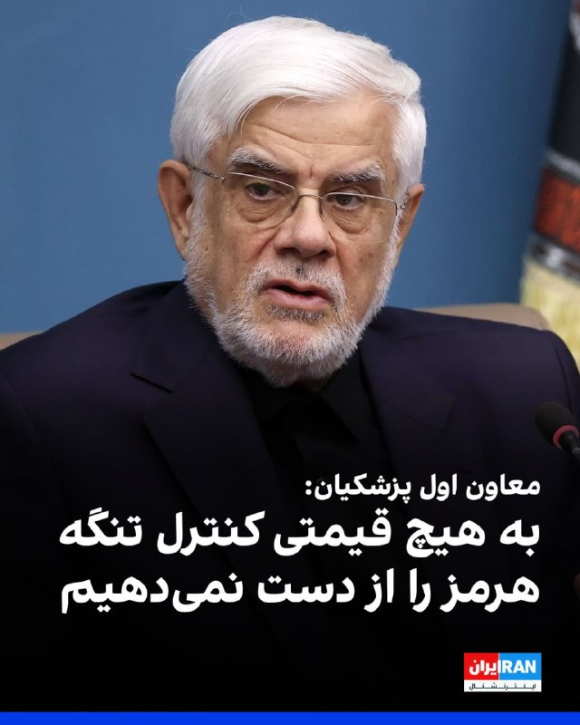

محمدرضا عارف، معاون اول مسعود پزشکیان، گفت که تنگه هرمز مال ماست؛ ملک ما بوده و مدتی از ملک‌مان خوب استفاده نمی‌کردیم.

او افزود: «ما به هیچ قیمتی کنترل تنگه هرمز را از دست نخواهیم داد.» عارف ادامه داد: «در جنگ هر کس روایت تولید کرد، پیروز خواهد شد.»
iranintl
‌🏁 🇬🇧 IranintlTV

🤖 @VahidOOnLine

## VahidOOnLine — post 240103

  

♦️المیرا عبدی فرزند اکبر عبدی، بازیگر نام‌آشنای سینما و تلویزیون ایران روز گفته است که پدرش از یک هفته پیش و در پی سکته قلبی در بخش مراقبت‌های ویژه بستری شده است.

به گزارش عصر ایران، المیرا عبدی گفت که مشخص نیست او چه زمانی مرخص می‌شود.
‌🇸🇦 Indypersian

🤖 @VahidOOnLine

## VahidOOnLine — post 240102

♦️دونالد ترامپ، رئیس جمهوری ایالات متحده آمریکا شامگاه پنجشنبه ۲۴ اردیبهشت (به وقت محلی) و در جریان ضیافت شام شی جین‌پینگ، گفتگوها با رئیس جمهوری چین را «فوق‌العاده مثبت و سازنده» توصیف کرد.

پیش از این کاخ سفید اعلام کرده بود که علاوه بر گفتگوها درباره تعرفه‌ها و تجارت، دو طرف بر سر لزوم بازگشایی تنگه هرمز و دست نیافتن ایران به سلاح هسته‌ای با یکدیگر موافقند.

ترامپ گفت: «ما امروز گفتگوها و جلسات بسیار مثبت و سازنده‌ای با هیئت چینی داشتیم و امشب فرصت مغتنمی است تا در میان دوستان، برخی از مواردی را که امروز مورد بحث قرار دادیم، مورد بحث قرار دهیم.»
‌🇸🇦 Indypersian

🤖 @VahidOOnLine

## VahidOOnLine — post 240101

  <a href="telegram/content/VahidOOnLine_240101_1778761416.mp4" target="_blank">🎬 Download video</a>

کاخ سفید اعلام کرد دونالد ترامپ و شی جین‌پینگ در دیدار خود در پکن درباره جنگ ایران، امنیت تنگه هرمز و برنامه هسته‌ای جمهوری اسلامی گفت‌وگو کرده‌اند.
بر اساس بیانیه کاخ سفید، دو طرف توافق کردند تنگه هرمز باید برای حفظ جریان آزاد انرژی باز بماند. شی جین‌پینگ همچنین مخالفت چین با نظامی‌سازی تنگه هرمز و هرگونه دریافت عوارض برای عبور کشتی‌ها را مطرح کرده است.
در این بیانیه آمده است رئیس‌جمهوری چین از تمایل پکن برای خرید بیشتر نفت آمریکا به‌منظور کاهش وابستگی به تنگه هرمز خبر داده و دو کشور نیز توافق کرده‌اند جمهوری‌اسلامی نباید به سلاح هسته‌ای دست پیدا کند.
کاخ سفید همچنین اعلام کرد دو رهبر درباره همکاری اقتصادی و مقابله با ورود مواد اولیه فنتانیل به آمریکا گفت‌وگو کرده‌اند.
در حالی که بیانیه چین تنها اشاره کوتاهی به موضوع ایران داشت، موضوع تایوان که شی جین‌پینگ آن را «مهم‌ترین مسئله» خوانده بود، در بیانیه واشینگتن مطرح نشد.
‌🏁 🇬🇧 ManotoTV

🤖 @VahidOOnLine

## VahidOOnLine — post 240100

  <a href="telegram/content/VahidOOnLine_240100_1778761417.mp4" target="_blank">🎬 Download video</a>

ترامپ در ضیافت شام رسمی که شی جین‌پینگ، رئیس‌جمهوری چین، در تالار بزرگ خلق پکن برگزار کرده حضور یافت.
ترامپ از شی جین‌پینگ و همسرش، پنگ لی‌یوان، برای سفر به آمریکا و حضور در کاخ سفید در ۲۴ سپتامبر دعوت کرد و گفت: «مایه افتخار من است که این دعوت را مطرح می‌کنم.»
‌🏁 🇬🇧 ManotoTV

🤖 @VahidOOnLine

## VahidOOnLine — post 240099

  

حسینعلی حاجی‌دلیگانی، عضو هیات رییسه مجلس، گفت که ادامه مذاکره با آمریکا اشتباه است و افزود واشینگتن برای آتش‌بس اصرار داشته و به دنبال خرید زمان با اهداف داخلی و انتخاباتی بوده است.

حاجی‌دلیگانی افزود: «خطوط فیبر نوری عبوری از بستر تنگه هرمز نیز باید شامل عوارض سالانه باشند.»

او گفت: «کل تنگه هرمز در حوزه سرزمینی ایران قرار می‌گیرد و مدیریت آن باید در اختیار جمهوری اسلامی باشد.»
iranintl
‌🏁 🇬🇧 IranintlTV

🤖 @VahidOOnLine

## VahidOOnLine — post 240098

  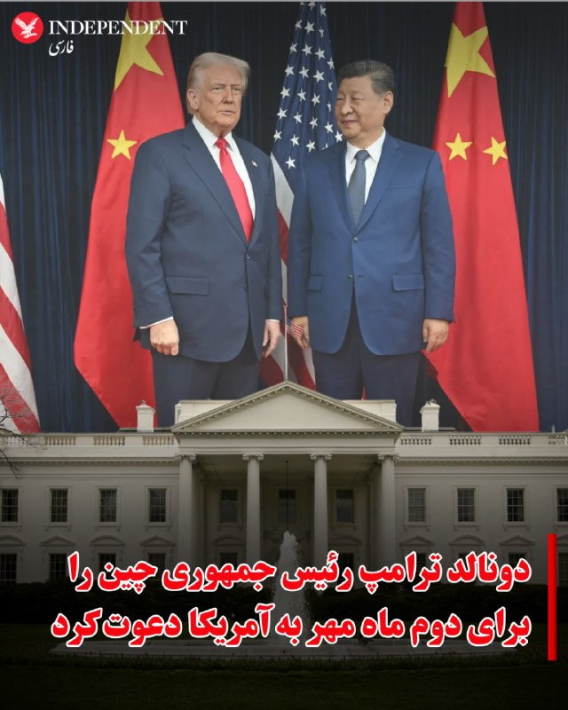

♦️دونالد ترامپ، رئیس جمهوری ایالات متحده شامگاه پنحشنبه ۲۴ اردیبهشت و در جریان سخنرانی در ضیافت شام رئیس جمهوری چین در پکن، شی جین‌پینگ را برای سفر رسمی به واشنگتن در تاریخ دوم مهرماه، دعوت کرد.
شی جین‌پینگ پیش از این در سال ۲۰۲۳ و برای شرکت در اجلاس سران آسیاپاسیفیک به سانفرانسیسکو سفر کرده بود.
‌🇸🇦 Indypersian

🤖 @VahidOOnLine

## VahidOOnLine — post 240097

  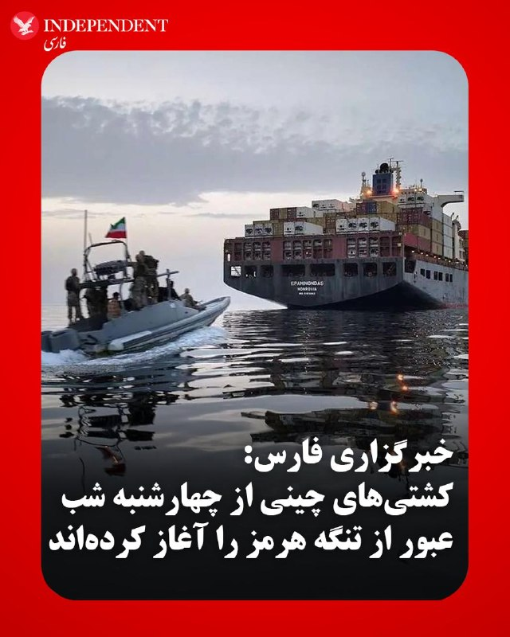

♦️خبرگزاری فارس، وابسته به سپاه پاسداران، روز پنجشنبه ۲۴ اردیبهشت ماه به نقل از یک «منبع آگاه» گزارش کرد که کشتی‌های چینی از شامگاه پنجشنبه «با تصمیم جمهوری اسلامی، امکان عبور تعدادی از کشتی‌های چینی از تنگه هرمز با رعایت پروتکل مدیریت ایرانی تنگه میسر شد.»

ساعتی پس از انتشار این خبر، صداوسیما به‌نقل از نیروی دریایی سپاه گزارش کرد «از شب گذشته تاکنون ۳۰ فروند کشتی از تنگه هرمز با مجوز ایران عبور کرده‌اند.»
‌🇸🇦 Indypersian

🤖 @VahidOOnLine

## VahidOOnLine — post 240096

  

دانشجویان متحد گزارش داد متین زمانیان، دانشجوی کارشناسی علوم سیاسی دانشگاه آزاد تهران مرکز، با گذشت بیش از یک‌ماه از بازداشت، در زندان تهران بزرگ نگهداری می‌شود.

بنا بر این گزارش متین زمانیان در طول دوران بازداشت، از حق دسترسی به وکیل مستقل و دادرسی عادلانه محروم مانده است.
iranintl
‌🏁 🇬🇧 IranintlTV

🤖 @VahidOOnLine

## VahidOOnLine — post 240095

♦️شی جین‌پینگ، رئیس جمهوری چین شامگاه پنجشنبه ۲۴ اردیبهشت در پکن میزبان ضیافت شامی مجلل برای دونالد ترامپ، رئیس جمهوری ایالات متحده و هیئت همراه او بود.

ضیافت شام روسای دو «ابرقدرت» جهانی پس از دیدار و گفتگوی شی با ترامپ و پس از بازدید کم‌سابقه مشترک از «معبد بهشت»، برگزار می‌شود.
‌🇸🇦 Indypersian

🤖 @VahidOOnLine

## VahidOOnLine — post 240094

  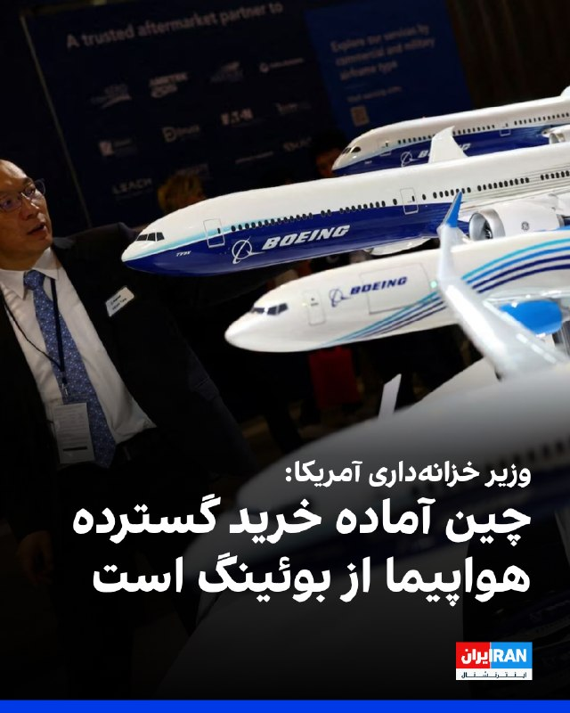

اسکات بسنت، وزیر خزانه‌داری آمریکا، گفت هم‌زمان با سفر دونالد ترامپ به پکن، انتظار می‌رود چین سفارش‌های بزرگی برای خرید هواپیما از شرکت بوئینگ ثبت و اعلام کند.

به گفته او، مذاکرات میان واشینگتن و پکن علاوه بر صنعت هوانوردی، حوزه‌هایی مانند انرژی و محصولات کشاورزی را نیز در بر خواهد گرفت.

بسنت همچین به مناقشه تایوان پرداخت و افزود: «ترامپ حساسیت‌های مربوط به این موضوع را درک می‌کند.»

به گفته وزیر خزانه‌داری آمریکا، ترامپ «در روزهای آینده» درباره این مساله صحبت خواهد کرد.
‌🏁 🇬🇧 IranintlTV

🤖 @VahidOOnLine

## VahidOOnLine — post 240093

  <a href="telegram/content/VahidOOnLine_240093_1778761422.mp4" target="_blank">🎬 Download video</a>

معین، خواننده شهیر در صفحه اینستاگرام خود با انتشار متنی، شایعات مطرح شده در خصوص اجرا برای تیم فوتبال در جام جهانی را تکذیب کرد. معین در متن خود از جمله نوشته: «عشق من به مردم و سرزمینم همیشه واقعی بوده. اما صدای من زمانی معنا دارد که دل مردم آرام باشد و حال ایران خوب»
روز گذشته اظهارات مهدی تاج، رئیس فدراسیون فوتبال جمهوری‌اسلامی به شایعاتی از این دست دامن زده بود.
‌🏁 🇬🇧 ManotoTV

🤖 @VahidOOnLine

## VahidOOnLine — post 240092

  <a href="telegram/content/VahidOOnLine_240092_1778761423.mp4" target="_blank">🎬 Download video</a>

مهدی تاج، رئیس فدراسیون فوتبال جمهوری‌اسلامی گفته «مسئله ویزا حل نشده و هنوز هیچ روادیدی برای اعضای تیم ملی فوتبال ایران صادر نشده است.» و افزوده «منتظریم ببینیم رفتار طرف مقابل چیست.»
او از «جلسه سرنوشت‌ساز» با فیفا صحبت به میان آورده چرا که به گفته تاج فیفا «باید به ما گارانتی بدهد»
‌🏁 🇬🇧 ManotoTV

🤖 @VahidOOnLine

## VahidOOnLine — post 240091

  

دونالد ترامپ، رییس‌جمهوری آمریکا، پس از سخنان شی جین‌پینگ در ضیافت رسمی در پکن پشت تریبون رفت و از استقبال انجام‌شده قدردانی کرد. او استقبال از خود در پکن را «افتخاری بزرگ» توصیف کرد و از شی جین‌پینگ «برای این استقبال باشکوه» تشکر کرد.

ترامپ گفت: «امروز گفت‌وگوها و دیدارهای بسیار مثبت و سازنده‌ای با هیات چینی داشتیم و این ضیافت نیز فرصتی ارزشمند است تا در جمع دوستان درباره برخی از موضوعاتی که امروز مطرح کردیم گفت‌وگو کنیم.»

رییس‌جمهوری آمریکا همچنین روابط ایالات متحده و چین را «یکی از تاثیرگذارترین روابط در تاریخ بشر» خواند.
‌🏁 🇬🇧 IranintlTV

🤖 @VahidOOnLine

## VahidOOnLine — post 240090

  

عترشی جین‌پینگ، رهبر چین، در آغاز ضیافت شام رسمی با دونالد ترامپ با بلند کردن جام خود به او و هیات آمریکایی خوشامد گفت و بر ضرورت همکاری میان دو کشور تاکید کرد. رهبر چین تاکید کرد: «دو کشور ما باید شریک باشند، نه رقیب.»

شی در سخنان خود به سال ۲۰۲۶ به عنوان دویست‌وپنجاهمین سالگرد اعلامیه استقلال آمریکا اشاره کرد و گفت: «مردم چین و ایالات متحده هر دو ملت‌های بزرگی هستند.»

او افزود: «تحقق احیای بزرگ ملت چین و عظمت دوباره آمریکا می‌تواند همزمان پیش برود. ما می‌توانیم به موفقیت یکدیگر کمک کنیم و رفاه کل جهان را ارتقا دهیم.»
‌🏁 🇬🇧 IranintlTV

🤖 @VahidOOnLine

## VahidOOnLine — post 240089

  

فاطمه وحدت، نایب‌رییس اتحادیه زنان کارگر سراسر ایران گفت: «نشانه‌های گسترش فقر در جامعه مشهود است. این روزها آدم‌ها را می‌بینیم که حتی برای خرید نان دچار مشکل هستند. این‌ها نشانه‌های کوچکی نیستند. شاید ساده به نظر برسند، اما اگر جدی گرفته نشوند، بعدها به معضل بزرگ اجتماعی تبدیل می‌شوند.»

او افزود: «در شرایط بحرانی، زنان کارگر بیش از دیگران در معرض اخراج قرار می‌گیرند؛ به‌ویژه زنانی که سرپرست خانوار هستند و مسئولیت مستقیم تامین معاش خانواده را برعهده دارند، در اثر این اخراج بیشترین آسیب را متحمل می‌شوند.»

وحدت ادامه داد: «همه از این شرایط خبر دارند، اما مسئله این است که نظارت جدی وجود ندارد.»
‌🏁 🇬🇧 IranintlTV

🤖 @VahidOOnLine

## VahidOOnLine — post 240088

  

اسکات بسنت، وزیر خزانه‌داری آمریکا گفت بازگشایی تنگه هرمز به نفع چین است و پکن هر کاری بتواند برای بازگشایی این آبراه انجام خواهد داد.

او در مصاحبه با سی‌ان‌بی‌سی تاکید کرد چین پشت صحنه و تا جایی که بر جمهوری اسلامی نفوذ داشته باشد، برای بازگشایی تنگه هرمز همکاری خواهد کرد.
‌🏁 🇬🇧 IranintlTV

🤖 @VahidOOnLine

## VahidOOnLine — post 240087

  

♦️آکسیوس روز پنجشنبه ۲۴ اردیبهشت گزارش کرد که این احتمال وجود دارد که دونالد ترامپ، رئیس جمهوری آمریکا بلافاصله پس از بازگشت از سفر رسمی به چین، گام بعدی را در رابطه جنگ با ایران بردارد.

براساس گزارش این رسانه‌ آمریکا، ترامپ گزینه‌هایی از جمله از سرگیری «پروژه آزادی» تنگه هرمز یا آغاز دور تازه بمباران ایران را در اختیار دارد.

آکسیوس در همین گزارش نوشته است که دونالد ترامپ عامدانه و آگاهانه واژه‌های عبارت «من بیش از آنکه به افزایش هزینه‌ها در آمریکا فکر کنم به دست نیافتن ایران به سلاح هسته‌ای فکر می‌کنم» را انتخاب کرده است.
‌🇸🇦 Indypersian

🤖 @VahidOOnLine

## mwarmonitor — post 9078

🇺🇸وزارت بازرگانی ایالات متحده آمریکا فروش تراشه‌های هوش مصنوعی H200 شرکت انویدیا را به ۱۰ شرکت چینی، در قالب مجوزهایی که برای هر مشتری تا سقف ۷۵ هزار تراشه را اجازه می‌دهد، تأیید کرده است. با وجود این تأییدها، تاکنون هیچ محموله‌ای ارسال نشده است.

@mwarmonitor

## mwarmonitor — post 9077

  

🇺🇸دریادار برد کوپر، فرمانده فرماندهی مرکزی ایالات متحده (CENTCOM)، صبح امروز درباره وضعیت و آرایش عملیاتی سنتکام در کنگره شهادت خواهد داد.

@mwarmonitor

## mwarmonitor — post 9076

📝 سوالی دارید دایرکت جواب میدم...

## mwarmonitor — post 9075

🔴گزارش تری یینگست خبرنگار فاکس نیوز (Trey Yingst) از تل‌آویو

🔸تری یینگست: بله بچه‌ها، صبح بخیر. ببینید، چینی‌ها بزرگترین واردکننده نفت خام ایران در جهان هستند و احتمالاً رئیس‌جمهور ترامپ این موضوع را در طول گفتگوهای جاری خود در پکن مطرح کرده است. وقتی به اقدامات نظامی ایران در تنگه هرمز و برنامه هسته‌ای این کشور نگاه می‌کنیم، هر دو مستقیماً از طریق همین صادرات نفت تأمین مالی می‌شوند.
گزارش‌های امروز صبح نشان می‌دهد که ایران کشتی دیگری را در سواحل امارات متحده عربی توقیف کرده است. وزیر امور خارجه، مارکو روبیو، به شان هنیتی (Sean Hannity) در فاکس نیوز گفت که چینی‌ها باید نقش فعال‌تری در وادار کردن ایران به تغییر مسیر ایفا کنند.

📌صحبت‌های مارکو روبیو (وزیر امور خارجه)

🔸مارکو روبیو: از آنجایی که اقتصاد بسیاری از کشورهای جهان به دلیل این بحران در تنگه‌ها در حال فروپاشی است، آن‌ها محصولات چینی کمتری خواهند خرید و صادرات چین به شدت کاهش خواهد یافت. بنابراین، حل این موضوع به نفع خود آن‌هاست. ما امیدواریم آن‌ها را متقاعد کنیم که نقش فعال‌تری ایفا کرده و ایران را وادار کنند تا از اقداماتی که در حال حاضر در خلیج فارس انجام می‌دهد، دست بکشد.

📌صحبت‌های جی.دی. ونس (معاون رئیس‌جمهور)

🔸تری یینگست: در مورد احتمال توافق از طریق مذاکره، معاون رئیس‌جمهور، جی.دی. ونس، اشاره کرد که در هفته‌های اخیر پیشرفت‌هایی حاصل شده است، اما این سوال باقی می‌ماند که آیا این پیشرفت برای جلوگیری از شروع مجدد جنگ کافی است یا خیر.
🔴جی.دی. ونس: من می‌خواهم بتوانم در چشم مردم آمریکا نگاه کنم و با اطمینان بگویم که دیگر لازم نیست نگران دسترسی این رژیم بسیار خطرناک به خطرناک‌ترین سلاح‌های جهان باشید. این هدفی است که ما روی آن تمرکز کرده‌ایم. باز هم می‌گویم، راه‌های زیادی برای دستیابی به این هدف وجود دارد؛ رئیس‌جمهور فعلاً ما را در مسیر دیپلماتیک قرار داده است و این چیزی است که من روی آن تمرکز دارم.

🇮🇷صحبت‌های عباس عراقچی (وزیر امور خارجه ایران)

🔸تری یینگست: ایرانی‌ها در بحبوحه تنش‌های فزاینده در منطقه، همچنان به سخنرانی و تهدید ادامه می‌دهند. وزیر امور خارجه ایران گفت که این کشور هم برای دیپلماسی و هم برای جنگ آماده است.
🔹عباس عراقچی: ما همان‌طور که آماده‌ایم با تمام قوا از آزادی و خاک خود دفاع کنیم، به همان اندازه آماده‌ایم که دیپلماسی را دنبال کرده و از آن دفاع کنیم. همان‌طور که بارها اعلام کرده‌ام، هیچ راه حل نظامی برای هیچ موضوعی در رابطه با ایران وجود ندارد. ما ایرانی‌ها هرگز در برابر هیچ فشار یا تهدیدی سر خم نمی‌کنیم، اما به زبان احترام، با احترام پاسخ می‌دهیم.

🔴تری یینگست: در اینجا در اسرائیل، درگیری علیه بزرگترین نیروی نیابتی ایران، یعنی حزب‌الله در جنوب لبنان ادامه دارد. این گروه اوایل امروز پهپادهایی را به سمت مرز پرتاب کرد که منجر به زخمی شدن سه نفر در شمال اسرائیل شد. بچه‌ها؟

🔰مجری استودیو: واو، اتفاقات زیادی در آنجا در جریان است. تری، وقتی این نشست (در چین) تمام شود، همه نگاه‌ها به کارهایی خواهد بود که شما الان انجام می‌دهید. اما در حال حاضر تمرکز روی چین و چگونگی ارتباط آن با ایران است.

@mwarmonitor

## mwarmonitor — post 9074

  <a href="telegram/content/mwarmonitor_9074_1778761428.mp4" target="_blank">🎬 Download video</a>

🎬 Video

## mwarmonitor — post 9073

🇺🇸وزیر خزانه‌داری ایالات متحده، بَسِنت، درباره ایران گفت:
«ما معتقدیم به نقطه‌ای رسیده‌ایم که ایران نه به سربازانش حقوق می‌دهد و نه ذخایر تسلیحاتی خود را از خارج تأمین و تجدید می‌کند.»

@mwarmonitor

## mwarmonitor — post 9072

  

🔸عالم مبارز بحرینی: آل خلیفه اگر از خصومت با ملت بحرین دست برندارند، ساقط خواهند شد

🔹«عبدالله الدقاق» به‌دنبال تشدید سرکوبگری رژیم آل‌خلیفه در قالب شکنجه، پیگرد و سلب تابعیت شهروندان بحرینی به ویژه علما و مداحان، یک نشست مطبوعاتی برگزار کرد.

📝در این قاب، با موجودی روبه‌رو هستیم که با وقاحت تمام، ژستِ حق‌به‌جانب گرفته و برای دیگران حکم سقوط صادر می‌کند. این انتر که به اسم «عالم مبارز» معرفی شده، در واقع یک گوریلِ قلمروطلب است که بوی گندِ تفکراتش حتی از پشت عکس هم به مشام می‌رسد؛ موجودی که دقیقاً مثل اجداد وحشی‌اش در ۱۴۰۰ سال پیش، تنها هنرش تبدیل «علم» به ابزاری برای کشت و کشتار و سلاخیِ منتقدان است. این آخوند صادراتی، در حالی که خودش تجسمِ شکنجه و سلب آزادی است، با وقاحتی بی‌مرز از «حقوق بشر» دم می‌زند تا روی ماهیت کثیف و فرقه‌ای خود سرپوش بگذارد . فاجعه اینجاست که این جانور، هر نکبت و فلاکتی را به پروژه‌های خارجی ربط می‌دهد، در حالی که خودش و آن عمامه‌ی ننگینش، بزرگ‌ترین ویروس برای موجودیت و امنیت بشریت هستند.

@mwarmonitor

## mwarmonitor — post 9071

🇨🇳🇺🇸دونالد ترامپ، رئیس‌جمهور چین، شی جین‌پینگ را برای بازدید از کاخ سفید در تاریخ ۲۴ سپتامبر دعوت کرد.

@mwarmonitor

## mwarmonitor — post 9070

📝از "هزار پدر" تا "بی‌پدر": وقتی شی‌جین‌پینگ با یک لبخند به ترامپ، یتیم‌خانه‌ی سایبری‌ها را به آتش می‌کشد.

🔰وقاحتِ این جماعتِ جیره‌خوار زمانی به اوج می‌رسد که می‌بینند «پدرِ معنوی‌شان» در پکن، برای همان ترامپی که شب و روز در رویاهایشان ترورش می‌کردند، فرشِ قرمز پهن کرده و با شکوهی بی‌سابقه از او پذیرایی می‌کند. حالا که سوزشِ این حقیقتِ عریان به جانشان افتاده، طبقِ معمولِ آن ذاتِ دروغ‌گویشان، به آب و آتش می‌زنند تا با روایت‌هایِ مضحک، این «تعظیمِ دیپلماتیکِ چین» را به عنوانِ «تحقیرِ آمریکا» به خوردِ مخاطبِ مفلوکشان بدهند. این اراذلِ سایبری که هنوز فرقِ میانِ "نزاکتِ ابرقدرت‌ها" و "نوکریِ حقیرانه" را نمی‌فهمند، سعی دارند با واژه‌هایی مثل «دیکته کردنِ دیپلماسی»، رویِ این واقعیت سرپوش بگذارند که چین، برخلافِ تصورِ این‌ها، به دنبالِ تجارت با کدخداست، نه گداییِ رفاقت با یک نظامِ منزوی و ورشکسته.

🔸تصویرِ ترامپ در شهرِ ممنوعه، برای این هزارپدرانِ نظام مثلِ پاشیدنِ نمک روی زخمِ "عزتِ نداشته‌شان" است؛ آن‌ها که کلِ دیپلماسی‌شان به گشت‌زنی در مخروبه‌های ونزوئلا و گرفتنِ عکسِ یادگاری با شبه‌نظامیانِ گمنام خلاصه شده، حالا چنان از استقبالِ باشکوهِ شی‌جین‌پینگ از ترامپ گیج شده‌اند که از شدتِ استیصال، به هذیان‌گویی روی آورده‌اند. چقدر باید یک موجود حقیر باشد که ببیند اربابش دارد با دشمنِ خونی‌اش در بالاترین سطحِ ممکنِ تشریفات لبخند می‌زند و ناهار می‌خورد، اما باز هم با وقاحتِ تمام رو به دوربین کند و بگوید: «نه، ببینید چطور با کلاسِ بالا ترامپ را تحقیر کردند!». این اوجِ حقارتِ یک "برده‌ی فکری" است که حتی وقتی صاحبش او را نادیده می‌گیرد و با رقیب دستِ دوستی می‌دهد، باز هم دنبالِ راهی می‌گردد تا از این فضاحت، یک "پیروزیِ خیالی" بسازد. حقیقت این است که دنیای واقعیِ قدرت، فرسنگ‌ها با حجره‌های تاریکِ پروپاگاندای این‌ها فاصله دارد و این جیره‌خوارانِ مفلوک، تنها چیزی که از این استقبالِ باشکوه نصیبشان شده، دود و سوزشی است که هیچ "دیپلماسیِ چینی" قادر به خاموش کردنش نیست.

@mwarmonitor

## pm_afshaa — post 90739

🔴وزیر خزانه داری آمریکا:ایران رو انقدر تحت فشار اقتصادی قرار دادیم که توی پرداخت حقوق نیروهاشم به مشکل خورده. دارن نفسای آخرشونو میکشن

💧 Rainbet.com the #1 Non-KYC Crypto Casino & Sportsbook @rainbetcom

😁 @Pm_Afshaa

## pm_afshaa — post 90738

  <a href="telegram/content/pm_afshaa_90738_1778761431.webm" target="_blank">🎬 Download video</a>

🔴وزیر خزانه‌داری آمریکا: باز شدن تنگه هرمز به نفع چین خواهد بود و انتظار داریم قیمت نفت در شش ماه آینده کاهش یابد

💧 Rainbet.com the #1 Non-KYC Crypto Casino & Sportsbook @rainbetcom

😁 @Pm_Afshaa

## pm_afshaa — post 90737

  <a href="telegram/content/pm_afshaa_90737_1778761432.mp4" target="_blank">🎬 Download video</a>

ایلان ماسک هم خوب مست کرده

💧 Rainbet.com the #1 Non-KYC Crypto Casino & Sportsbook @rainbetcom

😁 @Pm_Afshaa

## pm_afshaa — post 90736

  <a href="telegram/content/pm_afshaa_90736_1778761433.webm" target="_blank">🎬 Download video</a>

🔴شی جین‌پینگ در ضیافت با ترامپ:
چین و آمریکا باید شریک باشن، نه رقیب؛ عظمت دوباره آمریکا و احیای چین میتونن همزمان پیش برن.

ترامپ هم پس از این سخنان، روابط واشینگتن و پکن رو یکی از تاثیرگذارترین روابط تاریخ بشر توصیف کرد و دیدارهای انجام‌شده با مقام‌های چینی رو مثبت و سازنده خواند.

💧 Rainbet.com the #1 Non-KYC Crypto Casino & Sportsbook @rainbetcom

😁 @Pm_Afshaa

## pm_afshaa — post 90732

ترامپ یه جور داره رفتار میکنه که انگار رئیس جمهور چین اومده آمریکا

💧 Rainbet.com the #1 Non-KYC Crypto Casino & Sportsbook @rainbetcom

😁 @Pm_Afshaa

## pm_afshaa — post 90730

  <a href="telegram/content/pm_afshaa_90730_1778761434.webm" target="_blank">🎬 Download video</a>

🔴اکسیوس: یک مشاور ترامپ اذعان کرد مشکل اینه که ایران زمان بیشتری داره و آنها روی تقویم سیاسی ما حساب باز کردن تا به سودشون تمام بشه.

💧 Rainbet.com the #1 Non-KYC Crypto Casino & Sportsbook @rainbetcom

😁 @Pm_Afshaa

## pm_afshaa — post 90729

  <a href="telegram/content/pm_afshaa_90729_1778761435.webm" target="_blank">🎬 Download video</a>

🔴صداوسیما به‌نقل از نیروی دریایی سپاه:
از شب گذشته تاکنون 30 تا کشتی از تنگۀ هرمز با مجوز جمهوری اسلامی عبور کردن.

💧 Rainbet.com the #1 Non-KYC Crypto Casino & Sportsbook @rainbetcom

😁 @Pm_Afshaa

## pm_afshaa — post 90728

🔴وزیر خزانه‌داری آمریکا: تأسیسات اصلی بارگیری نفت ایران به مدت 3 روز است از سرویس خارج شده

💧 Rainbet.com the #1 Non-KYC Crypto Casino & Sportsbook @rainbetcom

😁 @Pm_Afshaa

## pm_afshaa — post 90727

🔴در حاشیه اجلاس سران در چین: رئیس‌جمهور ترامپ رئیس‌جمهور چین را برای بازدید از کاخ سفید در پایان سپتامبر دعوت کرد

💧 Rainbet.com the #1 Non-KYC Crypto Casino & Sportsbook @rainbetcom

😁 @Pm_Afshaa

## kianmeli1 — post 87401

‏🔴شی جین‌پینگ، رییس‌جمهوری چین، در ضیافت رسمی به افتخار ترامپ گفت که دو کشور باید شریک باشند، نه رقیب

‏شی جین‌پینگ گفت که دو شعار «نوزایی چین» و «عظمت را دوباره به آمریکا بازگردانیم» می‌توانند در کنار یکدیگر پیش بروند
https://t.me/kianmeli1

## kianmeli1 — post 87400

🔴بلومبرگ: ۴ روز است که از خارک بارگیری نفت نمی‌شود و اسکله‌های نفتی کاملاً خالی است

صادرات نفت از جزیره خارک برای نخستین بار از آغاز جنگ، چند روز متوقف شد
https://t.me/kianmeli1

## kianmeli1 — post 87399

  <a href="telegram/content/kianmeli1_87399_1778761435.mp4" target="_blank">🎬 Download video</a>

🔴ترامپ از شی دعوت کرد تا در 24 سپتامبر به آمریکا سفر کند.
https://t.me/kianmeli1

## kianmeli1 — post 87398

  <a href="telegram/content/kianmeli1_87398_1778761438.mp4" target="_blank">🎬 Download video</a>

🔴صداوسیما

از دیشب عبور ۳۰ کشتی از تنگه هرمز انجام پذیرفته است
https://t.me/kianmeli1

## kianmeli1 — post 87397

  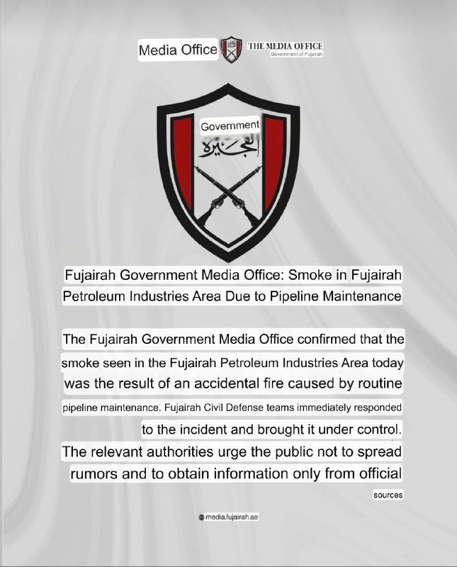

🔴در پی انتشار گزارش‌هایی مبنی بر بلند شدن دود از منطقه صنایع نفتی فجیره، دفتر رسانه‌ای فجیره اعلام کرد که این دود به دلیل تعمیرات مداوم یک خط لوله است.
https://t.me/kianmeli1

## kianmeli1 — post 87396

  

🔴طبق اعلام مرکز عملیات تجارت دریایی بریتانیا (UKMTO)، حادثه‌ای در ۳۸ مایلی شمال شرقی فجیره، امارات متحده عربی رخ داده است که در آن یک کشتی توقیف و به آب‌های ایران منتقل شده است. این احتمالاً توقیف دیگری از یک کشتی توسط سپاه پاسداران انقلاب اسلامی است.
https://t.me/kianmeli1

## kianmeli1 — post 87395

  

🔴کاخ سفید پس از مذاکرات دوجانبه ایالات متحده و چین در پکن، پایتخت چین، در بیانیه‌ای اعلام کرد که دو هیئت در مورد مسائلی مانند دسترسی به بازار چین، سرمایه‌گذاری چین در صنایع ایالات متحده، مواد مخدر، به ویژه فنتانیل، «جریان آزاد» تجارت از طریق تنگه هرمز و سایر مسائل کلیدی گفتگو کردند.
https://t.me/kianmeli1

## IranIntlTV — post 337161

  

عباس مقتدایی، نایب رییس کمیسیون امنیت ملی مجلس گفت: «ما آنچه را اراده کنیم، به آمریکا و هم‌پیمانانش دیکته می‌کنیم، چرا که حاکمیت بر خلیج فارس، تنگه هرمز و دریای عمان موضوعی ذاتی و متعلق به کشور ماست.»
او افزود: «ترامپ نشان داد که باور به اینکه انسان‌ها می‌توانند از گرگ نیز بدتر و پلیدتر باشند، باوری ریشه‌دار، عمیق و واقعی است.»

او ادامه داد: «با آمادگی دفاعی می‌توانیم سایه جنگ را از سر کشور برداریم و با ایجاد انتظام در تنگه هرمز، این شاهراه حیاتی جهانی را که از نظر اقتصادی و سیاسی اهمیت بالایی دارد، به‌عنوان اهرمی برای دستیابی به حقوق ایران مورد بهره‌برداری قرار دهیم.»
iranintl.com/202605140403

## IranIntlTV — post 337160

  

محمدرضا عارف، معاون اول مسعود پزشکیان، گفت که تنگه هرمز مال ماست؛ ملک ما بوده و مدتی از ملک‌مان خوب استفاده نمی‌کردیم.

او افزود: «ما به هیچ قیمتی کنترل تنگه هرمز را از دست نخواهیم داد.» عارف ادامه داد: «در جنگ هر کس روایت تولید کرد، پیروز خواهد شد.»
iranintl.com/202605143228

## IranIntlTV — post 337159

  <a href="telegram/content/IranIntlTV_337159_1778761444.mp4" target="_blank">🎬 Download video</a>

سرخط خبرهای پنجشنبه ۲۴ اردیبهشت
@iranintltv

## IranIntlTV — post 337158

  <a href="telegram/content/IranIntlTV_337158_1778761445.mp4" target="_blank">🎬 Download video</a>

ایران‌اینترنشنال از همه افرادی که درباره وقایع بیمارستان الغدیر تهران در ۱۸ و ۱۹ دی‌ماه شواهد، اسناد یا اطلاعاتی دارند خواسته است از طریق بات اینتل‌مدیا، اطلاعات خود را ارسال کنند.

جزییات بیشتر در گفت‌وگو با فرنوش فرجی، عضو تحریریه ایران‌اینترنشنال
@iranintltv

## IranIntlTV — post 337157

  <a href="telegram/content/IranIntlTV_337157_1778761448.mp4" target="_blank">🎬 Download video</a>

فیلم «داستان‌های موازی» ساخته اصغر فرهادی، به‌طور رسمی در بخش مسابقه اصلی جشنواره کن به نمایش درمی‌آید. سینمای مستقل، مهاجرت، تبعید و حضور فیلمسازان ایرانی در بخش‌های مختلف، از محورهای مورد توجه جشنواره امسال است.
لی‌لی نیکفر، خبرنگار ایران‌اینترنشنال، گزارش می‌دهد
@iranintltv

## IranIntlTV — post 337156

  

حسینعلی حاجی‌دلیگانی، عضو هیات رییسه مجلس، گفت که ادامه مذاکره با آمریکا اشتباه است و افزود واشینگتن برای آتش‌بس اصرار داشته و به دنبال خرید زمان با اهداف داخلی و انتخاباتی بوده است.

حاجی‌دلیگانی افزود: «خطوط فیبر نوری عبوری از بستر تنگه هرمز نیز باید شامل عوارض سالانه باشند.»

او گفت: «کل تنگه هرمز در حوزه سرزمینی ایران قرار می‌گیرد و مدیریت آن باید در اختیار جمهوری اسلامی باشد.»
iranintl.com/202605145331

## IranIntlTV — post 337154

🔻بازدید مسعود پزشکیان، رئیس دولت جمهوری اسلامی و احمد دنیامالی، وزیر ورزش و جوانان از مجموعه ورزشی آزادی.

🔹در هفته اول جنگ، ایران‌اینترنشنال گزارش داد که پس از آغاز حملات اسرائیل و آمریکا در نهم اسفندماه، به کارکنان و پرسنل فدراسیون‌ها و مراکز مستقر در مجموعه ورزشی آزادی در تهران دستور داده شد  ساختمان‌ها و سالن‌های ورزشی این مجموعه را تخلیه کنند.

🔹طبق این اطلاعات، پس از تخلیه کارکنان، نیروهای حکومتی از جمله یگان ویژه و بسیج در بخش‌های مختلف این مجموعه مستقر شدند.

🔹پس از این ماموران در سالن‌های مختلف از جمله ورزشگاه ۱۲ هزار نفری آزادی و همچنین سالن‌ها و ساختمان‌های متعلق به فدراسیون‌های ورزشی از جمله کشتی، والیبال، بسکتبال و وزنه‌برداری مستقر شدند.

🔹در پی این اقدامات، سالن ۱۲ هزار نفری ورزشگاه آزادی در حملات هوایی روز پنجشنبه ۱۴ اسفند ۱۴۰۴، تخریب شد.

@iranintltvsport

## IranIntlTV — post 337153

  <a href="telegram/content/IranIntlTV_337153_1778761450.mp4" target="_blank">🎬 Download video</a>

بیمارستان الغدیر تهران شامگاه ۱۸ و ۱۹ دی‌ماه، شاهد گوشه‌ای از جنایتی بود که جمهوری اسلامی علیه معترضان مرتکب شد. ده‌ها پیکر بی‌جان و شمار زیادی از مجروحان به این بیمارستان منتقل شدند و به دلیل کمبود فضای سردخانه، تعدادی از کشته‌شدگان، پتوپیچ در حیاط پشت بیمارستان رها شدند. ایران‌اینترنشنال با هدف روشن کردن ابعاد جنایت در بیمارستان الغدیر تهران در ۱۸ و ۱۹ دی‌ماه، کارزاری مردمی برای شناسایی جاویدنامانی که به این بیمارستان منتقل شده بودند راه‌اندازی کرده و تاکنون هویت ۹ نفر از آن‌ها را شناسایی کرده است.
از همه افرادی که درباره وقایع بیمارستان الغدیر تهران شواهد، اسناد یا اطلاعاتی دارند می‌خواهیم از طریق بات اینتل‌مدیا، اطلاعات خود را ارسال کنند و راوی حقیقت باشند.

گزارش آبتین یزدان‌پناه، خبرنگار ایران‌اینترنشنال
@iranintltv

## IranIntlTV — post 337152

  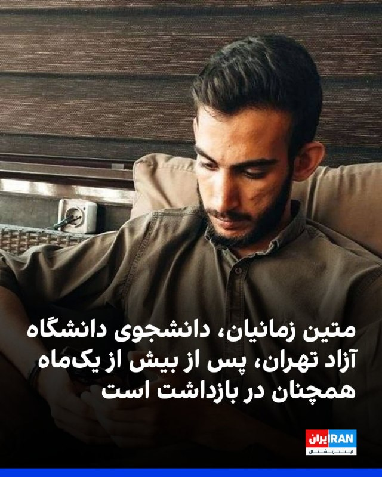

دانشجویان متحد گزارش داد متین زمانیان، دانشجوی کارشناسی علوم سیاسی دانشگاه آزاد تهران مرکز، با گذشت بیش از یک‌ماه از بازداشت، در زندان تهران بزرگ نگهداری می‌شود.

بنا بر این گزارش متین زمانیان در طول دوران بازداشت، از حق دسترسی به وکیل مستقل و دادرسی عادلانه محروم مانده است.
iranintl.com/202605143017

## IranIntlTV — post 337151

  

اسکات بسنت، وزیر خزانه‌داری آمریکا، گفت هم‌زمان با سفر دونالد ترامپ به پکن، انتظار می‌رود چین سفارش‌های بزرگی برای خرید هواپیما از شرکت بوئینگ ثبت و اعلام کند.

به گفته او، مذاکرات میان واشینگتن و پکن علاوه بر صنعت هوانوردی، حوزه‌هایی مانند انرژی و محصولات کشاورزی را نیز در بر خواهد گرفت.

بسنت همچین به مناقشه تایوان پرداخت و افزود: «ترامپ حساسیت‌های مربوط به این موضوع را درک می‌کند.»

به گفته وزیر خزانه‌داری آمریکا، ترامپ «در روزهای آینده» درباره این مساله صحبت خواهد کرد.
https://iranintl.com/202605141039

## IranIntlTV — post 337150

«#چشم‌انداز با مهدی مهدوی‌آزاد»؛ شنبه تا چهارشنبه ساعت ۲۱:۰۰ تهران

بررسی آخرین رویدادهای سیاسی، فرهنگی و اجتماعی با حضور کارشناسان.
@iranintltv

## IranIntlTV — post 337149

  

دونالد ترامپ، رییس‌جمهوری آمریکا، پس از سخنان شی جین‌پینگ در ضیافت رسمی در پکن پشت تریبون رفت و از استقبال انجام‌شده قدردانی کرد. او استقبال از خود در پکن را «افتخاری بزرگ» توصیف کرد و از شی جین‌پینگ «برای این استقبال باشکوه» تشکر کرد.

ترامپ گفت: «امروز گفت‌وگوها و دیدارهای بسیار مثبت و سازنده‌ای با هیات چینی داشتیم و این ضیافت نیز فرصتی ارزشمند است تا در جمع دوستان درباره برخی از موضوعاتی که امروز مطرح کردیم گفت‌وگو کنیم.»

رییس‌جمهوری آمریکا همچنین روابط ایالات متحده و چین را «یکی از تاثیرگذارترین روابط در تاریخ بشر» خواند.

## IranIntlTV — post 337148

  

عترشی جین‌پینگ، رهبر چین، در آغاز ضیافت شام رسمی با دونالد ترامپ با بلند کردن جام خود به او و هیات آمریکایی خوشامد گفت و بر ضرورت همکاری میان دو کشور تاکید کرد. رهبر چین تاکید کرد: «دو کشور ما باید شریک باشند، نه رقیب.»

شی در سخنان خود به سال ۲۰۲۶ به عنوان دویست‌وپنجاهمین سالگرد اعلامیه استقلال آمریکا اشاره کرد و گفت: «مردم چین و ایالات متحده هر دو ملت‌های بزرگی هستند.»

او افزود: «تحقق احیای بزرگ ملت چین و عظمت دوباره آمریکا می‌تواند همزمان پیش برود. ما می‌توانیم به موفقیت یکدیگر کمک کنیم و رفاه کل جهان را ارتقا دهیم.»

## IranIntlTV — post 337147

  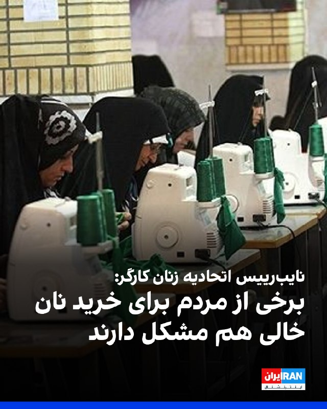

فاطمه وحدت، نایب‌رییس اتحادیه زنان کارگر سراسر ایران گفت: «نشانه‌های گسترش فقر در جامعه مشهود است. این روزها آدم‌ها را می‌بینیم که حتی برای خرید نان دچار مشکل هستند. این‌ها نشانه‌های کوچکی نیستند. شاید ساده به نظر برسند، اما اگر جدی گرفته نشوند، بعدها به معضل بزرگ اجتماعی تبدیل می‌شوند.»

او افزود: «در شرایط بحرانی، زنان کارگر بیش از دیگران در معرض اخراج قرار می‌گیرند؛ به‌ویژه زنانی که سرپرست خانوار هستند و مسئولیت مستقیم تامین معاش خانواده را برعهده دارند، در اثر این اخراج بیشترین آسیب را متحمل می‌شوند.»

وحدت ادامه داد: «همه از این شرایط خبر دارند، اما مسئله این است که نظارت جدی وجود ندارد.»
https://iranintl.com/202605143396

## IranIntlTV — post 337146

  

اسکات بسنت، وزیر خزانه‌داری آمریکا گفت بازگشایی تنگه هرمز به نفع چین است و پکن هر کاری بتواند برای بازگشایی این آبراه انجام خواهد داد.

او در مصاحبه با سی‌ان‌بی‌سی تاکید کرد چین پشت صحنه و تا جایی که بر جمهوری اسلامی نفوذ داشته باشد، برای بازگشایی تنگه هرمز همکاری خواهد کرد.
https://iranintl.com/202605140954

## Shin_Persian — post 5998

Samim ✓ @PawnToPromotion Thu, 14 May 2026 10:14:23 UTC آپدیت «خیلی مهم» برای کلاینت شیر و خورشید 2026.05.14: تنظیمات بیشتر برای CDN Domain Fronting: توجه کنید سایفون خودش دامین فرانتینگ انجام میده! ولی اون روش MitM که @patterniha پیدا کرد تنظیمات و جزییات…

## Shin_Persian — post 5997

Samim ✓ @PawnToPromotion
Thu, 14 May 2026 10:14:23 UTC

آپدیت «خیلی مهم» برای کلاینت شیر و خورشید 2026.05.14:

تنظیمات بیشتر برای CDN Domain Fronting: توجه کنید سایفون خودش دامین فرانتینگ انجام میده! ولی اون روش MitM که @patterniha پیدا کرد تنظیمات و جزییات دامین فرانتینگ متفاوتی داره. در این آپدیت٬ کلاینت شیر و خورشید کاری مشابه به چیزی که @patterniha ها معرفی کرد انجام میده با این تفاوت که این روش در هسته شیر و خورشید اضافه شده پس دیگه نیازی به xray و cert وکارای دیگه نیست.

۱. آپدیت رو نصب کنید
۲. پروتکل را روی یکی از حالت های Auto یا Direct یا CDN Fronting تنظیم کنید
۳. کلاینت شیر و خورشید باید الان خودش به تنهایی وصل بشه براتون!

قابلیت تنظیمات بیشتر برای SNI و IP هم وجود داره که فعلا بهش نیازی نیست و میتونید خالی بگذارید باشه. ولی برای آینده شاید به کار بیاد.

میتونید از اینجا دانلود و نصب کنید و ممنون میشم اگه repost کنید که تعداد بیشتری ببینند:

https://github.com/shirokhorshid/shirokhorshid-android/releases/tag/v2026.05.14-8a28d0c

در تلگرام هم آپلود کردم اگر براتون راحت تر هست میتونید از اونجا آپدیت رو بگیرید:

https://t.me/+aF04HaDSxVI4ZGEx

English

"Very Important" update for the Lion and Sun client 2026.05.14:

More settings for CDN Domain Fronting: Note that Psiphon performs its own domain fronting! However, the MitM (Man-in-the-Middle) method discovered by @patterniha involves different domain fronting settings and details. In this update, the Lion and Sun client performs an action similar to what @patterniha introduced, with the difference that this method has been integrated into the Lion and Sun core, so there is no longer a need for Xray, certificates, or other manual tasks.

1. Install the update.
2. Set the protocol to one of the following modes: Auto, Direct, or CDN Fronting.
3. The Lion and Sun client should now connect for you on its own!

There are also additional configuration options for SNI (Server Name Indication) and IP, which are not currently needed and can be left blank. However, they may be useful in the future.

You can download and install it from here, and I would appreciate it if you reposted so more people can see it:

https://github.com/shirokhorshid/shirokhorshid-android/releases/tag/v2026.05.14-8a28d0c

I have also uploaded it to Telegram; if it is easier for you, you can get the update from there:

https://t.me/+aF04HaDSxVI4ZGEx

𝕏 · @shin_persian

## Shin_Persian — post 5996

  

UKMTO Operations Centre @UK_MTO
Thu, 14 May 2026 07:00:22 UTC

UKMTO WARNING 057-26

Click here to view the full warning⤵️
http://www.ukmto.org/-/media/ukmto/products/20260514-ukmto_057_26_warning_suspicious-activity.pdf?rev=67da24ed8b4f43389506d6abbb5fb841

#MaritimeSecurity #MarSec

فارسی

هشدار UKMTO 057-26

برای مشاهده متن کامل هشدار اینجا کلیک کنید⤵️
http://www.ukmto.org/-/media/ukmto/products/20260514-ukmto_057_26_warning_suspicious-activity.pdf?rev=67da24ed8b4f43389506d6abbb5fb841

#MaritimeSecurity #MarSec_

𝕏 · @shin_persian

## ManotoTV — post 105443

  <a href="telegram/content/ManotoTV_105443_1778761457.mp4" target="_blank">🎬 Download video</a>

کاخ سفید اعلام کرد دونالد ترامپ و شی جین‌پینگ در دیدار خود در پکن درباره جنگ ایران، امنیت تنگه هرمز و برنامه هسته‌ای جمهوری اسلامی گفت‌وگو کرده‌اند.
بر اساس بیانیه کاخ سفید، دو طرف توافق کردند تنگه هرمز باید برای حفظ جریان آزاد انرژی باز بماند. شی جین‌پینگ همچنین مخالفت چین با نظامی‌سازی تنگه هرمز و هرگونه دریافت عوارض برای عبور کشتی‌ها را مطرح کرده است.
در این بیانیه آمده است رئیس‌جمهوری چین از تمایل پکن برای خرید بیشتر نفت آمریکا به‌منظور کاهش وابستگی به تنگه هرمز خبر داده و دو کشور نیز توافق کرده‌اند جمهوری‌اسلامی نباید به سلاح هسته‌ای دست پیدا کند.
کاخ سفید همچنین اعلام کرد دو رهبر درباره همکاری اقتصادی و مقابله با ورود مواد اولیه فنتانیل به آمریکا گفت‌وگو کرده‌اند.
در حالی که بیانیه چین تنها اشاره کوتاهی به موضوع ایران داشت، موضوع تایوان که شی جین‌پینگ آن را «مهم‌ترین مسئله» خوانده بود، در بیانیه واشینگتن مطرح نشد.

## ManotoTV — post 105442

  <a href="telegram/content/ManotoTV_105442_1778761458.mp4" target="_blank">🎬 Download video</a>

ترامپ در ضیافت شام رسمی که شی جین‌پینگ، رئیس‌جمهوری چین، در تالار بزرگ خلق پکن برگزار کرده حضور یافت.
ترامپ از شی جین‌پینگ و همسرش، پنگ لی‌یوان، برای سفر به آمریکا و حضور در کاخ سفید در ۲۴ سپتامبر دعوت کرد و گفت: «مایه افتخار من است که این دعوت را مطرح می‌کنم.»

## ManotoTV — post 105441

  <a href="telegram/content/ManotoTV_105441_1778761460.mp4" target="_blank">🎬 Download video</a>

معین، خواننده شهیر در صفحه اینستاگرام خود با انتشار متنی، شایعات مطرح شده در خصوص اجرا برای تیم فوتبال در جام جهانی را تکذیب کرد. معین در متن خود از جمله نوشته: «عشق من به مردم و سرزمینم همیشه واقعی بوده. اما صدای من زمانی معنا دارد که دل مردم آرام باشد و حال ایران خوب»
روز گذشته اظهارات مهدی تاج، رئیس فدراسیون فوتبال جمهوری‌اسلامی به شایعاتی از این دست دامن زده بود.

## ManotoTV — post 105440

  <a href="telegram/content/ManotoTV_105440_1778761460.mp4" target="_blank">🎬 Download video</a>

مهدی تاج، رئیس فدراسیون فوتبال جمهوری‌اسلامی گفته «مسئله ویزا حل نشده و هنوز هیچ روادیدی برای اعضای تیم ملی فوتبال ایران صادر نشده است.» و افزوده «منتظریم ببینیم رفتار طرف مقابل چیست.»
او از «جلسه سرنوشت‌ساز» با فیفا صحبت به میان آورده چرا که به گفته تاج فیفا «باید به ما گارانتی بدهد»

## FarsiVOA — post 217717

🔺اسرائیل طرح مشترکی برای خلع سلاح تدریجی حزب‌الله ارائه می‌کند

▪️سفیر اسرائیل در آمریکا اعلام کرد اورشلیم در دور تازه گفت‌وگوهای اسرائیل و لبنان در واشنگتن چارچوبی را برای خلع سلاح تدریجی حزب‌الله و گسترش روابط سیاسی به بیروت ارائه خواهد کرد.

▪️لایتر درباره روند تدریجی پیشنهادی از سوی اسرائیل گفت: «ما به‌طور مشترک یک منطقه مشخص را تعریف خواهیم کرد و با آن‌ها برنامه‌ریزی می‌کنیم که چگونه آن منطقه پاک‌سازی شود و سپس به مرحله بعدی ادامه دهیم.»

▪️سومین دور گفت‌وگوهای مستقیم نمایندگان اسرائیل و لبنان با میانجیگری آمریکا پنجشنبه ۲۴ اردیبهشت برگزار می‌‌شود.

⬇️ بیشتر بخوانید:
https://ir.voanews.com/a/8149934.html

## FarsiVOA — post 217716

🔺ترامپ با اشاره به گفت‌وگوهای «مثبت و سازنده» پکن، شی را به واشنگتن دعوت کرد

▪️دونالد ترامپ، رئیس‌جمهور آمریکا گفت‌وگوهای خود با شی جین‌پینگ همتای چینی‌اش در جریان سفر به پکن را «بسیار مثبت و سازنده» توصیف کرد.

▪️او درباره گفت‌وگوهایش با شی گفت هر آنچه درباره‌اش صحبت کردند، «همگی به سود ایالات متحده و چین بود.»

▪️همچنین رئیس‌جمهور آمریکا از همتای چینی خود برای سفر به ایالات متحده در ۲۴ سپتامبر دعوت کرد و گفت: «ما مشتاقانه منتظر این سفر هستیم.»

▪️رئیس‌جمهور چین در سخنرانی آغازین خود در ضیافت رسمی به افتخار ترامپ، روابط دو کشور را مهم‌ترین رابطه دوجانبه جهان توصیف کرد و گفت که دو طرف باید «هرگز آن را خراب نکنند.»

⬇️ بیشتر بخوانید:
https://ir.voanews.com/a/8149931.html

## FarsiVOA — post 217715

شی جین‌پینگ، رئیس جمهوری چین، روز پنج‌شنبه طی سخنانی که در مهمانی شام رسمی که به افتخار پرزیدنت ترامپ در پکن برگزار شد، این دیدار را «تاریخی» دانست و به روابط تاریخی دو کشور اشاره کرد.

## FarsiVOA — post 217714

🔺۱۸۰۰ ساعت خاموشی اینترنت؛ ایران زیر سایه اینترنت طبقاتی

▪️قطع گسترده اینترنت در ایران وارد روز هفتاد و ششم شده و شهروندان همچنان با محدودیت شدید ارتباطی روبه‌رو هستند؛ وضعیتی که پیامدهای اجتماعی و اقتصادی آن رو به افزایش است.

▪️نت‌بلاکس در گزارش روز پنجشنبه اعلام کرد شهروندان ایرانی بیش از هزار و ۸۰۰ ساعت است که با محدودیت شدید یا قطع کامل دسترسی به اینترنت مواجه‌اند.

▪️مقام‌های دولتی جمهوری اسلامی از یک طرف بر استفاده مردم از اینترنت تأکید می‌کنند، اما از دیگر سو، بیش از ۷۵ روز است که شهروندان ایرانی را در حصر دیجیتال قرار داده‌اند. وضعیتی که هیچ چشم‌اندازی برای برون‌رفت از آن نیست.

⬇️ بیشتر بخوانید:
https://ir.voanews.com/a/8149927.html

## FarsiVOA — post 217713

  

روزنامه شرق با اشاره به «افزایش اخراج کارگران» و «شرایط غیرمعقول دریافت بیمه بیکاری»، در گزارشی نوشت: «این روزها بیمه بیکاری برای بسیاری از نیروهای تعدیل‌شده، نه یک حمایت اجتماعی، بلکه مسیری فرساینده و مبهم است.»

هم‌زمان با موج تازه تعدیل نیرو در برخی رسانه‌ها، شرکت‌ها و مجموعه‌های تولیدی، شمار متقاضیان بیمه بیکاری افزایش یافته، اما بسیاری از متقاضیان از حمایت‌های لازم برخوردار نیستند.

نداشتن قرارداد کاری یا در اختیار نداشتن نسخه‌ای از قرارداد، عدم پرداخت به موقع حق بیمه از سوی کارفرما، اشکالات فنی سامانه ثبت درخواست بیمه بیکاری، انتظارهای طولانی مدت برای بررسی پرونده و پاسخگو نبودن تأمین اجتماعی و وزارت کار از جمله مهم‌ترین مشکلاتی است که روزنامه شرق به آن اشاره کرده است.

در این گزارش آمده است که روابط عمومی بیمه تأمین اجتماعی، مسئولیت مشکلات «ثبت درخواست بیمه بیکاری»را متوجه وزارت کار دانسته و در مقابل پروانه رضایی‌بختیاری، معاون روابط کار وزارت کار، علت را «پایین‌بودن سطح سواد دیجیتال برخی متقاضیان» بیان کرده است.
@FarsiVOA

## FarsiVOA — post 217712

دونالد ترامپ، رئیس جمهوری آمریکا، روز پنج‌شنبه طی سخنانی که در مهمانی شام رسمی که به افتخار او در پکن برگزار شده است، گفت که دو طرف «گفت‌وگوها و نشست‌های بسیار مثبت و سازنده‌ای» داشته‌اند. او رابطه آمریکا و چین را یکی از «سرنوشت‌سازترین روابط در تاریخ جهان» توصیف کرد.

## FarsiVOA — post 217711

  

وزیر خارجه جمهوری اسلامی در نشست وزیران خارجه کشورهای عضو بریکس در دهلی نو، امارات متحده عربی را به «دخالت مستقیم در عملیات نظامی» علیه حکومت ایران متهم کرد.

بر اساس گزارش خبرگزاری مهر، عباس عراقچی در پاسخ به اظهارات نماینده امارات گفت: «من در سخنرانی‌ خود نام امارات متحده عربی را ذکر نکردم، به خاطر حفظ وحدت و ترجیح دادم به آن اشاره نکنم. اما در واقع باید بگویم که امارات مستقیماً در اقدام تجاوزکارانه علیه کشور من دخیل بود. زمانی که این تجاوز آغاز شد، آنها حتی از محکوم کردن آن خودداری کردند.»

بر اساس این گزارش، نماينده امارات در این نشست بر رعایت حقوق بین‌الملل تأکید کرده بود.

در روزهای اخیر، رسانه‌های بین‌المللی گزارش دادند که امارات متحده عربی در جریان جنگ، با هماهنگی اسرائیل حملاتی را علیه تأسیسات انرژی ایران انجام داد.

این حملات در واکنش به حملات جمهوری اسلامی علیه امارات در جریان جنگ صورت گرفت. امارات در میان دیگر کشورهایی که جمهوری اسلامی به آنها حمله کرد، بیشترین تعداد حمله را متحمل شد.
@FarsiVOA

## FarsiVOA — post 217710

  

ارتش اسرائیل اعلام کرد که روز پنجشنبه موجی از حملات هوایی را علیه سایت‌های زیرساختی حزب‌الله در چندین منطقه در جنوب لبنان آغاز کرده است.

کمی قبل از بیانیه ارتش اسرائیل، هشدارهای تخلیه برای هشت روستا در جنوب لبنان صادر شده بود.

همزمان، ارتش اسرائیل پنجشنبه اعلام کرد که یک پهپاد انفجاری که توسط حزب‌الله پرتاب شده بود در داخل خاک اسرائیل و در نزدیکی مرز اسرائیل-لبنان سقوط کرد.

بر اساس این گزارش، چند غیرنظامی اسرائیلی زخمی شده و برای درمان به بیمارستان منتقل شدند.
@FarsiVOA

## DW_Farsi — post 124687

🔶 مالزی: ایران برای انتقال نفت از خلأ حقوقی سوءاستفاده می‌کند

ناظران صنعت کشتیرانی و گروه  "اتحاد علیه ایران هسته‌ای" می‌گویند آب‌های نزدیک ایالت جنوبی "جوهور" در مالزی به یکی از مراکز اصلی انتقال کشتی‌به‌کشتی نفت توسط "ناوگان سایه" ایران تبدیل شده است؛ ناوگانی متشکل از نفتکش‌های فرسوده که اغلب با خاموش کردن سیستم‌های رهگیری، استفاده از هویت‌های جعلی و ساختارهای مالکیتی مبهم، منشأ نفت خام خود را پنهان می‌کنند.

این محموله‌های نفتی عمدتاً راهی چین هستند. 

منطقه دریایی جوهور که با نام "EOPL" در دریای چین جنوبی شناخته می‌شود، حدود ۷۰ کیلومتر از سواحل مالزی فاصله دارد. این ناحیه در یکی از پرترددترین مسیرهای تجاری دریایی جهان واقع شده و تقریباً در میانه راه میان ایران و چین قرار دارد. بنا بر برآوردهای کنونی چین حدود ۹۰ درصد نفت ایران را خریداری می‌کند.

منطقه دریایی"EOPL" شامل محدوده لنگرگاهی و آب‌های آزاد در شرق منطقه بندری سنگاپور و سواحل مالزی است که به علت محدودیت‌های حقوقی به عنوان یکی از نقاط کلیدی در انتقال نفت کشتی‌به‌کشتی شناخته می‌شود.

@dw_farsi

## DW_Farsi — post 124686

  

🔶 "تصرف" یک کشتی در نزدیکی سواحل فجیره امارات

مرکز عملیات تجارت دریایی بریتانیا روز پنجشنبه ۱۴ مه (۲۴ اردیبهشت) از وقوع حادثه‌ای در فاصله ۳۹ مایل دریایی شمال شرقی بندر فجیره در شرق امارات متحده عربی خبر داده است.

طبق این گزارش یک کشتی که لنگر انداخته بود، توسط افرادی ناشناس مورد حمله قرار گرفت و اکنون به سمت آب‌های سرزمینی ایران در حرکت است. تا کنون جزییات بیشتری در مورد این حادثه منتشر نشده است.

این رویداد همزمان با سفر دونالد ترامپ، رئیس جمهور آمریکا به پکن و دیدار او با شی جین‌پینگ، همتای چینی او اتفاق افتاده است. کاخ سفید اعلام کرده است که رهبران چین و آمریکا در ملاقات خود اتفاق نظر داشتند که تنگه هرمز باید باز بماند تا جریان آزاد انرژی در منطقه حفظ شود و ایران اجازه مطالبه عوارض برای عبور کشتی‌ها از این آبراه حیاتی را ندارد.

@dw_farsi

## DW_Farsi — post 124685

  

🔶 وریشه مرادی در پرونده‌ای جدید به جرم "نوشتن نامه" به شش ماه حبس محکوم شد

وریشه مرادی، زندانی سیاسی محبوس در زندان اوین، از صدور حکم ۶ ماه حبس قطعی علیه خود به اتهام "تبلیغ علیه نظام" خبر داده شده است. بنا بر اطلاعات کمپین آزادی وریشه مرادی، او هفته پیش طبق ابلاغیه‌ای در جریان محکومیت و این حکم تازه قرار گرفته است.

اتهام مطرح‌شده علیه وریشه مرادی به نوشته‌هایی برمی‌گردد که توسط او در سالگرد جنبش "زن زدگی آزادی" منتشر شده بودند و به این ترتیب، این حکم تازه به پرونده‌های سابق و در حال رسیدگی او افزوده شده است.

وریشه مرادی مردادماه ۱۴۰۲، توسط نیروهای امنیتی در حومه سنندج بازداشت و در تاریخ ۵ دی همان سال، با اتمام مراحل بازجویی از بازداشتگاه وزارت اطلاعات موسوم به بند ۲۰۹ زندان اوین به بند زنان این زندان منتقل شد.

این زندانی سیاسی اواخر آبان سال ۱۴۰۳ توسط شعبه ۱۵ دادگاه انقلاب تهران به ریاست قاضی ابوالقاسم صلواتی از بابت اتهام "بغی" به اعدام محکوم شده بود. اواخر سال گذشته، حکم اعدام ریشه مرادی توسط دیوان عالی کشور نقض و پرونده او جهت رسیدگی مجدد به شعبه هم عرض ارجاع داده شد.

وریشه مرادی در حال حاضر دوران محکومیت خود را در زندان اوین سپری می‌کند.

@dw_farsi

## DW_Farsi — post 124684

  

🔶 کاخ سفید: شی و ترامپ بر سر عدم دستیابی ایران به سلاح هسته‌ای توافق کردند

کاخ سفید اعلام کرد که جنگ ایران و بحران تنگه هرمز در دیدار شی جین‌پینگ، رئیس جمهور چین و دونالد ترامپ، همتای آمریکایی او از جمله موضوعات مورد بحث بوده‌ است.

کاخ سفید با انتشار بیانیه‌ای گفت رهبران چین و آمریکا طی گفت‌وگوهای خود که در روز پنجشنبه ۱۴ مه (۲۴ اردیبهشت) در پکن انجام گرفت در مورد عدم دستیابی جمهوری اسلامی به سلاح هسته‌ای اتفاق نظر داشته‌اند.

در این بیانیه آمده است که ترامپ و شی توافق کردند که تنگه هرمز باید باز بماند تا جریان آزاد انرژی در منطقه حفظ شود و ایران اجازه مطالبه عوارض برای عبور کشتی‌ها از تنگه هرمز را ندارد.

به گفته کاخ سفید، شی جین‌پینگ همچنین علاقه‌مندی خود را به خرید بیشتر نفت آمریکا برای کاهش وابستگی چین به تنگه هرمز در آینده ابراز کرده است. با این حال به گزارش خبرگزاری فرانسه در گزارش منتشر شده از سوی پکن به چنین موضوعی اشاره‌ای نشده است.

پکن در حال حاضر بزرگ‌ترین خریدار و واردکننده نفت از ایران محسوب می‌شود.

@dw_farsi

## DW_Farsi — post 124683

  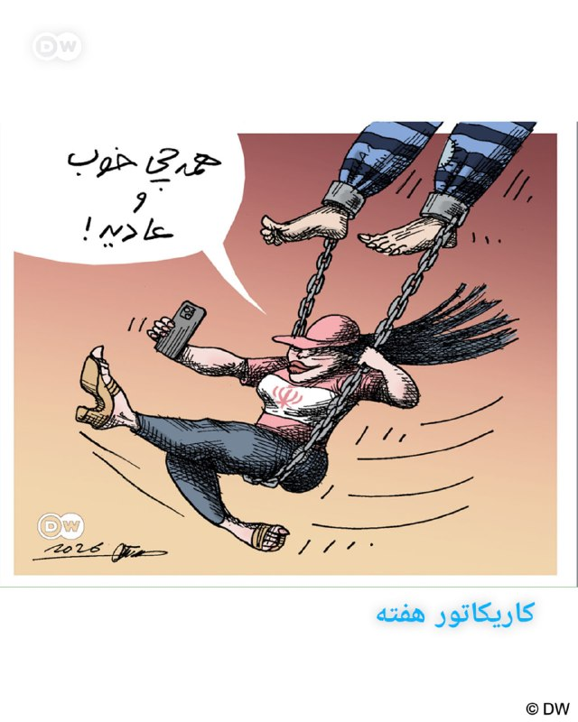

📸 کاریکاتور هفته

نزدیک به هشتاد روز است که حکومت ایران اینترنت را قطع کرده و تنها بسته‌ای محدود، کنترل‌شده و بسیار گران‌قیمت با عنوان "اینترنت پرو" را در اختیار گروه‌های خاص قرار می‌دهد. در کنار استفاده‌کنندگان اینترنت پرو، دارندگان "سیم‌کارت‌های سفید" نیز از دسترسی ویژه برخوردارند.

عمده بهره‌مندان از این امتیازها، وابستگان حکومت و حامیان آن هستند که با استفاده از این امکان، تصویری عادی، بزک‌شده و گمراه‌کننده از وضعیت امروز ایران به جهان مخابره می‌کنند؛ تصویری که در آن نشانی از فقر گسترده، سرکوب سیستماتیک، گرانی کمرشکن و موج روزانه اعدام‌های سیاسی دیده نمی‌شود.

این موضوع دستمایه مانا نیستانی در طراحی کاریکاتور هفته برای دویچه وله فارسی بوده است.

@dw_farsi

## DW_Farsi — post 124682

  

📸 عکس روز: حمل پره غول‌پیکر در کوهستان‌های سوئیس

کامیونی در حال حمل یکی از پرّه‌های توربین بادی که برای نیروگاه "زور گراتی" ساخته شده است. این نیروگاه در سوئیس در حال ساخت است و بهره‌برداری از آن برای اواخر سال ۲۰۲۷ برنامه‌ریزی شده است. این مجموعه شامل شش توربین بادی با ظرفیت نصب‌شده مجموع ۲۵٫۲ مگاوات خواهد بود.

@dw_farsi

## Persian_Trend_Official — post 14121

  <a href="telegram/content/Persian_Trend_Official_14121_1778761467.mp4" target="_blank">🎬 Download video</a>

🔴وزیر دفاع اسرائیل، کاتز درباره ایران

💢ماموریت ما کامل نشده است.

💢ما برای احتمال اینکه ممکن است مجبور شویم دوباره اقدام کنیم - شاید حتی به زودی - آماده‌ایم.

▪️اگر اهداف تأمین نشوند، دوباره اقدام خواهیم کرد.

🫆:Tony

📌 @persian_trend_official
پرشین ترند | متفاوت‌ترین کانال نظامی

## Persian_Trend_Official — post 14120

🔴مارکو روبیو:

💢طرف چینی گفت که آنها موافق نظامی کردن تنگه هرمز یا سیستم عوارضی نیستند و این موضع ما است.

🫆:Tony

📌 @persian_trend_official
پرشین ترند | متفاوت‌ترین کانال نظامی

## Persian_Trend_Official — post 14119

  <a href="telegram/content/Persian_Trend_Official_14119_1778761468.mp4" target="_blank">🎬 Download video</a>

💢شی در ضیافت شام با ترامپ در پکن:

«برای آینده روشن روابط چین و آمریکا و دوستی بین دو ملت، و برای سلامتی رئیس جمهور ترامپ و همه دوستان حاضر در جلسه دعا می‌ کنم.»

🫆:Tony

📌 @persian_trend_official
پرشین ترند | متفاوت‌ترین کانال نظامی

## Persian_Trend_Official — post 14117

هویدا نخست وزیر ایران در زمان شاه سیزده سال تورم ایران رو ثابت نگه داشته بود؛

زمانیکه بهش نامه زدن به خاطر ماه محرم اداره ها با تاخير باز بشن، در جواب نوشت:
“با سلام، موافقت نميشود. عبادت بجز خدمت خلق نيست.”

📝 Nick

📌 @persian_trend_official
پرشین ترند | متفاوت‌ترین کانال نظامی

## Persian_Trend_Official — post 14116

  

اسرائیل هیوم: در حالی که توجه‌ها به سمت ایران معطوف شده، حماس بی سر و صدا در حال تسلیح مجدد خود است.

☆Phantom☆

📌 @persian_trend_official
پرشین ترند | متفاوت‌ترین کانال نظامی

## RadioFarda — post 157174

🔸رسانه‌های ایران می‌گویند وزیر خارجه جمهوری اسلامی در نشست بریکس در دهلی‌نو، امارات متحده عربی را به «دخالت مستقیم» در عملیات نظامی علیه کشورش متهم کرد. 🔸این تنش یک روز پس از آن رخ داد که امارات ادعای بنیامین نتانیاهو، نخست‌وزیر اسرائیل، مبنی بر سفر به این…

## RadioFarda — post 157173

  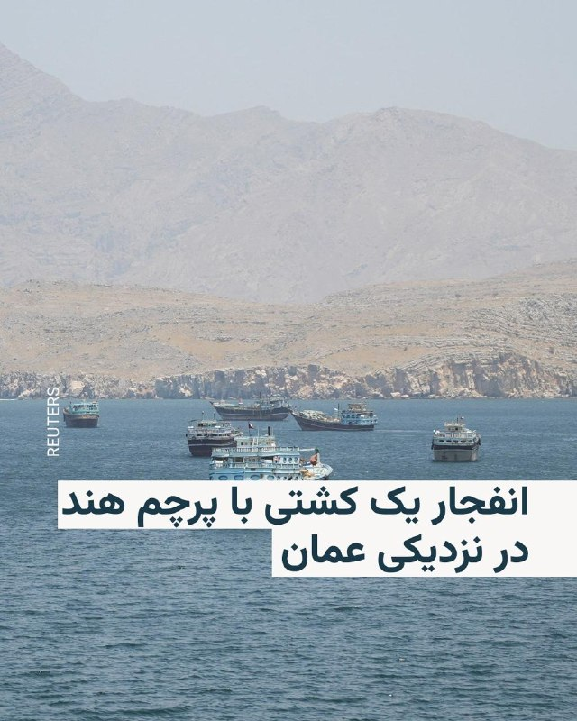

🔸رسانه‌های ایران می‌گویند وزیر خارجه جمهوری اسلامی در نشست بریکس در دهلی‌نو، امارات متحده عربی را به «دخالت مستقیم» در عملیات نظامی علیه کشورش متهم کرد.

🔸این تنش یک روز پس از آن رخ داد که امارات ادعای بنیامین نتانیاهو، نخست‌وزیر اسرائیل، مبنی بر سفر به این کشور حاشیه خلیج فارس در جریان جنگ ایران را رد کرد.

🔸خبرگزاری مهر به نقل از عراقچی نوشت: «من به خاطر حفظ وحدت، در سخنرانی‌ام در بریکس نامی از امارات نبردم. اما حقیقت این است که امارات مستقیماً در تجاوز علیه کشور من دخیل بود. وقتی حملات آغاز شد، آن‌ها حتی آن را محکوم هم نکردند.»

🔸رسانه‌های ایرانی مشخص نکردند که نماینده امارات چه اظهاراتی در این نشست مطرح کرده بود.

@RadioFarda

## RadioFarda — post 157172

  <a href="https://t.me/radiofarda/157172" target="_blank">📎 Download file</a>

📻بشنوید: ساعت ۱۴ با رادیوفردا، ۲۴ اردیبهشت ۱۴۰۵‌

@Radiofarda

## RadioFarda — post 157171

لِگو، هیپ‌هاپ و هوش مصنوعی؛ ایران چگونه بر افکار عمومی غرب اثر می‌گذارد

🔸جنگ ایران درس‌های تازه‌ای دربارهٔ نحوهٔ استفاده از هوش مصنوعی به‌عنوان ابزاری در جنگ‌های مدرن و حکمرانی دولتی آشکار کرده است. حکومت ایران به‌طور فزاینده‌ای تبلیغات تولیدشده با هوش مصنوعی، عملیات سایبری، جنگ روانی و کارزارهای نفوذ را در قالب یک اکوسیستم دیجیتال پیچیده برای مخاطبان داخلی و خارجی در هم آمیخته است.

🔸از ویدئوهای وایرال‌شده به سبک لگو و قطعات هیپ‌هاپ ساخته‌شده با هوش مصنوعی گرفته تا عملیات پنهانی در شبکه‌های اجتماعی و تصاویر جعلی میدان جنگ، تاکتیک‌های حکومت ایران برای نفوذ بیشتر به‌سرعت در حال تحول است و بیش از پیش مخاطبان غربی را هدف قرار می‌دهد.

🔸رادیو اروپای آزاد/رادیو آزادی برای بررسی چگونگی استفادهٔ جمهوری اسلامی از هوش مصنوعی در تبلیغات و جنگ اطلاعاتی، با مکس لِسِر، تحلیلگر ارشد تهدیدهای نوظهور در مرکز نوآوری سایبری و فناوری بنیاد دفاع از دموکراسی‌ها، گفت‌وگو کرده است.

🔸 گزارش کامل را در وب‌سایت رادیو فردا می‌توانید بخوانید.

@RadioFarda

## RadioFarda — post 157170

  

🔸گزارش‌ها از ایران حاکی از بازداشت مهدی شفاخواه، فعال اجتماعی و مربی داوطلب کودکان کار، توسط وزارت اطلاعات است.

🔸شماری از رسانه‌های حقوق بشری از جمله وب‌سایت هه‌نگاو نوشته‌اند که آقای شفاخواه «در پی یورش نیروهای وزارت اطلاعات جمهوری اسلامی ایران به منزل شخصی‌اش بازداشت و به مکان نامعلومی منتقل شد».

🔸بازداشت او عصر روز سه‌شنبه ۲۲ اردیبهشت صورت گرفته و مأموران وزارت اطلاعات، ضمن بازداشت این فعال اجتماعی اقدام به تفتیش منزل و ضبط لوازم شخصی او نیز کرده‌اند.

🔸هنوز از دلایل بازداشت، اتهامات انتسابی و محل دقیق نگهداری شفاخواه هیچ اطلاع دقیقی در دسترس نیست و پیگیری‌های خانواده او برای کسب اطلاع از وضعیت سلامت او بی‌نتیجه مانده است.

🔸مهدی شفاخواه طی سال‌های اخیر به صورت داوطلبانه در مناطق محروم و حاشیه‌نشین فعالیت داشته و از طریق آموزش ورزش و مهارت‌های اجتماعی به کودکان کار و نوجوانان آسیب‌پذیر، در راستای کاهش آسیب‌های اجتماعی از جمله اعتیاد و بزهکاری تلاش می‌کرد.

🔸او برادر رضا شفاخواه، وکیل دادگستری و فعال حقوق کودکان و زندانیان سیاسی، است.

@RadioFarda

## RadioFarda — post 157169

  <a href="https://t.me/radiofarda/157169" target="_blank">📎 Download file</a>

🔸اپیزود ۵۲ پادکست لایه هفتم | گزارش تهدیدهای امنیت سایبری در نیمه دوم ۱۴۰۴

🔸در این اپیزود از بدافزارهای اندرویدی که برای رصد فعالیت‌های آنلاین در گوشی کاربران پنهان می‌شوند صحبت می‌کنیم، همین‌طور از شکل‌های تازه جعل هویت، داکسینگ (یا همان افشای اطلاعات شخصی) و حتی مواردی که حمله سایبری می‌توانسته مقدمه‌ای برای ربایش فیزیکی افراد باشد.

🔸همچنین با حضور داوود سجادی و امیر رشیدی، گزارش جدید تهدیدهای امنیت سایبری ایران در نیمه دوم سال پرالتهاب ۱۴۰۴ را بررسی می‌کنیم. همچنین در ادامه، اصول و راهکارهای عملی برای مقابله با این تهدیدات و محافظت از خود را مرور می‌کنیم.

🔸فردا پادکست 🎧

## RadioFarda — post 157168

  

📷 Photo

## RadioFarda — post 157167

  

🔸 کاخ سفید اعلام کرد دونالد ترامپ، رئیس‌جمهور آمریکا، و شی جین‌پینگ، رئیس‌جمهور چین، در دیدار خود درباره گسترش همکاری‌های اقتصادی، باز ماندن تنگه هرمز و جلوگیری از دستیابی ایران به سلاح هسته‌ای گفت‌وگو و توافق کردند.

🔸 کاخ سفید روز پنجشنبه ۲۴ اردیبهشت در بیانیه‌ای اعلام کرد که دو طرف دربارهٔ افزایش دسترسی شرکت‌های آمریکایی به بازار چین و افزایش سرمایه‌گذاری چین در صنایع آمریکا گفت‌وگو کردند و شماری از مدیران بزرگ‌ترین شرکت‌های آمریکایی نیز در بخشی از این دیدار حضور داشتند.

🔸 کاخ سفید افزود دو کشور همچنین توافق کردند که تنگه هرمز باید برای حفظ جریان آزاد انرژی باز بماند.

🔸 بر اساس این بیانیه، شی جین‌پینگ مخالفت چین با «نظامی‌سازی» تنگه هرمز و هرگونه تلاش برای دریافت عوارض برای استفاده از آن را اعلام کرد و نسبت به خرید بیشتر نفت آمریکا برای کاهش وابستگی چین به این مسیر در آینده ابراز علاقه‌مندی کرد.

🔸 کاخ سفید همچنین اعلام کرد که آمریکا و چین توافق دارند ایران «هرگز» نباید به سلاح هسته‌ای دست یابد.

@RadioFarda

## IranianMinds — post 20116

  

🔴 کاخ سفید پس از مذاکرات دوجانبه ایالات متحده و چین در پکن، پایتخت چین، در بیانیه‌ای اعلام کرد که دو هیئت در مورد مسائلی مانند دسترسی به بازار چین، سرمایه‌گذاری چین در صنایع ایالات متحده، مواد مخدر، به ویژه فنتانیل، «جریان آزاد» تجارت از طریق تنگه هرمز و سایر مسائل کلیدی گفتگو کردند.

@IranianMinds

## BBCPersian — post 281027

  <a href="telegram/content/BBCPersian_281027_1778761475.mp4" target="_blank">🎬 Download video</a>

🎶 بُرشی از اجرای «خالی»، تک‌آهنگی از پیمان سلیمی که با تنظیمی تازه، همراه با گروه آلوفونز در استودیوی بی‌بی‌سی اجرا شده است.

او در گفت‌وگویی در حاشیه این اجرا از درس‌هایی که از کار گروهی گرفته، مخاطرات خودمحوری، اهمیت شنیدن حرف‌های دیگران و پیچیدگی‌های روابط عاطفی می‌گوید.

پیمان سلیمی، خواننده، آهنگساز و نوازنده ایرانی-ایتالیایی، فعالیت موسیقایی خود را با نواختن کیبورد آغاز کرد و در نوجوانی به سراغ گیتار رفت. او تحصیلات خود را در رشته موسیقی کلاسیک در دانشکده هنرهای زیبا ادامه داد و سپس برای ادامه تحصیل به فلورانس ایتالیا مهاجرت کرد.

پیمان سال‌ها به‌عنوان نوازنده و آهنگساز فعالیت داشت و نخستین آثارش را در نوجوانی با مضامین عاشقانه خلق کرد. ورود حرفه‌ای‌اش به خوانندگی پس از مهاجرت به فلورانس و همکاری با جمعی از نوازندگان ایتالیایی شکل گرفت.

گفت‌وگو و اجرای او را در «رنگآهنگ» این هفته پنجشنبه از تلویزیون و یوتیوب بی‌بی‌سی فارسی ببینید.

@BBCPersian

## BBCPersian — post 281026

🔻وزارت خارجه هند انفجار و غرق شدن یک کشتی باری این کشور در سواحل عمان را «غیرقابل قبول» خواند

🔻وزارت خارجه هند حمله به یک کشتی با پرچم این کشور را در نزدیکی سواحل عمان «غیرقابل قبول» توصیف کرد. سازمان‌های نظارت دریایی گزارش دادند که این کشتی باری دیروز هدف قرار گرفته و غرق شده است.

دهلی جزئیات بیشتری درباره این حمله ارائه نکرد، اما اعلام کرد که همه خدمه کشتی سالم هستند و از مقامات عمان برای نجات جان خدمه کشتی قدردانی کرد.

در بیانیه وزارت خارجه هند که روز پنجشنبه ۲۴ اردیبهشت ماه منتشر شده، آمده است: «حمله به یک کشتی با پرچم هند در سواحل عمان در روز گذشته غیرقابل قبول است و ما از این که کشتی‌های تجاری و ملوانان غیرنظامی همچنان هدف قرار می‌گیرند بسیار متاسفیم.»

شرکت امنیت دریایی «وانگارد» نام این کشتی را شناور باری حاج علی اعلام کرد که با ۱۴ خدمه در نزدیکی سواحل عمان در جنوب تنگه هرمز روزچهارشنبه پس از وقوع انفجار در نزدیکی آن غرق شد.

شرکت وانگارد می‌گوید که این کشتی در حال حمل دام زنده از بربره در منطقه سومالی لند به بندر شارجه در امارات متحده عربی بوده که در اثر «انفجاری مشکوک که احتمالا ناشی از حمله پهپادی یا موشکی» بوده،‌ آتش گرفته است.

وبسایت رهگیری ترافیک کشتی‌ها،‌ این کشتی را یک لنچ چوبی به طول ۵۴ متر معرفی کرده است.

عباس عراقچی در سخنرانی خود در دهلی به این حمله اشاره‌ای نکرد، اما تاکید کرد که تنگه هرمز «برای همه کشتی‌های تجاری که با نیروی دریایی ایران همکاری کنند،‌ باز است.»

https://bbc.in/4tDRd7V
@BBCPersian

## BBCPersian — post 281025

  

🔻درگیری بین ایران و امارات به نشست عمومی نخستین روز اجلاس وزرای خارجه بریکس هم کشیده شد، جایی که عباس عراقچی، وزیر خارجه ایران بدون ذکر نام امارات گفت: «ائتلاف شما با اسرائیلی‌ها نیز از شما محافظت نکرد. در سیاست خود در قبال ایران بازنگری کنید.»

او ساعاتی پس از سخنرانی در نشست بریکس در کانال تلگرام خود نوشت: «من در سخنرانی‌ خود نام امارات متحده عربی را ذکر نکردم، به خاطر حفظ وحدت و ترجیح دادم به آن اشاره نکنم. اما در واقع باید بگویم که امارات مستقیماً در اقدام تجاوزکارانه علیه کشور من دخیل بود. زمانی که این تجاوز آغاز شد، آنها حتی از محکوم کردن آن خودداری کردند. آنها اجازه دادند از سرزمین‌شان برای شلیک توپخانه و تجهیزات علیه ما استفاده شود.»

جنگ ایران، اجماع نظر بر سر بیانیه مشترک را برای این گروه دشوارتر کرده است، به ویژه به خاطر عضویت ایران و امارات متحده عربی که در جنگ اخیر در دو سوی مقابل قرار دارند.

متن کامل خبر در لینک زیر:
https://bbc.in/3RnsqY1
📷EPA

@BBCPersian

## BBCPersian — post 281024

🔻لبنان در مذاکرات واشنگتن در پی اجرای آتش‌بس از سوی اسرائیل است

🔻یک مقام ارشد لبنانی اعلام کرد که کشورش در مذاکرات رو در رو با اسرائیل که قرار است امروز در واشنگتن برگزار شود، خواستار اجرای آتش‌بس از سوی اسرائیل خواهد شد.

این مقام لبنانی گفت که هیئت لبنانی به دنبال «آتش‌بسی است که اسرائیل آن را اجرا کند.»

این مذاکرات، سومین دیدار میان نمایندگان لبنان و اسرائیل از زمان ازسرگیری درگیری‌ها میان حزب‌الله و اسرائیل در بیش از دو ماه گذشته است. بیروت با وجود مخالفت شدید حزب‌الله در این مذاکرات شرکت می‌کند.

درگیری‌ها میان حزب‌الله و اسرائیل، با وجود آتش‌بس اعلام‌شده با میانجی‌گری آمریکا در ماه گذشته، همچنان ادامه دارد.

وزارت بهداشت لبنان اعلام کرد که حملات اسرائیل در روز گذشته ۲۲ کشته، از جمله هشت کودک، برجای گذاشته است.

ارتش اسرائیل هم گفته است که امروز موج تازه‌ای از حملات را علیه مواضع حزب‌الله در جنوب لبنان انجام داده است. حزب‌الله هم می‌گوید که دیروز ۱۷ حمله علیه نیروهای اسرائیلی در جنوب انجام داده است.

آمریکا در حالی میانجی‌گری میان لبنان و اسرائیل را دنبال می‌کند که هم‌زمان تلاش‌های دیپلماتیک برای پایان دادن به تنش‌های گسترده‌تر میان آمریکا و ایران نیز ادامه دارد.

https://bbc.in/4uOASy5
@BBCPersian

## BBCPersian — post 281023

  

‌🔻به گزارش شبکه خبری آرتی، کرملین اعلام کرد که ولادیمیر پوتین، رئیس‌جمهور روسیه، به‌زودی به چین سفر خواهد کرد.

این خبر در حالی اعلام شده است که دونالد ترامپ،‌ رئیس جمهور آمریکا در حال دیدار از چین است.

هنوز تاریخی برای سفر آقای پوتین اعلام نشده، اما دیمیتری پسکوف، سخنگوی کرملین، گفته است که تمام مقدمات این سفر تکمیل شده است.

آخرین سفر آقای پوتین به چین در سپتامبر ۲۰۲۵ بود، زمانی که او در رژه بزرگ نظامی پکن و یک نشست سران شرکت کرد.

رسانه‌های روسی پیش‌تر گزارش داده بودند که این سفر ممکن است حتی در هفته آینده انجام شود.

📷 Reuters
https://bbc.in/43byntG

@BBCPersian

## BBCPersian — post 281022

🔻عراقچی: امارات در حملات به ایران «شریک فعال» بوده است

🔻عباس عراقچی، وزیر خارجه ایران که برای شرکت در نشست وزرای خارجه بریکس در دهلی به سر می‌برد، می‌گوید که در سخنرانی خود در بریکس نام امارات متحده عربی را ذکر نکرده است، اما امارات متحده عربی را «شریک فعال» آمریکا و اسرائیل در حمله به ایران توصیف کرد و گفت که این کشور مستقیما در جنگ آمریکا و اسرائیل با ایران «دخیل» بوده است.

او ساعاتی پس از ایراد سخنرانی خود در نشست بریکس در کانال تلگرام خود نوشت: «من در سخنرانی‌ خود نام امارات متحده عربی را ذکر نکردم، به خاطر حفظ وحدت و ترجیح دادم به آن اشاره نکنم. اما در واقع باید بگویم که امارات مستقیماً در اقدام تجاوزکارانه علیه کشور من دخیل بود. زمانی که این تجاوز آغاز شد، آنها حتی از محکوم کردن آن خودداری کردند. آنها اجازه دادند از سرزمین‌شان برای شلیک توپخانه و تجهیزات علیه ما استفاده شود.»

او به خبر روز گذشته درباره سفر بنیامین نتانیاهو در زمان جنگ به امارات و ابوظبی اشاره کرد. رسانه‌های بین‌المللی این خبر را به نقل از دفتر نخست وزیر اسرائیل منتشر کردند اما وزارت خارجه امارات در بیانیه‌ای رسمی آن را تکذیب کرد.

آقای عراقچی در تلگرامش نوشت: «همین دیروز فاش شد که نتانیاهو در زمان جنگ به امارات و ابوظبی سفر کرده بود. همچنین آشکار شد که آنها در این حملات مشارکت داشته‌اند و شاید حتی مستقیماً علیه ما اقدام کرده باشند. بنابراین امارات شریک فعال این تجاوز است و هیچ تردیدی در این باره وجود ندارد.»

خبرگزاری فرانسه گزارش داد که آقای عراقچی، امارات را متهم کرد که مانع موضعگیری واحد از سوی کشورهای بریکس در محکوم کردن جنگ آمریکا و اسرائیل با ایران شده است.

به نظر می‌رسد اختلاف‌نظرها درباره جنگ ایران، تلاش‌ها برای صدور بیانیه مشترک در نشست دهلی را سخت کرده است.

در بیانیه وزارت خارجه امارات که روز چهارشنبه منتشر شد،‌ آماده بود: «امارات متحده عربی گزارش‌های منتشرشده درباره سفر نخست‌وزير اسرائيل يا استقبال از يک هيات نظامی اسرائيلی را تکذيب می‌کند.»

https://bbc.in/4daHQrk
@BBCPersian

## BBCPersian — post 281021

📽بالاخره کار حکومت‌های ایران و آمریکا به جنگ رودرو و موشک و بمب و کشتار کشید. بعدش هم به مذاکره رودرو . دستکم تا این لحظه. ولی دیپلماسی مردمی که نه در جنگ دخالتی دارند و نه در صلح چی هست؟ آنها می‌توانند کاری بکنند؟

🔻روزگاری آقای نادری که از آن نادره‌های دوران هست ، برای حل این بست بوجود آمده بین این طرف‌های جنگ، یک دیپلماسی خیلی خلاق را پیشنهاد کرد.

🔻با دیپلماسی شکست ناپذیر آقای نادری آشنا بشید.

📺برنامه این هفته آپارات
«دیپلماسی شکست ناپذیر آقای نادری»

🎬کار مشترک بهتاش صناعی ها و مریم مقدم

🔻ساعات پخش
جمعه ۹:۰۰ شب
شنبه ۶:۳۰ صبح
شنبه ۱۱:۰۰ صبح
دو‌شنبه۲:۰۰ بامداد
سه‌شنبه ۱۱:۰۰ صبح
تکرار جمعه ۱۱:۰۰ صبح

🔻از برنامه آپارات همیشه فیلم متفاوت ببینید.
@BBCPersian

## Dirty_Kids — post 389437

ترامپ تو چین یه جور داره رفتار میکنه که انگار اون میزبانه:

@Dirty_Kids 👻

## Dirty_Kids — post 389436

  <a href="telegram/content/Dirty_Kids_389436_1778761480.mp4" target="_blank">🎬 Download video</a>

این چه سمی بود دیدم 😂🔞

@Dirty_Kids 👻

## Dirty_Kids — post 389435

  

دقیقا وقتی فکر می‌کنی جمهوری اسلامی تپه نریده باقی نذاشته، همون لحظه یه تپه جدید می‌سازه و میره سرش میرینه.
فقط مونده بود برن از امارات کشتی بدزدن فرار کنن، که اونم گویا حاصل شد.

@Dirty_Kids 👻

## Dirty_Kids — post 389434

  <a href="https://t.me/Dirty_Kids/389434" target="_blank">📎 Download file</a>

✅ اپلیکیشن اندروید سایت جهانی دربی بت

💰اولین سایت جهانی با امکان شارژ و برداشت ریالی(کارت به کارت)

🔗 برای ورود فیلترشکن روی کشور مناسب قرار دهید مانند فنلاند و المان و....

😀Telegram Channel
👇
https://t.me/+bcynkEgSW2dlYTc0

## Dirty_Kids — post 389433

  

😤دنبال یه سایت شرط بندی بین المللی بودی که به ایرانیا خدمات بده؟!
⛔

👍دربی بت همون انتخاب  100%

💎ویژگی های سایت جهانی Derby Bet:

⬅️امکان شارژ امن با کارت بانکی

⬅️واریز اول دوبل شارژ می شوید(بونوس۱۰۰٪)

⬅️پر اپشن ترین سایت فعال در ایران

⬅️تسویه حساب کمتر از 5 دقیقه

⬅️برگشت بخشی از باخت به صورت هفتگی

🚨کد هدیه ثبت نام:GG007

⚠️برای دانلود اپلکیشن کلیک کنید
👉

🔔کانال دربی بت :

🪙https://t.me/+bcynkEgSW2dlYTc0

## Dirty_Kids — post 389432

سختی زبان چینی همینقدر بگم که اگه یکم تن صداتو بالا پایین کنی معنی کلمه از توت‌فرنگی به خوارتو گاییدم تغییر می‌کنه.

@Dirty_Kids 👻

## Dirty_Kids — post 389431

  <a href="telegram/content/Dirty_Kids_389431_1778761483.mp4" target="_blank">🎬 Download video</a>

شراب چینی ایلان ماسکو کصخل کرده، هر کی میاد باهاش عکس بگیره شکلک در میاره 😂

@Dirty_Kids 👻

## Hranews — post 112943

  

فاطمه وحدت، نایب‌رئیس اتحادیه زنان کارگر سراسر کشور، با اشاره به تشدید فشارهای اقتصادی بر اقشار آسیب‌پذیر گفت نشانه‌های گسترش #فقر در جامعه کاملاً مشهود است و در برخی مناطق، مردم حتی برای خرید #نان با مشکل مواجه‌اند. او تأکید کرد این نشانه‌ها در ظاهر کوچک به نظر می‌رسند، اما در صورت بی‌توجهی می‌توانند به بحران‌های جدی اجتماعی تبدیل شوند.

وحدت در ادامه با بیان اینکه زنان کارگر به‌ویژه سرپرستان خانوار در شرایط بحرانی بیش از دیگران در معرض اخراج قرار دارند، افزود این روند در بسیاری از استان‌ها مشاهده می‌شود و پیامدهای آن تنها به از دست رفتن شغل محدود نمی‌ماند، بلکه امنیت روانی و معیشت خانواده‌ها را نیز تحت تأثیر قرار می‌دهد. به گفته او، نبود سازوکار حمایتی مشخص برای زنان کارگر و ضعف نظارت بر وضعیت اشتغال، می‌تواند شکاف‌های اجتماعی را عمیق‌تر کند.

↘️
@hranews_bot تماس ✉️ - @Hranews کانال هرانا 🆑

## Hranews — post 112942

  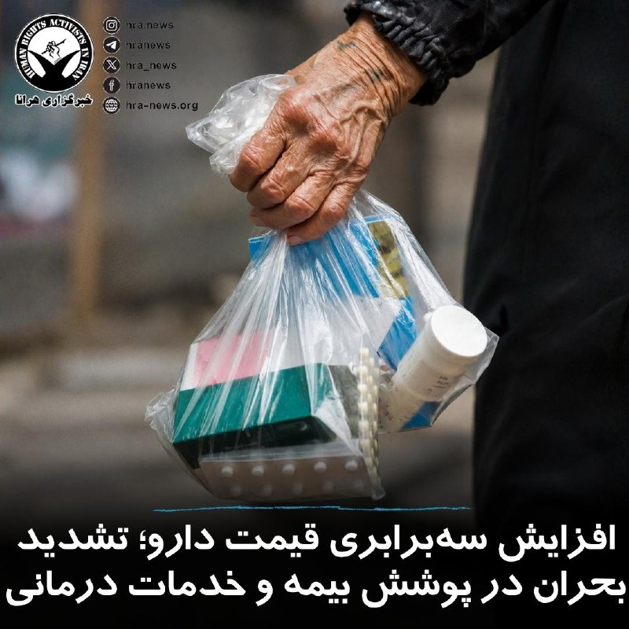

همزمان با افزایش چشمگیر قیمت #دارو در ماه‌های اخیر، شماری از داروخانه‌ها و مراکز درمانی همکاری خود با بیمه‌های درمانی را متوقف کرده‌اند یا برخی داروهای دارای پوشش بیمه بالا را عرضه نمی‌کنند. خبرگزاری فارس با انتشار گزارشی در این رابطه نوشته است که قیمت برخی داروها طی سه تا چهار ماه گذشته تا سه برابر افزایش یافته است. در مقابل، شرکت‌های بیمه‌ای نیز مطالبات داروخانه‌ها را با تاخیر چندماهه پرداخت می‌کنند؛ موضوعی که به گفته داروخانه‌داران، فروش دارو با نرخ بیمه‌ای را از نظر اقتصادی دشوار کرده است.

برخی بیماران برای تهیه داروهای حیاتی از جمله انسولین، داروهای قلب و فشار خون، ناچار به پرداخت هزینه‌های چندمیلیونی شده‌اند. بهمن صبور، عضو هیئت‌مدیره انجمن داروسازان ایران، با اشاره به پرداخت نقدی هزینه دارو توسط داروخانه‌ها و تاخیر طولانی بیمه‌ها در بازپرداخت مطالبات، این روند را برای مراکز درمانی زیان‌بار توصیف کرده است.

↘️
@hranews_bot تماس ✉️ - @Hranews کانال هرانا 🆑

## manototv — post 105443

  <a href="telegram/content/manototv_105443_1778761486.mp4" target="_blank">🎬 Download video</a>

کاخ سفید اعلام کرد دونالد ترامپ و شی جین‌پینگ در دیدار خود در پکن درباره جنگ ایران، امنیت تنگه هرمز و برنامه هسته‌ای جمهوری اسلامی گفت‌وگو کرده‌اند.
بر اساس بیانیه کاخ سفید، دو طرف توافق کردند تنگه هرمز باید برای حفظ جریان آزاد انرژی باز بماند. شی جین‌پینگ همچنین مخالفت چین با نظامی‌سازی تنگه هرمز و هرگونه دریافت عوارض برای عبور کشتی‌ها را مطرح کرده است.
در این بیانیه آمده است رئیس‌جمهوری چین از تمایل پکن برای خرید بیشتر نفت آمریکا به‌منظور کاهش وابستگی به تنگه هرمز خبر داده و دو کشور نیز توافق کرده‌اند جمهوری‌اسلامی نباید به سلاح هسته‌ای دست پیدا کند.
کاخ سفید همچنین اعلام کرد دو رهبر درباره همکاری اقتصادی و مقابله با ورود مواد اولیه فنتانیل به آمریکا گفت‌وگو کرده‌اند.
در حالی که بیانیه چین تنها اشاره کوتاهی به موضوع ایران داشت، موضوع تایوان که شی جین‌پینگ آن را «مهم‌ترین مسئله» خوانده بود، در بیانیه واشینگتن مطرح نشد.

## manototv — post 105442

  <a href="telegram/content/manototv_105442_1778761487.mp4" target="_blank">🎬 Download video</a>

ترامپ در ضیافت شام رسمی که شی جین‌پینگ، رئیس‌جمهوری چین، در تالار بزرگ خلق پکن برگزار کرده حضور یافت.
ترامپ از شی جین‌پینگ و همسرش، پنگ لی‌یوان، برای سفر به آمریکا و حضور در کاخ سفید در ۲۴ سپتامبر دعوت کرد و گفت: «مایه افتخار من است که این دعوت را مطرح می‌کنم.»

## manototv — post 105441

  <a href="telegram/content/manototv_105441_1778761488.mp4" target="_blank">🎬 Download video</a>

معین، خواننده شهیر در صفحه اینستاگرام خود با انتشار متنی، شایعات مطرح شده در خصوص اجرا برای تیم فوتبال در جام جهانی را تکذیب کرد. معین در متن خود از جمله نوشته: «عشق من به مردم و سرزمینم همیشه واقعی بوده. اما صدای من زمانی معنا دارد که دل مردم آرام باشد و حال ایران خوب»
روز گذشته اظهارات مهدی تاج، رئیس فدراسیون فوتبال جمهوری‌اسلامی به شایعاتی از این دست دامن زده بود.

## manototv — post 105440

  <a href="telegram/content/manototv_105440_1778761489.mp4" target="_blank">🎬 Download video</a>

مهدی تاج، رئیس فدراسیون فوتبال جمهوری‌اسلامی گفته «مسئله ویزا حل نشده و هنوز هیچ روادیدی برای اعضای تیم ملی فوتبال ایران صادر نشده است.» و افزوده «منتظریم ببینیم رفتار طرف مقابل چیست.»
او از «جلسه سرنوشت‌ساز» با فیفا صحبت به میان آورده چرا که به گفته تاج فیفا «باید به ما گارانتی بدهد»

## alonews — post 119924

  <a href="telegram/content/alonews_119924_1778761490.webm" target="_blank">🎬 Download video</a>

👈یسرائیل کاتز، وزیر دفاع اسرائیل درباره ایران: ماموریت ما کامل نشده؛ ما برای احتمال اینکه ممکنه مجبور شیم دوباره اقدام کنیم، شاید حتی «بزودی» آماده‌ایم. گر اهدافمون تأمین نشن، دوباره اقدام خواهیم کرد.

✅ @AloNews خبر جنگ

## alonews — post 119923

  <a href="telegram/content/alonews_119923_1778761490.webm" target="_blank">🎬 Download video</a>

👈ترامپ توی چین یه جوری رفتار میکنه انگار اون میزبانه و رئیس جمهور چین اومده آمریکا.

✅ @AloNews خبر جنگ

## alonews — post 119922

  <a href="telegram/content/alonews_119922_1778761490.webm" target="_blank">🎬 Download video</a>

👈اکسیوس:
یک مشاور ترامپ اذعان کرد مشکل این است که «ایران زمان بیشتری دارد و آنها روی تقویم سیاسی ما حساب باز کرده‌اند تا به سودشان تمام شود.»

✅ @AloNews خبر جنگ

## alonews — post 119921

  <a href="telegram/content/alonews_119921_1778761490.webm" target="_blank">🎬 Download video</a>

👈وزیر خزانه‌داری آمریکا: باز شدن تنگه هرمز به نفع چین خواهد بود و انتظار داریم قیمت نفت در شش ماه آینده کاهش یابد.

✅ @AloNews خبر جنگ

## alonews — post 119920

  <a href="telegram/content/alonews_119920_1778761491.webm" target="_blank">🎬 Download video</a>

👈آکسیوس: ترامپ احتمالا بعد از برگشت از چین‌ گام بعدی خودش رو در مقابل ایران برمیداره. یا پروژه آزادی و باز کردن تنگه هرمز رو از سر میگیره یا حملات نظامی رو شروع میکنه.

✅ @AloNews خبر جنگ

## alonews — post 119919

  <a href="telegram/content/alonews_119919_1778761491.mp4" target="_blank">🎬 Download video</a>

👈حرکات عجیب ایلان ماسک بعد مستی

✅ @AloNews خبر جنگ

## alonews — post 119918

  <a href="telegram/content/alonews_119918_1778761492.webm" target="_blank">🎬 Download video</a>

👈ترامپ از شی جین‌پینگ دعوت کرد تا در تاریخ ۲۴ سپتامبر از کاخ سفید بازدید کند.

✅ @AloNews خبر جنگ

## alonews — post 119917

  <a href="telegram/content/alonews_119917_1778761493.webm" target="_blank">🎬 Download video</a>

👈صداوسیما به‌نقل از نیروی دریایی سپاه:
از شب گذشته تاکنون ۳۰ فروند کشتی از تنگۀ هرمز با مجوز ایران عبور کرده‌اند.

✅ @AloNews خبر جنگ

## alonews — post 119916

  <a href="telegram/content/alonews_119916_1778761493.mp4" target="_blank">🎬 Download video</a>

👈اسکات بسنت، وزیر خزانه‌داری آمریکا :

- تا الان امسال سی و چهل هزار نفر رو اعدام کردن و خیلی‌هاشون هم معترضای مسالمت‌آمیز بودن
- خب با همچین رژیمی چطور باید برخورد کرد؟
- از نظر اقتصادی خفش می‌کنیم،و فکر می‌کنیم کار به جایی رسیده که سربازاشون حقوق نمی‌گیرن
- نمی‌تونن از خارج هم سلاح و مهماتشون رو تأمین کنن
- برای همین فکر می‌کنم دیگه دارن به آخر خط می‌رسن

✅ @AloNews خبر جنگ

## alonews — post 119915

  

صدا و سیما: قراره محرم یه سریال کاملا جدید و خفن به اسم مختارنامه از شبکه آی فیلم پخش کنیم.

[@AloTweet]

## alonews — post 119914

  <a href="telegram/content/alonews_119914_1778761495.webm" target="_blank">🎬 Download video</a>

👈شهبازی،مجری صداوسیما: بهترین کاری که جمهوری اسلامی تو 47 سال گذشته انجام داد ملی کردن اینترنت و دادن اينترنت به اهلش بود نه يه مشت مزدور داخلی!

✅ @AloNews خبر جنگ

## alonews — post 119913

  <a href="telegram/content/alonews_119913_1778761496.mp4" target="_blank">🎬 Download video</a>

👈تصاویری از ایلان ماسک که در ضیافت شام پکن با حضور شی و ترامپ

✅ @AloNews خبر جنگ

## alonews — post 119912

  <a href="telegram/content/alonews_119912_1778761498.webm" target="_blank">🎬 Download video</a>

👈خبرنگار صداوسیما به نقل از نیروی دریایی سپاه: از شب گذشته تاکنون ۳۰ فروند کشتی از تنگه هرمز با مجوز ایران عبور کرده‌اند

✅ @AloNews خبر جنگ

## alonews — post 119911

  <a href="telegram/content/alonews_119911_1778761498.webm" target="_blank">🎬 Download video</a>

👈ترامپ : گفت‌وگوهاش با شی جین‌پینگ «سازنده» بوده و برای هر دو کشور مفید بود

🔴 ترامپ به‌طور رسمی از شی جین‌پینگ دعوت کرد که در ۲۴ سپتامبر به آمریکا و کاخ سفید سفر کنه

✅ @AloNews خبر جنگ

## alonews — post 119910

  <a href="telegram/content/alonews_119910_1778761498.webm" target="_blank">🎬 Download video</a>

👈شی جین‌پینگ دوباره تأکید کرد که کشورهای ما باید به جای رقیب، شریک باشن

🔴به آینده روشن روابط چین و آمریکا

🔴به دوستی میان مردم دو کشور، و به سلامتی رئیس‌جمهور ترامپ و همه دوستان ی پیک عرق میخورم

✅ @AloNews خبر جنگ

---
📅 بروزرسانی: 1405/02/24 14:16
---

## VahidOOnLine — post 240086

⭕️حمله گسترده موشکی و پهپادی روسیه به کی‌یف دست‌کم سه کشته و ده‌ها زخمی برجا گذاشت

♦️روسیه بامداد پنج‌شنبه با صدها پهپاد و ده‌ها موشک، کی‌یف را هدف حملات گسترده قرار داد؛ حملاتی که به گفته مقام‌های اوکراینی دست‌کم سه کشته و ۴۰ زخمی، از جمله دو کودک برجا گذاشت.

تصاویری که خبرگزاری فرانسه منتشر کرده، عملیات امدادگران برای بیرون کشیدن زخمی‌ها از زیر آوار ساختمان‌های مسکونی را نشان می‌دهد.

نیروی هوایی ارتش اوکراین اعلام کرد روسیه ۶۷۵ پهپاد و ۵۶ موشک شلیک کرده که بخش عمده آن‌ها به سمت پایتخت بوده است.

ولودیمیر زلنسکی، رئیس‌جمهوری اوکراین گفت: بیش از ۲۰ نقطه در کی‌یف، از جمله ساختمان‌های مسکونی، مدرسه و مراکز غیرنظامی آسیب دیده‌اند.

زلنسکی در واکنش به سخنان دیروز دمیتری پسکوف، سخنگوی کرملین که گفته بود «جنگ به پایان خود نزدیک شده است» تاکید کرد این حملات نشان می‌دهد جنگ هنوز به پایان نزدیک نشده است.
‌🇸🇦 Indypersian

🤖 @VahidOOnLine

## VahidOOnLine — post 240085

  <a href="telegram/content/VahidOOnLine_240085_1778755614.mp4" target="_blank">🎬 Download video</a>

روزنامه نیویورک‌تایمز گزارش داد نهادهای اطلاعاتی آمریکا معتقدند شرکت‌های چینی درباره ارسال مخفیانه تسلیحات به جمهوری اسلامی از طریق کشورهای ثالث گفت‌وگو کرده‌اند تا منشأ این محموله‌ها پنهان بماند.
این گزارش ساعاتی پس از ورود دونالد ترامپ به پکن منتشر شد و می‌تواند فشارها بر رئیس‌جمهوری آمریکا را برای درخواست از شی جین‌پینگ به‌منظور قطع حمایت از جمهوری اسلامی افزایش دهد.
بر اساس این گزارش، مقام‌های آمریکایی بر سر این‌که آیا این انتقال‌ها بالفعل انجام شده یا نه اختلاف نظر دارند، اما گفته‌اند چنین اقداماتی بعید است بدون اطلاع مقام‌های ارشد چینی صورت گرفته باشد.
رسانه‌های آمریکایی پیش‌تر نیز گزارش داده بودند چین موشک‌های دوش‌پرتاب ضدهوایی به جمهوری اسلامی ارسال کرده است؛ تسلیحاتی که می‌توانند هواپیماها و پهپادها را هدف قرار دهند. همچنین گفته می‌شود تهران در سال ۲۰۲۴ یک ماهواره جاسوسی چینی دریافت کرده که برای شناسایی نیروهای آمریکایی در خاورمیانه از آن استفاده می‌کند.
در همین حال، گزارش‌هایی از بازسازی توان موشکی جمهوری اسلامی پس از حملات آمریکا و اسرائیل منتشر شده است. بر اساس ارزیابی سازمان سیا، بخش قابل توجهی از موشک‌های بالستیک و پرتابگرهای متحرک ایران همچنان سالم مانده‌اند.
‌🏁 🇬🇧 ManotoTV

🤖 @VahidOOnLine

## VahidOOnLine — post 240084

  <a href="telegram/content/VahidOOnLine_240084_1778755615.mp4" target="_blank">🎬 Download video</a>

بانک مرکزی ترکیه هدف تورم پایان سال ۲۰۲۶ را از ۱۶ به ۲۴ درصد افزایش داد و اعلام کرد پیامدهای جنگ ایران و اسرائیل و افزایش تنش‌ها در خاورمیانه، فشارهای تورمی را تشدید کرده است. رئیس بانک مرکزی ترکیه گفت افزایش بهای انرژی و اختلال در عرضه، به‌ویژه برای اقتصادهای وابسته به واردات مانند ترکیه، یک ریسک جدی محسوب می‌شود. این بانک همچنین پیش‌بینی تورم پایان ۲۰۲۷ را از ۹ به ۱۵ درصد افزایش داد. نرخ تورم ماهانه ترکیه در آوریل به بیش از ۴ درصد و تورم سالانه به حدود ۳۲ درصد رسید.
‌🏁 🇬🇧 ManotoTV

🤖 @VahidOOnLine

## VahidOOnLine — post 240083

  <a href="telegram/content/VahidOOnLine_240083_1778755616.mp4" target="_blank">🎬 Download video</a>

مرکز عملیات تجارت دریایی بریتانیا (UKMTO) در یک هشدار امنیتی اعلام کرد یک کشتی در دریای عمان، در حالی که در لنگرگاه قرار داشت، توسط «افراد غیرمجاز» تصرف شده و اکنون به سمت آب‌های سرزمینی ایران در حرکت است.
بر اساس هشدار رسمی UKMTO، این حادثه حدود ۳۸ مایل دریایی شمال شرقی فجیره امارات متحده عربی رخ داده است. هویت کشتی و جزئیات بیشتر درباره مهاجمان هنوز اعلام نشده است.
این نهاد بریتانیایی اعلام کرد در حال بررسی موضوع است و از همه شناورها خواسته هرگونه فعالیت مشکوک را فورا گزارش دهند.
هشدار صبح امروز چهارشنبه منتشر شده و نشان‌دهنده یک رخداد امنیتی تازه و حساس در آبراه‌های منطقه است.
اگرچه این نهاد هنوز درباره عاملان احتمالی این حادثه اظهار نظر نکرده، اما چنین هشدارهایی معمولا در موارد مرتبط با توقیف کشتی‌ها، دزدی دریایی یا عملیات نیروهای نظامی و شبه‌نظامی در منطقه صادر می‌شود.
‌🏁 🇬🇧 ManotoTV

🤖 @VahidOOnLine

## VahidOOnLine — post 240082

  

خبرگزاری فارس، وابسته به سپاه پاسداران به نقل از «منبع آگاه» نوشت: «با تصمیم جمهوری اسلامی، عبور شماری از کشتی‌های چینی از تنگه هرمز، از شامگاه چهارشنبه، ۲۳ اردیبهشت و پس از توافق بر سر پروتکل‌های مدیریت جمهوری اسلامی بر این آبراه آغاز شده است.»

بر اساس این گزارش، این تصمیم پس از پیگیری‌های مقام‌های چین و در چارچوب «روابط راهبردی» تهران و پکن اتخاذ شد و کشتی‌های مورد درخواست چین اجازه عبور یافتند.
‌🏁 🇬🇧 IranintlTV

🤖 @VahidOOnLine

## VahidOOnLine — post 240081

  

عباس عراقچی، وزیر خارجه جمهوری اسلامی که برای شرکت در اجلاس بریکس، به دهلی نو سفر کرده، گفت: «امارات متحده عربی مستقیما در جنگ علیه ما دخیل بود.»
او خطاب به اماراتی‌ها گفت: «ائتلاف با اسرائیل هم از شما محافظت نکرد.»

عراقچی ادامه داد: «اماراتی‌ها اجازه دادند از سرزمین‌شان برای شلیک توپخانه و تجهیزات علیه ما استفاده شود.»

وزیر خارجه جمهوری اسلامی افزود: «امارات متحده عربی شریک فعال جنگ علیه ماست و هیچ تردیدی در این باره وجود ندارد و ما شگفت‌زده شدیم که برادران ما در امارات متحده عربی تصمیم گرفتند فعالانه به جنگ علیه ما بپیوندند.»

عراقچی تاکید کرد: «همدستی امارات متحده عربی با اسرائیل غیرقابل بخشش است.»
‌🏁 🇬🇧 IranintlTV

🤖 @VahidOOnLine

## VahidOOnLine — post 240080

  

♦️امیرمهدی علوی، سخنگوی فدراسیون فوتبال جمهوری اسلامی ایران روز پنجشنبه اعلام کرد روند اداری دریافت ویزای کاروان اعزامی ایران به جام‌جهانی در امارات انجام شده و فدراسیون همچنان منتظر پاسخ آمریکاست.
او گفت در صورت صادر نشدن ویزا برای برخی بازیکنان، کادر فنی گزینه‌های جایگزین را در نظر گرفته است.

 علوی همچنین از برگزاری نشست رئیس فدراسیون فوتبال با مقام‌های فیفا در ترکیه طی ۴۸ ساعت آینده خبر داد و گفت موضوع صدور ویزا، نخستین خواسته مطرح‌شده از سوی ایران خواهد بود.
در فاصله کمتر از یک ماه تا آغاز جام‌جهانی، تاخیر در صدور ویزای آمریکا به یکی از چالش‌های اصلی تیم ملی تبدیل شده و گزارش‌ها حاکی است احتمال رد ویزای برخی اعضای کاروان به‌دلیل سوابق یا ارتباط با سپاه پاسداران وجود دارد.
‌🇸🇦 Indypersian

🤖 @VahidOOnLine

## VahidOOnLine — post 240079

  

♦️عباس عراقچی، وزیر امور خارجه جمهوری اسلامی روز پنجشنبه ۲۴ اردیبهشت و در زمان حضور در اجلاس وزرای امور خارجه بریکس، امارات را به مشارکت فعال در جنگ آمریکا و اسرائیل علیه ایران متهم کرد.

براساس پیامی که در کانال تلگرام عباس عراقچی منتشر شده، وزیر امور خارجه جمهوری اسلامی در واکنش به آنچه «ادعاهای امارات در اجلاس بریکس» نوشت: حتی ائتلاف با اسرائیل هم از شما محافظت نکرد.

در پیام عراقچی آمده است: «من در سخنرانی‌ خود نام امارات متحده عربی را ذکر نکردم، به خاطر حفظ وحدت و ترجیح دادم به آن اشاره نکنم. اما در واقع باید بگویم که امارات مستقیما در اقدام تجاوزکارانه علیه کشور من دخیل بود. زمانی که این تجاوز آغاز شد، آنها حتی از محکوم کردن آن خودداری کردند.
آنها اجازه دادند از سرزمین‌شان برای شلیک توپخانه و تجهیزات علیه ما استفاده شود.»

عراقچی با اشاره به اعلام خبر دولت اسرائیل درباره سفر «مخفیانه» بنیامین نتانیاهو به امارات در دوران جنگ نوشت: «همین دیروز فاش شد که نتانیاهو در زمان جنگ به امارات و ابوظبی سفر کرده بود. همچنین آشکار شد که آنها در این حملات مشارکت داشته‌اند و شاید حتی مستقیما علیه ما اقدام کرده باشند. بنابراین امارات شریک فعال این تجاوز است و هیچ تردیدی در این باره وجود ندارد.»
‌🇸🇦 Indypersian

🤖 @VahidOOnLine

## VahidOOnLine — post 240078

  

♦️فیفا اعلام کرد مدونا، شکیرا و گروه کره‌ای بی‌تی‌اس در نخستین اجرای بین دو نیمه فینال جام جهانی فوتبال، روز ۲۸ تیر در ورزشگاه مت‌لایف نیوجرسی روی صحنه خواهند رفت.
به گزارش خبرگزاری فرانسه، کریس مارتین، خواننده گروه کلدپلی، مدیریت هنری این برنامه را برعهده دارد. برنامه‌ای که برای نخستین بار در تاریخ فینال جام جهانی برگزار می‌شود و همزمان نگرانی‌هایی را درباره طولانی شدن زمان استراحت بین دو نیمه ایجاد کرده است.
جام جهانی ۲۰۲۶ با حضور ۴۸ تیم از ۲۱ خرداد تا ۲۸ تیر ۱۴۰۵ به میزبانی مشترک آمریکا، کانادا و مکزیک برگزار می‌شود و بزرگ‌ترین دوره تاریخ این رقابت‌ها خواهد بود.
جیانی اینفانتینو، رئیس فیفا، پیش‌تر اعلام کرده بود فینال جام جهانی ۲۰۲۶ برای نخستین بار شاهد اجرای موسیقی بین دو نیمه خواهد بود، اما در آن زمان جزئیاتی درباره اجراکنندگان یا مدت زمان برنامه ارائه نکرده بود.
رئیس فیفا روز پنجشنبه، در اینستاگرام نوشت: «این یک لحظه تاریخی برای جام جهانی فوتبال و نمایشی درخور بزرگ‌ترین رویداد ورزشی جهان خواهد بود.»
در فینال جام جهانی باشگاه‌های فیفا که سال گذشته در همین ورزشگاه برگزار شده بود، کنسرت بین دو نیمه باعث شد زمان استراحت از ۱۵ دقیقه استاندارد فراتر برود.
اینفانتینو همچنین اعلام کرد فیفا قصد دارد در آخر هفته پایانی جام جهانی، میدان تایمز نیویورک را نیز به مرکز برنامه‌های ویژه این رقابت‌ها تبدیل کند.
فیفا اعلام کرد کنسرت بین دو نیمه در حمایت از «صندوق آموزش شهروند جهانی فیفا» برگزار می‌شود، طرحی که هدف آن جمع‌آوری ۱۰۰ میلیون دلار برای حمایت از کودکان در سراسر جهان است.

شکیرا غیر از این برنامه، با همکاری خواننده نیجریه‌ای، برنا بوی، ترانه «دای دای» را برای جام‌جهانی فوتبال ۲۰۲۶ آماده کرده است.
‌🇸🇦 Indypersian

🤖 @VahidOOnLine

## VahidOOnLine — post 240077

  <a href="telegram/content/VahidOOnLine_240077_1778755621.mp4" target="_blank">🎬 Download video</a>

بر اساس گزارش‌های منتشرشده در شبکه‌های اجتماعی، خاطره خدادادی، دانشجوی رشته دندانپزشکی در بلاروس، پس از اظهار نظر درباره مسائل ایران در یک کانال تلگرامی، با دخالت سفارت جمهوری اسلامی بازداشت و به ۱۴ روز زندان محکوم شده است.
به گفته نزدیکان او، قرار بود دهم اردیبهشت آزاد شود، اما همچنان در بازداشت به‌سر می‌برد و وضعیت تحصیل و اقامتش نامشخص است. همچنین گزارش شده که او در مدت بازداشت از دسترسی به وکیل و تماس با دوستانش محروم بوده است.
‌🏁 🇬🇧 ManotoTV

🤖 @VahidOOnLine

## VahidOOnLine — post 240076

  

♦️ارتش اسرائیل روز پنجشنبه ۲۴ اردیبهشت اعلام کرد پس از سقوط یک پهپاد انفجاری حزب‌الله در نزدیکی مرز اسرائیل و لبنان، سه غیرنظامی اسرائیلی زخمی و به بیمارستان منتقل شدند.

این خبر در حالی اعلام می‌شود که آتش‌بس میان اسرائیل و حزب‌الله که سه هفته گذشته اعلام شد، عملا اجرا نمی‌شود.
‌🇸🇦 Indypersian

🤖 @VahidOOnLine

## VahidOOnLine — post 240075

  

♦️کاخ سفید، روز پنجشنبه ۲۴ اردیبهشت ماه، با انتشار بیانیه‌ای درباره دیدار دونالد ترامپ و شی جین‌پینگ اعلام کرد دو طرف درباره جنگ ایران، امنیت تنگه هرمز و گسترش همکاری‌های اقتصادی میان آمریکا و چین گفتگو کردند.
بر اساس بیانیه کاخ سفید، دو طرف درباره راه‌های تقویت همکاری اقتصادی میان دو کشور، از جمله گسترش دسترسی شرکت‌های آمریکایی به بازار چین و افزایش سرمایه‌گذاری چین در صنایع آمریکا گفتگو کردند. تعدادی از مدیران بزرگ‌ترین شرکت‌های آمریکایی نیز در بخشی از این نشست حضور داشتند.
کاخ سفید همچنین اعلام کرد واشنگتن و پکن توافق دارند که تنگه هرمز باید برای تضمین جریان آزاد انرژی باز بماند.
در این بیانیه آمده است شی جین‌پینگ مخالفت چین با «نظامی‌سازی تنگه هرمز» و هرگونه تلاش برای دریافت عوارض از کشتی‌ها را اعلام کرده و همچنین نسبت به خرید بیشتر نفت آمریکا برای کاهش وابستگی چین به تنگه هرمز در آینده ابراز علاقه کرده است.
در بیانیه کاخ سفید آمده است آمریکا و چین توافق دارند که «ایران هرگز نباید به سلاح هسته‌ای دست پیدا کند.»
برخلاف روایت منتشرشده از سوی پکن، در بیانیه کاخ سفید اشاره‌ای به موضوع تایوان نشده است.
‌🇸🇦 Indypersian

🤖 @VahidOOnLine

## VahidOOnLine — post 240074

  

⭕️نتانیاهو: سرطانم درمان شده و در بهترین وضعیت سلامتی هستم

♦️بنیامین نتانیاهو، نخست‌وزیر اسرائیل، در جلسه دادگاه رسیدگی به پرونده‌های مرتبط با افترا در تل‌آویو گفت وضعیت جسمی‌اش «خوب، حتی عالی» است و تاکید کرد که در «بالاترین سطح سلامت» قرار دارد.

او این اظهارات را در جریان رسیدگی به شکایت افترا علیه دو روزنامه‌نگار و یک فعال سیاسی مطرح کرد؛ افرادی که مدعی شده بودند نتانیاهو در سال ۲۰۲۴ به بیماری‌های جدی مبتلا بوده است.

نتانیاهو گفت هرگز به سرطان لوزالمعده مبتلا نبوده و اگر چنین ادعایی درست بود، «تا حالا مرده بود». او توضیح داد که در دسامبر ۲۰۲۴ به‌دلیل بزرگی پروستات تحت عمل جراحی قرار گرفت و در اواخر سال ۲۰۲۵ ابتلا به سرطان پروستات در او تشخیص داده شد.
به گفته نتانیاهو، او در ژانویه و فوریه ۲۰۲۶ پنج جلسه پرتودرمانی انجام داد و این درمان‌ها سرطان را به‌طور کامل از بین برده‌اند. این نخستین بار است که او جدول زمانی دقیق ابتلا و درمان سرطان خود را علنی می‌کند.

با این حال، رسانه‌های عبری‌زبان نوشته‌اند این روایت تا حدی با اظهارات پزشک معالج او، پروفسور آرون پوپوتزر، تفاوت دارد؛ پزشکی که در پایان آوریل گفته بود پرتودرمانی نتانیاهو حدود دو ماه و نیم پیش آغاز شده بود، یعنی حدود هفته دوم فوریه.
نتانیاهو همچنین گفت دستگاه ضربان‌ساز قلبی که در سال ۲۰۲۳ برای او کار گذاشته شد، تاکنون هرگز فعال نشده است. او تاکید کرد وضعیت جسمی‌اش رو به بهبود بوده و بنا بر همه شاخص‌ها، نه در حد متوسط یا خوب، بلکه در «۱۰ درصد بالای مقیاس سلامت» قرار دارد.
‌🇸🇦 Indypersian

🤖 @VahidOOnLine

## VahidOOnLine — post 240073

  <a href="telegram/content/VahidOOnLine_240073_1778755625.mp4" target="_blank">🎬 Download video</a>

رسانه‌های داخلی ایران گزارش دادند زمین‌لرزه‌ای به بزرگی ۵ ریشتر منطقه بردسیر در استان کرمان را لرزاند.
بر اساس این گزارش‌ها، کانون زلزله در عمق ۸ کیلومتری زمین و در نزدیکی روستای کمال‌آباد از توابع شهرستان بردسیر بوده است. هلال‌احمر اعلام کرد دو تیم ارزیاب برای بررسی وضعیت به منطقه اعزام شده‌اند.
‌🏁 🇬🇧 ManotoTV

🤖 @VahidOOnLine

## VahidOOnLine — post 240072

  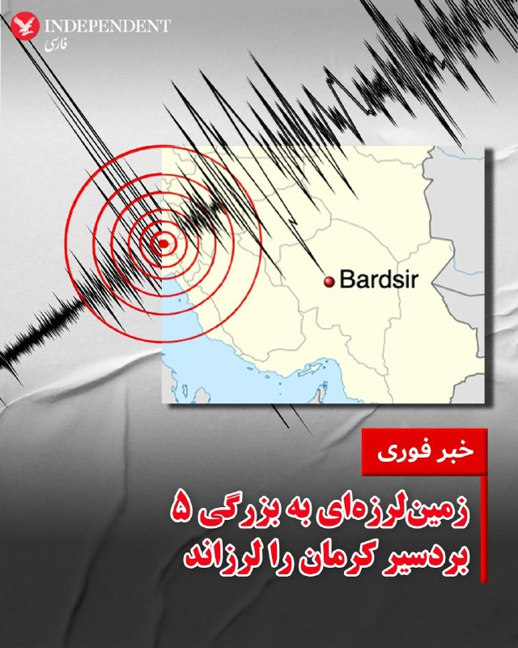

♦️ساعت ۱۱:۱۷ دقیقه روز پنجشنبه ۲۴ اردیبهشت ماه، زمین لرزه‌ای به بزرگی پنج و در عمق هشت کیلومتری زمین، شهرستان بردسیر در کرمان را لرزاند.
به گفته رسانه‌های رسمی ایران، هنوز از خسارات احتمالی این زلزله گزارشی منتشر نشده است.
‌🇸🇦 Indypersian

🤖 @VahidOOnLine

## VahidOOnLine — post 240071

  <a href="telegram/content/VahidOOnLine_240071_1778755627.mp4" target="_blank">🎬 Download video</a>

گروه ناظر اینترنتی نت‌بلاکس اعلام کرد قطعی اینترنت در ایران امروز وارد هفتادوششمین روز خود شده و از مرز ۱۸۰۰ ساعت گذشته است.
نت‌بلاکس می‌گوید این محدودیت‌ها بر پایه دسترسی گزینشی و طبقاتی اعمال شده؛ به‌طوری که گروه‌های خاص به اینترنت دسترسی دارند، اما بخش بزرگی از شهروندان همچنان با محدودیت و اختلال گسترده مواجه‌اند
‌🏁 🇬🇧 ManotoTV

🤖 @VahidOOnLine

## VahidOOnLine — post 240070

  

منوچهر متکی، نماینده مجلس و وزیر خارجه پیشین جمهوری اسلامی، گفت برخی از پهپادهایی که به ایران حمله کردند متعلق به امارات متحده عربی بوده است. او تاکید کرد که «حجت بر تمام کشورهای منطقه تمام شده است.»

متکی گفت: «برخی از پهپادهایی که به ایران زده می‌شد پهپادهای امارات متحده عربی بود و قابل کتمان نیست. این اطلاعات نزد ما است.»

متکی با اشاره به روابط جمهوری اسلامی با کشورهای منطقه گفت: «یک مسئله‌ای داریم که در ۴۷ سال گذشته تحت تاثیر دیگران، کشورهای منطقه روابط صادقانه و خوبی با ما نداشتند. اما ما حسن همسایگی را رعایت کردیم.»
‌🏁 🇬🇧 IranintlTV

🤖 @VahidOOnLine

## VahidOOnLine — post 240069

  

زمین‌لرزه‌ای به بزرگی ۵ منطقه بردسیر در استان کرمان را لرزاند. این زمین‌لرزه در عمق ۸ کیلومتری زمین رخ داد. جزییات بیشتری درباره خسارات احتمالی یا تلفات این زمین‌لرزه منتشر نشده است.
‌🏁 🇬🇧 IranintlTV

🤖 @VahidOOnLine

## mwarmonitor — post 9069

  

🇮🇳هند اعلام کرد که یک کشتی با پرچم هند روز چهارشنبه در سواحل عمان مورد حمله قرار گرفته است.
🚢این کشتی پیدا نشده و احتمالاً با سامانه AIS خاموش در حال تردد بوده است. همچنین از چند هفته پیش یک ناو جنگی هندی برای حفاظت از کشتی‌های این کشور در دریای عمان مستقر است.

@mwarmonitor

## mwarmonitor — post 9068

  

✈️📡 هواپیمای P-8A پوزایدون نیروی دریایی US Navy در سواحل پاکستان فعال بوده و احتمالاً در حال پایش نفتکش‌های ایرانی لنگرگرفته در آن منطقه بوده است.

@mwarmonitor

## mwarmonitor — post 9067

  

🔴عبور از تنگه هرمز صبح امروز:

🚢• نفتکش گاز مایع (LPG) «ROYAL H» که تحت تحریم‌های آمریکا قرار دارد
🚢• نفتکش نفت «SWIFT FALCON» متعلق به چین
🚢• نفتکش نفت «TREND» با ثبت امارات (اما نه با مالکیت اماراتی)
🚢• نفتکش نفت «RAISSA» متعلق به چین

🔸احتمالاً شناوری که توقیف شد، به‌صورت پنهانی در حال حرکت بوده است.

@mwarmonitor

## mwarmonitor — post 9066

🔴نقل‌قول جنجالی ترامپ؛ بن‌بست او در برابر ایران و تورم

📝نویسندگان: دیو لاولر، باراک راوید AXIOS

🔰جمله اخیر رئیس‌جمهور ترامپ مبنی بر اینکه در زمان تصمیم‌گیری درباره اقدامات بعدی در قبال ایران، «به وضعیت مالی آمریکایی‌ها فکر نمی‌کنم»، ناخواسته نشان‌دهنده بن‌بست اساسی اوست: چگونه می‌توان بدون آشفته کردن بازارها و جهش قیمت نفت، بر ایران فشار آورد؟

چرا این موضوع مهم است؟
ترامپ در حال حاضر راه حل مشخصی ندارد که بتواند تمایل خود برای پایان دادن به جنگ (طبق شروط خودش) را با نیاز به مهار تورم و پررونق نگه داشتن بازار سهام در یک سال انتخاباتی، همسو کند.
تحلیل پشت پرده
منظور واقعی ترامپ: به نظر می‌رسد منظور او در اظهارات روز سه‌شنبه این بوده که نگرانی‌های اقتصادی داخلی، او را از برداشتن گام‌های لازم برای جلوگیری از دستیابی ایران به سلاح هسته‌ای باز نخواهد داشت.
فرصت‌طلبی دموکرات‌ها: قطعا این ظرافت کلامی در تبلیغات انتخاباتی دموکرات‌ها گم خواهد شد و آن‌ها از این جمله برای حمله به او استفاده خواهند کرد.
دیدگاه مشاوران: یکی از مشاوران ترامپ به آکسیوس گفت: «رئیس‌جمهور می‌توانست کلمات بهتری انتخاب کند، اما واقعیت فکر او همین است.» مشاور دوم نیز تایید کرد که مشکل اینجاست که «ایران زمان بیشتری در اختیار دارد و آن‌ها روی تقویم سیاسی ما حساب باز کرده‌اند.»
نقطه اصطکاک
مقامات ایرانی به وضوح نشان داده‌اند که معتقدند زمان به نفع آن‌هاست و ترامپ نسبت به افزایش قیمت نفت و نوسانات بازار بسیار حساس است.
داده‌های اقتصادی: آمارهای اخیر که نشان‌دهنده جهش تورم ناشی از قیمت بنزین است، به جایگاه ترامپ آسیب می‌زند؛ به‌ویژه که نظرسنجی‌ها نشان می‌دهد رای‌دهندگان، رئیس‌جمهور و جمهوری‌خواهان را مقصر می‌دانند.
چالش انتخاباتی: نظرسنجی‌های حزب جمهوری‌خواه تایید می‌کنند که افزایش قیمت بنزین، تبلیغ دستاوردهایی مانند «کاهش مالیات» را دشوارتر می‌کند. با این حال، مشاوران ترامپ اصرار دارند که او در مورد «ایرانِ بدون سلاح هسته‌ای» جدی است و ملاحظات سیاسی را کنار گذاشته است.
تصویر کلی
ترامپ از زمان برقراری آتش‌بس در ۶ هفته پیش، نشان داده که به دنبال توافق است و تمایلی به ازسرگیری جنگ ندارد.
شکست مذاکرات: مذاکره‌کنندگان او فکر می‌کردند هفته گذشته به یک توافق مقدماتی با تهران نزدیک شده‌اند، اما پیشنهاد متقابل ایران، خواسته‌های هسته‌ای کلیدی ترامپ را نادیده گرفت.
تهدید به تشدید تنش: ترامپ موضع ایران را غیرقابل قبول خواند و تهدید کرد که ایران بهای سنگینی برای این انعطاف‌ناپذیری خواهد پرداخت. تیم او اکنون در حال بررسی گزینه‌های نظامی برای شکستن بن‌بست هستند، هرچند از خطرات تشدید آشفتگی اقتصادی آگاهند.
آنچه در پشت صحنه می‌گذرد
مقامات آمریکایی انتظار ندارند ترامپ در طول سفرش به چین اقدام دراماتیکی انجام دهد، اما معتقدند بلافاصله پس از آن، حرکت بعدی خود را انجام خواهد داد. گزینه‌های روی میز عبارتند از:
عملیات «آزادی» (Project Freedom): تلاش نیروی دریایی برای شکستن بن‌بست در تنگه هرمز.
حملات هوایی: راه‌اندازی کمپین بمباران جدید با تمرکز بر زیرساخت‌های ایران.
وضعیت اسرائیل: مقامات اسرائیلی می‌گویند در آخر هفته در حالت آماده‌باش کامل خواهند بود تا در صورت تصمیم ترامپ برای ازسرگیری جنگ، هماهنگی‌های لازم را انجام دهند.
خلاصه وضعیت
برخی مقامات معتقدند محاصره آمریکا در حال فشار آوردن به ایران است و ممکن است بدون درگیری نظامی هم باعث تسلیم شدن این کشور شود. با این حال، با توجه به موضع اخیر ایران، امیدها به توافق کمرنگ شده و انتظارات برای بازگشت درگیری‌ها افزایش یافته است.

📌نکته نهایی: ترامپ می‌گوید در صورت اتخاذ چنین تصمیمی، «حتی ذره‌ای» به مسائل مالی آمریکایی‌ها فکر نخواهد کرد. او با این کار، یک محتوای آماده برای تبلیغات تهاجمی دموکرات‌ها به آن‌ها هدیه داده است.

@mwarmonitor

## mwarmonitor — post 9065

🇬🇧وزیر دفاع بریتانیا ؛ حملات پهپادی شوکه‌کننده روسیه به اوکراین طی ۲۴ ساعت گذشته.

🔸من دستور داده‌ام که تحویل سامانه‌های پدافند هوایی و مقابله با پهپاد از سوی بریتانیا با حداکثر سرعت ممکن تسریع شود.

🔸ما در برابر تجاوز ولادیمیر پوتین در کنار اوکراین ایستاده‌ایم.
افکار و همدردی ما با خانواده‌های اوکراینی است.

@mwarmonitor

## mwarmonitor — post 9064

🟥شرکتUKMTO گزارشی از یک حادثه در ۳۸ مایل دریایی (38NM) شمال شرقی فجیره، امارات متحده عربی دریافت کرده است.
🔸افسر امنیتی شرکت (CSO) گزارش داده است که کشتی در زمان لنگر انداختن توسط افراد غیرمجاز تصرف شده و اکنون به سمت آب‌های سرزمینی ایران در حرکت است.

@mwarmonitor

## mwarmonitor — post 9063

🔴 پس از دیدار دونالد ترامپ و شی جین‌پینگ، یک مقام کاخ سفید اعلام کرد که چین و ایالات متحده آمریکا توافق دارند که ایران هرگز نباید به سلاح هسته‌ای دست یابد و تنگه هرمز باید باز بماند. i24 news

@mwarmonitor

## pm_afshaa — post 90724

  <a href="telegram/content/pm_afshaa_90724_1778755631.webm" target="_blank">🎬 Download video</a>

🔴آکسیوس: یکی از گزینه‌های ترامپ پس از بازگشت از چین از سر گیری پروژه آزادی در تنگه هرمز است. گزینه دیگر ترامپ حمله به زیرساخت‌های ایرانه.

💧 Rainbet.com the #1 Non-KYC Crypto Casino & Sportsbook @rainbetcom

😁 @Pm_Afshaa

## pm_afshaa — post 90723

  <a href="telegram/content/pm_afshaa_90723_1778755632.webm" target="_blank">🎬 Download video</a>

🔴فارس: با تصمیم جمهوری اسلامی عبور کشتی‌های چینی از تنگه هرمز آغاز شده.

💧 Rainbet.com the #1 Non-KYC Crypto Casino & Sportsbook @rainbetcom

😁 @Pm_Afshaa

## pm_afshaa — post 90722

  <a href="telegram/content/pm_afshaa_90722_1778755633.webm" target="_blank">🎬 Download video</a>

🔴یک مقام کاخ سفید به فاکس‌نیوز:
رئیس‌جمهور چین علاقه‌منده نفت بیشتری از آمریکا خریداری کنه تا وابستگی کشورش به تنگه هرمز رو کاهش بده.

💧 Rainbet.com the #1 Non-KYC Crypto Casino & Sportsbook @rainbetcom

😁 @Pm_Afshaa

## pm_afshaa — post 90721

  <a href="telegram/content/pm_afshaa_90721_1778755633.mp4" target="_blank">🎬 Download video</a>

ترامپ و شی موقع دست دادن سعی داشتن دستِ طرف مقابل رو سمت خودشون بکشن که همچین صحنه‌ای خلق شد :

💧 Rainbet.com the #1 Non-KYC Crypto Casino & Sportsbook @rainbetcom

😁 @Pm_Afshaa

## pm_afshaa — post 90720

  <a href="telegram/content/pm_afshaa_90720_1778755635.webm" target="_blank">🎬 Download video</a>

🔴ترامپ در دیدار با شی‌جین‌ پینگ: روابط آمریکا و چین بهتر از زمان دیگری خواهد شد.

شی هم ابراز امیدواری کرد سال 2026 نقطه‌عطفی در روابط چین و آمریکا باشه.

💧 Rainbet.com the #1 Non-KYC Crypto Casino & Sportsbook @rainbetcom

😁 @Pm_Afshaa

## pm_afshaa — post 90719

  <a href="telegram/content/pm_afshaa_90719_1778755636.webm" target="_blank">🎬 Download video</a>

🔴شی جین‌پینگ در دیدار با دونالد ترامپ:
همواره باور داشتم منافع مشترک چین و آمریکا بیشتر از اختلافاتشونه.

💧 Rainbet.com the #1 Non-KYC Crypto Casino & Sportsbook @rainbetcom

😁 @Pm_Afshaa

## pm_afshaa — post 90718

  <a href="telegram/content/pm_afshaa_90718_1778755637.webm" target="_blank">🎬 Download video</a>

🔴مدیر سرویس اطلاعات خارجی روسیه:
هیچ نشانه‌ای از پایان درگیری نظامی بر سر ایران وجود نداره و نمیشه موج جدیدی از تشدید تنش رو رد کرد.

💧 Rainbet.com the #1 Non-KYC Crypto Casino & Sportsbook @rainbetcom

😁 @Pm_Afshaa

## pm_afshaa — post 90717

  <a href="telegram/content/pm_afshaa_90717_1778755638.webm" target="_blank">🎬 Download video</a>

🔴مقامات اسرائیلی به آکسیوس:
ما در طول تعطیلات آخر هفته، وضعیت آماده‌باش رو به بالاترین سطح میبریم؛ چون احتمال میدیم ترامپ تصمیم بگیره جنگ رو از سر بگیره.

💧 Rainbet.com the #1 Non-KYC Crypto Casino & Sportsbook @rainbetcom

😁 @Pm_Afshaa

## pm_afshaa — post 90716

  <a href="telegram/content/pm_afshaa_90716_1778755638.webm" target="_blank">🎬 Download video</a>

🔴آکسیوس به نقل از مقامات آمریکایی:
محاصره‌ آمریکا بدجوری داره به ایران فشار میاره و ممکنه مجبورشون کنه که بدون نیاز به درگیری نظامی، تسلیم بشن.

💧 Rainbet.com the #1 Non-KYC Crypto Casino & Sportsbook @rainbetcom

😁 @Pm_Afshaa

## pm_afshaa — post 90715

🔴کاخ سفید: روسای جمهور آمریکا و چین درباره تقویت همکاری اقتصادی گفت‌وگو کردن

💧 Rainbet.com the #1 Non-KYC Crypto Casino & Sportsbook @rainbetcom

😁 @Pm_Afshaa

## pm_afshaa — post 90714

🔴سازمان تجارت دریایی بریتانیا اعلام کرد: قایق های تندرو سپاه یک کشتی را که خارج از تنگه هرمز لنگر انداخته بود را تهدید به هدف قرار دادن و سپس توقیف کردند و اکنون در حال بردن آن به سوی بنادر ایران هستن

💧 Rainbet.com the #1 Non-KYC Crypto Casino & Sportsbook @rainbetcom

😁 @Pm_Afshaa

## pm_afshaa — post 90713

🔴کاخ سفید : ترامپ و شی توافق کردن که تنگه هرمز باید باز بمونه

💧 Rainbet.com the #1 Non-KYC Crypto Casino & Sportsbook @rainbetcom

😁 @Pm_Afshaa

## iaghapour — post 2608

🔻سوپراپلیکیشن ایتا اعلام کرد امکان ارسال فایل تا حجم ۲۰ مگابایت مجدداً برای همه کاربران فراهم شده است!

کاش تلگرام بیاد از شما یاد بگیره :)

🆔 @iaghapour

## DEJradio — post 4629

  <a href="telegram/content/DEJradio_4629_1778755639.webm" target="_blank">🎬 Download video</a>

🔺📌 در اواسط جنگ گزارش شد مسعود پزشکیان به دنبال استعفاست اما نهادهای نظامی و امنیتی مخالف‌اند، اکنون گزارش‌های رسیده به دژ از تشدید اختلافات در سطوح عالی حکومت و افزایش فشارها علیه دولت مسعود پزشکیان حکایت دارد؛ تحولاتی که هم‌زمان با عمیق‌تر شدن بحران اقتصادی و افزایش نارضایتی‌های عمومی در ایران رخ می‌دهد.

بر اساس این گزارش‌ها، شماری از مقام‌های ارشد حکومتی از جمله نظامی‌ها با ابراز بی‌اعتمادی نسبت به سیاست‌ها و اصلاحات اقتصادی مسعود پزشکیان، دولت او را مسئول افزایش فشارهای معیشتی، تورم و نارضایتی اجتماعی می‌دانند.

منابع نزدیک به ساختار قدرت همچنین از آغاز رایزنی‌هایی با برخی وزیران و جریان‌های سیاسی برای تضعیف جایگاه رئیس‌جمهور یا بررسی سناریوی تغییر دولت خبر می‌دهند.

این تحولات در شرایطی رخ می‌دهد که اقتصاد ایران با کاهش ارزش پول ملی، گرانی گسترده کالاهای اساسی و افزایش بیکاری روبه‌روست؛ وضعیتی که موج تازه‌ای از نارضایتی‌های اجتماعی را در کشور ایجاد کرده است.

#پزشکیان #اقتصاد_ایران
@DEJradio

## DEJradio — post 4628

  <a href="telegram/content/DEJradio_4628_1778755640.mp4" target="_blank">🎬 Download video</a>

🤡
🔺 لمپن‌های مدافع جمهوری؛ موتورساز هتاک در جنوب شهر تهران

#تهران #جمهوری
@DEJradio

## DEJradio — post 4627

  <a href="telegram/content/DEJradio_4627_1778755643.webm" target="_blank">🎬 Download video</a>

🚨
⭕️ مایک والتز، سفیر ایالات متحده در سازمان ملل، ضمن اشاره به حمایت ۱۱۳ کشور از پیش‌نویس قطعنامه شورای امنیت در محکومیت اقدامات جمهوری اسلامی، تصریح کرد تهران به دلیل اقدامات غیرقانونی خود، از جمله مین‌گذاری و اعمال عوارض بر کشتیرانی در تنگه هرمز، «منزوی» شده است.

آقای والتز در شبکه اجتماعی ایکس نوشت که کشورهایی از جمله هند، ژاپن و کره جنوبی از این ابتکار حمایت کرده‌اند.

#تنگه_هرمز
@DEJradio

## DEJradio — post 4626

  <a href="telegram/content/DEJradio_4626_1778755644.webm" target="_blank">🎬 Download video</a>

🚨
⭕️ کشتی دزدی سـ.ـپاه پاسداران در تنگه هرمز

نیروهای سـ.ـپاه یک کشتی تجاری را از آب‌های امارات دزدیدند و به آب‌های ایران آوردند.

این کشتی تجاری که نزدیک آب‌های الفجیره امارات لنگر انداخته بود، بامداد ۲۴ اردیبهشت، توسط شبه‌نظامیان نقاب‌پوش دزدیده و به آب‌های سرزمینی جمهوری اسلامی هدایت شد.

سازمان دریانوردی تجاری بریتانیا اعلام کرد یک کشتی در سواحل امارات و در نزدیکی تنگه هرمز دچار حادثه شده است.

بر اساس این گزارش، افرادی «غیرمجاز» کنترل این کشتی را در دست گرفته‌اند و شناور اکنون به‌سمت آب‌های سرزمینی ایران در حرکت است.

برخی منابع نیز گزارش دادند که یکی از کشتی‌ها بعد از اصابت یک پرتابه دچار انفجار شد.

#تنگه_هرمز #IRGCterrorists
@DEJradio

## DEJradio — post 4625

  <a href="telegram/content/DEJradio_4625_1778755644.mp4" target="_blank">🎬 Download video</a>

🚨
🔸 مشاهدات و گزارش‌های میدانی نشان می‌دهد نیروهای مسلح جمهوری اسلامی برای مقابله با عملیات زمینی احتمالی آمریکا و اسرائیل در خاک ایران، به‌ویژه در اطراف تهران و اصفهان، آماده می‌شوند.

#جنگ #حملات_هدفمند #عملیات_زمینی
@DEJradio

## mamlekate — post 103525

📝 آغاز دیدار شی و ترامپ در سایه جنگ ایران

رهبران چین و آمریکا گفت‌وگوهای رسمی خود را آغاز کردند. مسائل تجاری، تنش چین و تایوان و همچنین جنگ ایران از موضوعات محوری دیدار شی و ترامپ خواهد بود. واشنگتن به نقش فعالانه‌تر پکن در حل بحران تنگه هرمز امیدوار است.

شماری از شخصیت‌های تجاری برجسته آمریکا از جمله ایلان ماسک،‌ مدیرعامل شرکت تسلا، تیم کوک، مدیرعامل اپل و جنسن هوانگ، مدیر اجرایی انویدیا، دونالد ترامپ را در این سفر همراهی می‌کنند.

📝 ترامپ به شی: روابط آمریکا با چین «بهتر از همیشه» خواهد بود

📝 شی در دیدار با ترامپ: مسئله تایوان «مهم‌ترین» موضوع است و در صورت سوء‌مدیریت می‌تواند «وضعیتی بسیار خطرناک» ایجاد کند

@mamlekate

## kianmeli1 — post 87394

🔴آکسیوس : یکی از گزینه‌های ترامپ پس از بازگشت از چین از سر گیری پروژه آزادی در تنگه هرمز است.گزینه دیگر ترامپ حمله به زیرساخت‌های ایران است.
https://t.me/kianmeli1

## kianmeli1 — post 87393

  <a href="telegram/content/kianmeli1_87393_1778755647.mp4" target="_blank">🎬 Download video</a>

🔴جان بولتون: مذاکره بر سر توافق هسته‌ای با ایران اتلاف اکسیژن است.

این افراد دهه‌ها پیش تصمیمی استراتژیک برای دستیابی به سلاح‌های هسته‌ای گرفتند.
در ۴۷ سال گذشته حتی یک مدرک هم وجود ندارد که نشان دهد آنها از این هدف دست کشیده‌اند
https://t.me/kianmeli1

## IranIntlTV — post 337145

  

🔻فریده شجاعی، نایب‌رییس بانوان فدراسیون فوتبال، در مراسم بدرقه تیم ملی در شامگاه چهارشنبه ۲۳ اردیبهشت گفت: «به تمامی اعضای هیات‌رییسه فدراسیون فوتبال اعلام شده در جام جهانی حضور داشته باشند.»

🔹صحبت‌های شجاعی در حالی مطرح می‌شد که تیم ملی در فاصله کمتر از یک ماه تا آغاز جام‌جهانی با بحران ویزا و چالش مالی روبه‌رو است. هنوز ویزای ملی‌پوشان صادر نشده و کادر فنی نمی‌داند کدام بازیکن ویزا خواهد گرفت و به کدام بازیکن ویزا نخواهند داد.

🔹احتمال دارد برای برخی اعضای کاروان ایران به دلیل سوابق فعالیت یا ارتباط با سپاه پاسداران، ویزا صادر نشود.
@iranintltvsport

## IranIntlTV — post 337143

  

خبرگزاری فارس، وابسته به سپاه پاسداران به نقل از «منبع آگاه» نوشت: «با تصمیم جمهوری اسلامی، عبور شماری از کشتی‌های چینی از تنگه هرمز، از شامگاه چهارشنبه، ۲۳ اردیبهشت و پس از توافق بر سر پروتکل‌های مدیریت جمهوری اسلامی بر این آبراه آغاز شده است.»

بر اساس این گزارش، این تصمیم پس از پیگیری‌های مقام‌های چین و در چارچوب «روابط راهبردی» تهران و پکن اتخاذ شد و کشتی‌های مورد درخواست چین اجازه عبور یافتند.
https://iranintl.com/202605149673

## IranIntlTV — post 337142

  <a href="telegram/content/IranIntlTV_337142_1778755652.mp4" target="_blank">🎬 Download video</a>

همزمان با موج تازه بیکاری در شرایط جنگی و بحران اقتصادی، آمارهای رسمی نشان می‌دهد حدود ۲۰۰ هزار نفر متقاضی دریافت بیمه بیکاری هستند. روزنامه شرق در گزارشی نوشت روند دریافت بیمه بیکاری از سازمان تامین اجتماعی به مسیری دشوار برای متقاضیان تبدیل شده است.
گفت‌وگو با اشکان نظام‌آبادی، روزنامه‌نگار اقتصادی
@iranintltv

## IranIntlTV — post 337141

  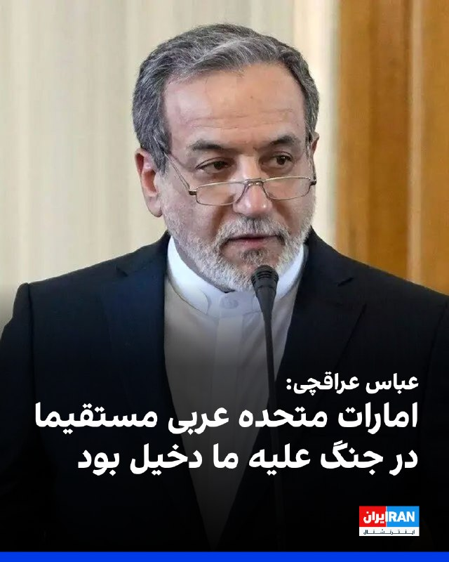

عباس عراقچی، وزیر خارجه جمهوری اسلامی که برای شرکت در اجلاس بریکس، به دهلی نو سفر کرده، گفت: «امارات متحده عربی مستقیما در جنگ علیه ما دخیل بود.»
او خطاب به اماراتی‌ها گفت: «ائتلاف با اسرائیل هم از شما محافظت نکرد.»

عراقچی ادامه داد: «اماراتی‌ها اجازه دادند از سرزمین‌شان برای شلیک توپخانه و تجهیزات علیه ما استفاده شود.»

وزیر خارجه جمهوری اسلامی افزود: «امارات متحده عربی شریک فعال جنگ علیه ماست و هیچ تردیدی در این باره وجود ندارد و ما شگفت‌زده شدیم که برادران ما در امارات متحده عربی تصمیم گرفتند فعالانه به جنگ علیه ما بپیوندند.»

عراقچی تاکید کرد: «همدستی امارات متحده عربی با اسرائیل غیرقابل بخشش است.»
https://iranintl.com/202605148778

## IranIntlTV — post 337140

  <a href="telegram/content/IranIntlTV_337140_1778755655.mp4" target="_blank">🎬 Download video</a>

اظهارات و گزارش‌های رسمی چین و آمریکا حاکی است دونالد ترامپ و شی جین‌پینگ، رهبران دو کشور، در دیدار کلیدی خود در پکن درباره ایران گفت‌وگو کرده‌اند.

توماج طاهباز، خبرنگار ایران‌اینترنشنال، گزارش می‌دهد
@iranintltv

## IranIntlTV — post 337139

  <a href="telegram/content/IranIntlTV_337139_1778755657.mp4" target="_blank">🎬 Download video</a>

کاخ سفید اعلام کرد در جریان سفر دونالد ترامپ و دیدار او با شی‌ جین‌پینگ در پکن، روسای جمهور آمریکا و چین بر ممنوعیت دستیابی جمهوری اسلامی به سلاح هسته‌ای توافق کردند.
گفت‌وگو با عطا محامد، کارشناس روابط بین‌الملل
@iranintltv

## IranIntlTV — post 337138

در این قسمت چرتکه، محمد ماشینچیان سناریوهای مختلف قدرت خرید را تا پایان سال ۱۴۰۵ بررسی کرده و تاثیر نوسان نرخ دلار بر معیشت خانوارها را توضیح می‌دهد.
هنگام بررسی قدرت خرید حداقل دستمزد از ۱۳۹۴ تا ۱۴۰۵ در می‌یابیم که از ۹۷ به این سو، حتی وقتی قدرت خرید کارگر در ابتدای سال، حدود ۱۳۰ دلار بوده، مثل ۱۴۰۱ و ۱۴۰۴، در نتیجه تورم و بالا رفتن دلار، قدرت خرید تا پایان سال، به زیر ۱۰۰ دلار رسیده است.

تماشای نسخه کامل «چرتکه» در یوتیوب:
https://youtu.be/1W2RoMvSqPQ
@iranintltv

## IranIntlTV — post 337137

  

🔻مهدی تاج، رییس فدراسیون فوتبال، پنج‌شنبه ۲۴ اردیبهشت، در حاشیه اهدای جام قهرمانی فوتسال زنان به استقلال گفت: «فردا یا پس‌فردا در ترکیه جلسه سرنوشت‌سازی با فیفا داریم، چون باید به ما گارانتی بدهند. مساله ویزا حل نشده و هنوز هیچ ویزایی ندادند. منتظریم ببینیم رفتار طرف مقابل چیست.»

🔹فدراسیون فوتبال در فاصله کمتر از یک ماه تا آغاز جام‌جهانی با بحران ویزا و چالش مالی دست‌به‌گریبان است. امیر قلعه‌نویی هنوز نمی‌داند کدام بازیکن ویزا خواهد گرفت و کدام بازیکن را در آمریکا در اختیار خواهد داشت.

🔹احتمال دارد برای برخی اعضای کاروان ایران به دلیل سوابق فعالیت یا ارتباط با سپاه پاسداران، ویزا صادر نشود.
@iranintltvsport

## IranIntlTV — post 337136

  <a href="telegram/content/IranIntlTV_337136_1778755660.mp4" target="_blank">🎬 Download video</a>

شهروندان با ارسال پیام‌های متعدد به ایران‌اینترنشنال از افزایش بیکاری، دشواری پیدا کردن شغل در شهرهای مختلف و مشکلات معیشتی ناشی از آن در ایران خبر دادند.
@iranintltv

## IranIntlTV — post 337135

  <a href="telegram/content/IranIntlTV_337135_1778755662.mp4" target="_blank">🎬 Download video</a>

دفتر نخست‌وزیری اسرائیل چهارشنبه گزارش داد بنیامین نتانیاهو، نخست‌وزیر اسرائیل، در جریان عملیات «غرش شیران» به‌صورت محرمانه به امارات سفر کرده است. به گفته مقام‌های اسرائیلی، این سفر به گشایشی تاریخی در روابط دو طرف منجر شده است. وزارت خارجه امارات گزارش‌ها درباره این سفر را تکذیب کرده است.

ارزیابی محمدجواد اکبرین، عضو تحریریه ایران‌اینترنشنال
@iranintltv

## IranIntlTV — post 337134

  <a href="telegram/content/IranIntlTV_337134_1778755664.mp4" target="_blank">🎬 Download video</a>

سازمان عملیات تجارت دریایی بریتانیا اعلام کرد یک کشتی که در ۷۰ کیلومتری شمال شرقی بندر فجیره لنگر انداخته بود، توقیف شده و اکنون به سمت آب‌های ایران در حرکت است.
جزییات بیشتر با مرتضی کاظمیان، عضو تحریریه ایران‌اینترنشنال
@iranintltv

## IranIntlTV — post 337133

  <a href="telegram/content/IranIntlTV_337133_1778755667.mp4" target="_blank">🎬 Download video</a>

شی جین‌پینگ، رهبر چین، در دیدار با دونالد ترامپ، رییس‌جمهوری ایالات متحده، گفت همواره باور داشته که «چین و آمریکا منافع مشترک بیشتری نسبت به اختلافاتشان دارند». او همچنین بر اهمیت ثبات روابط پکن و واشینگتن برای دو کشور و جهان تاکید کرد.
@iranintltv

## IranIntlTV — post 337132

  <a href="telegram/content/IranIntlTV_337132_1778755669.mp4" target="_blank">🎬 Download video</a>

مراسم بدرقه تیم فوتبال ایران برای حضور در جام جهانی ۲۰۲۶، در حضور حامیان حکومت برگزار و همزمان از پیراهن جدید این تیم رونمایی شد.
گفت‌وگو با مزدک میرزایی، عضو تحریریه ایران‌اینترنشنال
@iranintltv

## IranIntlTV — post 337131

  

منوچهر متکی، نماینده مجلس و وزیر خارجه پیشین جمهوری اسلامی، گفت برخی از پهپادهایی که به ایران حمله کردند متعلق به امارات متحده عربی بوده است. او تاکید کرد که «حجت بر تمام کشورهای منطقه تمام شده است.»

متکی گفت: «برخی از پهپادهایی که به ایران زده می‌شد پهپادهای امارات متحده عربی بود و قابل کتمان نیست. این اطلاعات نزد ما است.»

متکی با اشاره به روابط جمهوری اسلامی با کشورهای منطقه گفت: «یک مسئله‌ای داریم که در ۴۷ سال گذشته تحت تاثیر دیگران، کشورهای منطقه روابط صادقانه و خوبی با ما نداشتند. اما ما حسن همسایگی را رعایت کردیم.»
https://iranintl.com/202605141340

## IranIntlTV — post 337130

  

زمین‌لرزه‌ای به بزرگی ۵ منطقه بردسیر در استان کرمان را لرزاند. این زمین‌لرزه در عمق ۸ کیلومتری زمین رخ داد. جزییات بیشتری درباره خسارات احتمالی یا تلفات این زمین‌لرزه منتشر نشده است.
https://iranintl.com/202605149083

## ManotoTV — post 105439

  <a href="telegram/content/ManotoTV_105439_1778755673.mp4" target="_blank">🎬 Download video</a>

روزنامه نیویورک‌تایمز گزارش داد نهادهای اطلاعاتی آمریکا معتقدند شرکت‌های چینی درباره ارسال مخفیانه تسلیحات به جمهوری اسلامی از طریق کشورهای ثالث گفت‌وگو کرده‌اند تا منشأ این محموله‌ها پنهان بماند.
این گزارش ساعاتی پس از ورود دونالد ترامپ به پکن منتشر شد و می‌تواند فشارها بر رئیس‌جمهوری آمریکا را برای درخواست از شی جین‌پینگ به‌منظور قطع حمایت از جمهوری اسلامی افزایش دهد.
بر اساس این گزارش، مقام‌های آمریکایی بر سر این‌که آیا این انتقال‌ها بالفعل انجام شده یا نه اختلاف نظر دارند، اما گفته‌اند چنین اقداماتی بعید است بدون اطلاع مقام‌های ارشد چینی صورت گرفته باشد.
رسانه‌های آمریکایی پیش‌تر نیز گزارش داده بودند چین موشک‌های دوش‌پرتاب ضدهوایی به جمهوری اسلامی ارسال کرده است؛ تسلیحاتی که می‌توانند هواپیماها و پهپادها را هدف قرار دهند. همچنین گفته می‌شود تهران در سال ۲۰۲۴ یک ماهواره جاسوسی چینی دریافت کرده که برای شناسایی نیروهای آمریکایی در خاورمیانه از آن استفاده می‌کند.
در همین حال، گزارش‌هایی از بازسازی توان موشکی جمهوری اسلامی پس از حملات آمریکا و اسرائیل منتشر شده است. بر اساس ارزیابی سازمان سیا، بخش قابل توجهی از موشک‌های بالستیک و پرتابگرهای متحرک ایران همچنان سالم مانده‌اند.

## ManotoTV — post 105437

  <a href="telegram/content/ManotoTV_105437_1778755674.mp4" target="_blank">🎬 Download video</a>

بانک مرکزی ترکیه هدف تورم پایان سال ۲۰۲۶ را از ۱۶ به ۲۴ درصد افزایش داد و اعلام کرد پیامدهای جنگ ایران و اسرائیل و افزایش تنش‌ها در خاورمیانه، فشارهای تورمی را تشدید کرده است. رئیس بانک مرکزی ترکیه گفت افزایش بهای انرژی و اختلال در عرضه، به‌ویژه برای اقتصادهای وابسته به واردات مانند ترکیه، یک ریسک جدی محسوب می‌شود. این بانک همچنین پیش‌بینی تورم پایان ۲۰۲۷ را از ۹ به ۱۵ درصد افزایش داد. نرخ تورم ماهانه ترکیه در آوریل به بیش از ۴ درصد و تورم سالانه به حدود ۳۲ درصد رسید.

## ManotoTV — post 105436

  <a href="telegram/content/ManotoTV_105436_1778755675.mp4" target="_blank">🎬 Download video</a>

مرکز عملیات تجارت دریایی بریتانیا (UKMTO) در یک هشدار امنیتی اعلام کرد یک کشتی در دریای عمان، در حالی که در لنگرگاه قرار داشت، توسط «افراد غیرمجاز» تصرف شده و اکنون به سمت آب‌های سرزمینی ایران در حرکت است.
بر اساس هشدار رسمی UKMTO، این حادثه حدود ۳۸ مایل دریایی شمال شرقی فجیره امارات متحده عربی رخ داده است. هویت کشتی و جزئیات بیشتر درباره مهاجمان هنوز اعلام نشده است.
این نهاد بریتانیایی اعلام کرد در حال بررسی موضوع است و از همه شناورها خواسته هرگونه فعالیت مشکوک را فورا گزارش دهند.
هشدار صبح امروز چهارشنبه منتشر شده و نشان‌دهنده یک رخداد امنیتی تازه و حساس در آبراه‌های منطقه است.
اگرچه این نهاد هنوز درباره عاملان احتمالی این حادثه اظهار نظر نکرده، اما چنین هشدارهایی معمولا در موارد مرتبط با توقیف کشتی‌ها، دزدی دریایی یا عملیات نیروهای نظامی و شبه‌نظامی در منطقه صادر می‌شود.

## ManotoTV — post 105435

  <a href="telegram/content/ManotoTV_105435_1778755676.mp4" target="_blank">🎬 Download video</a>

بر اساس گزارش‌های منتشرشده در شبکه‌های اجتماعی، خاطره خدادادی، دانشجوی رشته دندانپزشکی در بلاروس، پس از اظهار نظر درباره مسائل ایران در یک کانال تلگرامی، با دخالت سفارت جمهوری اسلامی بازداشت و به ۱۴ روز زندان محکوم شده است.
به گفته نزدیکان او، قرار بود دهم اردیبهشت آزاد شود، اما همچنان در بازداشت به‌سر می‌برد و وضعیت تحصیل و اقامتش نامشخص است. همچنین گزارش شده که او در مدت بازداشت از دسترسی به وکیل و تماس با دوستانش محروم بوده است.

## ManotoTV — post 105434

  <a href="telegram/content/ManotoTV_105434_1778755676.mp4" target="_blank">🎬 Download video</a>

رسانه‌های داخلی ایران گزارش دادند زمین‌لرزه‌ای به بزرگی ۵ ریشتر منطقه بردسیر در استان کرمان را لرزاند.
بر اساس این گزارش‌ها، کانون زلزله در عمق ۸ کیلومتری زمین و در نزدیکی روستای کمال‌آباد از توابع شهرستان بردسیر بوده است. هلال‌احمر اعلام کرد دو تیم ارزیاب برای بررسی وضعیت به منطقه اعزام شده‌اند.

## ManotoTV — post 105433

  <a href="telegram/content/ManotoTV_105433_1778755677.mp4" target="_blank">🎬 Download video</a>

گروه ناظر اینترنتی نت‌بلاکس اعلام کرد قطعی اینترنت در ایران امروز وارد هفتادوششمین روز خود شده و از مرز ۱۸۰۰ ساعت گذشته است.
نت‌بلاکس می‌گوید این محدودیت‌ها بر پایه دسترسی گزینشی و طبقاتی اعمال شده؛ به‌طوری که گروه‌های خاص به اینترنت دسترسی دارند، اما بخش بزرگی از شهروندان همچنان با محدودیت و اختلال گسترده مواجه‌اند

## FarsiVOA — post 217709

🔺رویترز: جنگنده‌های سعودی در جریان جنگ، به شبه‌نظامیان عراق حمله کردند

▪️خبرگزاری رویترز به نقل از چندین منبع مطلع گزارش داد که جنگنده‌های عربستان سعودی در جریان جنگ اخیر علیه جمهوری اسلامی، اهداف مرتبط با شبه‌نظامیان شیعه مورد حمایت تهران در عراق را بمباران کردند.

▪️بر اساس این گزارش، این حملات سایت‌هایی را هدف قرار دادند که از آن‌ها حملات پهپادی و موشکی علیه عربستان سعودی و دیگر کشورهای خلیج فارس انجام می‌شد.

▪️به گفته منابع آگاه، صدها پهپادی که کشورهای عربی خلیج فارس را در جریان جنگ اخیر هدف قرار دادند از عراق شلیک شده بودند.

⬇️ بیشتر بخوانید:
https://ir.voanews.com/a/8149921.html

## FarsiVOA — post 217708

  

خبرگزاری رویترز از عبور دومین نفتکش به مقصد ژاپن از تنگه هرمز در روز پنج‌شنبه خبر داد. این نفتکش حامل ۱.۲ میلیون بشکه نفت کویت و ۷۰۰ هزار بشکه نفت امارات است.

نفتکش قبلی حدود دو هفته پیش از تنگه هرمز گذشته بود.

سانائه تاکایچی نخست‌وزیر ژاپن می‌گوید در راستای خروج محموله‌های نفتی ژاپن از تنگه هرمز، مستقیماً با رئیس‌جمهور ایران تماس گرفته و از بابت اجازه عبور نفتکش‌ها تشکر کرد. او گفت هنوز ۳۹ کشتی مرتبط با ژاپن در خلیج فارس است.

پیش از انسداد تنگه هرمز توسط جمهوری اسلامی، ۹۵ درصد نفت وارداتی ژاپن از کشورهای عرب حوزه خلیج فارس انجام می‌شد.
@FarsiVOA

## FarsiVOA — post 217707

🔺کاخ سفید: ترامپ و شی درباره ضرورت باز بودن تنگه هرمز توافق کردند

▪️کاخ سفید اعلام کرد که رهبران آمریکا و چین در دیدار خود درباره ضرورت باز بودن تنگه هرمز که از سوی نیروهای حکومت ایران عملاً مسدود شده، توافق کردند.

▪️پیشتر مارکو روبیو، وزیر امور خارجه آمریکا، در مسیر سفر به چین در همراهی با رئیس‌جمهور آمریکا، درباره تلاش‌ها برای وادار کردن چین به برخورد با جمهوری اسلامی ایران در ارتباط با اقداماتش در خلیج فارس توضیح داد.

▪️در بیانیه کاخ سفید همچنین آمده است که ترامپ و شی همچنین درباره ادامه پیشرفت در توقف ورود مواد شیمیایی پیش‌ساز فنتانیل به ایالات متحده، و همچنین افزایش خرید محصولات کشاورزی آمریکا توسط چین گفت‌وگو کردند.

⬇️ بیشتر بخوانید:
https://ir.voanews.com/a/8149919.html

## FarsiVOA — post 217706

  

سازمان عملیات تجارت دریایی بریتانیا از تصرف یک کشتی در دریای عمان خبر داد. بر اساس این گزارش یک کشتی لنگر انداخته در ۳۸ مایل دریایی شمال شرق بندر فجیره امارات توسط افراد غیرمجاز تصرف شده و اکنون به سمت آب‌های سرزمینی ایران در حرکت است.
@FarsiVOA

## FarsiVOA — post 217705

🔺تلاش اسرائیل برای افزایش بردِ جنگنده‌ها بدون نیاز به سوخت‌رسانی

▪️وزارت دفاع اسرائیل اعلام کرد که قراردادی را با یکی از زیرمجموعه‌های شرکت دفاعی البیت برای توسعه «قابلیت بردِ افزایش‌یافته» جنگنده اف-۳۵آی امضا کرده است.

▪️این قرارداد شامل «توسعه و یکپارچه‌سازی مخازن سوخت خارجی» بر اساس طرحی است که شرکت سایکلون پیش‌تر برای جنگنده اف-۱۶ توسعه داده است.

▪️وزارت دفاع اسرائیل در بیانیه‌ای نوشت که این قابلیت جدید انتظار می‌رود «برد عملیاتی هواپیما را افزایش دهد، وابستگی به سوخت‌رسانی هوایی را کاهش دهد و انعطاف‌پذیری عملیاتی را در مأموریت‌های دوربرد تقویت کند.»

▪️اسرائیل اکنون ۴۸ فروند اف‌-۳۵آی در اختیار دارد؛ در حالی که سفارش اولیه این کشور ۵۰ فروند بود.

⬇️ بیشتر بخوانید:
https://ir.voanews.com/a/8149918.html

## DW_Farsi — post 124681

🔶 آمریکا استقرار چهار هزار سرباز در اروپا را متوقف کرد

بر اساس گزارش‌ها، وزارت دفاع (جنگ) آمریکا اعزام بیش از چهار هزار سرباز از یک تیپ رزمی به اروپا را متوقف کرده است. به نوشته روزنامه "وال‌استریت ژورنال" به نقل از یکی از مقامات پنتاگون، این تصمیم روز چهارشنبه ۱۳ مه در نشستی میان فرماندهی اروپایی نیروهای مسلح آمریکا (EUCOM) و بخش‌هایی از ارتش این کشور اعلام شد.

قرار بود این نیروها برای مأموریتی ۹ ماهه در لهستان مستقر شوند.

ارتش آمریکا در ماه مارس اعلام کرده بود که این تیپ رزمی قرار است در چارچوب یک برنامه دوره‌ای معمول، جایگزین نیروهای دیگر شود. اما اکنون انتقال بخشی از تجهیزات و حتی برخی سربازان که در مسیر اعزام بوده‌اند، به دلیل این تصمیم جدید به تعویق افتاده است؛ تصمیمی غیرمنتظره که گفته می‌شود بسیاری از اعضای ارتش آمریکا را غافلگیر کرده است.

به نوشته وال‌استریت ژورنال، گرچه فرماندهی اروپایی آمریکا توصیه کرده بود که پس از پایان مأموریت دوره‌ای چندماهه، جایگزینی برای این ۴۰۰۰ سرباز در نظر گرفته نشود، اما خواهان توقف فوری اعزام نشده بود.

@dw_farsi

## DW_Farsi — post 124680

  

🔶 عراقچی در نشست بریکس خواهان "محکوم کردن آمریکا و اسرائیل" شد

عباس عراقچی، وزیر خارجه جمهوری اسلامی که برای حضور در نشست بریکس به هند سفر کرده است، پنجشنبه ۱۴ مه (۲۴ اردیبهشت) در جریان سخرانی خود از "سیاست‌های یک‌جانبه‌گرایانه" آمریکا انتقاد و بر "ضرورت همکاری کشورهای عضو برای مقابله با نقض قوانین بین‌المللی و نقش‌آفرینی این گروه در شکل‌دهی به نظم جهانی عادلانه‌تر" تاکید کرد.

او "زورگویی و سیاست‌های تحمیلی آمریکا" را مورد انتقاد قرار داد و همکاری کشورهای عضو برای مقابله با این رویکردها را ضروری خواند.

وزیر امور خارجه ایران با اشاره به "نقض حاکمیت کشورها" و "استانداردهای دوگانه" در عرصه سیاست بین‌الملل افزود: «احساس مصونیت از مجازات در برخی قدرت‌ها موجب تداوم این اقدامات شده و باید این وضعیت با اقدام جمعی کشورها پایان یابد.»

عراقچی از کشورهای عضو سازمان بریکس و دیگر اعضای جامعه جهانی خواست تا "نقض حقوق بین‌الملل از سوی آمریکا و اسرائیل، از جمله حمله علیه ایران" را صراحتا محکوم کرده و مانع از "سیاسی‌سازی نهادهای بین‌المللی" شوند.

او در پایان تاکید کرد: «بریکس می‌تواند نقش مهمی در شکل‌دهی به نظمی جهانی عادلانه‌تر و متوازن‌تر ایفا کند؛ نظمی که در آن قدرت جایگزین قانون نشود و ملت‌های مستقل بتوانند مسیر توسعه و استقلال خود را دنبال کنند.»

بریکس نام گروهی به رهبری برخی از کشورهایی است که اقتصادی نوظهور در جهان دارند. برزیل، روسیه، هند، چین و آفریقای جنوبی اعضای اصلی بریکس هستند. نام بریکس از حروف اول نام کشورهای عضو به زبان انگلیسی گرفته شده است. ایران نیز از دو سال پیش به صورت رسمی به عضویت این سازمان درآمده است.

میزبانی این دوره از نشست وزیران امور خارجه بریکس را هند بر عهده دارد که اقتصاد و بخش انرژی آن به ویژه به خاطر انسداد تنگه هرمز زیر فشار قرار گرفته است. از این رو سایه جنگ ایران و بحران سوخت و انرژی ناشی از آن بر این نشست سنگینی می‌کند.

@dw_farsi

## DW_Farsi — post 124679

  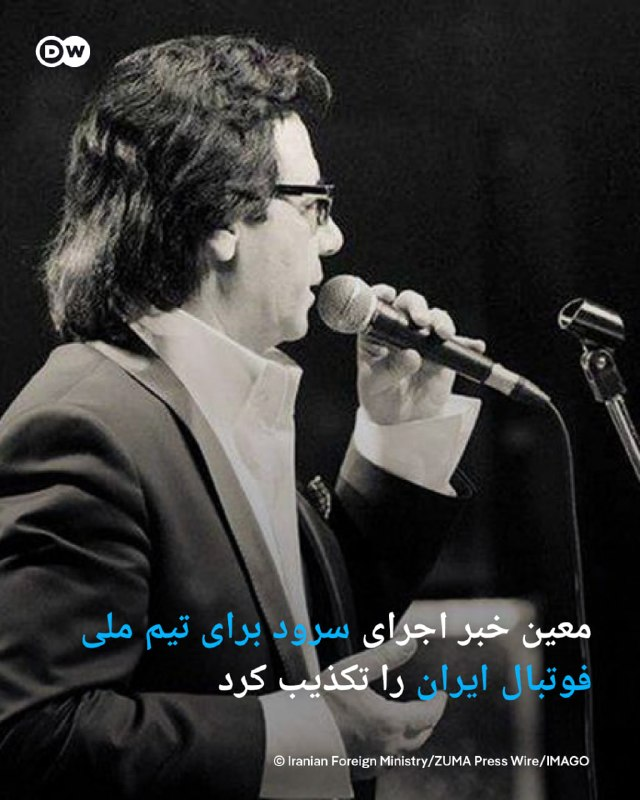

🔶 معین خبر اجرای سرود برای تیم ملی فوتبال ایران را تکذیب کرد

معین، خواننده معروف پاپ ساکن لس‌آنجلس، شایعات در مورد خواندن قطعه‌ای برای تیم ملی فوتبال ایران را تکذیب کرد. او پنجشنبه ۱۴ مه (۲۴ اردیبهشت) با انتشار پستی در اینستاگرام تأکید کرد که این موضوع صحت ندارد.

او نوشت: «عشق من به مردم و سرزمینم همیشه واقعی بوده، اما صدای من زمانی معنا دارد که دل مردم ایران آرام باشد و حال ایران خوب.»

مهدی تاج، رئیس فدراسیون فوتبال ایران، به تازگی در حاشیه مراسم بدرقه تیم ملی برای حضور در جام جهانی ۲۰۲۶ در پاسخ به پرسش یک خبرنگار درباره شایعات مربوط به اجرای یک قطعه برای تیم ملی توسط معین گفته بود: «فدراسیون نقشی در این موضوع ندارد، اما در جریان هستیم، از هر اثری که برای حمایت از تیم ملی تولید شود استقبال می‌کنیم.‌»

تاج در ادامه در مورد "رسمیت‌ داشتن این قطعه" افزوده بود: «اگر ایشان [معین] بخواند... هر کسی از تیم ملی ایران دفاع و حمایت کند، جایش روی چشم ماست.»

@dw_farsi

## DW_Farsi — post 124678

  

🔶 "قمار احمقانه"؛ واکنش عراقچی به خبر سفر نتانیاهو به امارات

عباس عراقچی در واکنش به علنی شدن خبر سفر نخست‌وزیر اسرائیل به امارات متحده عربی گفت: «نتانیاهو اکنون به‌صورت علنی آنچه را که نهادهای امنیتی ایران مدت‌ها قبل به رهبری ما منتقل کرده بودند، افشا کرده است.»

وزیر خارجه جمهوری اسلامی در این باره که چرا تهران علیرغم اطلاع از این مسئله، تا کنون اقدام به افشای آن نکرده است، چیزی نگفت.

عراقچی در پست شدید‌الحن خود که در شبکه ایکس (توئیتر سابق) منتشر کرد، "دشمنی با ایران" را "قماری احمقانه" خواند و افزود: «همکاری و همدستی با اسرائیل در این مسیر، غیرقابل بخشش است. کسانی که در همدستی با اسرائیل برای ایجاد تفرقه نقش دارند، باید پاسخگو باشند.»

دفتر بنیامین نتانیاهو چهارشنبه ۱۳ مه (۲۳ اردیبهشت) اعلام کرده بود، نخست وزیر اسرائیل در جریان جنگ ایران به‌طور محرمانه به امارات سفر کرده و با محمد بن زاید، رئیس امارات، دیدار داشته است. به گفته دفتر نتانیاهو این سفر به "یک دستاورد تاریخی" در روابط دو طرف منجر شده است.

در این میان اما وزارت امور خارجه امارات متحده با انتشار بیانیه‌ای اعلام کرده است که این کشور "گزارش‌های منتشرشده درباره سفر نخست‌وزير اسرائيل يا استقبال از يک هيات نظامی اسرائيلی را تکذيب می‌کند".

این وزارتخانه تأکید کرد که روابط امارات و اسرائیل "علنی و بر پایه پیمان ابراهیم" است و از این رو "تمامی سفرها و دیدارهای رسمی به شکل شفاف اعلام شده و انجام می‌گیرند".

پیش از انتشار خبر مربوط به سفر نتانیاهو به امارات، نشریه وال استریت ژورنال در گزارشی نوشته بود دیوید بارنیا، رئیس موساد، نیز دست‌کم دو بار در ماه‌های مارس و آوریل به امارات سفر کرد تا درباره روند جنگ با ایران و هماهنگی‌های امنیتی با مقام‌های این کشور گفت‌وگو کند.

@dw_farsi

## DW_Farsi — post 124677

  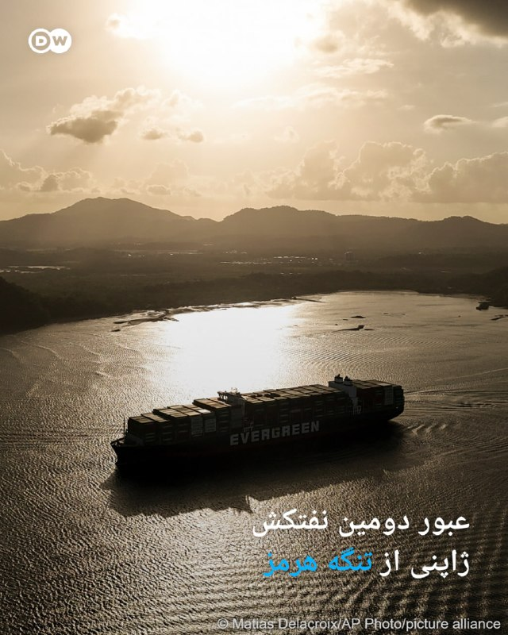

🔶 عبور دومین نفتکش ژاپنی از تنگه هرمز

داده‌های ردیابی از شرکت ال‌اس‌ای‌جی (LSEG) که تردد کشتی‌ها را رهگیری می‌کند، پنجشنبه ۱۴ مه (۲۴ اردیبهشت) نشان داد که یک نفت‌کش ژاپنی از تنگه هرمز  عبور کرده است. این نفت‌کش متعلق به "انیوس" (Eneos)، بزرگترین شرکت نفت و انرژی ژاپن بوده و تحت پرچم پاناما در حرکت است.

این دومین بار است که یک کشتی متعلق به شرکت‌های ژاپنی از آغاز جنگ آمریکا و اسرائیل علیه جمهوری اسلامی و انسداد تنگه هرمز به این سو، موفق به عبور از این آبراه حیاتی شده است. پیش از آغاز جنگ ایران، ژاپن حدود ۹۵ درصد از نفت خود را از کشورهای حوزه حلیج فارس وارد می‌کرد.

می‌یاتا توموهیده، مدیر عامل شرکت انیوس روز پنجشنبه به خبرنگاران گفت که این نفت‌کش به‌طور امن تنگه هرمز را پشت سر گذاشته و به احتمال قوی اواخر ماه مه یا اوایل ماه ژوئن به ژاپن خواهد رسید. این نفت‌کش حامل ۱.۲ میلیون بشکه نفت خام کویت و ۷۰۰ هزار بشکه نفت امارات متحده عربی است که بنا بر داده شرکت رهگیری "کپلر" در اواخر ماه فوریه بارگیری شده و قرار بوده که سوم ژوئن به ژاپن برسد.

ژاپن از زمان بروز جنگ در اواخر ماه فوریه تلاش‌های دیپلماتیک خود را تقویت کرد و در عین حال به دنبال بدیل‌هایی برای جایگزین کردن محموله‌های تحویل‌داده‌نشده بوده است. دولت ژاپن در عین حال یارانه‌های درخورتوجهی را برای پایین نگه داشتن بهای بنزین در بازارهای داخلی تخصیص داده است.

وزارت خارجه ژاپن با انتشار بیانیه‌ای اعلام کرد که دولت این کشور در ارتباط با عبور این نفت‌کش از تنگه هرمز، با جمهوری اسلامی در تماس مسقتیم بوده است. سانائه تاکایچی، نخست‌وزیر ژاپن نیز ماه آوریل در تماسی تلفنی با مسعود پزشکیان، رئیس جمهور ایران گفت‌وگو کرد.

این وزارتخانه در بیانیه خود تأکید کرد، توکیو به تلاش‌های دیپلماتیک و هماهنگی‌ ادامه خواهد داد تا ۳۹ کشتی مرتبط با این کشور را از آب‌های خلیج فارس خارج کند.
نخستین کشتی ژاپنی که موفق به عبور از تنگه هرمز شده بود، نفت‌کش "ایدمیتسو مارو" (Idemitsu Maru)، متعلق به یک شرکت وابسته به کمپانی نفتی ایدمیتسو کوسان بود. این کشتی حامل نفت عربستان سعودی، اواخر ماه آوریل از تنگه هرمز گذر کرده بود.

@dw_farsi

## DW_Farsi — post 124676

🔶 عربستان ناوگان عظیم کامیون‌ها را جایگزین تنگه هرمز کرده است

پس از حمله آمریکا و اسرائیل به ایران، مدیرعامل شرکت بزرگ دولتی "معادن" در عربستان به سرعت وارد عمل شد. این شرکت که دفتر مرکزی آن در ریاض است، عمدتا در معادن خود طلا، بوکسیت، مس، مواد معدنی صنعتی و فسفات استخراج می‌کند. عربستان به‌طور معمول، این مواد خام را از طریق بنادر خلیج فارس صادر کرده و از راه تنگه هرمز  به سراسر جهان منتقل می‌کند. اما در شرایط کنونی این مسیر از آغاز جنگ ایران،تا کنون مسدود شده است.

بر اساس گزارشی از روزنامه وال‌استریت ژورنال، شرکت "معادن" تنها ظرف دو هفته توانسته انتقال کود شیمیایی را از سراسر عربستان به سواحل دریای سرخ سازماندهی کند. برای این کار هزاران کامیون به‌کار گرفته شده‌اند که از آن زمان تقریباً به‌صورت شبانه‌روزی در حال فعالیت هستند.

این روزنامه به نقل از مدیرعامل شرکت می‌نویسد: «تعداد کامیون‌ها نخست از ۶۰۰ به ۱۶۰۰ رسید و بعد بالغ بر ۲۰۰۰ کامیون شد. اما حالا ۳۵۰۰ کامیون بین خلیج فارس و دریای سرخ در رفت‌وآمد هستند.» هدف این است که عقب‌ماندگی صادرات عربستان تا پایان ماه مه جبران شود.

@dw_farsi

## Persian_Trend_Official — post 14115

  <a href="telegram/content/Persian_Trend_Official_14115_1778755683.mp4" target="_blank">🎬 Download video</a>

💢حمله حامیان جمهوری اسلامی به دو گردشگر چینی که در حال تهیه گزارش
از شرایط کشور در زمان حملات بودند

🫆:Tony

📌 @persian_trend_official
پرشین ترند | متفاوت‌ترین کانال نظامی

## Persian_Trend_Official — post 14114

  <a href="telegram/content/Persian_Trend_Official_14114_1778755685.mp4" target="_blank">🎬 Download video</a>

🔺علی کیایی ‌فر، متخصص امنیت اطلاعات: در جنگ دوازده‌روزه، نوبیتکس، بانک پاسارگاد، بانک سپه و بانک مرکزی از داخل خود ایران هک شدند

مثلاً نوبیتکس توسط یک سرور زامبی در یک مدرسه‌ی علمیه خواهران در قم هک شد.

☆Phantom☆

📌 @persian_trend_official
پرشین ترند | متفاوت‌ترین کانال نظامی

## Persian_Trend_Official — post 14113

🔴 چین: آماده گسترش همکاری با آمریکا هستیم

💢سخنگوی وزارت بازرگانی چین اعلام کرد پکن آماده همکاری با آمریکا برای گسترش فهرست همکاری‌های مشترک میان دو کشور است.

💢بر اساس این اظهارات:

▪️ معاون نخست‌وزیر چین و وزیر خزانه‌داری آمریکا روز چهارشنبه در کره جنوبی دیدار کردند
▪️ مقام‌های دو کشور گفت‌وگوها را «صریح، عمیق و سازنده» توصیف کرده‌اند
▪️ چین اعلام کرده همکاری‌ها باید بر پایه:

برابری
احترام متقابل
و منافع مشترک

پیش برود.

💢پکن همچنین تأکید کرد دو طرف در تلاش هستند فهرست اختلافات را کاهش داده و روابط اقتصادی و تجاری سالم‌تری ایجاد کنند.

🫆:Tony

📌 @persian_trend_official
پرشین ترند | متفاوت‌ترین کانال نظامی

## Persian_Trend_Official — post 14112

  <a href="telegram/content/Persian_Trend_Official_14112_1778755687.mp4" target="_blank">🎬 Download video</a>

🔴 عراقچی: این آمریکا است که تنگه هرمز را بسته، نه ایران

💢عباس عراقچی، وزیر خارجه جمهوری اسلامی ، اعلام کرد تهران تنگه هرمز را نبسته و این آمریکا است که با اقدامات خود محاصره ایجاد کرده است.

💢او گفت:

▪️ از نگاه جمهوری اسلامی ، تنگه هرمز برای تمامی کشتی‌های تجاری باز است

▪️ کشتی‌ها باید با نیروهای دریایی حمهوری اسلامی همکاری و هماهنگی داشته باشند

▪️ جمهوری اسلامی هیچ مانعی در مسیر عبور کشتی‌ها ایجاد نکرده است

▪️ آنچه اکنون در منطقه رخ می‌دهد، ناشی از محاصره و اقدامات آمریکا است

🫆:Tony

📌 @persian_trend_official
پرشین ترند | متفاوت‌ترین کانال نظامی

## Persian_Trend_Official — post 14111

  <a href="telegram/content/Persian_Trend_Official_14111_1778755690.mp4" target="_blank">🎬 Download video</a>

🔴ویدیویی از انفجار شناور کلاس سلیمانی نیرو دریایی سپاه در جنگ اخیر

🫆:Tony

📌 @persian_trend_official
پرشین ترند | متفاوت‌ترین کانال نظامی

## Persian_Trend_Official — post 14110

  <a href="telegram/content/Persian_Trend_Official_14110_1778755692.webm" target="_blank">🎬 Download video</a>

‼️🏦 یک مقام کاخ سفید:

✅ رئیس جمهور ترامپ و همتای چینی او بر سر لزوم باز نگه داشتن تنگه هرمز توافق کردند.
✅ ترامپ و همتای چینی‌اش توافق کردند که ایران نمی‌تواند سلاح هسته‌ای داشته باشد.

📝 Nick

📌 @persian_trend_official
پرشین ترند | متفاوت‌ترین کانال نظامی

## Persian_Trend_Official — post 14109

  <a href="telegram/content/Persian_Trend_Official_14109_1778755692.webm" target="_blank">🎬 Download video</a>

⭕️ سوپراپلیکیشن ایتا اعلام کرد امکان ارسال فایل تا حجم ۲۰ مگابایت مجدداً برای همه کاربران فراهم شده است!

کاش تلگرام بیاد از شما یاد بگیره 🤯

📝 Nick

📌 @persian_trend_official
پرشین ترند | متفاوت‌ترین کانال نظامی

## RadioFarda — post 157166

سایه جنگ غزه همچنان بر سر یوروویژن سنگینی می‌کند؛ وضع قوانین تازه

🔸جنگ ایران درس‌های تازه‌ای دربارهٔ نحوهٔ استفاده از هوش مصنوعی به‌عنوان ابزاری در جنگ‌های مدرن و حکمرانی دولتی آشکار کرده است.

🔸 حکومت ایران به‌طور فزاینده‌ای تبلیغات تولیدشده با هوش مصنوعی، عملیات سایبری، جنگ روانی و کارزارهای نفوذ را در قالب یک اکوسیستم دیجیتال پیچیده برای مخاطبان داخلی و خارجی در هم آمیخته است.

🔸 از ویدئوهای وایرال‌شده به سبک لگو و قطعات هیپ‌هاپ ساخته‌شده با هوش مصنوعی گرفته تا عملیات پنهانی در شبکه‌های اجتماعی و تصاویر جعلی میدان جنگ، تاکتیک‌های حکومت ایران برای نفوذ بیشتر به‌سرعت در حال تحول است و بیش از پیش مخاطبان غربی را هدف قرار می‌دهد.

🔸 رادیو اروپای آزاد/رادیو آزادی برای بررسی چگونگی استفادهٔ جمهوری اسلامی از هوش مصنوعی در تبلیغات و جنگ اطلاعاتی، با مکس لِسِر، تحلیلگر ارشد تهدیدهای نوظهور در مرکز نوآوری سایبری و فناوری بنیاد دفاع از دموکراسی‌ها، گفت‌وگو کرده است.

🔸گزارش کامل را در وب‌سایت رادیو فردا می‌توانید بخوانید.

@RadioFarda

## RadioFarda — post 157165

  

🔸رسانه‌های حکومتی ایران مدعی شدند که پاپ لئون چهاردهم «بالاترین نشان افتخاری دیپلماتیک واتیکان» را به سفیر جمهوری اسلامی ایران نزد سریر مقدس اعطا کرده و این نشان «به سفیران و شخصیت‌های برجسته‌ای اعطا می‌شود که در تقویت روابط دیپلماتیک و خدمت به صلح و گفت‌وگو نقش‌آفرینی کرده‌اند».

🔸بر اساس گزارش رسمی واتیکان، این نشان که از درجات نشان «پیوس نهم» به شمار می‌رود، به‌صورت هم‌زمان به ۱۳ سفیر دارای اعتبار نزد واتیکان اعطا شده و یک رویهٔ معمول دیپلماتیک برای سفیرانی است که بیش از دو سال در واتیکان خدمت کرده‌اند.

🔸واتیکان همچنین تصریح کرده که این نشان را شخص پاپ اعطا نکرده، بلکه مراسم توسط پائولو رودلی، از مقام‌های دبیرخانهٔ دولت واتیکان، برگزار شده است.

🔸این در حالی است که رسانه‌های جمهوری اسلامی ایران روز ۲۲ اردیبهشت تصویری از دیدار محمدحسین مختاری، سفیر جمهوری اسلامی ایران، با پاپ لئون چهاردهم در واتیکان را هم در کنار گزارش خود منتشر کرده بودند.

@RadioFarda

## RadioFarda — post 157163

زیان بیشتر زنان در ایران از قطعی اینترنت؛ چون «بازار کار موازی» در حال فروپاشی است

🔸جمهوری اسلامی آخرین دور جدید قطع اینترنت را در ۹ اسفند ۱۴۰۴، همزمان با حملات آمریکا و اسرائیل به ایران، اعمال کرد.

🔸اگرچه واشینگتن و تهران در ۱۹ فروردین به آتش‌بسی شکننده دست یافتند، اما دسترسی به اینترنت هنوز برقرار نشده و شهروندان بیش از دو ماه است در تاریکی دیجیتال به سر می‌برند. تنها کسانی که توان پرداخت هزینه ابزارهای گران ضد فیلترینگ را دارند، همراه با افرادی که دسترسی مورد تأیید حکومت دارند، می‌توانند آنلاین شوند.

🔸زهرا بهروزآذر، معاون رئیس‌جمهور در امور زنان و خانواده، در ماه فروردین گفته بود که قطع اینترنت مشاغل «غیررسمی» زنان را به‌شدت محدود کرده است.

🔸او افزود که حدود یک‌سوم درخواست‌های بیمه بیکاری ثبت‌شده طی ۴۰ روز گذشته متعلق به زنان بوده است.

🔸مقام‌های جمهوری اسلامی می‌گویند نرخ مشارکت اقتصادی زنان در ایران ۱۸ درصد است. اما بسیاری از زنان کسب‌وکارهای کوچک آنلاین راه‌اندازی کرده یا در آن‌ها مشغول به کار بودند.

🔸بسیاری از آن‌ها درآمد خود را از دست داده‌اند، از جمله زنانی که کسب‌وکار اینترنتی داشتند یا در فروش آنلاین کار می‌کردند.

🔸 گزارش کامل را در وب‌سایت رادیو فردا می‌توانید بخوانید.

@RadioFarda

@RadioFarda

## RadioFarda — post 157162

شی جین‌پینگ در نشست با ترامپ: همکاری ما به نفع هر دو طرف و تقابل ما به ضرر هر دو است

🔸شی جین‌پینگ، رئیس جمهور چین، دیدار خود با دونالد ترامپ را با تأکید بر همکاری و مشارکت آغاز کرد: «وقتی ما همکاری می‌کنیم، هر دو طرف منتفع می‌شوند، و وقتی روبه‌روی هم قرار می‌گیریم، هر دو طرف ضرر می‌کنند.»

🔸این سرآغاز دیداری دو ساعته بود که شی با دونالد ترامپ صبح روز پنج‌شنبه، ۲۴ اردیبهشت، به وقت محلی در «تالار بزرگ خلق» در پایتخت چین داشت.

🔸شی جین‌پینگ همچنین تأکید کرد که اکنون مسئله مهم این است که آیا چین و آمریکا می‌توانند «پیشگام پارادایم جدیدی از مناسبات کشورهای بزرگ» باشند یا خیر.

🔸در پاسخ به سخنان رئیس‌جمهور چین، رئیس‌جمهور آمریکا نیز گفت: «شما رهبر بزرگی هستید، گاهی بعضی‌ها خوش‌شان نمی‌آید من این را بگویم، ولی من حرفم را می‌زنم.»

🔸گزارش کامل را در وب‌سایت رادیو فردا می‌توانید بخوانید.

@RadioFarda

## IranianMinds — post 20115

  

💔

@IranianMinds

## IranianMinds — post 20114

  <a href="telegram/content/IranianMinds_20114_1778755695.mp4" target="_blank">🎬 Download video</a>

🔴 وزیر دارایی اسرائیل:

فکر می‌کنم در همین دوره، عملا داریم ایده تشکیل کشور فلسطین را کاملا از بین میبریم.

@IranianMinds

## IranianMinds — post 20113

  <a href="telegram/content/IranianMinds_20113_1778755697.mp4" target="_blank">🎬 Download video</a>

🔴 جان بولتون:

مذاکره برای توافق هسته ‌ای با ایران، هدر دادن وقته.

این ‌ها دهه ‌ها پیش تصمیم راهبردی ‌شان را برای رسیدن به سلاح هسته‌ای گرفته‌اند.

در این ۴۷ سال اخیر حتی یک مدرک هم وجود نداشته که نشان بدهد از این هدف ساخت سلاح هسته ای عقب کشیده‌ اند.

@IranianMinds

## IranianMinds — post 20112

  <a href="telegram/content/IranianMinds_20112_1778755700.mp4" target="_blank">🎬 Download video</a>

🔴 نتانیاهو:

همون ‌طور که یه متفکری یه بار فکر کنم تو روسیه بود بهم گفت اسرائیل یه ابرقدرت کوچیکه، ولی بازم ابرقدرته.

ما قراره به یه ابرقدرت بزرگ و جهانی تبدیل بشیم.

@IranianMinds

## IranianMinds — post 20111

🔴 مهدی تاج رئیس فدراسیون فوتبال : معین قراره برای تیم ملی یه آهنگ بخونه ! @IranianMinds

## BBCPersian — post 281020

  

‌🔻کاخ سفید اعلام کرد که دونالد ترامپ و شی جین‌پینگ، در پکن توافق کردند که ایران هرگز نباید به سلاح هسته‌ای دست پیدا کند و تنگه هرمز باید باز بماند.

آمریکا این گفت‌وگوی دو ساعته را «خوب» توصیف کرده و می‌گوید که دو رهبر در حال تلاش برای تقویت همکاری‌های اقتصادی هستند.

در بیانیه کاخ سفید، رئیس‌جمهور شی همچنین «علاقه‌مندی خود را» برای خرید بیشتر نفت آمریکا ابراز کرد تا وابستگی چین به تنگه هرمز را کاهش دهد.

همچنین گفته شد که مدیران برخی از بزرگ‌ترین شرکت‌های آمریکایی هم در بخشی از این دیدار حضور داشتند.

آن‌ها همچنین درباره اهمیت پایان دادن به ورود مواد اولیه برای ساخت ماده مخدر فنتانیل به آمریکا هم صحبت کردند.

https://bbc.in/4uHk6Rf
📷Reuters

@BBCPersian

## BBCPersian — post 281019

🔻مرکز تجارت دریایی بریتانیا: یک کشتی در نزدیکی امارات تصرف شده و به سمت ایران در حرکت است

یک کشتی در نزدیکی سواحل امارات متحده عربی و حوالی تنگه هرمز «به تصرف افراد ناشناس درآمده و اکنون در حال حرکت به سمت آب‌های سرزمینی ایران است.»

مرکز تجارت دریایی بریتانیا روز پنج‌شنبه با اعلام این خبر گفت که این کشتی در فاصله حدود ۷۰ کیلومتری شمال‌شرقی فجیره به «تصرف افراد ناشناس درآمده است.»

تنگه هرمز، به عنوان حیاتی‌ترین گذرگاه انرژی جهان، یک محور مهم اختلافات ایران و آمریکاست.

پس از جنگ آمریکا و اسرائیل علیه ایران، تهرن این تنگه را مسدود کرد و آمریکا هم از ۱۳ آوریل (۲۴ فروردین) یک محاصره دریایی را بر تمام بنادر و سواحل جنوبی ایران اجرا کرده است، به‌طوری که هیچ کشتی اجازه حرکت از مبدا و به مقصد بنادر ایرانی را ندارد.

حدود ۲۰ درصد از نفت و گاز طبیعی مایع جهان از این آبراه حیاتی منتقل می‌شود که مسدود شدن آن باعث افزایش شدید قیمت‌ها در سطح جهان شده است.
https://bbc.in/4fkRCIA
@BBCPersian

## Dirty_Kids — post 389430

  <a href="telegram/content/Dirty_Kids_389430_1778755703.mp4" target="_blank">🎬 Download video</a>

وقتی از عمو «مارک‌روبیو» حرف می‌زنیم، در واقع داریم از این تفاوت‌هاش با سایر موجودات عالم حرف می‌زنیم،

شما ببین تنها کسیه که این‌طور کنجکاوانه و با شوق و ذوق به سقف تزئینات تالار بزرگ خلق کشور قرمدنگ چین نگاه می‌کنه و اشاره می‌کنه بقیه هم ببینن،

چین قرمساقی که در سال ۲۰۲۰ دو بار عمو مارک روبیو رو که در اون زمان سناتور جمهوری‌خواه ایالت فلوریدا بود رو تحریم کرد، [ممنوعیت ورود خودش و خانواده‌اش به چین و هنگ‌کنگ و مسدود کردن دارایی‌های احتمالی در چین که البته عمو هیچ دارایی در چین نداشت]

سر چی؟
چون عموی آگاه و اندیشمندم، این محمدعلی‌فروغی زمانه‌ی آمریکایی‌ها، از چین قرمساق در قضیه‌ی سین‌کیانگ و اویغورها و هنگ‌کنگ‌انتقاد شدید کرده بود.


@Dirty_Kids 👻

## Dirty_Kids — post 389428

  <a href="telegram/content/Dirty_Kids_389428_1778755705.mp4" target="_blank">🎬 Download video</a>

و در این میان ایلان پیش‌فعال

روی پله‌ها یک دور هم دور خودش چرخید و از اطراف فیلم گرفت!! :))))

@Dirty_Kids 👻

## Dirty_Kids — post 389427

  

🌪وقتی اینترنت طوفانیه... کافیه بادبان ها رو بکشی تا

⚫️با بالاترین کیفیت ممکن
⚡️ 

⚫️100 هزار تومان شارژ هدیه 
🎁

⚫️پایین ترین قیمت گیگی 250
🌐 

⚫️و ارائه پورسانت %10 در ازای هر معرفی
💼

بتونی یه اتصال پایدار با پشتیبانی 24 ساعته داشته باشی
🚀

بادبان راهتو باز می‌کنه
⛵️

R24

🛡@BadBan_VPN | کانال 

🤖@BadBan_VPNBot | ربات 

📞@BadBan_VPNSupport | پشتیبانی

## Dirty_Kids — post 389426

  

😂😂😂😂

@Dirty_Kids 👻

## Dirty_Kids — post 389425

  <a href="telegram/content/Dirty_Kids_389425_1778755707.mp4" target="_blank">🎬 Download video</a>

جنگ آمریکا و چین موقع دست دادن؛

ترامپ به سمت شی رفت، دست دادن و بعد جفت طرف سعی داشتن دست‌ِ طرف مقابل رو به سمت خودشون بِکشن که این صحنه خلق شد:

@Dirty_Kids 👻

## Dirty_Kids — post 389424

  

لاشیا فهمیدن ما عرقو با دوغ میخوریم

@Dirty_Kids 👻

## Dirty_Kids — post 389423

  

عکس پروفایل معلمای ادبیات

@Dirty_Kids 👻

## Hranews — post 112941

دادستان مشهد دستور توقیف اموال یک شهروند خارج از کشور را صادر کرد

❗️
❗️
❗️
❗️
❗️– دادستان مشهد از صدور دستور شناسایی و #توقیف_اموال یک شهروند ساکن خارج از کشور خبر داد. به گفته وی، این اقدام به‌دلیل فعالیت علیه نظام از سوی این فرد صورت گرفته است.

ادامه مطلب
↘️
@hranews_bot تماس ✉️ - @Hranews کانال هرانا 🆑

## manototv — post 105439

  <a href="telegram/content/manototv_105439_1778755710.mp4" target="_blank">🎬 Download video</a>

روزنامه نیویورک‌تایمز گزارش داد نهادهای اطلاعاتی آمریکا معتقدند شرکت‌های چینی درباره ارسال مخفیانه تسلیحات به جمهوری اسلامی از طریق کشورهای ثالث گفت‌وگو کرده‌اند تا منشأ این محموله‌ها پنهان بماند.
این گزارش ساعاتی پس از ورود دونالد ترامپ به پکن منتشر شد و می‌تواند فشارها بر رئیس‌جمهوری آمریکا را برای درخواست از شی جین‌پینگ به‌منظور قطع حمایت از جمهوری اسلامی افزایش دهد.
بر اساس این گزارش، مقام‌های آمریکایی بر سر این‌که آیا این انتقال‌ها بالفعل انجام شده یا نه اختلاف نظر دارند، اما گفته‌اند چنین اقداماتی بعید است بدون اطلاع مقام‌های ارشد چینی صورت گرفته باشد.
رسانه‌های آمریکایی پیش‌تر نیز گزارش داده بودند چین موشک‌های دوش‌پرتاب ضدهوایی به جمهوری اسلامی ارسال کرده است؛ تسلیحاتی که می‌توانند هواپیماها و پهپادها را هدف قرار دهند. همچنین گفته می‌شود تهران در سال ۲۰۲۴ یک ماهواره جاسوسی چینی دریافت کرده که برای شناسایی نیروهای آمریکایی در خاورمیانه از آن استفاده می‌کند.
در همین حال، گزارش‌هایی از بازسازی توان موشکی جمهوری اسلامی پس از حملات آمریکا و اسرائیل منتشر شده است. بر اساس ارزیابی سازمان سیا، بخش قابل توجهی از موشک‌های بالستیک و پرتابگرهای متحرک ایران همچنان سالم مانده‌اند.

## manototv — post 105437

  <a href="telegram/content/manototv_105437_1778755711.mp4" target="_blank">🎬 Download video</a>

بانک مرکزی ترکیه هدف تورم پایان سال ۲۰۲۶ را از ۱۶ به ۲۴ درصد افزایش داد و اعلام کرد پیامدهای جنگ ایران و اسرائیل و افزایش تنش‌ها در خاورمیانه، فشارهای تورمی را تشدید کرده است. رئیس بانک مرکزی ترکیه گفت افزایش بهای انرژی و اختلال در عرضه، به‌ویژه برای اقتصادهای وابسته به واردات مانند ترکیه، یک ریسک جدی محسوب می‌شود. این بانک همچنین پیش‌بینی تورم پایان ۲۰۲۷ را از ۹ به ۱۵ درصد افزایش داد. نرخ تورم ماهانه ترکیه در آوریل به بیش از ۴ درصد و تورم سالانه به حدود ۳۲ درصد رسید.

## manototv — post 105436

  <a href="telegram/content/manototv_105436_1778755712.mp4" target="_blank">🎬 Download video</a>

مرکز عملیات تجارت دریایی بریتانیا (UKMTO) در یک هشدار امنیتی اعلام کرد یک کشتی در دریای عمان، در حالی که در لنگرگاه قرار داشت، توسط «افراد غیرمجاز» تصرف شده و اکنون به سمت آب‌های سرزمینی ایران در حرکت است.
بر اساس هشدار رسمی UKMTO، این حادثه حدود ۳۸ مایل دریایی شمال شرقی فجیره امارات متحده عربی رخ داده است. هویت کشتی و جزئیات بیشتر درباره مهاجمان هنوز اعلام نشده است.
این نهاد بریتانیایی اعلام کرد در حال بررسی موضوع است و از همه شناورها خواسته هرگونه فعالیت مشکوک را فورا گزارش دهند.
هشدار صبح امروز چهارشنبه منتشر شده و نشان‌دهنده یک رخداد امنیتی تازه و حساس در آبراه‌های منطقه است.
اگرچه این نهاد هنوز درباره عاملان احتمالی این حادثه اظهار نظر نکرده، اما چنین هشدارهایی معمولا در موارد مرتبط با توقیف کشتی‌ها، دزدی دریایی یا عملیات نیروهای نظامی و شبه‌نظامی در منطقه صادر می‌شود.

## manototv — post 105435

  <a href="telegram/content/manototv_105435_1778755713.mp4" target="_blank">🎬 Download video</a>

بر اساس گزارش‌های منتشرشده در شبکه‌های اجتماعی، خاطره خدادادی، دانشجوی رشته دندانپزشکی در بلاروس، پس از اظهار نظر درباره مسائل ایران در یک کانال تلگرامی، با دخالت سفارت جمهوری اسلامی بازداشت و به ۱۴ روز زندان محکوم شده است.
به گفته نزدیکان او، قرار بود دهم اردیبهشت آزاد شود، اما همچنان در بازداشت به‌سر می‌برد و وضعیت تحصیل و اقامتش نامشخص است. همچنین گزارش شده که او در مدت بازداشت از دسترسی به وکیل و تماس با دوستانش محروم بوده است.

## manototv — post 105434

  <a href="telegram/content/manototv_105434_1778755714.mp4" target="_blank">🎬 Download video</a>

رسانه‌های داخلی ایران گزارش دادند زمین‌لرزه‌ای به بزرگی ۵ ریشتر منطقه بردسیر در استان کرمان را لرزاند.
بر اساس این گزارش‌ها، کانون زلزله در عمق ۸ کیلومتری زمین و در نزدیکی روستای کمال‌آباد از توابع شهرستان بردسیر بوده است. هلال‌احمر اعلام کرد دو تیم ارزیاب برای بررسی وضعیت به منطقه اعزام شده‌اند.

## manototv — post 105433

  <a href="telegram/content/manototv_105433_1778755714.mp4" target="_blank">🎬 Download video</a>

گروه ناظر اینترنتی نت‌بلاکس اعلام کرد قطعی اینترنت در ایران امروز وارد هفتادوششمین روز خود شده و از مرز ۱۸۰۰ ساعت گذشته است.
نت‌بلاکس می‌گوید این محدودیت‌ها بر پایه دسترسی گزینشی و طبقاتی اعمال شده؛ به‌طوری که گروه‌های خاص به اینترنت دسترسی دارند، اما بخش بزرگی از شهروندان همچنان با محدودیت و اختلال گسترده مواجه‌اند

## alonews — post 119909

  <a href="telegram/content/alonews_119909_1778755715.webm" target="_blank">🎬 Download video</a>

👈پاکستان: آتش‌بس برقرار است و ما با طرفین مذاکرات در ارتباط هستیم

✅ @AloNews خبر جنگ

## alonews — post 119908

  <a href="telegram/content/alonews_119908_1778755716.webm" target="_blank">🎬 Download video</a>

👈رئیس جمهور چین: رنسانس چین و شعار «آمریکا را دوباره بزرگ کنیم» می‌توانند دست در دست هم پیش بروند

✅ @AloNews خبر جنگ

## alonews — post 119907

  <a href="telegram/content/alonews_119907_1778755716.webm" target="_blank">🎬 Download video</a>

👈فارس: عبور کشتی‌های چینی از تنگه هرمز با هماهنگی ایران آغاز شد

✅ @AloNews خبر جنگ

## alonews — post 119906

  <a href="telegram/content/alonews_119906_1778755716.webm" target="_blank">🎬 Download video</a>

👈طی ۲۴ ساعت گذشته بزرگترین حملات پهپادی ثبت شده تا امروز از سوی روسیه علیه اوکراین با بیش از ۱۴۰۰ فروند پهپاد انتحاری ثبت شده است.

🔴همچنین بیش از پنجاه تیر موشک نیز شلیک شده است

✅ @AloNews خبر جنگ

## alonews — post 119905

  <a href="telegram/content/alonews_119905_1778755716.webm" target="_blank">🎬 Download video</a>

👈پاپ لئو افزایش هزینه‌های نظامی در اروپا به بالاترین سطح از پایان جنگ سرد را خیانت به دیپلماسی دانست و افزود که جهان در حال معلول شدن بر اثر جنگ‌ها است

✅ @AloNews خبر جنگ

## alonews — post 119904

  <a href="telegram/content/alonews_119904_1778755717.mp4" target="_blank">🎬 Download video</a>

👈سناتور گراهام درباره حمایت چین از ایران: اگر آنها تغییر کنند، چین پاداش خواهد گرفت.

🔴اگر تغییر نکنند، مجازات خواهند شد!

✅ @AloNews خبر جنگ

## alonews — post 119903

  <a href="telegram/content/alonews_119903_1778755719.webm" target="_blank">🎬 Download video</a>

👈آکسیوس به نقل از مقامات آمریکایی: یکی از گزینه‌های ترامپ در مورد ایران پس از بازگشت از چین، از سرگیری عملیات آزادی در تنگه هرمز است

🔴یکی دیگر از گزینه‌های ترامپ، راه‌اندازی یک کمپین بمباران جدید با تمرکز بر زیرساخت‌های ایران است

✅ @AloNews خبر جنگ

## alonews — post 119902

  <a href="telegram/content/alonews_119902_1778755720.webm" target="_blank">🎬 Download video</a>

👈کرملین : سفر پوتین به چین خیلی زود انجام میشه و مقدماتش تکمیل شده

✅ @AloNews خبر جنگ

## alonews — post 119901

  <a href="telegram/content/alonews_119901_1778755720.webm" target="_blank">🎬 Download video</a>

👈پاسخ عراقچی به ادعاهای امارات در اجلاس بریکس: ائتلاف شما با اسرائیلی‌ها نیز از شما محافظت نکرد و در سیاست خود در قبال ایران بازنگری کنید.

🔴من در سخنرانی‌ خود نام امارات متحده عربی را ذکر نکردم، به خاطر حفظ وحدت و ترجیح دادم به آن اشاره نکنم. اما در واقع باید بگویم که امارات مستقیماً در اقدام تجاوزکارانه علیه کشور من دخیل بود. زمانی که این تجاوز آغاز شد، آنها حتی از محکوم کردن آن خودداری کردند.

🔴آنها اجازه دادند از سرزمین‌شان برای شلیک توپخانه و تجهیزات علیه ما استفاده شود.

🔴همین دیروز فاش شد که نتانیاهو در زمان جنگ به امارات و ابوظبی سفر کرده بود. همچنین آشکار شد که آنها در این حملات مشارکت داشته‌اند و شاید حتی مستقیماً علیه ما اقدام کرده باشند. بنابراین امارات شریک فعال این تجاوز است و هیچ تردیدی در این باره وجود ندارد.

✅ @AloNews خبر جنگ

## alonews — post 119900

  <a href="telegram/content/alonews_119900_1778755720.webm" target="_blank">🎬 Download video</a>

👈 قیمت طلا با دیدار ترامپ و شی جین‌پینگ صعود کرد/ افت نقره و عقب‌نشینی سایر فلزات گرانبها

✅ @AloNews خبر جنگ

## alonews — post 119899

  <a href="telegram/content/alonews_119899_1778755720.webm" target="_blank">🎬 Download video</a>

👈دیدار عراقچی با نخست وزیر هند

✅ @AloNews خبر جنگ

## alonews — post 119898

  <a href="telegram/content/alonews_119898_1778755720.webm" target="_blank">🎬 Download video</a>

👈یدیعوت آحارانوت به نقل از یک منبع نظامی: سربازان در لبنان با زره و کلاه ایمنی در حال رفت و آمد هستند و نمی‌دانند چه زمانی ممکن است پهپادها به آنها حمله کنند.

✅ @AloNews خبر جنگ

## alonews — post 119897

  <a href="telegram/content/alonews_119897_1778755721.webm" target="_blank">🎬 Download video</a>

👈مدیر سرویس اطلاعات خارجی روسیه: هیچ نشانه ای از پایان درگیری نظامی بر سر ایران وجود ندارد و نمی توان موج جدیدی از تشدید تنش را رد کرد

✅ @AloNews خبر جنگ

## alonews — post 119896

  <a href="telegram/content/alonews_119896_1778755721.webm" target="_blank">🎬 Download video</a>

👈آکسیوس به نقل از مقامات اسرائیلی: ما در انتظار تصمیم ترامپ برای از سرگیری جنگ، سطح هشدار را در آخر هفته به بالاترین حد خود افزایش خواهیم داد. 
✅ @AloNews خبر جنگ

## alonews — post 119895

  <a href="telegram/content/alonews_119895_1778755721.mp4" target="_blank">🎬 Download video</a>

👈جان بولتون: مذاکره بر سر توافق هسته‌ای با ایران اتلاف اکسیژن است.

🔴این افراد دهه‌ها پیش تصمیمی استراتژیک برای دستیابی به سلاح‌های هسته‌ای گرفتند.

🔴در ۴۷ سال گذشته حتی یک مدرک هم وجود ندارد که نشان دهد آنها از این هدف دست کشیده‌اند

✅ @AloNews خبر جنگ

## alonews — post 119894

  <a href="telegram/content/alonews_119894_1778755724.webm" target="_blank">🎬 Download video</a>

👈بلومبرگ: ۴ روز است که از خارک بارگیری نفت نمی‌شود و اسکله‌های نفتی کاملاً خالی است

✅ @AloNews خبر جنگ

## alonews — post 119893

  <a href="telegram/content/alonews_119893_1778755724.webm" target="_blank">🎬 Download video</a>

👈آکسیوس به نقل از مقامات اسرائیلی: ما در انتظار تصمیم ترامپ برای از سرگیری جنگ، سطح هشدار را در آخر هفته به بالاترین حد خود افزایش خواهیم داد.

✅ @AloNews خبر جنگ

## alonews — post 119892

  <a href="telegram/content/alonews_119892_1778755724.mp4" target="_blank">🎬 Download video</a>

👈میگ -۲۹ اوکراین یه پهپاد روسی گرن -۲ رو زد و منهدم کرد

✅ @AloNews خبر جنگ

## alonews — post 119891

  <a href="telegram/content/alonews_119891_1778755726.mp4" target="_blank">🎬 Download video</a>

👈عراقچی: ما تنگه هرمز را نبسته‌ایم، آمریکا بسته!

🔴از نظر ما، تنگه هرمز برای تمامی کشتی‌های تجاری باز است، اما آن‌ها باید با نیروهای دریایی ما همکاری کنند.

🔴ما هیچ مانعی در تنگه هرمز ایجاد نکرده‌ایم؛ این آمریکاست که محاصره ایجاد کرده است

✅ @AloNews خبر جنگ

## alonews — post 119890

  <a href="telegram/content/alonews_119890_1778755729.webm" target="_blank">🎬 Download video</a>

👈سی‌ان‌ان: کاخ سفید می‌گوید ایران بر مذاکرات «خوب» ترامپ و شی جین پینگ سایه افکنده است

🔴کاخ سفید روز اول مذاکرات پرمخاطره بین دونالد ترامپ، رئیس جمهور آمریکا و شی جین پینگ، رهبر چین را مثبت ارزیابی کرد و از متن مذاکرات مشخص است که ایران یکی از موضوعات کلیدی این گفتگو بوده است.

🔴ایران روابط نزدیکی با چین دارد که بزرگترین مصرف کننده نفت ایران است. انتظار می‌رفت ترامپ، شی جین پینگ را برای اعمال فشار بر ایران جهت بازگشایی تنگه هرمز، یک گذرگاه حیاتی نفت، تحت فشار قرار دهد.

🔴یک مقام کاخ سفید گفت: «دو طرف توافق کردند که تنگه هرمز باید برای حمایت از جریان آزاد انرژی باز بماند.»

🔴این مقام رسمی به طور مشخص نگفت که آیا شی جین پینگ با گسترش مشارکت چین در کمک به پایان دادن به این درگیری موافقت کرده است یا خیر

✅ @AloNews خبر جنگ

<!-- MSG END -->

<!-- NAV START -->

<a href="https://github.com/benyamin-najmi/aio-downloader/blob/main/telegram/content/archive_1.md" style="display:inline-block; padding:6px 12px; margin:0 4px; background-color:#2ea44f; color:white; text-decoration:none; border-radius:4px; font-weight:bold;">صفحه بعد</a>

<!-- NAV END -->
