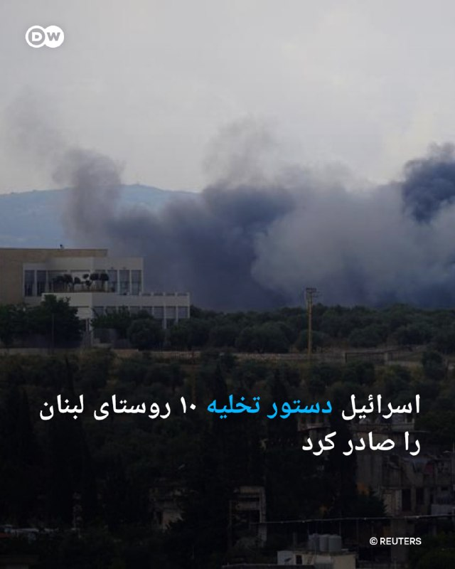

# خواننده تلگرام

<!-- TOP_NAV START -->

<a href="https://github.com/benyamin-najmi/aio-downloader/blob/main/telegram/content/archive_1.md" style="display:inline-block; padding:6px 12px; margin:0 4px; background-color:#2ea44f; color:white; text-decoration:none; border-radius:4px; font-weight:bold;">صفحه بعد</a>

<!-- TOP_NAV END -->

<!-- MSG START -->

---
📅 بروزرسانی: 1405/03/09 21:24
---

## VahidOOnLine — post 242940

  

صداوسیمای جمهوری اسلامی در گزارشی درباره تفاهم احتمالی بین تهران و واشینگتن با عنوان «جزئیات غیررسمی»، اعلام کرد آمریکا متعهد شده در طول ۶۰ روز امکان دسترسی جمهوری اسلامی به ۱۲ میلیارد دلار از دارایی‌ها را به‌گونه‌ای فراهم کند که این منابع قابلیت انتقال و هزینه‌کرد در بانک‌های مقصد را بدون محدودیت داشته باشد.

این گزارش افزود که بر اساس این تفاهم، جمهوری اسلامی مرجع انحصاری تشخیص ماهیت شناورهای عبوری است و هر شناوری که محموله آن تهدیدآمیز شناخته شود یا بهره‌بردار نهایی آن در «خصومت» با جمهوری اسلامی باشد، به عنوان کشتی تجاری شناخته نشده و اجازه عبور از مسیرهای تعریف‌شده را ندارد.

صدا و سیما تاکید کرد که این رونوشت هنوز در حکم یک تفاهم غیررسمی است چون مسیر آن همچنان در چرخه بررسی، مذاکره و بازبینی قرار دارد.
‌🏁 🇬🇧 IranintlTV

🤖 @VahidOOnLine

## VahidOOnLine — post 242939

  

♦️ تیفانی ترامپ و همسرش مایکل بولوس تازه‌ترین چهره‌های نزدیک به خانواده دونالد ترامپ‌اند که در سفر خود به هند از تاج‌محل بازدید کردند.

این زوج که در روزهای گذشته در سفر به مقصدهای گرمسیری بودند، پس از حضور در مراسم ازدواج جزیره‌ای دونالد ترامپ جوان، برادر تیفانی، سفر خود را ادامه دادند و در ادامه به هند رفتند؛ جایی که بازدید از تاج‌محل، بنای مشهور شهر آگرا، بخشی از برنامه سفرشان بود.

چند روز پیش نیز مارکو روبیو، وزیر امور خارجه آمریکا، همراه همسرش ژانت دوسدبس، از تاج محل بازدید کرده بود.

تاج محل، از معروف‌ترین بناهای تاریخی هند، در قرن هفدهم میلادی به دستور شاه جهان، پادشاه گورکانی، ساخته شد. این آرامگاه باشکوه به یاد همسر محبوب ایرانی او، ممتاز محل، بنا شد و سال‌ها است که یکی از مهم‌ترین جاذبه‌های گردشگری هند و از شناخته‌شده‌ترین بناهای عاشقانه جهان به شمار می‌رود.
‌🇸🇦 Indypersian

🤖 @VahidOOnLine

## VahidOOnLine — post 242938

  

یدالله جوانی، معاون سیاسی سپاه پاسداران گفت: «میدان‌های ما آماده است و اگر دشمن مرتکب خطای مجددی شود، پاسخ جمهوری اسلامی محکم‌تر، قاطع‌تر و غیرقابل‌باورتر خواهد بود.»

او ادامه داد: «جمهوری اسلامی بر تنگه هرمز مسلط شده و پس از ۵۰۰ سال، به موقعیتی دست یافته که حق مسلم مردم ایران است.»

جوانی افزود: «دشمن اکنون با دو راه پیش‌رو مواجه است؛ راه بد و راه بدتر.»
‌🏁 🇬🇧 IranintlTV

🤖 @VahidOOnLine

## VahidOOnLine — post 242937

  

♦️ به گزارش نیویورک‌پست، در پی حمله موشکی جمهوری اسلامی به یک پایگاه هوایی در کویت، چند نفر از نیروهای نظامی و پیمانکاران آمریکایی مجروح شدند. این حمله در حالی رخ می‌دهد که دونالد ترامپ، رئیس‌جمهوری آمریکا، در حال ارزیابی پذیرش آخرین پیشنهاد صلح تهران یا بازگشت به شرایط جنگی است.

یک منبع مطلع روز شنبه نهم خرداد، اعلام کرد که در پی رهگیری یک موشک «فاتح-۱۱۰» توسط پدافند هوایی کویت طی ۲۴ ساعت گذشته، قطعات و ترکش‌های ناشی از انهدام موشک بر فراز پایگاه هوایی «علی السالم» فرود آمده و منجر به جراحت سطحی چند آمریکایی شده است. این حادثه همچنین خسارت شدیدی به دو پهپاد «ام‌کیو-۹ ریپر» (MQ-9 Reaper) به ارزش تقریبی ۳۰ میلیون دلار وارد کرده است.

این حمله در شرایطی صورت گرفته که دونالد ترامپ روز جمعه با تیم امنیتی خود تشکیل جلسه داد و اعلام کرد که قصد دارد تصمیم نهایی را درباره توافق با ایران اتخاذ کند؛ توافقی که شامل تمدید ۶۰ روزه آتش‌بس، بازگشایی تنگه هرمز و آغاز مذاکرات بیشتر درباره مواد هسته‌ای ایران در ازای لغو محاصره دریایی آمریکا می‌شود.
‌🇸🇦 Indypersian

🤖 @VahidOOnLine

## VahidOOnLine — post 242936

  

♦️ یک مقام مطلع آمریکایی روز شنبه نهم خرداد، به خبرگزاری اسوشیتدپرس گفت که ارتش ایالات متحده از ورود یک کشتی تجاری دیگر که قصد داشت محاصره دریایی بنادر ایران را بشکند، جلوگیری کرده است.

به گفته این مقام مسئول که خواست نامش فاش نشود، کشتی باری «لیان استار» (Lian Star) با پرچم گامبیا، بامداد امروز بدون توجه به هشدارهای مکرر نیروهای آمریکایی تلاش کرد وارد یکی از بنادر ایران شود. در پی این اقدام، جنگنده‌های ارتش آمریکا این کشتی را در دریای عمان غیرفعال (زمین‌گیر) کردند؛ این شناور اکنون بدون آنکه نیروهای آمریکایی وارد آن شده باشند، در دریا سرگردان است.

با احتساب این رویارویی جدید، ارتش آمریکا تاکنون پنج کشتی که قصد شکستن محاصره دریایی بنادر ایران را داشتند از کار انداخته‌اند.
‌🇸🇦 Indypersian

🤖 @VahidOOnLine

## VahidOOnLine — post 242935

  

مهدی محمدی، مشاور محمدباقر قالیباف نوشت: «بر خلاف عملیات روانی گسترده رسانه‌های غربی، هیچ توافقی نهایی نشده است.»
او افزود: «جمهوری اسلامی در موضع قدرت است، توافق صرفا یک تاکتیک برای خرید زمان و منابع است نه استراتژی صلح‌طلبانه، و سرنوشت نبرد را ما تعیین خواهیم کرد.»
‌🏁 🇬🇧 IranintlTV

🤖 @VahidOOnLine

## VahidOOnLine — post 242934

  

♦️ دونالد ترامپ، رئیس‌جمهوری آمریکا، روز شنبه نهم خرداد اعلام کرد که در پی انصراف تعدادی از هنرمندان، در حال بررسی لغو زنجیره کنسرت‌های گرامیداشت دویست‌وپنجاهمین سالگرد استقلال ایالات متحده و برگزاری یک سخنرانی به جای آن است.

روز جمعه، برت مایکلز، خواننده اصلی گروه راک «پویزن» (Poison)، پنجمین موسیقی‌دانی بود که از حضور در این کنسرت‌ها تحت عنوان «آزادی ۲۵۰» (Freedom 250) انصراف داد. این رویدادها قرار است از ۲۵ ژوئن تا ۱۰ ژوئیه در محوطه ملی واشنگتن برگزار شوند. پیش از این قرار بود ۹ هنرمند در این رویدادها اجرا داشته باشند اما چهار نفر از جمله مارتینا مک‌براید، بعد از آن که متوجه شدند برنامه به ترامپ مربوط است، تصمیم به انصراف گرفتند.

ترامپ در شبکه اجتماعی «تروث سوشال» نوشت که در حال بررسی گزینش یک سخنرانی و تجمع انتخاباتی به جای این کنسرت‌هاست. او خود را «جذابیت شماره یک در سراسر جهان» نامید و افزود: «من مردی هستم که جمیعت بسیار بزرگ‌تری را نسبت به دوران اوج الویس پرسلی به خود جذب می‌کند، آن هم بدون اینکه گیتاری به دست داشته باشد.»
‌🇸🇦 Indypersian

🤖 @VahidOOnLine

## pm_afshaa — post 91903

🔴یک مقام ارشد آمریکایی: دیدار رئیس‌جمهور ایالات متحده دونالد ترامپ در اتاق عملیات حدود دو ساعت طول کشید، اما هنوز تصمیمی درباره توافق با ایران گرفته نشده است. در دولت معتقدند که به توافق نزدیک هستند، اما هنوز مسائل اختلافی باقی مانده

💧 Rainbet.com the #1 Non-KYC Crypto Casino & Sportsbook @rainbetcom

😁 @Pm_Afshaa

## pm_afshaa — post 91902

🔴شاهزاده رضا پهلوی:مردم ایران باید از طریق هوا حفاظت بشن و اینترنت و دیگر ابزار لازم رو داشته باشن که دست به‌کار بشن و رژیم رو به زانو بیارن

💧 Rainbet.com the #1 Non-KYC Crypto Casino & Sportsbook @rainbetcom

😁 @Pm_Afshaa

## iaghapour — post 2644

  <a href="https://t.me/iaghapour/2644" target="_blank">📎 Download file</a>

🟢 لیست آی‌پی ها و فایل html مربوط به ویدیو ساخت فیلترشکن پرسرعت و رایگان با ورکر کلودفلر

🆔@iaghapour

## DEJradio — post 5158

  <a href="telegram/content/DEJradio_5158_1780163675.webm" target="_blank">🎬 Download video</a>

🔺🎤 تکنیک های کاهش اضطراب

گفت‌وگو با دکتر مصطفی میررمضانی، روانپزشک و روان‌درمانگر

#کاهش_اضطراب #اضطراب
@DEJradio

## VahidOnline — post 75805

  

♦️ به گزارش نیویورک‌پست، در پی حمله موشکی جمهوری اسلامی به یک پایگاه هوایی در کویت، چند نفر از نیروهای نظامی و پیمانکاران آمریکایی مجروح شدند. این حمله در حالی رخ می‌دهد که دونالد ترامپ، رئیس‌جمهوری آمریکا، در حال ارزیابی پذیرش آخرین پیشنهاد صلح تهران یا بازگشت به شرایط جنگی است.

یک منبع مطلع روز شنبه نهم خرداد، اعلام کرد که در پی رهگیری یک موشک «فاتح-۱۱۰» توسط پدافند هوایی کویت طی ۲۴ ساعت گذشته، قطعات و ترکش‌های ناشی از انهدام موشک بر فراز پایگاه هوایی «علی السالم» فرود آمده و منجر به جراحت سطحی چند آمریکایی شده است. این حادثه همچنین خسارت شدیدی به دو پهپاد «ام‌کیو-۹ ریپر» (MQ-9 Reaper) به ارزش تقریبی ۳۰ میلیون دلار وارد کرده است.

این حمله در شرایطی صورت گرفته که دونالد ترامپ روز جمعه با تیم امنیتی خود تشکیل جلسه داد و اعلام کرد که قصد دارد تصمیم نهایی را درباره توافق با ایران اتخاذ کند؛ توافقی که شامل تمدید ۶۰ روزه آتش‌بس، بازگشایی تنگه هرمز و آغاز مذاکرات بیشتر درباره مواد هسته‌ای ایران در ازای لغو محاصره دریایی آمریکا می‌شود.
@VahidOOnLine

📡 @VahidOnline

## IranIntlTV — post 339773

  

صداوسیمای جمهوری اسلامی در گزارشی درباره تفاهم احتمالی بین تهران و واشینگتن با عنوان «جزئیات غیررسمی»، اعلام کرد آمریکا متعهد شده در طول ۶۰ روز امکان دسترسی جمهوری اسلامی به ۱۲ میلیارد دلار از دارایی‌ها را به‌گونه‌ای فراهم کند که این منابع قابلیت انتقال و هزینه‌کرد در بانک‌های مقصد را بدون محدودیت داشته باشد.

این گزارش افزود که بر اساس این تفاهم، جمهوری اسلامی مرجع انحصاری تشخیص ماهیت شناورهای عبوری است و هر شناوری که محموله آن تهدیدآمیز شناخته شود یا بهره‌بردار نهایی آن در «خصومت» با جمهوری اسلامی باشد، به عنوان کشتی تجاری شناخته نشده و اجازه عبور از مسیرهای تعریف‌شده را ندارد.

صدا و سیما تاکید کرد که این رونوشت هنوز در حکم یک تفاهم غیررسمی است چون مسیر آن همچنان در چرخه بررسی، مذاکره و بازبینی قرار دارد.
https://iranintl.com/202605302838

## IranIntlTV — post 339772

  

یدالله جوانی، معاون سیاسی سپاه پاسداران گفت: «میدان‌های ما آماده است و اگر دشمن مرتکب خطای مجددی شود، پاسخ جمهوری اسلامی محکم‌تر، قاطع‌تر و غیرقابل‌باورتر خواهد بود.»

او ادامه داد: «جمهوری اسلامی بر تنگه هرمز مسلط شده و پس از ۵۰۰ سال، به موقعیتی دست یافته که حق مسلم مردم ایران است.»

جوانی افزود: «دشمن اکنون با دو راه پیش‌رو مواجه است؛ راه بد و راه بدتر.»
https://iranintl.com/202605305267

## IranIntlTV — post 339771

  <a href="telegram/content/IranIntlTV_339771_1780163677.mp4" target="_blank">🎬 Download video</a>

با وجود برگزاری جلسه در اتاق وضعیت کاخ سفید، دونالد ترامپ هنوز تصمیم نهایی درباره تفاهم‌نامه با تهران را اعلام نکرده است. هم‌زمان پیت هگست، وزیر جنگ آمریکا، گفت ترامپ تنها در صورت «توافقی مطلوب برای آمریکا و امنیت جهانی» آن را می‌پذیرد.

ارزیابی بیشتر با ایمان آقایاری، تحلیل‌گر سیاسی
@iranintltv

## IranIntlTV — post 339770

  <a href="telegram/content/IranIntlTV_339770_1780163678.mp4" target="_blank">🎬 Download video</a>

با گذشت نزدیک به پنج ماه از اعتراضات دی‌ماه، همچنان روایت‌ها و اسامی تازه‌ای از جان‌باختگان منتشر می‌شود. سودا اکرمی‌فرد، ۱۶ ساله، ۱۹ دی‌ماه در مارلیک کرج با شلیک گلوله جنگی جان خود را از دست داده است.
گفت‌وگو با سمیرا عینی، مادر سودا اکرمی‌فرد از جان‌باختگان اعتراضات دی‌ماه
@iranintltv

## IranIntlTV — post 339769

  <a href="https://t.me/IranintlTV/339769" target="_blank">📎 Download file</a>

🎧نسخه صوتی اخبار شبانگاهی | شنبه ۹ خرداد
@iranintlTV

## IranIntlTV — post 339768

  <a href="telegram/content/IranIntlTV_339768_1780163680.mp4" target="_blank">🎬 Download video</a>

حسین علایی، فرمانده پیشین نیروی دریایی سپاه، گفت سه روز پیش از جنگ اخیر به علی شمخانی گفته بود طرح آمریکا و اسرائیل این است که با هدف قرار دادن خامنه‌ای، جنگ دیگری را آغاز کنند.

به گفته او، شمخانی در پاسخ گفته بود: «نمی‌توانند خامنه‌ای را پیدا کنند.»

حامیان جمهوری اسلامی تاکید دارند که خامنه‌ای از پناهگاه استفاده نمی‌کرد.
@iranintltv

## IranIntlTV — post 339767

  

مهدی محمدی، مشاور محمدباقر قالیباف نوشت: «بر خلاف عملیات روانی گسترده رسانه‌های غربی، هیچ توافقی نهایی نشده است.»
او افزود: «جمهوری اسلامی در موضع قدرت است، توافق صرفا یک تاکتیک برای خرید زمان و منابع است نه استراتژی صلح‌طلبانه، و سرنوشت نبرد را ما تعیین خواهیم کرد.»
https://iranintl.com/202605308903

## FarsiVOA — post 219105

پیت هگست، وزیر جنگ آمریکا، اعلام کرد با جان هیلی و ریچارد مارلز در نشست وزیران دفاع پیمان آکوس دیدار کرده است.

او گفت به دستور دونالد ترامپ، این همکاری «با تمام سرعت» در حال پیشرفت است.

@FarsiVOA

## FarsiVOA — post 219104

🔺آسوشیتدپرس: آمریکا یک کشتی تجاری دیگر را که تلاش داشت محاصره بنادر ایران را نقض کند از کار انداخت

▪️یک مقام آمریکایی می‌گوید ارتش ایالات متحده یک کشتی تجاری دیگر را که قصد داشت محاصره بنادر ایران را نقض کند، در خلیج عمان از کار انداخت.

⬇️ بیشتر بخوانید:

https://ir.voanews.com/a/usa-disabled-ship-near-iran/8155588.html/?nocach=1

## FarsiVOA — post 219103

🔺دو زندانی سیاسی اهل بوکان زیر تیغ رژیم ایران؛ حکم اعدام رئوف شیخ‌معروفی و محمد فرجی در دیوان عالی تایید شد

▪️احکام اعدام رئوف شیخ‌معروفی و محمد فرجی، دو زندانی سیاسی اهل بوکان، در دیوان عالی کشور تأیید و برای اجرا به شعبه اجرای احکام ارسال شده است.

⬇️ بیشتر بخوانید:

https://ir.voanews.com/a/death-sentences-upheld-two-iranian-political-prisoners/8155586.html/?nocach=1

## FarsiVOA — post 219102

🔺انتقال یک فعال حقوق زنان به زندان رشت و بلاتکلیفی یک زندانی بهائی در یزد؛ آزادی سپیده قلیان پس از پایان دوره محکومیت

▪️رسانه‌های حقوق بشری روز شنبه ۹ خرداد اعلام کردند تینا دلجو، فعال حقوق زنان، به زندان لاکان رشت منتقل شد، بلاتکلیفی فلورا صمدانی، شهروند بهائی در زندان یزد از یک‌ ماه فراتر رفت، و همزمان سپیده قلیان، با پایان دوران محکومیت، از زندان وکیل‌آباد مشهد آزاد شد.

⬇️ بیشتر بخوانید:

https://ir.voanews.com/a/iran-prison-arrest-women-activist-bahaie/8155579.html/?nocach=1

## FarsiVOA — post 219101

🔺صدور حکم اعدام علیه بنیامین نقدی در شیراز؛ ماشین مرگ جمهوری اسلامی همچنان در حرکت است

▪️وکیل بنیامین نقدی، از بازداشت‌شدگان اعتراضات سراسری دی ۱۴۰۴ در شیراز، از صدور جکم اعدام برای او خبر داد.

⬇️ بیشتر بخوانید:

https://ir.voanews.com/a/iran-court-sentences-protester-to-death/8155582.html/?nocach=1

## FarsiVOA — post 219098

پیت هگست، وزیر جنگ آمریکا، اعلام کرد در حاشیه نشست «گفت‌وگوی شانگری لا» با کریس پنک، وزیر دفاع جدید نیوزیلند، دیدار کرده است.

او گفت امیدوار است نیوزیلند در مشارکت خود در دفاع جمعی پیشرفت کند.

@FarsiVOA

## DW_Farsi — post 125324

  

🔶 هشدار سازمان دریانوردی بریتانیا نسبت به "تشدید سریع تنش‌ها" در تنگه هرمز

آژانس امنیت تجارت دریایی بریتانیا (UKMTO) در بیانیه‌ای وضعیت امنیتی در تنگه هرمز را "همچنان بحرانی" خواند و اعلام کرد که محاصره دریایی بنادر ایران توسط ایالات متحده بدون تغییر باقی مانده است.

خبرگزاری آلمان در گزارش خود در روز شنبه ۳۰ مه (۹ خرداد) نوشت، در این بیانیه با اشاره به این که "کشتی‌هایی که مشمول این محاصره هستند باید کماکان از دستورات نیروهای محاصره‌کننده پیروی کنند" آمده است که عدم پایبندی به این دستورات می‌تواند منجر به "تشدید سریع تنش‌ها" شود.

مذاکرات ایران و آمریکا که هدف از آن پایان دادن به مناقشه هسته‌ای و جنگ است هنوز به نتیجه‌ نهایی نرسیده است.

آخرین خبرها در روزهای گذشته دستیابی به توافق را باورپذیر کرده بود اما به رغم مذاکرات فشرده هنوز گشایش نهایی در این مسیر به دست نیامده است.

به گفته مقا‌م‌های ایرانی، ظرف ۲۴ ساعت گذشته در مجموع ۲۰ فروند کشتی از تنگه هرمز عبور کرده‌اند.

@dw_farsi

## Persian_Trend_Official — post 15349

  

ناو آبی خاکی باکسر به خاورمیانه نمی آید!

به نظر می‌رسد که ناو آبی خاکی یو‌اس‌اس باکسر (LHD-4) قرار نیست در حوزه مسئولیت سنتکام مستقر شود. ناو آبی‌خاکی کلاس وسپ نیز امروز از بندر سمبانوان در سنگاپور حرکت کرد؛ اگرچه اکنون به سمت شرق در حرکت است.

📝 Amir

📌 @persian_trend_official
پرشین ترند | متفاوت‌ترین کانال نظامی

## Persian_Trend_Official — post 15348

  <a href="telegram/content/Persian_Trend_Official_15348_1780163682.webm" target="_blank">🎬 Download video</a>

کانال 12 اسرائیل: نخست وزیر نتانیاهو، وزیر دفاع کاتز، رئیس ستاد ارتش اسرائیل و مقامات ارشد امنیتی عصر امروز یک ارزیابی امنیتی برگزار خواهند کرد.

بحث‌ها بر تشدید تنش در شمال اسرائیل و تشدید دستورالعمل‌های فرماندهی جبهه داخلی متمرکز خواهد بود.

📝 Amir

📌 @persian_trend_official
پرشین ترند | متفاوت‌ترین کانال نظامی

## IranianMinds — post 21085

  

@IranianMinds

## IranianMinds — post 21084

  <a href="telegram/content/IranianMinds_21084_1780163683.mp4" target="_blank">🎬 Download video</a>

🔴 کارشناس صداوسیما :

ما اصلا آریایی نیستیم و اینکه بعضیا میگن ما آریایی هستیم نژاد‌ پرستیه ، آریایی ها همشون قاتل بودن و همه رو‌ کشتن تا به قدرت برسن اینکه بگیم ما آریایی هستیم یعنی ما فرزندان کسانی هستیم که نسل کشی کردن.

@IranianMinds

## IranianMinds — post 21083

  

@IranianMinds

## IranianMinds — post 21082

  

😤دنبال یه سایت شرط بندی بین المللی بودی که به ایرانیا خدمات بده؟!
⛔

👍دربی بت همون انتخاب  100%

💎ویژگی های سایت جهانی Derby Bet:

⬅️امکان شارژ امن با کارت بانکی

⬅️واریز اول دوبل شارژ می شوید(بونوس۱۰۰٪)

⬅️پر اپشن ترین سایت فعال در ایران

⬅️تسویه حساب کمتر از 5 دقیقه

⬅️برگشت بخشی از باخت به صورت هفتگی

🚨کد هدیه ثبت نام:GG007

⚠️برای دانلود اپلکیشن کلیک کنید
👉

🔔کانال دربی بت G9:

🪙https://t.me/+aCbq7yy8QY80NzQ0

## IranianMinds — post 21081

  

🔴 پست جدید ترامپ :

۵ مرحله از سندرم ترامپ هراسی.

@IranianMinds

## IranianMinds — post 21080

  

پست جدید ترامپ :

@IranianMinds

## BBCPersian — post 282443

🔻سپاه پاسداران درباره هرگونه مداخله نظامی در مدیریت تنگه هرمز هشدار داد

قرارگاه مرکزی خاتم الانبیا که نقش اصلی در مدیریت جنگ از سوی ایران دارد، امروز هشدار داد که «هرگونه اقدام شناورهای نظامی جهت مداخله در مدیریت تنگۀ هرمز یا ایجاد اختلال در تردد، مورد هدف نیروهای مسلح جمهوری اسلامی ایران قرار خواهد گرفت.»

این قرارگاه گفته است که «کلیه کشتی‌ها، شناورهای تجاری و نفتکش‌ها صرفا ملزم به تردد از مسیرهای تعیین‌شده و اخذ مجوز از نیروی دریایی سپاه پاسداران انقلاب اسلامی هستند» و «هرگونه تخلف از این ضوابط، امنیت تردد آنها را با مخاطره جدی مواجه خواهد کرد.»

ایران از زمان حمله آمریکا و اسرائیل کنترل عبور و مرور کشتی‌ها در تنگه هرمز را در اختیار گرفته است.

برخی از گزارش‌های تایید نشده حاکی از این بود که برخی از شناورها در صدد عبور از بخشی از تنگه هرمز هستند که در آب‌های عمان قرار دارد.

ساعاتی پیش از این گزارش داده بودیم که عمان پس از مشاهده شیئی مشابه مین دریایی در آب‌های خود، به دریانوردان هشدار داده است.

@BBCPersian

## BBCPersian — post 282442

🔻دو روز پس از کشته‌شدن مجتبی و میثم ویسی، دو برادر کرد یارسان، با شلیک نیروهای سپاه پاسداران انقلاب اسلامی در دالاهوی کرمانشاه، مراسم بزرگداشت آنها در محله دره دریژ این شهر برگزار شد.

یک منبع نزدیک به خانواده ویسی به بی‌بی‌سی گفت: « پیکر این دو برادر هنوز به خانواده‌شان تحویل داده نشده است.»

عناصر اصلی آشوب‌های دی‌ماه سال گذشته

خبرگزاری فارس مجتبی و میثم ویسی را از «عناصر اصلی آشوب‌های دی‌ماه سال گذشته» در دره‌ دریژ کرمانشاه خوانده است.

شبکه حقوق بشر کردستان گزارش داده است که این دو برادر از نگرانی بازداشت شدن، طی ماه‌های اخیر محل سکونت خود در شهرک ده‌ره‌دریژ کرمانشاه را ترک کرده و به‌صورت مخفیانه زندگی می‌کردند.

هم‌زمان، دو عضو دیگر این خانواده نیز که در پی اعتراضات دی‌ماه بازداشت شده بودند با اتهام محاربه روبه‌رو شده‌اند.

سجاد ویسی، برادر آنها، و شایان ویسی، پسرعمویشان، اکنون در خطر صدور حکم اعدام قرار دارند.

سجاد ویسی روز سوم اسفند ۱۴۰۴ بازداشت شد. شایان نیز از بازداشت‌شدگان اعتراضات دی‌ماه ۱۴۰۴ است.

@BBCPersian

## BBCPersian — post 282441

🔻‌ این تصاویر از تجمع گروهی از مخالفان حکومت ایران در استرالیا و آلمان به دست بی‌بی‌سی فارسی رسیده است.

در هامبورگ آلمان، تجمع‌کنندگان با در دست داشتن تصاویر بازداشت‌شدگان اعتراضات دی‌ماه ۱۴۰۴، خواستار توقف اعدام‌ها در ایران شدند.

همچنین در بریزبن استرالیا، حاضران در حمایت از مردم ایران و در اعتراض به مشکلات اقتصادی و اجتماعی سخنرانی کردند و شعارهایی در حمایت از شاهزاده رضا پهلوی سر دادند.

در فرانکفورت هم تجمعی با عنوان «۴۷ ایستگاه دادخواهی» به نشانه ۴۷ سال اعتراض و مبارزات مردم ایران برگزار شد. حاضران در این تجمع با تشکیل زنجیره‌انسانی و در دست داشتن پلاکاردهایی درباره شرایط ایران اطلاع رسانی و همچنین سخنرانی کردند.  

از شروع اعتراضات در دی‌ماه ۱۴۰۴ و سرکوب و کشتار گسترده معترضان توسط حکومت، بسیاری از ایرانیان خارج از کشور در شهرهای مختلف جهان تجمعات هفتگی برگزار کرده‌اند.

بر اساس آمارهای منتشرشده، از زمان آغاز جنگ آمریکا و اسرائیل با ایران، بیش از ۳۰ نفر در ارتباط با پرونده‌های سیاسی و امنیتی اعدام شده‌اند.
@BBCPersian

## BBCPersian — post 282440

  <a href="https://t.me/bbcpersian/282440" target="_blank">📎 Download file</a>

پادکست برنامه جام جهان‌نما، شنبه ۹ خرداد ۱۴۰۵

این برنامه رادیویی رامی‌توانید هرشب ساعت ۲۰ به وقت ایران، روی موج متوسط ۷۰۲ کیلوهرتز و موج کوتاه۹۴۶۵ کیلوهرتز بشنوید. تکرار برنامه را هم می‌توانید ساعت ۲۱:۳۰ روی موج متوسط ۷۰۲ کیلوهرتز و موج کوتاه۵۳۹۵ کیلوهرتز گوش کنید.
@BBCPersian

## BBCPersian — post 282439

فینال لیگ قهرمانان اروپا در بوداپست بین پاری‌سن‌ژرمن و آرسنال امروز شنبه ۹ خرداد برگزار می‌شود. باشگاه آرسنال اسکرین بزرگی را در ورزشگاه خانگی این تیم، ورزشگاه امارات لندن آماده کرده است تا طرفدارانش بازی را در این ورزشگاه تماشا کنند.

این بازی برای آرسنال که حدود یک هفته پیش توانست بعد از ۲۲ سال در لیگ برتر انگلستان قهرمان شود، بسیار مهم است.

اگر آرسنال بتواند امروز به قهرمانی لیگ قهرمانان اروپا برسد، سالی استثنایی برای طرفدارانش رقم خواهد زد.
@BBCPersian

## Dirty_Kids — post 390586

  

اگر در جنگل گم شدید، گاوها رو دنبال کنید. گاوها همیشه بر می‌گردند.

@Dirty_Kids 👻

## Dirty_Kids — post 390585

  <a href="telegram/content/Dirty_Kids_390585_1780163688.mp4" target="_blank">🎬 Download video</a>

گل اول پاریس به ارسنال

@Dirty_Kids 👻

## Dirty_Kids — post 390584

میگن اسرائیل رو موشکایی که واسه سوراخ ضحاک تدارک دیده بود نوشته بوده؛

"خامنه‌ای ۲۵ ثانیه‌‌ آینده را نخواهد دید" :)))

@Dirty_Kids 👻

## Dirty_Kids — post 390583

  <a href="telegram/content/Dirty_Kids_390583_1780163689.mp4" target="_blank">🎬 Download video</a>

تحلیل بسیار مهم اتفاقات افتاده تو نیمه اول بازی

@Dirty_Kids 👻

## Dirty_Kids — post 390582

گل اول ارسنال به پاریسس گل سکسی هاورتززز @Dirty_Kids 👻

## Hranews — post 113250

گزارشی از بازداشت ۵ شهروند در شهرستان‌های مهرستان و سیب و سوران

❗️
❗️
❗️
❗️
❗️– روز پنجشنبه ۷ خردادماه، پنج شهروند ساکن شهرستان‌های سیب‌ و سوران و مهرستان توسط نیروهای امنیتی #بازداشت و به مکان‌های نامعلومی منتقل شدند.

ادامه مطلب

↘️
@hranews_bot تماس ✉️ - @Hranews کانال هرانا 🆑

## alonews — post 123784

  <a href="telegram/content/alonews_123784_1780163690.webm" target="_blank">🎬 Download video</a>

👈کانال 12 اسرائیل: حزب الله در 48 ساعت اخیر 100 موشک و پهپاد به سمت شمال اسرائیل پرتاب کرده است،
ارتش اسرائیلی در حال تدارک برای حمله گسترده در بیروت است.

✅ @AloNews خبر جنگ

## alonews — post 123783

  <a href="telegram/content/alonews_123783_1780163690.mp4" target="_blank">🎬 Download video</a>

👈جزئیاتی جدید و غیررسمی از یادداشت تفاهم احتمالی ایران و آمریکا

🔴 گزارش صدا و سیما

✅ @AloNews خبر جنگ

## alonews — post 123782

  <a href="telegram/content/alonews_123782_1780163692.webm" target="_blank">🎬 Download video</a>

👈الجزیره: ترامپ برای جلوگیری از جنگ با ایران پیش از جام جهانی بسیار مصمم است

🔴 او همچنان برای دستیابی به یک توافق موقت با تهران تحت فشار است، اما پیشرفت فوری بعید به نظر می‌رسد

✅ @AloNews خبر جنگ

## alonews — post 123781

  <a href="telegram/content/alonews_123781_1780163692.mp4" target="_blank">🎬 Download video</a>

گلللللل مساااوی پاری‌سن‌ژرمن به ارسنااال توووسط دمبلههه دقیقه 65
@AloSport

## alonews — post 123780

🔥 همراه با ساب + حجم مصرفی، فقط 9T! 🚀 ❌ آفر فقط تا پایان امشب ❌ 🔥 اگه دنبال یه VPN پایدار و بدون دردسر می‌گردی، این پلن مخصوص خودته! @Netaazaadbot @NetAazaadBot ✅ همراه با ساب + حجم مصرفی ✅ 15 سرور اختصاصی پرسرعت ✅ اتصال پایدار و بدون قطعی ✅ سرعت بالا…

## alonews — post 123779

  

🔥 همراه با ساب + حجم مصرفی، فقط 9T! 🚀

❌ آفر فقط تا پایان امشب ❌

🔥 اگه دنبال یه VPN پایدار و بدون دردسر می‌گردی، این پلن مخصوص خودته!

@Netaazaadbot
@NetAazaadBot
✅ همراه با ساب + حجم مصرفی
✅ 15 سرور اختصاصی پرسرعت
✅ اتصال پایدار و بدون قطعی
✅ سرعت بالا حتی در ساعات شلوغ

@Netaazaadbot
@NetAazaadBot
💎 کیفیتی که بعد از استفاده متوجه تفاوتش میشی!

📩 برای خرید و دریافت سرویس استارت رو بزن✅

## alonews — post 123778

  <a href="telegram/content/alonews_123778_1780163694.webm" target="_blank">🎬 Download video</a>

👈معاون هوانوردی سازمان هواپیمایی: بیش از ۹۰ درصد از بلیت‌های پروازهای لغوشده تعیین‌تکلیف و وجه آنها برگشت داده شده است؛ ۱۰ درصد باقی‌مانده نیز افرادی هستند که هنوز برای استرداد بلیت خود اقدام نکرده‌اند

✅ @AloNews خبر جنگ

## alonews — post 123777

  <a href="telegram/content/alonews_123777_1780163694.webm" target="_blank">🎬 Download video</a>

👈صداوسیمام خیلی جالبه فوتبال دزدی پخش میکنه بعد کنار زمین تبلیغ بیمه قسطی میکنه وسط زمینم تبلیغ تشک

✅ @AloNews خبر جنگ

## alonews — post 123776

  <a href="telegram/content/alonews_123776_1780163694.webm" target="_blank">🎬 Download video</a>

👈شبکه ۱۴ اسرائیل : نتانیاهو، قراره به‌زودی یه جلسه امنیتی برگزار کنه تا درباره نحوه پاسخ به شدت گرفتن حملات حزب‌الله تصمیم بگیره

✅ @AloNews خبر جنگ

## alonews — post 123775

  <a href="telegram/content/alonews_123775_1780163694.webm" target="_blank">🎬 Download video</a>

👈پزشک رئیس‌جمهور آمریکا: ترامپ با «تورم ساق پا» و نیز «کبودی خوش‌خیم» دست دست‌وپنجه نرم می‌کند، اما همچنان از وضعیت سلامت «عالی» برخوردار است

✅ @AloNews خبر جنگ

## alonews — post 123774

  <a href="telegram/content/alonews_123774_1780163695.mp4" target="_blank">🎬 Download video</a>

👈فاطمه مهاجرانی، سخنگوی دولت:
دولت پول بازسازی خانه هایی که در جنگ تخریب شده را نمی دهد، چنانچه تصمیم بگیرند خودشان بازسازی کنند، دولت مجوز ساخت دو طبقه بیشتر می‌دهد!

✅ @AloNews خبر جنگ

## alonews — post 123773

  <a href="telegram/content/alonews_123773_1780163696.webm" target="_blank">🎬 Download video</a>

👈پست ترامپ در طریق Truth Social

✅ @AloNews خبر جنگ

## alonews — post 123772

  <a href="telegram/content/alonews_123772_1780163696.webm" target="_blank">🎬 Download video</a>

👈 ترامپ در شبکه اجتماعی «تروث سوشال» درباره «سندرم جنون ترامپ» پستی منتشر کرد.

✅ @AloNews خبر جنگ

## alonews — post 123771

  <a href="telegram/content/alonews_123771_1780163697.webm" target="_blank">🎬 Download video</a>

👈 ترامپ از طریق Truth Social:
می‌دانم که هنرمندان دچار «ییپس» شده‌اند و نگران اجرای خود در روز چهارشنبه هستند، بنابراین دارم به آوردن جذاب‌ترین شماره یک در هر جای دنیا فکر می‌کنم، مردی که مخاطبان بسیار بزرگ‌تری نسبت به الویس در اوجش دارد و این کار را بدون گیتار انجام می‌دهد، مردی که کشور ما را بیشتر از هر کس دیگری دوست دارد و مردی که برخی می‌گویند بزرگ‌ترین رئیس‌جمهور تاریخ است (THE GOAT!)، دونالد ج. ترامپ، برای جایگزینی این «هنرمندان» درجه سوم و بسیار پردرآمد، و ایراد یک سخنرانی مهم که کشور را به جلو سوق دهد، همانطور که از زمان ریاست‌جمهوری‌ام انجام داده‌ام!

🔴دو سال پیش، ایالات متحده مرده بود. اکنون ما «داغ‌ترین» کشور در هر جای دنیا هستیم. من هنرمندان به اصطلاحی که پول زیادی می‌گیرند و راضی نیستند را نمی‌خواهم. من فقط می‌خواهم در کنار مردم خوشحال، باهوش، موفق و کسانی باشم که می‌دانند چگونه پیروز شوند.

🔴پس، با کپی این حقیقت، به نمایندگانم دستور می‌دهم امکان‌سنجی برگزاری تجمع «آمریکا بازگشته است» را در روز چهارشنبه، واشنگتن دی.سی، همان زمان و مکان بررسی کنند. فقط میهن‌پرستان بزرگ دعوت خواهند شد — این جشن وحشیانه و زیبایی از آمریکا خواهد بود!



✅ @AloNews خبر جنگ

## alonews — post 123770

  <a href="telegram/content/alonews_123770_1780163697.webm" target="_blank">🎬 Download video</a>

👈دلار در بازار آزاد تهران: ۱۶۹ هزار و ۷۰۰ تومان

✅ @AloNews خبر جنگ

---
📅 بروزرسانی: 1405/03/09 20:21
---

## VahidOOnLine — post 242933

  

♦️ قرارگاه مرکزی خاتم‌الانبیا روز شنبه، نهم خرداد، بار دیگر بر کنترل تهران بر تنگه هرمز تاکید کرد و به شناورهای تجاری و نظامی هشدار داد که از مقررات مربوط به عبور از این آبراه استراتژیک پیروی کنند.

در بیانیه این قرارگاه که در خبرگزاری تسنیم بازتاب یافت، آمده است: «مدیریت تنگه هرمز با اقتدار کامل توسط نیروهای مسلح جمهوری اسلامی ایران اعمال می‌شود.»

این قرارگاه در ادامه افزود: «تمامی کشتی‌ها، شناورهای تجاری و نفتکش‌ها موظفند صرفا از مسیرهای تعیین‌شده تردد کرده و از نیروی دریایی سپاه پاسداران انقلاب اسلامی مجوز دریافت کنند. هرگونه تخطی از این مقررات، امنیت تردد آن‌ها را به شدت به خطر خواهد انداخت.»

جمهوری اسلامی همچنین به نیروهای نظامی خارجی مستقر در منطقه هشدار داد که هرگونه تلاش برای مداخله در مدیریت دریایی یا تردد کشتیرانی، با واکنش مواجه خواهد شد.
‌🇸🇦 Indypersian

🤖 @VahidOOnLine

## VahidOOnLine — post 242932

  

بر اساس گزارش‌ها پیمان دستجردی کرمانشاهی، ۳۲ساله و فیلمبردار، روز ۳۱ فروردین با اتهام‌های «تبلیغ علیه نظام، همکاری با اسرائیل از طریق انتشار استوری، توهین به مقدسات و  توهین به رهبری» بازداشت و به زندان لاکان رشت منتقل شده و از وضعیت او اطلاعی در دست نیست.

او پیش‌تر نیز در ابتدای جنگ آمریکا و اسرائیل با جمهوری اسلامی، به‌دلیل انتشار استوری‌های اینستاگرامی بازداشت و پس از مدتی با قرار وثیقه آزاد شده بود.
‌🏁 🇬🇧 IranintlTV

🤖 @VahidOOnLine

## VahidOOnLine — post 242931

  <a href="telegram/content/VahidOOnLine_242931_1780159891.mp4" target="_blank">🎬 Download video</a>

♦️در جریان مراسم روز نیروهای مسلح اسپانیا، یک اتفاق غیرمنتظره توجه‌ها را به خود جلب کرد؛ پرچم اسپانیا در حین اجرای مراسم دچار اختلال شد و به‌طور ناگهانی سقوط کرد.
در ویدیوی منتشرشده، واکنش آرام و خونسرد فیلیپه ششم، پادشاه اسپانیا، به این اتفاق مورد توجه قرار گرفته و در شبکه‌های اجتماعی بازتاب گسترده‌ای داشته است.
این مراسم که هر سال با حضور مقامات ارشد و نمایش توان نظامی برگزار می‌شود، امسال با این اتفاق غیرمنتظره به یکی از سوژه‌های رسانه‌ای تبدیل شد.
‌🇸🇦 Indypersian

🤖 @VahidOOnLine

## VahidOOnLine — post 242930

  

خبرگزاری آسوشیتدپرس به نقل از یک مقام آمریکایی خبر داد که ناوگان آمریکا یک کشتی تجاری با پرچم گامبیا را که تلاش داشت محاصره بنادر ایران را بشکند، متوقف کرده و از کار انداختند.
بر اساس این گزارش، این کشتی از سوی هواپیماهای آمریکایی از کار انداخته شد و نیروهای آمریکایی وارد آن نشدند.

روز شنبه پیت هگست، وزیر جنگ آمریکا، در حاشیه نشست «گفت‌وگوی شانگری‌لا» در سنگاپور، درباره محاصره بنادر و سواحل جنوبی ایران گفت که محاصره دریایی ادامه دارد و این اقدام موثر بوده و کنترل تنگه هرمز در اختیار آمریکا است.
‌🏁 🇬🇧 IranintlTV

🤖 @VahidOOnLine

## VahidOOnLine — post 242929

  

نواف سلام، نخست‌وزیر لبنان گفت این کشور در حال حاضر با سخت‌ترین مرحله در تاریخ خود روبه‌رو است.
نواف سلام تاکید کرد که تصمیم جنگ و صلح باید فقط در اختیار دولت باشد. پیش‌تر نواف سلام بر ضرورت خلع سلاح حزب‌الله از سوی خود لبنانی‌ها و و بازگرداندن انحصار سلاح به دولت تاکید کرده بود.
‌🏁 🇬🇧 IranintlTV

🤖 @VahidOOnLine

## mwarmonitor — post 9920

🔴جنگنده آمریکایی F-15E Strike Eagle که در ماه آوریل بر فراز جنوب‌غربی ایران سرنگون شد، احتمالاً توسط یک موشک دوش‌پرتاب ساخت چین هدف قرار گرفته است؛ این موضوع را سه نفر آشنا با این پرونده اعلام کرده‌اند. — NBC News

@mwarmonitor

## mwarmonitor — post 9919

  <a href="telegram/content/mwarmonitor_9919_1780159893.mp4" target="_blank">🎬 Download video</a>

📝 واقعیت این است که به وضوح همین پروپاگاندای مضحک دیده می‌شود؛ خبرنگار صداوسیما را فرستاده‌اند وسط فروشگاه تا از مردمی که از خط فقر هم پایین‌تر سرنگون شده‌اند، اعترافِ اجباریِ «خدا را شکر همه‌چیز هست» بگیرد! قفسه‌های پر از روغن و برنج را به رخ ملت می‌کشند، انگار مردم به خاطر «کمبود جنس» گرسنه‌اند، نه به خاطر بی‌پولی و نکبتی که گریبان‌گیرشان شده است.

🔸اینکه اسم همان کوپنِ دهه شصت را بگذاری «طرح الکترونیکی» و هر چند ماه یک‌بار به عنوان یک فتح‌الفتوح جدید در اخبار جار بزنی، اوج وقاحت و تحقیر یک ملت است. نمایشِ پر بودن قفسه‌ها دقیقاً مثل این است که به یک آدم تشنه در بیابان، عکس یک پارچ آب یخ نشان بدهی و بگویی: «ببین چقدر فراوانی است، حالا اگر پول داری بخر، اگر هم نداری کارتِ گداییِ الکترونیکی‌ات را بکش!» این‌ها فقط یاد گرفته‌اند صورت‌مسئله را پاک کنند و با شوهای تلویزیونی، روی فلاکت و خاکِ سیاهی که مردم را به آن نشانده‌اند، رنگ و لعابِ مدرنیته بپاشند.

@mwarmonitor

## mwarmonitor — post 9918

🔴 یک مقام آمریکایی: یک کشتی تجاری که تلاش داشت به سمت یک بندر ایرانی حرکت کند، متوقف شد.

🔸این نفتکش/کشتی با نام «لیان استار» هشدارهای نیروهای دریایی ما در خلیج عمان را نادیده گرفته بود.

@mwarmonitor

## pm_afshaa — post 91901

  <a href="telegram/content/pm_afshaa_91901_1780159894.webm" target="_blank">🎬 Download video</a>

🔴ان‌بی‌سی نیوز: احتمال داره ایران در جریان درگیری‌های اخیر، از یک موشک ساخت چین برای سرنگونی یک جنگنده F-15E استرایک ایگل آمریکا استفاده کرده باشد.

💧 Rainbet.com the #1 Non-KYC Crypto Casino & Sportsbook @rainbetcom

😁 @Pm_Afshaa

## iaghapour — post 2643

  

⭕️ ساخت فیلترشکن پرسرعت و رایگان با ورکر کلودفلر (تست شده)

🔹در این ویدیو به صورت قدم‌به‌قدم بهتون آموزش دادم که چطور با استفاده از Cloudflare Workers یک فیلترشکن کاملاً رایگان، و پرسرعت برای خودتون بسازید. این روش کاملاً تست شده و می‌تونید به راحتی روی گوشی و کامپیوتر ازش استفاده کنید.

🔗 تماشا ویدیو در یوتیوب

#آموزش #فیلترشکن #رایگان #پروکسی #نوا #novaproxy
برای دور زدن فیلترینگ و آموزش تکنولوژی و هوش مصنوعی ما رو دنبال کنید 💚
🆔@iaghapour

## DEJradio — post 5157

  <a href="telegram/content/DEJradio_5157_1780159895.webm" target="_blank">🎬 Download video</a>

🚨📢 نشست امنیتی «دریای سیاه» در اودسا
شاهزاده رضا پهلوی خطاب به رهبران غرب:
رژیم ایران را مدیریت نکنید، تمامش کنید

شاهزاده رضا پهلوی روز شنبه نهم خرداد ۱۴۰۵ در نشست امنیتی «دریای سیاه» در اودسا خطاب به رهبران غرب گفت «رژیم تروریستی جمهوری اسلامی را مدیریت نکنید؛ به آن پایان دهید.»
او با هشدار درباره تهدیدهای مشترک علیه جهان آزاد تاکید کرد: «محور مسکو و تهران یک دشمن هماهنگ برای همه ماست و باید با قدرت، انسجام و قاطعیت با آن مقابله شود.»

پهلوی همچنین با انتقاد از سیاست توافق و امتیازدهی به حکومت تهران گفت: «هیچ‌یک از توافق‌هایی که تاکنون با جمهوری اسلامی انجام شده، همان‌گونه که توافق‌های مشابه با اتحاد جماهیر شوروی نتوانستند مشکل را حل کنند، راه‌حل پایدار نبوده‌اند.»

#شاهزاده_رضا_پهلوی #جمهوری_اسلامی
@DEJradio

## DEJradio — post 5156

  <a href="telegram/content/DEJradio_5156_1780159896.webm" target="_blank">🎬 Download video</a>

🔺🎤 کابینه ترامپ و میانجی‌گری عمان در پی احیای روابط با تهران

گفت‌وگو با شایان سمیعی، کارشناس امنیت ملی

#عمان #مذاکرات
@DEJradio

## IranIntlTV — post 339766

  

🔻در فاصله ۱۲ روز تا جام جهانی، خبرگزاری مهر گزارش داده که فدراسیون فوتبال در پی ابهام صادر نشدن ویزای تیم ملی «با ارسال نامه‌ای جدید به فیفا خواستار تعیین تکلیف فوری این پرونده شده است.»

🔹به نوشته خبرگزاری مهر فیفا پاسخی به نامه‌های فدراسیون فوتبال نمی‌دهد.

🔹روز گذشته مهدی محمدنبی، سرپرست تیم ملی گفت که نه ویزای مکزیک و نه ویزای آمریکا صادر نشده است.

🔹به گفته او، «در آخرین مذاکرات اعلام شده است که «پروسه اداری، به احتمال بسیار زیاد، در همین هفته انجام می‌شود.»

🔹سرپرست تیم ملی گفت: «ایمیلی به فیفا زدیم تا بدانیم چه روزی ویزاها صادر می‌شود. ما هم به ویزای مولتی مکزیک نیاز داریم و هم به ویزای مولتی آمریکا.»

🔹پیش‌تر، مهدی تاج، رئیس فدراسیون فوتبال، گفته بود برای حل مشکل ویزا، کمپ تیم ملی از آریزونای آمریکا به تیخوانای مکزیک تغییر کرده است.

🔹از سوی دیگر، ابوالفضل پسندیده، سفیر جمهوری اسلامی در مکزیک در حاشیه سفر به شهر تیخوانا که محل اصلی کمپ تیم ملی برای جام جهانی است گفت که هنوز مشخص نیست که آمریکا به تیم ملی ویزا می‌دهد یا نه.

@iranintltvsport

## IranIntlTV — post 339765

  <a href="telegram/content/IranIntlTV_339765_1780159897.mp4" target="_blank">🎬 Download video</a>

تیتر اول با نیوشا صارمی، شنبه ۹ خرداد
@iranintltv

## IranIntlTV — post 339764

  

بر اساس گزارش‌ها پیمان دستجردی کرمانشاهی، ۳۲ساله و فیلمبردار، روز ۳۱ فروردین با اتهام‌های «تبلیغ علیه نظام، همکاری با اسرائیل از طریق انتشار استوری، توهین به مقدسات و  توهین به رهبری» بازداشت و به زندان لاکان رشت منتقل شده و از وضعیت او اطلاعی در دست نیست.

او پیش‌تر نیز در ابتدای جنگ آمریکا و اسرائیل با جمهوری اسلامی، به‌دلیل انتشار استوری‌های اینستاگرامی بازداشت و پس از مدتی با قرار وثیقه آزاد شده بود.
https://iranintl.com/202605303854

## IranIntlTV — post 339763

  <a href="telegram/content/IranIntlTV_339763_1780159899.mp4" target="_blank">🎬 Download video</a>

جمهوری اسلامی از ایجاد نهادی می‌گوید که در آن کشتی‌ها برای عبور از تنگه هرمز باید از نهاد مورد نظر مجوز بگیرند. ایالات متحده و برخی منتقدان این سازوکار را خطرناک‌ ارزیابی کرده‌اند.
مهدی بیگی، عضو تحریریه ایران‌اینترنشنال، در «پیوست» به این موضوع می‌پردازد
@iranintltv

## IranIntlTV — post 339762

  

خبرگزاری آسوشیتدپرس به نقل از یک مقام آمریکایی خبر داد که ناوگان آمریکا یک کشتی تجاری با پرچم گامبیا را که تلاش داشت محاصره بنادر ایران را بشکند، متوقف کرده و از کار انداختند.
بر اساس این گزارش، این کشتی از سوی هواپیماهای آمریکایی از کار انداخته شد و نیروهای آمریکایی وارد آن نشدند.

روز شنبه پیت هگست، وزیر جنگ آمریکا، در حاشیه نشست «گفت‌وگوی شانگری‌لا» در سنگاپور، درباره محاصره بنادر و سواحل جنوبی ایران گفت که محاصره دریایی ادامه دارد و این اقدام موثر بوده و کنترل تنگه هرمز در اختیار آمریکا است.
https://iranintl.com/202605306829

## IranIntlTV — post 339761

## IranIntlTV — post 339760

  

نواف سلام، نخست‌وزیر لبنان گفت این کشور در حال حاضر با سخت‌ترین مرحله در تاریخ خود روبه‌رو است.
نواف سلام تاکید کرد که تصمیم جنگ و صلح باید فقط در اختیار دولت باشد. پیش‌تر نواف سلام بر ضرورت خلع سلاح حزب‌الله از سوی خود لبنانی‌ها و و بازگرداندن انحصار سلاح به دولت تاکید کرده بود.
https://iranintl.com/202605308844

## IranIntlTV — post 339759

  <a href="telegram/content/IranIntlTV_339759_1780159902.mp4" target="_blank">🎬 Download video</a>

در حالی که وزیر جنگ آمریکا اعلام کرد واشینگتن آماده ازسرگیری حملات فوری به ایران در صورت شکست دیپلماسی است، به نظر می‌رسد سپاه با دو مرحله‌ای کردن توافق، ترامپ را در تله پایان جنگ بدون دستاورد نقد در مورد برنامه هسته‌ای جمهوری اسلامی انداخته است.

گزارشی از مجتبا پورمحسن
@iranintltv

## IranIntlTV — post 339758

  <a href="telegram/content/IranIntlTV_339758_1780159903.mp4" target="_blank">🎬 Download video</a>

شاهزاده رضا پهلوی در نشست امنیتی دریای سیاه در اودسای اوکراین خواستار حمایت جهانی از مردم ایران برای تغییر رژیم جمهوری اسلامی شد. او گفت تهران و مسکو معماران مشترک بی‌ثباتی در نظم جهانی هستند.

گفت‌وگو با نوید محبی، تحلیل‌گر سیاسی
@iranintltv

## IranIntlTV — post 339757

  

🔻دبیر سازمان لیگ اعلام کرد که نمایندگان فوتبال ایران برای فصل آینده مسابقات آسیایی، بر اساس جدول لیگ برتر معرفی می شوند: «با توجه به وضعیت کشور در دوران جنگ و کمک به روند آماده‌سازی تیم ملی برای جام جهانی، امکان برگزاری ادامه رقابت‌های بیست و پنجمین دوره لیگ برتر وجود نداشت.»

🔹به گفته محمدرضا کشوری‌فرد، کنفدراسیون فوتبال آسیا مهلت لازم را نداد که پس از برگزاری مسابقات لیگ برتر نمایندگان ایران برای حضور در لیگ‌های آسیایی معرفی شوند.

🔹او گفت: «ما هم طبق قانون و عرف جهان فوتبال مجبور شدیم برای معرفی نمایندگان ایران به جدول ثابت مانده لیگ برتر رجوع کنیم. با توجه به مهلت تعیین شده تا ۱۰ خرداد ۱۴۰۵ براساس جدول فعلی لیگ برتر باشگاه ها به ای‌اف‌سی معرفی می شوند.»

🔹با توجه به جدول لیگ برتر در پایان هفته بیست و دوم، تیم‌های استقلال و تراکتور نمایندگان ایران در لیگ نخبگان آسیا و سپاهان،‌ نماینده ایران در سطح ۲ لیگ قهرمانان آسیا خواهند بود.

🔹این تصمیم که از مدتها پیش به عنوان راه‌حل نهایی سهمیه آسیا شناخته می‌شد، درحالی اعلام شده که در هفته‌های گذشته جنجال‌های زیادی دراین‌باره به راه افتاده بود

@iranintltvsport

## reutersworldchannel — post 151525

  

Trump says he will soon decide on Iran deal, demands reopening of Hormuz Strait

U.S. President Donald Trump said on Friday he ​would soon decide on a proposed deal to extend the ceasefire with Iran, though the two countries still appeared to differ on significant issues ‌that have been central to the conflict.

Trump said on Friday morning that he would meet in a secure White House room to make a "final determination" on the proposal, which would extend an early-April truce for another 60 days, giving negotiators time to forge a permanent end to the war. read more

## FarsiVOA — post 219097

فرماندهی جنوبی آمریکا اعلام کرد که روز ۸ خرداد به یک شناور متعلق به یک سازمان تروریستی حمله کرده است.

به گفته این فرماندهی، اطلاعات موجود نشان می‌داد این شناور در مسیرهای شناخته‌شده قاچاق مواد مخدر در شرق اقیانوس آرام در حال تردد بوده و در عملیات قاچاق مواد مخدر مشارکت داشته است.

فرماندهی جنوبی آمریکا اعلام کرد سه نفر در این عملیات کشته شدند و هیچ یک از نیروهای نظامی آمریکا آسیب ندیدند.

@FarsiVOA

## FarsiVOA — post 219096

  <a href="telegram/content/FarsiVOA_219096_1780159907.mp4" target="_blank">🎬 Download video</a>

گلایه یک شهروند از گرانی؛ «یک دانه موز ۱۸۰ هزار تومان»؛

در سایه بی‌ثباتی اقتصادی و فشارهای مداوم، زندگی روزمره بسیاری از مردم به میدان مبارزه‌ای خاموش برای تأمین حداقل‌ها تبدیل شده است.

روزنامه شرق در گزارشی میدانی از تهران، از بازگشت دفترهای نسیه در سوپرمارکت‌ها، خرید اعتباری اقلامی مانند نان، پنیر، حبوبات، روغن و رب، و سقوط طبقه متوسط به وضعیت بقا تا پایان ماه روایت کرده است.

## FarsiVOA — post 219094

فرماندهی مرکزی ایالات متحده، سنتکام، تصاویری از فرود یک جنگنده «اف-۳۵ بی» تفنگداران دریایی آمریکا روی عرشه ناو «یو‌اس‌اس تریپولی» در جریان عبور از دریای عرب منتشر کرد.

سنتکام می‌گوید «اف-۳۵ بی» برای برخاست کوتاه و فرود عمودی طراحی شده است.

@FarsiVOA

## FarsiVOA — post 219093

🔺روبیو: تام باراک همچنان در مورد سوریه و عراق نقش محوری ایفا خواهد کرد

▪️مارکو روبیو، وزیر امور خارجه آمریکا، اعلام کرد تام باراک، سفیر ایالات متحده در ترکیه، با وجود پایان یافتن نقشش به‌عنوان نماینده ویژه آمریکا در امور سوریه، همچنان در سیاست‌گذاری آمریکا درباره سوریه و عراق نقش مهمی ایفا خواهد کرد.

⬇️ بیشتر بخوانید:

https://ir.voanews.com/a/rubio-backs-tom-barrack-regional-role/8155576.html/?nocach=1

## FarsiVOA — post 219092

گفت‌و‌گو با دکتر بابک خطی، پزشک و فعال سیاسی، درباره مهاجرت پرستاران و پزشکان تیر خلاص به بخش درمان ایران

## FarsiVOA — post 219091

  <a href="telegram/content/FarsiVOA_219091_1780159909.mp4" target="_blank">🎬 Download video</a>

«حال‌ وش» ویدیویی از لحظه زورگیری مسلحانه از یک شهروند در زاهدان را منتشر کرده است. در این ویدیو که مربوط به ۳۱ اردیبهشت ۱۴۰۵ است دو موتورسوار مسلح با تهدید، تلفن همراه و پول نقد یک شهروند را سرقت کرده و از محل متواری می‌شوند.

سایه جنگ، افزایش تورم، فشارهای اقتصادی و قطعی اینترنت، هم‌زمان با تغییر الگوی جرائم، چهره ناامنی شهری در ایران را دگرگون کرده است.

## FarsiVOA — post 219090

در گفت‌وگو با شاهین مدرس، پژوهشگر مطالعات امنیتی، تعویق در اعلام نتیجه نشست پرزیدنت ترامپ را بررسی کردیم. وقفه‌ای که به گفته او نشان می‌دهد واشنگتن برای تصمیم نهایی عجله‌ای ندارد و فاکتور زمان، برخلاف تصور رژیم ایران، هرچه بیشتر به زیان جمهوری اسلامی عمل می‌کند.

## DW_Farsi — post 125323

  

🔶 اسرائيل دستور تخلیه ۱۰ روستای لبنان را صادر کرد

ارتش اسرائیل پس از چند حمله از سوی حزب‌الله لبنان، از ساکنان ۱۰ روستای این کشور خواست تا خانه‌های خود را تخلیه کنند.

به گزارش رسانه‌های آلمان، یک سخنگوی ارتش اسرائيل گفت، این اقدام در پاسخ به نقض مداوم آتش‌بس از سوی حزب‌الله صورت گرفت است.

همزمان شبکه‌های تلویزیونی عربی از حملات هوایی اسرائیل به اهدافی در شهر نبطیه لبنان و حومه آن گزارش داده‌اند. طبق‌ گزارش شبکه تلویزیونی "ال‌بی‌سی" لبنان، در این حملات دست‌کم سه نفر کشته شده‌اند؛ هر چند که این آمار هنوز به طور رسمی تأیید نشده است.

به گفته ارتش اسرائیل، گروه حزب‌الله در طول شب گذشته ۲۹ مه در چهار حمله حدود ۱۰ تا ۱۵ موشک به شمال اسرائیل شلیک کرده است.

روزنامه اسرائیلی هاآرتص نیز به نقل از مقامات محلی گزارش داد که تنها ۱۰ فروند از این پرتابه‌ها به سمت شهر مرزی "کریات شمونا" هدایت شدند.

طبق این گزارش، پدافند هوایی اسرائیل ۹ موشک را رهگیری و منهدم کرد. یکی از موشک‌ها به مرکز شهر اصابت کرد و خسارات مالی بر جای گذاشت، اما این حادثه هیچ مجروحی در پی نداشت.

@dw_farsi

## DW_Farsi — post 125322

  

🔶 نیویورک‌ پست: آزادی وجوه ایران در قطر از گره‌های توافق با آمریکاست

روزنامه آمریکایی نیویورک پست در گزارشی شرح داده که آزادسازی ۶ میلیارد دلار ایران که در پی توافق تبادل زندانی میان ایران و آمریکا در سال ۲۰۲۳ در قطر بلوکه شده بود، از جمله آخرین گره‌های دستیابی به توافق در مذاکرات صلح بین ایران و آمریکاست.

نیویورک ‌پست به نقل از یک مقام آمریکایی نوشت که این دارایی‌ها به تدریج و در قالب محموله‌های غذایی و دارویی آزاد خواهند شد، مشروط بر اینکه ایران به تعهدات خود، از جمله بازگشایی و مین‌روبی تنگه هرمز عمل کند.

در این گزارش مشخص نشده که این مقام مسئول در حال تشریح پیشنهاد ایالات متحده است یا به بند خاصی از پیش‌نویس توافق اشاره دارد.

در سپتامبر ۲۰۲۳ و به عنوان بخشی از توافقی که به آزادی پنج تن از اتباع هر یک از این دو کشور انجامید، جو بایدن، رئیس‌جمهور وقت آمریکا، تحریم‌هایی را که مانع برداشت ۶میلیارد دلار دارایی ایران از کره جنوبی می‌شد لغو کرد.

این وجوه سپس از کره جنوبی به حساب‌هایی در قطر منتقل شد، اما پس از حمله ۷ اکتبر ۲۰۲۳ گروه حماس به جنوب اسرائیل و آغاز جنگ غزه، مسدود ماند.

@dw_farsi

## Persian_Trend_Official — post 15347

https://www.instagram.com/reel/DY9_9XQNm3g/?igsh=MWh2Z3d5eXRvcnhoMg==

پیج اینستاگرام پرشین ترند رو فالو کردید ؟

## Persian_Trend_Official — post 15346

  <a href="telegram/content/Persian_Trend_Official_15346_1780159912.webm" target="_blank">🎬 Download video</a>

قرارگاه مرکزی خاتم‌الانبیا: مدیریت تنگه هرمز توسط نیروهای مسلح جمهوری اسلامی ایران با اقتدار کامل اعمال می‌شود.

قرارگاه مرکزی خاتم الانبیا در بیانیه ای اعلام کرد: با توجه به یکپارچگی این مسیر، تأکید می‌شود کلیه کشتی‌ها، شناورهای تجاری و نفتکش‌ها صرفاً ملزم به تردد از مسیرهای تعیین‌شده و اخذ مجوز از نیروی دریایی سپاه پاسداران انقلاب اسلامی هستند. هرگونه تخلف از این ضوابط، امنیت تردد آن‌ها را با مخاطره جدی مواجه خواهد کرد.

همچنین هشدار داده می‌شود هرگونه اقدام شناورهای نظامی جهت مداخله در مدیریت تنگه هرمز یا ایجاد اختلال در تردد، مورد هدف نیروهای مسلح جمهوری اسلامی ایران قرار خواهد گرفت.

📝 Amir

📌 @persian_trend_official
پرشین ترند | متفاوت‌ترین کانال نظامی

## Persian_Trend_Official — post 15345

  

یک مقام آمریکایی آگاه به خبرگزاری آسوشیتدپرس گفت که ارتش آمریکا یک کشتی تجاری دیگر را که سعی داشت از محاصره بنادر ایران توسط آمریکا عبور کند، متوقف کرده است.

📝 Amir

📌 @persian_trend_official
پرشین ترند | متفاوت‌ترین کانال نظامی

## RadioFarda — post 157727

  <a href="https://t.me/radiofarda/157727" target="_blank">📎 Download file</a>

📻بشنوید: ایستگاه ۱۹ با رادیوفردا، نهم خرداد ۱۴۰۵

@RadioFarda

## RadioFarda — post 157726

  <a href="https://t.me/radiofarda/157726" target="_blank">📎 Download file</a>

آیا جهان در آستانه شوک تازه انرژی قرار گرفته است؟

🔸مدیران چهار نهاد بزرگ اقتصادی جهان شامل آژانس بین‌المللی انرژی، صندوق بین‌المللی پول، بانک جهانی و سازمان تجارت جهانی هشدار داده‌اند ادامه درگیری‌ها در خاورمیانه، عرضه انرژی، تجارت جهانی و اقتصاد کشورهای آسیب‌پذیر را به‌طور جدی تحت فشار قرار داده است. این نهادها می‌گویند اختلال در تردد نفتکش‌ها از تنگه هرمز، افزایش قیمت سوخت و کود شیمیایی و نااطمینانی اقتصادی، بیش از همه به کشورهای فقیر آسیب می‌زند. حسن منصور، اقتصاددان در بریتانیا به این پرسش پاسخ می‌دهد که هشدار هم‌زمان چهار نهاد بزرگ اقتصادی جهان را باید تا چه حد جدی گرفت؟

@RadioFarda

## RadioFarda — post 157725

  <a href="https://t.me/radiofarda/157725" target="_blank">📎 Download file</a>

لبنان میان فشار دیپلماسی و آتش جنگ؛ گفت‌وگو با مهرداد فرهمند

🔸در حالی که جمهوری اسلامی در مذاکرات با آمریکا بر پایان جنگ در همه جبهه‌ها، از جمله لبنان، تأکید می‌کند، نمایندگان لبنان و اسرائیل نیز با میانجی‌گری آمریکا در پنتاگون گفت‌وگوهایی امنیتی و نظامی برگزار کردند؛ مذاکراتی که بر تثبیت آتش‌بس شکننده و کاهش تنش متمرکز بود، نه یک توافق سیاسی جامع. هم‌زمان، بنیامین نتانیاهو مدعی شده نیروهای اسرائیلی از رود لیتانی عبور کرده‌اند؛ ادعایی که حزب‌الله آن را رد می‌کند. اکنون این پرسش مطرح است که آیا لبنان به بخشی تعیین‌کننده از معامله بزرگ‌تر میان تهران و واشینگتن تبدیل شده، یا همچنان در مدار یک جنگ فرسایشی باقی خواهد ماند؟ ارزیابی مهرداد فرهمند، تحلیل‌گر مسائل خاورمیانه، را بشنویم.

@RadioFarda

## RadioFarda — post 157724

  

🔸سپیده قلیان، فعال مدنی و زندانی سیاسی، روز شنبه نهم خرداد پس از پایان محکومیت شش‌ماهه خود از زندان وکیل‌آباد مشهد آزاد شد.

🔸او ساعاتی پس از آزادی با انتشار تصویری از حضور خود بر مزار خسرو علیکردی، وکیل دادگستری، نوشت: «از زندان یک راست آمدم سر خاک خسرو» و افزود که «از هرچه خسته شوم، از رسیدن به آزادی و حمل کردن سنگ‌های سخت حقیقت خسته نخواهم شد.»

🔸قلیان همچنین با اشاره به هم‌بندی‌های خود در زندان وکیل‌آباد نوشت که هنگام خداحافظی، در چشمان آنان تنها یک جمله می‌دید: «ما را فراموش نکنید.»

🔸سپیده قلیان در بخش دیگری از پیام خود نوشت که نام زندانیان و کشته‌شدگان ماه‌های اخیر را «فریاد خواهد زد» و افزود: «کاش شهرزاد قصه‌شان باشم.»

🔸سپیده قلیان ۲۱ آذر ۱۴۰۴ در جریان مراسم ترحیم خسرو علیکردی در مشهد بازداشت شد. آن مراسم با برخورد نیروهای امنیتی و انتظامی همراه بود و در جریان آن شماری از حاضران، از جمله نرگس محمدی، عالیه مطلب‌زاده و جواد علیکردی، برادر خسرو علیکردی، نیز بازداشت شدند.

@RadioFarda

## IranianMinds — post 21078

  <a href="telegram/content/IranianMinds_21078_1780159915.mp4" target="_blank">🎬 Download video</a>

🔴 حملات هوای ارتش اسرائیل به جنوب لبنان در دقایقی پیش.

@IranianMinds

## IranianMinds — post 21077

  

@IranianMinds

## IranianMinds — post 21076

🔴آسو‌شیتد‌پرس به نقل از یک منبع آمریکایی:

ارتش آمریکا یک کشتی تجاری را که قصد داشت به سمت یکی از بنادر ایران برود، منع کرد.

@IranianMinds

## IranianMinds — post 21075

  

🔴 بنیامین نقدی، زندانی سیاسی و از معترضان دی‌ماه، از سوی دادگاه انقلاب شیراز به اعدام محکوم شد.

@IranianMinds

## BBCPersian — post 282438

  

روزنامه شرق در گزارشی میدانی به موج فزاینده گرانی و کاهش قدرت خرید شهروندان ایرانی پرداخته است.

این گزارش که با عنوان «تهران؛ شهر جیب‌های خالی» منتشر شده است، به فقر در تهران با بازگشت نسیه‌ فروشی پرداخته و در آن گفته شده که موج گرانی و بی‌ثباتی اقتصادی، بسیاری از شهروندان را وادار کرده است که هزینه بعضی از کالاهای خوراکی را هم به طور قسطی بپردازند.

روزنامه شرق می‌گوید که طبقه متوسط جامعه به دلیل تورم فزاینده و موج گسترده تعدیل نیرو، «در حال فروپاشی تدریجی است.»

بر اساس این گزارش، یک زوج کارمند به این روزنامه گفته‌اند: «دو حقوق کارمندی عملا تنها تا هفته دوم ماه دوام می‌آورد.»

یک دختر جوان هم که به همراه دو نفر دیگر در خانه‌ای اشتراکی زندگی می‌کنند، می‌گوید: «با جهش ناگهانی اجاره‌بها در سال جدید و افزایش‌نیافتن دستمزدها، رسما وارد بحران شده‌اند.»

در این گزارش یک مغازه‌دار در شرق تهران روایت می‌کند‌ که آمار سرقت اقلام کوچک خوراکی نظیر تن ماهی به‌شدت بالا رفته است.

خرید دانه‌ای میوه و درخواست نصف نان از دیگر مواردی بوده که در این گزارش آمده است.

@BBCPersian

## BBCPersian — post 282437

  

🔻به گزارش هرانا، ارگان خبری مجموعه فعالان حقوق بشر در ایران، سپیده قلیان، زندانی سیاسی امروز(شنبه ۹ خرداد) از زندان وکیل آباد مشهد آزاد شده است.

آزادی او پس از پایان دوران شش ماه محکومیت حبس تعزیری صورت گرفته است.

خانم قلیان اواخر آذرماه سال پیش (۱۴۰۴) در مراسم هفتم خسرو علیکردی در مشهد به همراه نرگس محمدی، عالیه مطلب‌زاده و پوران ناظمی بازداشت شد.

او در دی‌ماه سال پیش در دادگاه انقلاب مشهد محاکمه شد و در بهمن ماه به «اجتماع و تبانی برای ارتکاب جرم برضد امنیت داخلی/خارجی» و «تبلیغ علیه نظام» متهم شد که پنج سال حبس تعلیقی و شش ماه حبس تعزیری را برای او به همراه داشت.

این فعال سیاسی در خردادماه پارسال با پایان دوران محکومیت از زندان اوین آزاد شده بود.

@BBCPersian

## BBCPersian — post 282436

🔻در پی مشاهده شدن شیئی شبیه مین دریایی در تنگه هرمز، مرکز امنیت دریایی عمان به دریانوردان، ماهیگیران و شناورها هشدار داد که نهایت احتیاط را به خرج دهند.

این شیء مشکوک در آب‌های سرزمینی عمان و در غرب منطقه ترافیک ساحلی مشاهده شده است.

مرکز امنیت دریایی عمان به دریانوردان توصیه کرد که فاصله ایمن را از هر شی مشکوکی حفظ کنند و در صورت مشاهده، فورا موضوع را به مقام‌های ذی‌ربط گزارش دهند.

آمریکا بارها ایران را به تلاش برای مین‌گذاری در تنگه هرمز متهم کرده و یکی از شرایط توافق صلح با تهران را هم مین‌روبی این آبراه عنوان کرده است.

ایران هیچگاه رسما مین‌گذاری در این تنگه را تایید نکرده است.

@BBCPersian

## Dirty_Kids — post 390581

  

عکس گویای همه هست...

@Dirty_Kids 👻

## Dirty_Kids — post 390580

  

طبق تحقیقات جدید لب گرفتن از رفیق صمیمی‌تون مجازه و شما با اینکار همجنس‌باز به حساب نمیاین!

@Dirty_Kids 👻

## Dirty_Kids — post 390579

‏این که زخم‌ها قبل از خوب شدنشون می‌خارن و التماست می‌کنن تا دوباره بازشون کنی‌ خیلی استعارهٔ جالبیه. تحمل کردن خارشه، پیچ آخره. رد کنی تمومه.

@Dirty_Kids 👻

## Dirty_Kids — post 390578

  <a href="telegram/content/Dirty_Kids_390578_1780159919.mp4" target="_blank">🎬 Download video</a>

🔴 فیلم وایرال شده از حرکات عجیب عرزشیا تو تجمعات شبانه😐😂

@Dirty_Kids 👻

## Dirty_Kids — post 390577

  <a href="https://t.me/Dirty_Kids/390577" target="_blank">📎 Download file</a>

✅ اپلیکیشن اندروید سایت جهانی دربی بت

💰اولین سایت جهانی با امکان شارژ و برداشت ریالی(کارت به کارت)

🔗 برای ورود فیلترشکن روی کشور مناسب قرار دهید مانند فنلاند و المان و....

😀Telegram Channel
👇
https://t.me/+bcynkEgSW2dlYTc0

## Dirty_Kids — post 390576

  

😤دنبال یه سایت شرط بندی بین المللی بودی که به ایرانیا خدمات بده؟!
⛔

👍دربی بت همون انتخاب  100%

💎ویژگی های سایت جهانی Derby Bet:

⬅️امکان شارژ امن با کارت بانکی

⬅️واریز اول دوبل شارژ می شوید(بونوس۱۰۰٪)

⬅️پر اپشن ترین سایت فعال در ایران

⬅️تسویه حساب کمتر از 5 دقیقه

⬅️برگشت بخشی از باخت به صورت هفتگی

🚨کد هدیه ثبت نام:GG007

⚠️برای دانلود اپلکیشن کلیک کنید
👉

🔔کانال دربی بت :

🪙https://t.me/+bcynkEgSW2dlYTc0

## Dirty_Kids — post 390575

  <a href="telegram/content/Dirty_Kids_390575_1780159920.mp4" target="_blank">🎬 Download video</a>

گل اول ارسنال به پاریسس

گل سکسی هاورتززز

@Dirty_Kids 👻

## Dirty_Kids — post 390574

  <a href="telegram/content/Dirty_Kids_390574_1780159922.mp4" target="_blank">🎬 Download video</a>

جه جالب ما هم ساعت بلند ميشیم.فقط ما اون ساعت ميشاشم تو روح بنيانگذار جمهورى اسلامی و نايبش خامنه‌اى و مقوا

@Dirty_Kids 👻

## Dirty_Kids — post 390573

  

وقتی کلی مطلب برا غُرزدن اماده کرده بودم ولی یهویی میادمیگه دخترخوشگلِ من چطوره؟

@Dirty_Kids 👻

## Dirty_Kids — post 390572

  

🌎با بهبود نسبی وضعیت اینترنت و بازگشت محدود دسترسی به شبکه بین‌الملل، موفق شدیم ضمن حفظ کیفیت و پایداری سرویس‌ها، قیمت را تا هر گیگابایت 20 هزار تومان کاهش دهیم
🖥

🟣با وجود اینکه شرایط اینترنت همچنان ناپایدار است و وضعیت پهنای باند بین‌الملل به ثبات کامل نرسیده، تیم فنی بادبان با توسعه زیرساخت‌ها و بهره‌گیری از سرورهای جدید از سرویس‌دهندگان معتبر، توانسته هزینه‌ها را بهینه کرده و سرویس‌ها را با قیمت مناسب‌تری ارائه دهد
⛵️
G9
از همراهی و اعتماد شما سپاسگزاریم
💜

🛡@BadBan_VPN | کانال 

🤖@BadBan_VPNBot | ربات 

📞@BadBan_VPNSupport | پشتیبانی

## Hranews — post 113249

جمعی از پرستاران ساکن در یزد، صبح امروز با برگزاری تجمع اعتراضی مقابل ساختمان استانداری، نسبت به واریز نشدن تعرفه‌های خدمات پرستاری از شش ماه گذشته و عدم رسیدگی به مطالبات صنفی و مزدی خود، اعتراض کردند.
#پرستاران

↘️
@hranews_bot تماس ✉️ - @Hranews کانال هرانا 🆑

## Hranews — post 113248

  

زندان دولت‌آباد اصفهان؛ تداوم بازداشت مائده دانشمند به ۱۴۰ روز رسید

❗️
❗️
❗️
❗️
❗️– مائده دانشمند، از بازداشت شدگان مرتبط با اعتراضات سراسری ۱۴۰۴، بیش از چهار ماه است که در زندان دولت‌آباد اصفهان در بلاتکلیفی قضایی به‌سر می‌برد.

به گزارش خبرگزاری هرانا، ارگان خبری مجموعه فعالان حقوق بشر در ایران، مائده دانشمند همچنان در بازداشت بسر می‌برد.

بر اساس اطلاعات دریافتی هرانا، ۱۴۰ روز از بازداشت خانم دانشمند که که با اتهامات مرتبط با اعتراضات سراسری مواجه است، می‌گذرد. او هم‌اکنون در زندان دولت‌آباد اصفهان نگهداری می‌شود. وی همچنان در وضعیت بلاتکلیفی قضایی قرار دارد و امکان آزادی او با وثیقه نیز تاکنون میسر نشده است.

ادامه مطلب

#مائده_دانشمند

↘️
@hranews_bot تماس ✉️ - @Hranews کانال هرانا 🆑

## alonews — post 123769

  <a href="telegram/content/alonews_123769_1780159925.webm" target="_blank">🎬 Download video</a>

👈 اتلانتیک: تلاش‌های دونالد ترامپ برای پایان دادن به جنگ ایران نشان می‌دهد که او همیشه در مورد مهارتی که برند خود را بر اساس آن بنا کرده، اغراق کرده است.

✅ @AloNews خبر جنگ

## alonews — post 123767

  <a href="telegram/content/alonews_123767_1780159925.webm" target="_blank">🎬 Download video</a>

👈حزب‌الله ویدیوی جدیدی از حملات پهپاد FPV خود به مواضع ارتش اسرائیل منتشر کرده است

✅ @AloNews خبر جنگ

## alonews — post 123766

  <a href="telegram/content/alonews_123766_1780159925.webm" target="_blank">🎬 Download video</a>

👈رافائل گروسی مدیرکل آژانس بین‌المللی انرژی اتمی اعلام کرد ذخایر هسته‌ای یک نقطه اختلاف بین ایران و آمریکا است و برای کمک به حل آن آماده‌ایم.

✅ @AloNews خبر جنگ

## alonews — post 123764

  <a href="telegram/content/alonews_123764_1780159925.mp4" target="_blank">🎬 Download video</a>

👈حمله‌های شدیدِ ارتش اسرائیل ساعتی پیش، به جنوب لبنان

✅ @AloNews خبر جنگ

## alonews — post 123763

  <a href="telegram/content/alonews_123763_1780159926.webm" target="_blank">🎬 Download video</a>

👈وزیر جنگ آمریکا: دوستی واقعی بین واشنگتن و اسلام‌آباد در حال شکل‌گیری است؛ این مدیون رهبری پاکستان است که به تلاش‌ها برای مذاکره با ایران کمک کرده

✅ @AloNews خبر جنگ

## alonews — post 123762

  <a href="telegram/content/alonews_123762_1780159926.mp4" target="_blank">🎬 Download video</a>

گلللللل اووول آرسنال به پاریس توووسط هاورتزز دقیقه 6
@AloSport

## alonews — post 123761

  <a href="telegram/content/alonews_123761_1780159928.webm" target="_blank">🎬 Download video</a>

👈هم اکنون نیروی دریایی ارتش آمریکا از شلیک و متوقف کردن یک کشتی تجاری ایرانی که قصد داشت به بنادر ایران وارد شود خبر داد

✅ @AloNews خبر جنگ

## alonews — post 123760

  <a href="telegram/content/alonews_123760_1780159928.webm" target="_blank">🎬 Download video</a>

👈رضا پهلوی: مردم ایران از هدف قرار گرفتن زیرساخت‌ها خوشحال شدن ‌
✅ @AloNews خبر جنگ

## alonews — post 123759

  <a href="telegram/content/alonews_123759_1780159928.webm" target="_blank">🎬 Download video</a>

👈رضا پهلوی: مردم ایران از هدف قرار گرفتن زیرساخت‌ها خوشحال شدن

‌
✅ @AloNews خبر جنگ

## alonews — post 123758

  <a href="telegram/content/alonews_123758_1780159928.webm" target="_blank">🎬 Download video</a>

👈مدیرعامل آروان کلاد: زمانبر بودن بهبود وضعیت اینترنت از نظر فنی فقط بهانه ست، نت رو گذاشتن رو حالتی که اگر خواستند سریع قطع یا وصل کنند

✅ @AloNews خبر جنگ

## alonews — post 123757

  <a href="telegram/content/alonews_123757_1780159929.webm" target="_blank">🎬 Download video</a>

👈مقام آمریکایی به AP : یه کشتی تجاری که قصد داشت به سمت یکی از بنادر ایران بره، متوقف شده 
✅ @AloNews خبر جنگ

## alonews — post 123756

  <a href="telegram/content/alonews_123756_1780159929.mp4" target="_blank">🎬 Download video</a>

👈نیویورک تایمز: ترامپ بارها جی‌دی ونس را دست انداخته است

🔴نیویورک تایمز گزارش داد دونالد ترامپ بارها در جلسات و محافل مختلف جی‌دی ونس را درباره مسائل سیاسی و شخصی مورد شوخی و انتقاد قرار داده است.
طبق این گزارش، ترامپ به مخالفت اولیه ونس با حمله به ایران، نتیجه سفر دیپلماتیک او به پاکستان، تعداد مرخصی‌هایش و حتی قطع کردن صحبت دیگران اشاره کرده است.
نیویورک تایمز همچنین نوشت ترامپ بارها ماجرای افتادن جام قهرمانی دانشگاه ایالتی اوهایو از دست ونس در یکی از مراسم‌های کاخ سفید را یادآوری کرده است.

✅ @AloNews خبر جنگ

## alonews — post 123755

  <a href="telegram/content/alonews_123755_1780159930.webm" target="_blank">🎬 Download video</a>

👈نماینده سیستان و بلوچستان در مجلس: برخی از مناطق زاهدان ۲۴ تا ۴۸ ساعت آب ندارند

🔴 ادامه بحران آب، استان را با چالش‌های امنیتی و اجتماعی روبه‌رو می‌کند

✅ @AloNews خبر جنگ

## alonews — post 123754

  <a href="telegram/content/alonews_123754_1780159930.webm" target="_blank">🎬 Download video</a>

👈مقام آمریکایی به AP : یه کشتی تجاری که قصد داشت به سمت یکی از بنادر ایران بره، متوقف شده

✅ @AloNews خبر جنگ

## alonews — post 123752

  <a href="telegram/content/alonews_123752_1780159930.webm" target="_blank">🎬 Download video</a>

👈سلفی حسین طاهری مداح و یک جان فدا

✅ @AloNews خبر جنگ

---
📅 بروزرسانی: 1405/03/09 19:16
---

## VahidOOnLine — post 242928

♦️ خبرگزاری رویترز تصاویر هوایی از آخرین وضعیت کشتی‌های سرگردان در آب‌های نزدیک به تنگه هرمز را منتشر کرد. در این تصاویر که صبح شنبه، نهم خرداد ثبت شده، صدها شناور از انواع مختلف دیده می‌شود که در فاصله‌های کمی از یکدیگر متوقف شده‌اند؛ وضعیتی که از اولین روزهای جنگ تاکنون ادامه داشته است.

جمهوری اسلامی با قرار دادن سازوکار جدیدی برای عبور از تنگه هرمز و تهدید کشتی‌هایی که از این سازوکار جدید تبعیت نکنند، از یک سو، و احتمال مین‌گذاری در این آبراه استراتژیک از سوی دیگر، باعث افزایش شدید قیمت‌های بیمه کشتی‌ها شده است. همین امر باعث شده این شناورها که میزبان هزاران ملوان هستند، با وجود سختی و هزینه‌های بسیار، از عبور از تنگه هرمز خودداری کنند.
‌🇸🇦 Indypersian

🤖 @VahidOOnLine

## VahidOOnLine — post 242927

  

قرارگاه مرکزی خاتم‌الانبیا در بیانیه‌ای اعلام کرد که هرگونه اقدام شناورهای نظامی جهت مداخله در مدیریت تنگه هرمز یا ایجاد اختلال در تردد، مورد هدف نیروهای مسلح جمهوری اسلامی قرار خواهد گرفت.
در این بیانیه آمده: «هرگونه تخلف از این ضوابط، امنیت تردد آن‌ها را با مخاطره جدی مواجه خواهد کرد.»

قرارگاه مرکزی خاتم‌الانبیا اعلام کرد کلیه کشتی‌ها، شناورهای تجاری و نفتکش‌ها صرفا ملزم به تردد از مسیرهای تعیین‌شده و اخذ مجوز از نیروی دریایی سپاه پاسداران هستند.
‌🏁 🇬🇧 IranintlTV

🤖 @VahidOOnLine

## VahidOOnLine — post 242926

  

مصطفی نیلی، وکیل دادگستری اعلام کرد بنیامین نقدی، زندانی سیاسی و از معترضان دی‌ماه، از سوی دادگاه انقلاب شیراز به اتهام «افسادفی‌الارض»، به اعدام محکوم شد.

این وکیل دادگستری به کانال امتداد گفت که بنیامین نقدی در شب سیزدهم دی ۱۴۰۴ در شیراز، به دلیل «شعله‌ور نمودن یک دستگاه کپسول آتش‌نشانی» به سمت مامورین نیروی انتظامی بازداشت شده بود.

مصطفی نیلی افزود پس از پایان تحقیقات مقدماتی کیفرخواست بنیامین نقدی با اتهام‌های «محاربه، عضویت در گروه‌های به هم‌زننده امنیت، اجتماع و تبانی به قصد انجام جرم علیه امنیت و فعالیت تبلیغی علیه نظام» صادر شد و نسبت به اتهام ایراد صدمه جسمانی به ماموران و حمل سلاح سرد منع تعقیب صادر شد.

نیلی، وکیل دادگستری گفت که در جلسه دادگاه، قضات تمامی اتهامات را مصداق افسادفی‌الارض تشخیص دادند و بر همین مبنا حکم اعدام برای بنیامین نقدی صادر کردند.
‌🏁 🇬🇧 IranintlTV

🤖 @VahidOOnLine

## VahidOOnLine — post 242925

  <a href="telegram/content/VahidOOnLine_242925_1780155970.mp4" target="_blank">🎬 Download video</a>

♦️همزمان با نزدیک شدن به عید قربان، ایستگاه‌های قطار در بنگلادش شاهد ازدحام شدید مسافران بوده‌اند؛ شهروندانی که برای گذراندن تعطیلات به زادگاه‌های خود بازمی‌گردند.
ویدیوی منتشرشده نشان می‌دهد صدها نفر حتی روی سقف و بدنه قطارها سوار شده‌اند؛ صحنه‌ای که هر سال در آستانه این مناسبت مذهبی تکرار می‌شود و نشان‌دهنده فشار بالای تقاضا بر سیستم حمل‌ونقل این کشور است.
عید قربان یکی از مهم‌ترین اعیاد مسلمانان است و در بنگلادش نیز مانند بسیاری از کشورهای اسلامی، میلیون‌ها نفر تلاش می‌کنند این روزها را در کنار خانواده‌های خود در شهرها و روستاهای محل تولدشان سپری کنند.
‌🇸🇦 Indypersian

🤖 @VahidOOnLine

## VahidOOnLine — post 242924

  

شاهزاده رضا پهلوی گفت که مردم ایران باید از طریق هوا حفاظت شوند و اینترنت و دیگر ابزار لازم را داشته باشند که دست به‌کار شوند و رژیم را به زانو درآورند.
او ادامه داد: «مردم حمله به زیرساخت‌های رژیم را جشن گرفتند و خیابان‌ها را به نام ترامپ نام‌گذاری کردند.»

شاهزاده رضا پهلوی ادامه داد: «دنیا باید تصمیم بگیرد که بعد از ۴۷ سال مماشات در کنار مردم ایران بایستد.»

او اضافه کرد: «مردم بین حمله به کشور و حمله به رژیم تمایز ایجاد می‌کنند.»
‌🏁 🇬🇧 IranintlTV

🤖 @VahidOOnLine

## VahidOOnLine — post 242923

  

♦️ رضا محمدی، رئیس سازمان سنجش روز شنبه نهم خرداد اعلام کرد که کنکور سراسری و آزمون پذیرش دانشجومعلم به طور همزمان در روزهای پنجشنبه و جمعه، ۲۹ و ۳۰ مرداد، برگزار خواهد شد. بر اساس داده‌های سازمان سنجش، بیش از یک ملیون و ۸۰هزار نفر برای شرکت در کنکور سراسری و آزمون پذیرش دانشجومعلم ثبت نام کرده‌اند.

همچنین به گفته محمدی، افرادی که از ثبت نام در کنکور کارشناسی ارشد جا مانده‌اند از امروز، نهم خرداد تا ۱۱ خرداد فرصت ثبت نام دارند و آزمون این مقطع نیز در روزهای ۱۸ و ۱۹ تیر برگزار می‌شود.
‌🇸🇦 Indypersian

🤖 @VahidOOnLine

## mwarmonitor — post 9917

  

🔴 مرکز امنیت دریایی عمان: از کشتی‌ها می‌خواهیم در پی مشاهده یک جسم شناور که احتمال می‌رود مین باشد، در غرب منطقه عبور در تنگه هرمز، احتیاط کنند. @mwarmonitor

## mwarmonitor — post 9916

  

🔸ملوانان نیروی دریایی آمریکا در حالی نظاره‌گر هستند که یک جنگنده پنهانکار F-35B Lightning II متعلق به تفنگداران دریایی آمریکا بر روی عرشه ناو آبی‌خاکی USS Tripoli (LHA-7) در حال عبور از دریای عرب فرود می‌آید. جنگنده F-35B برای انجام برخاست‌های کوتاه و فرودهای عمودی طراحی شده است.

@mwarmonitor

## pm_afshaa — post 91900

  <a href="telegram/content/pm_afshaa_91900_1780155974.webm" target="_blank">🎬 Download video</a>

🔴آسوشیتدپرس:
توافق احتمالی ترامپ با جمهوری اسلامی، شکاف بین جمهوری‌خواهان رو عمیق‌تر کرده.

💧 Rainbet.com the #1 Non-KYC Crypto Casino & Sportsbook @rainbetcom

😁 @Pm_Afshaa

## VahidOnline — post 75804

  

قرارگاه مرکزی خاتم‌الانبیا در بیانیه‌ای اعلام کرد که هرگونه اقدام شناورهای نظامی جهت مداخله در مدیریت تنگه هرمز یا ایجاد اختلال در تردد، مورد هدف نیروهای مسلح جمهوری اسلامی قرار خواهد گرفت.
در این بیانیه آمده: «هرگونه تخلف از این ضوابط، امنیت تردد آن‌ها را با مخاطره جدی مواجه خواهد کرد.»

قرارگاه مرکزی خاتم‌الانبیا اعلام کرد کلیه کشتی‌ها، شناورهای تجاری و نفتکش‌ها صرفا ملزم به تردد از مسیرهای تعیین‌شده و اخذ مجوز از نیروی دریایی سپاه پاسداران هستند.
@VahidOOnLine

📡 @VahidOnline

## VahidOnline — post 75803

  <a href="telegram/content/VahidOnline_75803_1780155975.mp4" target="_blank">🎬 Download video</a>

پیت هگست، وزیر دفاع آمریکا، روز شنبه نهم خرداد گفت ایالات متحده در صورتی که مذاکرات با ایران به توافق منجر نشود، آماده ازسرگیری حملات علیه جمهوری اسلامی است.

هگست در جمع خبرنگاران گفت: «در حال حاضر تمرکز ما بر حفظ آمادگی و آماده بودن برای بازگشت به عملیات است، اگر لازم باشد.»
او افزود دونالد ترامپ «صبور» است و به دنبال دستیابی به «توافقی خوب» است که تضمین کند ایران هرگز به سلاح هسته‌ای دست پیدا نخواهد کرد.

اظهارات وزیر دفاع آمریکا در حالی مطرح می‌شود که مذاکره‌کنندگان تهران و واشینگتن در تلاش‌اند اختلافات باقی‌مانده بر سر برنامه هسته‌ای ایران را برطرف کنند.
@VahidHeadline

📡 @VahidOnline

## VahidOnline — post 75802

  

مصطفی نیلی، وکیل دادگستری، اعلام کرد شعبه اول دادگاه انقلاب شیراز بنیامین نقدی را با اتهام «افساد فی‌الارض» به اعدام محکوم کرده است.

نیلی در گفت‌وگو با امتداد گفت که بنیامین نقدی شامگاه ۱۳ دی‌ماه در شیراز به دلیل شعله‌ور کردن یک کپسول آتش‌نشانی به سمت ماموران نیروی انتظامی بازداشت شد.

به گفته این وکیل دادگستری، در ابتدا اتهام «شروع به قتل» به موکلش تفهیم شد، اما پس از آن اتهام وی به «محاربه» تغییر یافت.

او افزود پس از پایان تحقیقات مقدماتی، کیفرخواست بنیامین نقدی با اتهام‌های «محاربه»، «عضویت در گروه‌های برهم‌زننده امنیت کشور»، «اجتماع و تبانی به قصد ارتکاب جرم علیه امنیت کشور» و «فعالیت تبلیغی علیه نظام» صادر شد. به گفته نیلی، در خصوص اتهام‌های «ایراد صدمه جسمانی به ماموران» و «حمل سلاح سرد» قرار منع تعقیب صادر شده بود.

نیلی همچنین گفت قضات شعبه اول دادگاه انقلاب شیراز در جریان رسیدگی، مجموعه اتهام‌های مطرح‌شده را مصداق «افساد فی‌الارض» تشخیص داده و بر همین اساس حکم اعدام برای بنیامین نقدی صادر کرده‌اند.

وکیل بنیامین نقدی با اشاره به قصد خود و همکارانش برای اعتراض به این رای گفت که در مهلت قانونی درخواست فرجام‌خواهی خواهند کرد. او ابراز امیدواری کرد که با توجه به این که به گفته وی در جریان رخداد مورد اشاره هیچ فردی آسیب ندیده است و اقدامات موکلش مصداق افساد فی‌الارض نیست، حکم صادره در دیوان عالی کشور نقض شود.
@VahidHeadline

📡 @VahidOnline

## VahidOnline — post 75801

اینترنت در ایران آزاد و عادی نشده. بیشتر مسیرهای خارجی یا بسته‌اند یا نیمه‌بازند. فقط بعضی مقاصد و مسیرهای خاص اجازه عبور دارند. همین باعث شده فیلترشکن‌های معمولی خوب کار نکنند.
در این میون بعضی از افرادی که دامنه‌ها و مسیرهای سفیدشده دارند، دسترسی می‌فروشند. نتیجه‌اش هم شده اینترنت نابرابر، رانتی و پر از راه‌حل‌های موقت.
انگاری که درِ ساختمون رو کمی باز گذاشته باشن که هوا بیاد، اما اجازه ندن کسی ازش رد بشه.
برای همینه که گوشی‌تون ممکنه نشون بده که اینترنت دارید، حتی شاید اولش سایت یا اپ مورد نظر رو باز کنه یا بهش واکنش نشون بده، اما در عمل از اینترنت خبری نیست.

## IranIntlTV — post 339756

  <a href="telegram/content/IranIntlTV_339756_1780155976.mp4" target="_blank">🎬 Download video</a>

سرخط خبرهای شنبه ۹ خرداد
@iranintltv

## IranIntlTV — post 339755

  <a href="telegram/content/IranIntlTV_339755_1780155977.mp4" target="_blank">🎬 Download video</a>

شاهزاده رضا پهلوی در نشست «امنیت دریای سیاه» در اودسا، در جنوب اوکراین، گفت مردم ایران برای ساختن آینده کشور خود آماده‌اند و از جهان نمی‌خواهند آینده ایران را برای آنان رقم بزند، بلکه خواستار آن هستند که جامعه جهانی در کنار ملت ایران بایستد.

او در بخش دیگری از سخنانش، با اشاره به خروج اجباری خود از ایران در ۱۰ سالگی، گفت که با وجود گذشت ۴۷ سال، هرگز امید خود را به آزادی ایران از دست نداده و همواره صدای مردمی بوده است که امکان بیان خواسته‌هایشان را نداشته‌اند.
@iranintltv

## IranIntlTV — post 339754

  <a href="telegram/content/IranIntlTV_339754_1780155978.mp4" target="_blank">🎬 Download video</a>

پیت هگست، وزیر جنگ آمریکا، هشدار داد در صورت ناکامی تلاش‌های دیپلماتیک، ایالات متحده آماده ازسرگیری حملات علیه جمهوری اسلامی است. او تاکید کرد مذاکرات ادامه خواهد یافت، اما حکومت ایران نباید به سلاح هسته‌ای دست پیدا کند.

ارزیابی بیشتر با اردوان روزبه، خبرنگار ایران‌اینترنشنال
@iranintltv

## IranIntlTV — post 339753

  

قرارگاه مرکزی خاتم‌الانبیا در بیانیه‌ای اعلام کرد که هرگونه اقدام شناورهای نظامی جهت مداخله در مدیریت تنگه هرمز یا ایجاد اختلال در تردد، مورد هدف نیروهای مسلح جمهوری اسلامی قرار خواهد گرفت.
در این بیانیه آمده: «هرگونه تخلف از این ضوابط، امنیت تردد آن‌ها را با مخاطره جدی مواجه خواهد کرد.»

قرارگاه مرکزی خاتم‌الانبیا اعلام کرد کلیه کشتی‌ها، شناورهای تجاری و نفتکش‌ها صرفا ملزم به تردد از مسیرهای تعیین‌شده و اخذ مجوز از نیروی دریایی سپاه پاسداران هستند.
https://iranintl.com/202605309807

## IranIntlTV — post 339752

  <a href="telegram/content/IranIntlTV_339752_1780155981.mp4" target="_blank">🎬 Download video</a>

شاهزاده رضا پهلوی در نشست «امنیت دریای سیاه» در اودسا، اوکراین، خواستار حمایت جهانی از مردم ایران برای تغییر حکومت جمهوری اسلامی شد. او با فاقد مشروعیت دانستن مقام‌های جمهوری اسلامی، مذاکره با این حکومت را «وقت‌کشی پرهزینه» خواند.

گفت‌وگو با فروغ کنعانی، پژوهشگر جامعه‌شناسی
@iranintltv

## IranIntlTV — post 339751

  

مصطفی نیلی، وکیل دادگستری اعلام کرد بنیامین نقدی، زندانی سیاسی و از معترضان دی‌ماه، از سوی دادگاه انقلاب شیراز به اتهام «افسادفی‌الارض»، به اعدام محکوم شد.

این وکیل دادگستری به کانال امتداد گفت که بنیامین نقدی در شب سیزدهم دی ۱۴۰۴ در شیراز، به دلیل «شعله‌ور نمودن یک دستگاه کپسول آتش‌نشانی» به سمت مامورین نیروی انتظامی بازداشت شده بود.

مصطفی نیلی افزود پس از پایان تحقیقات مقدماتی کیفرخواست بنیامین نقدی با اتهام‌های «محاربه، عضویت در گروه‌های به هم‌زننده امنیت، اجتماع و تبانی به قصد انجام جرم علیه امنیت و فعالیت تبلیغی علیه نظام» صادر شد و نسبت به اتهام ایراد صدمه جسمانی به ماموران و حمل سلاح سرد منع تعقیب صادر شد.

نیلی، وکیل دادگستری گفت که در جلسه دادگاه، قضات تمامی اتهامات را مصداق افسادفی‌الارض تشخیص دادند و بر همین مبنا حکم اعدام برای بنیامین نقدی صادر کردند.
https://iranintl.com/202605305615

## IranIntlTV — post 339750

  

شاهزاده رضا پهلوی گفت که مردم ایران باید از طریق هوا حفاظت شوند و اینترنت و دیگر ابزار لازم را داشته باشند که دست به‌کار شوند و رژیم را به زانو درآورند.
او ادامه داد: «مردم حمله به زیرساخت‌های رژیم را جشن گرفتند و خیابان‌ها را به نام ترامپ نام‌گذاری کردند.»

شاهزاده رضا پهلوی ادامه داد: «دنیا باید تصمیم بگیرد که بعد از ۴۷ سال مماشات در کنار مردم ایران بایستد.»

او اضافه کرد: «مردم بین حمله به کشور و حمله به رژیم تمایز ایجاد می‌کنند.»
https://iranintl.com/202605301562

## IranIntlTV — post 339749

  <a href="telegram/content/IranIntlTV_339749_1780155984.mp4" target="_blank">🎬 Download video</a>

شاهزاده رضا پهلوی در نشست «امنیت دریای سیاه» در اودسا در جنوب اوکراین، گفت: « با محور هرج ومرج مذاکره نکنید، با آن مقابله کنید. مدیریت نکنید جمهوری اسلامی را، به آن پایان دهید.»
@iranintltv

## IranIntlTV — post 339748

  

🔻رولاندو ماران، سرمربی تیم ملی آلبانی، پس از اعلام فهرست بازیکنان برای دو دیدار دوستانه مقابل اسرائیل و لوکزامبورگ، درباره غیبت یاسر آسانی، مهاجم تیم استقلال گفت: «یاسر آسانی دعوت نشد چون بازی نکرده است. من شخصاً با او صحبت نکردم، اما همکارانم با او تماس گرفتند.»

🔹ماران گفت: «او در این مدت به میدان نرفته و آماده بودنش برای این مسابقات دشوار بود.»

🔹آلبانی روز ۱۳ خرداد به مصاف اسرائیل می‌رود و ۱۶ خرداد برابر لوکزامبورگ قرار خواهد گرفت.

@iranintltvsport

## FarsiVOA — post 219089

در گفت‌وگو با حسن هاشمیان به پایان مأموریت تام باراک به‌عنوان نماینده ویژه آمریکا در سوریه پرداختیم. به گفته آقای هاشمیان کارنامه تام باراک را باید به دو مقطع قبل و بعد از عملیات «خشم حماسی» علیه جمهوری اسلامی تقسیم کرد.

## FarsiVOA — post 219088

  <a href="telegram/content/FarsiVOA_219088_1780155985.mp4" target="_blank">🎬 Download video</a>

ارتش اسرائیل اعلام کرد کمی پیشتر موشک‌هایی از لبنان به مناطقی در شمال اسرائیل شلیک شد. تعدادی از این موشک‌ها رهگیری شدند و تعدادی در فضاهایی باز مانند ساحل شهر نهاریا در شمال اسرائیل سقوط کردند. ارتش اسرائیل اعلام کرد این حملات به اسرائیل تلفاتی درپی نداشتند.

## FarsiVOA — post 219084

پیت هگست، وزیر جنگ آمریکا، از دیدار با گیلبرتو تئودورو، وزیر دفاع فیلیپین، خبر داد.

او گفت دو کشور در حال تقویت همکاری‌های دفاعی در امتداد «زنجیره نخست جزایر» هستند؛ همکاری‌ای که به گفته او با برگزاری رزمایش «بالیکاتان» و انتقال یک شناور گارد ساحلی پشتیبانی شده است.

@FarsiVOA

## FarsiVOA — post 219083

آیا تهدید اروپا توسط روسیه به رویارویی کشیده می‌شود؟ گفت‌و‌گو با رضا تقی‌زاده، تحلیلگر روابط بین‌الملل

## FarsiVOA — post 219082

🔺 تداوم آزار و اذیت معترضان دی؛ شمار زیادی از بازداشت‌شدگان همچنان در بلاتکلیفی هستند

▪️نهادهای حقوق بشری از ادامه سرکوب و فشار جمهوری اسلامی بر بازداشت‌شدگان اعتراضات سراسری دی‌ ۱۴۰۴ در شهرهای مختلف ایران خبر می‌دهند.

⬇️ بیشتر بخوانید:

https://ir.voanews.com/a/iran-arrest-protest-prison-january-human-rights/8155568.html/?nocach=1

## FarsiVOA — post 219081

  <a href="telegram/content/FarsiVOA_219081_1780155987.mp4" target="_blank">🎬 Download video</a>

«هەنگاو» ویدیویی از مراسم تشییع مجتبی و میثم ویسی منتشر کرده است که امروز شنبە نهم خرداد در سرپل ذهاب برگزار می‌شود.

این دو برادر که پس از اعتراضات دی‌ ۱۴۰۴ تحت تعقیب نهادهای امنیتی بودند بامداد پنجشنبه هفتم خرداد ۱۴۰۵ در روستای «قلعه کهوش» از توابع دالاهو، در جریان یورش نیروهای اطلاعات سپاه پاسداران به محل اختفای آنها، هدف شلیک مستقیم قرار گرفتند و کشته شدند.

مجتبی و میثم ویسی از فعالان فرهنگی و مدنی و از پیروان آیین یارسان معرفی شده‌اند. آنها از بنیان‌گذاران کتابخانه‌ای در شهرک دره‌دریژ کرمانشاه بودند. مجتبی ویسی همچنین کشتی‌گیر، نوازنده، و نقاش بود. کُردپا پیشتر گزارش داده بود که مجتبی ویسی در اسفند ۱۴۰۳ بازداشت و در فروردین ۱۴۰۴ با وثیقه آزاد شده بود.

## FarsiVOA — post 219080

تعطیلی فرودگاه مونیخ و اختلال در پروازها پس از مشاهده پهپاد ناشناس؛ زنگ خطر امنیت هوایی اروپا

## FarsiVOA — post 219078

فرماندهی مرکزی ایالات متحده، سنتکام، تصاویری از عملیات هوایی شبانه ملوانان آمریکایی روی ناو هواپیمابر «یو‌اس‌اس جرج اچ دبلیو بوش» منتشر کرد.

سنتکام می‌گوید خلبانان در شب قادرند در تاریکی، هواپیماهای خود را روی عرشه‌ای کوچک که همزمان در حال حرکت و نوسان است، فرود آورند.

@FarsiVOA

## FarsiVOA — post 219077

آرمان معرفتی، شهروند اهل سقز که اسفند سال گذشته به اتهام آتش‌ زدن یک مسجد در تهران محاکمه شده بود، به اعدام محکوم شد.

## FarsiVOA — post 219076

  <a href="telegram/content/FarsiVOA_219076_1780155989.mp4" target="_blank">🎬 Download video</a>

ارتش اسرائیل روز گذشته مقر توپخانه حزب‌الله را در منطقه شویا در جنوب لبنان منهدم کرد.

ارتش اسرائیل اعلام کرد این حمله پس از تایید حضور نیروهای این سازمان تروریستی در منطقه انجام شد.

وقوع انفجارهای ثانویه بعد از حمله، وجود تسلیحات را در این محل تایید کرد.

این ویدیو بی‌صدا است.

## FarsiVOA — post 219075

🔺هشدار ارتش اسرائیل به ساکنان مناطقی در لبنان: فورا تخلیه کنید

▪️ارتش اسرائیل در واکنش به تازه‌ترین حملات گروه تروریستی حزب‌الله به شمال این کشور، برای چندین روستا در جنوب لبنان و همچنین و در دره بقاع، هشدار تخلیه صادر کرد.

⬇️ بیشتر بخوانید:

https://ir.voanews.com/a/israel-hezbollah-iran-war-proxy/8155561.html/?nocach=1

## FarsiVOA — post 219074

پیت هگست، وزیر جنگ آمریکا، با اشاره به مذاکرات با رژیم ایران گفت که گفت‌وگوها «سازنده» بوده و جمهوری اسلامی به مواضع مورد نظر واشنگتن نزدیک‌تر شده است.

او تاکید کرد آمریکا همچنان بر جلوگیری از دستیابی رژیم ایران به سلاح هسته‌ای اصرار دارد و گفت انتظارات آمریکا از جمهوری اسلامی تغییری نکرده است.

هگست همچنین گفت دولت آمریکا ترجیح می‌دهد مسئله از طریق توافق حل شود، اما در صورت لزوم برای گزینه‌های دیگر نیز آمادگی دارد.

@FarsiVOA

## DW_Farsi — post 125321

  

🔶 توقیف اموال ده‌ها نفر در ایران به اتهام "همکاری با دشمن"

در حالی که قوه قضائیه استان گلستان از توقیف اموال ۷۴ ایرانی خارج از کشور به اتهام "خیانت به وطن" خبر داده، رئيس‌ کل دادگستری خراسان جنوبی نیز می‌گوید، اموال ۳۴ نفر در این استان به اتهام "حمایت از دشمن" ضبط شده است.

خبرگزاری ایرنا روز شنبه نهم خرداد (۳۰ مه) به نقل از قوه قضائيه نوشت، به دستور مقام قضايی، اموال ۷۴ نفر در استان گلستان که از " خائنین به وطن و افراد تأثیرگذار در شبکه همکاران دشمن" و ساکن خارج از کشور هستند در راستای "حفظ حقوق عامه و اجرای قانون تشدید مجازات جاسوسی و همکاری" با اسرائيل توقیف شد.

قوه قضائيه می‌‌گوید، اموال این افراد شامل حساب‌های بانکی، خودرو و املاک ثبتی است که شناسایی و همه توقیف شده است. در ضمن، هرگونه نقل و انتقال مالی برای آن‌ها ممنوع و پرونده این افراد در دادسرای مرکز استان در حال رسیدگی است.

هم‌زمان محمدجعفر عبداللهی، رئیس‌ کل دادگستری استان خراسان جنوبی از توقیف اموال ۳۴ نفر که او آن‌ها را "حامی دشمن و خائن به کشور" نامید خبر داد.

@dw_farsi

## DW_Farsi — post 125320

  

🔶 نماینده ایرانی‌تبار پارلمان آلمان خواستار ممنوعیت فعالیت سپاه شد

رضا اصغری، نماینده ایرانی‌تبار پارلمان آلمان از حزب دموکرات‌مسیحی (CDU) خواستار ممنوعیت فعالیت سپاه پاسداران انقلاب اسلامی در این کشور شد.

اصغری در گفت‌وگو با خبرگزاری رویترز گفت: «سرویس‌های اطلاعاتی ایران در آلمان بسیار فعال هستند. غیرقابل درک است که هنوز ممنوعیتی برای فعالیت سپاه پاسداران در این کشور وجود ندارد. ما در سریع‌ترین زمان ممکن به این ممنوعیت نیاز داریم.»

اتحادیه اروپا تا کنون سپاه پاسداران را در فهرست سازمان‌های تروریستی قرار داده است.

اما وزارت کشور آلمان هنوز بر اساس قانون تشکل‌ها (Vereinsrecht)، فعالیت سپاه را در خاک خود ممنوع اعلام نکرده است.

در ساختار حقوقی آلمان، دولت برای ممنوع کردن فعالیت یک نهاد خارجی در خاک خود، باید از طریق این قانون اقدام کند تا بتواند شعبه‌ها، فعالیت‌ها و دارایی‌های آن نهاد یا هوادارانش را در داخل مرزهای آلمان غیرقانونی اعلام کند.

@dw_farsi

## DW_Farsi — post 125319

  

🔶 "انهدام پهپاد اسرائيلی" در قشم و "حمله ایران به پایگاهی در کویت"

در حالی که ارتش ایران از انهدام یک فروند پهپاد اسرائيلی در منطقه قشم خبر می‌دهد بلومبرگ نیز می‌گوید، در حمله موشکی ایران به یک پایگاه آمریکا در کویت چند آمریکایی زخمی شده‌اند.

به نوشته خبرگزاری ایرنا، ارتش ایران روز شنبه نهم خرداد (۳۰ مه) در اطلاعیه‌ای اعلام کرد که در بامداد همین روز یک فروند پهپاد اوربیتر اسرائيل را رهگیری و منهدم کرده است.

به گفته ارتش، این پهپاد "تحت شبکه یکپارچه قرارگاه مشترک پدافند هوایی کشور در منطقه قشم" مورد اصابت قرار گرفت و منهدم شد.

در همین حال خبرگزاری بلومبرگ نیز در گزارشی به نقل از منبعی آگاه از حمله موشکی ایران به پایگاه آمریکایی "علی السالم" در کویت در ۲۴ ساعت گذشته خبر داد.

به گفته بلومبرگ، در این حمله پنج نفر، از جمله چند پرسنل آمریکایی زخمی شدند و به پهپادهای ایالات متحده نیز آسیب وارد آمد.

بلومبرگ به نقل از این منبع که نامش ذکر نشد جراحات آمریکایی‌ها را سطحی اما خسارت وارده به دو پهپاد "ام‌کیو ـ ۹ریپر" ارتش آمریکا را شدید اعلام کرده است.

@dw_farsi

## Persian_Trend_Official — post 15344

  <a href="telegram/content/Persian_Trend_Official_15344_1780155992.mp4" target="_blank">🎬 Download video</a>

امریکا خبر آسیب حمله موشکی ایران به کویت را تأیید کرد.

مجری فاکس نیوز: بلومبرگ گزارش می‌دهد که حملات موشکی ایران منجر به زخمی شدن چندین آمریکایی در پایگاه هوایی کویت شده است. به نظر شما اوضاع از چه قرار است؟

مایک جانسون، رئیس مجلس نمایندگان: من دیشب با رئیس جمهور ترامپ صحبت کردم. او در جریان این موضوع قرار گرفته است. من فکر می‌کنم رهبری جدید ایران می‌خواهد به این درگیری پایان دهد.

📝 Amir

📌 @persian_trend_official
پرشین ترند | متفاوت‌ترین کانال نظامی

## RadioFarda — post 157723

🔸پیت هگست، وزیر دفاع آمریکا، روز شنبه نهم خرداد گفت ایالات متحده در صورتی که مذاکرات با ایران به توافق منجر نشود، آماده ازسرگیری حملات علیه جمهوری اسلامی است.

🔸هگست در جمع خبرنگاران گفت: «در حال حاضر تمرکز ما بر حفظ آمادگی و آماده بودن برای بازگشت به عملیات است، اگر لازم باشد.»

🔸او افزود دونالد ترامپ «صبور» است و به دنبال دستیابی به «توافقی خوب» است که تضمین کند ایران هرگز به سلاح هسته‌ای دست پیدا نخواهد کرد.

🔸اظهارات وزیر دفاع آمریکا در حالی مطرح می‌شود که مذاکره‌کنندگان تهران و واشینگتن در تلاش‌اند اختلافات باقی‌مانده بر سر برنامه هسته‌ای ایران را برطرف کنند.

@RadioFarda

## RadioFarda — post 157722

🔸یک عضو هیئت رئیسه مجلس شورای اسلامی روز شنبه اعلام کرد که «اعمال مدیریت» ایران بر تنگه هرمز «تصمیم قطعی» مجلس است و طرح مربوط به آن در صحن علنی تصویب و تبدیل به قانون خواهد شد. 🔸به گزارش خبرگزاری تسنیم، علیرضا سمیعی مدعی شد که درباره طرح مذکور با «دستگاه‌های…

## RadioFarda — post 157721

  

🔸یک عضو هیئت رئیسه مجلس شورای اسلامی روز شنبه اعلام کرد که «اعمال مدیریت» ایران بر تنگه هرمز «تصمیم قطعی» مجلس است و طرح مربوط به آن در صحن علنی تصویب و تبدیل به قانون خواهد شد.

🔸به گزارش خبرگزاری تسنیم، علیرضا سمیعی مدعی شد که درباره طرح مذکور با «دستگاه‌های مختلف» گفت‌وگوهایی انجام شده است.

🔸این در حالی است که دونالد ترامپ، رئیس‌جمهور آمریکا، بارها اعلام کرده که هرگونه توافق با ایران برای پایان دادن به جنگ باید شامل باز شدن این آبراه بدون اخذ عوارض باشد. او روز جمعه نیز این موضع ایالات منحده را تکرار کرد.

🔸عضو هیئت رئیسه مجلس با اعلام این‌که تنگه هرمز در «حوزه سرزمینی ایران و عمان» است، گفت که اجازه نمی‌دهیم کشور دیگری در این‌ زمینه تصمیم‌گیری کند.

📷شرح عکس: مجسمه نیروهای نظامی ایران در ساحل بندرعباس، در حالی که شناورهایی در آب‌های تنگه هرمز دیده می‌شوند.

@RadioFarda

## IranianMinds — post 21074

  

🔴بدون توضیح.

😂😂😂

@IranianMinds

## IranianMinds — post 21073

🔴 شاهزاده رضا پهلوی:

مردم ایران باید از طریق هوا حفاظت بشن و اینترنت و دیگر ابزار لازم رو داشته باشن که دست به‌کار بشن و رژیم رو به زانو بیارن.

مردم حمله به زیرساخت‌های رژیم رو جشن گرفتن و خیابان‌ها رو به نام ترامپ نام‌گذاری کردن.

دنیا باید تصمیم بگیره که بعد از ۴۷ سال مماشات در کنار مردم ایران بایسته.

@IranianMinds

## Dirty_Kids — post 390571

  <a href="telegram/content/Dirty_Kids_390571_1780155995.mp4" target="_blank">🎬 Download video</a>

ایرانی فکر کن بعد سه ماه بهت اینترنت دادن اینو ببینی😂

@Dirty_Kids 👻

## Dirty_Kids — post 390570

  <a href="telegram/content/Dirty_Kids_390570_1780155996.mp4" target="_blank">🎬 Download video</a>

🔴 ویدیوی ویرال شده از حرکت یه پسر جوون توی ایران که شاهکار خلق کرده🔥

@Dirty_Kids 👻

## Hranews — post 113247

  

احکام اعدام رئوف شیخ‌ معروفی و محمد فرجی در دیوان عالی کشور تایید شد

❗️
❗️
❗️
❗️
❗️– دیوان عالی کشور احکام اعدام رئوف شیخ‌ معروفی و محمد فرجی، زندانیان سیاسی محبوس در زندان بوکان را تایید کرد. این افراد پیشتر از بابت اتهام “افساد فی الارض”، توسط دادگاه انقلاب به #اعدام محکوم شده بودند.

ادامه مطلب

#رئوف_شیخ‌_معروفی #محمد_فرجی

↘️
@hranews_bot تماس ✉️ - @Hranews کانال هرانا 🆑

## Hranews — post 113246

  

اعتراضات دی‌ماه ۱۴۰۴؛ بنیامین نقدی به اعدام محکوم شد

❗️
❗️
❗️
❗️
❗️– بنیامین نقدی، از بازداشت شدگان اعتراضات سراسری ۱۴۰۴، توسط دادگاه انقلاب شیراز از بابت اتهام «افساد فی‌الارض» به #اعدام محکوم شد. مصطفی نیلی، وکیل مدافع وی اعلام کرده است که نسبت به این حکم درخواست فرجام‌خواهی خواهد کرد.

ادامه مطلب

#بنیامین_نقدی

↘️
@hranews_bot تماس ✉️ - @Hranews کانال هرانا 🆑

## Hranews — post 113245

پرونده سجاد و شایان ویسی با اتهام محاربه به دادگاه انقلاب کرمانشاه ارجاع شد

❗️
❗️
❗️
❗️
❗️– سجاد ویسی و شایان ویسی، شهروندان پیرو آئین یارسان و از بازداشت‌شدگان اعتراضات دی‌ماه در کرمانشاه، همچنان در زندان دیزل‌آباد این شهر نگهداری می‌شوند. پرونده این شهروندان با اتهام محاربه به دادگاه انقلاب کرمانشاه ارجاع شده است. سجاد ویسی برادر میثم و مجتبی ویسی است که روز پنجشنبه ۷ خرداد ۱۴۰۵ در یکی از روستاهای شهرستان دالاهو هدف تیراندازی ماموران اطلاعات سپاه قرار گرفته و جان خود را از دست دادند.

ادامه مطلب

#سجاد_ویسی #شایان_ویسی

↘️
@hranews_bot تماس ✉️ - @Hranews کانال هرانا 🆑

## alonews — post 123751

  <a href="telegram/content/alonews_123751_1780155998.webm" target="_blank">🎬 Download video</a>

👈قرارگاه مرکزی خاتم‌الانبیا در بیانیه‌ای اعلام کرد که هرگونه اقدام شناورهای نظامی جهت مداخله در مدیریت تنگه هرمز یا ایجاد اختلال در تردد، مورد هدف نیروهای مسلح جمهوری اسلامی قرار خواهد گرفت.

🔴در این بیانیه آمده: «هرگونه تخلف از این ضوابط، امنیت تردد آن‌ها را با مخاطره جدی مواجه خواهد کرد.»

🔴قرارگاه مرکزی خاتم‌الانبیا اعلام کرد کلیه کشتی‌ها، شناورهای تجاری و نفتکش‌ها صرفا ملزم به تردد از مسیرهای تعیین‌شده و اخذ مجوز از نیروی دریایی سپاه پاسداران هستند.

✅ @AloNews خبر جنگ

## alonews — post 123748

  <a href="telegram/content/alonews_123748_1780155998.mp4" target="_blank">🎬 Download video</a>

8 اردیبهشت ماه یه زوج عروسی گرفتن و 20 میلیارد تومن خرج عروسی‌شون شده!! فقط یه میلیارد پول فیلمبردار دادن! اینم فیلم عروسی‌شونه.

[@AloTweet]

## alonews — post 123747

  <a href="telegram/content/alonews_123747_1780155998.webm" target="_blank">🎬 Download video</a>

💔همه اعضای این خانواده جاوید نام شدن.

🔴جاویدنام بیژن مصطفوی، ۵۸ ساله، بازنشسته آموزش و پرورش، رزمنده جنگ ایران و عراق

🔴جاویدنام زهرابنی‌عامریان، ۴۸ ساله، بازنشسته تامین اجتماعی

🔴جاویدنام دانیال مصطفوی، ۲۰ ساله، دانشجوی کامپیوتر

🔴اصالتا از شهرستان سنقر، استان کرمانشاه
کشته شده ۱۹ دی ماه خونین ۴۰۴ در گوهردشت کرج

🤔عرزشی حرام زاده بدونه که روز تسویه حساب باهاتون نزدیکه

✅@AloNews

## alonews — post 123746

  <a href="telegram/content/alonews_123746_1780155999.webm" target="_blank">🎬 Download video</a>

👈سازمان ملل : سال ۲۰۲۷ گرم‌ترین سال ثبت خواهد شد

✅ @AloNews خبر جنگ

## alonews — post 123745

  <a href="telegram/content/alonews_123745_1780155999.webm" target="_blank">🎬 Download video</a>

👈آزمون‌ساز برنامه شاد هم پولی شد!
‌

🔴بسته‌های آزمون‌ساز شاد از ۷۴۹ هزار تومان تا ۳ میلیون تومان قیمت‌گذاری شده‌اند

✅ @AloNews خبر جنگ

## alonews — post 123744

🔥 همراه با ساب + حجم مصرفی، فقط 9T! 🚀 ❌ آفر فقط تا پایان امشب ❌ 🔥 اگه دنبال یه VPN پایدار و بدون دردسر می‌گردی، این پلن مخصوص خودته! @Netaazaadbot @NetAazaadBot ✅ همراه با ساب + حجم مصرفی ✅ 15 سرور اختصاصی پرسرعت ✅ اتصال پایدار و بدون قطعی ✅ سرعت بالا…

## alonews — post 123743

🔥 همراه با ساب + حجم مصرفی، فقط 9T! 🚀

❌ آفر فقط تا پایان امشب ❌

🔥 اگه دنبال یه VPN پایدار و بدون دردسر می‌گردی، این پلن مخصوص خودته!

@Netaazaadbot
@NetAazaadBot
✅ همراه با ساب + حجم مصرفی
✅ 15 سرور اختصاصی پرسرعت
✅ اتصال پایدار و بدون قطعی
✅ سرعت بالا حتی در ساعات شلوغ

@Netaazaadbot
@NetAazaadBot
💎 کیفیتی که بعد از استفاده متوجه تفاوتش میشی!

📩 برای خرید و دریافت سرویس استارت رو بزن✅

## alonews — post 123742

  <a href="telegram/content/alonews_123742_1780155999.webm" target="_blank">🎬 Download video</a>

👈وال استریت ژورنال | کاهش چشمگیر هزینه سرنگونی پهپادها: ارتش آمریکا راهکار جدیدی پیدا کرده است تا بدون صرف هزینه‌های کلانِ ۱ میلیون دلاری، پهپادها را در آسمان منهدم کند

🔴روزنامه «وال‌استریت ژورنال» در گزارش جدید خود اعلام کرد ارتش آمریکا راهکار تازه‌ای برای انهدام پهپادها بدون نیاز به صرف هزینه‌های ۱ میلیون دلاری پیدا کرده است.

🔴این روش جدید با به‌کارگیری خودروهای تاکتیکی ویژه مجهز به توپ‌ها و مهمات تخصصی، هزینه ساقط کردن پرنده‌های بدون سرنشین را به شدت کاهش می‌دهد.

🔴در جریان یک آزمایش میدانی مشترک در فیلیپین، تفنگداران دریایی آمریکا با استفاده از این سیستم جدید تاکتیکی موفق شدند یک پهپاد مهاجم بال‌ثابت را با هزینه‌ای بسیار پایین‌تر از موشک‌های پدافندی متعارف، بر فراز دریای جنوبی چین سرنگون کنند.

✅ @AloNews خبر جنگ

## alonews — post 123741

  <a href="telegram/content/alonews_123741_1780156000.webm" target="_blank">🎬 Download video</a>

👈رئیس دفتر کاخ سفید: جی‌دی ونس اغلب در جلسات با تلفن خود ور می‌رود و ترامپ به او گفته است این در شآن معاون اول رییس‌جمهور نیست

✅ @AloNews خبر جنگ

## alonews — post 123740

  <a href="telegram/content/alonews_123740_1780156000.webm" target="_blank">🎬 Download video</a>

👈دیده شده در تجمعات شبانه

✅ @AloNews خبر جنگ

## alonews — post 123739

  <a href="telegram/content/alonews_123739_1780156000.mp4" target="_blank">🎬 Download video</a>

👈مک‌ینی از فاکس:
بلومبرگ گزارش می‌دهد که حملات موشکی ایران باعث مجروحیت چند آمریکایی در پایگاه هوایی کویت شده است. فکر می‌کنید وضعیت کجاست؟

🔴میک جانسون، رئیس مجلس:
من دیشب با رئیس‌جمهور ترامپ صحبت کردم. او کاملاً روی این موضوع تمرکز کرده است. فکر می‌کنم رهبری جدید ایران می‌خواهد به این درگیری پایان دهد.

✅ @AloNews خبر جنگ

## alonews — post 123738

👈کارشناس صداوسیما : ما آریایی‌ نیستیم!

✅ @AloNews خبر جنگ

## alonews — post 123737

  <a href="telegram/content/alonews_123737_1780156002.webm" target="_blank">🎬 Download video</a>

👈عوستاد رائفی پور:
شاید عده‌ای به حرفم بخندن اما آمریکا تمام شد

✅ @AloNews خبر جنگ

## alonews — post 123736

  <a href="telegram/content/alonews_123736_1780156002.mp4" target="_blank">🎬 Download video</a>

👈تصاویر ماهواره ای از انهدام کامل ذاغه مهمات، و سایت پدافندی پایگاه هوایی اصفهان توسط آمریکا / اسرائیل

✅ @AloNews خبر جنگ

## alonews — post 123735

  <a href="telegram/content/alonews_123735_1780156004.webm" target="_blank">🎬 Download video</a>

🚨🔴پرسپولیس رسما از آسیا جا ماند 🔻دبیر سازمان لیگ: به دلیل اینکه باشگاه پرسپولیس در رتبه ششم جدول لیگ قرار دارد نمی‌تواند به رقابت‌های آسیایی معرفی شود. کنفدراسیون فوتبال آسیا مهلت لازم را نداد که پس از برگزاری مسابقات لیگ برتر نمایندگان کشور جهت حضور در…

## alonews — post 123734

  <a href="telegram/content/alonews_123734_1780156004.webm" target="_blank">🎬 Download video</a>

👈تلگراف: دو ژنرال قدرتمند، احمد وحیدی و محمد جعفری، با هم متحد شدن تا قالیباف رو از قدرت برکنار کنند.

✅ @AloNews خبر جنگ

## alonews — post 123733

  <a href="telegram/content/alonews_123733_1780156004.webm" target="_blank">🎬 Download video</a>

👈کانال ۱۲ اسرائیل:
از صبح امروز هر ۲۲ دقیقه یکبار آژیر خطر در شمال اسرائیل به صدا در می‌آید.

✅ @AloNews خبر جنگ

## alonews — post 123732

  <a href="telegram/content/alonews_123732_1780156004.mp4" target="_blank">🎬 Download video</a>

👈ویدئویی که تازه از حمله‌های اسرائیل و آمریکا به خرم‌آباد تو جنگ ۴۰ روزه بیرون اومده!

✅ @AloNews خبر جنگ

<!-- MSG END -->

<!-- NAV START -->

<a href="https://github.com/benyamin-najmi/aio-downloader/blob/main/telegram/content/archive_1.md" style="display:inline-block; padding:6px 12px; margin:0 4px; background-color:#2ea44f; color:white; text-decoration:none; border-radius:4px; font-weight:bold;">صفحه بعد</a>

<!-- NAV END -->
