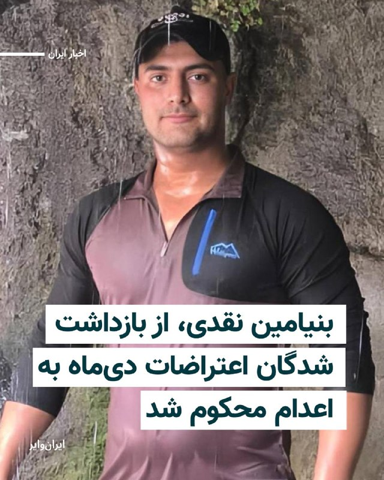
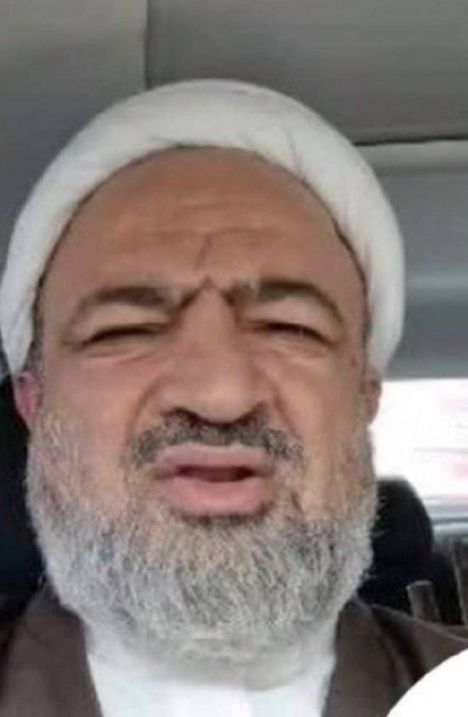
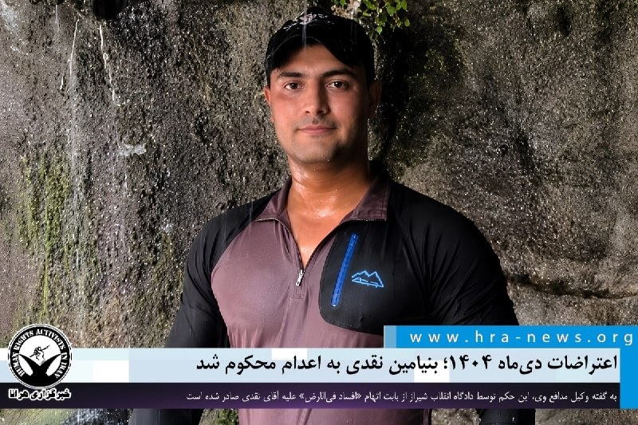

# خواننده تلگرام

<!-- TOP_NAV START -->

<a href="https://github.com/benyamin-najmi/aio-downloader/blob/main/telegram/content/archive_1.md" style="display:inline-block; padding:6px 12px; margin:0 4px; background-color:#2ea44f; color:white; text-decoration:none; border-radius:4px; font-weight:bold;">صفحه بعد</a>

<!-- TOP_NAV END -->

<!-- MSG START -->

---
📅 بروزرسانی: 1405/03/09 19:16
---

## VahidOOnLine — post 242928

♦️ خبرگزاری رویترز تصاویر هوایی از آخرین وضعیت کشتی‌های سرگردان در آب‌های نزدیک به تنگه هرمز را منتشر کرد. در این تصاویر که صبح شنبه، نهم خرداد ثبت شده، صدها شناور از انواع مختلف دیده می‌شود که در فاصله‌های کمی از یکدیگر متوقف شده‌اند؛ وضعیتی که از اولین روزهای جنگ تاکنون ادامه داشته است.

جمهوری اسلامی با قرار دادن سازوکار جدیدی برای عبور از تنگه هرمز و تهدید کشتی‌هایی که از این سازوکار جدید تبعیت نکنند، از یک سو، و احتمال مین‌گذاری در این آبراه استراتژیک از سوی دیگر، باعث افزایش شدید قیمت‌های بیمه کشتی‌ها شده است. همین امر باعث شده این شناورها که میزبان هزاران ملوان هستند، با وجود سختی و هزینه‌های بسیار، از عبور از تنگه هرمز خودداری کنند.
‌🇸🇦 Indypersian

🤖 @VahidOOnLine

## VahidOOnLine — post 242927

  

قرارگاه مرکزی خاتم‌الانبیا در بیانیه‌ای اعلام کرد که هرگونه اقدام شناورهای نظامی جهت مداخله در مدیریت تنگه هرمز یا ایجاد اختلال در تردد، مورد هدف نیروهای مسلح جمهوری اسلامی قرار خواهد گرفت.
در این بیانیه آمده: «هرگونه تخلف از این ضوابط، امنیت تردد آن‌ها را با مخاطره جدی مواجه خواهد کرد.»

قرارگاه مرکزی خاتم‌الانبیا اعلام کرد کلیه کشتی‌ها، شناورهای تجاری و نفتکش‌ها صرفا ملزم به تردد از مسیرهای تعیین‌شده و اخذ مجوز از نیروی دریایی سپاه پاسداران هستند.
‌🏁 🇬🇧 IranintlTV

🤖 @VahidOOnLine

## VahidOOnLine — post 242926

  

مصطفی نیلی، وکیل دادگستری اعلام کرد بنیامین نقدی، زندانی سیاسی و از معترضان دی‌ماه، از سوی دادگاه انقلاب شیراز به اتهام «افسادفی‌الارض»، به اعدام محکوم شد.

این وکیل دادگستری به کانال امتداد گفت که بنیامین نقدی در شب سیزدهم دی ۱۴۰۴ در شیراز، به دلیل «شعله‌ور نمودن یک دستگاه کپسول آتش‌نشانی» به سمت مامورین نیروی انتظامی بازداشت شده بود.

مصطفی نیلی افزود پس از پایان تحقیقات مقدماتی کیفرخواست بنیامین نقدی با اتهام‌های «محاربه، عضویت در گروه‌های به هم‌زننده امنیت، اجتماع و تبانی به قصد انجام جرم علیه امنیت و فعالیت تبلیغی علیه نظام» صادر شد و نسبت به اتهام ایراد صدمه جسمانی به ماموران و حمل سلاح سرد منع تعقیب صادر شد.

نیلی، وکیل دادگستری گفت که در جلسه دادگاه، قضات تمامی اتهامات را مصداق افسادفی‌الارض تشخیص دادند و بر همین مبنا حکم اعدام برای بنیامین نقدی صادر کردند.
‌🏁 🇬🇧 IranintlTV

🤖 @VahidOOnLine

## VahidOOnLine — post 242925

  <a href="telegram/content/VahidOOnLine_242925_1780155970.mp4" target="_blank">🎬 Download video</a>

♦️همزمان با نزدیک شدن به عید قربان، ایستگاه‌های قطار در بنگلادش شاهد ازدحام شدید مسافران بوده‌اند؛ شهروندانی که برای گذراندن تعطیلات به زادگاه‌های خود بازمی‌گردند.
ویدیوی منتشرشده نشان می‌دهد صدها نفر حتی روی سقف و بدنه قطارها سوار شده‌اند؛ صحنه‌ای که هر سال در آستانه این مناسبت مذهبی تکرار می‌شود و نشان‌دهنده فشار بالای تقاضا بر سیستم حمل‌ونقل این کشور است.
عید قربان یکی از مهم‌ترین اعیاد مسلمانان است و در بنگلادش نیز مانند بسیاری از کشورهای اسلامی، میلیون‌ها نفر تلاش می‌کنند این روزها را در کنار خانواده‌های خود در شهرها و روستاهای محل تولدشان سپری کنند.
‌🇸🇦 Indypersian

🤖 @VahidOOnLine

## VahidOOnLine — post 242924

  

شاهزاده رضا پهلوی گفت که مردم ایران باید از طریق هوا حفاظت شوند و اینترنت و دیگر ابزار لازم را داشته باشند که دست به‌کار شوند و رژیم را به زانو درآورند.
او ادامه داد: «مردم حمله به زیرساخت‌های رژیم را جشن گرفتند و خیابان‌ها را به نام ترامپ نام‌گذاری کردند.»

شاهزاده رضا پهلوی ادامه داد: «دنیا باید تصمیم بگیرد که بعد از ۴۷ سال مماشات در کنار مردم ایران بایستد.»

او اضافه کرد: «مردم بین حمله به کشور و حمله به رژیم تمایز ایجاد می‌کنند.»
‌🏁 🇬🇧 IranintlTV

🤖 @VahidOOnLine

## VahidOOnLine — post 242923

  

♦️ رضا محمدی، رئیس سازمان سنجش روز شنبه نهم خرداد اعلام کرد که کنکور سراسری و آزمون پذیرش دانشجومعلم به طور همزمان در روزهای پنجشنبه و جمعه، ۲۹ و ۳۰ مرداد، برگزار خواهد شد. بر اساس داده‌های سازمان سنجش، بیش از یک ملیون و ۸۰هزار نفر برای شرکت در کنکور سراسری و آزمون پذیرش دانشجومعلم ثبت نام کرده‌اند.

همچنین به گفته محمدی، افرادی که از ثبت نام در کنکور کارشناسی ارشد جا مانده‌اند از امروز، نهم خرداد تا ۱۱ خرداد فرصت ثبت نام دارند و آزمون این مقطع نیز در روزهای ۱۸ و ۱۹ تیر برگزار می‌شود.
‌🇸🇦 Indypersian

🤖 @VahidOOnLine

## mwarmonitor — post 9917

  

🔴 مرکز امنیت دریایی عمان: از کشتی‌ها می‌خواهیم در پی مشاهده یک جسم شناور که احتمال می‌رود مین باشد، در غرب منطقه عبور در تنگه هرمز، احتیاط کنند. @mwarmonitor

## mwarmonitor — post 9916

  

🔸ملوانان نیروی دریایی آمریکا در حالی نظاره‌گر هستند که یک جنگنده پنهانکار F-35B Lightning II متعلق به تفنگداران دریایی آمریکا بر روی عرشه ناو آبی‌خاکی USS Tripoli (LHA-7) در حال عبور از دریای عرب فرود می‌آید. جنگنده F-35B برای انجام برخاست‌های کوتاه و فرودهای عمودی طراحی شده است.

@mwarmonitor

## pm_afshaa — post 91900

  <a href="telegram/content/pm_afshaa_91900_1780155974.webm" target="_blank">🎬 Download video</a>

🔴آسوشیتدپرس:
توافق احتمالی ترامپ با جمهوری اسلامی، شکاف بین جمهوری‌خواهان رو عمیق‌تر کرده.

💧 Rainbet.com the #1 Non-KYC Crypto Casino & Sportsbook @rainbetcom

😁 @Pm_Afshaa

## VahidOnline — post 75804

  

قرارگاه مرکزی خاتم‌الانبیا در بیانیه‌ای اعلام کرد که هرگونه اقدام شناورهای نظامی جهت مداخله در مدیریت تنگه هرمز یا ایجاد اختلال در تردد، مورد هدف نیروهای مسلح جمهوری اسلامی قرار خواهد گرفت.
در این بیانیه آمده: «هرگونه تخلف از این ضوابط، امنیت تردد آن‌ها را با مخاطره جدی مواجه خواهد کرد.»

قرارگاه مرکزی خاتم‌الانبیا اعلام کرد کلیه کشتی‌ها، شناورهای تجاری و نفتکش‌ها صرفا ملزم به تردد از مسیرهای تعیین‌شده و اخذ مجوز از نیروی دریایی سپاه پاسداران هستند.
@VahidOOnLine

📡 @VahidOnline

## VahidOnline — post 75803

  <a href="telegram/content/VahidOnline_75803_1780155975.mp4" target="_blank">🎬 Download video</a>

پیت هگست، وزیر دفاع آمریکا، روز شنبه نهم خرداد گفت ایالات متحده در صورتی که مذاکرات با ایران به توافق منجر نشود، آماده ازسرگیری حملات علیه جمهوری اسلامی است.

هگست در جمع خبرنگاران گفت: «در حال حاضر تمرکز ما بر حفظ آمادگی و آماده بودن برای بازگشت به عملیات است، اگر لازم باشد.»
او افزود دونالد ترامپ «صبور» است و به دنبال دستیابی به «توافقی خوب» است که تضمین کند ایران هرگز به سلاح هسته‌ای دست پیدا نخواهد کرد.

اظهارات وزیر دفاع آمریکا در حالی مطرح می‌شود که مذاکره‌کنندگان تهران و واشینگتن در تلاش‌اند اختلافات باقی‌مانده بر سر برنامه هسته‌ای ایران را برطرف کنند.
@VahidHeadline

📡 @VahidOnline

## VahidOnline — post 75802

  

مصطفی نیلی، وکیل دادگستری، اعلام کرد شعبه اول دادگاه انقلاب شیراز بنیامین نقدی را با اتهام «افساد فی‌الارض» به اعدام محکوم کرده است.

نیلی در گفت‌وگو با امتداد گفت که بنیامین نقدی شامگاه ۱۳ دی‌ماه در شیراز به دلیل شعله‌ور کردن یک کپسول آتش‌نشانی به سمت ماموران نیروی انتظامی بازداشت شد.

به گفته این وکیل دادگستری، در ابتدا اتهام «شروع به قتل» به موکلش تفهیم شد، اما پس از آن اتهام وی به «محاربه» تغییر یافت.

او افزود پس از پایان تحقیقات مقدماتی، کیفرخواست بنیامین نقدی با اتهام‌های «محاربه»، «عضویت در گروه‌های برهم‌زننده امنیت کشور»، «اجتماع و تبانی به قصد ارتکاب جرم علیه امنیت کشور» و «فعالیت تبلیغی علیه نظام» صادر شد. به گفته نیلی، در خصوص اتهام‌های «ایراد صدمه جسمانی به ماموران» و «حمل سلاح سرد» قرار منع تعقیب صادر شده بود.

نیلی همچنین گفت قضات شعبه اول دادگاه انقلاب شیراز در جریان رسیدگی، مجموعه اتهام‌های مطرح‌شده را مصداق «افساد فی‌الارض» تشخیص داده و بر همین اساس حکم اعدام برای بنیامین نقدی صادر کرده‌اند.

وکیل بنیامین نقدی با اشاره به قصد خود و همکارانش برای اعتراض به این رای گفت که در مهلت قانونی درخواست فرجام‌خواهی خواهند کرد. او ابراز امیدواری کرد که با توجه به این که به گفته وی در جریان رخداد مورد اشاره هیچ فردی آسیب ندیده است و اقدامات موکلش مصداق افساد فی‌الارض نیست، حکم صادره در دیوان عالی کشور نقض شود.
@VahidHeadline

📡 @VahidOnline

## VahidOnline — post 75801

اینترنت در ایران آزاد و عادی نشده. بیشتر مسیرهای خارجی یا بسته‌اند یا نیمه‌بازند. فقط بعضی مقاصد و مسیرهای خاص اجازه عبور دارند. همین باعث شده فیلترشکن‌های معمولی خوب کار نکنند.
در این میون بعضی از افرادی که دامنه‌ها و مسیرهای سفیدشده دارند، دسترسی می‌فروشند. نتیجه‌اش هم شده اینترنت نابرابر، رانتی و پر از راه‌حل‌های موقت.
انگاری که درِ ساختمون رو کمی باز گذاشته باشن که هوا بیاد، اما اجازه ندن کسی ازش رد بشه.
برای همینه که گوشی‌تون ممکنه نشون بده که اینترنت دارید، حتی شاید اولش سایت یا اپ مورد نظر رو باز کنه یا بهش واکنش نشون بده، اما در عمل از اینترنت خبری نیست.

## IranIntlTV — post 339756

  <a href="telegram/content/IranIntlTV_339756_1780155976.mp4" target="_blank">🎬 Download video</a>

سرخط خبرهای شنبه ۹ خرداد
@iranintltv

## IranIntlTV — post 339755

  <a href="telegram/content/IranIntlTV_339755_1780155977.mp4" target="_blank">🎬 Download video</a>

شاهزاده رضا پهلوی در نشست «امنیت دریای سیاه» در اودسا، در جنوب اوکراین، گفت مردم ایران برای ساختن آینده کشور خود آماده‌اند و از جهان نمی‌خواهند آینده ایران را برای آنان رقم بزند، بلکه خواستار آن هستند که جامعه جهانی در کنار ملت ایران بایستد.

او در بخش دیگری از سخنانش، با اشاره به خروج اجباری خود از ایران در ۱۰ سالگی، گفت که با وجود گذشت ۴۷ سال، هرگز امید خود را به آزادی ایران از دست نداده و همواره صدای مردمی بوده است که امکان بیان خواسته‌هایشان را نداشته‌اند.
@iranintltv

## IranIntlTV — post 339754

  <a href="telegram/content/IranIntlTV_339754_1780155978.mp4" target="_blank">🎬 Download video</a>

پیت هگست، وزیر جنگ آمریکا، هشدار داد در صورت ناکامی تلاش‌های دیپلماتیک، ایالات متحده آماده ازسرگیری حملات علیه جمهوری اسلامی است. او تاکید کرد مذاکرات ادامه خواهد یافت، اما حکومت ایران نباید به سلاح هسته‌ای دست پیدا کند.

ارزیابی بیشتر با اردوان روزبه، خبرنگار ایران‌اینترنشنال
@iranintltv

## IranIntlTV — post 339753

  

قرارگاه مرکزی خاتم‌الانبیا در بیانیه‌ای اعلام کرد که هرگونه اقدام شناورهای نظامی جهت مداخله در مدیریت تنگه هرمز یا ایجاد اختلال در تردد، مورد هدف نیروهای مسلح جمهوری اسلامی قرار خواهد گرفت.
در این بیانیه آمده: «هرگونه تخلف از این ضوابط، امنیت تردد آن‌ها را با مخاطره جدی مواجه خواهد کرد.»

قرارگاه مرکزی خاتم‌الانبیا اعلام کرد کلیه کشتی‌ها، شناورهای تجاری و نفتکش‌ها صرفا ملزم به تردد از مسیرهای تعیین‌شده و اخذ مجوز از نیروی دریایی سپاه پاسداران هستند.
https://iranintl.com/202605309807

## IranIntlTV — post 339752

  <a href="telegram/content/IranIntlTV_339752_1780155981.mp4" target="_blank">🎬 Download video</a>

شاهزاده رضا پهلوی در نشست «امنیت دریای سیاه» در اودسا، اوکراین، خواستار حمایت جهانی از مردم ایران برای تغییر حکومت جمهوری اسلامی شد. او با فاقد مشروعیت دانستن مقام‌های جمهوری اسلامی، مذاکره با این حکومت را «وقت‌کشی پرهزینه» خواند.

گفت‌وگو با فروغ کنعانی، پژوهشگر جامعه‌شناسی
@iranintltv

## IranIntlTV — post 339751

  

مصطفی نیلی، وکیل دادگستری اعلام کرد بنیامین نقدی، زندانی سیاسی و از معترضان دی‌ماه، از سوی دادگاه انقلاب شیراز به اتهام «افسادفی‌الارض»، به اعدام محکوم شد.

این وکیل دادگستری به کانال امتداد گفت که بنیامین نقدی در شب سیزدهم دی ۱۴۰۴ در شیراز، به دلیل «شعله‌ور نمودن یک دستگاه کپسول آتش‌نشانی» به سمت مامورین نیروی انتظامی بازداشت شده بود.

مصطفی نیلی افزود پس از پایان تحقیقات مقدماتی کیفرخواست بنیامین نقدی با اتهام‌های «محاربه، عضویت در گروه‌های به هم‌زننده امنیت، اجتماع و تبانی به قصد انجام جرم علیه امنیت و فعالیت تبلیغی علیه نظام» صادر شد و نسبت به اتهام ایراد صدمه جسمانی به ماموران و حمل سلاح سرد منع تعقیب صادر شد.

نیلی، وکیل دادگستری گفت که در جلسه دادگاه، قضات تمامی اتهامات را مصداق افسادفی‌الارض تشخیص دادند و بر همین مبنا حکم اعدام برای بنیامین نقدی صادر کردند.
https://iranintl.com/202605305615

## IranIntlTV — post 339750

  

شاهزاده رضا پهلوی گفت که مردم ایران باید از طریق هوا حفاظت شوند و اینترنت و دیگر ابزار لازم را داشته باشند که دست به‌کار شوند و رژیم را به زانو درآورند.
او ادامه داد: «مردم حمله به زیرساخت‌های رژیم را جشن گرفتند و خیابان‌ها را به نام ترامپ نام‌گذاری کردند.»

شاهزاده رضا پهلوی ادامه داد: «دنیا باید تصمیم بگیرد که بعد از ۴۷ سال مماشات در کنار مردم ایران بایستد.»

او اضافه کرد: «مردم بین حمله به کشور و حمله به رژیم تمایز ایجاد می‌کنند.»
https://iranintl.com/202605301562

## IranIntlTV — post 339749

  <a href="telegram/content/IranIntlTV_339749_1780155984.mp4" target="_blank">🎬 Download video</a>

شاهزاده رضا پهلوی در نشست «امنیت دریای سیاه» در اودسا در جنوب اوکراین، گفت: « با محور هرج ومرج مذاکره نکنید، با آن مقابله کنید. مدیریت نکنید جمهوری اسلامی را، به آن پایان دهید.»
@iranintltv

## IranIntlTV — post 339748

  

🔻رولاندو ماران، سرمربی تیم ملی آلبانی، پس از اعلام فهرست بازیکنان برای دو دیدار دوستانه مقابل اسرائیل و لوکزامبورگ، درباره غیبت یاسر آسانی، مهاجم تیم استقلال گفت: «یاسر آسانی دعوت نشد چون بازی نکرده است. من شخصاً با او صحبت نکردم، اما همکارانم با او تماس گرفتند.»

🔹ماران گفت: «او در این مدت به میدان نرفته و آماده بودنش برای این مسابقات دشوار بود.»

🔹آلبانی روز ۱۳ خرداد به مصاف اسرائیل می‌رود و ۱۶ خرداد برابر لوکزامبورگ قرار خواهد گرفت.

@iranintltvsport

## FarsiVOA — post 219089

در گفت‌وگو با حسن هاشمیان به پایان مأموریت تام باراک به‌عنوان نماینده ویژه آمریکا در سوریه پرداختیم. به گفته آقای هاشمیان کارنامه تام باراک را باید به دو مقطع قبل و بعد از عملیات «خشم حماسی» علیه جمهوری اسلامی تقسیم کرد.

## FarsiVOA — post 219088

  <a href="telegram/content/FarsiVOA_219088_1780155985.mp4" target="_blank">🎬 Download video</a>

ارتش اسرائیل اعلام کرد کمی پیشتر موشک‌هایی از لبنان به مناطقی در شمال اسرائیل شلیک شد. تعدادی از این موشک‌ها رهگیری شدند و تعدادی در فضاهایی باز مانند ساحل شهر نهاریا در شمال اسرائیل سقوط کردند. ارتش اسرائیل اعلام کرد این حملات به اسرائیل تلفاتی درپی نداشتند.

## FarsiVOA — post 219084

پیت هگست، وزیر جنگ آمریکا، از دیدار با گیلبرتو تئودورو، وزیر دفاع فیلیپین، خبر داد.

او گفت دو کشور در حال تقویت همکاری‌های دفاعی در امتداد «زنجیره نخست جزایر» هستند؛ همکاری‌ای که به گفته او با برگزاری رزمایش «بالیکاتان» و انتقال یک شناور گارد ساحلی پشتیبانی شده است.

@FarsiVOA

## FarsiVOA — post 219083

آیا تهدید اروپا توسط روسیه به رویارویی کشیده می‌شود؟ گفت‌و‌گو با رضا تقی‌زاده، تحلیلگر روابط بین‌الملل

## FarsiVOA — post 219082

🔺 تداوم آزار و اذیت معترضان دی؛ شمار زیادی از بازداشت‌شدگان همچنان در بلاتکلیفی هستند

▪️نهادهای حقوق بشری از ادامه سرکوب و فشار جمهوری اسلامی بر بازداشت‌شدگان اعتراضات سراسری دی‌ ۱۴۰۴ در شهرهای مختلف ایران خبر می‌دهند.

⬇️ بیشتر بخوانید:

https://ir.voanews.com/a/iran-arrest-protest-prison-january-human-rights/8155568.html/?nocach=1

## FarsiVOA — post 219081

  <a href="telegram/content/FarsiVOA_219081_1780155987.mp4" target="_blank">🎬 Download video</a>

«هەنگاو» ویدیویی از مراسم تشییع مجتبی و میثم ویسی منتشر کرده است که امروز شنبە نهم خرداد در سرپل ذهاب برگزار می‌شود.

این دو برادر که پس از اعتراضات دی‌ ۱۴۰۴ تحت تعقیب نهادهای امنیتی بودند بامداد پنجشنبه هفتم خرداد ۱۴۰۵ در روستای «قلعه کهوش» از توابع دالاهو، در جریان یورش نیروهای اطلاعات سپاه پاسداران به محل اختفای آنها، هدف شلیک مستقیم قرار گرفتند و کشته شدند.

مجتبی و میثم ویسی از فعالان فرهنگی و مدنی و از پیروان آیین یارسان معرفی شده‌اند. آنها از بنیان‌گذاران کتابخانه‌ای در شهرک دره‌دریژ کرمانشاه بودند. مجتبی ویسی همچنین کشتی‌گیر، نوازنده، و نقاش بود. کُردپا پیشتر گزارش داده بود که مجتبی ویسی در اسفند ۱۴۰۳ بازداشت و در فروردین ۱۴۰۴ با وثیقه آزاد شده بود.

## FarsiVOA — post 219080

تعطیلی فرودگاه مونیخ و اختلال در پروازها پس از مشاهده پهپاد ناشناس؛ زنگ خطر امنیت هوایی اروپا

## FarsiVOA — post 219078

فرماندهی مرکزی ایالات متحده، سنتکام، تصاویری از عملیات هوایی شبانه ملوانان آمریکایی روی ناو هواپیمابر «یو‌اس‌اس جرج اچ دبلیو بوش» منتشر کرد.

سنتکام می‌گوید خلبانان در شب قادرند در تاریکی، هواپیماهای خود را روی عرشه‌ای کوچک که همزمان در حال حرکت و نوسان است، فرود آورند.

@FarsiVOA

## FarsiVOA — post 219077

آرمان معرفتی، شهروند اهل سقز که اسفند سال گذشته به اتهام آتش‌ زدن یک مسجد در تهران محاکمه شده بود، به اعدام محکوم شد.

## FarsiVOA — post 219076

  <a href="telegram/content/FarsiVOA_219076_1780155989.mp4" target="_blank">🎬 Download video</a>

ارتش اسرائیل روز گذشته مقر توپخانه حزب‌الله را در منطقه شویا در جنوب لبنان منهدم کرد.

ارتش اسرائیل اعلام کرد این حمله پس از تایید حضور نیروهای این سازمان تروریستی در منطقه انجام شد.

وقوع انفجارهای ثانویه بعد از حمله، وجود تسلیحات را در این محل تایید کرد.

این ویدیو بی‌صدا است.

## FarsiVOA — post 219075

🔺هشدار ارتش اسرائیل به ساکنان مناطقی در لبنان: فورا تخلیه کنید

▪️ارتش اسرائیل در واکنش به تازه‌ترین حملات گروه تروریستی حزب‌الله به شمال این کشور، برای چندین روستا در جنوب لبنان و همچنین و در دره بقاع، هشدار تخلیه صادر کرد.

⬇️ بیشتر بخوانید:

https://ir.voanews.com/a/israel-hezbollah-iran-war-proxy/8155561.html/?nocach=1

## FarsiVOA — post 219074

پیت هگست، وزیر جنگ آمریکا، با اشاره به مذاکرات با رژیم ایران گفت که گفت‌وگوها «سازنده» بوده و جمهوری اسلامی به مواضع مورد نظر واشنگتن نزدیک‌تر شده است.

او تاکید کرد آمریکا همچنان بر جلوگیری از دستیابی رژیم ایران به سلاح هسته‌ای اصرار دارد و گفت انتظارات آمریکا از جمهوری اسلامی تغییری نکرده است.

هگست همچنین گفت دولت آمریکا ترجیح می‌دهد مسئله از طریق توافق حل شود، اما در صورت لزوم برای گزینه‌های دیگر نیز آمادگی دارد.

@FarsiVOA

## DW_Farsi — post 125321

  

🔶 توقیف اموال ده‌ها نفر در ایران به اتهام "همکاری با دشمن"

در حالی که قوه قضائیه استان گلستان از توقیف اموال ۷۴ ایرانی خارج از کشور به اتهام "خیانت به وطن" خبر داده، رئيس‌ کل دادگستری خراسان جنوبی نیز می‌گوید، اموال ۳۴ نفر در این استان به اتهام "حمایت از دشمن" ضبط شده است.

خبرگزاری ایرنا روز شنبه نهم خرداد (۳۰ مه) به نقل از قوه قضائيه نوشت، به دستور مقام قضايی، اموال ۷۴ نفر در استان گلستان که از " خائنین به وطن و افراد تأثیرگذار در شبکه همکاران دشمن" و ساکن خارج از کشور هستند در راستای "حفظ حقوق عامه و اجرای قانون تشدید مجازات جاسوسی و همکاری" با اسرائيل توقیف شد.

قوه قضائيه می‌‌گوید، اموال این افراد شامل حساب‌های بانکی، خودرو و املاک ثبتی است که شناسایی و همه توقیف شده است. در ضمن، هرگونه نقل و انتقال مالی برای آن‌ها ممنوع و پرونده این افراد در دادسرای مرکز استان در حال رسیدگی است.

هم‌زمان محمدجعفر عبداللهی، رئیس‌ کل دادگستری استان خراسان جنوبی از توقیف اموال ۳۴ نفر که او آن‌ها را "حامی دشمن و خائن به کشور" نامید خبر داد.

@dw_farsi

## DW_Farsi — post 125320

  

🔶 نماینده ایرانی‌تبار پارلمان آلمان خواستار ممنوعیت فعالیت سپاه شد

رضا اصغری، نماینده ایرانی‌تبار پارلمان آلمان از حزب دموکرات‌مسیحی (CDU) خواستار ممنوعیت فعالیت سپاه پاسداران انقلاب اسلامی در این کشور شد.

اصغری در گفت‌وگو با خبرگزاری رویترز گفت: «سرویس‌های اطلاعاتی ایران در آلمان بسیار فعال هستند. غیرقابل درک است که هنوز ممنوعیتی برای فعالیت سپاه پاسداران در این کشور وجود ندارد. ما در سریع‌ترین زمان ممکن به این ممنوعیت نیاز داریم.»

اتحادیه اروپا تا کنون سپاه پاسداران را در فهرست سازمان‌های تروریستی قرار داده است.

اما وزارت کشور آلمان هنوز بر اساس قانون تشکل‌ها (Vereinsrecht)، فعالیت سپاه را در خاک خود ممنوع اعلام نکرده است.

در ساختار حقوقی آلمان، دولت برای ممنوع کردن فعالیت یک نهاد خارجی در خاک خود، باید از طریق این قانون اقدام کند تا بتواند شعبه‌ها، فعالیت‌ها و دارایی‌های آن نهاد یا هوادارانش را در داخل مرزهای آلمان غیرقانونی اعلام کند.

@dw_farsi

## DW_Farsi — post 125319

  

🔶 "انهدام پهپاد اسرائيلی" در قشم و "حمله ایران به پایگاهی در کویت"

در حالی که ارتش ایران از انهدام یک فروند پهپاد اسرائيلی در منطقه قشم خبر می‌دهد بلومبرگ نیز می‌گوید، در حمله موشکی ایران به یک پایگاه آمریکا در کویت چند آمریکایی زخمی شده‌اند.

به نوشته خبرگزاری ایرنا، ارتش ایران روز شنبه نهم خرداد (۳۰ مه) در اطلاعیه‌ای اعلام کرد که در بامداد همین روز یک فروند پهپاد اوربیتر اسرائيل را رهگیری و منهدم کرده است.

به گفته ارتش، این پهپاد "تحت شبکه یکپارچه قرارگاه مشترک پدافند هوایی کشور در منطقه قشم" مورد اصابت قرار گرفت و منهدم شد.

در همین حال خبرگزاری بلومبرگ نیز در گزارشی به نقل از منبعی آگاه از حمله موشکی ایران به پایگاه آمریکایی "علی السالم" در کویت در ۲۴ ساعت گذشته خبر داد.

به گفته بلومبرگ، در این حمله پنج نفر، از جمله چند پرسنل آمریکایی زخمی شدند و به پهپادهای ایالات متحده نیز آسیب وارد آمد.

بلومبرگ به نقل از این منبع که نامش ذکر نشد جراحات آمریکایی‌ها را سطحی اما خسارت وارده به دو پهپاد "ام‌کیو ـ ۹ریپر" ارتش آمریکا را شدید اعلام کرده است.

@dw_farsi

## Persian_Trend_Official — post 15344

  <a href="telegram/content/Persian_Trend_Official_15344_1780155992.mp4" target="_blank">🎬 Download video</a>

امریکا خبر آسیب حمله موشکی ایران به کویت را تأیید کرد.

مجری فاکس نیوز: بلومبرگ گزارش می‌دهد که حملات موشکی ایران منجر به زخمی شدن چندین آمریکایی در پایگاه هوایی کویت شده است. به نظر شما اوضاع از چه قرار است؟

مایک جانسون، رئیس مجلس نمایندگان: من دیشب با رئیس جمهور ترامپ صحبت کردم. او در جریان این موضوع قرار گرفته است. من فکر می‌کنم رهبری جدید ایران می‌خواهد به این درگیری پایان دهد.

📝 Amir

📌 @persian_trend_official
پرشین ترند | متفاوت‌ترین کانال نظامی

## RadioFarda — post 157723

🔸پیت هگست، وزیر دفاع آمریکا، روز شنبه نهم خرداد گفت ایالات متحده در صورتی که مذاکرات با ایران به توافق منجر نشود، آماده ازسرگیری حملات علیه جمهوری اسلامی است.

🔸هگست در جمع خبرنگاران گفت: «در حال حاضر تمرکز ما بر حفظ آمادگی و آماده بودن برای بازگشت به عملیات است، اگر لازم باشد.»

🔸او افزود دونالد ترامپ «صبور» است و به دنبال دستیابی به «توافقی خوب» است که تضمین کند ایران هرگز به سلاح هسته‌ای دست پیدا نخواهد کرد.

🔸اظهارات وزیر دفاع آمریکا در حالی مطرح می‌شود که مذاکره‌کنندگان تهران و واشینگتن در تلاش‌اند اختلافات باقی‌مانده بر سر برنامه هسته‌ای ایران را برطرف کنند.

@RadioFarda

## RadioFarda — post 157722

🔸یک عضو هیئت رئیسه مجلس شورای اسلامی روز شنبه اعلام کرد که «اعمال مدیریت» ایران بر تنگه هرمز «تصمیم قطعی» مجلس است و طرح مربوط به آن در صحن علنی تصویب و تبدیل به قانون خواهد شد. 🔸به گزارش خبرگزاری تسنیم، علیرضا سمیعی مدعی شد که درباره طرح مذکور با «دستگاه‌های…

## RadioFarda — post 157721

  

🔸یک عضو هیئت رئیسه مجلس شورای اسلامی روز شنبه اعلام کرد که «اعمال مدیریت» ایران بر تنگه هرمز «تصمیم قطعی» مجلس است و طرح مربوط به آن در صحن علنی تصویب و تبدیل به قانون خواهد شد.

🔸به گزارش خبرگزاری تسنیم، علیرضا سمیعی مدعی شد که درباره طرح مذکور با «دستگاه‌های مختلف» گفت‌وگوهایی انجام شده است.

🔸این در حالی است که دونالد ترامپ، رئیس‌جمهور آمریکا، بارها اعلام کرده که هرگونه توافق با ایران برای پایان دادن به جنگ باید شامل باز شدن این آبراه بدون اخذ عوارض باشد. او روز جمعه نیز این موضع ایالات منحده را تکرار کرد.

🔸عضو هیئت رئیسه مجلس با اعلام این‌که تنگه هرمز در «حوزه سرزمینی ایران و عمان» است، گفت که اجازه نمی‌دهیم کشور دیگری در این‌ زمینه تصمیم‌گیری کند.

📷شرح عکس: مجسمه نیروهای نظامی ایران در ساحل بندرعباس، در حالی که شناورهایی در آب‌های تنگه هرمز دیده می‌شوند.

@RadioFarda

## IranianMinds — post 21074

  

🔴بدون توضیح.

😂😂😂

@IranianMinds

## IranianMinds — post 21073

🔴 شاهزاده رضا پهلوی:

مردم ایران باید از طریق هوا حفاظت بشن و اینترنت و دیگر ابزار لازم رو داشته باشن که دست به‌کار بشن و رژیم رو به زانو بیارن.

مردم حمله به زیرساخت‌های رژیم رو جشن گرفتن و خیابان‌ها رو به نام ترامپ نام‌گذاری کردن.

دنیا باید تصمیم بگیره که بعد از ۴۷ سال مماشات در کنار مردم ایران بایسته.

@IranianMinds

## Dirty_Kids — post 390571

  <a href="telegram/content/Dirty_Kids_390571_1780155995.mp4" target="_blank">🎬 Download video</a>

ایرانی فکر کن بعد سه ماه بهت اینترنت دادن اینو ببینی😂

@Dirty_Kids 👻

## Dirty_Kids — post 390570

  <a href="telegram/content/Dirty_Kids_390570_1780155996.mp4" target="_blank">🎬 Download video</a>

🔴 ویدیوی ویرال شده از حرکت یه پسر جوون توی ایران که شاهکار خلق کرده🔥

@Dirty_Kids 👻

## Hranews — post 113247

  

احکام اعدام رئوف شیخ‌ معروفی و محمد فرجی در دیوان عالی کشور تایید شد

❗️
❗️
❗️
❗️
❗️– دیوان عالی کشور احکام اعدام رئوف شیخ‌ معروفی و محمد فرجی، زندانیان سیاسی محبوس در زندان بوکان را تایید کرد. این افراد پیشتر از بابت اتهام “افساد فی الارض”، توسط دادگاه انقلاب به #اعدام محکوم شده بودند.

ادامه مطلب

#رئوف_شیخ‌_معروفی #محمد_فرجی

↘️
@hranews_bot تماس ✉️ - @Hranews کانال هرانا 🆑

## Hranews — post 113246

  

اعتراضات دی‌ماه ۱۴۰۴؛ بنیامین نقدی به اعدام محکوم شد

❗️
❗️
❗️
❗️
❗️– بنیامین نقدی، از بازداشت شدگان اعتراضات سراسری ۱۴۰۴، توسط دادگاه انقلاب شیراز از بابت اتهام «افساد فی‌الارض» به #اعدام محکوم شد. مصطفی نیلی، وکیل مدافع وی اعلام کرده است که نسبت به این حکم درخواست فرجام‌خواهی خواهد کرد.

ادامه مطلب

#بنیامین_نقدی

↘️
@hranews_bot تماس ✉️ - @Hranews کانال هرانا 🆑

## Hranews — post 113245

پرونده سجاد و شایان ویسی با اتهام محاربه به دادگاه انقلاب کرمانشاه ارجاع شد

❗️
❗️
❗️
❗️
❗️– سجاد ویسی و شایان ویسی، شهروندان پیرو آئین یارسان و از بازداشت‌شدگان اعتراضات دی‌ماه در کرمانشاه، همچنان در زندان دیزل‌آباد این شهر نگهداری می‌شوند. پرونده این شهروندان با اتهام محاربه به دادگاه انقلاب کرمانشاه ارجاع شده است. سجاد ویسی برادر میثم و مجتبی ویسی است که روز پنجشنبه ۷ خرداد ۱۴۰۵ در یکی از روستاهای شهرستان دالاهو هدف تیراندازی ماموران اطلاعات سپاه قرار گرفته و جان خود را از دست دادند.

ادامه مطلب

#سجاد_ویسی #شایان_ویسی

↘️
@hranews_bot تماس ✉️ - @Hranews کانال هرانا 🆑

## alonews — post 123751

  <a href="telegram/content/alonews_123751_1780155998.webm" target="_blank">🎬 Download video</a>

👈قرارگاه مرکزی خاتم‌الانبیا در بیانیه‌ای اعلام کرد که هرگونه اقدام شناورهای نظامی جهت مداخله در مدیریت تنگه هرمز یا ایجاد اختلال در تردد، مورد هدف نیروهای مسلح جمهوری اسلامی قرار خواهد گرفت.

🔴در این بیانیه آمده: «هرگونه تخلف از این ضوابط، امنیت تردد آن‌ها را با مخاطره جدی مواجه خواهد کرد.»

🔴قرارگاه مرکزی خاتم‌الانبیا اعلام کرد کلیه کشتی‌ها، شناورهای تجاری و نفتکش‌ها صرفا ملزم به تردد از مسیرهای تعیین‌شده و اخذ مجوز از نیروی دریایی سپاه پاسداران هستند.

✅ @AloNews خبر جنگ

## alonews — post 123748

  <a href="telegram/content/alonews_123748_1780155998.mp4" target="_blank">🎬 Download video</a>

8 اردیبهشت ماه یه زوج عروسی گرفتن و 20 میلیارد تومن خرج عروسی‌شون شده!! فقط یه میلیارد پول فیلمبردار دادن! اینم فیلم عروسی‌شونه.

[@AloTweet]

## alonews — post 123747

  <a href="telegram/content/alonews_123747_1780155998.webm" target="_blank">🎬 Download video</a>

💔همه اعضای این خانواده جاوید نام شدن.

🔴جاویدنام بیژن مصطفوی، ۵۸ ساله، بازنشسته آموزش و پرورش، رزمنده جنگ ایران و عراق

🔴جاویدنام زهرابنی‌عامریان، ۴۸ ساله، بازنشسته تامین اجتماعی

🔴جاویدنام دانیال مصطفوی، ۲۰ ساله، دانشجوی کامپیوتر

🔴اصالتا از شهرستان سنقر، استان کرمانشاه
کشته شده ۱۹ دی ماه خونین ۴۰۴ در گوهردشت کرج

🤔عرزشی حرام زاده بدونه که روز تسویه حساب باهاتون نزدیکه

✅@AloNews

## alonews — post 123746

  <a href="telegram/content/alonews_123746_1780155999.webm" target="_blank">🎬 Download video</a>

👈سازمان ملل : سال ۲۰۲۷ گرم‌ترین سال ثبت خواهد شد

✅ @AloNews خبر جنگ

## alonews — post 123745

  <a href="telegram/content/alonews_123745_1780155999.webm" target="_blank">🎬 Download video</a>

👈آزمون‌ساز برنامه شاد هم پولی شد!
‌

🔴بسته‌های آزمون‌ساز شاد از ۷۴۹ هزار تومان تا ۳ میلیون تومان قیمت‌گذاری شده‌اند

✅ @AloNews خبر جنگ

## alonews — post 123744

🔥 همراه با ساب + حجم مصرفی، فقط 9T! 🚀 ❌ آفر فقط تا پایان امشب ❌ 🔥 اگه دنبال یه VPN پایدار و بدون دردسر می‌گردی، این پلن مخصوص خودته! @Netaazaadbot @NetAazaadBot ✅ همراه با ساب + حجم مصرفی ✅ 15 سرور اختصاصی پرسرعت ✅ اتصال پایدار و بدون قطعی ✅ سرعت بالا…

## alonews — post 123743

🔥 همراه با ساب + حجم مصرفی، فقط 9T! 🚀

❌ آفر فقط تا پایان امشب ❌

🔥 اگه دنبال یه VPN پایدار و بدون دردسر می‌گردی، این پلن مخصوص خودته!

@Netaazaadbot
@NetAazaadBot
✅ همراه با ساب + حجم مصرفی
✅ 15 سرور اختصاصی پرسرعت
✅ اتصال پایدار و بدون قطعی
✅ سرعت بالا حتی در ساعات شلوغ

@Netaazaadbot
@NetAazaadBot
💎 کیفیتی که بعد از استفاده متوجه تفاوتش میشی!

📩 برای خرید و دریافت سرویس استارت رو بزن✅

## alonews — post 123742

  <a href="telegram/content/alonews_123742_1780155999.webm" target="_blank">🎬 Download video</a>

👈وال استریت ژورنال | کاهش چشمگیر هزینه سرنگونی پهپادها: ارتش آمریکا راهکار جدیدی پیدا کرده است تا بدون صرف هزینه‌های کلانِ ۱ میلیون دلاری، پهپادها را در آسمان منهدم کند

🔴روزنامه «وال‌استریت ژورنال» در گزارش جدید خود اعلام کرد ارتش آمریکا راهکار تازه‌ای برای انهدام پهپادها بدون نیاز به صرف هزینه‌های ۱ میلیون دلاری پیدا کرده است.

🔴این روش جدید با به‌کارگیری خودروهای تاکتیکی ویژه مجهز به توپ‌ها و مهمات تخصصی، هزینه ساقط کردن پرنده‌های بدون سرنشین را به شدت کاهش می‌دهد.

🔴در جریان یک آزمایش میدانی مشترک در فیلیپین، تفنگداران دریایی آمریکا با استفاده از این سیستم جدید تاکتیکی موفق شدند یک پهپاد مهاجم بال‌ثابت را با هزینه‌ای بسیار پایین‌تر از موشک‌های پدافندی متعارف، بر فراز دریای جنوبی چین سرنگون کنند.

✅ @AloNews خبر جنگ

## alonews — post 123741

  <a href="telegram/content/alonews_123741_1780156000.webm" target="_blank">🎬 Download video</a>

👈رئیس دفتر کاخ سفید: جی‌دی ونس اغلب در جلسات با تلفن خود ور می‌رود و ترامپ به او گفته است این در شآن معاون اول رییس‌جمهور نیست

✅ @AloNews خبر جنگ

## alonews — post 123740

  <a href="telegram/content/alonews_123740_1780156000.webm" target="_blank">🎬 Download video</a>

👈دیده شده در تجمعات شبانه

✅ @AloNews خبر جنگ

## alonews — post 123739

  <a href="telegram/content/alonews_123739_1780156000.mp4" target="_blank">🎬 Download video</a>

👈مک‌ینی از فاکس:
بلومبرگ گزارش می‌دهد که حملات موشکی ایران باعث مجروحیت چند آمریکایی در پایگاه هوایی کویت شده است. فکر می‌کنید وضعیت کجاست؟

🔴میک جانسون، رئیس مجلس:
من دیشب با رئیس‌جمهور ترامپ صحبت کردم. او کاملاً روی این موضوع تمرکز کرده است. فکر می‌کنم رهبری جدید ایران می‌خواهد به این درگیری پایان دهد.

✅ @AloNews خبر جنگ

## alonews — post 123738

👈کارشناس صداوسیما : ما آریایی‌ نیستیم!

✅ @AloNews خبر جنگ

## alonews — post 123737

  <a href="telegram/content/alonews_123737_1780156002.webm" target="_blank">🎬 Download video</a>

👈عوستاد رائفی پور:
شاید عده‌ای به حرفم بخندن اما آمریکا تمام شد

✅ @AloNews خبر جنگ

## alonews — post 123736

  <a href="telegram/content/alonews_123736_1780156002.mp4" target="_blank">🎬 Download video</a>

👈تصاویر ماهواره ای از انهدام کامل ذاغه مهمات، و سایت پدافندی پایگاه هوایی اصفهان توسط آمریکا / اسرائیل

✅ @AloNews خبر جنگ

## alonews — post 123735

  <a href="telegram/content/alonews_123735_1780156004.webm" target="_blank">🎬 Download video</a>

🚨🔴پرسپولیس رسما از آسیا جا ماند 🔻دبیر سازمان لیگ: به دلیل اینکه باشگاه پرسپولیس در رتبه ششم جدول لیگ قرار دارد نمی‌تواند به رقابت‌های آسیایی معرفی شود. کنفدراسیون فوتبال آسیا مهلت لازم را نداد که پس از برگزاری مسابقات لیگ برتر نمایندگان کشور جهت حضور در…

## alonews — post 123734

  <a href="telegram/content/alonews_123734_1780156004.webm" target="_blank">🎬 Download video</a>

👈تلگراف: دو ژنرال قدرتمند، احمد وحیدی و محمد جعفری، با هم متحد شدن تا قالیباف رو از قدرت برکنار کنند.

✅ @AloNews خبر جنگ

## alonews — post 123733

  <a href="telegram/content/alonews_123733_1780156004.webm" target="_blank">🎬 Download video</a>

👈کانال ۱۲ اسرائیل:
از صبح امروز هر ۲۲ دقیقه یکبار آژیر خطر در شمال اسرائیل به صدا در می‌آید.

✅ @AloNews خبر جنگ

## alonews — post 123732

  <a href="telegram/content/alonews_123732_1780156004.mp4" target="_blank">🎬 Download video</a>

👈ویدئویی که تازه از حمله‌های اسرائیل و آمریکا به خرم‌آباد تو جنگ ۴۰ روزه بیرون اومده!

✅ @AloNews خبر جنگ

<!-- MSG END -->

<!-- NAV START -->

<a href="https://github.com/benyamin-najmi/aio-downloader/blob/main/telegram/content/archive_1.md" style="display:inline-block; padding:6px 12px; margin:0 4px; background-color:#2ea44f; color:white; text-decoration:none; border-radius:4px; font-weight:bold;">صفحه بعد</a>

<!-- NAV END -->
