# خواننده تلگرام

<!-- TOP_NAV START -->

<a href="https://github.com/benyamin-najmi/aio-downloader/blob/main/telegram/content/archive_1.md" style="display:inline-block; padding:6px 12px; margin:0 4px; background-color:#2ea44f; color:white; text-decoration:none; border-radius:4px; font-weight:bold;">صفحه بعد</a>

<!-- TOP_NAV END -->

<!-- MSG START -->

---
📅 بروزرسانی: 1405/02/29 09:18
---

## VahidOOnLine — post 240911

  <a href="telegram/content/VahidOOnLine_240911_1779169738.mp4" target="_blank">🎬 Download video</a>

آنا کلی، سخنگوی کاخ سفید، گفت موضع دونالد ترامپ درباره جمهوری اسلامی تغییری نکرده و رئیس‌جمهوری آمریکا همچنان برای جلوگیری از دستیابی تهران به سلاح هسته‌ای «بسیار جدی» است.

او گفت جمهوری اسلامی ۴۷ سال شعار «مرگ بر آمریکا» سر داده و نیروهای آمریکایی در خارج از کشور را تهدید کرده، هرگز نباید به سلاح هسته‌ای دست پیدا کند.

کلی افزود پیام ترامپ در شبکه تروث سوشال نشان می‌دهد او تا چه اندازه در این موضوع جدی است. به گفته او، جمهوری اسلامی اکنون با مشکلات متعددی روبه‌رو است، زیرا «ترامپ همه برگ‌ها را در دست دارد».
‌🏁 🇬🇧 ManotoTV

🤖 @VahidOOnLine

## VahidOOnLine — post 240910

♦️ مادر جاویدنام ایلیا اجاقلو، از کشته‌شدگان انقلاب ملی در زنجان، پس از مدت‌ها قطعی اینترنت در ایران، ویدیویی از مراسم زادروز ۱۸ سالگی فرزندش منتشر کرد و نوشت که آرزو داشته «۱۸ سالگی، دیپلم گرفتن و دانشگاه رفتن پسرش را ببیند، اما گلوله نامردان جان او را گرفت» تا این تولد در غیاب فرزندش برگزار شود.

جاویدنام ایلیا اجاقلو، شامگاه پنجشنبه ۱۸ دی‌ماه در جریان انقلاب ملی ایرانیان با شلیک مستقیم گلوله جنگی نیروهای سرکوبگر به قفسه سینه در مقابل کلانتری سبزه‌میدان زنجان کشته شد.
با وجود فشارهای شدید امنیتی برای معرفی این نوجوان به‌عنوان نیروی بسیج، خانواده او در برابر این خواسته‌ حکومت ایستادگی کردند.

پیش از این نیز تصاویری از مراسم خاکسپاری و چهلم ایلیا منتشر شده بود که در آن مادرش با فریاد «دامادیت مبارک» و اجرای «رقص سوگ» با فرزندش وداع کرد؛ نمادی از دادخواهی و ایستادگی خانواده‌های داغدار که رقصیدن بر مزار عزیزانشان را به پیامی قدرتمند علیه جمهوری اسلامی تبدیل کردند.
‌🇸🇦 Indypersian

🤖 @VahidOOnLine

## VahidOOnLine — post 240909

  

♦️سازمان «کمک به گروگان‌ها در سراسر جهان» دوشنبه شب اعلام کرد شهاب دلیلی، زندانی سیاسی و کاپیتان پیشین شرکت کشتی‌رانی ایران، پس از آزادی از زندان اوین از طریق ایروان به واشینگتن منتقل شده و به خانواده‌اش پیوسته است.
این سازمان اعلام کرد دلیلی پس از گذراندن بیش از یک دهه «بازداشت غیرقانونی» در ایران، اکنون در سلامت کامل قرار دارد.

شهاب دلیلی که ساکن آمریکا بود، سال ۱۳۹۵ خورشیدی برای مراسم خاکسپاری پدرش به تهران سفر کرده بود اما هنگام بازگشت توسط نیروهای امنیتی بازداشت شد.
خانواده او گفته بودند جمهوری اسلامی او را با اتهام‌هایی از جمله «جاسوسی» و «همکاری با دولت متخاصم» به ۱۰ سال حبس محکوم کرده است.
‌🇸🇦 Indypersian

🤖 @VahidOOnLine

## VahidOOnLine — post 240908

  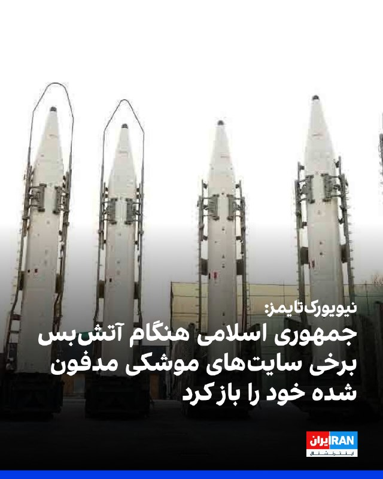

نیویورک‌تایمز به نقل از یک مقام نظامی آمریکا گزارش داد جمهوری اسلامی از آتش‌بس یک‌ماهه برای باز کردن ده‌ها محل استقرار موشک‌های بالستیکِ هدف‌قرارگرفته، جابه‌جایی پرتابگرهای متحرک موشکی و تطبیق دادن تاکتیک‌های خود برای هرگونه ازسرگیری حملات استفاده کرده است.
به گفته این مقام نظامی آمریکا، بسیاری از موشک‌های بالستیک جمهوری اسلامی در کوه‌ها و تأسیسات زیرزمینی عمیق در دل کوه‌های گرانیتی مستقر بودند.
به نوشته این گزارش، آمریکا در حملات خود عمدتاً ورودی این سایت‌ها را هدف قرار داد و با فروریختن دهانه‌ها، آنها را مدفون کرد، اما نتوانست خود تأسیسات را از بین ببرد، اما اکنون ایران بخش قابل توجهی از این سایت‌ها را دوباره باز کرده است.
یک مقام نظامی آمریکا گفت: «مقام‌های ایران بسیاری از تسلیحات باقی‌مانده خود را جابه‌جا کرده‌اند و این باور را در خود تقویت کرده‌اند که جمهوری اسلامی می‌تواند با موفقیت در برابر ایالات متحده مقاومت کند؛ چه با بستن موثر تنگه هرمز، چه با حمله به زیرساخت‌های انرژی در کشورهای همسایه خلیج فارس و چه با تهدید هواپیماهای آمریکایی.»

‌🏁 🇬🇧 IranintlTV

🤖 @VahidOOnLine

## VahidOOnLine — post 240907

  <a href="telegram/content/VahidOOnLine_240907_1779169740.mp4" target="_blank">🎬 Download video</a>

دونالد ترامپ شب گذشته گفت چند کشور به او گفته‌اند که برای «حمله‌ای بسیار بزرگ» آماده می‌شدند، اما او این حمله را برای مدتی کوتاه، و شاید برای همیشه، به تعویق انداخته است.

ترامپ گفت عربستان سعودی، قطر، امارات متحده عربی و چند کشور دیگر از او خواستند این اقدام را دو یا سه روز عقب بیندازد، زیرا به گفته او، این کشورها معتقدند مذاکرات با جمهوری اسلامی به دستیابی به توافق نزدیک شده است.

ترامپ گفت اسرائیل و دیگر طرف‌های درگیر در خاورمیانه از این تصمیم مطلع شده‌اند. او این تحول را «بسیار مثبت» خواند، اما تاکید کرد هنوز روشن نیست به نتیجه برسد یا نه.
‌🏁 🇬🇧 ManotoTV

🤖 @VahidOOnLine

## VahidOOnLine — post 240906

  <a href="telegram/content/VahidOOnLine_240906_1779169741.mp4" target="_blank">🎬 Download video</a>

پلیس سن‌دیگو اعلام کرد دو نوجوان مسلح روز دوشنبه ۲۸ اردیبهشت به سوی مرکز اسلامی سن‌دیگو تیراندازی کردند و سه مرد را کشتند. به گفته پلیس، این دو مهاجم که ۱۷ و ۱۸ ساله بودند، پس از حمله چند خیابان دورتر اقدام به خودکشی کردند. این حمله به عنوان «جرم نفرت‌محور» در دست بررسی است.

پلیس پیش از تیراندازی در جست‌وجوی یکی از این دو نوجوان بود، زیرا مادر او با پلیس تماس گرفته و گفته بود پسرش با نشانه‌های ضربه به خود از خانه خارج شده است. به گفته پلیس، هم‌زمان چند سلاح و خودروی مادر این نوجوان نیز از خانه ناپدید شده بود.
‌🏁 🇬🇧 ManotoTV

🤖 @VahidOOnLine

## VahidOOnLine — post 240905

  <a href="telegram/content/VahidOOnLine_240905_1779169742.mp4" target="_blank">🎬 Download video</a>

«رشید مظاهری صدای مردم ایران شده بود»
‌🏁 🇬🇧 ManotoTV

🤖 @VahidOOnLine

## VahidOOnLine — post 240904

  <a href="telegram/content/VahidOOnLine_240904_1779169743.mp4" target="_blank">🎬 Download video</a>

دونالد ترامپ، رئیس‌جمهوری آمریکا، در پاسخ به سوال خبرنگاران گفت چند کشور منطقه، از جمله قطر، عربستان سعودی و امارات متحده عربی، در حال گفت‌وگو با آمریکا و جمهوری اسلامی هستند و احتمال رسیدن به توافق وجود دارد.

ترامپ گفت: «این سه کشور، به‌علاوه چند کشور دیگر، با من تماس گرفتند و آن‌ها مستقیماً با مقام‌های ما و در حال حاضر با ایران در تماس هستند.»

او افزود: «به نظر می‌رسد احتمال بسیار خوبی وجود دارد که بتوانند به یک توافق برسند.»

رئیس‌جمهوری آمریکا همچنین گفت ترجیح می‌دهد بحران بدون اقدام نظامی حل شود و افزود: «اگر بتوانیم بدون اینکه آن‌ها را به‌شدت بمباران کنیم به نتیجه برسیم، بسیار خوشحال خواهم شد.
‌🏁 🇬🇧 ManotoTV

🤖 @VahidOOnLine

## VahidOOnLine — post 240903

  

سازمان «کمک به گروگان‌ها در سراسر جهان» خبر داد که شهاب دلیلی، زندانی سیاسی که از سال ۱۳۹۵ در ایران زندانی بود، پس از آزادی از زندان اوین به ایروان و سپس به واشینگتن رفته و «در سلامت کامل به خانه و کنار خانواده‌اش بازگشته است.»
این سازمان اشاره کرد که دلیلی پس از بیش از یک دهه بازداشت غیرقانونی در ایران آزاد شده است و از همه خواست که «به شهاب کمک کنند تا به راحتی به زندگی عادی بازگردد.»
شهاب دلیلی، کاپیتان پیشین شرکت کشتی‌رانی ایران و ساکن آمریکا، سال ۱۳۹۵ برای خاک‌سپاری پدرش به تهران رفت، اما هنگام بازگشت و پیش از رسیدن به فرودگاه به دست نیروهای امنیتی بازداشت و زندانی شد.
خانواده دلیلی گفته بودند جمهوری اسلامی او را به اتهام «جاسوسی» و «همکاری با دولت متخاصم» یعنی آمریکا، به ۱۰ سال حبس محکوم کرده است.

‌🏁 🇬🇧 IranintlTV

🤖 @VahidOOnLine

## VahidOOnLine — post 240902

  

شبکه حقوق بشر کردستان در گزارشی نوشت زینب جلالیان، قدیمی‌ترین و تنها زن زندانی سیاسی محکوم به حبس ابد در ایران، در بیستمین سال حبس خود از درمان بیماری محروم مانده است.
این سازمان حقوق بشری اشاره کرد که جلالیان از «فیبروم رحمی» رنج می‌برد و با وجود توصیه پزشکان برای اعزام به مراکز درمانی و پیگیری نتایج عمل آمبولیزاسیون، همچنان به بهانه توقف اعزام زندانیان به مراکز درمانی خارج از زندان در پی جنگ، در شرایط سخت جسمی نگهداری می‌شود.
یک منبع مطلع به شبکه حقوق بشر کردستان گفت: «این زندانی سیاسی در اوایل مهر سال گذشته، پس از درخواست‌ مکرر‌ نهادهای حقوق بشری و افزایش فشارهای بین‌المللی، در حالی که ماه‌ها از فیبروم رحمی رنج می‌برد، در یکی از مراکز درمانی خارج از زندان یزد تحت عمل آمبولیزاسیون فیبروم قرار گرفت. با این حال، تنها ۲۴ ساعت پس از عمل و پیش از تکمیل دوره درمان، به زندان بازگردانده شد.»
به گفته این منبع آگاه، در ماه‌های گذشته با وجود انجام عمل جراحی، خونریزی و دردهای شکمی زینب جلالیان به‌طور نگران‌کننده‌ای ادامه داشته و این زندانی سیاسی هم‌زمان دچار کم‌خونی شدید نیز شده است.

‌🏁 🇬🇧 IranintlTV

🤖 @VahidOOnLine

## VahidOOnLine — post 240901

  

♦️علی عبداللهی، فرمانده قرارگاه مرکزی خاتم‌الانبیا، در واکنش به اظهارات دونالد ترامپ، رئیس‌جمهوری آمریکا، درباره تعویق حملات به ایران، به آمریکا و اسرائیل هشدار داد که مرتکب اشتباه راهبردی و خطای محاسباتی نشوند.
عبداللهی گفت نیروهای مسلح ما نسبت به گذشته «آماده‌تر و قوی‌تر» هستند و هرگونه تعرض یا تجاوز مجدد را «سریع، قاطع، پرقدرت و گسترده» پاسخ خواهند داد.
اوگفت: «چنانچه خطای دیگری از سوی دشمنانمان سر بزند با قدرت و توانایی به مراتب بالاتر از جنگ تحمیلی رمضان با آن برخورد خواهیم نمود و دست هر متجاوزی را قطع می‌کنیم.»
‌🇸🇦 Indypersian

🤖 @VahidOOnLine

## VahidOOnLine — post 240900

  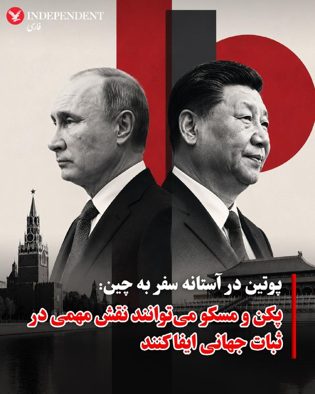

♦️ولادیمیر پوتین، رئیس جمهوری روسیه، در آستانه سفر رسمی به پکن، در پیامی خطاب به مردم چین از دست‌یابی روابط دو کشور به سطحی بی‌سابقه و مبتنی بر اعتماد متقابل خبر داد. پوتین با تمجید از عزم راسخ شی جین‌پینگ برای همکاری‌های بلندمدت تاکید کرد که مشارکت راهبردی مسکو و پکن در تقابل با هیچ کشوری نیست، بلکه نقشی ثبات‌آفرین در عرصه جهانی ایفا می‌کند. رئیس جمهوری روسیه با اشاره به جهش اقتصادی دوجانبه افزود که حجم مبادلات تجاری از مرز ۲۰۰ میلیارد دلار عبور کرده و تصفیه‌حساب‌ها اکنون تقریبا به طور کامل با روبل و یوآن انجام می‌شود. او همچنین بر هماهنگی دو کشور در سازمان ملل، بریکس و سازمان همکاری شانگهای برای دفاع از قوانین بین‌المللی تاکید کرد و پیام خود را با عبارت «به امید دیدار به زودی در پکن» به پایان رساند.
‌🇸🇦 Indypersian

🤖 @VahidOOnLine

## VahidOOnLine — post 240899

  

روزنامه گاردین در گزارشی با طرح این پرسش که آیا جمهوری اسلامی می‌تواند برای کابل‌های زیردریایی در تنگه هرمز عوارض دریافت کند، نوشت تحقق این موضوع بسیار بعید است. یک مقام پیشین آمریکایی گفت این کابل‌ها از ساحل بسیار دور هستند و ایران فناوری لازم برای قطع کردن آنها را ندارد.
این گزارش به نقل از یک مقام سابق وزارت خارجه آمریکا که متخصص اینترنت جهانی است، همچنین نوشت: ‌«دریافت هزینه از شرکت‌های خاص غیرممکن خواهد بود، زیرا هیچ راهی برای تفکیک ترافیک اینترنت آنها وجود ندارد.»
این مقام آمریکایی همچنین گفت: «بسیار بعید است که ایران بتواند کابل‌های زیر تنگه هرمز را بدون جلب توجه قطع کند؛ این کشور فناوری لازم را ندارد و باید این کار را آشکارا و تحت نظارت مداوم گشت‌های هوایی ایالات متحده انجام دهد.»
طبق این گزارش، دست‌کم هفت کابل در زیر آب‌های این تنگه قرار دارند که بسیاری از آنها برای توسعه هوش مصنوعی در کشورهای خلیج فارس حیاتی هستند.

‌🏁 🇬🇧 IranintlTV

🤖 @VahidOOnLine

## VahidOOnLine — post 240898

♦️جی‌دی ونس، معاون رئیس جمهوری ایالات متحده، با بازگو کردن خاطره ای طنزآمیز گفت که دونالد ترامپ در یک کنفرانس خبری زنده و در حضور نخست وزیر ایرلند، جوراب‌های او را مایه شوخی قرار داده است. ونس با تاکید بر اینکه ترامپ به پوشش رسمی و سنتی اهمیت زیادی می‌دهد، گفت: «من سال گذشته این درس را از راه سخت یاد گرفتم. طبق سنت، معاون رئیس جمهوری در روز سنت پاتریک به نخست وزیر ایرلند خوش‌آمد می‌گوید. من تصمیم گرفتم برای این مناسبت جوراب‌هایی با طرح شبدر بپوشم. در جریان کنفرانس خبری زنده، در حضور همه و مقابل احتمالا ۱۰۰ دوربین تلویزیونی نشستیم؛ رئیس جمهوری صحبت‌هایش را شروع کرد، ناگهان نگاهی به من انداخت و گفت: «داستان این جوراب‌ها چیست؟» معاون ترامپ در پایان افزود از آن زمان از راه سخت یاد گرفته است در حضور رئیس جمهوری کاملا محافظه کارانه لباس بپوشد.
رسم دیرینه استقبال از نخست وزیر ایرلند در کاخ سفید، هر ساله در اواسط ماه مارس به مناسبت روز سنت پاتریک برگزار می‌شود؛ در فرهنگ ایرلند، شبدر سه پر نماد ملی و مذهبی مقدسی است که سنت پاتریک از آن برای تبیین مفهوم تثلیث استفاده می‌کرد.
‌🇸🇦 Indypersian

🤖 @VahidOOnLine

## VahidOOnLine — post 240897

  

اسماعیل کوثری، عضو کمیسیون امنیت ملی مجلس، به خبرنگاران گفت: «قطعا و یقینا از طریق مذاکره به نتیجه نمی‌رسیم.» او با تاکید بر اینکه «ترامپ جنگ را باخته» است، افزود که رییس‌جمهوری آمیکا «می‌خواهد یک جوری خودش را برنده نشان بدهد و این هم شدنی نیست.»
‌🏁 🇬🇧 IranintlTV

🤖 @VahidOOnLine

## VahidOOnLine — post 240896

  

روزنامه نیویورک تایمز به نقل از یک مقام نظامی آمریکایی نوشت فرماندهان نیروهای نظامی جمهوری اسلامی الگوهای پرواز جت‌های جنگنده و بمب‌افکن‌های آمریکایی را بررسی کرده‌اند.
او گفت که ارزیابی‌های اطلاعاتی به کمک احتمالی روسیه در جنبه‌هایی از برنامه‌ریزی نظامی ایران اشاره دارد.

‌🏁 🇬🇧 IranintlTV

🤖 @VahidOOnLine

## VahidOOnLine — post 240895

  

پس از آنکه ترامپ اعلام کرد حمله برنامه‌ریزی‌شده به جمهوری اسلامی را متوقف کرده است، قیمت نفت در معاملات اولیه روز سه‌شنبه در بازار آسیا حدود ۲ درصد کاهش یافت و قیمت نفت برنت با کاهش ۳ دلار و یک سنت، معادل ۲.۷ درصد، به ۱۰۹ دلار و ۹ سنت در هر بشکه رسید.
نفت وست تگزاس اینترمدیت نیز با افت یک دلار و ۷۲ سنت، معادل ۱.۷ درصد، به ۱۰۷ دلار و ۴۰ سنت کاهش یافت.
رویترز به نقل از تحلیلگران نوشت بازارها در حال بررسی این موضوع هستند که آیا این اقدام نشانه‌ای از کاهش تنش است یا تنها یک وقفه موقت در تنش‌ها.

‌🏁 🇬🇧 IranintlTV

🤖 @VahidOOnLine

## VahidOOnLine — post 240894

♦️اسماعیل کوثری، نماینده مجلس شورای اسلامی و از فرماندهان پیشین سپاه پاسداران، در گفتگو با خبرنگاران تاکید کرد: «قطعا و یقینا از طریق مذاکره به نتیجه نمی رسیم.» کوثری با اشاره به وضعیت رئیس جمهوری آمریکا مدعی شد که ترامپ جنگ را باخته است و «می‌خواهد یک جوری خودش را برنده نشان بدهد و این هم شدنی نیست.»
‌🇸🇦 Indypersian

🤖 @VahidOOnLine

## pm_afshaa — post 91014

🔴ترامپ: ما با محاصره دریایی، دیوار فولادی دور ایران ساخته‌ایم

💧 Rainbet.com the #1 Non-KYC Crypto Casino & Sportsbook @rainbetcom

😁 @Pm_Afshaa

## pm_afshaa — post 91013

🔴طبق گزارش رسانه های آمریکایی،
نیروی هوایی آمریکا در حال حاضر در حالت آماده‌باش کامل از اروپا تا خاورمیانه است،زیرا گزارش‌هایی منتشر شده که ارتش اسرائیل در حال آماده‌سازی برای
جنگ یکجانبه علیه ایران است

💧 Rainbet.com the #1 Non-KYC Crypto Casino & Sportsbook @rainbetcom

😁 @Pm_Afshaa

## pm_afshaa — post 91012

  <a href="telegram/content/pm_afshaa_91012_1779169748.webm" target="_blank">🎬 Download video</a>

🔴معاون سخنگوی کاخ سفید:
ترامپ خط قرمز ما رو تو این مذاکرات واضح بیان کرد؛ ایران باید یک بار برای همیشه از جاه‌طلبی‌های هسته‌ایش دست بکشه.

💧 Rainbet.com the #1 Non-KYC Crypto Casino & Sportsbook @rainbetcom

😁 @Pm_Afshaa

## mamlekate — post 103556

  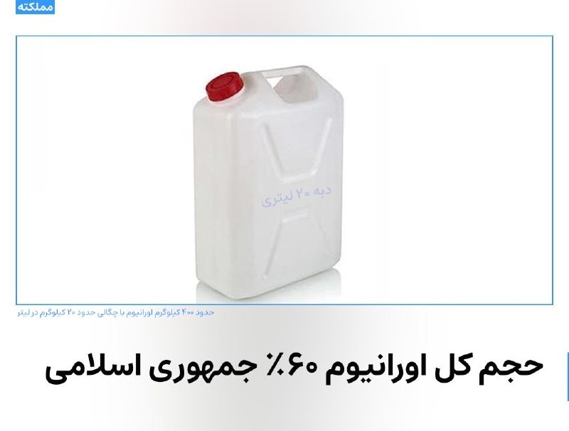

📝 کاخ سفید: تحویل اورانیوم غنی‌شده خط قرمز ترامپ است

📝 ترامپ به درخواست عربستان سعودی، امارات متحده عربی و قطر حمله برنامه‌ریزی شده در روز سه‌شنبه را تعلیق کرد

دونالد ترامپ، رئیس‌جمهوری آمریکا روز دوشنبه گفت قصد داشته است «سه‌شنبه» به ایران حمله کند، اما برای دادن فرصت دوباره به مذاکرات، اجرای آن را متوقف کرده است. او گفت این تصمیم را به درخواست چندین رهبر عربی گرفته است.

📝 ترامپ: خوشحال می‌شوم بدون بمباران وحشتناک ایران به نتیجه برسیم

دونالد ترامپ، رییس‌‌جمهوری آمریکا، دوشنبه ۲۸ اردیبهشت اعلام کرد که حمله برنامه‌ریزی‌شده سه‌شنبه به جمهوری اسلامی را متوقف کرده تا فرصتی برای انجام مذاکرات برای پایان دادن به جنگ فراهم شود؛ اقدامی که پس از ارسال یک پیشنهاد جدید صلح از سوی تهران به واشینگتن صورت گرفته است.

@mamlekate

## IranIntlTV — post 337878

  <a href="https://t.me/IranintlTV/337878" target="_blank">📎 Download file</a>

🎧نسخه صوتی اخبار بامدادی | سه‌شنبه ۲۹ اردیبهشت
@iranintlTV

## IranIntlTV — post 337877

  <a href="telegram/content/IranIntlTV_337877_1779169749.mp4" target="_blank">🎬 Download video</a>

لیندزی گراهام، سناتور جمهوری‌خواه، تاکید کرد: «خط پایانی برای مذاکرات با جمهوری اسلامی و رسیدن به توافق وجود ندارد، زیرا حکومت ایران هر روز این خط پایان را تغییر می‌دهد.»

جزییات بیشتر با مرضیه حسینی، خبرنگار ایران‌اینترنشنال
@iranintltv

## IranIntlTV — post 337876

  <a href="telegram/content/IranIntlTV_337876_1779169750.mp4" target="_blank">🎬 Download video</a>

آکسیوس به نقل از یک مقام ارشد آمریکایی گزارش داد پیشنهاد تازه جمهوری اسلامی در مقایسه با نسخه‌های قبلی تنها شامل تغییرات جزئی است و در آن، تعهد مشخصی درباره توقف غنی‌سازی اورانیوم یا واگذاری ذخایر اورانیوم با غنای بالا دیده نمی‌شود.

گزارش مریم رحمتی، خبرنگار ایران‌اینترنشنال
@iranintltv

## IranIntlTV — post 337875

  <a href="telegram/content/IranIntlTV_337875_1779169752.mp4" target="_blank">🎬 Download video</a>

سازمان عفو بین‌الملل اعلام کرد شمار اعدام‌ها در جهان در سال ۲۰۲۵ به بالاترین سطح ثبت‌شده در ۴۴ سال گذشته رسیده و اعدام‌های انجام شده به‌دست جمهوری اسلامی، اصلی‌ترین عامل این افزایش بوده است.

گفت‌وگو با محمد اولیایی‌فرد، وکیل دادگستری و عضو اتحادیه بین‌المللی وکلا
@iranintltv

## IranIntlTV — post 337874

  <a href="telegram/content/IranIntlTV_337874_1779169753.mp4" target="_blank">🎬 Download video</a>

رییس پلیس سن‌‌دیگو اعلام کرد شمار کشته‌شدگان در یک تیراندازی در بزرگ‌ترین مسجد این شهر در ایالت کالیفرنیا، به ۵ نفر رسیده است.

گزارش نیلوفر منصوری، خبرنگار ایران‌اینترنشنال
@iranintltv

## IranIntlTV — post 337873

  

نیویورک‌تایمز به نقل از یک مقام نظامی آمریکا گزارش داد جمهوری اسلامی از آتش‌بس یک‌ماهه برای باز کردن ده‌ها محل استقرار موشک‌های بالستیکِ هدف‌قرارگرفته، جابه‌جایی پرتابگرهای متحرک موشکی و تطبیق دادن تاکتیک‌های خود برای هرگونه ازسرگیری حملات استفاده کرده است.
به گفته این مقام نظامی آمریکا، بسیاری از موشک‌های بالستیک جمهوری اسلامی در کوه‌ها و تأسیسات زیرزمینی عمیق در دل کوه‌های گرانیتی مستقر بودند.
به نوشته این گزارش، آمریکا در حملات خود عمدتاً ورودی این سایت‌ها را هدف قرار داد و با فروریختن دهانه‌ها، آنها را مدفون کرد، اما نتوانست خود تأسیسات را از بین ببرد، اما اکنون ایران بخش قابل توجهی از این سایت‌ها را دوباره باز کرده است.
یک مقام نظامی آمریکا گفت: «مقام‌های ایران بسیاری از تسلیحات باقی‌مانده خود را جابه‌جا کرده‌اند و این باور را در خود تقویت کرده‌اند که جمهوری اسلامی می‌تواند با موفقیت در برابر ایالات متحده مقاومت کند؛ چه با بستن موثر تنگه هرمز، چه با حمله به زیرساخت‌های انرژی در کشورهای همسایه خلیج فارس و چه با تهدید هواپیماهای آمریکایی.»

https://iranintl.com/202605194899

## IranIntlTV — post 337872

  <a href="telegram/content/IranIntlTV_337872_1779169755.mp4" target="_blank">🎬 Download video</a>

جاویدنامان انقلاب ملی ایرانیان
«منصوره حیدری و همسرش بهروز منصوری»، در ۱۸ دی‌ماه در جریان اعتراضات در خیابان عاشوری شهر بوشهر، با شلیک گلوله‌های جنگی نیروهای سرکوب جمهوری اسلامی کشته شدند. نامشان در حافظه‌ی این سرزمین می‌ماند و یادشان چراغ راه آزادی‌خواهان است.

@iranintltv

## IranIntlTV — post 337871

  <a href="telegram/content/IranIntlTV_337871_1779169757.mp4" target="_blank">🎬 Download video</a>

سرخط خبرهای سه‌شنبه ۲۹ اردیبهشت
@iranintltv

## IranIntlTV — post 337870

  

سازمان «کمک به گروگان‌ها در سراسر جهان» خبر داد که شهاب دلیلی، زندانی سیاسی که از سال ۱۳۹۵ در ایران زندانی بود، پس از آزادی از زندان اوین به ایروان و سپس به واشینگتن رفته و «در سلامت کامل به خانه و کنار خانواده‌اش بازگشته است.»
این سازمان اشاره کرد که دلیلی پس از بیش از یک دهه بازداشت غیرقانونی در ایران آزاد شده است و از همه خواست که «به شهاب کمک کنند تا به راحتی به زندگی عادی بازگردد.»
شهاب دلیلی، کاپیتان پیشین شرکت کشتی‌رانی ایران و ساکن آمریکا، سال ۱۳۹۵ برای خاک‌سپاری پدرش به تهران رفت، اما هنگام بازگشت و پیش از رسیدن به فرودگاه به دست نیروهای امنیتی بازداشت و زندانی شد.
خانواده دلیلی گفته بودند جمهوری اسلامی او را به اتهام «جاسوسی» و «همکاری با دولت متخاصم» یعنی آمریکا، به ۱۰ سال حبس محکوم کرده است.

https://iranintl.com/202605195182

## IranIntlTV — post 337869

  

شبکه حقوق بشر کردستان در گزارشی نوشت زینب جلالیان، قدیمی‌ترین و تنها زن زندانی سیاسی محکوم به حبس ابد در ایران، در بیستمین سال حبس خود از درمان بیماری محروم مانده است.
این سازمان حقوق بشری اشاره کرد که جلالیان از «فیبروم رحمی» رنج می‌برد و با وجود توصیه پزشکان برای اعزام به مراکز درمانی و پیگیری نتایج عمل آمبولیزاسیون، همچنان به بهانه توقف اعزام زندانیان به مراکز درمانی خارج از زندان در پی جنگ، در شرایط سخت جسمی نگهداری می‌شود.
یک منبع مطلع به شبکه حقوق بشر کردستان گفت: «این زندانی سیاسی در اوایل مهر سال گذشته، پس از درخواست‌ مکرر‌ نهادهای حقوق بشری و افزایش فشارهای بین‌المللی، در حالی که ماه‌ها از فیبروم رحمی رنج می‌برد، در یکی از مراکز درمانی خارج از زندان یزد تحت عمل آمبولیزاسیون فیبروم قرار گرفت. با این حال، تنها ۲۴ ساعت پس از عمل و پیش از تکمیل دوره درمان، به زندان بازگردانده شد.»
به گفته این منبع آگاه، در ماه‌های گذشته با وجود انجام عمل جراحی، خونریزی و دردهای شکمی زینب جلالیان به‌طور نگران‌کننده‌ای ادامه داشته و این زندانی سیاسی هم‌زمان دچار کم‌خونی شدید نیز شده است.

https://iranintl.com/202605192761

## IranIntlTV — post 337868

  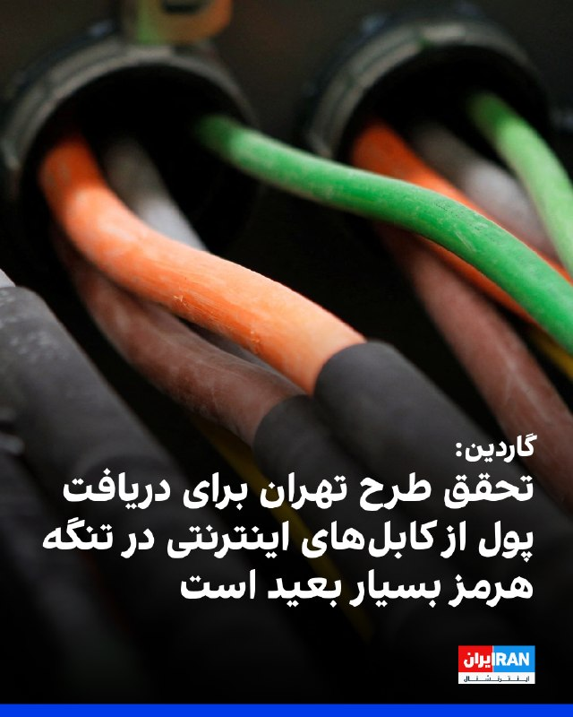

روزنامه گاردین در گزارشی با طرح این پرسش که آیا جمهوری اسلامی می‌تواند برای کابل‌های زیردریایی در تنگه هرمز عوارض دریافت کند، نوشت تحقق این موضوع بسیار بعید است. یک مقام پیشین آمریکایی گفت این کابل‌ها از ساحل بسیار دور هستند و ایران فناوری لازم برای قطع کردن آنها را ندارد.
این گزارش به نقل از یک مقام سابق وزارت خارجه آمریکا که متخصص اینترنت جهانی است، همچنین نوشت: ‌«دریافت هزینه از شرکت‌های خاص غیرممکن خواهد بود، زیرا هیچ راهی برای تفکیک ترافیک اینترنت آنها وجود ندارد.»
این مقام آمریکایی همچنین گفت: «بسیار بعید است که ایران بتواند کابل‌های زیر تنگه هرمز را بدون جلب توجه قطع کند؛ این کشور فناوری لازم را ندارد و باید این کار را آشکارا و تحت نظارت مداوم گشت‌های هوایی ایالات متحده انجام دهد.»
طبق این گزارش، دست‌کم هفت کابل در زیر آب‌های این تنگه قرار دارند که بسیاری از آنها برای توسعه هوش مصنوعی در کشورهای خلیج فارس حیاتی هستند.

https://iranintl.com/202605198606

## IranIntlTV — post 337867

  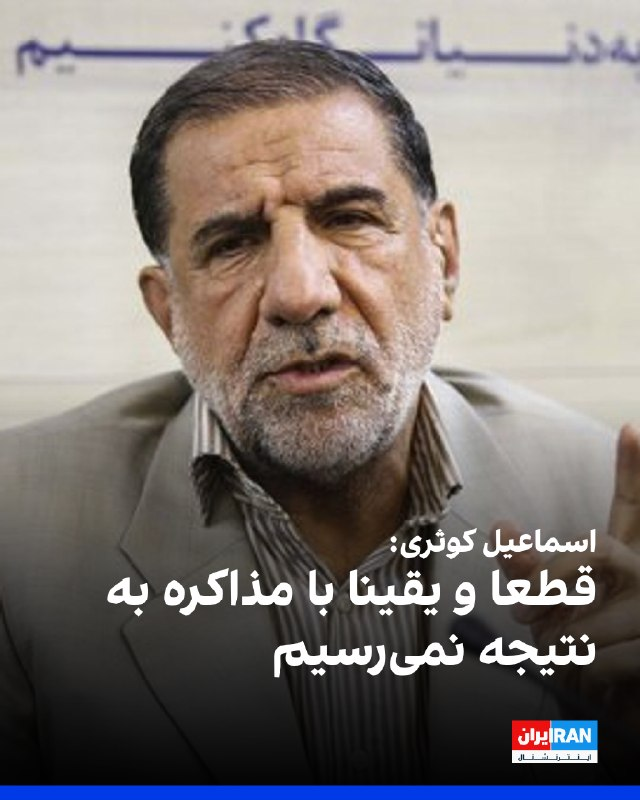

اسماعیل کوثری، عضو کمیسیون امنیت ملی مجلس، به خبرنگاران گفت: «قطعا و یقینا از طریق مذاکره به نتیجه نمی‌رسیم.» او با تاکید بر اینکه «ترامپ جنگ را باخته» است، افزود که رییس‌جمهوری آمیکا «می‌خواهد یک جوری خودش را برنده نشان بدهد و این هم شدنی نیست.»
https://iranintl.com/202605197706

## IranIntlTV — post 337866

  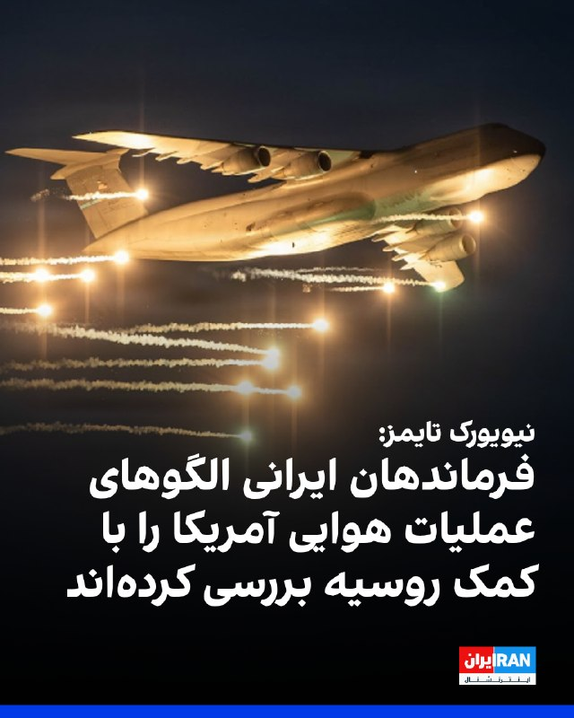

روزنامه نیویورک تایمز به نقل از یک مقام نظامی آمریکایی نوشت فرماندهان نیروهای نظامی جمهوری اسلامی الگوهای پرواز جت‌های جنگنده و بمب‌افکن‌های آمریکایی را بررسی کرده‌اند.
او گفت که ارزیابی‌های اطلاعاتی به کمک احتمالی روسیه در جنبه‌هایی از برنامه‌ریزی نظامی ایران اشاره دارد.

https://iranintl.com/202605199920

## IranIntlTV — post 337865

  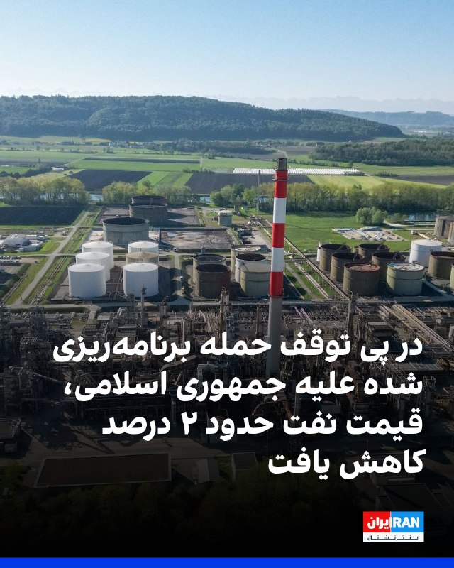

پس از آنکه ترامپ اعلام کرد حمله برنامه‌ریزی‌شده به جمهوری اسلامی را متوقف کرده است، قیمت نفت در معاملات اولیه روز سه‌شنبه در بازار آسیا حدود ۲ درصد کاهش یافت و قیمت نفت برنت با کاهش ۳ دلار و یک سنت، معادل ۲.۷ درصد، به ۱۰۹ دلار و ۹ سنت در هر بشکه رسید.
نفت وست تگزاس اینترمدیت نیز با افت یک دلار و ۷۲ سنت، معادل ۱.۷ درصد، به ۱۰۷ دلار و ۴۰ سنت کاهش یافت.
رویترز به نقل از تحلیلگران نوشت بازارها در حال بررسی این موضوع هستند که آیا این اقدام نشانه‌ای از کاهش تنش است یا تنها یک وقفه موقت در تنش‌ها.

https://iranintl.com/202605198020

## ManotoTV — post 105623

  <a href="telegram/content/ManotoTV_105623_1779169761.mp4" target="_blank">🎬 Download video</a>

آنا کلی، سخنگوی کاخ سفید، گفت موضع دونالد ترامپ درباره جمهوری اسلامی تغییری نکرده و رئیس‌جمهوری آمریکا همچنان برای جلوگیری از دستیابی تهران به سلاح هسته‌ای «بسیار جدی» است.

او گفت جمهوری اسلامی ۴۷ سال شعار «مرگ بر آمریکا» سر داده و نیروهای آمریکایی در خارج از کشور را تهدید کرده، هرگز نباید به سلاح هسته‌ای دست پیدا کند.

کلی افزود پیام ترامپ در شبکه تروث سوشال نشان می‌دهد او تا چه اندازه در این موضوع جدی است. به گفته او، جمهوری اسلامی اکنون با مشکلات متعددی روبه‌رو است، زیرا «ترامپ همه برگ‌ها را در دست دارد».

## ManotoTV — post 105622

  <a href="telegram/content/ManotoTV_105622_1779169762.mp4" target="_blank">🎬 Download video</a>

دونالد ترامپ شب گذشته گفت چند کشور به او گفته‌اند که برای «حمله‌ای بسیار بزرگ» آماده می‌شدند، اما او این حمله را برای مدتی کوتاه، و شاید برای همیشه، به تعویق انداخته است.

ترامپ گفت عربستان سعودی، قطر، امارات متحده عربی و چند کشور دیگر از او خواستند این اقدام را دو یا سه روز عقب بیندازد، زیرا به گفته او، این کشورها معتقدند مذاکرات با جمهوری اسلامی به دستیابی به توافق نزدیک شده است.

ترامپ گفت اسرائیل و دیگر طرف‌های درگیر در خاورمیانه از این تصمیم مطلع شده‌اند. او این تحول را «بسیار مثبت» خواند، اما تاکید کرد هنوز روشن نیست به نتیجه برسد یا نه.

## ManotoTV — post 105621

  <a href="telegram/content/ManotoTV_105621_1779169763.mp4" target="_blank">🎬 Download video</a>

پلیس سن‌دیگو اعلام کرد دو نوجوان مسلح روز دوشنبه ۲۸ اردیبهشت به سوی مرکز اسلامی سن‌دیگو تیراندازی کردند و سه مرد را کشتند. به گفته پلیس، این دو مهاجم که ۱۷ و ۱۸ ساله بودند، پس از حمله چند خیابان دورتر اقدام به خودکشی کردند. این حمله به عنوان «جرم نفرت‌محور» در دست بررسی است.

پلیس پیش از تیراندازی در جست‌وجوی یکی از این دو نوجوان بود، زیرا مادر او با پلیس تماس گرفته و گفته بود پسرش با نشانه‌های ضربه به خود از خانه خارج شده است. به گفته پلیس، هم‌زمان چند سلاح و خودروی مادر این نوجوان نیز از خانه ناپدید شده بود.

## ManotoTV — post 105620

  <a href="telegram/content/ManotoTV_105620_1779169764.mp4" target="_blank">🎬 Download video</a>

«رشید مظاهری صدای مردم ایران شده بود»

## ManotoTV — post 105619

  <a href="telegram/content/ManotoTV_105619_1779169765.mp4" target="_blank">🎬 Download video</a>

دونالد ترامپ، رئیس‌جمهوری آمریکا، در پاسخ به سوال خبرنگاران گفت چند کشور منطقه، از جمله قطر، عربستان سعودی و امارات متحده عربی، در حال گفت‌وگو با آمریکا و جمهوری اسلامی هستند و احتمال رسیدن به توافق وجود دارد.

ترامپ گفت: «این سه کشور، به‌علاوه چند کشور دیگر، با من تماس گرفتند و آن‌ها مستقیماً با مقام‌های ما و در حال حاضر با ایران در تماس هستند.»

او افزود: «به نظر می‌رسد احتمال بسیار خوبی وجود دارد که بتوانند به یک توافق برسند.»

رئیس‌جمهوری آمریکا همچنین گفت ترجیح می‌دهد بحران بدون اقدام نظامی حل شود و افزود: «اگر بتوانیم بدون اینکه آن‌ها را به‌شدت بمباران کنیم به نتیجه برسیم، بسیار خوشحال خواهم شد.

## FarsiVOA — post 218111

  

وزارت خزانه‌داری آمریکا اعلام کرد شرکت آدانی اینترپرایزس، مستقر در احمدآباد هند، با پرداخت ۲۷۵ میلیون دلار برای حل‌وفصل مسئولیت احتمالی مدنی خود در ارتباط با نقض تحریم‌های ایران موافقت کرده است.

دفتر کنترل دارایی‌های خارجی وزارت خزانه‌داری آمریکا، اوفک، اعلام کرد این توافق مربوط به ۳۲ مورد نقض احتمالی تحریم‌های ایران است. به گفته اوفک، آدانی اینترپرایزس از نوامبر ۲۰۲۳ تا ژوئن ۲۰۲۵ محموله‌های گاز مایع، ال‌پی‌جی، را از یک تاجر مستقر در دبی خریداری کرده بود که مدعی بود این محموله‌ها از عمان و عراق تأمین شده‌اند، اما نشانه‌هایی وجود داشت که منشأ واقعی آنها ایران بوده است.

بر اساس اعلام وزارت خزانه‌داری آمریکا، این شرکت در این دوره باعث شد مؤسسات مالی آمریکایی ۳۲ پرداخت دلاری به ارزش حدود ۱۹۲ میلیون دلار را برای این محموله‌ها پردازش کنند.

رویترز نیز گزارش داد این پرونده در ادامه بررسی‌های آمریکا درباره خرید گاز مایع با منشأ ایرانی از طریق مسیرهای واسطه‌ای مطرح شده بود. آدانی پیش‌تر هرگونه دور زدن عمدی تحریم‌ها را رد کرده بود.
@FarsiVOA

## FarsiVOA — post 218110

  

ارتش اسرائیل اعلام کرد که صبح سه‌شنبه یک موشک رهگیر به‌سوی یک پهپاد متعلق به حزب‌الله، بر فراز منطقه‌ای در جنوب لبنان شلیک کرده است.

بر اساس گزارش ارتش اسرائیل، این پهپاد در مدت کوتاهی بر فراز محل استقرار نیروهای نظامی اسرائیل شناسایی شد.

در این حادثه هیچ گزارشی از زخمی شدن افراد منتشر نشده است.
@FarsiVOA

## FarsiVOA — post 218109

🔺لیندزی گراهام: هر توافقی با جمهوری اسلامی باید به تائید کنگره برسد؛ تاکید سناتور آمریکایی بر پایان غنی‌سازی و قطع حمایت از نیابتی‌ها

▪️سناتور جمهوری‌خواه، لیندزی گراهام، روز دوشنبه و پس از آنکه دونالد ترامپ، رئیس جمهوری آمریکا گفت به درخواست رهبران چند کشور عربی حمله برنامه‌ریزی شده روز ‌سه‌شنبه به جمهوری اسلامی را به تعویق انداخته‌است، بار دیگر تاکید کرد که هر توافقی که میان ایالات متحده و جمهوری اسلامی ایران امضا شود «باید، همانند برجام در دوران ریاست‌جمهوری باراک اوباما، برای تأیید به کنگره ارائه شود.»

⬇️ بیشتر بخوانید:
https://ir.voanews.com/a/8151586.html
@FarsiVOA

## DW_Farsi — post 124857

  

🔶 تعویق حمله به ایران؛ تشکیل جلسه ترامپ با تیم ارشد در روز سه‌شنبه
 
سایت خبری اکسیوس شامگاه دوشنبه ۱۸ مه (۲۸ اردیبهشت) در گزارشی به اعلام به تعویق افتادن حمله ایالات متحده به ایران از سوی دونالد ترامپ پرداخت و به نقل از دو مقام آگاه آمریکایی نوشت، انتظار می‌رود که رئیس‌جمهور آمریکا روز سه‌شنبه ۱۹ مه با تیم ارشد امنیت ملی خود در اتاق وضعیت تشکیل جلسه دهد تا گزینه‌های نظامی [علیه جمهوری اسلامی] را مورد بحث و بررسی قرار دهد.
 
به نوشته اکسیوس ترامپ از زمان آغاز جنگ در ماه فوریه تا کنون "دست کم شش بار ضرب‌الاجل‌های اعلام‌شده را تمدید کرده و حمله‌های برنامه‌ریزی شده علیه جمهوری اسلامی را به تعویق انداخته است".
 
ترامپ عصر دوشنبه با انتشار پستی در شبکه اجتماعی خود، تروث سوشال اعلام کرد، ایالات متحده حمله نظامی "برنامه‌ریزی‌شده" علیه ایران را که قرار بود روز سه‌شنبه انجام شود، "اجرا نخواهد کرد".
 
@dw_farsi

## Persian_Trend_Official — post 14465

🔴هشدار آژانس انرژی درباره ذخایر نفت

💢فاتح بیرول، رئیس آژانس بین‌المللی انرژی، اعلام کرد آزادسازی ذخایر راهبردی نفت روزانه حدود ۲.۵ میلیون بشکه به بازار اضافه کرده است، اما این ذخایر نامحدود نیستند.

▪️او همچنین گفت میان وضعیت بازار فیزیکی نفت و معاملات آتی شکاف ادراکی وجود دارد؛ به این معنا که قیمت‌گذاری در بازارهای مالی الزاماً فشار واقعی موجود در عرضه فیزیکی را به‌طور کامل منعکس نمی‌کند.

💢بیرول در ادامه هشدار داد که ذخایر تجاری نفت با سرعت زیادی در حال کاهش است و تنها چند هفته تا افت بیشتر این ذخایر باقی مانده است.

🫆:Tony

📌 @persian_trend_official
پرشین ترند | متفاوت‌ترین کانال نظامی

## Persian_Trend_Official — post 14464

🔴 سنای آمریکا فردا برای هشتمین بار درباره پایان جنگ ایران رأی‌گیری می‌کند

💢بر اساس گزارش‌ها، سنای آمریکا قرار است فردا برای هشتمین بار درباره طرح «اختیارات جنگی» با هدف پایان‌دادن به جنگ با ایران رأی‌گیری کند.

▪️ این رأی‌گیری‌ها از زمان آغاز جنگ تقریباً به‌صورت هفتگی در جریان بوده است

💢طرح اختیارات جنگی با هدف محدودکردن ادامه عملیات نظامی بدون مجوز رسمی کنگره مطرح شده، اما تاکنون تمام تلاش‌ها برای تصویب آن ناکام مانده است.

🫆:Tony

📌 @persian_trend_official
پرشین ترند | متفاوت‌ترین کانال نظامی

## Persian_Trend_Official — post 14463

  <a href="telegram/content/Persian_Trend_Official_14463_1779169767.mp4" target="_blank">🎬 Download video</a>

صبحتون‌ بخیر 🔥❤️

📝 Nick
📌 @persian_trend_official
پرشین ترند | متفاوت‌ترین کانال نظامی

## RadioFarda — post 157327

  

🔸حامد تیزرویان، عکاس حیات‌وحش و فعال محیط زیست، در ساری بازداشت شده است.

🔸به گفته زینب رحیمی، روزنامه‌نگار حوزه محیط زیست، آقای تیزرویان روز ۱۴ اردیبهشت ۱۴۰۵، بازداشت شده و موبایل و دیگر وسایل الکترونیکی او ضبط شده است.

🔸اتهام مطرح‌شده علیه آقای تیزرویان «اجتماع و تبانی با هدف اقدام علیه امنیت ملی» عنوان شده است.

🔸بازداشت او در پی انتشار مطالبی انتقادی درباره کشتار معترضان در دی‌ماه و همچنین اعتراض به اعدام‌ها در شبکه‌های اجتماعی صورت گرفته است.

🔸آقای تیزرویان از عکاسان برجسته و سرشناس حیات وحش است و ثبت عکس‌های کمیاب از حیات وحش ایران از جمله خرس قهوه‌ای و مرال به عنوان گونه‌های‌ در معرض خطر انقراض، بخشی از کارنامه کاری این عکاس حیات وحش است.

🔸بازداشت فعالان محیط زیست در ایران سابقه دارد.ایمان معماریان، دامپزشک حیات‌وحش و فعال محیط زیست، اول اردیبهشت در تهران بازداشت شده است. فریبرز حیدری، عکاس حیات‌وحش، دوم بهمن‌ماه سال گذشته در منزل خود بازداشت شد و پس از بیش از دو ماه، در ۱۷ فروردین آزاد شد. همچنین آرش نیکخو، فعال محیط زیست در یاسوج، در بهمن ۱۴۰۴ بازداشت و مدتی بعد آزاد شد.

@RadioFarda

## RadioFarda — post 157325

  

🔸پایگاه خبری حقوق بشری «هرانا» می‌گوید از زمان شروع حملات آمریکا و اسرائیل به ایران، تا هفته گذشته، دست‌کم چهار هزار و ۲۳ بازداشت و ۵۰ مورد اعدام را در ایران ثبت کرده است.

🔸بر اساس اعلام این گروه حقوق بشری مستقر در آمریکا، این افراد با اتهاماتی چون «جاسوسی»، «تهدید علیه امنیت ملی» و ارتباط یا ارسال مطالب مربوط به جنگ به رسانه‌های خارجی بازداشت یا اعدام شده‌اند.

🔸بنابر این گزارش که «میان موشک و سرکوب» نام دارد، مقام‌های ایران از جنگ «برای تشدید روایت‌های امنیتی و توجیه بازداشت‌ها، محدودیت آزادی بیان و اعمال خشونت علیه غیرنظامیان استفاده کرده‌اند.»

🔸هرانا افزوده که «شرایط در مراکز بازداشت به‌شدت وخیم‌تر شده، در حالی که مقام‌ها ایست‌های بازرسی را گسترش داده، محدودیت‌های رفت‌وآمد را تشدید کرده و یک خاموشی طولانی‌مدت اینترنت را اعمال کرده‌اند که سطح اتصال کشور را به حدود یک درصد میزان عادی کاهش داده است.»

🔸هرانا همچنین نوشته که در فاصله ۹ اسفند ۱۴۰۴ تا ۲۳ اردیبهشت ۱۴۰۵، ۵۰ مورد اعدام را مستند کرده است که ۳۲ مورد از آن‌ها با اتهامات سیاسی و امنیتی مرتبط بوده‌اند.

@RadioFarda

## RadioFarda — post 157324

  <a href="https://t.me/radiofarda/157324" target="_blank">📎 Download file</a>

📻بشنوید: سرخط خبرها با رادیوفردا، ۲۹ اردیبهشت ۱۴۰۵‌

@RadioFarda

## IranianMinds — post 20372

قدرت پدافندی خاورمیانه

@IranianMinds

## BBCPersian — post 281447

  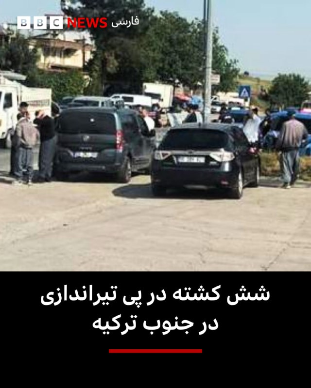

🔺رسانه‌های محلی ترکیه گزارش دادند که یک فرد مسلح در جنوب این کشور تیراندازی کرده و ۶ نفر را کشته است.

بر اساس گزارش روزنامه حریت و شبکه سی‌ان‌ان ترک، ۸ نفر دیگر نیز در منطقه طرسوس در استان مرسین زخمی شده‌اند.

گزارش‌ها حاکی است که تیراندازی روز دوشنبه از یک رستوران آغاز شد و مظنون سپس با خودرو از محل گریخت.

پلیس عملیات گسترده‌ای را با پشتیبانی بالگرد برای بازداشت فرد مسلح مظنون آغاز کرده است.

بنا به گزارش‌ها مظنون ابتدا همسر سابق خود را به ضرب گلوله کشته است و سپس دو نفر را در رستوران کشته است که گفته می‌شود مالک رستوران و یکی از کارکنان آن بوده‌اند.

فرد مهاجم سپس به تیراندازی ادامه داده و یک چوپان را که در نزدیکی محل مشغول چرای گوسفندانش بوده و همچنین یک راننده کامیون را کشته است.

هویت و انگیزه‌های مظنون هنوز مشخص نشده است.

📸Tarsusakdeniz

https://bbc.in/49WLlPP
@BBCPersian

## BBCPersian — post 281437

‌ ‌ ‌
یک مادربزرگ اهل کالیفرنیا از زمان کودکی در انتظار پاسخ بوده است؛ از زمانی که مادرش هنگام آویزان کردن لباس‌ها برای خشک شدن، یک بشقاب پرنده را دید که در هوا معلق بود. یک روان‌درمانگر در تگزاس نیز از دوران کودکی، از کسانی بود که دیدن موجودات فرازمینی را «تجربه‌» کرده است. و یکی دیگر از ساکنان تگزاس که موسیقی‌دانی ۳۶ ساله است، از زمانی که درباره حادثه‌ای در نزدیکی زادگاهش شنید، درباره دنیای موجودات فرازمینی کند و کاو می‌کند.

بسیاری از «جامعه علاقه‌مندان به بشقاب پرنده»، نفسشان را در سینه حبس کرده بودند و منتظر چیزی بودند که دولت آمریکا آن را لحظه‌ای تاریخی توصیف کرده بود: نخستین انتشار پرونده‌هایی که پیش‌تر هرگز دیده نشده بودند درباره پدیده‌های ناشناس غیرعادی؛ مجموعه‌ای شامل ۱۶۲ سند، همراه با تصاویر و جزئیات که علاقه‌مندان امیدوارند گامی به سوی شفافیت بیشتر و یافتن پاسخ درباره آنچه «در آن بیرون» وجود دارد، باشد.

https://bbc.in/43ioOt4
📷 Getty/ COURTESY OF JOHN ERIK EGE/ US DEPARTMENT OF DEFENSE
@BBCPersian

## BBCPersian — post 281436

  <a href="https://t.me/bbcpersian/281436" target="_blank">📎 Download file</a>

🔻پادکست برنامه شصت دقیقه 
دوشنبه ۲۸ اردیبهشت ۱۴۰۵ 

این نسخه رادیویی برنامه شصت دقیقه تلویزیون فارسی بی‌بی‌سی است که هرشب بعد از پخش، با حجم کم از اپلیکیشن‌های پادگیر و صفحه تلگرام بی‌بی‌سی فارسی در دسترس است. 

با هشتگ BBCPersianRadio# با ما در ارتباط باشید.

@BBCPersian

## BBCPersian — post 281426

‌ ‌ ‌ ‌
ساختمان اداری با پنجره‌های شیشه‌ای که بالای یک فروشگاه رامن در قلب محله چینی‌های منهتن قرار داشت، در میان خیابانی شلوغ از رستوران‌های چینی، فروشگاه‌های مواد غذایی و آپارتمان‌ها، ظاهری عادی و بدون ‌جلب ‌توجه داشت.

در سال ۲۰۲۲، لو جیان‌وانگ، رئیس ۶۴ ساله یک گروه اجتماعی چینی، در یکی از طبقات آنجا دفتر گرفت و فضایی ایجاد کرد که به گفته وکلایش قرار بود به مهاجران برای تمدید گواهینامه رانندگی کمک کند و همچنین محلی برای بازی پینگ‌پنگ روی میزی در اتاق کنفرانس باشد.

اما مدت زیادی نگذشت که اف‌بی‌آی، پلیس فدرال آمریکا، به این محل یورش برد و آقای لو را متهم کرد که به دستور دولت چین نخستین ایستگاه پلیس برون‌مرزی شناخته‌شده در آمریکا را ایجاد کرده است.

او تنها چند روز پس از آنکه یک سیاستمدار کالیفرنیا نیز به جرایم مشابه اعتراف کرد، به جرم فعالیت به‌عنوان مامور خارجی ثبت‌نشده برای چین مجرم شناخته شد.

https://bbc.in/4nHTRrW
📸GettyImages/ Reuters
@BBCPersian

## manototv — post 105623

  <a href="telegram/content/manototv_105623_1779169770.mp4" target="_blank">🎬 Download video</a>

آنا کلی، سخنگوی کاخ سفید، گفت موضع دونالد ترامپ درباره جمهوری اسلامی تغییری نکرده و رئیس‌جمهوری آمریکا همچنان برای جلوگیری از دستیابی تهران به سلاح هسته‌ای «بسیار جدی» است.

او گفت جمهوری اسلامی ۴۷ سال شعار «مرگ بر آمریکا» سر داده و نیروهای آمریکایی در خارج از کشور را تهدید کرده، هرگز نباید به سلاح هسته‌ای دست پیدا کند.

کلی افزود پیام ترامپ در شبکه تروث سوشال نشان می‌دهد او تا چه اندازه در این موضوع جدی است. به گفته او، جمهوری اسلامی اکنون با مشکلات متعددی روبه‌رو است، زیرا «ترامپ همه برگ‌ها را در دست دارد».

## manototv — post 105622

  <a href="telegram/content/manototv_105622_1779169771.mp4" target="_blank">🎬 Download video</a>

دونالد ترامپ شب گذشته گفت چند کشور به او گفته‌اند که برای «حمله‌ای بسیار بزرگ» آماده می‌شدند، اما او این حمله را برای مدتی کوتاه، و شاید برای همیشه، به تعویق انداخته است.

ترامپ گفت عربستان سعودی، قطر، امارات متحده عربی و چند کشور دیگر از او خواستند این اقدام را دو یا سه روز عقب بیندازد، زیرا به گفته او، این کشورها معتقدند مذاکرات با جمهوری اسلامی به دستیابی به توافق نزدیک شده است.

ترامپ گفت اسرائیل و دیگر طرف‌های درگیر در خاورمیانه از این تصمیم مطلع شده‌اند. او این تحول را «بسیار مثبت» خواند، اما تاکید کرد هنوز روشن نیست به نتیجه برسد یا نه.

## manototv — post 105621

  <a href="telegram/content/manototv_105621_1779169772.mp4" target="_blank">🎬 Download video</a>

پلیس سن‌دیگو اعلام کرد دو نوجوان مسلح روز دوشنبه ۲۸ اردیبهشت به سوی مرکز اسلامی سن‌دیگو تیراندازی کردند و سه مرد را کشتند. به گفته پلیس، این دو مهاجم که ۱۷ و ۱۸ ساله بودند، پس از حمله چند خیابان دورتر اقدام به خودکشی کردند. این حمله به عنوان «جرم نفرت‌محور» در دست بررسی است.

پلیس پیش از تیراندازی در جست‌وجوی یکی از این دو نوجوان بود، زیرا مادر او با پلیس تماس گرفته و گفته بود پسرش با نشانه‌های ضربه به خود از خانه خارج شده است. به گفته پلیس، هم‌زمان چند سلاح و خودروی مادر این نوجوان نیز از خانه ناپدید شده بود.

## manototv — post 105620

  <a href="telegram/content/manototv_105620_1779169773.mp4" target="_blank">🎬 Download video</a>

«رشید مظاهری صدای مردم ایران شده بود»

## manototv — post 105619

  <a href="telegram/content/manototv_105619_1779169774.mp4" target="_blank">🎬 Download video</a>

دونالد ترامپ، رئیس‌جمهوری آمریکا، در پاسخ به سوال خبرنگاران گفت چند کشور منطقه، از جمله قطر، عربستان سعودی و امارات متحده عربی، در حال گفت‌وگو با آمریکا و جمهوری اسلامی هستند و احتمال رسیدن به توافق وجود دارد.

ترامپ گفت: «این سه کشور، به‌علاوه چند کشور دیگر، با من تماس گرفتند و آن‌ها مستقیماً با مقام‌های ما و در حال حاضر با ایران در تماس هستند.»

او افزود: «به نظر می‌رسد احتمال بسیار خوبی وجود دارد که بتوانند به یک توافق برسند.»

رئیس‌جمهوری آمریکا همچنین گفت ترجیح می‌دهد بحران بدون اقدام نظامی حل شود و افزود: «اگر بتوانیم بدون اینکه آن‌ها را به‌شدت بمباران کنیم به نتیجه برسیم، بسیار خوشحال خواهم شد.

## alonews — post 121002

  <a href="telegram/content/alonews_121002_1779169775.mp4" target="_blank">🎬 Download video</a>

👈مشاور ترامپ در امور تجارت و تولید، پیتر ناوارو: نیروی نظامی آمریکا در حال حاضر کنترل تنگه هرمز را در دست دارد، که به این معنی است که کنترل عرضه نفت نه تنها برای چین بلکه برای کل شرق دور را در اختیار دارد.

✅ @AloNews خبر جنگ

## alonews — post 121001

  <a href="telegram/content/alonews_121001_1779169776.webm" target="_blank">🎬 Download video</a>

👈فاکس نیوز به نقل از معاون سخنگوی کاخ سفید گفت که رئیس‌جمهور خط قرمز ما رو تو این مذاکرات واضح بیان کرد:

🔴ایران باید یه بار برای همیشه از جاه‌طلبی‌های هسته‌ایش دست بکشه

✅ @AloNews خبر جنگ

## alonews — post 120998

  <a href="telegram/content/alonews_120998_1779169776.mp4" target="_blank">🎬 Download video</a>

👈 جنگنده های ارتش اسرائیل (IDF) به ساختمان تخلیه شده در مشوق در منطقه صور در جنوب لبنان حمله کردند.

✅ @AloNews خبر جنگ

## alonews — post 120997

  <a href="telegram/content/alonews_120997_1779169777.webm" target="_blank">🎬 Download video</a>

👈اکسیوس به نقل از یک مقامات آمریکایی:
پیامی واحد از دوحه، ابوظبی و ریاض به ترامپ ارسال شده بود. مضمون آن چیزی شبیه این بود: به مذاکرات فرصت بده، چون اگر به ایران حمله کنی، همه ما بهای آن را خواهیم پرداخت

✅ @AloNews خبر جنگ

## alonews — post 120996

  <a href="telegram/content/alonews_120996_1779169778.webm" target="_blank">🎬 Download video</a>

👈سخنگوی کمیسیون امنیت ملی مجلس: هرگونه تجاوز جدید علیه ایران با پاسخ قوی‌تر مواجه خواهد شد و ترامپ را شرمسارتر خواهد کرد

✅ @AloNews خبر جنگ

## alonews — post 120995

  <a href="telegram/content/alonews_120995_1779169778.webm" target="_blank">🎬 Download video</a>

👈الجزیره: نفت پس از به تعویق افتادن حمله ترامپ به ایران سقوط کرد

🔴قیمت نفت در معاملات اولیه آسیایی امروز سه‌شنبه، پس از آن‌که رئیس‌جمهور آمریکا، دونالد ترامپ، اعلام کرد حمله‌ای که قرار بود علیه ایران انجام شود را به تعویق انداخته تا فرصتی برای مذاکرات جهت پایان دادن به جنگ فراهم شود، بیش از دو درصد کاهش یافت.

🔴قراردادهای آتی نفت برنت برای تحویل در ماه ژوئیه/تیر، ۳٫۰۱ دلار یا ۲٫۷ درصد کاهش یافت و به ۱۰۹٫۰۹ دلار در هر بشکه رسید.

🔴 همچنین نفت خام وست تگزاس اینترمدیت آمریکا برای تحویل در ماه ژوئن/خرداد، ۱٫۳۸ دلار یا ۱٫۳ درصد افت کرد و به ۱۰۷٫۲۸ دلار رسید.

🔴همچنین قرارداد فعال‌تر ماه ژوئیه نیز ۲٫۰۶ دلار یا ۲ درصد کاهش یافت و به ۱۰۲٫۳۲ دلار در هر بشکه رسید

✅ @AloNews خبر جنگ

## alonews — post 120994

  <a href="telegram/content/alonews_120994_1779169778.mp4" target="_blank">🎬 Download video</a>

👈تقلید صدای ترامپ توسط هگزت؛ وزیر جنگ آمریکا: هگزت با صدای ترامپ، او به من گفت: «پیت، باید مثل شت سخت باشی.»

✅ @AloNews خبر جنگ

## alonews — post 120993

  <a href="telegram/content/alonews_120993_1779169779.webm" target="_blank">🎬 Download video</a>

👈نیویورک تایمز: بسیاری از موشک‌های بالستیک ایران در غارهای عمیق زیرزمینی و تأسیسات کنده‌شده در کوه‌های گرانیتی مستقر بودند که نابودی آن‌ها برای هواپیماهای آمریکایی دشوار است.

🔴آمریکا عمدتاً ورودی این سایت‌ها را بمباران کرد اما خود تأسیسات را نابود نکرد. اکنون ایران بخش قابل‌توجهی از این سایت‌ها را دوباره بازگشایی کرده است.

✅ @AloNews خبر جنگ

## alonews — post 120992

  <a href="telegram/content/alonews_120992_1779169779.webm" target="_blank">🎬 Download video</a>

👈نیویورک‌تایمز به نقل از یک مقام نظامی آمریکا:
فرماندهان ایرانی، احتمالاً با کمک روسیه، الگوهای پروازی جنگنده‌ها و بمب‌افکن‌های آمریکایی را بررسی کرده‌اند.

🔴این مقام هشدار داد که سرنگونی جنگنده اف-۱۵ئی در ماه گذشته و ضدهوایی زمین‌پایه که به یک اف-۳۵ اصابت کرد، نشان می‌دهد که تاکتیک‌های پروازی آمریکا بیش از حد قابل پیش‌بینی شده است، به گونه‌ای که به ایران امکان داده با توانایی بیشتری در برابر آنها دفاع کند.

✅ @AloNews خبر جنگ

## alonews — post 120991

  <a href="telegram/content/alonews_120991_1779169780.webm" target="_blank">🎬 Download video</a>

👈واشنگتن پست: ارزیابی کلی این است که هیچ یک از گزینه‌های نظامی موجود چه حمله گسترده، چه هدف‌گیری رهبران و چه عملیات زمینی یا دریایی، راه‌حل قابل‌ اعتماد و کم‌ هزینه‌ای ارائه نمی‌دهد و مسیر منطقی‌تر، حرکت به سمت توافق و کاهش تنش است

✅ @AloNews خبر جنگ

---
📅 بروزرسانی: 1405/02/29 05:03
---

## VahidOOnLine — post 240893

  

شرکت آدانی اینترپرایزس، مستقر در احمدآباد هند، در توافقی ۲۷۵ میلیون دلاری با وزارت خزانه‌داری آمریکا پذیرفت که مسئولیت خود را در ۳۲ مورد تخلف از تحریم‌های جمهوری اسلامی در ارتباط با خرید گاز مایع با منشاء ایرانی حل‌وفصل کند.
دفتر کنترل دارایی‌های خارجی وزارت خزانه‌داری آمریکا در بیانیه‌ای اعلام کرد شرکت آدانی از نوامبر ۲۰۲۳ تا ژوئن ۲۰۲۵، محموله‌های گاز مایع نفتی را از یک معامله‌گر مستقر در دبی خریداری کرد که مدعی بود گاز عمان و عراق را تامین می‌کند، اما این شرکت به موارد هشداردهنده‌ای که نشان می‌داد این گاز مایع نفتی در واقع منشا ایرانی داشته است، بی‌توجهی کرده بود.
طبق این بیانیه، در دوره زمانی نوامبر ۲۰۲۳ تا ژوئن ۲۰۲۵، اقدامات شرکت آدانی موجب شد ۳۲ پرداخت دلاری از طریق موسسات مالی آمریکایی برای این محموله‌ها پردازش شود که مجموع آنها حدود ۱۹۲ میلیون و ۱۰۴ هزار دلار بود.
این بیانیه افزود تخلفات شرکت آدانی فاحش بوده و به طور داوطلبانه افشا نشده است.

‌🏁 🇬🇧 IranintlTV

🤖 @VahidOOnLine

## VahidOOnLine — post 240892

  

شرکت آدانی اینترپرایزس، مستقر در احمدآباد هند، در توافقی ۲۷۵ میلیون دلاری با وزارت خزانه‌داری آمریکا پذیرفت که مسئولیت خود را در ۳۲ مورد تخلف از تحریم‌های جمهوری اسلامی در ارتباط با خرید گاز مایع با منشاء ایرانی حل‌وفصل کند.
دفتر کنترل دارایی‌های خارجی وزارت خزانه‌داری آمریکا در بیانیه‌ای اعلام کرد شرکت آدانی از نوامبر ۲۰۲۳ تا ژوئن ۲۰۲۵، محموله‌های گاز مایع نفتی را از یک معامله‌گر مستقر در دبی خریداری کرد که مدعی بود گاز عمان و عراق را تامین می‌کند، اما این شرکت به موارد هشداردهنده‌ای که نشان می‌داد این گاز مایع نفتی در واقع منشا ایرانی داشته است، بی‌توجهی کرده بود.
طبق این بیانیه، در دوره زمانی نوامبر ۲۰۲۳ تا ژوئن ۲۰۲۵، اقدامات شرکت آدانی موجب شد ۳۲ پرداخت دلاری از طریق موسسات مالی آمریکایی برای این محموله‌ها پردازش شود که مجموع آنها حدود ۱۹۲ میلیون و ۱۰۴ هزار دلار بود.
این بیانیه افزود تخلفات شرکت آدانی فاحش بوده و به طور داوطلبانه افشا نشده است.

‌🏁 🇬🇧 IranintlTV

🤖 @VahidOOnLine

## VahidOOnLine — post 240891

  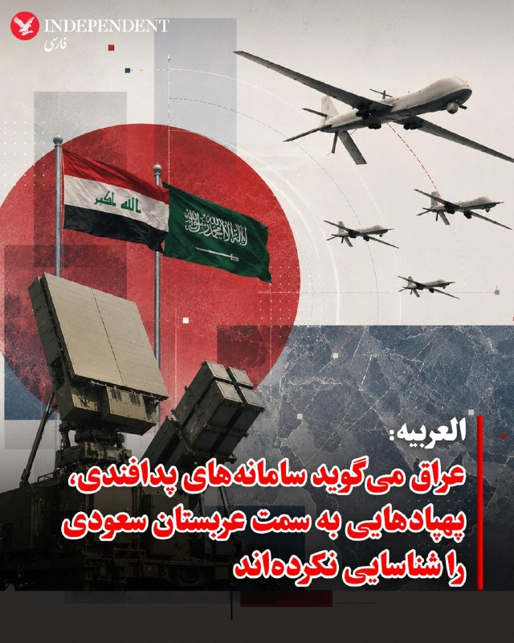

♦️به گزارش العربیه، دولت عراق روز دوشنبه اعلام کرد سامانه‌های پدافند هوایی این کشور هیچ پهپادی را که از خاک عراق به سمت عربستان سعودی پرتاب شده باشد، شناسایی نکرده‌اند.
عربستان سعودی اواخر روز یکشنبه اعلام کرده بود که سه پهپاد را که از حریم هوایی عراق وارد این کشور شده بودند رهگیری و منهدم کرده است و افزود که «حق پاسخ در زمان و مکان مناسب را برای خود محفوظ می‌دارد».
اما وزارت خارجه عراق گفت مقام‌های این کشور تحقیقاتی را «برای مشخص کردن شرایط و جزئیات این حادثه» آغاز کرده‌اند.
این وزارتخانه افزود سامانه‌های پدافند هوایی و نظارتی عراق هیچ پرتابی را ثبت نکرده‌اند.
این وزارتخانه از ریاض خواست «همکاری کرده و اطلاعات مرتبط را به اشتراک بگذارد تا به دستیابی به اطلاعات دقیق کمک شود و امنیت و ثبات دو کشور برادر تقویت شود».
تا کنون هیچ گروه عراقی مسئولیت این پهپادها را بر عهده نگرفته است.
به گزارش العربیه، پس از حملات آمریکا و اسرائیل به مواضع رژیم ایران و پیش از اعلام آتش‌بس، گروه‌های عراقی مورد حمایت تهران وارد عمل شدند و به اهداف آمریکایی در عراق و منطقه، از جمله در کشورهای خلیج فارس، حمله کردند.
‌🇸🇦 Indypersian

🤖 @VahidOOnLine

## VahidOOnLine — post 240882

این روایت‌ها فقط خبر چند کشته‌شده نیستند؛ سند روزهایی‌اند که جوانان ایران، یکی‌یکی از خیابان‌ها به سردخانه‌ها رسیدند. پشت هر نام، خانه‌ای مانده که ناگهان خاموش شد، خانواده‌ای که میان بی‌خبری و ترس دنبال عزیزش گشت و آینده‌ای که پیش از آغاز، با گلوله متوقف شد.<
جاویدنامان انقلاب ملی ایرانیان:
عارف گل‌محمدی، مهدی جمشیدی، محمدحسین علیخانی، پردیس محمدی، آرمین قاسمی مبین، احمد صالحی، احمدرضا نائیجی و محمد معصومی باقرآبادی.<
نام‌هایی که فراموش نمی‌شوند؛ چون هرکدام بخشی از حافظه زخمی این سرزمین‌اند.<
#جاویدنامان_انقلاب_ملی_ایرانیان
‌🏁 🇬🇧 IranintlTV

🤖 @VahidOOnLine

## VahidOOnLine — post 240881

  

♦️نیویورک‌تایمز با اشاره به چند مورد تهدید آمریکا به اقدام نظامی جدید علیه رژیم ایران و سپس اعلام به تعویق انداختن آن به نقل از مقاماتی که نام آنها را اعلام نکرده مدعی شده که فرماندهان جمهوری اسلامی، احتمالا با کمک روسیه، الگوهای پروازی جنگنده‌ها و بمب‌افکن‌های آمریکایی را بررسی کرده‌اند. به گفته این منابع، سرنگونی جنگنده اف-۱۵ئی در ماه گذشته و اصابت آتش زمینی به یک جنگنده اف-۳۵ نشان داد تاکتیک‌های پروازی آمریکا قابل پیش‌بینی شده است. به نوشته این روزنامه آمریکایی که دونالد ترامپ پیش‌تر بسیاری از گزارش‌های آن را نادرست توصیف کرده، جمهوری اسلامی بخش زیادی از تسلیحات باقی‌مانده خود را جابه‌جا کرده و این باور را در میان نیروهایش ایجاد کرده که می‌تواند در برابر آمریکا مقاومت کند؛ چه از طریق بستن تنگه هرمز، چه با حمله به زیرساخت‌های انرژی کشورهای همسایه خلیج فارس.یک مقام نظامی آمریکا که به شرط ناشناس ماندن درباره مسائل عملیاتی صحبت می‌کرد گفت ایران در طول آتش‌بس یک‌ماهه با آمریکا، ده‌ها پایگاه بمباران‌شده موشک‌های بالستیک را از زیر آوار خارج کرده،
‌🇸🇦 Indypersian

🤖 @VahidOOnLine

## VahidOOnLine — post 240880

♦️پیت هگست، وزیر جنگ ایالات متحده، با تقلید لحن و ادبیات خاص دونالد ترامپ، به بازگویی اولین گفتگوی خود با رئیس جمهوری آمریکا پس از پیشنهاد این پست پرداخت. هگست با خنده در میان حاضران گفت: «رئیس‌جمهور ترامپ وقتی برای اولین بار این شغل را به من پیشنهاد داد، گفت: پیت، باید خیلی سگ‌جان و سرسخت باشی؛ ببخشید ولی واقعا همین را گفت. آماده‌ای؟ آن‌ها به سراغت خواهند آمد.»
وزیر جنگ آمریکا در ادامه با تایید پیش بینی رئیس جمهوری افزود: «پسر، چقدر هم درست می‌گفت؛ او کاملا حق داشت.»
‌🇸🇦 Indypersian

🤖 @VahidOOnLine

## pm_afshaa — post 91011

  <a href="telegram/content/pm_afshaa_91011_1779154421.webm" target="_blank">🎬 Download video</a>

🔴فاکس نیوز به نقل از ترامپ:
ایران میخواد جنگ زود تموم بشه و اصلا نمیتونه سلاح هسته‌ای به دست بیاره.

💧 Rainbet.com the #1 Non-KYC Crypto Casino & Sportsbook @rainbetcom

😁 @Pm_Afshaa

## pm_afshaa — post 91010

  <a href="telegram/content/pm_afshaa_91010_1779154422.webm" target="_blank">🎬 Download video</a>

🔴واشنگتن پست به نقل از یک مقام پاکستانی: با توجه به مسائل متعدد در حال بررسی و نوع اجرای توافق، پیشرفت مذاکرات دشوار شده.

💧 Rainbet.com the #1 Non-KYC Crypto Casino & Sportsbook @rainbetcom

😁 @Pm_Afshaa

## pm_afshaa — post 91009

  <a href="telegram/content/pm_afshaa_91009_1779154422.webm" target="_blank">🎬 Download video</a>

🔴نیویورک تایمز:
ترامپ فعلا به خاطر نگرانی‌های پنتاگون که فکر میکنن ایران سیستم‌های پایش هوایی و دفاعیش رو ارتقا داده، از شروع دوباره جنگ برای فردا منصرف شده.

💧 Rainbet.com the #1 Non-KYC Crypto Casino & Sportsbook @rainbetcom

😁 @Pm_Afshaa

## IranIntlTV — post 337864

  

شرکت آدانی اینترپرایزس، مستقر در احمدآباد هند، در توافقی ۲۷۵ میلیون دلاری با وزارت خزانه‌داری آمریکا پذیرفت که مسئولیت خود را در ۳۲ مورد تخلف از تحریم‌های جمهوری اسلامی در ارتباط با خرید گاز مایع با منشاء ایرانی حل‌وفصل کند.
دفتر کنترل دارایی‌های خارجی وزارت خزانه‌داری آمریکا در بیانیه‌ای اعلام کرد شرکت آدانی از نوامبر ۲۰۲۳ تا ژوئن ۲۰۲۵، محموله‌های گاز مایع نفتی را از یک معامله‌گر مستقر در دبی خریداری کرد که مدعی بود گاز عمان و عراق را تامین می‌کند، اما این شرکت به موارد هشداردهنده‌ای که نشان می‌داد این گاز مایع نفتی در واقع منشا ایرانی داشته است، بی‌توجهی کرده بود.
طبق این بیانیه، در دوره زمانی نوامبر ۲۰۲۳ تا ژوئن ۲۰۲۵، اقدامات شرکت آدانی موجب شد ۳۲ پرداخت دلاری از طریق موسسات مالی آمریکایی برای این محموله‌ها پردازش شود که مجموع آنها حدود ۱۹۲ میلیون و ۱۰۴ هزار دلار بود.
این بیانیه افزود تخلفات شرکت آدانی فاحش بوده و به طور داوطلبانه افشا نشده است.

https://iranintl.com/202605198829

## IranIntlTV — post 337863

  

شرکت آدانی اینترپرایزس، مستقر در احمدآباد هند، در توافقی ۲۷۵ میلیون دلاری با وزارت خزانه‌داری آمریکا پذیرفت که مسئولیت خود را در ۳۲ مورد تخلف از تحریم‌های جمهوری اسلامی در ارتباط با خرید گاز مایع با منشاء ایرانی حل‌وفصل کند.
دفتر کنترل دارایی‌های خارجی وزارت خزانه‌داری آمریکا در بیانیه‌ای اعلام کرد شرکت آدانی از نوامبر ۲۰۲۳ تا ژوئن ۲۰۲۵، محموله‌های گاز مایع نفتی را از یک معامله‌گر مستقر در دبی خریداری کرد که مدعی بود گاز عمان و عراق را تامین می‌کند، اما این شرکت به موارد هشداردهنده‌ای که نشان می‌داد این گاز مایع نفتی در واقع منشا ایرانی داشته است، بی‌توجهی کرده بود.
طبق این بیانیه، در دوره زمانی نوامبر ۲۰۲۳ تا ژوئن ۲۰۲۵، اقدامات شرکت آدانی موجب شد ۳۲ پرداخت دلاری از طریق موسسات مالی آمریکایی برای این محموله‌ها پردازش شود که مجموع آنها حدود ۱۹۲ میلیون و ۱۰۴ هزار دلار بود.
این بیانیه افزود تخلفات شرکت آدانی فاحش بوده و به طور داوطلبانه افشا نشده است.

https://iranintl.com/202605198829

## IranIntlTV — post 337854

این روایت‌ها فقط خبر چند کشته‌شده نیستند؛ سند روزهایی‌اند که جوانان ایران، یکی‌یکی از خیابان‌ها به سردخانه‌ها رسیدند. پشت هر نام، خانه‌ای مانده که ناگهان خاموش شد، خانواده‌ای که میان بی‌خبری و ترس دنبال عزیزش گشت و آینده‌ای که پیش از آغاز، با گلوله متوقف شد.
جاویدنامان انقلاب ملی ایرانیان:
عارف گل‌محمدی، مهدی جمشیدی، محمدحسین علیخانی، پردیس محمدی، آرمین قاسمی مبین، احمد صالحی، احمدرضا نائیجی و محمد معصومی باقرآبادی.
نام‌هایی که فراموش نمی‌شوند؛ چون هرکدام بخشی از حافظه زخمی این سرزمین‌اند.
#جاویدنامان_انقلاب_ملی_ایرانیان

## IranIntlTV — post 337853

  <a href="https://t.me/IranintlTV/337853" target="_blank">📎 Download file</a>

🎧نسخه صوتی چشم‌انداز: طرح مجلس برای جایزه و پاداش به قاتل ترامپ!
@iranintlTV

## FarsiVOA — post 218108

⚡️ایران روزگاری کشوری بود که صدای بازی کودکان در کوچه‌ها بخشی از هویت روزمره‌اش بود. اما اکنون آمارهای رسمی از کاهش شدید نرخ باروری، پیرشدن جمعیت و بسته‌شدن پنجره جمعیتی خبر می‌دهند. روندی که روایتی از فشار اقتصادی، ناامیدی اجتماعی و تغییر عمیق سبک زندگی در ایران امروز است
@FarsiVOA

## FarsiVOA — post 218107

⚡️عفو بین‌الملل: هشتاد درصد اعدام‌های ثبت‌شده جهان در سال ۲۰۲۵ را جمهوری اسلامی انجام داد؛ گفت‌وگو با رها بحرینی، پژوهشگر امور ایران در عفو بین‌الملل

@FarsiVOA

## FarsiVOA — post 218106

⚡️خرید مواد غذایی دغدغه بخش بزرگی از مردم ایران؛ گفت‌وگو با رضا غیبی روزنامه‌نگار

@FDarsiVOA

## FarsiVOA — post 218105

⚡️معادله چند مجهولی پهپادهای ناشناس؛ آیا آسمان عراق از کنترل دولت خارج شده است؟
@FarsiVOA

## FarsiVOA — post 218104

⚡️مواضع قانون‌گذاران آمریکایی درباره رژیم ایران و بحران در تنگه هرمز
@FarsiVOA

## BBCPersian — post 281419

  

‌ ‌ ‌ ‌
دونالد ترامپ عصر دوشنبه گفت از سوی عربستان سعودی، قطر، امارات متحده عربی و برخی کشورهای دیگر از او خواسته شده است که حمله نظامی جدید به ایران را برای ۲ تا ۳ روز به تعویق بیندازد، زیرا به گفته آن‌ها طرف‌ها «به توافق بسیار نزدیک» شده‌اند.

او افزود اگر این توقف کوتاه بتواند به جلوگیری از دستیابی سلاح هسته‌ای به ایران کمک کند: «من فکر می‌کنم اگر آن‌ها راضی باشند، ما هم احتمالا راضی خواهیم بود».

آقای ترامپ همچنین گفت با اسرائیل و دیگر کشورهای خاورمیانه که در این روند درگیر بوده‌اند نیز هماهنگی و اطلاع‌رسانی صورت گرفته است.

او این وضعیت را «تحولی بسیار مثبت» توصیف کرد، اما تاکید کرد که هنوز مشخص نیست به نتیجه‌ای برسد یا نه.

وی ادامه داد: «دوره‌هایی بوده که فکر می‌کردیم خیلی به توافق نزدیک شده‌ایم، اما نتیجه نداد.»

آقای ترامپ گفت شرایط کنونی «کمی متفاوت» است و افزود: «ما فردا می‌رویم؛ بسیار مهم است. این چیزی نیست که من می‌خواستم انجام دهم، اما چاره‌ای نداریم چون نمی‌توانیم اجازه دهیم ایران به سلاح هسته‌ای دست پیدا کند.»

https://bbc.in/4djvL39
📷Reuters
@BBCPersian

## BBCPersian — post 281418

🔻 مراسم عروسی ۱۱۰ زوج حامی حکومت در تهران همزمان با نگرانی‌ها از شروع دوباره جنگ

در ادامه برنامه های تبلیغاتی حکومت ایران و حضور هواداران حکومت در خیابان‌ها، امروز در میدان امام حسین در جنوب تهران مراسم عروسی ۱۱۰ زوج مرتبط با کمپین جانفدا برگزار شد.

دو روز پیش رسانه‌های دولتی ایران گفتند که ۳۱ میلیون نفر در این کمپین ثبت نام کردند. حکومت ایران دوره‌های آموزشی اسلحه را برای داوطلبان طرفدار حکومت به راه انداخته است.

پویش «جانفدا» که این عروسی جمعی در راستای آن انجام شده است،‌ در شرایطی به راه افتاده که جمهوری اسلامی ایران در چند سال اخیر با بحران‌های سیاسی و اقتصادی، اعتراض‌های گسترده داخلی و دو جنگ اخیر روبرو بوده است و بیش از هر زمانی با مساله‌ای به نام مشروعیت و «همراهی ملت با نظام» دست و پنجه نرم می‌کند.

برخی از شهروندان نگران از جنگ و آینده، این اقدامات را تبلیغاتی و آن را آزاردهنده توصیف کردند.

https://bbc.in/4uY6f9v
@BBCPersian

## BBCPersian — post 281417

🔻 آلمان در راستای برنامه‌های ناتو، یک سامانه دفاع هوایی پاتریوت در ترکیه مستقر می‌کند

وزارت دفاع آلمان روز دوشنبه اعلام کرد که این کشور به عنوان بخشی از برنامه چرخشی ناتو، ۱۵۰ نیرو و یک سامانه دفاع هوایی پاتریوت در ترکیه مستقر خواهد کرد.

آلمان می‌گوید که حدود ۱۵۰ سرباز که در حال حاضر در شهر هوسوم در شمال آلمان مستقر هستند ماه آینده به همراه یک سامانه ضد موشکی پاتریوت به ترکیه منتقل خواهند شد.

به گفته وزارت دفاع آلمان این گروه جایگزین یک واحد نیروهای آمریکایی مستقر در ترکیه خواهند شد و این بخشی از برنامه چرخشی ناتو است.

وزیر دفاع آلمان روز دوشنبه با اعلام این خبر گفت که این نشانه همکاری نزدیک سربازان آلمانی با شرکای ترک و آمریکایی خود است و نشان می‌دهد که چقدر آلمان با متحدانش همکاری می‌کند.

پاتریوت یک سیستم دفاع هوایی متحرک ساخت آمریکا از پیشرفته ترین سلاح‌های ساخت این کشور برای رهگیری و انهدام موشک‌های بالستیک و موشک‌های کروز و هواپیماهاست.

واحد آمریکایی که در حال حاضر در ترکیه مستقر است، با آغاز جنگ آمریکا و اسرائیل با ایران در نهم اسفند ماه برای تقویت دفاع از ترکیه به این کشور منتقل شده بود.

به گزارش خبرگزاری فرانسه، نیروهای ناتو از زمان شروع جنگ دستکم سه بار موشک‌های بالستیک ایران را بر فراز ترکیه سرنگون کردند.

آلمان پیشتر از سال ۲۰۱۳ تا ۲۰۱۵ سامانههای پاتریوت را برای کمک به حفاظت از حریم هوایی ترکیه در مرز این کشور با سوریه مستقر کرده بود.

وزارت دفاع آلمان می‌گوید که یک سامانه پاتریوت متحرک شامل حداکثر هشت پرتابگر و همچنین یک واحد رادار و یک پست کنترل آتش است.

https://bbc.in/4tHtvHA
@BBCPersian

## BBCPersian — post 281416

  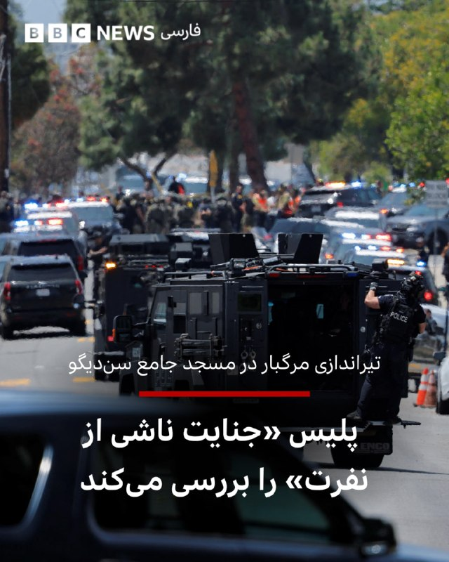

‌ ‌ ‌ ‌
در اثر تیراندازی در بزرگترین مسجد شهر سن دیگو - در جنوب کالیفرنیا - دست‌کم سه نفر کشته شدند و پلیس گفته دو عامل احتمالی این تیراندازی نیز «بر اثر شلیک به خود» کشته شده‌اند. به گفته پلیس حادثه رخ‌داده در مرکز اسلامی در حال حاضر به عنوان «جنایت ناشی از نفرت (تروریسم داخلی)» بررسی می‌شود و پلیس همکاری نزدیکی با کارآگاهان اف‌بی‌آی دارد.

سخنگوی شبکه درمانی «شارپ هلث‌کر» سن‌دیگو به بی‌بی‌سی گفت بیمارستان «شارپ مموریال» در حال پذیرش مجروحان مرتبط با تیراندازی و آلیشیا کوک، سخنگوی این مرکز درمانی، گفته است: «گزارش‌ها حاکی از آن است که چندین نفر زخمی شده‌اند.»

براساس گزارش‌ها این تیراندازی اندکی پیش از ظهر به وقت محلی در این مرکز اسلامی رخ داده است.

یک شاهد عینی در گفت‌وگو با شبکه سی‌بی‌اس نیوز، شریک خبری بی‌بی‌سی در آمریکا، گفت صدای شلیک حدود ۳۰ گلوله را شنیده که به گفته او، به نظر می‌رسید از یک «سلاح نیمه‌خودکار» شلیک شده باشد.

او گفت ابتدا حدود ۱۲ گلوله شنیده، سپس وقفه‌ای کوتاه ایجاد شده و بعد دوباره احتمالا حدود ۱۲ گلوله دیگر شلیک شده است.

https://bbc.in/4djuBEP
📷 Reuters
@BBCPersian

## BBCPersian — post 281415

  

‌ ‌ ‌
دونالد ترامپ، رئیس جمهور آمریکا، در نخستین واکنش به حمله مسلحانه به مسجد جامع شهر سن دیگو آن را «حادثه وحشتناکی» خوانده و گفته به زودی با اعضای کابینه خود به طور جدی جزییات آن را زیر نظر خواهد گرفت.

پلیس سن دیگو و اداره آگاهی فدرال آمریکا - پلیس اف‌بی‌آی - گفته این تیراندازی را تحت عنوان جنایت ناشی از نفرت تحت بررسی دارد؛ اصطلاحی که مترادف تروریسم داخلی است و از احتمال وجود انگیزه‌های نژادپرستانه یا نفرت از قوم یا پیروان مذهب خاصی حکایت دارد.

https://bbc.in/4wt0sdw
📷Reuters
@BBCPersian

## Hranews — post 113026

  

میان موشک و سرکوب؛ گزارش مجموعه فعالان حقوق بشر درباره مخاصمه نظامی ایالات متحده-اسرائیل و ایران منتشر شد

💥
💥
💥
💥
💥 – امروز، مجموعه فعالان حقوق بشر در ایران گزارش جدیدی را در ۲۴۰ صفحه و دو زبان منتشر کرد که به بررسی کارزار نظامی ایالات متحده و اسرائیل در ایران در فاصله ۹ اسفند ۱۴۰۴ تا ۱۹ فروردین ۱۴۰۵ (۲۸ فوریه تا ۸ آوریل ۲۰۲۶) می‌پردازد.

این گزارش بر پایه ۱۷۷ منبع تأییدشده ــ شامل گزارش‌های منابع آزاد و شبکه میدانی مجموعه فعالان حقوق بشر در داخل کشور ــ ۶٬۳۲۴ رویداد منحصربه‌فرد شامل ۱۲٬۷۹۸ حمله مجزا را مستندسازی کرده است.
مجموعه فعالان تاکید کرد این گزارش با هدف ارائه روایت جامع از کل درگیری تهیه نشده است. یافته‌های آن صرفاً به رویدادهایی محدود می‌شود که در داده‌های این نهاد مستندسازی و راستی‌آزمایی شده‌اند.

📊 یافته‌های کلیدی گزارش
◾️ ثبت ۶٬۳۲۴ رویداد منحصربه‌فرد و ۱۲٬۷۹۸ حمله مجزا
◾️ ۷۷ درصد رویدادها شامل آسیب به غیرنظامیان یا اماکن غیرنظامی
◾️ ثبت دست‌کم ۳٬۶۳۶ مورد مرگ، از جمله ۱٬۷۰۱ غیرنظامی
◾️ کشته شدن ۳۰۷ کودک و زخمی شدن ۲٬۲۱۳ کودک
◾️ تمرکز ۴۴٫۸۵ درصدی رویدادها در استان تهران
◾️ هدف قرار گرفتن یا آسیب دیدن مدارس، مراکز درمانی، مراکز فرهنگی و زیرساخت‌های حیاتی

⚠️ الگوهای نگران‌کننده
این گزارش چندین الگوی نگران‌کننده را برجسته می‌کند، از جمله:
◾️ ضعف در راستی‌آزمایی اهداف
◾️ استفاده محدود از نظارت انسانی در برخی فناوری‌های هدف‌گیری
◾️ هشدارهای ناکافی پیش از حملات
◾️ استفاده از تسلیحات انفجاری سنگین در مناطق پرجمعیت
◾️ حملات تکراری به برخی مناطق غیرنظامی
◾️ آسیب گسترده به زیرساخت‌های غیرنظامی

🚨 این گزارش همچنین به بازداشت گسترده شهروندان در ایران اشاره دارد؛ دست‌کم ۴٬۰۲۳ نفر با اتهامات مرتبط با امنیت ملی یا جنگ بازداشت شده‌اند.

از سوی دیگر تشدید محدودیت‌های امنیتی، گسترش ایست‌های بازرسی و محدودیت‌های گسترده اینترنت از دیگر پیامدهای مستندسازی‌شده عنوان شده است.

در همین بازه زمانی، ۵۰ مورد اعدام ثبت شده که ۳۲ مورد آن با اتهامات سیاسی و امنیتی مرتبط بوده است.

📎 ادامه گزارش به زبان فارسی

📎 دانلود مستقیم فایل پی دی اف گزارش از تلگرام

📎 دانلود مستقیم فایل پی دی اف گزارش از سایت

📎 Complete report in English

📎Direct download of the English PDF

↘️
@hranews_bot تماس ✉️ - @Hranews کانال هرانا 🆑

## Hranews — post 113025

  <a href="https://t.me/hranews/113025" target="_blank">📎 Download file</a>

میان موشک و سرکوب؛ گزارش مجموعه فعالان حقوق بشر درباره مخاصمه نظامی ایالات متحده-اسرائیل و ایران منتشر شد 
💥
💥
💥
💥
💥 – امروز، مجموعه فعالان حقوق بشر در ایران گزارش جدیدی را در ۲۴۰ صفحه و دو زبان منتشر کرد که به بررسی کارزار نظامی ایالات متحده و اسرائیل در ایران…

---
📅 بروزرسانی: 1405/02/29 02:53
---

## VahidOOnLine — post 240879

  

ترامپ با اشاره به توقف کوتاه‌مدت حمله برنامه‌ریزی‌شده به جمهوری اسلامی درپی تقاضای عربستان‌ سعودی، امارات متحده عربی و قطر از او با هدف رسیدن به توافق، گفت این موضوع را به اسرائیل و دیگر کشورهای منطقه نیز اطلاع داده است.
او در واشینگتن‌دی‌سی به خبرنگاران گفت: «عربستان سعودی، قطر، امارات متحده عربی و چند کشور دیگر از من خواستند که آن را برای دو یا سه روز، یک بازه کوتاه، به تعویق بیندازیم، زیرا فکر می‌کنند بسیار به دستیابی به یک توافق نزدیک شده‌اند و اگر بتوانیم به گونه‌ای عمل کنیم که هیچ سلاح هسته‌ای به دست ایران نرسد، فکر می‌کنم اگر آنها راضی باشند، ما نیز احتمالا راضی خواهیم بود.»
ترامپ گفت: «ما قرار بود فردا یک حمله بسیار بزرگ انجام دهیم. من آن را برای مدتی کوتاه به تعویق انداختم، امیدوارم شاید برای همیشه، اما احتمالا برای مدت کوتاهی، زیرا گفت‌وگوهای بسیار مهمی با ایران داشته‌ایم و خواهیم دید این گفت‌وگوها به کجا می‌انجامد.»
او افزود: «ما اسرائیل را در جریان گذاشته‌ایم، دیگر افرادی را در خاورمیانه که با ما درگیر بوده‌اند مطلع کرده‌ایم و این یک تحول بسیار مثبت است.»
‌🏁 🇬🇧 IranintlTV

🤖 @VahidOOnLine

## VahidOOnLine — post 240878

  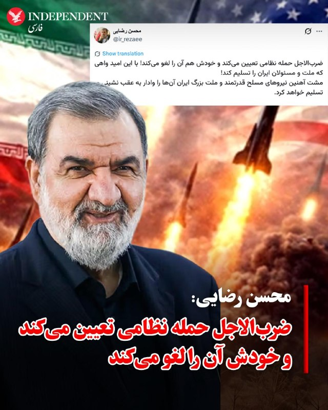

♦️محسن رضایی، فرمانده سابق سپاه پاسداران و مشاور مجتبی خامنه‌ای، دوشنبه ۲۸ اردیبهشت ماه با انتشار پیامی در شبکه اجتماعی اکس نوشت: «ضرب‌الاجل حمله نظامی تعیین می‌کند و خودش هم آن را لغو می‌کند. با این امید واهی که ملت و مسئولان ایران را تسلیم کند. مشت آهنین نیروهای مسلح قدرتمند و ملت بزرگ ایران آن‌ها را وادار به عقب‌نشینی و تسلیم خواهد کرد.»
‌🇸🇦 Indypersian

🤖 @VahidOOnLine

## VahidOOnLine — post 240877

♦️دونالد ترامپ، رئیس‌جمهوری آمریکا، در گفتگو با خبرنگاران گفت: «من با اسکات بسنت، وزیر خزانه‌داری ایالات متحده آمریکا و هاوارد لوتنیک،  وزیر بازرگانی تماس گرفتم و همه آن‌ها را به دفترم فراخواندم. گفتم ما قصد داریم یک سفر کوتاه به خاورمیانه داشته باشیم و با ایران مواجه شویم، زیرا آن‌ها به شدت به دنبال دستیابی به سلاح هسته‌ای هستند و تنها دلیلشان برای داشتن آن، استفاده از آن است.»
رئیس‌جمهوری آمریکا در ادامه افزود: «من گفتم از اینکه مجبورم این کار را انجام دهم متنفرم، چون اوضاع ما بسیار خوب پیش می‌رود؛ اما این مهم‌ترین کاری است که می‌توانیم انجام دهیم. ما نمی‌توانیم اجازه دهیم ایران به سلاح هسته‌ای دست یابد، بنابراین این کار را انجام دادیم.»
‌🇸🇦 Indypersian

🤖 @VahidOOnLine

## VahidOOnLine — post 240876

  

لیندزی گراهام، سناتور جمهوری‌خواه، در ایکس نوشت: «همان‌طور که پیش‌تر گفته‌ام، هر توافقی که میان آمریکا و جمهوری اسلامی حاصل شود باید برای تایید به کنگره ارائه شود؛ همان‌طور که در مورد برجام نیز چنین شد.»
سناتور گراهام گفت: «اگر بتوانیم از طریق ابزارهای دیپلماتیک به درگیری پایان دهیم و به اهداف امنیت ملی خود دست یابیم، این یک دستاورد بزرگ خواهد بود.»

‌🏁 🇬🇧 IranintlTV

🤖 @VahidOOnLine

## VahidOOnLine — post 240875

  

♦️دونالد ترامپ، رئیس‌جمهوری آمریکا، دوشنبه شب ۲۸ اردیبهشت در پاسخ به سوال خبرنگاران گفت چند کشور منطقه، از جمله قطر، عربستان سعودی و امارات متحده عربی، در حال گفتگو با آمریکا و جمهوری اسلامی ایران هستند و احتمال رسیدن به توافق وجود دارد.
ترامپ گفت: «این سه کشور، به‌علاوه چند کشور دیگر، با من تماس گرفتند و آن‌ها مستقیما با مقام‌های ما و در حال حاضر با تهران در تماس هستند. به نظر می‌رسد احتمال بسیار خوبی وجود دارد که بتوانند به یک توافق برسند.»
رئیس‌جمهوری آمریکا همچنین با تاکید بر اینکه ارتش ایالات متحده بزرگترین ارتش جهان است و اجازه نخواهد داد ایران به سلاح هسته‌ای دست یابد، افزود: «اگر بتوانیم بدون اینکه آن‌ها را به‌شدت بمباران کنیم به نتیجه برسیم، بسیار خوشحال خواهم شد.»
‌🇸🇦 Indypersian

🤖 @VahidOOnLine

## VahidOOnLine — post 240874

  <a href="telegram/content/VahidOOnLine_240874_1779146630.mp4" target="_blank">🎬 Download video</a>

جیمی دایمن، مدیرعامل بانک جی‌پی مورگان چیس، در گفت‌وگو با ان‌پی‌آر هشدار داد تشدید جنگ میان آمریکا، اسرائیل و جمهوری اسلامی می‌تواند پیامدهای اقتصادی گسترده‌ای در جهان به همراه داشته باشد.

دایمن گفت جمهوری اسلامی «۴۷ سال است مردم بی‌گناه، از جمله آمریکایی‌های بی‌گناه، را می‌کشد» و تاکید کرد نباید اجازه پیدا کند به توانایی هسته‌ای دست یابد.

او افزود جمهوری اسلامی دارای موشک‌های بالستیک با برد سه هزار مایل است و «به‌وضوح» در تلاش برای توسعه توانایی هسته‌ای است.

مدیرعامل جی‌پی مورگان در عین حال هشدار داد گسترش درگیری‌ها می‌تواند خطر رکود اقتصادی یا حتی «رکود تورمی» را افزایش دهد؛ وضعیتی که همزمان با رکود اقتصادی و افزایش تورم همراه است.

او گفت هرچند هنوز مشخص نیست چنین سناریویی رخ خواهد داد یا نه، اما این بحران احتمال «پیامدهای بد اقتصادی» را افزایش می‌دهد و باید با نگاهی واقع‌بینانه به آن نگاه کرد.

جی‌پی مورگان چیس بزرگ‌ترین بانک جهان از نظر ارزش بازار به شمار می‌رود و مجموع دارایی‌های آن از چهار تریلیون دلار فراتر رفته است.

جیمی دایمن، مدیرعامل این بانک، از تاثیرگذارترین چهره‌های اقتصادی آمریکا محسوب می‌شود و سال‌ها از نظر مالی و سیاسی به حزب دموکرات گرایش داشته است.
‌🏁 🇬🇧 ManotoTV

🤖 @VahidOOnLine

## VahidOOnLine — post 240873

  <a href="telegram/content/VahidOOnLine_240873_1779146632.mp4" target="_blank">🎬 Download video</a>

مقام‌های روسیه اعلام کردند در حملات پهپادی روز گذشته اوکراین به اطراف مسکو و منطقه بلگورود، دست‌کم چهار نفر کشته شدند؛ حملاتی که به گفته رسانه‌های روسی، بزرگ‌ترین حمله پهپادی به مسکو در بیش از یک سال گذشته بوده است.

بر اساس این گزارش، سه نفر در منطقه مسکو و یک نفر در منطقه بلگورود جان باختند.

سفارت هند در روسیه اعلام کرد یکی از کشته‌شدگان یک شهروند هندی بوده و سه شهروند هندی دیگر نیز زخمی شده‌اند.

خبرگزاری دولتی تاس به نقل از سرگئی سوبیانین، شهردار مسکو، گزارش داد پدافند هوایی روسیه از نیمه‌شب شنبه تا یکشنبه ۸۱ پهپاد را که به سمت مسکو در حرکت بودند، سرنگون کرده است.

سوبیانین گفت ۱۲ نفر، عمدتا در نزدیکی ورودی پالایشگاه نفت مسکو، زخمی شده‌اند اما به گفته او «فناوری» پالایشگاه آسیب ندیده است.

سرویس امنیتی اوکراین، اس‌بی‌یو، اعلام کرد ارتش این کشور یک پالایشگاه نفت و دو ایستگاه پمپاژ نفت در منطقه مسکو را هدف قرار داده است.

ولودیمیر زلنسکی، رئیس‌جمهوری اوکراین، نیز این حملات را «کاملا موجه» توصیف کرد.

وزارت دفاع روسیه اعلام کرد در مجموع ۵۵۶ پهپاد اوکراینی در جریان حملات شبانه و صبح یکشنبه سرنگون شده‌اند.

در مقابل، نیروی هوایی اوکراین گفت روسیه شب گذشته با ۲۸۷ پهپاد به خاک اوکراین حمله کرده که ۲۷۹ فروند آن رهگیری یا مختل شده‌اند.
‌🏁 🇬🇧 ManotoTV

🤖 @VahidOOnLine

## VahidOOnLine — post 240872

♦️هاکان فیدان، وزیر امور خارجه ترکیه، در جریان نشست خبری مشترک با یوهان وادفول، وزیر امور خارجه آلمان گفت در پذیرش شرایط لازم مذاکرات هسته‌ای از طرف ایران، مشکل اصولی نمی‌بیند.
فیدان تاکید کرد اختلاف‌ها بیشتر بر سر این است که تهران در مقابل توافق احتمالی چه امتیازهایی دریافت خواهد کرد، این امتیازها با چه ترتیبی ارائه می‌شوند و چه شرایطی همراه آن خواهد بود.
‌🇸🇦 Indypersian

🤖 @VahidOOnLine

## mwarmonitor — post 9288

🔴وال‌استریت ژورنال: شرکت آنتروپیک اخیراً به کاربران مدل قدرتمند هوش مصنوعی خود با نام «میثوس» اجازه داده است تهدیدهای امنیت سایبری را با دیگرانی که ممکن است با آسیب‌پذیری‌های مشابه روبه‌رو باشند، به اشتراک بگذارند.

@mwarmonitor

## mwarmonitor — post 9287

  

✈️🇵🇰 هواپیمای A319 نیروی هوایی پاکستان (A-1102) که وزیر کشور پاکستان را حمل می‌کرد – وی در یک سفر رسمی دو روزه برای بررسی روابط دوجانبه و گفت‌وگوها با آمریکا به سر می‌برد – از مشهد خارج شد. @mwarmonitor

## pm_afshaa — post 91008

  <a href="telegram/content/pm_afshaa_91008_1779146634.webm" target="_blank">🎬 Download video</a>

🔴کانال 12 اسرائیل:
ترامپ به اسرائیل اطلاع داد که تاخیر در حمله به ایران تنها دو تا سه روزه.

💧 Rainbet.com the #1 Non-KYC Crypto Casino & Sportsbook @rainbetcom

😁 @Pm_Afshaa

## pm_afshaa — post 91006

  <a href="telegram/content/pm_afshaa_91006_1779146634.webm" target="_blank">🎬 Download video</a>

🔴ترامپ: اسرائیل رو از تصمیم برای به تأخیر انداختن حمله به ایران مطلع کردم.

💧 Rainbet.com the #1 Non-KYC Crypto Casino & Sportsbook @rainbetcom

😁 @Pm_Afshaa

## pm_afshaa — post 91005

  <a href="telegram/content/pm_afshaa_91005_1779146635.webm" target="_blank">🎬 Download video</a>

🔴ترامپ: ما به جمهوری اسلامی هیچ امتیازی نخواهیم داد، فقط تسلیم کامل!

💧 Rainbet.com the #1 Non-KYC Crypto Casino & Sportsbook @rainbetcom

😁 @Pm_Afshaa

## pm_afshaa — post 91004

  <a href="telegram/content/pm_afshaa_91004_1779146636.webm" target="_blank">🎬 Download video</a>

🔴ترامپ: ایران نهایتا 3 روز زمان داره. 
💧 Rainbet.com the #1 Non-KYC Crypto Casino & Sportsbook @rainbetcom 
😁 @Pm_Afshaa

## IranIntlTV — post 337852

  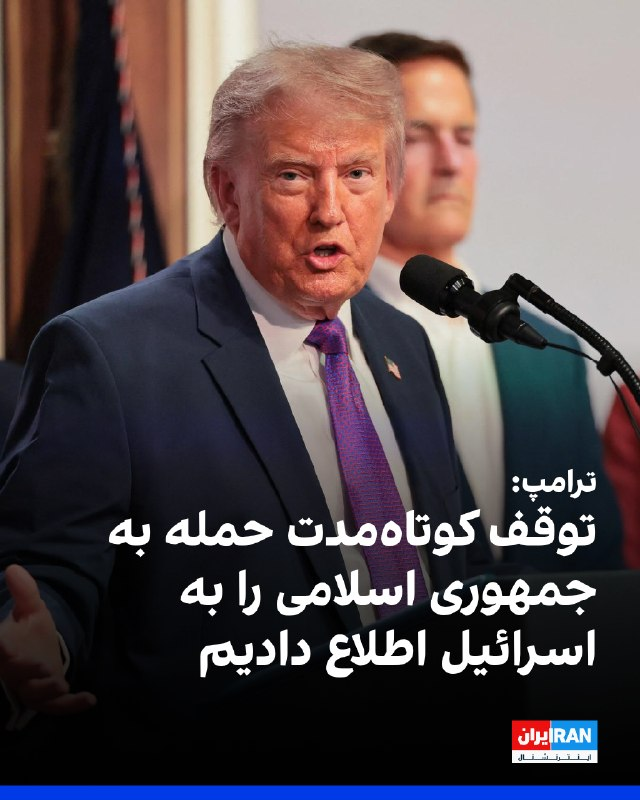

ترامپ با اشاره به توقف کوتاه‌مدت حمله برنامه‌ریزی‌شده به جمهوری اسلامی درپی تقاضای عربستان‌ سعودی، امارات متحده عربی و قطر از او با هدف رسیدن به توافق، گفت این موضوع را به اسرائیل و دیگر کشورهای منطقه نیز اطلاع داده است.
او در واشینگتن‌دی‌سی به خبرنگاران گفت: «عربستان سعودی، قطر، امارات متحده عربی و چند کشور دیگر از من خواستند که آن را برای دو یا سه روز، یک بازه کوتاه، به تعویق بیندازیم، زیرا فکر می‌کنند بسیار به دستیابی به یک توافق نزدیک شده‌اند و اگر بتوانیم به گونه‌ای عمل کنیم که هیچ سلاح هسته‌ای به دست ایران نرسد، فکر می‌کنم اگر آنها راضی باشند، ما نیز احتمالا راضی خواهیم بود.»
ترامپ گفت: «ما قرار بود فردا یک حمله بسیار بزرگ انجام دهیم. من آن را برای مدتی کوتاه به تعویق انداختم، امیدوارم شاید برای همیشه، اما احتمالا برای مدت کوتاهی، زیرا گفت‌وگوهای بسیار مهمی با ایران داشته‌ایم و خواهیم دید این گفت‌وگوها به کجا می‌انجامد.»
او افزود: «ما اسرائیل را در جریان گذاشته‌ایم، دیگر افرادی را در خاورمیانه که با ما درگیر بوده‌اند مطلع کرده‌ایم و این یک تحول بسیار مثبت است.»
https://iranintl.com/202605187593

## IranIntlTV — post 337851

  <a href="telegram/content/IranIntlTV_337851_1779146637.mp4" target="_blank">🎬 Download video</a>

دونالد ترامپ اعلام کرد به درخواست رهبران منطقه برنامه حمله به جمهوری اسلامی را متوقف کرده است.

او همزمان به نیویورک‌پست گفت پس از دریافت پاسخ اخیر جمهوری اسلامی درباره مذاکرات، دیگر تمایلی به دادن هیچ امتیازی به تهران ندارد.

گفت‌وگو با امیر گیتی، عضو تحریریه ایران‌اینترنشنال
@iranintltv

## IranIntlTV — post 337850

  <a href="https://t.me/IranintlTV/337850" target="_blank">📎 Download file</a>

🎧نسخه صوتی سیاست با مراد ویسی: لغو حمله در آخرین لحظه
@iranintlTV

## IranIntlTV — post 337849

  

لیندزی گراهام، سناتور جمهوری‌خواه، در ایکس نوشت: «همان‌طور که پیش‌تر گفته‌ام، هر توافقی که میان آمریکا و جمهوری اسلامی حاصل شود باید برای تایید به کنگره ارائه شود؛ همان‌طور که در مورد برجام نیز چنین شد.»
سناتور گراهام گفت: «اگر بتوانیم از طریق ابزارهای دیپلماتیک به درگیری پایان دهیم و به اهداف امنیت ملی خود دست یابیم، این یک دستاورد بزرگ خواهد بود.»

https://iranintl.com/202605183437

## IranIntlTV — post 337848

  <a href="telegram/content/IranIntlTV_337848_1779146641.mp4" target="_blank">🎬 Download video</a>

مسعود پزشکیان گفت در پی محاصره دریایی آمریکا، صادرات نفت ایران متوقف شده و کشور روزانه با کمبود ۵۰ میلیون لیتر بنزین روبه‌رو است، اما دلاری برای واردات آن وجود ندارد.

ساعتی پس از انتشار این اظهارات، رسانه‌های دولتی از جمله ایرنا اقدام به حذف سخنان پزشکیان کردند.

گفت‌وگو با مهدی مصلحی، کارشناس بازار نفت
@iranintltv

## ManotoTV — post 105618

  <a href="telegram/content/ManotoTV_105618_1779146643.mp4" target="_blank">🎬 Download video</a>

جیمی دایمن، مدیرعامل بانک جی‌پی مورگان چیس، در گفت‌وگو با ان‌پی‌آر هشدار داد تشدید جنگ میان آمریکا، اسرائیل و جمهوری اسلامی می‌تواند پیامدهای اقتصادی گسترده‌ای در جهان به همراه داشته باشد.

دایمن گفت جمهوری اسلامی «۴۷ سال است مردم بی‌گناه، از جمله آمریکایی‌های بی‌گناه، را می‌کشد» و تاکید کرد نباید اجازه پیدا کند به توانایی هسته‌ای دست یابد.

او افزود جمهوری اسلامی دارای موشک‌های بالستیک با برد سه هزار مایل است و «به‌وضوح» در تلاش برای توسعه توانایی هسته‌ای است.

مدیرعامل جی‌پی مورگان در عین حال هشدار داد گسترش درگیری‌ها می‌تواند خطر رکود اقتصادی یا حتی «رکود تورمی» را افزایش دهد؛ وضعیتی که همزمان با رکود اقتصادی و افزایش تورم همراه است.

او گفت هرچند هنوز مشخص نیست چنین سناریویی رخ خواهد داد یا نه، اما این بحران احتمال «پیامدهای بد اقتصادی» را افزایش می‌دهد و باید با نگاهی واقع‌بینانه به آن نگاه کرد.

جی‌پی مورگان چیس بزرگ‌ترین بانک جهان از نظر ارزش بازار به شمار می‌رود و مجموع دارایی‌های آن از چهار تریلیون دلار فراتر رفته است.

جیمی دایمن، مدیرعامل این بانک، از تاثیرگذارترین چهره‌های اقتصادی آمریکا محسوب می‌شود و سال‌ها از نظر مالی و سیاسی به حزب دموکرات گرایش داشته است.

## ManotoTV — post 105617

  <a href="telegram/content/ManotoTV_105617_1779146645.mp4" target="_blank">🎬 Download video</a>

مقام‌های روسیه اعلام کردند در حملات پهپادی روز گذشته اوکراین به اطراف مسکو و منطقه بلگورود، دست‌کم چهار نفر کشته شدند؛ حملاتی که به گفته رسانه‌های روسی، بزرگ‌ترین حمله پهپادی به مسکو در بیش از یک سال گذشته بوده است.

بر اساس این گزارش، سه نفر در منطقه مسکو و یک نفر در منطقه بلگورود جان باختند.

سفارت هند در روسیه اعلام کرد یکی از کشته‌شدگان یک شهروند هندی بوده و سه شهروند هندی دیگر نیز زخمی شده‌اند.

خبرگزاری دولتی تاس به نقل از سرگئی سوبیانین، شهردار مسکو، گزارش داد پدافند هوایی روسیه از نیمه‌شب شنبه تا یکشنبه ۸۱ پهپاد را که به سمت مسکو در حرکت بودند، سرنگون کرده است.

سوبیانین گفت ۱۲ نفر، عمدتا در نزدیکی ورودی پالایشگاه نفت مسکو، زخمی شده‌اند اما به گفته او «فناوری» پالایشگاه آسیب ندیده است.

سرویس امنیتی اوکراین، اس‌بی‌یو، اعلام کرد ارتش این کشور یک پالایشگاه نفت و دو ایستگاه پمپاژ نفت در منطقه مسکو را هدف قرار داده است.

ولودیمیر زلنسکی، رئیس‌جمهوری اوکراین، نیز این حملات را «کاملا موجه» توصیف کرد.

وزارت دفاع روسیه اعلام کرد در مجموع ۵۵۶ پهپاد اوکراینی در جریان حملات شبانه و صبح یکشنبه سرنگون شده‌اند.

در مقابل، نیروی هوایی اوکراین گفت روسیه شب گذشته با ۲۸۷ پهپاد به خاک اوکراین حمله کرده که ۲۷۹ فروند آن رهگیری یا مختل شده‌اند.

## FarsiVOA — post 218103

🔺پلیس: تیراندازی در «مرکز اسلامی» سن‌دیگو، ۳ بزرگسال را کشت؛ هر دو مظنون کشته شدند

▪️مقام‌های آمریکایی گفتند تیراندازی روز دوشنبه در یک «مرکز اسلامی» در شهر سن‌دیگو واقع در ایالت کالیفرنیا، سه مرد، از جمله یک نگهبان امنیتی را کشت.

⬇️ بیشتر بخوانید:
https://ir.voanews.com/a/8151375.html
@FarsiVOA

## FarsiVOA — post 218102

  <a href="telegram/content/FarsiVOA_218102_1779146646.mp4" target="_blank">🎬 Download video</a>

⚡️افزایش کودک‌همسری و خشونت علیه زنان در افغانستان؛ به حاشیه‌رفتن حقوق زنان در سایه تنش‌های ایران
@FarsiVOA

## FarsiVOA — post 218101

  <a href="telegram/content/FarsiVOA_218101_1779146647.mp4" target="_blank">🎬 Download video</a>

⚡️پزشکیان زیر تیغ گرانی؛ دولت بی‌اختیار در سایه سپاه و جنگ؟
@FarsiVOA

## FarsiVOA — post 218100

⚡️ترامپ: حمله نظامی برنامه‌ریزی شده سه‌شنبه به جمهوری اسلامی را به درخواست متحدان به تعویق انداختم
@FarsiVOA

## FarsiVOA — post 218099

  <a href="telegram/content/FarsiVOA_218099_1779146649.mp4" target="_blank">🎬 Download video</a>

⚡️بحران اقتصادی در ایران دیگر فقط صدای مردم عادی را درنیاورده، حتی حامیان و مقام‌های جمهوری اسلامی نیز از گرانی، بیکاری و آشفتگی اقتصادی شکایت می‌کنند. بحرانی که بسیاری، ریشه آن را در سال‌ها سوءمدیریت و فساد ساختاری در جمهوری اسلامی می‌بینند
@FarsiVOA

## FarsiVOA — post 218098

⚡️گزارش نیویورک‌تایمز: بیابان‌های غربی عراق، اتاق جنگ پنهان اسرائیل علیه جمهوری اسلامی
@FarsiVOA

## Persian_Trend_Official — post 14462

  <a href="telegram/content/Persian_Trend_Official_14462_1779146650.mp4" target="_blank">🎬 Download video</a>

▪️ شبتون بخیر 🫶

🫆:Tony

📌 @persian_trend_official
پرشین ترند | متفاوت‌ترین کانال نظامی

## IranianMinds — post 20371

  <a href="telegram/content/IranianMinds_20371_1779146651.mp4" target="_blank">🎬 Download video</a>

🔴 رئیس‌جمهور ترامپ درباره ایران:
ما کشوری را که قرار بود سلاح هسته‌ای داشته باشد، عملاً نابود کردیم.

ما می‌توانیم همین الان برویم و بازسازی آن‌ها ۲۵ سال طول می‌کشد، و آخرین چیزی که به آن فکر می‌کنند، به نظر من، هسته‌ای است. حالا آن‌ها باید این را به صورت مکتوب بیان کنند.

ما ارتش آن‌ها را کاملاً نابود کردیم. رهبری آن‌ها را نابود کردیم.

@IranianMinds

## IranianMinds — post 20370

  <a href="telegram/content/IranianMinds_20370_1779146653.webm" target="_blank">🎬 Download video</a>

💥 با هر ثبت نام 
🅰️
🅰️
🅰️ هزار تومن جایزه بگیرید

✔️ میتونید شرط‌بندی کنید و بونوس را به موجودی واقعی تبدیل کنید

⚽️  پوشش کامل مسابقات ورزشی 

💯  پیش‌بینی با بهترین ضرایب 

⭐️ تجربه سریع و حرفه‌ای

💰پرداخت مستقیم و سریع بدون واسطه، بدون دردسر، واریز و برداشت در سریع‌ترین زمان ممکن

☑️ کانال تلگرام: 

➡️ @winro_io  

🎁 هدیه خود را با ثبت نام در سایت دریافت کنید: 

➡️ Winro.io
A28
سایت اصلی در روزهای آینده بازگشایی خواهد شد A
💎

## IranianMinds — post 20369

🔴 ترامپ:

عربستان، قطر، امارات و برخی طرف‌های دیگر درخواست کردند حمله به مدت دو یا سه روز به تعویق بیفتد، چون معتقدند که رسیدن به توافق نزدیک است!

@IranianMinds

## IranianMinds — post 20368

🔴 ترامپ: ما به جمهوری اسلامی هیچ امتیازی نخواهیم داد، فقط تسلیم کامل!

@IranianMinds

## BBCPersian — post 281414

🔻 این حمله در آستانه عید قربان روی داد
شیما خلیل - گزارشگر بی‌بی‌سی در کالیفرنیا

تیراندازی امروز ضربه‌ای سنگین به جامعه‌ای وارد کرده که در حال آماده شدن برای یکی از مقدس‌ترین فصل‌های مذهبی و بزرگ‌ترین اعیاد خود است.

تنها چند روز تا عید قربان باقی مانده؛ یکی از دو عید بزرگ مسلمانان که در آن خانواده‌ها جشن می‌گیرند و یاد اطاعت حضرت ابراهیم را گرامی می‌دارند.

این دوره زمانی در تقویم اسلامی بسیار مهم است. در حال حاضر ماه ذی‌الحجه قرار داریم؛ دوازدهمین و آخرین ماه تقویم قمری اسلامی.

این روزها به عنوان ۱۰ روز نخست ذی‌الحجه، از مقدس‌ترین و معنوی‌ترین روزهای سال در اسلام شناخته می‌شوند و جایگاه ویژه‌ای دارند.

این فصل همچنین هم‌زمان با موسم حج است؛ و روز عرفه به عنوان مقدس‌ترین روز سال در نظر گرفته می‌شود.

https://bbc.in/4futvHu
@BBCPersian

## BBCPersian — post 281406

ویلیام مک‌لنان، کالین کمپل و جوزی هنت، بخش تحقیقات محلی بی‌بی‌سی

تحقیقات تازه بی‌بی‌سی نشان می‌دهد قاچاقچیان انسان، از مهاجران غیرقانونی می‌خواهند که هزینه عبورشان از کانال مانش را از طریق شبکه‌ای از شرکت‌های ثبت‌شده در بریتانیا پرداخت کنند.

ما به‌طور مخفیانه از کارکنان یک مغازه در جنوب‌شرقی لندن فیلم‌برداری کردیم، در حالی که آن‌ها به پژوهشگر مخفی ما گفتند می‌تواند نزدیک به ۴۰۰۰ دلار پول نقد نزدشان بگذارد تا برای یک قاچاقچی انسان در فرانسه ارسال شود.

در این فروشگاه تلفن همراه در منطقه وولویچ به ما گفته شد: «پول خود را اینجا می‌گذاری. اگر دوستانت [به بریتانیا] رسیدند، نباید برگردی.»

تحقیق سه‌ماهه ما نشان می‌دهد قاچاقچیان چگونه از حساب‌های بانکی شرکت‌های بریتانیایی برای تسهیل عبور با قایق‌های کوچک استفاده می‌کنند؛ موضوعی که به گفته یک کارشناس برجسته جرایم مالی، پیش از این هرگز مشاهده نشده بود.

https://bbc.in/4dvXiwO
📷 BBC / Tom Nicholson/Getty Images / Kiran Ridley/Getty Images / Tom Nicholson/Getty Images / Mike Kemp/In Pictures via Getty Images / Dan Kitwood/Getty Images
@BBCPersian

## BBCPersian — post 281405

🔻 نگهبان مسجد سن دیگو یکی از قربانیان تیراندازی است

رئیس پلیس سن‌دیگو گفت مرکز اسلامی دارای خدمات امنیتی است و یکی از جان‌باختگان «نگهبان امنیتی شاغل در همین مرکز» بوده است.

او همچنین افزود یک باغبان که در نزدیکی محل حضور داشت هدف تیراندازی قرار گرفته، اما آسیبی ندیده است.

به گفته اسکات وال صحنه حادثه «بسیار آشفته و پرهرج‌ومرج» بوده و حدود ۵۰ تا ۱۰۰ نیروی پلیس در محل مرکز حضور داشته‌اند.

رهبران مذهبی شهر سن‌ دیگو این تیراندازی را محکوم و حمله به یک محل عبادت را نفرت‌انگیز توصیف کرده‌اند.

https://bbc.in/42Hnf7S
@BBCPersian

## Dirty_Kids — post 389720

  <a href="telegram/content/Dirty_Kids_389720_1779146654.webm" target="_blank">🎬 Download video</a>

☢️خفن ترین و‌ قدیمی ترین  انالیزور  ایران ینی دکتر بت 
👍 
🔴هیچ سایت بتی دوست نداره شما کانال دکتر بت رو پیدا کنین چون خیلی سود میکنید🤷‍♂ رایگان بهترین شرط هارو براتون میذاره حتی هزار تومن هم دریافت نمیکنه روزانه میتونی از پیش بینی فوتبال باهاش پول در بیاری…

## Dirty_Kids — post 389719

  <a href="telegram/content/Dirty_Kids_389719_1779146654.webm" target="_blank">🎬 Download video</a>

☢️خفن ترین و‌ قدیمی ترین  انالیزور  ایران ینی دکتر بت 
👍

🔴هیچ سایت بتی دوست نداره شما کانال دکتر بت رو پیدا کنین چون خیلی سود میکنید🤷‍♂

رایگان بهترین شرط هارو براتون میذاره
حتی هزار تومن هم دریافت نمیکنه
روزانه میتونی از پیش بینی فوتبال باهاش پول در بیاری 👌
A28
اگ اهل پیش بینی فوتبالی این کانال اصلا از دست ندین👇

✅https://t.me/+4_ADqwB9e-QwYjlk

✅https://t.me/+4_ADqwB9e-QwYjlk

## Dirty_Kids — post 389718

  

#بخوابیم

@Dirty_Kids 👻

## Dirty_Kids — post 389717

  <a href="telegram/content/Dirty_Kids_389717_1779146655.mp4" target="_blank">🎬 Download video</a>

ماشین عروس مسلح به مسلسل سنگین در شوی حکومتی موسوم به «جشن زوج‌های جانفدا» در میدان «امام حسین» تهران به نمایش درآمد.

سپاه محمد رسول‌الله تهران بزرگ ٢٨ اردیبهشت این مراسم را برگزار کرد.

@Dirty_Kids 👻

## Dirty_Kids — post 389716

  <a href="telegram/content/Dirty_Kids_389716_1779146657.mp4" target="_blank">🎬 Download video</a>

آنلاین شاپامون...

@Dirty_Kids 👻

## Dirty_Kids — post 389715

  <a href="telegram/content/Dirty_Kids_389715_1779146659.mp4" target="_blank">🎬 Download video</a>

خب ما که همین میگیم
بخاطر پول و غذا مفتی هرشب ول میچرخید تو خیابون، گشنه‌های شیعه‌سان

پیشرفت کردن از ساندیس رسیدن به انرزی‌زا

@Dirty_Kids 👻

## Dirty_Kids — post 389714

دنیا چجوری به مدرسه نرفتن دخترای افغان واکنش نشون داد؟! همونجوری به نبود اینترنت آزاد تو ایران واکنش نشون میده...!

@Dirty_Kids 👻

## Dirty_Kids — post 389712

کاری که ترامپ داره با این جماعت کسمغز رافضی می‌کنه چیزی نیست جز تو هول و ولا نگه‌داشتن‌شون که بر پایه‌ی استراتژی «رافضی رو چه بزنی چه بترسونی» استواره،

شما به اولدورم بولدورم شیعه‌سانان رافضی نگاه نکنید، به گردن کج ممدباقر در مقابل وزیر کشور قرمساق پاکستانی و توئیت‌های تحلیلگران کسمغزشون نگاه کنید که خوب می‌دونن انتهای این جاده چه گایشی در انتظار زنده و مرده‌شونه.

@Dirty_Kids 👻

## manototv — post 105618

  <a href="telegram/content/manototv_105618_1779146661.mp4" target="_blank">🎬 Download video</a>

جیمی دایمن، مدیرعامل بانک جی‌پی مورگان چیس، در گفت‌وگو با ان‌پی‌آر هشدار داد تشدید جنگ میان آمریکا، اسرائیل و جمهوری اسلامی می‌تواند پیامدهای اقتصادی گسترده‌ای در جهان به همراه داشته باشد.

دایمن گفت جمهوری اسلامی «۴۷ سال است مردم بی‌گناه، از جمله آمریکایی‌های بی‌گناه، را می‌کشد» و تاکید کرد نباید اجازه پیدا کند به توانایی هسته‌ای دست یابد.

او افزود جمهوری اسلامی دارای موشک‌های بالستیک با برد سه هزار مایل است و «به‌وضوح» در تلاش برای توسعه توانایی هسته‌ای است.

مدیرعامل جی‌پی مورگان در عین حال هشدار داد گسترش درگیری‌ها می‌تواند خطر رکود اقتصادی یا حتی «رکود تورمی» را افزایش دهد؛ وضعیتی که همزمان با رکود اقتصادی و افزایش تورم همراه است.

او گفت هرچند هنوز مشخص نیست چنین سناریویی رخ خواهد داد یا نه، اما این بحران احتمال «پیامدهای بد اقتصادی» را افزایش می‌دهد و باید با نگاهی واقع‌بینانه به آن نگاه کرد.

جی‌پی مورگان چیس بزرگ‌ترین بانک جهان از نظر ارزش بازار به شمار می‌رود و مجموع دارایی‌های آن از چهار تریلیون دلار فراتر رفته است.

جیمی دایمن، مدیرعامل این بانک، از تاثیرگذارترین چهره‌های اقتصادی آمریکا محسوب می‌شود و سال‌ها از نظر مالی و سیاسی به حزب دموکرات گرایش داشته است.

## manototv — post 105617

  <a href="telegram/content/manototv_105617_1779146663.mp4" target="_blank">🎬 Download video</a>

مقام‌های روسیه اعلام کردند در حملات پهپادی روز گذشته اوکراین به اطراف مسکو و منطقه بلگورود، دست‌کم چهار نفر کشته شدند؛ حملاتی که به گفته رسانه‌های روسی، بزرگ‌ترین حمله پهپادی به مسکو در بیش از یک سال گذشته بوده است.

بر اساس این گزارش، سه نفر در منطقه مسکو و یک نفر در منطقه بلگورود جان باختند.

سفارت هند در روسیه اعلام کرد یکی از کشته‌شدگان یک شهروند هندی بوده و سه شهروند هندی دیگر نیز زخمی شده‌اند.

خبرگزاری دولتی تاس به نقل از سرگئی سوبیانین، شهردار مسکو، گزارش داد پدافند هوایی روسیه از نیمه‌شب شنبه تا یکشنبه ۸۱ پهپاد را که به سمت مسکو در حرکت بودند، سرنگون کرده است.

سوبیانین گفت ۱۲ نفر، عمدتا در نزدیکی ورودی پالایشگاه نفت مسکو، زخمی شده‌اند اما به گفته او «فناوری» پالایشگاه آسیب ندیده است.

سرویس امنیتی اوکراین، اس‌بی‌یو، اعلام کرد ارتش این کشور یک پالایشگاه نفت و دو ایستگاه پمپاژ نفت در منطقه مسکو را هدف قرار داده است.

ولودیمیر زلنسکی، رئیس‌جمهوری اوکراین، نیز این حملات را «کاملا موجه» توصیف کرد.

وزارت دفاع روسیه اعلام کرد در مجموع ۵۵۶ پهپاد اوکراینی در جریان حملات شبانه و صبح یکشنبه سرنگون شده‌اند.

در مقابل، نیروی هوایی اوکراین گفت روسیه شب گذشته با ۲۸۷ پهپاد به خاک اوکراین حمله کرده که ۲۷۹ فروند آن رهگیری یا مختل شده‌اند.

## alonews — post 120990

  

قیمت استثنایی گیگی
9️⃣
8️⃣
1️⃣

تحویل زیر یک دقیقه
✅
دارای لینک سابسکریشن جهت دیدن حجم و کنترل مصرف
✅
بدون قطعی 
✅
بدون محدودیت کاربر و زمان
✅
جمینایو چت جی بی تی و... کامل اوکیه با سرورامون
✅

🏪پشتیبانی کامل
✅
شروع فعالیت از سال 2022 
✅
پرداخت ریالی
✅

ضریب و این چیزا ندارن و تا آخرین مگابایت برای پشتیبانیش درختمتیم
🥂

💤این تخفیف فقط تا ۱۲ ظهر فعاله
💤

⭐️ @Napsternetiran_bot
〰️〰️〰️〰️〰️〰️〰️

🔶 @Napsternetvirani

## alonews — post 120989

  <a href="telegram/content/alonews_120989_1779146665.webm" target="_blank">🎬 Download video</a>

👈ترامپ: اسرائیل را از تصمیم برای به تأخیر انداختن حمله به ایران مطلع کردم

✅ @AloNews خبر جنگ

---
📅 بروزرسانی: 1405/02/29 01:36
---

## VahidOOnLine — post 240871

  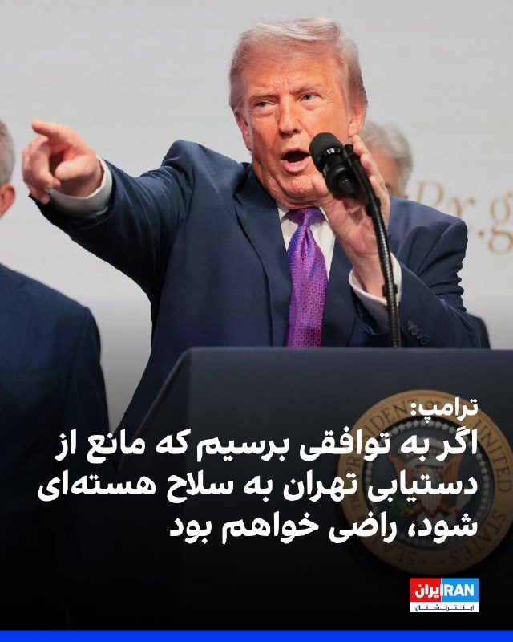

ترامپ در یک سخنرانی گفت اگر بتواند به توافقی با جمهوری اسلامی دست یابد که مانع از دستیابی تهران به سلاح هسته‌ای شود، بسیار راضی خواهد بود. او تاکید کرد که واشینگتن به تهران اجازه نخواهد داد که به سلاح هسته‌ای دست یابد.
ترامپ گفت: «ما اجازه نخواهیم داد ایران به سلاح هسته‌ای دست پیدا کند. بنابراین این سه کشور به همراه دیگران با من تماس گرفتند و آنها به طور مستقیم با نمایندگان ما و در حال حاضر با حکومت ایران در حال گفت‌وگو هستند و به نظر می‌رسد شانس بسیار خوبی وجود دارد که بتوانند به یک توافق برسند.»
او افزود: «اگر بتوانیم بدون اینکه آنها را به شدت بمباران کنیم به این نتیجه برسیم، بسیار خوشحال خواهم شد.»

‌🏁 🇬🇧 IranintlTV

🤖 @VahidOOnLine

## VahidOOnLine — post 240870

  

♦️یک مقام عراقی در گفتگو با نشریه انتخاب اعلام کرد که حدود ۵۰ درصد از کل حملات پهپادی انجام‌شده علیه کشورهای حوزه خلیج فارس، از داخل خاک عراق صورت گرفته است.
همزمان، المانیتور به نقل از یک منبع آگاه گزارش داد که مقامهای عربستان سعودی بر این باورند که تقریبا تمامی حملات پهپادی و موشکی اخیر به این کشور، به جای ایران، از خاک عراق نشات گرفته است؛ ارزیابی و تحلیلی که اکنون مورد تایید دولت دونالد ترامپ در واشنگتن نیز قرار دارد.
‌🇸🇦 Indypersian

🤖 @VahidOOnLine

## VahidOOnLine — post 240869

  

رییس پلیس سن‌دیگو اعلام کرد درپی تیراندازی در مرکز اسلامی سن‌دیگو سه مرد بزرگسال کشته شدند و مهاجمان مظنون نیز جان باخته‌اند. پلیس گفت این حمله به عنوان یک جرم ناشی از نفرت در نظر گرفته شده است.
‌🏁 🇬🇧 IranintlTV

🤖 @VahidOOnLine

## VahidOOnLine — post 240868

  <a href="telegram/content/VahidOOnLine_240868_1779142017.mp4" target="_blank">🎬 Download video</a>

تماسی از ایران:
«می‌گفت دست همدیگه رو ول نکنیم، حتی وقتی خودمون هم سختی داریم. همدلی اگر نباشه، هیچ‌چیز درست نمی‌شه»
‌🏁 🇬🇧 ManotoTV

🤖 @VahidOOnLine

## VahidOOnLine — post 240867

  <a href="telegram/content/VahidOOnLine_240867_1779142019.mp4" target="_blank">🎬 Download video</a>

رسانه‌های داخل ایران گزارش دادند پدافند هوایی اصفهان فعال شده است.

تاکنون مقام‌های جمهوری اسلامی توضیحی درباره علت فعال شدن پدافند هوایی در اصفهان ارائه نکرده‌اند.
‌🏁 🇬🇧 ManotoTV

🤖 @VahidOOnLine

## VahidOOnLine — post 240866

  

کانال تلگرامی دانشجویان متحد اعلام کرد که امیرحسین شیخ محمدی، دانشجوی دامپزشکی دانشگاه آزاد واحد کرج، صبح دوشنبه ۲۸ اردیبهشت بازداشت شده است.

هیچ اطلاعاتی درباره اتهام‌های احتمالی مطرح شده علیه این دانشجو و محل نگهداری او منتشر نشده است.
‌🏁 🇬🇧 IranintlTV

🤖 @VahidOOnLine

## mwarmonitor — post 9286

نصف امکانات ایران اینترنشنال داشتم الان به جای باراک راوید من شماره ترامپ داشتم

## mwarmonitor — post 9285

🔹خبرنگار: آقای رئیس‌جمهور، یک سوال در ادامه بحث ایران. کشورهای دیگه هم قبلاً این کار رو کردن؛ اون‌ها از شما خواستن که مسیرتون رو تغییر بدید تا یک توافق صلح رو جلوی پاتون بذارن و می‌گفتن که توافقی در راهه. اما هیچ‌چیز به نتیجه نرسیده. شما اشاره کردید که این بار فرق می‌کنه...
🔸دونالد ترامپ: خب، خیلی چیزها به نتیجه رسیده. ما کشوری رو که قرار بود سلاح هسته‌ای داشته باشه گرفتیم و... عملاً ارتشش رو نابود کردیم؛ اون‌ها نیروی دریایی ندارن، نیروی هوایی ندارن، اون‌ها از نظر نظامی عملاً نابود شدن. این خیلیه، این دستاورد بزرگیه. ما همین الان هم می‌تونیم اونجا رو ترک کنیم و ۲۵ سال طول می‌کشه تا خودشون رو بازسازی کنن. آخرین چیزی که بهش فکر می‌کنن، به نظر من، موضوع هسته‌ایه. حالا باید این رو به صورت مکتوب دربیارن. اما وقتی می‌گید «هیچ‌چیز»، ما... ما کاملاً ارتششون رو نابود کردیم. ببخشید، از سی‌ان‌ان (CNN)... ما کاملاً ارتششون رو نابود کردیم، رهبری‌شون رو نابود کردیم. همون‌طور که می‌دونید، رهبرانشون از بین رفتن؛ رهبرانشون در سطح اول و سطح دوم از بین رفتن، الان داریم با نصفِ سطح سوم سر و کله می‌زنیم. و فکر می‌کنم ما به پیشرفت‌های زیادی دست پیدا کردیم.

@mwarmonitor

## mwarmonitor — post 9284

  <a href="telegram/content/mwarmonitor_9284_1779142020.mp4" target="_blank">🎬 Download video</a>

🎬 Video

## mwarmonitor — post 9283

🔴سناتور لیندسی گراهام:

🔰همان‌طور که پیش‌تر گفته‌ام، هر توافقی که میان ایالات متحده آمریکا و ایران حاصل شود، باید برای تصویب به کنگره آمریکا ارائه گردد؛ همان‌گونه که در مورد برجام در دوران ریاست‌جمهوری باراک اوباما انجام شد.

🔹اگر بتوانیم از طریق راه‌های دیپلماتیک و در عین تحقق اهداف امنیت ملی‌مان به این درگیری پایان دهیم، این یک دستاورد بزرگ خواهد بود.

🔸همان‌طور که پیش‌تر نیز گفته‌ام، موضع دونالد ترامپ روشن است:

➡️ عدم غنی‌سازی
➡️ کنترل آمریکا بر حدود ۹۰۰ پوند اورانیوم با غنای بالا
➡️ بازگشایی تنگه هرمز بدون هرگونه مداخله از سوی ایران
➡️ ایران باید برنامه موشک‌های بالستیک دوربرد خود و هرگونه تلاش برای دستیابی به سلاح هسته‌ای را کنار بگذارد
➡️ ایران باید حمایت از تمامی نیروهای نیابتی تروریستی در منطقه را متوقف کند

🔸اما اینکه بگویم نسبت به این‌که ایران واقعاً با موارد لازم برای ایجاد توافقی که به‌طور اساسی با برجام متفاوت باشد موافقت خواهد کرد، یا وارد توافقی شود که در گذر زمان پایدار بماند، تردید دارم—کم‌گویی کرده‌ام.

زمان نشان خواهد داد.

@mwarmonitor

## mwarmonitor — post 9282

🔹خبرنگار: کمی در مورد پستی که در «تروث سوشال» (Truth Social) درباره ایران گذاشتید توضیح بدید و بگید چه تصمیمی باعث شد که چرا به اون‌ها حمله نکردید؟
🔸دونالد ترامپ: خب، کشورهای دیگه پیش من اومدن و گفتن که «ما داشتیم برای یک حمله بسیار بزرگ برای فردا آماده می‌شدیم.» من اون رو برای مدت کوتاهی به تعویق انداختم، امیدوارم که شاید برای همیشه باشه، اما احتمالاً برای یک مدت کوتاه.
چون ما گفتگوهای بسیار بزرگی با ایران داشتیم و خواهیم دید که نتیجه این گفتگوها چی میشه. از ما توسط عربستان سعودی، قطر، امارات متحده عربی و برخی کشورهای دیگه درخواست شد که اگر بتونیم این کار رو برای دو یا سه روز—یک مدت زمان کوتاه—به تعویق بندازیم، چون اون‌ها فکر می‌کنن که دارن به توافق خیلی نزدیک میشن.
و اگر بتونیم کاری کنیم که هیچ سلاح هسته‌ای به دست ایران نیفته، فکر می‌کنم اگر اون‌ها راضی باشن، ما هم احتمالاً راضی خواهیم بود.
ما به اسرائیل اطلاع دادیم، به افراد دیگه‌ای در خاورمیانه که با ما در ارتباط بودن هم اطلاع دادیم و می‌دونید، این یک تحول بسیار مثبت هست؛ اما باید ببینیم که آیا نتیجه‌ای خواهد داشت یا نه. ما دوره‌های زمانی دیگه‌ای هم داشتیم که فکر می‌کردیم به توافق خیلی نزدیک شدیم و... کارساز نشد، اما این یکی کمی متفاوته.
ما واقعاً فردا آماده یک اقدام بسیار بزرگ بودیم و این چیزی نبود که من مایل به انجامش باشم، اما چاره دیگه‌ای نداریم؛ چون ما نمی‌تونیم اجازه بدیم ایران به سلاح هسته‌ای دست پیدا کنه.

@mwarmonitor

## mwarmonitor — post 9281

  <a href="telegram/content/mwarmonitor_9281_1779142022.mp4" target="_blank">🎬 Download video</a>

🎬 Video

## mwarmonitor — post 9280

📝 ترامپ رسماً دنیا را گذاشته روی ویبره و در این میان، مردم ایران هم به جای زندگی، دارند روی تردمیلِ اضطرابِ ملی دو می‌زنند! تصور کن ارتش آمریکا با مدرن‌ترین تجهیزات میلیارد دلاری و خلبان‌های دست‌به‌ماشه، منتظر شمارش معکوسند که ناگهان ترامپ بعد از یک لیوان نوشابه رژیمی گوشی را برمی‌دارد و می‌نویسد: «بچه‌ها کنسل شد! محمد و تمیم زنگ زدند، خیلی باادب بودند، فعلاً نزنید؛ ولی پوتین‌ها را درنیاورید که شاید نیم‌ساعت دیگر نظرم عوض شد!» این وسط، ۸۵ میلیون ایرانی که سال‌هاست با فرمول «دلار، سکه، سایه جنگ» زندگی می‌کنند، گوشت قربانی این مودی املاکی هستند؛ مردمی که باید هر ثانیه صفحه ترامپ را رفرش کنند تا ببینند فردا قرار است بروند سر کار یا بروند پناهگاه! دیپلماسی او دقیقاً شبیه تعارف‌های شاه‌عباسی شده؛ ملت را تا دقیقه ۹۹ به لبه نابودی می‌برد، سکته چشمی و قلبی را به بالاترین حد می‌رساند، بازار بورس و نفت را ویبره می‌دهد، و بعد در نقش منجی صلح‌طلب ظاهر می‌شود تا همه نفس راحت بکشند و بگویند «دمت گرم که امروز ما را نکشتی!» قضیه وقتی سیاه‌تر می‌شود که می‌بینی سرنوشت، آینده و حتی قیمت پیاز در ایران، به میزان کیفیت خوابِ دیشبِ یک پیرمرد مو نارنجی در فلوریدا گره خورده است؛ پیرمردی که مرز بین جنگ تمام‌عیار و صلح جهانی در ذهنش، به اندازه یک ویبره گوشی و یک توییت نصفه‌شبی فاصله دارد!

@mwarmonitor

## pm_afshaa — post 91003

  <a href="telegram/content/pm_afshaa_91003_1779142024.webm" target="_blank">🎬 Download video</a>

🔴ترامپ: ایران نهایتا 3 روز زمان داره. 
💧 Rainbet.com the #1 Non-KYC Crypto Casino & Sportsbook @rainbetcom 
😁 @Pm_Afshaa

## pm_afshaa — post 91002

  <a href="telegram/content/pm_afshaa_91002_1779142024.webm" target="_blank">🎬 Download video</a>

🔴ترامپ: ما حملات رو فقط برای 2-3 روز تعویق انداختیم تا ببینیم چه میشه! 
💧 Rainbet.com the #1 Non-KYC Crypto Casino & Sportsbook @rainbetcom 
😁 @Pm_Afshaa

## pm_afshaa — post 91001

  <a href="telegram/content/pm_afshaa_91001_1779142025.webm" target="_blank">🎬 Download video</a>

🔴ترامپ: ما در حال آماده شدن برای حمله گسترده به ایران در روز سه شنبه بودیم، اما من آن را برای یک دوره کوتاه و شاید برای همیشه، اما به احتمال زیاد برای یک دوره کوتاه به تعویق انداختم.

💧 Rainbet.com the #1 Non-KYC Crypto Casino & Sportsbook @rainbetcom

😁 @Pm_Afshaa

## pm_afshaa — post 91000

  <a href="telegram/content/pm_afshaa_91000_1779142025.webm" target="_blank">🎬 Download video</a>

🔴دونالد ترامپ:
به نظر میرسه شانس بسیار خوبی برای رسیدن به توافق وجود داره؛ اگر بتونیم بدون بمباران این کار رو انجام بدیم، خوشحال میشم.

💧 Rainbet.com the #1 Non-KYC Crypto Casino & Sportsbook @rainbetcom

😁 @Pm_Afshaa

## pm_afshaa — post 90999

  <a href="telegram/content/pm_afshaa_90999_1779142026.webm" target="_blank">🎬 Download video</a>

🔴ترامپ: ما حملات رو فقط برای 2-3 روز تعویق انداختیم تا ببینیم چه میشه!

💧 Rainbet.com the #1 Non-KYC Crypto Casino & Sportsbook @rainbetcom

😁 @Pm_Afshaa

## pm_afshaa — post 90998

  

💢علی قلهکی، ‏فعال رسانه‌ای:
ترامپ شنبه‌ شب قصد حمله داشت که صبحش قطر به ایران هشدار داد و سران نظام رفتن مخفی شدن و علت عدم حمله پیدا نکردن لوکیشن سران نظام بوده.

💧 Rainbet.com the #1 Non-KYC Crypto Casino & Sportsbook @rainbetcom

😁 @Pm_Afshaa

## pm_afshaa — post 90997

  <a href="telegram/content/pm_afshaa_90997_1779142027.webm" target="_blank">🎬 Download video</a>

🔴مقام امنیتی اسرائیلی به کانال 12:
در کابینه همه از دست ترامپ کلافه شدیم

💧 Rainbet.com the #1 Non-KYC Crypto Casino & Sportsbook @rainbetcom

😁 @Pm_Afshaa

## IranIntlTV — post 337847

  

ترامپ در یک سخنرانی گفت اگر بتواند به توافقی با جمهوری اسلامی دست یابد که مانع از دستیابی تهران به سلاح هسته‌ای شود، بسیار راضی خواهد بود. او تاکید کرد که واشینگتن به تهران اجازه نخواهد داد که به سلاح هسته‌ای دست یابد.
ترامپ گفت: «ما اجازه نخواهیم داد ایران به سلاح هسته‌ای دست پیدا کند. بنابراین این سه کشور به همراه دیگران با من تماس گرفتند و آنها به طور مستقیم با نمایندگان ما و در حال حاضر با حکومت ایران در حال گفت‌وگو هستند و به نظر می‌رسد شانس بسیار خوبی وجود دارد که بتوانند به یک توافق برسند.»
او افزود: «اگر بتوانیم بدون اینکه آنها را به شدت بمباران کنیم به این نتیجه برسیم، بسیار خوشحال خواهم شد.»

https://iranintl.com/202605189314

## IranIntlTV — post 337846

مراد ویسی، تحلیل‌گر ارشد ایران‌اینترنشنال، گفت: «مردم ایران از ترامپ انتظار دارند به مذاکرات طولانی با جمهوری اسلامی پایان دهد. مذاکراتی که به باور آنها نه رفتار حکومت را تغییر داده و نه مانع سرکوب داخلی و تنش‌آفرینی منطقه‌ای شده است. ادامه این مذاکرات به معنای دادن فرصت و تنفس سیاسی به جمهوری اسلامی تلقی می‌شود.»
@iranintltv

## IranIntlTV — post 337845

  <a href="telegram/content/IranIntlTV_337845_1779142028.mp4" target="_blank">🎬 Download video</a>

بنیامین نتانیاهو در پی پاسخ تازه جمهوری اسلامی به پیشنهاد آمریکا برای پایان جنگ، نشست امنیتی با حضور وزیران و مشاوران ارشدش برگزار می‌کند. هم‌زمان ترامپ در تماس با نتانیاهو گفته زمان برای جمهوری اسلامی رو به پایان است.
@iranintltv

## IranIntlTV — post 337844

  <a href="telegram/content/IranIntlTV_337844_1779142029.mp4" target="_blank">🎬 Download video</a>

مراد ویسی، تحلیل‌گر ارشد ایران‌اینترنشنال، گفت: «برداشت فرماندهان سپاه این است که آمریکا و اسرائیل توان شکست نظامی جمهوری اسلامی را ندارند و تلاش می‌کنند از مسیر مذاکره امتیاز بگیرند. بنابراین تصور می‌کنند عدم عقب‌نشینی در مذاکرات، پیامد نظامی جدی نخواهد داشت. این باور فرماندهان سپاه می‌تواند ناشی از توهم پیروزی باشد، در حالی که حملات احتمالی آینده ممکن است کاملا متفاوت و گسترده‌تر باشد.»
@iranintltv

## IranIntlTV — post 337843

  <a href="telegram/content/IranIntlTV_337843_1779142031.mp4" target="_blank">🎬 Download video</a>

رویترز به نقل از سه مقام امنیتی و دو منبع دولتی از گسترش همکاری‌های پاکستان و عربستان سعودی در چارچوب یک پیمان دفاعی متقابل خبر داد. این پیمان، اعزام ۸ هزار نیروی نظامی، حدود ۱۶ فروند جنگنده جی‌اف-۱۷، دو اسکادران پهپادی و یک سامانه پدافند هوایی را شامل می‌شود.
@iranintltv

## IranIntlTV — post 337842

  <a href="telegram/content/IranIntlTV_337842_1779142032.mp4" target="_blank">🎬 Download video</a>

مراد ویسی، تحلیل‌گر ارشد ایران‌اینترنشنال، گفت: «ترامپ می‌گوید حمله برنامه‌ریزی شده روز سه‌شنبه به جمهوری اسلامی را به درخواست رهبران امارات، عربستان و قطر به تعویق انداخته تا یک شانس دیگر به توافق داده شود. ترامپ گفته ارتش آمریکا آماده است در صورت عدم توافق حمله را بی‌درنگ شروع کند.»
@iranintltv

## IranIntlTV — post 337841

  

رییس پلیس سن‌دیگو اعلام کرد درپی تیراندازی در مرکز اسلامی سن‌دیگو سه مرد بزرگسال کشته شدند و مهاجمان مظنون نیز جان باخته‌اند. پلیس گفت این حمله به عنوان یک جرم ناشی از نفرت در نظر گرفته شده است.
https://iranintl.com/202605188629

## IranIntlTV — post 337840

  <a href="telegram/content/IranIntlTV_337840_1779142034.mp4" target="_blank">🎬 Download video</a>

دونالد ترامپ اعلام کرد به درخواست رهبران منطقه، برنامه حمله به مواضع جمهوری اسلامی را که برای سه‌شنبه طراحی شده بود، متوقف کرده است.
او گفت رهبران منطقه معتقدند امکان دستیابی به توافق در آینده نزدیک وجود دارد.

گزارش نیلوفر منصوری، خبرنگار ایران‌اینترنشنال
@iranintltv

## IranIntlTV — post 337839

  

کانال تلگرامی دانشجویان متحد اعلام کرد که امیرحسین شیخ محمدی، دانشجوی دامپزشکی دانشگاه آزاد واحد کرج، صبح دوشنبه ۲۸ اردیبهشت بازداشت شده است.

هیچ اطلاعاتی درباره اتهام‌های احتمالی مطرح شده علیه این دانشجو و محل نگهداری او منتشر نشده است.
https://iranintl.com/202605189606

## ManotoTV — post 105616

  <a href="telegram/content/ManotoTV_105616_1779142036.mp4" target="_blank">🎬 Download video</a>

تماسی از ایران:
«می‌گفت دست همدیگه رو ول نکنیم، حتی وقتی خودمون هم سختی داریم. همدلی اگر نباشه، هیچ‌چیز درست نمی‌شه»

## ManotoTV — post 105615

  <a href="telegram/content/ManotoTV_105615_1779142038.mp4" target="_blank">🎬 Download video</a>

رسانه‌های داخل ایران گزارش دادند پدافند هوایی اصفهان فعال شده است.

تاکنون مقام‌های جمهوری اسلامی توضیحی درباره علت فعال شدن پدافند هوایی در اصفهان ارائه نکرده‌اند.

## FarsiVOA — post 218097

🔺ترامپ اعلام کرد رهبران کشورهای عربی از او خواستند برای فرصت دادن به توافق «دو یا سه روز» حمله به جمهوری اسلامی را عقب بیاندازد

▪️دونالد ترامپ، رئیس‌جمهوری آمریکا، روز دوشنبه ۲۸ اردیبهشت، ساعاتی پس از آنکه اعلام کرد حمله روز سه‌شنبه به جمهوری اسلامی را متوقف کرده‌است، در این باره به خبرنگاران توضیحاتی داد.

⬇️ بیشتر بخوانید:
https://ir.voanews.com/a/8151362.html
@FarsiVOA

## Persian_Trend_Official — post 14461

  <a href="telegram/content/Persian_Trend_Official_14461_1779142039.webm" target="_blank">🎬 Download video</a>

تیراندازی در یک مرکز اسلامی در آمریکا 🔸رسانه‌ها روز دوشنبه از حضور یک فرد مسلح و تیراندازی در مرکز اسلامی سن دیگو خبر می‌دهند. 🔹پلیس سن دیگو از مردم خواست که از حضور در این منطقه خودداری کنند. ☆Phantom☆ 📌 @persian_trend_official پرشین ترند | متفاوت‌ترین…

## Persian_Trend_Official — post 14460

  

🔺فرمانده قرارگاه مرکزی خاتم‌الانبیا: به آمریکا و همپیمانان آن اعلام می‌داريم، دوباره مرتکب اشتباه راهبردی و خطای محاسباتی نشوند.

🔹سرلشکر پاسدار خلبان علی عبدالهی: آنها باید بدانند ایران اسلامی و نیروهای مسلح آن نسبت به گذشته آماده تر و قوی تر، دست بر ماشه هستند و هرگونه تعرض و تجاوز مجددی از سوی دشمنان سرزمین و ملت سربلند را سریع، قاطع، پرقدرت و گسترده پاسخ خواهند داد.

🔹دشمنان آمریکایی اسرائیلی بارها ملت شجاع ایران و نیروهای مسلح مقتدر آن را آزموده اند.

🔹ما با عظم و اراده الهی ثابت کرده ایم که اقتدار و توانایی خود را در میدان عمل به دشمنان نشان می دهیم و چنانچه خطای دیگری از سوی دشمنانمان سربزند با قدرت و توانایی به مراتب بالاتر از جنگ تحمیلی رمضان با آن برخورد خواهیم نمود و با تمام توان از حقوق ملت ایران دفاع می کنیم و دست هر متجاوزی را قطع می نمائیم.

☆Phantom☆

📌 @persian_trend_official
پرشین ترند | متفاوت‌ترین کانال نظامی

## IranianMinds — post 20367

  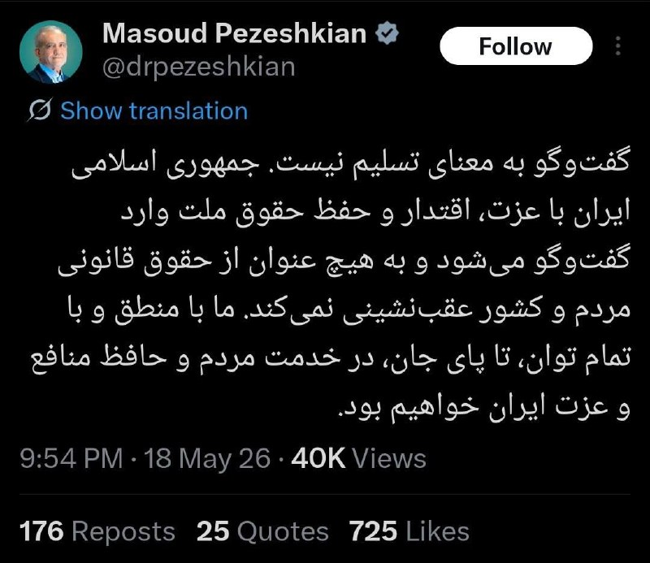

چیشده شل شدین ؟

🔴 پزشکیان :

گفتگو به معنای تسلیم نیست؛
جمهوری‌اسلامی ایران با عزت و اقتدار وارد گفتگو میشه و از حقوق خودش عقب‌نشینی نمیکنه.

@IranianMinds

## BBCPersian — post 281404

  

‌ ‌ ‌
خبرگزاری هرانا، ارگان خبری مجموعه فعالان حقوق بشر، می‌گوید از زمان شروع جنگ اخیر تا هفته گذشته، دست‌کم ۴۰۲۳ بازداشت را در ایران ثبت کرده است.

به گفته این نهاد که مقرش در آمریکاست، اتهام‌های مطرح‌شده شامل جاسوسی، تهدید علیه امنیت ملی و ارتباط یا ارسال مطالب مربوط به جنگ به رسانه‌های خارجی است.

بنابر این گزارش، مقام‌های ایران از جنگ «برای تشدید روایت‌های امنیتی و توجیه بازداشت‌ها، محدودیت آزادی بیان و اعمال خشونت علیه غیرنظامیان استفاده کرده‌اند.»

احمدرضا رادان، فرمانده کل نیروی انتظامی، دیروز گفت از آغاز جنگ اخیر «بیش از ۶۵۰۰ نفر از وطن‌فروشان و جاسوسان دستگیر شده‌اند که ۵۶۷ نفر از آنان مرتبط با گروهک‌های ضدانقلاب و عناصر نفاق بودند.»

او درباره اعتراضات دی‌ماه گفت: «هیچ‌گونه رهاسازی انجام نشده و همچنان در حال شناسایی و دستگیری این افراد هستیم.»

هزاران نفر در اعتراضات سراسری دی بازداشت شده‌اند و رئیس قوه قضائیه خواستار رسیدگی سریع و بدون اغماض به پرونده آنها شده است.

https://bbc.in/4fzVJR8
📷 EPA/Shutterstock
@BBCPersian

## BBCPersian — post 281403

🔻 شهردار سن دیگو: به همشهریان مسلمان اطمینان می‌دهم که هیچ کمکی دریغ نخواهد شد

تاد گلوریا، شهردار سن‌دیگو، گفت از این که کودکانی که هنگام حمله در مدرسه مشغول تحصیل بودند، در امان مانده‌اند، سپاسگزار است.

او ادامه داد: «برای جامعه مسلمانان محلی، دعاهای من با شماست.»

آقای گلوریا گفت می‌خواهد به جامعه مسلمانان اطمینان دهد که «هیچ منبعی دریغ نخواهد شد» تا امنیت آن‌ها در برابر خشونت تامین شود.

او همچنین از نیروهای پلیس «عمیقا قدردانی» کرد و این حادثه را «وضعیتی غم‌انگیز» توصیف کرد.

شهردار سن‌دیگو همچنین به خانواده قربانیان تسلیت گفت و افزود بازرسان «هر اقدام لازم» را برای روشن شدن ابعاد حادثه انجام خواهند داد.

او تاکید کرد: «نفرت جایی در شهر سن‌دیگو ندارد.»

https://bbc.in/3PuRJqw
@BBCPersian

## BBCPersian — post 281402

🔻 فعال شدن پدافند هوایی در اصفهان

گزارش‌ها از ایران حاکی از شنیده شدن صدای پدافند در شهر اصفهان است.

خبرگزاری مهر هم با تایید این گزارش‌ها نوشته:‌ «هنوز مسئولان توضیحی در رابطه با چرایی فعالیت پدافند اصفهان ارائه نکرده‌اند.»

پیش از این گزارش‌هایی از فعال شدن پدافند جزیره قشم هم منتشر شده بود که خبرگزاری تسنیم گفته بود برای مقابله با «ریز پرنده‌ها» بوده است.

https://bbc.in/4wyq493
@BBCPersian

## BBCPersian — post 281401

🔻 حمله به مسجد جامع سن دیگو؛‌ پلیس تیراندازی را تحت عنوان «جنایت ناشی از نفرت» بررسی می‌کند

اسکات وال، رئیس پلیس سن‌دیگو، گفت حادثه رخ‌داده در مرکز اسلامی در حال حاضر به عنوان «جنایت ناشی از نفرت (تروریسم داخلی)» بررسی می‌شود و پلیس همکاری نزدیکی با اف‌بی‌آی دارد.

مارک رمیلی، مامور ویژه اف‌بی‌آی، نیز در ادامه گفت سه مرد بزرگسال که در تیراندازی هدف قرار گرفته بودند، جان باخته‌اند.

او افزود مرگ دو مظنون، که هر دو نوجوان بودند، تایید شده است.

آقای رمیلی گفت اف‌بی‌آی با «دقت کامل» در حال بررسی ابعاد حادثه است و همه منابع خود را برای روشن شدن جزئیات این حمله به کار گرفته است.

او همچنین از مردم خواست هرگونه اطلاعاتی را که می‌تواند به روند تحقیقات کمک کند، در اختیار مقام‌ها قرار دهند.

https://bbc.in/49apwMr
@BBCPersian

## BBCPersian — post 281400

🔻 تیراندازی در مسجد جامع سن‌دیگو؛ پلیس: جسد دو نوجوان در خودرو پیدا شد که احتمالا تیراندازها هستند

رئیس پلیس سن‌دیگو اعلام کرد دو مردی که در نزدیکی محل حادثه جان باخته پیدا شدند، به احتمال زیاد مظنونان تیراندازی هستند.

مقام‌ها گفتند اجساد این دو نوجوان پسر داخل یک خودرو در نزدیکی مسجد پیدا شده است.

رئیس پلیس همچنین گفت دو مظنون، که گفته می‌شود هر دو نوجوان بودند، داخل یک خودرو با جراحاتی ناشی از شلیک به خود پیدا شدند.

اسکات وال، رئیس پلیس سن‌دیگو، گفت: «جزئیات اتفاقات منتهی به این حادثه، آنچه دقیقا رخ داده و زمان دقیق وقوع آن، در روزهای آینده روشن خواهد شد.»

رئیس پلیس گفت ماموران در ساعت ۱۱:۴۳ به وقت محلی به محل حادثه اعزام شدند و «در مقابل محل، با آنچه به نظر می‌رسید سه قربانی جان‌باخته باشند» روبه‌رو شدند.

او افزود نیروهای بیشتر پلیس ظرف چهار دقیقه به محل رسیدند.

به گفته او، «تقریبا همزمان، تماس‌هایی از چند خیابان آن‌طرف‌تر دریافت کردیم که از ادامه تیراندازی فعال خبر می‌داد.»

https://bbc.in/4nAIJwT
@BBCPersian

## BBCPersian — post 281399

🔻 تیراندازی در مسجد جامع سن دیگو؛ پلیس: سه نفر کشته شدند و دو مظنون هم «کشته شده‌اند»

ساعتی بعد از تیراندازی در مسجد جامع سن‌دیگو، اسکات وال، رئیس پلیس این شهر، در حال گفت‌وگو با رسانه‌هاست.

او گفت در حال حاضر هیچ تهدید دیگری در منطقه وجود ندارد و دو مظنون «کشته شده‌اند».

رئیس پلیس همچنین افزود سه بزرگسال در مرکز اسلامی جان باخته‌اند.

او گفت: «قلب ما با خانواده‌هایی است که در این لحظه در حال مطلع شدن از اتفاقی هستند که برای عزیزانشان رخ داده است.»

مقام‌های پلیس هم اکنون در حال دادن آخرین اطلاعات به خبرنگاران هستند. با ما باشید تا جزییات بیشتر را همزمان برایتان گزارش کنیم.

https://bbc.in/4wsKH6m
@BBCPersian

## BBCPersian — post 281398

🔻 تیراندازی در مسجد جامع سن دیگو؛ با انتقال مجروحان، مراکز درمانی سن دیگو در وضعیت فوق‌العاده قرار گرفتند

سخنگوی شبکه درمانی «شارپ هلث‌کر» به بی‌بی‌سی گفت بیمارستان «شارپ مموریال» این شبکه در حال پذیرش مجروحان مرتبط با تیراندازی است.

آلیشیا کوک، سخنگوی این مرکز درمانی، گفته است: «گزارش‌ها حاکی از آن است که چندین نفر زخمی شده‌اند.»

او افزود: «پروتکل‌های وضعیت بحرانی ما فعال شده و در حال هماهنگی با شهرستان سن‌دیگو و دیگر نهادها برای واکنش به این حادثه هستیم.»

تاد گلوریا، شهردار سن‌دیگو، اعلام کرد پلیس این شهر به او اطلاع داده که در حال حاضر هیچ تهدید ادامه‌داری متوجه جامعه نیست.

او در پیامی در شبکه‌های اجتماعی از نیروهای امدادی و ماموران پلیس «که به سرعت برای حفاظت از جان مردم و تامین امنیت منطقه واکنش نشان دادند» قدردانی کرد.

سن دیگو در جنوب کالیفرنیا و مرز این ایالت با مکزیک واقع شده است.

همچون لس‌آنجلس و حومه آن مانند منطقه اورنج کانتی، سن‌دیگو هم میزبان جامعه بزرگی از مهاجران ایرانی است.

https://bbc.in/4nHwkHC
@BBCPersian

## BBCPersian — post 281397

  

🔻چند سینماگر ایرانی اخیرا به دادسرای فرهنگ و رسانه در تهران احضار شده‌اند و اتهام «همکاری با دول متخاصم خارجی علیه جمهوری اسلامی» به آنها ابلاغ شده است.

هومن سیدی، بازیگر و فیلمساز، و سعید روستایی، کارگردان و تهیه‌کننده سینما، از جمله احضارشدگان هستند.

بی‌بی‌سی از مصداق اتهامات آنها اطلاع ندارد و معلوم نیست که آیا این احضارها به فعالیت‌های هنری آنها مربوط است یا به فعالیت‌های دیگر.

📷 AsrIran
https://bbc.in/3PomJIX
@BBCPersian

## BBCPersian — post 281396

🔻 تیراندازی در بزرگترین مسجد و مرکز اسلامی سن دیگو آمریکا

پلیس شهر سن دیگو - در جنوب کالیفرنیا - در واکنش به تیراندازی در بزرگترین مسجد این شهر وارد عمل شده است و مدرسه مجاور این مسجد را هم قرق کرده و همه دانش‌آموزان در وضعیت پناه گرفتن قرار گرفته‌اند.

یک شاهد عینی در گفت‌وگو با شبکه سی‌بی‌اس نیوز، شریک خبری بی‌بی‌سی در آمریکا، گفت صدای شلیک حدود ۳۰ گلوله را شنیده که به گفته او، به نظر می‌رسید از یک «سلاح نیمه‌خودکار» شلیک شده باشد.

او گفت ابتدا حدود ۱۲ گلوله شنیده، سپس وقفه‌ای کوتاه ایجاد شده و بعد دوباره احتمالا حدود ۱۲ گلوله دیگر شلیک شده است.

این مرد که بازنشسته است و هنگام حادثه در خانه مشغول خوردن ناهار بود، گفت با شماره اضطراری ۹۱۱ تماس گرفته و پلیس ظرف «پنج تا ۱۰ دقیقه» در محل حاضر شده است.

او افزود این مسجد در ایام تعطیلات بسیار شلوغ می‌شود.

این شاهد گفت: «خوشبختانه این اتفاق روز جمعه رخ نداد، چون خیابان‌ها پر از جمعیت می‌بود.»

این مرکز اسلامی، بزرگ‌ترین مسجد در شه سن‌دیگو به شمار می‌رود و بنا بر وب‌سایت آن، بیش از ۵ هزار عضو در جامعه مذهبی خود دارد.

این مجموعه همچنین شامل مدرسه «الرشید» است که دوره‌های آموزش دینی و زبان ارائه می‌کند.

بر اساس اطلاعات وب‌سایت این مرکز، ماموریت آن خدمت‌رسانی به جامعه مسلمانان و همچنین «همکاری با جامعه گسترده‌تر برای کمک به افراد کم‌برخوردار، آموزش و بهبود کشور» عنوان شده است.

https://bbc.in/49ampEf
@BBCPersian

## Dirty_Kids — post 389710

کونی که امشب تو صداوسیما به نمایش گذاشته شد

@Dirty_Kids 👻

## Dirty_Kids — post 389709

  <a href="telegram/content/Dirty_Kids_389709_1779142041.mp4" target="_blank">🎬 Download video</a>

صداوسیما امشب یکی رو کون لخت نشون داد...

@Dirty_Kids 👻

## Dirty_Kids — post 389708

  

هر تصمیمی که در خصوص روافض بخواد گرفته شه، چه جنگ احتمالی چه توافق احتمالی، دو سه هفته بیشتر فرصت برای انجامش نیست،

چرا که طبق گفته‌ی مدیر اجرایی آژانس بین‌المللی انرژی [IEA]، فقط چند هفته تا تموم شدن «ذخایر تجاری نفت» باقی مونده که در صورت تموم شدن ذخایر تجاری، قیمت نفت به مراتب افزایش پیدا می‌کنه که هیچ،

کشورها مجبور می‌شن برای کنترل بازار از «ذخایر نفت استراتژیک»‌شون استفاده کنن که خب خیلی مطلوب‌شون نیست،

این تنها کارت بازی که روافض در دست دارن و با فرسایشی کردن روند مذاکرات سعی دارن وضعیت رو تا جای ممکن کش بدن تا به نقطه‌ی بحرانی برسه،

از طرفی حمله‌ی محدود آمریکا هم جوابگوی جلوگیری از اون وضعیت بحرانی قیمت نفت نیست و آمریکا دو راه بیشتر پیش رو نداره:

یا باید با یک حمله‌ی همه‌جانبه و به مراتب پرقدرت‌تر از قبل چنان ضربه‌ای بزنه که تمام اهداف نظامی و بخش عمده‌ی زیرساخت‌های انرژی به منظور تسلیم کردن روافض از بین بره [که خب متأسفانه نامطلوب‌ترین حالت ممکن برای ساقط کردن این رژیم حرومیه و احتمالاً انجامش آخرین پلن شیر خدا از سر ناچاری باشه]،

و یا باید با رژیم روافض به توافق برسه که با توجه به روند فعلی هنوز نشونه‌ای از رسیدن به خواسته‌هایی که آمریکا اعلام کرده بود از جمله تحویل ۴۸۰ کیلوگرم اورانیوم و بازکردن تنگه‌ی هرمز و غیره نیست.

در حال حاضر و با توجه به فشار و هشداری که پاکستان قرمساق به رژیم روافض داده، درصدی امکان عقب‌نشینی از سمت برخی از سران روافض خدعه‌گر هست، حداقل از توئیت پوزیده این برداشت رو می‌شه کرد،

اما نکته اینجاست که رژیم شیعه‌سانان رافضی تیکه‌پاره‌تر این حرفاست که تصمیم‌گیری در این مورد در اختیار موجود چپ‌و‌چوله‌ای مثه پوزیده باشه،

بنابراین تا اعلام نظر هفت‌هشت گروه مختلف رژیم شیعه‌سانان که از دقایقی دیگه شروع به جفتک اندازی می‌کنن باید منتظر موند که آیا آخرین اتمام حجت شیر خدا برای تسلیم رژیم جواب می‌ده یا خیر.

@Dirty_Kids 👻

## Dirty_Kids — post 389707

  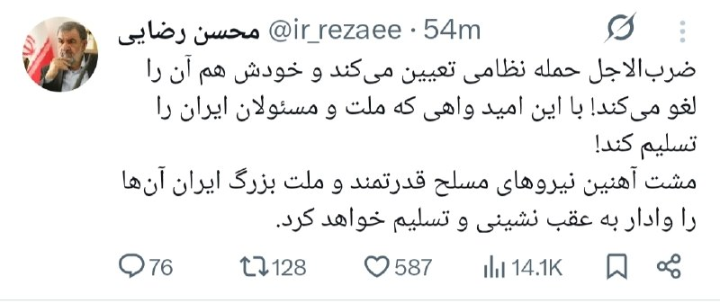

ژنرال محسن رضایی:
باز امریکارو شکست دادیم

همین که تو زنده‌ای، ارتقاع درجه پیدا کردی یعنی بزرگترین عملیات فریب امریکا با موفقیت انجام شده

@Dirty_Kids 👻

## manototv — post 105616

  <a href="telegram/content/manototv_105616_1779142043.mp4" target="_blank">🎬 Download video</a>

تماسی از ایران:
«می‌گفت دست همدیگه رو ول نکنیم، حتی وقتی خودمون هم سختی داریم. همدلی اگر نباشه، هیچ‌چیز درست نمی‌شه»

## manototv — post 105615

  <a href="telegram/content/manototv_105615_1779142045.mp4" target="_blank">🎬 Download video</a>

رسانه‌های داخل ایران گزارش دادند پدافند هوایی اصفهان فعال شده است.

تاکنون مقام‌های جمهوری اسلامی توضیحی درباره علت فعال شدن پدافند هوایی در اصفهان ارائه نکرده‌اند.

## alonews — post 120988

ترامپ سه روز بعد : بخاطر روی گل افغانستان یه ماه مهلت میدم [@AloTweet]

## alonews — post 120987

  <a href="telegram/content/alonews_120987_1779142045.webm" target="_blank">🎬 Download video</a>

👈ترامپ: ایران نهایتا ۳روز زمان داره

✅ @AloNews خبر جنگ

## alonews — post 120986

  <a href="telegram/content/alonews_120986_1779142045.mp4" target="_blank">🎬 Download video</a>

👈رئیس جمهور ترامپ در مورد ایران:
ما به کشوری که قرار بود سلاح هسته ای داشته باشد رفتیم و عملا ارتش آن را نابود کردیم.

🔴ما میتونیم همین الان بریم و 25 سال طول میکشه تا دوباره بسازن فکر کنم آخرین چیزی که اونا بهش فکر میکنن هسته ایه حالا بايد اينو به صورت کتبي بنويسن

🔴ما ارتش اونا رو کاملا نابود کرديم ما رهبری اونا رو نابود کردیم‌‌

✅ @AloNews خبر جنگ

## alonews — post 120985

  <a href="telegram/content/alonews_120985_1779142047.webm" target="_blank">🎬 Download video</a>

👈ترامپ:
ما با محاصره دریایی، دیوار فولادی دور ایران ساخته‌ایم

✅ @AloNews خبر جنگ

## alonews — post 120984

  <a href="telegram/content/alonews_120984_1779142047.mp4" target="_blank">🎬 Download video</a>

👈ترامپ به زن‌های داخل جمعیت :
- شما خیلی خوشگل و خوب به نظر میاید، شما دوتا، بیاید اینجا

✅ @AloNews خبر جنگ

## alonews — post 120983

  <a href="telegram/content/alonews_120983_1779142049.mp4" target="_blank">🎬 Download video</a>

👈رئیس جمهور ترامپ:
ارتش ما بزرگترین ارتش در هر نقطه از جهان است.

🔴من تازه چین رو ترک کردم و باید بگم که رئیس جمهور شی خیلی خیلی از ارتش ما تعریف کرد‌‌

✅ @AloNews خبر جنگ

## alonews — post 120982

  <a href="telegram/content/alonews_120982_1779142050.webm" target="_blank">🎬 Download video</a>

🔴فوری/پرزیدنت ترامپ :
ما به جمهوری اسلامی هیچ امتیازی نخواهیم داد. فقط تسلیم کامل!

✅ @AloNews خبر جنگ

## alonews — post 120981

  <a href="telegram/content/alonews_120981_1779142051.mp4" target="_blank">🎬 Download video</a>

👈خبرنگار: آیا آمریکایی‌ها باید نگران ابولا باشند؟

🔴پرزيدنت ترامپ: من نگران همه چیز هستم. فکر می‌کنم که در حال حاضر به آفریقا محدود شده است.

✅ @AloNews خبر جنگ

## alonews — post 120980

  <a href="telegram/content/alonews_120980_1779142052.webm" target="_blank">🎬 Download video</a>

👈ترامپ: به نظر میرسد شانس خوبی برای رسیدن به توافق با ایران وجود دارد‌‌

✅ @AloNews خبر جنگ

## alonews — post 120979

  <a href="telegram/content/alonews_120979_1779142052.webm" target="_blank">🎬 Download video</a>

👈ترامپ درباره «گفت‌وگوهای مهم» با ایران:
«این یک تحول بسیار مثبت است، اما خواهیم دید که آیا واقعاً به نتیجه‌ای می‌رسد یا نه.

🔴دوره‌هایی را داشته‌ایم که فکر می‌کردیم تقریباً به توافق نزدیک شده‌ایم، اما در نهایت موفق نشدیم؛ با این حال، این بار شرایط کمی متفاوت است.»

✅ @AloNews خبر جنگ

## alonews — post 120978

  <a href="telegram/content/alonews_120978_1779142052.webm" target="_blank">🎬 Download video</a>

👈ترامپ: اگر بتوانیم توافقی را منعقد کنیم که مانع دستیابی ایران به سلاح هست‌های شود ، از آن راضی خواهیم بود‌‌

✅ @AloNews خبر جنگ

## alonews — post 120977

  <a href="telegram/content/alonews_120977_1779142052.mp4" target="_blank">🎬 Download video</a>

👈ترامپ درباره ایران : من فعلاً عقب انداختمش، امیدوارم شاید برای همیشه، ولی شاید هم فقط برای یه مدت کوتاه
- چون با ایران مذاکرات خیلی مهمی داشتیم و باید ببینیم چی ازش درمیاد
- از من خواستن عربستان، قطر، امارات و چند کشور دیگه که اگه میشه این رو دو سه روز عقب بندازیم

✅ @AloNews خبر جنگ

## alonews — post 120976

  <a href="telegram/content/alonews_120976_1779142054.mp4" target="_blank">🎬 Download video</a>

👈ترامپ : ما داشتیم آماده می‌شدیم که فردا یه حمله خیلی بزرگ و جدی انجام بدیم

✅ @AloNews خبر جنگ

## alonews — post 120975

  <a href="telegram/content/alonews_120975_1779142056.mp4" target="_blank">🎬 Download video</a>

👈رئیس جمهور ترامپ می گوید که قیمت داروها را 400 ٪ ، 500 ٪ ، 600 ٪ و حتی 700 ٪ کاهش داده است

✅ @AloNews خبر جنگ

## alonews — post 120974

  <a href="telegram/content/alonews_120974_1779142057.webm" target="_blank">🎬 Download video</a>

👈تیراندازی فعال در مرکز اسلامی سن دیگو به نظر می‌رسد حمله‌ای وحشتناک باشد. 
🔴 تصاویر هلی‌کوپتر نشان می‌دهد جسدی در برکه‌ای از خون بیرون ساختمان افتاده است 
✅ @AloNews خبر جنگ

## alonews — post 120973

  <a href="telegram/content/alonews_120973_1779142057.webm" target="_blank">🎬 Download video</a>

👈قلهکی، ‏فعال رسانه ای حکومتی:
ترامپ «شنبه‌شب» قصد حمله داشت که صبح آن قطر به ایران هشدار داد. علت عدم حمله پیدا نکردن لوکیشن سران نظام بوده است.

✅ @AloNews خبر جنگ

## alonews — post 120972

  <a href="telegram/content/alonews_120972_1779142058.mp4" target="_blank">🎬 Download video</a>

👈شعار جدید رونمایی شد
‼️

🔴تندروهای خیابون امشب شعار مرگ بر "امارات" میدادن

✅ @AloNews خبر جنگ

## alonews — post 120971

  <a href="telegram/content/alonews_120971_1779142059.webm" target="_blank">🎬 Download video</a>

👈هاآرتص: مقامات اسرائیلی از دست ترامپ کلافه شده‌اند

✅ @AloNews خبر جنگ

## alonews — post 120970

  <a href="telegram/content/alonews_120970_1779142059.mp4" target="_blank">🎬 Download video</a>

واسه اولین بار تو تاریخ؛ صداوسیما امشب یکی رو کون لخت نشون داد...

@AloSport

---
📅 بروزرسانی: 1405/02/29 00:21
---

## VahidOOnLine — post 240865

  

عبدالقهار بلخی، سخنگوی وزارت خارجه طالبان، حملات پهپادی اخیر به «تاسیسات غیرنظامی» در امارات متحده عربی، به ویژه به نیروگاه هسته‌ای براکه را محکوم کرد.

او در شبکه اجتماعی ایکس نوشت که طالبان «نگرانی عمیق خود را از تشدید خشونت در منطقه ابراز می‌کند.»
‌🏁 🇬🇧 IranintlTV

🤖 @VahidOOnLine

## VahidOOnLine — post 240864

  

♦️خبرگزاری مهر دوشنبه شب ۲۸ اردیبهشت از فعال شدن پدافند هوایی در اصفهان خبر داد و اعلام کرد تا زمان انتشار این خبر، توضیحی درباره علت آن ارائه نشده است.
هم‌زمان، معاون سیاسی و امنیتی استاندار هرمزگان نیز فعال شدن پدافند هوایی در جزیره قشم را تایید کرد و گفت این اقدام پس از مشاهده «ریزپرنده‌ها» در آسمان قشم و برای مقابله با «اهداف متخاصم» انجام شده است.
‌🇸🇦 Indypersian

🤖 @VahidOOnLine

## VahidOOnLine — post 240863

  

رسانه‌های ایران شامگاه دوشنبه از فعال شدن پدافند هوایی در اصفهان خبر دادند.

تا زمان انتشار این خبر توضیحی درباره علت فعال شدن پدافند ارائه نشده است.
پیش‌تر خبرگزاری تسنیم نوشت: «پس از مشاهده ریزپرنده‌ها در آسمان جزیره قشم، پدافند برای نابودی اهداف متخاصم فعال شد.»
‌🏁 🇬🇧 IranintlTV

🤖 @VahidOOnLine

## VahidOOnLine — post 240862

  

آنا کلی، معاون سخنگوی کاخ سفید، در گفت‌وگو با فاکس نیوز اعلام کرد که جمهوری اسلامی اجازه نخواهد داشت اورانیوم غنی‌شده در اختیار داشته باشد و این موضوع خط قرمز دونالد ترامپ در مذاکرات است.

او گفت: «تهران نه‌تنها نباید به سلاح هسته‌ای دست پیدا کند، بلکه باید مواد غنی‌شده را نیز تحویل دهد.»

کلی افزود که ترامپ معتقد است جمهوری اسلامی به‌خوبی می‌داند که او در تهدیدهایش بلوف نمی‌زند و عملیات‌های اخیر نشان داده واشینگتن در اجرای تهدیدات خود جدی است.
‌🏁 🇬🇧 IranintlTV

🤖 @VahidOOnLine

## VahidOOnLine — post 240861

  

♦️شبکه خبری آی۲۴نیوز گزارش داد بنیامین نتانیاهو، نخست‌وزیر اسرائیل، روز دوشنبه ۲۸ اردیبهشت، دومین جلسه محدود کابینه امنیتی خود را ظرف ۲۴ ساعت گذشته برگزار کرده است. مقامات اسرائیلی با اشاره به وضعیت «آماده‌باش کامل» اعلام کرده‌اند که کشور خود را برای تصمیم احتمالی رئیس‌جمهوری دونالد ترامپ درباره گام‌های بعدی در قبال تهران و احتمال ازسرگیری جنگ با ایران تا پایان هفته جاری آماده می‌کنند.
این نشست‌های فشرده پی‌درپی پس از گفتگوهای تلفنی ۳۰ دقیقه‌ای روز یکشنبه نتانیاهو و ترامپ صورت می‌گیرد. بر اساس گزارش منابع آگاه، ترامپ در این تماس نخست‌وزیر اسرائیل را در جریان جزئیات سفر اخیر خود به چین قرار داده، اما این گفتگو به راه‌حل مشخصی برای مسیر پیش‌رو منجر نشده است؛ با این حال، هماهنگی‌های فشرده میان اورشلیم و واشنگتن برای تمامی سناریوهای ممکن در آستانه آنچه مقامات آن را «لحظه حقیقت» می‌نامند، ادامه دارد.
‌🇸🇦 Indypersian

🤖 @VahidOOnLine

## VahidOOnLine — post 240859

  <a href="telegram/content/VahidOOnLine_240859_1779137469.mp4" target="_blank">🎬 Download video</a>

دونالد ترامپ، رئیس‌جمهوری آمریکا، در پیامی در شبکه اجتماعی تروث سوشال نوشت:

««امیر قطر، تمیم بن حمد آل ثانی، ولیعهد عربستان سعودی، محمد بن سلمان آل سعود، و رئیس امارات متحده عربی، محمد بن زاید آل نهیان، از من خواسته‌اند حمله نظامی برنامه‌ریزی‌شده‌مان علیه جمهوری اسلامی ایران را که قرار بود فردا انجام شود، متوقف کنم؛ زیرا اکنون مذاکرات جدی در جریان است و به اعتقاد آن‌ها، به‌عنوان رهبران بزرگ و متحدان ما، توافقی حاصل خواهد شد که برای ایالات متحده آمریکا، همه کشورهای خاورمیانه و فراتر از آن بسیار قابل قبول خواهد بود.

این توافق، مهم‌تر از همه، شامل این خواهد بود که ایران هیچ سلاح هسته‌ای نداشته باشد!

بر اساس احترامم به رهبران یادشده، به وزیر جنگ، پیت هگست، رئیس ستاد مشترک نیروهای مسلح، ژنرال دنیل کین، و ارتش ایالات متحده دستور داده‌ام که حمله برنامه‌ریزی‌شده به ایران را فردا انجام ندهند؛ اما همزمان به آن‌ها دستور داده‌ام در صورتی که توافق قابل قبولی حاصل نشود، برای اجرای یک حمله کامل و گسترده علیه ایران، در هر لحظه آماده باشند.»
‌🏁 🇬🇧 ManotoTV

🤖 @VahidOOnLine

## VahidOOnLine — post 240858

  <a href="telegram/content/VahidOOnLine_240858_1779137470.mp4" target="_blank">🎬 Download video</a>

‌
خبرگزاری‌های داخل ایران گزارش دادند پدافند هوایی قشم شامگاه دوشنبه فعال شده است. مقام‌های جمهوری اسلامی توضیحی درباره علت فعالیت پدافند هوایی در این جزیره ارائه نکرده‌اند.
‌🏁 🇬🇧 ManotoTV

🤖 @VahidOOnLine

## VahidOOnLine — post 240855

  <a href="telegram/content/VahidOOnLine_240855_1779137470.mp4" target="_blank">🎬 Download video</a>

تجمع ایرانیان در لیسبون مقابل سفارت نروژ؛ اعتراض به دیدار سیاستمداران نروژی با جمهوری اسلامی
‌🏁 🇬🇧 ManotoTV

🤖 @VahidOOnLine

## VahidOOnLine — post 240854

  

♦️اطرافیان حامد تیزرویان، عکاس و کارشناس محیط‌زیست اهل مازندران، به ایندیپندنت فارسی خبر دادند که او از ۱۴ اردیبهشت‌ماه به دست ماموران اداره اطلاعات ساری بازداشت شده و از آن زمان در زندان این شهر نگهداری می‌شود.

بر اساس اطلاعات رسیده به ایندیپندنت فارسی، انتقادهای حامد تیزرویان در صفحه اینستاگرامش از مقام‌های جمهوری اسلامی، به‌ویژه در ارتباط با سرکوب و کشتار تاریخی معترضان در جریان انقلاب ملی ایرانیان، دلیل اصلی بازداشت او بوده است. به گفته منابع مطلع، در جلسه بازپرسی نیز اتهام «اجتماع و تبانی علیه امنیت ملی» به او تفهیم شده است.

حامد تیزرویان دانشجوی مقطع دکتری مهندسی محیط‌زیست با گرایش تنوع زیستی در دانشگاه بهشتی تهران است و در سال‌های اخیر نقش مهمی در راه‌اندازی و پیشبرد کمپین‌های اجتماعی برای حفاظت از جنگل‌های هیرکانی مازندران و حیات‌وحش این منطقه ایفا کرده است.
‌🇸🇦 Indypersian

🤖 @VahidOOnLine

## VahidOOnLine — post 240853

  

♦️خبرگزاری تسنیم وابسته به سپاه پاسداران، روز دوشنبه ۲۸ اردیبهشت‌ماه به نقل از «یک منبع نزدیک به تیم مذاکره‌کننده» جمهوری اسلامی گزارش داد با وجود برخی تغییرات در متن جدید پیشنهادی آمریکا، اختلافات اساسی میان دو طرف همچنان پابرجاست و «زیاده‌خواهی و عدم واقع‌بینی آمریکایی‌ها» ادامه دارد.

این منبع به خبرگزاری تسنیم گفت آمریکا تلاش می‌کند مذاکرات مربوط به پایان جنگ را به موضوع هسته‌ای گره بزند، اما ایران با این موضوع موافق نیست و «پایان جنگ در برابر تعهدات هسته‌ای» را نخواهد پذیرفت.
به ادعای این منبع، واشنگتن پیشنهادهایی چون «ایجاد صندوق توسعه و بازسازی» را مطرح کرده است، اما جمهوری اسلامی همچنین بر پرداخت غرامت از سوی آمریکا تاکید دارد.
تسنیم به نقل از منبع خود تاکید کرد جمهوری اسلامی از مواضع خود درباره پایان جنگ و بازگرداندن اموال بلوکه‌شده ایران عقب‌نشینی نخواهد کرد و افزود وعده‌های کاغذی برای تهران کافی نیست. او گفت با وجود برخی وعده‌ها، اختلاف درباره نحوه بازگشت پول‌های بلوکه‌شده همچنان وجود دارد.
‌🇸🇦 Indypersian

🤖 @VahidOOnLine

## VahidOOnLine — post 240852

  

♦️معاون سیاسی، امنیتی و اجتماعی استاندار هرمزگان، دوشنبه‌شب ۲۸ اردیبهشت‌ماه فعال شدن پدافند هوایی در جزیره قشم را تایید کرد و گفت این اقدام در راستای مقابله با «ریزپرنده‌های دشمن» انجام شده است.

به گزارش خبرگزاری مهر، احمد نفیسی گفت صدایی که ساعاتی پیش در جزیره قشم شنیده شد، ناشی از فعال شدن سامانه‌های پدافندی و درگیری با ریزپرنده‌ها بوده است.

او با تاکید بر آمادگی کامل نیروهای مسلح، افزود وضعیت تحت کنترل است و شرایط جزیره قشم «کاملا پایدار» است.

پیشتر خبرگزاری تسنیم وابسته به سپاه پاسداران گزارش داده بود پدافند هوایی در جزیره قشم پس از مشاهده ریزپرنده‌ها در آسمان این منطقه فعال شده و برای مقابله با «اهداف متخاصم» وارد عمل شده است.
‌🇸🇦 Indypersian

🤖 @VahidOOnLine

## VahidOOnLine — post 240851

  

رسانه‌های ایران شامگاه دوشنبه از فعال شدن پدافند هوایی در جزیره قشم خبر دادند.

خبرگزاری تسنیم، وابسته به سپاه پاسداران، نوشت: «پس از مشاهده ریزپرنده‌ها در آسمان جزیره قشم، پدافند برای نابودی اهداف متخاصم فعال شد.»
‌🏁 🇬🇧 IranintlTV

🤖 @VahidOOnLine

## VahidOOnLine — post 240850

  

♦️خبرگزاری تسنیم وابسته به سپاه پاسداران، دوشنبه‌شب ۲۸ اردیبهشت‌ماه گزارش داد پدافند هوایی در جزیره قشم پس از مشاهده ریزپرنده‌ها در آسمان این منطقه فعال شده است.
بر اساس این گزارش، منابع مطلع به خبرنگار تسنیم گفته‌اند پدافند در جهت مقابله و نابودی «اهداف متخاصم» وارد عمل شده است.
‌🇸🇦 Indypersian

🤖 @VahidOOnLine

## VahidOOnLine — post 240849

  

♦️دونالد ترامپ، رئیس‌جمهوری آمریکا، شامگاه دوشنبه ۲۸ اردیبهشت ماه اعلام کرد به درخواست تمیم بن حمد آل ثانی، امیر قطر، محمد بن سلمان، ولیعهد عربستان سعودی، و محمد بن زاید آل نهیان، رئیس امارات متحده عربی، حمله نظامی برنامه‌ریزی‌شده آمریکا علیه جمهوری اسلامی ایران که قرار بود روز سه‌شنبه انجام شود را متوقف کرده است.
ترامپ در پیامی در شبکه اجتماعی تروث سوشال نوشت رهبران قطر، عربستان و امارات از او خواسته‌اند این عملیات را متوقف کند، زیرا مذاکراتی «جدی» در حال انجام است و به اعتقاد آن‌ها توافقی حاصل خواهد شد که نه‌تنها برای ایالات متحده، بلکه برای کشورهای خاورمیانه و دیگر کشورها نیز قابل قبول خواهد بود.
رئیس‌جمهوری آمریکا تاکید کرد این توافق، به‌ویژه شامل این اصل خواهد بود که «ایران نباید به سلاح هسته‌ای دست پیدا کند.»
ترامپ نوشت با توجه به احترامی که برای این رهبران قائل است، به پیت هگست، وزیر جنگ آمریکا، ژنرال دنیل کین، رئیس ستاد مشترک ارتش، و نیروهای نظامی آمریکا دستور داده حمله برنامه‌ریزی‌شده علیه ایران در روز آینده انجام نشود.
او در عین حال هشدار داد به مقام‌های نظامی آمریکا دستور داده است در صورتی که توافقی «قابل قبول» حاصل نشود، برای اجرای یک حمله کامل و گسترده علیه ایران در هر لحظه آماده باشند.
ترامپ در پایان پیام خود تاکید کرد نیروهای آمریکایی باید بتوانند «در کمترین زمان ممکن» عملیات احتمالی را آغاز کنند.
‌🇸🇦 Indypersian

🤖 @VahidOOnLine

## VahidOOnLine — post 240848

  

دونالد ترامپ اعلام کرد به درخواست رهبران قطر، عربستان سعودی و امارات متحده عربی، حمله نظامی برنامه‌ریزی‌شده آمریکا به جمهوری اسلامی را که قرار بود روز سه‌شنبه انجام شود، متوقف کرده است.
او گفت در صورت عدم دستیابی به توافقی قابل قبول، آمریکا آماده اجرای حمله گسترده خواهد بود.

ترامپ گفت مذاکرات جدی در حال انجام است و رهبران این کشورها، به‌عنوان متحدان، معتقدند توافقی حاصل خواهد شد که برای آمریکا و همچنین همه کشورهای خاورمیانه و فراتر از آن بسیار قابل قبول خواهد بود. این توافق، به‌طور مهم، شامل «نبود سلاح هسته‌ای برای ایران» خواهد بود.

رییس‌جمهور آمریکا اضافه کرد: به وزیر جنگ، رییس ستاد مشترک ارتش و ارتش ایالات متحده دستور داده‌ام که حمله برنامه‌ریزی‌شده فردا به ایران انجام نخواهد شد، اما همچنین به آن‌ها دستور داده‌ام در صورتی که توافق قابل قبولی حاصل نشود، برای اجرای یک حمله گسترده و تمام‌عیار علیه ایران در کوتاه‌ترین زمان ممکن آماده باشند.
‌🏁 🇬🇧 IranintlTV

🤖 @VahidOOnLine

## mwarmonitor — post 9279

فعل شدن پدافند هوایی در اصفهان

## mwarmonitor — post 9278

  

✈️🇵🇰 هواپیمای A319 نیروی هوایی پاکستان (A-1102) که وزیر کشور پاکستان را حمل می‌کرد – وی در یک سفر رسمی دو روزه برای بررسی روابط دوجانبه و گفت‌وگوها با آمریکا به سر می‌برد – از مشهد خارج شد.

@mwarmonitor

## mwarmonitor — post 9277

📝 «نظر من را می‌پرسید؟ حمله انجام خواهد شد.»

## mwarmonitor — post 9276

🔴ترامپ می‌گوید طرح حمله به ایران را به تعویق انداخته است

📝نویسنده: باراک راوید AXIOS

🔰پرزیدنت ترامپ روز دوشنبه اعلام کرد که قصد داشته «فردا» به ایران حمله کند، اما این اقدام را به تعویق انداخته تا فرصت دیگری به مذاکرات بدهد. او ادعا کرد که این تصمیم را به درخواست چند تن از رهبران کشورهای عربی گرفته است.

🔸چرا این موضوع اهمیت دارد؟
کاخ سفید پیشنهاد صلح به‌روزرسانی‌شده‌ای را که ایران روز یکشنبه ارسال کرده بود، «ناکافی» دانست؛ موضوعی که منجر به شکل‌گیری این انتظار فزاینده — حتی در داخل کاخ سفید — شد که ترامپ در آستانه حمله قرار دارد.
ترامپ از زمان آغاز جنگ، تاکنون حداقل شش بار ضرب‌الاجل‌ها را تمدید کرده و حملات برنامه‌ریزی‌شده علیه ایران را به تعویق انداخته است.

🔸دو مقام آمریکایی به اکسیوس گفتند که انتظار می‌رفت ترامپ روز سه‌شنبه تیم امنیت ملی خود را در «اتاق وضعیت» (Situation Room) برای بررسی گزینه‌های نظامی گرد هم آورد.

🔸یک مقام ارشد آمریکایی صبح دوشنبه به اکسیوس گفت اگر ایران موضع خود را تغییر ندهد، ایالات متحده ناچار خواهد بود مذاکرات را «از طریق بمب‌ها» ادامه دهد.

📌اظهارات ترامپ
ترامپ در شبکه اجتماعی «تروث سوشال» (Truth Social) نوشت: «امیر قطر، ولیعهد عربستان سعودی و رئیس امارات متحده عربی از من خواسته‌اند که حمله نظامی برنامه‌ریزی‌شده‌مان علیه جمهوری اسلامی ایران را که برای فردا برنامه‌ریزی شده بود، به تعویق بیندازم.»
او اضافه کرد که رهبران عرب به او گفته‌اند «مذاکرات جدی در حال انجام است و به نظر آن‌ها، به عنوان رهبران و متحدانی بزرگ، توافقی حاصل خواهد شد که برای ایالات متحده آمریکا و همچنین همه کشورهای خاورمیانه و فراتر از آن بسیار قابل قبول خواهد بود.»
ترامپ ادعا کرد که این توافق تضمین خواهد کرد ایران به تسلیحات هسته‌ای دست پیدا نکند.

🔸او از زمان آغاز جنگ بارها ادعاهایی درباره پیشرفت به سوی توافق مطرح کرده، اما اخیراً هیچ گشایش (تحول) خاصی رخ نداده است.

🔹مواردی که باید زیر نظر داشت
رئیس‌جمهور آمریکا گفت که به پیت هگست (وزیر دفاع) و ژنرال دن کین (رئیس ستاد مشترک ارتش) دستور داده است که طرح‌های حمله را به حالت تعلیق درآورند، اما برای اجرای یک «حمله همه‌جانبه و گسترده به ایران، در کوتاه‌ترین زمان ممکن، در صورت عدم دست‌یابی به یک توافق قابل قبول» آماده باشند.

@mwarmonitor

## mwarmonitor — post 9275

حمله پهپادی به سلیمانیه عراق

## mwarmonitor — post 9274

🚨🚨🚨 ترامپ در شبکه اجتماعی Truth Social: از من توسط امیر قطر، تمیم بن حمد آل ثانی، ولیعهد عربستان سعودی، محمد بن سلمان آل سعود، و رئیس‌جمهور امارات متحده عربی، محمد بن زاید آل نهیان، درخواست شده است که حمله نظامی برنامه‌ریزی‌شده ما به جمهوری اسلامی ایران را…

## pm_afshaa — post 90995

  <a href="telegram/content/pm_afshaa_90995_1779137475.webm" target="_blank">🎬 Download video</a>

🔴ترامپ: مذاکرات جدی در حال حاضر برای دستیابی به توافق با ایران در جریانه.

💧 Rainbet.com the #1 Non-KYC Crypto Casino & Sportsbook @rainbetcom

😁 @Pm_Afshaa

## pm_afshaa — post 90994

فعالیت پدافند در اصفهان

💧 Rainbet.com the #1 Non-KYC Crypto Casino & Sportsbook @rainbetcom

😁 @Pm_Afshaa

## pm_afshaa — post 90993

🔴خبرنگار آکسیوس:ترامپ از زمان شروع جنگ حداقل 12 بار ضرب الاجل ها را تمدید کرده و حملات برنامه ریزی شده به ایران را به تعویق انداخته

💧 Rainbet.com the #1 Non-KYC Crypto Casino & Sportsbook @rainbetcom

😁 @Pm_Afshaa

## pm_afshaa — post 90991

🔴ترامپ: قرار بود فردا به ایران حمله کنیم، ولی رهبران قطر، عربستان و امارات ازم خواستن فعلاً متوقفش کنیم چون مذاکرات جدی در جریانه. به ارتش دستور دادم حمله فعلاً انجام نشه، ولی اگه توافق نرسیم، هر لحظه آماده حمله کامل به ایران باشن. از سمت رهبران قطر، عربستان…

## pm_afshaa — post 90990

🔴ترامپ: قرار بود فردا به ایران حمله کنیم، ولی رهبران قطر، عربستان و امارات ازم خواستن فعلاً متوقفش کنیم چون مذاکرات جدی در جریانه. به ارتش دستور دادم حمله فعلاً انجام نشه، ولی اگه توافق نرسیم، هر لحظه آماده حمله کامل به ایران باشن. از سمت رهبران قطر، عربستان…

## pm_afshaa — post 90989

  

نظامی‌نویس‌های انگلیس میگن خبری تو راهه :

💧 Rainbet.com the #1 Non-KYC Crypto Casino & Sportsbook @rainbetcom

😁 @Pm_Afshaa

## pm_afshaa — post 90987

  <a href="telegram/content/pm_afshaa_90987_1779137476.webm" target="_blank">🎬 Download video</a>

🔴خبرگزاری تسنیم: فعالیت پدافند دقایقی پیش در قشم به دلیل مقابله با ریز پرنده های آمریکایی بوده!

💧 Rainbet.com the #1 Non-KYC Crypto Casino & Sportsbook @rainbetcom

😁 @Pm_Afshaa

## pm_afshaa — post 90986

🔴ترکیه هم به جمهوری اسلامی پشت کرد

هاکان فیدان وزیر امور خارجه ترکیه:
اورانیوم غنی شده ایران باید خارج شود یا به صورت سه و نیم درصدی تغییر داده شود

💧 Rainbet.com the #1 Non-KYC Crypto Casino & Sportsbook @rainbetcom

😁 @Pm_Afshaa

## pm_afshaa — post 90985

🔴خبرآنلاین: برخی شواهد نشان می‌دهد کشورهای عربی در کنار ترامپ در حال لابی گسترده علیه جمهوری اسلامی در چین هستن

💧 Rainbet.com the #1 Non-KYC Crypto Casino & Sportsbook @rainbetcom

😁 @Pm_Afshaa

## pm_afshaa — post 90984

  

🔴ترامپ: قرار بود فردا به ایران حمله کنیم، ولی رهبران قطر، عربستان و امارات ازم خواستن فعلاً متوقفش کنیم چون مذاکرات جدی در جریانه.

به ارتش دستور دادم حمله فعلاً انجام نشه، ولی اگه توافق نرسیم، هر لحظه آماده حمله کامل به ایران باشن.

از سمت رهبران قطر، عربستان و امارات از من خواسته شد که حمله نظامی برنامه‌ریزی‌ شده‌مون علیه جمهوری اسلامی ایران رو که قرار بود فردا انجام بشه، متوقف کنم؛ چون مذاکرات جدی اکنون در حال انجامه! متحدان ما معتقدن توافقی حاصل خواهد شد که واسه ایالات متحده آمریکا، همه کشورهای خاورمیانه و فراتر از اون، بسیار قابل‌قبول خواهد بود. این توافق، مهم‌تر از همه، شامل این خواهد بود که ایران هیچ سلاح هسته‌ای نداشته باشه.
بخاطر احترامی که واسه رهبران یادشده قائلم، به وزیر جنگ، پیت هگست، رئیس ستاد مشترک ارتش، دنیل کین، و ارتش ایالات متحده دستور دادم که حمله برنامه‌ریزی‌شده به ایران رو فردا انجام ندن. ولی بهشون دستور دادم که در صورت نرسیدن به یه توافق قابل‌قبول، آماده اجرای یه حمله کامل و گسترده علیه ایران، در هر لحظه و بدون هیچ تأخیری باشن...

💧Rainbet.com the #1 Non-KYC Crypto Casino & Sportsbook @rainbetcom

😁 @Pm_Afshaa

## VahidOnline — post 75546

  

زیرنویس شبکه خبر صدا و سیمای جمهوری اسلامی

📡 @VahidOnline

## kianmeli1 — post 87474

🔴پدافند هوایی اصفهان شامگاه دوشنبه فعال شد و علت آن هنوز اعلام نشده است.
https://t.me/kianmeli1

## kianmeli1 — post 87473

  <a href="telegram/content/kianmeli1_87473_1779137478.mp4" target="_blank">🎬 Download video</a>

🔴به نظر می رسد امشب امارات حملاتی به قشم داشته است

طرفداران حکومت به خیابان آمده اند شعار مرگ بر امارات سر میدهند
https://t.me/kianmeli1

## kianmeli1 — post 87472

  

🔴زیرنویس تلویزیون جمهوری اسلامی

ترامپ برای پنجمین بار عقب نشینی کرد
https://t.me/kianmeli1

## kianmeli1 — post 87471

‏🔴خضریان: بسیاری از مسئولان ارشد نظام معتقدند که باید در برابر محاصره دریایی آمریکا، پاسخ نظامی داده شود

‏علی خضریان: آمریکا در وضعیت ضعف نظامی قرار دارد
https://t.me/kianmeli1

## kianmeli1 — post 87470

‏🔴روداو به نقل از عضو رهبری کومله زحمتکشان کردستان ایران اعلام کرد که اردوگاه «سورداش» در سلیمانیه با چهار موشک هدف حمله قرار گرفت و در پی آن دو نفر زخمی شدند
https://t.me/kianmeli1

## kianmeli1 — post 87469

‏🔴آنا کلی، معاون سخنگوی کاخ سفید، در گفت‌وگو با فاکس نیوز اعلام کرد جمهوری اسلامی اجازه نخواهد داشت اورانیوم غنی‌شده در اختیار داشته باشد و این موضوع خط قرمز دونالد ترامپ در مذاکرات است. تهران نه‌تنها نباید به سلاح هسته‌ای دست پیدا کند، بلکه باید مواد غنی‌شده را نیز تحویل دهد
https://t.me/kianmeli1

## kianmeli1 — post 87468

  <a href="telegram/content/kianmeli1_87468_1779137480.mp4" target="_blank">🎬 Download video</a>

🔴رزمایش مسلحانه زنان بسیجی در ارومیه

این کلیپ را اپوزسیون ببیند که بدون «سازماندهی سراسری مسلحانه» نمیشود یک کوچه در ایران را آزاد کرد٫ با مبارزه مدنی گاندی و ماندلا فقط کشتار بیشمار بر دستمان می ماند

جمهوری اسلامی سالهاست می گوید اگر میخواهید ایران را پس بگیرید٫ باید ابتدا از روی جنازه ما عبور کنید
https://t.me/kianmeli1

## IranIntlTV — post 337838

  

عبدالقهار بلخی، سخنگوی وزارت خارجه طالبان، حملات پهپادی اخیر به «تاسیسات غیرنظامی» در امارات متحده عربی، به ویژه به نیروگاه هسته‌ای براکه را محکوم کرد.

او در شبکه اجتماعی ایکس نوشت که طالبان «نگرانی عمیق خود را از تشدید خشونت در منطقه ابراز می‌کند.»
https://iranintl.com/202605183828

## IranIntlTV — post 337837

  

رسانه‌های ایران شامگاه دوشنبه از فعال شدن پدافند هوایی در اصفهان خبر دادند.

تا زمان انتشار این خبر توضیحی درباره علت فعال شدن پدافند ارائه نشده است.
پیش‌تر خبرگزاری تسنیم نوشت: «پس از مشاهده ریزپرنده‌ها در آسمان جزیره قشم، پدافند برای نابودی اهداف متخاصم فعال شد.»
https://iranintl.com/202605188482

## IranIntlTV — post 337836

  <a href="telegram/content/IranIntlTV_337836_1779137482.mp4" target="_blank">🎬 Download video</a>

مستند «تمرین‌هایی برای یک انقلاب» ساخته پگاه آهنگرانی در حاشیه جشنواره فیلم کن، جایزه ویژه هیات داوران رویداد مستند گلدن گلوبز را دریافت کرد.

این رویداد با همکاری بخش کن داکس، مجله ورایتی و بازار فیلم کن برگزار می‌شود.

گفت‌وگو با محمد عبدی، نویسنده و منتقد فیلم
@iranintltv

## IranIntlTV — post 337835

  

آنا کلی، معاون سخنگوی کاخ سفید، در گفت‌وگو با فاکس نیوز اعلام کرد که جمهوری اسلامی اجازه نخواهد داشت اورانیوم غنی‌شده در اختیار داشته باشد و این موضوع خط قرمز دونالد ترامپ در مذاکرات است.

او گفت: «تهران نه‌تنها نباید به سلاح هسته‌ای دست پیدا کند، بلکه باید مواد غنی‌شده را نیز تحویل دهد.»

کلی افزود که ترامپ معتقد است جمهوری اسلامی به‌خوبی می‌داند که او در تهدیدهایش بلوف نمی‌زند و عملیات‌های اخیر نشان داده واشینگتن در اجرای تهدیدات خود جدی است.
https://iranintl.com/202605188107

## IranIntlTV — post 337834

  <a href="telegram/content/IranIntlTV_337834_1779137485.mp4" target="_blank">🎬 Download video</a>

دونالد ترامپ، رییس‌جمهوری آمریکا، در تروث سوشال نوشت حمله علیه جمهوری اسلامی که برای سه‌شنبه (۲۹ اردیبهشت) برنامه‌ریزی شده بود، فعلا انجام نخواهد شد.
او همچنین نوشت که رهبران قطر، عربستان سعودی و امارات از آمریکا خواسته‌اند فعلا از اجرای عملیات نظامی علیه جمهوری اسلامی خودداری کند.

گفت‌وگو با شهرام خلدی، پژوهشگر تاریخ خاورمیانه و روابط بین‌الملل و روح‌الله رحیم‌پور، روزنامه‌نگار و تحلیل‌گر سیاسی
@iranintltv

## IranIntlTV — post 337833

  <a href="telegram/content/IranIntlTV_337833_1779137487.mp4" target="_blank">🎬 Download video</a>

دونالد ترامپ، رییس‌جمهوری آمریکا، در تروث سوشال نوشت حمله علیه جمهوری اسلامی که برای سه‌شنبه (۲۹ اردیبهشت) برنامه‌ریزی شده بود، فعلا انجام نخواهد شد.
او همچنین نوشت که رهبران قطر، عربستان سعودی و امارات از آمریکا خواسته‌اند فعلا از اجرای عملیات نظامی علیه جمهوری اسلامی خودداری کند.

گفت‌وگو با شهرام خلدی، پژوهشگر تاریخ خاورمیانه و روابط بین‌الملل و روح‌الله رحیم‌پور، روزنامه‌نگار و تحلیل‌گر سیاسی
@iranintltv

## IranIntlTV — post 337832

  <a href="https://t.me/IranintlTV/337832" target="_blank">📎 Download file</a>

🎧نسخه صوتی ‌‌‏۲۴ با فرداد فرحزاد: احتمال از سرگیری جنگ؛ ترامپ: تهران می‌داند چه اتفاقی می‌افتد
@iranintlTV

## IranIntlTV — post 337831

  <a href="https://t.me/IranintlTV/337831" target="_blank">📎 Download file</a>

🎧نسخه صوتی دومینو: اتحاد ارتش‌های مجهز در برابر اقتصادی ورشکسته
@iranintlTV

## IranIntlTV — post 337830

  <a href="telegram/content/IranIntlTV_337830_1779137489.mp4" target="_blank">🎬 Download video</a>

وای‌نت گزارش داد بنیامین نتانیاهو پس از پاسخ جمهوری اسلامی به پیشنهاد آمریکا، نشست امنیتی با حضور وزیران و مشاوران ارشد برگزار می‌کند.

دونالد ترامپ نیز در تماس با نتانیاهو گفته زمان برای جمهوری اسلامی رو به پایان است.

گفت‌وگو با گابریل گرویسمن، استراتژیست حزب جمهوری‌خواه
@iranintltv

## IranIntlTV — post 337829

  <a href="telegram/content/IranIntlTV_337829_1779137491.mp4" target="_blank">🎬 Download video</a>

مصطفی دانشگر، تحلیل‌گر سیاسی، گفت طرح مطلوب آمریکا برای جمهوری اسلامی، مدل ونزوئلا است. او افزود تصور دونالد ترامپ و ایالات متحده این است که پس از حذف و کنار زدن برخی مقام‌های جمهوری اسلامی در جریان جنگ اخیر، اکنون می‌توانند فردی را در درون ساختار حکومت پیدا کنند.
@iranintltv

## IranIntlTV — post 337828

  

رسانه‌های ایران شامگاه دوشنبه از فعال شدن پدافند هوایی در جزیره قشم خبر دادند.

خبرگزاری تسنیم، وابسته به سپاه پاسداران، نوشت: «پس از مشاهده ریزپرنده‌ها در آسمان جزیره قشم، پدافند برای نابودی اهداف متخاصم فعال شد.»
https://iranintl.com/202605184408

## Shin_Persian — post 6078

  

Shin ✓ @hey_itsmyturn
Mon, 18 May 2026 20:34:12 UTC

MehrNews confirms

فارسی

خبرگزاری مهر تأیید کرد

𝕏 · @shin_persian

## Shin_Persian — post 6077

Shin ✓ @hey_itsmyturn
Mon, 18 May 2026 20:31:15 UTC

AA activity in Isfahan right now
Isfahan Province, #Iran

فارسی

فعالیت پدافند هوایی همین الان در اصفهان
استان اصفهان، #Iran_

𝕏 · @shin_persian

## Shin_Persian — post 6074

  

Shin ✓ @hey_itsmyturn
Mon, 18 May 2026 19:49:16 UTC

IRGC-owned Fars News claims UAV strikes on Pezhak (PJAK) "base" in Sulaymaniyah governorate of #Iraq 🇮🇶
#KRI

فارسی

خبرگزاری فارس وابسته به سپاه پاسداران (IRGC) مدعی حملات پهپادی به «پایگاه» پژاک (PJAK) در استان سلیمانیه #Iraq 🇮🇶 شد.
#KRI

𝕏 · @shin_persian

## Shin_Persian — post 6073

Shin ✓ @hey_itsmyturn
Mon, 18 May 2026 19:37:36 UTC

Explosion(s) in Erbil, KRI, #Iraq 🇮🇶

فارسی

انفجار(ها) در اربیل، اقلیم کردستان عراق، #Iraq 🇮🇶

𝕏 · @shin_persian

## ManotoTV — post 105614

  <a href="telegram/content/ManotoTV_105614_1779137494.mp4" target="_blank">🎬 Download video</a>

«سکوت نکنیم، صدای فاطمه سپهری باشیم»

## ManotoTV — post 105613

  <a href="telegram/content/ManotoTV_105613_1779137495.mp4" target="_blank">🎬 Download video</a>

دونالد ترامپ، رئیس‌جمهوری آمریکا، در پیامی در شبکه اجتماعی تروث سوشال نوشت:

««امیر قطر، تمیم بن حمد آل ثانی، ولیعهد عربستان سعودی، محمد بن سلمان آل سعود، و رئیس امارات متحده عربی، محمد بن زاید آل نهیان، از من خواسته‌اند حمله نظامی برنامه‌ریزی‌شده‌مان علیه جمهوری اسلامی ایران را که قرار بود فردا انجام شود، متوقف کنم؛ زیرا اکنون مذاکرات جدی در جریان است و به اعتقاد آن‌ها، به‌عنوان رهبران بزرگ و متحدان ما، توافقی حاصل خواهد شد که برای ایالات متحده آمریکا، همه کشورهای خاورمیانه و فراتر از آن بسیار قابل قبول خواهد بود.

این توافق، مهم‌تر از همه، شامل این خواهد بود که ایران هیچ سلاح هسته‌ای نداشته باشد!

بر اساس احترامم به رهبران یادشده، به وزیر جنگ، پیت هگست، رئیس ستاد مشترک نیروهای مسلح، ژنرال دنیل کین، و ارتش ایالات متحده دستور داده‌ام که حمله برنامه‌ریزی‌شده به ایران را فردا انجام ندهند؛ اما همزمان به آن‌ها دستور داده‌ام در صورتی که توافق قابل قبولی حاصل نشود، برای اجرای یک حمله کامل و گسترده علیه ایران، در هر لحظه آماده باشند.»

## ManotoTV — post 105612

  <a href="telegram/content/ManotoTV_105612_1779137496.mp4" target="_blank">🎬 Download video</a>

‌
خبرگزاری‌های داخل ایران گزارش دادند پدافند هوایی قشم شامگاه دوشنبه فعال شده است. مقام‌های جمهوری اسلامی توضیحی درباره علت فعالیت پدافند هوایی در این جزیره ارائه نکرده‌اند.

## ManotoTV — post 105611

  <a href="telegram/content/ManotoTV_105611_1779137497.mp4" target="_blank">🎬 Download video</a>

«رشید مظاهری به خاطر بیان عقیده_اش در بازداشت است»

## ManotoTV — post 105610

  <a href="telegram/content/ManotoTV_105610_1779137498.mp4" target="_blank">🎬 Download video</a>

«صدای فاطمه سپهری باشیم»

## ManotoTV — post 105609

  <a href="telegram/content/ManotoTV_105609_1779137499.mp4" target="_blank">🎬 Download video</a>

تجمع ایرانیان در لیسبون مقابل سفارت نروژ؛ اعتراض به دیدار سیاستمداران نروژی با جمهوری اسلامی

## FarsiVOA — post 218092

  

⚡️یک دادگاه تحت کنترل شورشیان حوثی در یمن ۱۹ نفر را به اتهام همکاری با ائتلاف تحت رهبری عربستان به اعدام محکوم کرد. حوثی‌ها مورد حمایت جمهوری اسلامی هستند و ائتلاف تحت رهبری عربستان در حمایت از دولت قانونی یمن با حوثی‌ها در جنگ بود. به گزارش آسوشیتدپرس این حکم روز یکشنبه صادر شد.
@FarsiVOA

## FarsiVOA — post 218091

  <a href="telegram/content/FarsiVOA_218091_1779137501.mp4" target="_blank">🎬 Download video</a>

⚡️امید معماریان در برنامه تفسیر خبر: خطای محاسباتی بزرگ مقامات جمهوری اسلامی درباره ترامپ ممکن است باعث شروع دوباره جنگ شود
@FarsiVOA

## FarsiVOA — post 218090

  <a href="telegram/content/FarsiVOA_218090_1779137501.mp4" target="_blank">🎬 Download video</a>

⚡️فاطمه حقیقت‌جو در برنامه تفسیر خبر: مشروعیت جمهوری اسلامی از بین رفته‌است
@FarsiVOA

## FarsiVOA — post 218089

  <a href="telegram/content/FarsiVOA_218089_1779137502.mp4" target="_blank">🎬 Download video</a>

⚡️بهزاد احمدی نیا در برنامه تفسیر خبر: جمهوری اسلامی معیشت مردم را به گروگان خود گرفته است
@FarsiVOA

## FarsiVOA — post 218088

⚡️آموزش حکومتی کار با سلاح در تلویزیون و خیابان؛ بومرنگی علیه حاکمیت جمهوری اسلامی؟
@FarsiVOA

## FarsiVOA — post 218087

  

⚡️مقامات جمهوری اسلامی از فعال شدن ضدهوایی‌ها در جزیره قشم در روز دوشنبه خبر دادند. معاون سیاسی، امنیتی و اجتماعی استاندار هرمزگان، احمد نفیسی گفت فعالیت ضدهوایی‌ها برای مقابله با «ریزپرنده‌های دشمن» بود. او در اظهاراتی که خبرگزاری فارس، وابسته به سپاه منتشر کرد، از بیان اینکه آیا حملات ادعایی پهپادها خساراتی برجای گذاشته است یا خیر خودداری کرد.
@FarsiVOA

## FarsiVOA — post 218086

⚡️عفو بین‌الملل اعلام کرد جمهوری اسلامی دست‌کم دو هزار و ۱۵۹ نفر را در سال ۲۰۲۵ میلادی اعدام کرد ‌‌و عامل اصلی جهش آمار بود
@FarsiVOA

## FarsiVOA — post 218085

⚡️روز ارتباطات در سایه خاموشی دیجیتال؛ واکنش کاربران شبکه‌های اجتماعی
@FarsiVOA

## FarsiVOA — post 218084

⚡️علی جوانمردی: جمهوری اسلامی مسئول هرگونه اقدام نظامی در ایران است
@FarsiVOA

## FarsiVOA — post 218083

⚡️در برنامه تفسیر خبر امروز، مهدی آقازمانی با کارشناسان مهمان، درباره تاکید پرزیدنت ترامپ بر نیاز شدید حکومت ایران به دستیابی به توافق با آمریکا، گفته‌های سخنگوی وزارتخارجه جمهوری اسلامی درباره ادامه مذاکرات و هشتاد روزه شدن حصر دیجیتال مردم ایران توسط جمهوری اسلامی گفتگو می‌کند
@FarsiVOA

## FarsiVOA — post 218082

  

دونالد ترامپ، رئیس‌جمهوری آمریکا، روز دوشنبه اعلام کرد که حمله نظامی برنامه‌ریزی‌شده آمریکا علیه جمهوری اسلامی که قرار بود فردا انجام شود، به درخواست رهبران قطر، عربستان سعودی و امارات متحده عربی به تعویق افتاده است.

دونالد ترامپ در پیامی در شبکه تروت سوشال نوشت که امیر قطر، تمیم بن حمد آل ثانی، ولیعهد عربستان سعودی، محمد بن سلمان، و رئیس امارات متحده عربی، محمد بن زاید آل نهیان، از او خواسته‌اند که این حمله متوقف شود، زیرا به گفته او «مذاکرات جدی» در جریان است.

رئیس‌جمهوری آمریکا گفت این رهبران بر این باورند که «توافقی حاصل خواهد شد» که نه‌تنها برای ایالات متحده بلکه برای کشورهای منطقه نیز «بسیار قابل قبول» خواهد بود.

ترامپ همچنین تأکید کرد که این توافق شامل یک اصل کلیدی خواهد بود: «هیچ سلاح هسته‌ای برای حکومت ایران.»

او افزود که «بر اساس احترام» به رهبران یادشده، به پیت هگست، وزیر جنگ آمریکا، ژنرال دنیل کین رئیس ستاد مشترک نیروهای مسلح، و ارتش آمریکا دستور داده است که حمله برنامه‌ریزی‌شده انجام نشود.

https://ir.voanews.com/a/8151342.html

## DW_Farsi — post 124856

  

🔶 ترامپ: حمله فردا به ایران را به تعویق انداختیم

دونالد ترامپ، رئیس‌جمهور آمریکا، عصر دوشنبه، ۱۸ مه (۲۸ اردیبهشت) اعلام کرد ایالات متحده حمله نظامی "برنامه‌ریزی‌شده" علیه ایران را که قرار بود روز سه‌شنبه انجام شود، "اجرا نخواهد کرد". او این خبر را در شبکه اجتماعی تروث سوشال منتشر کرد.

ترامپ نوشت: «امیر قطر، تمیم بن حمد آل ثانی، ولیعهد عربستان محمد بن سلمان آل سعود و رئیس امارات محمد بن زاید آل نهیان از من خواستند حمله نظامی برنامه‌ریزی‌شده علیه جمهوری اسلامی ایران را که برای فردا تعیین شده بود، متوقف کنم، زیرا مذاکرات جدی اکنون در جریان است و به نظر آن‌ها، به‌عنوان رهبران و متحدان بزرگ، توافقی حاصل خواهد شد که برای ایالات متحده آمریکا، همه کشورهای خاورمیانه و فراتر از آن بسیار قابل قبول خواهد بود.»

او افزود: «این توافق، مهم‌تر از همه، شامل این خواهد بود که ایران هیچ سلاح هسته‌ای نداشته باشد.»

ترامپ همچنین گفت: «بر اساس احترامم به رهبران یادشده، به وزیر جنگ، پیت هگست، رئیس ستاد مشترک ارتش ژنرال دنیل کین و نیروهای مسلح آمریکا دستور داده‌ام که حمله برنامه‌ریزی‌شده فردا علیه ایران انجام نخواهد شد.»

@dw_farsi

## DW_Farsi — post 124855

  

🔶 آمریکا: مذاکرات به سختی پیش می‌رود و شاید بمب‌ها سخن بگویند تنش‌ها میان ایران و آمریکا روز دوشنبه همچنان بالا باقی ماند. یک مقام آمریکایی پیشنهاد متقابل اخیر ایران برای پایان دائمی جنگ را "ناکافی" توصیف کرد و گفت مذاکرات «به‌سختی پیش می‌رود». او هشدار داد…

## Persian_Trend_Official — post 14459

  

📰
📰 تو صداوسیما تانک آوردن!!!

☆Phantom☆

📌 @persian_trend_official
پرشین ترند | متفاوت‌ترین کانال نظامی

## Persian_Trend_Official — post 14458

  

فعال شدن پدافند هوایی اصفهان/مهر نیوز

☆Phantom☆

📌 @persian_trend_official
پرشین ترند | متفاوت‌ترین کانال نظامی

## Persian_Trend_Official — post 14457

  

حزب‌الله : ما یک هواپیمای جنگی اسرائیلی را با یک موشک زمین به هوا در حریم هوایی بخش غربی جنوب لبنان رهگیری کردیم.

☆Phantom☆

📌 @persian_trend_official
پرشین ترند | متفاوت‌ترین کانال نظامی

## Persian_Trend_Official — post 14456

https://youtube.com/live/7aZKWyXxQog?feature=share

## Persian_Trend_Official — post 14455

  <a href="telegram/content/Persian_Trend_Official_14455_1779137505.webm" target="_blank">🎬 Download video</a>

ایران سامانه «هرمز سیف» را برای ثبت‌نام کشتی‌های عبوری از تنگه هرمز راه‌اندازی کرد جمهوری اسلامی ایران سامانه‌ای تحت عنوان «هرمز سیف» را با هدف ارائه خدمات به کشتی‌های عبوری از تنگه هرمز راه‌اندازی کرده است. بر اساس این طرح، ناخدایان و شرکت‌های کشتیرانی می‌توانند…

## Persian_Trend_Official — post 14454

🔴 صدای انفجار در سلیمانیه عراق گویا سپاه دوباره به مقر پژاک حمله کرده

## Persian_Trend_Official — post 14453

  <a href="telegram/content/Persian_Trend_Official_14453_1779137505.webm" target="_blank">🎬 Download video</a>

💢اینم نتیجه رفتار و عملکرد دونالد ترامپ

🫆:Tony

📌 @persian_trend_official
پرشین ترند | متفاوت‌ترین کانال نظامی

## Persian_Trend_Official — post 14452

نسخه صوتی لایو امشب :

https://castbox.fm/vd/946653632

## Persian_Trend_Official — post 14451

  

🔴 صدای انفجار در سلیمانیه عراق
گویا سپاه دوباره به مقر پژاک حمله کرده

## Persian_Trend_Official — post 14450

  <a href="telegram/content/Persian_Trend_Official_14450_1779137506.mp4" target="_blank">🎬 Download video</a>

🇺🇸
🇦🇫 حداقل دو نفر کشته شده‌اند و چندین نفر دیگر در یک وضعیت تیراندازی فعال در مرکز اسلامی سن دیگو، کالیفرنیا زخمی شده‌اند. ویدیوی بالا شخصی را در یک استخر خون پس از ظاهراً تیر خوردن نشان می‌دهد.

☆Phantom☆

📌 @persian_trend_official
پرشین ترند | متفاوت‌ترین کانال نظامی

## Persian_Trend_Official — post 14449

  

تیراندازی در یک مرکز اسلامی در آمریکا

🔸رسانه‌ها روز دوشنبه از حضور یک فرد مسلح و تیراندازی در مرکز اسلامی سن دیگو خبر می‌دهند.

🔹پلیس سن دیگو از مردم خواست که از حضور در این منطقه خودداری کنند.

☆Phantom☆

📌 @persian_trend_official
پرشین ترند | متفاوت‌ترین کانال نظامی

## Persian_Trend_Official — post 14448

  

💢از سوی امیر قطر، تمیم بن حمد آل ثانی، ولیعهد عربستان سعودی، محمد بن سلمان آل سعود، و رئیس امارات متحده عربی، محمد بن زاید آل نهیان، از من خواسته شد حمله نظامی برنامه‌ریزی‌شده ما علیه جمهوری اسلامی ایران که قرار بود فردا انجام شود را متوقف کنم، زیرا مذاکرات…

## Persian_Trend_Official — post 14446

فعال شدن پدافند قشم علیه ریزپرنده‌ها 💢 در پی فعالیت پدافند در جزیره قشم، خبرنگار تسنیم از منابع مطلع کسب اطلاع کرد که پس از مشاهده ریز پرنده‌ها در آسمان جزیره، پدافند در جهت نابودی اهداف متخاصم فعال شد. 🫆:Tony 📌 @persian_trend_official پرشین ترند | متفاوت‌ترین…

## Persian_Trend_Official — post 14445

  <a href="telegram/content/Persian_Trend_Official_14445_1779137507.webm" target="_blank">🎬 Download video</a>

فعال شدن پدافند قشم علیه ریزپرنده‌ها

💢 در پی فعالیت پدافند در جزیره قشم، خبرنگار تسنیم از منابع مطلع کسب اطلاع کرد که پس از مشاهده ریز پرنده‌ها در آسمان جزیره، پدافند در جهت نابودی اهداف متخاصم فعال شد.

🫆:Tony

📌 @persian_trend_official
پرشین ترند | متفاوت‌ترین کانال نظامی

## RadioFarda — post 157323

  <a href="https://t.me/radiofarda/157323" target="_blank">📎 Download file</a>

📻بشنوید: سرخط خبرهای بامدادی رادیوفردا، ۲۹ اردیبهشت ۱۴۰۵‌

@RadioFarda

## RadioFarda — post 157322

🔸مراسم ازدواج دسته‌جمعی روز دوشنبه برای ۱۱۰ زوج در میدان «امام حسین» تهران برگزار شد.

🔸تصاویر منتشرشده از این مراسم، خودروهای نظامی و تیربار را در فضای جشن نشان می‌دهد.

🔸کارزار حکومتی «جان‌فدا» با هدف نمایش آمادگی عمومی در مواجهه با حمله‌ زمینی احتمالی راه‌اندازی شده است.

🔸همزمان در روزهای اخیر دوره‌های آموزش استفاده از سلاح در مکان‌های عمومی نیز آغاز شده است.

🔸این مراسم در حالی برگزار شد که آتش‌بسی شکننده میان ایران، و آمریکا و اسرائیل برقرار است.

@RadioFarda

## RadioFarda — post 157321

  

ترامپ می‌گوید حمله نظامی گسترده به ایران را به طور موقت به تعویق انداخته است

🔸دونالد ترامپ، رئیس جمهور آمریکا، روز دوشنبه در شبکه اجتماعی خود خبر داد که حمله‌ای تازه به ایران برای روز سه‌شنبه برنامه‌ریزی شده بود، اما او فعلا آن را به عقب می‌اندازد.

🔸او توضیح داده است که این حمله را به درخواست «امیر قطر، ولیعهد عربستان سعودی و رئیس جمهور امارات متحده عربی» فعلا انجام نمی‌دهد.

🔸ساعتی پیشتر، دونالد ترامپ در واکنش به پاسخ تازه تهران به پیشنهادات آمریکا گفته بود که قرار نیست امتیازی به ایران بدهد.

🔸او در ادامه تهدید کرده بود که ایران می‌داند که «خیلی زود چه اتفاقی خواهد افتاد».

🔸ایران روز دوشنبه ۲۸ اردیبهشت اعلام کرد که به پیشنهاد جدید آمریکا با هدف پایان دادن به جنگ پاسخ داده است و افزود که تبادل نظر میان طرفین همچنان ادامه دارد.

🔸حال او در پیام تازه خود نوشته است «از آنجا که مذاکراتی جدی در جریان است و از نظر رهبران و متحدان بزرگ ما توافقی حاصل خواهد شد که برای آمریکا هم بسیار قابل قبول خواهد بود»، او حمله نظامی را که برای روز سه‌شنبه برنامه‌ریزی شده بود به تعویق می‌اندازد.

@RadioFarda

## IranianMinds — post 20366

🔴 خبرگزاری مهر:

پدافند هوایی در اصفهان فعال شد.

@IranianMinds

## IranianMinds — post 20365

🔴 ترامپ:

هم‌اکنون مذاکرات جدی برای رسیدن به توافق با ایران در جریان است.

@IranianMinds

## IranianMinds — post 20364

  

🔴صداوسیما هم این وسط، ۵ بار اعلام پیروزی کرد😂😂

@IranianMinds

## IranianMinds — post 20363

🔴خبرگزاری مهر: پدافند هوایی قشم فعال شد. @IranianMinds

## BBCPersian — post 281395

  <a href="https://t.me/bbcpersian/281395" target="_blank">📎 Download file</a>

🔻پادکست برنامه جام جهان‌نما دوشنبه ۲۸ اردیبهشت ۱۴۰۵
این برنامه رادیویی را می‌توانید هر شب ساعت ۲۰ به وقت ایران، روی موج متوسط ۷۰۲ کیلوهرتز و موج کوتاه ۹۴۶۵ کیلوهرتز بشنوید.
تکرار برنامه را هم می‌توانید ساعت ۲۱:۳۰ روی موج متوسط ۷۰۲ کیلوهرتز و موج کوتاه ۵۳۹۵ کیلوهرتز گوش کنید.
@BBCPersian

## BBCPersian — post 281394

  <a href="telegram/content/BBCPersian_281394_1779137509.mp4" target="_blank">🎬 Download video</a>

🔻آخرین خبرهای مهم دوشنبه ۲۸ اردیبهشت ۱۴۰۵
@BBCPersian

## BBCPersian — post 281393

🔻دونالد ترامپ می‌گوید که قرار بود فردا به ایران حمله نظامی کند اما به درخواست امیر قطر، ولیعهد عربستان و امارات متحده عربی این حمله را به تعویق انداخته است. او در پستی در شبکه اجتماعی تروث سوشال نوشت: «از من خواسته شده است حمله نظامی برنامه‌ریزی‌شده ما علیه…

## BBCPersian — post 281392

  

🔻دونالد ترامپ می‌گوید که قرار بود فردا به ایران حمله نظامی کند اما به درخواست امیر قطر، ولیعهد عربستان و امارات متحده عربی این حمله را به تعویق انداخته است.

او در پستی در شبکه اجتماعی تروث سوشال نوشت: «از من خواسته شده است حمله نظامی برنامه‌ریزی‌شده ما علیه جمهوری اسلامی ایران را که قرار بود فردا انجام شود، به تعویق بیندازم؛ زیرا مذاکرات جدی اکنون در جریان است و به باور آن‌ها، به‌عنوان رهبران بزرگ و متحدان ما، توافقی حاصل خواهد شد که برای ایالات متحده آمریکا و همچنین همه کشورهای خاورمیانه و فراتر از آن بسیار قابل قبول خواهد بود.»

او افزود: «این توافق نکته مهمی را در برخواهد داشت: ایران سلاح هسته‌ای نخواهد داشت.»

📷 Getty Images
https://bbc.in/3PpMOY6
@BBCPersian

## Dirty_Kids — post 389705

  

خیلی از کارشناسا میگن ترامپ، خبر مذاکرات رو فقط برای پایین اوردن قیمت نفت اعلام کرده؛

قیمت نفت قبل از توییت ترامپ: 112.3 دلار
قیمت نفت بعد از توییت ترامپ: 109.7 دلار

@Dirty_Kids 👻

## Dirty_Kids — post 389704

  

صداوسیما:
ترامپ واسه پنجمین بار از جنگ مقابل ایران فرار کرد.

@Dirty_Kids 👻

## Dirty_Kids — post 389703

  

املاکی لحظاتی پیش پست زیر رو در تروث سوشا منتشر کرد:

«از طرف امیر قرمساق قطر، ولیعهد قرمدنگ عربستان سعودی و رئیس قرمپف امارات متحده عربی از من خواسته شده که حمله نظامی برنامه‌ریزی‌شده‌مون به رژیم هزارپدر روافض رو که قرار بود فردا انجام بشه، دست نگه داریم و انجام ندیم؛
چون الان مذاکرات جدی داره انجام میشه و به نظر این قرمساق‌‌ها به عنوان رهبران جاکش و متحدان ما، توافقی با روافض داره شکل می‌گیره که هم برای ایالات متحده آمریکا و هم برای همه کشورهای خاورمیانه و فراتر از اون، کاملاً قابل‌قبول خواهد بود.

این توافق و این نکته خیلی مهمیه، شامل هیچ سلاح هسته‌ای برای رژیم روافض نمیشه.

منم به خاطر احترامی که برای رهبرانی که نام بردم قائلم، به وزیر جنگ پیت هگست، رئیس ستاد مشترک ارتش ژنرال دانیال کین و ارتش ایالات متحده دستور دادم که حمله برنامه‌ریزی‌شده فردا به رژیم روافض رو انجام ندن.

اما در عین حال بهشون دستور دادم برای موقعی که یه توافق قابل‌قبول به دست نیومد، در اسرع وقت آماده باشن تا یک حمله تمام‌عیار و بزرگ رو علیه رژیم شیعه‌سانان رافضی شروع کنن.

ممنون از توجهتون به این موضوع!
رئیس‌جمهور دونالد جی. ترامپ»

@Dirty_Kids 👻

## Dirty_Kids — post 389702

  

پزشکیان نخ داد که میخوان مذاکره بکنن:

گفتگو به معنای تسلیم نیست؛
جمهوری‌اسلامی ایران با عزت و اقتدار وارد گفتگو میشه و از حقوق خودش عقب‌نشینی نمیکنه.

@Dirty_Kids 👻

## Dirty_Kids — post 389701

  <a href="telegram/content/Dirty_Kids_389701_1779137513.mp4" target="_blank">🎬 Download video</a>

صحنه‌ای از چاه فاضلاب:
ترویج کودک همسری در صدا و سیما

+ مجری بیشعور تبعیض جنسیتی میکنه
برای پسر ولیمه باید داد
دخترو اینا آخه زنده به گور میکنن

@Dirty_Kids 👻

## Dirty_Kids — post 389700

  <a href="telegram/content/Dirty_Kids_389700_1779137514.mp4" target="_blank">🎬 Download video</a>

صداوسیما یه تازه عروس و داماد رو آورده تو برنامه تلویزیون؛

بی‌بی میزنه کتلت بعد میگن تقصیر مردم بود

داماد : مهریه خانمم یه پهپاد شاهده که ایشالا بخوره تو قلب تل‌آویو

مجری: حالا اگه عروس خانم مهریه‌شو بخواد میخوای چیکار کنی؟ میدونی قیمتش چقدره؟

داماد : خخخخخ



@Dirty_Kids 👻

## Hranews — post 113024

  

میان موشک و سرکوب؛ گزارش مجموعه فعالان حقوق بشر درباره مخاصمه نظامی ایالات متحده-اسرائیل و ایران منتشر شد

💥
💥
💥
💥
💥 – امروز، مجموعه فعالان حقوق بشر در ایران گزارش جدیدی را در ۲۴۰ صفحه و دو زبان منتشر کرد که به بررسی کارزار نظامی ایالات متحده و اسرائیل در ایران در فاصله ۹ اسفند ۱۴۰۴ تا ۱۹ فروردین ۱۴۰۵ (۲۸ فوریه تا ۸ آوریل ۲۰۲۶) می‌پردازد.

این گزارش بر پایه ۱۷۷ منبع تأییدشده ــ شامل گزارش‌های منابع آزاد و شبکه میدانی مجموعه فعالان حقوق بشر در داخل کشور ــ ۶٬۳۲۴ رویداد منحصربه‌فرد شامل ۱۲٬۷۹۸ حمله مجزا را مستندسازی کرده است.
مجموعه فعالان تاکید کرد این گزارش با هدف ارائه روایت جامع از کل درگیری تهیه نشده است. یافته‌های آن صرفاً به رویدادهایی محدود می‌شود که در داده‌های این نهاد مستندسازی و راستی‌آزمایی شده‌اند.

📊 یافته‌های کلیدی گزارش
◾️ ثبت ۶٬۳۲۴ رویداد منحصربه‌فرد و ۱۲٬۷۹۸ حمله مجزا
◾️ ۷۷ درصد رویدادها شامل آسیب به غیرنظامیان یا اماکن غیرنظامی
◾️ ثبت دست‌کم ۳٬۶۳۶ مورد مرگ، از جمله ۱٬۷۰۱ غیرنظامی
◾️ کشته شدن ۳۰۷ کودک و زخمی شدن ۲٬۲۱۳ کودک
◾️ تمرکز ۴۴٫۸۵ درصدی رویدادها در استان تهران
◾️ هدف قرار گرفتن یا آسیب دیدن مدارس، مراکز درمانی، مراکز فرهنگی و زیرساخت‌های حیاتی

⚠️ الگوهای نگران‌کننده
این گزارش چندین الگوی نگران‌کننده را برجسته می‌کند، از جمله:
◾️ ضعف در راستی‌آزمایی اهداف
◾️ استفاده محدود از نظارت انسانی در برخی فناوری‌های هدف‌گیری
◾️ هشدارهای ناکافی پیش از حملات
◾️ استفاده از تسلیحات انفجاری سنگین در مناطق پرجمعیت
◾️ حملات تکراری به برخی مناطق غیرنظامی
◾️ آسیب گسترده به زیرساخت‌های غیرنظامی

🚨 این گزارش همچنین به بازداشت گسترده شهروندان در ایران اشاره دارد؛ دست‌کم ۴٬۰۲۳ نفر با اتهامات مرتبط با امنیت ملی یا جنگ بازداشت شده‌اند.

از سوی دیگر تشدید محدودیت‌های امنیتی، گسترش ایست‌های بازرسی و محدودیت‌های گسترده اینترنت از دیگر پیامدهای مستندسازی‌شده عنوان شده است.

در همین بازه زمانی، ۵۰ مورد اعدام ثبت شده که ۳۲ مورد آن با اتهامات سیاسی و امنیتی مرتبط بوده است.

📎 ادامه گزارش به زبان فارسی

📎 دانلود مستقیم فایل پی دی اف گزارش از تلگرام

📎 Complete report in English

📎Direct download of the English PDF

↘️
@hranews_bot تماس ✉️ - @Hranews کانال هرانا 🆑

## Hranews — post 113023

امیرحسین شیخ‌محمدی در کرج بازداشت شد

❗️
❗️
❗️
❗️
❗️– امیرحسین شیخ‌محمدی، دانشجوی دانشگاه آزاد کرج صبح امروز توسط نیروهای امنیتی در این شهر بازداشت شد.

#امیرحسین_شیخ‌محمدی

ادامه مطلب

↘️
@hranews_bot تماس ✉️ - @Hranews کانال هرانا 🆑

## Hranews — post 113022

اجرای حکم اعدام یک زندانی در شیراز/ صدور یک حکم اعدام و رهایی ۳ زندانی از چوبه دار

❗️
❗️
❗️
❗️
❗️– سحرگاه روز گذشته، حکم یک زندانی که پیشتر بابت اتهام قتل به اعدام محکوم شده بود، در زندان عادل آباد شیراز به اجرا درآمد. از سوی دیگر، یک متهم به قتل در تهران توسط دادگاه کیفری این استان به اعدام محکوم شد. رئیس کل دادگستری مازندران نیز اعلام کرد که سه زندانی محکوم به #اعدام در شهرهای آمل و بهشهر، با اعلام رضایت اولیای دم از چوبه دار رهایی یافتند.

#سعید_رحمانی‌راد

ادامه مطلب

↘️
@hranews_bot تماس ✉️ - @Hranews کانال هرانا 🆑

## manototv — post 105614

  <a href="telegram/content/manototv_105614_1779137516.mp4" target="_blank">🎬 Download video</a>

«سکوت نکنیم، صدای فاطمه سپهری باشیم»

## manototv — post 105613

  <a href="telegram/content/manototv_105613_1779137517.mp4" target="_blank">🎬 Download video</a>

دونالد ترامپ، رئیس‌جمهوری آمریکا، در پیامی در شبکه اجتماعی تروث سوشال نوشت:

««امیر قطر، تمیم بن حمد آل ثانی، ولیعهد عربستان سعودی، محمد بن سلمان آل سعود، و رئیس امارات متحده عربی، محمد بن زاید آل نهیان، از من خواسته‌اند حمله نظامی برنامه‌ریزی‌شده‌مان علیه جمهوری اسلامی ایران را که قرار بود فردا انجام شود، متوقف کنم؛ زیرا اکنون مذاکرات جدی در جریان است و به اعتقاد آن‌ها، به‌عنوان رهبران بزرگ و متحدان ما، توافقی حاصل خواهد شد که برای ایالات متحده آمریکا، همه کشورهای خاورمیانه و فراتر از آن بسیار قابل قبول خواهد بود.

این توافق، مهم‌تر از همه، شامل این خواهد بود که ایران هیچ سلاح هسته‌ای نداشته باشد!

بر اساس احترامم به رهبران یادشده، به وزیر جنگ، پیت هگست، رئیس ستاد مشترک نیروهای مسلح، ژنرال دنیل کین، و ارتش ایالات متحده دستور داده‌ام که حمله برنامه‌ریزی‌شده به ایران را فردا انجام ندهند؛ اما همزمان به آن‌ها دستور داده‌ام در صورتی که توافق قابل قبولی حاصل نشود، برای اجرای یک حمله کامل و گسترده علیه ایران، در هر لحظه آماده باشند.»

## manototv — post 105612

  <a href="telegram/content/manototv_105612_1779137518.mp4" target="_blank">🎬 Download video</a>

‌
خبرگزاری‌های داخل ایران گزارش دادند پدافند هوایی قشم شامگاه دوشنبه فعال شده است. مقام‌های جمهوری اسلامی توضیحی درباره علت فعالیت پدافند هوایی در این جزیره ارائه نکرده‌اند.

## manototv — post 105611

  <a href="telegram/content/manototv_105611_1779137518.mp4" target="_blank">🎬 Download video</a>

«رشید مظاهری به خاطر بیان عقیده_اش در بازداشت است»

## manototv — post 105610

  <a href="telegram/content/manototv_105610_1779137519.mp4" target="_blank">🎬 Download video</a>

«صدای فاطمه سپهری باشیم»

## manototv — post 105609

  <a href="telegram/content/manototv_105609_1779137520.mp4" target="_blank">🎬 Download video</a>

تجمع ایرانیان در لیسبون مقابل سفارت نروژ؛ اعتراض به دیدار سیاستمداران نروژی با جمهوری اسلامی

## alonews — post 120969

  

👈عوستاد خوش چشم هفته قبل: آمریکا تا ۳۰ اردیبهشت حمله میکنه

🔴ترامپ امروز: فعلا حمله نمیکنیم تا مذاکرات ادامه پیدا کنه

🔴پ.ن: عوستاد همیشه برعکس پیش بینی میکنه، سری قبلم گفت جنگ نمیشه اما فرداش شد

✅ @AloNews خبر جنگ

## alonews — post 120968

👈سخنگوی وزارت خارجه آمریکا در گفتگو با الجزیره: ترامپ برای رسیدن به توافقی غیرقابل قبول عجله نخواهد کرد

🔴خطوط قرمز رئیس‌جمهور روشن است و آن اینکه ایران نباید به سلاح هسته‌ای دست یابد.

✅ @AloNews خبر جنگ

## alonews — post 120967

  

👈این وسط تو صدا و سیما تانک آوردن

✅ @AloNews خبر جنگ

## alonews — post 120966

👈صدا و سیما: دیدید ترامپ ترسید؟

✅ @AloNews خبر جنگ

## alonews — post 120965

👈پدافند اصفهان فعال شد

✅ @AloNews خبر جنگ

## alonews — post 120964

🔴فوری/ترامپ: مذاکرات جدی برای رسیدن به توافق با ایران در حال انجام است‌‌

✅ @AloNews خبر جنگ

## alonews — post 120963

👈 اکسیوس: دو منبع آگاه گفتند که پیش از اعلامیه ترامپ، او با رهبران عربستان سعودی، قطر و امارات متحده عربی تلفنی صحبت کرده است. اما مشخص نیست که آیا هر سه رهبر او را به تعویق انداختن حملات ترغیب کرده‌اند یا خیر.

✅ @AloNews خبر جنگ

## alonews — post 120962

  

👈خبرنگار آکسیوس:
ترامپ از زمان شروع جنگ حداقل 6 بار ضرب الاجل ها را تمدید کرده و حملات برنامه ریزی شده به ایران را به تعویق انداخته است.

✅ @AloNews خبر جنگ

## alonews — post 120961

  

دیدم صاحب اینجا، یک ساندویچ ساده به این دوست بازیافتیمان که کمی دورتر مشغول سطل زباله بود، داد. چند دقیقه بعد که ساندویچش را خورد، در حالی که حواس کسی نبود، به کناری آمد و شروع کرد به جمع کردن میز و صندلی‌ها و رفت.
ایشان رایگان نخورد.
در شگفتم از مفت‌خورها، مال مردم‌خورهای تسبیح به دست

[@AloTweet]

## alonews — post 120960

اخبار جنگ الونیوز AloNews pinned a photo

## alonews — post 120959

  

👈فیلد مارشال محسن رضایی: وزیر کشور پاکستان که به ایران سفر کرده‌ بود، علاوه بر تبادل متونی، به نظر می‌رسد، ضرب‌الاجل دو روزه‌ ترامپ را هم منتقل کرده بود؛ مبنی بر اینکه یا توافق موردنظر امریکا را امضا می‌کنید یا حملات را به صورت گسترده از سر می‌گیریم!

🔴اکنون ترامپ اعلام کرده در پاسخ به درخواست رهبران قطر، سعودی و امارات، حمله را به تعویق می‌اندازد تا مذاکرات پیش برود!

🔴علی‌رغم تلاش‌های گسترده برخی کشورهای منطقه در روزهای اخیر، همچنان فاصله انتظارات، شروط و حتی نیات طرفین بسیار زیاد است!

✅ @AloNews خبر جنگ

## alonews — post 120958

👈شنیده شدن صدای انفجار در سلیمانیه عراق 
✅ @AloNews خبر جنگ

## alonews — post 120957

  

👈بمب‌های نور افکن تو غزه

✅ @AloNews خبر جنگ

## alonews — post 120956

  <a href="telegram/content/alonews_120956_1779137524.mp4" target="_blank">🎬 Download video</a>

👈تیراندازی فعال در مرکز اسلامی سن دیگو به نظر می‌رسد حمله‌ای وحشتناک باشد.

🔴 تصاویر هلی‌کوپتر نشان می‌دهد جسدی در برکه‌ای از خون بیرون ساختمان افتاده است

✅ @AloNews خبر جنگ

## alonews — post 120955

  

👈ترامپ از طریق Truth Social:
در مریلند، ۵۰۰,۰۰۰ رای پستی غیرقانونی ارسال کردند و گرفتار شدند! حالا قرار است ۵۰۰,۰۰۰ رای پستی دیگر ارسال کنند، اما هیچ‌کس نمی‌داند با ۵۰۰,۰۰۰ رای اول چه شده است.

🔴علاوه بر این، بسیاری از این آرا به دموکرات‌ها رفت، بنابراین هیچ جمهوری‌خواهی که در مریلند نامزد شده باشد شانسی ندارد! این کار توسط فرماندار فاسد ایالت، وس مور انجام شده است. او اجازه داد این اتفاق بیفتد تا مطمئن شود دموکرات‌ها پیروز می‌شوند.

🔴برای من هرگز منطقی نبود که مریلند به عنوان ایالتی خودکار دموکرات در نظر گرفته شود، اما حالا می‌فهمم چرا. مطمئنم این موضوع سال‌هاست که ادامه دارد. من از دادستان کل ایالات متحده و وزارت دادگستری می‌خواهم که فوراً تحقیقاتی در این باره انجام دهند

✅ @AloNews خبر جنگ

## alonews — post 120954

👈گفتگوی وزرای خارجه کویت و عربستان درباره آخرین تحولات در غرب آسیا

✅ @AloNews خبر جنگ

## alonews — post 120953

👈شنیده شدن صدای انفجار در سلیمانیه عراق

✅ @AloNews خبر جنگ

## alonews — post 120952

  

🔥تخفیف ویژه فقط به مدت 2 روز
🔥

🚀با بالاترین سرعت و کمترین قطعی

💰هر گیگ فقط و فقط 170 هزار تومان

⚡️پینگ عالی

⚡️دارای لینک ساب

⚡️پشتیبانی 24 ساعته

⚡️ بدون محدودیت کاربر و زمان و ضریب

⚡️مخصوص استفاده روزمره، هوش مصنوعی، گیم و ...

✅جهت خرید با تحویل آنی فقط به بات مراجعه کنید

✅ @Lex_Server 
👾 @LexVipBot

## alonews — post 120951

👈ترامپ: من به وزیر جنگ، رئیس ستاد مشترک و ارتش امریکا دستور داده‌ام که آماده باشند تا در صورت عدم دستیابی به توافق قابل قبول، حمله‌ای کامل و گسترده و همه‌جانبه به ایران را با کمترین هشدار ممکن انجام دهند این آخرین فرصت ایران برای توافق است

✅ @AloNews خبر جنگ

## alonews — post 120950

👈صداوسیما: ترامپ برای پنجمین بار از جنگ مقابل ایران فرار کرد.

✅ @AloNews خبر جنگ

<!-- MSG END -->

<!-- NAV START -->

<a href="https://github.com/benyamin-najmi/aio-downloader/blob/main/telegram/content/archive_1.md" style="display:inline-block; padding:6px 12px; margin:0 4px; background-color:#2ea44f; color:white; text-decoration:none; border-radius:4px; font-weight:bold;">صفحه بعد</a>

<!-- NAV END -->
