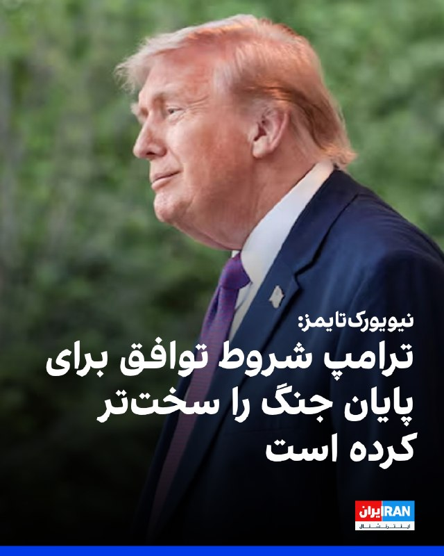
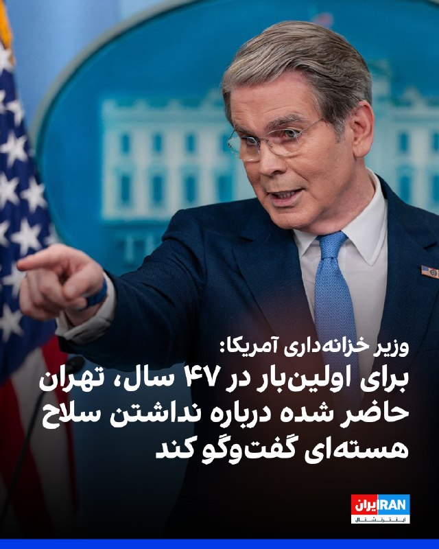
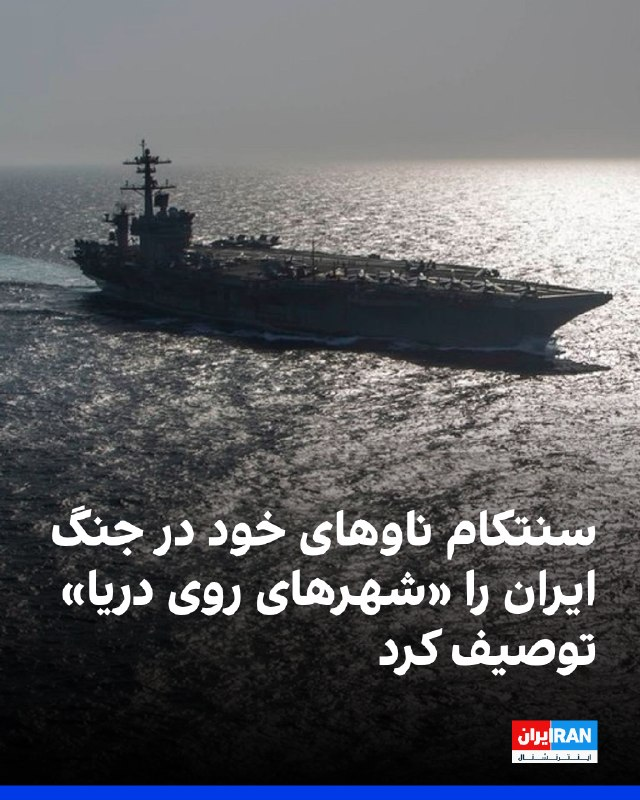
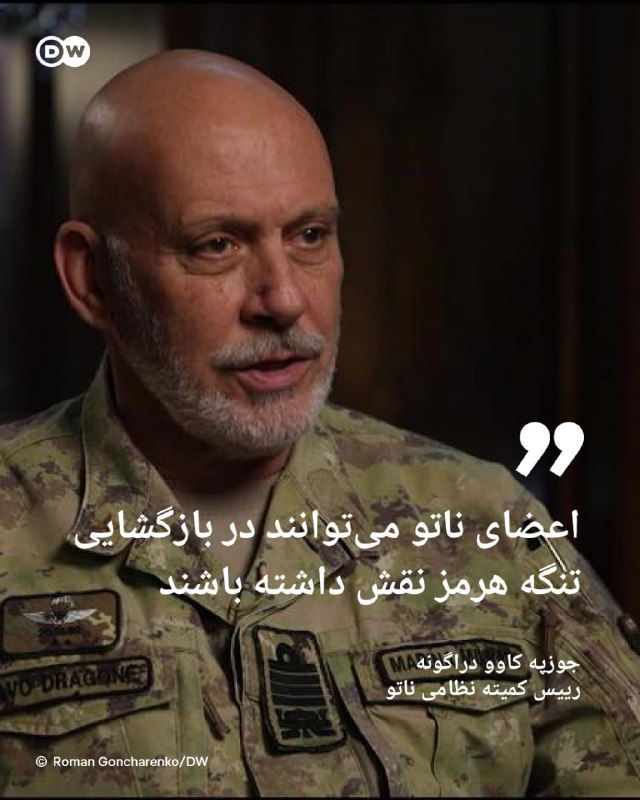
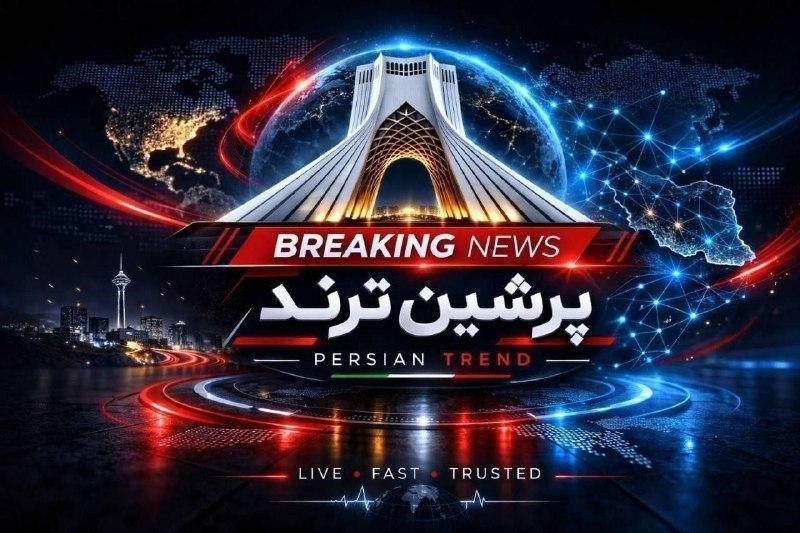
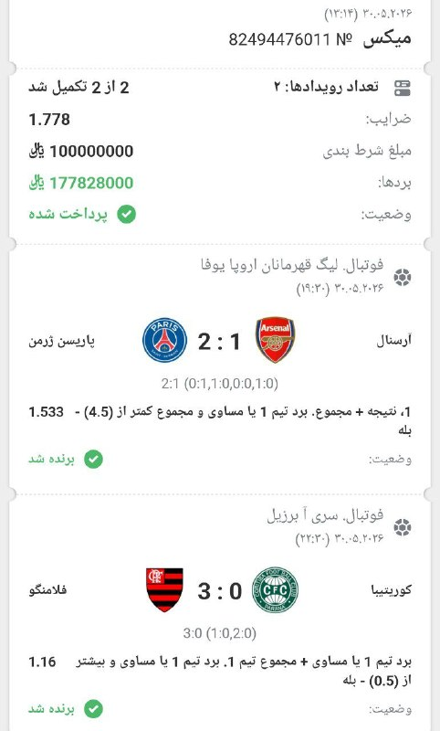
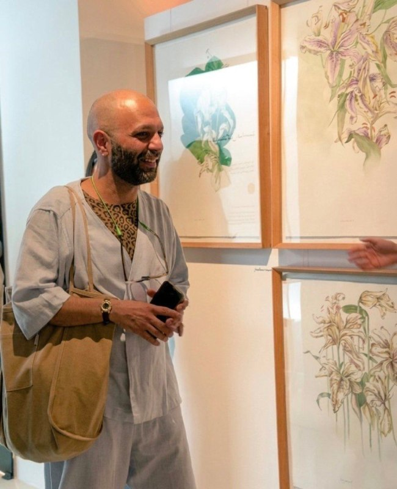

# خواننده تلگرام

<!-- TOP_NAV START -->

<a href="https://github.com/benyamin-najmi/aio-downloader/blob/main/telegram/content/archive_1.md" style="display:inline-block; padding:6px 12px; margin:0 4px; background-color:#2ea44f; color:white; text-decoration:none; border-radius:4px; font-weight:bold;">صفحه بعد</a>

<!-- TOP_NAV END -->

<!-- MSG START -->

---
📅 بروزرسانی: 1405/03/10 19:45
---

## VahidOOnLine — post 243073

  

فرماندهی مرکزی ایالات متحده (سنتکام) با انتشار تصاویری، جزئیاتی از فعالیت یک ناو هواپیمابر آمریکایی که اکنون نزدیک ایران هستند منتشر و آن را «شهری روی دریا» توصیف کرد.

در حالی که به دلیل آتش‌بس جاری با جمهوری اسلامی، عملیات‌ها محدودتر شده‌اند، مقامات آمریکایی می‌گویند نیروی دریایی ایالات متحده همچنان آماده است در صورت نیاز حملات را افزایش دهد.

سنتکام نوشت: «یک ناو هواپیمابر نیروی دریایی آمریکا در اصل یک شهر مستقل روی دریاست. با طولی حدود سه زمین فوتبال و بیش از ۵۰۰۰ ملوان در آن، برای اینکه عملیات به‌طور روان پیش برود، حضور و همکاری همه نیروها—چه در عرشه و چه زیر آن—ضروری است.»

ویدئوهای منتشرشده در پستی در شبکه اجتماعی ایکس نشان می‌دهد ملوانان در حال انجام وظایف مختلف روی این ناو هستند؛ از تهیه غذا گرفته تا هدایت هواپیماها روی عرشه.
‌🏁 🇬🇧 IranintlTV

🤖 @VahidOOnLine

## VahidOOnLine — post 243072

  

نیویورک‌تایمز به نقل از سه مقام آگاه گزارش داد دونالد ترامپ شروط چارچوب احتمالی توافق برای پایان جنگ با ایران را سخت‌تر کرده و نسخه اصلاح‌شده را برای بررسی به تهران ارسال کرده است. هنوز مشخص نیست چه تغییراتی در متن اعمال شده است.

بر اساس این گزارش، ترامپ نسبت به بخش‌هایی از توافق که شامل آزادسازی دارایی‌های ایران می‌شود ابراز نگرانی کرده و از طولانی شدن پاسخ تهران به پیشنهادهای آمریکا ناراضی است.

این تغییرات با هدف افزایش فشار برای پذیرش چارچوبی انجام شده که پیش‌تر برای تایید به مجتبی خامنه‌ای ارسال شده بود. به گفته منابع، برقراری ارتباط و دریافت پاسخ از مجتبی خامنه‌ای دشوار است و هرگونه تغییر در این سند که به‌عنوان «یادداشت تفاهم» شناخته می‌شود، ممکن است موجب تاخیرهای بیشتر در روند مذاکرات شود.
‌🏁 🇬🇧 IranintlTV

🤖 @VahidOOnLine

## VahidOOnLine — post 243071

  <a href="telegram/content/VahidOOnLine_243071_1780244151.mp4" target="_blank">🎬 Download video</a>

♦️فاطمه مهاجرانی، سخنگوی دولت مسعود پزشکیان، روز یکشنبه در یک گفتگوی تلویزیونی گفت: «مطلوب دولت این است که بتواند مبلغ کالابرگ را افزایش دهد اما باید مطلوبات را با مقدورات هماهنگ کنیم و این امکان فعلا وجود ندارد.»
مهاجرانی با اشاره به محاصره دریایی ایران ادامه داد: «اتفاقی که الان در جنوب کشور و دریا در حال رخ دادن است، روی اقتصاد ما تاثیر می‌گذارد.»
او گرانی را محصول محاصره دریایی آمریکا دانست و افزود: «این موضوع بر کاهش ورود کالا تاثیر می‌گذارد و وقتی جریان عرضه و تقاضا دچار مشکل می‌شود، بازار واکنش نشان می‌دهد.»
‌🇸🇦 Indypersian

🤖 @VahidOOnLine

## VahidOOnLine — post 243070

  

اسکات بسنت، وزیر خزانه‌داری آمریکا، در گفت‌وگو با فاکس‌نیوز درباره ایران اعلام کرد: لایه اول و دوم حکومت آن‌ها از بین رفته و اکنون با لایه سوم روبه‌رو هستیم. شاید آن‌ها دیده‌اند برای بقیه چه اتفاقی افتاد و می‌بینند ترامپ آماده انجام چه اقداماتی است.

بسنت افزود: اگر ترامپ با این توافق موافقت کند، همین حالا به رهبران جمهوری اسلامی می‌گویم که او این توافق را هم از نظر نظامی و هم از نظر اقتصادی اجرا خواهد کرد. آزادی کشتیرانی در خلیج فارس از طریق تنگه هرمز باید به وضعیت پیشین بازگردد.

او درباره اینکه آیا ترامپ «کار را تمام خواهد کرد» گفت: اگر «تمام کردن کار» یعنی اطمینان از باز بودن تنگه هرمز، در اختیار گرفتن اورانیوم با غنای بالا و نداشتن سلاح هسته‌ای از سوی جمهوری اسلامی، پس کار تمام شده است.

بسنت تاکید کرد: چه از طریق مداخله نظامی، چه محاصره یا فشار اقتصادی، این نخستین بار در ۴۷ سال گذشته است که ایرانی‌ها درباره نداشتن سلاح هسته‌ای گفت‌وگو می‌کنند. این موضوع پیش‌تر ممنوعه بود و اکنون برای نخستین بار روی میز مذاکره قرار گرفته است.
‌🏁 🇬🇧 IranintlTV

🤖 @VahidOOnLine

## VahidOOnLine — post 243069

  

♦️پلیس منچستر در جریان عید قربان در بریتانیا، دو مرد بریتانیایی-یمنی را پس از مشاهده خنجرهای سنتی «جنبیه» بر کمرشان بازداشت کرد.
جنبیه، خنجری خمیده و زینتی است که در فرهنگ یمن نماد مردانگی و هویت قبیله‌ای به شمار می‌رود و معمولا به عنوان بخشی از لباس سنتی مردان یمنی استفاده می‌شود.
بر اساس قوانین بریتانیا، حمل چاقو و دیگر سلاح‌های سرد در اماکن عمومی بدون «دلیل موجه» ممنوع است. به همین دلیل مأموران پلیس این دو نفر را بازداشت و خنجرهای آنها را ضبط کردند.
‌🇸🇦 Indypersian

🤖 @VahidOOnLine

## VahidOOnLine — post 243068

  

سی‌ان‌ان گزارش داد تهران پس از خارج کردن سریع زرادخانه‌های موشکی مدفون خود، در موقعیتی قرار گرفته که می‌تواند تعداد بیشتری موشک دوربرد به سمت اسرائیل و دیگر کشورهای خاورمیانه شلیک کند؛ موضوعی که به گفته کارشناسان، محدودیت‌های راهبرد بمباران آمریکا را نشان می‌دهد.

بر اساس این گزارش، حملات آمریکا و اسرائیل در هفته‌های گذشته با هدف تخریب جاده‌ها و مسدود کردن ورودی تونل‌ها انجام شد تا دسترسی تهران به سایت‌های زیرزمینی موشکی محدود شود.

تصاویر ماهواره‌ای بررسی‌شده توسط سی‌ان‌ان نشان می‌دهد جمهوری اسلامی با استفاده از تجهیزات ساده‌ای مانند بولدوزر و کامیون‌های حمل‌ونقل توانسته این مسیرها را دوباره بازسازی کند. کارشناسان می‌گویند این موضوع نشان می‌دهد توان موشکی ایران تنها با هدف قرار دادن ورودی تونل‌ها قابل از بین بردن نیست.
‌🏁 🇬🇧 IranintlTV

🤖 @VahidOOnLine

## VahidOOnLine — post 243067

  <a href="telegram/content/VahidOOnLine_243067_1780244153.mp4" target="_blank">🎬 Download video</a>

♦️فرماندهی مرکزی ایالات متحده (سنتکام) روز یکشنبه ۱۰ خرداد با انتشار پیامی در شبکه اجتماعی ایکس، ناوهای هواپیمابر نیروی دریایی آمریکا را به «شهری خودکفا در دریا» تشبیه کرد.
به گفته سنتکام، یک ناو هواپیمابر آمریکایی تقریبا به اندازه سه زمین فوتبال طول دارد و بیش از پنج هزار ملوان در آن مستقر هستند.
در این پیام آمده است که تداوم عملیات این شناورها نیازمند همکاری هماهنگ تمامی نیروها در بخش‌های مختلف، چه روی عرشه و چه در بخش‌های زیرین ناو است تا ماموریت‌ها و فعالیت‌های روزانه به شکل روان و موثر ادامه یابد.
‌🇸🇦 Indypersian

🤖 @VahidOOnLine

## mwarmonitor — post 9948

🔴بر اساس گزارش رسانه لبنانی LBCI، وزیر امور خارجه آمریکا Marco Rubio در حال پیگیری برقراری یک آتش‌بس کامل در لبنان است و احتمال دارد پس از نشست مذاکراتی ۲ ژوئن، این موضوع رسماً اعلام شود.

🔸سناتور لیندسی گراهام:

🔹در گفت‌وگوی اخیرم با دونالد ترامپ، حمایت خود را از توافقی با ایران اعلام کردم که خواسته رئیس‌جمهور ترامپ برای بازگشایی تنگه هرمز و آغاز مذاکرات به‌منظور پایان همیشگی جاه‌طلبی‌های هسته‌ای ایران و حمایت آن از تروریسم را بپذیرد. اطمینان دارم که در نهایت، رئیس‌جمهور ترامپ با یک توافق بد با ایران موافقت نخواهد کرد.

🔹در جبهه‌ای جداگانه، بر این باورم که باید به اسرائیل اجازه داده شود تهدیدهایی را که از حملات مستمر حزب‌الله از خاک لبنان متوجه این کشور است، خنثی کند. بخش‌هایی از اسرائیل به‌دلیل شلیک موشک‌ها و راکت‌های حزب‌الله غیرقابل سکونت شده‌اند.

🔹غیرقابل قبول است که از اسرائیل خواسته شود آتش‌بسی با حزب‌الله بپذیرد، آن هم در حالی که حزب‌الله آشکارا خواستار نابودی اسرائیل است و حملات مداوم خود را ادامه می‌دهد. هرگونه آتش‌بس با حزب‌الله به آن‌ها فرصت می‌دهد دوباره مسلح شوند و قوی‌تر شوند. از نظر من، نباید هیچ پیوندی میان توافق با ایران و توانایی اسرائیل برای دفاع و مقابله با تجاوز بی‌وقفه حزب‌الله در لبنان وجود داشته باشد. درباره حماس نیز این پرسش مطرح است که تا چه زمانی قرار است به آن‌ها فرصت خلع سلاح بدهیم؟ بگذارید اسرائیل کار آن‌ها را تمام کند.

🔹هر توافقی با ایران که توانایی اسرائیل برای مقابله با حماس و حزب‌الله را محدود کند، نادرست و غیرعاقلانه خواهد بود.

@mwarmonitor

## pm_afshaa — post 91950

🔴سی‌ان‌ان: ترامپ با آزادسازی هرگونه دارایی ایران در توافق احتمالی مخالفت کرده

💧 Rainbet.com the #1 Non-KYC Crypto Casino & Sportsbook @rainbetcom

😁 @Pm_Afshaa

## pm_afshaa — post 91949

  <a href="telegram/content/pm_afshaa_91949_1780244154.webm" target="_blank">🎬 Download video</a>

🔴سی‌بی‌اس: میانجی‌ها هنوز دارن روی توافق بین تهران و واشینگتن کار میکنن. ترامپ روز جمعه متن توافق رو دوباره اصلاح کرده و نسخه جدیدش رو فرستاده ایران تا تأییدش کنه، ولی تا الان هنوز پاسخی از طرف تهران داده نشده. 
💧 Rainbet.com the #1 Non-KYC Crypto Casino…

## pm_afshaa — post 91948

  <a href="telegram/content/pm_afshaa_91948_1780244155.webm" target="_blank">🎬 Download video</a>

🔴رئیس کمیته نظامی ناتو:
احتمال عملیات برای بازگشایی تنگه هرمز وجود داره؛ حضور نظامی متحدان برای مقابله با مسدودسازی مسیرهای بین‌المللی رو افزایش دادیم.

💧 Rainbet.com the #1 Non-KYC Crypto Casino & Sportsbook @rainbetcom

😁 @Pm_Afshaa

## DEJradio — post 5184

  <a href="telegram/content/DEJradio_5184_1780244155.webm" target="_blank">🎬 Download video</a>

🔺 در جنگ ۴۰ روزه شماری از شهروندان غیرنظامی کشته و زخمی شدند و منازل، مغازه‌ها و دارایی‌های بسیاری از آنها از بین رفت. علت اصلی این وضعیت استقرار مقرها و پایگاه‌های سـ.ـپاه و بـ.ـسیج و کلانتری‌ها در مناطق مسکونی بود. تعداد زیادی از خانه‌های امن و مخفیگاه‌های فرماندهانی که کشته شدند نیز کنار واحدهای مسکونی مردم عادی بود. حتی بعضی ساکنان خبر نداشتند که در آپارتمان آنها چه کسانی تردد می‌کنند.
بسیاری از شهروندان بی‌خانمان شدند و در هتل‌ها و مسافرخانه‌ها ساکن شده‌اند.
در واقع حکومت با استفاده از سپرانسانی، تلاش کرد برای سرکوبگران پوشش ایجاد کند که حاصل این تاکتیک غیرانسانی، کشته شدن هموطنان و ویرانی منازل آنها بود.
اکنون شورای‌عالی امنیت ملی و شهرداری برای انتقال مراکز سرکوب به خارج از مناطق مسکونی زیر فشار قرار گرفته‌اند.
علیرضا زاکانی شهردار تهران می‌گوید، با شورای عالی امنیت ملی برای انتقال مراکز حساس به خارج از مناطق مسکونی مکاتبه شده است. او به خبرگزاری «مهر» گفت، «تجربه جنگ‌های اخیر نشان داد باید با همکاری مجموعه‌های نظامی و انتظامی، شرایطی فراهم شود تا در آینده اطمینان خاطر بیشتری برای شهروندان ایجاد شود.»

#جنگ_چهل_روزه
@DEJradio

## VahidOnline — post 75821

  

مسعود پیاهو، مردی که تصویر معترض نشسته مقابل نیروهای پلیس یگان ویژه در مقابل پاساژ علاالدین در آغاز اعتراضات دی ماه سال گذشته را منتشر کرد، به گفته وکیلش به ۱۰ سال زندان محکوم شده است.
@VahidHeadline

📡 @VahidOnline

## VahidOnline — post 75820

  

اسکات بسنت، وزیر خزانه‌داری آمریکا، در گفت‌وگو با فاکس‌نیوز درباره ایران اعلام کرد: لایه اول و دوم حکومت آن‌ها از بین رفته و اکنون با لایه سوم روبه‌رو هستیم. شاید آن‌ها دیده‌اند برای بقیه چه اتفاقی افتاد و می‌بینند ترامپ آماده انجام چه اقداماتی است.

بسنت افزود: اگر ترامپ با این توافق موافقت کند، همین حالا به رهبران جمهوری اسلامی می‌گویم که او این توافق را هم از نظر نظامی و هم از نظر اقتصادی اجرا خواهد کرد. آزادی کشتیرانی در خلیج فارس از طریق تنگه هرمز باید به وضعیت پیشین بازگردد.

او درباره اینکه آیا ترامپ «کار را تمام خواهد کرد» گفت: اگر «تمام کردن کار» یعنی اطمینان از باز بودن تنگه هرمز، در اختیار گرفتن اورانیوم با غنای بالا و نداشتن سلاح هسته‌ای از سوی جمهوری اسلامی، پس کار تمام شده است.

بسنت تاکید کرد: چه از طریق مداخله نظامی، چه محاصره یا فشار اقتصادی، این نخستین بار در ۴۷ سال گذشته است که ایرانی‌ها درباره نداشتن سلاح هسته‌ای گفت‌وگو می‌کنند. این موضوع پیش‌تر ممنوعه بود و اکنون برای نخستین بار روی میز مذاکره قرار گرفته است.
@VahidOOnLine

📡 @VahidOnline

## VahidOnline — post 75819

  <a href="telegram/content/VahidOnline_75819_1780244157.mp4" target="_blank">🎬 Download video</a>

عراقچی در تاریخ ۲۹ آبان ۱۴۰۴
در تلویزیون جمهوری اسلامی میگه ترامپ به ما نامه‌ای داده و صراحتا نوشته
«دو گزینه بیشتر نیست»
یا جنگ و خونریزی یا مذاکره مستقیم
«برای از بین بردن غنی‌سازی و موشکی»

این مصاحبه چند ماه بعد از جنگ ۱۲ روزه بود! یعنی در آبان ماه، مشکلات آمریکا و جمهوری اسلامی همچنان همون چیزهایی بودند که باعث یک جنگ شد، و این مصاحبه یک ماه پیش از آن بود که دست به قتل‌عام مردم در خیابان‌ها بزنید!

الان هم محور مذاکرات کاملا مشخصه!
همون چیزهایی است که جنگ ۱۲ روزه رو رقم زد. همون چیزهایی است که در آبان ماه عراقچی در تلویزیون گفت.

خون تک‌تک ایرانیان از جمله کودکان میناب پای شماست! شما طرف مذاکره بودید، شما انتخاب کننده و تصمیم گیر بودید.

و شما بین اورانیوم و موشک، و یا جان مردم، زیرساخت‌های کشور، فولاد و پتروشیمی و…
اورانیوم و موشک و دشمنی با اسرائیل و آمریکا رو انتخاب کردید! هنوز هم طرف مذاکره و تصمیم‌گیر شما هستید! و‌ جنگ ‌از سر گرفته بشه باز تصمیم و انتخاب شماست و مقصر شما هستید!

نمی‌توانید پشت کودکان میناب قایم بشید و از کشتار دیماه فرار کنید!
هر خون و ‌هر ویرانی ، همه پای شماست.

## VahidOnline — post 75818

  

حسن و حسین امیری، دو برادر دوقلوی ۲۰ ساله محبوس در زندان قزلحصار کرج، از سوی شعبه ۲۶ دادگاه انقلاب تهران به ریاست قاضی ایمان افشاری به اعدام محکوم شدند.

بر اساس اطلاعات دریافتی هرانا، مبنای صدور این رای اتهام «جاسوسی برای اسراییل» عنوان شده است.

یک منبع مطلع در گفت‌وگو با هرانا اعلام کرد در کیفرخواست صادرشده علیه حسن و حسین امیری، مشاهده تصاویری از ساختمان‌های آسیب‌دیده به عنوان مستند اتهام «جاسوسی به نفع اسراییل» مورد استناد قرار گرفته است.

این منبع همچنین گفت: «حسن و حسین امیری به دستور بازپرس پرونده به صورت جداگانه در زندان قزلحصار نگهداری می‌شوند و از حق ملاقات با یکدیگر محروم هستند. این دو زندانی در حال حاضر در سوییت ۳۵ این زندان محبوس هستند.»

بر اساس این گزارش، این دو برادر پیشتر در یکی از ایست‌های بازرسی و پس از بررسی تلفن همراهشان بازداشت شدند.آن‌ها پس از بازداشت، به مدت دو ماه در وضعیت بلاتکلیف در زندان قزلحصار کرج نگهداری شدند.

👈 حسن و حسین امیری از دو سالگی در مراکز بهزیستی پرورش یافته‌اند و خانواده‌ای برای پیگیری وضعیت قضایی و حقوقی خود ندارند. به گفته آشنایان این دو جوان، نبود حامی خانوادگی بر نگرانی‌ها درباره روند رسیدگی به پرونده آنان افزوده است.
@VahidHeadline

📡 @VahidOnline

## VahidOnline — post 75817

  

سی‌ان‌ان: ایران چندین ورودی تأسیسات موشکی زیرزمینی خود را بازگشایی کرده است

شبکه خبری سی‌ان‌ان روز یکشنبه ۱۰ خرداد با استناد به تصاویر ماهواره‌ای اعلام کرد ایران توانسته از زمان توقف جنگ شماری از زرادخانه‌های موشکی مدفون خود بر اثر حملات هوایی آمریکا و اسرائیل را از زیر خاک بیرون بیاورد.

حملات آمریکا و اسرائیل با تخریب جاده‌ها و مسدود کردن ورودی تونل‌ها، دسترسی ایران به پایگاه‌های موشکی زیرزمینی را محدود کرده بود.

سی‌ان‌ان ادعا کرده است که ایران تاکنون ۵۰ مورد از ۶۹ ورودی تونلی را که در ۱۸ تأسیسات موشکی زیرزمینی توسط آمریکا و اسرائیل هدف قرار گرفته بودند، بازگشایی کرده است، از جمله در پایگاه‌هایی در خارج از اصفهان و در اطراف خمین.

بر اساس گزارش این شبکه خبری، ایران همچنین بخش‌های دیگری از این پایگاه‌ها را نیز ترمیم کرده است؛ از جمله جاده‌هایی که آمریکا و اسرائیل برای جلوگیری از تردد پرتابگرهای موشکی بمباران کرده بودند. تصاویر ماهواره‌ای نشان می‌دهند که تقریباً تمامی گودال‌های ناشی از بمباران اکنون پر شده‌اند و در دو پایگاه، این جاده‌ها حتی دوباره آسفالت شده‌اند.

ایران شبکه پایگاه‌های زیرزمینی خود را در عمق خاک و در مواردی زیر کوه‌ها ساخته است تا در برابر حملات هوایی مصون باشند، به همین دلیل آمریکا و اسرائیل بسیاری از ورودی‌های این تأسیسات را بمباران کردند؛ اقدامی که در کنار تلاش برای شناسایی و نابود کردن پرتابگرهای موشکی، باعث شد توان ایران برای شلیک موشک به‌طور قابل توجهی محدود شود.

این حملات خسارت سنگینی به پایگاه‌ها وارد کرد؛ به‌گونه‌ای که بیشتر ورودی‌های تونل‌ها زیر حجم عظیمی از آوار مدفون شدند و جاده‌های منتهی به این سایت‌ها نیز به‌شدت تخریب شدند.

سی‌ان‌ان می‌گوید باز کردن ورودی تأسیسات موشکی زیرزمینی می‌تواند به ایران این قابلیت را دهد که در صورت وقوع دور جدیدی از درگیری‌ها، موشک‌های بالستیک بیشتری نسبت به اواخر جنگ ۴۰ روزه به سمت اسرائیل و کشورهای دیگر شلیک کند.
@VahidHeadline

📡 @VahidOnline

## IranIntlTV — post 339909

  <a href="telegram/content/IranIntlTV_339909_1780244159.mp4" target="_blank">🎬 Download video</a>

ایران‌اینترنشنال به اسنادی محرمانه دست یافته که نشان می‌دهد چین از طرق شرکت‌هایی در خاک این کشور، ترکیه و امارات، به سپاه پاسداران در تامین مواد شیمیایی برای ساخت موشک بالستیک کمک می‌کند. این همکاری در ازای نفت و از طریق ستاد پورجعفری سپاه انجام می‌شود.

گزارشی از مجتبا پورمحسن
@iranintltv

## IranIntlTV — post 339908

  <a href="https://t.me/IranintlTV/339908" target="_blank">📎 Download file</a>

🎧نسخه صوتی اخبار شبانگاهی | یکشنبه ۱۰ خرداد
@iranintlTV

## IranIntlTV — post 339907

  

فرماندهی مرکزی ایالات متحده (سنتکام) با انتشار تصاویری، جزئیاتی از فعالیت یک ناو هواپیمابر آمریکایی که اکنون نزدیک ایران هستند منتشر و آن را «شهری روی دریا» توصیف کرد.

در حالی که به دلیل آتش‌بس جاری با جمهوری اسلامی، عملیات‌ها محدودتر شده‌اند، مقامات آمریکایی می‌گویند نیروی دریایی ایالات متحده همچنان آماده است در صورت نیاز حملات را افزایش دهد.

سنتکام نوشت: «یک ناو هواپیمابر نیروی دریایی آمریکا در اصل یک شهر مستقل روی دریاست. با طولی حدود سه زمین فوتبال و بیش از ۵۰۰۰ ملوان در آن، برای اینکه عملیات به‌طور روان پیش برود، حضور و همکاری همه نیروها—چه در عرشه و چه زیر آن—ضروری است.»

ویدئوهای منتشرشده در پستی در شبکه اجتماعی ایکس نشان می‌دهد ملوانان در حال انجام وظایف مختلف روی این ناو هستند؛ از تهیه غذا گرفته تا هدایت هواپیماها روی عرشه.
https://iranintl.com/202605319516

## IranIntlTV — post 339905

  <a href="telegram/content/IranIntlTV_339905_1780244162.mp4" target="_blank">🎬 Download video</a>

سی‌بی‌اس نیوز به نقل از منابع آگاه اعلام کرد دونالد ترامپ، رییس‌جمهوری ایالات متحده، جمعه اصلاحاتی را در متن تفاهم‌نامه اعمال کرد و نسخه جدید را برای تایید به تهران ارسال کرد، اما هنوز پاسخی از سوی جمهوری اسلامی دریافت نشده است.

گزارش مرضیه حسینی، خبرنگار ایران‌اینترنشنال
@iranintltv

## IranIntlTV — post 339904

  

اسکات بسنت، وزیر خزانه‌داری آمریکا، در گفت‌وگو با فاکس‌نیوز درباره ایران اعلام کرد: لایه اول و دوم حکومت آن‌ها از بین رفته و اکنون با لایه سوم روبه‌رو هستیم. شاید آن‌ها دیده‌اند برای بقیه چه اتفاقی افتاد و می‌بینند ترامپ آماده انجام چه اقداماتی است.

بسنت افزود: اگر ترامپ با این توافق موافقت کند، همین حالا به رهبران جمهوری اسلامی می‌گویم که او این توافق را هم از نظر نظامی و هم از نظر اقتصادی اجرا خواهد کرد. آزادی کشتیرانی در خلیج فارس از طریق تنگه هرمز باید به وضعیت پیشین بازگردد.

او درباره اینکه آیا ترامپ «کار را تمام خواهد کرد» گفت: اگر «تمام کردن کار» یعنی اطمینان از باز بودن تنگه هرمز، در اختیار گرفتن اورانیوم با غنای بالا و نداشتن سلاح هسته‌ای از سوی جمهوری اسلامی، پس کار تمام شده است.

بسنت تاکید کرد: چه از طریق مداخله نظامی، چه محاصره یا فشار اقتصادی، این نخستین بار در ۴۷ سال گذشته است که ایرانی‌ها درباره نداشتن سلاح هسته‌ای گفت‌وگو می‌کنند. این موضوع پیش‌تر ممنوعه بود و اکنون برای نخستین بار روی میز مذاکره قرار گرفته است.
https://iranintl.com/202605310994

## IranIntlTV — post 339903

  

سی‌ان‌ان گزارش داد تهران پس از خارج کردن سریع زرادخانه‌های موشکی مدفون خود، در موقعیتی قرار گرفته که می‌تواند تعداد بیشتری موشک دوربرد به سمت اسرائیل و دیگر کشورهای خاورمیانه شلیک کند؛ موضوعی که به گفته کارشناسان، محدودیت‌های راهبرد بمباران آمریکا را نشان می‌دهد.

بر اساس این گزارش، حملات آمریکا و اسرائیل در هفته‌های گذشته با هدف تخریب جاده‌ها و مسدود کردن ورودی تونل‌ها انجام شد تا دسترسی تهران به سایت‌های زیرزمینی موشکی محدود شود.

تصاویر ماهواره‌ای بررسی‌شده توسط سی‌ان‌ان نشان می‌دهد جمهوری اسلامی با استفاده از تجهیزات ساده‌ای مانند بولدوزر و کامیون‌های حمل‌ونقل توانسته این مسیرها را دوباره بازسازی کند. کارشناسان می‌گویند این موضوع نشان می‌دهد توان موشکی ایران تنها با هدف قرار دادن ورودی تونل‌ها قابل از بین بردن نیست.
https://iranintl.com/202605315236

## IranIntlTV — post 339902

  <a href="telegram/content/IranIntlTV_339902_1780244165.mp4" target="_blank">🎬 Download video</a>

در ادامه گزارش‌ها از موج گسترده بیکاری در ایران، سایت کاریابی «جاب‌ ویژن» اعلام کرد نیمی از مخاطبان یک نظرسنجی در این سایت بیکار شده‌اند. بر اساس این نظرسنجی، ۵۲ درصد از کارجویان اعلام کردند در پی جنگ شغل خود را از دست داده‌اند.
خبرگزاری ایلنا نیز از اخراج گسترده کارگران در مجتمع‌های پتروشیمی ماهشهر و بندر امام گزارش داد.

گفت‌وگو با فواد کیخسروی، فعال کارگری
@iranintltv

## FarsiVOA — post 219184

حسن شریعتمداری در عمق میدان: تجربه نشان داده که شخصیت و رهبرِ کاریزماتیک خودش دیکتاتور بعدی خواهد بود. همه را با همه تفاوت‌ها باید دعوت کرد

## FarsiVOA — post 219183

در گفت‌وگو با حسن هاشمیان به عبور ارتش اسرائیل از رود لیتانی و تصرف قلعه راهبردی بوفور (یا بوفورت که نام عربی آن «شقیف» است) پرداختیم. او می‌گوید این پیشروی، «که بزرگ‌ترین شکستی است که جمهوری اسلامی به جهان اسلام تقدیم کرد» معادلات لبنان و مذاکرات منطقه‌ای را به زیان جمهوری اسلامی تغییر می‌دهد.

## FarsiVOA — post 219182

🔺افزایش فشار بر زندانیان اوین؛ از سلول انفرادی تا محرومیت درمانی

◾️کانون حقوق بشر ایران روز یکشنبه ۱۰ خرداد ۱۴۰۵ با انتشار گزارشی از افزایش فشارها بر زندانیان در زندان اوین خبر داد و اعلام کرد که در ماه‌های اخیر مواردی از محرومیت درمانی، محدودیت تماس و ملاقات، انتقال به سلول‌های انفرادی و برخوردهای خشونت‌آمیز با زندانیان گزارش شده است.

⬇️ بیشتر بخوانید:

https://ir.voanews.com/a/pressure-mounts-evin-prison/8155787.html

## FarsiVOA — post 219181

با وجود اعلام رسمی بازگشت اینترنت بین‌الملل، گزارش‌های داخلی و خارجی روزهای اخیر تصویر متفاوتی نشان می‌دهند: فیلترینگ سنگین، اختلال در پیام‌رسان‌ها، محدودیت اپ‌استورها و ناپایداری ارتباط دیتاسنترها همچنان ادامه دارد. ترافیک اینترنت ایران هنوز به نصف سطح عادی هم نرسیده است.

نت‌بلاکس در آخرین ارزیابی خود اعلام کرده شرایط فعلی به دوران میان اعتراضات دی‌ماه و جنگ اخیر شباهت دارد و نه به وضعیت پیش از بحران.

گزارش کامل را در وب‌سایت صدای آمریکا بخوانید.

@FarsiVOA

## FarsiVOA — post 219180

  <a href="telegram/content/FarsiVOA_219180_1780244166.mp4" target="_blank">🎬 Download video</a>

ویدیویی در شبکه‌های اجتماعی منتشر شده که منتسب به یکی از مین‌های دریایی جمهوری اسلامی در محدوده آب‌های عمان است.

مرکز امنیت دریایی عمان روز شنبه ۹ خرداد، بعد از مشاهده یک جسم شناور در غرب منطقه ترافیک ساحلی تنگه هرمز در محدوده آب‌های سرزمینی عمان، که گمان می‌رود «مین دریایی» باشد، از دریانوردان، ماهیگیران، و کشتی‌ها خواست تا نهایت احتیاط را به کار گیرند.

## FarsiVOA — post 219179

  

فرماندهی جنوبی آمریکا تصویری از یک جنگنده «اف/ای-۱۸ اف سوپر هورنت» منتشر کرد که از عرشه ناو هواپیمابر «یواس‌اس نیمیتز» در اقیانوس اطلس به پرواز درآمد.

این تصویر در ۲۸ اردیبهشت گرفته شده است.

@FarsiVOA

## FarsiVOA — post 219178

در گفت‌وگو با امیر چاهکی، کارشناس روابط بین‌الملل، به اظهارات پرزیدنت ترامپ درباره نزدیک بودن به یک توافق «عالی» و هم‌زمان تهدید به اقدام نظامی پرداختیم. به گفته امیر چاهکی، در صورت شکست احتمالی مذاکرات، «این جنگ سه‌روزه یا دو‌هفته‌ای نخواهد بود» و می‌تواند وارد مرحله‌ای طولانی و پرهزینه شود.

## FarsiVOA — post 219177

🔺پرزیدنت ترامپ تام باراک را به عنوان فرستاده ویژه ریاست جمهوری در امور سوریه و عراق منصوب کرد

◾️دونالد ترامپ، رئیس جمهوری ایالات متحده، روز یکشنبه ۱۰ خرداد اعلام کرد تام باراک، سفیر آمریکا در ترکیه، علاوه بر مسئولیت کنونی خود، به عنوان فرستاده ویژه ریاست جمهوری آمریکا در امور سوریه و عراق منصوب خواهد شد.

⬇️ بیشتر بخوانید:

https://ir.voanews.com/a/president-trump-appoints-tom-barrack-special-presidential-envoy-to-syria-and-iraq/8155788.html

## FarsiVOA — post 219176

  <a href="telegram/content/FarsiVOA_219176_1780244168.mp4" target="_blank">🎬 Download video</a>

فرماندهی مرکزی ایالات متحده، سنتکام، با انتشار ویدیویی از داخل یک ناو هواپیمابر نیروی دریایی آمریکا، آن را شهری خودکفا در دریا توصیف کرد.

سنتکام می‌گوید این ناو که طول آن تقریبا به اندازه سه زمین فوتبال است، بیش از پنج هزار نفر را در خود جای داده و برای ادامه عملیات، به همکاری همه نیروها در عرشه و بخش‌های زیرین ناو متکی است.

@FarsiVOA

## FarsiVOA — post 219175

🔺زهرا شهباز طبری پس از نقض حکم پیشین بار دیگر به اعدام محکوم شد

◾️زهرا شهباز طبری، زندانی سیاسی محبوس در زندان لاکان رشت، پس از نقض حکم اعدام پیشین در دیوان عالی کشور، بار دیگر از سوی شعبه دوم دادگاه انقلاب رشت به اعدام محکوم شده است.

⬇️ بیشتر بخوانید:

https://ir.voanews.com/a/political-prisoner-sentenced-to-death/8155775.html

## DW_Farsi — post 125351

  

🔶 تصرف قلعه بوفور از سوی اسرائیل؛ فرانسه خواستار نشست اضطراری شورای امنیت شد
 
ژان-نوئل بارو، وزیر خارجه فرانسه، اعلام کرد پاریس پس از تصرف قلعه بوفور در لبنان توسط ارتش اسرائیل، خواستار برگزاری نشست اضطراری شورای امنیت سازمان ملل شده است. او گفت فرانسه حق اسرائیل برای دفاع از خود را به رسمیت می‌شناسد، اما ادامه عملیات نظامی اسرائیل در لبنان و گسترش حضور آن در خاک این کشور را غیرقابل توجیه می‌داند.
 
به گزارش العربیه انگلیسی، بارو در این باره گفت هیچ چیز نمی‌تواند ادامه عملیات نظامی اسرائیل در لبنان و عمیق‌تر شدن اشغال خاک این کشور را توجیه کند.
 
دنی دانون، نماینده اسرائیل در سازمان ملل، در واکنش به درخواست فرانسه گفت بحث واقعی در شورای امنیت باید درباره شکست مداوم در اجرای قطعنامه ۱۷۰۱ باشد؛ قطعنامه‌ای که پس از جنگ سال ۲۰۰۶ میان اسرائیل و حزب‌الله تصویب شد و بر اساس آن، حزب‌الله باید به شمال رود لیتانی عقب می‌رفت.
 
او گفت حزب‌الله سال‌هاست قطعنامه‌های سازمان ملل را آشکارا نقض کرده، با حمایت ایران مسلح شده و تهدیدی مستقیم برای غیرنظامیان اسرائیلی و ثبات منطقه ایجاد کرده است.
 
@dw_farsi

## DW_Farsi — post 125350

  <a href="telegram/content/DW_Farsi_125350_1780244170.mp4" target="_blank">🎬 Download video</a>

🎥 پیدا شدن بخشی از مجسمه آسیب‌دیده تخت مرمر کاخ گلستان
 
براساس تصاویری که به‌تازگی در شبکه‌های اجتماعی منتشر شده، مرمت‌گران کاخ گلستان روز ۱۸ فروردین ۱۴۰۵ در جریان مرمت تخت مرمر، قطعه "سر فرشته" یکی از مجسمه‌های این اثر تاریخی را که از بدنه جدا شده بود، در میان آوار پیدا کردند.
 
تخت مرمر از آثار دوره فتحعلی‌شاه قاجار در کاخ‌موزه گلستان است که از ۶۵ قطعه مرمر زرد ساخته شده و در گذشته برای مراسم رسمی و تاج‌گذاری مورد استفاده قرار می‌گرفت. رضاشاه پهلوی نیز تاج‌گذاری خود را در این محل برگزار کرد. این اثر تاریخی در پی موج انفجار ناشی از حملات هوایی ائتلاف نظامی آمریکا و اسرائیل به مناطقی در نزدیکی کاخ گلستان در شامگاه دهم اسفند ۱۴۰۴ آسیب دیده بود.
@dw_farsi

## DW_Farsi — post 125349

  

🔶 گزارش‌هایی از حمله موشکی ایران به اقلیم کردستان
 
یک مقام حزب "آزادی کردستان" گفته است امروز یکشنبه ۱۰ خرداد (۳۱ مه) یکی از پایگاه‌های اصلی وابسته به این گروه مخالف حکومت ایران در نزدیکی اربیل در عراق هدف حمله موشکی قرار گرفته است. این مقام، مسئولیت حمله را متوجه ایران دانسته است.
 
هم‌زمان، رسانه‌های دولتی ایران گزارش دادند نیروهای زمینی سپاه پاسداران به پایگاه‌های گروه‌های کرد در شمال عراق حمله کرده‌اند.
 
در این گزارش‌ها اشاره شده که محل دقیق حمله‌ها روشن نیست و مشخص نشده کدام پایگاه‌ها هدف قرار گرفته‌اند.
 
سپاه پاسداران در ماه‌های اخیر بارها مقر احزاب کرد در اقلیم کردستان را هدف حملات هوایی و پهپادی قرار داده است.
@dw_farsi

## DW_Farsi — post 125348

  

🔶 افزایش ۴۰ درصدی خدمات تدفین در بهشت زهرای تهران
 
مصوبه جدید نرخ بهای خدمات در بهشت‌زهرا نشان می‌دهد تعرفه خدمات مختلف، از حمل متوفی و تغسیل تا تکفین، تدفین و برگزاری مراسم، به‌طور متوسط حدود ۴۰ درصد افزایش یافته است. بر اساس این گزارش، در برخی موارد نیز میزان افزایش قیمت‌ها به ۵۰ درصد رسیده است.
 
به گزارش دیده‌بان ایران، هزینه انتقال هر متوفی از سطح شهر تهران تا شعاع ۱۰ کیلومتری به ۹ میلیون و ۷۵۰ هزار ریال رسیده است؛ رقمی که نشان‌دهنده افزایش ۵۰ درصدی این سرویس است.
 
نرخ حمل متوفی به پزشکی قانونی کهریزک نیز از این افزایش مستثنا نمانده و به ازای هر کیلومتر اضافه، افزایش یافته است. در نتیجه، هزینه انتقال در این مسیر نیز نسبت به قبل بالاتر رفته و بار مالی بیشتری بر خانواده‌ها تحمیل می‌کند.
 
در میان خدمات مختلف، آمبولانس خصوصی بیشترین رشد تعرفه را داشته است.
 
این تغییرات در مجموع نشان می‌دهد هزینه خدمات مرتبط با انتقال و رسیدگی به متوفیان در تهران وارد مرحله تازه‌ای از افزایش شده و بخش مهمی از خدمات بهشت‌زهرا با نرخ‌های بالاتری محاسبه خواهد شد.
@dw_farsi

## DW_Farsi — post 125347

🔶 انجمن پرواز۷۵۲ از اصلاح قوانین هوانوردی پس از شش سال خبر داد
 
انجمن خانواده‌های جان‌باختگان پرواز پی‌اس۷۵۲ امروز یکشنبه ۱۰ خرداد (۳۱ مه) اعلام کرد که پس از شش سال و نیم پیگیری و رایزنی، اصلاحاتی در ضمیمه ۱۳ کنوانسیون شیکاگو، یکی از مهم‌ترین اسناد ناظر بر تحقیقات سوانح هوایی، به تصویب رسیده است؛ اصلاحاتی که به گفته این انجمن، در واکنش به کاستی‌هایی شکل گرفته که در روند رسیدگی به سرنگونی هواپیمای اوکراینی در تهران آشکار شد.
 
پرواز پی‌اس۷۵۲ خطوط هوایی بین‌المللی اوکراین بامداد ۱۸ دی ۱۳۹۸ تنها چند دقیقه پس از برخاستن از فرودگاه تهران، با شلیک دو موشک سپاه پاسداران سرنگون شد و تمامی ۱۷۶ سرنشین آن جان باختند. بخش بزرگی از قربانیان، ایرانیان شهروند یا ساکن کانادا بودند.
 
انجمن خانواده‌های جان‌باختگان این هواپیما، در بیانیه خود اعلام کرده است که بر اساس ضمیمه ۱۳ کنوانسیون شیکاگو، مسئولیت هدایت تحقیقات ایمنی در یک سانحه هوایی بر عهده کشوری است که حادثه در قلمرو آن رخ داده است.
 
به گفته این انجمن، همین قاعده باعث شد که تحقیقات ایمنی درباره سرنگونی هواپیمای اوکراینی به جمهوری اسلامی ایران واگذار شود؛ وضعیتی که خانواده‌ها آن را مصداق سپردن "پرونده تحقیقات درباره یک قتل جمعی به دست عاملان آن" توصیف کرده‌اند.
 
به گفته انجمن، اصلاحات جدید پس از سال‌ها دیدار با تصمیم‌گیران بین‌المللی و رایزنی دولت کانادا، در نهادهایی از جمله سازمان بین‌المللی هوانوردی غیرنظامی (ایکائو)، به تصویب رسیده است.
@dw_farsi

## DW_Farsi — post 125346

  

🔶 رییس کمیته نظامی ناتو: اعضای ناتو می‌توانند در بازگشایی تنگه هرمز نقش داشته باشند
 
جوزپه کاوو دراگونه، رییس کمیته نظامی ناتو، گفت این پیمان دفاعی در شرایط کنونی مستقیما در حل‌وفصل مسائل مربوط به تنگه هرمز دخالت ندارد، اما کشورهای عضو این پیمان در حال نزدیک کردن نیروهای خود به منطقه هستند و اگر شرایط لازم فراهم شود، قادر خواهند بود نقش ایفا کنند.
 
کاوو دراگونه گفت ناتو به‌عنوان یک ائتلاف در این مرحله نقشی مستقیم ندارد، اما کشورهای عضو آن چنین نقشی دارند. او افزود این کشورها در حال جابه‌جایی و استقرار نیروهای خود در نزدیکی منطقه هستند تا در صورت مهیا شدن شرایط، بتوانند وارد عمل شوند.
 
او در توضیح بیشتر گفت آنچه در حال شکل‌گیری است، نه یک ماموریت رسمی ناتو، بلکه "ائتلافی از کشورهای مایل" است؛ یعنی مجموعه‌ای از کشورهای عضو ناتو و شریکانی همسو که از هم‌اکنون در حال آماده‌سازی و برنامه‌ریزی هستند تا اگر شرایط مداخله فراهم شد، بتوانند وارد عمل شوند.
@dw_farsi

## Persian_Trend_Official — post 15409

  

رسانه‌های اسرائیلی: یک پایگاه نظامی در شمال هایمک (مرج بن عامر) هدف پهپادی قرار گرفت.

تا به این لحظه ۶ زخمی در «بیت هیل» از جمله ۳ نفر در وضعیت بحرانی قرار دارند
هلیکوپترهای ارتش در حال انتقال مجروحان در میان نیروهای ارتش در نزدیکی «بیت هلیل» هستند.

👺Phantom

📌 @persian_trend_official
پرشین ترند | متفاوت‌ترین کانال نظامی

## Persian_Trend_Official — post 15408

  

🇮🇷
🇮🇷 حملات موشکی سپاه به سمت اقلیم کردستان، عراق. 
🚀
🚀
🚀
🚀 
👺Phantom 📌 @persian_trend_official پرشین ترند | متفاوت‌ترین کانال نظامی

## Persian_Trend_Official — post 15407

  <a href="telegram/content/Persian_Trend_Official_15407_1780244175.webm" target="_blank">🎬 Download video</a>

صادرات تخم مرغ ممنوع شد. طبق نامه معاونت توسعه بازرگانی وزارت جهاد کشاورزی به مدیرکل دفتر صادرات سازمان توسعه تجارت و گمرک، صادرات تخم‌مرغ خوراکی تا اطلاع ثانوی ممنوع شد .🫆: Ⓜ 🆔:@persian_trend_official پرشین ترند | متفاوت‌ترین کانال نظامی

## Persian_Trend_Official — post 15406

  

🇮🇷
🇮🇷 حملات موشکی سپاه به سمت اقلیم کردستان، عراق.

🚀
🚀
🚀
🚀

👺Phantom

📌 @persian_trend_official
پرشین ترند | متفاوت‌ترین کانال نظامی

## Persian_Trend_Official — post 15403

  <a href="telegram/content/Persian_Trend_Official_15403_1780244176.webm" target="_blank">🎬 Download video</a>

وقتی روحانیت و ایدئولوژی برای پوشش مردم تصمیم‌گیری می‌کنند، نتیجه‌اش می‌شود چنین فاجعه‌ای. قطعاً خانم سخنگو در استایل شخصی خودش می‌تواند بسیار مرتب‌تر و آراسته‌تر ظاهر شود؛ اما آن چیزی که حراست، اجبار و ایدئولوژی حکومتی بر پوشش زنان در جمهوری اسلامی تحمیل…

## Persian_Trend_Official — post 15402

  

وقتی روحانیت و ایدئولوژی برای پوشش مردم تصمیم‌گیری می‌کنند، نتیجه‌اش می‌شود چنین فاجعه‌ای.

قطعاً خانم سخنگو در استایل شخصی خودش می‌تواند بسیار مرتب‌تر و آراسته‌تر ظاهر شود؛ اما آن چیزی که حراست، اجبار و ایدئولوژی حکومتی بر پوشش زنان در جمهوری اسلامی تحمیل می‌کند، در نهایت چنین تصویری از ایران می‌سازد؛ تصویری زشت، تحقیرآمیز و دور از شأن تمدنی چند هزار ساله که قرار است در برابر نگاه جهان نماینده ایران باشد.

تلخ‌تر اینکه ایشان قرار است ویترین «زن مطلوب جمهوری اسلامی» در رسانه‌ها باشد؛ اما همین تصویر نشان می‌دهد وقتی حکومت به‌جای انتخاب آزادانه، پوشش را به ابزار ایدئولوژی تبدیل می‌کند، نتیجه نه وقار است، نه هویت، نه زیبایی؛ بلکه یک نمایش تحمیلی و ضدتصویر از زن ایرانی است.

📌 @persian_trend_official
پرشین ترند | متفاوت‌ترین کانال نظامی

## Persian_Trend_Official — post 15401

  

دیده شدن یک شناور ایرانی با نام دریافت‌کننده عوارض سپاه در تنگه هرمز!

📝 Amir

📌 @persian_trend_official
پرشین ترند | متفاوت‌ترین کانال نظامی

## RadioFarda — post 157747

🔸ارتش اسرائیل روز یک‌شنبه ۱۰ خرداد اعلام کرد عملیات زمینی خود در جنوب لبنان را به مناطق بیشتری گسترش داده و نیروهایش برای تقویت مواضع نظامی اسرائیل در این منطقه از رود لیتانی هم عبور کرده‌اند.

🔸مقام‌های ارشد اسرائیلی از تصرف یک قلعه مهم در جنوب لبنان خبر دادند و در واکنش به این اتفاق، فرانسه خواستار برگزاری جلسه اضطراری شورای امنیت سازمان ملل شد.

🔸ارتش اسرائیل در بیانیه‌ای گفت «شمار قابل توجهی» از نیروهای زمینی این کشور عملیات تهاجمی را برای گسترش «خط دفاعی پیشرو» آغاز کرده‌اند و این عملیات اکنون به مناطق بیشتری توسعه داده شده است.

🔸این اعلامیه دو روز پس از آن منتشر شد که بنیامین نتانیاهو، نخست‌وزیر اسرائیل، گفت نیروهای اسرائیلی از رود لیتانی، در حدود ۳۰ کیلومتری شمال مرز مشترک اسرائیل و لبنان، عبور کرده‌اند.

🔸همزمان، وزیر دفاع اسرائیل، اعلام کرد ارتش این کشور قلعه شقیف (بوفور)، دژ راهبردی قرون وسطایی در جنوب لبنان، را تصرف کرده و پرچم اسرائیل را بر فراز آن برافراشته است. او این منطقه را «یکی از مهم‌ترین نقاط راهبردی» برای دفاع از شهرک‌های الجلیل و امنیت نیروهای اسرائیلی توصیف کرد.

@RadioFarda

## IranianMinds — post 21151

🔴 اسکات بسنت، وزیر خزانه‌داری آمریکا: فشارها بر ایران و جلوگیری از صادرات نفت از جزیره خارک ادامه دارد.

@IranianMinds

## IranianMinds — post 21150

  

استایل جدید و متفاوت صابر ابر

@IranianMinds

## IranianMinds — post 21149

کانالی که همیشه در مسیر ورشکست کردن سایت های شرطبندی حرکت کرده! 😈

آمار ثابت 90 درصد برد ✅
فقط کافیه چند روز فرم هاش رو دنبال کنید...
⚽ @Tipster_Mafiaa   @Tipster_Mafiaa
⚽ @Tipster_Mafiaa      @Tipster_Mafiaa

## IranianMinds — post 21148

  

میکس عالی برد شد🖤☑️
✔️@Tipster_Mafiaa

## IranianMinds — post 21147

  <a href="telegram/content/IranianMinds_21147_1780244178.mp4" target="_blank">🎬 Download video</a>

اکانت اسرائیل به فارسی:

جدی چرا دفنش نمی‌کنند؟؟😂😂😂

@IranianMinds

## IranianMinds — post 21146

  <a href="telegram/content/IranianMinds_21146_1780244179.mp4" target="_blank">🎬 Download video</a>

🔴 حملات جدید اسرائیل به لبنان.

@IranianMinds

## BBCPersian — post 282506

  <a href="telegram/content/BBCPersian_282506_1780244181.mp4" target="_blank">🎬 Download video</a>

🔻سرخط خبرهای روز یکشنبه، ۱۰ خرداد ۱۴۰۵

https://trib.al/Clx2mh7
@BBCPersian

## BBCPersian — post 282505

  

🔻مسعود پیاهو، مردی که تصویر معترض نشسته مقابل نیروهای پلیس یگان ویژه در مقابل پاساژ علاالدین در آغاز اعتراضات دی ماه سال گذشته را منتشر کرد، به گفته وکیلش به ۱۰ سال زندان محکوم شده است.

این ویدیو در آن زمان بازتاب گسترده‌ای در رسانه‌ها و شبکه‌های اجتماعی داشت.

حسن آقاخانی، وکیل مسعود پیاهو به سایت خبری امتداد در ایران گفت: «بازداشت موکل من به پیش از هجدهم و نوزدهم دیماه سال گذشته و اعتراضات اقتصادی در بازار برمی‌گردد. موکل من در حال کار در بازاری بودند که به خیابان جمهوری مشرف بوده است. شخصی در مقابل مامورین نیروی انتظامی، می‌نشیند و مسعود یک فیلم کوتاه به صورت ناخودآگاه از آن صحنه ضبط می‌کند.»

به گفته وکیل آقای پیاهو، «او به هیچ عنوان قصد انتشار ویدیو در بیرون از کشور را نداشته و صرفا برای یک تعداد مختصری از دوستانش در استوری خصوصی اینستاگرامش منتشر کرده است.»

با این وجود، به گفته این وکیل دادگستری، حکم ۱۰ سال حبس مسعود پیاهو که بر اساس قانون «تشدید مجازات جاسوسی و همکاری با رژیم صهیونیستی» صادر شده، در دیوان عالی کشور هم تایید شده و اکنون در آستانه اجرا قرار دارد.

@BBCPersian

## BBCPersian — post 282504

  

🔻حمیدرضا حاجی بابایی امروز در جلسه مجازی مجلس گفت: «با ایجاد اختلال در تامین کالا به‌ویژه در بنادر جنوب، بیش از ۳۴۰ هزار کسب‌وکار مرتبط با کامیون‌ها و تریلرها و بارکش‌ها تحت تاثیر قرار گرفته است.»

او همچنین گفت که محاصره دریایی باعث اختلال در «۸۰ درصد از ۴۰ تا ۴۵ میلیون تن واردات سالانه» شده است، از این رو «واردات حداقل ۵۰ درصد از نیاز وارداتی کالاهای اساسی از طریق بنادر شمالی شروع شده است و باید حتما با قدرت ادامه پیدا کند.»

محمدرضا رضایی کوچی، رئیس کمیسیون عمران، هم گفت: «۴۰۰ هزار راننده در کشور وجود دارد که متاسفانه به دلیل مشخص نبودن مبدا کالاها، در تامین معیشت دچار مشکل شده‌اند.»

او همچنین گفت: «بیش از ۳۰ هزار راننده در کشور وجود دارند که فاقد پوشش بیمه هستند و باید به مسائل معیشتی آنها توجه شود.»

📸IRNA
https://trib.al/MdcHYqS
@BBCPersian

## Dirty_Kids — post 390660

خامنه‌ای اصلا نفهمید جنگ شده، یهو در اتاقو باز کردن بیت براش دید عه هردوتا دسشو میتونه تکون بده که یهو دید قاسم سلیمانی داره میاد بغلش کنه

@Dirty_Kids 👻

## Dirty_Kids — post 390659

  

یارو ساقیه، زیاد خیس نکن

@Dirty_Kids 👻

## Dirty_Kids — post 390658

  <a href="telegram/content/Dirty_Kids_390658_1780244184.mp4" target="_blank">🎬 Download video</a>

قصه داره قشنگ میشه، بلاخره تو اینا هم پیدا میشه کسایی که یکم از مغزشون استفاده کنن

@Dirty_Kids 👻

## Dirty_Kids — post 390657

  

🌎با بهبود نسبی وضعیت اینترنت و بازگشت محدود دسترسی به شبکه بین‌الملل، موفق شدیم ضمن حفظ کیفیت و پایداری سرویس‌ها، قیمت را تا هر گیگابایت 20 هزار تومان کاهش دهیم
🖥

🟣با وجود اینکه شرایط اینترنت همچنان ناپایدار است و وضعیت پهنای باند بین‌الملل به ثبات کامل نرسیده، تیم فنی بادبان با توسعه زیرساخت‌ها و بهره‌گیری از سرورهای جدید از سرویس‌دهندگان معتبر، توانسته هزینه‌ها را بهینه کرده و سرویس‌ها را با قیمت مناسب‌تری ارائه دهد
⛵️
G10
از همراهی و اعتماد شما سپاسگزاریم
💜

🛡@BadBan_VPN | کانال 

🤖@BadBan_VPNBot | ربات 

📞@BadBan_VPNSupport | پشتیبانی

## Dirty_Kids — post 390656

  <a href="telegram/content/Dirty_Kids_390656_1780244186.mp4" target="_blank">🎬 Download video</a>

حملات گسترده اسرائیل قهرمان حزبل در صور در جنوب لبنان.

که گفته بودن شیعه‌سانان هزارپدر رافضی امضای تفاهم‌نامه رو‌ منوط کردن به شرط پایان حمله‌ی اسرائیل به حزبل؟
که باراک‌راوید قحبه هم نوشته بود ترامپ گفته بوده تمومش کنید و سر بی‌بی داد کشیده؟


@Dirty_Kids 👻

## Dirty_Kids — post 390652

استایل جدید صابر ابر @Dirty_Kids 👻

## Dirty_Kids — post 390651

  

استایل جدید صابر ابر

@Dirty_Kids 👻

## Dirty_Kids — post 390650

  

+ اره حاجی من تایپم نباشه کنسله

تایپش:

@Dirty_Kids 👻

## Dirty_Kids — post 390648

  <a href="telegram/content/Dirty_Kids_390648_1780244188.mp4" target="_blank">🎬 Download video</a>

🔴 انگاری تو این مدت انقلاب شده و ما خبر نداشتیم.

@Dirty_Kids 👻

## Hranews — post 113283

برنامه «به من چه؟» توقیف شد

❗️
❗️
❗️
❗️
❗️– پخش برنامه «به من چه؟» که از پلتفرم روبیکا پخش می‌شد، متوقف شد. مجید واشقانی، مجری این برنامه اعلام کرد که این اقدام با دستور سازمان تنظیم مقررات رسانه‌های صوت و تصویر فراگیر در فضای مجازی، صورت گرفته است.

ادامه مطلب

#توقیف_برنامه #مجید_واشقانی

↘️
@hranews_bot تماس ✉️ - @Hranews کانال هرانا 🆑

## Hranews — post 113282

  

بررسی تطبیقی تعارضات قانون جدید تشدید مجازات جاسوسی با حقوق اساسی مردم/ ایمان سلیمانی

📡
📡
📡
📡
📡– منتقدان معتقدند این قانون می‌تواند زمینه‌ساز افزایش احکام اعدام، به‌ویژه در پرونده‌های مرتبط با فعالان سیاسی، کاربران فضای مجازی، خبرنگاران شهروندی و معترضان شود. هم‌چنین جرم‌انگاری استفاده از برخی ابزارهای ارتباطی و انتشار محتوا، می‌تواند دسترسی آزاد به اینترنت، آزادی بیان و فعالیت‌های مدنی را بیش از پیش محدود کند.

برخی تحلیل‌ها نیز به تاثیر این قانون بر ایرانیان خارج از کشور اشاره کرده‌اند؛ از جمله نگرانی درباره‌ی طرح اتهام همکاری یا امکان مصادره‌ی اموال.
در سطح کلی، این قانون بخشی از روند گسترده‌تر امنیتی‌سازی فضای سیاسی و اجتماعی پس از تحولات ۱۴۰۴ تلقی می‌شود؛ روندی که به گفته‌ی منتقدان، فشار بر فعالان مدنی، زنان، اقلیت‌ها و مدافعان حقوق بشر را افزایش داده است.
در عرصه‌ی بین‌المللی نیز، تصویب این قانون می‌تواند زمینه‌ساز گزارش‌ها و قطعنامه‌های بیشتر در نهادهای حقوق بشری سازمان ملل شود و فشارهای حقوق بشری علیه جمهوری اسلامی را افزایش دهد. برخی سازمان‌های حقوق بشری این قانون را نمونه‌ای از «رسمی‌سازی سرکوب» توصیف کرده‌اند.

در مجموع، منتقدان بر این باورند که این قانون، امنیت ملی را به اولویتی مطلق تبدیل کرده و در این مسیر، بخشی از حقوق و تضمین‌های بنیادین شهروندان را محدود ساخته است؛ مسئله‌ای که می‌تواند در بلندمدت، پیامدهای حقوقی و سیاسی گسترده‌ای برای جمهوری اسلامی در سطح داخلی و بین‌المللی به همراه داشته باشد.

ادامه مطلب

ادامه مطلب در وبسایت خط صلح

#ایمان_سلیمانی #اعدام #اتهام_جاسوسی

↘️
@hranews_bot تماس ✉️ - @Hranews کانال هرانا 🆑

## Hranews — post 113281

شش شهروند توسط سازمان اطلاعات فراجا بازداشت شدند؛ پخش اعترافات اجباری یکی از آنها

❗️
❗️
❗️
❗️
❗️– سازمان اطلاعات فراجا از #بازداشت شش شهروند در یکی از شهرهای جنوبی کشور خبر داد و مدعی شد این افراد در ارتباط با یک شبکه فعال در داخل کشور بازداشت شده‌اند. هم‌زمان ویدئویی از اعترافات اجباری یکی از بازداشت‌شدگان منتشر شده که مشخص نیست در چه شرایطی ضبط شده است.

ادامه مطلب

↘️
@hranews_bot تماس ✉️ - @Hranews کانال هرانا 🆑

## Hranews — post 113280

اعتراضات دی‌ماه ۱۴۰۴؛ سه تن از بازداشت‌شدگان مجموعا به ۹ سال و ۳ ماه حبس محکوم شدند

❗️
❗️
❗️
❗️
❗️– محمدامین شمسی، امیر امرایی و کامیار امرایی، از بازداشت شدگان اعتراضات سراسری ۱۴۰۴، توسط مراجع قضایی مجموعا به ۹ سال و سه ماه حبس تعزیری محکوم شدند.

ادامه مطلب

#محمدامین_شمسی #امیر_امرایی #کامیار_امرایی

↘️
@hranews_bot تماس ✉️ - @Hranews کانال هرانا 🆑

## Hranews — post 113279

خوزستان؛ ۵۷ کارگر در سال ۱۴۰۴ قربانی حوادث کار شدند

❗️
❗️
❗️
❗️
❗️– مدیرکل پزشکی قانونی خوزستان اعلام کرد که طی سال ۱۴۰۴، دستکم ۵۷ #کارگر در این استان بر اثر حوادث ناشی از کار جان خود را از دست داده‌اند.

ادامه مطلب

↘️
@hranews_bot تماس ✉️ - @Hranews کانال هرانا 🆑

## alonews — post 123996

  <a href="telegram/content/alonews_123996_1780244189.webm" target="_blank">🎬 Download video</a>

👈یک کشتی ایرانی به نام «IRGC TOLL COLLECT» در تنگه هرمز ظاهر شده است

✅ @AloNews خبر جنگ

## alonews — post 123995

  <a href="telegram/content/alonews_123995_1780244189.webm" target="_blank">🎬 Download video</a>

👈منبع آمریکایی به سی بی اس :
فعلاً برای رسیدن به توافق با ایران هیچ ضرب‌الاجل و زمان مشخصی تعیین نشده

✅ @AloNews خبر جنگ

## alonews — post 123994

  <a href="telegram/content/alonews_123994_1780244189.webm" target="_blank">🎬 Download video</a>

👈این تصویر که میبینید اولین جلسه مجلس شورای اسلامیه که فقط با حضور ۱۴ نماینده برگزار شده.

۱۸۷ نماینده به صورت آنلاین شرکت کردن و ۹۳ نماینده دیگه حتی به صورت آنلاین هم حاضر نشدن.

🔴طرف نماینده شهرشه ولی حتی حوصله نداشته آنلاین شه بعد انتظار دارن دانش آموزا و دانشجوها هر روز به صورت مجازی تو کلاسا شرکت کنن.

✅ @AloNews خبر جنگ

## alonews — post 123993

🔥 همراه با ساب + حجم مصرفی، فقط 9T! 🚀 ❌ آفر فقط تا پایان امشب ❌ 🔥 اگه دنبال یه VPN پایدار و بدون دردسر می‌گردی، این پلن مخصوص خودته! @Netaazaadbot @NetAazaadBot ✅ همراه با ساب + حجم مصرفی ✅ 15 سرور اختصاصی پرسرعت ✅ اتصال پایدار و بدون قطعی ✅ سرعت بالا…

## alonews — post 123992

  

🔥 همراه با ساب + حجم مصرفی، فقط 9T! 🚀

❌ آفر فقط تا پایان امشب ❌

🔥 اگه دنبال یه VPN پایدار و بدون دردسر می‌گردی، این پلن مخصوص خودته!

@Netaazaadbot
@NetAazaadBot
✅ همراه با ساب + حجم مصرفی
✅ 15 سرور اختصاصی پرسرعت
✅ اتصال پایدار و بدون قطعی
✅ سرعت بالا حتی در ساعات شلوغ

@Netaazaadbot
@NetAazaadBot
💎 کیفیتی که بعد از استفاده متوجه تفاوتش میشی!

📩 برای خرید و دریافت سرویس استارت رو بزن✅

## alonews — post 123991

  <a href="telegram/content/alonews_123991_1780244189.webm" target="_blank">🎬 Download video</a>

👈کانال 12 اسرائیل: حزب الله از صبح امروز بیش از 20 راکت به سمت شمال اسرائیل شلیک کرده است‌‌

✅ @AloNews خبر جنگ

## alonews — post 123990

  <a href="telegram/content/alonews_123990_1780244190.webm" target="_blank">🎬 Download video</a>

👈انفجار مهیب در میانمار، دستکم ۵۵ کشته

🔴در انفجار مهیب در انبار مواد منفجره در نامکام در میانمار، دستکم ۵۵ نفر کشته و بیش از ۶۰ نفر زخمی شدند.

🔴از سرنوشت چندی نفر دیگر خبری در دست نیست .

🔴در جریان این انفجار ۱۰۰ خانه آسیب دیده است.

✅ @AloNews خبر جنگ

## alonews — post 123989

  <a href="telegram/content/alonews_123989_1780244190.webm" target="_blank">🎬 Download video</a>

🔴فوری/سی ان ان:
ترامپ با آزادسازی هرگونه دارایی ایران در توافق احتمالی مخالفت کرده است.

✅ @AloNews خبر جنگ

## alonews — post 123988

  <a href="telegram/content/alonews_123988_1780244190.mp4" target="_blank">🎬 Download video</a>

👈لحظه اصابت یک پهپاد حزب الله در داخل پایگاه نظامی ارتش اسرائیل در نزدیکی بیت هیل چندی پیش‌‌

✅ @AloNews خبر جنگ

## alonews — post 123987

  <a href="telegram/content/alonews_123987_1780244191.webm" target="_blank">🎬 Download video</a>

👈حمله مجدد اوکراین به نیروگاه هسته‌ای زاپروژیا در روسیه

✅ @AloNews خبر جنگ

## alonews — post 123986

  <a href="telegram/content/alonews_123986_1780244191.mp4" target="_blank">🎬 Download video</a>

👈فواد ایزدی: از من به یادگار داشته باشید که در ژانویه، مجلس نمایندگان به دلیل جنگ ایران، ترامپ را استیضاح خواهد کرد

✅ @AloNews خبر جنگ

## alonews — post 123985

  <a href="telegram/content/alonews_123985_1780244193.mp4" target="_blank">🎬 Download video</a>

💔جاویدنام زهره خاکسار ، دخترش که بر مزار مادرش میرقصد

🤔برای ما مردم دیگر فقط مسئلهٔ اقتصاد و سیاست نیست؛ یک حساب تسویه نشدهٔ عمیق با حرام زاده های عرزشی است که تا ابد در ذهنمان مانده.

✅@AloNews

## alonews — post 123984

  <a href="telegram/content/alonews_123984_1780244194.webm" target="_blank">🎬 Download video</a>

👈خبرگزاری CBS: تغییراتی که ترامپ در متن تفاهم نامه داده جزئی نیست و قابل توجه است!

✅ @AloNews خبر جنگ

## alonews — post 123983

  <a href="telegram/content/alonews_123983_1780244194.webm" target="_blank">🎬 Download video</a>

👈خبرنگار الجزیره: دو حمله هوایی اسرائیل به شهرهای کفرسیر و شوکین در جنوب لبنان

✅ @AloNews خبر جنگ

## alonews — post 123982

  <a href="telegram/content/alonews_123982_1780244195.webm" target="_blank">🎬 Download video</a>

👈گروسی: حملات به تأسیسات هسته‌ای غیرقابل قبول است

✅ @AloNews خبر جنگ

## alonews — post 123981

  <a href="telegram/content/alonews_123981_1780244195.webm" target="_blank">🎬 Download video</a>

👈سی ان ان: ایران ۷۰ درصد سایت‌های موشکی خود که بمباران شده بود را باز کرد

🔴ترامپ نگرانی خود را از میزان سود مالی که ممکن است ایران در چارچوب توافق به دست آورد، ابراز کرد

🔴ترامپ بر عبارت‌های سختگیرانه‌تری در مورد تعهدات هسته‌ای ایران و وعده‌هایش برای بازگشایی تنگه هرمز اصرار دارد

✅ @AloNews خبر جنگ

<!-- MSG END -->

<!-- NAV START -->

<a href="https://github.com/benyamin-najmi/aio-downloader/blob/main/telegram/content/archive_1.md" style="display:inline-block; padding:6px 12px; margin:0 4px; background-color:#2ea44f; color:white; text-decoration:none; border-radius:4px; font-weight:bold;">صفحه بعد</a>

<!-- NAV END -->
