# خواننده تلگرام

<!-- TOP_NAV START -->

<a href="https://github.com/benyamin-najmi/aio-downloader/blob/main/telegram/content/archive_1.md" style="display:inline-block; padding:6px 12px; margin:0 4px; background-color:#2ea44f; color:white; text-decoration:none; border-radius:4px; font-weight:bold;">صفحه بعد</a>

<!-- TOP_NAV END -->

<!-- MSG START -->

---
📅 بروزرسانی: 1405/02/31 18:58
---

## VahidOOnLine — post 241349

  

مارکو روبیو گفت اجرای سیستم اخذ عوارض در تنگه هرمز از سوی جمهوری اسلامی، دستیابی به توافق دیپلماتیک را غیرممکن می‌کند.

او افزود: «در مذاکرات مقداری پیشرفت داشته‌ایم، اما روشن است با سیستمی روبه‌رو هستیم که خود تا حدی دچار شکاف است؛ یعنی ساختار حاکم در ایران.» روبیو همچنین گفت قرار است دیدارهایی انجام شود و به گفته او، پاکستانی‌ها قرار است پنج‌شنبه به تهران سفر کنند.

وزیر خارجه آمریکا تاکید کرد ترجیح رییس‌جمهور رسیدن به «یک توافق خوب» است و واشینگتن هر کاری برای تحقق آن انجام خواهد داد، هرچند تضمینی برای دستیابی به توافق وجود ندارد.

روبیو افزود اگر توافقی حاصل نشود، ترامپ گزینه‌های دیگری نیز در اختیار دارد، اما همچنان دیپلماسی را گزینه مطلوب می‌داند. او گفت: «نشانه‌های مثبتی وجود دارد، اما نمی‌خواهیم بیش از حد خوش‌بین باشیم. باید دید در روزهای آینده چه رخ می‌دهد.»
‌🏁 🇬🇧 IranintlTV

🤖 @VahidOOnLine

## VahidOOnLine — post 241348

  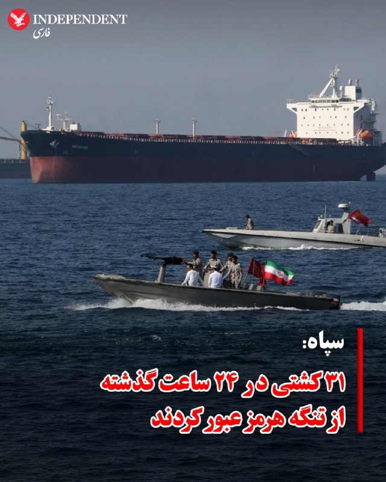

♦️روابط عمومی نیروی دریایی سپاه، روز پنجشنبه ۳۱ اردیبهشت اعلام کرد که در ۲۴ ساعت گذشته، ۳۱ کشتی از تنگه هرمز عبور کرده‌اند. سپاه بدون اعلام آمار دقیق انواع شناورهای عبوری گفت که این کشتی‌ها شامل نفتکش، کانتینربر و سایر کشتی‌های تجاری بوده است.

پیش از این خبرنگار صداوسیما اعلام کرده بود که برای امروز نیز، ۳۰ شناور درخواست عبور خود را از طریق سامانه جدید کنترل تنگه هرمز ثبت کرده و هماهنگی با نیروهای مسلح جمهوری اسلامی برای عبور از این آبراه را آغاز کرده‌اند.
‌🇸🇦 Indypersian

🤖 @VahidOOnLine

## VahidOOnLine — post 241347

♦️امیرحسین بانکی‌پور، رئیس کمیته جمعیت و خانواده مجلس شورای اسلامی روز پنجشنبه با اشاره به بحران جمعیت در ایران گفت: ما در کشور زمین زیاد داریم، باید نهضت زمین دادن به زوج‌های جوان شکل بگیرد.

بانکی‌پور در گفتگو با خبرگزاری دانشجو تاکید کرد که خطر بزرگتر از جنگ ۴۰ روزه، جنگ جمعیتی است.

او با این ادعا که «اگر به جوان‌ها زمین بدهند تورم کاهش پیدا می‌کند»، اضافه کرد: «قانون جوانی جمعیت اگر دقیق و کامل اجرا شود بسیاری از مشکلات جوانان حل خواهد شد.»

این اظهارات در حالی مطرح شده است که علیرضا رئیسی، معاون وزیر بهداشت جمهوری اسلامی روز چهارشنبه ۲۳ اردیبهشت در یک نشست خبری با هشدار درباره سیر نزولی جمعیت‌ در ایران گفت: «زنگ خطر جمعیت در استان‌های گیلان، مازندران و البرز به صدا درآمده است.»
رئیسی همچنین درباره پیری جمعیت ایران نیز هشدار داد و تاکید کرد: «طی دو یا سه دهه آینده از هر سه ایرانی یک نفر سالمند است.»
‌🇸🇦 Indypersian

🤖 @VahidOOnLine

## VahidOOnLine — post 241346

  

خبرنگار فاکس نیوز به نقل از یک منبع آگاه از روند مذاکرات خبر داد که کاخ سفید گزارش خبرگزاری رویترز مبنی بر این‌که مجتبی خامنه‌ای دستور داده اورانیوم با غنای بالا در ایران باقی بماند را رد کرده و آن را نادرست دانسته است.
پیش‌تر رویترز به نقل از دو منبع ارشد در حکومت ایران گزارش داد مجتبی خامنه‌ای، رهبر جمهوری اسلامی، دستور داده ذخایر اورانیوم با غنای بالا نباید از ایران خارج شود.
به گفته این منابع، این دستور موضع تهران را در برابر یکی از اصلی‌ترین خواسته‌های آمریکا در مذاکرات برای پایان دادن به جنگ آمریکا و اسرائیل علیه جمهوری اسلامی سخت‌تر کرده است.
مقام‌های اسرائیلی نیز به رویترز گفته‌اند دونالد ترامپ به اسرائیل اطمینان داده هر توافق احتمالی باید شامل خروج ذخایر اورانیوم غنی‌شده از ایران باشد.
‌🏁 🇬🇧 IranintlTV

🤖 @VahidOOnLine

## VahidOOnLine — post 241345

  <a href="telegram/content/VahidOOnLine_241345_1779377321.mp4" target="_blank">🎬 Download video</a>

دادستان‌های فدرال آلمان اعلام کردند که علیه یک شهروند دانمارکی و یک شهروند افغان به اتهام مشارکت در طرح‌ریزی برای قتل رهبران برجسته سازمان‌های یهودی در آلمان به نفع جمهوری اسلامی، کیفرخواست کیفری صادر کرده‌اند.
متهمان که طبق قوانین حریم خصوصی آلمان تنها با نام «علی س.» (شهروند دانمارک) و «تواب م.» (شهروند افغان) معرفی شده‌اند، به مشارکت در اقدام به قتل متهم هستند.
علی س. متهم است که برای سرویس اطلاعاتی سپاه پاسداران کار می‌کرده و ارتباط نزدیکی با واحد ویژه آن، نیروی قدس، داشته است.
دادستان‌ها گفتند او در اوایل سال ۲۰۲۵ مأمور شده بود اطلاعاتی درباره رئیس شورای مرکزی یهودیان در آلمان، یوزف شوستر، و رئیس انجمن آلمان–اسرائیل، فولکر بک، جمع‌آوری کند.
همچنین به او دستور داده شده بود که از دو فروشنده مواد غذایی یهودی در برلین جاسوسی کند.
دادستان‌ها اعلام کردند: «همه این اقدامات برای تسهیل برنامه‌ریزی حملات قتل و آتش‌سوزی در آلمان انجام می‌شد.»
‌🏁 🇬🇧 ManotoTV

🤖 @VahidOOnLine

## VahidOOnLine — post 241344

  <a href="telegram/content/VahidOOnLine_241344_1779377322.mp4" target="_blank">🎬 Download video</a>

مقام‌های هندی اعلام کرده‌اند که اولویت آن‌ها بازگرداندن کشتی‌های این کشور است که در خلیج فارس گرفتار شده‌اند، و تنها پس از بازگشت این کشتی‌ها درباره ارسال مجدد آن‌ها برای بارگیری سوخت تصمیم‌گیری خواهد شد.
یکی از مقامات ارشد وزارت بنادر و کشتیرانی هند گفته است که هدف اصلی، خارج کردن همه کشتی‌های هندی از تنگه هرمز است و تنها زمانی که شرایط مناسب باشد، کشتی‌های جدید به سمت غرب تنگه اعزام خواهند شد.
به گفته او، در حال حاضر ۱۳ کشتی با پرچم هند و یک کشتی متعلق به هند همچنان در غرب تنگه گیر کرده‌اند. از زمان آغاز درگیری‌ها و اختلال در تنگه هرمز، بخشی از کشتی‌های حامل سوخت از این منطقه عبور کرده‌اند، اما جریان تجارت به‌شدت مختل شده است.
هند پیش از این بیش از ۴۰ درصد نفت خام و حدود ۹۰ درصد گاز مایع مورد نیاز خود را از طریق همین مسیر وارد می‌کرد و اکنون با یکی از شدیدترین اختلال‌های تأمین گاز آشپزی در دهه‌های اخیر روبه‌رو است.
‌🏁 🇬🇧 ManotoTV

🤖 @VahidOOnLine

## VahidOOnLine — post 241343

  <a href="telegram/content/VahidOOnLine_241343_1779377322.mp4" target="_blank">🎬 Download video</a>

به گفته منابع آگاه به رویترز، سوریه ماه آینده به‌عنوان کشور مهمان در اجلاس گروه هفت G7 در فرانسه شرکت خواهد کرد و توسط رئیس‌جمهور احمد الشرع نمایندگی می‌شود؛ این نخستین حضور سوریه در این نشست از زمان تاسیس گروه هفت در سال ۱۹۷۵ است.
دعوت رسمی برای حضور در اجلاس ۱۵ تا ۱۷ ژوئن در فرانسه به وزیر دارایی سوریه تحویل داده شده است. گفته می‌شود مشارکت سوریه احتمالا بر نقش این کشور به‌عنوان یک «هاب استراتژیک بالقوه برای زنجیره‌های تامین» پس از بسته شدن تنگه هرمز متمرکز خواهد بود.
سوریه پس از ۱۴ سال جنگ داخلی و در حالی که در حال بازسازی اقتصاد و تلاش برای جذب سرمایه‌گذاری خارجی است، همچنان با چالش‌های جدی در زمینه تحریم‌ها و بازگشت روابط بانکی عادی مواجه است.
‌🏁 🇬🇧 ManotoTV

🤖 @VahidOOnLine

## VahidOOnLine — post 241342

  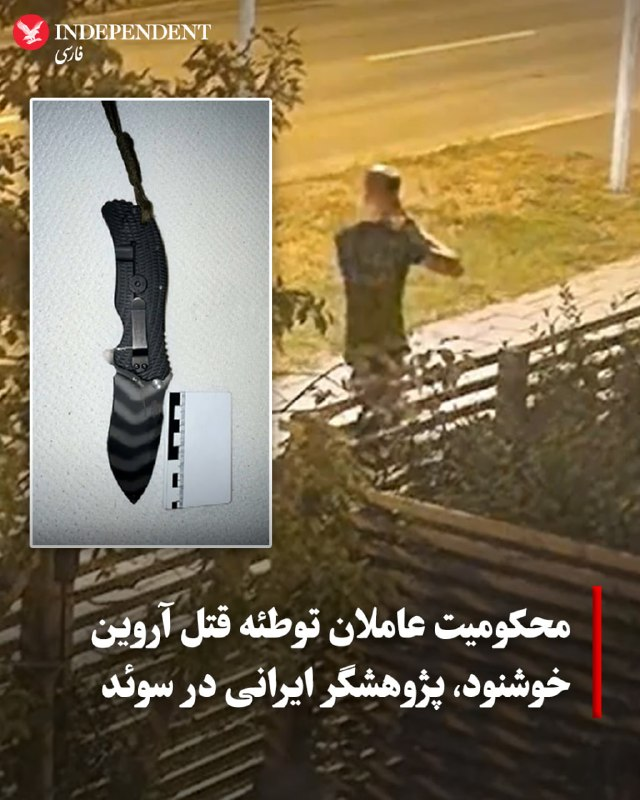

♦️ دادگاهی در سوئد روز پنجشنبه ۳۱ اردیبهشت یک نوجوان را به دلیل اقدام مسلحانه با چاقو علیه آروین خوشنود، پژوهشگر و تحلیلگر ایرانی، به تحمل نزدیک به چهار سال حبس در کانون اصلاح و تربیت محکوم کرد. این نوجوان به همراه دو تن دیگر، به اتهام توطئه برای قتل این پژوهشگر مقیم سوئد محکوم شده‌اند؛ پرونده‌ای که خوشنود تاکید دارد جمهوری اسلامی پشت آن قرار دارد.

بر اساس حکم دادگاه شهر «اودوالا»، این نوجوان از طریق برنامه‌های پیام‌رسان توسط دیگر متهمان اجیر شده و در ازای دریافت پول، وعده قتل این پژوهشگر را داده بود. او در سپتامبر سال گذشته با سلاح سرد به خانه خوشنود در شهر مالمو رفت. وقتی همسر خشنود در را باز کرد این نوجوان که رفتاری عصبی داشت خواست که با او ملاقات کند. در این حین، خوشنود در خانه ماند و با پلیس تماس گرفت. وکیل او اعلام کرد که موکلش از آن زمان در محلی دیگر و به‌صورت مخفی زندگی می‌کند.

دادگاه با تغییر اتهام از «اقدام به قتل» به «مقدمه‌چینی برای ارتکاب قتل»، متهم اصلی را به سه سال و ۹ ماه حبس در مرکز بازداشت نوجوانان محکوم کرد.
‌🇸🇦 Indypersian

🤖 @VahidOOnLine

## VahidOOnLine — post 241341

  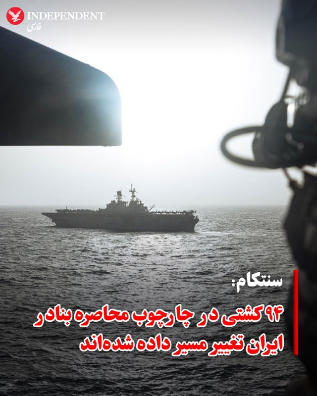

♦️ فرماندهی مرکزی ایالات متحده (سنتکام) روز پنجشنبه ۳۱ اردیبهشت اعلام کرد که در جریان محاصره دریایی بنادر ایران، ۹۴ کشتی تجاری تغییر مسیر داده شده‌اند و چهار کشتی دیگر نیز «زمین‌گیر و ناگزیر به توقف» شده‌اند.

دولت ترامپ با هدف تحت فشار قرار دادن تهران برای دستیابی به توافقی جهت پایان دادن به جنگ، بنادر ایران را تحت محاصره دریایی قرار داده است. سنتکام روز گذشته ویدیویی از ورود نیروهای آمریکایی به یکی از کشتی‌هایی که قصد داشت از خط محاصره عبور کند را منتشر کرد.
‌🇸🇦 Indypersian

🤖 @VahidOOnLine

## VahidOOnLine — post 241340

  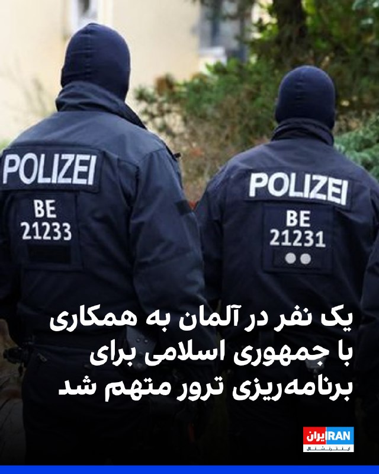

آلمان فرد مظنون به همکاری با جمهوری اسلامی را به اتهام برنامه‌ریزی برای ترور چهره‌های یهودی و یک نماینده سابق حامی اسرائیل تحت پیگرد قرار داد.

مظنون این پرونده، شهروندی دانمارکی است که ژوئن سال گذشته در دانمارک بازداشت شد.

یکی از همدستان او، شهروند اهل افغانستان است که در ماه نوامبر در دانمارک بازداشت شد.
‌🏁 🇬🇧 IranintlTV

🤖 @VahidOOnLine

## VahidOOnLine — post 241339

  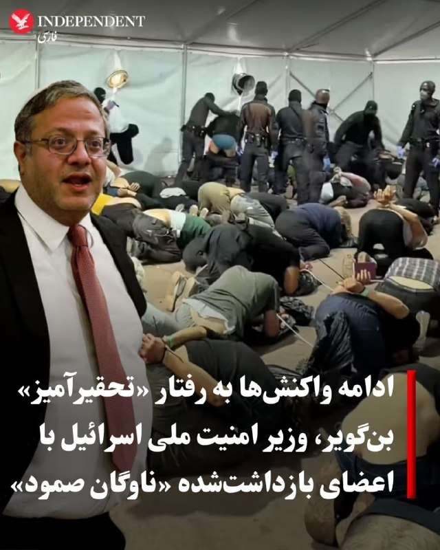

♦️انتشار گزارش‌ها و تصاویری از رفتار تحقیرآمیز و بدرفتاری با اعضای بازداشت‌شده «ناوگان صمود» تحت نظارت مستقیم ایتامار بن‌گویر، وزیر امنیت ملی اسرائیل، موجی از واکنش‌های بین‌المللی و داخلی را به همراه داشته است.
با توجه به حضور بیش از ۴۰۰ فعال از ۴۰ کشور جهان در این ناوگان، برخی کشورها واکنش‌های رسمی بسیار تندی نشان داده‌اند.
در تازه‌ترین واکنش‌ها لهستان ورود وزیر امنیت ملی اسرائیل به این کشور را ممنوع کرد؛ ایتالیا و ایرلند نیز خواستار تحریم بن‌گویر از سوی اتحادیه اروپا شدند. استرالیا و نیوزلند هم روز پنجشنبه این اقدام را محکوم کرده و خواستار ارائه توضیح از سوی اسرائیل شدند.
روز گذشته وزارت امور خارجه کشورهای کانادا، هلند، فرانسه و اسپانیا در اعتراض به این اقدام و با خواسته ارائه توضیح، سفیران اسرائیل در این کشورها را احضار کردند. وزارت امور خارجه کشورهای بلژیک، آلمان، بریتانیا نیز ضمن ابراز انزجار از «سوءرفتار» با این کنشگران، خواستار ارائه توضیح از سوی مقام‌های اسرائیل شدند.
‌🇸🇦 Indypersian

🤖 @VahidOOnLine

## VahidOOnLine — post 241338

  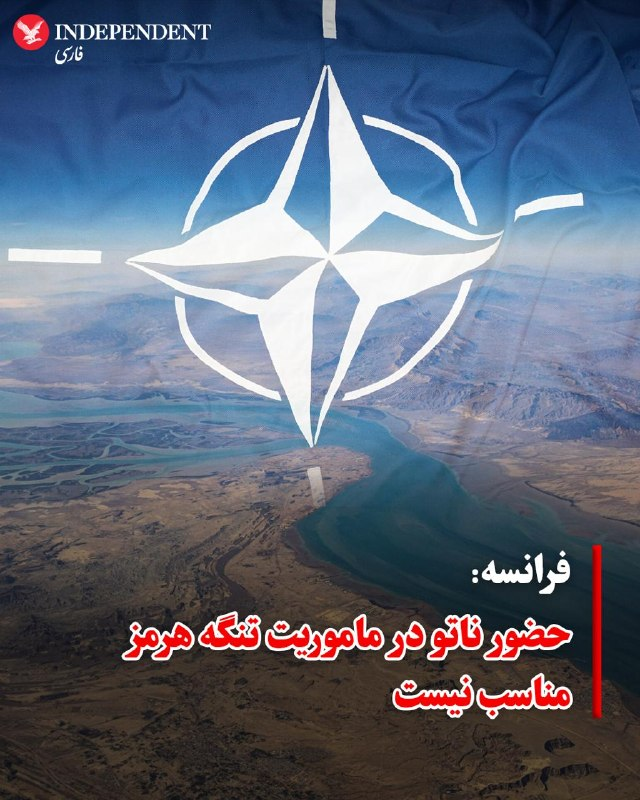

♦️وزارت امور خارجه فرانسه روز پنجشنبه ۳۱ اردیبهشت، ایده نقش‌آفرینی ناتو در یک ماموریت بین‌المللی برای تامین آزادی کشتیرانی در تنگه هرمز را رد کرد.

پاسکال کُنفاوِرو، سخنگوی وزارت امور خارجه فرانسه، در نشست خبری هفتگی خود به خبرنگاران گفت: «موضع ما روشن و همیشگی است. پیمان آتلانتیک شمالی مربوط به منطقه آتلانتیک شمالی است. تمرکز بر مسئله خاورمیانه و تنگه هرمز، نه هدف این پیمان است و نه ناتو در واقع ائتلاف مناسبی برای ورود به این موضوع به شمار می‌رود.»
‌🇸🇦 Indypersian

🤖 @VahidOOnLine

## VahidOOnLine — post 241337

  <a href="telegram/content/VahidOOnLine_241337_1779377326.mp4" target="_blank">🎬 Download video</a>

طبق اطلاعات رسیده به ایران‌اینترنشنال، جاویدنام مصطفی سلامی شامگاه ۱۹ دی‌ماه ۱۴۰۴ حوالی ساعت ۸ شب در فردیس کرج هدف شلیک نیروهای حکومتی قرار گرفت و در برابر همسر، فرزند و اعضای خانواده‌اش از ناحیه قفسه سینه مجروح شد.

براساس روایت خانواده، نزدیکانش ابتدا مصطفی را به درمانگاه رساندند و سپس با آمبولانس به بیمارستان منتقل کردند. ماموران هنگام انتقال او با حمله به همراهان مانع حضورشان در محل شدند. پس از رسیدن به بیمارستان، پیکر مصطفی نزدیک دو ساعت ناپدید شد؛ سپس به خانواده اطلاع دادند که گلوله ریه او را سوراخ کرده و این جاویدنام بر اثر شدت جراحات، تنگی نفس و خونریزی شدید جان باخته است.
‌🏁 🇬🇧 IranintlTV

🤖 @VahidOOnLine

## VahidOOnLine — post 241336

  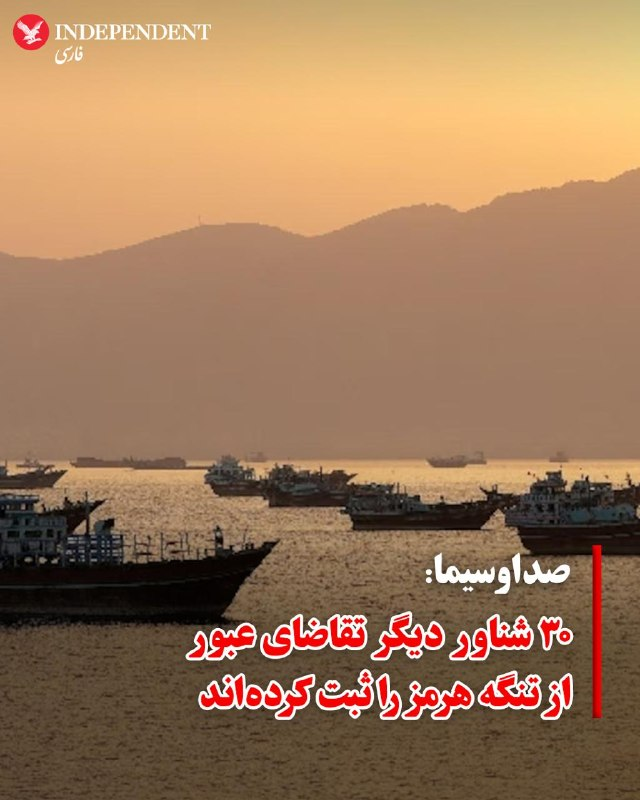

♦️خبرنگار صداوسیما روز پنجشنبه ۳۱ اردیبهشت گزارش داد که در ۲۴ ساعت گذشته، ۳۰ شناور دیگر از طریق سامانه جدیدی که جمهوری اسلامی به‌راه انداخته، هماهنگی‌ها برای عبور از تنگه هرمز را آغاز کرده‌اند. او پیش‌بینی کرد که با توجه به روند هماهنگی‌ها، این ۳۰ شناور بتوانند تا پایان روز پنجشنبه از این آبراه حیاتی عبور کنند.

خبرنگار صداوسیما تاکید کرد که این عبور مطابق با دستورالعمل تعیین‌شده سپاه پاسداران و از مسیر نزدیک به سواحل ایران انجام خواهد شد.

اگرچه تقریبا تمام کشورهای ذی‌نفع، با سازوکار تعیین‌شده جمهوری اسلامی مخالف بوده و هرگونه عوارض‌گیری از کشتی‌ها را خلاف قوانین بین‌المللی می‌دانند، با توجه به مدت طولانی محصور ماندن ملوان‌ها در خلیج فارس، بعضی از شرکت‌های صاحب شناورها به خواسته‌های سپاه پاسداران تن داده‌اند.
‌🇸🇦 Indypersian

🤖 @VahidOOnLine

## VahidOOnLine — post 241335

  

اطلاعات رسیده به ایران‌اینترنشنال از فشار نهادهای حکومتی بر خانواده‌های دانش‌آموزان کشته‌شده در حمله به مدرسه میناب و برگزاری مراسم حکومتی در این شهر خبر داد. با وجود شوک گسترده در شهر پس از وقوع حادثه، برخی خانواده‌ها تحت فشار قرار گرفته‌اند تا در مراسم‌های حکومتی شرکت کنند.
بر اساس این اطلاعات، فضای بهشت‌زهرای میناب به محل تجمع نیروها و حامیان حکومت تبدیل شده و افرادی از عراق برای برپایی موکب به این شهر آمده‌اند. برخی از این افراد شب‌ها پس از تجمعات خیابانی در بهشت‌زهرا مستقر می‌شوند.
تعدادی از خانواده‌های دانش‌آموزان کشته‌شده با برگزاری این مراسم‌ها مخالف بوده‌اند، اما برای حضور و سخنرانی در برنامه‌ها تحت فشار قرار گرفته‌اند.
در همین زمینه یک منبع مطلع، از وضعیت روحی نامناسب مادر یکی از دانش‌آموزان که دو فرزند خود را از دست داده خبر داد و گفت با وجود شرایط شدید روحی، از او خواسته می‌شود در مراسم‌ها حضور پیدا کند.
نیروهای حاضر در بهشت‌زهرا با سلاح رفت‌وآمد می‌کنند و تمرکز اصلی بر تهیه عکس و ویدیو برای شبکه‌های اجتماعی است.
‌🏁 🇬🇧 IranintlTV

🤖 @VahidOOnLine

## VahidOOnLine — post 241334

  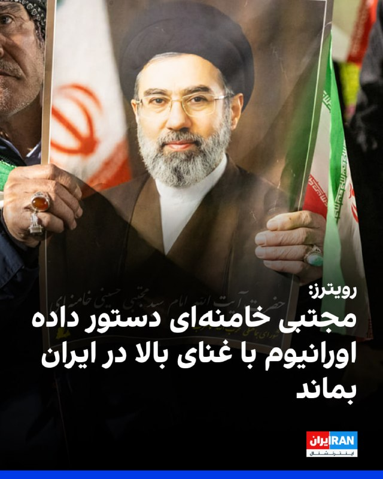

خبرگزاری رویترز به نقل از دو منبع ارشد در حکومت ایران گزارش داد مجتبی خامنه‌ای، رهبر جمهوری اسلامی، دستور داده ذخایر اورانیوم با غنای بالا نباید از ایران خارج شود.

به گفته این منابع، این دستور موضع تهران را در برابر یکی از اصلی‌ترین خواسته‌های آمریکا در مذاکرات برای پایان دادن به جنگ آمریکا و اسرائیل علیه جمهوری اسلامی سخت‌تر کرده است.

مقام‌های اسرائیلی نیز به رویترز گفته‌اند دونالد ترامپ به اسرائیل اطمینان داده هر توافق احتمالی باید شامل خروج ذخایر اورانیوم غنی‌شده از ایران باشد.

یکی از منابع ایرانی به رویترز گفت دستور رهبر جمهوری اسلامی و اجماع در ساختار حاکمیت این است که ذخایر اورانیوم غنی‌شده نباید از کشور خارج شود.

به گفته منابع رویترز، مقام‌های جمهوری اسلامی معتقدند انتقال این مواد به خارج، جمهوری اسلامی را در برابر حملات احتمالی آینده آمریکا و اسرائیل آسیب‌پذیرتر می‌کند.
‌🏁 🇬🇧 IranintlTV

🤖 @VahidOOnLine

## VahidOOnLine — post 241333

  

وزارت خارجه اسرائیل روز پنج‌شنبه اعلام کرد که همه فعالان بازداشت شده ناوگان شکستن محاصره غزه از این کشور اخراج شده‌اند.
این وزارتخانه افزود: «اسرائیل اجازه هیچ‌گونه نقض محاصره دریایی قانونی غزه را نخواهد داد.»
روز چهارشنبه نیز وزیر خارجه ایتالیا خواستار بررسی تحریم ایتامار بن‌گویر، وزیر امنیت ملی اسرائیل، از سوی اتحادیه اروپا شد و دلیل آن را نحوه برخورد او با فعالان بازداشت‌شده ناوگان شکستن محاصره غزه عنوان کرد.
بریتانیا نیز اعلام کرد در پی انتشار ویدیویی از تمسخر فعالان بازداشت‌شده از سوی بن‌گویر، کاردار اسرائیل را احضار کرده است. وزیر خارجه بریتانیا گفت از تمسخر فعالان کاروان «گلوبال صمود» شوکه شده است.
نیوزیلند هم اعلام کرد سفیر اسرائیل را در واکنش به این ویدیوها احضار می‌کند. وزیر خارجه کانادا نیز ویدیوی منتشرشده از بن‌گویر درباره فعالان کاروان غزه را «عمیقا نگران‌کننده و غیرقابل قبول» توصیف کرد.
‌🏁 🇬🇧 IranintlTV

🤖 @VahidOOnLine

## VahidOOnLine — post 241332

  

مسعود پزشکیان در دیدار با امیر حاتمی، فرمانده کل ارتش جمهوری اسلامی، گفت دولت با تمام ظرفیت در کنار نیروهای مسلح قرار دارد و از «نوسازی تجهیزات، تقویت زیرساخت‌های عملیاتی و افزایش توان بازدارندگی» حمایت می‌کند.

او افزود انسجام ملی، آمادگی دفاعی و حفظ اقتدار نیروهای مسلح جمهوری اسلامی، مهم‌ترین پشتوانه امنیت، ثبات و آرامش کشور در برابر تهدیدها و «جنگ ترکیبی دشمنان» است.
‌🏁 🇬🇧 IranintlTV

🤖 @VahidOOnLine

## VahidOOnLine — post 241331

♦️آتش‌سوزی، ساختمان یک معبد ژاپنی ۱۲۰۰ ساله را که گفته می‌شود میزبان شعله‌ای «خاموش‌نشدنی» بوده است، ویران کرد.

مقامات آتش‌نشانی اعلام کردند که تالار ریکادو ممکن است به دلیل «شعله مقدس» آتش گرفته باشد.

به گفته انجمن گردشگری میاجیما، شعله «خاموش‌نشدنی» در ابتدا توسط یک راهب بودایی در سال ۸۰۶ روشن شد و گفته می‌شود که بیش از ۱۲۰۰ سال به طور مداوم روشن بوده است.

از آن شعله «خاموش‌نشدنی» برای روشن کردن شعله ابدی پارک یادبود صلح هیروشیما، که یادبود قربانیان بمباران اتمی ۱۹۴۵ است، استفاده می‌شد.

بسیاری نگران هستند که اگر چنین حوادثی ادامه یابد، ژاپن می‌تواند تعداد بیشتری از معابد تاریخی بودایی و زیارتگاه‌های شینتو خود را از دست بدهد.
‌🇸🇦 Indypersian

🤖 @VahidOOnLine

## VahidOOnLine — post 241330

  <a href="telegram/content/VahidOOnLine_241330_1779377330.mp4" target="_blank">🎬 Download video</a>

ویدیوی رسیده به ایران اینترنشنال نشان می‌دهد که ۳۱ اردیبهشت‌ماه در کرمانشاه، صفی از خودروهای نظامی حامل نیرو، تجهیزات و سلاح‌های سنگین در خیابان تشکیل شده است.
‌🏁 🇬🇧 IranintlTV

🤖 @VahidOOnLine

## mwarmonitor — post 9421

🔹خبرنگار: دو روز پیش وقتی به گاوداری (بولپن) سر زدید، به ما گفتید که سازمان جهانی بهداشت «یه مقدار دیر عمل کرد»، فکر می‌کنم این عین عبارت شما در خصوص شناسایی این سویه بود. رئیس سازمان جهانی بهداشت حالا پاسخ داده و گفته که این مسئله ممکنه به این خاطر باشه که شما سیاست‌های سیستم بهداشت جهانی رو درک نمی‌کنید. پاسخی به این حرف دارید؟
🔸مارکو روبیو: خب، سازمان جهانی بهداشت متأسفانه در سراسر جهان عملکرد خوبی نداشته؛ فکر می‌کنم اون‌ها در طول دوران کووید به طرز فجیعی شکست خوردن و برای چین پنهان‌کاری کردن و به همین خاطره که ما داریم ازش خارج می‌شیم.
با این حال، ما قرار هست با هر کسی که می‌خواد اون مشکل رو برطرف کنه همکاری کنیم. هدف شماره یک ما در مورد ابولا، قبل از هر چیز دیگه‌ای... و ما فکر می‌کنیم این اتفاقی که داره اونجا برای مردم می‌افته وحشتناکه. ما در رابطه با توافق صلح با رواندا و غیره، حضور بسیار فعالی در جمهوری دموکراتیک کنگو داشته‌ایم.
اما اولویت شماره یک ما باید این باشه که این مسئله نباید ایالات متحده رو تحت تأثیر قرار بده؛ ما نباید اجازه بدیم موارد ابتلا به ابولا به اینجا بیاد. بنابراین دیدید که ما اجازه ورود به افراد رو نمی‌دیم؛ در واقع فکر می‌کنم دیشب پروازی به مقصد دیترویت داشتیم که مسیرش تغییر داده شد، چون ما باید از مردم آمریکا محافظت کنیم.
پس هدف شماره یک این هست که مطمئن بشیم ابولا هرگز به ایالات متحده نمی‌رسه. هدف شماره دو اینه که هر کاری از دستمون برمیاد انجام بدیم تا به مردم جمهوری دموکراتیک کنگو و کشورهای همسایه کمک کنیم تا این بیماری شیوع پیدا نکنه. و فکر می‌کنم در حال حاضر آمار به ۶۰۰ مورد تأییدشده یا شاید بیشتر رسیده که اطلاعات بیشتری در موردش کسب خواهیم کرد.
ما داریم آماده می‌شیم... فکر می‌کنم ما پیشنهاد تأمین مالی ۵۰ کلینیک اولی که دایر می‌شن و آماده‌ قدم برداشتن هستن رو داده‌ایم. بنابراین، ای کاش ما دو هفته پیش کار روی این موضوع رو شروع کرده بودیم و هشدار زودتر صادر شده بود.
من این رو هم درک می‌کنم که این شیوع بیماری در یک کشور جنگ‌زده و در یک منطقه بسیار روستایی آغاز شده که شاید شبکه‌های حمایتی که برخی از مناطق دیگه دارن رو نداشته باشه. اما باز هم می‌خوام برای همه تکرار کنم؛ ابولا برای ما مهم هست و نمی‌خوایم کسی بر اثر ابولا بمیره یا تحت تأثیر اون قرار بگیره، اما اولویت شماره یک ما همیشه این خواهد بود که مطمئن بشیم این بیماری به ایالات متحده نمیاد. این هدف شماره یک ماست.

@mwarmonitor

## mwarmonitor — post 9420

  <a href="telegram/content/mwarmonitor_9420_1779377332.mp4" target="_blank">🎬 Download video</a>

🎬 Video

## mwarmonitor — post 9419

🔴روبیو: مذاکرات با ایران «تا حدی پیشرفت داشته… نشانه‌های خوبی هم وجود دارد. نمی‌خواهم بیش از حد خوش‌بین باشم. باید ببینیم در چند روز آینده چه اتفاقی می‌افتد».

@mwarmonitor

## mwarmonitor — post 9418

🔴وزیر امور خارجه آمریکا: نظام عوارض در تنگه هرمز رسیدن به یک توافق دیپلماتیک را غیرممکن خواهد کرد.

@mwarmonitor

## mwarmonitor — post 9417

  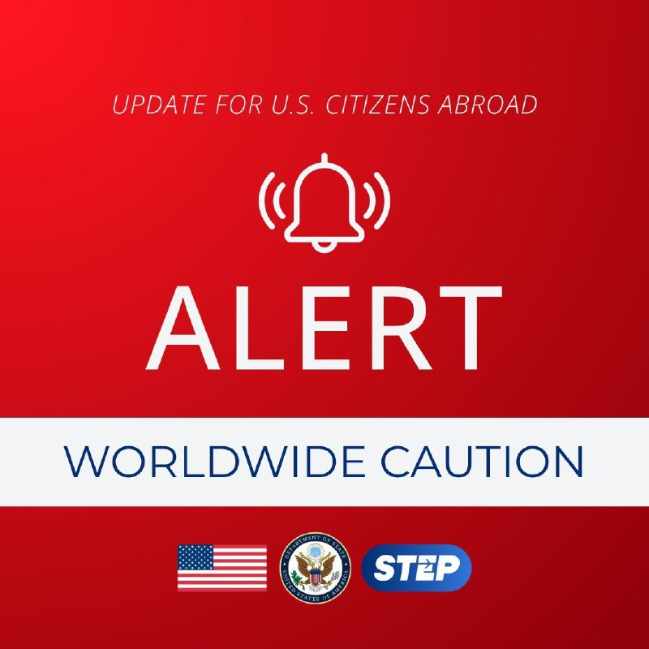

🔵وزارت امور خارجه آمریکا یک هشدار سفر جهانی صادر کرده و اعلام کرده است که از تاریخ ۲۱ مه ۲۰۲۶، همه شهروندان آمریکایی و افراد دارای اقامت دائم که قصد ورود به ایالات متحده را دارند و در ۲۱ روز قبل از ورود در جمهوری دموکراتیک کنگو، اوگاندا یا سودان جنوبی حضور داشته‌اند، فقط باید از طریق فرودگاه بین‌المللی واشنگتن دالس وارد کشور شوند تا تحت بررسی‌های امنیتی و بهداشتی تقویت‌شده قرار بگیرند. این اقدام در پی تشدید شیوع ابولا در آفریقای مرکزی انجام شده است. همچنین به آمریکایی‌ها توصیه شده است برای تغییر یا لغو احتمالی پروازها به‌دلیل این شیوع در آفریقا آماده باشند.

@mwarmonitor

## mwarmonitor — post 9416

🔵کاخ سفید گزارش قبلی را که ادعا می‌کرد تهران بر این موضوع اصرار دارد که اورانیوم غنی‌شده باید در داخل ایران باقی بماند، تکذیب کرد. I24 NEWS

@mwarmonitor

## mwarmonitor — post 9415

  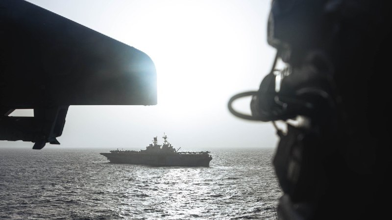

🔸تا تاریخ ۲۱ مه، نیروهای فرماندهی مرکزی آمریکا (سنتکام) ۹۴ کشتی تجاری را تغییر مسیر داده‌اند و ۴ فروند را نیز از کار انداخته‌اند، در حالی که برای اجرای محاصره و جلوگیری از ورود و خروج تجارت به بنادر ایران اقدام می‌کنند.

@mwarmonitor

## mwarmonitor — post 9414

🔴بلومبرگ: ایران در حال انجام مذاکراتی با سلطنت عمان درباره چگونگی ایجاد نوعی «نظام عوارض دائمی» است که می‌تواند کنترل ایران بر رفت‌وآمد کشتیرانی در تنگه هرمز را به‌صورت رسمی نهادینه کند.

@mwarmonitor

## mwarmonitor — post 9413

🔴خبرگزاری آسوشیتدپرس گزارش می‌دهد که وزیر خارجه ایران و قالیباف دیگر مذاکرات را در داخل ایران پیش نمی‌برند.

🔸آن‌ها مستقیماً به سپاه پاسداران (IRGC) منتقل شده‌اند. این به این معناست که ایران دیگر به ظاهر و جنبه‌های رسانه‌ای ماجرا اهمیت نمی‌دهد.

@mwarmonitor

## mwarmonitor — post 9412

🔴به گفته دو منبع ارشد ایرانی که با Reuters گفت‌وگو کرده‌اند، رهبر جمهوری اسلامی ایران دستور داده است که ذخایر اورانیوم با غنای نزدیک به سطح تسلیحاتی ایران باید در داخل کشور باقی بماند. 🔸به گفته این منابع، این دستور بازتاب‌دهنده یک اجماع گسترده در میان ساختار…

## mwarmonitor — post 9411

🔴مارک لوین ؛
ما الان کجا ایستاده‌ایم در مورد ایران؟

🔸رهبر جدید رژیم ایران اعلام کرده که اورانیوم غنی‌شده از کشور خارج نخواهد شد. آیا این خودش یک «خط قرمز» و نقطه انفجار نیست؟

🔹هیچ صحبتی درباره موضوع موشک‌های بالستیک نمی‌شود، در حالی که این یک مسئله بسیار بزرگ است.

🔹هیچ اشاره‌ای به مردم ایران وجود ندارد.

🔸و هیچ حرفی درباره اینکه اجرای واقعی یک توافق چه شکلی خواهد داشت، با توجه به اینکه رژیم در سال‌های آینده قصد پایبندی به هیچ توافقی را ندارد.

🔹این رژیم همچنین بر اساس آتش‌بس و تمدیدهای مداوم آن، در حال اعلام پیروزی است. آن‌ها باور ندارند که ما اراده لازم برای از سرگیری عملیات نظامی یا ادامه فشار اقتصادی را داریم. آن‌ها به‌خوبی از انتخابات میان‌دوره‌ای و فشار برای رسیدن به یک توافق آگاه هستند.

🔸همچنین به نظر می‌رسد موضوعات روی میز برای رسیدن به توافق در حال محدود شدن هستند. این برداشت را هم از گزارش‌ها و هم از کارشناسانی دارم که با ایدئولوژی و تاکتیک‌های رژیم ایران آشنا هستند.

@mwarmonitor

## mwarmonitor — post 9410

🔰اورتاگوس هشدار داد ایران در تلاش است «زمان بخرد» در حالی که حزب‌الله مانع صلح در لبنان می‌شود.

🔸مورگان اورتاگوس، مقام سابق دولت ترامپ، به فاکس نیوز دیجیتال گفت که ایران در طول تاریخ از مذاکرات برای به تعویق انداختن روندها استفاده کرده است، در حالی که تأکید کرد حزب‌الله — نه خود لبنان — همچنان بزرگ‌ترین مانع صلح بین اسرائیل و همسایگانش به شمار می‌رود.

🔴در ادامه تحلیل اورتگاس...
چیزی که من رئیس‌جمهور را به آن ترغیب می‌کنم این است که در تله‌ای که ایرانی‌ها دوست دارند پهن کنند، نیفتد؛ کاری که در ۴۷ سال گذشته انجام داده‌اند، یعنی طول دادن مسائل و زمان خریدن.
🔹آن‌ها رژیمی هستند که یک حکومت دینیِ انقلابی به شمار می‌رود. همان‌طور که امشب در سخنرانی‌ام به آن اشاره می‌کنم، آن‌ها تنها بقایایی از آن چیزی هستند که قبلاً بوده‌اند. رئیس‌جمهور به شکلی جدی آن‌ها را تضعیف کرده است، روشی که از زمان تأسیس جمهوری اسلامی توسط هیچ‌کس انجام نشده بود.
🔹اما معیارهای یک توافق خوب کاملاً مشخص است. پرزیدنت ترامپ در سال ۲۰۱۶ علیه برجام (JCPOA) - یعنی همان توافق هسته‌ای شکست‌خورده پرزیدنت اوباما - مبارزه کرد؛ او آن زمان درست می‌گفت و الان هم درست می‌گوید. معاون رئیس‌جمهور نیز امروز دوباره تأکید کرد که ایران هرگز به سلاح هسته‌ای دست پیدا نخواهد کرد.
🔸بنابراین، من مطمئنم که رئیس‌جمهور و تیم او معیارهای یک توافق خوب را درک می‌کنند؛ توافقی که قطعاً نمی‌تواند شبیه به چیزی مثل برجام باشد.

🔰«این حزب‌الله بود که تصمیم گرفت وارد این جنگ در ایران [لبنان] شود. دولت لبنان این تصمیم را نگرفت؛ این حزب‌الله بود که برای کشور لبنان تصمیم گرفت تا یک بار دیگر، آن را وارد جنگ کند.
🔹بنابراین، من فقط می‌خواهم بگویم که فکر می‌کنم هر دو طرف، یعنی اسرائیل و لبنان، در موقعیتی هستند که خواهان صلح‌اند، اما هر دو طرف این را درک می‌کنند که حزب‌الله همیشه یک مانع در راه صلح خواهد بود.
🔸حزب‌الله نجات‌دهنده مردم شیعه نیست؛ در واقع، آن‌ها همان کسانی هستند که یوغ و بار سنگین را بر گردن مردم شیعه می‌اندازند و به دلیل امتناعشان از داشتن یک رابطه مسالمت‌آمیز با همسایگان، اطمینان حاصل می‌کنند که این بار همان‌جا باقی بماند.»

🔴سناتور لیندسی گراهام ؛

🔹تحلیل بسیار خوبی از اهرم فشارهایی که ایالات متحده به‌دلیل اقدامات جسورانه رئیس‌جمهور ترامپ در اختیار دارد.
خواندنی است.

@mwarmonitor

## mwarmonitor — post 9409

  <a href="telegram/content/mwarmonitor_9409_1779377334.mp4" target="_blank">🎬 Download video</a>

🎬 Video

## mwarmonitor — post 9408

🔴یک مقام آمریکایی به فاکس نیوز گفت: ایران مصمم است اورانیوم غنی‌شده را در داخل مرزهای خود نگه دارد.

@mwarmonitor

## mwarmonitor — post 9407

🔴به گفته دو منبع ارشد ایرانی که با Reuters گفت‌وگو کرده‌اند، رهبر جمهوری اسلامی ایران دستور داده است که ذخایر اورانیوم با غنای نزدیک به سطح تسلیحاتی ایران باید در داخل کشور باقی بماند. 🔸به گفته این منابع، این دستور بازتاب‌دهنده یک اجماع گسترده در میان ساختار…

## mwarmonitor — post 9406

🔴 مقامات وزارت دادگستری اعلام کردند که دولت ترامپ این هفته بیش از ۸۰ قاضی جدید فدرال در امور مهاجرت را به سیستم اضافه کرده است؛ اقدامی در راستای جدیدترین تلاش این دولت برای تسریع رسیدگی به پرونده‌های اخراج (دیپورت) و پیشبرد سرکوب گسترده دولت در زمینه مهاجرت غیرقانونی. CBS

@mwarmonitor

## mwarmonitor — post 9405

🔸وزارت خارجه بریتانیا با وجود ادامه درگیری‌ها، تیم بحران ایران را به نصف کاهش می‌دهد، طبق گزارش بلومبرگ. تقریباً همه کارکنان زیر سطح مدیریت ارشد باید دوباره برای شغل‌هایشان درخواست بدهند و هفته آینده مشخص خواهد شد که آیا در سمت خود باقی می‌مانند یا خیر.

@mwarmonitor

## mwarmonitor — post 9404

🔴نماینده کنگره آمریکا، «تام کول» (جمهوری‌خواه از اوکلاهما) گفته است که وزارت دفاع آمریکا ممکن است بودجه مربوط به عملیات‌های ایران را تا «احتمالاً ماه اوت» تمام کند، طبق گزارش Punchbowl News. برخی قانون‌گذاران از پنتاگون خواسته‌اند درخواست بودجه خود را به کنگره ارسال کند تا بتوانند کار روی یک بسته بودجه تکمیلی را آغاز کنند.

@mwarmonitor

## mwarmonitor — post 9403

📊 بر اساس آخرین نظرسنجی Fox News، حدود ۶۵٪ از رأی‌دهندگان می‌گویند که آمریکا در جنگ با ایران در حال پیروزی است.

🔸این در حالی است که وزارت خارجه ایران در حال بررسی جدیدترین پیشنهاد صلح آمریکا است و هم‌زمان میانجی‌های پاکستانی برای پیشبرد یک توافق به تهران سفر کرده‌اند.

🔹در حالی که دولت آمریکا نشانه‌ای از کاهش تمرکز بر اقدامات نظامی در خاورمیانه نشان نمی‌دهد، آمریکایی‌ها به‌طور فزاینده‌ای نسبت به قیمت بنزین و هزینه کلی زندگی ابراز نگرانی می‌کنند.

@mwarmonitor

## mwarmonitor — post 9402

🛢اگر کسی با هیجان خبری منتشر کرد که «جزیره خارک امروز در حال بارگیری چند نفتکش با نفت خام است»، به او بگویید ترکر تانکر می‌گوید این دو نفتکش کوچک از نوع Handymax (تقریباً 300,000 تا 350,000 بشکه نفت خام برای هر کشتی ) در حال بارگیری هستند تا محموله را برای پالایش در سایر پالایشگاه‌های داخل ایران منتقل کنند، ممنون.

@mwarmonitor

## pm_afshaa — post 91167

  <a href="telegram/content/pm_afshaa_91167_1779377336.webm" target="_blank">🎬 Download video</a>

🔴امارات در سال 2025 با تنها 49 ثانیه قطعی برق، رکورد کمترین میزان خاموشی برق در جهان رو ثبت کرد.

💧 Rainbet.com the #1 Non-KYC Crypto Casino & Sportsbook @rainbetcom

😁 @Pm_Afshaa

## pm_afshaa — post 91166

  <a href="telegram/content/pm_afshaa_91166_1779377337.webm" target="_blank">🎬 Download video</a>

🔴نیروی دریایی سپاه:
تو 24 ساعت اخیر 31 کشتی دیگر از تنگه هرمز با هماهنگی ما عبور کردن.

💧 Rainbet.com the #1 Non-KYC Crypto Casino & Sportsbook @rainbetcom

😁 @Pm_Afshaa

## pm_afshaa — post 91165

  <a href="telegram/content/pm_afshaa_91165_1779377337.webm" target="_blank">🎬 Download video</a>

🔴بلومبرگ: ایران در حال مذاکره با عمان درباره نحوه ایجاد نوعی سیستم عوارض دائمی است که کنترل این کشور بر ترافیک دریایی از طریق تنگه هرمز رو رسمیت میده.

💧 Rainbet.com the #1 Non-KYC Crypto Casino & Sportsbook @rainbetcom

😁 @Pm_Afshaa

## pm_afshaa — post 91164

  <a href="telegram/content/pm_afshaa_91164_1779377338.webm" target="_blank">🎬 Download video</a>

🔴وزیر امور خارجه آلمان:
ما بر تضمین آزادی دریانوردی و امنیت تدارکات متمرکز هستیم و آماده مشارکت در تلاش‌ها برای تامین امنیت تنگه هرمز هستیم.

💧 Rainbet.com the #1 Non-KYC Crypto Casino & Sportsbook @rainbetcom

😁 @Pm_Afshaa

## pm_afshaa — post 91163

🔴آسوشیتدپرس: عراقچی، وزیر خارجه ایران و قالیباف دیگه به هیچ عنوان مذاکرات رو در داخل ایران پیش نمی‌برن و کنترل کل ماجرا دست سپاه پاسدارانه

💧 Rainbet.com the #1 Non-KYC Crypto Casino & Sportsbook @rainbetcom

😁 @Pm_Afshaa

## pm_afshaa — post 91161

  <a href="telegram/content/pm_afshaa_91161_1779377338.webm" target="_blank">🎬 Download video</a>

🔴ترامپ در تروث سوشال، مقاله نیویورک پست رو انتشار داد با عنوان "چگونه تهران رو در سه حرکت درهم بشکنیم"

1- ادامهٔ محاصره و جنگ اقتصادی
آمریکا باید با محاصرهٔ دریایی، تحریم و بستن راه‌های دور زدن تحریم‌ها، اقتصاد ایران را تحت فشار شدیدتر قرار دهد تا حکومت از نظر مالی ضعیف شود.

2- تقویت برتری انرژی آمریکا
با افزایش نفوذ انرژی آمریکا در جهان، هم اثر افزایش قیمت نفت کنترل می‌شود و هم نفوذ چین تضعیف خواهد شد.

3- کنترل تنگهٔ هرمز با قدرت نظامی
نویسنده پیشنهاد می‌دهد ارتش آمریکا با عملیات دریایی و هوایی مسیر تنگهٔ هرمز را تحت کنترل بگیرد و آزادی عبور کشتی‌ها را تضمین کند؛ اقدامی که به گفتهٔ او باید همراه با تهدید جدی ایران در صورت نقض آتش‌بس باشد

💧Rainbet.com the #1 Non-KYC Crypto Casino & Sportsbook @rainbetcom

😁 @Pm_Afshaa

## pm_afshaa — post 91160

🔴تمامی فعالان گروه فشار ترکیه از اسرائیل اخراج شدن

💧 Rainbet.com the #1 Non-KYC Crypto Casino & Sportsbook @rainbetcom

😁 @Pm_Afshaa

## pm_afshaa — post 91159

  <a href="telegram/content/pm_afshaa_91159_1779377339.webm" target="_blank">🎬 Download video</a>

🔴سازمان انرژی بین‌المللی:
بازارهای نفت ممکنه در ماه‌های ژوئیه و آگوست به منطقه خطر برسه.

💧 Rainbet.com the #1 Non-KYC Crypto Casino & Sportsbook @rainbetcom

😁 @Pm_Afshaa

## pm_afshaa — post 91158

  <a href="telegram/content/pm_afshaa_91158_1779377339.webm" target="_blank">🎬 Download video</a>

🔴رویترز به نقل از منابع اسرائیلی:
ترامپ به اسرائیل قول داد که اورانیوم غنی‌شده از ایران خارج بشه و هر توافق احتمالی شامل این بند خواهد بود!

💧 Rainbet.com the #1 Non-KYC Crypto Casino & Sportsbook @rainbetcom

😁 @Pm_Afshaa

## DEJradio — post 4824

⭕️ آلمان دو نفر را به همکاری با جمهوری اسلامی برای حمله به یهودیان متهم کرد

دادستانی فدرال آلمان از اعلام جرم علیه یک شهروند دانمارکی و یک شهروند افغان به اتهام همکاری با نهادهای امنیتی جمهوری اسلامی خبر داد.
این دو نفر متهم‌اند که برای برنامه‌ریزی حمله به رهبران نهادهای یهودی در آلمان و هدف قرار دادن مشاغل یهودیان، اطلاعات گرد‌آوری کرده‌اند.
دادستانی آلمان اعلام کرد علی س، شهروند دانمارک با نیروی قدس سپاه پاسداران ارتباط نزدیک داشته و مامور جمع‌آوری اطلاعات درباره ژوزف شوستر، رئیس شورای مرکزی یهودیان آلمان، و فولکر بک، رئیس جامعه آلمانی-اسرائیلی، بوده است.
به گفتهٔ مقام‌های آلمانی، هدف از این اقدامات تسهیل برنامه‌ریزی برای قتل رهبران یهودی و آتش‌زدن مراکز متعلق به یهودیان در آلمان بود.

#یهودستیزی #آلمان
@DEJradio

## DEJradio — post 4823

⭕️ پارلمان اروپا قطعنامه‌ای تازه علیه سرکوب و اعدام‌ در ایران تصویب کرد

پارلمان اروپا روز پنج‌شنبه با اکثریت آرا قطعنامه‌ای را در محکومیت سرکوب معترضان، زندانیان سیاسی و «اقلیت‌های مذهبی» در ایران تصویب کرد.
نمایندگان پارلمان اروپا خواستار توقف فوری اعدام‌ها، آزادی زندانیان سیاسی و پاسخگو شدن مقام‌های جمهوری اسلامی شدند.
این قطعنامه همچنین بر گسترش تحریم‌ها علیه سپاه پاسداران، دستگاه قضائی و نهادهای سرکوبگر، تأکید کرده است.
نمایندگان پارلمان اروپا خواستار مسدود شدن دارایی‌ها و ممنوعیت ورود افراد وابسته به سپاه به اتحادیۀ اروپا شدند.

#اعدام #اتحادیه_اروپا
@DEJradio

## DEJradio — post 4822

⭕️ یک مقام مجلس گفت تصمیمی برای بازگشایی اینترنت جهانی گرفته نشده است

علی یزدی‌خواه، نائب‌ رئیس کمیسیون فرهنگی مجلس، گفت در شرایط کنونی تصمیمی برای بازگشایی اینترنت جهانی گرفته نشده و محدودیت‌ها ادامه می‌یابد.
او قطعی سراسری اینترنت را برگرفته از مصوبات شورای عالی امنیت ملی نظام و بر اساس «ملاحظات امنیتی» عنوان کرد.
یزدی‌خواه با وجود قطعی اینترنت مدعی شد بیش از ۹۰ درصد نیازهای مردم برطرف می‌شود و اعتراض گسترده‌ای به وضعیت موجود وجود ندارد.
نمایندۀ مجلس شورای اسلامی همچنین ادعا کرد تاکنون بیش از یک میلیون نفر در قالب طرح موسوم به «اینترنت پرو» به اینترنت بین‌الملل متصل شده‌اند.

#اینترنت #جمهوری_اسلامی
@DEJradio

## DEJradio — post 4821

⭕️ تجارت میان جمهوری اسلامی و اروپا در نخستین ماه جنگ سقوط کرد

داده‌های مرکز آمار اتحادیۀ اروپا نشان می‌دهد تجارت میان جمهوری اسلامی و اتحادیۀ اروپا در ماه مارس، همزمان با آغاز جنگ، به‌شدت کاهش یافت.
صادرات آلمان به خاک ایران در ماه مارس به کمتر از ۲۵ میلیون یورو رسید. این رقم، درحدود یک‌سوم ماه‌های پیش از جنگ است.
همچنین صادرات ایتالیا، فرانسه و اتریش به خاک ایران نیز کاهشی چشمگیر داشته است.
در سال پیشین میلادی حدودا۷۵۰ میلیون یورو از خاک ایران به اتحادیۀ اروپا صادرات صورت گرفته بود.
واردات به خاک ایران از مبدأ کشورهای اتحادیه نیز رقمی درحدود ۲.۷ میلیارد یورو بوده است.

#اقتصاد #تجارت #جمهوری_اسلامی
@DEJradio

## DEJradio — post 4820

⭕️ رایزنی مصر، قطر و عربستان دربارۀ مذاکرات تهران و واشینگتن

وزیر امور خارجۀ مصر در تماس‌های جداگانه با همتایان قطری و سعودی، در مورد مذاکرات میان جمهوری اسلامی و آمریکا گفت‌وگو کرد.
قاهره اعلام کرد محور این رایزنی‌ها مهار تنش‌های منطقه‌ای و پشتیبانی از مسیر دیپلماسی بود.
وزیر امور خارجۀ مصر از تصمیم دونالد ترامپ برای فرصت دادن به مذاکره با تهران، قدردانی کرد.
او گفت هر توافق احتمالی باید نگرانی‌های امنیتی کشورهای خلیج فارس را نیز در نظر بگیرد.
مصر پیش‌تر نیز در کنار قطر، پاکستان و ترکیه برای ممانعت از حمله به جمهوری اسلامی تلاش کرده بود.

#مذاکرات
@DEJradio

## DEJradio — post 4819

⭕️ رویترز: مجتبی خامنه‌ای با انتقال ذخایر اورانیوم از ایران مخالفت کرد

خبرگزاری رویترز به نقل از «منابع آگاه در جمهوری اسلامی» ادعا کرد مجتبی خامنه‌ای دستور داد ذخایر اورانیوم غنی‌شده از ایران خارج نشود.
به گزارش رویترز، این تصمیم یکی از اصلی‌ترین خواسته‌های آمریکا و اسرائیل در مذاکرات را با مانع روبه‌رو کرده است.
منابع جمهوری اسلامی به رویترز گفتند تهران نگران است آتش‌بس کنونی فرصتی برای تجدید قوای آمریکا و اسرائیل و مقدمۀ حملات تازه باشد.
رویترز همچنین از بررسی گزینه‌هایی مانند رقیق‌سازی ذخایر اورانیوم زیر نظر آژانس بین‌المللی انرژی اتمی خبر داد.
منابع دژ می‌گویند مجتبی خامنه‌ای قدرت تصمیم‌گیری ندارد و دستوراتی که به نقل از او اعلام می‌شود، در یکی از هسته‌های سپاه تنظیم می‌شود.

#موشتبا #غنی‌سازی #اورانیوم
@DEJradio

## DEJradio — post 4818

⭕️ مجتبی خامنه‌ای برای زنده ماندن از الگوی بن‌لادن استفاده می‌کند

شبکۀ فاکس‌نیوز، به نقل از عمر محمد، کارشناس مبارزه با تروریسم، گزارش داد مجتبی خامنه‌ای نزدیک به سه ماه است در مخفیگاه زندگی می‌کند.
به گفتۀ این کارشناس، شیوۀ پنهان شدن رهبر تازۀ جمهوری اسلامی یادآور سال‌های پایانی زندگی اسامه بن‌لادن، رهبر القاعده است.
او گفت جمهوری اسلامی احتمالا از تجربۀ اختفای بن‌لادن در مجتمع‌های حفاظت‌شده و نزدیک مراکز نظامی الگو گرفته است.
فاکس‌نیوز در این گزارش از زندگی مجتبی خامنه‌ای بدون هیچ ارتباط مخابراتی خبر داده است. بنا بر گزارش‌ها، مجتبی خامنه‌ای، در سایت‌های زیرزمینی سپاه پنهان شده است.

#موشتبا
@DEJradio

## mamlekate — post 103564

📝 ترامپ: مذاکرات با تهران در مراحل نهایی است، توافق نکنند حمله می‌کنیم

دونالد ترامپ، رییس‌جمهوری آمریکا، چهارشنبه ۳۰ اردیبهشت گفت مذاکرات با جمهوری اسلامی در مراحل نهایی قرار دارد اما هم‌زمان هشدار داد که در صورت شکست مذاکرات، حملات بیشتری علیه جمهوری اسلامی انجام خواهد شد. این اظهارات هم‌زمان با سفر وزیر کشور پاکستان به تهران مطرح شد.

@mamlekate

## VahidOnline — post 75596

  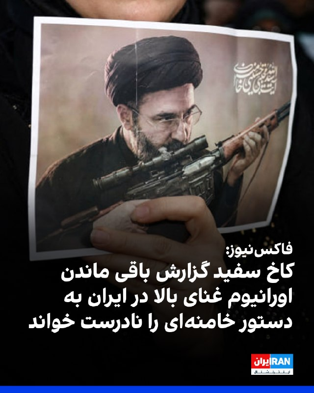

خبرنگار فاکس نیوز به نقل از یک منبع آگاه از روند مذاکرات خبر داد که کاخ سفید گزارش خبرگزاری رویترز مبنی بر این‌که مجتبی خامنه‌ای دستور داده اورانیوم با غنای بالا در ایران باقی بماند را رد کرده و آن را نادرست دانسته است.
@VahidOOnLine

📡 @VahidOnline

## VahidOnline — post 75595

  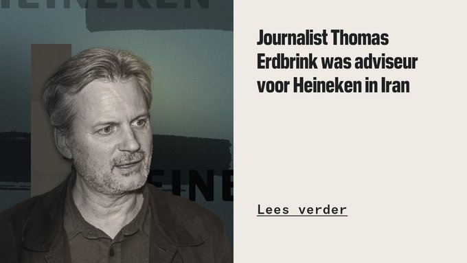

رسانه تحقیقی FTM هلند در گزارشی نوشته که توماس اردبرینک، خبرنگار هلندی نیویورک‌تایمز و شبکه NOS در ایران، همزمان مشاور شرکت آبجوسازی هینکن هم در ایران بوده و برای این کار ماهانه تا یک‌سال ۵ هزار یورو دریافت می‌کرد. اردبرینک دریافت مبلغ را انکار کرده.

طبق این گزارش این روزنامه‌نگار به طور منظم کارهای جانبی (پروژه‌ای) برای این شرکت آبجوسازی در ایران انجام می‌داده است و نه تنها کارمندان اعزامی و بازدیدکنندگان را در تهران می‌گردانده، بلکه گفته این شرکت آبجوسازی را با وکلا و مشاوران محلی نیز مرتبط کرده است.
FSeifikaran

📡 @VahidOnline

## VahidOnline — post 75594

  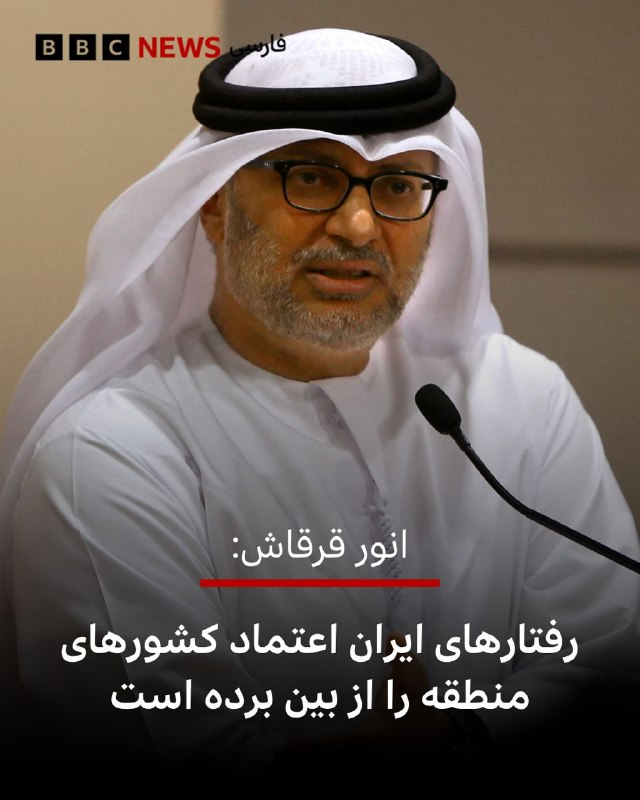

انور قرقاش، مشاور ارشد رئیس دولت امارات متحده عربی، می‌گوید که برخی رفتارهای ایران در سال‌های گذشته باعث کاهش اعتماد میان کشورهای منطقه خلیج فارس شده است.

او در پیامی در شبکه اجتماعی ایکس نوشت که کشورهای منطقه طی سال‌های طولانی با «رفتارهای زورگویانه و تهدیدآمیز» ایران روبه‌رو بوده‌اند؛ رفتارهایی که به بخشی از واقعیت سیاسی خلیج فارس تبدیل شده است.

آقای قرقاش همچنین تاکید کرد که شکاف میان مواضع تند و ادعاهای دوستی از سوی ایران، باعث از بین رفتن اعتماد و اعتبار شده است «و امروز، پس از تجاوز وحشیانه ایران، حکومت ایران تلاش می‌کند واقعیت تازه‌ای را که از یک شکست آشکار نظامی به‌وجود آمده تثبیت کند؛ اما تلاش برای کنترل تنگه هرمز یا تعرض به حاکمیت دریایی امارات متحده عربی چیزی جز خیال‌پردازی و آرزوهای دست‌نیافتنی نیست.»
@VahidHeadline

📡 @VahidOnline

## VahidOnline — post 75593

  <a href="telegram/content/VahidOnline_75593_1779377341.mp4" target="_blank">🎬 Download video</a>

بریتانیا از توافق تجاری ۵ میلیارد دلاری با کشورهای خلیج فارس رونمایی کرد؛ توافقی که در بحبوحه تنش‌های منطقه‌ای پس از جنگ ایران، به گفته لندن «پیامی از ثبات و اعتماد» به بازارها می‌دهد.
این توافق با شورای همکاری خلیج فارس شامل عربستان، امارات، قطر، کویت، عمان و بحرین است و قرار است سالانه حدود ۳.۷ میلیارد پوند به اقتصاد بریتانیا اضافه کند.
لندن می‌گوید ۹۳ درصد تعرفه‌های کشورهای خلیج فارس برای کالاهای بریتانیایی حذف می‌شود؛ از جمله محصولات غذایی، خودرو، صنایع هوافضا و الکترونیک.
در مقابل، بریتانیا نیز برخی تعرفه‌ها را کاهش می‌دهد، هرچند نفت و گاز کشورهای عربی پیش‌تر هم بدون تعرفه وارد بریتانیا می‌شد.
فعالان حقوق بشر از نبود بندهای الزام‌آور درباره حقوق بشر در این توافق انتقاد کرده‌اند و آن را «عقب‌گرد اخلاقی» توصیف کردند.
@VahidOOnLine

📡 @VahidOnline

## VahidOnline — post 75592

  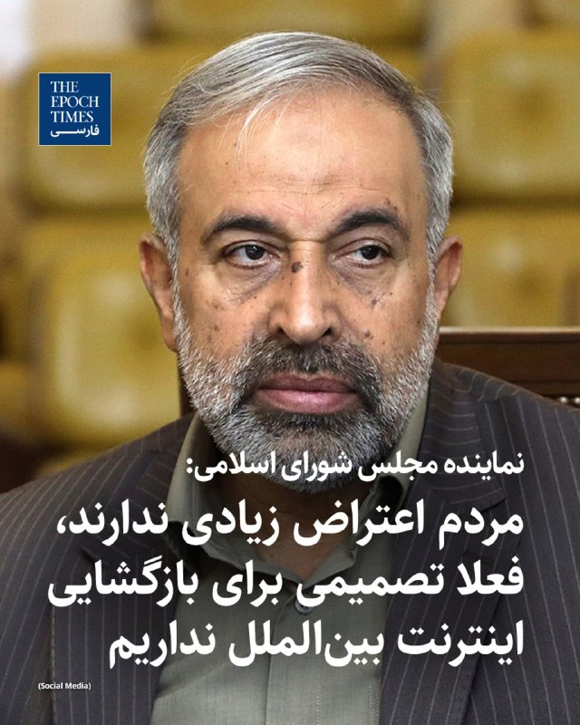

علی یزدی‌خواه، نایب‌رییس کمیسیون فرهنگی مجلس، گفت در شرایط فعلی تصمیمی برای بازگشایی اینترنت جهانی وجود ندارد و محدودیت‌ها با «ملاحظات امنیتی» ادامه خواهد داشت.

یزدی‌خواه قطع اینترنت جهانی را به مصوبات شورای عالی امنیت ملی نسبت داد و گفت این تصمیم به‌دلیل «مسائل امنیتی، امنیت کشور و حفظ جان افراد» گرفته شده است.

با وجود اینکه نت‌بلاکس اعلام کرده خاموشی اینترنت در ایران وارد هشتادوسومین روز خود شده، یزدی‌خواه گفت بیش از ۹۰ درصد نیازهای مردم در وضعیت فعلی برآورده می‌شود و مراجعات گسترده‌ای در اعتراض به قطع اینترنت وجود ندارد.

او همچنین گفت در قالب طرح موسوم به «اینترنت پرو»، تاکنون بیش از یک میلیون نفر دسترسی دریافت کرده‌اند؛ طرحی که منتقدان آن را مصداق اینترنت طبقاتی و تبعیض‌آمیز می‌دانند، زیرا دسترسی به اینترنت جهانی را به گروه‌های خاص محدود می‌کند و شهروندان عادی را از حق برابر دسترسی آزاد به اینترنت محروم نگه می‌دارد.

نایب‌رییس کمیسیون فرهنگی مجلس همچنین گفت شرکت‌های صادرات و واردات، مراکز علمی و پژوهشی، آزمایشگاه‌ها و برخی اصناف در صورت نیاز می‌توانند برای دسترسی به اینترنت بین‌الملل اقدام کنند.
@VahidOOnLine

📡 @VahidOnline

## VahidOnline — post 75591

  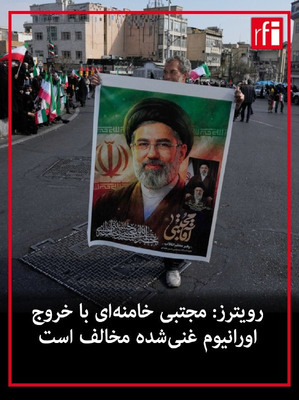

خبرگزاری رویترز به نقل از دو منبع ارشد در حکومت ایران گزارش داد مجتبی خامنه‌ای، رهبر جمهوری اسلامی، دستور داده ذخایر اورانیوم با غنای بالا نباید از ایران خارج شود.

به گفته این منابع، این دستور موضع تهران را در برابر یکی از اصلی‌ترین خواسته‌های آمریکا در مذاکرات برای پایان دادن به جنگ آمریکا و اسرائیل علیه جمهوری اسلامی سخت‌تر کرده است.

مقام‌های اسرائیلی نیز به رویترز گفته‌اند دونالد ترامپ به اسرائیل اطمینان داده هر توافق احتمالی باید شامل خروج ذخایر اورانیوم غنی‌شده از ایران باشد.

یکی از منابع ایرانی به رویترز گفت دستور رهبر جمهوری اسلامی و اجماع در ساختار حاکمیت این است که ذخایر اورانیوم غنی‌شده نباید از کشور خارج شود.

به گفته منابع رویترز، مقام‌های جمهوری اسلامی معتقدند انتقال این مواد به خارج، جمهوری اسلامی را در برابر حملات احتمالی آینده آمریکا و اسرائیل آسیب‌پذیرتر می‌کند.
@VahidOOnLine
دقایقی پس از این خبر رویترز بهای نفت در بازارهای جهانی نزدیک به دو دلار افزایش یافت.
قیمت هر بشکه نفت خام برنت دریای شمال بعدازظهر پنجشنبه ۳۱ اردیبهشت‌ماه در بازارهای اروپایی از ۱۰۵ دلار به بیش از ۱۰۷ دلار افزایش یافت.
@VahidOOnLine

📡 @VahidOnline

## VahidOnline — post 75590

  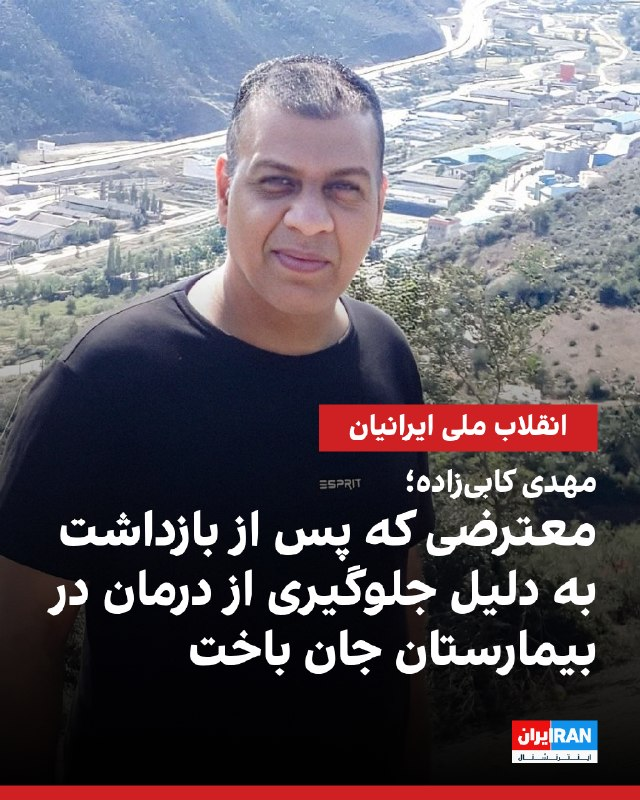

مهدی کابی‌زاده، شهروند ۴۷ ساله و پدر یک دختر بود که در اعتراضات دی‌ماه در استان خوزستان بازداشت و پس از انتقال به مرکز درمانی به دلیل منع رسیدگی جان باخت. او دختری به نام حلما دارد.

بر اساس اطلاعات رسیده به ایران اینترنشنال از افراد مطلع از خانواده او، مهدی کابی‌زاده در اعتراضات اهواز به دست ماموران بازداشت شد و سپس به دلیل بیماری خونی و روده به بیمارستان منتقل و بستری شد. با این حال، مسئولان بیمارستان به دلیل سابقه حضور او در اعتراضات و بازداشتش از رسیدگی و درمان کافی خودداری کردند که موجب جان باختن او شد.
@VahidOOnLine

📡 @VahidOnline

## kianmeli1 — post 87531

  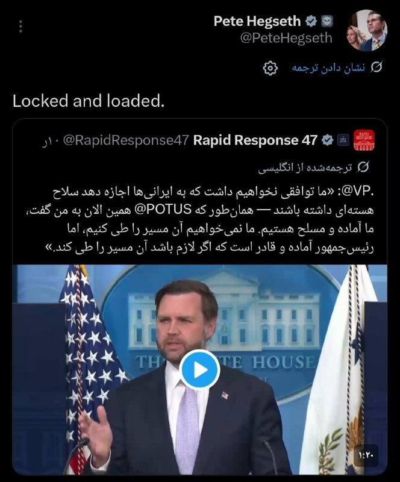

🔴 پیت هگست، وزیر جنگ آمریکا، یکبار دیگر جمهوری‌اسلامی را با عبارت «لاکد اند لودد» تهدید کرد؛ آماده و مسلح.
https://t.me/kianmeli1

## kianmeli1 — post 87530

  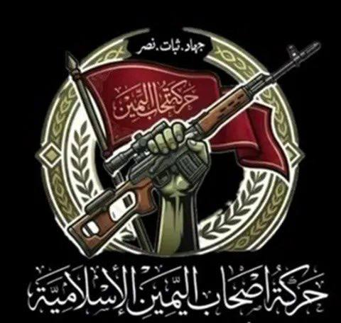

🔴نهادهای امنیتی اروپا با بیانه ای رسمی، برای دریافت اطلاعات درباره فعالیت های مرتبط با «حرکة اصحاب الیمین الاسلامیة» پاداش مالی تعیین کردند

طبق گزارش ها٫ این گروه به دلیل ارتباط با اقدامات تروریستی سپاه پاسداران شبکه سازی پنهان و فعالیت های سازمان یافته در چند کشور اروپایی تحت تحقیقات ویژه قرار گرفته است.

منابع امنیتی اعلام کرده اند هرگونه اطلاعات درباره اعضا٫ کانال های ارتباطی٫ منابع مالی٫ فعالیت های رسانه ای یا ارتباطات وابسته به این جریان میتواند در روند شناسایی و مقابله مؤثر باشد

در این بیانیه تأکید شده افرادی که اطلاعات معتبر ارائه دهند٫ علاوه بر حفظ کامل هویت٫ مشمول دریافت «پاداش ویژه» دریافت خواهند کرد.

-از شهروندان خواسته شده هرگونه سرنخ یا اطلاعات مرتبط را از طریق مسیرهای امن و محرمانه ارسال کنند.
https://t.me/kianmeli1

## IranIntlTV — post 338263

  

مارکو روبیو گفت اجرای سیستم اخذ عوارض در تنگه هرمز از سوی جمهوری اسلامی، دستیابی به توافق دیپلماتیک را غیرممکن می‌کند.

او افزود: «در مذاکرات مقداری پیشرفت داشته‌ایم، اما روشن است با سیستمی روبه‌رو هستیم که خود تا حدی دچار شکاف است؛ یعنی ساختار حاکم در ایران.» روبیو همچنین گفت قرار است دیدارهایی انجام شود و به گفته او، پاکستانی‌ها قرار است پنج‌شنبه به تهران سفر کنند.

وزیر خارجه آمریکا تاکید کرد ترجیح رییس‌جمهور رسیدن به «یک توافق خوب» است و واشینگتن هر کاری برای تحقق آن انجام خواهد داد، هرچند تضمینی برای دستیابی به توافق وجود ندارد.

روبیو افزود اگر توافقی حاصل نشود، ترامپ گزینه‌های دیگری نیز در اختیار دارد، اما همچنان دیپلماسی را گزینه مطلوب می‌داند. او گفت: «نشانه‌های مثبتی وجود دارد، اما نمی‌خواهیم بیش از حد خوش‌بین باشیم. باید دید در روزهای آینده چه رخ می‌دهد.»
https://iranintl.com/202605213235

## IranIntlTV — post 338262

  <a href="telegram/content/IranIntlTV_338262_1779377344.mp4" target="_blank">🎬 Download video</a>

دونالد ترامپ مقاله‌ای از نیویورک‌پست را بازنشر کرده که در آن، طرحی سه‌مرحله‌ای برای افزایش فشار بر جمهوری اسلامی مطرح شده است. این طرح بر ادامه محاصره دریایی، اسکورت نظامی نفتکش‌ها در خلیج فارس و ایجاد مسیرهای جایگزین انتقال انرژی برای دور زدن تنگه هرمز تمرکز دارد.
جزییات بیشتر با احمد صمدی، خبرنگار ایران‌اینترنشنال
@iranintltv

## IranIntlTV — post 338261

  <a href="telegram/content/IranIntlTV_338261_1779377345.mp4" target="_blank">🎬 Download video</a>

هم‌زمان با برگزاری نشست وزیران خارجه ناتو در سوئد، گروهی از ایرانیان مقابل محل برگزاری این نشست تجمع کردند. تجمع‌کنندگان خواستار توجه کشورهای عضو ناتو به وضعیت حقوق بشر در ایران و پایان دادن به سیاست مماشات با جمهوری اسلامی شدند.
مهران عباسیان، خبرنگار ایران‌اینترنشنال، گزارش می‌دهد
@iranintltv

## IranIntlTV — post 338260

  <a href="telegram/content/IranIntlTV_338260_1779377347.mp4" target="_blank">🎬 Download video</a>

گزارش‌ها حاکی است سپاه پاسداران استفاده از رمزارزها را به یکی از ابزارهای اصلی خود برای دور زدن تحریم‌های غرب، جابه‌جایی پول و تامین مالی شبکه‌های هم‌پیمانش در منطقه تبدیل کرده است. سپاه همچنین از طریق این شبکه‌ها، درآمدهای دلاری حاصل از فعالیت‌های مرتبط با تنگه هرمز را مدیریت می‌کند.
آیه دریس، عضو تحریریه ایران‌اینترنشنال، در «پیوست» به این موضوع می‌پردازد
@iranintltv

## IranIntlTV — post 338259

  

🔻باشگاه پرسپولیس اعلام کرد با ابلاغ رسمی دبیرکل فدراسیون فوتبال، مجوز حرفه‌ای این باشگاه برای فصل آینده صادر شده است.

🔹پرسپولیس اعلام کرد این مجوز بر اساس مدارک ارائه‌شده و پس از تطابق با استانداردهای کنفدراسیون فوتبال آسیا صادر شده و نشان‌دهنده رعایت الزامات ساختاری، مالی، حقوقی، زیرساختی و مدیریتی این باشگاه است.

🔹ساعاتی پیش از این نیز باشگاه استقلال از دریافت مجوز حرفه‌ای خود خبر داده بود.

@iranintltvsport

## IranIntlTV — post 338258

  <a href="telegram/content/IranIntlTV_338258_1779377349.mp4" target="_blank">🎬 Download video</a>

یک شهروند با ارسال پیامی به ایران اینترنشنال می‌گوید در مترو ماموران لباس شخصی او را متوقف کرده شروع به تفتیش و پرس و جو از او کردند. پیام او با هوش مصنوعی خوانده شده است.

## IranIntlTV — post 338257

  

خبرنگار فاکس نیوز به نقل از یک منبع آگاه از روند مذاکرات خبر داد که کاخ سفید گزارش خبرگزاری رویترز مبنی بر این‌که مجتبی خامنه‌ای دستور داده اورانیوم با غنای بالا در ایران باقی بماند را رد کرده و آن را نادرست دانسته است.
پیش‌تر رویترز به نقل از دو منبع ارشد در حکومت ایران گزارش داد مجتبی خامنه‌ای، رهبر جمهوری اسلامی، دستور داده ذخایر اورانیوم با غنای بالا نباید از ایران خارج شود.
به گفته این منابع، این دستور موضع تهران را در برابر یکی از اصلی‌ترین خواسته‌های آمریکا در مذاکرات برای پایان دادن به جنگ آمریکا و اسرائیل علیه جمهوری اسلامی سخت‌تر کرده است.
مقام‌های اسرائیلی نیز به رویترز گفته‌اند دونالد ترامپ به اسرائیل اطمینان داده هر توافق احتمالی باید شامل خروج ذخایر اورانیوم غنی‌شده از ایران باشد.
https://iranintl.com/202605215077

## IranIntlTV — post 338256

  <a href="telegram/content/IranIntlTV_338256_1779377350.mp4" target="_blank">🎬 Download video</a>

سرخط خبرهای پنجشنبه ۳۱ اردیبهشت
@iranintltv

## IranIntlTV — post 338255

  <a href="telegram/content/IranIntlTV_338255_1779377351.mp4" target="_blank">🎬 Download video</a>

نشست وزیران خارجه کشورهای عضو ناتو در سوئد آغاز شد. جنگ اوکراین، امنیت اروپا، تنش‌های خاورمیانه و امنیت انتقال انرژی در تنگه هرمز از محورهای اصلی این اجلاس عنوان شده است.
مهران عباسیان، خبرنگار ایران‌اینترنشنال، گزارش می‌دهد
@iranintltv

## IranIntlTV — post 338254

  

آلمان فرد مظنون به همکاری با جمهوری اسلامی را به اتهام برنامه‌ریزی برای ترور چهره‌های یهودی و یک نماینده سابق حامی اسرائیل تحت پیگرد قرار داد.

مظنون این پرونده، شهروندی دانمارکی است که ژوئن سال گذشته در دانمارک بازداشت شد.

یکی از همدستان او، شهروند اهل افغانستان است که در ماه نوامبر در دانمارک بازداشت شد.
https://iranintl.com/202605212861

## IranIntlTV — post 338253

  

🔻به گزارش خبرگزاری جمهوری اسلامی، ایرنا، عدم صدور ویزا، مانع از حضور ملی‌پوشان شمشیربازی ایران در رقابت‌های کاپ جهانی شد.

🔹سابریست‌های ایران که برای حضور در این رقابت‌ها، یک اردوی تمرینی سنگین و فشرده‌ی ۴۵ روزه را در کشور ایتالیا پشت سر گذاشته‌اند، به دلیل صادر نشدن ویزا از سوی دولت مصر، شانس حضور در این تورنمنت را از دست دادند.

🔹ملی‌پوشان شمشیربازی ایران به‌زودی ایتالیا را به مقصد تهران ترک خواهند کرد.

@iranintltvsport

## IranIntlTV — post 338252

  <a href="telegram/content/IranIntlTV_338252_1779377354.mp4" target="_blank">🎬 Download video</a>

طبق اطلاعات رسیده به ایران‌اینترنشنال، جاویدنام مصطفی سلامی شامگاه ۱۹ دی‌ماه ۱۴۰۴ حوالی ساعت ۸ شب در فردیس کرج هدف شلیک نیروهای حکومتی قرار گرفت و در برابر همسر، فرزند و اعضای خانواده‌اش از ناحیه قفسه سینه مجروح شد.

براساس روایت خانواده، نزدیکانش ابتدا مصطفی را به درمانگاه رساندند و سپس با آمبولانس به بیمارستان منتقل کردند. ماموران هنگام انتقال او با حمله به همراهان مانع حضورشان در محل شدند. پس از رسیدن به بیمارستان، پیکر مصطفی نزدیک دو ساعت ناپدید شد؛ سپس به خانواده اطلاع دادند که گلوله ریه او را سوراخ کرده و این جاویدنام بر اثر شدت جراحات، تنگی نفس و خونریزی شدید جان باخته است.

## IranIntlTV — post 338251

  <a href="telegram/content/IranIntlTV_338251_1779377355.mp4" target="_blank">🎬 Download video</a>

هم‌زمان با ادامه مذاکرات میان جمهوری اسلامی و آمریکا، خبرگزاری رویترز به نقل از دو مقام ارشد جمهوری اسلامی گزارش داد مجتبی خامنه‌ای، رهبر نادیده جمهوری اسلامی، با انتقال ذخایر اورانیوم غنی‌شده ایران به خارج از کشور مخالفت کرده است.
جزییات بیشتر با مریم رحمتی، خبرنگار ایران‌اینترنشنال
@iranintltv

## IranIntlTV — post 338250

  <a href="telegram/content/IranIntlTV_338250_1779377357.mp4" target="_blank">🎬 Download video</a>

هم‌زمان با افزایش صف‌های طولانی در پمپ‌بنزین‌ها و نگرانی از کاهش سهمیه سوخت، کاربران رسانه‌های اجتماعی از تشدید فشارهای اقتصادی و اثرات محاصره اقتصادی بر زندگی روزمره مردم نوشته‌اند.
عادله بورنگ، عضو تحریریه ایران‌اینترنشنال، از واکنش کاربران می‌گوید
@iranintltv

## IranIntlTV — post 338249

یک شهروند با ارسال پیامی به ایران اینترنشنال می‌گوید که پیک موتوری است و کل درآمدی که برای یک شیفت داشته را خرج رفع پنچری موتورش کرده است. پیام او با هوش مصنوعی خوانده شده است.

## IranIntlTV — post 338248

  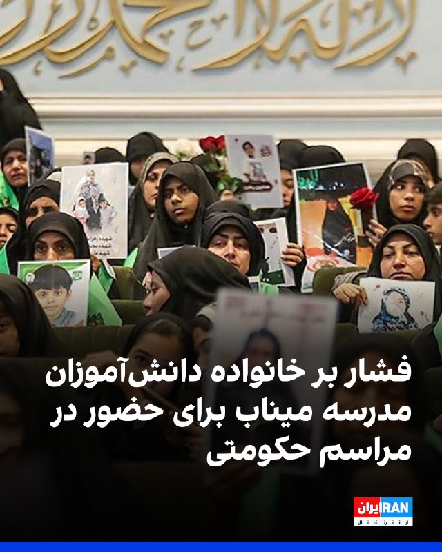

اطلاعات رسیده به ایران‌اینترنشنال از فشار نهادهای حکومتی بر خانواده‌های دانش‌آموزان کشته‌شده در حمله به مدرسه میناب و برگزاری مراسم حکومتی در این شهر خبر داد. با وجود شوک گسترده در شهر پس از وقوع حادثه، برخی خانواده‌ها تحت فشار قرار گرفته‌اند تا در مراسم‌های حکومتی شرکت کنند.
بر اساس این اطلاعات، فضای بهشت‌زهرای میناب به محل تجمع نیروها و حامیان حکومت تبدیل شده و افرادی از عراق برای برپایی موکب به این شهر آمده‌اند. برخی از این افراد شب‌ها پس از تجمعات خیابانی در بهشت‌زهرا مستقر می‌شوند.
تعدادی از خانواده‌های دانش‌آموزان کشته‌شده با برگزاری این مراسم‌ها مخالف بوده‌اند، اما برای حضور و سخنرانی در برنامه‌ها تحت فشار قرار گرفته‌اند.
در همین زمینه یک منبع مطلع، از وضعیت روحی نامناسب مادر یکی از دانش‌آموزان که دو فرزند خود را از دست داده خبر داد و گفت با وجود شرایط شدید روحی، از او خواسته می‌شود در مراسم‌ها حضور پیدا کند.
نیروهای حاضر در بهشت‌زهرا با سلاح رفت‌وآمد می‌کنند و تمرکز اصلی بر تهیه عکس و ویدیو برای شبکه‌های اجتماعی است.
https://iranintl.com/202605211346

## IranIntlTV — post 338247

  

خبرگزاری رویترز به نقل از دو منبع ارشد در حکومت ایران گزارش داد مجتبی خامنه‌ای، رهبر جمهوری اسلامی، دستور داده ذخایر اورانیوم با غنای بالا نباید از ایران خارج شود.

به گفته این منابع، این دستور موضع تهران را در برابر یکی از اصلی‌ترین خواسته‌های آمریکا در مذاکرات برای پایان دادن به جنگ آمریکا و اسرائیل علیه جمهوری اسلامی سخت‌تر کرده است.

مقام‌های اسرائیلی نیز به رویترز گفته‌اند دونالد ترامپ به اسرائیل اطمینان داده هر توافق احتمالی باید شامل خروج ذخایر اورانیوم غنی‌شده از ایران باشد.

یکی از منابع ایرانی به رویترز گفت دستور رهبر جمهوری اسلامی و اجماع در ساختار حاکمیت این است که ذخایر اورانیوم غنی‌شده نباید از کشور خارج شود.

به گفته منابع رویترز، مقام‌های جمهوری اسلامی معتقدند انتقال این مواد به خارج، جمهوری اسلامی را در برابر حملات احتمالی آینده آمریکا و اسرائیل آسیب‌پذیرتر می‌کند.

## IranIntlTV — post 338246

  

وزارت خارجه اسرائیل روز پنج‌شنبه اعلام کرد که همه فعالان بازداشت شده ناوگان شکستن محاصره غزه از این کشور اخراج شده‌اند.
این وزارتخانه افزود: «اسرائیل اجازه هیچ‌گونه نقض محاصره دریایی قانونی غزه را نخواهد داد.»
روز چهارشنبه نیز وزیر خارجه ایتالیا خواستار بررسی تحریم ایتامار بن‌گویر، وزیر امنیت ملی اسرائیل، از سوی اتحادیه اروپا شد و دلیل آن را نحوه برخورد او با فعالان بازداشت‌شده ناوگان شکستن محاصره غزه عنوان کرد.
بریتانیا نیز اعلام کرد در پی انتشار ویدیویی از تمسخر فعالان بازداشت‌شده از سوی بن‌گویر، کاردار اسرائیل را احضار کرده است. وزیر خارجه بریتانیا گفت از تمسخر فعالان کاروان «گلوبال صمود» شوکه شده است.
نیوزیلند هم اعلام کرد سفیر اسرائیل را در واکنش به این ویدیوها احضار می‌کند. وزیر خارجه کانادا نیز ویدیوی منتشرشده از بن‌گویر درباره فعالان کاروان غزه را «عمیقا نگران‌کننده و غیرقابل قبول» توصیف کرد.
https://iranintl.com/202605219146

## IranIntlTV — post 338245

  

مسعود پزشکیان در دیدار با امیر حاتمی، فرمانده کل ارتش جمهوری اسلامی، گفت دولت با تمام ظرفیت در کنار نیروهای مسلح قرار دارد و از «نوسازی تجهیزات، تقویت زیرساخت‌های عملیاتی و افزایش توان بازدارندگی» حمایت می‌کند.

او افزود انسجام ملی، آمادگی دفاعی و حفظ اقتدار نیروهای مسلح جمهوری اسلامی، مهم‌ترین پشتوانه امنیت، ثبات و آرامش کشور در برابر تهدیدها و «جنگ ترکیبی دشمنان» است.
https://iranintl.com/202605219831

## IranIntlTV — post 338244

  <a href="telegram/content/IranIntlTV_338244_1779377361.mp4" target="_blank">🎬 Download video</a>

رویترز به نقل از دو منبع ایرانی گزارش داد مجتبی خامنه‌ای، رهبر سوم جمهوری اسلامی، دستور داده اورانیوم غنی‌شده نباید از کشور خارج شود. تصمیمی که به گفته این گزارش، موضع تهران را در برابر یکی از خواسته‌های اصلی ایالات متحده در مذاکرات سخت‌تر می‌کند.
گفت‌وگو با علی‌حسین قاضی‌زاده، عضو تحریریه ایران‌اینترنشنال
@iranintltv

## Shin_Persian — post 6122

  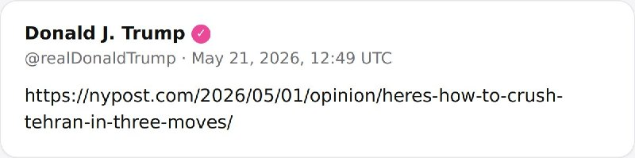

Shin ✓ @hey_itsmyturn
Thu, 21 May 2026 12:51:46 UTC

President Trump @POTUS:
"https://nypost.com/2026/05/01/opinion/heres-how-to-crush-tehran-in-three-moves/"

فارسی

رئیس‌جمهور ترامپ @POTUS:
"https://nypost.com/2026/05/01/opinion/heres-how-to-crush-tehran-in-three-moves/"

𝕏 · @shin_persian

## Shin_Persian — post 6121

Shin ✓ @hey_itsmyturn
Thu, 21 May 2026 11:59:19 UTC

As if anyone would expect anything else than IRGC (Yeah, not Mojtaba’s decision for sure) not allowing the handover of 400+ Kg of Uranium out of Iran, which is one of the most valuable bargaining chips fir then

فارسی

انگار کسی انتظار چیزی غیر از این را داشت که سپاه پاسداران (قطعا این تصمیم مجتبی نیست) اجازه خروج بیش از ۴۰۰ کیلوگرم اورانیوم را از ایران ندهد، که یکی از ارزشمندترین اهرم‌های چانه‌زنی برای آن‌هاست.

𝕏 · @shin_persian

## ManotoTV — post 105720

  <a href="telegram/content/ManotoTV_105720_1779377362.mp4" target="_blank">🎬 Download video</a>

دادستان‌های فدرال آلمان اعلام کردند که علیه یک شهروند دانمارکی و یک شهروند افغان به اتهام مشارکت در طرح‌ریزی برای قتل رهبران برجسته سازمان‌های یهودی در آلمان به نفع جمهوری اسلامی، کیفرخواست کیفری صادر کرده‌اند.
متهمان که طبق قوانین حریم خصوصی آلمان تنها با نام «علی س.» (شهروند دانمارک) و «تواب م.» (شهروند افغان) معرفی شده‌اند، به مشارکت در اقدام به قتل متهم هستند.
علی س. متهم است که برای سرویس اطلاعاتی سپاه پاسداران کار می‌کرده و ارتباط نزدیکی با واحد ویژه آن، نیروی قدس، داشته است.
دادستان‌ها گفتند او در اوایل سال ۲۰۲۵ مأمور شده بود اطلاعاتی درباره رئیس شورای مرکزی یهودیان در آلمان، یوزف شوستر، و رئیس انجمن آلمان–اسرائیل، فولکر بک، جمع‌آوری کند.
همچنین به او دستور داده شده بود که از دو فروشنده مواد غذایی یهودی در برلین جاسوسی کند.
دادستان‌ها اعلام کردند: «همه این اقدامات برای تسهیل برنامه‌ریزی حملات قتل و آتش‌سوزی در آلمان انجام می‌شد.»

## ManotoTV — post 105719

  <a href="telegram/content/ManotoTV_105719_1779377363.mp4" target="_blank">🎬 Download video</a>

مقام‌های هندی اعلام کرده‌اند که اولویت آن‌ها بازگرداندن کشتی‌های این کشور است که در خلیج فارس گرفتار شده‌اند، و تنها پس از بازگشت این کشتی‌ها درباره ارسال مجدد آن‌ها برای بارگیری سوخت تصمیم‌گیری خواهد شد.
یکی از مقامات ارشد وزارت بنادر و کشتیرانی هند گفته است که هدف اصلی، خارج کردن همه کشتی‌های هندی از تنگه هرمز است و تنها زمانی که شرایط مناسب باشد، کشتی‌های جدید به سمت غرب تنگه اعزام خواهند شد.
به گفته او، در حال حاضر ۱۳ کشتی با پرچم هند و یک کشتی متعلق به هند همچنان در غرب تنگه گیر کرده‌اند. از زمان آغاز درگیری‌ها و اختلال در تنگه هرمز، بخشی از کشتی‌های حامل سوخت از این منطقه عبور کرده‌اند، اما جریان تجارت به‌شدت مختل شده است.
هند پیش از این بیش از ۴۰ درصد نفت خام و حدود ۹۰ درصد گاز مایع مورد نیاز خود را از طریق همین مسیر وارد می‌کرد و اکنون با یکی از شدیدترین اختلال‌های تأمین گاز آشپزی در دهه‌های اخیر روبه‌رو است.

## ManotoTV — post 105718

  <a href="telegram/content/ManotoTV_105718_1779377363.mp4" target="_blank">🎬 Download video</a>

به گفته منابع آگاه به رویترز، سوریه ماه آینده به‌عنوان کشور مهمان در اجلاس گروه هفت G7 در فرانسه شرکت خواهد کرد و توسط رئیس‌جمهور احمد الشرع نمایندگی می‌شود؛ این نخستین حضور سوریه در این نشست از زمان تاسیس گروه هفت در سال ۱۹۷۵ است.
دعوت رسمی برای حضور در اجلاس ۱۵ تا ۱۷ ژوئن در فرانسه به وزیر دارایی سوریه تحویل داده شده است. گفته می‌شود مشارکت سوریه احتمالا بر نقش این کشور به‌عنوان یک «هاب استراتژیک بالقوه برای زنجیره‌های تامین» پس از بسته شدن تنگه هرمز متمرکز خواهد بود.
سوریه پس از ۱۴ سال جنگ داخلی و در حالی که در حال بازسازی اقتصاد و تلاش برای جذب سرمایه‌گذاری خارجی است، همچنان با چالش‌های جدی در زمینه تحریم‌ها و بازگشت روابط بانکی عادی مواجه است.

## ManotoTV — post 105717

  <a href="telegram/content/ManotoTV_105717_1779377364.mp4" target="_blank">🎬 Download video</a>

مدیر آژانس بین‌المللی انرژی امروز پنجشنبه بدون ارائه جزئیات بیشتر گفت آغاز اوج تقاضای سوخت در تابستان، همراه با نبود صادرات جدید نفت از خاورمیانه و کاهش ذخایر، می‌تواند بازار نفت را در ماه‌های ژوئیه و اوت وارد «منطقه قرمز» کند.
فاتح بیرول در سخنرانی خود در چتم هاوس لندن گفت جهان با مازاد نفت وارد بحران عرضه ناشی از جنگ ایران شده بود؛ موضوعی که به جذب شوک اولیه کمک کرد، اما اکنون ذخایر در حال کاهش هستند.

## FarsiVOA — post 218297

  <a href="telegram/content/FarsiVOA_218297_1779377364.mp4" target="_blank">🎬 Download video</a>

سازمان حفاظت محیط‌زیست ایران ویدیویی از مشاهده «همای سعادت» در منطقه حفاظت‌شده سبزه‌کوه در چهارمحال‌وبختیاری منتشر کرد.

همای سعادت، یکی از کمیاب‌ترین پرندگان شکاری ایران، در فرهنگ ایرانی نماد خوشبختی و اقبال شناخته می‌شود.

@FarsiVOA

## FarsiVOA — post 218296

🔺سنتکام: مسیر ۹۴ شناور در جریان محاصره جمهوری اسلامی تغییر داده شد

▪️فرماندهی مرکزی ایالات متحده، سنتکام، پنج‌شنبه ۳۱ اردیبهشت اعلام کرد نیروهای آمریکایی در ادامه اجرای محاصره علیه جمهوری اسلامی، مسیر ۹۴ شناور تجاری را تغییر داده و چهار شناور را نیز از کار انداخته‌اند.

⬇️ بیشتر بخوانید:

https://ir.voanews.com/a/centcom-naval-blockade-vessel-diversion/8152386.html/?nocach=1

## FarsiVOA — post 218295

🔺تصویب قطعنامه پارلمان اروپا علیه جمهوری اسلامی: کشتار دی بزرگترین قتل عام در تاریخ ایران بود

▪️پارلمان اروپا روز پنجشنبه ۳۱ اردیبهشت با تصویب قطعنامه‌ای، سرکوب و اعدام معترضان، مخالفان، زندانیان سیاسی و اقلیت‌های مذهبی در ایران را به شدت محکوم کرد و خواستار تحریم‌های بیشتر علیه مقامات جمهوری اسلامی شد.

⬇️ بیشتر بخوانید:

https://ir.voanews.com/a/iran-european-union-killing-execution/8152389.html/?nocach=1

## FarsiVOA — post 218294

جنگ‌ خشونت‌ علیه زنان را تشدید می‌کند با این حال رسانه‌ها در چنین شرایطی دیگر جایی برای مسائلی مانند خشونت و آزار خانگی، زن‌کُشی‌، آزار جنسی، تبعیض‌ جنسیتی، کودک‌همسری و دادگاه‌های خانواده ندارند. در میدان از زنان گفتیم

## FarsiVOA — post 218293

  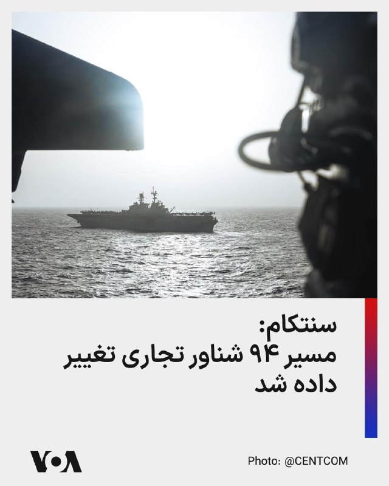

فرماندهی مرکزی ایالات متحده، سنتکام، پنجشنبه ۳۱ اردیبهشت اعلام کرد نیروهای آمریکایی در ادامه اجرای محاصره علیه جمهوری اسلامی، مسیر ۹۴ شناور تجاری را تغییر داده و چهار شناور را نیز از کار انداخته‌اند.

به گفته سنتکام، این اقدامات برای جلوگیری از ورود و خروج جریان تجارت به بنادر ایران انجام شده است.

@FarsiVOA

## FarsiVOA — post 218292

جمهوری اسلامی باز هم رکورد خود در ایجاد محدودیت در دسترسی به اینترنت را بالاتر برد و اکنون شهروندان ایرانی هشتادوسومین روز از خاموشی دیجیتال را تجربه می‌کنند.

براساس گزارش روز پنجشنبه نت‌بلاکس، نهاد ناظر بر اختلالات اینترنت، خاموشی اینترنت از مرز هزار و ۹۸۶ ساعت گذشته است. به گفته نت‌بلاکس، اینترنت آزاد و باز، نقشی اساسی در حفاظت از جان انسان‌ها، آزادی، و پاسخ‌گویی به افکار عمومی دارد.

با گذشت نزدیک به سه ماه از قطع سراسری اینترنت در ایران، سازمان‌های حقوق بشری تأکید می‌کنند که این خلأ ارتباطی، توانایی شهروندان و فعالان را برای ثبت و مستندسازی برخوردها، بازداشت‌ها و وضعیت آسیب‌دیدگان به شدت محدود کرده است.

گزارش کامل را در وب‌سایت صدای آمریکا بخوانید.

@FarsiVOA

## FarsiVOA — post 218291

  <a href="telegram/content/FarsiVOA_218291_1779377365.mp4" target="_blank">🎬 Download video</a>

فرماندهی آفریقای ایالات متحده آمریکا، آفریکام، ۲۸ اردیبهشت اعلام کرد در هماهنگی با نیروهای نیجریه، عملیاتی علیه یک اردوگاه وابسته به داعش در شمال‌ شرقی نیجریه انجام داده است.

آفریکام می‌گوید در این عملیات هیچ‌یک از نیروهای آمریکایی یا نیجریه‌ای آسیب ندیده‌اند.

@FarsiVOA

## FarsiVOA — post 218290

  

فرماندهی مرکزی ایالات متحده، سنتکام، تصویری از سوخت‌گیری هوایی یک بمب‌افکن بی-۱ بی «لنسر» توسط هواپیمای سوخت‌رسان کی‌سی-۱۳۵ استراتوتانکر کی‌سی-۱۳۵ را در جریان یک پرواز آموزشی بر فراز آب‌های خاورمیانه منتشر کرد.

@FarsiVOA

## FarsiVOA — post 218289

▪️مدیر شرکت ملی نفت ابوظبی اعلام کرد که حتی اگر اکنون درگیری‌ها در خاورمیانه پایان یابد، جریان صادرات نفت از تنگه هرمز تا سه‌ماهه اول یا دوم سال ۲۰۲۷ کاملاً به حالت قبل از این جنگ بازنخواهد گشت.

▪️او افزود که محاصره تنگه هرمز از سوی جمهوری اسلامی یک اقدام «خطرناک» است.

▪️منطقه خلیج فارس پیشتر بحران‌های مرتبط با انرژی را تجربه کرده اما این اولین بار است که یک بحران انرژی طولانی در این منطقه به دلیل انسداد تنگه هرمز ایجاد می‌شود.

▪️جمهوری اسلامی از آغاز درگیری نظامی با آمریکا و اسرائیل، عملاً این آبراه را که گلوگاهی برای عبور حدود یک‌پنجم صادرات جهانی نفت است، مسدود کرده است.

⬇️ بیشتر بخوانید:
https://ir.voanews.com/a/8152364.html

## FarsiVOA — post 218288

  <a href="telegram/content/FarsiVOA_218288_1779377366.mp4" target="_blank">🎬 Download video</a>

فرماندهی مرکزی ایالات متحده، سنتکام، اعلام کرد نیروهای تفنگدار دریایی آمریکا در دریای عمان روز چهارشنبه ۳۰ اردیبهشت وارد یک نفتکش تجاری با پرچم رژیم ایران به نام نفتکش ام‌تی «سلستیال سی» شدند.

به گفته سنتکام، این نفتکش مظنون به تلاش برای نقض محاصره دریایی آمریکا و حرکت به سوی یک بندر ایران بوده است. سنتکام می‌گوید پس از بازرسی، کشتی رفع توقیف شد و به خدمه دستور تغییر مسیر داده شد.

آمریکا همچنین اعلام کرد تاکنون مسیر ۹۱ کشتی تجاری را تغییر داده است.

@FarsiVOA

## DW_Farsi — post 124973

🔶 آمریکا علیه رائول کاسترو، رئیس‌جمهور سابق کوبا شکایت می‌کند

دولت ایالات متحده فشار بر دولت کمونیستی هاوانا را افزایش داده و اعلام کرده که علیه رائول کاسترو، رهبر پیشین کوبا شکایت خواهد کرد.

تاد بلانچ، دادستان کل موقت آمریکا رائول کاستروی ۹۴ ساله را متهم کرده که در سرنگونی دو هواپیمای آمریکایی توسط نیروی هوایی کوبا در فوریه ۱۹۹۶ نقش داشته است.

در آن زمان، جنگنده‌های کوبایی این دو هواپیمای کوچک غیرنظامی که بین فلوریدا و کوبا در پرواز بودند را هدف قرار داده و ساقط کردند. هر چهار سرنشین این هواپیماها جان خود را از دست دادند.

این هواپیماها متعلق به سازمان "برادران نجات" (Brothers to the Rescue) بودند؛ سازمانی متشکل از شماری از کوبایی‌های تبعیدی مستقر در میامی که سال‌ها به پناهجویانی که تلاش داشتند با قایق از کوبا به آمریکا برسند کمک می‌کردند.

در آن زمان، رائول کاسترو وزیر دفاع کوبا بود و به همین دلیل از دید دادستان‌های آمریکایی، او مسئول این اقدام بوده است.

دولت کوبا همواره اعلام کرده که این هواپیماها حریم هوایی این کشور را نقض کردند و به همین دلیل سرنگون‌کردن آن‌ها نیز واکنشی مشروع به نقض حریم هوایی این کشور بود.

اما سازمان بین‌المللی هوانوردی غیرنظامی (ایکائو) این ادعا را رد کرد و به این نتیجه رسید که این حادثه بر فراز آب‌های بین‌المللی رخ داده است.
@dw_farsi

## DW_Farsi — post 124972

  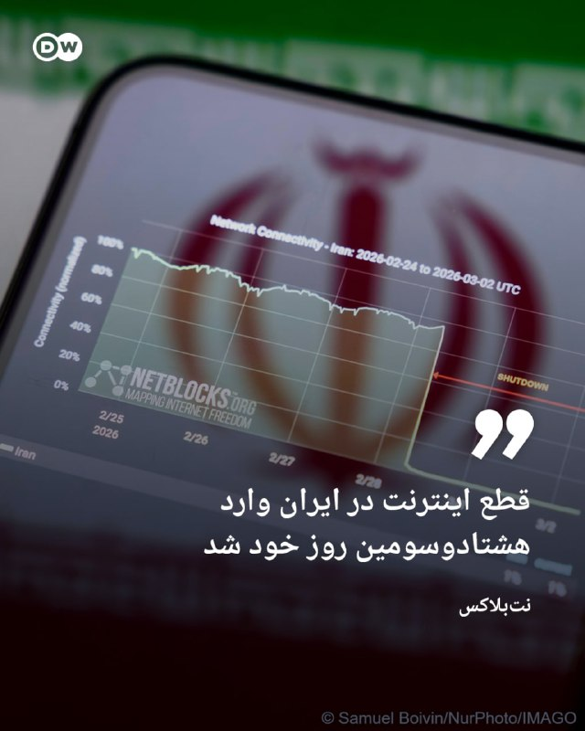

🔶 نت‌بلاکس: قطع اینترنت در ایران وارد هشتادوسومین روز خود شد

نت‌بلاکس اعلام کرد قطع اینترنت در ایران اکنون وارد هشتادوسومین روز خود شده و دسترسی به شبکه‌های بین‌المللی برای بیش از ۱۹۶۸ ساعت تا حد زیادی مسدود مانده است.

این نهاد تاکید کرد که اینترنت آزاد و باز برای حفاظت از جان، آزادی و پاسخ‌گویی عمومی نقشی اساسی دارد.
نت‌بلاکس همچنین هشدار داد که ادامه این وضعیت، هم معیشت مردم را تخریب می‌کند و هم حقوق شهروندی را بیشتر فرسایش می‌دهد.
@dw_farsi

## DW_Farsi — post 124971

🔶 آنگلا مرکل "مجذوب و متأثر" از کتاب "در خیابان‌های تهران"

🔻 گزارشی از منیره طبری

آنگلا مرکل، صدراعظم پیشین آلمان در مراسم معرفی کتاب "در خیابان‌های تهران: زن زندگی آزادی" در برلین هشدار داد که نباید تلاش‌ها و مبارزات زنان ایرانی را در سایه "جنگ ایران" از خاطر برد.

او چهارشنبه ۳۰ اردیبهشت (۲۰ مه) گفت، در ابتدا برای پذیرفتن دعوت‌ به این برنامه تردید داشته، زیرا دیگر یک سیاستمدار فعال نیست، اما این کتاب که روایت‌گر آن نویسنده‌ای ناشناس با نام مستعار "نیلا" است آنچنان او را مجذوب و متأثر کرد که سرانجام این دعوت را پذیرفت.

مرکل در جریان رونمایی از این کتاب، توجه‌ها را به مبارزات جنبش زنان ایران جلب کرد.

این سیاستمدار ۷۱ ساله آلمان در این مراسم در سالن تئاتر "برلینر انسامبل" که از معتبرترین و تاریخی‌ترین سالن‌های نمایش آلمان است متذکر شد که نباید اجازه داد مبارزات زنان ایرانی در سایه اخبار جنگ اسرائيل و آمریکا علیه جمهوری اسلامی به فراموشی سپرده شود.

این سیاستمدار حزب دموکرات‌مسیحی (CDU) آلمان گفت: «بیایید امشب با هم به این موضوع بنگریم، تا زنان و دخترانی که نیلا با کتابش به آن‌ها صدا بخشیده است، و همچنین اشتیاق آن‌ها برای آزادی و کرامت انسانی و ایستادگی‌شان در برابر سلب آزادی و سرکوب، فراموش نشود. تا آن‌ها حس کنند که تنها نیستند.»

مرکل گفت، تردیدش برای دادن پاسخ مثبت به دعوت‌نامه این مراسم به این دلیل بوده که دیگر "نه وظایف اجرایی" دارد و نه "امکان اجرایی‌" که بتواند "به شکلی بر روند تحولات در ایران و به نفع مردم این کشور تأثیر" بگذارد.

📌 برای دسترسی کامل به گزارش به وبسایت دویچه‌وله فارسی مراجعه کنید.
@dw_farsi

## DW_Farsi — post 124970

  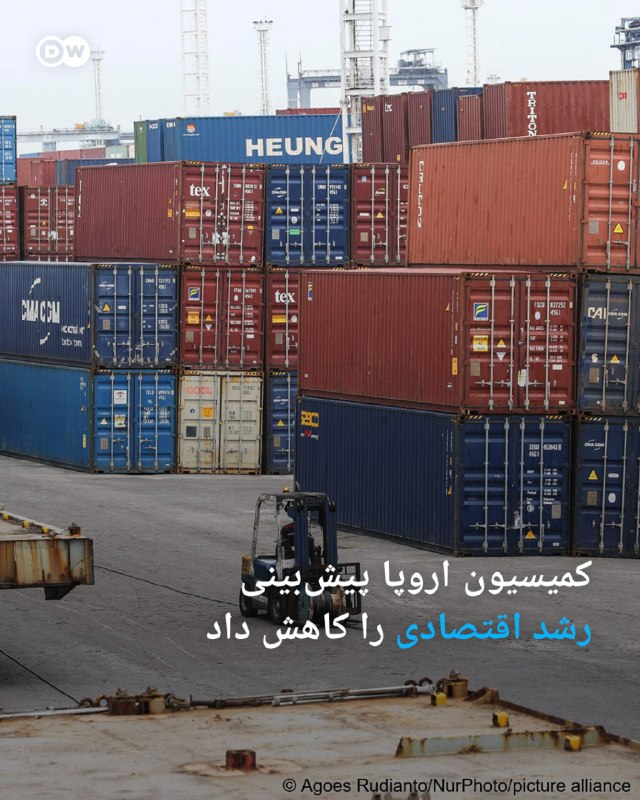

🔶 کمیسیون اروپا پیش‌بینی رشد اقتصادی را کاهش داد

کمیسیون اروپا پیش‌بینی خود از رشد اقتصادی آلمان را به شکل محسوسی کاهش داده است.

این نهاد اکنون برای سال جاری تنها رشد ۰.۶ درصدی تولید ناخالص داخلی آلمان را پیش‌بینی می‌کند. این رقم با برآوردی هم‌خوانی دارد که برخی از موسسه‌های مهم پژوهش اقتصادی آلمان نیز اخیرا مطرح کرده‌اند.

کمیسیون اروپا همچنین پیش‌بینی رشد اقتصادی برای کل کشورهای عضو اتحادیه اروپا را پایین آورد.

بر این اساس، اقتصاد اتحادیه اروپا در سال جاری احتمالا فقط ۱.۱ درصد رشد خواهد کرد، در حالی که در پاییز گذشته این رقم ۱.۵ درصد برآورد شده بود. برای کشورهای منطقه یورو نیز رشد ۰.۹ درصدی پیش‌بینی شده است.

کمیسیون اروپا یکی از دلایل اصلی این بازنگری را افزایش بهای نفت و گاز در پی جنگ ایران عنوان کرده است.
@dw_farsi

## DW_Farsi — post 124969

  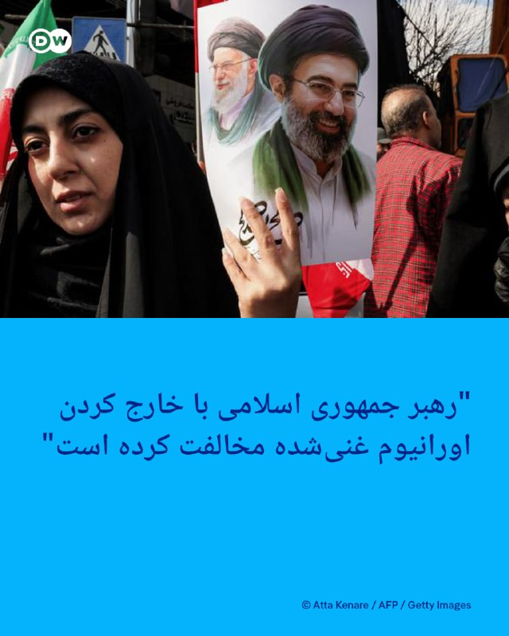

🔶 "رهبر جمهوری اسلامی با خارج کردن اورانیوم غنی‌شده مخالفت کرده است"

خبرگزاری رویترز و تایمز اسرائیل به نقل از منابع ارشد ایرانی گزارش دادند که مجتبی خامنه‌ای، رهبر جمهوری اسلامی، دستور داده است اورانیوم نزدیک به سطح تسلیحاتی باید در ایران بماند و نباید در چارچوب توافقی برای پایان دادن به جنگ با آمریکا و اسرائیل به خارج از کشور منتقل شود.

ایران بیش از ۴۰۰ کیلوگرم اورانیوم با غنای بالا در اختیار دارد. مقام‌های اسرائیلی گفته‌اند این میزان، در صورت غنی‌سازی بیشتر، برای ساخت ۱۱ بمب اتمی کافی است. اوایل همین ماه، یک مقام ارشد نظامی اسرائیل گفته بود که اگر این اورانیوم از ایران خارج نشود، جنگی که در ماه فوریه آغاز شد، می‌تواند "یک شکست بزرگ" تلقی شود.

مقام‌های اسرائیلی به خبرگزاری رویترز گفته‌اند که ترامپ به اسرائیل اطمینان داده است ذخایر اورانیوم با غنای بالای ایران، که برای ساخت سلاح هسته‌ای لازم است، از ایران خارج خواهد شد و هرگونه توافق صلح باید شامل بندی در این‌باره باشد.
@dw_farsi

## DW_Farsi — post 124960

📸 گواهینامه در آلمان ارزان‌تر و ساده‌تر می‌شود

گرفتن گواهینامه در آلمان سال‌هاست یکی از سخت‌ترین و پرهزینه‌ترین فرآیندها در اروپا محسوب می‌شود.

حالا دولت با یک بسته اصلاحی می‌خواهد این روند را ساده‌تر و ارزان‌تر کند؛ از آنلاین شدن کلاس‌ها و کاهش سوالات امتحان گرفته تا کوتاه‌تر شدن زمان آزمون و حتی امکان تمرین رانندگی با اعضای خانواده.

اما این تغییرات بدون انتقاد نیست و برخی کارشناسان درباره تاثیر آن بر ایمنی جاده‌ها هشدار می‌دهند.
@dw_farsi

## DW_Farsi — post 124959

  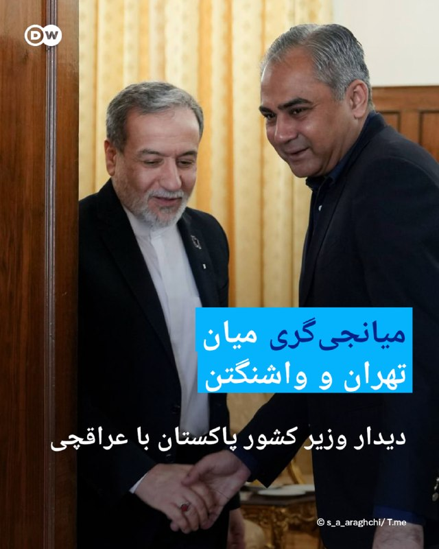

🔶 میانجی‌گری میان تهران و واشنگتن؛ دیدار وزیر کشور پاکستان با عراقچی

محسن نقوی، وزیر کشور پاکستان، که برای ادامه نقش میانجیگرانه اسلام‌آباد میان جمهوری اسلامی و آمریکا به تهران سفر کرده، صبح پنجشنبه ۳۱ اردیبهشت با عباس عراقچی، وزیر امور خارجه جمهوری اسلامی، دیدار و گفت‌وگو کرد.

این دومین سفر نقوی به تهران در طول هفته جاری است.

او در روزهای گذشته همچنین با مسعود پزشکیان، محمدباقر قالیباف و شماری دیگر از مقام‌های جمهوری اسلامی دیدار کرده بود.

رسانه‌های نزدیک به حکومت گزارش داده‌اند که وزیر کشور پاکستان این بار با پیام‌هایی تازه و اصلاح‌شده از سوی طرف آمریکایی به تهران رفته است تا روند میانجیگری میان دو طرف را ادامه دهد.

نقوی اوایل همین هفته نیز در سفری دو روزه به تهران با مقام‌های دولت جمهوری اسلامی دیدار و گفت‌وگو کرده بود.
@dw_farsi

## DW_Farsi — post 124958

🔶 آمادگی ایلان ماسک برای بزرگ‌ترین عرضه اولیه سهام اسپیس‌ایکس

ایلان ماسک از برنامه عرضه اولیه سهام شرکت اسپیس‌ایکس خبر داد؛ اقدامی که می‌تواند او را به نخستین تریلیونر جهان تبدیل کند. این اقدام در حالی انجام می‌شود که این شرکت فضایی سال گذشته با زیان میلیاردی مواجه بوده است.

به گفته ایلان ماسک، میلیاردر دنیای فناوری، قرار است شرکت صنایع هوافضای اسپیس‌ایکس او بزرگ‌ترین عرضهٔ اولیه سهام (IPO) تاریخ را انجام دهد.

عرضه اولیه سهام وقتی اتفاق می‌افتد که یک شرکت خصوصی برای نخستین بار سهام خود را برای خرید در بازار بورس عرضه می‌کند و به یک شرکت سهامی عام تبدیل می‌شود. هدف از این کار، جذب سرمایه کلان برای توسعه کسب‌وکار و افزایش اعتبار مالی است.

ایلان ماسک این خبر را به صورت رسمی در روز چهارشنبه ۲۰ مه اعلام کرد.

ارزش این شرکت با این کار می‌تواند به ۱.۷۵ تریلیون دلار برسد و از این نظر شرکت نفتی آرامکوی عربستان را به‌عنوان بزرگ‌ترین ارائه‌دهنده عرضه اولیه سهام تاریخ پشت سر بگذارد.

@dw_farsi

## DW_Farsi — post 124957

🔶 بازگشت مانوئل نویر به دروازه تیم ملی فوتبال آلمان

🔻 گزارشی از شهرام احدی

روز پنحشنبه ۲۱ مه، کنفرانس خبری یولیان ناگلزمان، سرمربی تیم ملی فوتبال آلمان در فرانفکورت، مقر فدراسیون فوتبال این کشور برگزار شد. او در این نشست کادر خود برای حضور آلمان در مسابقات جام جهانی ۲۰۲۶ را اعلام کرد.

در حالیکه دعوت بسیاری از آنان انتظار می‌رفت، نام یک بازیکن در روز‌های گذشته بحث‌های فراوانی را به دنبال داشته است: مانوئل نویر.

نویر که مرز ۴۰ سالگی را پشت سر گذاشته، در جام جهانی ۲۰۱۴ با آلمان قهرمان جهان شده و ده سال بعد (۲۰۲۴) پس از ناکامی ملی‌پوشان این کشور در مسابقات جام ملت‌های اروپا از تیم ملی خداحافظی و اعلام کرده بود که قصد دارد نیروی خود را بر فعالیت‌های باشگاهی خود در بایرن مونیخ متمرکز کند.

نویر که تا تابستان ۲۰۲۷ با بایرن مونیخ قرار دارد، هنوز هم یکی از بهترین دروازه‌بانان جهان محسوب می‌شود، اما بازگشت او به دروازه آلمان تا اندازه‌ای دور از انتظار بوده است. آنچه که سبب طرح انتقادهای فراوان شده، عملکرد سرمربی کنونی تیم آلمان در شیوه اطلاع‌رسانی و مسایل روابط عمومی بوده است. ناگلزمان تا چندی پیش از اولیور باومان، دروازه‌بان هوفن‌هایم به عنوان دروازه‌بان شماره یک آلمان یاد کرده بود.

بسیاری از هواداران و همچنین کارشناسان افزون بر این، به سودمند بودن حضور نویر در جام ۲۰۲۶ تردید دارند.

@dw_farsi

## Persian_Trend_Official — post 14606

  <a href="telegram/content/Persian_Trend_Official_14606_1779377369.webm" target="_blank">🎬 Download video</a>

💢وزیر خارجه آمریکا:

🔻مقامات پاکستانی امروز به تهران سفر خواهند کرد؛ نشانه‌های مثبتی وجود دارد.

🔻بیایید ببینیم آیا امکان توافق با ایران وجود دارد یا خیر، و نشانه‌های خوبی نیز دیده می‌شود.

🫆:Tony

📌 @persian_trend_official
پرشین ترند | متفاوت‌ترین کانال نظامی

## Persian_Trend_Official — post 14605

## Persian_Trend_Official — post 14604

  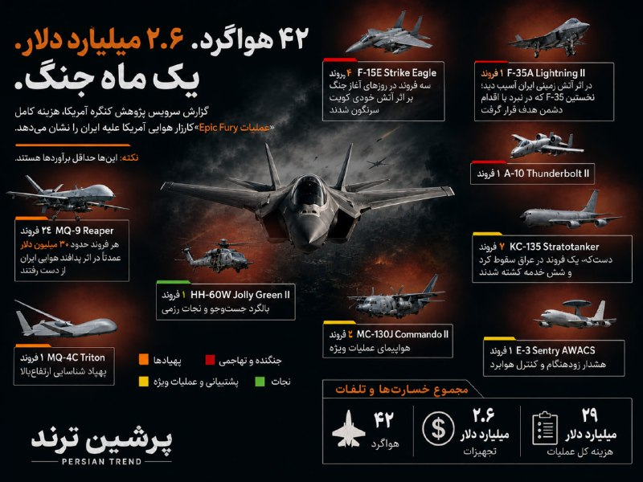

خسارت ارتش آمریکا در عملیات خشم حماسی

📌 @persian_trend_official
پرشین ترند | متفاوت‌ترین کانال نظامی

## Persian_Trend_Official — post 14603

  

🔴 بلومبرگ: ایران و عمان درباره ایجاد نظام دائمی عوارض در تنگه هرمز مذاکره می‌کنند

💢بلومبرگ گزارش داد ایران در حال گفت‌وگو با عمان درباره ایجاد نوعی نظام دائمی دریافت عوارض برای عبور کشتی‌ها از تنگه هرمز است.

🔻بر اساس این گزارش:

▪️ هدف این طرح، رسمی‌کردن کنترل ایران بر تردد دریایی در تنگه هرمز عنوان شده است
▪️ مذاکرات میان تهران و مسقط درباره سازوکار اجرایی و حقوقی این سیستم ادامه دارد
▪️ این اقدام می‌تواند هزینه عبور نفتکش‌ها و کشتی‌های تجاری را افزایش دهد

🫆:Tony

📌 @persian_trend_official
پرشین ترند | متفاوت‌ترین کانال نظامی

## Persian_Trend_Official — post 14602

  <a href="telegram/content/Persian_Trend_Official_14602_1779377370.mp4" target="_blank">🎬 Download video</a>

نسخه هوش مصنوعی عملیات اف 5 در کویت به روایت جمهوری اسلامی !

پ.ن:
قبلا میگفتن یک اف 5 بوده اما الان دوتا نشون دادن !
طبعتا اگر اف 5 ها با بمب اتم هم پایگاه آمریکایی رو میزدن نباید انقدر تخریب میشد !😄

📌 @persian_trend_official
پرشین ترند | متفاوت‌ترین کانال نظامی

## Persian_Trend_Official — post 14601

⭕️نیروی دریایی سپاه: ۳۱ فروند کشتی با هماهنگی سپاه از تنگهٔ هرمز عبور کردند

💢روابط عمومی نیروی دریایی سپاه: طی شبانه روز گذشته ۳۱ فروند کشتی اعم از نفتکش، کانتینر بر و سایر کشتی های تجاری با هماهنگی و تامین امنیت نیروی دریایی سپاه از تنگهٔ هرمز عبور کردند.

🫆:Tony

📌 @persian_trend_official
پرشین ترند | متفاوت‌ترین کانال نظامی

## Persian_Trend_Official — post 14600

  

🔴 آژانس بین‌المللی انرژی: بازار نفت ممکن است وارد «منطقه قرمز» شود

💢رئیس آژانس بین‌المللی انرژی (IEA) هشدار داد بحران تنگه هرمز می‌تواند بازار جهانی نفت را در ماه‌های ژوئیه و اوت وارد «منطقه قرمز» کند.

«فاتح بیرول» اعلام کرد:
▪️ کاهش صادرات نفت خاورمیانه و افت ذخایر استراتژیک همزمان با اوج تقاضای تابستانی، فشار شدیدی بر بازار وارد کرده است
▪️ راه‌حل اصلی، بازگشایی کامل تنگه هرمز است
▪️ پیش از آغاز جنگ ایران، حدود یک‌پنجم نفت و گاز جهان از این مسیر عبور می‌کرد
💢او همچنین افزود:
▪️ آژانس بین‌المللی انرژی در ماه مارس با آزادسازی ۴۰۰ میلیون بشکه نفت از ذخایر استراتژیک اعضا موافقت کرده بود
▪️ اما این ذخایر به‌تدریج در حال کاهش است
▪️ در صورت نیاز، آژانس آماده هماهنگی برای آزادسازی ذخایر بیشتر خواهد بود
🫆:Tony

📌 @persian_trend_official
پرشین ترند | متفاوت‌ترین کانال نظامی

## Persian_Trend_Official — post 14599

💢 انگلیس کاردار اسرائیل را احضار کرد

💢 دلیل؛ رفتار اهانت آمیز وزیر امنیت ملی اسرائیل با بازداشت‌شدگان ناوگان صمود

🫆:Tony

📌 @persian_trend_official
پرشین ترند | متفاوت‌ترین کانال نظامی

## Persian_Trend_Official — post 14598

  

⭕️علی یزدی‌خواه، نایب‌رییس کمیسیون فرهنگی مجلس، گفت در شرایط فعلی تصمیمی برای بازگشایی اینترنت جهانی وجود ندارد و محدودیت‌ها با «ملاحظات امنیتی» ادامه خواهد داشت.

💢یزدی‌خواه قطع اینترنت جهانی را به مصوبات شورای عالی امنیت ملی نسبت داد و گفت این تصمیم به‌دلیل «مسائل امنیتی، امنیت کشور و حفظ جان افراد» گرفته شده است.

🫆:Tony

📌 @persian_trend_official
پرشین ترند | متفاوت‌ترین کانال نظامی

## Persian_Trend_Official — post 14597

  <a href="telegram/content/Persian_Trend_Official_14597_1779377373.mp4" target="_blank">🎬 Download video</a>

💢وزارت دفاع روسیه فیلم تمرینات نیروهای هسته‌ای خود را منتشر کرد.

🫆:Tony

📌 @persian_trend_official
پرشین ترند | متفاوت‌ترین کانال نظامی

## Persian_Trend_Official — post 14596

  <a href="telegram/content/Persian_Trend_Official_14596_1779377375.mp4" target="_blank">🎬 Download video</a>

💢ویدئویی از لحظه سقوط یک فروند پهپاد گران 2 روسی که
پس از سرنگونی مقابل خانه ای در اوکراین سقوط کرد.

🫆:Tony

📌 @persian_trend_official
پرشین ترند | متفاوت‌ترین کانال نظامی

## Persian_Trend_Official — post 14595

  <a href="telegram/content/Persian_Trend_Official_14595_1779377376.mp4" target="_blank">🎬 Download video</a>

🔴 حمله پهپادی به مقر احزاب معارض کُرد ایرانی در اربیل

💢رسانه‌ها گزارش می‌دهند یک پهپاد، مقر احزاب کُرد مخالف ایران را در شهر سوران واقع در استان اربیل در اقلیم کردستان عراق هدف قرار داده است.

🫆:Tony

📌 @persian_trend_official
پرشین ترند | متفاوت‌ترین کانال نظامی

## Persian_Trend_Official — post 14594

  <a href="telegram/content/Persian_Trend_Official_14594_1779377376.mp4" target="_blank">🎬 Download video</a>

💢ویدئویی تاریخی از حضور نیروهای حافظ صلح سازمان ملل از ارتش ایران در کنار رودخانه لیتانی در جنوب لبنان

🫆:Tony

📌 @persian_trend_official
پرشین ترند | متفاوت‌ترین کانال نظامی

## Persian_Trend_Official — post 14593

  <a href="telegram/content/Persian_Trend_Official_14593_1779377378.mp4" target="_blank">🎬 Download video</a>

⭕️ویدئویی از حملات به یکی از پایگاه های هوایی ایران

💢انهدام تعدادی از هواگردها درون آشیانه و همچنین هواپیماهای فوکر نیروی دریایی بر روی زمین است

🫆:Tony

📌 @persian_trend_official
پرشین ترند | متفاوت‌ترین کانال نظامی

## Persian_Trend_Official — post 14592

  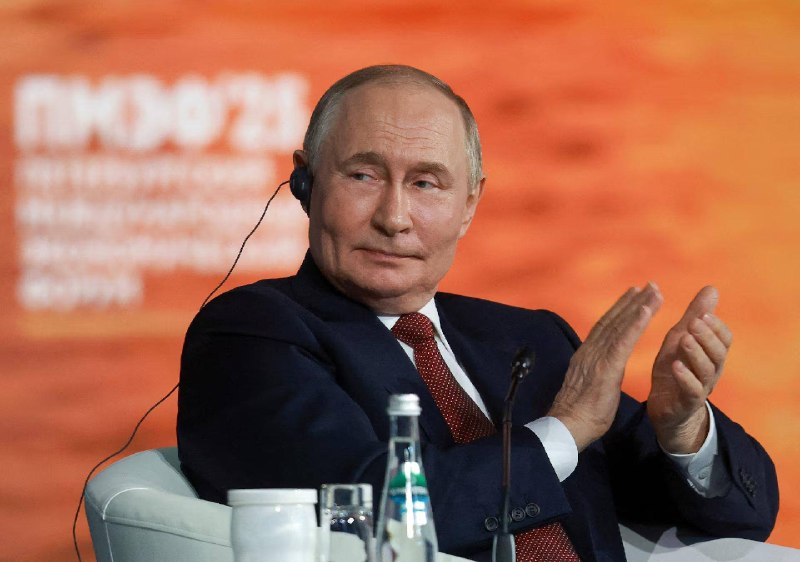

⭕️روسیه یکی از برندگان جنگ جمهوری اسلامی

💢روبل روسیه بهترین ارز عملکردی در این فصل است و حدود ۱۲٪ افزایش یافته و به ۷۲.۶ در هر دلار رسیده است قوی‌ترین نرخ از اوایل سال ۲۰۲۳

💢عامل اصلی: افزایش درآمدهای نفتی پس از آغاز جنگ آمریکا و اسرائیل علیه جمهوری اسلامی.

🫆:Tony

📌 @persian_trend_official
پرشین ترند | متفاوت‌ترین کانال نظامی

## Persian_Trend_Official — post 14591

  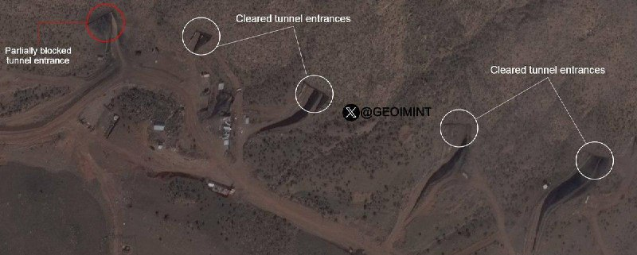

⭕️تصاویر ماهواره‌ای ۱۸ مه نشان می‌دهد که ایران چهار ورودی از پنج ورودی تأسیسات موشکی زیرزمینی آبیک در استان قزوین را پاکسازی کرده است.

پنجمین ورودی به طور جزئی پاکسازی شده است.

💢این سایت در جریان عملیات هوایی آمریکا و اسرائیل به طور عمدی هدف قرار گرفت تا موشک‌ها را در داخل به دام بیندازد.

💢ارزیابی‌های گسترده‌تر اطلاعاتی آمریکا نشان می‌دهد که ایران اکنون دسترسی به حدود ۹۰٪ از شبکه موشکی زیرزمینی خود را بازگردانده است.

🫆:Tony

📌 @persian_trend_official
پرشین ترند | متفاوت‌ترین کانال نظامی

## Persian_Trend_Official — post 14590

💢 وزارت خارجۀ اسرائیل:

▪️کلیۀ فعالان ناوگان جهانی صمود از اسرائیل اخراج شدند

🫆:Tony

📌 @persian_trend_official
پرشین ترند | متفاوت‌ترین کانال نظامی

## Persian_Trend_Official — post 14589

🔴 حملات اسرائیل چندین شهر در جنوب لبنان را هدف قرار داد

💢حملات اسرائیل به مناطق جنوبی لبنان ادامه دارد و گزارش‌ها از هدف قرار گرفتن چندین شهر خبر می‌دهند.

بر اساس گزارش خبرنگاران میدانی:

▪️ یک حمله هوایی اسرائیل شهر «الصرفند» در منطقه صور را هدف قرار داده است
▪️ توپخانه اسرائیل شهرهای «براشیت» و «کفر دونین» را گلوله‌باران کرده است
▪️ همچنین یک پهپاد اسرائیلی شهر «یارون» در جنوب لبنان را هدف قرار داده است

🫆:Tony

📌 @persian_trend_official
پرشین ترند | متفاوت‌ترین کانال نظامی

## Persian_Trend_Official — post 14588

⭕️رویترز:

💢پس از آنکه ترامپ هشدار داد «اگر ایران به توافق نرسد، امشب یک تمدن کامل خواهد مرد»، وحشت، پایتخت‌های اروپایی را دربرگرفت.

💢یکی از دولت‌های اروپایی فوراً از دیپلمات‌های خود در واشنگتن این سؤال را پرسید: آیا آمریکا می‌خواهد از سلاح‌های هسته‌ای بکند؟

💢مقامات برای دریافت پاسخ به وزارت خارجه آمریکا مراجعه کردند و انتظار داشتند از کانال‌های دیپلماتیک سنتی آمریکا پیام اطمینان‌بخشی دریافت کنند. اما به گفته یک دیپلمات اروپایی، مقامات وزارت خارجه آمریکا پذیرفتند که نمی‌دانند منظور ترامپ چیست و بعداً چه اتفاقی ممکن است بیفتد.

🫆:Tony

📌 @persian_trend_official
پرشین ترند | متفاوت‌ترین کانال نظامی

## Persian_Trend_Official — post 14587

🔴 نتانیاهو خواهان ازسرگیری حملات به ایران است

💢کانال ۱۳ اسرائیل گزارش داد بنیامین نتانیاهو در حال فشار برای ازسرگیری حملات علیه ایران است، در حالی که دونالد ترامپ خواستار دادن زمان بیشتر به روند مذاکرات شده است.

بر اساس این گزارش:

▪️ ترامپ ترجیح می‌دهد پیش از بازگشت به گزینه نظامی، فرصت بیشتری به گفت‌وگوها داده شود
▪️ اما نتانیاهو معتقد است ایران از مذاکرات برای خرید زمان استفاده می‌کند
▪️ اختلاف نظر میان واشینگتن و تل‌آویو درباره زمان‌بندی اقدام نظامی همچنان ادامه دارد

💢این گزارش در حالی منتشر می‌شود که مذاکرات غیرمستقیم میان ایران و آمریکا با میانجیگری منطقه‌ای ادامه دارد.

🫆:Tony

📌 @persian_trend_official
پرشین ترند | متفاوت‌ترین کانال نظامی

## RadioFarda — post 157426

🔸رئیس آژانس بین‌المللی انرژی روز پنج‌شنبه هشدار داد که اگر پیشرفتی در پایان دادن به جنگ ایران حاصل نشود، بازار جهانی نفت ممکن است تا تابستان آینده وارد «منطقه قرمز» شود. 🔸فاتح بیرول در اندیشکده چتم هاوس در لندن گفت: «اگر شاهد بهبودهایی در وضعیت جنگ نباشیم،…

## RadioFarda — post 157425

  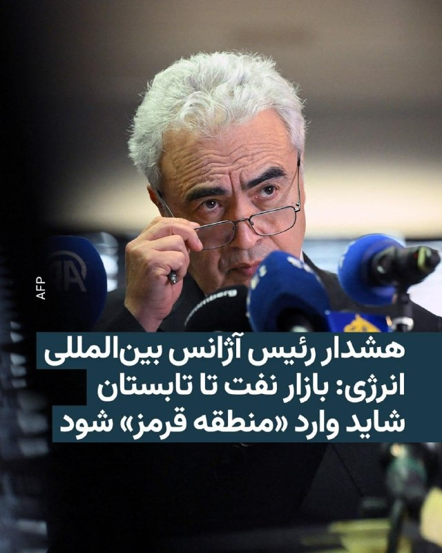

🔸رئیس آژانس بین‌المللی انرژی روز پنج‌شنبه هشدار داد که اگر پیشرفتی در پایان دادن به جنگ ایران حاصل نشود، بازار جهانی نفت ممکن است تا تابستان آینده وارد «منطقه قرمز» شود.

🔸فاتح بیرول در اندیشکده چتم هاوس در لندن گفت: «اگر شاهد بهبودهایی در وضعیت جنگ نباشیم، ممکن است در ماه ژوئیه یا اوت وارد منطقه قرمز (در زمینه عرضه) شویم.»

🔸ایران در واکنش به حملات آمریکا و اسرائیل که از نهم اسفند پارسال آغاز شد، عملاً عبور نفتکش‌ها از تنگه هرمز را متوقف کرده و این اقدام جریان نفت و گاز را مختل و قیمت‌ها را به‌شدت افزایش داده است.

🔸بیرول گفت در حالی که مازاد نفت موجود در بازار پیش از جنگ به جذب شوک انرژی کمک کرده، «ذخایر در حال کاهش هستند.»

@RadioFarda

## RadioFarda — post 157423

🔸قوه قضائیه جمهوری اسلامی روز پنجشنبه اعلام کرد مدیرمسئول خبرگزاری رسمی دولت، ایرنا، را به دلیل انتشار تصاویر بدون حجاب از سارا کنعانی، نویسنده ایرانی، بر روی خروجی خود به دادسرا احضار کرده است.

🔸در بیانیه قوه قضائیه آمده است: «در پی انتشار تصاویری از یک خانم بدون رعایت قوانین و مقررات اسلامی کشور از سوی خبرگزاری ایرنا، مدیر مسئول این رسانه برای ارائه توضیحات به دادسرای فرهنگ و رسانه احضار شد.»

🔸در ادامه تأکید شده که «در لحظه انتشار» به خبرگزاری جمهوری اسلامی، ایرنا، برای حذف این تصاویر تذکر داده شد.

🔸ایرنا روز ۲۹ اردیبهشت تصاویری از خانم کنعانی را که بدون حجاب رسمی مورد تایید حکومت در فضای خصوصی منزلش بود منتشر و ساعتی بعد آنها را از روی سایت خود حذف کرد.

🔸انتشار این تصاویر در قالب یک گزارش تصویری صورت گرفت که واکنش‌هایی‌ را در شبکه‌های اجتماعی به‌دنبال داشت.

🔸سارا کنعانی در جریان جنگ اخیر آمریکا و اسرائیل علیه ایران، به طور موقت از یک نوزاد بی‌سرپرست نگهداری کرده بود.

@RadioFarda

## RadioFarda — post 157422

  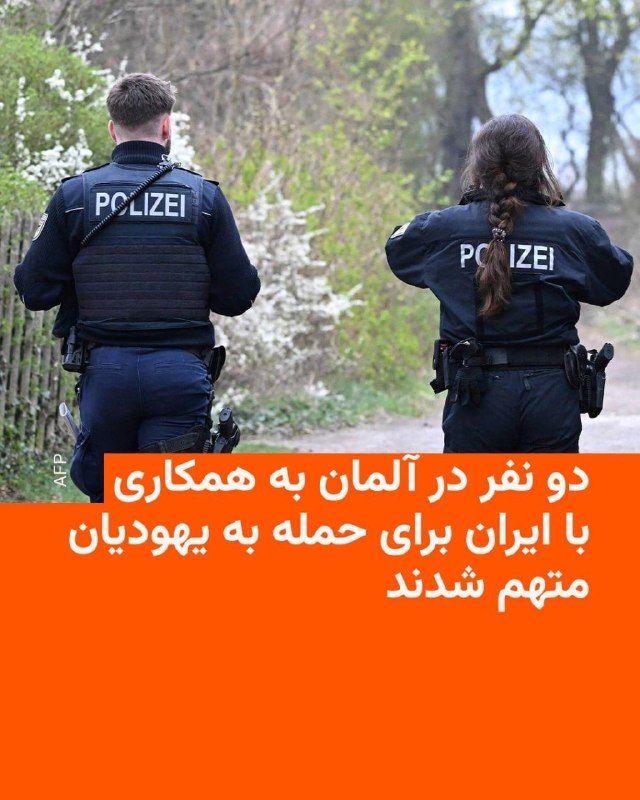

🔸دادستانی فدرال آلمان از اعلام جرم علیه یک شهروند دانمارک و یک شهروند افغان، به ظن تلاش برای کمک به برنامه‌ریزی قتل رهبران برجسته نهادهای یهودی در آلمان خبر می‌دهد.

🔸این دو نفر متهم هستند که این اقدامات را از سوی سازمان‌های امنیتی جمهوری اسلامی انجام داده‌اند.
هویت کامل متهمان اعلام نشده و تنها با نام‌های علی س. (شهروند دانمارک) و تواب م. (شهروند افغان) معرفی شده‌اند.

🔸بیانیه دادستانی آلمان می‌گوید علی س. با نیروی قدس سپاه پاسداران ارتباط تنگاتنگی داشته و اوایل سال گذشته میلادی، ماموریت داشته که در مورد یوزف شوستر، رئیس شورای مرکزی یهودیان آلمان و فولکر بک رئیس جامعه آلمانی- اسرائیلی اطلاعاتی جمع‌آوری کند.

🔸او همچنین مأمور شده بود که در مورد دو اغدیه‌فروشی یهودی در برلین هم اطلاعات جمع‌آوری کند.

🔸به گفته دادستانی فدرال، هدف از این اقدامات، تسهیل برنامه‌ریزی برای قتل این رهبران یهودی و به‌آتش کشیدن کسب‌وکارهای یهودیان در آلمان بوده است.

@RadioFarda

## RadioFarda — post 157421

  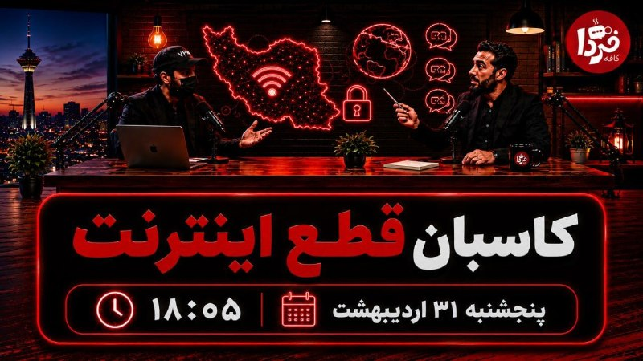

📷 Photo

## RadioFarda — post 157420

هشدار نماینده کنگره آمریکا؛ ابهام و شکاف در ائتلاف غرب به سود روسیه، ایران و چین است

🔸دان بیکن، از جمهوری‌خواهان ارشد کمیته نیروهای مسلح مجلس نمایندگان آمریکا، در مصاحبه‌ای مفصل می‌گوید ابهام و عدم قطعیت واشینگتن می‌تواند دشمنان آمریکا، از جمله روسیه، ایران و چین را «گستاخ‌تر» کند؛ آن هم در شرایطی که تنش‌ها در داخل ائتلاف ناتو رو به افزایش است.

🔸این ژنرال سابق نیروی هوایی این اظهارات را در گفت‌وگو با رادیو اروپای آزاد/رادیو آزادی و هم‌زمان با اعلام پنتاگون درباره کاهش شمار تیپ‌های رزمی ارتش آمریکا در اروپا از چهار تیپ به سه تیپ و نیز تعویق استقرار برنامه‌ریزی‌شده نیروها در لهستان مطرح کرد.

🔸بیکن گفت بازنگری در استقرار نیروها، بخشی از موضوع گسترده‌ترِ نحوهٔ مواجههٔ آمریکا با چالش‌های هم‌زمان ناشی از روسیه، چین، ایران و گروه‌های افراط‌گرا است.

🔸او با بیان این‌که «ابهام در دنیای امروز خطرناک است»، گفت واشینگتن و متحدانش نمی‌توانند در شرایطی که این تهدیدها بیش از پیش با هم مرتبط می‌شوند، فاقد شفافیت راهبردی باشند.

🔸گفت‌وگوی کامل را در وب‌سایت رادیو فردا می‌توانید بخوانید.

@RadioFarda

## IranianMinds — post 20493

  <a href="telegram/content/IranianMinds_20493_1779377382.mp4" target="_blank">🎬 Download video</a>

🔴حملات شدید ارتش اسرائیل به جنوب لبنان.

@IranianMinds

## IranianMinds — post 20492

🔴آسوشیتدپرس:

عراقچی، وزیر خارجه ایران و قالیباف دیگر به هیچ عنوان مذاکرات را در داخل ایران پیش نمی‌برند و کنترل کل ماجرا در دست سپاه پاسداران می‌باشد.

@IranianMinds

## IranianMinds — post 20491

  <a href="telegram/content/IranianMinds_20491_1779377382.mp4" target="_blank">🎬 Download video</a>

🔴تبلیغ وطن‌دوستی با شهروندان وارداتی از سنگال، غنا، کنیا، بورکینافاسو، ساحل عاج، نیجریه، تانزانیا و مالی😂😂😂

@IranianMinds

## IranianMinds — post 20489

🔴ترامپ در تروث سوشال یک مقاله از نیویورک پست منتشر کرده که عنوانش چطور می‌توان تهران را در سه حرکت شکست داد.

@IranianMinds

## IranianMinds — post 20488

  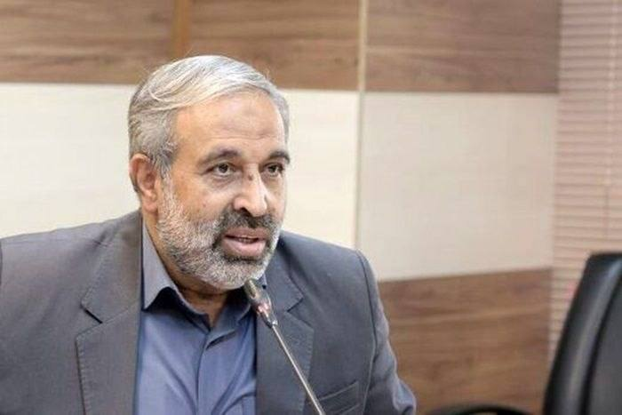

🔴یزدی‌خواه، نایب رئیس کمیسیون فرهنگی مجلس:

اینترنت جهانی فعلأ بازگشایی نمی‌شود.

@IranianMinds

## BBCPersian — post 281707

  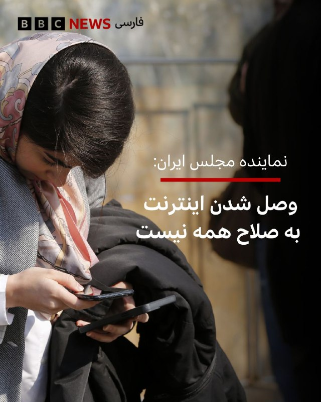

🔻نایب رئیس کمیسیون فرهنگی مجلس ایران می‌گوید که «مسئولان به این نتیجه رسیده‌اند که وصل کردن اینترنت به صلاح همه نیست و اینترنت بین‌المللی در حال حاضر بازگشایی نخواهد شد.»

علی یزدی‌خواه با اشاره به این که قطع اینترنت از دستورات و اختیارات شورای عالی امنیت ملی است، گفت که «به لحاظ مسائل امنیتی، امنیت کشور»، اینترنت جهانی قطع شده است.

او گفت که با وجود قطع اینترنت، «کسب‌وکارها از طریق ارتباطات بانکی، خرید و فروش و سایر خدمات آنلاین همچنان فعال هستند و مردم با مشکل عمده‌ای مواجه نیستند.»

به گفته این نماینده مجلس برخی افرادی که از نظر مسئولان نیاز به دسترسی به اینترنت بین‌الملل داشتند، این امکان به‌صورت محدود برای آن‌ها فراهم شده است.

آقای یزدی خواه افزوده «تقریبا بیش از ۹۰ درصد نیازها و احتیاجات مردم در فضای فعلی برآورده می‌شود و اگر اقشاری هستند که دچار مشکل‌ هستند، قابلیت پیگیری وجود دارد.»

این در حالی است که کارشناسان اقتصادی نسبت به خسارات وارد شده به کسب و کارها در نتیجه قطع اینترنت هشدار داده‌اند.

📸 Getty

https://bbc.in/4fwMLUO
@BBCPersian

## BBCPersian — post 281706

🔻روسیه: ایران در خصوص ذخایر اورانیوم خود تصمیم می‌گیرد

سخنگوی وزارت خارجه روسیه گفته است «ایران به تنهایی باید سرنوشت ذخایر اورانیوم خود را تعیین کند.»

ماریا زاخارووا گفت که «بحران ایران تنها از طریق دیپلماسی که منافع ایران را در نظر بگیرد، قابل حل است.»

به گفته او روسیه مصمم است در اجرای هرگونه تصمیمی که ممکن است از طریق مذاکرات حاصل شود، به ایران و ایالات متحده کمک کند.

https://bbc.in/4fwMLUO
@BBCPersian

## BBCPersian — post 281705

  

انور قرقاش، مشاور ارشد رئیس دولت امارات متحده عربی، می‌گوید که برخی رفتارهای ایران در سال‌های گذشته باعث کاهش اعتماد میان کشورهای منطقه خلیج فارس شده است.

او در پیامی در شبکه اجتماعی ایکس نوشت که کشورهای منطقه طی سال‌های طولانی با «رفتارهای زورگویانه و تهدیدآمیز» ایران روبه‌رو بوده‌اند؛ رفتارهایی که به بخشی از واقعیت سیاسی خلیج فارس تبدیل شده است.

آقای قرقاش همچنین تاکید کرد که شکاف میان مواضع تند و ادعاهای دوستی از سوی ایران، باعث از بین رفتن اعتماد و اعتبار شده است «و امروز، پس از تجاوز وحشیانه ایران، حکومت ایران تلاش می‌کند واقعیت تازه‌ای را که از یک شکست آشکار نظامی به‌وجود آمده تثبیت کند؛ اما تلاش برای کنترل تنگه هرمز یا تعرض به حاکمیت دریایی امارات متحده عربی چیزی جز خیال‌پردازی و آرزوهای دست‌نیافتنی نیست.»

📸 Getty

https://bbc.in/4fwMLUO
@BBCPersian

## BBCPersian — post 281704

  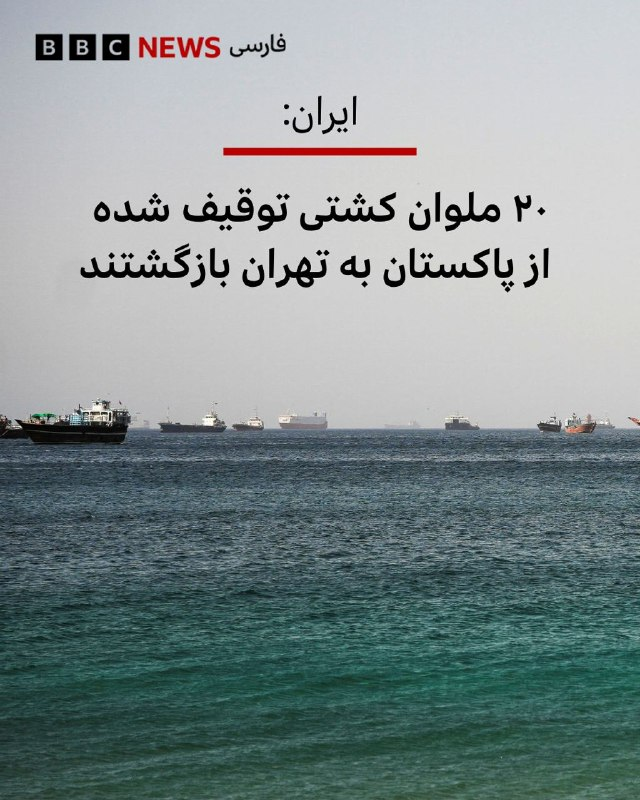

خبرگزاری رسمی ایرنا گزارش کرده است که «۲۰ ملوان ایرانی» که کشتی آنها توسط آمریکا توقیف شده بود از اسلام‌آباد به تهران آمده‌اند.

بنابر این گزارش، آزادی ملوانان پس از«رایزنی‌های فشرده عباس عراقچی، وزیر امور خارجه ایران، با همتایان پاکستانی و سنگاپوری حاصل شد.»

اواخر فروردین، آمریکا دو نفتکش حامل نفت ایران را به نام‌های «ام‌تی تیفانی» و «ام‌تی ماجستیک»، توقیف کرد و به گفته نماینده ایران در سازمان بین‌المللی دریانوردی حدود ۶۰ نفر از خدمه دو نفتکش با یک یدک‌کش به سنگاپور منتقل شدند.

هفته گذشته وزیر خارجه پاکستان اعلام کرد که ۲۰ تبعه ایرانی و ۱۱ تبعه پاکستانی با رایزنی با وزیر خارجه آمریکا آزاد شده و به اسلام‌آباد منتقل شدند.

عکس آرشیوی از رویترز

https://bbc.in/4fwMLUO
@BBCPersian

## BBCPersian — post 281703

  <a href="telegram/content/BBCPersian_281703_1779377386.mp4" target="_blank">🎬 Download video</a>

سرخط خبرها، پنج‌شنبه ۳۱ اردیبهشت ۱۴۰۵

@BBCPersian

## BBCPersian — post 281701

🔻نخست وزیر پاکستان به چین می‌رود
وزارت خارجه چین اعلام کرده است که

شهباز شریف، نخست وزیر پاکستان از روز شنبه تا سه‌شنبه (۲۳ تا ۲۶ مه/۲ تا ۵ خرداد) برای انجام مذاکرات به پکن سفر خواهد کرد.

پاکستان و چین هر دو تلاش کرده‌اند که در درگیری‌های خاورمیانه، میانجی‌گری کنند.

با وجود آن‌که از ۱۹ فروردین (۸ آوریل) آتش‌بسی برقرار شده است، دونالد ترامپ، رئیس‌جمهور آمریکا، دیروز هشدار داد که فرصت برای دیپلماسی رو به پایان است.

سخنگوی وزارت خارجه چین، روز پنج‌شنبه در یک نشست خبری گفت: «رهبران چین و پاکستان درباره روابط دوجانبه و مسائل مورد علاقه مشترک تبادل نظر عمیق خواهند داشت.»

او افزود که چین با پاکستان همکاری خواهد کرد تا «به بازگشت سریع صلح و ثبات در خاورمیانه کمک‌های مثبتی کند.»

به گفته او، چین از نقش «منصفانه و متوازن» پاکستان در میانجی‌گری برای صلح و پایان دادن به جنگ حمایت می‌کند.

پاکستان در ماه‌های اخیر به یکی از بازیگران اصلی میانجی‌گری میان آمریکا و ایران تبدیل شده و ماه گذشته میزبان مذاکراتی در این زمینه بود که بی‌نتیجه ماند.

همچنین گزارش شده است که فیلد مارشال عاصم منیر، فرمانده ارتش پاکستان، امروز به تهران سفر می کند.

در دو هفته گذشته پکن میزبان دونالد ترامپ و ولادیمیر پوتین بوده است.

https://bbc.in/4fwMLUO
@BBCPersian

## BBCPersian — post 281700

  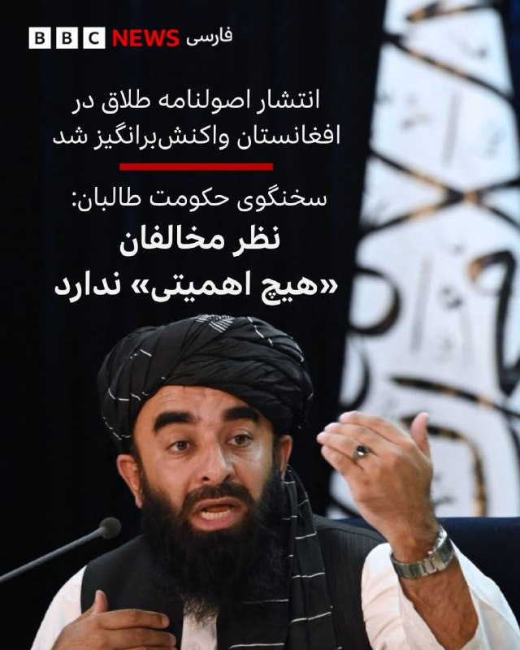

🔻انتشار اصولنامه طلاق در افغانستان واکنش‌برانگیز شد؛ سخنگوی حکومت طالبان: نظر مخالفان «هیچ اهمیتی» ندارد

ذبیح‌الله مجاهد، سخنگوی حکومت طالبان در افغانستان، در واکنش‌ به انتقادها از اصولنامه طلاق زوجین که به‌تازگی منتشر شده است گفت که چنین انتقادهایی تازگی ندارد و «نباید هیچ اهمیتی به آن داده شود.»

بیشتر بخوانید:

https://bbc.in/43l0dDU
@BBCPersian
📸Getty Images

## BBCPersian — post 281699

🔻سرانجام متهمان پرونده اکباتان؛ سرهایی که پای دار رفت اما بالای دار نرفت

قوه قضائیه ایران روز پنجشنبه (۲۱ اردیبهشت) یک روز بعد از صدور حکم متهمان «پرونده اکباتان»، توضیحاتی در این مورد منتشر کرد. دیروز احکام شش متهم در پرونده موسوم به «اکباتان» صادر شد که براساس آن سه متهم محکوم در ارتباط با کشته‌شدن آرمان علی‌وردی، طلبه بسیجی به پنج سال حبس و دیه و سه متهم دیگر از اتهامات تبرئه شدند.

https://bbc.in/43idNYO
@BBCPersian

## BBCPersian — post 281698

رویترز: رهبر ایران دستور داده که اورانیوم غنی شده نباید به خارج از کشور ارسال شود

خبرگزاری رویترز به نقل از دو منبع ارشد ایرانی که نام‌شان را اعلام نکرده، گزارش داده که مجتبی خامنه‌ای، رهبر جمهوری اسلامی، دستوری صادر کرده است مبنی بر اینکه اورانیوم غنی شده با خلوص بالا نباید به خارج از کشور ارسال شود.

این امر موضع تهران را در مورد یکی از خواسته‌های اصلی آمریکا در مذاکرات صلح سخت‌تر می‌کند.

دستور مجتبی خامنه‌ای می‌تواند دونالد ترامپ را بیش از پیش مایوس کند و مذاکرات پیچیده در مورد پایان دادن به جنگ آمریکا و اسرائیل علیه ایران را پیچیده‌تر کند.

مقامات اسرائیلی به رویترز گفته‌اند که دونالد ترامپ به اسرائیل اطمینان داده است که ذخایر اورانیوم غنی‌شده با خلوص بالای ایران که نزدیک به درجه مورد نیاز برای ساخت سلاح اتمی است، از ایران خارج خواهد شد و هرگونه توافق صلح باید شامل بندی در این مورد باشد.

هنوز هیچکدام از رسانه های رسمی و حکومتی ایران در این باره خبری منتشر نکرده‌اند.

https://bbc.in/4fwMLUO
@BBCPersian

## BBCPersian — post 281697

بریتانیا با شش کشور حوزه خیلج فارس حدود پنج میلیارد دلار قرارداد تجاری امضا کرد

بریتانیا با شش کشور حوزه خلیج فارس یک توافق تجاری امضا کرده است که به گفته دولت، ارزش آن برای اقتصاد این کشور حدود پنج میلیارد دلار خواهد بود.

https://bbc.in/4tSdPBn
@BBCPersian

## BBCPersian — post 281696

🔻چین: آمریکا از استفاده و تهدید به ابزارهای قضایی علیه کوبا دست بردارد

چین روز پنج‌شنبه از آمریکا خواست که «از استفاده و تهدید به ابزارهای قضایی علیه کوبا دست بردارد.» این درخواست پس از آن‌ است که واشنگتن رائول کاسترو، رئیس‌جمهور سابق کوبا را به اتهام قتل تحت پیگرد قرار داد.

گوئو جیاکون، سخنگوی وزارت خارجه چین، در یک نشست خبری و در پاسخ به پرسشی درباره این اتهامات گفت: «طرف آمریکایی باید از به‌کار بردن ابزار تحریم و ابزار قضایی علیه کوبا دست بردارد و هر بار تهدید به زور را متوقف کند.»

ایالات متحده رائول کاسترو، رهبر پیشین کوبا، را به اتهام توطئه برای قتل شهروندان آمریکایی و چند اتهام دیگر در ارتباط با سرنگونی دو هواپیما در سال ۱۹۹۶ در مسیر کوبا و فلوریدا متهم کرد.

رائول کاسترو که اکنون ۹۴ ساله است، در آن زمان فرمانده نیروهای مسلح کوبا بود و پس از این حادثه با محکومیت بین‌المللی روبه‌رو شد.

https://bbc.in/4fwMLUO
@BBCPersian

## idfinfarsi — post 11617

  <a href="telegram/content/idfinfarsi_11617_1779377388.mp4" target="_blank">🎬 Download video</a>

🔵رئیس ستاد کل ارتش اسرائیل و همسرش در دیدار با مجروحان در آستانه عید شاووعوت: «حتی در طول عید شاووعوت نیز ارتش اسرائیل در بالاترین سطح آماده‌باش قرار دارد»

🔹رئیس ستاد کل ارتش اسرائیل، سپهبد ایال زامیر، امروز (پنج‌شنبه) از مرکز پزشکی توان‌بخشی بیت لوینشتاین و مجتمع پزشکی رمبام بازدید کرد و با مجروحان ارتش اسرائیل که در جریان درگیری‌ها زخمی شده‌اند، دیدار نمود.

🔹در جریان این بازدید، رئیس ستاد کل ارتش اسرائیل تأکید کرد که ارتش اسرائیل همچنان در تمامی جبهه‌ها به فعالیت خود ادامه می‌دهد و در آمادگی بالا و آماده‌باش کامل برای هرگونه تحول قرار دارد — در خشکی، هوا و دریا. او در آستانه عید شاووعوت، به قدرت ملت اسرائیل، روحیه داوطلبی، همبستگی و پایداری که رزمندگان، خانواده‌ها و کادرهای درمانی از آغاز جنگ نشان داده‌اند اشاره کرد.

🔹به گفته رئیس ستاد کل ارتش اسرائیل، سپهبد ایال زامیر: «توان و نیرویی که شما و خانواده‌هایتان در روند بهبودی و توان‌بخشی از این جراحت پیچیده ناشی از جنگ نشان می‌دهید، الهام‌بخش تمام ملت اسرائیل است.

🔹حتی در طول عید شاووعوت نیز ارتش اسرائیل در بالاترین سطح آماده‌باش قرار دارد و با عزم راسخ در تمامی جبهه‌ها به فعالیت خود ادامه می‌دهد، در آمادگی بالا و آمادگی کامل برای هر مأموریتی. روحیه رزمندگی، مسئولیت‌پذیری و پایداری که شما از خود نشان می‌دهید، نیرویی است که به ما قدرت ادامه مسیر را می‌دهد.»

## Dirty_Kids — post 389887

  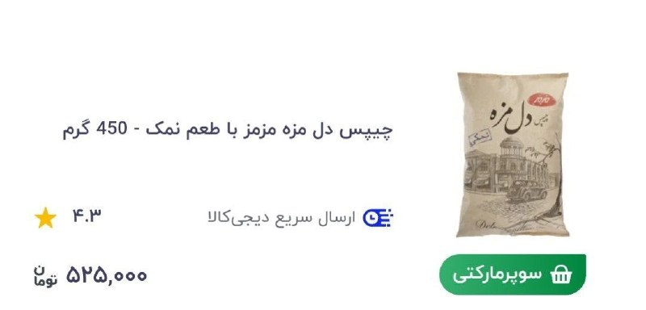

یک بسته چیپس ساده نیم میلیون تومان!!!

@Dirty_Kids 👻

## Dirty_Kids — post 389884

گلی به جمال مهلقا جابری
با یه طراحی یقه صدای مردم رسوند

بی‌ادعا با این همه کمالات و زیبایی یه گوشه نشسته استوری‌شو میذاره مبارزشو میکنه، بعضیا تخم ایشونم نیستن ولی کم مونده ادعای اسپارتاکوسی کنن

@Dirty_Kids 👻

## Dirty_Kids — post 389883

  <a href="telegram/content/Dirty_Kids_389883_1779377389.mp4" target="_blank">🎬 Download video</a>

احمدی نژاد ، بعد اینکه شنید کاندیدای آمریکا و اسراییل برای کنترل ایران شده 🤦‍♂️🤦‍♂️🤦‍♂️🤣🤣

@Dirty_Kids 👻

## Dirty_Kids — post 389882

  

فکر کن همین امشب بزنن و قبل جام جهانی جمعشون کنن…

@Dirty_Kids 👻

## Dirty_Kids — post 389881

چرا سالهاست کسی لوزه عمل نکرده ؟؟
وقتی ما ابتدایی بودیم هفته ای یه نفر عمل میکرد :/

@Dirty_Kids 👻

## Dirty_Kids — post 389880

  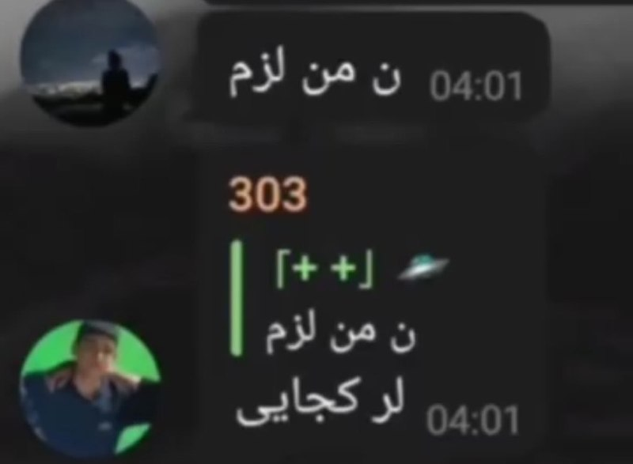

سطح سادگی من:

@Dirty_Kids 👻

## Dirty_Kids — post 389879

  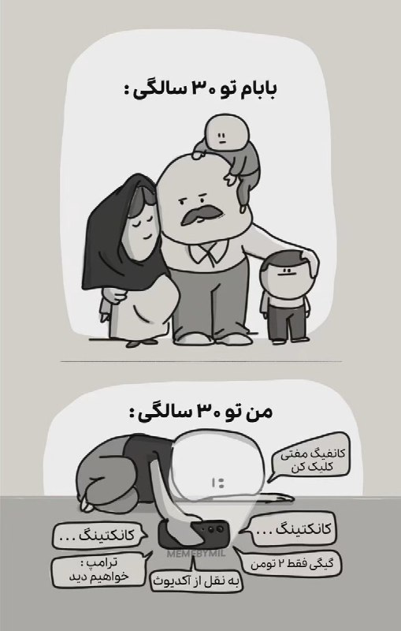

فکت

@Dirty_Kids 👻

## Dirty_Kids — post 389877

سر تیت‌س خبرها:

گویا مجری اینترنشنال یادش رفته سوتین ببنده و نوک سینه‌هاش معلومه.

@Dirty_Kids 👻

## Dirty_Kids — post 389876

  <a href="telegram/content/Dirty_Kids_389876_1779377391.mp4" target="_blank">🎬 Download video</a>

اگه براتون سواله چرا سادگی رو بورس هستش:

@Dirty_Kids 👻

## Dirty_Kids — post 389875

ایلان ماسک:
انسان‌ها به زودی تراشه‌های سایبرنتیک کاشتنی خواهند داشت که قدرت‌های خداگونه را ممکن می‌سازند
این فناوری می‌تونه انسان کور رو بینا کنه ، افراد فلج دوباره بتونن راه برن و ناشنوا ها هم بتونن بشنوند

ایلان این تراشه‌ها را به عنوان «معجزاتی در سطح عیسی» توصیف میکنه.

@Dirty_Kids 👻

## Hranews — post 113079

  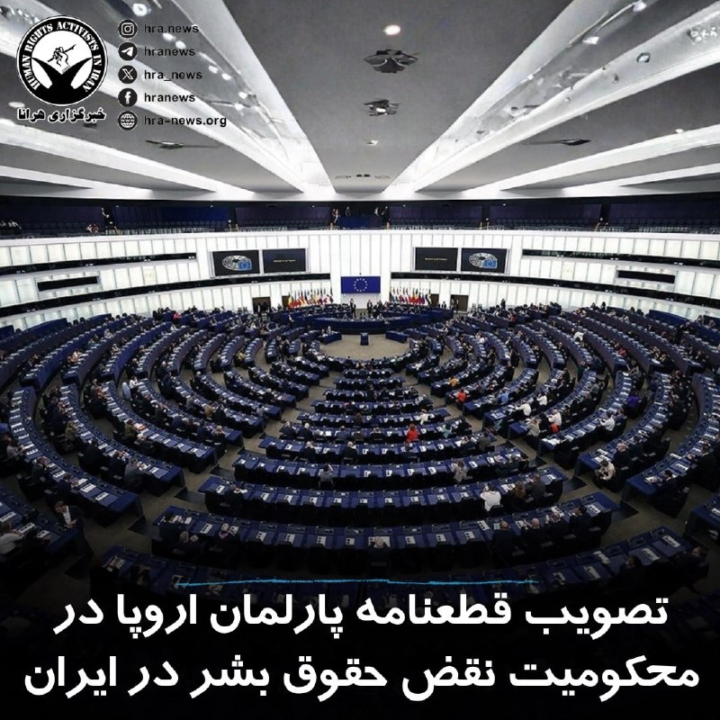

امروز پنجشنبه، پارلمان اروپا با تصویب قطعنامه‌ای، ضمن انتقاد از وضعیت حقوق بشر در ایران، خواستار گسترش تحریم‌های هدفمند علیه «مقامات مسئول سرکوب»، از جمله سپاه پاسداران و نهادهای وابسته به رهبری جمهوری اسلامی شد. در این قطعنامه همچنین بر ادامه حمایت از هیئت حقیقت‌یاب سازمان ملل درباره ایران تاکید شده است.

در متن این قطعنامه، نمایندگان پارلمان اروپا با اشاره به مواردی از جمله اعدام‌ها و برخورد با معترضان، از اتحادیه اروپا خواسته‌اند تحریم‌ها علیه مقامات جمهوری اسلامی را گسترش دهد و محدودیت‌هایی نظیر ممنوعیت ورود برخی افراد مرتبط با ساختار قدرت به اروپا را اعمال کند.
#حقوق_بشر #اعدام #پارلمان_اروپا

↘️
@hranews_bot تماس ✉️ - @Hranews کانال هرانا 🆑

## Hranews — post 113078

تشکیل پرونده قضایی علیه دست‌اندرکاران فیلم «تهران کنارت»/ احضار رئیس سازمان سینمایی کشور

❗️
❗️
❗️
❗️
❗️– مرکز رسانه قوه قضاییه از تشکیل پرونده قضایی علیه دست‌اندرکاران فیلم «تهران کنارت» به دلیل آنچه وجود “محتوای غیراخلاقی” در این فیلم عنوان کرده است، خبر داد. همچنین در این راستا رئیس سازمان سینمایی کشور نیز به مرجع قضایی مربوطه #احضار شده است.

ادامه مطلب

#فیلم_تهران_کنارت

↘️
@hranews_bot تماس ✉️ - @Hranews کانال هرانا 🆑

## Hranews — post 113077

  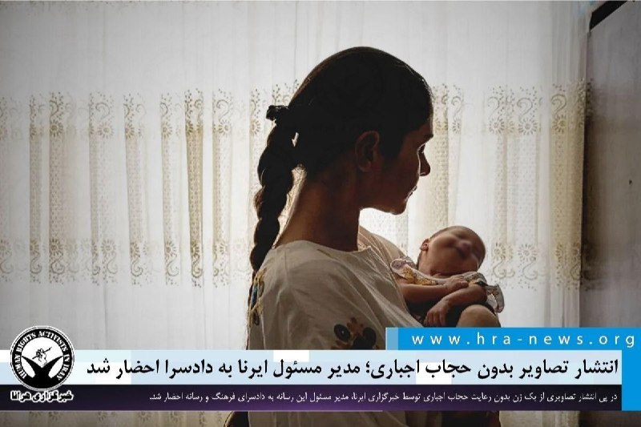

انتشار تصاویر بدون حجاب اجباری؛ مدیر مسئول ایرنا به دادسرا احضار شد

❗️
❗️
❗️
❗️
❗️– در پی انتشار تصاویری از یک زن بدون رعایت حجاب اجباری توسط خبرگزاری ایرنا، مدیر مسئول این رسانه به دادسرای فرهنگ و رسانه #احضار شد.

ادامه مطلب

#حجاب #حجاب_اجباری

↘️
@hranews_bot تماس ✉️ - @Hranews کانال هرانا 🆑

## Hranews — post 113076

  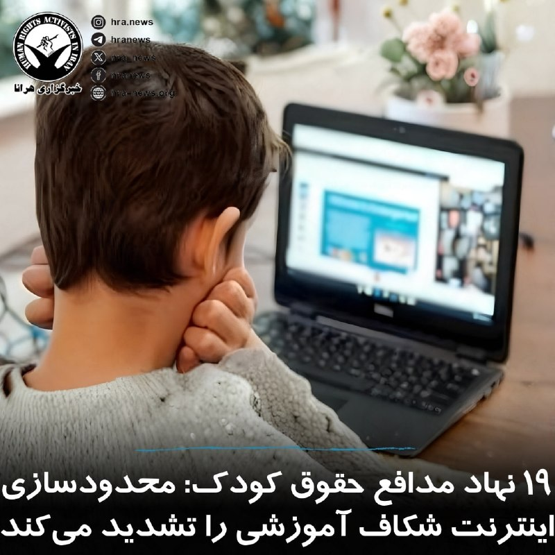

جمعی از سازمان‌های مردم‌نهاد و فعالان حوزه حقوق کودک، با انتشار بیانیه‌ای نسبت به تداوم محدودسازی و طبقاتی‌سازی اینترنت در ایران هشدار دادند و آن را عاملی در تشدید نابرابری آموزشی و اجتماعی، به‌ویژه برای کودکان و نوجوانان دانستند. در این بیانیه که به امضای ۱۹ نهاد رسیده، تاکید شده است دسترسی آزاد و برابر به اینترنت، بخشی از حقوق بنیادین شهروندان، به‌ویژه در حوزه آموزش، دسترسی به اطلاعات و رشد فردی است.

امضاکنندگان این بیانیه، با اشاره به تعهدات بین‌المللی ایران از جمله پیمان‌نامه #حقوق_کودک، محدودسازی اینترنت را در تضاد با این تعهدات دانسته و تاکید کرده‌اند که این روند، فرصت‌های آموزشی و ارتباطی نسل جدید را محدود می‌کند. در بخش دیگری از این بیانیه، با اشاره به نقش #اینترنت در آموزش و معیشت خانوارها، آمده است که اختلال در دسترسی، علاوه بر آسیب به فرآیند یادگیری، بر شرایط اقتصادی و امنیت روانی خانواده‌ها نیز اثرگذار است.

↘️
@hranews_bot تماس ✉️ - @Hranews کانال هرانا 🆑

## Hranews — post 113075

  

احمد میدری، وزیر تعاون، کار و رفاه اجتماعی ایران اعلام کرد که از آغاز جنگ اخیر تا امروز، حدود ۲۳۰ هزار نفر از کارگرانی که شغل خود را از دست داده‌اند برای دریافت بیمه بیکاری ثبت‌نام کرده‌اند.

این آمار در حالی منتشر می‌شود که بسیاری از #کارگران روزمزد و شاغلان غیررسمی اساساً تحت پوشش بیمه نیستند و در این آمار محاسبه نمی‌شوند.

↘️
@hranews_bot تماس ✉️ - @Hranews کانال هرانا 🆑

## manototv — post 105720

  <a href="telegram/content/manototv_105720_1779377394.mp4" target="_blank">🎬 Download video</a>

دادستان‌های فدرال آلمان اعلام کردند که علیه یک شهروند دانمارکی و یک شهروند افغان به اتهام مشارکت در طرح‌ریزی برای قتل رهبران برجسته سازمان‌های یهودی در آلمان به نفع جمهوری اسلامی، کیفرخواست کیفری صادر کرده‌اند.
متهمان که طبق قوانین حریم خصوصی آلمان تنها با نام «علی س.» (شهروند دانمارک) و «تواب م.» (شهروند افغان) معرفی شده‌اند، به مشارکت در اقدام به قتل متهم هستند.
علی س. متهم است که برای سرویس اطلاعاتی سپاه پاسداران کار می‌کرده و ارتباط نزدیکی با واحد ویژه آن، نیروی قدس، داشته است.
دادستان‌ها گفتند او در اوایل سال ۲۰۲۵ مأمور شده بود اطلاعاتی درباره رئیس شورای مرکزی یهودیان در آلمان، یوزف شوستر، و رئیس انجمن آلمان–اسرائیل، فولکر بک، جمع‌آوری کند.
همچنین به او دستور داده شده بود که از دو فروشنده مواد غذایی یهودی در برلین جاسوسی کند.
دادستان‌ها اعلام کردند: «همه این اقدامات برای تسهیل برنامه‌ریزی حملات قتل و آتش‌سوزی در آلمان انجام می‌شد.»

## manototv — post 105719

  <a href="telegram/content/manototv_105719_1779377394.mp4" target="_blank">🎬 Download video</a>

مقام‌های هندی اعلام کرده‌اند که اولویت آن‌ها بازگرداندن کشتی‌های این کشور است که در خلیج فارس گرفتار شده‌اند، و تنها پس از بازگشت این کشتی‌ها درباره ارسال مجدد آن‌ها برای بارگیری سوخت تصمیم‌گیری خواهد شد.
یکی از مقامات ارشد وزارت بنادر و کشتیرانی هند گفته است که هدف اصلی، خارج کردن همه کشتی‌های هندی از تنگه هرمز است و تنها زمانی که شرایط مناسب باشد، کشتی‌های جدید به سمت غرب تنگه اعزام خواهند شد.
به گفته او، در حال حاضر ۱۳ کشتی با پرچم هند و یک کشتی متعلق به هند همچنان در غرب تنگه گیر کرده‌اند. از زمان آغاز درگیری‌ها و اختلال در تنگه هرمز، بخشی از کشتی‌های حامل سوخت از این منطقه عبور کرده‌اند، اما جریان تجارت به‌شدت مختل شده است.
هند پیش از این بیش از ۴۰ درصد نفت خام و حدود ۹۰ درصد گاز مایع مورد نیاز خود را از طریق همین مسیر وارد می‌کرد و اکنون با یکی از شدیدترین اختلال‌های تأمین گاز آشپزی در دهه‌های اخیر روبه‌رو است.

## manototv — post 105718

  <a href="telegram/content/manototv_105718_1779377395.mp4" target="_blank">🎬 Download video</a>

به گفته منابع آگاه به رویترز، سوریه ماه آینده به‌عنوان کشور مهمان در اجلاس گروه هفت G7 در فرانسه شرکت خواهد کرد و توسط رئیس‌جمهور احمد الشرع نمایندگی می‌شود؛ این نخستین حضور سوریه در این نشست از زمان تاسیس گروه هفت در سال ۱۹۷۵ است.
دعوت رسمی برای حضور در اجلاس ۱۵ تا ۱۷ ژوئن در فرانسه به وزیر دارایی سوریه تحویل داده شده است. گفته می‌شود مشارکت سوریه احتمالا بر نقش این کشور به‌عنوان یک «هاب استراتژیک بالقوه برای زنجیره‌های تامین» پس از بسته شدن تنگه هرمز متمرکز خواهد بود.
سوریه پس از ۱۴ سال جنگ داخلی و در حالی که در حال بازسازی اقتصاد و تلاش برای جذب سرمایه‌گذاری خارجی است، همچنان با چالش‌های جدی در زمینه تحریم‌ها و بازگشت روابط بانکی عادی مواجه است.

## manototv — post 105717

  <a href="telegram/content/manototv_105717_1779377395.mp4" target="_blank">🎬 Download video</a>

مدیر آژانس بین‌المللی انرژی امروز پنجشنبه بدون ارائه جزئیات بیشتر گفت آغاز اوج تقاضای سوخت در تابستان، همراه با نبود صادرات جدید نفت از خاورمیانه و کاهش ذخایر، می‌تواند بازار نفت را در ماه‌های ژوئیه و اوت وارد «منطقه قرمز» کند.
فاتح بیرول در سخنرانی خود در چتم هاوس لندن گفت جهان با مازاد نفت وارد بحران عرضه ناشی از جنگ ایران شده بود؛ موضوعی که به جذب شوک اولیه کمک کرد، اما اکنون ذخایر در حال کاهش هستند.

## alonews — post 121593

  <a href="telegram/content/alonews_121593_1779377396.webm" target="_blank">🎬 Download video</a>

👈وزیر امور خارجه آمریکا: در صورت عدم دستیابی به توافق خوب با ایران، وارد جزئیات گزینه‌های پیش روی رئیس جمهور ترامپ نمی‌شوم

✅ @AloNews خبر جنگ

## alonews — post 121592

  <a href="telegram/content/alonews_121592_1779377396.webm" target="_blank">🎬 Download video</a>

👈روبیو: ببینیم آیا می‌توانیم با ایران به توافق برسیم، نشانه‌های خوبی وجود دارد

✅ @AloNews خبر جنگ

## alonews — post 121591

  <a href="telegram/content/alonews_121591_1779377396.webm" target="_blank">🎬 Download video</a>

👈وزیر خارجه آمریکا: مقامات پاکستانی امروز به تهران سفر خواهند کرد؛ نشانه‌های مثبتی وجود دارد.

✅ @AloNews خبر جنگ

## alonews — post 121590

  <a href="telegram/content/alonews_121590_1779377396.webm" target="_blank">🎬 Download video</a>

👈وزیر امور خارجه آمریکا: ما در مذاکرات با ایران پیشرفت‌هایی داشته‌ایم

🔴گزینه ترجیحی رئیس جمهور ترامپ دستیابی به توافق مسالمت آمیز با ایران است

✅ @AloNews خبر جنگ

## alonews — post 121589

  <a href="telegram/content/alonews_121589_1779377396.webm" target="_blank">🎬 Download video</a>

👈 روبیو: سیستم عوارض‌گیری در تنگه هرمز، توافق دیپلماتیک را غیرممکن می‌کند

✅ @AloNews خبر جنگ

## alonews — post 121588

  <a href="telegram/content/alonews_121588_1779377396.webm" target="_blank">🎬 Download video</a>

👈سی‌ان‌ان: یک منبع گفت که در سطوح بالای دولت اسرائیل، تمایل شدیدی برای اقدام نظامی مجدد وجود دارد و کلافگی فزاینده‌ای از اینکه ترامپ همچنان به آنچه که آنها وقت‌کشی دیپلماتیک ایران می‌گویند اجازه می‌دهد، دیده میشود.

✅ @AloNews خبر جنگ

## alonews — post 121587

  <a href="telegram/content/alonews_121587_1779377397.webm" target="_blank">🎬 Download video</a>

👈وزیر دارایی لبنان: خسارت جنگ به این کشور تا ۲۰ میلیارد دلار تخمین زده می‌شود

✅ @AloNews خبر جنگ

## alonews — post 121586

  <a href="telegram/content/alonews_121586_1779377397.webm" target="_blank">🎬 Download video</a>

👈وزیر جنگ آمریکا، پیت هگست : "آماده و مسلح"

✅ @AloNews خبر جنگ

## alonews — post 121585

  <a href="telegram/content/alonews_121585_1779377397.webm" target="_blank">🎬 Download video</a>

👈سخنگوی سازمان آتش‌نشانی تهران: ساعت ۱۵ امروز، یک مورد آتش‌سوزی در انبار کالا واقع در خیابان ملت، اعلام شد.

🔴با حضور آتش‌نشانان، عملیات اطفا آغاز شد و خوشبختانه آتش تحت کنترل قرار گرفت و از گسترش بیشتر به اطراف جلوگیری شد.

🔴این حادثه هیچ گونه مصدوم یا تلفات جانی نداشت

✅ @AloNews خبر جنگ

## alonews — post 121584

  <a href="telegram/content/alonews_121584_1779377397.webm" target="_blank">🎬 Download video</a>

👈 وزیر موقت نیروی دریایی ایالات متحده: ناوهای هواپیمابر لینکلن و بوش به همراه گروه طرابلس برای محافظت از ناوبری در دریای عرب هستند.

✅ @AloNews خبر جنگ

## alonews — post 121583

  <a href="telegram/content/alonews_121583_1779377397.webm" target="_blank">🎬 Download video</a>

👈روابط عمومی نیروی دریایی سپاه: طی شبانه روز گذشته ۳۱ فروند کشتی با هماهنگی نیروی دریایی سپاه از تنگه هرمز عبور کردند

✅ @AloNews خبر جنگ

## alonews — post 121582

  <a href="telegram/content/alonews_121582_1779377397.webm" target="_blank">🎬 Download video</a>

👈خبرگزاری اینترفکس: پوتین و شی جین‌پینگ درباره نتیجه سفر ترامپ به چین گفتگو کردند

🔴سران روسیه و چین درباره ایران بحث و تبادل نظر کردند

✅ @AloNews خبر جنگ

## alonews — post 121581

  <a href="telegram/content/alonews_121581_1779377397.webm" target="_blank">🎬 Download video</a>

👈 انگلیس کاردار اسرائیل را احضار کرد

🔴 دلیل؛ رفتار اهانت آمیز وزیر امنیت ملی اسرائیل با بازداشت‌شدگان ناوگان جهانی صمود

✅ @AloNews خبر جنگ

## alonews — post 121580

  <a href="telegram/content/alonews_121580_1779377398.webm" target="_blank">🎬 Download video</a>

👈وزارت دفاع روسیه فیلمی منتشر کرده که نیروهای هسته‌ای این کشور در حال انجام تمرینات اخیر را نشان می‌دهد

✅ @AloNews خبر جنگ

## alonews — post 121579

  <a href="telegram/content/alonews_121579_1779377398.mp4" target="_blank">🎬 Download video</a>

👈علی زینی‌وند، سخنگو و معاون سیاسی وزارت کشور : تو مرزا فعلاً مشکل خاصی نداریم و اوضاع کامل تحت کنترله.

🔴از قبل هم همه چیز پیش‌بینی شده بود، قرارگاه‌ها فعالن و روی همه مرزها تسلط کامل دارن.

✅ @AloNews خبر جنگ

## alonews — post 121578

  <a href="telegram/content/alonews_121578_1779377399.webm" target="_blank">🎬 Download video</a>

👈 وزیر خارجه پاکستان:
ما تمام تلاش خود را به کار می‌گیریم تا واشنگتن و تهران را برای رسیدن به یک توافق صلح گرد هم آوریم، چرا که ما میانجی هستیم و در این نقش ادامه خواهیم داد

✅ @AloNews خبر جنگ

## alonews — post 121577

  <a href="telegram/content/alonews_121577_1779377399.webm" target="_blank">🎬 Download video</a>

👈تقاضا برای خودروهای برقی در اروپا به دلیل افزایش قیمت بالای سوخت که ناشی از جنگ ایران است، افزایش یافته و فروش خودروهای برقی نو و دست دوم را تقویت کرده است و به گفته روزنامه لس‌آنجلس پست، این صنعت را جان تازه‌ای بخشیده است.

🔴این جنگ به طور بنیادی تفکر اروپایی‌ها درباره امنیت انرژی را تغییر داده و خودروهای برقی را از حالت «شاید روزی» به «همین حالا» منتقل کرده است.

✅ @AloNews خبر جنگ

## alonews — post 121576

  <a href="telegram/content/alonews_121576_1779377400.webm" target="_blank">🎬 Download video</a>

👈ترامپ مقاله‌ ای از نیویورک پست منتشر کرده که عنوانش «چطور می‌توان تهران را در سه حرکت شکست داد» می باشد

✅ @AloNews خبر جنگ

## alonews — post 121575

  <a href="telegram/content/alonews_121575_1779377400.mp4" target="_blank">🎬 Download video</a>

👈 پوتین: مهم است که سطح آمادگی نیروهای هسته‌ای استراتژیک و تاکتیکی را افزایش دهیم و تمام اجزای آن‌ها را توسعه دهیم.

🔴 در عین حال، قصد نداریم وارد مسابقه تسلیحاتی شویم.

✅ @AloNews خبر جنگ

## alonews — post 121574

  <a href="telegram/content/alonews_121574_1779377401.webm" target="_blank">🎬 Download video</a>

👈گزارش فیگارو از تجارت مخفی اسرائیل در خلیج فارس

🔴امارات ظاهراً دو فروند هواپیمای هشدار دهنده پیشرفته از شرکتی اسرائیلی خریداری کرده

🔴 این هواپیما‌ها که مجهز به ایستگاه‌های شنود هستند، می‌توانند ارتباطات را در آب‌های سرزمینی خلیج فارس رهگیری کنند

✅ @AloNews خبر جنگ

<!-- MSG END -->

<!-- NAV START -->

<a href="https://github.com/benyamin-najmi/aio-downloader/blob/main/telegram/content/archive_1.md" style="display:inline-block; padding:6px 12px; margin:0 4px; background-color:#2ea44f; color:white; text-decoration:none; border-radius:4px; font-weight:bold;">صفحه بعد</a>

<!-- NAV END -->
