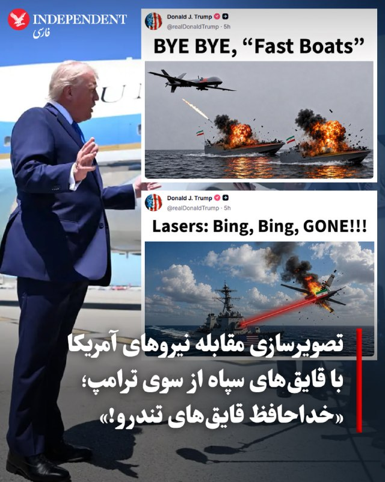
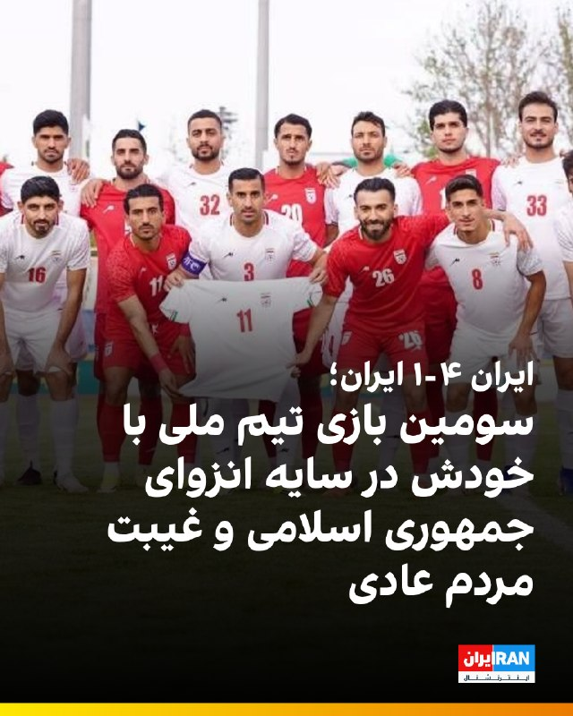
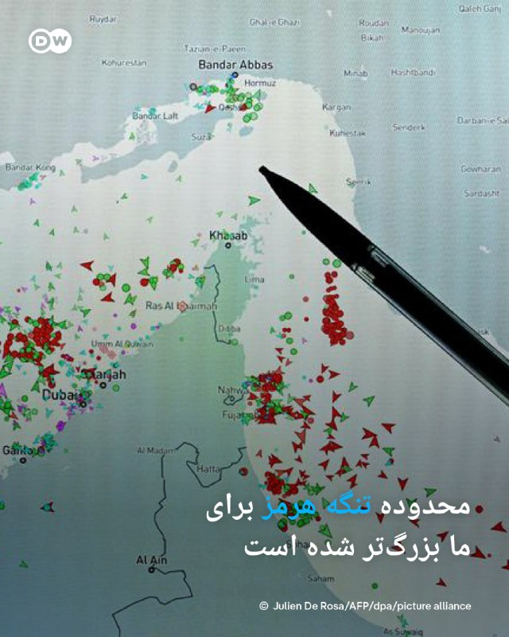
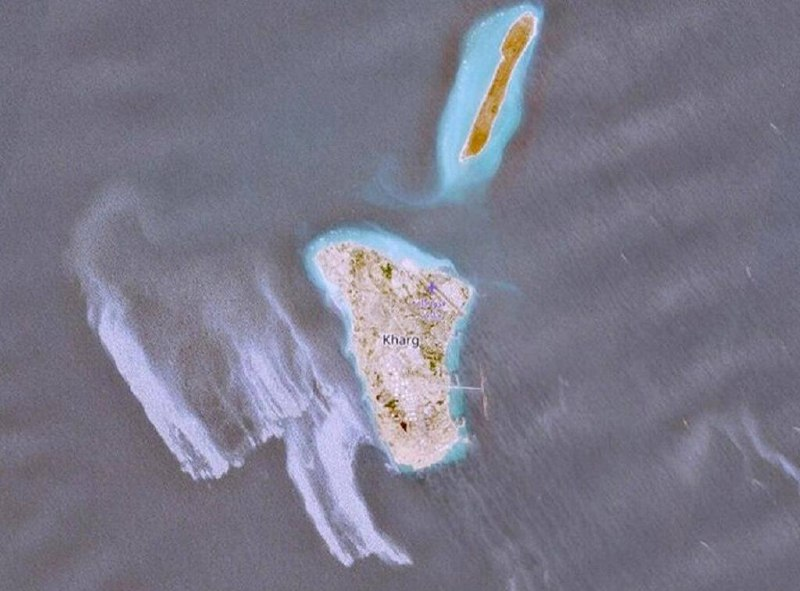
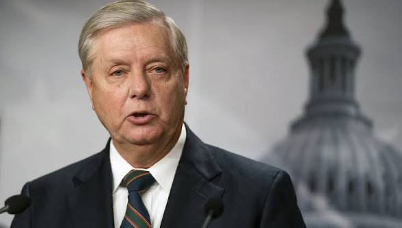
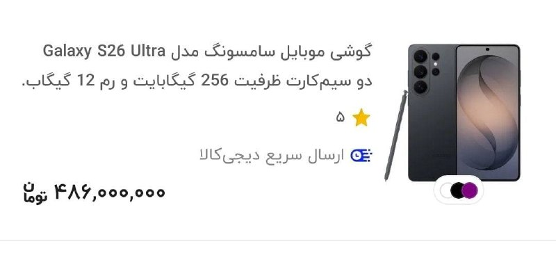

# خواننده تلگرام

<!-- TOP_NAV START -->

<a href="https://github.com/benyamin-najmi/aio-downloader/blob/main/telegram/content/archive_1.md" style="display:inline-block; padding:6px 12px; margin:0 4px; background-color:#2ea44f; color:white; text-decoration:none; border-radius:4px; font-weight:bold;">صفحه بعد</a>

<!-- TOP_NAV END -->

<!-- MSG START -->

---
📅 بروزرسانی: 1405/02/22 21:51
---

## VahidOOnLine — post 239760

  

بریتانیا سه‌شنبه اعلام کرد که تجهیزات خودکار مین‌روبی، جنگنده‌های تایفون و ناو جنگی اچ‌ام‌اس دراگون را به یک ماموریت دفاعی چندملیتی با هدف تامین امنیت کشتیرانی در تنگه هرمز اختصاص خواهد داد.

دولت بریتانیا با انتشار بیانیه‌ای نوشت که ماموریت دفاعی بریتانیا با ۱۱۵ میلیون پوند بودجه جدید برای پهپادهای مین‌روب و سامانه‌های مقابله با پهپاد پشتیبانی می‌شود.

جان هیلی، وزیر دفاع بریتانیا که ریاست اولین نشست وزیران دفاع ائتلافی متشکل از ۴۰ کشور را به‌طور مشترک با همتای فرانسوی خود برعهده داشت، گفت: «همراه با متحدان‌مان، این ماموریت چندملیتی، دفاعی، مستقل و معتبر خواهد بود.»
‌🏁 🇬🇧 IranintlTV

🤖 @VahidOOnLine

## VahidOOnLine — post 239759

  <a href="telegram/content/VahidOOnLine_239759_1778610064.mp4" target="_blank">🎬 Download video</a>

♦️ ۲۲ اردیبهشت، زادروز مریم میرزاخانی، به عنوان روز جهانی زنان در ریاضیات شناخته می‌شود؛ ریاضیدان ایرانی‌ای که نامش برای همیشه در تاریخ علم ماندگار شد.

میرزاخانی در سال ۱۳۷۳ مدال طلای المپیاد ریاضی ایران و در سال ۱۹۹۴ مدال طلای المپیاد جهانی ریاضی در هنگ‌کنگ را کسب کرد. یک سال بعد، در ۱۹۹۵، دوباره طلای جهانی گرفت و با کسب نمره کامل، نامش را در تاریخ المپیادها ثبت کرد.

او پس از تحصیل در دانشگاه صنعتی شریف، برای ادامه تحصیل به آمریکا رفت و دکترای خود را از دانشگاه هاروارد گرفت. مریم بعدها استاد دانشگاه استنفورد شد و در سال ۲۰۱۴ به عنوان نخستین زن تاریخ، مدال فیلدز، معتبرترین جایزه دنیای ریاضیات، را دریافت کرد.

داستان او فقط درباره ریاضی نیست؛ درباره کنجکاوی، پشتکار و شکستن مرزهایی‌ست که غیرممکن به نظر می‌رسیدند.
‌🇸🇦 Indypersian

🤖 @VahidOOnLine

## VahidOOnLine — post 239758

  <a href="telegram/content/VahidOOnLine_239758_1778610066.mp4" target="_blank">🎬 Download video</a>

ژنرال دن کین، رئیس ستاد مشترک ارتش آمریکا، اعلام کرد جمهوری‌اسلامی تحت فشار شدید ناشی از تحریم‌ها و محاصره قرار دارد و واشنگتن همچنان «طیفی از گزینه‌های نظامی» را در اختیار دارد.
در جلسه استماع سنای آمریکا، کریس مورفی، سناتور دموکرات، با اشاره به افزایش شدید قیمت سوخت پرسید آیا راهی جز دیپلماسی برای بازگشایی تنگه هرمز وجود دارد یا نه.
پیت هگست، وزیر دفاع آمریکا، در پاسخ گفت واشنگتن «قطعاً» ابزارهای نظامی لازم برای باز کردن تنگه هرمز را در اختیار دارد؛ از جمله حمله به اهداف زمینی و استفاده از توان دریایی و محاصره نظامی.
‌🏁 🇬🇧 ManotoTV

🤖 @VahidOOnLine

## VahidOOnLine — post 239757

  <a href="telegram/content/VahidOOnLine_239757_1778610068.mp4" target="_blank">🎬 Download video</a>

♦️دونالد ترامپ، رئیس‌جمهوری آمریکا، روز سه‌شنبه ۲۲ اردیبهشت‌ماه، در پاسخ به سوالی درباره زمان پایان مذاکرات با ایران گفت: «خواهیم دید چه اتفاقی می‌افتد. ما فقط یک توافق خوب انجام خواهیم داد.»

ترامپ همچنین گفت نیروی نظامی جمهوری اسلامی «از بین رفته» و «کاملا نابود شده است» و افزود: «خواهیم دید چه اتفاقی می‌افتد.»

رئیس‌جمهوری آمریکا تاکید کرد به هر شکلی که این روند پیش برود، نتیجه آن برای مردم آمریکا و همچنین مردم ایران «بسیار خوب» خواهد بود.
‌🇸🇦 Indypersian

🤖 @VahidOOnLine

## VahidOOnLine — post 239756

  

مجتبی یوسفی، نماینده اهواز در مجلس به سایت دیده‌بان ایران گفت: «ناوهای بریتانیا و فرانسه به تنگه هرمز نزدیک شوند، ببینند چه بلایی سرشان می آوریم. ما هم می‌گوییم بیایید نزدیک تنگه هرمز و آن را باز کنید.»

او ادامه داد: «اگر بناست اروپایی‌ها ما را امتحان کنند، بدانند که پایگاه‌های نظامی، کشورهای اروپایی و هر کشور متخاصم هدف مشروع ما است. ما بلوف نمی‌زنیم بلکه عمل می‌کنیم.»
‌🏁 🇬🇧 IranintlTV

🤖 @VahidOOnLine

## VahidOOnLine — post 239755

  

♦️ دونالد ترامپ، رئیس‌جمهوری ایالات متحده روز سه‌شنبه ۲۲ اردیبهشت، با انتشار تصویری ساخته هوش مصنوعی در شبکه اجتماعی تروث‌سوشال، تصویری از مقابله پهپادهای آمریکا با قایق‌های تندرو سپاه در تنگه هرمز را ارائه کرد. این تصویر که به شکلی اغراق‌شده و طنزآمیز ساخته شده، یک پهپاد را در حال منهدم کردن دو قایق با پرچم جمهوری اسلامی نشان می‌دهد.

ترامپ پیش از این با اشاره به سلاح لیزری نیروی دریایی آمریکا که در ناو جورج بوش نصب شده، تصویر ساخته شده با هوش مصنوعی از هدف قرار گرفتن پهپادهای جمهوری اسلامی را نیز منتشر کرده بود. در موردی دیگر نیز ناوگان نیروی دریایی ایران را در کف آب‌های عمیق خلیج فارس و دریای عمان نشان داده بود.

رئیس‌جمهوری آمریکا در موارد مختلف برای کنایه زدن به رقبا یا دشمنان از تصاویر ساخت هوش مصنوعی استفاده می‌کند.
‌🇸🇦 Indypersian

🤖 @VahidOOnLine

## VahidOOnLine — post 239754

  

بلومبرگ گزارش داد امارات متحده عربی از زمان آغاز کارزار آمریکا و اسرائیل علیه جمهوری اسلامی در اسفند ماه، بیش از یک‌بار ایران را هدف حمله قرار داده است.بلومبرگ به نقل از «افراد مطلع» نوشت این حملات هم پیش از برقراری آتش‌بس و هم پس از آن انجام شده است.

براساس این گزارش، در طول جنگ، همکاری میان امارات متحده عربی و اسرائیل شامل تبادل اطلاعات، شناسایی و رهگیری موشک‌ها و پهپادهای ایرانی و همچنین انتخاب اهداف در ایران بوده است.
‌🏁 🇬🇧 IranintlTV

🤖 @VahidOOnLine

## VahidOOnLine — post 239753

  <a href="telegram/content/VahidOOnLine_239753_1778610072.mp4" target="_blank">🎬 Download video</a>

جان هیلی، وزیر دفاع بریتانیا، اعلام کرد لندن جنگنده، پهپاد و یک ناو جنگی را به مأموریت چندملیتی حفاظت از تردد کشتی‌ها در تنگه هرمز اعزام خواهد کرد.

هیلی این خبر را پس از نشست مشترک با وزرای دفاع ۴۰ کشور اعلام کرد؛ نشستی که با هدف جلب حمایت برای مأموریت تحت رهبری بریتانیا جهت تأمین امنیت کشتیرانی در تنگه هرمز برگزار شد.

بریتانیا می‌گوید این مأموریت در واکنش به محاصره تنگه هرمز از سوی جمهوری اسلامی انجام می‌شود.
‌🏁 🇬🇧 ManotoTV

🤖 @VahidOOnLine

## VahidOOnLine — post 239752

  

هاکان فیدان، وزیر خارجه ترکیه، در گفت‌وگو با الجزیره گفت اولویت اصلی آنکارا حفظ آتش‌بس میان واشینگتن و تهران است و تاکید کرد فوری‌ترین نگرانی ترکیه تداوم این آتش‌بس است، زیرا در حال حاضر این موضوع بیشترین اهمیت را دارد.

وزیر خارجه ترکیه افزود هیچ‌کس خواهان بازگشت به جنگ نیست، چرا که اقتصاد جهانی و امنیت انرژی جهان همین حالا نیز به اندازه کافی آسیب دیده است.

هاکان فیدان همچنین گفت ترکیه و دیگر کشورهای منطقه از جمله قطر برای حمایت از پاکستان به‌عنوان میانجی اصلی همکاری می‌کنند و در روند میانجی‌گری، زمانی که کار به بن‌بست می‌رسد، دشوارترین بخش یافتن ایده‌های خلاقانه است؛ گاهی طرفین و حتی خود میانجی نیز قادر به ارائه چنین ایده‌هایی نیستند.
‌🏁 🇬🇧 IranintlTV

🤖 @VahidOOnLine

## VahidOOnLine — post 239751

♦️ژنرال دن کین، رئیس ستاد مشترک نیروهای مسلح آمریکا، روز سه‌شنبه ۲۲ اردیبهشت‌ماه در جلسه استماع بودجه در کنگره گفت ایران قطعا فشار ناشی از محاصره و تحریم‌ها را احساس می‌کند.

او افزود این فشار تنها به محاصره محدود نمی‌شود و ادامه تحریم‌هایی که وزارت خزانه‌داری و دیگر نهادهای آمریکایی اعمال کرده‌اند نیز بخشی از آن است. دن کین همچنین تاکید کرد آمریکا همچنان «مجموعه‌ای از گزینه‌های نظامی» را در اختیار دارد.
‌🇸🇦 Indypersian

🤖 @VahidOOnLine

## VahidOOnLine — post 239750

  

دادگاه کیفری عالی بحرین سه نفر از جمله یک زن را به اتهام «همکاری» با جمهوری اسلامی به حبس ابد محکوم کرد.
دادستان‌ها اعلام کردند این زن در «ارتباط» با سپاه پاسداران بوده و قصد داشته «اقدامات تروریستی خصمانه» در بحرین انجام دهد.
در پرونده‌های جداگانه، ۱۰ نفر دیگر به اتهام «حمایت و تایید حملات تروریستی جمهوری اسلامی علیه بحرین»، انتشار اطلاعات ممنوع و عکسبرداری از اماکن ممنوعه، به احکام حبس تا ۱۰ سال محکوم شدند.

پیش‌تر نیز وزارت کشور بحرین اعلام کرد دستگاه‌های امنیتی این کشور یک تشکیلات مرتبط با سپاه پاسداران و تفکر «ولایت فقیه» را شناسایی کرده‌اند و ۴۱ نفر از اعضای آن را بازداشت کرده‌اند.
‌🏁 🇬🇧 IranintlTV

🤖 @VahidOOnLine

## VahidOOnLine — post 239749

  

♦️ دیک دوربین، سناتور دموکرات ایالت ایلینوی، روز سه‌شنبه ۲۲ اردیبهشت، در جلسه کمیته تخصیص بودجه سنا از ژنرال دن کین، رئیس ستاد مشترک ارتش آمریکا، پرسید که ایران چگونه همچنان توانایی متوقف کردن تردد کشتی‌ها در تنگه هرمز را دارد؟

ژنرال کین در پاسخ به اعضای این کمیته گفت: «اوضاع در آنجا پیچیده است؛ قایق‌های کوچک متعدد و توانمندی‌های دیگری در منطقه حضور دارند. بخشی از این مشکل به ترددکنندگان تجاری برمی‌گردد، اما ریشه اصلی مسئله به همان مشکل همیشگی، یعنی گروگان گرفته شدن اقتصاد جهانی توسط ایران از طریق این تنگه مربوط می‌شود.»

او در ادامه افزود: «من آن‌ها را تشویق می‌کنم که درباره اقدامات بعدی خود خردمندانه فکر کنند و از این فرصت برای بازگشایی تنگه استفاده نمایند؛ این انتخابی است که آن‌ها باید انجام دهند.»
‌🇸🇦 Indypersian

🤖 @VahidOOnLine

## VahidOOnLine — post 239748

  <a href="telegram/content/VahidOOnLine_239748_1778610075.mp4" target="_blank">🎬 Download video</a>

سازمان جهانی بهداشت هشدار داد شمار موارد ابتلا به هانتاویروس، پس از شیوع این ویروس در یک کشتی گردشگری در اقیانوس اطلس، احتمالاً افزایش پیدا خواهد کرد.
تدروس آدهانوم، مدیرکل سازمان جهانی بهداشت، اعلام کرد تاکنون ۹ مورد ابتلای قطعی و دو مورد مشکوک ثبت شده و انتظار می‌رود افراد بیشتری نیز به ویروس مبتلا شده باشند. با این حال او تأکید کرد خطر شیوع گسترده جهانی همچنان «پایین» ارزیابی می‌شود.
شیوع بیماری در کشتی «ام‌وی هوندیوس» آغاز شد؛ جایی که سه مسافر، شامل یک زوج هلندی و یک زن آلمانی، جان خود را از دست دادند. این کشتی در حال سفر ۳۵ روزه در اقیانوس اطلس بود.
هانتاویروس معمولاً از طریق ادرار، بزاق یا فضولات جوندگان منتقل می‌شود. گونه «آندِس» تنها نوع شناخته‌شده‌ای است که می‌تواند از انسان به انسان منتقل شود.
در پی این بحران، صدها مسافر و خدمه در کشورهای مختلف تحت قرنطینه یا مراقبت پزشکی قرار گرفته‌اند. مقام‌های بهداشتی در اروپا و آمریکا نیز در حال ردیابی تماس‌های مرتبط با مبتلایان هستند.
‌🏁 🇬🇧 ManotoTV

🤖 @VahidOOnLine

## VahidOOnLine — post 239747

  

♦️ پیت هگست، وزیر دفاع ایالات متحده، روز سه‌شنبه ۲۲ اردیبهشت، به قانون‌گذاران اعلام کرد که در سفر قریب‌الوقوع دونالد ترامپ به چین، او را همراهی خواهد کرد؛ سفری که در میانه ابهامات شدید پیرامون پایداری آتش‌بس با ایران صورت می‌گیرد.

هگست در پاسخ به پرسشی درباره وضعیت فروش تسلیحات به تایوان گفت: «رئیس‌جمهور در آستانه سفر است و من همراه ایشان خواهم بود؛ تمامی تصمیمات مربوط به این موضوع توسط خود ایشان اتخاذ خواهد شد.» انتظار می‌رود ترامپ بعدازظهر امروز واشنگتن را به مقصد پکن ترک کند.

سفیر ایران در چین روز سه‌شنبه اظهار داشت که پکن می‌تواند «نیروی مهمی برای کاهش تنش‌ها» میان واشنگتن و تهران باشد. با این حال، دونالد ترامپ روز دوشنبه با انتقاد شدید از وضعیت فعلی، آتش‌بس با ایران را «بسیار ضعیف» توصیف کرد و گفت که این توافق «تنها با کمک دستگاه زنده است». هگست نیز تاکید کرد که ارتش آمریکا آماده است تا در صورت صدور فرمان، عملیات نظامی علیه جمهوری اسلامی را بلافاصله از سر بگیرد.
‌🇸🇦 Indypersian

🤖 @VahidOOnLine

## VahidOOnLine — post 239746

  

شاهزاده رضا پهلوی در نشست امنیتی سالانه پولیتیکو گفت: «ما فقط زمانی می‌توانیم مردم را به بازگشت به خیابان‌ها فرا بخوانیم که آن‌ها از سطحی از برابری در توان مقابله برخوردار باشند؛ نه زمانی که رژیم بتواند اوباش و نیروهای سرکوبگرش را برای کشتن مردم در خیابان‌ها اعزام کند.»

او ادامه داد: «اما برای رسیدن به آن نقطه، باید پیام روشنی وجود داشته باشد. باید راهبردی شفاف برای پایان دادن به این رژیم وجود داشته باشد؛ فراخوانی روشن برای قیام مردم، و همچنین پیامی برای نیروهای نظامی و امنیتی از حکومت جدا شوند و به مردم بپیوندند. همه این‌ها باید در قالب یک راهبرد منسجم هماهنگ شود.»
‌🏁 🇬🇧 IranintlTV

🤖 @VahidOOnLine

## VahidOOnLine — post 239745

  <a href="telegram/content/VahidOOnLine_239745_1778610078.mp4" target="_blank">🎬 Download video</a>

♦️پیت هگست، وزیر جنگ آمریکا، روز سه‌شنبه ۲۲ اردیبهشت‌ماه در جلسه استماع کنگره آمریکا گفت ایالات متحده در هر شرایطی برای پیروزی می‌جنگد؛ از جمله برای اطمینان از اینکه ایران هرگز به سلاح هسته‌ای دست پیدا نکند.

او این اظهارات را در ادامه مواضع دولت دونالد ترامپ درباره برنامه هسته‌ای جمهوری اسلامی مطرح کرد.
‌🇸🇦 Indypersian

🤖 @VahidOOnLine

## VahidOOnLine — post 239744

  

♦️ لیندزی گراهام، سناتور جمهوری‌خواه و از حامیان سرسخت سیاست‌های جنگی دولت ترامپ، روز سه‌شنبه ۲۲ اردیبهشت، از رئیس‌جمهوری آمریکا خواست تا در سفر به چین، موضعی قاطع در برابر پکن اتخاذ کند. گراهام طی یک جلسه استماع در سنا تاکید کرد که شی جین‌پینگ در حال حمایت هم‌زمان از روسیه و جمهوری اسلامی است.

این سناتور کارولینای جنوبی با انتقاد از نقش چین در خرید مقادیر کلان نفت از ایران و روسیه، نسبت به عملکرد پاکستان نیز ابراز نارضایتی کرد. او با استناد به گزارش «سی‌بی‌اس نیوز» یادآوری کرد که اسلام‌آباد به هواپیماهای نظامی ایران اجازه داده است در فرودگاه‌های این کشور مستقر شوند.

وزارت امور خارجه پاکستان با رد قاطعانه این ادعا، اعلام کرد که حضور هواپیماهای ایرانی و آمریکایی در خاک این کشور صرفا جهت تسهیل تردد تیم‌های دیپلماتیک و اداری مربوط به «مذاکرات اسلام‌آباد» پس از برقراری آتش‌بس بوده است. مقامات پاکستانی تاکید کردند که این پروازها هیچ ارتباطی با ترتیبات نظامی یا پشتیبانی جنگی ندارند. با این حال، گراهام هشدار داد که واشنگتن باید فشار بر متحدان و شرکای تجاری جمهوری اسلامی را به شدت افزایش دهد.
‌🇸🇦 Indypersian

🤖 @VahidOOnLine

## VahidOOnLine — post 239743

  <a href="telegram/content/VahidOOnLine_239743_1778610080.mp4" target="_blank">🎬 Download video</a>

مقام‌های آمریکایی اعلام کردند نیروهای این کشور مانع عبور یک نفتکش با پرچم جمهوری مالت از تنگه هرمز شده‌اند.
سخنگوی ستاد فرماندهی مرکزی آمریکا سنتکام؛ به الجزیره گفت نفتکش «آگیوس فانوریوس» به‌دلیل نقض محاصره دریایی، اجازه عبور پیدا نکرده است. به گفته او، این کشتی حامل نفت ایران نبوده است.
مقام‌های آمریکایی همچنین اعلام کردند چند نفتکش دیگر نیز به‌دلیل نقض تحریم‌ها و محاصره اعمال‌شده علیه بنادر ایران، متوقف شده‌اند.
‌🏁 🇬🇧 ManotoTV

🤖 @VahidOOnLine

## VahidOOnLine — post 239742

  <a href="telegram/content/VahidOOnLine_239742_1778610080.mp4" target="_blank">🎬 Download video</a>

«اینترنت را قطع کردند تا صدای مردم خاموش شود.»
‌🏁 🇬🇧 ManotoTV

🤖 @VahidOOnLine

## VahidOOnLine — post 239741

  

شاهزاده رضا پهلوی در نشست امنیتی سالانه پولیتیکو گفت سیاست مماشات با رژیم جمهوری اسلامی که راهبرد بسیاری از دولت‌ها بود، شکست خورده است.
او افزود اکنون که با یک «جانور زخمی» روبه‌رو هستیم، این فرصتی است که نباید از دست برود، بلکه باید کار را یک‌بار برای همیشه تمام کرد؛ موضوعی که نه‌تنها میلیون‌ها ایرانی، بلکه بسیاری از کشورهای منطقه نیز انتظار آن را دارند.

شاهزاده رضا پهلوی درباره جنگ علیه جمهوری اسلامی نیز گفت مردم به‌اندازه کافی هوشمند هستند که تفاوت میان حمله به یک ملت و حمله به یک رژیم را تشخیص دهند و آن کارزار، حمله‌ای علیه ملت ایران نبود، بلکه علیه رژیم بود.
‌🏁 🇬🇧 IranintlTV

🤖 @VahidOOnLine

## mwarmonitor — post 8990

🔴«گزارش فوری: عربستان سعودی در جریان جنگ، در پاسخ به حملات ایران، علیه ایران حملات هوایی انجام داده است - رویترز» @mwarmonitor

## mwarmonitor — post 8989

🔴«گزارش فوری: عربستان سعودی در جریان جنگ، در پاسخ به حملات ایران، علیه ایران حملات هوایی انجام داده است - رویترز»

@mwarmonitor

## mwarmonitor — post 8988

  

✈️🇺🇸«نیروی هوایی ایالات متحده آمریکا (USAF) ✈️۱ فروند هواپیمای بمب‌افکن استراتژیک Rockwell B-1B Lancer AE6C05 86-0134 - ZENER 01 🔹 بعدازظهر امروز بر فراز جنوب غرب انگلستان از پایگاه RAF Fairford در حال عملیات بوده است. دو هواپیمای سوخت‌رسان KC-135 با شناسه‌های…

## mwarmonitor — post 8987

🇮🇱مقام‌های امنیتی اسرائیل به همتایان آمریکایی خود گفته‌اند که «در آستانه ازسرگیری درگیری‌ها در غزه هستند»، در حالی که تنش‌ها بر سر امتناع حماس از خلع سلاح یا واگذاری کنترل افزایش یافته است — به گزارش کان نیوز.

این گزارش می‌گوید گروه حماس با تهدید مسلحانه پیمانکاران محلی در غزه، آن‌ها را از مشارکت در کارهای ساختمانی یک شهر فلسطینی برنامه‌ریزی‌شده در رفح که با تأمین مالی امارات متحده عربی انجام می‌شود، منع کرده است. این پروژه با هماهنگی اسرائیل و یک ساختار فرماندهی تحت رهبری آمریکا در حال پیگیری بوده است.

@mwarmonitor

## mwarmonitor — post 8986

🇬🇧بریتانیا روز سه‌شنبه متعهد شد در صورت برقراری یک آتش‌بس پایدار در خاورمیانه، برای حفاظت از تنگه هرمز شناورهای خودران در اختیار قرار دهد.

🇬🇧بریتانیا پیشنهاد داده است شناورهای سطحی بدون سرنشین (USV) را به یک مأموریت چندملیتی به رهبری بریتانیا و فرانسه ارائه کند تا در صورت برقراری آتش‌بس پایدار، امنیت کشتیرانی بین‌المللی را تضمین کند.

🇬🇧این پیشنهاد علاوه بر سامانه‌های خودکار مین‌روبی نیروی دریایی سلطنتی بریتانیا و همچنین استقرار پیش‌دستانه ناوشکن پدافند هوایی کلاس Daring یعنی HMS Dragon است.

🇬🇧این مأموریت‌ها با هدف افزایش اطمینان برای کشتیرانی بین‌المللی در منطقه و به‌ویژه در Strait of Hormuz انجام می‌شود.

@mwarmonitor

## mwarmonitor — post 8985

🇮🇷ایران اعلام کرد تا زمانی که این شروط برآورده نشود، با ایالات متحده درباره مسئله هسته‌ای گفت‌وگو نخواهد کرد — الجزیره 📌پایان جنگ در «همه جبهه‌ها» 📌لغو کامل تمامی تحریم‌ها 📌آزادسازی دارایی‌های مسدودشده ایران 📌پرداخت غرامت‌های جنگی 📌به‌رسمیت شناختن حق…

## mwarmonitor — post 8983

🇮🇷ایران اعلام کرد تا زمانی که این شروط برآورده نشود، با ایالات متحده درباره مسئله هسته‌ای گفت‌وگو نخواهد کرد — الجزیره

📌پایان جنگ در «همه جبهه‌ها»

📌لغو کامل تمامی تحریم‌ها

📌آزادسازی دارایی‌های مسدودشده ایران

📌پرداخت غرامت‌های جنگی

📌به‌رسمیت شناختن حق حاکمیت ایران بر تنگه هرمز

@mwarmonitor

## mwarmonitor — post 8982

🇦🇹اتریش امروز دو فروند جنگنده Eurofighter Typhoon را برای شناسایی و رهگیری دو فروند هواپیمای PC-12 نیروی هوایی ایالات متحده که بدون مجوز وارد حریم هوایی این کشور شده بودند، به پرواز درآورد.
✈️گزارش‌ها حاکی است که هواپیماهای United States Air Force پس از رهگیری، تغییر مسیر داده و در مونیخ فرود آمدند.

@mwarmonitor

## mwarmonitor — post 8981

🔴«گروهی از مردان که به اتهام تلاش برای ورود به کشور از طریق دریا بازداشت شده بودند، در جریان بازجویی اعتراف کردند که عضو سپاه پاسداران انقلاب اسلامی ایران هستند، به گفته وزارت کشور کویت.» @mwarmonitor

## mwarmonitor — post 8979

  <a href="telegram/content/mwarmonitor_8979_1778610084.mp4" target="_blank">🎬 Download video</a>

✈️۱۵ فروند هواپیمای کوچک آمریکایی 🇺🇸 (احتمالاً F-16) که دیروز وارد شده‌اند در عربستان سعودی 🇸🇦، در اپرون (محوطه پارکینگ) آمریکایی پایگاه Prince Sultan Air Base (PSAB) در مختصات زیر مشاهده شدند:
24.0637, 47.5684

📌این موضوع تأیید می‌کند که محدودیت‌های عملیاتی عربستان علیه پروژه آمریکایی Project Freedom برداشته شده است.

✈️گفته می‌شود ۵۳ فروند جنگنده F-16 در پایگاه PSAB مستقر هستند.

@mwarmonitor

## mwarmonitor — post 8978

🔸سناتور گراهام: ژنرال کِین، آیا شما از گزارش‌هایی مبنی بر اینکه پاکستان اجازه می‌دهد از پایگاه‌هایش برای استقرار هواپیماهای ایرانی استفاده شود، اطلاعی دارید؟
🔹ژنرال کِین: قربان، من یک گزارش در این باره دیده‌ام.
🔸سناتور گراهام: خب، آیا این گزارش دقیق است؟
🔹ژنرال کِین: قربان، فکر می‌کنم با توجه به مسائل طبقه‌بندی شده مختلفی که دیده‌ام...
🔸سناتور گراهام (میان کلام او): اجازه دهید فقط این را بگویم؛ اگر این گزارش دقیق باشد، با نقش پاکستان به عنوان یک میانجی صلح در تضاد است، قبول دارید؟
🔹ژنرال کِین: قربان، من تمایلی ندارم بر اساس مذاکرات جاری و نقش پاکستان در این زمینه اظهار نظر کنم.
🔸سناتور گراهام: ممنون. آقای وزیر هِگسِت، اگر یک میانجی اجازه دهد هواپیماهای شناسایی ایران در پایگاه‌های هوایی پاکستان مستقر شوند، به نظر شما این با میانجی‌گری منصفانه همخوانی دارد؟
🔹وزیر هِگسِت: مجدداً عرض می‌کنم، من نمی‌خواهم در میانه این مذاکرات وارد شوم. من خواهان حداکثر اثربخشی برای...
🔸سناتور گراهام (با تندی): اما من می‌خواهم! من می‌خواهم وسط این مذاکرات باشم. من به اندازه یک پرتاب دست هم به پاکستان اعتماد ندارم. اگر آن‌ها واقعاً هواپیماهای ایرانی را برای محافظت از دارایی‌های نظامی ایران در پایگاه‌های خود مستقر کرده‌اند، به من می‌گوید که شاید باید به دنبال شخص دیگری برای میانجی‌گری باشیم. تعجبی ندارد که این مذاکرات لعنتی به هیچ‌جا نمی‌رسد.

@mwarmonitor

## pm_afshaa — post 90641

🔴ترامپ:ما ایران را کاملا تحت کنترل داریم خلاصه یا یک توافق می‌کنیم، یا هم نابودشون میکنیم

💧 Rainbet.com the #1 Non-KYC Crypto Casino & Sportsbook @rainbetcom

😁 @Pm_Afshaa

## pm_afshaa — post 90640

🎙️خبرنگار: در چه مرحله‌ای مذاکره با ایران رو کنار میذارید؟

ترامپ: خواهیم دید چه می‌شود.

💧 Rainbet.com the #1 Non-KYC Crypto Casino & Sportsbook @rainbetcom

😁 @Pm_Afshaa

## pm_afshaa — post 90639

  <a href="telegram/content/pm_afshaa_90639_1778610085.webm" target="_blank">🎬 Download video</a>

🔴ترامپ: ایران نمیتونه سلاح هسته‌ای داشته باشه؛ آنها با این موضوع موافق بودن، اما چیزی که برای من فرستادن، آن نبود. ما بازی نمی‌کنیم.

💧 Rainbet.com the #1 Non-KYC Crypto Casino & Sportsbook @rainbetcom

😁 @Pm_Afshaa

## pm_afshaa — post 90638

🔴سناتور لیندسی گراهام: من به هیچ وجه به پاکستان اعتماد ندارم؛ اونا هیچ صلاحیتی برای میانجیگری ندارن. اونا اصلاً منصف نیستن

💧 Rainbet.com the #1 Non-KYC Crypto Casino & Sportsbook @rainbetcom

😁 @Pm_Afshaa

## pm_afshaa — post 90637

  <a href="telegram/content/pm_afshaa_90637_1778610086.webm" target="_blank">🎬 Download video</a>

🔴کانال 12 اسرائیل:
انتظار میره که ترامپ بعد از بازگشتش از چین در پایان هفته، تصمیمات نهایی و جدیش رو درباره ایران بگیره.

💧 Rainbet.com the #1 Non-KYC Crypto Casino & Sportsbook @rainbetcom

😁 @Pm_Afshaa

## pm_afshaa — post 90636

  <a href="telegram/content/pm_afshaa_90636_1778610087.webm" target="_blank">🎬 Download video</a>

🔴لیست کامل مدیران شرکت‌های بزرگ آمریکایی که ترامپ رو در سفر به چین همراهی خواهند کرد :

💧 Rainbet.com the #1 Non-KYC Crypto Casino & Sportsbook @rainbetcom

😁 @Pm_Afshaa

## iaghapour — post 2603

✍ آدم راننده شوتی باشه به مراتب اضطرابش كمتر از کسیه كه شغلش تو ايران به اينترنت وابسته هستش...

🆔 @iaghapour

## DEJradio — post 4594

  <a href="telegram/content/DEJradio_4594_1778610087.webm" target="_blank">🎬 Download video</a>

🔺📷 بررسی‌ها نشان می‌دهد نرگس افشردی شاغل در دانشگاه هاروارد، برادرزاده محمد باقری (محمدحسین افشردی)، رئیس پیشین ستاد کل نیروهای مسلح جمهوری اسلامی، است که در خرداد ۱۴۰۴ در پی حمله هوایی اسرائیل کشته شد.

کاربران در شبکه‌های اجتماعی که سوابق نرگس افشردی را بررسی کرده‌اند می‌گویند او در حالی خارج از ایران در رفاه زندگی می‌کند که اگر یکی از بستگان دور یک گروهبان در خارج از کشور مقیم باشد هیچگونه انتصابی به او نمی‌دهند اما بسیاری از اقوام و خویشاوندان درجه یک فرماندهان ارشد نظام و مقامات سیاسی و امنیتی خارج از ایران سکونت دارند.

نرگس افشردی فرزند حسن باقری (غلامحسین افشردی)، از فرماندهان سپاه پاسداران در دوران جنگ ایران و عراق، می‌باشد.
همسر او، محسن گودرزی استاد مطالعات اسلامی در دانشگاه «هاروارد» است و خود نرگس نیز به‌عنوان پژوهشگر حوزه روان‌شناسی در همین دانشگاه فعالیت می‌کند.

این موضوع بار دیگر بحث قدیمی درباره تفاوت سبک زندگی و محل اقامت فرزندان و نزدیکان برخی مسئولان جمهوری اسلامی با شرایط عمومی مردم ایران را در فضای مجازی پررنگ کرده است.

#IRGCterrorists #جمهوری_اسلامی
@DEJradio

## mamlekate — post 103516

📝 پرزیدنت ترامپ: رژیم ایران بسیار ضعیف شده و «محاصره» دریایی منابع مالی آنها را محدود کرده است

پرریدنت ترامپ با اشاره به موثر بودن محاصره دریایی بر محدود کردن دسترسی رژیم ایران به منابع مالی، بار دیگر تاکید کرد که آمریکا اجازه نخواهد داد رژیم ایران به سلاح هسته‌ای دست یابد.

📝 دونالد ترامپ: مطمئنم تهران غنی‌سازی اورانیوم را به‌طور کامل متوقف خواهد کرد

📝 وزیر جنگ: ما در حال پیروزی در جنگ با رژیم ایران هستیم؛ آنها در استفاده از استراتژی کره‌شمالی شکست خوردند

پیت هگست، وزیر جنگ آمریکا، و ژنرال دن کین، رئیس ستاد مشترک نیروهای مسلح ایالات متحده، روز سه‌شنبه ۲۲ اردیبهشت با حضور در جلسه کمیته فرعی تخصیص بودجه مجلس نمایندگان آمریکا از عملکرد دولت ترامپ در عملیات نظامی علیه رژیم ایران دفاع کردند.

یک عضو پنتاگون نیز در پاسخ به پرسشی درباره هزینه جنگ اخیر آمریکا با جمهوری اسلامی گفت که این جنگ از ابتدا تا کنون حدود ۲۹ میلیارد دلار برای ایالات متحده هزینه داشته است.

📝 هگست اعلام کرد برای تشدید یا عقب‌نشینی در خاورمیانه برنامه دارد اما قدم بعدی را فاش نکرد

@mamlekate

## mamlekate — post 103515

  

💥 دعوت به همکاری با خبرگزاری هرانا

خبرگزاری هرانا، با بیش از دو دهه سابقه در حوزه گزارشگری و مستندسازی حقوق بشر، در راستای توسعه فعالیت‌های خود از علاقه‌مندان واجد شرایط برای همکاری دعوت می‌کند.

هرانا در این مرحله بیش از آن‌که به دنبال افراد با سابقه حرفه‌ای باشد، به دنبال افرادی متعهد، دقیق و آموزش‌پذیر است؛ کسانی که دغدغه واقعی حقوق بشر دارند و مایل‌اند در یک چارچوب حرفه‌ای، مهارت‌های خود را توسعه دهند.

زمینه‌های همکاری شامل:
گزارشگری، ویراستاری، ترجمه، مدیریت شبکه‌های اجتماعی و سایر حوزه‌های مرتبط

ویژگی‌های مورد انتظار:

* تسلط کافی به زبان فارسی (خواندن و نوشتن)
* دقت، مسئولیت‌پذیری و توانایی یادگیری مستمر
* علاقه و حساسیت نسبت به موضوعات حقوق بشر
* آمادگی برای فعالیت در چارچوب‌های سازمان‌یافته و حرفه‌ای

❗️ توجه: این فرصت همکاری فقط شامل کسانی است که به زبان فارسی مسلط و ساکن یکی از کشورهای "ترکیه، قبرس شمالی، هندوستان، مصر، قرقیزستان، ازبکستان، کلمبیا، پاراگوئه، قزاقستان، سریلانکا، بلغارستان و رومانی" هستند.

همکاری با هرانا فرصتی است برای کسب تجربه عملی در حوزه مستندسازی و فعالیت‌های حقوق بشری در یک نهاد با سابقه و ساختار حرفه‌ای.

📎 برای ثبت درخواست همکاری، لطفا فرم زیر را تکمیل کنید:
https://hra.news/4cBjHqs

📩 در صورت بروز مشکل در تکمیل فرم، می‌توانید رزومه و اطلاعات تماس خود را به آدرس زیر ارسال نمایید:
info@hra-news.org

↘️
@hranews_bot تماس ✉️ -  @Hranews  کانال هرانا 🆑

## kianmeli1 — post 87370

‏🔴یک مقام ارشد پنتاگون سه‌شنبه اعلام کرد که جنگ آمریکا در ایران تاکنون ۲۹ میلیارد دلار هزینه داشته است؛ رقمی که نسبت به برآورد ارائه‌شده در اواخر ماه گذشته، چهار میلیارد دلار افزایش یافته است
https://t.me/kianmeli1

## kianmeli1 — post 87369

‏🔴وزارت دفاع بریتانیا با انتشار بیانیه‌ای اعلام کرد این کشور تجهیزات خودکار مین‌یابی و سامانه‌های پیشرفته مقابله با پهپادها را به همراه جنگنده‌های تایفون و ناو «اچ‌ام‌اس دراگون» در قالب یک ماموریت دفاعی آینده برای تامین آزادی کشتیرانی در تنگه هرمز مستقر خواهد کرد
https://t.me/kianmeli1

## kianmeli1 — post 87368

‏🔴بلومبرگ گزارش داد امارات متحده عربی از زمان آغاز کارزار آمریکا و اسرائیل علیه تهران در ماه فوریه، بیش از یک‌بار به ایران حمله کرده است. به گفته این رسانه آمریکایی و به نقل از «افراد مطلع»، امارات متحده عربی این حملات را هم پیش از آتش‌بس و هم پس از آن انجام داده است
https://t.me/kianmeli1

## kianmeli1 — post 87367

  <a href="telegram/content/kianmeli1_87367_1778610088.mp4" target="_blank">🎬 Download video</a>

🔴زلنسکی: به تأسیسات گازی روسیه در فاصله ۱۵۰۰ کیلومتری حمله کردیم

ولودیمیر زلنسکی، رئیس‌جمهور اوکراین، حمله به یک تأسیسات صنعت گاز در منطقه اورنبورگ روسیه را تأیید کرد.

این هدف در فاصله بیش از ۱۵۰۰ کیلومتری مرز اوکراین قرار دارد.

به گفته زلنسکی، این عملیات پاسخی به حملات اخیر روسیه با پهپادهای شاهد و بمب‌های سرشی بوده است.

او تأکید کرد که کی‌اف به فشار بر روسیه ادامه می‌دهد تا آن را «به سمت دیپلماسی و صلح» سوق دهد. برخی رسانه‌ها از این اقدام با عنوان «تحریم‌های دوربرد» یاد کرده‌اند.
https://t.me/kianmeli1

## kianmeli1 — post 87366

  <a href="telegram/content/kianmeli1_87366_1778610090.mp4" target="_blank">🎬 Download video</a>

🔴سربازان روسی در حال استفاده از پهپاد رهگیر «یولکا» (Yolka) علیه پهپادهای اوکراینی هستند که براحتی با لانچر بسیار کوچک دستی به سرعت پرتاب میشود
https://t.me/kianmeli1

## kianmeli1 — post 87365

  

🔴ایران قبل از برآورده شدن این شرایط، در مورد مسئله هسته‌ای با آمریکا مذاکره نخواهد کرد.

• پایان جنگ در همه جبهه‌ها
• لغو همه تحریم‌ها
• آزادسازی دارایی‌های مسدود شده ایران
• پرداخت غرامت جنگ
• به رسمیت شناختن حق حاکمیت ایران بر تنگه هرمز
https://t.me/kianmeli1

## kianmeli1 — post 87364

  <a href="telegram/content/kianmeli1_87364_1778610093.mp4" target="_blank">🎬 Download video</a>

‏🔴سپاه پاسداران رزمایشی برای ورود قریب‌الوقوع به جنگ زمینی برگزار کرد
https://t.me/kianmeli1

## kianmeli1 — post 87363

  <a href="telegram/content/kianmeli1_87363_1778610095.mp4" target="_blank">🎬 Download video</a>

🔴تصاویر ماهواره‌ای جدید منتشر شده از پایگاه هوایی پرنس سلطان در عربستان سعودی نشان می‌دهد که تعداد زیادی هواپیما (به احتمال زیاد از نوع F-16) در این پایگاه مستقر شده‌اند. به نظر می‌رسد عربستان سعودی محدودیت‌های خود را علیه «پروژه آزادی» مرتبط با دونالد ترامپ برداشته است و حداقل ۵۳ فروند جنگنده F-16 در این پایگاه حضور دارند.
https://t.me/kianmeli1

## IranIntlTV — post 336861

  

بریتانیا سه‌شنبه اعلام کرد که تجهیزات خودکار مین‌روبی، جنگنده‌های تایفون و ناو جنگی اچ‌ام‌اس دراگون را به یک ماموریت دفاعی چندملیتی با هدف تامین امنیت کشتیرانی در تنگه هرمز اختصاص خواهد داد.

دولت بریتانیا با انتشار بیانیه‌ای نوشت که ماموریت دفاعی بریتانیا با ۱۱۵ میلیون پوند بودجه جدید برای پهپادهای مین‌روب و سامانه‌های مقابله با پهپاد پشتیبانی می‌شود.

جان هیلی، وزیر دفاع بریتانیا که ریاست اولین نشست وزیران دفاع ائتلافی متشکل از ۴۰ کشور را به‌طور مشترک با همتای فرانسوی خود برعهده داشت، گفت: «همراه با متحدان‌مان، این ماموریت چندملیتی، دفاعی، مستقل و معتبر خواهد بود.»
https://iranintl.com/202605128230

## IranIntlTV — post 336860

  

مجتبی یوسفی، نماینده اهواز در مجلس به سایت دیده‌بان ایران گفت: «ناوهای بریتانیا و فرانسه به تنگه هرمز نزدیک شوند، ببینند چه بلایی سرشان می آوریم. ما هم می‌گوییم بیایید نزدیک تنگه هرمز و آن را باز کنید.»

او ادامه داد: «اگر بناست اروپایی‌ها ما را امتحان کنند، بدانند که پایگاه‌های نظامی، کشورهای اروپایی و هر کشور متخاصم هدف مشروع ما است. ما بلوف نمی‌زنیم بلکه عمل می‌کنیم.»
https://iranintl.com/202605125053

## IranIntlTV — post 336859

  <a href="https://t.me/IranintlTV/336859" target="_blank">📎 Download file</a>

🎧نسخه صوتی چرتکه: سناریوهای قدرت خرید تا پایان ۱۴۰۵
@iranintlTV

## IranIntlTV — post 336858

  

🔻تیم ملی فوتبال در پی انزوای جمهوری اسلامی و انصراف همه حریفان تدارکاتی، برای سومین بار با خودش بازی کرد؛ دیداری که به طور مستقیم از صدا و سیمای جمهوری اسلامی پخش شد، وی‌ای‌آر داشت و البته بدون حضور تماشاگران عادی در ورزشگاه پاس قوامین، وابسته به نیروی انتظامی، برگزار شد.

🔹این بازی که در جریان اردوی بازیکنان شاغل در لیگ برتر برگزار شد، با حضور دو تیم قرمز و سفید انجام گرفت و تیم سفید با نتیجه ۴ بر یک تیم قرمز را شکست داد.

علی علیپور، دانیال ایری (دو بار) و آریا یوسفی برای تیم سفید و امیرحسین حسین‌زاده برای تیم قرمز گل زدند.

🔹تیم ملی قرار بود پیش از جام جهانی با تیم‌های ملی پرتغال،‌ اسپانیا،‌ مقدونیه و آنگولا بازی‌های تدارکاتی داشته باشد که همگی از دیدار با ایران منصرف شدند.

🔹امیر قلعه‌نویی، سرمربی تیم ملی، پیش‌تردرباره لغو بازی‌های تدارکاتی گفت: «بازی‌های تدارکاتی هماهنگ شده بود و قرارداد بستند؛ ولی در دقیقه ۹۰ کنسل شد.»

🔹تیم ملی قرار است به زودی در ترکیه اردوی آماده‌سازی خود را برپا کند. فدراسیون فوتبال گفته در جریان این اردو با تیم ملی گامبیا بازی خواهد کرد.

@iranintltvsport

## IranIntlTV — post 336857

  

بلومبرگ گزارش داد امارات متحده عربی از زمان آغاز کارزار آمریکا و اسرائیل علیه جمهوری اسلامی در اسفند ماه، بیش از یک‌بار ایران را هدف حمله قرار داده است.
بلومبرگ به نقل از «افراد مطلع» نوشت این حملات هم پیش از برقراری آتش‌بس و هم پس از آن انجام شده است.

براساس این گزارش، در طول جنگ، همکاری میان امارات متحده عربی و اسرائیل شامل تبادل اطلاعات، شناسایی و رهگیری موشک‌ها و پهپادهای ایرانی و همچنین انتخاب اهداف در ایران بوده است.

طبق گزارش بلومبرگ، یکی از این حملات در پاسخ به حمله جمهوری اسلامی به تاسیسات پتروشیمی بوروج در امارات و در «هماهنگی» با اسرائیل بوده است.

به گفته یکی از منابع، دو طرف در حمله اسرائیل به مجتمع پتروشیمی پارس جنوبی ایران نیز همکاری کرده‌اند.
وال‌استریت ژورنال پیش‌تر گزارش داد که امارات حمله‌ای به جزیره لاوان ایران انجام داده است.
https://iranintl.com/202605123603

## IranIntlTV — post 336856

  <a href="telegram/content/IranIntlTV_336856_1778610100.mp4" target="_blank">🎬 Download video</a>

وال‌استریت ژورنال گزارش داد ابوظبی به اهدافی داخل ایران حمله کرده است و واشینگتن به‌طور غیرعلنی از مشارکت امارات و هر کشور حاشیه خلیح فارس که مایل به ورود به درگیری باشد، استقبال کرده است.

ارزیابی فرزین ندیمی، پژوهشگر ارشد امور دفاعی و امنیتی در موسسه واشینگتن
@iranintltv

## IranIntlTV — post 336855

  

هاکان فیدان، وزیر خارجه ترکیه، در گفت‌وگو با الجزیره گفت اولویت اصلی آنکارا حفظ آتش‌بس میان واشینگتن و تهران است و تاکید کرد فوری‌ترین نگرانی ترکیه تداوم این آتش‌بس است، زیرا در حال حاضر این موضوع بیشترین اهمیت را دارد.

وزیر خارجه ترکیه افزود هیچ‌کس خواهان بازگشت به جنگ نیست، چرا که اقتصاد جهانی و امنیت انرژی جهان همین حالا نیز به اندازه کافی آسیب دیده است.

هاکان فیدان همچنین گفت ترکیه و دیگر کشورهای منطقه از جمله قطر برای حمایت از پاکستان به‌عنوان میانجی اصلی همکاری می‌کنند و در روند میانجی‌گری، زمانی که کار به بن‌بست می‌رسد، دشوارترین بخش یافتن ایده‌های خلاقانه است؛ گاهی طرفین و حتی خود میانجی نیز قادر به ارائه چنین ایده‌هایی نیستند.
https://iranintl.com/202605122251

## IranIntlTV — post 336854

  

هزینه‌ای که جمهوری اسلامی به مردم ایران تحمیل کرده، فقط در اقتصاد خلاصه نمی‌شود؛ از سفره‌های کوچک‌تر تا اینترنت طبقاتی، از اعدام و زندان تا ترس، ناامیدی و خشم فروخورده‌ای که هر روز بزرگ‌تر می‌شود.
مردم تا کی تاب می‌آورند؟
آیا ایران به نقطهٔ انفجار رسیده است؟
خشم انباشتهٔ مردم چه زمانی فوران خواهد کرد؟

امشب در «برنامه با کامبیز حسینی» دربارهٔ هزینه‌های ۴۷ سال حاکمیت جمهوری اسلامی و آیندهٔ ایران حرف می‌زنیم.

«برنامه» صدای شماست.

اگر در ایران به اینترنت دسترسی دارید، بیایید و مشاهدات خود را از جنگ بگویید. ما شما را، بدون نوبت، مستقیم از ایران روی خط می‌آوریم.
بیایید و روایت خود را برای همیشه ثبت کنید.
تاریخ با صدای شما نوشته می‌شود.

برای شرکت در برنامه، همین حالا در واتس‌اپ پیام بدهید:
۰۰۴۴۷۵۲۲۱۱۰۱۱۰
۰۰۴۴۷۵۴۴۱۱۰۱۱۰
۰۰۴۴۷۵۱۱۱۰۲۵۵۳

«برنامه با کامبیز حسینی»
«یک ایران صدای شما را می‌شنود»

@iranintltv

## IranIntlTV — post 336853

  <a href="telegram/content/IranIntlTV_336853_1778610104.mp4" target="_blank">🎬 Download video</a>

در حالی‌ که گزارش‌ها از جدی‌تر شدن بررسی گزینه‌های نظامی جدید آمریکا علیه جمهوری اسلامی خبر می‌دهند، دونالد ترامپ گفت منتظر فروپاشی اقتصادی ایران در اثر محاصره دریایی است.

گفت‌وگو با فرشته پزشک، کارشناس روابط بین‌الملل
@iranintltv

## IranIntlTV — post 336852

  

دادگاه کیفری عالی بحرین سه نفر از جمله یک زن را به اتهام «همکاری» با جمهوری اسلامی به حبس ابد محکوم کرد.
دادستان‌ها اعلام کردند این زن در «ارتباط» با سپاه پاسداران بوده و قصد داشته «اقدامات تروریستی خصمانه» در بحرین انجام دهد.
در پرونده‌های جداگانه، ۱۰ نفر دیگر به اتهام «حمایت و تایید حملات تروریستی جمهوری اسلامی علیه بحرین»، انتشار اطلاعات ممنوع و عکسبرداری از اماکن ممنوعه، به احکام حبس تا ۱۰ سال محکوم شدند.

پیش‌تر نیز وزارت کشور بحرین اعلام کرد دستگاه‌های امنیتی این کشور یک تشکیلات مرتبط با سپاه پاسداران و تفکر «ولایت فقیه» را شناسایی کرده‌اند و ۴۱ نفر از اعضای آن را بازداشت کرده‌اند.
https://iranintl.com/202605122799

## IranIntlTV — post 336849

  

شاهزاده رضا پهلوی در نشست امنیتی سالانه پولیتیکو گفت: «ما فقط زمانی می‌توانیم مردم را به بازگشت به خیابان‌ها فرا بخوانیم که آن‌ها از سطحی از برابری در توان مقابله برخوردار باشند؛ نه زمانی که رژیم بتواند اوباش و نیروهای سرکوبگرش را برای کشتن مردم در خیابان‌ها اعزام کند.»

او ادامه داد: «اما برای رسیدن به آن نقطه، باید پیام روشنی وجود داشته باشد. باید راهبردی شفاف برای پایان دادن به این رژیم وجود داشته باشد؛ فراخوانی روشن برای قیام مردم، و همچنین پیامی برای نیروهای نظامی و امنیتی از حکومت جدا شوند و به مردم بپیوندند. همه این‌ها باید در قالب یک راهبرد منسجم هماهنگ شود.»
https://iranintl.com/202605123516

## IranIntlTV — post 336848

  <a href="https://t.me/IranintlTV/336848" target="_blank">📎 Download file</a>

🎧نسخه صوتی اخبار شبانگاهی | سه‌شنبه ۲۲ اردیبهشت
@iranintlTV

## IranIntlTV — post 336847

  <a href="telegram/content/IranIntlTV_336847_1778610107.mp4" target="_blank">🎬 Download video</a>

تیتراول با نیوشا صارمی، سه‌شنبه ۲۲ اردیبهشت
@iranintltv

## IranIntlTV — post 336846

  <a href="telegram/content/IranIntlTV_336846_1778610109.mp4" target="_blank">🎬 Download video</a>

تیتراول با نیوشا صارمی، سه‌شنبه ۲۲ اردیبهشت
@iranintltv

## IranIntlTV — post 336845

  

شاهزاده رضا پهلوی در نشست امنیتی سالانه پولیتیکو گفت سیاست مماشات با رژیم جمهوری اسلامی که راهبرد بسیاری از دولت‌ها بود، شکست خورده است.
او افزود اکنون که با یک «جانور زخمی» روبه‌رو هستیم، این فرصتی است که نباید از دست برود، بلکه باید کار را یک‌بار برای همیشه تمام کرد؛ موضوعی که نه‌تنها میلیون‌ها ایرانی، بلکه بسیاری از کشورهای منطقه نیز انتظار آن را دارند.

شاهزاده رضا پهلوی درباره جنگ علیه جمهوری اسلامی نیز گفت مردم به‌اندازه کافی هوشمند هستند که تفاوت میان حمله به یک ملت و حمله به یک رژیم را تشخیص دهند و آن کارزار، حمله‌ای علیه ملت ایران نبود، بلکه علیه رژیم بود.
https://iranintl.com/202605128673

## Shin_Persian — post 5973

↩️ Quoted tweet: DefenceGeek 🇬🇧 ✓ @DefenceGeek Tue, 12 May 2026 18:11:27 UTC @hey_itsmyturn Training flight lol ↩️ توییت نقل‌قول شده — برای پاسخ، پست زیر را ببینید. فارسی @hey_itsmyturn پرواز تمرینی خخخ 𝕏 · @shin_persian

## Shin_Persian — post 5972

↩️ Quoted tweet:
DefenceGeek 🇬🇧 ✓ @DefenceGeek
Tue, 12 May 2026 18:11:27 UTC

@hey_itsmyturn Training flight lol

↩️ توییت نقل‌قول شده — برای پاسخ، پست زیر را ببینید.

فارسی

@hey_itsmyturn پرواز تمرینی خخخ

𝕏 · @shin_persian

## Shin_Persian — post 5971

Shin ✓ @hey_itsmyturn
Tue, 12 May 2026 17:54:52 UTC

Initial:
Blast in Sana'a, Yemen

فارسی

انفجار در صنعا، یمن

𝕏 · @shin_persian

## Shin_Persian — post 5970

  

Shin ✓ @hey_itsmyturn
Tue, 12 May 2026 17:49:19 UTC

𝕏 · @shin_persian

## Shin_Persian — post 5969

Shin ✓ @hey_itsmyturn
Tue, 12 May 2026 17:45:43 UTC

Lancer on the move

فارسی

لنسر در حال حرکت

𝕏 · @shin_persian

## ManotoTV — post 105364

  <a href="telegram/content/ManotoTV_105364_1778610115.mp4" target="_blank">🎬 Download video</a>

ژنرال دن کین، رئیس ستاد مشترک ارتش آمریکا، اعلام کرد جمهوری‌اسلامی تحت فشار شدید ناشی از تحریم‌ها و محاصره قرار دارد و واشنگتن همچنان «طیفی از گزینه‌های نظامی» را در اختیار دارد.
در جلسه استماع سنای آمریکا، کریس مورفی، سناتور دموکرات، با اشاره به افزایش شدید قیمت سوخت پرسید آیا راهی جز دیپلماسی برای بازگشایی تنگه هرمز وجود دارد یا نه.
پیت هگست، وزیر دفاع آمریکا، در پاسخ گفت واشنگتن «قطعاً» ابزارهای نظامی لازم برای باز کردن تنگه هرمز را در اختیار دارد؛ از جمله حمله به اهداف زمینی و استفاده از توان دریایی و محاصره نظامی.

## ManotoTV — post 105363

  <a href="telegram/content/ManotoTV_105363_1778610117.mp4" target="_blank">🎬 Download video</a>

جان هیلی، وزیر دفاع بریتانیا، اعلام کرد لندن جنگنده، پهپاد و یک ناو جنگی را به مأموریت چندملیتی حفاظت از تردد کشتی‌ها در تنگه هرمز اعزام خواهد کرد.

هیلی این خبر را پس از نشست مشترک با وزرای دفاع ۴۰ کشور اعلام کرد؛ نشستی که با هدف جلب حمایت برای مأموریت تحت رهبری بریتانیا جهت تأمین امنیت کشتیرانی در تنگه هرمز برگزار شد.

بریتانیا می‌گوید این مأموریت در واکنش به محاصره تنگه هرمز از سوی جمهوری اسلامی انجام می‌شود.

## ManotoTV — post 105362

  <a href="telegram/content/ManotoTV_105362_1778610117.mp4" target="_blank">🎬 Download video</a>

سازمان جهانی بهداشت هشدار داد شمار موارد ابتلا به هانتاویروس، پس از شیوع این ویروس در یک کشتی گردشگری در اقیانوس اطلس، احتمالاً افزایش پیدا خواهد کرد.
تدروس آدهانوم، مدیرکل سازمان جهانی بهداشت، اعلام کرد تاکنون ۹ مورد ابتلای قطعی و دو مورد مشکوک ثبت شده و انتظار می‌رود افراد بیشتری نیز به ویروس مبتلا شده باشند. با این حال او تأکید کرد خطر شیوع گسترده جهانی همچنان «پایین» ارزیابی می‌شود.
شیوع بیماری در کشتی «ام‌وی هوندیوس» آغاز شد؛ جایی که سه مسافر، شامل یک زوج هلندی و یک زن آلمانی، جان خود را از دست دادند. این کشتی در حال سفر ۳۵ روزه در اقیانوس اطلس بود.
هانتاویروس معمولاً از طریق ادرار، بزاق یا فضولات جوندگان منتقل می‌شود. گونه «آندِس» تنها نوع شناخته‌شده‌ای است که می‌تواند از انسان به انسان منتقل شود.
در پی این بحران، صدها مسافر و خدمه در کشورهای مختلف تحت قرنطینه یا مراقبت پزشکی قرار گرفته‌اند. مقام‌های بهداشتی در اروپا و آمریکا نیز در حال ردیابی تماس‌های مرتبط با مبتلایان هستند.

## ManotoTV — post 105361

  <a href="telegram/content/ManotoTV_105361_1778610118.mp4" target="_blank">🎬 Download video</a>

مقام‌های آمریکایی اعلام کردند نیروهای این کشور مانع عبور یک نفتکش با پرچم جمهوری مالت از تنگه هرمز شده‌اند.
سخنگوی ستاد فرماندهی مرکزی آمریکا سنتکام؛ به الجزیره گفت نفتکش «آگیوس فانوریوس» به‌دلیل نقض محاصره دریایی، اجازه عبور پیدا نکرده است. به گفته او، این کشتی حامل نفت ایران نبوده است.
مقام‌های آمریکایی همچنین اعلام کردند چند نفتکش دیگر نیز به‌دلیل نقض تحریم‌ها و محاصره اعمال‌شده علیه بنادر ایران، متوقف شده‌اند.

## ManotoTV — post 105360

  <a href="telegram/content/ManotoTV_105360_1778610119.mp4" target="_blank">🎬 Download video</a>

«اینترنت را قطع کردند تا صدای مردم خاموش شود.»

## FarsiVOA — post 217556

در گفت‌وگو با شاهین مدرس، تحلیلگر مطالعات امنیتی، به نشست امنیتی کاخ سفید درباره آینده آتش‌بس با جمهوری اسلامی که به گفته پرزیدنت شانس پایینی برای بقا دارد پرداختیم و پرسیدیم آیا این آتش‌بس شکننده، به پایان خط رسیده است یا هنوز راهی برای مهار تنش و درگیری وجود دارد.

## FarsiVOA — post 217555

در گفت‌وگو با علیرضا فیروزی، مدیر مؤسسه پیشگامان اینترنت آزاد آلمان، به پدیده حکومتی اینترنت سفید و پرسرعت در دل قطع کامل اینترنت در ایران پرداختیم و بررسی کردیم چگونه این سیاست‌های حکومتی به جلوه‌ای از شکاف درون هسته سخت قدرت و بی‌اعتمادی فزاینده میان مردم و حکومت تبدیل شده است.

## FarsiVOA — post 217554

پیت هگست، وزیر جنگ آمریکا، و ژنرال دن کین، رئیس ستاد مشترک نیروهای مسلح آمریکا، روز سه‌شنبه ۲۲ اردیبهشت با حضور در جلسه کمیته فرعی تخصیص بودجه مجلس نمایندگان از عملکرد دولت ترامپ در عملیات نظامی علیه رژیم ایران دفاع کردند. بخش‌هایی از این نشست با ترجمه همزمان پژواک کیومرثی از صدای آمریکا پخش شد.

## FarsiVOA — post 217553

پیت هگست، وزیر جنگ آمریکا، و ژنرال دن کین، رئیس ستاد مشترک نیروهای مسلح آمریکا، روز سه‌شنبه ۲۲ اردیبهشت با حضور در جلسه کمیته فرعی تخصیص بودجه مجلس نمایندگان از عملکرد دولت ترامپ در عملیات نظامی علیه رژیم ایران دفاع کردند. بخش‌هایی از این نشست با ترجمه همزمان پژواک کیومرثی از صدای آمریکا پخش شد.

## FarsiVOA — post 217552

پیت هگست، وزیر جنگ آمریکا، و ژنرال دن کین، رئیس ستاد مشترک نیروهای مسلح آمریکا، روز سه‌شنبه ۲۲ اردیبهشت با حضور در جلسه کمیته فرعی تخصیص بودجه مجلس نمایندگان از عملکرد دولت ترامپ در عملیات نظامی علیه رژیم ایران دفاع کردند. بخش‌هایی از این نشست با ترجمه همزمان پژواک کیومرثی از صدای آمریکا پخش شد.

## FarsiVOA — post 217551

پیت هگست، وزیر جنگ آمریکا، و ژنرال دن کین، رئیس ستاد مشترک نیروهای مسلح ایالات متحده، روز سه‌شنبه ۲۲ اردیبهشت با حضور در جلسه کمیته فرعی تخصیص بودجه مجلس نمایندگان آمریکا از عملکرد دولت ترامپ در عملیات نظامی علیه رژیم ایران دفاع کردند.

## FarsiVOA — post 217550

🔺تعیین پاداش ۱۵ میلیون دلاری برای اطلاعات منجر به مختل شدن سازوکارهای مالی سپاه

▪️آمریکا با انتشار بیانیه‌ای از تعیین جایزه‌ای ۱۵ میلیون دلاری برای مقابله با فعالیت‌های مخرب سپاه خبر داد.

⬇️ بیشتر بخوانید:

https://ir.voanews.com/a/irgc-information-15-million-bonus/8149215.html/?nocach=1

## FarsiVOA — post 217549

پیت هگست: برای همه سناریوهای تداوم مقابله با جمهوری اسلامی آمادگی داریم

## FarsiVOA — post 217548

گفتگو با جمشید اسدی، اقتصاددان و کارشناس اقتصاد دیجیتالی، درباره چشم‌انداز بازار ارز در ایران و تداوم روند فزاینده قیمت دلار

## FarsiVOA — post 217547

گفت‌و‌گو با یاسین اهوازی، کارشناس مسائل خاورمیانه، درباره چرایی و عواقب انتقال هواپیماهای نظامی جمهوری اسلامی به فرودگاه‌های پاکستان

## FarsiVOA — post 217546

  <a href="telegram/content/FarsiVOA_217546_1778610121.mp4" target="_blank">🎬 Download video</a>

فرماندهی مرکزی ایالات متحده، سنتکام، اعلام کرد هزاران نیروی نظامی آمریکا مستقر در خاورمیانه در سال ۲۰۲۶ به دلیل عملکرد برجسته خود مورد تقدیر قرار گرفته‌اند.

به گفته سنتکام، این تقدیرها شامل اعطای مدال، ارتقای درجه، و واگذاری مسئولیت‌های جدید فرماندهی بوده است.

سنتکام تاکید کرد موفقیت عملیات این فرماندهی به تلاش سربازان، ملوانان، تفنگداران دریایی، نیروهای هوایی، گارد ملی و گارد ساحلی آمریکا وابسته است.

@FarsiVOA

## DW_Farsi — post 124624

🔶 بیش از ۱۱۰ برنده جایزه نوبل خواستار آزادی نرگس محمدی شدند

بیش از ۱۱۰ برنده جایزه نوبل خواستار آزادی فوری و بی قید و شرط نرگس محمدی، فعال زندانی حقوق بشر و برنده جایزه نوبل صلح، و رفع اتهام از او شدند.

این درخواست در پی افزایش نگرانی از وخامت سریع وضعیت جسمانی نرگس محمدی و انتقال او از زندان زنجان به بیمارستانی در تهران مطرح شده است.

در بیانیه‌ای که امروز سه‌شنبه ۱۲ مه (۲۲ اردیبهشت) منتشر شد، ۱۱۲ برنده جایزه نوبل از مقام‌های جمهوری اسلامی و جامعه جهانی خواستند تا "بی‌درنگ" برای آزادی نرگس محمدی و تضمین دسترسی مداوم او به درمان پزشکی اقدام کنند.

نرگس محمدی که در سال ۲۰۲۳ به دلیل دهه‌ها فعالیت در دفاع از حقوق زنان در ایران برنده جایزه نوبل صلح شده بود، یکشنبه گذشته ۲۰ اردیبهشت، به دلیل وضعیت بحرانی جسمانی‌اش جهت درمان تخصصی با آمبولانس به بیمارستان پارس تهران منتقل شد.

@dw_farsi

## DW_Farsi — post 124623

  

🔶 معاون نیروی دریایی سپاه: محدوده تنگه هرمز برای ما بزرگ‌تر شده است

محمد اکبرزاده، معاون سیاسی نیروی دریایی سپاه پاسداران انقلاب اسلامی، در گفت‌وگویی در تلویزیون جمهوری اسلامی مدعی شد که در جریان تحولات جنگ و محاصره دریایی، تنگه هرمز برای حکومت ایران "بزرگ‌تر شده و به یک منطقه وسیع عملیاتی تبدیل شده است."

اکبرزاده با بیان این ادعا که در گذشته، "تنگه هرمز یک گستره محدود در اطراف جزایری مانند هرمز و هنگام تعریف می‌شد"، گفت: «اکنون در چارچوب طرح جدید، محدوده تنگه هرمز به‌طور قابل توجهی گسترش یافته و از سواحل جاسک و سیری تا فراتر از جزایر بزرگ، به‌عنوان یک پهنه راهبردی تعریف شده است.»

معاون سیاسی نیروی دریایی سپاه پاسداران با اشاره به تحولات دهه‌های اخیر این منطقه و نیز در جریان جنگ هشت ساله ایران و عراق، با اشاره به ابعاد ژئوپلیتیکی تنگه هرمز، مدعی شد: «اگر بخواهیم جغرافیای این منطقه را توضیح دهیم، باید به این نکته توجه کنیم که نگاه جمهوری اسلامی ایران به تنگه هرمز، صرفاً یک نگاه محدود جغرافیایی نبوده، بلکه نگاهی راهبردی و متفاوت است.»

اکبرزاده با بیان این ادعا که "این رویکرد ناشی از سیاست تنش‌زدایی و تامین امنیت بوده است"، گفت: «ما به‌دنبال آرامش و امنیت در منطقه بودیم، اما امروز شرایط متفاوت شده و سیاست‌های جدیدی در قبال تنگه هرمز در حال اعمال است که دنیا نتایج آن را خواهد دید.»

با تشدید حملات امریکا و اسرائیل به ایران، سپاه پاسداران اقدام به بستن تنگه هرمز کرد. این اقدام با اعتراضات شدید بین‌المللی روبرو شد چرا که این باریکه یک آبراه بین‌المللی است و بر اساس قوانین بین‌الملل ایران اجازه بستن آن را ندارد.

در حال حاضر این موضوع به یکی از موضوعات اصلی مورد مناقشه میان ایران و آمریکا تبدیل شده است.

@dw_farsi

## DW_Farsi — post 124622

  

🔶 کویت ۴ عضو سپاه را بازداشت کرد

خبرگزاری دولتی کویت (KUNA) گزارش داد که این کشور، چهار عضو سپاه پاسداران انقلاب اسلامی را که گفته می‌شود تلاش داشتند برای "انجام اقدامات خصمانه" وارد این کشور عربی حاشیه خلیج فارس شوند، بازداشت کرده است.

بر اساس این گزارش، این چهار نفر روز اول مه (۱۱ اردیبهشت) با یک قایق ماهیگیری تلاش کردند وارد کویت شوند و در جریان آن، با نیروهای نظامی کویت درگیر شدند که در نتیجه، یک سرباز کویتی زخمی شد.

این نخستین تلاش شناخته‌شده حکومت ایران برای نفوذ نظامی به یکی از کشورهای همسایه خود در ارتباط با جنگ اخیر به شمار می‌رود. خبرگزاری دولتی کویت، نام چهار فرد بازداشت‌شده، از جمله درجه‌های نظامی آن‌ها را نیز منتشر کرده است.

در همین راستا وزارت کشور کویت اعلام کرد این چهار نفر اعتراف کرده‌اند که از سوی سپاه پاسداران ماموریت داشتندبه جزیره بوبیان، یکی از مراکز مهم تجاری و لجستیکی، نفوذ کنند تا "ماموریتی شامل انجام اقدامات خصمانه علیه کویت" را اجرا کنند. بوبیان بزرگ‌ترین جزیره کشور کویت و دومین جزیره بزرگ در خلیج فارس پس از قشم است.

@dw_farsi

## Persian_Trend_Official — post 13997

  

یک مقام ارشد نیروی دریایی سپاه پاسداران انقلاب اسلامی اعلام کرده است که ایران تعریف خود از تنگه هرمز را به یک «منطقه عملیاتی گسترده» تغییر داده؛ تعریفی که به‌مراتب وسیع‌تر از نگاه پیش از جنگ توصیف می‌شود.
به گزارش خبرگزاری فارس در روز سه‌شنبه ۲۲ اردیبهشت، محمد اکبرزاده، معاون سیاسی نیروی دریایی سپاه، تأکید کرد که تنگه هرمز دیگر صرفاً یک آبراه محدود در اطراف چند جزیره نیست و ابعاد و اهمیت نظامی آن به‌طور قابل توجهی گسترش یافته است.
او اظهار داشت: «در گذشته، تنگه هرمز به‌عنوان محدوده‌ای محدود پیرامون جزایری مانند هرمز و هنگام تعریف می‌شد، اما امروز این رویکرد تغییر کرده است.»
بر اساس این گزارش، مقامات رسمی ایران تاکنون به درخواست خبرگزاری رویترز برای ارائه توضیحات بیشتر در این خصوص پاسخی نداده‌اند.

☆Phantom☆

📌 @persian_trend_official
پرشین ترند | متفاوت‌ترین کانال نظامی

## Persian_Trend_Official — post 13996

  <a href="telegram/content/Persian_Trend_Official_13996_1778610124.webm" target="_blank">🎬 Download video</a>

⭕️ شاهزاده رضا پهلوی: به جای توافق با رژیم، بهتر است یک‌بار برای همیشه از شر آن خلاص شوید. جهان امروز در برابر چنین انتخابی قرار دارد.

📝 Nick

📌 @persian_trend_official
پرشین ترند | متفاوت‌ترین کانال نظامی

## Persian_Trend_Official — post 13995

  <a href="telegram/content/Persian_Trend_Official_13995_1778610125.mp4" target="_blank">🎬 Download video</a>

⭕️ خوش‌چشم، کارشناس ارشد صداوسیما:

این دفعه جنگ بشه اصلا مهم نیست ساختمون اینتل تو اسرائیل چند طبقه زیر زمینه، کل دیتاسنترهای اینتل میخوره، پروژه مشترک گوگل و آمازونم که میخوره، بقیشم هرچی هست میخوره.

📝 Nick

📌 @persian_trend_official
پرشین ترند | متفاوت‌ترین کانال نظامی

## Persian_Trend_Official — post 13994

  <a href="telegram/content/Persian_Trend_Official_13994_1778610127.mp4" target="_blank">🎬 Download video</a>

⭕️ سناتور گراهام: اگر میانجی (پاکستان) اجازه می‌دهد هواپیماهای شناسایی در پایگاه‌های هوایی پاکستان پارک شوند، فکر می‌کنید این با نقش میانجی منصفانه سازگار است؟

وزیر جنگ هگسث: من نمی‌خواهم وسط این مذاکرات قرار بگیرم.

سناتور گراهام: خب، من می‌خواهم وسط این مذاکرات قرار بگیرم. من به پاکستان به اندازه‌ای که بتوانم آنها را پرتاب کنم اعتماد ندارم.

اگر واقعاً هواپیماهای ایرانی در پایگاه‌های پاکستانی برای محافظت از دارایی‌های نظامی ایران پارک شده‌اند، این به من می‌گوید که شاید باید به دنبال شخص دیگری برای میانجیگری باشیم. جای تعجب نیست که این لعنتی به جایی نمی‌رسد.

📝 Nick

📌 @persian_trend_official
پرشین ترند | متفاوت‌ترین کانال نظامی

## Persian_Trend_Official — post 13993

https://youtube.com/live/rrGzLhyQoaY?feature=share

## Persian_Trend_Official — post 13992

❤️ اگر از مخاطبان پرشین ترند هستید و تلگرام پرمیوم دارید،
با بوست کردن کانال کمک بزرگی به رشد و دیده‌شدن بیشتر پرشین ترند می‌کنید.
این بوست‌ها باعث می‌شود امکانات بیشتری برای انتشار محتوا، استوری و قابلیت‌های ویژه کانال فعال شود و در شرایط فعلی، به ادامه پوشش سریع و تحلیل‌های روزانه کمک زیادی می‌کند.
🙏 اگر مایل بودید، از طریق لینک زیر کانال را بوست کنید:
https://t.me/boost/persian_trend_official
📌 @persian_trend_official
پرشین ترند | متفاوت‌ترین کانال نظامی

## Persian_Trend_Official — post 13991

لایو امشب ساعت 21 به وقت تهران شروع میشه

## RadioFarda — post 157103

🔸داده‌های کشتیرانی بورس لندن، ال‌اس‌ای‌جی، نشان می‌دهد که دومین نفتکش گاز طبیعی مایع (ال‌ان‌جی) متعلق به قطر روز سه‌شنبه با موفقیت از تنگه هرمز عبور کرده است. 🔸این اتفاق چند روز پس از آن رخ داده که نخستین محموله از این نوع، با مشارکت ایران و پاکستان، از این…

## RadioFarda — post 157102

  

🔸داده‌های کشتیرانی بورس لندن، ال‌اس‌ای‌جی، نشان می‌دهد که دومین نفتکش گاز طبیعی مایع (ال‌ان‌جی) متعلق به قطر روز سه‌شنبه با موفقیت از تنگه هرمز عبور کرده است.

🔸این اتفاق چند روز پس از آن رخ داده که نخستین محموله از این نوع، با مشارکت ایران و پاکستان، از این آبراه عبور کرده بود.

🔸بر اساس داده‌های ال‌اس‌ای‌جی، کشتی «میهزم» با ظرفیت ۱۷۴ هزار متر مکعب، روز دوشنبه بندر رأس لفان را ترک و روز سه‌شنبه از تنگه هرمز عبور کرد و به‌سوی بندر قاسم پاکستان رفت؛ جایی که انتظار می‌رود اواخر همان روز به آن برسد. این دومین عبور موفق یک نفتکش گاز طبیعی مایع قطری از هرمز از زمان آغاز جنگ ایران است.

🔸روز شنبه، نفتکش«الخریطیات» عبور از تنگه هرمز را از طریق مسیر شمالی مورد تأیید ایران آغاز کرد و روز یکشنبه موفق شد از این آبراه عبور کند. طبق داده‌های بورس لندن، این کشتی اکنون در نزدیکی بندر قاسم لنگر انداخته است.

@RadioFarda

## RadioFarda — post 157101

تشدید فشار بر نخست‌وزیر بریتانیا برای کناره‌گیری؛ استارمر می‌گوید قصد استعفا ندارد

🔸شکست سنگین حزب کارگر بریتانیا در انتخابات شوراهای محلی انگلستان و پارلمان‌های اسکاتلند و ولز، کابوسی را برای نخست‌وزیر بریتانیا رقم زده که گویی پایانی ندارد.

🔸صبح روز سه‌شنبه ۲۲ اردیبهشت‌ماه، کی‌یر استارمر در حالی در خانۀ شماره ۱۰ داونینگ‌‌استریت میزبان اعضای کابینه‌اش بود که می‌دانست دست‌کم ۸۰ تن از نمایندگان حزب کارگر، یعنی تقریباً یکی از هر پنچ نماینده این حزب در پارلمان، خواستار کناره‌گیری او از مقام صدارت شده‌اند؛ یا بلافاصله و یا بر اساس یک برنامۀ زمانبندی مشخص.

🔸در حالی‌که قرار است چارلز سوم پادشاه بریتانیا، روز چهارشنبه در مراسم سنتی افتتاح پارلمان، سخنرانی و برنامه‌های دولت کی‌یر استارمر برای یک‌سال آینده را اعلام کند، مشخص نیست چقدر از عمر این دولت باقی مانده باشد.

🔸پیش از ظهر سه‌شنبه کی‌یر استارمر در جلسۀ کابینه، تأکید کرد که کناره‌گیری نخواهد کرد و قصد دارد به رغم «۴۸ ساعت ناخوشایند گذشته»، رهبری کشور و تلاش برای اجرای برنامه‌های دولت کارگری را ادامه دهد.

🔸این وکیل حقوق بشر که کمتر از دو سال از نخست‌وزیری‌اش می‌گذرد، در جلسۀ کابینه تکرار کرد که گرچه مسئولیت شکست سنگین حزبش در انتخابات آخر هفتۀ قبل را می‌پذیرد، هنوز دلیل قاطعی برای کناره‌گیری نمی‌بیند.

🔸در این جلسه چندین تن از معاونان وزرا و اعضای ارشد کابینه بر ادامۀ حمایت از کی‌یر استارمر تأکید کردند.

🔸با وجود این دقایقی پس از پایان جلسه کابینه، جِس فیلیپس و الکس دیویس-جونز، دو معاون وزیر با انتشار مطالبی در شبکۀ ایکس از کناره‌گیری خود از مقام دولتی خبر دادند. پیش از این دو، میاتا فَنبوله، معاون وزیر در امور جوامع و اقلیت‌ها هم از تصمیمش برای کناره‌گیری از دولت خبر داده بود. اقدامی که با کناره‌گیری ربیر احمد معاون وزیر بهداشت دنبال شد.

🔸در همین حال همراهی شعبانه محمود وزیر کشور کابینۀ کی‌یر استارمر با نمایندگانی که خواهان کناره‌گیری نخست‌وزیر شده‌اند، می‌تواند برای رهبر حزب گران تمام شود.

🔸به گفتۀ منابع نزدیک به داونینگ استریت، انتظار می‌رود در ساعات آینده تعداد بیشتری از اعضای دولت از کناره‌گیری خود خبر داده و خواهان تغییر در رأس حزب کارگر شوند.

🔸گزارش کامل را در وب‌سایت رادیوفردا بخوانید.

@RadioFarda

## RadioFarda — post 157100

  

🔸الناز محمدی، روزنامه‌نگار ایرانی و دبیر گروه اجتماعی روزنامه «هم‌میهن»، در فهرست نامزدهای جایزه آزادی مطبوعات سازمان گزارشگران بدون مرز قرار گرفت.

🔸گزارشگران بدون مرز اعلام کرده است که الناز محمدی در بخش «شجاعت» نامزد این جایزه شده؛ بخشی که به روزنامه‌نگاران و رسانه‌هایی تعلق می‌گیرد که در شرایطی دشوار و با وجود خطر برای امنیت و آزادی‌شان به فعالیت ادامه داده‌اند.

🔸در توضیح این نامزدی آمده است که او پس از اعتراضات «زن، زندگی، آزادی» و پوشش پیامدهای اجتماعی آن، در سال ۲۰۲۳ بازداشت و به سه سال زندان محکوم شد. گزارشگران بدون مرز همچنین به فشارهای قضایی، زندان و محرومیت شغلی علیه او اشاره کرده است.

🔸مراسم اعلام برندگان جوایز آزادی مطبوعات سال ۲۰۲۶ روز ۱۱ خرداد در شهر مارسی فرانسه و همزمان با کنگره جهانی رسانه برگزار خواهد شد.

@RadioFarda

## RadioFarda — post 157099

  <a href="https://t.me/radiofarda/157099" target="_blank">📎 Download file</a>

📻بشنوید: ایستگاه ۱۹ با رادیوفردا، ۲۲ اردیبهشت ۱۴۰۵

@RadioFarda

## RadioFarda — post 157098

🔸دونالد ترامپ، رئیس‌جمهور آمریکا، روز سه‌شنبه گفت که «۱۰۰ درصد» اطمینان دارد که ایران غنی‌سازی اورانیوم را متوقف خواهد کرد و ذخیره اورانیوم خود را به آمریکا تحویل خواهد داد. 🔸او در گفت‌وگو با برنامه رادیویی سید رازنبرگ اعلام کرد که ایرانی‌ها متعهد شده‌اند…

## RadioFarda — post 157097

  

🔸دونالد ترامپ، رئیس‌جمهور آمریکا، روز سه‌شنبه گفت که «۱۰۰ درصد» اطمینان دارد که ایران غنی‌سازی اورانیوم را متوقف خواهد کرد و ذخیره اورانیوم خود را به آمریکا تحویل خواهد داد.

🔸او در گفت‌وگو با برنامه رادیویی سید رازنبرگ اعلام کرد که ایرانی‌ها متعهد شده‌اند غنی‌سازی اورانیوم را متوقف کنند: «آن‌ها قرار است متوقف شوند، و به من گفتند که «غبار» را به ما خواهند داد.»

🔸«غبار» اصطلاحی است که ترامپ به دفعات برای اشاره به اورانیوم غنی‌شده بعد از حملات آمریکا در اول تیر ماه سال گذشته به تأسیسات هسته‌ای ایران در جریان جنگ ۱۲ روزه به کار می‌برد.

🔸رئیس‌جمهور آمریکا در بخش دیگری از این گفت‌وگوی رادیویی گفت: «ما لازم نیست برای هیچ‌چیز عجله کنیم. ما یک محاصره داریم که هیچ پولی برای آن‌ها باقی نمی‌گذارد. مسئله خیلی ساده است: ما نمی‌توانیم اجازه دهیم آن‌ها سلاح هسته‌ای داشته باشند، چون از آن استفاده خواهند کرد.»

@RadioFarda

## IranianMinds — post 20032

🔴 رئیس کمیسیون انرژی :

به دلیل آسیب به پتروشیمی ها امسال قطعی برق خیلی بیشتری داریم

@IranianMinds

## IranianMinds — post 20031

  <a href="telegram/content/IranianMinds_20031_1778610132.mp4" target="_blank">🎬 Download video</a>

🔴 ترامپ:

ما ایران را کاملا تحت کنترل داریم.

خلاصه یا یک توافق می‌کنیم، یا هم نابودشون میکنیم .

@IranianMinds

## IranianMinds — post 20030

🔴 خبرنگار: در مذاکرات با ایران چه زمانی عقب می‌نشینید؟

ترامپ:

می‌خواهیم ببینیم اوضاع چطور پیش می‌رود. هدف‌مان فقط یک توافق خوب است.
باور دارم این برای مردم آمریکا مفید خواهد بود و برای مردم ایران هم مفید است !

@IranianMinds

## IranianMinds — post 20029

بقیه صحبتاش تکراریه پوشش نمیدیم حرف جدیدی زد پوشش میدیم

## IranianMinds — post 20028

  <a href="telegram/content/IranianMinds_20028_1778610134.mp4" target="_blank">🎬 Download video</a>

🔴 ترامپ:

رهبران ایران یا کار درست را انجام خواهند داد، یا ما کار را تمام خواهیم کرد.

@IranianMinds

## IranianMinds — post 20027

  <a href="telegram/content/IranianMinds_20027_1778610136.mp4" target="_blank">🎬 Download video</a>

🔴 ترامپ:

من به وضعیت مالی آمریکایی‌ها فکر نمی‌کنم. به هیچ‌کس فکر نمی‌کنم.

فقط به یک چیز فکر می‌کنم: نمی‌توانیم اجازه دهیم ایران به سلاح هسته‌ای دست پیدا کند. همین!

@IranianMinds

## IranianMinds — post 20026

🔴 ترامپ:

فکر نمی‌کنم در مورد ایران به کمک نیاز داشته باشیم و به هر طریقی چه مسالمت‌آمیز و چه به شکلی دیگر پیروز خواهیم شد.

@IranianMinds

## IranianMinds — post 20025

🔴 ترامپ:

خواهیم دید در مورد ایران چه پیش می‌آید و ما فقط به دنبال رسیدن به یک توافق خوب هستیم.

@IranianMinds

## IranianMinds — post 20024

  <a href="telegram/content/IranianMinds_20024_1778610139.mp4" target="_blank">🎬 Download video</a>

🔴 خبرنگار: آیا در مورد پاکستان به‌عنوان میانجی تجدیدنظر می‌کنید؟

ترامپ: نه، آن‌ها عالی هستند. فیلد مارشال و نخست‌وزیر پاکستان فوق‌العاده عمل کرده‌اند!

@IranianMinds

## IranianMinds — post 20023

🔴 ترامپ:

کسی که می خواهد به دیوانه های ایران اجازه دهد به سلاح هسته ای دست پیدا کنند، احمق است.

@IranianMinds

## IranianMinds — post 20022

🔴 ترامپ:

گفتگوی طولانی با رئیس جمهور چین درباره جنگ ایران خواهم داشت

@IranianMinds

## IranianMinds — post 20021

🔴 ترامپ :

ما ارتش ایران رو از بین بردیم ، و فقط با ایران یک‌ توافق خوب میکنیم

@IranianMinds

## IranianMinds — post 20020

  <a href="telegram/content/IranianMinds_20020_1778610141.mp4" target="_blank">🎬 Download video</a>

عرفان شکورزاده 💔

@IranianMinds

## IranianMinds — post 20019

  

🔴 به گزارش بلومبرگ، امارات قبل و بعد از آتش‌بس ۸ آوریل، حملات تلافی‌جویانه‌ای علیه ایران انجام داد.

یکی از این حملات با اسرائیل هماهنگ شد، در پاسخ به حمله ایران به تأسیسات پتروشیمی بروجۀ امارات در ماه گذشته.

@IranianMinds

## IranianMinds — post 20018

  

🔴 سی‌ ان‌ ان به نقل از تصاویر ماهواره‌ای:

نشت عظیم نفت در نزدیکی جزیره خارک ایران ادامه دارد

@IranianMinds

## IranianMinds — post 20017

  

🔴 سناتور لیندزی گراهام به وزیر جنگ:

اگر میانجی (پاکستان) اجازه می‌دهد هواپیماهای شناسایی در پایگاه‌های هوایی پاکستان پارک شوند، آیا فکر می‌کنید این با نقش یک میانجی منصفانه سازگار است؟

وزیر جنگ پیت هگزت : من نمی‌خواهم وسط این مذاکرات قرار بگیرم.

سناتور گراهام: خب، من می‌خواهم وسط این مذاکرات باشم. من به پاکستان حتی به اندازه‌ای که بتوانم آن را پرتاب کنم هم اعتماد ندارم.

اگر واقعاً هواپیماهای ایرانی در پایگاه‌های پاکستان برای حفاظت از دارایی‌های نظامی ایران پارک شده باشند، این به من می‌گوید که شاید باید دنبال شخص دیگری برای میانجیگری باشیم. عجیب نیست که این قضیه هیچ‌جا نمی‌رسد

@IranianMinds

## IranianMinds — post 20016

  

شما فک کن گوشی که کلا قیمتش هزار دلاره رو‌ تو ایران به شما میدن سه هزار دلار !!

@IranianMinds

## IranianMinds — post 20015

💙 خان وی‌پی‌ان 
⚡️ سرعت بالا 
🛡 پینگ و پایداری عالی 
🔐 مناسب تلگرام، اینستا، یوتیوب، گیم و استریم 
💸 قیمت اقتصادی با پلن‌های متنوع 
🎁 تست ۵۰ مگ فقط ۷۵ تومن 
🛎 کانال: https://t.me/+qNjExGEJztE2OGI0 
🤖 ربات خرید: @Xan_vpn_bot

## BBCPersian — post 280874

🔻وزارت خارجه کویت سفیر ایران را احضار کرد

در پی بازداشت چهار فرد «وابسته به سپاه پاسداران» که تلاش می‌کردند از طریق دریا به این کشور وارد شوند، وزارت خارجه کویت اعلام کرده که محمد توتونچی، سفیر ایران در این کشور را احضار کرده است تا «نامه اعتراضی» این کشور را به او تحویل دهد.

این وزارت‌خانه اقدام اخیر جمهوری اسلامی را به عنوان «اقدامی خصمانه» و «حمله‌ای آشکار» به حاکمیت کویت خوانده و آن را محکوم کرده است.

کویت گفته است که «حق دفاع از خود» را محفوظ می‌دارد.

این چهارمین باری است که از زمان آغاز جنگ آمریکا و اسرائیل با ایران و آغاز حملات ایران علیه کشورهای خلیج فارس، سفیر جمهوری اسلامی احضار می‌شود.

وزارت کشور کویت امروز اعلام کرد که «چهار نفوذی وابسته به سپاه پاسداران» که تلاش می‌کردند از طریق دریا به این کشور وارد شوند را بازداشت کرده است.

خبرگزاری دولتی کونا به نقل از این وزارتخانه گزارش داده است که یک نفر از نیروهای مسلح کویت در درگیری با این چهار نفر مجروح شده است.

بر اساس بیانیه وزارت کشور کویت، دستگیرشدگان دو سرهنگ، یک سروان و یک ستوان نیروی دریایی سپاه بوده‌اند که «اذعان» کرده‌اند ماموریت داشتند به جزیره بوبیان «نفوذ» کنند.

در این بیانیه آمده است که این چهار نفر در اول ماه مه (۱۱ اردیبهشت) سعی کردند «سوار بر یک قایق ماهیگیری که مخصوص انجام اقدامات خصمانه علیه کویت تدارک داده شده بود» وارد کویت شوند.

بوبیان بزرگترین جزیره کویت است و با سواحل ایران و عراق فاصله کمی دارد.

@BBCPersian

## BBCPersian — post 280864

  <a href="telegram/content/BBCPersian_280864_1778610145.mp4" target="_blank">🎬 Download video</a>

بیش از ۷۰ روز است که اینترنت جهانی در ایران قطع شده و هزینه‌های بسیاری بر اقتصاد اشخاص و کشور بر جا گذاشته است. در روزهای اخیر صداهای بیشتر از کاربران اینترنت در ایران شنیده می‌شود و به نظر می‌رسد تعداد بیشتری توانسته‌اند به اینترنت جهانی وصل شوند.

تعدادی از کاربران با پرداخت مبلغ «۴۰ هزار تومان به ازای هر گیگ» از اپراتور‌ها خدمات اینترنتی ایران موسوم به «اینترنت پرو» خریده‌اند و تعدادی با فیلترشکن‌های گران‌تر به اینترنت جهانی وصل شده‌اند.

حدود چهار ماه است که دسترسی کاربرانی که در ایران هستند به اینترنت جهانی بسیار دشوار شده است. پس از اعتراضات دی ۱۴۰۴ و سپس جنگ آمریکا و اسرائیل با ایران، دسترسی به اینترنت جهانی به طور کامل قطع شد. اما تعداد اندکی افراد دارای سیم‌کارت بااصطلاح «سفید» به اینترنت دسترسی داشته‌اند.

📷Getty Images
EPA/Shutterstock
https://bbc.in/49rKNBi
https://bbc.in/4uIjf2M
@BBCPersian

## BBCPersian — post 280863

🔻‌محمدرضا شهبازی، مجری برنامه پاورقی شبکه ۲ تلویزیون دولتی ایران که به عنوان یک چهره حامی حکومت شناخته می‌شود، در واکنش به مقایسه وضعیت اینترنت در ایران و آزمایش اینترنت ۵جی در افغانستان و شروع استفاده از کردیت کارت‌های بین‌المللی در سوریه گفت: «اگر این چیزها…

## BBCPersian — post 280862

🔻‌محمدرضا شهبازی، مجری برنامه پاورقی شبکه ۲ تلویزیون دولتی ایران که به عنوان یک چهره حامی حکومت شناخته می‌شود، در واکنش به مقایسه وضعیت اینترنت در ایران و آزمایش اینترنت ۵جی در افغانستان و شروع استفاده از کردیت کارت‌های بین‌المللی در سوریه گفت: «اگر این چیزها اینقدر مهم است بروید همانجا (سوریه و افغانستان) زندگی کنید.»

 مجری برنامه پاورقی با خواندن یک توییت از پوریا زراعتی، مجری تلویزیون اینترنشنال که شرایط اینترنت در ایران را با افغانستان و سوریه مقایسه کرده بود و همچنین اشاره به یک پست از یک کانال تلگرامی که اشاره مشابهی به اینترنت در ایران داشت، گفت: «بروید سوریه با کردیت کارت از آمازون چسب پهن بخرید و زمان بمباران شیشه‌هایتان را چسب بزنید.»

@BBCPersian

## BBCPersian — post 280861

🔻مخالفت دوباره حزب‌الله با هرگونه مذاکره مستقیم لبنان با اسرائیل

در آستانه دور جدید مذاکرات اسرائیل و دولت لبنان، حزب‌الله یک بار دیگر خواستار خودداری از هرگونه مذاکره مستقیم با اسرائیل شد.

نعیم قاسم، دبیرکل حزب‌الله، هشدار داد که هرگونه مذاکره مستقیم فقط به نفع اسرائیل خواهد بود.

او همچنین تاکید کرد که موضوع سلاح‌های حزب‌الله «یک امر داخلی است و در مذاکرات با دشمن جایی ندارد.»

نعیم قاسم در پیام صوتی خود خطاب به نیروهای حزب‌الله گفت که «مقاومت» هرگز تسلیم فشار آمریکا و اسرائیل نخواهد شد و قول داد که میدان نبرد برای اسرائیل به «جهنم» تبدیل شود.

دبیرکل حزب‌الله در بخشی دیگر از سخنانش از توجه ایران به لبنان و مردمش قدردانی کرد و گفت: «توافق ایران و آمریکا که شامل پایان تجاوز به لبنان می‌شود، تقریبا محکم‌ترین سند برای توقف این تجاوز است.»

با این حال او افزود که مسئولیت مذاکره برای تامین اهداف ملی لبنان همچنان بر عهده مقام‌های لبنان است و قول داد که همکاری کند.

دور سوم مذاکرات لبنان و اسرائیل قرار است روزهای پنجشنبه و جمعه این هفته برگزار شود.

باوجود ادامه آتش‌بس با ایران، تبادل آتش میان حزب‌الله لبنان و اسرائیل همچنان ادامه داشته است.

آمریکا و اسرائیل از دولت لبنان می‌خواهند که حزب‌الله را خلع سلاح کند اما حزب‌الله می‌گوید تسلیم نخواهد شد.

@BBCPersian

## BBCPersian — post 280860

🔻ثبت بالاترین نرخ تورم آمریکا در سه سال اخیر در پی افزایش قیمت سوخت

نرخ تورم در آمریکا به بالاترین حد خود در سه سال اخیر رسید و دلیل اصلی آن هم گرانی انرژی ناشی از جنگ با ایران عنوان شده است.

افزایش ۱۸ درصدی قیمت سوخت در ماه گذشته در کنار گرانتر شدن هزینه‌های خوراک، مسکن، پوشاک و مسافرت‌های هوایی، شاخص قیمت مصرف‌کننده را بالا برد و نرخ تورم در دوازده منتهی به آوریل را به ۳/۸ درصد رساند. این رقم در ماه قبل از آن ۳/۳ درصد بود.

اداره آمار کار آمریکا اعلام کرده است که تقریبا نیمی از افزایش قیمت‌ها در ماه آوریل متاثر از بالا رفتن هزینه‌های انرژی بوده است.

جنگ آمریکا و اسرائیل با ایران و بسته شدن تنگه هرمز، باعث جهش قیمت نفت و گرانی شدید بنزین در آمریکا شد.

بنابر اعلام انجمن خودروسازان آمریکا، قیمت متوسط یک گالن بنزین بدون سرب اکنون ۴ و نیم دلار است که بالاترین قیمت آن از ژوئیه ۲۰۲۲ میلادی است.

افزایش نرخ تورم در ماه آوریل، احتمال کاهش نرخ بهره بانکی در سال جاری را به طور فزاینده‌ای کاهش می‌دهد.
@BBCPersian

## BBCPersian — post 280859

  

🔻دادگاه عالی کیفری بحرین امروز دو نفر را برای «همکاری و ارتباط با سپاه پاسداران تروریستی ایران» به حبس ابد محکوم کرد.

به گزارش رسانه‌های بحرین، یکی از این دو فرد زن است.

آنها متهم به «اقدامات خصمانه و تروریستی» علیه پادشاهی بحرین بودند. دادگاه علاوه بر دستور ضبط اشیاء توقیف‌شده، آنها را ۱۰ هزار دینار بحرین (۲۶۵۲۵ دلار) جریمه کرد.

اداره کل تحقیقات کیفری و علوم جرم‌شناسی بحرین گفت که سرویس‌های اطلاعاتی ایران و سپاه پاسداران،به «رهبران برخی گروه‌های تروریستی مستقر در جمهوری اسلامی ایران» پول داده‌ و آنها را مامور کرده بودند تا چندین مرکز حیاتی را در بحرین زیر نظر بگیرند. هدف از این اقدام، «آماده‌سازی برای هدف قرار دادن این مراکز و اجرای عملیات‌های تروریستی» بود تا امنیت و ثبات پادشاهی بحرین را مختل کنند.

علاوه بر این، دادستانی جرایم تروریستی بحرین گفت که دادگاه عالی کیفری در جلسه امروز، در ۹ پرونده مربوط به افراد متهم به «حمایت و تایید حملات تروریستی ایران علیه پادشاهی بحرین، انتشار اطلاعات حیاتی ممنوعه و تصویربرداری از مکان‌های محدودشده» حکم صادر کرد.

مطلب کامل:

https://bbc.in/4d49cPM
📷Getty
@BBCPersian

## BBCPersian — post 280858

  

🔻بحران در دولت بریتانیا با استعفای سه عضو پایین‌رتبه کابینه امروز ادامه یافت.

بیش از ۸۴ نماینده حزب کارگر در پارلمان از کی‌یر استارمر خواسته‌اند که برای کناره‌گیری از نخست‌وزیری یک جدول زمانی اعلام کند.

پس از آنکه دیروز آقای استارمر گفت که اشتباهات را می‌پذیرد اما به کارش ادامه می‌دهد، بعضی از اعضای دولت از او حمایت کردند و گفتند اکنون زمان مناسبی برای به چالش کشیدن او به‌عنوان رهبر حزب نیست اما شمار فزاینده‌ای هم می‌گویند که کار دولت با ادامه نخست‌وزیری آقای استارمر ممکن نیست.

گمانه‌زنی‌ها درباره آینده سیاسی نخست‌وزیر بریتانیا از زمان انتخابات محلی پنجشنبه (۷ مه) شدت گرفته است؛ انتخاباتی که حزب کارگر، به رهبری کی‌یر استارمر، نزدیک به ۱۵۰۰ کرسی شوراهای محلی در انگلستان را از دست داد، در اسکاتلند هم عقب‌تر نشست، در ولز نیز پس از ۲۷ سال در صدر، به رتبه سوم سقوط کرد.

این شکست سنگین انتخاباتی باعث شد تعدادی از نمایندگان حزب کارگر خواستار کناره‌گیری یا تعیین زمانی برای آن شوند. برای به چالش کشیدن رهبر حزب، رای ۸۱ نماینده حزب کارگر لازم است.

مطلب کامل:
https://bbc.in/3Po91FI
📷Getty Images
@BBCPersian

## Dirty_Kids — post 389335

  

👑 رضا پهلوی تو نشست امنیتی سالانه پولیتیکو:

الان ما با یه جونورِ زخمی طرفیم و نباید بذاریم فرصت از دست بره، کار رو باید یه بار واسه همیشه تموم کنیم.

سیاست مماشات با جمهوری اسلامی که راهبرد خیلی از دولت‌ها بود، شکست خورده.
مردم به‌اندازه کافی هوشمند هستنن که تفاوت بین حمله به یه ملت و حمله به یه رژیم رو تشخیص بدن.
ما فقط زمانی می‌تونیم مردم رو به بازگشت به خیابون‌ها فرا بخوانیم که اونا هم سطحی از توان مقابله رو داشته باشن.

@Dirty_Kids 👻

## Dirty_Kids — post 389334

  

طرف قبل جنگ رفته جنس آورده بعد گرون شده همه‌چی همینجوری بدون دوخت گذاشته برای فروش

@Dirty_Kids 👻

## Dirty_Kids — post 389333

  

پس کجا خوبه؟ قعله حسن‌خان؟

@Dirty_Kids 👻

## Dirty_Kids — post 389332

  <a href="telegram/content/Dirty_Kids_389332_1778610150.mp4" target="_blank">🎬 Download video</a>

طرف با AI, بازی تاج و تخت رو اونجوری که دلش خنک میشده درست کرده

@Dirty_Kids 👻

## Dirty_Kids — post 389331

  

داداش تو اسلحه دست نگیر همینجوریش کلی استرس داریم.

@Dirty_Kids 👻

## Dirty_Kids — post 389330

  <a href="telegram/content/Dirty_Kids_389330_1778610152.mp4" target="_blank">🎬 Download video</a>

تراپی

اگر از تماشای آن لذت بردید، آن را برای دوستانتان ارسال کنید تا آنها نیز از آن لذت ببرند. 😃♥️

@Dirty_Kids 👻

## Dirty_Kids — post 389329

  <a href="telegram/content/Dirty_Kids_389329_1778610153.mp4" target="_blank">🎬 Download video</a>

هر جا هستی خواستم بگم دمت گرم ، اینجا‌ عرزشی میسوزونیم‌‌😂✌️

@Dirty_Kids 👻

## Dirty_Kids — post 389328

✖️ سایت بین المللی bet120x 
✖️  
👍دارای مجوز رسمی Gambling Judge سوئد
👍       
💳شارژ حساب از طریق ارز و یووچر و پرمیوم ووچر 
💳تسویه حساب دلاری سریع 💊بیمه شرط میکس 
⚠️فروش شرط 
🔔ویرایش شرط                    
3️⃣
2️⃣ 
🎁20%هدیه واریز از طریق ارز و ووچر ┅━━━━━━━━━━━…

## Dirty_Kids — post 389327

  

✖️ سایت بین المللی bet120x 
✖️

 
👍دارای مجوز رسمی Gambling Judge سوئد
👍
     

💳شارژ حساب از طریق ارز و یووچر و پرمیوم ووچر

💳تسویه حساب دلاری سریع
💊بیمه شرط میکس

⚠️فروش شرط

🔔ویرایش شرط                    
3️⃣
2️⃣

🎁20%هدیه واریز از طریق ارز و ووچر
┅━━━━━━━━━━━

🎁 10%برگشت باخت به صورت روزانه

🎁 10%برگشت باخت به صورت هفتگی

🎁10%برگشت باخت به صورت ماهانه

💻ادرس ورود به سایت:
https://bet120x.com/fa/?btag=971470
➖➖➖➖➖
   
👈 آموزش واریز و برداشت دلاری
👉

🔪کانال اطلاع رسانی:
👇

✈️https://t.me/+1Wv5nGY_a54xNzlk

## Dirty_Kids — post 389326

  

پلن نتانیاهو برای احمد وحیدی:

@Dirty_Kids 👻

## Dirty_Kids — post 389324

یه سر تیز رفتم اینستاگرام و واقعا ارزششو داشت جیغ میزنم از میزان جذابیت دو عزیز

@Dirty_Kids 👻

## Hranews — post 112912

دو شهروند از جمله یک نوجوان در مهاباد بازداشت شدند

❗️
❗️
❗️
❗️
❗️– بامداد امروز سه‌شنبه ۲۲ اردیبهشت‌ماه، میکائیل دودکانلو میلان و احسان خرم‌آباد، نوجوان ۱۷ ساله، توسط نیروهای امنیتی در مهاباد #بازداشت و به مکان نامعلومی منتقل شدند.

ادامه مطلب

#میکائیل_دودکانلو_میلان
#احسان_خرم‌آباد

↘️
@hranews_bot تماس ✉️ -  @Hranews  کانال هرانا 🆑

## Hranews — post 112911

معوقات مزدی کارگران داروگر تهران و ثبت نام گسترده برای بیمه بیکاری

❗️
❗️
❗️
❗️
❗️ – #کارگران شرکت داروگر تهران از تاخیر بیش از پنج ماهه در پرداخت دستمزد و تعویق در واریز حق بیمه خود خبر دادند. همچنین، نماینده مشهد در مجلس اعلام کرد که از ابتدای جنگ اخیر، ۲۰۵ هزار نفر برای دریافت بیمه بیکاری ثبت نام کرده‌اند.

ادامه مطلب

↘️
@hranews_bot تماس ✉️ -  @Hranews  کانال هرانا 🆑

## Hranews — post 112910

  

معاون توسعه کارآفرینی و اشتغال وزیر کار، اعلام کرد که #قطع_اینترنت و توقف فروش اینترنتی، مهم‌ترین مشکل مشاغل خانگی در ماه‌های اخیر بوده است. مالک حسینی، در نشست روز ملی مشاغل خانگی گفت که همزمان با محدودیت‌های اینترنتی و توقف نمایشگاه‌های فصلی، بسیاری از فعالان این حوزه امکان فروش محصولات خود را از دست داده‌اند. وی با اشاره به اینکه حدود ۸۰٪ مشاغل خانگی را زنان تشکیل می‌دهند، اظهار داشت که بخش عمده این افراد از خانوارهای کم‌درآمد هستند.

صبح امروز، نت‌بلاکس، نهاد ناظر بر اختلالات #اینترنت در جهان، اعلام کرد که قطع گسترده اینترنت در ایران وارد هفتاد و چهارمین روز خود شده و از مرز ۱۷۵۲ ساعت گذشته است.

↘️
@hranews_bot تماس ✉️ - @Hranews کانال هرانا 🆑

## manototv — post 105364

  <a href="telegram/content/manototv_105364_1778610156.mp4" target="_blank">🎬 Download video</a>

ژنرال دن کین، رئیس ستاد مشترک ارتش آمریکا، اعلام کرد جمهوری‌اسلامی تحت فشار شدید ناشی از تحریم‌ها و محاصره قرار دارد و واشنگتن همچنان «طیفی از گزینه‌های نظامی» را در اختیار دارد.
در جلسه استماع سنای آمریکا، کریس مورفی، سناتور دموکرات، با اشاره به افزایش شدید قیمت سوخت پرسید آیا راهی جز دیپلماسی برای بازگشایی تنگه هرمز وجود دارد یا نه.
پیت هگست، وزیر دفاع آمریکا، در پاسخ گفت واشنگتن «قطعاً» ابزارهای نظامی لازم برای باز کردن تنگه هرمز را در اختیار دارد؛ از جمله حمله به اهداف زمینی و استفاده از توان دریایی و محاصره نظامی.

## manototv — post 105363

  <a href="telegram/content/manototv_105363_1778610158.mp4" target="_blank">🎬 Download video</a>

جان هیلی، وزیر دفاع بریتانیا، اعلام کرد لندن جنگنده، پهپاد و یک ناو جنگی را به مأموریت چندملیتی حفاظت از تردد کشتی‌ها در تنگه هرمز اعزام خواهد کرد.

هیلی این خبر را پس از نشست مشترک با وزرای دفاع ۴۰ کشور اعلام کرد؛ نشستی که با هدف جلب حمایت برای مأموریت تحت رهبری بریتانیا جهت تأمین امنیت کشتیرانی در تنگه هرمز برگزار شد.

بریتانیا می‌گوید این مأموریت در واکنش به محاصره تنگه هرمز از سوی جمهوری اسلامی انجام می‌شود.

## manototv — post 105362

  <a href="telegram/content/manototv_105362_1778610159.mp4" target="_blank">🎬 Download video</a>

سازمان جهانی بهداشت هشدار داد شمار موارد ابتلا به هانتاویروس، پس از شیوع این ویروس در یک کشتی گردشگری در اقیانوس اطلس، احتمالاً افزایش پیدا خواهد کرد.
تدروس آدهانوم، مدیرکل سازمان جهانی بهداشت، اعلام کرد تاکنون ۹ مورد ابتلای قطعی و دو مورد مشکوک ثبت شده و انتظار می‌رود افراد بیشتری نیز به ویروس مبتلا شده باشند. با این حال او تأکید کرد خطر شیوع گسترده جهانی همچنان «پایین» ارزیابی می‌شود.
شیوع بیماری در کشتی «ام‌وی هوندیوس» آغاز شد؛ جایی که سه مسافر، شامل یک زوج هلندی و یک زن آلمانی، جان خود را از دست دادند. این کشتی در حال سفر ۳۵ روزه در اقیانوس اطلس بود.
هانتاویروس معمولاً از طریق ادرار، بزاق یا فضولات جوندگان منتقل می‌شود. گونه «آندِس» تنها نوع شناخته‌شده‌ای است که می‌تواند از انسان به انسان منتقل شود.
در پی این بحران، صدها مسافر و خدمه در کشورهای مختلف تحت قرنطینه یا مراقبت پزشکی قرار گرفته‌اند. مقام‌های بهداشتی در اروپا و آمریکا نیز در حال ردیابی تماس‌های مرتبط با مبتلایان هستند.

## manototv — post 105361

  <a href="telegram/content/manototv_105361_1778610160.mp4" target="_blank">🎬 Download video</a>

مقام‌های آمریکایی اعلام کردند نیروهای این کشور مانع عبور یک نفتکش با پرچم جمهوری مالت از تنگه هرمز شده‌اند.
سخنگوی ستاد فرماندهی مرکزی آمریکا سنتکام؛ به الجزیره گفت نفتکش «آگیوس فانوریوس» به‌دلیل نقض محاصره دریایی، اجازه عبور پیدا نکرده است. به گفته او، این کشتی حامل نفت ایران نبوده است.
مقام‌های آمریکایی همچنین اعلام کردند چند نفتکش دیگر نیز به‌دلیل نقض تحریم‌ها و محاصره اعمال‌شده علیه بنادر ایران، متوقف شده‌اند.

## manototv — post 105360

  <a href="telegram/content/manototv_105360_1778610160.mp4" target="_blank">🎬 Download video</a>

«اینترنت را قطع کردند تا صدای مردم خاموش شود.»

## alonews — post 119558

  <a href="telegram/content/alonews_119558_1778610163.webm" target="_blank">🎬 Download video</a>

👈زمین لرزه ۳.۴ ریشتری پردیس تهران را لرزاند

✅ @AloNews خبر جنگ

## alonews — post 119557

  <a href="telegram/content/alonews_119557_1778610163.webm" target="_blank">🎬 Download video</a>

👈ترامپ درباره نفت : قراره یه فوران نفتی داشته باشید، چیزی که تا حالا ندیدید

🔴 من فکر می‌کردم خیلی بیشتر بالا بره،ما انتظار داشتیم قیمت نفت خیلی بالاتر بره

🔴 هر کاری لازم باشه انجام می‌دم، من هشت تا جنگ رو تموم کردم

✅ @AloNews خبر جنگ

## alonews — post 119556

  <a href="telegram/content/alonews_119556_1778610163.webm" target="_blank">🎬 Download video</a>

👈ترامپ: ما و چین، دو ابرقدرت جهان هستی

🔴ترامپ درباره ایران: ما یا یه توافق می‌کنیم، یا اونا نابود می‌شن - به هر حال ما برنده‌ایم

✅ @AloNews خبر جنگ

## alonews — post 119555

## alonews — post 119553

## alonews — post 119552

  <a href="telegram/content/alonews_119552_1778610163.webm" target="_blank">🎬 Download video</a>

👈هم اکنون طوفان شدید در تهران

✅ @AloNews خبر جنگ

## alonews — post 119550

  <a href="telegram/content/alonews_119550_1778610164.mp4" target="_blank">🎬 Download video</a>

👈ترامپ : از پاکستان به‌عنوان میانجی تو ماجرای ایران حمایت می‌کنم و معتقدم میشه به یه توافق خوب رسید

🔴این قضیه هم برای مردم آمریکا خوبه، هم برای ایرانی‌ها، پاکستانی‌ آدمای خوبی‌ان

✅ @AloNews خبر جنگ

## alonews — post 119549

اخبار جنگ الونیوز AloNews pinned «»

## alonews — post 119548

  <a href="telegram/content/alonews_119548_1778610165.webm" target="_blank">🎬 Download video</a>

👈ترامپ: فکر نمی‌کنم در مورد ایران به کمک نیاز داشته باشیم و به هر طریقی چه مسالمت‌آمیز و چه به شکلی دیگر پیروز خواهیم شد

🔴 یا ایران کار درست را انجام می دهد یا کار را تمام می کنیم

✅ @AloNews خبر جنگ

## alonews — post 119547

  <a href="telegram/content/alonews_119547_1778610165.webm" target="_blank">🎬 Download video</a>

👈ترامپ: با ایران یک توافق خوب منعقد خواهیم کرد

🔴ارتش ایران را حذف کردیم

🔴ماشین جنگی ایران از بین رفته است

🔴گفتگوی طولانی با رئیس جمهور چین درباره جنگ ایران خواهم داشت

🔴کسی که می‌خواهد به دیوانه‌های ایران اجازه دهد به سلاح هسته‌ای دست پیدا کنند، احمق است

🔴نمی‌توان اجازه داد ایران به سلاح هسته‌ای دست یابد و این را می‌داند و ما بازی نمی‌کنیم

🔴فکر نمی‌کنم در مورد ایران به کمک رئیس‌جمهور چین نیاز داشته باشیم

🔴خواهیم دید در مورد ایران چه اتفاقی می افتد و فقط به دنبال انعقاد یک توافق خوب هستیم

🔴ناتو من را ناامید کرده است و نیازی به کمک آن نداریم

✅ @AloNews خبر جنگ

## alonews — post 119546

  <a href="telegram/content/alonews_119546_1778610165.webm" target="_blank">🎬 Download video</a>

👈 ترامپ در پاسخ به این سؤال که آیا آمریکا برای حل مسئله ایران به کمک چین نیاز دارد:

🔴«نه، فکر نمی‌کنم به هیچ کمکی برای مسئله ایران نیاز داشته باشیم. به هر طریقی که شده، پیروز خواهیم شد. چه مسالمت‌آمیز باشد، چه غیر از آن!»

✅ @AloNews خبر جنگ

## alonews — post 119545

  <a href="telegram/content/alonews_119545_1778610166.mp4" target="_blank">🎬 Download video</a>

👈ترامپ، از کاخ سفید خارج شد تا به چین سفر کنه

✅ @AloNews خبر جنگ

## alonews — post 119544

  <a href="telegram/content/alonews_119544_1778610168.webm" target="_blank">🎬 Download video</a>

👈پاپ لئو چهاردهم: مسیحیان و مسلمانان، بی‌تفاوتی را به همبستگی تبدیل کنند

✅ @AloNews خبر جنگ

## alonews — post 119543

  <a href="telegram/content/alonews_119543_1778610168.webm" target="_blank">🎬 Download video</a>

👈سفیر ایران در چین: آمریکا نمی‌تواند مواضع چین درباره ایران را تغییر دهد

✅ @AloNews خبر جنگ

## alonews — post 119542

  <a href="telegram/content/alonews_119542_1778610168.mp4" target="_blank">🎬 Download video</a>

👈خوش‌چشم کارشناس ارشد صداوسیما:
این دفعه جنگ بشه اصلا مهم نیست ساختمون اینتل تو اسرائیل چند طبقه زیر زمینه، کل دیتاسنترهای اینتل میخوره، پروژه مشترک گوگل و آمازونم که میخوره، بقیشم هرچی هست میخوره

✅ @AloNews خبر جنگ

## alonews — post 119541

  <a href="telegram/content/alonews_119541_1778610171.webm" target="_blank">🎬 Download video</a>

👈وزارت دفاع عراق: هیچ‌گونه فعالیت یا تأسیسات نظامی ناشناس در صحرای نجف وجود ندارد

✅ @AloNews خبر جنگ

## alonews — post 119540

  <a href="telegram/content/alonews_119540_1778610171.webm" target="_blank">🎬 Download video</a>

👈تصاویر ماهواره‌ای نشان می‌دهد یک فروند نفتکش ایرانی در ۱۰ می در جزیره خارک در حال بارگیری نفت ایران بوده است که نشان از تداوم بارگیری نفت خام در جزیره خارک دارد.این نفتکش بدون مشکل بارگیری کرد

✅ @AloNews خبر جنگ

## alonews — post 119539

  <a href="telegram/content/alonews_119539_1778610171.webm" target="_blank">🎬 Download video</a>

👈کاظم غریب‌آبادی، معاون وزیر خارجه، در شبکه ایکس نوشت: صلح واقعی با ادبیات تحقیر، تهدید و امتیازگیری اجباری ساخته نمی‌شود.

✅ @AloNews خبر جنگ

## alonews — post 119538

  <a href="telegram/content/alonews_119538_1778610171.mp4" target="_blank">🎬 Download video</a>

👈وزارت دفاع روسیه فیلمی منتشر کرده است که آزمایش موفقیت‌آمیز سامانه موشکی جدید هسته‌ای‌پرتاب روسیه به نام «سرمات» را نشان می‌دهد

✅ @AloNews خبر جنگ

## alonews — post 119537

  <a href="telegram/content/alonews_119537_1778610174.webm" target="_blank">🎬 Download video</a>

👈بلومبرگ: نیروگاه اصلی گاز طبیعی که سوخت مورد نیاز امارات متحده عربی را تأمین می‌کند، سال آینده به ظرفیت کامل بازخواهد گشت که این موضوع نشان‌دهنده زمان طولانی بازیابی برای برخی از حیاتی‌ترین زیرساخت‌های منطقه در پی جنگ اخیر است.

✅ @AloNews خبر جنگ

<!-- MSG END -->

<!-- NAV START -->

<a href="https://github.com/benyamin-najmi/aio-downloader/blob/main/telegram/content/archive_1.md" style="display:inline-block; padding:6px 12px; margin:0 4px; background-color:#2ea44f; color:white; text-decoration:none; border-radius:4px; font-weight:bold;">صفحه بعد</a>

<!-- NAV END -->
