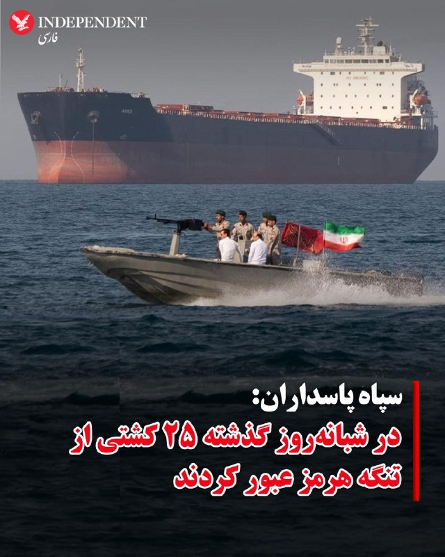
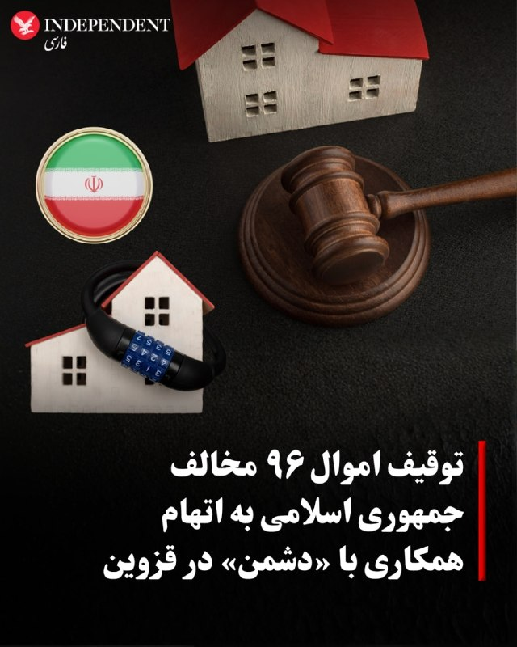
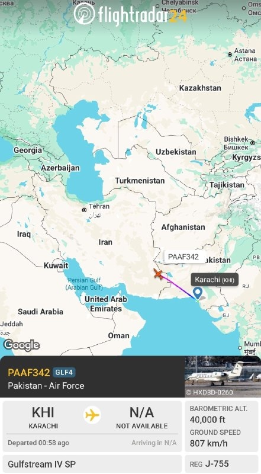
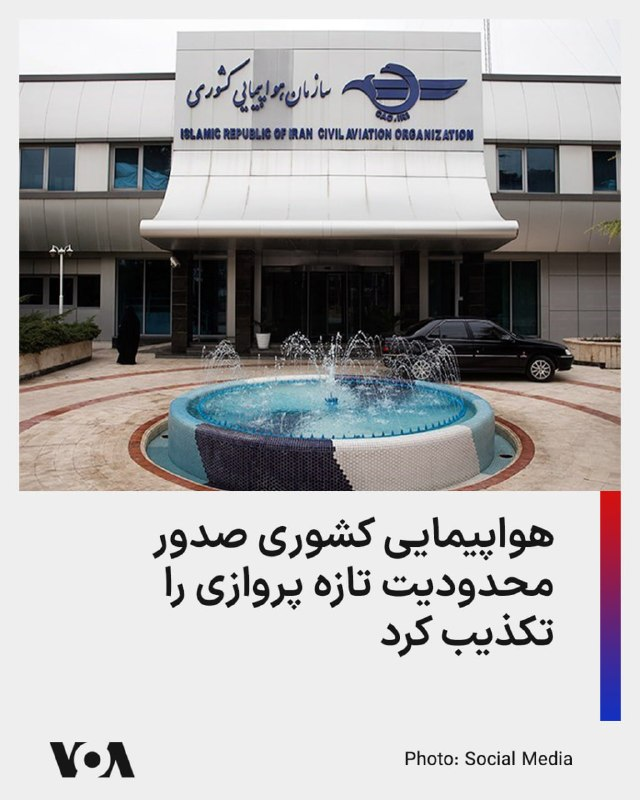
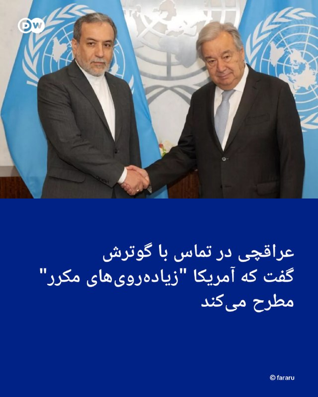
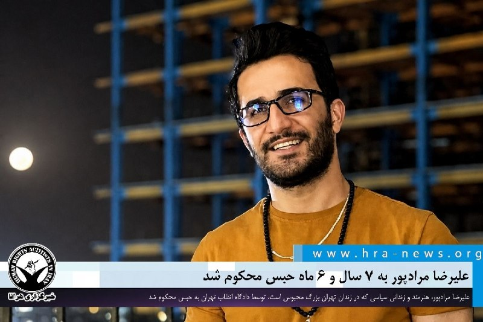

# خواننده تلگرام

<!-- TOP_NAV START -->

<a href="https://github.com/benyamin-najmi/aio-downloader/blob/main/telegram/content/archive_1.md" style="display:inline-block; padding:6px 12px; margin:0 4px; background-color:#2ea44f; color:white; text-decoration:none; border-radius:4px; font-weight:bold;">صفحه بعد</a>

<!-- TOP_NAV END -->

<!-- MSG START -->

---
📅 بروزرسانی: 1405/03/02 13:03
---

## VahidOOnLine — post 241673

روایت شما از زندگی در آتش‌بس- شنبه ۲ خرداد ۱۴۰۵

🔹 مردم ایران، با مذاکره ناامید نشوید. ما عهدی داریم با جاویدنام‌های این چند سال اخیر که همه جوان بودند و امیدوار. پس پرچم مبارزه آن‌ها را زمین نخواهیم گذاشت. در تاریخ، همه حکومت‌های قاتل محکوم به نابودی هستند. نه می‌بخشیم و نه فراموش می‌کنیم.
🔹 تهران، وضعیت اقتصادی وحشتناک است. همه دارن از جیب می‌خورن، اغلب تعدیل نیرو شدیم، مشاغل هنری کلاً کنسل شده، همه‌چیز ده‌ها برابر گران شده و هیچ کاری نمی‌شود کرد. خسته شدیم به خدا از این همه سگ‌دو زدن.
🔹 این یک گیگ اینترنتی که ما می‌خریم در واقع یک گیگ نیست. سه‌سوته تموم میشه. الکی اسم یک گیگ روش گذاشتن که با قیمت بالاتری بفروشنش.
🔹 شنبه ۲ خرداد ساعت ۹:۵۵ سمت کهریزک یه صدای انفجار با موجش اومد، عین زمان جنگ بود.
🔹 دو ماه از سال جدید گذشته است. چرا همچنان حقوق بازنشسته‌های تأمین اجتماعی مطابق مبلغ سال قبل واریز می‌شود؟
🔹 از تهران: من نقاشم و عمده درآمدم از پیجم بوده. از آغاز جنگ و قطع اینترنت درآمدی نداشتم و موجودی حسابم الآن ۴ هزار تومنه. آموزشگاه‌ها به خاطر شرایط جنگ بلاتکلیف هستند و مدرس استخدام نمی‌کنن. به خدا خسته شدیم دیگه.
🔹 این روزها داریم وسط کتاب تاریخ زندگی می‌کنیم؛ هر صفحه‌اش جلوی چشم‌مون نوشته می‌شود. اگر می‌خواهیم این تاریخ فردا با افتخار خوانده شود، باید کنار هم باشیم و ناامید نشویم.
🔹 امروز دوم خرداد است و هنوز نتونستن حقوق نصف بیشتر بازنشستگان تأمین اجتماعی را پرداخت کنند.
‌🏁 🇬🇧 IranintlTV

🤖 @VahidOOnLine

## VahidOOnLine — post 241672

  

سخنگوی سازمان هواپیمایی ایران اعلام کرد این سازمان هیچ اطلاعیه رسمی هوانوردی جدیدی درباره اعمال محدودیت در آسمان کشور صادر نکرده است و شرایط پروازی عادی است.

او با تاکید بر تداوم وضعیت عادی پروازها گفت: «شرایط آسمان کشور همچنان مانند روال گذشته است و پروازها طبق برنامه انجام می‌شود.»

سخنگوی سازمان هواپیمایی بدون اشاره به جزئیات اطلاعیه هوانوردی (نوتام)، افزود: «نوتامی که اخیرا در فضای مجازی منتشر شده، تکذیب می‌شود.»

سازمان هواپیمایی کشوری ایران روز جمعه یکم خرداد در اطلاعیه‌ای اعلام کرده بود فعالیت فرودگاه‌های واقع در بخش غربی محدوده پروازی ایران، موسوم به «FIR تهران»، تا دوشنبه متوقف شده و تنها شمار محدودی از فرودگاه‌ها مجاز به فعالیت هستند.

بر اساس آن اطلاعیه، فرودگاه‌های ارومیه، کرمان، آبادان، شیراز، یزد، کرمانشاه، رشت و اهواز از این محدودیت مستثنی شده‌اند و فعالیت آنها نیز فقط از طلوع تا غروب آفتاب مجاز اعلام شده بود.
‌🏁 🇬🇧 IranintlTV

🤖 @VahidOOnLine

## VahidOOnLine — post 241671

  

♦️روابط عمومی نیروی دریایی سپاه پاسداران انقلاب اسلامی، روز شنبه دوم خرداد ماه با انتشار بیانیه‌ای ادعا کرد، طی شبانه روز گذشته ۲۵ کشتی نفتکش، باربر و تجاری پس از «کسب مجوز با هماهنگی و تامین امنیت نیروی دریایی سپاه» از تنگه هرمز عبور کردند.
به سپاه پاسداران با اعلام این خبر افزود «کنترل هوشمند تنگه هرمز» توسط نیروی دریایی سپاه «با قوت» در حال انجام است.
در این بیانیه که در رسانه‌های حکومتی ایران منتشر شده، از کشورهای منبع و مقصد این کشتی‌ها و همچنین مواردی چون دریافت عوارض کشتی‌رانی اطلاعاتی ارائه نشده است.
‌🇸🇦 Indypersian

🤖 @VahidOOnLine

## VahidOOnLine — post 241670

  

⭕️ توقیف اموال ۹۶ مخالف جمهوری اسلامی به اتهام به همکاری با «دشمن» در قزوین

♦️دادستان عمومی و انقلاب قزوین از توقیف اموال ۹۶ مخالف جمهوری اسلامی به همکاری با «دشمن» خبر داد و اعلام کرد این افراد شامل «مزدوران خارج‌نشین» و برخی عناصر داخلی هستند.
به گفته مقام قضایی قزوین، همچنین برای ۳ نفر با اتهام «جاسوسی» و برای ۶ نفر به اتهام «انجام اقدامات اطلاعاتی» کیفرخواست صادر شده است.
این اقدام در ادامه موج برخوردهای امنیتی و قضایی پس از جنگ ۴۰ روزه میان جمهوری اسلامی با آمریکا و اسرائیل انجام می‌شود؛ دوره‌ای که طی آن، مقام‌های جمهوری اسلامی از توقیف اموال، مسدودسازی دارایی‌ها و تشکیل پرونده قضایی برای ده‌ها هنرمند، فعال سیاسی، رسانه‌ای و چهره‌های شناخته‌شده و تاثیرگذار خبر داده بودند.
‌🇸🇦 Indypersian

🤖 @VahidOOnLine

## VahidOOnLine — post 241669

ویدیوی رسیده به ایران اینترنشنال نشان می‌دهد روز شنبه دوم خرداد تعدادی از دانش‌آموزان مدارس در خرم‌آباد برای اعتراض به بلاتکلیفی و ابهام درباره شیوه امتحانات خود و اظهارات مسئولان برای حضوری کردن امتحانات تجمع کردند. هفته گذشته نیز در شهرکرد دانش‌آموزان تجمع اعتراضی برگزار کردند.
‌🏁 🇬🇧 IranintlTV

🤖 @VahidOOnLine

## VahidOOnLine — post 241668

  

♦️رئیس سازمان بین‌المللی دریانوردی (IMO) اعلام کرد هرگونه طرح برای دریافت عوارض اجباری از کشتی‌های عبوری در تنگه هرمز با اصول آزادی ناوبری بین‌المللی سازگار نیست.
آرسنیو دومینگز، رئیس این نهاد وابسته به سازمان ملل، روز شنبه دوم خرداد ماه در گفتگو با نیویورک‌تایمز گفت وارد بحث‌هایی درباره دریافت عوارضی که فراتر از حق عبور آزاد و «عبور بی‌ضرر» باشد، نخواهد شد.
این اظهارات پس از آن مطرح شد که گزارش‌هایی درباره گفتگوهای ایران و عمان برای ایجاد سازوکاری جهت دریافت هزینه عبور از کشتی‌ها در تنگه هرمز منتشر شد. ایران این طرح را در قالب هزینه خدمات، عوارض عبور یا هزینه‌های زیست‌محیطی مطرح کرده است.
‌🇸🇦 Indypersian

🤖 @VahidOOnLine

## VahidOOnLine — post 241667

  <a href="telegram/content/VahidOOnLine_241667_1779528809.mp4" target="_blank">🎬 Download video</a>

یک شهروند در پیامی به ایران اینترنشنال با اشاره به کشتار دی‌ماه از مذاکره با جمهوری اسلامی انتقاد کرده و می‌گوید مطالبه مردم در خیابان شاهزاده رضا پهلوی بوده است. پیام او با هوش مصنوعی خوانده شده است.
‌🏁 🇬🇧 IranintlTV

🤖 @VahidOOnLine

## VahidOOnLine — post 241666

  

علاالدین بروجردی، عضو کمیسیون امنیت ملی و سیاست خارجی مجلس، وضعیت فعلی کشور را «شکننده» خواند و گفت در شرایط «نه جنگ و نه صلح»، همه سناریوها محتمل است و باید برای بدترین گزینه‌ها آمادگی داشت.

او تاکید کرد: «ما باید همواره برای بدترین گزینه‌ها آمادگی لازم را داشته باشیم تا دشمنان اشتباهات گذشته خود را تکرار نکنند.»

بروجردی همچنین هشدار داد جمهوری اسلامی در برابر هرگونه اقدام «ماجراجویانه» پاسخ «قاطع و بدون ملاحظه» خواهد داد.

این عضو کمیسیون امنیت ملی و سیاست خارجی مجلس با اشاره به روند مذاکرات گفت: «مذاکرات صحنه کارزار سیاسی است. در آن صحنه نیز قالیباف در حال جنگ است و به همراه وزیر امور خارجه کشور با پشتوانه مردم و نیروهای مسلح از موضوع قدرت صحبت می‌کند.»
‌🏁 🇬🇧 IranintlTV

🤖 @VahidOOnLine

## VahidOOnLine — post 241665

  <a href="telegram/content/VahidOOnLine_241665_1779528811.mp4" target="_blank">🎬 Download video</a>

یک شهروند با ارسال پیامی درباره گرانی و کمبود دارو می‌گوید مایفورتیک که از داروهای مورد نیاز در پیوند کلیه است به حدود ۱۲۰ میلیون تومان رسیده است. پیام او با هوش مصنوعی خوانده شده است.
‌🏁 🇬🇧 IranintlTV

🤖 @VahidOOnLine

## VahidOOnLine — post 241664

♦️در پی نشت یک مخزن بزرگ مواد شیمیایی در ایالت کالیفرنیا، مقام‌های محلی روز جمعه دستور تخلیه گسترده مناطق اطراف را صادر کردند. به گزارش خبرگزاری فرانسه، نشست مواد این مخزن باعث انتشار بخارهای سمی بر فراز منطقه‌ای پرجمعیت شده و خطر انفجار را به همراه دارد.
این مخزن حاوی حدود ۷ هزار گالن، معادل ۲۶ هزار لیتر، ماده «متیل متاکریلات» بود. مایعی فرار و قابل اشتعال که در تولید پلاستیک استفاده می‌شود. آتش‌نشانان وضعیت را «بسیار جدی» توصیف کردند.
کریگ کاوی، فرمانده عملیات، گفت: «عملا فقط دو سناریو باقی مانده است؛ یا مخزن دچار شکستگی می‌شود و حدود ۶ تا ۷ هزار گالن مواد شیمیایی خطرناک وارد محوطه می‌شود، یا وارد مرحله انفجار حرارتی شده و منفجر می‌شود و مخازن اطراف را نیز درگیر می‌کند.»
این حادثه در منطقه گاردن گروو در اورنج کانتی، در جنوب‌شرقی لس‌آنجلس، رخ داده است. رئیس پلیس گاردن گروو گفت حدود ۴۰ هزار نفر تحت تأثیر دستور تخلیه قرار گرفته‌اند، هرچند چند هزار نفر همچنان از ترک خانه‌های خود خودداری کرده‌اند.
تصاویر هوایی منتشرشده از تلویزیون‌های محلی نشان می‌دهد نیروهای امدادی برای خنک نگه داشتن مخزن، حجم زیادی آب روی آن می‌ریزند. مقام‌های امدادی بعدا اعلام کردند عملیات خنک‌سازی موفق بوده و دمای مخزن کاهش یافته است.
تا شامگاه جمعه گزارشی از مصدومیت منتشر نشده و علت نشت نیز هنوز مشخص نیست. مقام‌های بهداشتی هشدار داده‌اند استنشاق بخار این ماده می‌تواند موجب آسیب‌های تنفسی و علائم عصبی شود.
‌🇸🇦 Indypersian

🤖 @VahidOOnLine

## VahidOOnLine — post 241663

⭕️ شکوه طبیعت بهاری؛
باران، جان تازه‌ای به دشت‌های گلستان بخشید

♦️بارش‌های مستمر و فراتر از حد نرمال در دو ماه گذشته، جلوه‌ای تازه به طبیعت سرسبز استان گلستان بخشیده و جان دوباره‌ای به زمین‌های کشاورزی این استان داده است. دشت‌های وسیع، مراتع سبز و مزارع چشم‌نواز گلستان این روزها در اوج طراوت بهاری قرار دارند، استانی که به‌دلیل تنوع اقلیمی کم‌نظیر، از کوهستان و جنگل تا دشت و ساحل را در خود جای داده و یکی از قطب‌های مهم کشاورزی ایران به شمار می‌رود.
رونق دوباره کشت‌های دیم پس از بارندگی‌های اخیر، امید تازه‌ای در میان کشاورزان گلستان ایجاد کرده است. این استان با حدود ۶۵۰ هزار هکتار زمین کشاورزی، در تولید ۱۵ محصول راهبردی کشور جزو استان‌های پیشتاز محسوب می‌شود و طبیعت زنده و حاصلخیز آن، هر ساله نقش مهمی در تامین امنیت غذایی ایران ایفا می‌کند.
تصاویر منتشرشده، گوشه‌ای از زیبایی طبیعت بهاری گلستان و زندگی جاری در دل مزارع و دشت‌های این استان را به تصویر می‌کشد.
این مجموعه عکس را محمد عطایی ثبت کرده و در خبرگزاری ایرنا منتشر کرده است.
‌🇸🇦 Indypersian

🤖 @VahidOOnLine

## mwarmonitor — post 9521

📝از اخبار موثق تا سناریوی هالیوودی؛ سقوط آزاد نیویورک‌تایمز در باتلاق اراجیف 🔰این سناریوی نیویورک‌تایمز واقعاً بیشتر شبیه به یکی از قسمت‌های تخیلی و آخرالزمانی ترمیناتور جیمز کامرون است تا یک گزارش خبری موثق، و نشان می‌دهد که کار این رسانه رسماً از نوشتن…

## mwarmonitor — post 9520

🔸یک مقام دیگر پاکستانی در حال سفر به تهران است. 🛩 هواپیمای Gulfstream IV-SP نیروی هوایی پاکستان با رجیستر J-755 @mwarmonitor

## mwarmonitor — post 9519

  

🔸یک مقام دیگر پاکستانی در حال سفر به تهران است.

🛩 هواپیمای Gulfstream IV-SP نیروی هوایی پاکستان با رجیستر J-755

@mwarmonitor

## mwarmonitor — post 9518

🔴مذاکرات آمریکا و ایران برای پایان دادن به جنگ شدت گرفته است، اما گزارش شده که دونالد ترامپ، رئیس‌جمهور آمریکا، در صورت عدم دستیابی به توافق، به‌طور جدی در حال بررسی حملات جدید علیه ایران است — رویترز

@mwarmonitor

## pm_afshaa — post 91248

👩‍💻کانفیگ اضطراری موجود شد!

🛍 series Basic

• 1G 140 
💵
• 2G 280
💵
• 3G 420
💵
• 4G 560
💵
• 5G 700
💵
• 10G 1400
💵
• 20G 2800 
💵
• 30G 4200
💵

📌مناسب استفاده روزمره و اقتصادی

📌سرعت مناسب برای استفاده عادی

📌پینگ 140تا350

📌مناسب تلگرام.وب گردی . اینستاگرام

✔️ بدونه محدودیت زمان و کاربر هستن

✔️ساب لینک جهت دیدن حجم

✔️بدونه حتی ۱ درصد ضریب تمامی سرور ها

⚠️همه سرویس ضمانت بازگشت وجه دارند

@n9neebot

## pm_afshaa — post 91247

🔴منابعی به اسکای نیوز عربی گفتن که میانجی پاکستانی موفق شده بر مانع پرونده هسته‌ای ایران غلبه کنه

💧 Rainbet.com the #1 Non-KYC Crypto Casino & Sportsbook @rainbetcom

😁 @Pm_Afshaa

## pm_afshaa — post 91246

🔴لارا لومر از معتمد ترین افراد نزدیک ترامپ خبر آماده شدن آمریکا برای حملات دوباره به ایران رو توییت کرده

💧 Rainbet.com the #1 Non-KYC Crypto Casino & Sportsbook @rainbetcom

😁 @Pm_Afshaa

## pm_afshaa — post 91245

🔴حملات آخرالزمانی اسرائیل به تأسیسات زیرزمینی حزب الله در منطقه البقاع در شرق لبنان

💧 Rainbet.com the #1 Non-KYC Crypto Casino & Sportsbook @rainbetcom

😁 @Pm_Afshaa

## pm_afshaa — post 91244

🔴کانال 13 اسراییل: ترامپ اسرائیل را از مذاکرات با ایران کنار گذاشته

💧 Rainbet.com the #1 Non-KYC Crypto Casino & Sportsbook @rainbetcom

😁 @Pm_Afshaa

## pm_afshaa — post 91243

نماینده ج.ا در سازمان ملل: دولت‌های خلیج فارس موظف به جبران کامل خسارات علیه ایران هستن

💧 Rainbet.com the #1 Non-KYC Crypto Casino & Sportsbook @rainbetcom

😁 @Pm_Afshaa

## pm_afshaa — post 91242

مهاجری، عضو شورای اطلاع‌رسانی دولت، خطاب به حمید رسایی: تصمیم‌ جنگ یا صلح ربطی به نمایندگان کم سواد نداره

💧 Rainbet.com the #1 Non-KYC Crypto Casino & Sportsbook @rainbetcom

😁 @Pm_Afshaa

## pm_afshaa — post 91241

🔴ویزای شجاع خلیل زاده احسان حاج‌صفی و مهدی طارمی به دلیل حمایت از سپاه تروریستی پاسداران رد شدن

💧 Rainbet.com the #1 Non-KYC Crypto Casino & Sportsbook @rainbetcom

😁 @Pm_Afshaa

## DEJradio — post 4862

  <a href="telegram/content/DEJradio_4862_1779528813.mp4" target="_blank">🎬 Download video</a>

🤡
🔺 «شب ازدواجشون چه شود»؛ تَق!

#تجمعات_حکومتی #شب_زفاف
@DEJradio

## DEJradio — post 4861

  <a href="telegram/content/DEJradio_4861_1779528815.webm" target="_blank">🎬 Download video</a>

🚨📢 سازمان هواپیمایی کشوری با صدور نوتام تازه، برای پروازها و فعالیت فرودگاه‌های غرب ایران تا صبح دوشنبه محدودیت اعلام کرد.

بر اساس این نوتام، تمامی فرودگاه‌های غرب ایران بسته اعلام شده‌اند و تنها هشت فرودگاه شامل تبریز، کرمان، آبادان، کرمانشاه، یزد، رشت و اهواز اجازه فعالیت دارند. فعالیت این فرودگاه‌ها نیز صرفاً از طلوع تا غروب آفتاب مجاز است.

در متن اطلاعیه همچنین تأکید شده که تمامی مجوزهای پیشین پرواز برای اپراتورها و شرکت‌های هواپیمایی تعلیق شده و انجام هر پرواز مسافری منوط به دریافت مجوز تازه از سازمان هواپیمایی کشوری خواهد بود.

این محدودیت‌ها بر اساس زمان درج‌شده در نوتام تا ساعت ۸:۳۰ صبح روز دوشنبه ادامه دارد؛ هرچند امکان تمدید یا اصلاح آن با توجه به شرایط عملیاتی و امنیتی وجود خواهد داشت.

سازمان هواپیمایی کشوری از مسافران خواسته است آخرین وضعیت پروازها را اتنها از مسیر شرکت‌های هواپیمایی، فرودگاه‌ها و اطلاعیه‌های رسمی پیگیری کنند.

#سازمان_هواپیمایی_کشوری
@DEJradio

## DEJradio — post 4860

  <a href="telegram/content/DEJradio_4860_1779528815.webm" target="_blank">🎬 Download video</a>

🚨
⭕️ همزمان با آخرین تلاش‌های دیپلماتیک برای وادار کردن جمهوری اسلامی به توافق با آمریکا، سی‌بی‌اس‌نیوز به نقل از منابع آگاه گزارش داد دولت ترامپ برای دور تازه‌ای از حملات نظامی علیه جمهوری اسلامی ایران آماده می‌شود.

به گفته منابع مطلع، برخی اعضای ارتش و نهادهای اطلاعاتی آمریکا برنامه‌های تعطیلات خود را لغو کرده‌اند و مقام‌های دفاعی و اطلاعاتی در حال به‌روزرسانی فهرست‌های فراخوان نیروها در پایگاه‌های آمریکا در خارج از کشور هستند.

ترامپ اعلام کرد به دلیل «شرایط مربوط به امور دولت» در مراسم ازدواج پسرش شرکت نخواهد کرد و به‌جای گذراندن تعطیلات روز یادبود در نیوجرسی، به کاخ سفید بازمی‌گردد.

همچنین «آکسیوس» گزارش داد ترامپ به طور جدی در حال بررسی انجام حملات جدید علیه ایران است تا در صورت عدم حصول پیشرفت لحظه آخری در مذاکرات آن را عملی کند.

#توافق #مذاکرات #جنگ
@DEJradio

## mamlekate — post 103570

📝 گزارش سی‌بی‌اس از تحرکات تازه جامعه نظامی و اطلاعاتی آمریکا با محوریت ایران؛ برخی اعضای ارتش مرخصی‌های خود را لغو کردند

شبکه آمریکایی سی‌بی‌اس به نقل از منابع مطلع گزارش داد که دولت دونالد ترامپ، رئیس‌جمهوری آمریکا، روز جمعه ۱ خرداد و هم‌زمان با ادامه تلاش‌های دیپلماتیک، خود را برای دور تازه‌ای از حملات نظامی به جمهوری اسلامی ایران آماده می‌کرد.

@mamlekate

## mamlekate — post 103569

📝 قفل دبی بر بازار دیجیتال ایران؛ هشدار درباره موج تازه گرانی موبایل و لپ‌تاپ

بازار دیجیتال ایران پس از جنگ به وضعیت عادی بازنگشته و فعالان بازار از کمبود کالا، قیمت‌های شناور و مسیرهای نامطمئن واردات می‌گویند. وابستگی طولانی‌مدت بازار موبایل، لپ‌تاپ و قطعات کامپیوتری به مسیر امارات، اکنون به نقطه آسیب‌پذیری تبدیل شده و در کوتاه‌مدت جایگزین روشنی برای آن دیده نمی‌شود.

@mamlekate

## kianmeli1 — post 87571

🔴برخی افراد با نفوذ در کاخ سفید گفتند بمب ها در راه ایران است

باید صبر کرد و دید چقدر واقعیت است
https://t.me/kianmeli1

## IranIntlTV — post 338549

روایت شما از زندگی در آتش‌بس- شنبه ۲ خرداد ۱۴۰۵

🔹 مردم ایران، با مذاکره ناامید نشوید. ما عهدی داریم با جاویدنام‌های این چند سال اخیر که همه جوان بودند و امیدوار. پس پرچم مبارزه آن‌ها را زمین نخواهیم گذاشت. در تاریخ، همه حکومت‌های قاتل محکوم به نابودی هستند. نه می‌بخشیم و نه فراموش می‌کنیم.
🔹 تهران، وضعیت اقتصادی وحشتناک است. همه دارن از جیب می‌خورن، اغلب تعدیل نیرو شدیم، مشاغل هنری کلاً کنسل شده، همه‌چیز ده‌ها برابر گران شده و هیچ کاری نمی‌شود کرد. خسته شدیم به خدا از این همه سگ‌دو زدن.
🔹 این یک گیگ اینترنتی که ما می‌خریم در واقع یک گیگ نیست. سه‌سوته تموم میشه. الکی اسم یک گیگ روش گذاشتن که با قیمت بالاتری بفروشنش.
🔹 شنبه ۲ خرداد ساعت ۹:۵۵ سمت کهریزک یه صدای انفجار با موجش اومد، عین زمان جنگ بود.
🔹 دو ماه از سال جدید گذشته است. چرا همچنان حقوق بازنشسته‌های تأمین اجتماعی مطابق مبلغ سال قبل واریز می‌شود؟
🔹 از تهران: من نقاشم و عمده درآمدم از پیجم بوده. از آغاز جنگ و قطع اینترنت درآمدی نداشتم و موجودی حسابم الآن ۴ هزار تومنه. آموزشگاه‌ها به خاطر شرایط جنگ بلاتکلیف هستند و مدرس استخدام نمی‌کنن. به خدا خسته شدیم دیگه.
🔹 این روزها داریم وسط کتاب تاریخ زندگی می‌کنیم؛ هر صفحه‌اش جلوی چشم‌مون نوشته می‌شود. اگر می‌خواهیم این تاریخ فردا با افتخار خوانده شود، باید کنار هم باشیم و ناامید نشویم.
🔹 امروز دوم خرداد است و هنوز نتونستن حقوق نصف بیشتر بازنشستگان تأمین اجتماعی را پرداخت کنند.

## IranIntlTV — post 338548

  

سخنگوی سازمان هواپیمایی ایران اعلام کرد این سازمان هیچ اطلاعیه رسمی هوانوردی جدیدی درباره اعمال محدودیت در آسمان کشور صادر نکرده است و شرایط پروازی عادی است.

او با تاکید بر تداوم وضعیت عادی پروازها گفت: «شرایط آسمان کشور همچنان مانند روال گذشته است و پروازها طبق برنامه انجام می‌شود.»

سخنگوی سازمان هواپیمایی بدون اشاره به جزئیات اطلاعیه هوانوردی (نوتام)، افزود: «نوتامی که اخیرا در فضای مجازی منتشر شده، تکذیب می‌شود.»

سازمان هواپیمایی کشوری ایران روز جمعه یکم خرداد در اطلاعیه‌ای اعلام کرده بود فعالیت فرودگاه‌های واقع در بخش غربی محدوده پروازی ایران، موسوم به «FIR تهران»، تا دوشنبه متوقف شده و تنها شمار محدودی از فرودگاه‌ها مجاز به فعالیت هستند.

بر اساس آن اطلاعیه، فرودگاه‌های ارومیه، کرمان، آبادان، شیراز، یزد، کرمانشاه، رشت و اهواز از این محدودیت مستثنی شده‌اند و فعالیت آنها نیز فقط از طلوع تا غروب آفتاب مجاز اعلام شده بود.
https://iranintl.com/202605236955

## IranIntlTV — post 338547

ویدیوی رسیده به ایران اینترنشنال نشان می‌دهد روز شنبه دوم خرداد تعدادی از دانش‌آموزان مدارس در خرم‌آباد برای اعتراض به بلاتکلیفی و ابهام درباره شیوه امتحانات خود و اظهارات مسئولان برای حضوری کردن امتحانات تجمع کردند. هفته گذشته نیز در شهرکرد دانش‌آموزان تجمع اعتراضی برگزار کردند.

## IranIntlTV — post 338546

  <a href="telegram/content/IranIntlTV_338546_1779528816.mp4" target="_blank">🎬 Download video</a>

همزمان با لغو امتحانات مقطع ابتدایی و غیرحضوری شدن آزمون‌های بسیاری از پایه‌های متوسطه، نگرانی‌ها درباره پیامدهای آموزش مجازی در ایران افزایش یافته است.

گفت‌وگو با منصوره حسینی‌یگانه، عضو تحریریه ایران‌اینترنشنال
@iranintltv

## IranIntlTV — post 338545

  <a href="telegram/content/IranIntlTV_338545_1779528818.mp4" target="_blank">🎬 Download video</a>

یک شهروند در پیامی به ایران اینترنشنال با اشاره به کشتار دی‌ماه از مذاکره با جمهوری اسلامی انتقاد کرده و می‌گوید مطالبه مردم در خیابان شاهزاده رضا پهلوی بوده است. پیام او با هوش مصنوعی خوانده شده است.

## IranIntlTV — post 338544

  <a href="telegram/content/IranIntlTV_338544_1779528819.mp4" target="_blank">🎬 Download video</a>

دونالد ترامپ، رییس‌جمهوری آمریکا، در شبکه اجتماعی تروث سوشال نوشت در شرایط کنونی، ترجیح می‌دهد در کاخ سفید بماند و در مراسم ازدواج پسرش حضور نخواهد داشت.

سمیرا قرایی، خبرنگار ایران‌اینترنشنال، گزارش می‌دهد
@iranintltv

## IranIntlTV — post 338543

  

علاالدین بروجردی، عضو کمیسیون امنیت ملی و سیاست خارجی مجلس، وضعیت فعلی کشور را «شکننده» خواند و گفت در شرایط «نه جنگ و نه صلح»، همه سناریوها محتمل است و باید برای بدترین گزینه‌ها آمادگی داشت.

او تاکید کرد: «ما باید همواره برای بدترین گزینه‌ها آمادگی لازم را داشته باشیم تا دشمنان اشتباهات گذشته خود را تکرار نکنند.»

بروجردی همچنین هشدار داد جمهوری اسلامی در برابر هرگونه اقدام «ماجراجویانه» پاسخ «قاطع و بدون ملاحظه» خواهد داد.

این عضو کمیسیون امنیت ملی و سیاست خارجی مجلس با اشاره به روند مذاکرات گفت: «مذاکرات صحنه کارزار سیاسی است. در آن صحنه نیز قالیباف در حال جنگ است و به همراه وزیر امور خارجه کشور با پشتوانه مردم و نیروهای مسلح از موضوع قدرت صحبت می‌کند.»
https://iranintl.com/202605231626

## IranIntlTV — post 338542

  <a href="telegram/content/IranIntlTV_338542_1779528821.mp4" target="_blank">🎬 Download video</a>

کانال ۱۱ گزارش داد اسرائیل هرگونه توافق با جمهوری اسلامی را به خروج اورانیوم غنی‌شده از ایران و نظارت دقیق بر برنامه هسته‌ای تهران مشروط می‌داند. بر اساس این گزارش اسرائیل از احتمال تعویق مذاکرات اتمی، حتی برای چند روز، نگران است.

گزارش اشکان صفایی، خبرنگار ایران‌اینترنشنال
@iranintltv

## IranIntlTV — post 338541

  <a href="telegram/content/IranIntlTV_338541_1779528822.mp4" target="_blank">🎬 Download video</a>

یک شهروند با ارسال پیامی درباره گرانی و کمبود دارو می‌گوید مایفورتیک که از داروهای مورد نیاز در پیوند کلیه است به حدود ۱۲۰ میلیون تومان رسیده است. پیام او با هوش مصنوعی خوانده شده است.

## IranIntlTV — post 338540

  <a href="telegram/content/IranIntlTV_338540_1779528824.mp4" target="_blank">🎬 Download video</a>

حسین آقایی، عضو تحریریه ایران‌اینترنشنال، گفت: «حتی اگر دولت ترامپ ده‌ها دور دیگر مذاکره با جمهوری اسلامی برگزار کند، تهران همچنان با همان اهرم‌های محدود فشار پای میز خواهد آمد و آن‌گونه که دولت ترامپ می‌خواهد تسلیم نخواهد شد.» او افزود: «اگر آمریکا بخواهد جمهوری اسلامی را وادار به تسلیم کند، باید کارت‌های بازی‌اش را بگیرد.» آقایی تاکید کرد: «گرفتن این اهرم‌ها از طریق حملات نظامی ممکن است، نه دادن زمان بیشتر به جمهوری اسلامی.»
@iranintltv

## IranIntlTV — post 338539

  <a href="telegram/content/IranIntlTV_338539_1779528826.mp4" target="_blank">🎬 Download video</a>

جاویدنامان انقلاب ملی ایرانیان
«پریماه نیک‌پرور» ۱۸ ساله، در اعتراضات ۱۸ دی‌ماه در بندرعباس مورد اصابت گلوله نیروهای سرکوب جمهوری اسلامی قرار گرفت و بعد از سوار شدن به آمبولانس به دلیل عدم رسیدگی به موقع و خون‌ریزی شدید کشته شد. نامش در حافظه‌ این سرزمین می‌ماند و یادش چراغ راه آزادی‌خواهان است.
@iranintltv

## FarsiVOA — post 218418

  <a href="telegram/content/FarsiVOA_218418_1779528827.mp4" target="_blank">🎬 Download video</a>

ورود اولین جنگنده‌های اِف-۳۵ به لهستان؛ تقویت بی‌سابقه ارتش در مرزهای شرقی ناتو؛

ووادیسواف کوشینیاک-کامیش، معاون نخست‌وزیر لهستان، روز جمعه با انتشار ویدیویی از پرواز همزمان سه فروند جنگنده نسل پنجم اِف-۳۵ در کنار اِف-۱۶های این کشور خبر داد و اعلام کرد این هواپیماها پس از برخاستن از پایگاهی در مجمع‌الجزایر آزور، در مسیر نهایی ورود به خدمت در لهستان هستند.

این جنگنده‌ها، اولین هواپیماهای نسل پنجم در جناح شرقی ناتو هستند که به دلیل فناوری رادارگریزی پیشرفته، توانایی شناسایی تهدیدات را پیش از دیده‌ شدن خود دارا می‌باشند.

معاون نخست‌وزیر لهستان تأکید کرد که الحاق اِف-۳۵ها صرفاً خرید تجهیزات جدید نیست، بلکه ورود رسمی نیروی هوایی لهستان به سطح اول و برتر ارتش‌های مدرن جهان است.

پیشتر رئیس‌جمهور آمریکا اعلام کرده بود که پنج هزار نظامی دیگر آمریکایی را به لهستان اعزام می‌کند.

رئیس‌جمهور لهستان با تشکر از دونالد ترامپ برای این تصمیم، در ایکس نوشت: «ائتلاف‌های خوب آن‌هایی هستند که بر پایه همکاری، احترام متقابل و تعهد به امنیت مشترک ما بنا شده‌اند.»
@FarsiVOA

## FarsiVOA — post 218417

  

سخنگوی سازمان هواپیمایی صدور نوتام تازه درباره محدودیت پروازی را تکذیب کرد و گفت پروازها طبق برنامه انجام می‌شود.

این تکذیب در حالی منتشر شده که پس از خبر قبلی درباره نوتام و تصاویر منتشر شده از رصد پروازها در آسمان ایران، عراق و سوریه، ابهام درباره وضعیت واقعی ترافیک هوایی منطقه همچنان باقی است.
@FarsiVOA

## FarsiVOA — post 218416

🔺ثبت رکورد دو هزار ساعت قطع اینترنت در هشتادوپنجمین روز حصر دیجیتال

◾️در حالی که محدودیت گسترده اینترنت بین‌الملل در ایران وارد هشتاد و پنجمین روز شده، داده‌های نت‌بلاکس نشان می‌دهد میزان «انزوای دیجیتال» ایران از جهان از مرز ۲۰۱۶ ساعت گذشته است.

◾️بر اساس اعلام این نهاد ناظر بر اینترنت، قطع یا محدودیت شدید دسترسی به اینترنت جهانی اکنون وارد هفته سیزدهم شده و زندگی روزمره، کار، آموزش، ارتباطات و دسترسی به اطلاعات را برای میلیون‌ها شهروند ایرانی مختل کرده است.

◾️مقام‌های جمهوری اسلامی همچنان زمان روشنی برای بازگشایی اینترنت اعلام نکرده‌اند.

⬇️ بیشتر بخوانید:
https://ir.voanews.com/a/8153017.html

## FarsiVOA — post 218415

  <a href="telegram/content/FarsiVOA_218415_1779528830.mp4" target="_blank">🎬 Download video</a>

ارتش اسرائیل از حمله به تأسیسات زیرزمینی تولید سلاح حزب‌الله خبر داد؛

ارتش اسرائیل اعلام کرد در حملات شبانه به لبنان، یک تأسیسات زیرزمینی تولید سلاح متعلق به حزب‌الله در دره بقاع هدف قرار گرفته است.

به گزارش تایمز اسرائیل، ارتش اسرائیل همچنین گفته است زیرساخت‌های دیگری از حزب‌الله در منطقه صور در جنوب لبنان نیز در این حملات هدف حمله قرار گرفتند. ارتش اسرائیل مدعی شده پیش از انجام حملات، هشدارهای تخلیه صادر شده بود تا خطر آسیب به غیرنظامیان کاهش یابد و در عملیات از مهمات دقیق و ابزارهای نظارتی استفاده شده است.

این حملات در ادامه افزایش تنش‌ها در مرز اسرائیل و لبنان انجام می‌شود؛ جایی که از آغاز جنگ، تبادل آتش میان اسرائیل و حزب‌الله بارها به حملات گسترده‌تر در خاک لبنان منجر شده است.

با وجود اعلام آتش‌بس در جبهه لبنان، حملات اسرائیل و حزب‌الله در هفته‌های اخیر ادامه یافته است. اسرائیل می‌گوید مواضع حزب‌الله را برای جلوگیری از بازسازی توان نظامی این گروه هدف می‌گیرد، اما حزب‌الله و دولت لبنان این حملات را نقض آتش‌بس می‌دانند.
@FarsiVOA

## FarsiVOA — post 218414

  

بر اساس داده‌های منتشرشده از مسیرهای هوایی، یک اطلاعیه هوانوردی برای ممنوعیت یا محدودیت پرواز بر فراز بخش‌هایی از غرب کشور صادر شده است.

این محدودیت پروازی تا روز دوشنبه چهارم خرداد ادامه خواهد داشت.

این نوع اطلاعیه که در هوانوردی با عنوان «نوتام» شناخته می‌شود، برای آگاه‌کردن خلبانان و شرکت‌های هواپیمایی از خطرات احتمالی، محدودیت‌های مسیر، بسته‌شدن آسمان یا شرایطی صادر می‌شود که می‌تواند ایمنی پرواز را تحت تأثیر قرار دهد.

در تصاویر منتشرشده، حجم بالای پروازها در اطراف آسمان ایران و عبور مسیرها از مناطق پیرامونی دیده می‌شود؛ موضوعی که می‌تواند نشانه تغییر مسیر پروازها و احتیاط شرکت‌های هواپیمایی در منطقه باشد.
@FarsiVOA

## DW_Farsi — post 125035

📸 جام ۱۹۷۴؛ یوهان کرویف، سلطانی که در حسرت قهرمانی جهان ماند

🔻 گزارشی از شهرام احدی

یوهان کرویف در روز ۲۵ آوریل ۱۹۴۷ در آمسترادام به دنیا آمد. خانه‌ی پدری او در نزدیکى ورزشگاه اختصاصی تیم "آژاکس"، باشگاه پرآوازه‌ی آمستردام قرار داشت. یوهان در کودکی پدرش را از دست داد و مادرش مجبور شد براى گذران زندگی به‌عنوان نظافتچى، از جمله در باشگاه آژاکس کار کند. همین رخدادها بودند که سرنوشت یوهان کرویف را رقم زدند.

به عقیده کارل هاینس هوبا، یکى از روزنامه‌نگاران معروف ورزشى در آلمان، "کرویف از معدود بازیکنان اىست که با فوتبال بزرگ شده؛ همان طور که فرزند یک کشاورز از کودکی کشاورزى را می‌آموزد یا فرزند یک ماهیگیر که تمام روز با پدرش مشغول ماهیگیرى است".

کرویف در ۱۳ سالگى ترک تحصیل کرد تا تمام وقت و توانش را صرف فوتبال کند. رینوس میشل، مربى معروف هلندى که در آن زمان سرمربی آژاکس بود، به نبوغ و استعداد وی پى برد و در ۱۵ نوامبر ۱۹۶۴ کرویف ۱۷ ساله را برای نخستین بار در ترکیب تیمش قرار داد. کرویف در همان بازی اولین گل خود در لیگ دسته‌ی برتر هلند را به ثمر رساند.

@dw_farsi

## DW_Farsi — post 125034

  

🔶 عراقچی در تماس با گوترش: آمریکا زیاده‌روی‌های مکرر مطرح می‌کند

عباس عراقچی، وزیر امور خارجه ایران شامگاه جمعه ۱ خرداد (۲۲ مه) در تماسی تلفنی با آنتونیو گوترش، دبیرکل سازمان ملل درباره آخرین تحولات منطقه‌ و روند دیپلماسی میان ایران و آمریکا با میانجی‌گری پاکستان گفت‌وگو کرد.

عراقچی همچنین اعلام کرد که جمهوری اسلامی با وجود "بدعهدی‌های مکرر" طرف مقابل در دیپلماسی و اقدامات نظامی علیه ایران همچنان در روند دیپلماتیک مشارکت دارد، اما به گفته او، آمریکا "زیاده‌خواهی‌های مکرر" مطرح می‌کند.

هم‌زمان با تشدید تنش میان آمریکا و ایران عاصم منیر، فرمانده ارتش پاکستان هم با هدف میانجی‌گری به تهران سفر کرد.

دونالد ترامپ، رئیس‌جمهور آمریکا مذاکرات با جمهوری اسلامی را در "مرز میان توافق و تشدید درگیری" توصیف کرده است؛ درگیری‌ای که با حملات مشترک آمریکا و اسرائیل به ایران در ۲۸ فوریه آغاز شد و به تنش‌های گسترده در تنگه هرمز انجامید.

در همین حال، رسانه‌های آمریکایی از جمله "آکسیوس" و "سی‌بی‌اس" به نقل از منابعی گزارش داده‌اند که کاخ سفید احتمال حملات جدید به ایران را بررسی می‌کند، اما تصمیم نهایی و قطعی هنوز گرفته نشده است.

@dw_farsi

## DW_Farsi — post 125032

  

🔶 نمایشگاه هوایی بین‌المللی بریتانیا به دلیل جنگ ایران لغو شد

نمایشگاه هوایی "رویال اینترنشنال ایر تاتو" (RIAT) که از بزرگ‌ترین نمایشگاه‌های دفاعی جهان است روز جمعه ۲۲ مه اعلام کرد که به دلیل تنش‌های نظامی مرتبط با جنگ ایران برنامه خود را لغو کرده است.

این نمایشگاه هوایی که در پایگاه نیروی هوایی سلطنتی فیرفورد بریتانیا در گلاسترشر، واقع در جنوب‌غربی انگلستان برگزار می‌شود بیش از ۵۰ سال قدمت دارد و می‌تواند سالانه بیش از ۱۷۰ هزار بازدیدکننده را جذب کند؛ پایگاهی که توسط نیروی هوایی سلطنتی بریتانیا و نیروی هوایی ایالات متحده به صورت مشترک استفاده می‌شود.

برگزارکنندگان اعلام کره‌اند که لغو این رویداد "تصمیمی آسان نبوده" و این تصمیم پس از گفت‌وگو با نیروی هوایی ایالات متحده، به دلیل عدم اطمینان از دسترسی به این پایگاه در رابطه با وضعیت جاری در ایران اتخاذ شده است. 

این نمایشگاه توسط یک موسسه خیریه وابسته به نیروی هوایی سلطنتی سازمان‌دهی می‌شود و آماده‌سازی آن معمولا برای هفته‌ها بخشی از فعالیت‌های پایگاه فیرفورد را که توسط نیروی هوایی آمریکا اجاره شده، تحت تاثیر قرار می‌دهد.

فرانسیس توسـا، تحلیلگر دفاعی مستقر در بریتانیا می‌گوید، این وضعیت نشان می‌دهد که هیچ تضمینی وجود ندارد که خطر تشدید درگیری با ایران تا ماه ژوئیه کاهش یابد.

استفاده از پایگاه‌های نظامی بریتانیا توسط نیروهای آمریکایی در چارچوب جنگ ایران، به موضوع اختلاف‌برانگیز میان کی‌یر استارمر، نخست‌وزیر بریتانیا و دونالد ترامپ، رئیس‌جمهور آمریکا تبدیل شده است.

کی‌یر استارمر پیش‌تر اعلام کرده بود که بریتانیا اجازه استفاده محدود از پایگاه‌های خود را خواهد داد، اما در حملات تهاجمی علیه ایران مشارکت نخواهد کرد.

@dw_farsi

## RadioFarda — post 157474

  

🔸شرح عکس: کیانا، دختر نرگس محمدی در دیدار با شهردار پاریس

🔸اعضای شورای شهر پاریس،‌ پایتخت فرانسه، به اعطای شهروندی افتخاری به نرگس محمدی، برنده ایرانی جایزه نوبل صلح، رأی دادند.

🔸خبر این تصمیم تازه را شهردار پاریس روز چهارشنبه، ۳۰ اردیبهشت، در شبکه ایکس اعلام کرد.

🔸امانوئل گرگوآر،‌ شهردار پاریس، در پیام خود در این باره نوشت: «پاریس باید گوش شنوا داشته باشد. داستان ما داستان شهری است که هر کس که تحت رنج و ظلم قرار می‌گیرد به آن پناه می‌آورد.»

🔸پیام گرگوآر همراه است با عکس‌هایی از حضور همسر و دختر خانم محمدی در جلسه رأی‌گیری شورای شهر پاریس.

🔸بنیاد نرگس محمدی هفته گذشته خبر داد که این برنده جایزه صلح نوبل از بیمارستان مرخص شده است.

🔸خانم محمدی از یازدهم تا بیستم اردیبهشت در بخش مراقبت‌های ویژه بیمارستان موسوی زنجان و از بیستم تا ۲۷ اردیبهشت در همین بخش در بیمارستان پارس تهران بستری بود.

@RadioFarda

## RadioFarda — post 157473

دولت ترامپ روند درخواست گرین‌کارت از داخل آمریکا را محدود کرد

🔸دولت دونالد ترامپ اعلام کرد که از این پس، بیشتر خارجی‌هایی که خواهان دریافت گرین کارت، مجوز اقامت دائم در آمریکا، هستند باید درخواست خود را از کشور زادگاه یا کشور مبدأ خود ثبت کنند.

🔸زَک کالر، سخنگوی اداره خدمات شهروندی و مهاجرت ایالات متحده، روز جمعه یکم خرداد در بیانیه‌ای گفت: «از این پس، فرد خارجی که به‌طور موقت در آمریکا حضور دارد و خواهان گرین کارت است، جز در شرایط فوق‌العاده، باید برای ارائه درخواست به کشور خود بازگردد.»

🔸او افزود که دارندگان روادیدهای غیرمهاجرتی، از جمله دانشجویان، کارگران موقت یا گردشگران، برای مدت کوتاه و با هدفی مشخص وارد آمریکا می‌شوند و «حضور آن‌ها نباید به نخستین گام در روند دریافت گرین کارت تبدیل شود.»

🔸به گزارش واشینگتن‌پست، آمریکا هر سال بیش از یک میلیون گرین کارت صادر می‌کند و تاکنون بیش از نیمی از متقاضیان هنگام ارائه درخواست در داخل خاک آمریکا حضور داشته‌اند.

🔸بر اساس آمار موجود، در حال حاضر هم بیش از یک میلیون نفر در خاک آمریکا در انتظار دریافت گرین کارت خود هستند. مشخص نیست که تأثیر سیاست تازه بر پرونده‌های این افراد چه خواهد بود.

🔸در بیش از ۶۰ سال گذشته این نخستین بار است که تغییری چنین عمده در روند درخواست گرین کارت آمریکا اعمال می‌شود.

🔸به گفته سخنگوی اداره خدمات شهروندی و مهاجرت آمریکا، بررسی درخواست‌ها از طریق وزارت خارجه و در نمایندگی‌های کنسولی آمریکا در خارج انجام خواهد شد.

🔸نسخه کامل این گزارش را در وب‌سایت رادیوفردا بخوانید.

@RadioFarda

## IranianMinds — post 20597

  

🔴 رویترز :

سه ماه پس از جنگی که قرار بود ظرف شش هفته با یک پیروزی قاطع تمام شود، ترامپ در «باتلاق ایران» گیر افتاده و نه راه آبرومندانه‌ای برای خروج دارد و نه می‌تواند حملات را گسترش دهد.

با وجود حملات آمریکا، ایران سقوط نکرده است

کنترل تنگه هرمز همچنان مهم‌ترین اهرم فشار تهران باقی مانده

تحلیلگران می‌گویند این بحران می‌تواند بیش از هر درگیری چند دهه اخیر، به جایگاه جهانی آمریکا آسیب بزند.

@IranianMinds

## IranianMinds — post 20596

  <a href="telegram/content/IranianMinds_20596_1779528833.mp4" target="_blank">🎬 Download video</a>

🔴 ترامپ تفریحات آخر هفته ی خودشو لغو کرد و به کاخ سفید برگشت.

@IranianMinds

## IranianMinds — post 20591

  <a href="telegram/content/IranianMinds_20591_1779528835.mp4" target="_blank">🎬 Download video</a>

حملات اسرائیل به لبنان

@IranianMinds

## IranianMinds — post 20590

اگر هنوز ۵۰۰ هزارتومان رو نگرفتی همین الان عضو شو‌ و جایزتو بگیر
نیازی هم به واریز نیست
تنها سایت مورد #تایید ما با بونوس های واقعی

🌐 Winro.io

## IranianMinds — post 20589

  <a href="telegram/content/IranianMinds_20589_1779528836.webm" target="_blank">🎬 Download video</a>

⚠️ امشب #شانست رو امتحان کن:

⚠️ همین الان عضو شو و 500 هزارتومان جایزه بگیر و بازی های l اروپایی رو #رایگان پیشبینی کن(بدون نیاز به واریز
🤩)

😮 تنها سایتی که با عضویت بدون واریز 500,000 تومان شارژ بی قیدو شرط میده #وینرو هست
💰

👑 #معتبرترین سایت ایرانی 
⬇️

🌐 Winro.io

🌐 Winro.io

📱کانال اخبار و هدایا a2 
🎁

📱 @winro_io

## IranianMinds — post 20588

🔴 غضنفری نماینده مجلس خطاب به پزشکیان:

جناب پزشکیان! چرا بدون اجازه رهبری آتش بس را پذیرفتید؟

برخلاف ادعای شما اکثریت مردم با مذاکره با شیطان مخالفند.
‌
چرا جلوی دستور حمله به اسرائیل را گرفتید؟ شما اسرائیل را از نابودی نجات دادید
‌
چرا حتی یک بار ترامپ و سایر مقامات آمریکا را تهدید به ترور نکردید؟
‌
آیا جز این است که در پشت پرده از حسن روحانی و جواد ظریف مشورت می‌گیرید؟

@IranianMinds

## IranianMinds — post 20587

  

این دست خط پسر دایی ۶ ساله من نیست ، دست خط امیر عبداللهیان وزیر امور خارجه سابق جمهوری اسلامیه !

@IranianMinds

## BBCPersian — post 281864

  

🔻سخنگوی وزارت صنعت، معدن و تجارت (صمت) گفت نزدیک به «سه هزار واحد صنعتی» در جنگ آسیب دیده‌اند.

عزت‌الله زارعی گفت هنوز آمار نهایی خسارت به دلیل تکمیل نشدن روند ارزیابی در برخی استان‌ها مشخص نیست اما بر اساس بررسی‌های اولیه، نزدیک به «سه هزار واحد صنعتی در مقیاس‌های بزرگ، متوسط و کوچک دچار آسیب شده‌اند.»

به گفته او صنایعی نظیر فولاد مبارکه و فولاد خوزستان به دلیل اهمیت در اولویت بازسازی قرار گرفته‌اند تا هرچه سریع‌تر به مدار تولید بازگردند.

سخنگوی وزارت صمت اضافه کرد که جنگ آثار منفی بر زنجیره تأمین گذاشته و واردات مواد اولیه دیگر به سهولت گذشته نیست.

📸Corbis via Getty Images
https://bbc.in/3RpdMQk
@BBCPersian

## idfinfarsi — post 11627

  <a href="telegram/content/idfinfarsi_11627_1779528837.mp4" target="_blank">🎬 Download video</a>

‼️در دو رویداد جداگانه در روز گذشته (جمعه)، نیروهای تیم رزمی تیپ چتربازان که در جنوب نوار غزه فعالیت می‌کنند، تعدادی تروریست را شناسایی کردند که از خط زرد عبور کرده و به‌گونه‌ای به سمت نیروها نزدیک شدند که تهدیدی فوری محسوب می‌شدند.

❌همچنین، نیروهای تیم رزمی تیپ «همخنص» (۱۴) که در شمال نوار غزه فعالیت می‌کنند، روز گذشته (جمعه) یک تروریست را شناسایی کردند که از خط زرد عبور کرده و به سمت نیروها نزدیک شد به‌گونه‌ای که تهدیدی فوری به‌شمار می‌رفت.

⭕️بلافاصله پس از شناسایی‌ها، نیروها تروریست‌ها را مورد حمله قرار داده و به هلاکت رساندند تا تهدید برطرف شود.

⭕️نیروهای ارتش اسرائیل تحت فرماندهی جنوب، مطابق با توافق در منطقه مستقر هستند و به فعالیت خود برای رفع هرگونه تهدید فوری ادامه خواهند داد.

## Dirty_Kids — post 389999

  <a href="telegram/content/Dirty_Kids_389999_1779528838.mp4" target="_blank">🎬 Download video</a>

یه ساعت دارم به این میخندم 😂😂

حمایت آیسان اسلامی از گی‌ها 🏳‍🌈

@Dirty_Kids 👻

## Dirty_Kids — post 389998

  <a href="telegram/content/Dirty_Kids_389998_1779528841.mp4" target="_blank">🎬 Download video</a>

سر کار هم به فکر آقاییشه
چقدر این دختر مسئولیت پذیره

@Dirty_Kids 👻

## Dirty_Kids — post 389997

بچها جدی جدی ذاتِ بد رو چهره تاثیر میذاره.

@Dirty_Kids 👻ه‍

## Hranews — post 113106

تداوم بازداشت و بلاتکلیفی میثاق رحمت‌زاده در زندان زاهدان ادامه دارد

❗️
❗️
❗️
❗️
❗️– میثاق رحمت‌زاده (خارکوهی)، شهروند اهل زاهدان بیش از شش ماه است که به صورت بلاتکلیف در زندان زاهدان نگهداری می‌شود. اخیرا جلسه دادگاه رسیدگی به اتهام این شهروند در دادگاه انقلاب زاهدان برگزار شده است.

#میثاق_رحمت‌_زاده
#میثاق_خارکوهی

ادامه مطلب

↘️
@hranews_bot تماس ✉️ - @Hranews کانال هرانا 🆑

## Hranews — post 113105

  

علیرضا مرادپور به ۷ سال و ۶ ماه حبس محکوم شد

❗️
❗️
❗️
❗️
❗️– علیرضا مرادپور، هنرمند و زندانی سیاسی که در زندان تهران بزرگ محبوس است، توسط دادگاه انقلاب تهران به هفت سال و شش ماه حبس محکوم شد.

به گزارش خبرگزاری هرانا، ارگان خبری مجموعه فعالان حقوق بشر در ایران، علیرضا مرادپور به حبس محکوم شد.

بر اساس حکمی که توسط دادگاه انقلاب تهران صادر و به این شهروند ابلاغ شده، آقای مرادپور از بابت اتهام توهین به مقدسات به چهار سال حبس و از بابت اتهام اجتماع و تبانی برای ارتکاب جرم علیه امنیت کشور به سه سال و شش ماه زندان محکوم شده است.

#علیرضا_مرادپور

ادامه مطلب

↘️
@hranews_bot تماس ✉️ - @Hranews کانال هرانا 🆑

## Hranews — post 113104

  

بر اساس آخرین داده‌های نت‌بلاکس، معیارهای پایش نشان می‌دهد که قطع اینترنت در ایران اکنون وارد سیزدهمین هفته خود شده و دسترسی به شبکه‌های بین‌المللی برای بیش از ۲۰۱۶ ساعت به‌طور گسترده محدود یا مسدود مانده است. این نهاد ناظر بر وضعیت اینترنت در جهان تاکید می‌کند که تداوم این وضعیت، زندگی روزمره شهروندان را تحت تاثیر قرار داده و آنان را از دسترسی به فرصت‌ها و اطلاعاتی که در سایر نقاط جهان به‌سرعت در دسترس است، محروم کرده است.

#اینترنت
#قطع_اینترنت

↘️
@hranews_bot تماس ✉️ - @Hranews کانال هرانا 🆑

## Hranews — post 113103

  

نایب‌رئیس کمیسیون فرهنگی مجلس با تاکید بر تداوم محدودیت اینترنت جهانی، اعلام کرد که در شرایط فعلی برنامه‌ای برای بازگشایی عمومی وجود ندارد و این تصمیم با «ملاحظات امنیتی» اتخاذ شده است. سیدعلی یزدی‌خواه در عین حال مدعی شد که «بخش عمده نیازهای مردم از طریق شبکه‌های داخلی تامین می‌شود و اختلال جدی در زندگی و کسب‌وکارها ایجاد نشده است.»

وی همچنین از برقراری دسترسی محدود به اینترنت بین‌الملل برای برخی گروه‌های «دارای نیاز» خبر داد؛ موضوعی که عملا به ایجاد نوعی دسترسی گزینشی و طبقاتی منجر شده است. به گفته او، افراد و نهادهایی که نیاز خود را اثبات کنند می‌توانند از این دسترسی برخوردار شوند، در حالی که همچنان امکان استفاده آزاد و برابر از اینترنت جهانی برای عموم شهروندان فراهم نیست.

#اینترنت

↘️
@hranews_bot تماس ✉️ - @Hranews کانال هرانا 🆑

## alonews — post 121980

  <a href="telegram/content/alonews_121980_1779528844.mp4" target="_blank">🎬 Download video</a>

👈رضا تقی‌پور، نماینده مجلس: شبکه حیاتی کابل‌های فیبر نوری جهان از تنگه هرمز و باب‌المندب عبور می‌کند و ایران می‌تواند این کابل‌ها را قطع کند

✅ @AloNews خبر جنگ

## alonews — post 121979

  <a href="telegram/content/alonews_121979_1779528846.webm" target="_blank">🎬 Download video</a>

👈شهباز شریف نخست وزیر پاکستان امروز شنبه وارد شهر هانگ‌جو واقع در شرق چین شد و دیدار رسمی چهار روزه خود از چین را آغاز کرد

✅ @AloNews خبر جنگ

## alonews — post 121978

  <a href="telegram/content/alonews_121978_1779528846.webm" target="_blank">🎬 Download video</a>

👈آخرین قیمت نفت ۱۰۳.۵۴ دلار

✅ @AloNews خبر جنگ

## alonews — post 121977

  <a href="telegram/content/alonews_121977_1779528846.webm" target="_blank">🎬 Download video</a>

👈نیروی دریایی سپاه اعلام کرد در شبانه‌روز گذشته ۲۵ کشتی اعم از نفتکش، کانتینربر و سایر کشتی‌های تجاری پس از کسب مجوز با هماهنگی و تامین امنیت نیروی دریایی سپاه از تنگهٔ هرمز عبور کردند

✅ @AloNews خبر جنگ

## alonews — post 121976

  <a href="telegram/content/alonews_121976_1779528846.webm" target="_blank">🎬 Download video</a>

👈تایوان : چین بیش از ۱۰۰ کشتی جنگی رو تو آب‌های سرزمینی مستقر کرده

✅ @AloNews خبر جنگ

## alonews — post 121975

  <a href="telegram/content/alonews_121975_1779528846.mp4" target="_blank">🎬 Download video</a>

👈واکنش تند وزیر ارتباطات به مخالفین اتصال مجدد اینترنت: این نگاه قیم معابانه به مردم چیست؟ کی گفته اینترنت را باید خلاصه در دو پیام‌رسان بدانیم؟

🔴ستار هاشمی وزیر ارتباطات: صحبت هایی که در رابطه با نقد دسترسی مردم به اینترنت آزاد می شود، نگاه قوه عاقله کشور نیست.

🔴ان‌شالله اینترنت برای آحاد مردم و به صورت عادلانه برقرار می شود.

✅ @AloNews خبر جنگ

## alonews — post 121973

  <a href="telegram/content/alonews_121973_1779528848.mp4" target="_blank">🎬 Download video</a>

👈امروز جنوب لبنانِ تحت حمله‌ شدید اسرائیل بود

✅ @AloNews خبر جنگ

## alonews — post 121972

  <a href="telegram/content/alonews_121972_1779528849.webm" target="_blank">🎬 Download video</a>

👈بلومبرگ: هند برای سومین بار در هشت روز، قیمت گازوئیل و بنزین را افزایش داد

✅ @AloNews خبر جنگ

## alonews — post 121971

  <a href="telegram/content/alonews_121971_1779528849.webm" target="_blank">🎬 Download video</a>

👈بلومبرگ: وقتی کانال سوئز در سال ۱۹۶۷، پس از آغاز جنگ میان مصر و اسرائیل، بسته شد، ۱۵ کشتی در داخل این آبراه گرفتار شدند. آن‌ها لنگر انداختند تا منتظر پایان درگیری‌ها بمانند. جنگ خیلی زود تمام شد. نام آن، به‌درستی، «جنگ شش‌روزه» بود؛ اما کانال به مدت هشت سال بسته ماند. زمانی که سرانجام در سال ۱۹۷۵ اجازه خروج به کشتی‌ها داده شد، فقط دو فروند هنوز قابلیت دریانوردی داشتند. بقیه آن‌قدر زنگ زده بودند که به «ناوگان زرد» معروف شدند.

✅ @AloNews خبر جنگ

## alonews — post 121970

  <a href="telegram/content/alonews_121970_1779528849.webm" target="_blank">🎬 Download video</a>

👈هزینه دریافت گواهینامه رانندگی با ۵۶ درصد افزایش به ۱۵ میلیون تومان رسید ...

✅ @AloNews خبر جنگ

## alonews — post 121969

  <a href="telegram/content/alonews_121969_1779528850.mp4" target="_blank">🎬 Download video</a>

👈حزب‌الله ویدیو منتشر کرده که توش یه نفربر زرهی نامر اسرائیل رو تو جنوب لبنان با پهپاد FPV زده

✅ @AloNews خبر جنگ

## alonews — post 121968

  <a href="telegram/content/alonews_121968_1779528851.webm" target="_blank">🎬 Download video</a>

👈وزیر خارجه قطر در تماس با عراقچی:
ما از تلاش‌ها برای رسیدن به توافقی جامع که بحران را پایان دهد حمایت می‌کنیم

✅ @AloNews خبر جنگ

## alonews — post 121967

  <a href="telegram/content/alonews_121967_1779528851.webm" target="_blank">🎬 Download video</a>

🔴فوری/منابع به اسکای نیوز عربی گفتند که میانجی پاکستانی موفق شد بر مانع پرونده هسته‌ای ایران غلبه کند.

✅ @AloNews خبر جنگ

## alonews — post 121966

  <a href="telegram/content/alonews_121966_1779528851.webm" target="_blank">🎬 Download video</a>

👈سخنگوی سازمان هواپیمایی: سازمان هواپیمایی نوتام جدیدی صادر نکرده است.

🔴نوتامی که اخیرا در فضای مجازی منتشر شده، تکذیب می‌شود.

🔴شرایط آسمان کشور همچنان مانند روال گذشته است و پروازها طبق برنامه انجام می‌شود

✅ @AloNews خبر جنگ

## alonews — post 121965

  <a href="telegram/content/alonews_121965_1779528852.webm" target="_blank">🎬 Download video</a>

👈نیویورک تایمز: ترامپ اسرائیل را آن‌چنان از روند‌ها کنار گذاشته که رهبران این کشور تقریباً به‌طور کامل از مذاکرات آتش‌بس میان ایالات متحده و ایران بی‌اطلاع ماندند

🔴اسرائیلی‌ها که از دریافت اطلاعات از نزدیک‌ترین متحد خود محروم شده‌اند، مجبور شدند اطلاعات رفت‌وآمدهای دیپلماتیک میان واشنگتن و تهران را از طریق ارتباطاتشان با رهبران و دیپلمات‌های منطقه به دست آورند

✅ @AloNews خبر جنگ

## alonews — post 121964

  <a href="telegram/content/alonews_121964_1779528852.mp4" target="_blank">🎬 Download video</a>

👈تیراندازی عروس جان فدا با کلاشینکف در تجمعات شبانه

✅ @AloNews خبر جنگ

## alonews — post 121963

  <a href="telegram/content/alonews_121963_1779528852.mp4" target="_blank">🎬 Download video</a>

👈پست جدید ترامپ توی توییتر که با هوش مصنوعی یه مجری که مخالفش هستو میندازه توی سطل آشغال :))

🔴تو ۸ ساعت بیش از ۵۰ میلیون ویو خورده

✅ @AloNews خبر جنگ

## alonews — post 121962

  <a href="telegram/content/alonews_121962_1779528853.webm" target="_blank">🎬 Download video</a>

👈نیویورک تایمز: تنزل جایگاه نتانیاهو، از حضور در کابین خلبان، به نشستن به عنوان مسافر، می‌تواند پیامدهای مهمی برای اسرائیل و به‌ویژه برای نخست‌وزیر آن داشته باشد؛ کسی که امسال با نبردی دشوار برای انتخاب مجدد روبه‌رو است.

✅ @AloNews خبر جنگ

## alonews — post 121961

  <a href="telegram/content/alonews_121961_1779528854.webm" target="_blank">🎬 Download video</a>

👈رویترز: سه ماه پس از جنگی که قرار بود در شش هفته با پیروزی قاطع به پایان برسد، ترامپ در باتلاق ایران گیر کرده است و قادر به یافتن راه خروجی برای حفظ آبرو یا گسترش حملات نیست.

✅ @AloNews خبر جنگ

<!-- MSG END -->

<!-- NAV START -->

<a href="https://github.com/benyamin-najmi/aio-downloader/blob/main/telegram/content/archive_1.md" style="display:inline-block; padding:6px 12px; margin:0 4px; background-color:#2ea44f; color:white; text-decoration:none; border-radius:4px; font-weight:bold;">صفحه بعد</a>

<!-- NAV END -->
