# خواننده تلگرام

<!-- TOP_NAV START -->

<a href="https://github.com/benyamin-najmi/aio-downloader/blob/main/telegram/content/archive_1.md" style="display:inline-block; padding:6px 12px; margin:0 4px; background-color:#2ea44f; color:white; text-decoration:none; border-radius:4px; font-weight:bold;">صفحه بعد</a>

<!-- TOP_NAV END -->

<!-- MSG START -->

---
📅 بروزرسانی: 1405/02/28 17:55
---

## VahidOOnLine — post 240806

  

♦️رویترز به نقل از یک منبع ارشد ایرانی گزارش داد ایالات متحده درباره ادامه فعالیت‌های محدود هسته‌ای صلح‌آمیز ایران تحت نظارت آژانس بین‌المللی انرژی اتمی انعطاف نشان داده است.

این منبع روز دوشنبه ۲۸ اردیبهشت‌ماه به رویترز گفت واشنگتن تاکنون فقط با آزادسازی یک‌چهارم دارایی‌های مسدودشده ایران، آن هم بر اساس یک جدول زمانی مرحله‌ای، موافقت کرده و تهران خواستار بازنگری آمریکا در این مواضع شده است.

بر اساس این گزارش، ایران در پیشنهاد تازه خود بر پایان جنگ، بازگشایی تنگه هرمز و لغو تحریم‌های دریایی تمرکز کرده و موضوعات بحث‌برانگیزتر مانند غنی‌سازی اورانیوم و برنامه هسته‌ای را به مراحل بعدی مذاکرات موکول کرده است.
‌🇸🇦 Indypersian

🤖 @VahidOOnLine

## VahidOOnLine — post 240805

  

محمدجعفر قائم‌پناه، معاون اجرایی پزشکیان، گفت: «بر اساس نظرسنجی مرکز ریاست‌جمهوری، ۷۰ درصد مردم مخالف محدودیت اینترنت هستند.»

او افزود: «محدودیت‌ها در دی‌ماه و در زمان جنگ، با منطق مدیریت بحران، صیانت از امنیت ملی، جان و آرامش عمومی صورت گرفت.»

قائم‌پناه اضافه کرد: «جامعه‌ای که صادقانه با آن سخن گفته شود، تاب‌آورتر و همراه‌تر خواهد بود.»
‌🏁 🇬🇧 IranintlTV

🤖 @VahidOOnLine

## VahidOOnLine — post 240804

  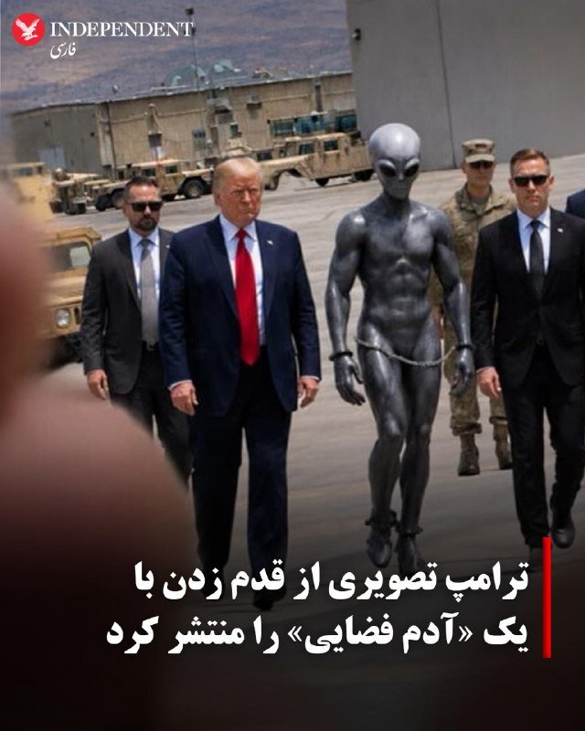

♦️دونالد ترامپ، رئیس جمهوری آمریکا، روز یکشنبه تصویری ساخته شده با هوش مصنوعی، از قدم زدن با یک موجود فضایی را در صفحه تروث سوشال به اشتراک گذاشت.

وزارت دفاع ایالات متحده، پیشتر در پی دستور مستقیم دونالد ترامپ، مجموعه‌ای از اسناد طبقه‌بندی‌شده و «دیده‌نشده» مربوط به اشیاء ناشناس پرنده (UFO) را که اکنون با نام رسمی «پدیده‌های ناهنجار ناشناخته» (UAP) معرفی می‌شوند، منتشر کرد.

پنتاگون گفته است، با دستور دونالد ترامپ از این پس شهروندان می‌توانند بدون نیاز به سطح دسترسی امنیتی، به ویدیوها، تصاویر و اسناد اصلی دولتی در این زمینه دسترسی داشته باشند.
‌🇸🇦 Indypersian

🤖 @VahidOOnLine

## VahidOOnLine — post 240803

  

ارتش اسرائیل می‌گوید در حمله‌ای هوایی به منطقه بعلبک در شرق لبنان، وائل محمود عبدالحلیم، فرمانده جهاد اسلامی در منطقه بقاع، کشته شده است. به گفته ارتش اسرائیل، او در هماهنگی عملیات‌های جهاد اسلامی در کنار حزب‌الله لبنان نقش داشته است.
‌🏁 🇬🇧 ManotoTV

🤖 @VahidOOnLine

## VahidOOnLine — post 240802

  

رویترز به نقل از یک مقام ارشد جمهوری اسلامی گزارش داد تهران از آمریکا خواسته همه دارایی‌ها و منابع مالی ایران را آزاد کند.

این مقام گفت پیشنهاد اصلاح‌شده تهران شامل پایان دائمی جنگ، لغو تحریم‌ها و بازگشایی تنگه هرمز است و موضوع هسته‌ای در مراحل بعدی مذاکرات مطرح خواهد شد.

او افزود واشینگتن تاکنون تنها با آزادسازی ۲۵ درصد از دارایی‌های مسدودشده ایران، آن هم بر اساس جدول زمانی مرحله‌ای، موافقت کرده است.
‌🏁 🇬🇧 IranintlTV

🤖 @VahidOOnLine

## VahidOOnLine — post 240801

♦️پرابوو سوبیانتو، رئیس‌جمهوری اندونزی، روز دوشنبه در مراسم تحویل تجهیزات جدید نیروی هوایی این کشور، با اجرای آیینی سنتی و نمادین روی یکی از جنگنده‌های رافال مخلوطی از آب و گلبرگ‌های تازه پاشید. این مراسم هم‌زمان با تحویل شش جنگنده و تجهیزات تازه نظامی برگزار شد.
پاشیدن آب حاوی برگ گل بر اجسام، رسمی سنتی در اندونزی است که نماد برکت، خوش‌یمنی و استقبال از تجهیزات یا دارایی‌های تازه است.
اندونزی پیش‌تر سه فروند جنگنده رافال را در ژانویه دریافت کرده بود و سه فروند دیگر نیز روز دوشنبه در پایگاه هوایی حلیم پرداناکوسوما تحویل داده شد.
پرابوو در سخنرانی خود گفت تقویت تجهیزات نظامی با هدف افزایش توان بازدارندگی در شرایط ژئوپولیتیکی نامطمئن جهان انجام می‌شود و در عین حال رویکرد دفاعی اندونزی حفظ خواهد شد. او همچنین تجهیزات نظامی دیگری از جمله هواپیماهای داسو فالکون، سامانه‌های راداری و تسلیحات پیشرفته را نیز به نیروهای مسلح تحویل داد.
‌🇸🇦 Indypersian

🤖 @VahidOOnLine

## VahidOOnLine — post 240800

در پی کارزار ایران‌اینترنشنال برای پیدا کردن هویت پیکر جاویدنامان در بیمارستان الغدیر تهران، جزییات تازه‌ای از چگونگی کشته شدن امیرپارسا اشکبوس به دست ما رسیده است؛ جاویدنامی که پیکر او در حیاط پشتی این بیمارستان رها شده بود.
فرنوش فرجی، خبرنگار ایران‌اینترنشنال گزارش می‌دهد.
‌🏁 🇬🇧 IranintlTV

🤖 @VahidOOnLine

## VahidOOnLine — post 240799

  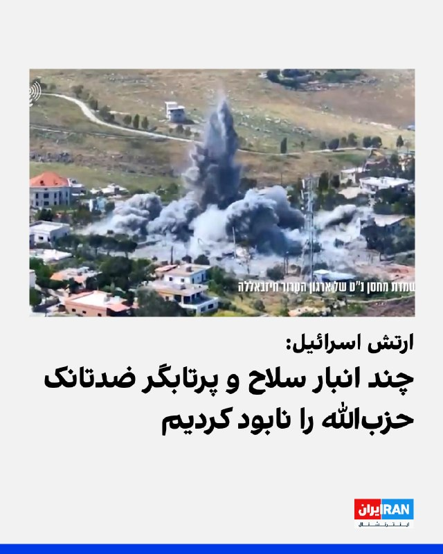

ارتش اسرائیل اعلام کرد نیروهای تیپ ۷۶۹ با پشتیبانی نیروی هوایی یک انبار سلاح ضدتانک حزب‌الله را منهدم کرده‌اند.
ارتش اسرائیل افزود در عملیاتی دیگر در منطقه خیام نیز انبارهای تسلیحات و مراکز استقرار این گروه نابود و پرتابگرهای ضدتانک، مواد منفجره و سلاح‌های سبک کشف شده است.
‌🏁 🇬🇧 IranintlTV

🤖 @VahidOOnLine

## VahidOOnLine — post 240798

  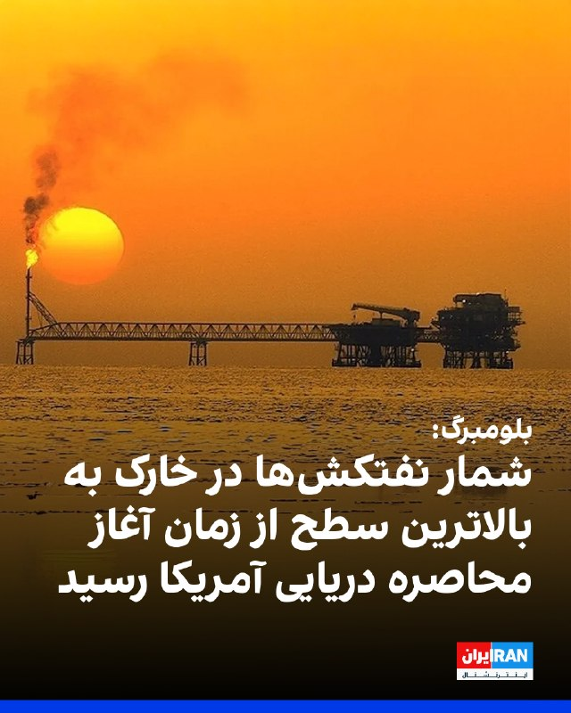

پایگاه خبری بلومبرگ گزارش داد هم‌زمان با ادامه تنش‌ها در خلیج فارس، شمار نفتکش‌های حاضر در اطراف جزیره خارک، مهم‌ترین پایانه صادرات نفت ایران، به بالاترین سطح از زمان آغاز محاصره دریایی آمریکا علیه بنادر ایران رسیده است.

بر اساس این گزارش که دوشنبه ۲۸ اردیبهشت منتشر شد، تصاویر ماهواره‌ای ثبت‌شده در ۲۶ اردیبهشت، حضور ۲۳ نفتکش را در اطراف جزیره خارک نشان می‌دهد.

این نفتکش‌ها یا در لنگرگاه‌های اطراف مستقر بوده‌اند یا در اسکله‌های بارگیری نفت خام و گاز مایع، پهلو گرفته‌اند.
‌🏁 🇬🇧 IranintlTV

🤖 @VahidOOnLine

## VahidOOnLine — post 240797

♦️همزمان با ۲۸ اردیبهشت‌ماه، روز بزرگداشت خیام نیشابوری، ویدیویی از یک مجلس «بزم» خیام‌خوانی در بوشهر بار دیگر در شبکه‌های اجتماعی پربازدید شده است.

در این ویدیو که نخستین بار چهار سال پیش در شبکه‌های اجتماعی منتشر شده بود، خانمی در بوشهر و قلیان به دست این رباعی مشهور خیام را می‌خواند و حاضران هم با دست زدن با او همنوایی می‌کنند:

«خیام اگر ز باده مستی خوش باش
با ماهرخی اگر نشستی خوش باش
چون عاقبت کار جهان نیستی است
انگار که نیستی چو هستی خوش باش»
‌🇸🇦 Indypersian

🤖 @VahidOOnLine

## VahidOOnLine — post 240796

  

♦️خبرگزاری العربیه، روز دوشنبه ۲۸ اردیبهشت ماه، بر اساس «جزئیات درزکرده» از آخرین نسخه پیشنهادی ایران به آمریکا، از مجموعه‌ای از خواسته‌ها و پیشنهادهای تازه تهران که بر آتش‌بس، تنگه هرمز و پرونده هسته‌ای تمرکز دارد، خبر داد.
طبق این گزارش، ایران خواستار یک آتش‌بس طولانی‌مدت و چندمرحله‌ای شده و همچنین درخواست کرده بازگشایی تنگه هرمز به‌صورت تدریجی و با تضمین‌های امنیتی انجام شود.
بر پایه این اطلاعات، تهران به‌جای برچیدن کامل برنامه هسته‌ای، با یک توقف طولانی‌مدت فعالیت‌های هسته‌ای موافقت کرده است. همچنین پیشنهاد شده انتقال ذخایر اورانیوم غنی‌شده به‌جای آمریکا، به‌صورت مشروط به روسیه انجام شود.
العربیه همچنین گزارش داده ایران از مطالبه دریافت غرامت عقب‌نشینی کرده، اما به‌جای آن خواستار تسهیلات و امتیازات اقتصادی شده است.
بر اساس این گزارش، ایران همچنین خواهان دریافت چندین تضمین بین‌المللی برای هرگونه توافق احتمالی است و تلاش دارد پرونده دریایی و موضوع تنگه هرمز را از پیچیدگی‌های مربوط به مذاکرات هسته‌ای جدا کند.
در بخش دیگری از این گزارش آمده است تهران خواستار نقش‌آفرینی پاکستان و عمان در مدیریت هرگونه تنش یا اصطکاک احتمالی در تنگه هرمز شده و همچنین بر استفاده از ادبیات و چارچوب سیاسی‌ای تاکید دارد که امکان «حفظ وجهه سیاسی جمهوری اسلامی» را فراهم کند
‌🇸🇦 Indypersian

🤖 @VahidOOnLine

## VahidOOnLine — post 240795

  

عباس گلرو، عضو کمیسیون امنیت ملی مجلس، محتوای آخرین پیشنهاد جمهوری اسلامی به آمریکا را «خوب» ارزیابی کرد.

گلرو گفت این طرح نشان می‌دهد تهران «بر یک سری مبانی و اصول اساسی مرتبط با حقوق خود اصرار دارد و در عین حال تلاش کرده است راه‌حل‌هایی نیز برای برون‌رفت از وضعیت موجود ارائه دهد».

او افزود: «توپ در زمین آمریکایی‌هاست. باید دید آیا آنها پای میز مذاکره می‌آیند یا خیر.»

این نماینده مجلس ادامه داد: «روند مذاکرات در یک فرایند ساختارمند و با عقل جمعی و حضور مقامات اتخاذ می‌شود. لذا مورد تایید است و انشالله باید همیشه از فضای سیاسی موجود حمایت کنیم.»
‌🏁 🇬🇧 IranintlTV

🤖 @VahidOOnLine

## VahidOOnLine — post 240794

  <a href="telegram/content/VahidOOnLine_240794_1779114336.mp4" target="_blank">🎬 Download video</a>

رویترز در گزارشی اختصاصی نوشت پاکستان در جریان جنگ ایران، هشت هزار نیرو، یک اسکادران جنگنده و یک سامانه پدافند هوایی به عربستان سعودی اعزام کرده است.

بر اساس این گزارش، این اعزام در چارچوب پیمان دفاعی دوجانبه اسلام‌آباد و ریاض انجام شده و شامل حدود ۱۶ جنگنده، عمدتا از نوع جی‌اف‌ـ۱۷ ساخت مشترک پاکستان و چین، دو اسکادران پهپاد و سامانه پدافند هوایی چینی اچ‌کیو‌ـ۹ است. منابع رویترز گفتند عربستان هزینه این اعزام را تامین می‌کند و تجهیزات را نیروهای پاکستانی اداره می‌کنند.

پنج منبع امنیتی و دولتی به رویترز گفتند این نیروها با هدف حمایت از ارتش عربستان در صورت حملات بیشتر به این کشور مستقر شده‌اند.
‌🏁 🇬🇧 ManotoTV

🤖 @VahidOOnLine

## VahidOOnLine — post 240793

  <a href="telegram/content/VahidOOnLine_240793_1779114336.mp4" target="_blank">🎬 Download video</a>

رسانه‌های ترکیه گزارش دادند فرخنده قائم‌مقامی، زن ایرانی ساکن منطقه مال‌تپه استانبول، پس از قتل، جسدش در استان قرشهر پیدا شده است.

بر اساس گزارش خبرگزاری «دمیراورن»، خانم قائم‌مقامی از ۲۲ فروردین ناپدید شده بود و نزدیکان او پس از بی‌خبری، در ۲۳ اردیبهشت گزارش مفقودی ثبت کردند.

پلیس ترکیه در تحقیقات خود «ارکان ب»، ۴۹ ساله، را به‌عنوان آخرین فردی شناسایی کرد که با این زن ایرانی در تماس بوده است. بنا بر این گزارش، او ابتدا اتهام‌ها را رد کرد، اما بعدا به قتل اعتراف کرد.

دمیراورن نوشت مظنون در اعترافات خود گفته است پس از مشاجره در خودرو، قائم‌مقامی را با قلاده سگش خفه کرده، جسد او را تکه‌تکه کرده و در زمینی خالی در شهرستان موجور استان قرشهر رها کرده است.

در ادامه تحقیقات، دو مظنون دیگر نیز بازداشت شدند. سه مظنون این پرونده پس از پایان بازجویی در اداره پلیس، به دادگاه منتقل شدند.
‌🏁 🇬🇧 ManotoTV

🤖 @VahidOOnLine

## VahidOOnLine — post 240792

  <a href="telegram/content/VahidOOnLine_240792_1779114336.mp4" target="_blank">🎬 Download video</a>

بر اساس گزارش رسانه‌های حقوق بشری، نیروهای حکومتی روز ۱۵ اردیبهشت با یورش به خانه «افسانه جذابی (راسخی)»، شهروند بهائی ساکن شیراز، منزل او را تفتیش کردند و بخشی از اموال شخصی او را با خود بردند.

در این گزارش‌ها آمده است یک زن و سه مرد با ارائه حکمی با عنوان «همکاری با اسرائیل» وارد خانه این خانواده شدند و خانم جذابی و مادر ۸۵ ساله او را مورد تهدید و تحقیر قرار دادند. خانم جذابی به‌تازگی همسر خود را از دست داده و از مادر سالخورده و بیمار خود مراقبت می‌کند.

به گفته این رسانه‌ها، ماموران حکومتی به او گفتند فرزندش در خارج از کشور در فضای مجازی و کمپین‌های حقوق بشری فعالیت می‌کند و تهدید کردند در صورت ادامه این فعالیت‌ها، «هم برای شما و هم برای آنها گران تمام می‌شود.» آنها همچنین این خانواده را به مصادره خانه تهدید کردند.

بر اساس این گزارش‌ها، نیروهای امنیتی همچنین این خانواده را با عباراتی مانند «فرقه» و «همدست اسرائیل» خطاب کردند و چند بار خانم جذابی را به دستبند زدن و انتقال به مکانی نامعلوم تهدید کردند.

این یورش چند ساعت ادامه داشت و در پایان، خانم جذابی و مادر سالخورده‌اش که دچار افت فشار خون شده بود، مجبور شدند برگه‌ای را امضا کنند که در آن نوشته شده بود هیچ خسارتی به خانه و وسایل وارد نشده است. در این رویداد هیچ‌یک از اعضای خانواده بازداشت نشدند.
‌🏁 🇬🇧 ManotoTV

🤖 @VahidOOnLine

## VahidOOnLine — post 240791

  <a href="telegram/content/VahidOOnLine_240791_1779114337.mp4" target="_blank">🎬 Download video</a>

روزنامه ایران وابسته به دولت جمهوری اسلامی در گزارشی نوشت محدودیت دسترسی به اینترنت بین‌الملل، بازار خرید و فروش سیم‌کارت‌های عراقی را در برخی مناطق مرزی غرب ایران رونق داده است.

بر اساس این گزارش، بیشترین متقاضیان این سیم‌کارت‌ها تجار، بازرگانان، صاحبان بار، رانندگان ترانزیتی و فعالان اقتصادی مرزی هستند که برای ارتباط با طرف‌های عراقی، ارسال اسناد، حواله‌های مالی، رسیدها، عکس و فیلم کالاها از پیام‌رسان‌هایی مانند واتس‌اپ و تلگرام استفاده می‌کنند.

نعیم احمدی، مدیر روابط عمومی استانداری خوزستان، به این روزنامه گفت این سیم‌کارت‌ها در عمق یک تا دو کیلومتری خاک ایران قابل استفاده‌اند و در مناطقی مانند شلمچه، چذابه، خرمشهر، اروندکنار و جزیره مینو به گزینه‌ای در دسترس برای فعالان اقتصادی تبدیل شده‌اند. به گفته او، ارزانی این سیم‌کارت‌ها در مقایسه با هزینه فیلترشکن‌ها از عوامل گرایش به آنهاست.

در همین حال، محمد شفیعی، فرماندار قصرشیرین، استفاده از سیم‌کارت‌های عراقی در کرمانشاه را عمدتا محدود به تجار، صاحبان بار، رانندگان ترانزیتی و فعالان اقتصادی دانست و فراگیر شدن آن در میان عموم مردم را رد کرد.
‌🏁 🇬🇧 ManotoTV

🤖 @VahidOOnLine

## VahidOOnLine — post 240790

  

فریدریش مرتس، صدراعظم آلمان، حملات تازه جمهوری اسلامی علیه کشورهای منطقه را به‌شدت محکوم کرد و گفت حمله به تأسیسات هسته‌ای «تهدیدی برای امنیت مردم در سراسر منطقه» است.

او در پیامی در ایکس تأکید کرد که نباید خشونت‌ها بیش از این تشدید شود و از جمهوری اسلامی خواست وارد مذاکرات جدی با آمریکا شود، تهدید همسایگانش را متوقف کند و تنگه هرمز را بدون محدودیت باز کند.

این موضع‌گیری پس از آن مطرح شد که امارات از آتش‌سوزی در محدوده نیروگاه هسته‌ای براکه پس از حمله پهپادی خبر داد. مقام‌های اماراتی اعلام کردند این حادثه تلفات جانی و خطر تشعشعاتی نداشته است. عربستان سعودی نیز هم‌زمان از رهگیری حملات پهپادی تازه خبر داده است.

فریدریش مرتس، صدراعظم آلمان، حملات تازه منسوب به جمهوری اسلامی علیه کشورهای منطقه را محکوم کرد و گفت حمله به تأسیسات هسته‌ای امنیت مردم منطقه را تهدید می‌کند.

او از جمهوری اسلامی خواست وارد مذاکرات جدی با آمریکا شود، تهدید همسایگانش را متوقف کند و تنگه هرمز را بدون محدودیت باز کند. این موضع‌گیری پس از حمله پهپادی به محدوده نیروگاه هسته‌ای براکه در امارات و رهگیری حملات پهپادی تازه از سوی عربستان مطرح شده است.
‌🏁 🇬🇧 ManotoTV

🤖 @VahidOOnLine

## VahidOOnLine — post 240789

  

روزنامه نیویورک تایمز به نقل از دو مقام خاورمیانه‌ای گزارش داد که ایالات متحده و اسرائیل در حال انجام آماده‌سازی‌های «گسترده» برای احتمال ازسرگیری حملات علیه جمهوری اسلامی هستند.

این مقام‌ها احتمال دادند که حملات ممکن است در هفته جاری آغاز شود.

به نوشته این روزنامه، این سطح از آمادگی نظامی از زمان اجرای آتش‌بس بی‌سابقه بوده است.
‌🏁 🇬🇧 IranintlTV

🤖 @VahidOOnLine

## VahidOOnLine — post 240788

  

♦️خبرگزاری تسنیم وابسته به سپاه پاسداران، روز دوشنبه ۲۸ اردیبهشت، به نقل از یک منبع نزدیک به تیم مذاکره‌کننده گزارش داد آمریکا در متن جدید پیشنهادی خود، برخلاف متون پیشین، پذیرفته است تحریم‌های نفتی ایران را «در طول دوره مذاکرات» به‌طور موقت تعلیق کند.
به گفته این منبع، آمریکایی‌ها در متن جدید با «تعلیق موقت» (Waive) تحریم‌های نفتی ایران موافقت کرده‌اند. «ویو» به معنای معافیت یا چشم‌پوشی موقت از اجرای تحریم‌ها است و به معنای لغو کامل و دائمی آن‌ها محسوب نمی‌شود.
بر اساس این گزارش، تیم مذاکره‌کننده ایرانی همچنان بر این موضع تاکید دارد که لغو همه تحریم‌های ایران باید بخشی از تعهدات آمریکا باشد. در مقابل، واشنگتن پیشنهاد داده است معافیت‌های مرتبط با اوفک (دفتر کنترل دارایی‌های خارجی وزارت خزانه‌داری آمریکا) تنها تا زمان دستیابی به تفاهم نهایی اعمال شود.
به گزارش تسنیم، این تغییر در متن جدید آمریکا نسبت به پیشنهادهای قبلی، تحول تازه‌ای در روند مذاکرات به شمار می‌رود.
‌🇸🇦 Indypersian

🤖 @VahidOOnLine

## VahidOOnLine — post 240787

♦️بیست‌وهشتم اردیبهشت در تقویم ایران روز بزرگداشت حکیم عمر خیام نیشابوری، فیلسوف، ادیب، ریاضی‌دان و اخترشناس بزرگ ایرانی است.

آرامگاه خیام در شهر نیشابور، به همت استاد هوشنگ سیحون، یکی از پیشگامان معماری نوین ایران، در سال ۱۳۴۲ بنا شد.

این معمار صاحب‌نام ایرانی چند سال پیش در گفتگو با رسانه محلی عصر نیشابور گفته بود: «این بنا را بر اساس شعر خود خیام و غرق در گل و سبزه ساخته است.»
‌🇸🇦 Indypersian

🤖 @VahidOOnLine

## mwarmonitor — post 9250

🇮🇷 منبع ایرانی به رویترز: آمریکا در مورد محدودیت‌های اعمال‌شده بر برنامه هسته‌ای انعطاف نشان داده است؛ ما موضوع هسته‌ای را در مراحل بعدی مورد بحث قرار خواهیم داد. @mwarmonitor

## mwarmonitor — post 9249

🔴 منبع آمریکایی به الجزیره: صبر رئیس‌جمهور ترامپ به‌دلیل عدم پیشرفت در پرونده ایران رو به پایان است.

@mwarmonitor

## mwarmonitor — post 9248

🔴پیشنهاد اصلاح‌شده تهران به آمریکا شامل پایان دائمی جنگ، لغو تحریم‌ها، بازگشایی تنگه هرمز و آزادسازی دارایی‌های بلوکه‌شده ایران است. 🔸گزارش‌ها حاکی است که ایران درباره برنامه هسته‌ای خود در مراحل بعدی مذاکرات گفت‌وگو خواهد کرد - رویترز @mwarmonitor

## mwarmonitor — post 9247

🇺🇸🇵🇰🇮🇷پاکستان شامگاه یکشنبه یک پیشنهاد اصلاح‌شده از سوی ایران را با ایالات متحده به اشتراک گذاشت که هدف آن پایان دادن به جنگ است — رویترز @mwarmonitor

## mwarmonitor — post 9246

🇮🇷🇺🇸ایران بنا بر گزارش‌ها با یک «فریز بلندمدت برنامه هسته‌ای» به‌جای برچیدن کامل آن موافقت کرده و در مقابل، به‌دنبال امتیازات اقتصادی به‌جای غرامت است؛ این موضوع طبق جزئیات افشاشده از پیشنهاد اصلاح‌شده ایران که توسط شبکه سعودی «العربیه» به دست آمده، گزارش شده است.

@mwarmonitor

## mwarmonitor — post 9245

  <a href="telegram/content/mwarmonitor_9245_1779114340.mp4" target="_blank">🎬 Download video</a>

📝این فاحشه‌خانه‌ی فکری و لجن‌زارِ متعفنِ صداوسیما، غایتِ وقاحت و مسخ‌شدگیِ جماعتی است که مغزشان با خون، خشونت و باروت شستشو داده شده است. موجودی متوهم با لبخندی کریه، ابزارِ آدم‌کشی و پهپاد انتحاری را به عنوان مهریه به زنی ذوب‌شده در حماقت پیشکش می‌کند؛ و در کنارشان، آن آخوندِ دوزاری و مجریِ جیره‌خوار که شغلِ شریفشان سال‌هاست شرعی‌سازیِ کثافت‌کاری‌ها، صیغه‌بازی و دلالتِ مذهبی است، با رذالتی مشمئزکننده برای قیمتِ این آلتِ قتل چرتکه می‌اندازند. این نمایشِ مالامال از نجاست، ویترینِ سقوطِ مطلقِ شرف و انسانیتِ قشری است که از فلاکت و مرگ تغذیه می‌کنند و حتی پیوند ازدواج را هم به گندِ ایدئولوژیِ خون‌بار و وحشیانه‌ی خود می‌کشند.

@mwarmonitor

## mwarmonitor — post 9244

🔴سناتور لیندسی گراهام ؛

🔸من کاملاً اطمینان دارم که رئیس‌جمهور ترامپ به‌طور کامل وضعیت مربوط به ایران را درک می‌کند و دیگر ادامه نخواهد داد که عدم تمایل به مذاکره با حسن نیت، همراه با اقدامات تهاجمی و سرکشانه ایران در تنگه هرمز و سراسر منطقه را تحمل کند.

🔸برای من کاملاً روشن است که ایران از نظر نظامی و اقتصادی به‌شدت تضعیف شده است. اما در عین حال، جسورتر و تهاجمی‌تر نیز شده است.

🔸یک پاسخ کوتاه اما قاطع در این مقطع می‌تواند کل این درگیری را به شکل درستی بازتنظیم کند.

🔸در مورد ایران، ضروری است که از موضع قدرت و برتری وارد مذاکره شویم. باید کاری را که آغاز کرده‌ایم به پایان برسانیم. من نگرانم که ادامه مذاکرات بدون یک پاسخ قاطع، این درگیری را طولانی‌تر کند، باعث تردید در میان متحدان ما شود و رژیم تروریستی ایران را بیش از پیش جسورتر سازد.

@mwarmonitor

## mwarmonitor — post 9243

  

🔴یک عکس منتشرشده در DVIDS در تاریخ ۷ مه، یک پرتابگر سامانه THAAD ارتش آمریکا را در منطقه مسئولیت فرماندهی مرکزی آمریکا (CENTCOM) نشان می‌دهد.

🔸به نظر می‌رسد این تصویر در واقع در محل استقرار THAAD در بیابان نقب اسرائیل گرفته شده باشد (مختصات: 31°30'04.5"N 34°48'33.3"E)، با توجه به تطابق زمین اطراف و دیوارهای بتنی ضد انفجار مشابه.

@mwarmonitor

## mwarmonitor — post 9242

  

🔴سیستم راکت‌انداز M142 HIMARS ارتش آمریکا در تصاویری که در وب‌سایت DVIDS منتشر شده و مربوط به ۱۴ مه و ۶ مه است، در منطقه تحت مسئولیت فرماندهی مرکزی آمریکا (CENTCOM) مشاهده شده است.

🔸این سامانه‌ها احتمالاً در بحرین یا کویت مستقر هستند؛ جایی که پیش‌تر نیز در جریان عملیات «Epic Fury» حملاتی علیه ایران انجام داده بودند.

@mwarmonitor

## mwarmonitor — post 9240

🇸🇦🇵🇰پاکستان در چارچوب یک پیمان دفاعی مشترک، ۸۰۰۰ سرباز، یک اسکادران جنگنده و یک سامانه پدافند هوایی را به عربستان سعودی اعزام کرده است. این اقدام همکاری نظامی اسلام‌آباد با ریاض را تقویت می‌کند، در حالی که اسلام‌آباد همچنان به‌عنوان میانجی اصلی در جنگ ایران عمل می‌کند. رویترز

@mwarmonitor

## mwarmonitor — post 9239

🇮🇱🇺🇸ایالات متحده و اسرائیل در حال انجام آماده‌سازی‌های فشرده‌ای هستند — بزرگ‌ترین سطح آماده‌سازی از زمان برقراری آتش‌بس — برای احتمال ازسرگیری حملات علیه ایران، که ممکن است از همین هفته آغاز شود، به گفته دو مقام خاورمیانه‌ای — نیویورک تایمز

@mwarmonitor

## mwarmonitor — post 9238

  <a href="telegram/content/mwarmonitor_9238_1779114342.mp4" target="_blank">🎬 Download video</a>

🚢این نفتکش LPG که تحت تحریم‌های آمریکا قرار دارد، دو روز پیش (۱۶ مهٔ ۲۰۲۶) موفق شد در جزیره خارک ایران در مختصات 29.21431، 50.33619 گاز مایع بارگیری کند.

🚢این کشتی آخرین بار حدود دو هفته پیش در سامانه AIS در سواحل هند سیگنال ارسال کرده بود و سپس بدون شناسایی، از خط محاصره نیروی دریایی آمریکا عبور کرد. TANKER TRACKER

🔴بلومبرگ به نقل از تصاویر ماهواره‌ای: حدود ۲۳ نفتکش در نزدیکی جزیره خارک مشاهده شده‌اند که این بزرگ‌ترین تجمع از زمان آغاز محاصره آمریکا است.

@mwarmonitor

## mwarmonitor — post 9237

  

✈️یک فروند هواپیمای گلف‌استریم G-V «نخشون شاویت» نیروی هوایی اسرائیل، که برای شنود سیگنالی (SIGINT) و شناسایی به‌کار می‌رود، هم‌اکنون در حال انجام مأموریت ISR (اطلاعات، مراقبت و شناسایی) بر فراز شرق دریای مدیترانه و در سواحل مصر است.

@mwarmonitor

## pm_afshaa — post 90954

  

👩‍💻کانفیگ اضطراری موجود شد! 
🛍 series Basic • 1G 140 
💵 • 2G 280
💵 • 3G 420
💵 • 4G 560
💵 • 5G 700
💵 • 10G 1400
💵 • 20G 2800 
💵 • 30G 4200
💵 
📌مناسب استفاده روزمره و اقتصادی 
📌سرعت مناسب برای استفاده عادی 
📌پینگ 140تا350 
📌مناسب تلگرام.وب گردی . اینستاگرام 
❗️ممکنه…

## pm_afshaa — post 90952

👩‍💻کانفیگ اضطراری موجود شد!

🛍 series Basic

• 1G 140 
💵
• 2G 280
💵
• 3G 420
💵
• 4G 560
💵
• 5G 700
💵
• 10G 1400
💵
• 20G 2800 
💵
• 30G 4200
💵

📌مناسب استفاده روزمره و اقتصادی

📌سرعت مناسب برای استفاده عادی

📌پینگ 140تا350

📌مناسب تلگرام.وب گردی . اینستاگرام

❗️ممکنه در بعضی ساعات شلوغی افت سرعت داشته باشه

✔️ بدونه محدودیت زمان و کاربر هستن

✔️ساب لینک جهت دیدن حجم

✔️بدونه حتی ۱ درصد ضریب تمامی سرور ها

⚠️همه سرویس ضمانت بازگشت وجه دارند

@n9neebot

## pm_afshaa — post 90951

  <a href="telegram/content/pm_afshaa_90951_1779114345.webm" target="_blank">🎬 Download video</a>

🔴نیویورک تایمز: پنتاگون برای از سرگیری جنگ با ایران در روزهای آینده آماده می‌شود 
💧 Rainbet.com the #1 Non-KYC Crypto Casino & Sportsbook @rainbetcom 
😁 @Pm_Afshaa

## pm_afshaa — post 90950

  <a href="telegram/content/pm_afshaa_90950_1779114345.webm" target="_blank">🎬 Download video</a>

🔴سناتور لیندسی گراهام: من کاملاً اطمینان دارم که رئیس‌جمهور ترامپ به‌طور کامل وضعیت مربوط به ایران رو درک میکنه و دیگه عدم تمایل به مذاکره با حسن نیت، همراه با اقدامات تهاجمی و سرکشانه ایران تو تنگه هرمز و سراسر منطقه رو تحمل نخواهد کرد.

💧 Rainbet.com the #1 Non-KYC Crypto Casino & Sportsbook @rainbetcom

😁 @Pm_Afshaa

## pm_afshaa — post 90949

  <a href="telegram/content/pm_afshaa_90949_1779114346.webm" target="_blank">🎬 Download video</a>

🔴تسنیم به نقل از یک منبع نزدیک به تیم مذاکره‌کننده:

آمریکا در متن جدید خودش پذیرفته که تحریم‌های نفتی ایران رو در طول دوره مذاکرات به‌صورت موقت تعلیق (Waive) کنه.

طبق این گزارش، جمهوری اسلامی همچنان بر لغو کامل همه تحریم‌ها تاکید داره، اما آمریکا فعلا فقط معافیت موقت تحریم‌ها تا زمان رسیدن به تفاهم نهایی رو مطرح کرده.

💧 Rainbet.com the #1 Non-KYC Crypto Casino & Sportsbook @rainbetcom

😁 @Pm_Afshaa

## pm_afshaa — post 90948

🔴نیویورک تایمز: پنتاگون برای از سرگیری جنگ با ایران در روزهای آینده آماده می‌شود

💧 Rainbet.com the #1 Non-KYC Crypto Casino & Sportsbook @rainbetcom

😁 @Pm_Afshaa

## pm_afshaa — post 90947

  <a href="telegram/content/pm_afshaa_90947_1779114346.webm" target="_blank">🎬 Download video</a>

🔴رویترز: پاکستان 8 هزار نیروی نظامی به همراه یک اسکادران جنگنده و سامانه پدافند هوایی به عربستان سعودی اعزام کرده.

طبق این گزارش، این نیروها برای حمایت از عربستان در صورت ازسرگیری حملات احتمالی مستقر شدن. این تحرک در حالی انجام میشه که پاکستان همزمان نقش میانجی میان تهران و واشینگتن رو هم بر عهده داره.

💧 Rainbet.com the #1 Non-KYC Crypto Casino & Sportsbook @rainbetcom

😁 @Pm_Afshaa

## pm_afshaa — post 90946

  <a href="telegram/content/pm_afshaa_90946_1779114347.webm" target="_blank">🎬 Download video</a>

🔴ترامپ: اونا یه برگه می‌فرستن که هیچ ربطی به چیزی که توافق کرده بودیم نداره، منم میگم، شماها دیوونه‌اید یا چی؟

💧 Rainbet.com the #1 Non-KYC Crypto Casino & Sportsbook @rainbetcom

😁 @Pm_Afshaa

## pm_afshaa — post 90945

🔴کانال 12 اسرائیل: در پیشنهاد جدید ایران هیچ اشاره‌ای به هرمز و اورانیوم غنی‌شده نشده

💧 Rainbet.com the #1 Non-KYC Crypto Casino & Sportsbook @rainbetcom

😁 @Pm_Afshaa

## iaghapour — post 2618

  

⭕️ دیگه پول فیلترشکن نده! آموزش ساخت فیلترشکن شخصی و رایگان با سرعت بالا 😎

🔹در این آموزش قدم‌به‌قدم بهت یاد می‌دم که چطور بدون نیاز به دانش خاصی، یک فیلترشکن (VPN) شخصی، امن و کاملاً رایگان برای خودت بسازی. این روش روی تمام اینترنت‌ها جواب می‌ده و سرعت خوبی برای تماشای یوتیوب، وب‌گردی و … داره.

🔗 تماشا ویدیو در یوتیوب

🔗 دانلود ویدیو با لینک مستقیم (بزودی)

#آموزش #فیلترشکن #رایگان #novaproxy
برای دور زدن فیلترینگ و آموزش تکنولوژی و هوش مصنوعی ما رو دنبال کنید 💚
🆔@iaghapour

## DEJradio — post 4699

  <a href="telegram/content/DEJradio_4699_1779114348.mp4" target="_blank">🎬 Download video</a>

🤡
🔺 ترس حکومت از نارضایتی‌های عمومی؛ آموزش کاربرد سلاح در تجمعات شبانه!

#تجمعات_حکومتی #شیفت_شب
@DEJradio

## DEJradio — post 4698

  <a href="telegram/content/DEJradio_4698_1779114349.mp4" target="_blank">🎬 Download video</a>

🔺🎥 ‏ماه‌ها پیش از آنکه دو پایگاه مخفی اسرائیل در عراق شناسایی شوند، یک چوپان ویدیویی از پرواز دو هواپیمای ترابری در بیابان‌های میان عراق و اردن منتشر کرد. اکنون رسانه‌ها با استناد به این ویدیو فعالیت پایگاه‌های مخفی اسرائیل را تایید می‌کنند.

#اسرائیل #عراق
@DEJradio

## DEJradio — post 4695

  <a href="telegram/content/DEJradio_4695_1779114350.webm" target="_blank">🎬 Download video</a>

🚨📢 روزنامه «نیویورک‌تایمز» گزارش داد اسرائیل ماه‌ها دو پایگاه مخفی را در بیابان‌های عراق برای پشتیبانی از عملیات علیه رژیم ایران پنهان نگه داشته بود.

بر اساس این گزارش، اسرائیل بیش از یک سال برای آماده‌سازی یکی از این پایگاه‌ها برنامه‌ریزی و فعالیت کرده بود. نیویورک‌تایمز به نقل از مقام‌های منطقه‌ای نوشت این تأسیسات به‌صورت محرمانه برای پشتیبانی از عملیات اسرائیل علیه جمهوری اسلامی ایران مورد استفاده قرار می‌گرفت.

این روزنامه همچنین گزارش داد مقام‌های عراقی بعداً وجود دومین پایگاه مخفی را نیز تأیید کرده‌اند.

ادعا شده این پایگاه را نیز یک چوپان کشف کرده است. سرلشکر علی الحمدانی فرمانده نیروهای فرات غربی ارتش عراق، گفت ارتش یک ماه قبل از آنکه یک چوپان پایگاه را شناسایی کند، به حضور اسرائیل در بیابان مشکوک شده بود اما سپهبد سعد معن، سخنگوی نیروهای امنیتی عراق، به تایمز گفت: «عراق هیچ اطلاعاتی درباره مکان هیچ پایگاه نظامی اسرائیلی ندارد.»

به گفته ژنرال الحمدانی، برای هفته‌ها بادیه‌نشین‌ها در بیابان غربی عراق فعالیت‌های نظامی غیرعادی را به فرماندهی منطقه‌ای عراق گزارش می‌کردند.
او گفت ارتش تصمیم گرفت نزدیک نشود و در عوض از فاصله دور «نظارت اطلاعاتی» انجام دهد؛ زیرا فرماندهان مشکوک بودند نیروهای اسرائیلی در منطقه حضور دارند. آن‌ها از همتایان آمریکایی خود درخواست اطلاعات کردند، اما پاسخی دریافت نکردند.

پیش از این فیلمی که از سوی یک چوپان در مرزهای عراق منتشر شده بود، نشان می‌داد که دو هواپیمای سی۱۳۰ در ارتفاع پایین در غرب عراق در حال پرواز هستند و با انتشار این گزارش، این فیلم مورد توجه جدی قرار گرفته است.
اکنون مشخص نیست آیا عدم شناسایی پایگاه‌های اسراییل در عراق ناتوانی و بی‌عرضگی ارتش عراق است یا همکاری غیرمستقیم آنها با ارتش اسرائیل.

#اسرائیل #جنگ #عراق
@DEJradio

## VahidOnline — post 75536

خبرگزاری تسنیم، وابسته به سپاه پاسداران، روز دوشنبه ۲۸ اردیبهشت ماه به نقل از «یک منبع نزدیک به تیم مذاکره‌کننده» جمهوری اسلامی نوشت که تهران «جدیدترین متن خود را در ۱۴ بند به واسطه پاکستانی تحویل داده است و میانجی پاکستانی آن را به آمریکایی‌ها ارائه می‌کند.»
ساعتی پیش از انتشار این خبر رویترز به نقل از یک مقام پاکستانی گزارش کرده بود که اسلام‌آباد یکشنبه شب طرح پیشنهادی اصلاح‌شده جمهوری اسلامی ایران را به واشنگتن تحویل داده است.
@VahidOOnLine
خبرگزاری العربیه، روز دوشنبه ۲۸ اردیبهشت ماه، بر اساس «جزئیات درزکرده» از آخرین نسخه پیشنهادی ایران به آمریکا، از مجموعه‌ای از خواسته‌ها و پیشنهادهای تازه تهران که بر آتش‌بس، تنگه هرمز و پرونده هسته‌ای تمرکز دارد، خبر داد.
طبق این گزارش، ایران خواستار یک آتش‌بس طولانی‌مدت و چندمرحله‌ای شده و همچنین درخواست کرده بازگشایی تنگه هرمز به‌صورت تدریجی و با تضمین‌های امنیتی انجام شود.
بر پایه این اطلاعات، تهران به‌جای برچیدن کامل برنامه هسته‌ای، با یک توقف طولانی‌مدت فعالیت‌های هسته‌ای موافقت کرده است. همچنین پیشنهاد شده انتقال ذخایر اورانیوم غنی‌شده به‌جای آمریکا، به‌صورت مشروط به روسیه انجام شود.
العربیه همچنین گزارش داده ایران از مطالبه دریافت غرامت عقب‌نشینی کرده، اما به‌جای آن خواستار تسهیلات و امتیازات اقتصادی شده است.
بر اساس این گزارش، ایران همچنین خواهان دریافت چندین تضمین بین‌المللی برای هرگونه توافق احتمالی است و تلاش دارد پرونده دریایی و موضوع تنگه هرمز را از پیچیدگی‌های مربوط به مذاکرات هسته‌ای جدا کند.
در بخش دیگری از این گزارش آمده است تهران خواستار نقش‌آفرینی پاکستان و عمان در مدیریت هرگونه تنش یا اصطکاک احتمالی در تنگه هرمز شده و همچنین بر استفاده از ادبیات و چارچوب سیاسی‌ای تاکید دارد که امکان «حفظ وجهه سیاسی جمهوری اسلامی» را فراهم کند
@VahidOOnLine

📡 @VahidOnline

## VahidOnline — post 75535

  

♦️خبرگزاری تسنیم وابسته به سپاه پاسداران، روز دوشنبه ۲۸ اردیبهشت، به نقل از یک منبع نزدیک به تیم مذاکره‌کننده گزارش داد آمریکا در متن جدید پیشنهادی خود، برخلاف متون پیشین، پذیرفته است تحریم‌های نفتی ایران را «در طول دوره مذاکرات» به‌طور موقت تعلیق کند.
به گفته این منبع، آمریکایی‌ها در متن جدید با «تعلیق موقت» (Waive) تحریم‌های نفتی ایران موافقت کرده‌اند. «ویو» به معنای معافیت یا چشم‌پوشی موقت از اجرای تحریم‌ها است و به معنای لغو کامل و دائمی آن‌ها محسوب نمی‌شود.
بر اساس این گزارش، تیم مذاکره‌کننده ایرانی همچنان بر این موضع تاکید دارد که لغو همه تحریم‌های ایران باید بخشی از تعهدات آمریکا باشد. در مقابل، واشنگتن پیشنهاد داده است معافیت‌های مرتبط با اوفک (دفتر کنترل دارایی‌های خارجی وزارت خزانه‌داری آمریکا) تنها تا زمان دستیابی به تفاهم نهایی اعمال شود.
به گزارش تسنیم، این تغییر در متن جدید آمریکا نسبت به پیشنهادهای قبلی، تحول تازه‌ای در روند مذاکرات به شمار می‌رود.
@VahidOOnLine

📡 @VahidOnline

## VahidOnline — post 75534

  

خبرگزاری رویترز به نقل از منابع آگاه گزارش داد پاکستان در چارچوب پیمان دفاعی خود با عربستان سعودی، ۸ هزار نیروی نظامی به همراه یک اسکادران جنگنده و سامانه پدافند هوایی به این کشور اعزام کرده است.

به گزارش رویترز، این نیروها از توان عملیاتی برخوردارند و با هدف حمایت از عربستان سعودی در صورت ازسرگیری حملات علیه این کشور مستقر شده‌اند.

این تحرک نظامی در حالی صورت می‌گیرد که پاکستان نقش اصلی میانجی‌گری میان تهران و واشینگتن را بر عهده دارد.
@VahidOOnLine

📡 @VahidOnline

## VahidOnline — post 75533

  

رئیس کل دادگستری آذربایجان غربی روز دوشنبه ۲۸ اردیبهشت از توقیف اموال ۱۲۹ نفر در این استان با اتهامات امنیتی خبر داد.

ناصر عتباتی از این افراد با عنوان «گروهک‌های ضدانقلاب و تجزیه‌طلب» نام برد و آن‌ها را به «اقدامات ضدامنیتی و همکاری با کشورهای متخاصم» متهم و اعلام کرد که اموال آن‌ها به «نفع ملت» مصادره شده است.

دادگستری آذربایجان غربی اسامی این افراد را اعلام نکرده و برای اتهامات علیه این افراد شواهد و مدارکی ارائه نداده است.

پیش از این نیز گزارش‌های متعددی از توقیف اموال شماری از روزنامه‌نگاران، فعالان سیاسی و مدنی، هنرمندان، ورزشکاران و چهره‌های شناخته‌شده با اتهامات مشابه منتشر شده بود.
@VahidHeadline

📡 @VahidOnline

## VahidOnline — post 75532

  

دونالد ترامپ، رئیس‌جمهور آمریکا می‌گوید مقامات حکومت ایران برای امضای توافق با آمریکا «می‌میرند».

او در گفت‌و‌گو با نشریه تجاری «فورچون» افزوده با این حال آنها در جریان مذاکرات، «روی یک چیزی توافق می‌کنند»، اما «بعد یک کاغذی برایتان می‌فرستند که هیچ ارتباطی با توافقی که کرده‌اید ندارد. من می‌گویم: ‘شما دیوانه‌اید؟’»

ترامپ در این گفت‌و‌گو همچنین بر این نکته تأکید کرده که مقامات جمهوری اسلامی «مدام فریاد می‌زنند» و سروصدا می‌کنند، اما در عمل «تشنه توافق» هستند.
@VahidHeadline

📡 @VahidOnline

## VahidOnline — post 75530

سخنگوی وزارت خارجه ایران می‌گوید روند مذاکرات تهران و واشینگتن، «ادامه‌دار» است و حکومت ایران از ایالات متحده، «اصلاحاتی» در پاسخ به طرح پیشنهادی خود دریافت کرده است.
اسماعیل بقائی در نشست خبری روز دوشنبه ۲۸ اردیبهشت گفت: هفته گذشته، علی‌رغم این‌که طرف‌های آمریکایی به‌صورت علنی اعلام کردند طرح پیشنهادی ایران مردود است «اما ما از طرف میانجی پاکستانی مجموعه نکات و ملاحظات اصلاحی را از نظر آن‌ها دریافت کردیم».
او افزود ایران بعد از این‌که طرح ۱۴ بندی خود را ارائه کرد، «طرف آمریکایی ملاحظاتش را مطرح کرد. متقابلاً ما نیز ملاحظات خود را مطرح کردیم. از روز بعد از ارسال نقطه‌نظر آمریکایی از طرف پاکستان، ما با مجموعه‌ای از پیشنهادات طرف مقابل مواجه شدیم که در این چند روز بررسی شد».
سخنگوی وزارت خارجه ایران به‌دلیل آنچه تبادل «نقطه‌نظرات متقابل» طرفین به یکدیگر نامیده، تأکید کرد که «بنابراین، روند [مذاکرات ]از طریق پاکستان ادامه دارد».
بقائی جزئیاتی در مورد اصلاحات مدنظر ایالات متحده ارائه نکرد.
@VahidHeadline
او همچنین آمریکا را به «خیانت به دیپلماسی» متهم کرد و گفت واشینگتن دیگر «به‌عنوان یک طرف معتبر» در عرصه بین‌المللی تلقی نمی‌شود.
سخنگوی وزارت خارجه جمهوری اسلامی تاکید کرد تهران در مذاکرات با آمریکا همچنان خواهان آزادسازی دارایی‌های بلوکه‌شده ایران و دریافت غرامت جنگی است و این مطالبات را «حق ایران» توصیف کرد.
بقایی همچنین درباره تردد کشتی‌ها در تنگه هرمز گفت موضوع ترتیبات جدید امنیتی در این آبراه صرفا «مالی» نیست و هدف اصلی، حفظ امنیت تردد دریایی و صیانت از «حاکمیت ملی ایران» است.
او همچنین در واکنش به گزارش حمله به یک کشتی کره جنوبی در تنگه هرمز، بدون اشاره مستقیم به عامل حمله گفت «نباید عملیات‌های پرچم دروغین را دست‌کم گرفت» و مدعی شد هنوز مشخص نیست این حادثه توسط چه بازیگری در منطقه انجام شده است.
@VahidHeadline
اسماعیل بقایی، سخنگوی وزارت خارجه جمهوری اسلامی، در پاسخ به پرسشی درباره گزارش‌ها از قصد امارات متحده عربی برای حمله به جمهوری اسلامی و سفر مقام‌های اسرائیلی به این کشور گفت: «ما قرار نیست با گزارش‌ها این واقعیت را از یاد ببریم که تهدید اصلی کدام طرف است.»
بقایی با تهدید کشورهای منطقه از جمله امارات متحده عربی گفت: « اماراتی‌ها از اتفاقاتی که در دو سه ماه اخیر افتاد باید درس بگیرند.»
@VahidOOnLine

📡 @VahidOnline

## VahidOnline — post 75529

  

«نت‌بلاکس» نهاد ناظر بر آزادی اینترنت اعلام کرد قطعی و محدودیت اینترنت در ایران وارد هشتادمین روز خود شده و مدت این خاموشی تاکنون از ۱۸۹۶ ساعت عبور کرده است.

نت‌بلاکس همچنین گزارش داده که هم‌زمان با ادامه محدودیت‌های اینترنتی، محتواهایی در حمایت از حکومت، شبکه‌های اجتماعی در ایران را پر کرده است.

بر اساس این گزارش، برخی شهروندان ایرانی که تلاش کرده‌اند به اینترنت موسوم به «سیم کارت سفید» یا اینترنت ویژه (اینترنت پرو) دسترسی پیدا کنند، گفته‌اند از آن‌ها خواسته شده سهمیه مشخصی از پست‌های تبلیغاتی روزانه در حمایت از حکومت را در صفحات اجتماعی خود منتشر کنند.
@VahidHeadline

📡 @VahidOnline

## VahidOnline — post 75528

  

سازمان عفو بین‌الملل روز دوشنبه ۲۸ اردیبهشت گزارش داد که ایران در سال ۲۰۲۵ تعداد «بی‌سابقه» دو هزار و ۱۵۹ نفر را اعدام کرده است؛ رقمی که باعث افزایش آمار جهانی تا بالاترین سطح از سال ۱۹۸۱ به این سو شده است.

این سازمان مستقر در لندن اعلام کرد که در سال ۲۰۲۵ دست‌کم دو هزار و ۷۰۷ نفر در سراسر جهان اعدام شده‌اند، هرچند اعدام‌های انجام‌شده در چین در این آمار لحاظ نشده است.
عفو بین‌الملل گفت «هزاران اعدام» در چین، که بیشترین استفاده را از مجازات اعدام در جهان دارد، انجام شده، اما جزئیات به‌دلیل «محرمانه بودن داده‌های دولتی» در این کشور کمونیستی نامشخص است.

این سازمان افزود که آمار جهانی سال ۲۰۲۵، شامل اعدام‌ها در عربستان سعودی، کویت، مصر، یمن، سنگاپور و ایالات متحده، نسبت به مجموع سال ۲۰۲۴ بیش از دو سوم افزایش داشته است.

در این گزارش آمده است: «این روند بیشترین شدت را در کشورهایی داشته که مقامات در آن‌ها با محدود کردن فضای مدنی، خاموش کردن صداهای مخالف و بی‌اعتنایی به حمایت‌های مقرر در قوانین و استانداردهای بین‌المللی حقوق بشر، کنترل خود بر قدرت را تشدید کرده‌اند».
به نوشته عفو بین‌الملل، «افزایش بی‌سابقه اعدام‌های ثبت‌شده در ایران» در حالی رخ داده که مقام‌های جمهوری اسلامی، به‌ویژه پس از جنگ ۱۲ روزه تابستان پارسال با اسرائیل، «استفاده از مجازات اعدام را به‌عنوان ابزاری برای سرکوب و کنترل سیاسی تشدید کرده‌اند».
عفو بین‌الملل و دیگر گروه‌های حقوق بشری گفته‌اند که پس از اعتراضات گسترده ضدحکومتی در دی‌ماه پارسال و همچنین پس از آغاز جنگ با اسرائیل و ایالات متحده در اسفندماه، استفاده از مجازات اعدام در ایران افزایش یافته است.
@VahidHeadline

📡 @VahidOnline

## kianmeli1 — post 87462

  <a href="telegram/content/kianmeli1_87462_1779114353.mp4" target="_blank">🎬 Download video</a>

🔴آموزش کار با اسلحه در مساجد توسط بسیج
https://t.me/kianmeli1

## kianmeli1 — post 87461

  

🔴خبرگزاری رویترز در گزارشی مدعی شد که پاکستان در طول جنگ ایران، ۸۰۰۰ نیرو، جت جنگنده، پهپاد و سامانه‌های پدافند هوایی را در عربستان سعودی مستقر کرده است. این نیرو شامل جت‌های JF-17، سامانه‌های HQ-9 چینی و تجهیزات تحت مدیریت پاکستان با تأمین مالی ریاض است. این ظرفیت اعزامی از پاکستان، آماده نبرد است و در صورت نیاز می‌تواند به ۸۰۰۰۰ نیرو افزایش یابد.

عربستان و پاکستان سال گذشته پیمان دفاعی مشترک امضا کردند. وزیر پاکستان بعد از آن اعلام کرد که «عربستان سعودی تحت چتر هسته‌ای پاکستان محافظت می‌شود.»
https://t.me/kianmeli1

## kianmeli1 — post 87459

🔴ارتش اسرائیل: IDF در طول شب (یکشنبه) به منطقه بعلبک حمله کرد و وائل محمود عبدالحلیم، که فرمانده جهاد اسلامی فلسطین در منطقه بقاع در لبنان بود را از بین برد.

تنها دو نفر از فرماندهان نظامی حماس که در 7 اکتبر شرکت داشتند زنده مانده‌اند، محمد عوده، رئیس ستاد اطلاعات، و عماد عاقل، رئیس ستاد جبهه داخلی.
https://t.me/kianmeli1

## IranIntlTV — post 337792

  <a href="telegram/content/IranIntlTV_337792_1779114356.mp4" target="_blank">🎬 Download video</a>

تیم ملی فوتبال برای برپایی آخرین اردوی آماده‌سازی پیش از حضور در جام جهانی ۲۰۲۶ وارد ترکیه شد. مهدی محمدنبی درباره وضعیت صدور ویزای اعضای تیم برای سفر به‌ آمریکا گفت در صورت صادر نشدن ویزای برخی بازیکنان، فدراسیون برنامه‌های مختلفی در نظر دارد.

گفت‌وگو با محمد تقوی، ایران‌اینترنشنال
@iranintltv

## IranIntlTV — post 337791

  

محمدجعفر قائم‌پناه، معاون اجرایی پزشکیان، گفت: «بر اساس نظرسنجی مرکز ریاست‌جمهوری، ۷۰ درصد مردم مخالف محدودیت اینترنت هستند.»

او افزود: «محدودیت‌ها در دی‌ماه و در زمان جنگ، با منطق مدیریت بحران، صیانت از امنیت ملی، جان و آرامش عمومی صورت گرفت.»

قائم‌پناه اضافه کرد: «جامعه‌ای که صادقانه با آن سخن گفته شود، تاب‌آورتر و همراه‌تر خواهد بود.»
https://iranintl.com/202605183897

## IranIntlTV — post 337790

  <a href="telegram/content/IranIntlTV_337790_1779114358.mp4" target="_blank">🎬 Download video</a>

وزیران اقتصاد گروه هفت، دوشنبه ۲۸ اردیبهشت در پاریس گردهم آمدند تا برای مقابله با تنش‌های اقتصاد جهانی گفت‌وگو کنند. وزیر خزانه‌داری آمریکا در حاشیه روز اول نشست، خواستار از کار انداختن ماشین جنگی جمهوری اسلامی شد.

گفت‌وگو با ساجده شریفی، روزنامه‌نگار
@iranintltv

## IranIntlTV — post 337789

  <a href="telegram/content/IranIntlTV_337789_1779114359.mp4" target="_blank">🎬 Download video</a>

وزارت دادگستری ایالات متحده اعلام کرد محمدباقر الساعدی، عضو ارشد کتائب حزب‌الله عراق، با ۶ اتهام تروریستی در نیویورک محاکمه می‌شود. حمله به کنسولگری آمریکا در تورنتو و دو حمله در کانادا، بخشی از اتهامات اوست.

گزارش مهسا مرتضوی، خبرنگار ایران‌اینترنشنال
@iranintltv

## IranIntlTV — post 337788

  <a href="telegram/content/IranIntlTV_337788_1779114360.mp4" target="_blank">🎬 Download video</a>

حذف سردار آزمون، مهاجم گلزن تیم فوتبال ایران، از فهرست نهایی امیر قلعه‌نویی، سرمربی «تیم ملی» فوتبال، بازتاب گسترده‌ای در رسانه‌های بین‌المللی داشته است.

گزارش فربد سروندی، عضو تحریریه ایران‌اینترنشنال
@iranintltv

## IranIntlTV — post 337787

  <a href="telegram/content/IranIntlTV_337787_1779114362.mp4" target="_blank">🎬 Download video</a>

بلومبرگ از تجمع ۲۳ نفتکش در نزدیکی پایانه صادرات نفت خارک خبر داد. این خبرگزاری به نقل از یک کارشناس نفتی نوشت تجمع این تعداد نفتکش در لنگرگاه‌های اطراف خارک، نشانه افزایش تاخیر و تنگناها در صادرات نفت ایران است.

گفت‌وگو با همایون فلک‌شاهی، کارشناس نفت و انرژی در موسسه کپلر
@iranintltv

## IranIntlTV — post 337786

  <a href="telegram/content/IranIntlTV_337786_1779114363.mp4" target="_blank">🎬 Download video</a>

یک دانش‌آموز با ارسال پیامی به ایران‌اینترنشنال می‌گوید: «به ما می‌گویند از حواشی آموزشی فاصله بگیرید و تمرکزتان را روی درس بگذارید. چطور این کار را انجام دهیم وقتی کل کشور شده حاشیه.»

## IranIntlTV — post 337785

اتحادیه اروپا شبکه تبلیغاتی سپاه پاسداران را در یک عملیات گسترده آنلاین هدف قرار داد

یوروپل اعلام کرد در یک عملیات هماهنگ علیه «محتوای تروریستی در فضای آنلاین»، ۱۴ هزار و ۲۰۰ پست و لینک مرتبط با سپاه پاسداران انقلاب اسلامی را شناسایی کرده و هدف قرار داده است.

سپاه پاسداران در فهرست سازمان‌های تروریستی اتحادیه اروپا قرار گرفته است.

بر اساس گزارش یوروپل که دوشنبه ۲۸ اردیبهشت منتشر شد، این عملیات به رهبری «واحد ارجاع اینترنتی اتحادیه اروپا» (EU IRU) وابسته به یوروپل انجام شد و بر شناسایی و مختل کردن حضور آنلاین سپاه پاسداران تمرکز داشت. حضوری که برای انتشار تبلیغات، جذب نیرو و جمع‌آوری منابع مالی استفاده می‌شد.

یوروپل اعلام کرد ۱۹ کشور از جمله آلمان، اسپانیا، اوکراین، ایتالیا، سوئد، فرانسه، هلند و آمریکا، در این عملیات مشارکت داشتند.

مقام‌ها بین ۲۵ بهمن ۱۴۰۴ تا هشتم اردیبهشت ۱۴۰۵، در چند مرحله هماهنگ، به جمع‌آوری اطلاعات، تطبیق اهداف و ارسال درخواست‌های مشترک برای حذف محتوا از پلتفرم‌های آنلاین پرداختند.
متن کامل این گزارش را اینجا بخوانید
@iranintltv

## IranIntlTV — post 337784

بلومبرگ: شمار نفتکش‌ها در خارک به بالاترین سطح از زمان آغاز محاصره دریایی آمریکا رسید

پایگاه خبری بلومبرگ گزارش داد هم‌زمان با ادامه تنش‌ها در خلیج فارس، شمار نفتکش‌های حاضر در اطراف جزیره خارک، مهم‌ترین پایانه صادرات نفت ایران، به بالاترین سطح از زمان آغاز محاصره دریایی آمریکا علیه بنادر ایران رسیده است.

بر اساس این گزارش که دوشنبه ۲۸ اردیبهشت منتشر شد، تصاویر ماهواره‌ای ثبت‌شده در ۲۶ اردیبهشت، حضور ۲۳ نفتکش را در اطراف جزیره خارک نشان می‌دهد. این نفتکش‌ها یا در لنگرگاه‌های اطراف مستقر بوده‌اند یا در اسکله‌های بارگیری نفت خام و گاز مایع، پهلو گرفته‌اند.

بلومبرگ ۲۲ اردیبهشت نیز در گزارشی نوشت تصاویر ماهواره‌ای اروپایی نشان می‌دهد در روزهای ۱۸، ۱۹ و ۲۱ اردیبهشت هیچ نفتکش اقیانوس‌پیمایی در پایانه نفتی جزیره خارک دیده نشده است. موضوعی که به گفته این رسانه، نخستین توقف طولانی صادرات نفت ایران از آغاز جنگ محسوب می‌شود.
متن کامل این گزارش را اینجا بخوانید
@iranintltv

## IranIntlTV — post 337783

  

رویترز به نقل از یک مقام ارشد جمهوری اسلامی گزارش داد تهران از آمریکا خواسته همه دارایی‌ها و منابع مالی ایران را آزاد کند.

این مقام گفت پیشنهاد اصلاح‌شده تهران شامل پایان دائمی جنگ، لغو تحریم‌ها و بازگشایی تنگه هرمز است و موضوع هسته‌ای در مراحل بعدی مذاکرات مطرح خواهد شد.

او افزود واشینگتن تاکنون تنها با آزادسازی ۲۵ درصد از دارایی‌های مسدودشده ایران، آن هم بر اساس جدول زمانی مرحله‌ای، موافقت کرده است.
https://iranintl.com/202605183611

## IranIntlTV — post 337782

در پی کارزار ایران‌اینترنشنال برای پیدا کردن هویت پیکر جاویدنامان در بیمارستان الغدیر تهران، جزییات تازه‌ای از چگونگی کشته شدن امیرپارسا اشکبوس به دست ما رسیده است؛ جاویدنامی که پیکر او در حیاط پشتی این بیمارستان رها شده بود.
فرنوش فرجی، خبرنگار ایران‌اینترنشنال گزارش می‌دهد.

## IranIntlTV — post 337781

  

ارتش اسرائیل اعلام کرد نیروهای تیپ ۷۶۹ با پشتیبانی نیروی هوایی یک انبار سلاح ضدتانک حزب‌الله را منهدم کرده‌اند.
ارتش اسرائیل افزود در عملیاتی دیگر در منطقه خیام نیز انبارهای تسلیحات و مراکز استقرار این گروه نابود و پرتابگرهای ضدتانک، مواد منفجره و سلاح‌های سبک کشف شده است.
https://iranintl.com/202605186415

## IranIntlTV — post 337780

  

پایگاه خبری بلومبرگ گزارش داد هم‌زمان با ادامه تنش‌ها در خلیج فارس، شمار نفتکش‌های حاضر در اطراف جزیره خارک، مهم‌ترین پایانه صادرات نفت ایران، به بالاترین سطح از زمان آغاز محاصره دریایی آمریکا علیه بنادر ایران رسیده است.

بر اساس این گزارش که دوشنبه ۲۸ اردیبهشت منتشر شد، تصاویر ماهواره‌ای ثبت‌شده در ۲۶ اردیبهشت، حضور ۲۳ نفتکش را در اطراف جزیره خارک نشان می‌دهد.

این نفتکش‌ها یا در لنگرگاه‌های اطراف مستقر بوده‌اند یا در اسکله‌های بارگیری نفت خام و گاز مایع، پهلو گرفته‌اند.
https://iranintl.com/202605185927

## IranIntlTV — post 337779

  

عباس گلرو، عضو کمیسیون امنیت ملی مجلس، محتوای آخرین پیشنهاد جمهوری اسلامی به آمریکا را «خوب» ارزیابی کرد.

گلرو گفت این طرح نشان می‌دهد تهران «بر یک سری مبانی و اصول اساسی مرتبط با حقوق خود اصرار دارد و در عین حال تلاش کرده است راه‌حل‌هایی نیز برای برون‌رفت از وضعیت موجود ارائه دهد».

او افزود: «توپ در زمین آمریکایی‌هاست. باید دید آیا آنها پای میز مذاکره می‌آیند یا خیر.»

این نماینده مجلس ادامه داد: «روند مذاکرات در یک فرایند ساختارمند و با عقل جمعی و حضور مقامات اتخاذ می‌شود. لذا مورد تایید است و انشالله باید همیشه از فضای سیاسی موجود حمایت کنیم.»
https://iranintl.com/202605189531

## IranIntlTV — post 337778

  <a href="telegram/content/IranIntlTV_337778_1779114367.mp4" target="_blank">🎬 Download video</a>

روزنامه دنیای اقتصاد نوشت برای تامین حداقل کالری مورد نیاز روزانه افراد، رقم کالابرگ باید بین ۵۰ تا ۱۰۰ درصد افزایش یابد. بر اساس این گزارش، در حالی‌ که قرار بود این طرح به‌عنوان سپر تورمی از معیشت اقشار کم‌درآمد محافظت کند، وضعیت افزایش اعتبار کالابرگ به‌دلیل نبود بودجه همچنان نامشخص است.

ارزیابی اشکان نظام آبادی، روزنامه‌نگار اقتصادی
@iranintltv

## IranIntlTV — post 337777

  <a href="telegram/content/IranIntlTV_337777_1779114368.mp4" target="_blank">🎬 Download video</a>

مجری و یک کارشناس نظامی در برنامه‌ای که از صداوسیمای جمهوری اسلامی پخش شد، با اسلحه به تصاویر دونالد ترامپ و بنیامین نتانیاهو شلیک کردند و ابراز امیدواری کردند که چنین اتفاقی در واقعیت رخ دهد.
@iranintltv

## IranIntlTV — post 337776

  <a href="telegram/content/IranIntlTV_337776_1779114370.mp4" target="_blank">🎬 Download video</a>

یکی از شهروندان با ارسال ویدیویی به ایران‌اینترنشنال، فضای امنیتی شهر تهران را نشان می‌دهد. در این ویدیو تجمع حامیان حکومت و نظامیان مسلح را در میدان انقلاب تهران می‌بینیم.

## IranIntlTV — post 337775

  <a href="telegram/content/IranIntlTV_337775_1779114371.mp4" target="_blank">🎬 Download video</a>

شرکت آلکاتل اعلام کرد، تعمیر کابل‌های زیردریایی در خلیج فارس را به دلیل ناامنی و تهدیدهای سپاه پاسداران متوقف کرده است.

احمد صمدی، خبرنگار ایران‌اینترنشنال، گزارش می‌دهد
@iranintltv

## IranIntlTV — post 337774

  

روزنامه نیویورک تایمز به نقل از دو مقام خاورمیانه‌ای گزارش داد که ایالات متحده و اسرائیل در حال انجام آماده‌سازی‌های «گسترده» برای احتمال ازسرگیری حملات علیه جمهوری اسلامی هستند.

این مقام‌ها احتمال دادند که حملات ممکن است در هفته جاری آغاز شود.

به نوشته این روزنامه، این سطح از آمادگی نظامی از زمان اجرای آتش‌بس بی‌سابقه بوده است.
https://iranintl.com/202605180651

## IranIntlTV — post 337773

  <a href="https://t.me/IranintlTV/337773" target="_blank">📎 Download file</a>

🎧نسخه صوتی اخبار نیمروزی | دوشنبه ۲۸ اردیبهشت
@iranintlTV

## Shin_Persian — post 6062

  

Shin ✓ @hey_itsmyturn
Mon, 18 May 2026 13:07:22 UTC

1246Z
Smoke rising from southern Tehran,
Camera POV: Yadegar Highway -&gt; South

#Tehran Province, #Iran

فارسی

۱۲۴۶ زولو (۱۶:۱۶ به وقت تهران)
برخاستن دود از جنوب تهران،
زاویه دوربین: بزرگراه یادگار امام -> جنوب

#Tehran Province, #Iran

𝕏 · @shin_persian

## Shin_Persian — post 6061

Bundeskanzler Friedrich Merz @bundeskanzler
Mon, 18 May 2026 10:13:01 UTC

Die erneuten iranischen Luftschläge gegen die Vereinigten Arabischen Emirate und weitere Partner verurteilen wir scharf. Angriffe auf Nuklearanlagen sind eine Bedrohung für die Sicherheit der Menschen in der gesamten Region. Es darf zu keiner weiteren Gewalteskalation kommen.

فارسی

ما حملات هوایی مجدد ایران علیه امارات متحده عربی و سایر شرکا را به شدت محکوم می‌کنیم. حمله به تأسیسات هسته‌ای تهدیدی برای امنیت مردم در تمام منطقه است. نباید اجازه داد تنش و خشونت بیشتری رخ دهد.

𝕏 · @shin_persian

## Shin_Persian — post 6058

DefenceGeek 🇬🇧 ✓ @DefenceGeek Mon, 18 May 2026 09:46:18 UTC UPDATE: Fairford Bomber Training Flights #FreeIran‌ --- Operation EPIC FURY / Project FREEDOM --- As of a short while ago, @MATA_osint team members have tracked/identified a total of 50 training…

## Shin_Persian — post 6057

DefenceGeek 🇬🇧 ✓ @DefenceGeek
Mon, 18 May 2026 09:46:18 UTC

UPDATE: Fairford Bomber Training Flights #FreeIran‌
--- Operation EPIC FURY / Project FREEDOM ---

As of a short while ago, @MATA_osint team members have tracked/identified a total of 50 training sorties by US Air Force B-1B "Lancer" and B-52H "Stratofortress" bombers from RAF Fairford (EGVA) since the ceasefire began.

These comprise:
- 19 missions by B-52s (30 launches by 8 aircraft)
- 31 missions by B-1s (54 launches by 13 aircraft)
- 2 of the B-1s have not flown a single training sortie (yet)

Huge thanks as always to our team members @jamjake01 @Saint1Mil @Andyyyyrrrr @ArmchairAdml @LHA2709 @havoc_aviation

(Photos used with permission @havoc_aviation )

فارسی

به‌روزرسانی: پروازهای آموزشی بمب‌افکن‌های فایرفورد #FreeIran‌
--- عملیات خشم حماسی (Operation EPIC FURY) / پروژه آزادی ---

تا لحظاتی پیش، اعضای تیم @MATA_osint در مجموع ۵۰ سورتی پرواز آموزشی توسط بمب‌افکن‌های نیروی هوایی ایالات متحده (USAF) از نوع B-1B "Lancer" و B-52H "Stratofortress" را از پایگاه هوایی سلطنتی فایرفورد (EGVA) از زمان آغاز آتش‌بس ردیابی و شناسایی کرده‌اند.

این موارد شامل:
- ۱۹ ماموریت توسط B-52ها (۳۰ پرواز توسط ۸ فروند هواپیما)
- ۳۱ ماموریت توسط B-1ها (۵۴ پرواز توسط ۱۳ فروند هواپیما)
- ۲ فروند از B-1ها (هنوز) حتی یک سورتی پرواز آموزشی انجام نداده‌اند.

سپاس فراوان طبق معمول از اعضای تیم ما:
@jamjake01 @Saint1Mil @Andyyyyrrrr @ArmchairAdml @LHA2709 @havoc_aviation

(عکس‌ها با کسب اجازه استفاده شده است @havoc_aviation )

𝕏 · @shin_persian

## ManotoTV — post 105597

  

ارتش اسرائیل می‌گوید در حمله‌ای هوایی به منطقه بعلبک در شرق لبنان، وائل محمود عبدالحلیم، فرمانده جهاد اسلامی در منطقه بقاع، کشته شده است. به گفته ارتش اسرائیل، او در هماهنگی عملیات‌های جهاد اسلامی در کنار حزب‌الله لبنان نقش داشته است.

## ManotoTV — post 105596

  <a href="telegram/content/ManotoTV_105596_1779114374.mp4" target="_blank">🎬 Download video</a>

رویترز در گزارشی اختصاصی نوشت پاکستان در جریان جنگ ایران، هشت هزار نیرو، یک اسکادران جنگنده و یک سامانه پدافند هوایی به عربستان سعودی اعزام کرده است.

بر اساس این گزارش، این اعزام در چارچوب پیمان دفاعی دوجانبه اسلام‌آباد و ریاض انجام شده و شامل حدود ۱۶ جنگنده، عمدتا از نوع جی‌اف‌ـ۱۷ ساخت مشترک پاکستان و چین، دو اسکادران پهپاد و سامانه پدافند هوایی چینی اچ‌کیو‌ـ۹ است. منابع رویترز گفتند عربستان هزینه این اعزام را تامین می‌کند و تجهیزات را نیروهای پاکستانی اداره می‌کنند.

پنج منبع امنیتی و دولتی به رویترز گفتند این نیروها با هدف حمایت از ارتش عربستان در صورت حملات بیشتر به این کشور مستقر شده‌اند.

## ManotoTV — post 105595

  <a href="telegram/content/ManotoTV_105595_1779114374.mp4" target="_blank">🎬 Download video</a>

رسانه‌های ترکیه گزارش دادند فرخنده قائم‌مقامی، زن ایرانی ساکن منطقه مال‌تپه استانبول، پس از قتل، جسدش در استان قرشهر پیدا شده است.

بر اساس گزارش خبرگزاری «دمیراورن»، خانم قائم‌مقامی از ۲۲ فروردین ناپدید شده بود و نزدیکان او پس از بی‌خبری، در ۲۳ اردیبهشت گزارش مفقودی ثبت کردند.

پلیس ترکیه در تحقیقات خود «ارکان ب»، ۴۹ ساله، را به‌عنوان آخرین فردی شناسایی کرد که با این زن ایرانی در تماس بوده است. بنا بر این گزارش، او ابتدا اتهام‌ها را رد کرد، اما بعدا به قتل اعتراف کرد.

دمیراورن نوشت مظنون در اعترافات خود گفته است پس از مشاجره در خودرو، قائم‌مقامی را با قلاده سگش خفه کرده، جسد او را تکه‌تکه کرده و در زمینی خالی در شهرستان موجور استان قرشهر رها کرده است.

در ادامه تحقیقات، دو مظنون دیگر نیز بازداشت شدند. سه مظنون این پرونده پس از پایان بازجویی در اداره پلیس، به دادگاه منتقل شدند.

## ManotoTV — post 105594

  <a href="telegram/content/ManotoTV_105594_1779114375.mp4" target="_blank">🎬 Download video</a>

بر اساس گزارش رسانه‌های حقوق بشری، نیروهای حکومتی روز ۱۵ اردیبهشت با یورش به خانه «افسانه جذابی (راسخی)»، شهروند بهائی ساکن شیراز، منزل او را تفتیش کردند و بخشی از اموال شخصی او را با خود بردند.

در این گزارش‌ها آمده است یک زن و سه مرد با ارائه حکمی با عنوان «همکاری با اسرائیل» وارد خانه این خانواده شدند و خانم جذابی و مادر ۸۵ ساله او را مورد تهدید و تحقیر قرار دادند. خانم جذابی به‌تازگی همسر خود را از دست داده و از مادر سالخورده و بیمار خود مراقبت می‌کند.

به گفته این رسانه‌ها، ماموران حکومتی به او گفتند فرزندش در خارج از کشور در فضای مجازی و کمپین‌های حقوق بشری فعالیت می‌کند و تهدید کردند در صورت ادامه این فعالیت‌ها، «هم برای شما و هم برای آنها گران تمام می‌شود.» آنها همچنین این خانواده را به مصادره خانه تهدید کردند.

بر اساس این گزارش‌ها، نیروهای امنیتی همچنین این خانواده را با عباراتی مانند «فرقه» و «همدست اسرائیل» خطاب کردند و چند بار خانم جذابی را به دستبند زدن و انتقال به مکانی نامعلوم تهدید کردند.

این یورش چند ساعت ادامه داشت و در پایان، خانم جذابی و مادر سالخورده‌اش که دچار افت فشار خون شده بود، مجبور شدند برگه‌ای را امضا کنند که در آن نوشته شده بود هیچ خسارتی به خانه و وسایل وارد نشده است. در این رویداد هیچ‌یک از اعضای خانواده بازداشت نشدند.

## ManotoTV — post 105593

  <a href="telegram/content/ManotoTV_105593_1779114376.mp4" target="_blank">🎬 Download video</a>

روزنامه ایران وابسته به دولت جمهوری اسلامی در گزارشی نوشت محدودیت دسترسی به اینترنت بین‌الملل، بازار خرید و فروش سیم‌کارت‌های عراقی را در برخی مناطق مرزی غرب ایران رونق داده است.

بر اساس این گزارش، بیشترین متقاضیان این سیم‌کارت‌ها تجار، بازرگانان، صاحبان بار، رانندگان ترانزیتی و فعالان اقتصادی مرزی هستند که برای ارتباط با طرف‌های عراقی، ارسال اسناد، حواله‌های مالی، رسیدها، عکس و فیلم کالاها از پیام‌رسان‌هایی مانند واتس‌اپ و تلگرام استفاده می‌کنند.

نعیم احمدی، مدیر روابط عمومی استانداری خوزستان، به این روزنامه گفت این سیم‌کارت‌ها در عمق یک تا دو کیلومتری خاک ایران قابل استفاده‌اند و در مناطقی مانند شلمچه، چذابه، خرمشهر، اروندکنار و جزیره مینو به گزینه‌ای در دسترس برای فعالان اقتصادی تبدیل شده‌اند. به گفته او، ارزانی این سیم‌کارت‌ها در مقایسه با هزینه فیلترشکن‌ها از عوامل گرایش به آنهاست.

در همین حال، محمد شفیعی، فرماندار قصرشیرین، استفاده از سیم‌کارت‌های عراقی در کرمانشاه را عمدتا محدود به تجار، صاحبان بار، رانندگان ترانزیتی و فعالان اقتصادی دانست و فراگیر شدن آن در میان عموم مردم را رد کرد.

## ManotoTV — post 105592

  

فریدریش مرتس، صدراعظم آلمان، حملات تازه جمهوری اسلامی علیه کشورهای منطقه را به‌شدت محکوم کرد و گفت حمله به تأسیسات هسته‌ای «تهدیدی برای امنیت مردم در سراسر منطقه» است.

او در پیامی در ایکس تأکید کرد که نباید خشونت‌ها بیش از این تشدید شود و از جمهوری اسلامی خواست وارد مذاکرات جدی با آمریکا شود، تهدید همسایگانش را متوقف کند و تنگه هرمز را بدون محدودیت باز کند.

این موضع‌گیری پس از آن مطرح شد که امارات از آتش‌سوزی در محدوده نیروگاه هسته‌ای براکه پس از حمله پهپادی خبر داد. مقام‌های اماراتی اعلام کردند این حادثه تلفات جانی و خطر تشعشعاتی نداشته است. عربستان سعودی نیز هم‌زمان از رهگیری حملات پهپادی تازه خبر داده است.

فریدریش مرتس، صدراعظم آلمان، حملات تازه منسوب به جمهوری اسلامی علیه کشورهای منطقه را محکوم کرد و گفت حمله به تأسیسات هسته‌ای امنیت مردم منطقه را تهدید می‌کند.

او از جمهوری اسلامی خواست وارد مذاکرات جدی با آمریکا شود، تهدید همسایگانش را متوقف کند و تنگه هرمز را بدون محدودیت باز کند. این موضع‌گیری پس از حمله پهپادی به محدوده نیروگاه هسته‌ای براکه در امارات و رهگیری حملات پهپادی تازه از سوی عربستان مطرح شده است.

## ManotoTV — post 105591

  

نِت‌بلاکس اعلام کرد خاموشی اینترنت در ایران وارد هشتادمین روز شده و مدت این اختلال از ۱۸۹۶ ساعت گذشته است.

نت‌بلاکس، نهاد ناظر بر اختلالات اینترنتی، در گزارشی اعلام کرد خاموشی اینترنت در ایران وارد هشتادمین روز شده و از ۱۸۹۶ ساعت عبور کرده است. این قطعی در حالی است‌ که دسترسی آزاد شهروندان به اینترنت همچنان محدود است، محتوای حامی جمهوری اسلامی در شبکه‌های اجتماعی به‌طور گسترده منتشر می‌شود.

بر اساس گزارش‌ها، برخی کاربران در ایران گفته‌اند برای دریافت دسترسی‌های ویژه یا «سفید»، از آن‌ها خواسته شده روزانه سهمیه‌ای از محتوای تبلیغاتی منتشر کنند؛ روندی که گفته می‌شود با ابزارهای هوش مصنوعی هم کنترل می‌شود.

## FarsiVOA — post 218060

  

⚡️سناتور گراهام می‌گوید که رژیم جمهوری اسلامی به رغم ضعف شدید نظامی و اقتصادی «جسورتر و پرخاشگرتر شده‌ است» و آمریکا باید «کار را تمام کند.»

لیندزی گراهام، سناتور جمهوری‌خواه کنگره آمریکا، روز دوشنبه ۲۸ اردیبهشت، با انتشار پیامی در حساب کاربری خود در شبکه اجتماعی ایکس، گفت: «من کاملاً مطمئنم که دونالد ترامپ، رئیس جمهوری آمریکا، وضعیت [رژیم] ایران را کاملاً درک می‌کند و به تحمل امتناع از مذاکره با حسن‌نیت در کنار تجاوزگری‌های جسورانه [رژیم] ایران در تنگه هرمز و سراسر منطقه ادامه نخواهد داد.»

این سناتور ارشد ایالت کارولینای جنوبی در ادامه پیام خود نوشته است: «برای من کاملاً واضح است که [رژیم] ایران از نظر نظامی و اقتصادی بسیار ضعیف شده است، اما در عین حال، آنها جسورتر و پرخاشگرتر شده‌اند.»

او با اشاره به این که در حال حاضر یک «پاسخ کوتاه، اما قاطع» می‌تواند درگیری را «به شیوه‌ای درست از نو آغاز کند»، تاکید کرد: «وقتی صحبت از [رژیم] ایران می‌شود، ضروری است که ما [آمریکا] از موضع قدرت و تسلط مذاکره کنیم.»

## FarsiVOA — post 218059

🔺رویترز: پاکستان «پیشنهاد اصلاح‌شده» تهران برای پایان درگیری را به واشنگتن تحویل داد

▪️یک منبع پاکستانی روز دوشنبه ۲۸ اردیبهشت به خبرگزاری رویترز گفت پاکستان، که میانجی‌گری صلح بین تهران و واشنگتن را بر عهده دارد، «پیشنهاد اصلاح‌شده» حکومت ایران برای پایان دادن به جنگ در خاورمیانه را به ایالات متحده تحویل داده و هشدار داده است که دو طرف‌ «زمان زیادی» برای کاهش اختلافات خود ندارند.

⬇️ بیشتر بخوانید:

https://ir.voanews.com/a/reuters-pakistan-delivers-irans-revised-proposal-to-washington/8151203.html/?nocach=1

## FarsiVOA — post 218058

  <a href="telegram/content/FarsiVOA_218058_1779114378.mp4" target="_blank">🎬 Download video</a>

ارتش اسرائیل ویدیویی از انهدام انبار تسلیحات ضدزره حزب‌الله و فعالیت نیروهای تیپ ۷۶۹ در جنوب لبنان منتشر و اعلام کرد این نیروها «با پشتیبانی نیروی هوایی، در یک واکنش عملیاتی سریع، یک انبار سلاح‌های ضدزره را که توسط سازمان تروریستی حزب‌الله علیه نیروهای فعال در منطقه مورد استفاده قرار می‌گرفت، منهدم کردند.»

ارتش اسرائیل همچنین در یک عملیات دیگر در منطقه روستای الخیام، انبارهای تسلیحاتی و مراکز استقرار سازمان تروریستی حزب‌الله را منهدم کرد و مقادیری سلاح از جمله پرتابگرهای ضدزره، مواد منفجره و سلاح‌های سبک را کشف کردند.

## FarsiVOA — post 218057

خاموشی اینترنت مستقیما روی کار روزنامه‌نگاران ایرانی اثر گذاشته است؛ آن هم درست در روزهایی که گزارش‌گری مستقل و راستی‌آزمایی از همیشه ضرورتی‌تر است. تیم میدان در این داده‌نما به وضعیت روزنامه‌نگاری در ایران پرداخته است

## FarsiVOA — post 218056

  

فرماندهی مرکزی ایالات متحده، سنتکام، با انتشار این تصویر اعلام کرد یک جنگنده رادارگریز اف-۳۵ در جریان گشت‌زنی معمول بر فراز آب‌های منطقه خاورمیانه سوخت‌گیری هوایی کرده است.

@FarsiVOA

## FarsiVOA — post 218055

  <a href="telegram/content/FarsiVOA_218055_1779114380.mp4" target="_blank">🎬 Download video</a>

جمهوری اسلامی به عنوان یکی از حکومت‌های دشمن روزنامه‌نگاری شناخته می‌شود. با این حال، روزنامه‌نگاران ایرانی در این سال‌ها هرگز گزارش‌های میدانی، خبررسانی‌، پرده‌برداری‌ از حقیقت و مستندسازی دردهای اجتماعی را متوقف نکرده‌اند

## FarsiVOA — post 218054

  <a href="telegram/content/FarsiVOA_218054_1779114381.mp4" target="_blank">🎬 Download video</a>

فرماندهی آمریکا در آفریقا، آفریکام، اعلام کرد در هماهنگی با دولت نیجریه، روز ۲۷ اردیبهشت مواضع گروه داعش در شمال شرقی این کشور را هدف حملات هوایی قرار داده است.

به گفته آفریکام، در این عملیات هیچ‌یک از نیروهای آمریکایی یا نیجریه‌ای آسیب ندیدند.

@FarsiVOA

## FarsiVOA — post 218053

  

فرماندهی مرکزی ایالات متحده، سنتکام، با انتشار این تصویر اعلام کرد ملوانان آمریکایی در ناو هواپیمابر آبراهام لینکلن در دریای عرب از عملیات پروازی پشتیبانی می‌کنند.

سنتکام نوشت: «هر موفقیت عملیاتی در حوزه مسئولیت این فرماندهی با زنان و مردان آمریکایی در یونیفرم آغاز و پایان می‌یابد.»

@FarsiVOA

## FarsiVOA — post 218052

🔺پاکستان یک اسکادران جنگنده و هزاران نیروی نظامی به عربستان سعودی اعزام کرد

▪️پاکستان تحت پیمان دفاعی دوجانبه، ۸ هزار نیروی نظامی، یک اسکادران جنگنده و یک سامانه پدافند هوایی به عربستان سعودی اعزام کرده است.

▪️این همکاری نظامی که هدف آن حمایت از ارتش عربستان در صورت مواجهه این کشور با حملات بیشتر است، در شرایطی است که اسلام‌آباد هم‌زمان نقش اصلی میانجی‌گری میان جمهوری اسلامی و آمریکا را بر عهده دارد.

▪️بر اساس اظهارات منابع آگاه، پاکستان یک اسکادران کامل شامل حدود ۱۶ هواپیما، عمدتاً جنگنده‌های جی‌اف-۱۷ که به‌طور مشترک با چین ساخته شده‌اند، به عربستان اعزام کرده است.

▪️این اقدام همچنین شامل اعزام حدود ۸ هزار نیروی نظامی است، همراه با تعهد برای اعزام نیروهای بیشتر در صورت نیاز.

⬇️ بیشتر بخوانید:
https://ir.voanews.com/a/8151190.html

## FarsiVOA — post 218051

🔺بلومبرگ: واردات ال‌ان‌جی اروپا برای دومین ماه متوالی کاهش می‌یابد

▪️بلومبرگ گزارش داد واردات گاز طبیعی مایع، ال‌ان‌جی، اروپا در ماه مه برای دومین ماه متوالی در مسیر کاهش قرار دارد؛ آن هم در شرایطی که جنگ اخلال جمهوری اسلامی در تنگه هرمز، جریان این سوخت را مختل کرده و محموله‌های بیشتری به سمت بازارهای آسیایی هدایت می‌شوند.

▪️حمله جمهوری اسلامی به تأسیسات رأس‌لفان قطر، ظرفیت تولید ال‌ان‌جی قطر را حدود ۱۷ درصد کاهش داد و قیمت‌های ال‌ان‌جی در آسیا را بیش از ۱۴۰ درصد بالا برد.

▪️اروپا پس از کاهش وابستگی به گاز روسیه، بیش از گذشته به واردات ال‌ان‌جی متکی شده است. اما افت واردات در ماه‌های آوریل و مه نشان می‌دهد این جایگزینی، اروپا را آسیب‌پذیر کرده است.

⬇️ بیشتر بخوانید:
https://ir.voanews.com/a/8151188.html

## FarsiVOA — post 218050

  

ارتش اسرائیل پیش از حملات هوایی که قرار است در روز دوشنبه علیه گروه تروریستی حزب‌الله تحت حمایت جمهوری اسلامی انجام شود، برای سه روستا در جنوب لبنان هشدار تخلیه صادر کرد.

بر اساس اعلام ارتش اسرائیل، به ساکنان این مناطق دستور داده شده دست‌کم یک کیلومتر از محل دور شوند.

سرهنگ آویخای ادرعی، سخنگوی ارتش اسرائیل، هشدار داد: «در پی نقض توافق آتش‌بس از سوی سازمان تروریستی حزب‌الله، ارتش اسرائیل ناچار است با قدرت علیه آن اقدام کند و قصد آسیب رساندن به شما را ندارد.»

پیشتر ارتش اسرائیل اعلام کرد که ده‌ها زیرساخت «سازمان تروریستی حزب‌الله» را در جنوب لبنان هدف قرار داده است؛ این اهداف شامل انبارهای تسلیحات، مواضع دیده‌بانی و زیرساخت‌هایی است که به گفته ارتش اسرائیل «برای پیشبرد طرح‌های تروریستی علیه نیروهای ما استفاده می‌شدند».
@FarsiVOA

## FarsiVOA — post 218049

  

رئیس آژانس بین‌المللی انرژی اعلام کرد که به‌دلیل بسته شدن تنگه هرمز به روی کشتیرانی، ذخایر تجاری نفت به‌سرعت در حال کاهش است و تنها چند هفته از این ذخایر باقی مانده است.

فاتح بیرول، روز دوشنبه ۲۸ اردیبهشت در حاشیه نشست رهبران مالی گروه هفت در پاریس، به خبرنگاران گفت که آزادسازی ذخایر راهبردی نفت، روزانه ۲.۵ میلیون بشکه نفت به بازار اضافه کرده اما این ذخایر «بی‌پایان نیستند».

او افزود آغاز فصل کشت بهاره و فصل سفرهای تابستانی در نیم‌کره شمالی باعث خواهد شد ذخایر سریع‌تر کاهش یابند، زیرا تقاضا برای گازوئیل، کود، سوخت جت و بنزین افزایش می‌یابد.

رئیس آژانس بین‌المللی انرژی در نشست وزیران دارایی و روسای بانک مرکزی کشورهای عضو گروه هفت درباره اختلاف میان بازار واقعی نفت و بازار مالی نفت صحبت کرد.

هفته گذشته، آژانس بین‌المللی انرژی اعلام کرد که عرضه جهانی نفت در سال جاری میلادی کمتر از مجموع تقاضا خواهد بود، زیرا جنگ علیه رژیم ایران تولید نفت خاورمیانه را به‌شدت مختل کرده و ذخایر با سرعتی بی‌سابقه در حال کاهش هستند.

این آژانس پیش‌تر برای امسال مازاد عرضه پیش‌بینی کرده بود.
@FarsiVOA

## FarsiVOA — post 218048

  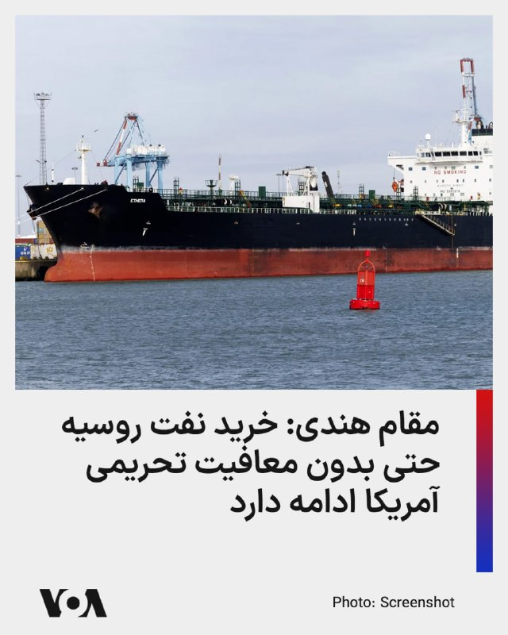

یک مقام وزارت نفت هند گفت دهلی‌نو خرید نفت از روسیه را صرف‌نظر از تمدید یا پایان معافیت‌های تحریمی آمریکا ادامه می‌دهد؛ موضعی که پس از پایان مهلت معافیت واشنگتن برای خرید نفت دریابرد روسیه اعلام شد.

رویترز گزارش داد سوجاتا شارما، از مقام‌های وزارت نفت هند، روز دوشنبه گفت هند «پیش از معافیت، در دوره معافیت و اکنون هم» از روسیه نفت خریده است. او افزود تصمیم دهلی‌نو بر پایه «منطق تجاری» است و معافیت یا نبود معافیت آمریکا، تأثیری بر خرید نفت روسیه نخواهد داشت.

با این حال، هند در برابر محموله‌های پرریسک‌تر محتاط‌تر عمل کرده است. رویترز پیش‌تر گزارش داده بود هند از خرید گاز طبیعی مایع روسیه که مشمول تحریم‌های آمریکا بود، خودداری کرده و یک محموله ال‌ان‌جی روسیه از تأسیسات پورتووایا، پس از رد شدن از سوی هند، نزدیک آب‌های سنگاپور بدون مقصد روشن مانده است. داده‌های مرین‌ترافیک نیز نشان می‌دهد کشتی «کونپنگ»، که تحت تحریم بریتانیا و اوکراین قرار دارد، پس از تغییر مسیر از هنگ‌کنگ به هند، دوباره سرگردان شده است.
@FarsiVOA

## FarsiVOA — post 218047

  

صدراعظم آلمان اعلام کرد که کشورش حملات جمهورس اسلامی به امارات متحده عربی و دیگر کشورها را محکوم می‌کند.

فریدریش مرتس روز دوشنبه در شبکه اجتماعی ایکس افزود که تهران باید تهدید همسایگان خود را متوقف کند و تنگه هرمز را بدون هیچ محدودیتی باز نگه دارد.

او در این پیام نوشت: «حملات به تأسیسات هسته‌ای، امنیت مردم در سراسر منطقه را تهدید می‌کند. نباید هیچ‌گونه تشدید بیشتر خشونت رخ دهد». او همچنین گفت که جمهوری اسلامی باید وارد مذاکراتی جدی با ایالات متحده شود.

مقام‌های ابوظبی اعلام کردند که یک حمله پهپادی روز یکشنبه باعث آتش‌سوزی در نزدیکی یک نیروگاه هسته‌ای در امارات متحده عربی شده است. کشورهای عربی منطقه این حمله را محکوم کردند.
@FarsiVOA

## FarsiVOA — post 218046

  <a href="telegram/content/FarsiVOA_218046_1779114383.mp4" target="_blank">🎬 Download video</a>

ارتش اسرائیل از کشتن یکی از اعضای حماس در غزه خبر داد؛

ارتش اسرائیل اعلام کرد که یکی از اعضای سازمان تروریستی حماس را که قصد اجرای طرح‌های تک‌تیراندازی علیه نیروهای این ارتش در آینده نزدیک داشت، کشته است.

ارتش اسرائیل با انتشار بیانیه‌ای نوشت: «یک هواگرد نیروی هوایی، با هدایت نیروهای لشکر غزه، روز یکشنبه یک تروریست از سازمان تروریستی حماس را که در حال پیشبرد طرح‌های تک‌تیراندازی در آینده نزدیک علیه نیروهای ارتش اسرائیل در جنوب نوار غزه بود، به هلاکت رساند.»

به نوشته ارتش اسرائیل، این عضو حماس «تهدیدی فوری برای نیروهای ارتش اسرائیل محسوب می‌شد و به‌صورت هدفمند برای رفع این تهدید» کشته شد.

بر اساس این گزارش، نیروهای ارتش اسرائیل تحت فرماندهی جبهه جنوب مطابق با توافق مستقر هستند و به فعالیت برای «رفع هرگونه تهدید فوری» ادامه خواهند داد.
@FarsiVOA

## FarsiVOA — post 218045

  <a href="telegram/content/FarsiVOA_218045_1779114385.mp4" target="_blank">🎬 Download video</a>

لحظه برخورد دو جنگنده نیروی دریایی آمریکا در نمایش هوایی؛

در دومین روز از نمایش هوایی «گانفایتر اسکایز» در پایگاه هوایی مانتین هوم در آبداهو، دو جت جنگنده ائی‌اِی-۱۸جی گرولر متعلق به نیروی دریایی ایالات متحده با یکدیگر برخورد کردند.

هر چهار سرنشین این دو جنگنده موفق به خروج اضطراری شدند و بر اساس تأیید نیروی دریایی، در حال حاضر تحت مراقبت‌های پزشکی هستند.

تحقیقات درباره علت دقیق این سانحه هوایی توسط مقامات نظامی آغاز شده است.
@FarsiVOA

## FarsiVOA — post 218044

  

رویترز به نقل از یک منبع پاکستانی گزارش داد اسلام‌آباد نسخه بازنگری‌شده پیشنهاد تهران برای پایان دادن به درگیری در خاورمیانه را به ایالات متحده منتقل کرده است؛ گزارشی که در ادامه تلاش‌های میانجی‌گرانه پاکستان و پس از رد پاسخ قبلی تهران از سوی دونالد ترامپ منتشر می‌شود.

این منبع پاکستانی به رویترز گفت «وقت زیادی نداریم» و افزود دو طرف همچنان مواضع و خواسته‌های خود را تغییر می‌دهند.

چند روز پیش، ترامپ پاسخ قبلی جمهوری اسلامی به طرح آمریکا را رد کرده و آن را «کاملاً غیرقابل قبول» خوانده بود.

انتشار خبر پیشنهاد بازنگری‌شده تهران هم‌زمان با سخنان تازه ترامپ درباره نیاز جمهوری اسلامی به توافق صورت می‌گیرد. رئیس جمهوری آمریکا در گفت‌وگویی با نشریه فورچون که روز دوشنبه منتشر شد، گفت مقام‌های جمهوری اسلامی با وجود اظهارات تند علنی، «به‌شدت» به امضای توافق با واشنگتن نیاز دارند. او همچنین گفت مقام‌های تهران «یک توافق می‌کنند و بعد کاغذی می‌فرستند که ربطی به توافق ندارد.»

ترامپ روز یکشنبه نیز هشدار داده بود تهران باید «سریع» اقدام کند، وگرنه با پیامدهای وخیم روبه‌رو خواهد شد.
@FarsiVOA

## DW_Farsi — post 124842

🔶 نارضایتی سعودی‌ها از آمریکا و سیاستی چندجانبه در قبال ایران

گزارش  روزنامه آلمانی دی ولت با توضیح شروع می‌شود که عربستان در در میانه جنگ آمریکا و اسرائیل علیه ایران، هم از نظر ژئوپولیتیکی و هم امنیتی در حال بازتعریف جایگاه خود است. محور اصلی گزارش این است که ریاض دیگر مانند گذشته به حمایت مطلق آمریکا اطمینان ندارد و به‌دنبال تنوع‌بخشیدن به ائتلاف‌هایش است.
عربستان برای دورزدن پیامدهای بسته‌شدن تنگه هرمز، سال‌ها پیش زیرساخت جایگزین ایجاد کرده بود؛ از جمله خط لوله شرق به غرب و بندر نفتی ینبع در ساحل دریای سرخ. اکنون این بندر به شریان حیاتی صادرات نفت سعودی تبدیل شده است. در گزارش آمده است: « در ینبع محله‌های مسکونی جدید، فرودگاه و تأسیسات آب‌شیرین‌کنِ مجهز به انرژی خورشیدی ساخته شد. حتی در زمان جنگ خلیج فارس در سال ۱۹۹۰ نیز نگرانی زیادی وجود داشت که صدام حسین، دیکتاتور عراق، تنگه هرمز را مسدود یا میدان‌های نفتی آن منطقه را هدف قرار دهد، اما آن زمان تنگه بسته نشد.»

امروز عربستان سعودی می‌تواند روزانه تا هفت میلیون بشکه نفت را از طریق خط لوله شرق به غرب به بندر ینبع منتقل کند و از آنجا به عنوان محصولات فرآوری شده پتروشیمی یا به صورت نفت خام صادر کند.

@dw_farsi

## DW_Farsi — post 124832

📸 کن ۲۰۲۶ در قاب تصویر؛ سینماگران ایرانی در کنار ستاره‌های جهان

هفتادونهمین جشنواره فیلم کن ۲۰۲۶ به رسم هر سال با حضور چهره‌های مطرح سینمای جهان، فرش قرمز و نشست‌های خبری همراه بود. در این دوره، پگاه آهنگرانی نیز با فیلم "تمرین‌هایی برای یک انقلاب" در جشنواره حضور داشت و اثر خود را به نمایش گذاشت. برخی از مشهورترین چهره‌هایی را که در جشنواره امسال حضور یافته‌اند، ببینید.
@dw_farsi

## DW_Farsi — post 124830

  

🔶 مرتس حمله ایران به تاسیسات اتمی امارات را محکوم کرد

فریدریش مرتس، صدراعظم آلمان، حمله به یک نیروگاه هسته‌ای در امارات متحده عربی را محکوم کرد. او روز دوشنبه در شبکه اجتماعی ایکس نوشت: «حملات هوایی دوباره ایران علیه امارات متحده عربی و دیگر شرکا را به‌شدت محکوم می‌کنیم. حمله به تأسیسات هسته‌ای تهدیدی برای امنیت مردم سراسر منطقه است.»

به گفته او، نباید هیچ تشدید خشونت دیگری رخ دهد.

روز یکشنبه، ۱۷ مه (۲۷ اردیبهشت) در پی حمله پهپادی به یک نیروگاه هسته‌ای در امارات، آتش‌سوزی رخ داد. مقام‌های اماراتی اعلام کردند که این حادثه هیچ مجروحی و هیچ افزایش غیرعادی در سطح تشعشعات نداشته است. وزارت خارجه امارات این حمله را "اقدامی تروریستی و بدون تحریک قبلی" توصیف و به‌شدت محکوم کرد، اما مستقیماً هیچ طرفی را مسئول ندانست.

جمهوری اسلامی نسبت به حمله به نیروگاه هسته‌ای امارات واکنش رسمی نشان نداده است.

مرتس در ادامه پیام خود در شبکه ایکس همچنین از رهبری ایران خواست وارد مذاکرات جدی برای پایان دادن به جنگ شود.

او همچنین خواستار آن شد که ایران "تهدید همسایگانش را متوقف کند و تنگه هرمز را بدون محدودیت بازگشایی کند".

در جنگی که با حملات هوایی آمریکا و اسرائیل علیه ایران آغاز شد، اکنون آتش‌بسی برقرار است، اما مذاکرات برای پایان دائمی درگیری‌ها تاکنون به نتیجه مشخصی نرسیده است.

@dw_farsi

## DW_Farsi — post 124829

🔶 سفر ترامپ به چین؛ آیا تهران در پی میانجی تازه است؟

اگر هدف سفر ترامپ به چین، رسیدن به یک تفاهم روشن و علنی با پکن بر سر ایران بود، دست‌کم در ظاهر چنین نتیجه‌ای حاصل نشد. نه بیانیه مشترکی منتشر شد و نه نشانه‌ای از یک توافق نهایی در موضوعات حساس دیده شد. با این حال، مجموعه پیام‌ها و واکنش‌ها نشان می‌دهد ایران یکی از محورهای مهم این سفر بوده است. در چنین فضایی، انتصاب فوری محمدباقر قالیباف به سمت نماینده ویژه ایران در امور چین، بیش از آنکه یک جابه‌جایی اداری ساده باشد، می‌تواند نشانه تلاش تهران برای بازتعریف کانال چین در میانه جنگ، فشار آمریکا و ابهام در آینده مذاکرات باشد.

به گزارش رویترز، جیمیسون گریر، نماینده تجاری ایالات متحده، گفت واشنگتن از چین نخواسته مستقیما برای بازگشایی تنگه هرمز وارد عمل شود، بلکه تمرکز اصلی بر این بوده که پکن از ارائه حمایت مادی به ایران خودداری کند. او همچنین گفت چین به دلیل وابستگی‌اش به مسیرهای انرژی و تجارت جهانی، به‌طور طبیعی از باز ماندن تنگه هرمز حمایت می‌کند. رویترز همچنین گزارش داده که موضع واشنگتن و پکن دست‌کم در مخالفت با محدودیت‌های تازه بر عبور و مرور در تنگه هرمز تا حدی به هم نزدیک شده است.

اما در سوی دیگر، موضع چین محتاط‌تر به نظر می‌رسد. همان گزارش‌ها نشان می‌دهد پکن بیش از آنکه به زبان فشار مستقیم علیه تهران سخن بگوید، بر کاهش تنش، باز ماندن مسیرهای انرژی و حل‌وفصل بحران از طریق دیپلماسی تاکید کرده است. این همان نقطه‌ای است که فاصله دیدگاه چین و آمریکا درباره ایران آشکار می‌شود: واشنگتن به‌دنبال مهار تهران از مسیر فشار و بازدارندگی است، اما چین ظاهرا هنوز می‌خواهد در چارچوب "مدیریت بحران" حرکت کند، نه در قالب همسویی آشکار با سیاست فشار آمریکا.

@dw_farsi

## DW_Farsi — post 124828

🔶 گفت‌وگوی تلفنی نتانیاهو و ترامپ درباره "حمله به ایران"

دفتر نخست‌وزیر اسرائیل در پاسخ به "تایمز اسرائیل" تأیید کرده است که بنیامین نتانیاهو، نخست‌وزیر این کشور، شامگاه یکشنبه ۱۷ مه (۲۷ اردیبهشت) در تماسی تلفنی با دونالد ترامپ، رئیس جمهور آمریکا، درباره جنگ با ایران گفت‌وگو کرده است.

بر اساس گزارش رسانه‌های عبری‌زبان، دو طرف درباره احتمال از سرگیری جنگ با ایران و همچنین سفر اخیر ترامپ به چین گفت‌وگو کرده‌اند.

به گزارش تایمز اسرائیل، نتانیاهو قرار بوده پس از این تماس، شماری از دستیاران ارشد و وزیران کابینه‌اش را برای یک نشست امنیتی در دفتر خود در اورشلیم گرد هم آورد.

چنین نشست‌هایی در دفتر نخست‌وزیری که اغلب "کابینه امنیتی کوچک" نامیده می‌شوند، معمولاً شامل گیدئون ساعر، وزیر خارجه، یسرائیل کاتس، وزیر دفاع، بتسالل اسموتریچ، وزیر دارایی، ایتامار بن‌گویر، وزیر امنیت ملی، و آریه درعی، رهبر حزب شاس، هستند.

هفته گذشته گزارش شده بود که اسرائیل و آمریکا در حال انجام آماده‌سازی‌های فشرده برای ازسرگیری حملات به ایران هستند و احتمال دارد این حملات حتی از همین هفته آغاز شوند. گفت‌وگوهای روز یکشنبه پس از آن انجام گرفته که حمله‌ای پهپادی نیروگاه هسته‌ای امارات متحده عربی را هدف قرار داد؛ کشوری که پس از اسرائیل، در جریان جنگ بیشترین ضربه‌ها را از ایران خورده است.

به گزارش اکسیوس به نقل از دو مقام آمریکایی، انتظار می‌رود ترامپ فردا سه‌شنبه نیز نشستی در "اتاق وضعیت" کاخ سفید با مشاوران ارشد امنیت ملی خود برای بررسی گزینه‌های نظامی علیه ایران برگزار کند.

@dw_farsi

## DW_Farsi — post 124827

  

🔶 ایران یک نهاد جدید برای مدیریت تنگه هرمز معرفی کرد

شورای عالی امنیت ملی ایران از تشکیل نهادی برای مدیریت تنگه هرمز خبر داد. این شورا روز دوشنبه با انتشار پستی در شبکه ایکس با اعلام راه‌اندازی حساب کاربری این نهاد تازه تأسیس با نام "مدیریت آبراه خلیج فارس" نوشت "به‌روز رسانی‌های لحظه‌ای در مورد عملیات تنگه هرمز و آخرین تحولات" در این رابطه از طریق این حساب منتشر خواهد شد.

با این حال تاکنون جزئیات بیشتری درباره ساختار، اختیارات یا مأموریت‌های دقیق این نهاد تازه ‌تأسیس منتشر نشده است.

این اقدام در حالی صورت می‌گیرد که تنگه هرمز در ماه‌های اخیر به یکی از کانون‌های اصلی تنش‌های منطقه‌ای تبدیل شده و نقش آن در امنیت انرژی و حمل‌ونقل جهانی اهمیت بیشتری یافته است.

@dw_farsi

## DW_Farsi — post 124826

  

🔶 آژانس بین‌المللی انرژی: ذخایر تجاری نفت جهان به‌سرعت در حال کاهش است

آژانس بین‌المللی انرژی اعلام کرد که با ادامه اختلال در صادرات نفت خلیج فارس بر اثر جنگ خاورمیانه، ذخایر تجاری نفت جهان "بسیار سریع" در حال کاهش است؛ این روند حتی با وجود آزادسازی ذخایر راهبردی توسط دولت‌ها ادامه دارد.

فاتح بیرول، مدیر آژانس، روز دوشنبه، ۱۸ مه (۲۸ اردیبهشت) در حاشیه نشست وزیران دارایی گروه هفت در پاریس گفت: «ذخایر تجاری (انرژی) در حال کاهش‌اند… و به‌نظر من اکنون با سرعت زیادی تخلیه می‌شوند.»
او هشدار داد که اگرچه هنوز چند هفته زمان باقی مانده، اما این ذخایر "بی‌پایان نیستند".

نگرانی‌ها درباره کمبود انرژی هم‌زمان با نزدیک شدن فصل سفرهای تابستانی در نیمکره شمالی افزایش یافته است. شرکت‌های هواپیمایی هشدار داده‌اند که در صورت ادامه اختلالات، ممکن است طی چند هفته با کمبود سوخت جت روبه‌رو شوند.

پس از حملات آمریکا و اسرائیل به ایران در اواخر فوریه، ایران عملاً عبور نفتکش‌ها از تنگه هرمز را متوقف کرده؛ اقدامی که باعث اختلال شدید در انتقال نفت و گاز و جهش قیمت‌ها شده است.

@dw_farsi

## DW_Farsi — post 124825

  <a href="telegram/content/DW_Farsi_124825_1779114389.mp4" target="_blank">🎬 Download video</a>

🎥 خاویر باردم در کن؛ حمله به ترامپ، پوتین و نتانیاهو

خاویر باردم، بازیگر برنده اسکار، که در جشنواره فیلم کن جضور دارد، در سخنانی دونالد ترامپ، ولادیمیر پوتین و بنیامین نتانیاهو را به "رفتار مردانه سمی" متهم کرد. آسوشیتدپرس می‌نویسد باردم این رفتار را عامل جنگ‌های کنونی در ایران، غزه و اوکراین دانسته است.

باردم این سخنان را در نشست خبری فیلم "El Ser Quierdo" که نامزد دریافت نخل طلای جشنواره کن شده، بیان کرده است.

@dw_farsi

## DW_Farsi — post 124824

  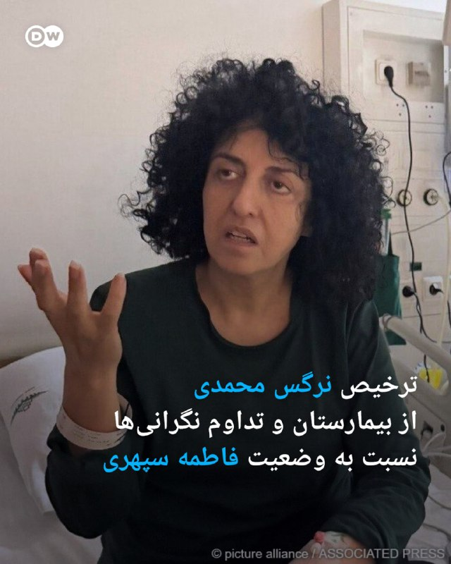

🔶 ترخیص نرگس محمدی از بیمارستان و تداوم نگرانی‌ها نسبت به وضعیت فاطمه سپهری

بنیاد نرگس محمدی روز دوشنبه ۲۸ اردیبهشت (۱۸ مه) اعلام کرد این فعال سیاسی پس از ۱۶ روز، از بیمارستان مرخص شد.

نرگس محمدی از ۱۱ تا ۲۰ اردیبهشت در بیمارستان زنجان و از ۲۰ تا ۲۷ اردیبهشت در بخش مراقبت‌های ویژه در بیمارستان پارس در تهران بستری بود و به گفته این بنیاد "تحت عمل آنژیوپلاستی و آزمایشات مربوط به اختلالات شدید فشار خون از جمله Tilt Test" قرار گرفت.

این فعال سیاسی برنده جایزه نوبل صلح آذرماه سال گذشته در جریان مراسم خاکسپاری خسرو علیکردی، وکیل دادگستری، در مشهد بازداشت و به زندان محکوم شد.

بنیاد نرگس محمدی گفته است که "طبق نظر پزشکان متخصص از جمله قلب و مغز، ضرورت بر تحت نظر و مراقبت‌های درمانی خاص برای او وجود دارد و تا یک ماه حداقل هر‌ روز در بیمارستان تحت فیزیوتراپی قرار خواهد داشت".

@dw_farsi

## DW_Farsi — post 124823

  

🔶 قطعی اینترنت در ایران از ۸۰ روز گذشت

نت‌بلاکس که در زمینه پایش، تحلیل و مستندسازی وضعیت اینترنت در جهان فعالیت می‌کند، روز دوشنبه ۲۸ اردیبهشت (۱۸ مه) با اشاره به تداوم قطعی سراسری اینترنت در ایران اعلام کرد این اختلال اکنون وارد هشتادمین روز خود شده و از ۱۸۹۶ ساعت فراتر رفته است.

نت بلاکس با اشاره به فعالیت قابل توجه کاربران و فعالان رسانه‌ای نزدیک به حکومت با استفاده از اینترنت موسوم به "سفید" در شبکه‌های اجتماعی، خاطرنشان ساخت محتوای تولید شده توسط این افراد در حمایت از جمهوری اسلامی شبکه‌های اجتماعی را "اشباع" کرده است.

در پیام نت بلاکس که در شبکه ایکس منتشر شده، آمده است: «ایرانیانی که به‌دنبال دریافت دسترسی ویژه یا دسترسی فهرست سفید هستند، می‌گویند از آن‌ها خواسته می‌شود سهمیه‌ای از پست‌های روزانه تبلیغاتی را منتشر کنند که این روند با استفاده از هوش مصنوعی پایش می‌شود.»

@dw_farsi

## Persian_Trend_Official — post 14414

  <a href="telegram/content/Persian_Trend_Official_14414_1779114391.webm" target="_blank">🎬 Download video</a>

⭕️بازسازی زیرساخت‌های آسیب‌دیده پارس جنوبی در ۲ سال

سخنگوی کمیسیون انرژی مجلس:
💢برای بازسازی و نوسازی زیرساخت‌های پالایشگاهی و پتروشیمی منطقه پارس جنوبی با تکیه بر دانش بومی برنامه‌ریزی شده است.

💢این مراکز با طراحی و فناوری‌های جدید و با ظرفیتی بیش از قبل، به مدار تولید بازخواهند گشت.

💢پیش‌بینی می‌شود حدود ۵۰ درصد از بازسازی‌ها تا پیش از آغاز فصل سرد سال به سرانجام برسد.

💢کل فرآیند آواربرداری، بازسازی و نوسازی زیرساخت‌ها در مدت حداکثر ۲ سال تکمیل شود.

🫆:Tony

📌 @persian_trend_official
پرشین ترند | متفاوت‌ترین کانال نظامی

## Persian_Trend_Official — post 14413

  <a href="telegram/content/Persian_Trend_Official_14413_1779114391.webm" target="_blank">🎬 Download video</a>

⭕️ وضعیت کم سابقه‌ی آسمان منطقه، از نظر خلوت بودن. (در عکس اول فقط پرواز های نظامی آمریکا و در عکس دوم تمام پرواز های نظامی) 📝 Nick 📌 @persian_trend_official پرشین ترند | متفاوت‌ترین کانال نظامی

## Persian_Trend_Official — post 14410

⭕️ وضعیت کم سابقه‌ی آسمان منطقه، از نظر خلوت بودن.

(در عکس اول فقط پرواز های نظامی آمریکا
و در عکس دوم تمام پرواز های نظامی)

📝 Nick

📌 @persian_trend_official
پرشین ترند | متفاوت‌ترین کانال نظامی

## Persian_Trend_Official — post 14409

  <a href="telegram/content/Persian_Trend_Official_14409_1779114392.webm" target="_blank">🎬 Download video</a>

📰
🇸🇦
🇵🇰طبق گزارش رویترز، پاکستان در چارچوب «توافق دفاع مشترک» با عربستان:

🔢حدود ۸ هزار نیروی نظامی،

🔢یک اسکادران جنگنده عمدتاً از نوع JF-17،

🔢دو اسکادران پهپادی

🔢 سامانه پدافند هوایی HQ-9 ساخت چین
را در خاک عربستان مستقر کرده است.

❎بر اساس این گزارش، این اقدام با هدف تقویت همکاری‌های دفاعی و امنیتی میان اسلام‌آباد و ریاض انجام شده است.
❎

☆Phantom☆

📌 @persian_trend_official
پرشین ترند | متفاوت‌ترین کانال نظامی

## Persian_Trend_Official — post 14408

  

ایران سامانه «هرمز سیف» را برای ثبت‌نام کشتی‌های عبوری از تنگه هرمز راه‌اندازی کرد

جمهوری اسلامی ایران سامانه‌ای تحت عنوان «هرمز سیف» را با هدف ارائه خدمات به کشتی‌های عبوری از تنگه هرمز راه‌اندازی کرده است. بر اساس این طرح، ناخدایان و شرکت‌های کشتیرانی می‌توانند از طریق این سامانه درخواست خدمات مختلف از جمله بیمه، کترینگ، خدمات اضطراری و همراهی اسکورت نظامی را ثبت کنند.جالبه که اسکورت نظامی رو هم جزو «خدمات» گذاشتن، کنارِ کترینگ! 😂

با این حال، این سامانه با یک چالش فنی قابل توجه مواجه است؛ وب‌سایت مذکور از خارج از ایران قابل دسترسی نیست و کاربران خارجی برای ثبت‌نام ملزم به استفاده از اینترنت ایرانی هستند.

آدرس سامانه: hormuzsafe.ir

☆Phantom☆

📌 @persian_trend_official
پرشین ترند | متفاوت‌ترین کانال نظامی

## RadioFarda — post 157313

  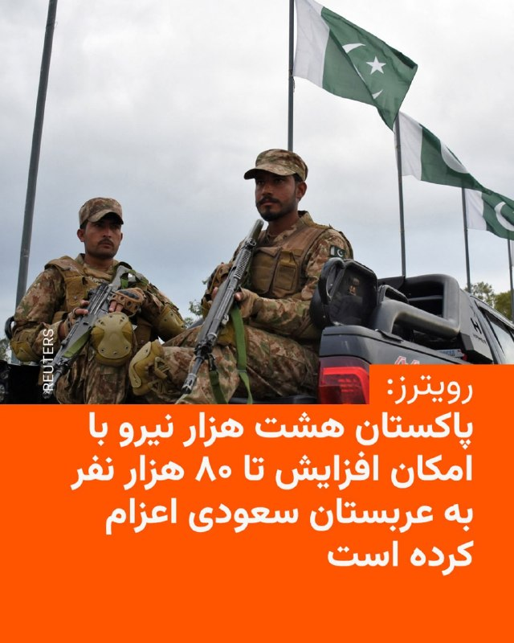

🔸خبرگزاری رویترز روز دوشنبه، ۲۸ اردیبهشت، در گزارشی اختصاصی به نقل از سه مقام امنیتی و دو مقام دولتی که به نام‌شان اشاره نکرد خبر داد که پاکستان در عین میانجی‌گری میان ایران و‌ آمریکا، هزاران نیرو و تجهیزات نظامی به عربستان سعودی فرستاده است.

🔸خبر اعزام نیرو از پاکستان ماه گذشته منتشر شده، اما از جزئیات آن چیزی منتشر نشده بود.

🔸از زمان آغاز آتش‌بس میان ایران و آمریکا و پادرمیانی اسلام‌آباد برای رسیدن به صلح که بیش از یک ماه پیش برقرار شد، کارشناسان یکی از دلایل این اقدام پاکستان را پیمان دفاعی این کشور با عربستان سعودی عنوان کرده‌اند.

🔸بر اساس این پیمان، در صورت بالا گرفتن جنگ و حمله به عربستان سعودی توسط ایران، اسلام‌آباد مجبور خواهد بود به نفع ریاض در مقابل همسایه غربی خود یعنی ایران بایستد که می‌تواند برای خود پاکستان عواقبی سخت داشته باشد.

🔸حال در گزارش اختصاصی رویترز آمده است که اسلام‌آباد در عین تلاش برای برقرار کردن صلح میان تهران و واشینگتن، هشت هزار نفر نیروی نظامی، چند جت جنگنده و یک سامانه دفاع هوایی به عربستان اعزام کرده است.

@RadioFarda

## RadioFarda — post 157312

  

🔸 نت بلاکس، که وضعیت اینترنت را در جهان رصد می‌کند، روز دوشنبه ۲۸ اردیبهشت خبر داد که قطع اینترنت در ایران وارد هشتادمین روز خود شد و این خاموشی از ۱۸۹۶ ساعت گذشته است.

🔸 این شبکه در حساب کاربری خود در ایکس نوشت که در همین حال، شبکه‌های اجتماعی پر از محتواهای حامی حکومت است و ایرانیانی که به‌دنبال دریافت اینترنت پرو هستند می‌گویند از آن‌ها خواسته می‌شود سهمیه‌ای از پست‌های تبلیغاتی روزانه را منتشر کنند که توسط هوش مصنوعی نظارت می‌شود.

🔸 اینترنت در ایران، به‌رغم سانسور و اعمال فیلترینگ گسترده، از ۹ اسفند پارسال همزمان با شروع جنگ آمریکا و اسرائیل با ایران و به بهانهٔ آن، به‌طور کامل قطع شده است.

🔸 در این مدت، شمار قابل‌توجهی از فعالان رسانه‌ای نزدیک به حکومت با استفاده از اینترنت موسوم به «سفید» در شبکه‌های اجتماعی از عملکرد جمهوری اسلامی حمایت کرده‌اند.

🔸 همزمان، در هفته‌های اخیر برخی اپراتورها اقدام به تبلیغ و فروش اینترنت موسوم به «طبقاتی» یا «پرو» کرده‌اند؛ اینترنتی که با عنوان ویژهٔ «کسب‌وکارها» و با هزینه‌ای بسیار بالا عرضه می‌شود.

@RadioFarda

## RadioFarda — post 157311

  <a href="https://t.me/radiofarda/157311" target="_blank">📎 Download file</a>

📻بشنوید: ساعت ۱۴ با رادیوفردا، ۲۸ اردیبهشت ۱۴۰۵‌

@Radiofarda

## RadioFarda — post 157310

  

🔸صدراعظم آلمان آنچه که «از سرگیری حملات ایران» به امارات متحده عربی و دیگر شرکا خواند، را «قویاً» محکوم کرد و گفت تهران باید تهدید همسایگان خود را متوقف کرده و تنگه هرمز را بدون محدودیت باز نگه دارد.

🔸فردریش مرتس روز دوشنبه ۲۸ اردیبهشت در پیامی در شبکه ایکس نوشت: «حملات به تأسیسات هسته‌ای تهدیدی برای امنیت مردم در سراسر منطقه است. نباید هیچ‌گونه تشدید بیشتری در خشونت رخ دهد».

🔸او همچنین گفت که ایران باید وارد مذاکرات جدی با ایالات متحده شود.

🔸مقام‌های امارات روز یکشنبه اعلام کردند که یک حمله پهپادی باعث آتش‌سوزی در یک نیروگاه هسته‌ای این کشور شده است.

@RadioFarda

## RadioFarda — post 157309

  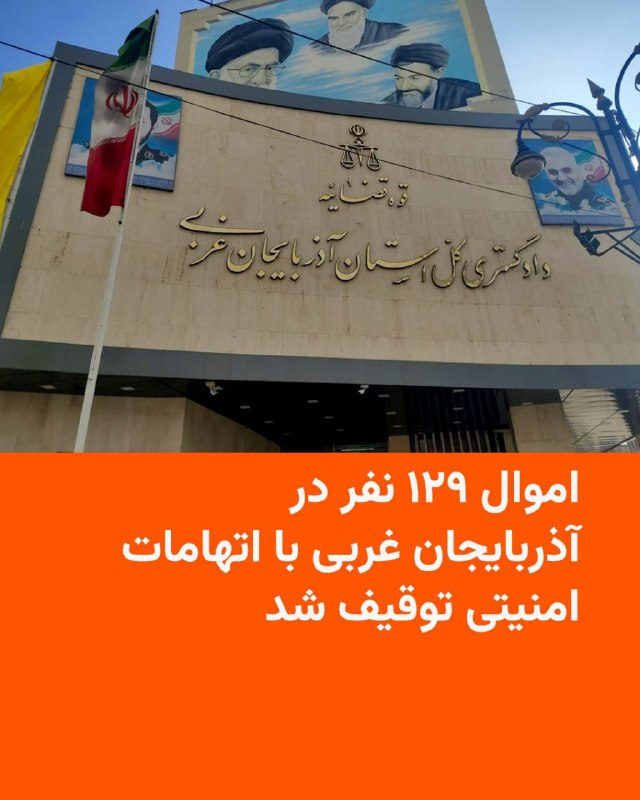

🔸رئیس کل دادگستری آذربایجان غربی روز دوشنبه ۲۸ اردیبهشت از توقیف اموال ۱۲۹ نفر در این استان با اتهامات امنیتی خبر داد.

🔸ناصر عتباتی از این افراد با عنوان «گروهک‌های ضدانقلاب و تجزیه‌طلب» نام برد و آن‌ها را به «اقدامات ضدامنیتی و همکاری با کشورهای متخاصم» متهم و اعلام کرد که اموال آن‌ها به «نفع ملت» مصادره شده است.

🔸دادگستری آذربایجان غربی اسامی این افراد را اعلام نکرده و برای اتهامات علیه این افراد شواهد و مدارکی ارائه نداده است.

🔸پیش از این نیز گزارش‌های متعددی از توقیف اموال شماری از روزنامه‌نگاران، فعالان سیاسی و مدنی، هنرمندان، ورزشکاران و چهره‌های شناخته‌شده با اتهامات مشابه منتشر شده بود.

@RadioFarda

## IranianMinds — post 20340

🔴رویترز:

پیشنهاد اصلاح شده تهران به آمریکا شامل:

۱- پایان دائمی جنگ.
۲- لغو تحریم‌ها.
۳- بازگشایی تنگه هرمز.
۴- آزاد‌سازی دارایی‌های بلوکه شده ایران.

گزارش‌ها حاکی است که ایران درباره برنامه هسته‌ای خود در مراحل بعدی مذاکرات گفت‌‌و‌گو خواهد کرد.

@IranianMinds

## IranianMinds — post 20339

🔴سناتور لیندسی گراهام:

من کاملأ اطمینان دارم که رئیس جمهور ترامپ به طور کامل، وضعیت مربوط به ایران را درک می‌کنه و دیگه عدم تمایل به مذاکره با حسن‌نیت، همراه با اقدامات تهاجمی و سرکشانه ایران در تنگه هرمز و سراسر منطقه را تحمل نخواهد کرد.

@IranianMinds

## IranianMinds — post 20336

  <a href="telegram/content/IranianMinds_20336_1779114395.mp4" target="_blank">🎬 Download video</a>

🔴 اسرائیل‌ همچنان داره لبنان رو‌ شخم میزنه

@IranianMinds

## IranianMinds — post 20335

  

🔴 نیویورک تایمز:

آمریکا و اسرائیل در حال انجام شدیدترین آمادگی‌های خود از زمان آغاز آتش‌بس هستند، چرا که احتمال حملات مجدد به ایران حتی از همین هفته وجود دارد.

پنتاگون نیز خود را برای از سرگیری احتمالی «عملیات خشم‌ حماسی» آماده میکند.

@IranianMinds

## IranianMinds — post 20334

🔴ناو‌شکن با صلابت و سرافراز به صورت عمودی غرق شد.
یادآوری😂😂😂

@IranianMinds

## IranianMinds — post 20333

  

🔴 ارتش اسرائیل :

امروز‌ فرمانده جهاد اسلامی فلسطین رو از بین بردیم.

@IranianMinds

## IranianMinds — post 20332

  

🔴 رویترز :

پاکستان در جریان جنگ ایران، طبق یک توافق پنهان دفاعی، ۸۰۰۰ نیرو، جنگنده، پهپاد و سیستم‌های دفاع هوایی به عربستان فرستاده است.

این نیروها شامل جنگنده‌های JF-17، سیستم‌های چینی HQ-9 و تجهیزات تحت عملیات پاکستان است که توسط ریاض تأمین مالی شده‌اند.

این استقرار آماده عملیات رزمی است و در صورت نیاز می‌تواند تا ۸۰,۰۰۰ نیرو گسترش یابد.

@IranianMinds

## IranianMinds — post 20331

🔴 خبرگزاری فوق معتبر تسنیم:

گفته میشه تو پیش‌نویس تازه مذاکرات، آمریکا موافقت کرده موقتا تحریم‌های نفتی ایران رو در طول مذاکرات برداره.

ایران می‌خواد همه تحریم‌ها کامل برداشته بشه، اما آمریکا فعلا فقط پیشنهاد معافیت موقت از تحریم‌های OFAC رو تا رسیدن به توافق نهایی داده

@IranianMinds

## IranianMinds — post 20330

  

🔴 بعضی جوونا و‌ نوجوونا تو‌ این کشور یه خوشی داشتن اونم میخوان ازشون بگیرن

معاون نظارت بنیاد ملی بازی های رایانه جمهوری اسلامی اعلام کرد که قراره یه «گیم سنتر مرکزی» بسازن که همه سایت‌های دانلود بازی، لینک‌هاشون رو از اون رد کنن تا قبل از انتشار بازی‌ها رو چک کنن که با قوانین اسلامی سازگار باشه و روی نوجوونا تاثیری نداشته باشه !

@IranianMinds

## IranianMinds — post 20329

  

🔴نت‌بلاکس دوشنبه ۲۸ اردیبهشت اعلام کرد هشتادمین روز از قطع اینترنت در ایران است و مدتش به ۱۸۹۶ ساعت رسیده است.

بر اساس گزارش این نهاد ناظر بر اینترنت جهانی، همزمان با تداوم این وضعیت، محتوای حامی حکومت، شبکه‌های اجتماعی را پر کرده است.
این نهاد همچنین اعلام کرد برخی از ایرانیانی که برای دریافت اینترنت«پرو» یا دسترسی سیم‌کارت سفید اقدام کرده‌اند می‌گویند از آن‌ها خواسته می‌شود سهمیه‌ایی از پست‌های تبلیغاتی روزانه منتشر کنند.
نت‌بلاکس افزود: این فعالیت‌ها با استفاده از هوش مصنوعی نظارت می‌شود.

@IranianMinds

## IranianMinds — post 20328

در حالی که‌ مردم دنیا هیجان دارن واسه جام جهانی و‌ منتظرن شروع شه

ما ایرانیا دغدغمون اینه که کی بزنن و‌ دوباره جنگ شه که شاید از دست این آخوندا زودتر نجات پیدا کردیم :)

یعنی خورشید یه روزی تو‌این سرزمین هم طلوع میکنه دوباره؟

@IranianMinds

## BBCPersian — post 281380

  <a href="telegram/content/BBCPersian_281380_1779114399.mp4" target="_blank">🎬 Download video</a>

🔻سرخط خبرهای دوشنبه ۲۸ اردیبهشت ۱۴۰۵
@BBCPersian

## BBCPersian — post 281379

🔻آژانس بین‌المللی انرژی در مورد کاهش سریع ذخایر تجاری نفت در جهان هشدار داد. فاتح بیرول، رئیس آژانس بین‌المللی انرژی، گفت که علی‌رغم آزاد شدن بخشی از ذخایر نفت استراتژیک دولت‌ها در سراسر جهان، ذخایر تجاری به‌دلیل اختلال در عرضه نفت در خلیج فارس، «بسیار سریع»…

## BBCPersian — post 281378

  

🔻آژانس بین‌المللی انرژی در مورد کاهش سریع ذخایر تجاری نفت در جهان هشدار داد.

فاتح بیرول، رئیس آژانس بین‌المللی انرژی، گفت که علی‌رغم آزاد شدن بخشی از ذخایر نفت استراتژیک دولت‌ها در سراسر جهان، ذخایر تجاری به‌دلیل اختلال در عرضه نفت در خلیج فارس، «بسیار سریع» در حال کاهش است.

با نزدیک شدن به فصل سفرهای تابستانی در نیمکره شمالی، نگرانی‌ درباره کمبود سوخت افزایش یافته است.

خطوط هوایی هشدار داده‌اند که در صورت تداوم اختلالات عرضه، در هفته‌های آینده با کمبود سوخت جت مواجه خواهند شد.

آقای بیرول هنگام ورود به نشست وزرای دارایی گروه هفت (جی-۷) در پاریس به خبرنگاران گفت: «موجودی‌های تجاری در حال کاهش است... فکر می‌کنم اکنون خیلی سریع در حال اتمام است.»

او گفت: «ما هنوز چند هفته فرصت داریم، اما باید از این واقعیت آگاه باشیم که ذخایر به‌سرعت در حال کاهش است.»

📷 AFP via Getty Images
https://bbc.in/4tJk5LV
@BBCPersian

## BBCPersian — post 281377

🔻فلج شدن حمل‌و‌نقل در کنیا، در پی اعتصاب به دلیل گرانی سوخت
اعتصاب کارکنان شبکه حمل‌و‌نقل کنیا در اعتراض به افزایش اخیر قیمت سوخت، باعث سرگردانی هزاران مسافر در این کشور شده است.

با ادامه بحران تنگه هرمز و گران شدن نفت، قیمت بنزین اخیرا در کنیا بیش از ۲۰ درصد افزایش یافته است.

اعتصاب امروز باعث خالی شدن خیابان‌های منتهی به نایروبی، پایتخت، شده و بسیاری از مردم ناچار شده‌‌اند با پای پیاده سر کار بروند؛ برخی از مغازه‌ها و کسبه هم کار خود را تعطیل کرده‌اند و مدارس از دانش‌آموزان خواسته‌اند که در خانه بمانند.

کنیا هم مانند بسیاری از کشورهای آفریقایی دیگر برای تامین سوخت خود به شدت به واردات از خلیج فارس وابسته است. اما جنگ آمریکا و اسرائیل با ایران و محدود شدن رفت‌و‌آمد در تنگه هرمز، این کشورها را با چالش مواجه کرده است.

https://bbc.in/4dOLHua
@BBCPersian

## BBCPersian — post 281376

🔻گزارش سالانه عفو بین‌الملل نشان می‌دهد که اعدام در سال ۲۰۲۵ به رقم بی‌سابقه‌ای رسیده است. بنابر این گزارش، این سازمان در سال گذشته میلادی ۲۷۷۰ مورد اعدام در ۱۷ کشور را ثبت کرده است که بالاترین رقم از سال ۱۹۸۱ است که عفو بین‌الملل ثبت آمار اعدام را آغاز کرد.…

## BBCPersian — post 281375

  

🔻گزارش سالانه عفو بین‌الملل نشان می‌دهد که اعدام در سال ۲۰۲۵ به رقم بی‌سابقه‌ای رسیده است.

بنابر این گزارش، این سازمان در سال گذشته میلادی ۲۷۷۰ مورد اعدام در ۱۷ کشور را ثبت کرده است که بالاترین رقم از سال ۱۹۸۱ است که عفو بین‌الملل ثبت آمار اعدام را آغاز کرد.

بنا بر آخرین گزارش عفو بین‌الملل، این افزایش چشمگیر به‌دلیل چند دولتی بوده است که می‌خواهند «از طریق ارعاب» حکومت کنند: «مقام‌های ایران عامل اصلی این جهش بودند که دست‌کم ۲۱۵۹ نفر را اعدام کردند، بیش از دو برابر آمار سال ۲۰۲۴.»

گزارش عفو بین‌الملل به چند کشور دیگر هم می‌پردازد: «عربستان سعودی شمار اعدام‌ را به دست‌کم ۳۵۶ مورد رساند، از مجازات اعدام برای جرایم مرتبط با مواد مخدر استفاده فراوانی کرد. تعداد اعدام‌ها در کویت تقریبا سه برابر شد (از ۶ به ۱۷)، و تقریبا دو برابر در مصر (از ۱۳ به ۲۳)، سنگاپور (از ۹ به ۱۷) و ایالات متحده آمریکا (از ۲۵ به ۴۷).

ادامه خبر را از لینک زیر در وبسایت بی‌بی‌سی فارسی بخوانید.

📷 NurPhoto via Getty Images
https://bbc.in/4ulEtDY
@BBCPersian

## BBCPersian — post 281374

  

🔻دیوان عالی اسپانیا حکم کرد که سازمان‌های مالیاتی حدود ۷۰ میلیون دلار به شکیرا، ستاره موسیقی پاپ، غرامت بپردازند. پرونده‌ شکایت این خواننده از هشت سال پیش در جریان بود.

شکیرا از این رای استقبال کرد و گفت که دادگاه به «سال‌ها تلاش هماهنگ برای نابودی شهرتش» پایان داد.

شکیرا این پیروزی را به «شهروندان عادی» تقدیم کرد که از «موارد مشابه» رنج دیده‌اند.

دیوان عالی نتیجه گرفت این هنرمند اهل کلمبیا در سال مالی ۲۰۱۱ ساکن اسپانیا نبوده، بنابراین به اشتباه به پرداخت میلیون‌ها دلار مالیات بر درآمد در آن سال ملزم شده بود.

دستور دادگاه اسپانیا شامل پرداخت کامل مبلغ به‌علاوه سود به شکیرا است.

📷 Getty Images
@BBCPersian

## BBCPersian — post 281373

  

🔻فردریش مرتس گفت که «ما حملات هوایی تازه ایران به امارات و دیگر شرکا را به‌شدت محکوم می‌کنیم.»

صدر‌اعظم آلمان در شبکه اجتماعی ایکس، حمله به «تاسیسات هسته‌ای» را تهدیدی برای ایمنی مردم سراسر منطقه خواند.

امارات متحده دیروز گفت که در حمله پهپادی، ژانراتور برق بیرون محوطه نیروگاه هسته‌ای براکه در نزدیکی ابوظبی آتش گرفته است. امارات در بیانیه‌هایش نامی از کشوری نبرد و فقط گفت پهپاد از «مرز غربی» وارد شده بود.

آقای مرتس در این پست نوشت که «ایران باید وارد مذاکره جدی با آمریکا شود، از تهدید همسایگان خود دست بردارد و تنگه هرمز را بدون هیچ محدودیتی مجددا باز کند.»

اظهارات آقای مرتس درباره مذاکرات ایران و آمریکا اخیرا به تنش لفظی او با دونالد ترامپ منجر شد. او گفته بود مذاکره‌کنندگان ایران آمریکا را «تحقیر» کرده‌اند.

📷Getty Images
https://bbc.in/42ChAjs
@BBCPersian

## idfinfarsi — post 11595

  <a href="telegram/content/idfinfarsi_11595_1779114403.mp4" target="_blank">🎬 Download video</a>

‼️مستند از انهدام انبار سلاح‌های ضدزره سازمان تروریستی حزب‌الله: نیروهای تیپ ۷۶۹ زیرساخت‌های تروریستی را منهدم کرده و تسلیحات را کشف کردند

⭕️نیروهای تیپ ۷۶۹ تحت فرماندهی لشکر ۹۱، به عملیات خود در جنوب خط دفاعی مقدم با هدف رفع تهدیدها علیه شهروندان کشور اسرائیل ادامه می‌دهند.

⭕️این نیروها با پشتیبانی نیروی هوایی، در یک واکنش عملیاتی سریع، یک انبار سلاح‌های ضدزره را که توسط سازمان تروریستی حزب‌الله علیه نیروهای فعال در منطقه مورد استفاده قرار می‌گرفت، منهدم کردند.

⭕️در یک عملیات دیگر در منطقه روستای الخیام، نیروها انبارهای تسلیحاتی و مراکز استقرار سازمان تروریستی حزب‌الله را منهدم کرده و مقادیری سلاح از جمله پرتابگرهای ضدزره، مواد منفجره و سلاح‌های سبک را کشف کردند.

## idfinfarsi — post 11594

  

❌در یک حمله دقیق در بعلبک: ارتش اسرائیل فرمانده جهاد اسلامی فلسطین در منطقه بقاع لبنان را به هلاکت رساند

‼️ارتش اسرائیل در‌طول شب (یکشنبه) در منطقه بعلبک حمله کرده و وائل محمود عبدالحلیم، فرمانده جهاد اسلامی فلسطین در منطقه بقاع لبنان را به هلاکت رساند.

⭕️عبدالحلیم رهبری پیوستن تروریست‌های سازمان تروریستی جهاد اسلامی فلسطین به نبرد در کنار تروریست‌های سازمان تروریستی حزب‌الله در لبنان را بر عهده داشت و در دوره اخیر برای پیشبرد طرح‌های تروریستی علیه نیروهای ارتش اسرائیل فعالیت می‌کرد.

## Dirty_Kids — post 389679

  <a href="telegram/content/Dirty_Kids_389679_1779114404.mp4" target="_blank">🎬 Download video</a>

توقعی که از ایرانیای امریکا دارم

این تیم بی‌غیرتان سپاه رو اینجوری ادب نکنید و براشون جهنم نسازید، خیلی ازتون ناامید میشم

@Dirty_Kids 👻

## Dirty_Kids — post 389678

  <a href="telegram/content/Dirty_Kids_389678_1779114406.mp4" target="_blank">🎬 Download video</a>

یه فمبویِ مشهدی رفته حرم؛

اونجا هرکی از راه می‌رسه میگه شما چرا چادر نداری؟ اینم میگه بابا بخدا من پسرم...

@Dirty_Kids 👻

## Dirty_Kids — post 389677

  <a href="telegram/content/Dirty_Kids_389677_1779114408.mp4" target="_blank">🎬 Download video</a>

این خبرو این وسط خوندم خیلی خندیدم گفتم شماهم ببینید روحیه‌تون عوض شه:
تو ترکیه یه دستگاه گذاشتن به گربه ها غذا میده اتوماتیک با صدای میو کردن گربه؛ بعد این مرغ دریاییای پدرسوخته یادگرفتن میرن جلوش میو میو میکنن غذا بگیرن :)))

@Dirty_Kids 👻

## Dirty_Kids — post 389675

جورجینا (زن رونالدو) بلوند کرده

@Dirty_Kids 👻

## Dirty_Kids — post 389674

  <a href="telegram/content/Dirty_Kids_389674_1779114409.mp4" target="_blank">🎬 Download video</a>

نه داداش ببین...

@Dirty_Kids 👻

## Dirty_Kids — post 389673

  

از راست به چپ به ترتیب:
گلشیفته، نرگس محمدی، مصی علینژاد و لیلی بازرگان اگه رضاشاهِ اول نبود.

@Dirty_Kids 👻

## Dirty_Kids — post 389672

  

نشریه چپولیستی گاردین رسما اعلام کرده:
"اگه از بوی شاش و عرق حال‌تون به هم می‌خوره، شما راست افراطیِ ترامپ‌یستید" 😭😂
یعنی اینا برای حموم نرفتن و بوی تعفن هم دارن مشروعیت سیاسی صادر می‌کنن!!!!

@Dirty_Kids 👻

## Dirty_Kids — post 389670

  

اینا نه تنها باخت ندارن 😂
حتی یه مورد مساوی هم ندارن
فقط بردددد

@Dirty_Kids 👻

## Dirty_Kids — post 389669

  <a href="https://t.me/Dirty_Kids/389669" target="_blank">📎 Download file</a>

✅ اپلیکیشن اندروید سایت جهانی دربی بت

💰اولین سایت جهانی با امکان شارژ و برداشت ریالی(کارت به کارت)

🔗 برای ورود فیلترشکن روی کشور مناسب قرار دهید مانند فنلاند و المان و....

😀Telegram Channel
👇
https://t.me/+bcynkEgSW2dlYTc0

## Dirty_Kids — post 389668

  

😤دنبال یه سایت شرط بندی بین المللی بودی که به ایرانیا خدمات بده؟!
⛔

👍دربی بت همون انتخاب  100%

💎ویژگی های سایت جهانی Derby Bet:

⬅️امکان شارژ امن با کارت بانکی

⬅️واریز اول دوبل شارژ می شوید(بونوس۱۰۰٪)

⬅️پر اپشن ترین سایت فعال در ایران

⬅️تسویه حساب کمتر از 5 دقیقه

⬅️برگشت بخشی از باخت به صورت هفتگی

🚨کد هدیه ثبت نام:GG007

⚠️برای دانلود اپلکیشن کلیک کنید
👉

🔔کانال دربی بت :

🪙https://t.me/+bcynkEgSW2dlYTc0

## Dirty_Kids — post 389667

نگاهی عمیق‌تر به بیضه‌های بهزاد فراهانی

@Dirty_Kids 👻

## Hranews — post 113016

  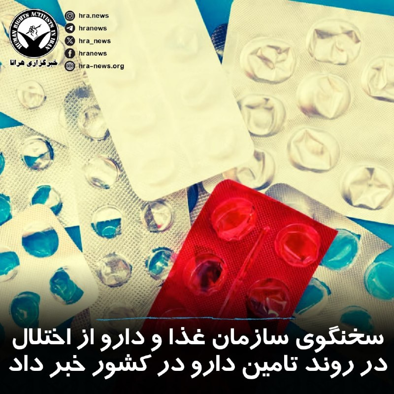

سخنگوی سازمان غذا و دارو اعلام کرد که زنجیره تامین مواد اولیه و واردات #دارو به کشور دچار اختلال شده است. به گفته محمد هاشمی، با توجه به اختلال در مسیرهای معمول تامین نهاده‌های دارویی، فعال‌سازی کریدورهای زمینی و ریلی منطقه‌ای در دستور کار سازمان غذا و دارو، وزارت راه و شهرسازی و دیگر دستگاه‌های ذی‌ربط قرار گرفته است.

↘️
@hranews_bot تماس ✉️ -  @Hranews  کانال هرانا 🆑

## Hranews — post 113015

خبرگزاری هرانا pinned a photo

## Hranews — post 113014

  

میان موشک و سرکوب؛ گزارش مجموعه فعالان حقوق بشر درباره مخاصمه نظامی ایالات متحده-اسرائیل و ایران منتشر شد

💥
💥
💥
💥
💥 – امروز، مجموعه فعالان حقوق بشر در ایران گزارش جدیدی را در ۲۴۰ صفحه و دو زبان منتشر کرد که به بررسی کارزار نظامی ایالات متحده و اسرائیل در ایران در فاصله ۹ اسفند ۱۴۰۴ تا ۱۹ فروردین ۱۴۰۵ (۲۸ فوریه تا ۸ آوریل ۲۰۲۶) می‌پردازد.

این گزارش بر پایه ۱۷۷ منبع تأییدشده ــ شامل گزارش‌های منابع آزاد و شبکه میدانی مجموعه فعالان حقوق بشر در داخل کشور ــ ۶٬۳۲۴ رویداد منحصربه‌فرد شامل ۱۲٬۷۹۸ حمله مجزا را مستندسازی کرده است.
مجموعه فعالان تاکید کرد این گزارش با هدف ارائه روایت جامع از کل درگیری تهیه نشده است. یافته‌های آن صرفاً به رویدادهایی محدود می‌شود که در داده‌های این نهاد مستندسازی و راستی‌آزمایی شده‌اند.

📊 یافته‌های کلیدی گزارش
◾️ ثبت ۶٬۳۲۴ رویداد منحصربه‌فرد و ۱۲٬۷۹۸ حمله مجزا
◾️ ۷۷ درصد رویدادها شامل آسیب به غیرنظامیان یا اماکن غیرنظامی
◾️ ثبت دست‌کم ۳٬۶۳۶ مورد مرگ، از جمله ۱٬۷۰۱ غیرنظامی
◾️ کشته شدن ۳۰۷ کودک و زخمی شدن ۲٬۲۱۳ کودک
◾️ تمرکز ۴۴٫۸۵ درصدی رویدادها در استان تهران
◾️ هدف قرار گرفتن یا آسیب دیدن مدارس، مراکز درمانی، مراکز فرهنگی و زیرساخت‌های حیاتی

⚠️ الگوهای نگران‌کننده
این گزارش چندین الگوی نگران‌کننده را برجسته می‌کند، از جمله:
◾️ ضعف در راستی‌آزمایی اهداف
◾️ استفاده محدود از نظارت انسانی در برخی فناوری‌های هدف‌گیری
◾️ هشدارهای ناکافی پیش از حملات
◾️ استفاده از تسلیحات انفجاری سنگین در مناطق پرجمعیت
◾️ حملات تکراری به برخی مناطق غیرنظامی
◾️ آسیب گسترده به زیرساخت‌های غیرنظامی

🚨 این گزارش همچنین به بازداشت گسترده شهروندان در ایران اشاره دارد؛ دست‌کم ۴٬۰۲۳ نفر با اتهامات مرتبط با امنیت ملی یا جنگ بازداشت شده‌اند.

از سوی دیگر تشدید محدودیت‌های امنیتی، گسترش ایست‌های بازرسی و محدودیت‌های گسترده اینترنت از دیگر پیامدهای مستندسازی‌شده عنوان شده است.

در همین بازه زمانی، ۵۰ مورد اعدام ثبت شده که ۳۲ مورد آن با اتهامات سیاسی و امنیتی مرتبط بوده است.

📎 ادامه گزارش به زبان فارسی

📎 دانلود مستقیم فایل پی دی اف گزارش از تلگرام

📎 Complete report in English

📎Direct download of the English PDF

↘️
@hranews_bot تماس ✉️ - @Hranews کانال هرانا 🆑

## Hranews — post 113013

دستکم ۳۲ نفر با اتهامات امنیتی در چند استان بازداشت شدند

❗️
❗️
❗️
❗️
❗️– سازمان اطلاعات سپاه از #بازداشت دستکم ۳۲ تن در استان‌های قزوین، کرمان و چهارمحال و بختیاری خبر داد. این نهاد، اتهامات مطرح‌ شده علیه این افراد را «جاسوسی، ارتباط با گروه‌های مخالف نظام، اقدامات تروریستی و خرابکارانه» عنوان کرده است.

ادامه مطلب

↘️
@hranews_bot تماس ✉️ -  @Hranews  کانال هرانا 🆑

## manototv — post 105597

  

ارتش اسرائیل می‌گوید در حمله‌ای هوایی به منطقه بعلبک در شرق لبنان، وائل محمود عبدالحلیم، فرمانده جهاد اسلامی در منطقه بقاع، کشته شده است. به گفته ارتش اسرائیل، او در هماهنگی عملیات‌های جهاد اسلامی در کنار حزب‌الله لبنان نقش داشته است.

## manototv — post 105596

  <a href="telegram/content/manototv_105596_1779114413.mp4" target="_blank">🎬 Download video</a>

رویترز در گزارشی اختصاصی نوشت پاکستان در جریان جنگ ایران، هشت هزار نیرو، یک اسکادران جنگنده و یک سامانه پدافند هوایی به عربستان سعودی اعزام کرده است.

بر اساس این گزارش، این اعزام در چارچوب پیمان دفاعی دوجانبه اسلام‌آباد و ریاض انجام شده و شامل حدود ۱۶ جنگنده، عمدتا از نوع جی‌اف‌ـ۱۷ ساخت مشترک پاکستان و چین، دو اسکادران پهپاد و سامانه پدافند هوایی چینی اچ‌کیو‌ـ۹ است. منابع رویترز گفتند عربستان هزینه این اعزام را تامین می‌کند و تجهیزات را نیروهای پاکستانی اداره می‌کنند.

پنج منبع امنیتی و دولتی به رویترز گفتند این نیروها با هدف حمایت از ارتش عربستان در صورت حملات بیشتر به این کشور مستقر شده‌اند.

## manototv — post 105595

  <a href="telegram/content/manototv_105595_1779114413.mp4" target="_blank">🎬 Download video</a>

رسانه‌های ترکیه گزارش دادند فرخنده قائم‌مقامی، زن ایرانی ساکن منطقه مال‌تپه استانبول، پس از قتل، جسدش در استان قرشهر پیدا شده است.

بر اساس گزارش خبرگزاری «دمیراورن»، خانم قائم‌مقامی از ۲۲ فروردین ناپدید شده بود و نزدیکان او پس از بی‌خبری، در ۲۳ اردیبهشت گزارش مفقودی ثبت کردند.

پلیس ترکیه در تحقیقات خود «ارکان ب»، ۴۹ ساله، را به‌عنوان آخرین فردی شناسایی کرد که با این زن ایرانی در تماس بوده است. بنا بر این گزارش، او ابتدا اتهام‌ها را رد کرد، اما بعدا به قتل اعتراف کرد.

دمیراورن نوشت مظنون در اعترافات خود گفته است پس از مشاجره در خودرو، قائم‌مقامی را با قلاده سگش خفه کرده، جسد او را تکه‌تکه کرده و در زمینی خالی در شهرستان موجور استان قرشهر رها کرده است.

در ادامه تحقیقات، دو مظنون دیگر نیز بازداشت شدند. سه مظنون این پرونده پس از پایان بازجویی در اداره پلیس، به دادگاه منتقل شدند.

## manototv — post 105594

  <a href="telegram/content/manototv_105594_1779114414.mp4" target="_blank">🎬 Download video</a>

بر اساس گزارش رسانه‌های حقوق بشری، نیروهای حکومتی روز ۱۵ اردیبهشت با یورش به خانه «افسانه جذابی (راسخی)»، شهروند بهائی ساکن شیراز، منزل او را تفتیش کردند و بخشی از اموال شخصی او را با خود بردند.

در این گزارش‌ها آمده است یک زن و سه مرد با ارائه حکمی با عنوان «همکاری با اسرائیل» وارد خانه این خانواده شدند و خانم جذابی و مادر ۸۵ ساله او را مورد تهدید و تحقیر قرار دادند. خانم جذابی به‌تازگی همسر خود را از دست داده و از مادر سالخورده و بیمار خود مراقبت می‌کند.

به گفته این رسانه‌ها، ماموران حکومتی به او گفتند فرزندش در خارج از کشور در فضای مجازی و کمپین‌های حقوق بشری فعالیت می‌کند و تهدید کردند در صورت ادامه این فعالیت‌ها، «هم برای شما و هم برای آنها گران تمام می‌شود.» آنها همچنین این خانواده را به مصادره خانه تهدید کردند.

بر اساس این گزارش‌ها، نیروهای امنیتی همچنین این خانواده را با عباراتی مانند «فرقه» و «همدست اسرائیل» خطاب کردند و چند بار خانم جذابی را به دستبند زدن و انتقال به مکانی نامعلوم تهدید کردند.

این یورش چند ساعت ادامه داشت و در پایان، خانم جذابی و مادر سالخورده‌اش که دچار افت فشار خون شده بود، مجبور شدند برگه‌ای را امضا کنند که در آن نوشته شده بود هیچ خسارتی به خانه و وسایل وارد نشده است. در این رویداد هیچ‌یک از اعضای خانواده بازداشت نشدند.

## manototv — post 105593

  <a href="telegram/content/manototv_105593_1779114415.mp4" target="_blank">🎬 Download video</a>

روزنامه ایران وابسته به دولت جمهوری اسلامی در گزارشی نوشت محدودیت دسترسی به اینترنت بین‌الملل، بازار خرید و فروش سیم‌کارت‌های عراقی را در برخی مناطق مرزی غرب ایران رونق داده است.

بر اساس این گزارش، بیشترین متقاضیان این سیم‌کارت‌ها تجار، بازرگانان، صاحبان بار، رانندگان ترانزیتی و فعالان اقتصادی مرزی هستند که برای ارتباط با طرف‌های عراقی، ارسال اسناد، حواله‌های مالی، رسیدها، عکس و فیلم کالاها از پیام‌رسان‌هایی مانند واتس‌اپ و تلگرام استفاده می‌کنند.

نعیم احمدی، مدیر روابط عمومی استانداری خوزستان، به این روزنامه گفت این سیم‌کارت‌ها در عمق یک تا دو کیلومتری خاک ایران قابل استفاده‌اند و در مناطقی مانند شلمچه، چذابه، خرمشهر، اروندکنار و جزیره مینو به گزینه‌ای در دسترس برای فعالان اقتصادی تبدیل شده‌اند. به گفته او، ارزانی این سیم‌کارت‌ها در مقایسه با هزینه فیلترشکن‌ها از عوامل گرایش به آنهاست.

در همین حال، محمد شفیعی، فرماندار قصرشیرین، استفاده از سیم‌کارت‌های عراقی در کرمانشاه را عمدتا محدود به تجار، صاحبان بار، رانندگان ترانزیتی و فعالان اقتصادی دانست و فراگیر شدن آن در میان عموم مردم را رد کرد.

## manototv — post 105592

  

فریدریش مرتس، صدراعظم آلمان، حملات تازه جمهوری اسلامی علیه کشورهای منطقه را به‌شدت محکوم کرد و گفت حمله به تأسیسات هسته‌ای «تهدیدی برای امنیت مردم در سراسر منطقه» است.

او در پیامی در ایکس تأکید کرد که نباید خشونت‌ها بیش از این تشدید شود و از جمهوری اسلامی خواست وارد مذاکرات جدی با آمریکا شود، تهدید همسایگانش را متوقف کند و تنگه هرمز را بدون محدودیت باز کند.

این موضع‌گیری پس از آن مطرح شد که امارات از آتش‌سوزی در محدوده نیروگاه هسته‌ای براکه پس از حمله پهپادی خبر داد. مقام‌های اماراتی اعلام کردند این حادثه تلفات جانی و خطر تشعشعاتی نداشته است. عربستان سعودی نیز هم‌زمان از رهگیری حملات پهپادی تازه خبر داده است.

فریدریش مرتس، صدراعظم آلمان، حملات تازه منسوب به جمهوری اسلامی علیه کشورهای منطقه را محکوم کرد و گفت حمله به تأسیسات هسته‌ای امنیت مردم منطقه را تهدید می‌کند.

او از جمهوری اسلامی خواست وارد مذاکرات جدی با آمریکا شود، تهدید همسایگانش را متوقف کند و تنگه هرمز را بدون محدودیت باز کند. این موضع‌گیری پس از حمله پهپادی به محدوده نیروگاه هسته‌ای براکه در امارات و رهگیری حملات پهپادی تازه از سوی عربستان مطرح شده است.

## manototv — post 105591

  

نِت‌بلاکس اعلام کرد خاموشی اینترنت در ایران وارد هشتادمین روز شده و مدت این اختلال از ۱۸۹۶ ساعت گذشته است.

نت‌بلاکس، نهاد ناظر بر اختلالات اینترنتی، در گزارشی اعلام کرد خاموشی اینترنت در ایران وارد هشتادمین روز شده و از ۱۸۹۶ ساعت عبور کرده است. این قطعی در حالی است‌ که دسترسی آزاد شهروندان به اینترنت همچنان محدود است، محتوای حامی جمهوری اسلامی در شبکه‌های اجتماعی به‌طور گسترده منتشر می‌شود.

بر اساس گزارش‌ها، برخی کاربران در ایران گفته‌اند برای دریافت دسترسی‌های ویژه یا «سفید»، از آن‌ها خواسته شده روزانه سهمیه‌ای از محتوای تبلیغاتی منتشر کنند؛ روندی که گفته می‌شود با ابزارهای هوش مصنوعی هم کنترل می‌شود.

## alonews — post 120886

  <a href="telegram/content/alonews_120886_1779114416.webm" target="_blank">🎬 Download video</a>

👈رویترز: جنگ آمریکا و اسرائیل با ایران تاکنون حداقل ۲۵ میلیارد دلار به شرکت‌ها در سراسر جهان هزینه تحمیل کرده است و با ورود درگیری به ماه سوم، این هزینه همچنان در حال افزایش است.

🔴دست‌کم ۲۷۹ شرکت از جنگ به عنوان عاملی برای اقدامات تدافعی خود نام برده‌اند، از جمله افزایش قیمت‌ها، کاهش تولید، تعلیق سود سهام و بازخرید سهام، مرخصی اجباری کارکنان، افزایش هزینه‌های سوخت و درخواست کمک اضطراری از دولت.

✅ @AloNews خبر جنگ

## alonews — post 120885

  <a href="telegram/content/alonews_120885_1779114417.webm" target="_blank">🎬 Download video</a>

👈منبع نزدیک به تیم مذاکره‌کننده به تسنیم:
علیرغم برخی تغییرات در متن جدید آمریکاییها، اما اختلافات اساسی که از زیاده‌خواهی و عدم واقع بینی آمریکاییها نشات می‌گیرد باقیست.

🔴عزم ایران درباره ضرورت پرداخت غرامت توسط آمریکاییها به دلیل تجاوز نظامی به ایران، بسیار جدی است. اما آمریکایی‌ها با وجود سخن از چیزی به نام تاسیس صندوق توسعه و بازسازی درباره عدد آن و بعضی موضوعات دیگر با خواسته ایران بسیار فاصله دارند.

🔴 آمریکاییها همچنان تلاش دارند مذاکرات پایان جنگ را به موضوع هسته‌ای گره بزنند، که این خلاف منطق است و ایران با آن موافقت نخواهد کرد. آمریکایی‌ها باید دریابند که ایران به هیچ وجه با اینکه پایان جنگ در مقابل تعهدات هسته‌ای باشد، موافقت نخواهد کرد

✅ @AloNews خبر جنگ

## alonews — post 120884

  <a href="telegram/content/alonews_120884_1779114417.webm" target="_blank">🎬 Download video</a>

👈 فرماندهی مرکزی ایالات متحده:
تا امروز، نیروهای سنتکام ۸۴ کشتی تجاری را تغییر مسیر داده و ۴ کشتی را از کار انداخته‌اند

✅ @AloNews خبر جنگ

## alonews — post 120883

  <a href="telegram/content/alonews_120883_1779114417.webm" target="_blank">🎬 Download video</a>

👈اتحادیه اروپا محدودیت‌های وارداتی پسته ایران را لغو کرد

✅ @AloNews خبر جنگ

## alonews — post 120882

  <a href="telegram/content/alonews_120882_1779114417.webm" target="_blank">🎬 Download video</a>

👈یک مقام آمریکایی به الجزیره:
صبر رئیس‌جمهور ترامپ به دلیل عدم پیشرفت در مذاکرات با ایران رو به پایان است

🔴 ایران چند روز، نه هفته‌ها، فرصت دارد تا پیشنهادی به رئیس‌جمهور ترامپ ارائه دهد که بن‌بست را بشکند

🔴 رئیس‌جمهور تمایل به اقدام نظامی دارد، مگر اینکه ظرف چند روز پیشنهادی خوب از ایرانی‌ها دریافت کند

✅ @AloNews خبر جنگ

## alonews — post 120881

  <a href="telegram/content/alonews_120881_1779114417.mp4" target="_blank">🎬 Download video</a>

شاید باورتون نشه ولی این کلیپ مربوط به ایران خودمونه و برای دیروزه.

[@AloTweet]

## alonews — post 120880

  <a href="telegram/content/alonews_120880_1779114419.mp4" target="_blank">🎬 Download video</a>

👈کیر استارمر: من قصد ندارم کنار بکشم.

🔴باید به مردمی که به من رای دادند خدمت کنم

✅ @AloNews خبر جنگ

## alonews — post 120879

  <a href="telegram/content/alonews_120879_1779114421.mp4" target="_blank">🎬 Download video</a>

🔴چی شد؟

🔴از ۱۸ ساله تا ۵۰ ساله؟ مگه ۳۰ میلیون جانفدا نداشتید؟ افتادید دنبال ۵۰ ساله ها برای خدمت!

🤔انگار چه خدماتی قبلا میدادن به مردم که الان میگن اگه به خدمت نیاین همونو نمیدیم بهتون

✅@AloNews

## alonews — post 120878

  <a href="telegram/content/alonews_120878_1779114422.webm" target="_blank">🎬 Download video</a>

👈حمله‌ی ارتش اسرائیل لبنان

✅ @AloNews خبر جنگ

## alonews — post 120877

  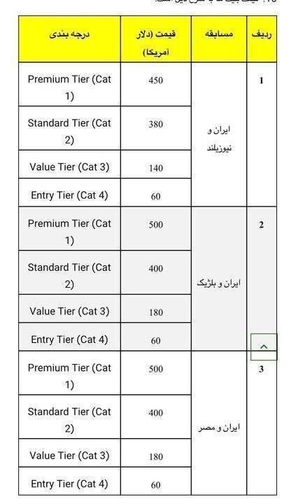

قیمت بلیت بازی‌های ایران در جام‌جهانی ۲۰۲۶ مشخص شد!

@AloSport

## alonews — post 120876

  <a href="telegram/content/alonews_120876_1779114422.webm" target="_blank">🎬 Download video</a>

👈نفتکش هَندی‌مَکس با پرچم روسیه که تحت تحریم آمریکا قرار داره، فقط از روی لجبازی مدام وارد محدوده محاصره دریایی آمریکا میشه و دوباره برمیگرده تا محاصره ی دریایی آمریکارو مسخره کنه!

✅ @AloNews خبر جنگ

## alonews — post 120875

  <a href="telegram/content/alonews_120875_1779114423.webm" target="_blank">🎬 Download video</a>

👈رویترز به نقل از یک منبع ایرانی: پیشنهاد اصلاح‌شده تهران خواستار پایان دائمی جنگ، لغو تحریم‌ها و [لغو محاصره] است

🔴تهران پرونده هسته‌ای خود را در مراحل بعدی مورد بحث قرار خواهد داد

🔴تهران از واشنگتن خواستار آزادسازی تمام دارایی‌های مسدودشده است

🔴واشنگتن تاکنون با آزادسازی تنها ۲۵٪ از دارایی‌های تهران طبق یک جدول زمانی مرحله‌ای موافقت کرده است

✅ @AloNews خبر جنگ

## alonews — post 120874

  <a href="telegram/content/alonews_120874_1779114423.webm" target="_blank">🎬 Download video</a>

👈 کاخ سفید: امنیت تیم ملی ایران در جام جهانی را تأمین می‌کنیم

✅ @AloNews خبر جنگ

## alonews — post 120873

  <a href="telegram/content/alonews_120873_1779114423.webm" target="_blank">🎬 Download video</a>

👈منبع ایرانی به رویترز: ایالات متحده در مذاکرات جاری، از جمله در مورد بحث هسته‌ای، انعطاف‌پذیری نشان داده است

✅ @AloNews خبر جنگ

## alonews — post 120872

  <a href="telegram/content/alonews_120872_1779114423.webm" target="_blank">🎬 Download video</a>

👈یک نفتکش ایرانی تحت تحریم‌های آمریکا که ۲ هفتهٔ پیش در سواحل هند بود حالا در جزیرهٔ خارگ پهلو گرفته است.

🔴این نفتکش حامل ال‌پی‌جی بدون اینکه شناسایی شود از خط محاصرهٔ آمریکا گذشته و وارد آب‌های ایران شده است

✅ @AloNews خبر جنگ

## alonews — post 120871

  <a href="telegram/content/alonews_120871_1779114423.webm" target="_blank">🎬 Download video</a>

👈رئیس‌جمهور کوبا: هر حمله نظامی به کوبا به حمام خون و عواقب غیرقابل پیش‌بینی منجر می‌شود

✅ @AloNews خبر جنگ

## alonews — post 120870

  <a href="telegram/content/alonews_120870_1779114423.webm" target="_blank">🎬 Download video</a>

👈سپاه قم: تا ساعت ۱۷:۳۰ امروز عملیات انهدام مهمات جنگ رمضان اجرا می‌شود؛ مردم نگران صدای ناشی از این انفجارها نباشند

✅ @AloNews خبر جنگ

## alonews — post 120869

  <a href="telegram/content/alonews_120869_1779114423.webm" target="_blank">🎬 Download video</a>

👈قائم پناه:هفتاد درصد مردم مخالف محدودیت اینترنت هستند

✅ @AloNews خبر جنگ

## alonews — post 120868

  <a href="telegram/content/alonews_120868_1779114424.webm" target="_blank">🎬 Download video</a>

👈مدیرعامل آبفای تهران: تابستان امسال جیره‌بندی و قطعی آب نخواهیم داشت

✅ @AloNews خبر جنگ

## alonews — post 120867

  <a href="telegram/content/alonews_120867_1779114424.webm" target="_blank">🎬 Download video</a>

👈معاون سازمان بورس: شرکت‌هایی که در جنگ آسیب دیده‌اند فردا نمادشان بسته خواهد بود.

🔴 در مجموع، حدود ۴۲ نماد اصلی بازار فردا بسته خواهند ماند که چیزی حدود ۳۵ تا ۳۶ درصد ارزش بازار را شامل می‌شود

✅ @AloNews خبر جنگ

---
📅 بروزرسانی: 1405/02/28 14:17
---

## VahidOOnLine — post 240778

  

♦️خبرگزاری تسنیم، وابسته به سپاه پاسداران، روز دوشنبه ۲۸ اردیبهشت ماه به نقل از «یک منبع نزدیک به تیم مذاکره‌کننده» جمهوری اسلامی نوشت که تهران «جدیدترین متن خود را در ۱۴ بند به واسطه پاکستانی تحویل داده است و میانجی پاکستانی آن را به آمریکایی‌ها ارائه می‌کند.»

ساعتی پیش از انتشار این خبر رویترز به نقل از یک مقام پاکستانی گزارش کرده بود که اسلام‌آباد یکشنبه شب طرح پیشنهادی اصلاح‌شده جمهوری اسلامی ایران را به واشنگتن تحویل داده است.

تسنیم در گزارش خود به نقل از این منبع نوشت: « آمریکایی‌ها اخیرا در پاسخ به متن پیشین ایران که آن هم در ۱۴ بند ارائه شده بود، متنی ارسال کرده بودند. ایران نیز مجددا بر اساس روال چند وقت اخیر در تبادل پیام، متن خود را پس از انجام اصلاحاتی مجددا در ۱۴ بند به واسطه پاکستانی ارائه کرد. متن جدید ایران بر موضوع مذاکرات پایان جنگ و اقدامات اعتمادساز طرف آمریکایی متمرکز است.»

آمریکا هنوز واکنشی به این خبر نشان نداده است. دونالد ترامپ پیش از این گفته بود پس از خواندن خط اول طرح پیشنهادی قبلی جمهوری اسلامی ایران از آن خوشش نیامده و آن را کنار انداخته است.
‌🇸🇦 Indypersian

🤖 @VahidOOnLine

## VahidOOnLine — post 240777

  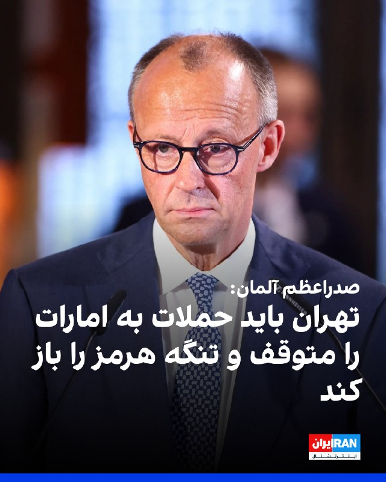

فریدریش مرتس، صدراعظم آلمان، روز دوشنبه اعلام کرد برلین حملات جمهوری اسلامی به امارات متحده عربی و سایر کشورها را محکوم می‌کند و افزود تهران باید تهدید همسایگان خود را متوقف کرده و تنگه هرمز را بدون محدودیت باز نگه دارد.

فریدریش مرتس در پیامی در شبکه ایکس نوشت: «حملات به تاسیسات هسته‌ای تهدیدی برای امنیت مردم در سراسر منطقه است. نباید هیچ‌گونه تشدید بیشتر خشونت رخ دهد.»

او همچنین تاکید کرد حکومت ایران باید وارد مذاکرات جدی با آمریکا شود.
‌🏁 🇬🇧 IranintlTV

🤖 @VahidOOnLine

## VahidOOnLine — post 240776

  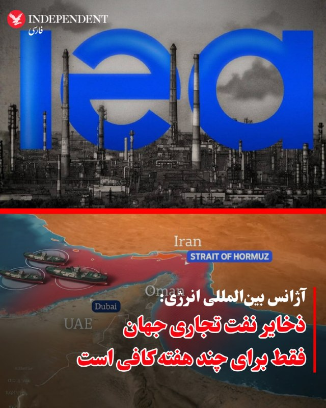

⭕️آژانس بین‌المللی انرژی: ذخایر نفت تجاری جهان فقط برای چند هفته کافی است

♦️فاتح بیرول، مدیر آژانس بین‌المللی انرژی، هشدار داد که در پی جنگ ایران و بسته ماندن تنگه هرمز، ذخایر تجاری نفت جهان با سرعت زیادی در حال کاهش است و این ذخایر فقط برای چند هفته دیگر دوام خواهد داشت.

بیرول در نشست گروه هفت در پاریس گفت آزادسازی ذخایر راهبردی نفت تاکنون روزانه حدود ۲.۵ میلیون بشکه نفت به بازار اضافه کرده است، اما تاکید کرد که این ذخایر نامحدود نیستند.

او هشدار داد ادامه اختلال در مسیرهای اصلی انتقال انرژی، به‌ویژه تنگه هرمز، می‌تواند فشار بیشتری بر بازار جهانی نفت وارد کند و کشورها را با بحران تازه‌ای در تامین انرژی روبه‌رو سازد.

تنگه هرمز یکی از مهم‌ترین گذرگاه‌های انرژی جهان است و بسته ماندن آن در جریان جنگ ایران، بازار نفت و گاز را با نوسان شدید و نگرانی گسترده روبه‌رو کرده است.
‌🇸🇦 Indypersian

🤖 @VahidOOnLine

## VahidOOnLine — post 240775

  

رمضان‌علی سنگدوینی، نماینده مجلس، هشدار داد برخی اقلام با «قیمت‌های گزاف و چندبرابر» وارد بازار می‌شوند. او افزود: «آیا مردم با کالابرگ یک میلیون تومانی توان خرید مرغ کیلویی ۴۰۰ هزار تومانی را دارند؟»

زهرا سعیدی مبارکه، دیگر نماینده مجلس، با اشاره به افزایش قیمت مواد غذایی در کشور گفت هر کیلو برنج پاکستانی در پاکستان کمتر از یک دلار و در آلمان یک یورو است، اما در ایران سه دلار به مردم فروخته می‌شود.

علی خزائی، نماینده مجلس، هم سیاست‌های ارزی دولت و افزایش مداوم نرخ ارز از سوی بانک مرکزی را «کاملا اشتباه» دانست و گفت این سیاست‌ها به گرانی و تورم در ایران دامن می‌زنند.
‌🏁 🇬🇧 IranintlTV

🤖 @VahidOOnLine

## VahidOOnLine — post 240774

  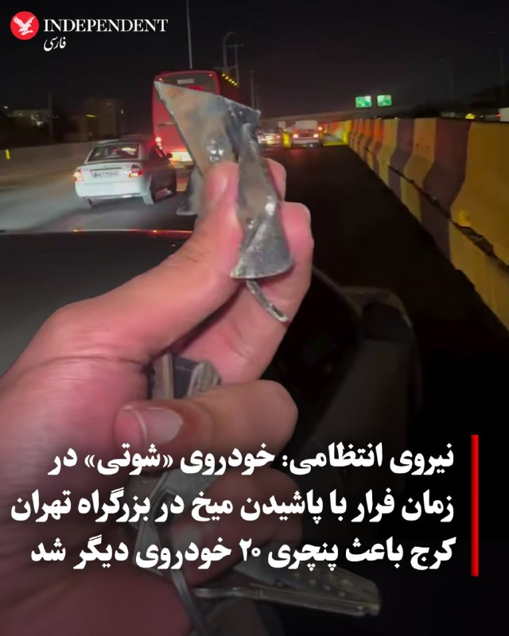

♦️ رسانه‌های داخلی ایران روز دوشنبه ۲۸ اردیبهشت ماه از بسته شدن بزرگراه تهران-کرج در نیمه‌شب گذشته و در جریان یک تعقیب و گریز پلیسی خبر دادند.

به گزارش ایرنا به نقل از فرماندهی پلیس راهور تهران، یک خودروی «شوتی» (حامل کالای قاچاق) در زمان فرار از دست ماموران روی اتوبان میخ «سه‌پر» ریخت و باعث پنچر شدن دست‌کم ۲۹ خودروی دیگر شد.

به گفته پلیس، این خودرو شناسایی و توقیف شده است. هنوز گزارشی درباره محموله این خودرو منتشر نشده است.
‌🇸🇦 Indypersian

🤖 @VahidOOnLine

## VahidOOnLine — post 240773

  <a href="telegram/content/VahidOOnLine_240773_1779101278.mp4" target="_blank">🎬 Download video</a>

یوروپل، آژانس همکاری پلیسی اتحادیه اروپا، اعلام کرد در یک اقدام هماهنگ برای مقابله با محتوای «تروریستی» در فضای مجازی، ۱۴ هزار و ۲۰۰ پیوند مرتبط با فعالیت‌های سپاه پاسداران شناسایی شده است.

بر اساس اعلام یوروپل، این عملیات با هدف مقابله با «زیست‌بوم تبلیغاتی» سپاه پاسداران در اینترنت انجام شد و محققان، هزاران پست و پیوند را برای ارجاع به ارائه‌دهندگان خدمات آنلاین هدف قرار دادند.
‌🏁 🇬🇧 ManotoTV

🤖 @VahidOOnLine

## VahidOOnLine — post 240772

  <a href="telegram/content/VahidOOnLine_240772_1779101278.mp4" target="_blank">🎬 Download video</a>

امروز، ۲۸ اردیبهشت ۱۴۰۵، هم‌زمان با زادروز محمدرشید مظاهری، دروازه‌بان سابق تیم ملی فوتبال ایران، جمعی از ایرانیان و اعضای «حزب پادشاهی‌خواه میهن‌پرستان ایران» مقابل کنسولگری جمهوری اسلامی در هامبورگ تجمع کردند.

تجمع‌کنندگان با گرامی‌داشت زادروز این ورزشکار، خواستار آزادی بی‌قیدوشرط او و همه زندانیان سیاسی شدند.

رشید مظاهری، بازیکن سابق استقلال، سپاهان، تراکتور و ذوب‌آهن، در ۵ اسفند ۱۴۰۴ پس از انتشار پستی انتقادی علیه علی خامنه‌ای بازداشت شد و بر اساس گزارش‌ها، نزدیک به سه ماه است در وضعیت ناپدیدشدن قهری قرار دارد.

گزارش‌ها و ویدیوهای خود را از طریق واتس‌اپ یا تلگرام برای منوتو بفرستید:

۰۰۴۴۷۵۹۰۸۹۹۹۹۹
‌🏁 🇬🇧 ManotoTV

🤖 @VahidOOnLine

## VahidOOnLine — post 240771

  

یوروپل، آژانس اتحادیه اروپا برای همکاری در اجرای قانون، اعلام کرد در اقدامی هماهنگ برای مقابله با محتوای «تروریستی» در فضای مجازی، در مجموع ۱۴ هزار و ۲۰۰ پست و پیوند مرتبط با سپاه پاسداران هدف قرار گرفته است.

به گفته یوروپل، این اقدام با هدایت واحد ارجاع اینترنتی اتحادیه اروپا انجام شد و بر شناسایی و اخلال در حضور آنلاین سپاه که برای انتشار تبلیغات، جذب حامیان و تامین مالی به کار می‌رفت، تمرکز داشت. این تصمیم به نهادهای اجرای قانون اجازه می‌دهد علیه فعالیت اعضا و نهادهای پشتیبان آن در اتحادیه اروپا اقدام کنند.

در این عملیات، ۱۹ کشور شامل اتریش، بلژیک، بوسنی و هرزگوین، بلغارستان، چک، دانمارک، استونی، فنلاند، فرانسه، آلمان، یونان، مجارستان، ایتالیا، هلند، پرتغال، اسپانیا، سوئد، اوکراین و آمریکا مشارکت داشتند. مقام‌ها بین ۲۲ اسفند تا هشتم اردیبهشت در مراحل هماهنگ زیر نظر یوروپل اقدام به جمع‌آوری اطلاعات، تطبیق اهداف و ارجاع مشترک محتوا به پلتفرم‌های آنلاین کردند.
‌🏁 🇬🇧 IranintlTV

🤖 @VahidOOnLine

## VahidOOnLine — post 240770

  <a href="telegram/content/VahidOOnLine_240770_1779101282.mp4" target="_blank">🎬 Download video</a>

♦️اسماعیل بقایی، سخنگوی وزارت امور خارجه جمهوری اسلامی روز دوشنبه ۲۸ اردیبهشت‌ماه و همزمان با ادامه «بن‌بست» در گفتگوهای تهران و واشنگتن  گفت: مذاکرات در این مرحله بر پایان جنگ متمرکز است و بنابراین ما از حقوق خودمان بر اساس معاهده منع گسترش تسلیحات هسته‌ای عدول نخواهیم کرد.

دونالد ترامپ، رئیس جمهوری آمریکا تاکید می‌کند که پایان دادن به برنامه هسته‌ای جمهوری اسلامی یکی از پیش‌شرط‌های دستیابی به هر توافقی برای پایان دادن به جنگ است.
‌🇸🇦 Indypersian

🤖 @VahidOOnLine

## VahidOOnLine — post 240769

  <a href="telegram/content/VahidOOnLine_240769_1779101284.mp4" target="_blank">🎬 Download video</a>

رویترز روز دوشنبه ۲۸ اردیبهشت به نقل از یک منبع پاکستانی گزارش داد پاکستان پیشنهاد بازنگری‌شده جمهوری اسلامی برای پایان دادن به درگیری در خاورمیانه را به آمریکا منتقل کرده است.

این منبع پاکستانی گفت مذاکرات صلح همچنان در بن‌بست به نظر می‌رسد و «زمان زیادی» برای کاهش اختلاف‌ها باقی نمانده است. او افزود هر دو طرف «مدام مواضع خود را تغییر می‌دهند.»
‌🏁 🇬🇧 ManotoTV

🤖 @VahidOOnLine

## VahidOOnLine — post 240768

  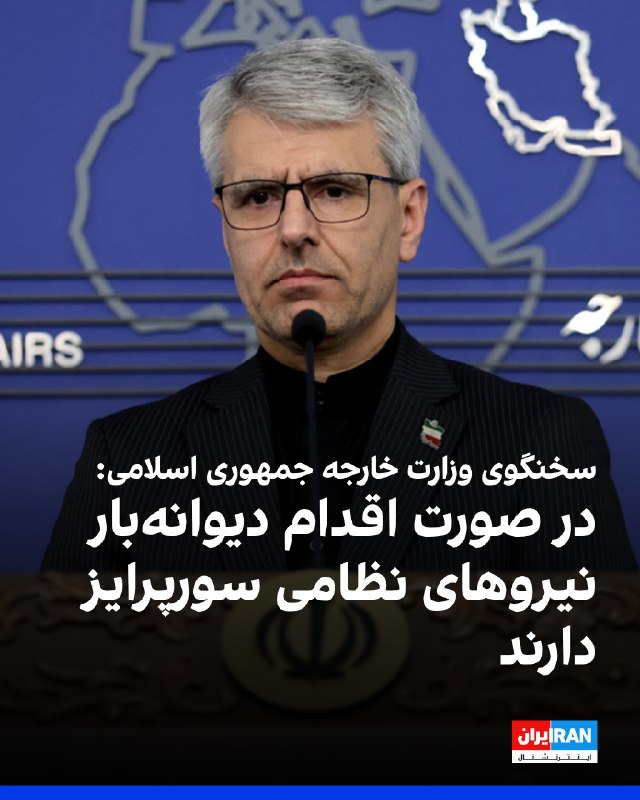

اسماعیل بقائی، سخنگوی وزارت خارجه جمهوری اسلامی، درباره احتمال ازسرگیری جنگ گفت دیپلماسی جمهوری اسلامی «هوشمندانه» است، اما تهران با تمام توان برای هر سناریویی آماده است.

اسماعیل بقائی گفت: «دیپلماسی جمهوری اسلامی هوشمندانه است»، اما در عین حال تاکید کرد جمهوری اسلامی در برابر هر اقدام «دیوانه‌باری» با تمام توان دفاع می‌کند.

او همچنین افزود نیروهای نظامی «سورپرایزهایی» خواهند داشت.
‌🏁 🇬🇧 IranintlTV

🤖 @VahidOOnLine

## VahidOOnLine — post 240767

  <a href="telegram/content/VahidOOnLine_240767_1779101286.mp4" target="_blank">🎬 Download video</a>

بیمارستان الغدیر تهران در شب‌های ۱۸ و ۱۹ دی‌ماه یکی از قتل‌گاه‌های جمهوری اسلامی بود. در پی کارزار ایران‌اینترنشنال در خصوص ارسال اطلاعات بیشتر برای شناسایی پیکرهای جاویدنامان در این بیمارستان، اطلاعات و تصاویری به دست ما رسیده که بخشی از آن را در این ویدیو می‌بینید.
شاهدان و خانواده‌ها می‌توانند برای ثبت حقیقت این جنایت، اسناد، تصاویر و روایت‌های خود را از طریق بات اینتل‌مدیا ارسال کنند.
‌🏁 🇬🇧 IranintlTV

🤖 @VahidOOnLine

## VahidOOnLine — post 240766

  

♦️دونالد ترامپ، رئیس جمهوری آمریکا می‌گوید مقام‌های جمهوری اسلامی برای امضای توافق با آمریکا بی‌تابی می‌کنند.

ترامپ در مصاحبه ای با مجله فورچون (Fortune) که روز دوشنبه ۲۸ اردیبهشت منتشر شد، گفت: «می‌توانم به شما یک چیز بگویم: آن‌ها برای امضای توافق می‌میرند».

این سخنان در حالی عنوان می‌شود که ترامپ شامگاه یکشنبه اعلام کرد زمان برای جمهوری اسلامی به سرعت‌ در حال گذر است و اگر توافقی امضا نشود، چیزی برایشان باقی نخواهد ماند.
‌🇸🇦 Indypersian

🤖 @VahidOOnLine

## VahidOOnLine — post 240765

  

اسماعیل بقایی، سخنگوی وزارت خارجه جمهوری اسلامی، در پاسخ به پرسشی درباره گزارش‌ها از قصد امارات متحده عربی برای حمله به جمهوری اسلامی و سفر مقام‌های اسرائیلی به این کشور گفت: «ما قرار نیست با گزارش‌ها این واقعیت را از یاد ببریم که تهدید اصلی کدام طرف است.»

بقایی با تهدید کشورهای منطقه از جمله امارات متحده عربی گفت: « اماراتی‌ها از اتفاقاتی که در دو سه ماه اخیر افتاد باید درس بگیرند.»

او اضافه کرد: «ما با هیچ کشور منطقه دشمنی نداریم و با همه همسایه هستیم. همه را به مراقبت به دسیسه‌های طرف‌های خارجی برای ایجاد تفرقه دعوت می‌کنیم.»

بقایی گفت رفت‌وآمد مقام‌های اسرائیلی به منطقه از دید جمهوری اسلامی «مخفی نبوده» و این رفت‌وآمدها، اسرائیل را برای ادامه «جنایات» در منطقه جری‌تر کرده است.
‌🏁 🇬🇧 IranintlTV

🤖 @VahidOOnLine

## VahidOOnLine — post 240764

  

♦️ خبرگزاری رویترز روز دوشنبه ۲۸ اردیبهشت‌ماه به نقل از یک منبع پاکستانی گزارش کرد که اسلام‌آباد شامگاه یکشنبه «طرح پیشنهادی اصلاح شده»  جمهوری اسلامی ایران برای پایان دادن به جنگ را با آمریکا «به اشتراک گذاشته است».

این مقام پاکستانی که خواست نامش فاش نشود در پاسخ به پرسش رویترز درباره چالش زمان در حل اختلاف تهران و واشنگتن گفت: «ما وقت زیادی نداریم» و هر دو کشور به تغییر اهداف خود ادامه می‌دهند».

این خبر در حالی منتشر می‌شود که دونالد ترامپ، شامگاه یکشنبه هشدار داده بود که اگر ایران توافق را امضا نکند،‌ چیزی برایش باقی نخواهد ماند.
‌🇸🇦 Indypersian

🤖 @VahidOOnLine

## VahidOOnLine — post 240763

  

دونالد ترامپ، رییس‌جمهوری آمریکا، در مصاحبه با مجله فورچون گفت مقام‌های جمهوری اسلامی برای امضای توافق «بی‌تاب» هستند، اما پس از رسیدن به توافق، متنی ارسال می‌کند که به گفته او «هیچ ربطی به توافق انجام‌شده ندارد».

ترامپ گفت: «ایرانی‌ها برای امضای توافق بی‌تاب هستند. اما وقتی توافق می‌کنند، بعد از آن برگه‌ای برایت می‌فرستند که هیچ ربطی به توافقی که انجام داده‌اند ندارد. من به آن‌ها می‌گویم شما دیوانه هستید؟»
‌🏁 🇬🇧 IranintlTV

🤖 @VahidOOnLine

## VahidOOnLine — post 240762

  <a href="telegram/content/VahidOOnLine_240762_1779101291.mp4" target="_blank">🎬 Download video</a>

اسماعیل بقایی، سخنگوی وزارت خارجه جمهوری اسلامی، روز دوشنبه ۲۸ اردیبهشت، در نشست خبری خود گفت تهدید و فشار اقتصادی آمریکا نتوانسته تهران را از پیگیری حقوق خود منصرف کند.

بقایی با اشاره به تهدیدهای مطرح‌شده علیه جمهوری اسلامی گفت: «در صورت کوچک‌ترین خطایی از سوی طرف‌های مقابل، می‌توانیم خوب جواب دهیم.» او اضافه کرد در روزهای اخیر مردم در میدان‌های تهران می‌گویند: «تو رستم تهمتنی و بزن که خوب می‌زنی.»
‌🏁 🇬🇧 ManotoTV

🤖 @VahidOOnLine

## VahidOOnLine — post 240761

  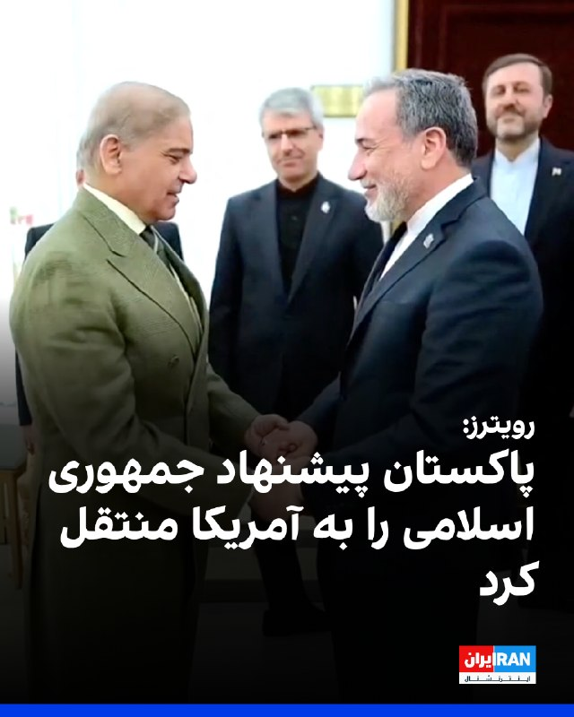

خبرگزاری رویترز به نقل از یک منبع پاکستانی گزارش داد که اسلام‌آباد پیشنهاد اصلاح‌شده جمهوری اسلامی برای پایان دادن به درگیری در خاورمیانه را با آمریکا به اشتراک گذاشته است.

این منبع در پاسخ به پرسشی درباره زمان لازم برای رفع اختلاف‌ها گفت: «وقت زیادی نداریم.» او افزود دو کشور «مدام خط قرمزهای خود را تغییر می‌دهند.»
‌🏁 🇬🇧 IranintlTV

🤖 @VahidOOnLine

## VahidOOnLine — post 240760

  <a href="telegram/content/VahidOOnLine_240760_1779101294.mp4" target="_blank">🎬 Download video</a>

رالی خودرها در سن‌دیگو در حمایت از مردم ایران، یکشنبه ۲۷ اردیبهشت
‌🏁 🇬🇧 ManotoTV

🤖 @VahidOOnLine

## VahidOOnLine — post 240759

  <a href="telegram/content/VahidOOnLine_240759_1779101297.mp4" target="_blank">🎬 Download video</a>

اسماعیل بقایی، سخنگوی وزارت خارجه جمهوری اسلامی، روز دوشنبه ۲۸ اردیبهشت گفت مواردی مانند آزادسازی دارایی‌های مسدودشده ایران و رفع تحریم‌ها «شرط» تهران نیست، بلکه «مطالبات روشن و به‌حق» جمهوری اسلامی در مذاکرات است.

بقایی در پاسخ به پرسشی درباره شروط جمهوری اسلامی گفت ممکن است طرف مقابل موضوعات را به تشخیص خود نام‌گذاری کند، اما «مطالبات ما روشن است.»

سخنگوی وزارت خارجه جمهوری اسلامی همچنین رفع تحریم‌ها را یکی دیگر از مطالبات ایران دانست و گفت این موارد در هر مذاکره‌ای از سوی هیئت مذاکره‌کننده جمهوری اسلامی «با جدیت» پیگیری می‌شود.
‌🏁 🇬🇧 ManotoTV

🤖 @VahidOOnLine

## mwarmonitor — post 9236

  

✈️🇸🇦یک فروند ایرباس سوخت رسان - ترابری A330 MRTT نیروی هوایی سلطنتی عربستان سعودی در حال حاضر بر فراز شرق عربستان سعودی فعال است؛ این هواپیما پیش‌تر نیز در نزدیکی حَفَرالباطن و نزدیک مرز عراق عملیات داشته است.

🔸آیا این تحرکات می‌تواند نشانه‌ای از حملات احتمالی علیه شبه‌نظامیان عراقی در پی حمله پهپادی روز گذشته باشد!!

@mwarmonitor

## mwarmonitor — post 9235

🔴 خبرنگار الجزیره به نقل از منبعی در وزارت کشور پاکستان: وزیر کشور، سفر خود به تهران را برای روز سوم نیز تمدید کرده است. @mwarmonitor

## mwarmonitor — post 9234

📝تحلیل اختصاصی کانال 🇵🇰🇮🇷سفر از پیش‌اعلام‌نشده وزیر کشور پاکستان به تهران، بیش از آنکه یک رایزنی سنتی باشد، یک آفند دیپلماتیک پیشگیرانه است. در عرف بین‌الملل، حضور فیزیکی یک مقام ارشد از کشوری غیردرگیر در پایتختِ هدف، به عنوان یک ضربه‌گیر امنیتی عمل می‌کند؛…

## mwarmonitor — post 9233

🇺🇸🇵🇰🇮🇷پاکستان شامگاه یکشنبه یک پیشنهاد اصلاح‌شده از سوی ایران را با ایالات متحده به اشتراک گذاشت که هدف آن پایان دادن به جنگ است — رویترز @mwarmonitor

## mwarmonitor — post 9232

🇺🇸🇵🇰🇮🇷پاکستان شامگاه یکشنبه یک پیشنهاد اصلاح‌شده از سوی ایران را با ایالات متحده به اشتراک گذاشت که هدف آن پایان دادن به جنگ است — رویترز

@mwarmonitor

## mwarmonitor — post 9231

  <a href="telegram/content/mwarmonitor_9231_1779101300.mp4" target="_blank">🎬 Download video</a>

📝 شاید واستون سوال پیش بیاد کدوم حیونی پیراهن امضا شده اینا رو می‌خواد؟ جوابش راحته: همون جماعتی که شب‌ها پرچم می‌چرخوندن و تهِ افتخار زندگی‌شون، سواری دادن به این شوهای مسخره‌ است!

🔸اما اوج جنجال و وقاحت این کمدی، حرکت حماسیِ «آقای دکتر بیرانوند» هست. یارو با چنان سیسِ الیور کانی و قیافه‌ حق‌به‌جانبی می‌آد جلو که انگار داره بیانیه سازمان ملل رو تایید می‌کنه! خیلی جدی و طلبکارانه می‌گه: «کجا رو امضا کنم؟»

🔹آخه پوفیوز! تو با اون سطح از سواد و مغزِ آکبندت، بزرگترین توهین به مفهوم خودکاری! تو رو چه به امضا کردن؟ نهایتِ هنری که باید از خودت نشون بدی اینه که استامپ رو بذارن جلوت، انگشت بزنی و جفتک بندازی!

@mwarmonitor

## pm_afshaa — post 90944

  <a href="telegram/content/pm_afshaa_90944_1779101302.webm" target="_blank">🎬 Download video</a>

🔴کانال 13 اسرائیل: طی 24 ساعت گذشته ده‌ها هواپیمای باری خالی از اسرائیل به پایگاه‌های آمریکایی در آلمان رفتن، مهمات بارگیری کردن و سپس به اسرائیل بازگشتن.

ارتش اسرائیل در روزهای اخیر در سطح بالایی از آماده‌باش قرار داشته، اما جزئیاتی درباره نوع مهمات یا هدف این انتقال‌ها منتشر نشده.

💧 Rainbet.com the #1 Non-KYC Crypto Casino & Sportsbook @rainbetcom

😁 @Pm_Afshaa

## pm_afshaa — post 90943

  <a href="telegram/content/pm_afshaa_90943_1779101303.webm" target="_blank">🎬 Download video</a>

🔴منابع پاکستانی:آخرین پیشنهاد ایران برای پایان جنگ، یکشنبه شب(دیشب) به طرف آمریکایی ارسال شد 
💧 Rainbet.com the #1 Non-KYC Crypto Casino & Sportsbook @rainbetcom 
😁 @Pm_Afshaa

## pm_afshaa — post 90942

🔴گسترش آلودگی نفتی ایران به سواحل کویت؛ زنگ خطر فاجعه در خلیج فارس؛بر اساس تصاویر منتشر شده در شبکه‌های اجتماعی، تداوم نشت نفت از زیرساخت‌های ایران، اکنون با عبور از مرزهای آبی، به سواحل کویت رسیده

💧 Rainbet.com the #1 Non-KYC Crypto Casino & Sportsbook @rainbetcom

😁 @Pm_Afshaa

## pm_afshaa — post 90941

🔴ترامپ : ایران داره التماس می‌کنه که یه توافق امضا بشه

💧 Rainbet.com the #1 Non-KYC Crypto Casino & Sportsbook @rainbetcom

😁 @Pm_Afshaa

## pm_afshaa — post 90940

🔴منابع پاکستانی:آخرین پیشنهاد ایران برای پایان جنگ، یکشنبه شب(دیشب) به طرف آمریکایی ارسال شد

💧 Rainbet.com the #1 Non-KYC Crypto Casino & Sportsbook @rainbetcom

😁 @Pm_Afshaa

## pm_afshaa — post 90939

🔴سی‌ان‌ان: پنتاگون فهرستی از اهداف برای حمله به ایران در صورت صدور دستور ترامپ آماده کرده

💧 Rainbet.com the #1 Non-KYC Crypto Casino & Sportsbook @rainbetcom

😁 @Pm_Afshaa

## pm_afshaa — post 90938

🔴سخنگوی وزارت امور خارجه بقایی:
تیم‌های فنی ما و عمان برای هماهنگی در پرونده تنگه هرمز دیدار کردند

ما با هیچ یک از کشورهای منطقه، از جمله امارات، دشمنی نداریم، ما همسایگانیم و تهران به دنبال صلح است

حضور آمریکا منطقه را در خطر دائمی قرار می‌دهد

ما از کشورهایی که سرزمین، منابع و آسمان خود را در اختیار متجاوزان قرار می‌دهند، گله‌مندیم

حق ما در غنی‌سازی اورانیوم را در مذاکرات مطرح نخواهیم کرد

💧 Rainbet.com the #1 Non-KYC Crypto Casino & Sportsbook @rainbetcom

😁 @Pm_Afshaa

## pm_afshaa — post 90937

انقدر که حرف گرونی بنزین تو آمریکا میزنین چرا حرفی از اینترنت گیگی 5 دلاری تو ایران نمیزنین!؟

## pm_afshaa — post 90936

  

کارشناسان معتبر عرب :

احمد خلیفه : داره اتفاق میوفته

💧 Rainbet.com the #1 Non-KYC Crypto Casino & Sportsbook @rainbetcom

😁 @Pm_Afshaa

## DEJradio — post 4694

  <a href="telegram/content/DEJradio_4694_1779101304.webm" target="_blank">🎬 Download video</a>

🔺📢 جمهوری اسلامی در وقت‌های اضافه
یادداشت: فریبرز کرمی‌زند

در روزهای گذشته تصاویری از صداوسیمای حکومتی پخش شد که در استودیوهای آن، یکی از نیروهای سـ.ـپاه پاسداران در حال آموزش استفاده از سلاح‌های انفرادی مانند AK-47 و تیربار چندمنظوره PK بود. هرچند از نحوه گفتار و توضیحات ناقص او به‌ وضوح پیداست که خود نیز نیاز به آموزش دارد، اما مسئله اصلی هدف از پخش چنین برنامه‌هایی است.

زمانیکه حکومت‌های تروریستی و خشن به پایان مسیر خود نزدیک می‌شوند، رفتارهایی از آنان سر می‌زند که لزوماً نمی‌توان برایشان توجیه منطقی یافت اما آنچه مسلم است، ترس عمیق حکومت از مردم ایران است؛ زیرا به‌ خوبی می‌داند ضربه نهایی را مردم وارد خواهند کرد.

به نظر می‌رسد نمایش سلاح در رسانه حکومتی تلاشی برای ارسال این پیام باشد که هرگونه اعتراض مردمی با واکنش سخت مواجه خواهد شد؛ تکرار همان ادبیاتی که پیش‌تر نیز از برخی چهره‌های نزدیک به حکومت مانند حسین یکتا از صداوسیما پخش شده بود، این‌بار در قالب تصویر و نمایش رسانه‌ای.

اما چنین نمایش‌هایی نه ‌تنها مانع خواست مردم برای آزادی نخواهد شد، بلکه شکاف میان حکومت و جامعه را عمیق‌تر و اراده معترضان برای تغییر را تقویت خواهد کرد و آنها را به سمت و سویی سوق خواهد داد که برای ایستادن در برابر حکومت به دنبال ابزارهای لازم بروند زیرا دست خالی ایستادن در برابر این جنایتکاران اشتباه است. لازم به ذکر است از این سلاح‌ها در دی‌ماه ۱۴۰۴ بر علیه مردم استفاده شده بود.

#صداوسیما #وقت_اضافه
@DEJradio

## DEJradio — post 4693

  <a href="telegram/content/DEJradio_4693_1779101305.webm" target="_blank">🎬 Download video</a>

🔺📢 "اقماری شرکت نفت هستم، بعد از جنگ پرواز نیست، ۳۰ ساعت طول می‌کشه با اتوبوس بیام تهران...

پیام دریافتی

#شرکت_نفت #تهران
@DEJradio

## DEJradio — post 4692

  <a href="telegram/content/DEJradio_4692_1779101306.webm" target="_blank">🎬 Download video</a>

🚨
🔸 چرا اصغر فرهادی در درون آشوویتس نقش بی‌طرف را بازی می‌کند؟

*پژمان گلچین، پژوهشگر فلسفه

#اصغر_فرهادی #آشوویتس
@DEJradio

## DEJradio — post 4690

  <a href="telegram/content/DEJradio_4690_1779101306.webm" target="_blank">🎬 Download video</a>

🚨
⭕️ انتقال گسترده مهمات به اسرائیل

شبکه ۱۳ اسرائیل از انتقال گسترده مهمات از پایگاه‌های آمریکایی در آلمان به اسرائیل خبر داد. بر اساس این گزارش، در شبانه‌روز گذشته ده‌ها هواپیمای باری اسرائیلی بدون بار به آلمان پرواز کرده، پس از دریافت محموله‌های تسلیحاتی به اسرائیل بازگشته‌اند.

این شبکه همچنین گزارش داد ارتش اسرائیل طی روزهای اخیر در وضعیت آماده‌باش گسترده قرار داشته و برای سناریوهای احتمالی، زمان‌بندی مشخصی تعیین کرده است.

#جنگ #حمله_نظامی
@DEJradio

## DEJradio — post 4689

  <a href="telegram/content/DEJradio_4689_1779101307.webm" target="_blank">🎬 Download video</a>

🕐
🔺 جمهوری اسلامی در محاصره

#ترامپ #جمهوری_اسلامی
@DEJradio

## DEJradio — post 4688

  <a href="telegram/content/DEJradio_4688_1779101307.mp4" target="_blank">🎬 Download video</a>

🚨
🔸 اختلاف میان نیروهای مسلح؛ چالش تازه حکومت

*رضا تمیزکار، پرسنل سابق نیروی انتظامی

#نیروهای_مسلح #نیروی_انتظامی
@DEJradio

## DEJradio — post 4687

  <a href="telegram/content/DEJradio_4687_1779101310.mp4" target="_blank">🎬 Download video</a>

🔺🎥 “قیمت برنج سه برابر شده، دیگه نمی‌تونیم بخریم

یک شهروند با ارسال دیدیویی نوشت، «این فیلم کوتاه رو از فروشگاهی در تجریش - تهران - براتون میفرستم. قیمت یک گونی برنج از سال گذشته تا اکنون سه برابر شده. یه زمانی برنج ساده ترین ماده غذایی در سفره ها بود ولی با این قیمت‌ها دیگه برنج هم نمی تونیم بخریم. این حکومت فاسد هر روز سفره های ما رو کوچکتر و کوچکتر میکنه!»

#تورم #برنج
@DEJradio

## DEJradio — post 4686

  <a href="telegram/content/DEJradio_4686_1779101312.webm" target="_blank">🎬 Download video</a>

🚨📢 جیمی دایمن رئیس و مدیرعامل بانک «جی‌پی‌مورگان چیس» [بزرگترین بانک آمریکا]، در گفت‌وگو با فرانسین لاکوا در برنامه «بلومبرگ اوپن اینترست» با اشاره به جنگ آمریکا و اسرائیل با جمهوری اسلامی گفت: «آن‌ها ۴۷ سال است که تجاوز، کشتار و قتل انجام می‌دهند.» او افزود جهان غرب نباید اجازه می‌داد جنگ‌های نیابتی ادامه پیدا کند و «باید سال‌ها پیش سر مار را می‌زد.»

رئیس جی‌پی‌مورگان با اشاره به ادامه بحران خاورمیانه گفت اکنون ریسک بیشتری وجود دارد، اما شاید فرصت بیشتری هم برای صلح ایجاد شده باشد، زیرا «مردم خواهان صلح هستند.»

دایمن ۷۰ ساله گفت: «ما نباید نسبت به نقشی که حکومت فعلی ایران طی سال‌های طولانی در گسترش تروریسم و کشتن هزاران نفر، از جمله آمریکایی‌ها و بسیاری از شهروندان خودش، داشته است چشم‌پوشی کنیم. این تهدید باید به شکلی مناسب مورد رسیدگی قرار گیرد.»

#دی۱۴۰۴ #جنگ
@DEJradio

## IranIntlTV — post 337760

  <a href="telegram/content/IranIntlTV_337760_1779101313.mp4" target="_blank">🎬 Download video</a>

سرخط خبرهای دوشنبه ۲۸ اردیبهشت
@iranintltv

## IranIntlTV — post 337759

  

فریدریش مرتس، صدراعظم آلمان، روز دوشنبه اعلام کرد برلین حملات جمهوری اسلامی به امارات متحده عربی و سایر کشورها را محکوم می‌کند و افزود تهران باید تهدید همسایگان خود را متوقف کرده و تنگه هرمز را بدون محدودیت باز نگه دارد.

فریدریش مرتس در پیامی در شبکه ایکس نوشت: «حملات به تاسیسات هسته‌ای تهدیدی برای امنیت مردم در سراسر منطقه است. نباید هیچ‌گونه تشدید بیشتر خشونت رخ دهد.»

او همچنین تاکید کرد حکومت ایران باید وارد مذاکرات جدی با آمریکا شود.
https://iranintl.com/202605188672

## IranIntlTV — post 337758

  <a href="telegram/content/IranIntlTV_337758_1779101315.mp4" target="_blank">🎬 Download video</a>

دونالد ترامپ، رییس‌جمهور آمریکا، گفت: «مقام‌های جمهوری اسلامی برای امضای توافق بی‌تاب هستند، اما پس از رسیدن به توافق، متنی ارسال می‌کنند که هیچ ربطی به توافق انجام‌شده ندارد.»

گفت‌وگو با علی‌حسین قاضی‌زاده، عضو تحریریه ایران‌اینترنشنال
@iranintltv

## IranIntlTV — post 337757

  <a href="telegram/content/IranIntlTV_337757_1779101317.mp4" target="_blank">🎬 Download video</a>

انور قرقاش، مشاور دیپلماتیک رییس امارات متحده عربی، نیروهای نیابتی مورد حمایت جمهوری اسلامی را مسئول حملات پهپادی دوشنبه به خاک این کشور دانست و آن را «اقدامی تروریستی» خواند.

گفت‌وگو با تروسکه صادقی، خبرنگار ایران‌اینترنشنال
@iranintltv

## IranIntlTV — post 337756

  <a href="telegram/content/IranIntlTV_337756_1779101320.mp4" target="_blank">🎬 Download video</a>

تیم اعزامی فوتبال ایران برای برگزاری اردوی آماده‌سازی پیش از جام جهانی و همچنین گرفتن ویزای آمریکا راهی ترکیه شد. این در حالی است که هنوز مشخص نیست کدام بازیکنان بتوانند ویزای آمریکا را دریافت کنند.
گفت‌وگو با مهدی رستم‌پور، خبرنگار ورزشی

@iranintltv

## IranIntlTV — post 337755

  

رمضان‌علی سنگدوینی، نماینده مجلس، هشدار داد برخی اقلام با «قیمت‌های گزاف و چندبرابر» وارد بازار می‌شوند. او افزود: «آیا مردم با کالابرگ یک میلیون تومانی توان خرید مرغ کیلویی ۴۰۰ هزار تومانی را دارند؟»

زهرا سعیدی مبارکه، دیگر نماینده مجلس، با اشاره به افزایش قیمت مواد غذایی در کشور گفت هر کیلو برنج پاکستانی در پاکستان کمتر از یک دلار و در آلمان یک یورو است، اما در ایران سه دلار به مردم فروخته می‌شود.

علی خزائی، نماینده مجلس، هم سیاست‌های ارزی دولت و افزایش مداوم نرخ ارز از سوی بانک مرکزی را «کاملا اشتباه» دانست و گفت این سیاست‌ها به گرانی و تورم در ایران دامن می‌زنند.
https://iranintl.com/202605181032

## IranIntlTV — post 337754

  <a href="telegram/content/IranIntlTV_337754_1779101323.mp4" target="_blank">🎬 Download video</a>

یک شهروند با ارسال پیامی به ایران‌اینترنشنال، نحوه قتل یک شهروند را به دست ماموران جمهوری اسلامی در شامگاه ۱۸ دی ۱۴۰۴ در اعتراضات وکیل‌آباد مشهد روایت می‌کند.

## IranIntlTV — post 337753

  

🔻اسماعیل بقایی، سخنگوی وزارت خارجه جمهوری اسلامی در نشست خبری درباره صدور روادید برای کادر فنی و تیم ملی فوتبال از سوی آمریکا گفت: «صدور روادید برای حضور تیم ملی فوتبال و کادر فنی، طبق مقررات فیفا، وظیفه دولت‌های میزبان است؛ بنابراین در اینجا فیفا طرف‌حسابِ ماست.»

🔹او گفت: «دو روز پیش در ترکیه، دیدار خوبی میان مسئولان فدراسیون فوتبال و مدیران ارشد فیفا برگزار شد و به ما اطمینان داده شد که فیفا تمام تلاش خود را به کار خواهد گرفت تا اطمینان حاصل شود که مقررات فیفا توسط میزبان‌ها رعایت می‌شود.»

🔹بقایی ادامه داد: «در عین حال، تردیدی نیست که آمریکا بارها تعهدات میزبانی خود را نقض کرده است. همچنین، اظهارنظرهایی که مطرح می‌شود مبنی بر اینکه ممکن است برای برخی از اعضای تیم ملی فوتبال به بهانه‌های خودساخته ویزا صادر نشود، اصلاً قابل قبول نیست و فدراسیون به صورت جدی این موضوع را پیگیری می‌کند.»

@iranintltvsport

## IranIntlTV — post 337752

  

یوروپل، آژانس اتحادیه اروپا برای همکاری در اجرای قانون، اعلام کرد در اقدامی هماهنگ برای مقابله با محتوای «تروریستی» در فضای مجازی، در مجموع ۱۴ هزار و ۲۰۰ پست و پیوند مرتبط با سپاه پاسداران هدف قرار گرفته است.

به گفته یوروپل، این اقدام با هدایت واحد ارجاع اینترنتی اتحادیه اروپا انجام شد و بر شناسایی و اخلال در حضور آنلاین سپاه که برای انتشار تبلیغات، جذب حامیان و تامین مالی به کار می‌رفت، تمرکز داشت. این تصمیم به نهادهای اجرای قانون اجازه می‌دهد علیه فعالیت اعضا و نهادهای پشتیبان آن در اتحادیه اروپا اقدام کنند.

در این عملیات، ۱۹ کشور شامل اتریش، بلژیک، بوسنی و هرزگوین، بلغارستان، چک، دانمارک، استونی، فنلاند، فرانسه، آلمان، یونان، مجارستان، ایتالیا، هلند، پرتغال، اسپانیا، سوئد، اوکراین و آمریکا مشارکت داشتند. مقام‌ها بین ۲۲ اسفند تا هشتم اردیبهشت در مراحل هماهنگ زیر نظر یوروپل اقدام به جمع‌آوری اطلاعات، تطبیق اهداف و ارجاع مشترک محتوا به پلتفرم‌های آنلاین کردند.
https://iranintl.com/202605183052

## IranIntlTV — post 337751

  

اسماعیل بقائی، سخنگوی وزارت خارجه جمهوری اسلامی، درباره احتمال ازسرگیری جنگ گفت دیپلماسی جمهوری اسلامی «هوشمندانه» است، اما تهران با تمام توان برای هر سناریویی آماده است.

اسماعیل بقائی گفت: «دیپلماسی جمهوری اسلامی هوشمندانه است»، اما در عین حال تاکید کرد جمهوری اسلامی در برابر هر اقدام «دیوانه‌باری» با تمام توان دفاع می‌کند.

او همچنین افزود نیروهای نظامی «سورپرایزهایی» خواهند داشت.
https://iranintl.com/202605183625

## IranIntlTV — post 337750

  <a href="telegram/content/IranIntlTV_337750_1779101328.mp4" target="_blank">🎬 Download video</a>

بیمارستان الغدیر تهران در شب‌های ۱۸ و ۱۹ دی‌ماه یکی از قتل‌گاه‌های جمهوری اسلامی بود. در پی کارزار ایران‌اینترنشنال در خصوص ارسال اطلاعات بیشتر برای شناسایی پیکرهای جاویدنامان در این بیمارستان، اطلاعات و تصاویری به دست ما رسیده که بخشی از آن را در این ویدیو می‌بینید.
شاهدان و خانواده‌ها می‌توانند برای ثبت حقیقت این جنایت، اسناد، تصاویر و روایت‌های خود را از طریق بات اینتل‌مدیا ارسال کنند.

## IranIntlTV — post 337749

  

اسماعیل بقایی، سخنگوی وزارت خارجه جمهوری اسلامی، در پاسخ به پرسشی درباره گزارش‌ها از قصد امارات متحده عربی برای حمله به جمهوری اسلامی و سفر مقام‌های اسرائیلی به این کشور گفت: «ما قرار نیست با گزارش‌ها این واقعیت را از یاد ببریم که تهدید اصلی کدام طرف است.»

بقایی با تهدید کشورهای منطقه از جمله امارات متحده عربی گفت: « اماراتی‌ها از اتفاقاتی که در دو سه ماه اخیر افتاد باید درس بگیرند.»

او اضافه کرد: «ما با هیچ کشور منطقه دشمنی نداریم و با همه همسایه هستیم. همه را به مراقبت به دسیسه‌های طرف‌های خارجی برای ایجاد تفرقه دعوت می‌کنیم.»

بقایی گفت رفت‌وآمد مقام‌های اسرائیلی به منطقه از دید جمهوری اسلامی «مخفی نبوده» و این رفت‌وآمدها، اسرائیل را برای ادامه «جنایات» در منطقه جری‌تر کرده است.
https://iranintl.com/202605189537

## IranIntlTV — post 337748

  <a href="telegram/content/IranIntlTV_337748_1779101331.mp4" target="_blank">🎬 Download video</a>

یک شهروند با ارسال پیامی به ایران‌اینترنشنال می‌گوید اینترنت پرو خریده و با وجود مصرف کم، بعد از دو روز به او پیام داده‌اند که نصف حجم را مصرف کرده‌اند: «اصلا نمی‌فهمم چطور این حجم استفاده شده. بنظر می‌رسد دولت از همین هم سوءاستفاده می‌کند.»

## IranIntlTV — post 337747

  

🔻فوتبال آلمان شاهد یکی از بزرگ‌ترین شگفتی‌های تاریخ خود است؛ باشگاه کوچک «الفرسبرگ» (SVE) با پیروزی ۳ بر صفر مقابل مونستر، برای نخستین بار در تاریخ ۱۰۹ ساله‌ی خود به بوندس‌لیگا صعود کرد. این تیم که در ایالت زارلاند واقع شده، نماینده‌ی شهری با جمعیت تنها ۱۳ هزار نفر است.

🔹به نوشته‌ روزنامه‌ بیلد، این منطقه حتی یک ایستگاه قطار هم ندارد، اما حالا آماده است تا در بالاترین سطح فوتبال آلمان حضور پیدا کند. الفرسبرگ پنجاه‌ونهمین تیم تاریخ بوندس‌لیگا و چهارمین نماینده‌ی ایالت زارلاند در این رقابت‌هاست.

🔹پشت پرده‌ این صعود معجزه‌آسا، فرانک هولتسر ۷۳ ساله، حامی مالی باشگاه و بازیکن سابق فوتبال قرار دارد. او پس از تحصیل در رشته داروسازی، شرکت داروسازی «اورسافارم» را تأسیس کرد؛ شرکتی که حامی مالی بایرن مونیخ نیز هست.

جزییات بیشتر را در سایت بخوانید

@iranintltvsport

## IranIntlTV — post 337746

  

دونالد ترامپ، رییس‌جمهوری آمریکا، در مصاحبه با مجله فورچون گفت مقام‌های جمهوری اسلامی برای امضای توافق «بی‌تاب» هستند، اما پس از رسیدن به توافق، متنی ارسال می‌کند که به گفته او «هیچ ربطی به توافق انجام‌شده ندارد».

ترامپ گفت: «ایرانی‌ها برای امضای توافق بی‌تاب هستند. اما وقتی توافق می‌کنند، بعد از آن برگه‌ای برایت می‌فرستند که هیچ ربطی به توافقی که انجام داده‌اند ندارد. من به آن‌ها می‌گویم شما دیوانه هستید؟»
https://iranintl.com/202605187853

## IranIntlTV — post 337745

  

خبرگزاری رویترز به نقل از یک منبع پاکستانی گزارش داد که اسلام‌آباد پیشنهاد اصلاح‌شده جمهوری اسلامی برای پایان دادن به درگیری در خاورمیانه را با آمریکا به اشتراک گذاشته است.

این منبع در پاسخ به پرسشی درباره زمان لازم برای رفع اختلاف‌ها گفت: «وقت زیادی نداریم.» او افزود دو کشور «مدام خط قرمزهای خود را تغییر می‌دهند.»
https://iranintl.com/202605185818

## IranIntlTV — post 337744

  <a href="telegram/content/IranIntlTV_337744_1779101336.mp4" target="_blank">🎬 Download video</a>

پلیس ترکیه از قتل هولناک یک زن میانسال ایرانی‌تبار در استانبول خبر داد. مقامات امنیتی این کشور ۳ نفر را در ارتباط با قتل فرخنده قائم‌مقامی، زن ۶۸ ساله ایرانی بازداشت کردند.

نرگس هورخش، خبرنگار ایران‌اینترنشنال، گزارش می‌دهد
@iranintltv

## IranIntlTV — post 337743

  <a href="telegram/content/IranIntlTV_337743_1779101338.mp4" target="_blank">🎬 Download video</a>

هم‌زمان با ادامه فشارهای اقتصادی و محدودیت‌های تجاری جمهوری اسلامی، صادرات افغانستان به ایران افزایش کم‌سابقه‌ای داشته است.

جواد همدانی، خبرنگار ایران‌اینترنشنال، گزارش می‌دهد
@iranintltv

## IranIntlTV — post 337742

  <a href="telegram/content/IranIntlTV_337742_1779101340.mp4" target="_blank">🎬 Download video</a>

همزمان با به بن‌بست خوردن مذاکرات میان واشینگتن و تهران و افزایش احتمال از سرگیری عملیات نظامی آمریکا و اسرائیل علیه جمهوری اسلامی، دونالد ترامپ هشدار داد: «زمان برای حکومت ایران به‌سرعت در حال پایان است.»

گفت‌وگو با محمد جواد اکبرین، عضو تحریریه ایران‌اینترنشنال
@iranintltv

## IranIntlTV — post 337741

  <a href="telegram/content/IranIntlTV_337741_1779101342.mp4" target="_blank">🎬 Download video</a>

همزمان با به بن‌بست خوردن مذاکرات میان واشینگتن و تهران، ترامپ گفت زمان برای رهبران جمهوری اسلامی رو به پایان است. رسانه‌های اسرائیل از آمادگی اورشلیم و واشینگتن برای ازسرگیری عملیات نظامی گزارش دادند.

اشکان صفایی، خبرنگار ایران‌اینترنشنال، گزارش می‌دهد
@iranintltv

## ManotoTV — post 105590

  <a href="telegram/content/ManotoTV_105590_1779101344.mp4" target="_blank">🎬 Download video</a>

یوروپل، آژانس همکاری پلیسی اتحادیه اروپا، اعلام کرد در یک اقدام هماهنگ برای مقابله با محتوای «تروریستی» در فضای مجازی، ۱۴ هزار و ۲۰۰ پیوند مرتبط با فعالیت‌های سپاه پاسداران شناسایی شده است.

بر اساس اعلام یوروپل، این عملیات با هدف مقابله با «زیست‌بوم تبلیغاتی» سپاه پاسداران در اینترنت انجام شد و محققان، هزاران پست و پیوند را برای ارجاع به ارائه‌دهندگان خدمات آنلاین هدف قرار دادند.

## ManotoTV — post 105589

  <a href="telegram/content/ManotoTV_105589_1779101345.mp4" target="_blank">🎬 Download video</a>

امروز، ۲۸ اردیبهشت ۱۴۰۵، هم‌زمان با زادروز محمدرشید مظاهری، دروازه‌بان سابق تیم ملی فوتبال ایران، جمعی از ایرانیان و اعضای «حزب پادشاهی‌خواه میهن‌پرستان ایران» مقابل کنسولگری جمهوری اسلامی در هامبورگ تجمع کردند.

تجمع‌کنندگان با گرامی‌داشت زادروز این ورزشکار، خواستار آزادی بی‌قیدوشرط او و همه زندانیان سیاسی شدند.

رشید مظاهری، بازیکن سابق استقلال، سپاهان، تراکتور و ذوب‌آهن، در ۵ اسفند ۱۴۰۴ پس از انتشار پستی انتقادی علیه علی خامنه‌ای بازداشت شد و بر اساس گزارش‌ها، نزدیک به سه ماه است در وضعیت ناپدیدشدن قهری قرار دارد.

گزارش‌ها و ویدیوهای خود را از طریق واتس‌اپ یا تلگرام برای منوتو بفرستید:

۰۰۴۴۷۵۹۰۸۹۹۹۹۹

## ManotoTV — post 105588

  <a href="telegram/content/ManotoTV_105588_1779101347.mp4" target="_blank">🎬 Download video</a>

رویترز روز دوشنبه ۲۸ اردیبهشت به نقل از یک منبع پاکستانی گزارش داد پاکستان پیشنهاد بازنگری‌شده جمهوری اسلامی برای پایان دادن به درگیری در خاورمیانه را به آمریکا منتقل کرده است.

این منبع پاکستانی گفت مذاکرات صلح همچنان در بن‌بست به نظر می‌رسد و «زمان زیادی» برای کاهش اختلاف‌ها باقی نمانده است. او افزود هر دو طرف «مدام مواضع خود را تغییر می‌دهند.»

## ManotoTV — post 105587

  <a href="telegram/content/ManotoTV_105587_1779101348.mp4" target="_blank">🎬 Download video</a>

اسماعیل بقایی، سخنگوی وزارت خارجه جمهوری اسلامی، روز دوشنبه ۲۸ اردیبهشت، در نشست خبری خود گفت تهدید و فشار اقتصادی آمریکا نتوانسته تهران را از پیگیری حقوق خود منصرف کند.

بقایی با اشاره به تهدیدهای مطرح‌شده علیه جمهوری اسلامی گفت: «در صورت کوچک‌ترین خطایی از سوی طرف‌های مقابل، می‌توانیم خوب جواب دهیم.» او اضافه کرد در روزهای اخیر مردم در میدان‌های تهران می‌گویند: «تو رستم تهمتنی و بزن که خوب می‌زنی.»

## ManotoTV — post 105586

  <a href="telegram/content/ManotoTV_105586_1779101350.mp4" target="_blank">🎬 Download video</a>

رالی خودرها در سن‌دیگو در حمایت از مردم ایران، یکشنبه ۲۷ اردیبهشت

## ManotoTV — post 105585

  <a href="telegram/content/ManotoTV_105585_1779101352.mp4" target="_blank">🎬 Download video</a>

اسماعیل بقایی، سخنگوی وزارت خارجه جمهوری اسلامی، روز دوشنبه ۲۸ اردیبهشت گفت مواردی مانند آزادسازی دارایی‌های مسدودشده ایران و رفع تحریم‌ها «شرط» تهران نیست، بلکه «مطالبات روشن و به‌حق» جمهوری اسلامی در مذاکرات است.

بقایی در پاسخ به پرسشی درباره شروط جمهوری اسلامی گفت ممکن است طرف مقابل موضوعات را به تشخیص خود نام‌گذاری کند، اما «مطالبات ما روشن است.»

سخنگوی وزارت خارجه جمهوری اسلامی همچنین رفع تحریم‌ها را یکی دیگر از مطالبات ایران دانست و گفت این موارد در هر مذاکره‌ای از سوی هیئت مذاکره‌کننده جمهوری اسلامی «با جدیت» پیگیری می‌شود.

## ManotoTV — post 105584

  <a href="telegram/content/ManotoTV_105584_1779101354.mp4" target="_blank">🎬 Download video</a>

همزمان با افزایش دوباره تنش‌ها در خاورمیانه، قیمت نفت بالا رفت و ریزش جهانی اوراق قرضه، تمایل سرمایه‌گذاران به دارایی‌های پرریسک را کاهش داد.

بر اساس این گزارش، شاخص دلار در برابر سبدی از ارزهای اصلی تقریبا ثابت ماند و به ۹۹.۳۲۵ رسید. همزمان، نفت برنت بیش از یک درصد افزایش یافت و به بالای ۱۱۰ دلار در هر بشکه رسید. رویترز نوشت حمله به یک نیروگاه هسته‌ای در امارات و توقف تلاش‌ها برای پایان دادن به جنگ آمریکا و اسرائیل علیه جمهوری اسلامی، از عوامل افزایش قیمت نفت بود.

## FarsiVOA — post 218043

🔺خانوار ایرانی در وضعیت بقا؛ افت خرید زیر فشار تورم، جنگ و قطعی اینترنت

▪️آمار تازه شاپرک از فروردین ۱۴۰۵ نشان می‌دهد خانوارهای ایرانی زیر فشار تورم، جنگ، قطعی اینترنت و نااطمینانی اقتصادی، خریدهای خود را کاهش داده و بخشی از مصرف خود را به نیازهای فوری و حداقل‌های معیشتی محدود کرده‌اند.

▪️بر اساس این داده‌ها، حتی پس از حذف اثر تورم، هم ارزش حقیقی هر تراکنش و هم تعداد تراکنش‌ها در فروردین ۱۴۰۵ نسبت به فروردین سال قبل کاهش یافته است.

▪️در اسفند ۱۴۰۴، هم‌زمان با جنگ، رکود گسترده کسب‌وکارها و محدودیت اینترنت، ارزش حقیقی هر خرید بیش از ۲۰ درصد افت کرد؛ رقمی قابل توجه، چون اسفند به‌طور سنتی فصل افزایش خرید خانوارها پیش از نوروز است.

⬇️ بیشتر بخوانید:
https://ir.voanews.com/a/8151181.html

## FarsiVOA — post 218042

🔺عفو بین‌الملل: جمهوری اسلامی در سال ۲۰۲۵، دو هزار و ۱۵۹ نفر را اعدام کرده است

▪️عفو بین‌الملل می‌گوید در سال ۲۰۲۵، در مجموع دو هزار و ۷۰۷ اعدام در سراسر جهان به ثبت رسیده که نشان دهنده افزایش یک هزار و ۵۱۸ اعدام نسبت به سال ۲۰۲۴ است.

▪️افزایش چشمگیر تعداد اعدام‌ها در ایران، دلیل اصلی افزایش آمار جهانی اعدام‌ها اعلام شده است.

▪️جمهوری اسلامی در سال ۲۰۲۵، در مجموع دو هزار و ۱۵۹ مجازات اعدام به اجرا گذاشته است. این رقم در سال ۲۰۲۴، ۹۷۲ مورد ثبت شده است.

▪️عفو بین‌الملل یادآور شده که به دلیل عدم اطلاع‌رسانی و محرمانه بودن احکام اعدام در کشورهای چین، کره شمالی و ویتنام، به آمار این کشورها به صورت مستقل و دقیق دسترسی ندارد.

⬇️ بیشتر بخوانید:
https://ir.voanews.com/a/8151180.html

## FarsiVOA — post 218041

  

وزیر دارایی آلمان اعلام کرد که نشست گروه هفت محل مناسبی برای گفت‌وگو درباره چگونگی پایان دادن پایدار به جنگ ایران است.

لارس کلینگبایل که روز دوشنبه برای شرکت در نشست وزیران دارایی و روسای بانک‌های مرکزی کشورهای عضو گروه هفت به پاریس سفر خواهد کرد، گفت: «مسیر ما به‌عنوان اروپایی‌ها همچنان روشن است: ما به همکاری تکیه می‌کنیم، نه به تقابل.»

پیشتر دونالد ترامپ، رئیس‌جمهور آمریکا از کشورهای اروپایی به دلیل عملکردشان در قبال جنگ علیه جمهوری اسلامی انتقاد کرده است.

نشست گروه هفت در روزهای دوشنبه و سه‌شنبه برگزار می‌شود و به گفته وزیر دارایی آلمان در حاشیه آن همچنین گفت‌وگوهایی با وزیران دارایی برزیل، هند، کره جنوبی و کنیا انجام خواهد شد.

قرار است کلینگ‌بایل در پاریس، یک توافق‌نامه با اوکراین در زمینه اجتناب از اخذ مالیات مضاعف را امضا کند.
@FarsiVOA

## FarsiVOA — post 218040

  

وزارت خارجه اسرائیل با انتشار بیانیه‌ای، حرکت تازه یک ناوگان به‌سوی غزه را «تحریک‌آمیز» خواند و اعلام کرد این اقدام با عنوان کمک‌های بشردوستانه انجام می‌شود، اما به گفته این وزارتخانه، فاقد کمک واقعی است.

در این بیانیه آمده است که دو گروه ترکیه‌ای، از جمله مایوی مرمره و آی‌اچ‌اچ، در این حرکت نقش دارند. اسرائیل، آی‌اچ‌اچ را سازمانی تروریستی می‌داند.

وزارت خارجه اسرائیل هدف این ناوگان را خدمت به حماس، منحرف کردن افکار عمومی از خودداری حماس برای خلع سلاح و مانع‌تراشی در مسیر پیشبرد طرح صلح رئیس‌جمهور ایالات متحده آمریکا اعلام کرد.

این وزارتخانه همچنین به نقل از شورای صلح، نهاد ناظر بر فعالیت‌های بشردوستانه در غزه بر اساس قطعنامه ۲۸۰۳ شورای امنیت سازمان ملل، تأکید کرد که این ناوگان صرفاً اقدامی تبلیغاتی است.

در ادامه بیانیه آمده است که غزه از کمک‌های بشردوستانه پر شده و تنها از اکتبر ۲۰۲۵ تاکنون، بیش از یک میلیون و ۵۸۰ هزار تن کمک بشردوستانه و هزاران تن تجهیزات پزشکی وارد این منطقه شده است.
@FarsiVOA

## FarsiVOA — post 218039

  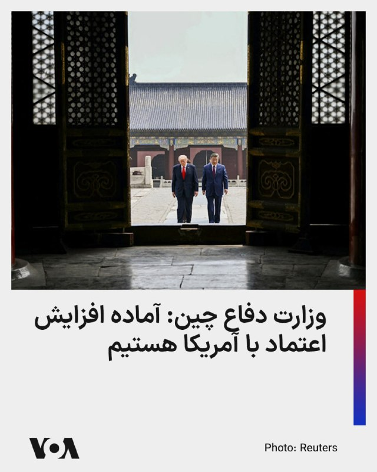

وزارت دفاع چین پس از دیدار شی جین‌پینگ و دونالد ترامپ هفته گذشته، اعلام کرد آماده تقویت اعتماد با واشنگتن است.

به نوشته بلومبرگ، سرهنگ ارشد جیانگ بین، سخنگوی این وزارتخانه، در نشست خبری روز دوشنبه گفت روابط نظامی پایدار در راستای منافع مشترک هر دو کشور است. چین آمادگی دارد با آمریکا برای تقویت گفتگو، «مدیریت اختلافات، افزایش اعتماد و رفع سوءتفاهم‌ها» همکاری کند.

در جریان سفر ترامپ به پکن، شی جین‌پینگ اعلام کرد دوران تازه‌ای در روابط دو کشور آغاز شده؛ دوره‌ای که مقامات چینی آن را «ثبات راهبردی سازنده» نامیده‌اند.

هیئت همراه ترامپ در این سفر شامل پیت هگست، وزیر دفاع آمریکا بود. هگست در ضیافت شام رسمی به‌اختصار با دونگ جون، وزیر دفاع چین گفتگو کرد. دو وزیر دفاع پیش از این در اکتبر گذشته نیز دیدار داشتند و احتمال دارد در نشست دیالوگ شانگریلا سنگاپور در پایان همین ماه دوباره ملاقات کنند.
@FarsiVOA

## FarsiVOA — post 218038

  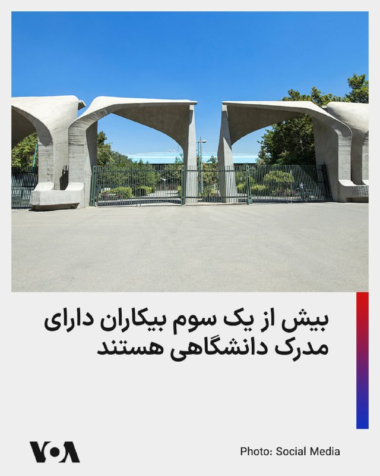

معاون آموزشی وزارت علوم اعلام کرد که در برخی کشورها تا ۸۵ درصد دانش‌آموختگان در سال‌های نخست پس از فارغ‌التحصیلی جذب بازار کار می‌شوند، اما در ایران از هر ۱۰ فرد بیکار، چهار نفر دارای مدرک دانشگاهی هستند.

ابوالفضل واحدی در گفتگو با خبرگزاری ایسنا، یکی از دلایل این امر را «کارآموزی‌ صوری و کاغذی» به جای «آموزش‌ مهارتی واقعی» توصیف کرد.

خبرگزاری تسنیم وابسته به سپاه نیز با اشاره به تازه‌ترین داده‌های آماری مربوط به زمستان ۱۴۰۴، اعلام کرد که سهم فارغ‌التحصیلان آموزش عالی از کل جمعیت بیکار کشور به بیش از ۳۶ درصد رسیده است.

این خبرگزاری نوشت:‌ بیش از یک‌سوم بیکاران کشور، افرادی هستند که سال‌ها وقت خود را صرف کسب تخصص کرده‌اند.
@FarsiVOA

## FarsiVOA — post 218037

🔺آمریکا از اعضای گروه هفت می‌خواهد از رژیم تحریم‌ها علیه جمهوری اسلامی پیروی کنند

▪️وزیر خزانه‌داری ایالات متحده اعلام کرد که این کشور از وزیران دارایی کشورهای عضو گروه هفت خواهد خواست تا از رژیم تحریم‌های اقتصادی علیه جمهوری اسلامی پیروی کنند.

▪️اسکات بسنت در آستانه برگزاری نشست وزیران دارایی و روسای بانک‌های مرکزی کشورهای گروه ۷ در پاریس گفت که پیوستن این کشورها به کارزار تحریم‌ها علیه جمهوری اسلامی مانع از رسیدن منابع مالی به «ماشین جنگی» حکومت ایران خواهد شد.

▪️پیشتر دونالد ترامپ، رئیس‌جمهور آمریکا از کشورهای اروپایی به دلیل عملکردشان در قبال جنگ علیه جمهوری اسلامی انتقاد کرده است.

▪️اعضای گروه هفت کشور صنعتی جهان شامل آمریکا، کانادا، بریتانیا، فرانسه، آلمان، ایتالیا و ژاپن هستند.

⬇️ بیشتر بخوانید:
https://ir.voanews.com/a/8151178.html

## FarsiVOA — post 218036

🔺قطع اینترنت در ایران هشتادروزه شد؛ ممنوعیت تبلیغ «اینترنت پرو» پس از هشدارهای اژه‌ای

▪️نت‌بلاکس اعلام کرد خاموشی اینترنت در ایران وارد روز هشتادم شده و از مرز ۱۸۹۶ ساعت گذشته است.

▪️به گفته نت‌بلاکس، نهاد ناظر بر اختلالات اینترنت، هم‌زمان با قطع دسترسی گسترده کاربران ایرانی به اینترنت جهانی، محتوای حامی جمهوری اسلامی در شبکه‌های اجتماعی افزایش یافته است.

▪️نت‌بلاکس همچنین نوشت برخی ایرانیانی که برای دریافت دسترسی ویژه یا قرار گرفتن در «فهرست سفید» اقدام کرده‌اند، می‌گویند از آنها خواسته شده برای حفظ این دسترسی، سهمیه‌ای از پست‌های تبلیغاتی روزانه منتشر کنند؛ روندی که به گفته این نهاد، با هوش مصنوعی کنترل می‌شود.

▪️هم‌زمان رسانه‌های داخلی از ممنوعیت تبلیغ و فروش «اینترنت پرو» خبر دادند.

⬇️ بیشتر بخوانید:
https://ir.voanews.com/a/8151177.html

## FarsiVOA — post 218035

🔺ترامپ: جمهوری اسلامی به شدت به توافق نیاز دارد

▪️دونالد ترامپ، رئیس‌جمهور آمریکا، اعلام کرد که مقامات حکومت ایران علی‌رغم اظهارات تند علنی خود، به شدت به امضای یک توافق با واشنگتن نیاز دارند.

▪️ترامپ در گفت‌وگویی با نشریه فورچون که پیش از سفر او به چین انجام شده اما روز دوشنبه ۲۸ اردیبهشت منتشر شد، درباره جمهوری اسلامی گفت: «آن‌ها [مقامات جمهوری اسلامی] مدام داد و فریاد می‌زنند. یک چیز را به شما می‌گویم: آن‌ها واقعاً دارند از شدت نیاز برای امضای [یک توافق] بی‌تابی می‌کنند.»

▪️او افزود: «اما یک توافق می‌کنند و بعد یک کاغذ برایت می‌فرستند که هیچ ربطی به توافقی که کرده بودی ندارد. من می‌گویم: شما دیوانه‌اید؟»

⬇️ بیشتر بخوانید:
https://ir.voanews.com/a/8151179.html

## FarsiVOA — post 218034

🔺عمان حمله به نیروگاه هسته‌ای امارات را محکوم کرد؛ موج واکنش‌های منطقه‌ای به حملات پهپادی

▪️عمان روز دوشنبه حمله پهپادی به نیروگاه هسته‌ای براکه در منطقه الظفره امارات متحده عربی را محکوم کرد و همبستگی خود را با ابوظبی در اقداماتی که برای حفظ امنیت و تمامیت ارضی‌اش انجام می‌دهد، اعلام کرد.

▪️این واکنش پس از آن صورت گرفت که مقام‌های امارات اعلام کردند یک پهپاد به یک ژنراتور برق خارج از محدوده داخلی نیروگاه هسته‌ای براکه برخورد کرده و باعث آتش‌سوزی شده است.

▪️رویترز گزارش داد امارات منشأ حمله را بررسی می‌کند و دو پهپاد دیگر نیز از سوی پدافند این کشور رهگیری شده‌اند.

▪️عربستان سعودی و اتحادیه جهان اسلام نیز حمله به امارات را به‌شدت محکوم کرده‌اند.

⬇️ بیشتر بخوانید:
https://ir.voanews.com/a/8151176.html

## FarsiVOA — post 218033

  <a href="telegram/content/FarsiVOA_218033_1779101358.mp4" target="_blank">🎬 Download video</a>

گسترش آلودگی نفتی ایران به سواحل کویت؛ زنگ خطر فاجعه در خلیج فارس؛

بر اساس تصاویر منتشر شده در شبکه‌های اجتماعی، تداوم نشت نفت از زیرساخت‌های ایران، اکنون با عبور از مرزهای آبی، به سواحل کویت رسیده است.

یک تحلیلگر سعودی با انتقاد شدید از عملکرد تهران اعلام کرد: «هیچ‌چیز، نه در خشکی و نه در دریا، از آسیب‌های جمهوری اسلامی در امان نیست.»

پیشتر مایک والتز، نماینده آمریکا در سازمان ملل متحد نیز با انتشار ویدیویی از نشت مواد نفتی در آب‌های سواحل جنوبی ایران نوشته بود: «ایران اکنون علاوه بر اهداف غیرنظامی، به محیط زیست هم حمله می‌کند.»

منتقدان این وضعیت را نتیجه مستقیم «شرارت و بی‌توجهی» رژیم ایران به پروتکل‌های ایمنی می‌دانند و بر لزوم پاسخگو کردن بین‌المللی جمهوری اسلامی بابت نابودی آگاهانه محیط زیست منطقه تأکید دارند.

با گذشت دو هفته از مشاهده لکه نفتی بزرگ در غرب خارک، بزرگترین پایانه نفتی ایران، مقامات جمهوری اسلامی هنوز از شفاف‌سازی پیرامون آن طفره می‌روند.
@FarsiVOA

## FarsiVOA — post 218032

  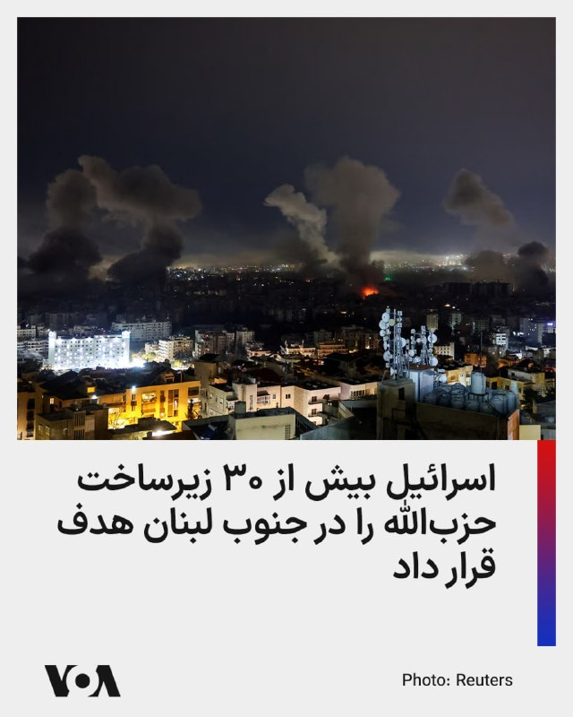

ارتش اسرائیل اعلام کرد که در شبانه‌روز گذشته بیش از ۳۰ زیرساخت «سازمان تروریستی حزب‌الله» را در جنوب لبنان هدف قرار داده است؛ این اهداف شامل انبارهای تسلیحات، مواضع دیده‌بانی و زیرساخت‌هایی است که به گفته ارتش اسرائیل «برای پیشبرد طرح‌های تروریستی علیه نیروهای ما استفاده می‌شدند».

ارتش اسرائیل اعلام کرده که به عملیات خود برای رفع تهدیدها علیه شهروندان اسرائیل و نیروهای ارتش در جنوب لبنان ادامه می‌دهد.

همچنین بر اساس این اعلام، «در حملات دقیق، تعدادی از تروریست‌های سازمان حزب‌الله که برای پیشبرد طرح‌های تروریستی علیه نیروهای ارتش اسرائیل در جنوب لبنان فعالیت می‌کردند، از بین رفتند.»
@FarsiVOA

## FarsiVOA — post 218031

  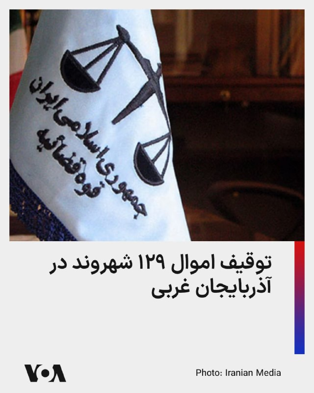

یک مقام قضایی در آذربایجان غربی از توقیف اموال ۱۲۹ شهروند در این استان خبر داد و آنان را به همکاری با آمریکا و اسرائیل متهم کرد.

بر اساس گزارش روز دوشنبه خبرگزاری میزان، ناصر عتباتی، مدعی شد این افراد به اتهام همکاری با گروه‌های ضدانقلاب، تجزیه‌طلب و انجام اقدامات ضدامنیتی تحت پیگرد قرار گرفته‌اند.

به ادعای این مقام قضایی تعدادی از این افراد از اعضا و چهره‌های اصلی «گروه‌های ضدانقلاب» و «تجزیه‌طلب» بوده‌اند.
@FarsiVOA

## FarsiVOA — post 218030

🔺اخلال در تنگه هرمز دست‌کم ۲۵ میلیارد دلار به شرکت‌های جهانی زیان زده است

▪️اخلال جمهوری اسلامی در تنگه هرمز، تاکنون دست‌کم ۲۵ میلیارد دلار هزینه روی دست شرکت‌های جهانی گذاشته؛ رقمی که هنوز کامل در صورت‌های مالی شرکت‌ها دیده نشده و رو به افزایش است.

▪️به گزارش رویترز، دست‌کم ۲۷۹ شرکت بورسی در آمریکا، اروپا و آسیا به‌دلیل جهش قیمت انرژی، اختلال در زنجیره تأمین، قطع مسیرهای تجاری، افزایش هزینه مواد اولیه، کاهش تولید، افزایش قیمت‌ها، تعلیق سود سهام یا درخواست کمک دولتی، ناچار به واکنش شده‌اند.

▪️خطوط هوایی به‌تنهایی نزدیک به ۱۵ میلیارد دلار از هزینه‌های این بحران را متحمل شده‌اند که نشان می‌دهد اخلال در تنگه هرمز، وارد لایه‌های مختلف در اقتصاد جهانی شده است.

⬇️ بیشتر بخوانید:
https://ir.voanews.com/a/8151175.html

## FarsiVOA — post 218029

🔺قیمت نفت پس از حمله پهپادی به نیروگاه هسته‌ای امارات به بالاترین سطح دو هفته اخیر رسید

▪️بهای نفت روز دوشنبه، پس از حمله پهپادی به محدوده نیروگاه هسته‌ای براکه در امارات متحده عربی، به بالاترین سطح دو هفته اخیر رسید.

▪️نفت برنت با دو دلار و یک سنت افزایش، به ۱۱۱ دلار و ۲۷ سنت برای هر بشکه رسید و پیش‌تر تا ۱۱۲ دلار بالا رفته بود؛ بالاترین سطح از پنجم مه.

▪️نفت وست تگزاس اینترمدیت آمریکا نیز با دو دلار و ۳۳ سنت افزایش، به ۱۰۷ دلار و ۷۵ سنت رسید و در مقطعی به ۱۰۸ دلار و ۷۰ سنت صعود کرد.

▪️دو شاخص اصلی نفت هفته گذشته نیز بیش از هفت درصد رشد کرده بودند.

⬇️ بیشتر بخوانید:
https://ir.voanews.com/a/8151174.html

## DW_Farsi — post 124822

  

🔶 ترامپ: مقام‌های ایران به شدت مشتاق امضای توافق‌اند

دونالد ترامپ در گفت‌وگویی مفصل با مجله "فورچون" که روز دوشنبه ۲۸ اردیبهشت منتشر شد، گفت که مقام‌های جمهوری اسلامی به شدت به دنبال امضای یک توافق با آمریکا هستند، اما بعد از اینکه توافق می‌کنند، سندی را می‌فرستند که "هیچ ربطی با توافق ندارد".

رئیس جمهور آمریکا در این مصاحبه درباره ایرانی‌ها گفت: «آنها مدام فریاد می‌زنند.»

ترامپ افزود: «یک چیز را می‌توانم به شما بگویم، آن‌ها به‌شدت مشتاق امضای توافق هستند. اما یک توافق می‌کنند و بعد سندی برایتان می‌فرستند که هیچ ارتباطی با توافقی که کرده‌اید ندارد. من می‌گویم: شماها دیوانه‌اید؟»

ترامپ بارها در گفت‌وگو با رسانه‌ها و خبرنگاران در کاخ سفید اظهار داشته است که جمهوری اسلامی "مشتاق توافق" است. او تهدید کرده است چنانچه رهبران ایران با آمریکا به توافق نرسند، ایالات متحده حملات شدیدتری را علیه این کشور انجام خواهد داد.

او روز یکشنبه با انتشار پیامی در شبکه تروث سوشال هشدار داده بود که زمان برای ایران "در حال پایان است و آن‌ها بهتر است خیلی سریع اقدام کنند وگرنه چیزی ازشان باقی نخواهد ماند".

@dw_farsi

## DW_Farsi — post 124821

🔶 گزارش عفو بین‌الملل؛ ایران عامل اصلی جهش جهانی اعدام‌ها

شمار اعدام‌ها در جهان به بالاترین سطح ثبت‌شده در ۴۴ سال گذشته رسیده است. عفو بین‌الملل می‌گوید ایران موتور اصلی این افزایش بوده است. در این میان، همزمان نشانه‌هایی از حرکت جهانی به سوی لغو اعدام نیز دیده می‌شود.

سازمان عفو بین‌الملل در تازه‌ترین گزارش سالانه خود درباره مجازات اعدام از ثبت رکوردی بی‌سابقه در چهار دهه اخیر خبر داده است؛ رکوردی که بیش از هر چیز نام ایران را در مرکز خود دارد.

بر اساس گزارش "احکام اعدام و اعدام‌های ۲۰۲۵"، دست‌کم ۲۷۰۷ نفر در ۱۷ کشور جهان اعدام شده‌اند؛ رقمی که نسبت به سال پیش از آن نزدیک به ۸۰ درصد افزایش نشان می‌دهد و بالاترین سطح ثبت‌شده از سوی این سازمان حقوق بشری از سال ۱۹۸۱ بدین‌سو به شمار می‌رود. بخش مهمی از این جهش به ایران مربوط می‌شود.

عفو بین‌الملل می‌گوید مقام‌های جمهوری اسلامی در سال ۲۰۲۵ دست‌کم ۲۱۵۹ نفر را اعدام کرده‌اند؛ یعنی بیش از دو برابر سال قبل از آن. این رقم به‌تنهایی نزدیک به چهارپنجم کل اعدام‌های ثبت‌شده در جهان را شامل می‌شود و ایران را، پس از چین، در جایگاه دوم جهان قرار می‌دهد. چین همچنان بزرگترین اجراکننده اعدام در جهان محسوب می‌شود، اما به دلیل محرمانه بودن آمار رسمی، هزاران مورد اعدام احتمالی در این کشور در محاسبات عفو بین‌الملل لحاظ نشده‌اند.

@dw_farsi

## DW_Farsi — post 124820

  

🔶بقائی: از آمریکا ملاحظات اصلاحی دریافت کردیم و پاسخ دادیم

اسماعیل بقائی، سخنگوی وزارت خارجه ایران، روز دوشنبه ۲۸ اردیبهشت در نشست خبری هفتگی خود اظهار داشت تهران در حال "مذاکره و تدوین سازوکاری" با عمان در رابطه با تردد کشتی‌ها از تنگه هرمز است.

او افزود: «هفته گذشته دیداری بین بخش‌های کارشناسی در مسقط برگزار شد، در این باره به صورت مفصل و مستمر صحبت شده است و تماس‌ها ادامه دارد.»

بقائی در پاسخ به پرسشی در مورد گزارش‌ها مبنی بر دریافت هزینه برای تردد از تنگه هرمز، طرح چنین امری را "انحراف از اصل موضوع" خواند اما با این حال دریافت هزینه را رد نکرده و گفت: «طبیعی است که هر کشور ساحلی بابت خدماتی که ارائه می‌دهد هزینه‌هایی را دریافت کند اما اصل موضوع اطمینان از تردد ایمن و اقدام برای حفظ امنیت ملی است. اینکه ایران و عمان به عنوان دو کشور ساحلی سازوکاری را بر اساس حقوق بین‌الملل برای تردد ایمن ایجاد کنند، حتما انجام این امر هزینه‌هایی را در پی دارد.»

@dw_farsi

## DW_Farsi — post 124819

  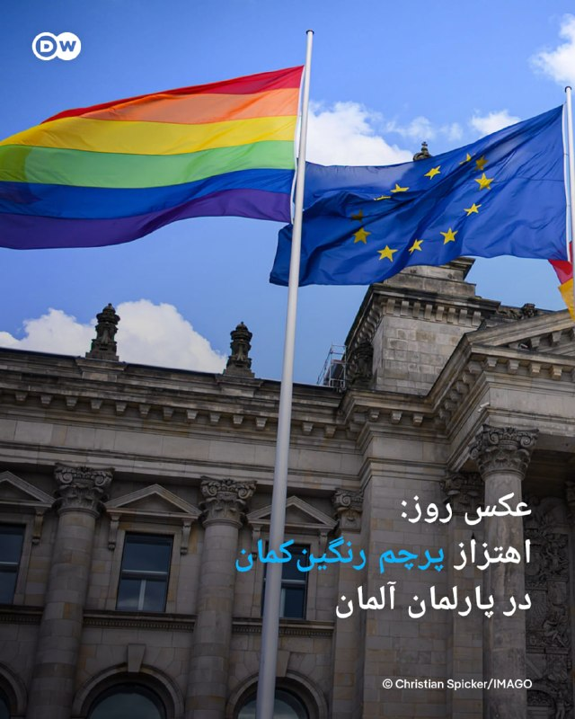

📸 عکس روز: اهتزاز پرچم رنگین‌کمان در پارلمان آلمان

۱۷ مه روز جهانی "مقابله با نفرت‌پراکنی علیه همجنس‌گرایان، دوجنس‌گرایان، میان‌جنسی‌ها، ترنس‌ها و افراد بی‌جنس‌گرا" است. به همین مناسبت، در این روز پرچم رنگین‌کمان، به عنوان مشهورترین نماد این جامعه بزرگ، بر فراز ساختمان پارلمان آلمان (بوندستاگ) در برلین به اهتزاز درآمد؛ همتراز با پرچم آلمان و اتحادیه اروپا.

@dw_farsi

## DW_Farsi — post 124818

  

🔶 سی‌ان‌ان: پنتاگون در حال آماده‌سازی طرح‌هایی برای حملات جدید علیه ایران است

شبکه خبری "سی‌ان‌ان" به نقل از یک منبع آگاه گزارش داد دونالد ترامپ روز شنبه ساعاتی پس از بازگشت از سفر به چین، نشستی را با تیم امنیت ملی خود درباره گام‌های احتمالی بعدی واشنگتن در قبال ایران برگزار کرده است.

این جلسه در باشگاه گلف "ویرجینیا" رئیس جمهور آمریکا برگزار شد و جی‌دی‌ ونس معاون رئیس جمهور، مارکو روبیو وزیر خارجه، جان رتکلیف رئیس سیا و استیو ویتکاف فرستاده ویژه ترامپ در آن شرکت داشته‌اند.

به نوشته سی‌ان‌ان، ترامپ و تیم او در جریان سفر به پکن تصمیم‌گیری در مورد نحوه ادامه مسیر با ایران را به تعویق انداختند زیرا به گفته چند مقام دولتی، آنها به دنبال این بودند که ابتدا نتیجه گفت‌وگوهای ترامپ با شی جین‌پینگ، رئیس جمهور چین مشخص شود. چین روابط نزدیکی با جمهوری اسلامی دارد و با محکوم کردن جنگ آمریکا و اسرائیل خواستار دستیابی به راه‌حلی مسالمت‌آمیز شده است.

@dw_farsi

## DW_Farsi — post 124817

  

🔶 از ابتدای جنگ ۶۵۰۰ جاسوس را بازداشت کردیم

احمدرضا رادان، فرمانده نیروی انتظامی، گفته است که از آغاز جنگ آمریکا و اسرائیل با ایران، "بیش از ۶۵۰۰ نفر" به اتهام "وطن‌فروشی و جاسوسی" بازداشت شده‌اند. او مدعی شد از میان بازداشت‌شدگان ۵۶۷ نفر به طور خاص به "نفاق، اشرار و گروهک‌های ضدانقلاب" مرتبط بوده‌اند.

مقامات جمهوری اسلامی در هفته‌های گذشته از بازداشت شماری از شهروندان به اتهام "جاسوسی و همکاری با دشمن" از جمله به دلیل ارسال اطلاعات، فیلم یا حتی فعالیت در شبکه‌های اجتماعی خبر داده‌اند، در حالی‌که هیچ جزئیات دقیقی در مورد هویت بازداشت‌شدگان، نوع اتهام‌ها و روند قضایی رسیدگی به پرونده‌ آنان ارائه نکرده‌اند.

رادان همچنین اضافه کرده است که "دستگیری سربازان دشمن و وطن‌فروشان" در اعتراضات سراسری دی‌ماه ۱۴۰۴ که او با عنوان "اغتشاشات" از آن یاد کرده، همچنان ادامه دارد و پلیس اقدامات خود را متوقف نکرده است.

@dw_farsi

## DW_Farsi — post 124816

  

🔶 "بازار داغ" خرید و فروش سیم‌کارت‌های عراقی در مناطق مرزی ایران

همزمان با گذشت ۸۰ روز از قطعی سراسری اینترنت در ایران، گزارش‌ها حاکی از شکل‌گیری بازار خرید و فروش سیمکارت‌های عراقی در برخی مناطق مرزی کشور است.

روزنامه "ایران" روز دوشنبه ۲۸ اردیبهشت (۱۸ مه) در گزارشی نوشت بخش مهمی از متقاضیان این سیمکارت‌ها بازرگانانی هستند که به دلیل ارتباطات شغلی، ارسال اسناد تجاری، حواله‌های مالی و هماهنگی‌های لجستیکی با طرف‌های تجاری خود به اینترنت نیاز دارند.

طبق این گزارش، سیمکارت‌های عراقی در مقایسه با فیلترشکن‌هایی که در بازار سیاه اینترنت ایران عرضه می‌شوند، ارزانتر هستند و در برخی نقاط مرزی مانند شلمچه، چذابه و قصرشیرین سیگنال اپراتورهای عراقی تا حدود یک تا دو کیلومتر داخل خاک ایران قابل دریافت است.

نت‌بلاکس که در زمینه پایش، تحلیل و مستندسازی وضعیت اینترنت در جهان فعالیت می‌کند، پیش‌تر عدم دسترسی مردم به شبکه‌های بین‌المللی را موجب از دست رفتن گسترده مشاغل و بیکاری کارگران و کارفرمایان مستقل دانسته و هشدار داده بود این وضعیت عملا "موجب انتقال ثروت به گروه‌های همسو با حکومت می‌شود".

@dw_farsi

## DW_Farsi — post 124815

🔶 جام ۱۹۶۶؛ اوزه‌بیو؛ "پلنگ سیاه" عالم فوتبال

اوزه‌بیو، "پلنگ سیاه" پرتغال، تنها یک بار در جام جهانى فوتبال حضور یافت، اما همین یک بار کافى بود تا این مهاجم ۲۴ ساله با گل‌هایی سرنوشت‌ساز و درخششى کم‌نظیر نام خود را در دفتر تاریخ جام جهانی ابدی سازد.

اوزه‌بیو که به "پلنگ سیاه" مشهور بود، تبار موزامبیکی داشت و در ۲۵ ژانویه ۱۹۴۲ در این کشور به دنیا آمد. از او به‌عنوان بهترین فوتبالیست تاریخ پرتغال یاد می‌شود. اوزه‌بیو را یکی از خطرناک‌ترین مهاجمان تاریخ فوتبال می‌دانند.

او در فهرست بهترین فوتبالیست‌های قرن در جایگاه نهم قرار دارد. اوزه‌بیو با زدن ۹ گل برای پرتغال در مسابقات جام جهانی ۱۹۶۶ انگلیس، آقای گل شد و نام خود را در تاریخچه این رقابت‌ها برای همیشه ثبت کرد.

در دور گروهی جام جهانى، تیم پرتغال موفق شد، ۳ بر ۱ مجارستان را مغلوب کند، ۳ بر صفر از سد بلغارستان بگذرد و ۳ بر ۱ هم برزیل، یعنى مدافع عنوان قهرمانى را به زانو در آورد.

جالب توجه این که اوزه‌بیو در دیدار پرتغال در مقابل برزیل، دو بار دروازه پله و یارانش را باز کرد.

پرتغال با این پیروزی‌هاى قاطع به مرحله یک چهارم نهایى راه پیدا کرد و به مصاف تیمى رفت که همگى را شگفت‌زده کرده بود: کره شمالی.

بازیکنان کره شمالی در حضور ۵۰ هزار تماشاگر حاضر در استادیوم لیورپول در عرض ۲۵ دقیقه اول بازى ۳ گل به پرتغال زدند.

بعد از این دقایق، تیم پرتغال کم کم از خواب بیدار شد و ناممکن را ممکن کرد.

اوزه‌بیو در این دیدار ۴ گل به ثمر رساند و در نهایت نقشى سرنوشت‌ساز در پیروزى ۵ بر ۳ پرتغال بر کره شمالی داشت.

@dw_farsi

## Persian_Trend_Official — post 14407

  <a href="telegram/content/Persian_Trend_Official_14407_1779101367.webm" target="_blank">🎬 Download video</a>

⭕️ تسنیم: ایران متن جدید ۱۴ بندی به آمریکا ارائه کرد

💢خبرگزاری تسنیم به نقل از یک منبع نزدیک به تیم مذاکره‌کننده گزارش داد تهران از طریق میانجی پاکستانی، متن جدیدی شامل ۱۴ بند به طرف آمریکایی تحویل داده است.

▪️پیش تر اخباری از منابع پاکستانی نسبت به ارسال پیشنهاد جدید جمهوری اسلامی به آمریکا توسط این کشور منتشر شده بود.

🫆:Tony

📌 @persian_trend_official
پرشین ترند | متفاوت‌ترین کانال نظامی

## Persian_Trend_Official — post 14406

  

🕊
👨‍🦲 سفر پوتین به چین تنها ۴ روز پس از حضور ترامپ

🔹رئیس‌جمهور چین کمتر از یک هفته پس از سفر رئیس‌جمهور آمریکا به پکن، اکنون برای میزبانی همتای روس خود آماده می‌شود.

🔹دیدارهای روسای جمهور آمریکا و روسیه نشان می‌دهد که پکن «به سرعت در حال ظهور به عنوان نقطه کانونی دیپلماسی جهانی» است.

🔹تجارت دوجانبه چین و روسیه از سال ۲۰۲۲ بعد از جنگ اوکراین به بالاترین سطح خود رسیده است، به طوری که چین بیش از یک‌چهارم صادرات روسیه را خریداری می‌کند.

☆Phantom☆

📌 @persian_trend_official
پرشین ترند | متفاوت‌ترین کانال نظامی

## Persian_Trend_Official — post 14405

  <a href="telegram/content/Persian_Trend_Official_14405_1779101368.webm" target="_blank">🎬 Download video</a>

#طنز

جدیدا سرورهای سوپر اپلیکیشن بله وقت ناهار و نماز همراه کارمندان شرکت استراحت می‌کنند. 😌

📝 Nick

📌 @persian_trend_official
پرشین ترند | متفاوت‌ترین کانال نظامی

## Persian_Trend_Official — post 14404

  <a href="telegram/content/Persian_Trend_Official_14404_1779101369.mp4" target="_blank">🎬 Download video</a>

🇵🇰انفجار مرگبار در وزیرستان پاکستان و ترور یکی از بزرگان قبایل

🔹در پی انفجار بمب در بازار «رستم» شهر وانا، ۳ نفر کشته و ۴ نفر زخمی شدند.
🔹منابع محلی اعلام کردند در میان کشته‌شدگان، «ملک طارق وزیر» از بزرگان بانفوذ قبایل منطقه نیز حضور دارد که در حل اختلافات قومی نقش مهمی داشت.

PHANTOM

📌 @persian_trend_official
پرشین ترند | متفاوت‌ترین کانال نظامی

## Persian_Trend_Official — post 14403

⭕️ سخنگوی دولت: اینترنت پرو مصوبۀ شورای‌عالی امنیت ملی است که آقای رئیس‌جمهور ریاست آن را برعهده دارد 💢پاسخ مهاجرانی به اصرار یک خبرنگار دربارۀ وضعیت اینترنت: در شرایطی که ترامپ اعلام می‌کند آتش‌بس به دستگاه تنفس مصنوعی وصل است پاسخ شما چیست؟! 💢در خصوص اینترنت…

## Persian_Trend_Official — post 14402

  <a href="telegram/content/Persian_Trend_Official_14402_1779101370.mp4" target="_blank">🎬 Download video</a>

🔴 ورود نیروی دریایی اسرائیل به عملیات در میانه دریا برای مقابله با شکستن محاصره

💢منابع عبری از آغاز عملیات یگان ۱۳ نیروی دریایی اسرائیل علیه کاروانی خبر می‌دهند که در مسیر غزه در حرکت بوده است. این عملیات در فاصله صدها مایلی از سواحل فلسطین اشغالی انجام شده و طبق گزارش‌ها، هدف آن توقیف یا کنترل کامل کاروان بوده است.

💢بر اساس اطلاعات اولیه، این کاروان شامل ۵۸ شناور بوده که بخشی از آن‌ها به سازمان ترکیه‌ای «آی‌اچ‌اچ» نسبت داده شده‌اند؛ همان مجموعه‌ای که در ماجرای کشتی مرمره نیز نقش داشت.

گزارش‌ها حاکی است صدها نفر در این کاروان حضور دارند و ده‌ها تن از آن‌ها شهروند ترکیه هستند؛ موضوعی که می‌تواند ابعاد سیاسی و امنیتی ماجرا را پیچیده‌تر کند.

💢منابع اسرائیلی، این عملیات را یکی از پرریسک‌ترین مأموریت‌های دریایی سال‌های اخیر توصیف کرده‌اند.

🫆:Tony

📌 @persian_trend_official
پرشین ترند | متفاوت‌ترین کانال نظامی

## Persian_Trend_Official — post 14401

حضرتی: گشایش اینترنت بین الملل سیاست قطعی دولت است 🔹«فیلترینگ» امنیت سایبری کشور را به مخاطره انداخته است. رئیس شورای اطلاع رسانی دولت تأکید کرد: 🔹سیاست قطعی و بدون عقب نشینی دولت گشایش اینترنت بین‌الملل و رفع فیلترینگ است و تا کنون سه جلسه از سوی شورای…

## Persian_Trend_Official — post 14400

  <a href="telegram/content/Persian_Trend_Official_14400_1779101371.webm" target="_blank">🎬 Download video</a>

حضرتی: گشایش اینترنت بین الملل سیاست قطعی دولت است

🔹«فیلترینگ» امنیت سایبری کشور را به مخاطره انداخته است.

رئیس شورای اطلاع رسانی دولت تأکید کرد:
🔹سیاست قطعی و بدون عقب نشینی دولت گشایش اینترنت بین‌الملل و رفع فیلترینگ است و تا کنون سه جلسه از سوی شورای راهبردی و سیاست‌گذاری اینترنت کشور توسط معاون اول رئیس‌جمهور برگزار شده است.

🫆:Tony

📌 @persian_trend_official
پرشین ترند | متفاوت‌ترین کانال نظامی

## Persian_Trend_Official — post 14399

  

این اتفاق داره واسه مقاومت عراق داستان میشه !

## Persian_Trend_Official — post 14398

  

طرز تهیه چای کرک

چای کرک یکی از نوشیدنی‌های محبوب عمان و کشورهای خلیج فارس است؛ چایی غلیظ، معطر، شیرین و خامه‌ای که معمولاً با هل و شیر درست می‌شود و طعم خیلی خاصی دارد.

مواد لازم
آب: ۱ لیوان
شیر: ۱ لیوان
چای سیاه: ۱ تا ۲ قاشق چای‌خوری
شکر: ۱ تا ۲ قاشق غذاخوری، بسته به ذائقه
هل: ۳ تا ۴ عدد، کمی کوبیده‌شده
زعفران: مقدار خیلی کم، اختیاری
زنجبیل تازه یا پودر زنجبیل: مقدار کم، اختیاری
طرز تهیه

ابتدا آب را داخل قابلمه کوچک بریزید و روی حرارت قرار دهید تا به جوش بیاید. بعد چای سیاه، هل کوبیده‌شده و در صورت تمایل کمی زنجبیل یا زعفران را اضافه کنید.

اجازه دهید چای چند دقیقه بجوشد تا رنگ و عطر آن کاملاً آزاد شود. سپس شیر را اضافه کنید و حرارت را کمی پایین بیاورید. حالا شکر را هم اضافه کنید و خوب هم بزنید.

بگذارید مخلوط چای و شیر حدود ۵ تا ۷ دقیقه آرام بجوشد تا کمی غلیظ شود و طعم مواد کاملاً با هم ترکیب شود. در این مرحله اگر دوست دارید چای کرک غلیظ‌تر و مجلسی‌تر شود، می‌توانید مقدار کمی شیر تبخیرشده یا شیر غلیظ‌شده هم اضافه کنید.

در پایان چای را از صافی رد کنید و داغ سرو کنید.

نکته مهم

راز خوش‌طعم شدن چای کرک عمانی این است که چای و شیر چند دقیقه با هم بجوشند تا نوشیدنی حالت غلیظ، معطر و کرمی پیدا کند. هرچه هل تازه‌تر باشد، عطر چای بهتر می‌شود.

پ.ن: چون درخواست ها زیاد بود، طرز تهیش رو پست کردم. من که خیلی دوسش دارم، امیدوارم امتحان کنید و لذت ببرید.

## Persian_Trend_Official — post 14393

پست قابل تأمل ‌ترامپ که لحظاتی قبل در تروث سوشال منتشر کرده است. ☆Phantom☆ 📌 @persian_trend_official پرشین ترند | متفاوت‌ترین کانال نظامی

## Persian_Trend_Official — post 14392

  

⭕️جواد علیکردی؛ محکوم به ده سال زندان پس از پیگیری مرگ مشکوک برادرش

💢جواد علیکردی، شهروند اهل سبزوار و برادر خسرو علیکردی، وکیل دادگستری جان‌باخته، از سوی دستگاه قضایی جمهوری اسلامی به ۱۰ سال حبس تعزیری محکوم شد.

💢او اخیراً در یکی از شعب دادگاه انقلاب مشهد محاکمه شده و هم‌اکنون در زندان وکیل‌آباد مشهد در بازداشت به‌سر می‌برد. جزئیات دقیق اتهامات مطرح‌شده علیه او تاکنون منتشر نشده است.

خسرو علیکردی روز ۱۴ آذر ۱۴۰۴ در دفتر کار خود جان باخت. نهادهای حکومتی علت مرگ را «ایست قلبی» اعلام کردند، اما خانواده او با اشاره به شواهدی از جمله خونریزی غیرعادی، این روایت را نپذیرفتند و خواستار روشن‌شدن حقیقت شدند.

🫆:Tony

📌 @persian_trend_official
پرشین ترند | متفاوت‌ترین کانال نظامی

## Persian_Trend_Official — post 14391

⭕️ روزنامه ایران: در پی محدودیت دسترسی به اینترنت، بازار خرید سیم‌کارت‌های عراقی در برخی مناطق مرزی غرب شکل گرفته است.

در بعضی نقاط مرزی، سیگنال اپراتورهای عراقی تا دو کیلومتر داخل خاک ایران قابل دریافت است.

ارزان‌تر بودن این سیم‌کارت‌ها در مقایسه با هزینه فیلترشکن‌ها، به عنوان یکی از دلایل گرایش برخی به آن‌ها عنوان شده است.

استفاده از سیم‌کارت‌های خارجی می‌تواند چالش‌هایی را در حوزه نشت اطلاعات ایجاد کند.

📝 Nick

📌 @persian_trend_official
پرشین ترند | متفاوت‌ترین کانال نظامی

## Persian_Trend_Official — post 14390

  

پمپاژ ترس از سوی آقای ترامپ بیشتر شبیه یک بازی روانی و رسانه‌ای است. ۰ وقتی تنگه بسته باشد، ۰ وقتی قیمت بنزین در آمریکا تا ۵۰ درصد افزایش پیدا کند، ۰ وقتی از مذاکرات با چین دست خالی بازگشته باشند، طبیعی است که برای کنترل افکار عمومی، فضای ترس ایجاد کند. کسی که خودش تحت فشار است، تلاش می‌کند دیگران را بترساند تا اقتصادطرف مقابل دچار رکود و توقف شود، مردم از حرکت بایستند و نارضایتی اجتماعی شکل بگیرد؛ «ایران جای خوبی ایستاده ولی استفاده از این موقعیت مهم است و تدبیر لازم دارد در غیر این متضرر میشود» جنگ امروز جنگ هوش مصنوعی است و تفکر آموزش کلاشینکف در میادین و تلوزیون باید تبدیل به آموزش جوانان برای هوش مصنوعی شود٫ آن وقت خواهید دید جوانان کشور بدون تیر و موشک ٫ماهواره ها و اف ۳۵‌ها‌ را چگونه زمینگیر میکنند . مردم باید در آرامش باشند و زندگی کنند و جوانان راهبری و تفکر

بابک زنجانی

پ.ن : چی میشه کسی که با کیف کشی مسئولین، رانت و فساد تبدیل میشه به سرمایه دار، برای ما فاز استیو جابز برمیداره ؟

📌 @persian_trend_official
پرشین ترند | متفاوت‌ترین کانال نظامی

## Persian_Trend_Official — post 14389

  <a href="telegram/content/Persian_Trend_Official_14389_1779101375.webm" target="_blank">🎬 Download video</a>

💢خط نشان جدید دکتر مصطفی خوش چشم برای اسرائیل ▪️تهدید به استفاده از سلاحی ناشناخته ، مخرب و سری علیه این کشور 🫆:Tony 📌 @persian_trend_official پرشین ترند | متفاوت‌ترین کانال نظامی

## Persian_Trend_Official — post 14388

  <a href="telegram/content/Persian_Trend_Official_14388_1779101375.mp4" target="_blank">🎬 Download video</a>

💢خط نشان جدید دکتر مصطفی خوش چشم برای اسرائیل

▪️تهدید به استفاده از سلاحی ناشناخته ، مخرب و سری علیه این کشور

🫆:Tony

📌 @persian_trend_official
پرشین ترند | متفاوت‌ترین کانال نظامی

## RadioFarda — post 157308

پاراگراف اول؛ آیا کارزارهای تحریمی، تیم ملی فوتبال را به سمت حکومت هل داد؟

🔸«اجازه دادن به تیم رژیم ایران برای شرکت در جام جهانی یک فاجعه اخلاقی است»؛ این را یک ایرانی طرفدارِ دوآتشه فوتبال در یادداشتی برای هفته‌نامه بریتانیایی «اسپکتیتور» نوشته است.

🔸نام او آتبین معیدی است و در متن خود تأکید می‌کند که از طرفداران دو آتشه سردار آزمون و مهدی طارمی است؛ زوجی در خط حمله تیم ملی ایران که این هوادار فوتبال برای توصیف عملکردشان از تعبیر تله‌پاتیک (دورآگاهانه) استفاده می‌کند.

🔸با این حال، او اصرار دارد که مخالفتش با حضور تیم ملی فوتبال ایران در جام جهانی صرفاً سلیقه شخصی‌اش نیست و آن را «خواستی عمومی» معرفی می‌کند؛ به‌گونه‌ای که می‌نویسد، مسئله برای «ایرانیان» نه یک بحث سیاسی، بلکه مسئله‌ای درباره حقوق بشر و عدالت است.

🔸در ذهنیت او، سردار آزمون یک ترکمن ایرانیِ خونسرد، بی‌تکلف و دوست‌داشتنی است که در سال‌های اخیر علیه رژیم صحبت کرده است؛ و در مقابل، مهدی طارمی چهره‌ای آرام و کم‌حرف که در نگاه او حامی رژیم و ایدئولوژی آن بوده است. هرچند این هوادار فوتبال در ادامه می‌نویسد نشانه‌هایی وجود دارد که ستاره پیشین اینترمیلان موضع خود را تغییر داده است.

🔸این هوادار فوتبال، تابستان امسال به دیدار خانواده‌اش در لس‌آنجلس می‌رود؛ شهری که میزبان دو بازی ایران در جام جهانی است.

🔸نسخه کامل این گزارش را در وب‌سایت رادیوفردا بخوانید.

@RadioFarda

## RadioFarda — post 157307

جنگ ایران «۲۵ میلیارد دلار» هزینه اضافی روی دوش شرکت‌های جهانی گذاشته است

🔸خبرگزاری رویترز در یک گزارش تحلیلی نوشته که جنگ آمریکا و اسرائیل با ایران تاکنون «دست‌کم ۲۵ میلیارد دلار» برای شرکت‌های سراسر جهان هزینه به بار آورده است.

🔸بر اساس این گزارش که روز دوشنبه ۲۸ اردیبهشت منتشر شد، آمده که این رقم همچنان در حال افزایش است.

🔸بررسی بیانیه‌های شرکت‌های ثبت‌شده در آمریکا، اروپا و آسیا از زمان آغاز حملات مشترک آمریکا و اسرائیل به ایران در ۹ اسفند پارسال، تصویری «نگران‌کننده» از پیامدهای آن ارائه می‌دهد؛ چرا که کسب‌وکارها به‌دلیل کنترل تنگه هرمز توسط ایران، با افزایش شدید قیمت انرژی، زنجیره‌های تأمین و مسیرهای تجاری دچار اختلال دست‌وپنجه نرم می‌کنند.

🔸تحلیل رویترز نشان می‌دهد دست‌کم ۲۷۹ شرکت اعلام کرده‌اند جنگ باعث شده که برای کاستن از اثرات مالی، اقدامات دفاعی از جمله افزایش قیمت‌ها و کاهش تولید انجام دهند. برخی دیگر نیز سود سهام یا برنامه‌های بازخرید سهام را متوقف کرده، کارکنان را به مرخصی اجباری فرستاده، هزینه اضافی سوخت اعمال کرده یا درخواست کمک اضطراری دولتی داده‌اند.

🔸نسخه کامل این گزارش را در وب‌سایت رادیوفردا بخوانید.

@RadioFarda

## RadioFarda — post 157306

  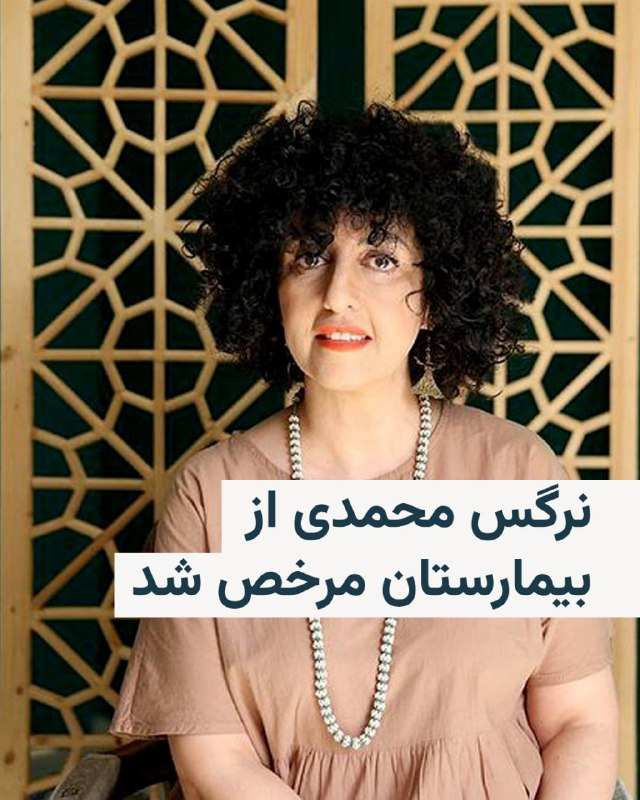

🔸بنیاد نرگس محمدی اعلام کرد که این برنده جایزه صلح نوبل از بیمارستان مرخص شده است.

🔸خانم محمدی از یازدهم تا بیستم اردیبهشت در بخش مراقبت‌های ویژه بیمارستان موسوی زنجان و از بیستم تا ۲۷ اردیبهشت در همین بخش در بیمارستان پارس تهران بستری بود.

🔸او بیستم اردیبهشت، پس از ۱۵۰ روز بازداشت در مشهد و زنجان و پس از ۱۰ روز بستری در بیمارستانی در شهر زنجان، در پی تشدید فشارهای بین‌المللی از مرکز درمانی زنجان توسط آمبولانس به بیمارستان پارس تهران منتقل شد.

🔸بر اساس گزارش بنیاد نرگس محمدی، این فعال حقوق بشر، در بیمارستان، «تحت عمل آنژیوپلاستی و آزمایشات مربوط به اختلالاتِ شدید فشار خون از جمله Tilt Test قرار داشت».

🔸این بنیاد تأکید کرده که «طبق نظر پزشکان متخصص از جمله قلب و مغز، ضرورت بر تحت نظر و مراقبت‌های درمانی خاص برای او وجود دارد و تا یک ماه حداقل هر‌ روز در بیمارستان تحت فیزیوتراپی قرار خواهد داشت».

@RadioFarda

## RadioFarda — post 157305

  

🔸دونالد ترامپ، رئیس‌جمهور آمریکا می‌گوید مقامات حکومت ایران برای امضای توافق با آمریکا «می‌میرند».

🔸او در گفت‌و‌گو با نشریه تجاری «فورچون» افزوده با این حال آنها در جریان مذاکرات، «روی یک چیزی توافق می‌کنند»، اما «بعد یک کاغذی برایتان می‌فرستند که هیچ ارتباطی با توافقی که کرده‌اید ندارد. من می‌گویم: ‘شما دیوانه‌اید؟’»

🔸ترامپ در این گفت‌و‌گو همچنین بر این نکته تأکید کرده که مقامات جمهوری اسلامی «مدام فریاد می‌زنند» و سروصدا می‌کنند، اما در عمل «تشنه توافق» هستند.

🔸پیش از انتشار این گفت‌و‌گو، اسماعیل بقائی، سخنگوی وزارت خارجه ایران، گفته بود علی‌رغم این‌که طرف‌های آمریکایی به‌صورت علنی اعلام کردند طرح پیشنهادی ایران مردود است «اما ما از طرف میانجی پاکستانی مجموعه نکات و ملاحظات اصلاحی را از نظر آن‌ها دریافت کردیم».

🔸بقائی جزئیاتی در مورد اصلاحات مدنظر ایالات متحده ارائه نکرد.

@RadioFarda

## RadioFarda — post 157304

  

🔸رسانه‌های ایران روز دوشنبه ۲۸ اردیبهشت به نقل از یک «منبع آگاه» در نیروی انتظامی خبر دادند که «۲۴ دستگاه خودرو» به‌دلیل ریخته شدن میخ‌های چندپر در یک اتوبان پنچر شدند.

🔸بر اساس این گزارش، «راننده یک خودروی شوتی» یکشنبه‌شب «با هدف ایجاد اختلال در تردد و نارضایتی عمومی، اقدام به ریختن میخ‌های چندپر در مسیر اتوبان تهران-کرج کرد».

🔸این منبع افزوده که این اقدام موجب آسیب‌دیدگی لاستیک‌های ۲۴ دستگاه خودرو شد و خسارت‌هایی به اموال شهروندان وارد کرد.

🔸به گزارش رسانه‌های ایران، برای این راننده پرونده قضایی تشکیل شده «و پلیس راهور تهران بزرگ با استفاده از تصاویر دوربین‌های نظارتی، فرد خاطی را تحت تعقیب قرار داده است».

🔸پیشتر گزارش شده بود که ۴۰۰ خودرو در این حادثه پنچر شده‌اند ولی نیروی انتظامی می‌گوید که این رقم درست نیست.

🔸خبرگزاری فارس از آسیب دیدن ۲۰ خودرو خبر داده است.

@RadioFarda

## RadioFarda — post 157302

  

🔸سخنگوی وزارت خارجه ایران می‌گوید روند مذاکرات تهران و واشینگتن، «ادامه‌دار» است و حکومت ایران از ایالات متحده، «اصلاحاتی» در پاسخ به طرح پیشنهادی خود دریافت کرده است.

🔸اسماعیل بقائی در نشست خبری روز دوشنبه ۲۸ اردیبهشت گفت: هفته گذشته، علی‌رغم این‌که طرف‌های آمریکایی به‌صورت علنی اعلام کردند طرح پیشنهادی ایران مردود است «اما ما از طرف میانجی پاکستانی مجموعه نکات و ملاحظات اصلاحی را از نظر آن‌ها دریافت کردیم».

🔸او افزود ایران بعد از این‌که طرح ۱۴ بندی خود را ارائه کرد، «طرف آمریکایی ملاحظاتش را مطرح کرد. متقابلاً ما نیز ملاحظات خود را مطرح کردیم. از روز بعد از ارسال نقطه‌نظر آمریکایی از طرف پاکستان، ما با مجموعه‌ای از پیشنهادات طرف مقابل مواجه شدیم که در این چند روز بررسی شد».

🔸سخنگوی وزارت خارجه ایران به‌دلیل آنچه تبادل «نقطه‌نظرات متقابل» طرفین به یکدیگر نامیده، تأکید کرد که «بنابراین، روند [مذاکرات ]از طریق پاکستان ادامه دارد».

🔸بقائی جزئیاتی در مورد اصلاحات مدنظر ایالات متحده ارائه نکرد.

@RadioFarda

## RadioFarda — post 157301

🔸هم‌زمان با پخش برنامه‌های آموزشی نظامی در صداوسیما ویدئوهایی از آموزش کار با اسلحه برای کودکان و زنان در خیابان‌های تهران منتشر شده است.

🔸پیش از این گزارش‌هایی از استفاده از کودکان در ایست‌های بازرسی منتشر شده بود. این در حالی است که بر اساس قوانین بین‌الملل، به‌کارگیری افراد زیر ۱۵ سال در درگیری‌های نظامی ممنوع است و دیوان کیفری بین‌المللی جذب کودکان در جنگ را «جنایت جنگی» می‌داند.

🔸در روزهای گذشته تلویزیون حکومتی ایران با حضور کارشناسان نظامی اقدام به آموزش کار با انواع اسلحه از کلاشنیکف تا تیربار را آغاز کرده است.

🔸در همین حال اعلام شده است که ۵۰ مسجد در تهران آموزش‌های نظامی به زنان و مردان را در دستور کار قرار داده‌اند و مقرهایی در میادین پایتخت برای پاسخ‌گویی به پرسش‌های علاقه‌مندان برپا شده است.

@RadioFarda

## RadioFarda — post 157300

عفو بین‌الملل: ایران در سال ۲۰۲۵ شمار «‌بی‌سابقه‌ای» از افراد را اعدام کرد

🔸سازمان عفو بین‌الملل روز دوشنبه ۲۸ اردیبهشت گزارش داد که ایران در سال ۲۰۲۵ تعداد «بی‌سابقه» دو هزار و ۱۵۹ نفر را اعدام کرده است؛ رقمی که باعث افزایش آمار جهانی تا بالاترین سطح از سال ۱۹۸۱ به این سو شده است.

🔸این سازمان مستقر در لندن اعلام کرد که در سال ۲۰۲۵ دست‌کم دو هزار و ۷۰۷ نفر در سراسر جهان اعدام شده‌اند، هرچند اعدام‌های انجام‌شده در چین در این آمار لحاظ نشده است.

🔸عفو بین‌الملل گفت «هزاران اعدام» در چین، که بیشترین استفاده را از مجازات اعدام در جهان دارد، انجام شده، اما جزئیات به‌دلیل «محرمانه بودن داده‌های دولتی» در این کشور کمونیستی نامشخص است.

🔸این سازمان افزود که آمار جهانی سال ۲۰۲۵، شامل اعدام‌ها در عربستان سعودی، کویت، مصر، یمن، سنگاپور و ایالات متحده، نسبت به مجموع سال ۲۰۲۴ بیش از دو سوم افزایش داشته است.

🔸در این گزارش آمده است: «این روند بیشترین شدت را در کشورهایی داشته که مقامات در آن‌ها با محدود کردن فضای مدنی، خاموش کردن صداهای مخالف و بی‌اعتنایی به حمایت‌های مقرر در قوانین و استانداردهای بین‌المللی حقوق بشر، کنترل خود بر قدرت را تشدید کرده‌اند».

🔸به نوشته عفو بین‌الملل، «افزایش بی‌سابقه اعدام‌های ثبت‌شده در ایران» در حالی رخ داده که مقام‌های جمهوری اسلامی، به‌ویژه پس از جنگ ۱۲ روزه تابستان پارسال با اسرائیل، «استفاده از مجازات اعدام را به‌عنوان ابزاری برای سرکوب و کنترل سیاسی تشدید کرده‌اند».

🔸عفو بین‌الملل و دیگر گروه‌های حقوق بشری گفته‌اند که پس از اعتراضات گسترده ضدحکومتی در دی‌ماه پارسال و همچنین پس از آغاز جنگ با اسرائیل و ایالات متحده در اسفندماه، استفاده از مجازات اعدام در ایران افزایش یافته است.

🔸نسخه کامل این گزارش را در وب‌سایت رادیوفردا بخوانید.

@RadioFarda

## IranianMinds — post 20327

  <a href="telegram/content/IranianMinds_20327_1779101381.mp4" target="_blank">🎬 Download video</a>

🔴اکانت اسرائیل به فارسی:

هرچه بیشتر به سقوط نزدیک می‌شوند، اسلحه‌ها بزرگ‌تر می‌شوند.

@IranianMinds

## IranianMinds — post 20326

🔴 پاکستان :

تمام تلاشمونو میکنیم که آتش بس رو‌ زنده نگه داریم.

@IranianMinds

## IranianMinds — post 20325

🔴 بلومبرگ به نقل از تصاویر ماهواره‌ ای:

حدود ۲۳ نفتکش نزدیک جزیره خارک رصد شدند که این بزرگ‌ترین تجمع از زمان شروع محاصره آمریکا است.

@IranianMinds

## IranianMinds — post 20324

  

🔴 ترامپ :

ایرانی‌ها همیشه فریاد می‌زنند.

آن‌ها مشتاق امضای توافق هستند، اما بعد مدارکی می‌فرستند که هیچ ربطی به آنچه توافق کرده‌ایم ندارد.

من میگویم: شماها دیوانه‌اید؟

@IranianMinds

## IranianMinds — post 20323

  <a href="telegram/content/IranianMinds_20323_1779101384.webm" target="_blank">🎬 Download video</a>

💥 با هر ثبت نام 
🅰️
🅰️
🅰️ هزار تومن جایزه بگیرید

✔️ میتونید شرط‌بندی کنید و بونوس را به موجودی واقعی تبدیل کنید

⚽️  پوشش کامل مسابقات ورزشی 

💯  پیش‌بینی با بهترین ضرایب 

⭐️ تجربه سریع و حرفه‌ای

💰پرداخت مستقیم و سریع بدون واسطه، بدون دردسر، واریز و برداشت در سریع‌ترین زمان ممکن

☑️ کانال تلگرام: 

➡️ @winro_io  

🎁 هدیه خود را با ثبت نام در سایت دریافت کنید: 

➡️ Winro.io
R28
سایت اصلی در روزهای آینده بازگشایی خواهد شد
💎

## IranianMinds — post 20321

  

🔴 ارتش اسرائیل یک‌ بمب قوی جدید رو در‌ نزدیکی شهر بیت شمس اورشلیم آزمایش کرد

@IranianMinds

## IranianMinds — post 20320

🔴 ترامپ :

ایرانیا دارن برای توافق بهم التماس میکنن.

@IranianMinds

## IranianMinds — post 20319

  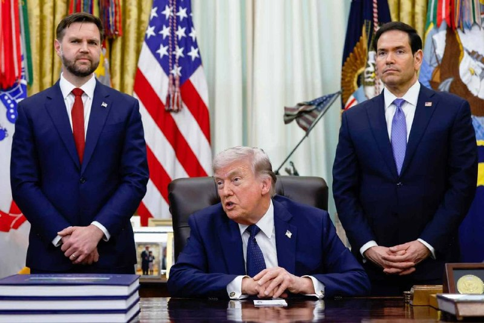

🔴 ترامپ :

ایرانی ها به شدت خواهان توافق هستند و از جنگ میترسند !

@IranianMinds

## IranianMinds — post 20318

🔴 سازمان ملل :

نگرانیم …

@IranianMinds

## IranianMinds — post 20317

🔴 پاکستان:

ما یک پیشنهاد اصلاح‌ شده ایران را به آمریکا برای پایان دادن به جنگ ارائه دادیم

@IranianMinds

## IranianMinds — post 20316

  <a href="telegram/content/IranianMinds_20316_1779101386.mp4" target="_blank">🎬 Download video</a>

🔴 اومدن مساجد رو پادگان کردن و هرچی اورانگوتان بسیجی هست و میبرن و بهش آموزش نظامی میدن که چطوری مردمو بکشن و ازش یه گزارش درست کردن تو‌ صداوسیما هم پخشش کردن !

بعد کافیه یه مسجد بمبارون شه همینا بیان زار بزنن بگن وای مناطق غیرنظامی زدن مکان مقدسو‌ هدف قرار دادن 😭

@IranianMinds

## IranianMinds — post 20315

🔴 خبرگزاری فارس :

باید کابل های اینترنت فیبر نوری در تنگه هرمز رو نابود کنیم و با انفجار موشک‌ در‌ مدار لئو‌ اینترنت استارلینک رو هم قطع کنیم

@IranianMinds

## IranianMinds — post 20314

  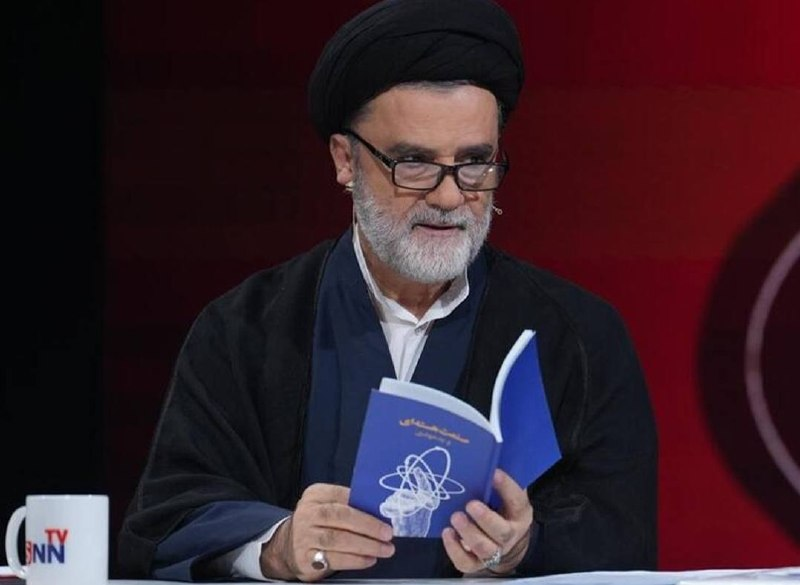

🔴 نبویان عضو کمیسیون امنیت ملی مجلس :

بزودی میخوایم‌ توی مجلس با رای نماینده ها یه جایزه ی بزرگ‌ بزاریم روی سر ترامپ و نتانیاهو که هرکسی اینارو‌ ترور کنه یه پول خیلی بزرگی بهش بدیم

و اگه دوباره به ما حمله کنن هم خودشونو کاخ هاشونو نابود میکنیم

@IranianMinds

## IranianMinds — post 20313

🔴 آکسیوس :

آتش‌بس در آستانه فروپاشی است، و‌ درگیری هر لحظه ممکن است دوباره شروع شود

@IranianMinds

## BBCPersian — post 281372

🔻سازمان غذا و داروی ایران: تأمین مواد اولیه و واردات دارو دچار اختلال شده است
سخنگوی سازمان غذا و داروی ایران می‌گوید که تأمین مواد اولیه و واردات دارو در ایران دچار اختلال شده است.

محمد هاشمی به خبرگزاری کار ایران، ایلنا، گفت که برای شناسایی و مدیریت به‌موقع هرگونه کمبود در بازار، سامانه‌ای فعال شده است که موجودی انبارها و خطوط تولید را به‌طور لحظه‌ای زیر نظر دارد.

آقای هاشمی افزود: «اولویت‌بندی واردات بر اساس ضرورت درمانی داروها در دستور کار قرار گرفته و نهاده‌های مربوط به داروهای حیاتی، مزمن و خاص در صدر فهرست تخصیص ارز و ترخیص قرار دارند.»

هدف قرار گرفتن برخی موسسات مرتبط با تولید دارو در حملات آمریکا و اسرائیل و همچنین محدود شدن واردات به دلیل اختلال در تنگه هرمز و مسیرهای هوایی، به کمبود دارو در ایران دامن زده است.

علاوه بر اینها، تخصیص ارز به واردات دارو هم کاهش یافته است.

پیشتر سخنگو و عضو هیات‌مدیره انجمن داروسازان ایران گفته بود: «محدود شدن منابع ارزی دولت به معنی کاهش امکان اختصاص یارانه به تولید و عرضه دارو است که منجر به افزایش قیمت بین ۳۰ تا ۳۰۰ درصدی قیمت دارو شده است.»

روزنامه اعتماد هفته پیش در گزارشی گفت که مصرف‌کنندگان داروهای خاص‌، با چالش بزرگی روبرو شده‌اند.

روایت‌های بیماران از نبود کیت آزمایش، کمیابی انسولین، افزایش چندبرابری قیمت داروهای حیاتی و توقف واردات برخی داروهای سرطان، از بحرانی حکایت دارد که مستقیما با جان انسان‌ها گره خورده است.

https://bbc.in/4uUCoPk
@BBCPersian

## BBCPersian — post 281371

  

🔻خبرگزای رسمی ایران (ایرنا) می‌گوید که با تداوم قطع اینترنت استفاده از سیم‌کارت‌های عراقی در شهرهای مرزی ایران رونق گرفته است.

ایرنا از کاربران نقل کرده است که به‌دلیل نزدیکی جغرافیایی آبادان و خرمشهر به خاک عراق، آنتن‌دهی اپراتورهای عراقی در برخی نقاط این شهرها، بویژه در مناطق نزدیک اروندرود، قابل دریافت است.

این گزارش می‌گوید خیابان‌های منتهی به رودخانه مرزی ایران و عراق در آبادان محل «تجمع خودروها و افراد پیاده است که در نگاه اول تداعی‌کننده یک تفریحگاه است اما در این مرز خبری از تفریح نیست، گوشی‌های به‌دست گرفته شده و سرهایی که در گوشی‌ها فرو رفته، حکایت از مهاجرت دیجیتال در نقطه صفر مرزی دارد.»

بر اساس این گزارش، قیمت این سیم‌کارت‌ها در بازار غیررسمی خوزستان حدود دو میلیون تومان است و در صورت فعال‌سازی اینترنت و خرید بسته‌های اولیه، هزینه آن گاهی به حدود پنج میلیون تومان نیز می‌رسد.

📷Reuters
@BBCPersian

## BBCPersian — post 281370

  <a href="telegram/content/BBCPersian_281370_1779101390.mp4" target="_blank">🎬 Download video</a>

🔻مقام‌های آمریکایی اعلام کردند که پس از برخورد و سقوط دو جت نیروی دریایی این کشور در جریان نمایش هوایی، وضعیت سلامتی چهار خدمه پایدار است. جت‌های بوئینگ EA18-G گرولر که ویژه جنگ الکترونیک هستند، در حال انجام حرکات نمایشی با هم برخورد و سقوط کردند، اما هر چهار سرنشین آنها با پرتاب اضطراری صندلی پیش از سقوط از هواپیماها خارج شدند.

این حادثه یکشنبه، در دومین و آخرین روز از نمایش هوایی گان‌فایتر اسکایز (Gunfighter Skies) در آیداهو رخ داد.

در پی این برخورد آتش‌سوزی رخ داد و بقیه نمایش هوایی لغو شد. تحقیقات در حال انجام است.

پایگاه هوایی مانتین ایر فورس گانفایترز در بیانیه‌ای که روز یکشنبه در شبکه‌های اجتماعی منتشر شد، اعلام کرد: «خدمه هوایی که در این حادثه درگیر بودند، در وضعیت پایداری قرار دارند.»

سخنگوی نیروی دریایی گفت که خدمه توسط پرسنل پزشکی معاینه می‌شوند.

هواپیماهای EA-18G گرولر متعلق به یک اسکادران جنگ الکترونیکی از ایالت واشنگتن بودند. نیروی دریایی ایالات متحده می‌گوید هر یک از این جت‌ها حدود ۶۷ میلیون دلار قیمت داشته است.

https://bbc.in/4fpKU47
@BBCPersian

## BBCPersian — post 281369

  

🔻تیم ملی فوتبال ایران صبح امروز با حضور ۲۲ بازیکن و اعضای کادر فنی برای برگزاری یک بازی دوستانه عازم آنتالیا در ترکیه شد.

این بازی دوستانه قرار است آخرین مسابقه تیم ملی با هدف آماده‌سازی برای حضور در جام جهانی و سفر به ایالات متحده باشد.

۲۲ بازیکن اعزام شده به ترکیه، بازکنان شاغل در باشگاه‌های داخلی ایران هستند.

امیر قلعه‌نویی، سرمربی تیم فوتبال ایران، گفته است که ۲۸ فوتبالیست برای حضور در تیم ملی انتخاب شده‌اند و ابراز امیدواری کرده که به همه آنها روادید ورود به آمریکا داده شود.

دو روز پیش مهدی تاج، رئیس فدراسیون فوتبال ایران، در استانبول با ماتیاس گرافستروم، دبیر کل فیفا، دیدار و گفت‌گو کرد.

آقای تاج گفت که در این دیدار مقامات فیفا به «۱۰ نکته‌ای که ایران مطرح کرد، گوش دادند و برای هر یک از آنها راه‌ حل ارائه کردند.»

او ابراز امیدواری کرد که تیم ملی فوتبال ایران بتواند بدون هیچ مشکلی به جام جهانی برود.

قرار است ایران هر سه بازی مرحله گروهی جام جهانی را در ایالات متحده برگزار کند.
@BBCPersian
📷IRAN MEDIA

## BBCPersian — post 281368

🔻نشست وزرای دارایی گروه هفت زیر سایه نگرانی‌ها از خطرات تورمی جنگ ایران

وزرای دارایی هفت کشور صنعتی جهان، موسوم به گروه هفت، در تلاش برای یافتن راه حلی برای پیامدهای تورمی جنگ ایران، امروز در پاریس دیدار می‌کنند.

این جلسه در حالی برگزار می‌شود که نگرانی از خطرات تورمی جنگ ایران، باعث فروش گسترده اوراق قرضه دولتی شده است.

اوراق قرضه، از توکیو گرفته تا نیویورک، روز دوشنبه به افت ارزش خود ادامه دادند؛ افت ارزش این اوراق قرضه به معنای افزایش نرخ بهره آنهاست که نشان می‌دهد

سرمایه‌گذاران به دلیل نگرانی از افزایش قیمت انرژی و تشدید تورم، پیشبینی می‌کنند که نرخ بهره بانکی افزایش خواهد یافت.

وزیر دارایی فرانسه، در پاسخ به این سوال که آیا بازارهای اوراق قرضه در حال فروپاشی هستند، گفت: «آنها در حال اصلاح قیمت هستند، من آن را فروپاشی توصیف نمی‌کنم.»

وزارت دارایی فرانسه گفت که در این نشست نمایندگانی از بانک‌های مرکزی گروه هفت نیز حضور خواهند داشت.

@BBCPersian

## BBCPersian — post 281367

🔻بقایی: بر سر حق غنی‌سازی گفت‌وگو یا مصالحه نمی‌کنیم

سخنگوی وزارت خارجه ایران درباره غنی‌سازی گفت: «آنچه با قطعیت می‌شود گفت بحث حق موضوعی نیست که ما بر سر آن گفتگو یا مصالحه کنیم. حق ایران برای غنی‌سازی بر اساس معاهده عدم اشاعه (ان‌پی‌تی) به رسمیت شناخته شده است.»

آقای بقایی در پاسخ به سوالی درباره پنج شرط آمریکا در برابر پنج شرط ایران گفت که ما مطالباتمان روشن است. مثلا درباره آزادشدن دارایی‌های ایران «شما می‌گویید این شرط ماست ما می‌گوییم این مطالبه ماست.»

او گفت که «آمریکا در سطح بین‌المللی دیگر معتبر تلقی نمی‌شود» و «کشورهای منطقه به شمول امارات باید درس بگیرند از اتفاقات ماه‌های اخیر که دیدند حضور آمریکا منجر به امنیت منطقه نشده است و آن را در مخاطره جدی قرار می‌دهد.»

@BBCPersian

## BBCPersian — post 281366

🔻بقایی: مذاکرات با میانجی پاکستانی ادامه دارد

اسماعیل بقایی، سخنگوی وزارت خارجه ایران، در نشست خبری هفتگی درباره مفاد پیشنهاد آمریکا گفت که ما وقتی طرح ۱۴ بندی را دادیم، طرف آمریکایی ملاحظاتش را مطرح کرد و ما هم متقابلا ملاحظاتمان را مطرح کردیم:

«هفته گذشته علیرغم اینکه طرف آمریکایی به‌صورت علنی اعلام کردند که این طرح [۱۴ بندی] مردود است ما از طریق میانجی پاکستانی مجموعه نکات و ملاحظات اصلاحی آنها را دریافت کردیم. روز بعد از ارسال طرح‌مان، با مجموعه‌ای از پیشنهادات طرف مقابل مواجه شدیم، در این چند روز بررسی شد و متقابلا پاسخ ما ارائه شده است و مذاکرات با میانجی پاکستانی ادامه دارد.»

@BBCPersian

## BBCPersian — post 281365

🔻کویت و قطر، حملات پهپادی به عربستان را محکوم کردند

کویت و قطر در بیانیه‌هایی جداگانه، حملات پهپادی به عربستان سعودی را که مقام‌ها گفته‌اند از حریم هوایی عراق انجام شده، به‌شدت محکوم کرده‌اند.

کویت اعلام کرده است که این اقدام نقض قطعنامه شورای امنیت سازمان ملل است که برای حفاظت از زیرساخت‌های خلیج فارس تصویب شد.

کویت ز اقدامات عربستان برای حفظ امنیتش حمایت کرد.

قطر نیز این حمله را «تجاوزی مردود» و نقض آشکار حاکمیت عربستان توصیف کرد.

هر دو کشور همبستگی کامل خود را با ریاض اعلام و از هرگونه اقدام برای حفاظت از خاک و شهروندان عربستان حمایت کردند.

این بیانیه‌ها پس از آن منتشر شده است که عربستان سعودی اعلام کرد سامانه‌های پدافند هوایی این کشور سه پهپاد مهاجم را رهگیری کرده‌اند.

@BBCPersian

## BBCPersian — post 281364

🔻قوه قضائیه اموال ۱۲۹ نفر را در آذربایجان غربی توقیف کرد

با ادامه توقیف اموال چهره‌های مخالف جمهوری اسلامی، قوه قضائیه در این کشور اعلام کرده که اموال ۱۲۹ نفر را در آذربایجان غربی توقیف کرده است.

این نهاد می‌گوید دارایی‌های توقیف شده متعلق به «سرکردگان گروهک‌های ضد انقلاب و تجزیه‌طلب» در استان آذربایجان غربی بوده و مالکان این اموال را به «همدستی با آمریکا و اسرائیل»متهم کرده است.

جزئیات روند دادرسی منجر به توقیف اموال این افراد هنوز مشخص نیست.

با شدت گرفتن ضبط اموال افرادی که در میان آنها طیف وسیعی از اقشار جامعه از خبرنگار تا بازیگران سابق و فعالان سیاسی و هنرمند، دیده می‌شوند.

فعالان مجازی حامی جمهوری اسلامی در جریان جنگ اخیر، اقدام به فراخوان‌هایی برای معرفی مخالفان جمهوری اسلامی که آنها را «حامی جنگ» نامیدند، کرده بودند.

پس از اعتراضات دی ماه و کشتار معترضان، شمار زیادی از شهروندان ایرانی در خارج از کشور در تجمعات اعتراضی در شهرهای مختلف شرکت کردند که این اعتراضات در هفته‌های منتهی به جنگ و بعد از آن هم ادامه یافت.

قوه قضائیه پس از جنگ آمریکا و اسرائیل با ایران، با استناد به قانون «تشدید مجازات جاسوسی» معترضان و مخالفان را به «همراهی با دشمن» متهم کرد.

اما این توقیف‌ها به موضوع جنگ محدود نیست؛ در زمان اعتراضات دی ماه هم اموال بعضی از چهره‌های شناخته شده در داخل ایران هم ضبط شد.

@BBCPersian

## idfinfarsi — post 11593

  <a href="telegram/content/idfinfarsi_11593_1779101394.mp4" target="_blank">🎬 Download video</a>

‼️ارتش اسرائیل یک تروریست از سازمان تروریستی حماس را که قصد اجرای طرح‌های تک‌تیراندازی علیه نیروهای ارتش اسرائیل در آینده نزدیک داشت، به هلاکت رساند

🔻یک هواگرد نیروی هوایی، با هدایت نیروهای لشکر غزه (۱۴۳)، دیروز (یکشنبه) یک تروریست از سازمان تروریستی حماس را که در حال پیشبرد طرح‌های تک‌تیراندازی در آینده نزدیک علیه نیروهای ارتش اسرائیل در جنوب نوار غزه بود، به هلاکت رساند.

🔻این تروریست تهدیدی فوری برای نیروهای ارتش اسرائیل محسوب می‌شد و به‌صورت هدفمند برای رفع این تهدید به هلاکت رسید.

🔻پیش از حمله، اقداماتی برای کاهش آسیب به غیرنظامیان انجام شد، از جمله استفاده از مهمات دقیق و دیدبانی هوایی.

🔻نیروهای ارتش اسرائیل تحت فرماندهی جبهه جنوب مطابق با توافق مستقر هستند و به فعالیت برای رفع هرگونه تهدید فوری ادامه خواهند داد.

## Dirty_Kids — post 389666

  <a href="telegram/content/Dirty_Kids_389666_1779101395.mp4" target="_blank">🎬 Download video</a>

Coming soon… 🐺⚽️

موزیک‌ویدئو شکیرا که با پله و مارادونا شروع می‌شه و قراره برای افتتاحیه‌ی جام جهانی اجراش کنه

@Dirty_Kids 👻

## Dirty_Kids — post 389665

  <a href="telegram/content/Dirty_Kids_389665_1779101397.mp4" target="_blank">🎬 Download video</a>

قاضی‌زاده‌هم گرفت رو بهزاد سگ‌سیبیل

@Dirty_Kids 👻

## Dirty_Kids — post 389664

  

🌪وقتی اینترنت طوفانیه... کافیه بادبان ها رو بکشی تا

⚫️با بالاترین کیفیت ممکن
⚡️ 

⚫️100 هزار تومان شارژ هدیه 
🎁

⚫️پایین ترین قیمت گیگی 250
🌐 

⚫️و ارائه پورسانت %10 در ازای هر معرفی
💼

بتونی یه اتصال پایدار با پشتیبانی 24 ساعته داشته باشی
🚀

بادبان راهتو باز می‌کنه
⛵️

R28

🛡@BadBan_VPN | کانال 

🤖@BadBan_VPNBot | ربات 

📞@BadBan_VPNSupport | پشتیبانی

## Dirty_Kids — post 389663

  <a href="telegram/content/Dirty_Kids_389663_1779101400.mp4" target="_blank">🎬 Download video</a>

رقابت شدیدی هست بین ورزش کردن با کافه رفتن تو عادیسازی..

خب اصن گیریم دو ساعت ورزش کردیم بعدش، گوشت مرغ‌تخم‌مرغ ارزون میشه؟

+ اینارو من نمیشناسم کلی مشاهداتمو میگم..

@Dirty_Kids 👻

## Dirty_Kids — post 389662

  

ولی من دوست دارم فردای آزادی خودم رو به صورت فیزیکی به عمو مراد ویسی برسونم و ازش خواهش کنم تو یه برنامه بگه:
فرزند ایران و جان فدای میهن فریدون فرخزاد ۵۳ ساله از تهران عزیز
«یادمون باشه ما ها همه‌مون کم و زیاد به نوعی به فریدون فرخزاد بدهکاریم»
#پاينده_ایران_جاویدشاه

@Dirty_Kids 👻

## Dirty_Kids — post 389661

  

‌‌‏این بچه خایه داره اندازه کل هیکل بابات

@Dirty_Kids 👻

## Dirty_Kids — post 389660

  

پناه بر خدا این گربه جدی جدی ریش و سبیل داره.

@Dirty_Kids 👻

## Dirty_Kids — post 389659

‏۵۷ انقلاب کردن تخم نمیخواست چون اونجا سپاه محمدرسول الله و قرارگاه خاتم و سپاه امام حسن و سپاه موتوری امام علی مسلح مردم رو به رگبار نمیبستن

۵۷ شورش کردن درجه ی بالایی از تخمی بودن لازم داشت که شماها داشتین

@Dirty_Kids 👻

## Dirty_Kids — post 389658

  <a href="telegram/content/Dirty_Kids_389658_1779101404.mp4" target="_blank">🎬 Download video</a>

🔴 ویدیو وایرال شده از روزهای اول جنگ تو تهران؛

خونه‌ی طرف بخاطر موج انفجار آسیب دیده و پلیس‌ 10 دقیقه وقت داده که اگه چیز مهمی مثل طلا، سند و... دارید، بردارید و فوری ساختمون رو ترک کنید که احتمال حمله مجدد هست..

بعد خانومی از لا به لای اون همه شیشه خرده و آوار داره رد میشه که بره چیش رو پیدا کنه؟ موچین...

@Dirty_Kids 👻

## Hranews — post 113012

  

مهدی ابطحی، معاون پژوهشی وزیر علوم با اشاره به #قطع_اینترنت در کشور و محدودیت‌های موجود، به ویژه برای دانشجویان مقطع تحصیلات تکمیلی، اعلام کرد که تداوم این وضعیت باعث تنزل جایگاه ایران از جمع ۲۰ کشور برتر در حوزه تولید علم خواهد شد.

↘️
@hranews_bot تماس ✉️ -  @Hranews  کانال هرانا 🆑

## Hranews — post 113011

  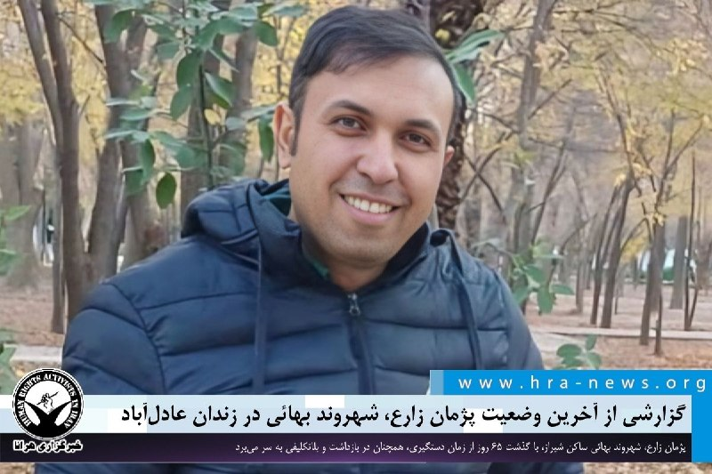

گزارشی از آخرین وضعیت پژمان زارع، شهروند بهائی در زندان عادل‌آباد

❗️
❗️
❗️
❗️
❗️– پژمان زارع، شهروند #بهائی ساکن شیراز، علیرغم گذشت ۶۵ روز از زمان دستگیری، همچنان در بازداشت و بلاتکلیفی به سر می‌برد. وی اخیراً به زندان عادل‌آباد این شهر منتقل شده است.

به گزارش خبرگزاری هرانا، ارگان خبری مجموعه فعالان حقوق بشر در ایران، پژمان زارع کماکان در بازداشت به‌سر می‌برد.

یک منبع مطلع نزدیک به خانواده این #شهروند_بهائی ضمن تایید این موضوع به هرانا گفت: آقای زارع پس از ۵۸ روز نگهداری در مکانی نامعلوم و بی‌خبری خانواده از وضعیتش، اخیراً به زندان عادل‌آباد شیراز منتقل شده و تاکنون تنها یک ملاقات از پشت شیشه با خانواده‌اش داشته است. وی همچنان از حق دسترسی به وکیل محروم بوده و تاکنون تفهیم اتهام نشده است.
این منبع مطلع افزود: «علیرغم تامین وثیقه توسط خانواده و ارائه آن به دادسرا، تاکنون با آزادی موقت وی موافقت نشده است.»

ادامه مطلب

#پژمان_زارع

↘️
@hranews_bot تماس ✉️ -  @Hranews  کانال هرانا 🆑

## Hranews — post 113010

  

نت‌بلاکس، که محدودیت دسترسی به #اینترنت در جهان را رصد می‌کند، اعلام کرد که قطع سراسری اینترنت در ایران اکنون از ۱۸۹۶ ساعت گذشته و وارد هشتادمین روز خود شده است.

↘️
@hranews_bot تماس ✉️ -  @Hranews  کانال هرانا 🆑

## Hranews — post 113009

  

امروز دوشنبه ۲۸ اردیبهشت‌ماه، جمعی از کارگران شرکت پتروشیمی پتروناد برای چهارمین روز متوالی در مقابل ساختمان فرمانداری بندرامام دست به #تجمع_اعتراضی زدند.

#تجمع این کارگران در اعتراض به اخراج ۲۰۰ کارگر بومی این شرکت صورت گرفته است.

↘️
@hranews_bot تماس ✉️ -  @Hranews  کانال هرانا 🆑

## Hranews — post 113008

  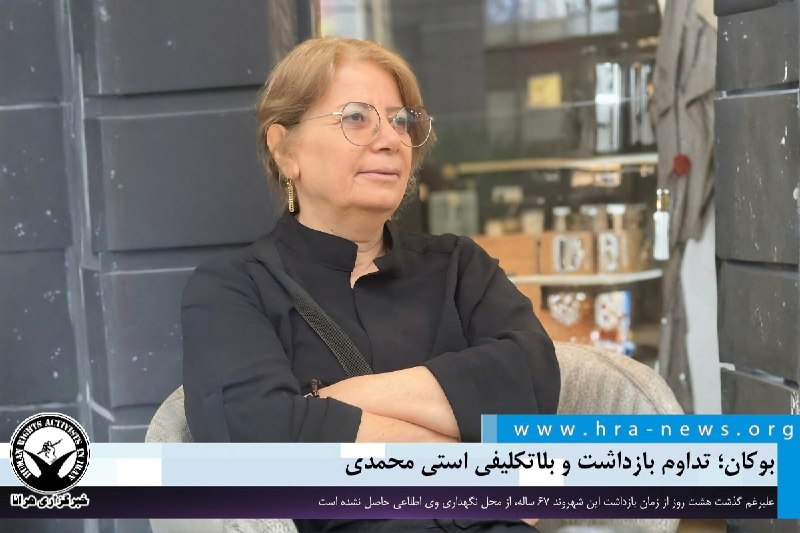

هشت روز پس از بازداشت؛ بی‌خبری از سرنوشت استی محمدی ادامه دارد

❗️
❗️
❗️
❗️
❗️– استی محمدی، شهروند ۶۷ ساله اهل بوکان، علیرغم گذشت هشت روز از زمان بازداشت، همچنان در بلاتکلیفی به‌سر میبرد. بی‌خبری از سرنوشت خانم محمدی، منجر به افزایش نگرانی‌های خانواده وی شده است.

به گزارش خبرگزاری هرانا، ارگان خبری مجموعه فعالان حقوق بشر در ایران، استی محمدی کماکان در بازداشت و بلاتکلیفی به‌سر میبرد.

با گذشت هشت روز از زمان بازداشت، خانواده این شهروند همچنان از محل نگهداری و وضعیت او بی‌اطلاع هستند. استی محمدی دارای بیماری زمینه‌ای است و نیاز به مصرف دارو دارد.

ادامه مطلب

#استی_محمدی

↘️
@hranews_bot تماس ✉️ -  @Hranews  کانال هرانا 🆑

## Hranews — post 113007

  

محمدعلی عموری از زندان شیبان اهواز به مکان نامعلومی منتقل شد

❗️
❗️
❗️
❗️
❗️– محمدعلی عموری، زندانی سیاسی محکوم به #حبس_ابد، حدود ده روز پیش توسط نیروهای اداره اطلاعات اهواز از زندان شیبان این شهر به مکان نامعلومی منتقل شد. تاکنون اطلاعی از محل نگهداری و وضعیت او حاصل نشده است.

به گزارش خبرگزاری هرانا، ارگان خبری مجموعه فعالان حقوق بشر در ایران، از سرنوشت و محل نگهداری محمدعلی عموری، زندانی سیاسی اطلاعی در دست نیست.

ماموران اداره اطلاعات اهواز روز شنبه ۱۹ اردیبهشت ماه، محمدعلی عموری را از زندان شیبان اهواز خارج کرده و به مکان نامعلومی منتقل کرده‌اند. با وجود پیگیری‌های خانواده، تا کنون هیچ نهاد مسئولی پاسخ روشنی درباره محل نگهداری یا وضعیت او ارائه نکرده است.

ادامه مطلب

#محمدعلی_عموری
↘️
@hranews_bot تماس ✉️ -  @Hranews  کانال هرانا 🆑

## Hranews — post 113006

  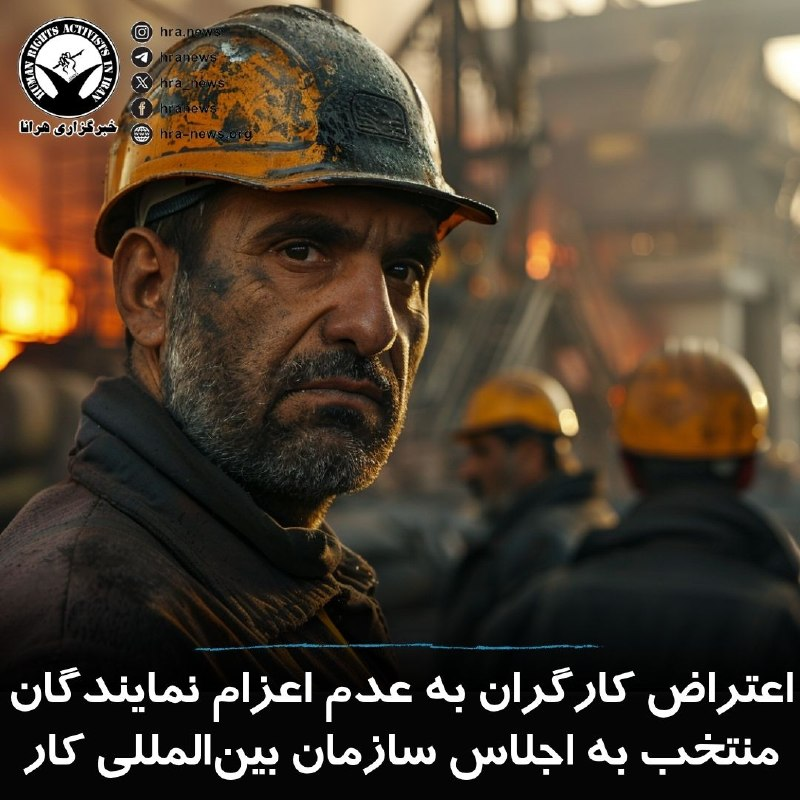

کانون عالی انجمن‌های صنفی #کارگران ایران در نامه‌ای سرگشاده به رئیس مجلس شورای اسلامی، نسبت به آنچه «انحصار در روند انتخاب و اعزام نمایندگان کارگری» به اجلاس‌های سازمان بین‌المللی کار عنوان شده، انتقاد کرده است. در این نامه تأکید شده که در سال‌های اخیر، ترکیب هیئت‌های اعزامی به‌گونه‌ای بوده که به جای استفاده از ظرفیت نمایندگان تخصصی و منتخب حوزه کار، افراد محدود و نزدیک به بدنه وزارت تعاون، کار و رفاه اجتماعی در این فرآیند نقش پررنگ‌تری داشته‌اند.

در این نامه با اشاره به برگزاری پیش‌روی اجلاس سازمان بین‌المللی کار در ژنو، از مجلس شورای اسلامی خواسته شده درباره معیارهای انتخاب نمایندگان اعزامی و میزان شفافیت این روند توضیح داده شود. همچنین بر ضرورت استفاده از ظرفیت فراکسیون کارگری و جلوگیری از تکرار سازوکارهای غیرشفاف در اعزام‌ها، در شرایطی که به گفته این تشکل #مشکلات_معیشتی و اشتغال کارگران تشدید شده، تأکید شده است.

↘️
@hranews_bot تماس ✉️ -  @Hranews  کانال هرانا 🆑

## Hranews — post 113005

گزارشی از بازداشت و پخش اعترافات اجباری یک زن در غرب تهران

❗️
❗️
❗️
❗️
❗️– مرکز اطلاع‌رسانی فرماندهی انتظامی تهران بزرگ از #بازداشت یک زن در غرب تهران با اتهاماتی همچون «حمایت از حملات دشمنان خارجی در فضای مجازی و همکاری با سرویس‌های جاسوسی» خبر داد. همزمان ویدیویی از #اعترافات_اجباری این شهروند منتشر شده که شرایط ضبط آن مشخص نیست.

ادامه مطلب

↘️
@hranews_bot تماس ✉️ -  @Hranews  کانال هرانا 🆑

## Hranews — post 113004

دستور توقیف اموال ۱۲۹ شهروند در استان آذربایجان غربی صادر شد 
❗️
❗️
❗️
❗️
❗️– رئیس‌ کل دادگستری آذربایجان غربی از صدور دستور #توقیف_اموال ۱۲۹ شهروند در این استان به دلیل آنچه “اقدامات ضدامنیتی” و همکاری با “کشورهای متخاصم” عنوان کرده، خبر داد. ادامه مطلب ↘️…

## manototv — post 105590

  <a href="telegram/content/manototv_105590_1779101411.mp4" target="_blank">🎬 Download video</a>

یوروپل، آژانس همکاری پلیسی اتحادیه اروپا، اعلام کرد در یک اقدام هماهنگ برای مقابله با محتوای «تروریستی» در فضای مجازی، ۱۴ هزار و ۲۰۰ پیوند مرتبط با فعالیت‌های سپاه پاسداران شناسایی شده است.

بر اساس اعلام یوروپل، این عملیات با هدف مقابله با «زیست‌بوم تبلیغاتی» سپاه پاسداران در اینترنت انجام شد و محققان، هزاران پست و پیوند را برای ارجاع به ارائه‌دهندگان خدمات آنلاین هدف قرار دادند.

## manototv — post 105589

  <a href="telegram/content/manototv_105589_1779101412.mp4" target="_blank">🎬 Download video</a>

امروز، ۲۸ اردیبهشت ۱۴۰۵، هم‌زمان با زادروز محمدرشید مظاهری، دروازه‌بان سابق تیم ملی فوتبال ایران، جمعی از ایرانیان و اعضای «حزب پادشاهی‌خواه میهن‌پرستان ایران» مقابل کنسولگری جمهوری اسلامی در هامبورگ تجمع کردند.

تجمع‌کنندگان با گرامی‌داشت زادروز این ورزشکار، خواستار آزادی بی‌قیدوشرط او و همه زندانیان سیاسی شدند.

رشید مظاهری، بازیکن سابق استقلال، سپاهان، تراکتور و ذوب‌آهن، در ۵ اسفند ۱۴۰۴ پس از انتشار پستی انتقادی علیه علی خامنه‌ای بازداشت شد و بر اساس گزارش‌ها، نزدیک به سه ماه است در وضعیت ناپدیدشدن قهری قرار دارد.

گزارش‌ها و ویدیوهای خود را از طریق واتس‌اپ یا تلگرام برای منوتو بفرستید:

۰۰۴۴۷۵۹۰۸۹۹۹۹۹

## manototv — post 105588

  <a href="telegram/content/manototv_105588_1779101414.mp4" target="_blank">🎬 Download video</a>

رویترز روز دوشنبه ۲۸ اردیبهشت به نقل از یک منبع پاکستانی گزارش داد پاکستان پیشنهاد بازنگری‌شده جمهوری اسلامی برای پایان دادن به درگیری در خاورمیانه را به آمریکا منتقل کرده است.

این منبع پاکستانی گفت مذاکرات صلح همچنان در بن‌بست به نظر می‌رسد و «زمان زیادی» برای کاهش اختلاف‌ها باقی نمانده است. او افزود هر دو طرف «مدام مواضع خود را تغییر می‌دهند.»

## manototv — post 105587

  <a href="telegram/content/manototv_105587_1779101415.mp4" target="_blank">🎬 Download video</a>

اسماعیل بقایی، سخنگوی وزارت خارجه جمهوری اسلامی، روز دوشنبه ۲۸ اردیبهشت، در نشست خبری خود گفت تهدید و فشار اقتصادی آمریکا نتوانسته تهران را از پیگیری حقوق خود منصرف کند.

بقایی با اشاره به تهدیدهای مطرح‌شده علیه جمهوری اسلامی گفت: «در صورت کوچک‌ترین خطایی از سوی طرف‌های مقابل، می‌توانیم خوب جواب دهیم.» او اضافه کرد در روزهای اخیر مردم در میدان‌های تهران می‌گویند: «تو رستم تهمتنی و بزن که خوب می‌زنی.»

## manototv — post 105586

  <a href="telegram/content/manototv_105586_1779101417.mp4" target="_blank">🎬 Download video</a>

رالی خودرها در سن‌دیگو در حمایت از مردم ایران، یکشنبه ۲۷ اردیبهشت

## manototv — post 105585

  <a href="telegram/content/manototv_105585_1779101419.mp4" target="_blank">🎬 Download video</a>

اسماعیل بقایی، سخنگوی وزارت خارجه جمهوری اسلامی، روز دوشنبه ۲۸ اردیبهشت گفت مواردی مانند آزادسازی دارایی‌های مسدودشده ایران و رفع تحریم‌ها «شرط» تهران نیست، بلکه «مطالبات روشن و به‌حق» جمهوری اسلامی در مذاکرات است.

بقایی در پاسخ به پرسشی درباره شروط جمهوری اسلامی گفت ممکن است طرف مقابل موضوعات را به تشخیص خود نام‌گذاری کند، اما «مطالبات ما روشن است.»

سخنگوی وزارت خارجه جمهوری اسلامی همچنین رفع تحریم‌ها را یکی دیگر از مطالبات ایران دانست و گفت این موارد در هر مذاکره‌ای از سوی هیئت مذاکره‌کننده جمهوری اسلامی «با جدیت» پیگیری می‌شود.

## manototv — post 105584

  <a href="telegram/content/manototv_105584_1779101421.mp4" target="_blank">🎬 Download video</a>

همزمان با افزایش دوباره تنش‌ها در خاورمیانه، قیمت نفت بالا رفت و ریزش جهانی اوراق قرضه، تمایل سرمایه‌گذاران به دارایی‌های پرریسک را کاهش داد.

بر اساس این گزارش، شاخص دلار در برابر سبدی از ارزهای اصلی تقریبا ثابت ماند و به ۹۹.۳۲۵ رسید. همزمان، نفت برنت بیش از یک درصد افزایش یافت و به بالای ۱۱۰ دلار در هر بشکه رسید. رویترز نوشت حمله به یک نیروگاه هسته‌ای در امارات و توقف تلاش‌ها برای پایان دادن به جنگ آمریکا و اسرائیل علیه جمهوری اسلامی، از عوامل افزایش قیمت نفت بود.

## alonews — post 120828

  <a href="telegram/content/alonews_120828_1779101422.webm" target="_blank">🎬 Download video</a>

👈آلیس روفو وزیر مشاور نیروهای مسلح فرانسه با اشاره به تهدیدهای تازه دونالد ترامپ رئیس‌جمهور آمریکا علیه ایران، توقف «تنش لفظی» و «تنش نظامی» را خواستار شد

✅ @AloNews خبر جنگ

## alonews — post 120827

  <a href="telegram/content/alonews_120827_1779101422.webm" target="_blank">🎬 Download video</a>

👈وزارت دفاع بلاروس : تو بلاروس تمرین‌های برای استفاده رزمی از سلاح هسته‌ای شروع شده

✅ @AloNews خبر جنگ

## alonews — post 120826

  <a href="telegram/content/alonews_120826_1779101422.webm" target="_blank">🎬 Download video</a>

👈دبیر انجمن واردکنندگان خودرو:
با نبود اینترنت و قطعی دیاگ، موج خرابی خودروهای وارداتی در راه است

🔴بسیاری از دستگاه‌های دیاگ و تجهیزات تخصصی تعمیر خودرو برای بررسی و رفع ایرادات و حتی بروز رسانی نرم‌افزار، نیازمند اتصال به اینترنت بین‌الملل هستند و اختلال یا قطعی اینترنت بین‌الملل باعث شده روند عیب‌یابی و تعمیر بسیاری از خودروهای وارداتی با مشکل مواجه شود.

✅ @AloNews خبر جنگ

## alonews — post 120825

  <a href="telegram/content/alonews_120825_1779101423.webm" target="_blank">🎬 Download video</a>

👈وزیر قطع ارتباطات: دسترسی مردم به اینترنت یک نیاز واقعی است، نه امتیاز

✅ @AloNews خبر جنگ

## alonews — post 120824

  <a href="telegram/content/alonews_120824_1779101423.webm" target="_blank">🎬 Download video</a>

👈کانال ۱۲ اسرائیل: در پیشنهاد جدید ایران هیچ اشاره‌ای به هرمز و اورانیوم غنی‌شده نشده است

✅ @AloNews خبر جنگ

## alonews — post 120823

  <a href="telegram/content/alonews_120823_1779101423.mp4" target="_blank">🎬 Download video</a>

⭕️ افشاگری محمدحسین عظیمی دبیر کل جبهه انقلاب اسلامی در مورد مسیح علی‌نژاد و گلشیفته فراهانی

🤔عامل دستگاه امنیتی در ایران بودند

✅@AloNews

## alonews — post 120822

  <a href="telegram/content/alonews_120822_1779101426.webm" target="_blank">🎬 Download video</a>

👈خبرنگار الجزیره به نقل از منبعی در وزارت کشور پاکستان: وزیر کشور پاکستان، سفر خود به تهران را یک روز دیگر تمدید کرد

🔴 تلاش‌های پاکستان در حال حاضر بر تضمین تداوم عدم تنش متمرکز است

✅ @AloNews خبر جنگ

## alonews — post 120821

  <a href="telegram/content/alonews_120821_1779101426.webm" target="_blank">🎬 Download video</a>

👈صدراعظم آلمان: تهران باید با واشنگتن وارد مذاکره شود، از تهدید همسایگان خود دست بردارد و تنگه هرمز را بدون محدودیت باز کند

✅ @AloNews خبر جنگ

## alonews — post 120820

  <a href="telegram/content/alonews_120820_1779101426.webm" target="_blank">🎬 Download video</a>

👈 تسنیم: ایران متن جدیدی را در ۱۴ بند به واسطه پاکستانی تحویل داد

🔴یک منبع نزدیک به تیم مذاکره کننده:
ایران جدیدترین متن خود را در ۱۴ بند به واسطه پاکستانی تحویل داده است و میانجی پاکستانی آن را به آمریکایی‌ها ارائه می‌کند.

🔴 آمریکایی‌ها اخیراْ در پاسخ به متن پیشین ایران که آن هم در ۱۴ بند ارائه شده بود، متنی ارسال کرده بودند. ایران نیز مجددا بر اساس روال چند وقت اخیر در تبادل پیام، متن خود را پس از انجام اصلاحاتی مجددا در ۱۴ بند به واسطه پاکستانی ارائه کرد.

🔴 به گفته این منبع مطلع، متن جدید ایران بر موضوع مذاکرات پایان جنگ و اقدامات اعتمادساز طرف آمریکایی متمرکز است.

✅ @AloNews خبر جنگ

## alonews — post 120819

  <a href="telegram/content/alonews_120819_1779101426.webm" target="_blank">🎬 Download video</a>

👈قیمت نفت اوپک از ۱۱۶ دلار عبور کرد

✅ @AloNews خبر جنگ

## alonews — post 120818

  <a href="telegram/content/alonews_120818_1779101427.webm" target="_blank">🎬 Download video</a>

👈بلومبرگ با استناد به تصاویر ماهواره‌ای گزارش می‌دهد که تقریباً ۲۳ نفتکش در نزدیکی جزیره خارک مشاهده شده‌اند که بزرگترین تجمع از زمان آغاز تحریم‌های آمریکا است

✅ @AloNews خبر جنگ

## alonews — post 120817

  <a href="telegram/content/alonews_120817_1779101427.webm" target="_blank">🎬 Download video</a>

👈رویترز به نقل از یک منبع پاکستانی:
ما زمان زیادی برای پر کردن شکاف‌ها بین واشنگتن و تهران نداریم

✅ @AloNews خبر جنگ

## alonews — post 120816

  

پائین‌ترین پینگ‌ها رو با ما تجربه کنید
✔️

🔄کانفیگ‌های استارلینگ با پشتیبانی 24ساعته و لینک ساب
🔄

💯مورد تایید مجموعه الونیوز
💯

📌تحویل زیر 1دقیقه

📌بدون هیچ گونه قطعی

💰خرید آسان و سریع
⬇️

💎@FastProxyMakerBot

💎@FastProxyMakerBot

## alonews — post 120815

  <a href="telegram/content/alonews_120815_1779101428.webm" target="_blank">🎬 Download video</a>

👈براساس گزارشات خبری، کشورهای منطقه تمام تلاش خود را به کار گرفته اند تا جنگ میان ایران و آمریکا و اسرائیل به پایان برسد

✅ @AloNews خبر جنگ

## alonews — post 120814

  <a href="telegram/content/alonews_120814_1779101428.webm" target="_blank">🎬 Download video</a>

👈وزارت علوم: در ایران از هر ۱۰ بیکار، ۴ نفر دارای مدرک دانشگاهی هستند

✅ @AloNews خبر جنگ

## alonews — post 120813

  <a href="telegram/content/alonews_120813_1779101428.webm" target="_blank">🎬 Download video</a>

👈ممنوعیت هرگونه تبلیغات اپراتور‌ها و دستگاه‌ها درباره فروش اینترنت پرو

🔴اولین جلسه بهبود فرآیند اجرای طرح اینترنت پرو به میزبانی وزارت ارتباطات برگزار و در این جلسه مصوب شد که هرگونه تبلیغات توسط اپراتور‌ها و دستگاه‌ها در زمینه فروش اینترنت پرو ممنوع است.

✅ @AloNews خبر جنگ

## alonews — post 120812

  <a href="telegram/content/alonews_120812_1779101428.webm" target="_blank">🎬 Download video</a>

👈رویترز نقل از مقام پاکستانی: ما زمان زیادی برای پر کردن شکاف های بین ایران و آمریکا نداریم!

✅ @AloNews خبر جنگ

## alonews — post 120811

  <a href="telegram/content/alonews_120811_1779101429.webm" target="_blank">🎬 Download video</a>

👈خبرنگار کانال ۱۲ اسرائیل: به گفته منابع غربی، پیشنهاد جدید ایران شامل تعهدی با ارزش نامشخص برای عدم تولید سلاح هسته‌ای است، هیچ اشاره‌ای به اورانیوم نشده است، هیچ اشاره‌ای هم به هرمز وجود ندارد

✅ @AloNews خبر جنگ

## alonews — post 120810

  <a href="telegram/content/alonews_120810_1779101429.webm" target="_blank">🎬 Download video</a>

👈وزارت دفاع روسیه اعلام کرد که نیروهای مسلح این کشور حمله‌ای گسترده را به تأسیسات صنعت دفاعی نظامی اوکراین و همچنین زیرساخت‌های حمل و نقل و انرژی مرتبط با نیروهای مسلح اوکراین انجام داده‌اند.

✅ @AloNews خبر جنگ

## alonews — post 120809

  <a href="telegram/content/alonews_120809_1779101429.webm" target="_blank">🎬 Download video</a>

👈نیروی دریایی اسرائیل یک ناوگان به سمت غزه را نزدیک قبرس متوقف کرده است. ۶۰ کشتی این ناوگان قصد داشتند محاصره اسرائیل بر غزه را بشکنند و کمک‌های بشردوستانه بیاورند، طبق گزارش الجزیره

✅ @AloNews خبر جنگ

---
📅 بروزرسانی: 1405/02/28 09:48
---

## VahidOOnLine — post 240742

  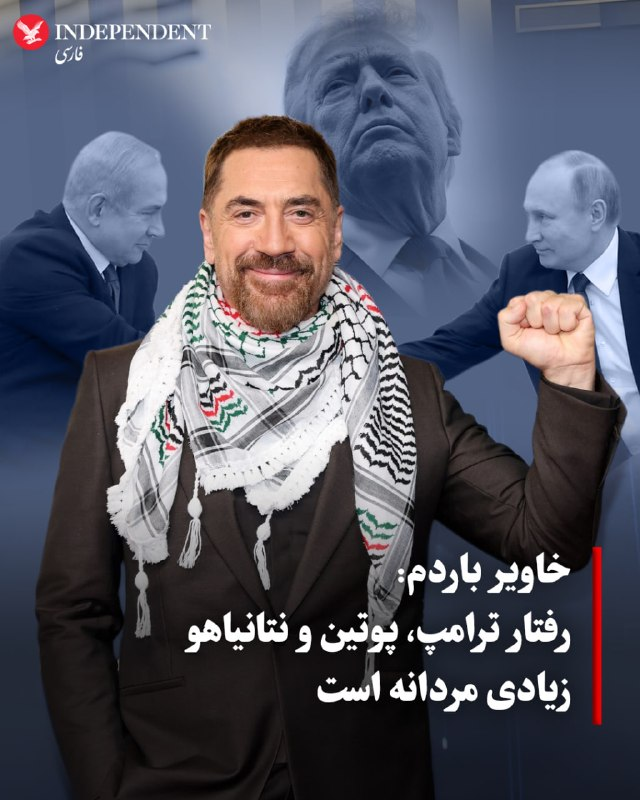

♦️ خاویر باردم، هنرپیشه اسپانیایی هوادار فلسطینیان در حاشیه جشنوار کن در پاسخ به خبرنگاران که از او درباره زیر سوال بردن مردانگی و نمایش خانواده‌ها بدون پدر در فیلم‌های به نمایش درآمده در جشنواره امسال سوال کردند گفت که خشونت علیه زنان نتیجه «مردانگی مسموم» است. او همچنین مدعی شد که رفتار دونالد ترامپ، رئیس‌جمهوری آمریکا، ولادیمیر پوتین، رئیس‌جمهوری روسیه و بنیامین نتانیاهو، نخست‌وزیر اسرائیل پیش از حد مردانه یا به تعبیر او دچار «رفتار مسموم مردانه» است.
‌🇸🇦 Indypersian

🤖 @VahidOOnLine

## VahidOOnLine — post 240741

♦️ پلیس ازبکستان روز یکشنبه ۲۷ اردیبهشت از کشف نزدیک به نیم تن مواد مخدر در مرز این کشور با افغانستان خبر داد.

براساس گزارش پلیس مرزی ازبکستان، این محموله شامل ۵۹۳ کیلوگرم حشیش و سه کیلوگرم تریاک به‌شکل ماهرانه‌ای در یک بیل مکانیکی که در یک تریکی در حال عبور از مرز افغانستان بود، کشف و ضبط شد.

به گفته مقام‌های مرزبانی و اداره گمرک ازبکستان، ماموران امنیتی در زمان بازرسی محموله تریلی، به تجهیزات «غیرضروری» این ابزار سنگین مشکوک شدند و پس از آن با استفاده از بازرسی با اشعه ایکس، توانستند بسته‌های جاسازی شده مواد مخدر در بدنه آن را کشف کنند.

این خبر در حالی منتشر می‌شود که از زمان بازگشت طالبان به قدرت در افغانستان، کشت خشخاش و تولید مواد مخدر در این کشور به‌شدت کاهش یافته است.
‌🇸🇦 Indypersian

🤖 @VahidOOnLine

## VahidOOnLine — post 240740

  <a href="telegram/content/VahidOOnLine_240740_1779085095.mp4" target="_blank">🎬 Download video</a>

‌🏁 🇬🇧 ManotoTV

🤖 @VahidOOnLine

## VahidOOnLine — post 240739

  <a href="telegram/content/VahidOOnLine_240739_1779085096.mp4" target="_blank">🎬 Download video</a>

دونالد ترامپ تصویری بدون توضیح در شبکه اجتماعی خود منتشر کرده است که در آن، پرچم آمریکا سراسر خاورمیانه و کشورهای اطراف ایران را پوشانده و پیکان‌هایی به‌سوی داخل ایران کشیده شده‌اند.

ترامپ ساعاتی پیش از انتشار این تصویر گفته بود که زمان برای ایران رو به پایان است.
‌🏁 🇬🇧 ManotoTV

🤖 @VahidOOnLine

## VahidOOnLine — post 240738

  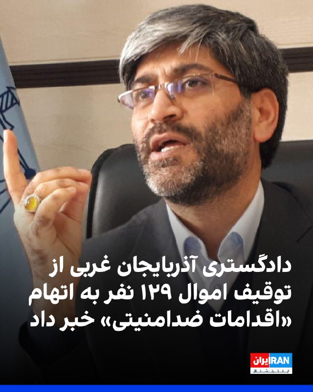

ناصر عتباتی، رییس کل دادگستری آذربایجان غربی، از توقیف اموال ۱۲۹ نفر در این استان به اتهام «اقدامات ضدامنیتی و همکاری با کشورهای متخاصم» خبر داد. او تاکید کرد قوه قضاییه به این روند توقیف اموال «با قدرت» ادامه خواهد داد.
‌🏁 🇬🇧 IranintlTV

🤖 @VahidOOnLine

## VahidOOnLine — post 240737

  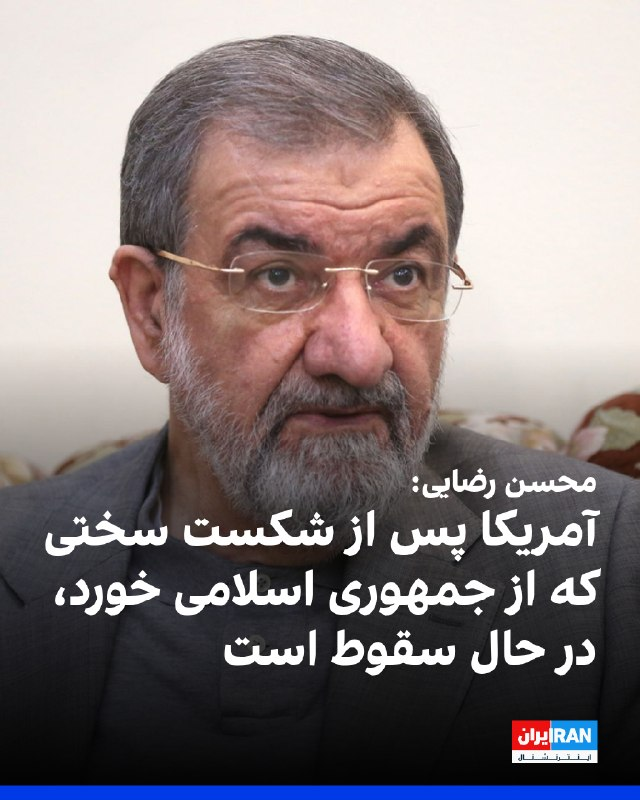

محسن رضایی، مشاور نظامی مجتبی خامنه‌ای، گفت: «آمریکا پس از شکست سختی که از جمهوری اسلامی خورد، در حال سقوط است.» او به ارتش ایالات‌متحده هشدار داد: «قبل از اینکه دریای عمان به گورستانی برای ناوهای شما تبدیل شود، خودتان عقب بکشید.»
محسن رضایی گفت: «یکی از سه ناو آمریکایی که از دریای عمان وارد خلیج فارس شده بود، با موشک‌های ما آسیب دید، اما آمریکا صدایش را درنمی‌آورد.»
او تاکید کرد: تنگه هرمز برای تجارت باز است، اما برای لشکرکشی و ناامنی بسته خواهد بود.

‌🏁 🇬🇧 IranintlTV

🤖 @VahidOOnLine

## VahidOOnLine — post 240736

♦️خبرگزاری رویترز بامداد دوشنبه ۲۸ اردیبهشت با انتشار ویدیویی گزارش داد یک هواپیمای آب‌نشین متعلق به دوران جنگ جهانی دوم پس از بروز نقص فنی، در یکی از خیابان‌های شهر فینیکس در ایالت آریزونا فرود اضطراری انجام داد.
این ویدیو که با دوربین نصب‌شده روی بال هواپیما ضبط شده، لحظه کاهش ارتفاع و فرود سخت هواپیما را نشان می‌دهد. بر اساس این گزارش، پس از شنیده شدن صدایی از موتور، دود وارد کابین خلبان شد و خلبان پس از جست‌وجو برای یافتن محل مناسب، یک خیابان خلوت را برای فرود انتخاب کرد.
رویترز گزارش داد هر سه سرنشین هواپیما سالم نجات پیدا کردند و تحقیقات هیئت ملی ایمنی حمل‌ونقل آمریکا درباره علت حادثه ادامه دارد.
‌🇸🇦 Indypersian

🤖 @VahidOOnLine

## VahidOOnLine — post 240735

  

♦️به گزارش العربیه، کشورهای حوزه خلیج فارس درنظر دارند پیش‌نویس یک قطعنامه‌ درباره آزادی کشتیرانی در تنگه هرمز و حفاظت از گذرگاه‌های آبی بین‌المللی را بار دیگر به شورای امنیت ارائه کنند و روسیه و چین را متقاعد کنند از حق «وتو» استفاده نکرده و پیشنهاد تصویب شود. این پیش‌نویس از ایران می‌خواهد حمله به کشتی‌ها را متوقف کند. عبدالعزیز العویشق، معاون دبیرکل شورای همکاری خلیج فارس در امور سیاسی و مذاکرات به العربیه گفت: «ایران با استفاده از تنگه هرمز به‌عنوان ابزار فشار در مذاکرات با آمریکا اشتباه بزرگی مرتکب شد، چرا که این اقدام ناقض قوانین بین‌المللی است.» او افزود: «کشورهای حوزه خلیج فارس پیش از جنگ ارتباطات خود را با ایران حفظ کرده بودند و امیدوار بودیم پایه‌ای جدید برای روابط شکل بگیرد، اما حملات ایران علیه کشورهای خلیج فارس، که چند برابر عملیاتش علیه اسرائیل بود، باعث شده تهران در پی نقض تفاهم‌ها اکنون با بار سنگینی برای بازسازی پل اعتمادروبه‌رو شود.» العویشق همزمان ابراز امیدواری کرد در آینده توافقی با ایران حاصل شود که برنامه هسته‌ای، موشک‌های بالستیک و دخالت‌های منطقه‌ای ایران را در بر بگیرد. او گفت: «جغرافیا ما را ناگزیر می‌کند که چه بخواهیم چه نخواهیم، با ایران تعامل داشته باشیم.» به نوشته العربیه، حملات ایران علیه کشورهای خلیج فارس و بستن تنگه هرمز تغییر قابل توجهی در چارچوب همکاری مشترک این کشورها ایجاد کرده است. کشورهای شورای همکاری اکنون تلاش‌های مشترک خود را برای تقویت همگرایی اقتصادی و توسعه‌ای، گسترش گزینه‌های دفاعی در چارچوب تقویت فرماندهی نظامی مشترک، تقویت توافق دفاع مشترک، ارتقای سطح امنیتی و اطلاعاتی و ادامه فعالیت برای دستیابی به سامانه دفاع هوایی مشترک افزایش داده‌اند. این کشورها همچنین در نظر دارند یک سامانه هشدار زودهنگام برای مقابله با تهدیدها ایجاد کنند.
‌🇸🇦 Indypersian

🤖 @VahidOOnLine

## VahidOOnLine — post 240734

  

مارک کارنی، نخست‌وزیر کانادا، در ایکس نوشت کشورش در همراهی با آژانس بین‌المللی انرژی اتمی حمله‌های پهپادی به نیروگاه هسته‌ای براکه در امارات متحده عربی را محکوم می‌کند و در کنار دوستان خود در امارات متحده عربی می‌ایستد.
کارنی با هشدار درباره اینکه هدف قرار دادن تاسیسات هسته‌ای صلح‌آمیز خطرات جدی برای جان انسان‌ها و محیط زیست به همراه دارد، بر ضرورت فوری خویشتنداری و کاهش تنش در منطقه تاکید کرد.

‌🏁 🇬🇧 IranintlTV

🤖 @VahidOOnLine

## VahidOOnLine — post 240733

♦️اردلان الیاسین‌فر، که در برنامه «به وقت ایران» صداوسیما به‌عنوان «پژوهشگر حوزه تکنولوژی و هوش مصنوعی» معرفی شده است، یکشنبه‌شب ۲۷ اردیبهشت‌ماه از ایجاد اختلال و بحران در مدار پایینی زمین به‌عنوان راهی برای مقابله با آمریکا و آسیب به ماهواره‌هایی مانند استارلینک سخن گفت.

او مدعی شد آمریکا با در اختیار داشتن ماهواره‌های مستقر در مدار LEO، امکان «اقدام پیش‌دستانه» و رصد تحرکات در نقاط مختلف جهان را دارد و افزود ایجاد بحران و زباله‌های فضایی در این مدار می‌تواند به ماهواره‌های مستقر در آن آسیب وارد کند.

در این برنامه، مجری نیز احتمال هدف قرار گرفتن ماهواره‌های مرتبط با جنگ را مطرح کرد و الیاسین‌فر گفت وقوع یک بحران در مدار پایین زمین می‌تواند زنجیره‌ای از مشکلات و اختلال‌های فضایی ایجاد کند.
‌🇸🇦 Indypersian

🤖 @VahidOOnLine

## VahidOOnLine — post 240732

  <a href="telegram/content/VahidOOnLine_240732_1779085100.mp4" target="_blank">🎬 Download video</a>

♦️به دنبال برگزاری دادگاه برای صادق ساعدی‌نیا، مدیر کافه‌های زنجیره‌ای ساعدی‌نیا که در جریان انقلاب ملی در کنار مردم ایران ایستاد، دادستان فهرستی از اتهامات ادعایی برای او را قرائت کرد که در آن «تعطیل کردن کافه‌های خودش» هم یک جرم عنوان شده است. حکومت ایران همه اموال ساعدی‌نیا را نیز توقیف کرده است.
‌🇸🇦 Indypersian

🤖 @VahidOOnLine

## pm_afshaa — post 90935

🔴روزنامه خراسان: احتمال بروز جنگ و ترور مقامات سیاسی وجود دارد اما غافلگیر نمی‌شویم
 

💧 Rainbet.com the #1 Non-KYC Crypto Casino & Sportsbook @rainbetcom

😁 @Pm_Afshaa

## pm_afshaa — post 90934

🔴جلسه دادگاه نتانیاهو به دلایل امنیتی برای بار هزارم لغو شد

💧 Rainbet.com the #1 Non-KYC Crypto Casino & Sportsbook @rainbetcom

😁 @Pm_Afshaa

## VahidOnline — post 75527

  

در پی افزایش تنش‌های ژئوپولیتیک در خلیج فارس و نگرانی از تداوم فشارهای تورمی، قیمت نفت در بازار جهانی انرژی افزایش یافت.

قیمت نفت برنت در روز دوشنبه ۲۸ اردیبهشت با رشد ۱.۲ درصدی به بیش از ۱۱۱ دلار در هر بشکه رسید و نفت خام وست تکزاس اینترمدیت آمریکا نیز با افزایش یک درصدی بیش از ۱۰۸ دلار معامله شد.
@VahidHeadline

📡 @VahidOnline

## VahidOnline — post 75526

  

مارکو روبیو، وزیر خارجه آمریکا در مصاحبه با ان‌بی‌سی در پاسخ به مجری که از او درباره بازگشت «پروژه آزادی» (هدایت امن کشتی‌ها از تنگه هرمز از سوی ارتش آمریکا) و از سرگیری کارزار نظامی پرسید گفت: «ما پروژه آزادی را به درخواست پاکستان متوقف کردیم.»
روبیو افزود: پاکستان به ما گفت اگر پروژه آزادی را متوقف کنید، ما فکر می‌کنیم که می‌توانیم به توافق برسیم.»
او گفت که ما پذیرفتیم و رئیس‌جمهور هم دیپلماسی را ترجیح می‌دهد.
با این حال روبیو گفت ما در حال خارج کردن ناوشکن‌ها از تنگه هرمز بودیم که دیدید رژیم ایران آنها را هدف قرار داد.
@VahidOOnLine

📡 @VahidOnline

## IranIntlTV — post 337724

  <a href="https://t.me/IranintlTV/337724" target="_blank">📎 Download file</a>

🎧نسخه صوتی اخبار بامدادی | دوشنبه ۲۸ اردیبهشت
@iranintlTV

## IranIntlTV — post 337723

  <a href="telegram/content/IranIntlTV_337723_1779085103.mp4" target="_blank">🎬 Download video</a>

🔻محمد تقوی، ایران‌اینترنشنال در برنامه هت‌تریک درباره اعلام لیست تیم ملی گفت: «امیر قلعه‌نویی در حالی به مسجد جمکران رفت که با خودش عکاس برد و اگر نمی‌خواست ریا شود می‌توانست کلاه بر سرش بگذارد و به مسائل اعتقادی‌اش بپردازد. او چاپلوس‌ترین بازیکنان را به تیم ملی دعوت کرد.»

🔹تماشای نسخه کامل هت‌تریک؛👇
https://youtu.be/gw3eJ0R9R5Y

@iranintltvsport

## IranIntlTV — post 337722

  <a href="telegram/content/IranIntlTV_337722_1779085105.mp4" target="_blank">🎬 Download video</a>

در روز جهانی ارتباطات، مسعود پزشکیان بدون اشاره به قطعی طولانی‌مدت اینترنت در ایران، دسترسی باکیفیت به خدمات دیجیتال را «حق مردم» دانست و نوشت دولت او برای برقرار ماندن ارتباطات، شبانه‌روز تلاش می‌کند.

گفت‌وگو با کامیار بهرنگ، عضو تحریریه ایران‌اینترنشنال
@iranintltv

## IranIntlTV — post 337721

  

ناصر عتباتی، رییس کل دادگستری آذربایجان غربی، از توقیف اموال ۱۲۹ نفر در این استان به اتهام «اقدامات ضدامنیتی و همکاری با کشورهای متخاصم» خبر داد. او تاکید کرد قوه قضاییه به این روند توقیف اموال «با قدرت» ادامه خواهد داد.
https://iranintl.com/202605185365

## IranIntlTV — post 337720

  <a href="telegram/content/IranIntlTV_337720_1779085108.mp4" target="_blank">🎬 Download video</a>

روزنامه دیلی‌میل در گزارشی، به روایت بازداشت‌شدگان ایرانی از شکنجه، آزار جنسی و خشونت روانی در زندان‌های جمهوری اسلامی پرداخت و نوشت این موارد نشان‌دهنده الگوی سازمان‌یافته‌ای از سرکوب و ارعاب مخالفان است.

گفت‌وگو با رقیه رضایی، روزنامه‌نگار و عضو تحریریه ایران‌وایر
@iranintltv

## IranIntlTV — post 337719

  <a href="telegram/content/IranIntlTV_337719_1779085110.mp4" target="_blank">🎬 Download video</a>

جاویدنامان انقلاب ملی ایرانیان
«رها بهلولی‌پور» در ۱۸ دی‌ماه در جریان اعتراضات در میدان فاطمی تهران، مورد اصابت گلوله نیروهای سرکوب جمهوری اسلامی قرار گرفت و در ۱۹ دی‌ماه جان باخت. نامش در حافظه‌ی این سرزمین می‌ماند و یادش چراغ راه آزادی‌خواهان است.

@iranintltv

## IranIntlTV — post 337718

  <a href="telegram/content/IranIntlTV_337718_1779085113.mp4" target="_blank">🎬 Download video</a>

سرخط خبرهای دوشنبه ۲۸ اردیبهشت
@iranintltv

## IranIntlTV — post 337717

  

محسن رضایی، مشاور نظامی مجتبی خامنه‌ای، گفت: «آمریکا پس از شکست سختی که از جمهوری اسلامی خورد، در حال سقوط است.» او به ارتش ایالات‌متحده هشدار داد: «قبل از اینکه دریای عمان به گورستانی برای ناوهای شما تبدیل شود، خودتان عقب بکشید.»
محسن رضایی گفت: «یکی از سه ناو آمریکایی که از دریای عمان وارد خلیج فارس شده بود، با موشک‌های ما آسیب دید، اما آمریکا صدایش را درنمی‌آورد.»
او تاکید کرد: تنگه هرمز برای تجارت باز است، اما برای لشکرکشی و ناامنی بسته خواهد بود.

https://iranintl.com/202605182971

## IranIntlTV — post 337716

  

مارک کارنی، نخست‌وزیر کانادا، در ایکس نوشت کشورش در همراهی با آژانس بین‌المللی انرژی اتمی حمله‌های پهپادی به نیروگاه هسته‌ای براکه در امارات متحده عربی را محکوم می‌کند و در کنار دوستان خود در امارات متحده عربی می‌ایستد.
کارنی با هشدار درباره اینکه هدف قرار دادن تاسیسات هسته‌ای صلح‌آمیز خطرات جدی برای جان انسان‌ها و محیط زیست به همراه دارد، بر ضرورت فوری خویشتنداری و کاهش تنش در منطقه تاکید کرد.

https://iranintl.com/202605180232

## ManotoTV — post 105583

  <a href="telegram/content/ManotoTV_105583_1779085116.mp4" target="_blank">🎬 Download video</a>

🎬 Video

## ManotoTV — post 105582

  <a href="telegram/content/ManotoTV_105582_1779085117.mp4" target="_blank">🎬 Download video</a>

دونالد ترامپ تصویری بدون توضیح در شبکه اجتماعی خود منتشر کرده است که در آن، پرچم آمریکا سراسر خاورمیانه و کشورهای اطراف ایران را پوشانده و پیکان‌هایی به‌سوی داخل ایران کشیده شده‌اند.

ترامپ ساعاتی پیش از انتشار این تصویر گفته بود که زمان برای ایران رو به پایان است.

## FarsiVOA — post 218028

🔺اعلام وضعیت اضطراری با نگرانی بین‌المللی درباره شیوع ابولا

▪️در پی مرگ ۸۰ نفر در آفریقا و قرار گرفتن شش آمریکایی در معرض ویروس ابولا، سازمان جهانی بهداشت «وضعیت اضطراری بهداشت عمومی با نگرانی بین‌المللی» اعلام کرده است.

▪️تا روز شنبه، ۸۰ مرگ مشکوک، ۸ مورد آزمایشگاهی تأییدشده و ۲۴۶ مورد مشکوک در استان ایتوری جمهوری دموکراتیک کنگو، در دست‌کم سه منطقه بهداشتی شامل بونیا، روامپارا و مونگبالو گزارش شده است.

▪️این هفدهمین شیوع بیماری در کشوری است که ابولا نخستین بار در سال ۱۹۷۶ در آن شناسایی شد، و ممکن است در واقع بسیار گسترده‌تر باشد، زیرا نرخ مثبت بودن نمونه‌های اولیه بالا است و شمار موارد مشکوک گزارش‌شده نیز در حال افزایش است.

⬇️ بیشتر بخوانید:
https://ir.voanews.com/a/8151173.html

## FarsiVOA — post 218027

🔺نگرانی از گسترش حملات پهپادی از عراق پس از حمله به نیروگاه هسته‌ای امارات

▪️حمله پهپادی به محدوده نیروگاه هسته‌ای براکه در امارات متحده عربی، موجی از محکومیت‌های منطقه‌ای و نگرانی تازه درباره گسترش حملات پهپادی از خاک عراق به کشورهای خلیج فارس را برانگیخته است؛ کشوری که چندین گروه مسلح همسو با جمهوری اسلامی در آن فعال هستند.

▪️مقام‌های امارات روز یکشنبه اعلام کردند یک پهپاد به یک ژنراتور برق در خارج از محدوده داخلی نیروگاه براکه در منطقه الظفره برخورد کرد و موجب آتش‌سوزی شد.

▪️به گفته مقام‌های امارات، این حادثه تلفات جانی نداشت و سطح ایمنی پرتوی نیروگاه تحت تأثیر قرار نگرفت. وزارت دفاع امارات گفت دو پهپاد دیگر نیز رهگیری شدند و منشأ حمله در دست بررسی است.

⬇️ بیشتر بخوانید:
https://ir.voanews.com/a/8151172.html

## FarsiVOA — post 218026

  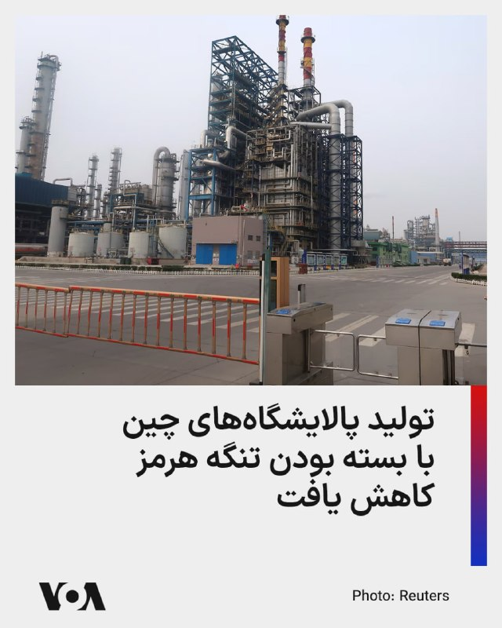

بلومبرگ گزارش داد کاهش شدید واردات نفت خام چین، پالایشگاه‌های این کشور را به کاهش تولید وادار کرده و فعالیت پالایشگاه‌های دولتی را به پایین‌ترین سطح چند سال اخیر رسانده است.

بر اساس این گزارش، چین در ماه آوریل ۵۴ میلیون و ۶۵۰ هزار تن نفت پالایش کرد؛ رقمی که ۱۱ درصد کمتر از ماه مارس و ۵.۸ درصد پایین‌تر از مدت مشابه سال گذشته است. نرخ فعالیت پالایشگاه‌های دولتی نیز به حدود ۶۷ درصد کاهش یافته است.

این کاهش از آن جهت مهم است که بخش اصلی پالایش نفت چین در کنترل شرکت‌های دولتی قرار دارد و افت تولید در این بخش، نشانه فشار مستقیم اختلال در مسیرهای تأمین نفت بر امنیت انرژی پکن است. بلومبرگ علت اصلی این وضعیت را کاهش واردات نفت، در پی اختلال در عبور محموله‌ها از تنگه هرمز دانست.

رویترز نیز پیش‌تر نوشته بود پالایشگاه‌های مستقل چین به دلیل قیمت بالای نفت، ضعف تقاضای داخلی و زیان سنگین عملیاتی، تولید خود را کاهش داده‌اند. به نوشته رویترز این نشانه‌ای از سرایت جنگ و اختلال هرمز به زنجیره انرژی چین است.
@FarsiVOA

## FarsiVOA — post 218025

🔺گزارش کاخ سفید از دستاوردهای سفر ترامپ به پکن؛ چین و آمریکا توافق کردند جمهوری اسلامی نباید در تنگه هرمز عوارض بگیرد

▪️کاخ سفید، توضیحاتی درباره دستاوردهای سفر دونالد ترامپ، رئيس‌جمهوری آمریکا به چین و دیدارش با شی جین‌پینگ، رئيس‌جمهوری این کشور، منتشر کرد.

⬇️ بیشتر بخوانید:
https://ir.voanews.com/a/8151170.html
@FarsiVOA

## DW_Farsi — post 124814

  

🔶 نشست وزرای دارایی گروه ۷ در پاریس برای بررسی تأثیر اقتصادی جنگ ایران

وزرای دارایی کشورهای گروه هفت (جی‌ ۷) روز دوشنبه در پاریس گردهم می‌آیند تا در مورد تأثیر اقتصادی جنگ ایران و مسدود ماندن تنگه هرمز گفت‌وگو و رایزنی کنند.

در این مذاکرات که تا روز سه‌شنبه ادامه خواهد یافت، همچنین حمایت از اوکراین، عدم تعادل در تجارت جهانی، تأمین مواد اولیه حیاتی، تأمین مالی کشورهای در حال توسعه و تلاش‌ها برای مبارزه با تأمین مالی تروریسم و ​​جرایم سازمان‌یافته موضوعاتی خواهند بود که در دستور کار قرار دارند.

لارس کلینگ‌بایل، وزیر دارایی آلمان، پیش از عزیمت به پاریس برای شرکت در این جلسه، نسبت به پیامدهای اقتصادی جنگ آمریکا و اسرائیل با ایران و احتمال بسته‌شدن طولانی مدت تنگه هرمز هشدار داده و آن را "تهدیدی جدی برای اقتصاد جهانی" خواند.

او تأکید کرد باید همه تلاش‌ها انجام شود تا این درگیری به طور دائمی به پایان برسد و مسیرهای آزاد دریایی تضمین شوند.

@dw_farsi

## DW_Farsi — post 124813

  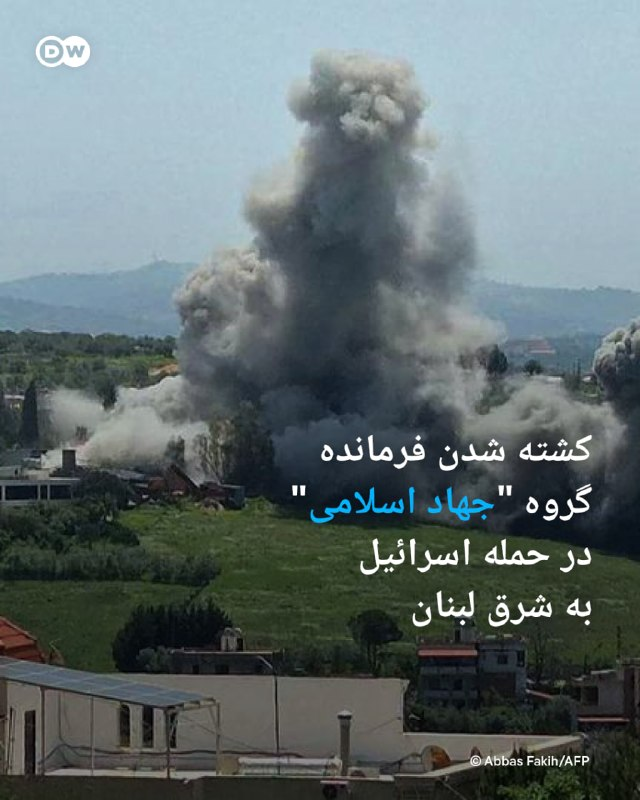

🔶 کشته شدن فرمانده گروه "جهاد اسلامی" در حمله اسرائیل به شرق لبنان

خبرگزاری دولتی لبنانی گزارش داد در پی حمله موشکی اسرائیل به یک آپارتمان در حومه شهر بعلبک در شرق لبنان، وائل عبدالحلیم، یکی از فرماندهان گروه "جهاد اسلامی" به همراه دختر ۱۷ ساله‌اش کشته شد. طبق این گزارش تیم‌های امداد و نجات همچنان در محل این حادثه مشغول آواربرداری و جستجو برای یافتن بازماندگان هستند.

مقامات دولتی لبنان و خبرگزاری دولتی این کشور اعلام کرده‌اند در حملات اسرائیل در روز یکشنبه (۱۷ مه) هفت تن کشته و ده‌ها تن زخمی شدند.

به‌رغم آتش‌بس میان اسرائیل و لبنان، نیروهای اسرائیلی در هفته‌های گذشته به حملات گسترده خود در جنوب لبنان ادامه داده‌اند و ارتش این کشور به‌طور مکرر برای شهرها و روستاهای واقع در جنوب هشدار تخلیه صادر کرده است.

حملات جدید اسرائیل در حالی رخ داده است که نمایندگان اسرائیل و لبنان سومین دور مذاکرات خود را در واشنگتن برگزار کرده و با تمدید آتش‌بس موافقت کرده بودند. حزب‌الله بارها این مذاکرات را محکوم و اعلام کرده است آن را به رسمیت نمی‌شناسد.

@dw_farsi

## DW_Farsi — post 124812

  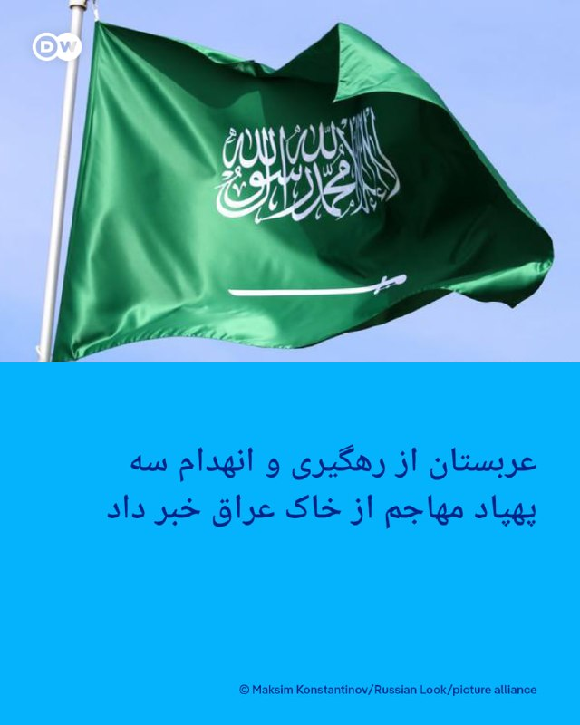

🔶 عربستان: سه پهپاد مهاجم از خاک عراق را رهگیری و منهدم کردیم

عربستان سعودی شامگاه یکشنبه ۱۷ مه (۲۷ اردیبهشت) اعلام کرد سه پهپاد را که از حریم هوایی عراق وارد این کشور شده بودند، رهگیری و منهدم کرده است.

وزارت دفاع عربستان با انتشار بیانیه‌ای در ایکس اعلام کرد این پهپادها صبح یکشنبه وارد خاک عربستان شدند و نیروی دفاعی این کشور موفق به رهگیری آنها شد. ترکی المالکی، سخنگوی این وزارتخانه، تأکید کرد که عربستان این حق را برای خود محفوظ می‌دارد که در زمان و مکان مورد نظر خود به این حملات پاسخ دهد.

پیش‌تر امارات متحده عربی نیز در روز یکشنبه از حمله پهپادی به نیروگاه هسته‌ای "براکه" در غرب ابوظبی خبر داده بود. وزارت دفاع امارات اعلام کرد سه پهپاد از غرب وارد حریم هوایی این کشور شده بودند که دو فروند از آنها رهگیری شد، اما پهپاد سوم به یک مولد برق در خارج از محدوده امنیتی داخلی نیروگاه برخورد کرد.

این حادثه آتش‌سوزی محدودی را در این نیروگاه ایجاد کرد اما آسیب جدی و تهدید خطرناکی را به همراه نداشت.

این وزارتخانه اضافه کرده بود تحقیقات برای مشخص شدن منشأ این پهپادها همچنان ادامه دارد.

ایران در جریان جنگ با آمریکا و اسرائیل اهداف متعددی را در اسرائیل و سراسر منطقه خلیج فارس هدف حملات موشکی و پهپادی قرار داد. در این میان امارات متحده عربی بیش از سایر کشورها هدف قرار گرفته شد.

در روزهای گذشته و پس از بازگشت دونالد ترامپ، رئیس جمهور آمریکا از چین، تنش‌های امنیتی در منطقه خاورمیانه و خلیج فارس شدت گرفته و برخی گزارش‌های رسانه‌های غربی حاکی از احتمال از سرگیری دوباره جنگ آمریکا و اسرائیل علیه ایران است.

@dw_farsi

## DW_Farsi — post 124811

  

🔶افزایش قیمت نفت همزمان با بالا گرفتن تنش‌ها میان ایران و آمریکا

بروز تنش‌های تازه در خاورمیانه و بالا گرفتن تنش‌های لفظی میان دونالد ترامپ و جمهوری اسلامی قیمت نفت را در بازارهای جهانی افزایش داد.

روز دوشنبه ۱۸ مه (۲۸ اردیبهشت) معاملات آتی نفت برنت بیش از ۱ درصد رشد داشت و به بیش از ۱۱۱ دلار در هر بشکه رسید. این نفت در اواخر فوریه و قبل از شروع جنگ ایران تقریبا ۷۰ دلار در هر بشکه معامله می‌شد.

نفت خام آمریکا نیز با ۲.۳ درصد افزایش به ۱۰۷.۸۳ دلار در هر بشکه رسید.

تحلیلگران بازار ارز در بانک "اُسی‌بی‌‌سی"، یکی از بزرگترین و معتبرترین بانک‌های جنوب شرق آسیا می‌گویند حملات پهپادی جدید به نیروگاه "براکه" امارات متحده عربی و خاک عربستان سعودی همراه با ضرب‌الاجل مجدد ترامپ و جلسه‌ای که با حضور او به همراه مقامات ارشد آمریکا در اتاق وضعیت در روز سه‌شنبه برنامه‌ریزی شده، خطر از سرگیری جنگ را به شدت افزایش داده است.

با گذشت بیش از دو ماه از جنگ خاورمیانه و افزایش فشارهای تورمی و چشم‌انداز تیره نرخ‌های بهره در سطح جهانی، سرمایه‌گذاران به تدریج نسبت به پیامدهای اقتصادی این درگیری ابراز نگرانی می‌کنند.

@dw_farsi

## Persian_Trend_Official — post 14382

  <a href="telegram/content/Persian_Trend_Official_14382_1779085121.mp4" target="_blank">🎬 Download video</a>

💢استفاده و نمایش دوباره اسلحه در برنامه زنده صداوسیما ‼️
🫆:Tony

📌 @persian_trend_official
پرشین ترند | متفاوت‌ترین کانال نظامی

## Persian_Trend_Official — post 14381

  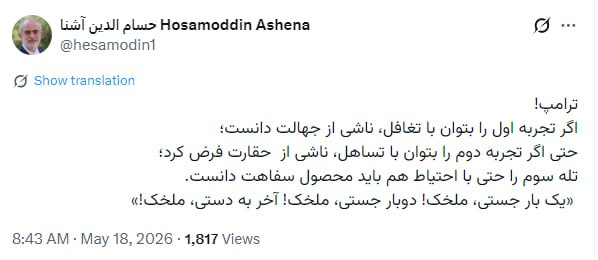

ترامپ!
اگر تجربه اول را بتوان با تغافل، ناشی از جهالت دانست؛
حتی اگر تجربه دوم را بتوان با تساهل، ناشی از حقارت فرض کرد؛
تله سوم را حتی با احتیاط هم باید محصول سفاهت دانست.
«یک بار جستی، ملخک! دوبار جستی، ملخک! آخر به دستی، ملخک!»
حسام الدین آشنا

📌 @persian_trend_official
پرشین ترند | متفاوت‌ترین کانال نظامی

## Persian_Trend_Official — post 14380

  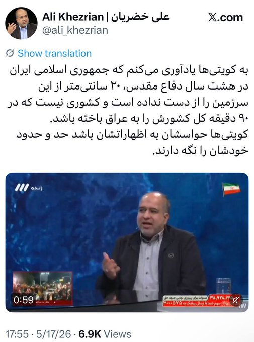

۲۰ سانتیمتر؟؟ شوخی میکنی؟
در پایان جنگ ۸ ساله
۲۶۰۰ کیلومتر مربع از خاک ایران، یعنی بخش‌هایی از: شلمچه، طلائیه، فکه، مهران، میمک، سومار، نفت‌شهر و خسروی و دشت‌ ذهاب، در دست ارتش عراق ماند و
شما «جام زهر» نوشیدید!
خود صدام حسین در سال ۱۹۹۰ به خاطر حمله به کویت این سرزمین‌ها رو آزاد کرد! خودش به اراده خودش! نه به زور شما! شماها که جام زهر رو نوشیده بودید و تموم شده بود! اصلا خمینی بازگشت این سرزمین‌ها رو ندید!
چون یکسال قبلش مرده بود!
فرهمند علیپور

📌 @persian_trend_official
پرشین ترند | متفاوت‌ترین کانال نظامی

## Persian_Trend_Official — post 14379

🔴 آمریکا تیم ویژه مقابله با تهدیدات انتخابات میان‌دوره‌ای ۲۰۲۶ را فعال کرد

💢دفتر مدیر اطلاعات ملی آمریکا دو مقام اطلاعاتی را برای هماهنگی فعالیت نهادهای جاسوسی در مقابله با تهدیدات انتخابات میان‌دوره‌ای ۲۰۲۶ منصوب کرده است.

بر اساس گزارش‌ها:

▪️ «دیو ماسترو» از شورای اطلاعات ملی
▪️ و «جیمز کانجیالوسی» از مرکز ملی ضدجاسوسی و امنیت

مسئول هماهنگی اقدامات مرتبط با امنیت انتخابات شده‌اند.

دفتر اطلاعات ملی آمریکا اعلام کرد:

▪️ این تیم بخشی از تلاش‌های دولت ترامپ و تولسی گبرد برای «حفظ سلامت انتخابات» است
▪️ جلسات توجیهی امنیتی گسترده‌ای مشابه سال‌های انتخاباتی برگزار خواهد شد

تهدیداتی که این تیم روی آن تمرکز دارد شامل:

▪️ حملات سایبری به سامانه‌های رأی‌گیری
▪️ عملیات نفوذ خارجی
▪️ و کمپین‌های اطلاعات نادرست برای تضعیف اعتماد عمومی به انتخابات

💢در گزارش آمده مرکز مقابله با نفوذ خارجی که در سال ۲۰۲۲ ایجاد شده بود، پس از نگرانی‌های حقوقی درباره همکاری با شبکه‌های اجتماعی، بخشی از وظایفش را به نهادهای دیگر واگذار کرده است.

💢همچنین تولسی گبرد، مدیر اطلاعات ملی آمریکا، به‌دلیل نقش خود در بررسی مسائل امنیت انتخاباتی با انتقاد برخی دموکرات‌ها روبه‌رو شده است.

🫆:Tony

📌 @persian_trend_official
پرشین ترند | متفاوت‌ترین کانال نظامی

## Persian_Trend_Official — post 14378

  

🇺🇸
🇨🇳 کاخ سفید یک برگه اطلاعاتی درباره دیدار ترامپ-شی منتشر کرد که در آن آمده است رئیس‌جمهور آمریکا دونالد ترامپ و رئیس‌جمهور چین شی جین‌پینگ توافق کردند تا هیئت‌های جدید تجارت و سرمایه‌گذاری آمریکا-چین را تأسیس کنند.

دو رهبر همچنین تأکید کردند که ایران نمی‌تواند به سلاح هسته‌ای دست یابد و از بازگشایی تنگه هرمز حمایت کردند.

چین همچنین موافقت کرد که ۲۰۰ هواپیمای بوئینگ و حداقل ۱۷ میلیارد دلار در سال محصولات کشاورزی آمریکا را تا سال ۲۰۲۸ خریداری کند، در حالی که نگرانی‌های آمریکا درباره زنجیره‌های تأمین عناصر نادر زمین را مورد توجه قرار داده و دسترسی بازار برای صادرات گوشت گاو و مرغ آمریکایی را بازگرداند.

☆Phantom☆

📌 @persian_trend_official
پرشین ترند | متفاوت‌ترین کانال نظامی

## Persian_Trend_Official — post 14377

🔴 اختلاف بر سر هزینه پروژه دفاع موشکی«Golden Dome» ترامپ

مسئولان پروژه دفاع موشکی «گلدن دوم» آمریکا برآورد ۱.۲ تریلیون دلاری دفتر بودجه کنگره از هزینه این طرح را زیر سؤال بردند.

ژنرال مایکل گوتلین از نیروی فضایی آمریکا، که مدیریت این پروژه را برعهده دارد، اعلام کرد:

▪️ گزارش دفتر بودجه کنگره بر پایه برآوردهای قدیمی تهیه شده است
▪️ این گزارش ترکیب واقعی فناوری‌ها و تسلیحات مورد استفاده در سامانه را در نظر نگرفته
▪️ جزئیات معماری واقعی این سپر موشکی به‌دلیل ملاحظات امنیتی منتشر نشده است

او گفت:

▪️ «آن‌ها حتی از ما نپرسیدند دقیقاً چه چیزی در حال ساخت است»
▪️ «به‌دلیل تهدیدات اطلاعاتی بالا، اطلاعات زیادی درباره پروژه منتشر نکرده‌ایم»

💢پروژه «گلدن دوم» یکی از جاه‌طلبانه‌ترین طرح‌های دفاع موشکی دولت ترامپ توصیف می‌شود و هدف آن ایجاد یک سپر گسترده برای مقابله با تهدیدات موشکی عنوان شده است.

منبع

🫆:Tony

📌 @persian_trend_official
پرشین ترند | متفاوت‌ترین کانال نظامی

## Persian_Trend_Official — post 14376

بولتن خبری ۲۴ساعت گذشته

۲۸ اردیبهشت ۱۴۰۵

تهیه شده در تحریریه پرشین ترند

━━━━━━━━━━━━━━━

🇮🇷
🏛 ایران
━━━━━━━━━━━━━━━

◾️ سخنگوی کمیسیون امنیت ملی: وضعیت تنگه هرمز به دو دوره پیش و پس از مرگ خامنه‌ای تقسیم می‌شود

◾️ رسانه‌های ایرانی: آمریکا ۵ شرط اصلی مطرح کرده؛ عدم غرامت، انتقال ۴۰۰ کیلوگرم اورانیوم، محدودیت هسته‌ای، بلوکه ماندن دارایی‌ها و گره خوردن آتش‌بس به مذاکرات. ایران نیز ۵ پیش‌شرط دارد؛ توقف جنگ، لغو تحریم‌ها، آزادسازی دارایی‌ها، جبران خسارت و به رسمیت شناختن حاکمیت بر هرمز

◾️ نقوی وزیر کشور پاکسـتان در سفری اعلام‌نشده با پزشکیان دیدار ۹۰ دقیقه‌ای داشت؛ هدف جلوگیری از فروپاشی مذاکرات است

◾️ الجزیره: میانجی پاکستانی در تلاش است پیشنهادهای دو طرف را به یک چارچوب مشترک تبدیل کند

◾️ بقائی: آمریکا و اسرائیل ابتدا بحران می‌آفرینند، سپس با شعار بازگرداندن ثبات به تشدید درگیری ادامه می‌دهند

◾️ سخنگوی نیروهای مسلح: هرگونه اقدام تجاوزکارانه آمریکا، ضربات شدیدتری در پی خواهد داشت

◾️ قالیباف با تأیید رهبری به عنوان نماینده ویژه ایران در امور چین منصوب شد

◾️ وال استریت ژورنال: ایران یک کشتی امنیتی چینی را در نزدیکی هرمز توقیف کرد؛ تهران حتی برای کشتی‌های چینی اجازه حفاظت مسلحانه نمی‌دهد

◾️ تصادف زنجیره‌ای در جاده انار-یزد پس از طوفان شن، ۲ کشته و ۱۰ مصدوم برجای گذاشت

━━━━━━━━━━━━━━━

🇮🇱
🇮🇱 اسرائیل و خاورمیانه
━━━━━━━━━━━━━━━

◾️ امارات: ۳ پهپاد از مرزهای غربی وارد حریم هوایی شدند؛ ۲ فروند رهگیری شد، پهپاد سوم به مولد برق نیروگاه هسته‌ای براکه برخورد کرد؛ هیچ مصدومی گزارش نشده

◾️ نیویورک‌تایمز: اسرائیل دو پایگاه مخفی در صحرای غربی عراق برای عملیات علیه ایران احداث کرده؛ یکی توسط چوپانی کشف شد که در حمله بالگرد کشته شد

◾️ نیویورک‌تایمز: واشنگتن از بغداد خواسته بود رادارهایش را خاموش کند تا حضور اسرائیل پنهان بماند

◾️ عراق: اجازه نخواهیم داد خاکمان سکوی حمله به دیگران باشد

◾️ ارتش اسرائیل مدعی ترور بهاء بارود، فرمانده عملیات حماس شد

◾️ نتانیاهو: اسرائیل تقریباً به هدف اصلی جنگ غزه دست یافته است

◾️ اسرائیل دستور تخلیه ۴ روستا در جنوب لبنان را صادر کرد

◾️ بهای نفت برنت به ۱۱۰.۶۲ و وست تگزاس به ۱۰۷.۲۶ دلار رسید

━━━━━━━━━━━━━━━

🇺🇸
🗺 آمریکا و جهان
━━━━━━━━━━━━━━━

◾️
📰 ترامپ روز شنبه با ونس، روبیو، رتکلیف و ویتکاف درباره گزینه‌های نظامی علیه ایران از جمله حمله به تأسیسات انرژی نشست برگزار کرد

◾️
📰: ترامپ روز سه‌شنبه جلسه رسمی بررسی گزینه‌های نظامی در اتاق وضعیت برگزار خواهد کرد

◾️ ترامپ: برای ایران ساعت تیک‌تاک می‌زند؛ باید سریع حرکت کنند وگرنه چیزی از آن‌ها باقی نخواهد ماند

◾️ رئیس مجلس آمریکا: عملیات «خشم حماسی» پایان یافته؛ واشنگتن در حال برنامه‌ریزی برای بازگشایی هرمز است

◾️ گراهام: هر چه هرمز بیشتر بسته بماند، ایران قوی‌تر می‌شود

◾️ 
📰: عبور روزانه از هرمز از ۱۳۵ کشتی به چند فروند کاهش یافته است

◾️دیلی میل: استارمر در میانه شورش داخلی حزب کارگر و درخواست ۹۰ نماینده، قصد استعفا دارد

◾️ اوکراین حمله پهپادی گسترده‌ای به مسکو انجام داد؛ روسیه در پاسخ دنیپرو را با موشک‌های اسکندر هدف قرار داد

◾️ دو جنگنده نیروی دریایی آمریکا در نمایش هوایی با هم برخورد کردند؛ هر ۴ خلبان سالم هستند

📌 @persian_trend_official
پرشین ترند | متفاوت‌ترین کانال نظامی

## Persian_Trend_Official — post 14375

  <a href="telegram/content/Persian_Trend_Official_14375_1779085125.webm" target="_blank">🎬 Download video</a>

💢 قیمت نفت برنت به 111 دلار رسید ‼️

🫆:Tony

📌 @persian_trend_official
پرشین ترند | متفاوت‌ترین کانال نظامی

## Persian_Trend_Official — post 14374

  <a href="telegram/content/Persian_Trend_Official_14374_1779085125.mp4" target="_blank">🎬 Download video</a>

🔴تخریب پُل ارتباطی زیراب مازندران در پی طغیان رودخانه

🔹پس از بارش شدید باران عصر روز گذشته -یکشنبه- در شهر زیراب، رودخانه جمشیدآباد طغیان کرد و پل ارتباطی روستاهای کارسالار، جمشیدآباد و چند روستای دیگر در ورودی تالار اسپهبد تخریب شد.

💢 در حال حاضر این پل ارتباطی مسدود است و عوامل شهرداری زیراب، اداره راه شهرستان و ماشین‌آلات شرکت شهاب بتن در محل حضور دارند. بر اثر این حادثه، خسارت سطحی به زمین‌های کشاورزی، خزانه برنج و سردهنه وارد شده و همچنین آبگرفتگی چند دامداری و تخریب دیوار حفاظتی پل کوچک گزارش شده است.

🫆:Tony

📌 @persian_trend_official
پرشین ترند | متفاوت‌ترین کانال نظامی

## Persian_Trend_Official — post 14373

کانال رسمی پرشین ترند pinned «♨️ دوستان عزیز، با توجه به شرایط پیش‌رو، بهتر است از همین حالا برای سناریوهای اضطراری آماده باشیم. آمادگی یعنی آرامش بیشتر و آسیب کمتر برای خودمان و خانواده‌مان. 🧭 ⚠️ چند مورد مهم را جدی بگیرید: • برای دست‌کم ۱ ماه، آذوقه‌ی غذایی فاسد نشدنی و آب آشامیدنی…»

## Persian_Trend_Official — post 14372

  

🔴علیرضا دبیر 💢نوید افکاری رو ما میخاستیم بیاریم بیرون نجات بدیم اما ضد انقلاب نذاشت ! ! ! 🫆:Tony 📌 @persian_trend_official پرشین ترند | متفاوت‌ترین کانال نظامی

## Persian_Trend_Official — post 14370

  <a href="telegram/content/Persian_Trend_Official_14370_1779085128.mp4" target="_blank">🎬 Download video</a>

🔴علیرضا دبیر

💢نوید افکاری رو ما میخاستیم بیاریم بیرون نجات بدیم اما ضد انقلاب نذاشت ! ! !
🫆:Tony

📌 @persian_trend_official
پرشین ترند | متفاوت‌ترین کانال نظامی

## Persian_Trend_Official — post 14369

♨️ دوستان عزیز، با توجه به شرایط پیش‌رو، بهتر است از همین حالا برای سناریوهای اضطراری آماده باشیم. آمادگی یعنی آرامش بیشتر و آسیب کمتر برای خودمان و خانواده‌مان. 🧭 ⚠️ چند مورد مهم را جدی بگیرید: • برای دست‌کم ۱ ماه، آذوقه‌ی غذایی فاسد نشدنی و آب آشامیدنی…

## RadioFarda — post 157299

  

🔸فرمانده نیروی انتظامی جمهوری اسلامی می‌گوید از آغاز جنگ حدود «شش هزار و ۵۰۰» نفر با اتهاماتی که او آن را «وطن‌فروشی و جاسوسی» نامیده، بازداشت شده‌اند.

🔸احمدرضا رادان مدعی شده که ۵۶۷ نفر از این افراد «مرتبط با نفاق، اشرار و گروهک‌های ضدانقلاب بودند».

🔸این فرمانده پلیس توضیحی درباره علت حضور این تعداد به گفته او «جاسوس» در کشور علی‌رغم ادعاهای مقام‌های جمهوری اسلامی مبنی بر «اشراف اطلاعاتی نیروهای امنیتی» ارائه نکرده است.

🔸رادان افزوده که «دستگیری سربازان دشمن و وطن‌فروشان» در اعتراضات دی‌ماه پارسال که او آن را «اغتشاشات» نامیده، نیز «همچنان ادامه دارد».

🔸جمهوری اسلامی پس از سرکوب خونین اعتراضات دی‌ماه ۱۴۰۴، با آغاز جنگ، شماری از بازداشت‌شدگان آن زمان را به بهانه‌های مختلفی از جمله «جاسوسی» برای اسرائیل اعدام کرده است.

@RadioFarda

## RadioFarda — post 157298

گفت‌وگو با لوک کافی؛ ایران چگونه از الگوی روسیه برای مذاکرات استفاده می‌کند؟

🔸همزمان با این‌که واشینگتن در حال بررسی گام‌های بعدی خود در قبال حکومت ایران است، برخی تحلیلگران معتقدند که الگوهایی آشنا در حال شکل‌گیری است؛ الگوهایی که نه از خاورمیانه، بلکه از «کتاب راهنمای کرملین» برآمده است.

🔸لوک کافی، پژوهشگر ارشد مؤسسه هادسون در حوزهٔ امنیت ملی و روابط فراآتلانتیک، در گفت‌وگو با رادیو اروپای آزاد/رادیو آزادی می‌گوید ظاهراً حکومت ایران مستقیماً از راهبرد مذاکره‌ای روسیه الگوبرداری می‌کند؛ یعنی طولانی کردن مذاکرات، تلاش برای گرفتن امتیازات به‌صورت گام‌به‌گام و پرهیز از دادن تعهدات معنادار در عین حفظ ظاهر دیپلماتیک.

🔸نسخه کامل این گفت‌وگو را در وب‌سایت رادیوفردا بخوانید.

@RadioFarda

## RadioFarda — post 157297

  

🔸در پی افزایش تنش‌های ژئوپولیتیک در خلیج فارس و نگرانی از تداوم فشارهای تورمی، قیمت نفت در بازار جهانی انرژی افزایش یافت.

🔸قیمت نفت برنت در روز دوشنبه ۲۸ اردیبهشت با رشد ۱.۲ درصدی به بیش از ۱۱۱ دلار در هر بشکه رسید و نفت خام وست تکزاس اینترمدیت آمریکا نیز با افزایش یک درصدی بیش از ۱۰۸ دلار معامله شد.

🔸تحلیلگران نسبت به محدود ماندن عرضه جهانی نفت در پی اختلال در آبراهه استراتژیک هرمز هشدار می‌دهند.

🔸با ادامه محدودیت در مسیر تنگه هرمز که حدود ۲۰ درصد تجارت جهانی نفت از آن عبور می‌کند، قیمت نفت می‌تواند به سطوح ۱۳۰ تا ۱۴۰ دلار در هر بشکه و حتی بالاتر برسد و تورم جهانی را به سطوح نزدیک به ۱۰ درصد در اروپا و بریتانیا افزایش دهد.

@RadioFarda

## RadioFarda — post 157296

  

🔸عربستان سعودی روز یکشنبه ۲۷ اردیبهشت اعلام کرد سه پهپاد را که از حریم هوایی عراق وارد این کشور شده بودند، رهگیری و منهدم کرده است.

🔸ترکی مالکی، سخنگوی وزارت دفاع عربستان، گفت این پهپادها روز یکشنبه وارد حریم هوایی عربستان شدند که نیروی دفاعی این کشور موفق به رهگیری و نابودی آن‌ها شد.

🔸سخنگوی وزارت دفاع عربستان تأکید کرد وزارت دفاع این‌ کشور حق پاسخ‌گویی در زمان و مکان مناسب را برای خود محفوظ می‌داند.

🔸در همین حال مقام‌های امارات متحده عربی نیز یکشنبه اعلام کردند در پی یک حمله پهپادی به نیروگاه هسته‌ای «براکه»، آتش‌سوزی محدودی در این تأسیسات رخ داد اما منجر به‌آسیب جدی و خطرناک نشد.

🔸وزارت دفاع امارات اعلام کرد دو پهپاد دیگر نیز پس از رهگیری، منهدم شده‌اند.

🔸امارات می‌گوید پهپادها از مرزهای غربی وارد حریم هوایی این کشور شدند اما جزئیات بیشتری درباره منشأ دقیق آن‌ها ارائه نشده است.

🔸این رویدادها در شرایطی رخ می‌دهد که تنش‌های امنیتی در منطقه خلیج فارس و خاورمیانه افزایش یافته و نگرانی‌ها درباره تهدید زیرساخت‌های حیاتی منطقه نیز بیشتر شده است.

@RadioFarda

## RadioFarda — post 157295

  <a href="https://t.me/radiofarda/157295" target="_blank">📎 Download file</a>

📻بشنوید: خبرهای ساعت ۲۱ با رادیوفردا، ۲۸ اردیبهشت ۱۴۰۵‌

@RadioFarda

## BBCPersian — post 281363

🔻گزارش‌ رسانه‌های اسرائیلی از «آماده‌‌سازی» ارتش برای همراهی با آمریکا در حمله مجدد به ایران

شبکه تلویزیونی کان گزارش داد که ارتش اسرائیل خود را برای سناریوی احتمالی درگیری با ایران آماده می‌کند.

به گزارش شبکه تلویزیونی کان، یک مقام امنیتی اسرائیل که نامش فاش نشد، گفته است که در صورت آغاز حملات جدید آمریکا، اسرائیل نیز به این عملیات خواهد پیوست و «زیرساخت‌های انرژی ایران» را هدف قرار خواهد داد.

این گزارش پس از تماس تلفنی دونالد ترامپ و بنیامین نتانیاهو در روز یکشنبه منتشر می‌شود.

شبکه کان اسرائیل گزارش داد که این تماس بیش از نیم ساعت به طول انجامید و در آن دو طرف درباره احتمال ازسرگیری درگیری‌ها گفت‌وگو کرده‌اند.

شبکه ۱۲ تلویزیون اسرائیل نیز تماس تلفنی رهبران دو کشور را گفتگویی در «سایه آماده‌سازی برای درگیری‌های جدید با ایران» توصیف کرد.

این شبکه هم گزارش داد که ارتش اسرائیل در آماده‌باش کامل قرار دارد.

شبکه ۱۲ همچنین گزارش داده است که دونالد ترامپ از سوی چین تحت فشار «قابل توجهی» قرار دارد تا از رویارویی جدید با ایران خودداری کند و به جای آن مسیر توافق را در پیش بگیرد.

کانال ۱۳ اسرائیل هم از فرود ده‌ها هواپیمای حامل مهمات و تسلیحات آمریکایی در اسرائیل خبر داد.

بنابر این گزارش این هواپیماها در ۲۴ ساعت گذشته از پایگاه‌هایی در آلمان برخاستند و در تل‌آویو به زمین نشستند.

این شبکه تلویزیونی اسرائیل هم این اقدامات را بخشی از روند آماده‌سازی‌ این کشور برای جنگ با ایران خواندند.

@BBCPersian

## BBCPersian — post 281362

🔻لیندزی گراهام خواستار حمله به زیرساخت‌های انرژی ایران شد

لیندزی گراهام، سناتور جمهوری‌خواه آمریکا از دونالد ترامپ خواست مادام که تهران با شروط آمریکا در مذاکرات هسته‌ای موافقت نکرده است، این کشور را هدف قرار دهد.

این سناتور ارشد جمهوری‌خواه از دونالد ترامپ خواست با هدف قرار دادن زیرساخت‌های انرژِی ایران به این کشور ضربه بزند.

بسیاری از کارشناسان در هفته‌های گذشته هشدار دادند که حمله به زیر ساخت‌هایی که برای غیرنظامیان حیاتی است خلاف قواعد بشردوستانه حاکم بر منازعات بین‌المللی است.

لیندزی گراهام در گفت‌وگو با شبکه ان‌بی‌سی گفته است: «زیرساخت‌های انرژی، نقطه‌ضعف آن‌هاست. اگر قرار باشد درگیری از سر گرفته شود، من بخش انرژی را در صدر فهرست قرار می‌دهم.»

او در ادامه گف تکرار رویکردهای پیشین تنها تکرار «نتایج قبلی» را به دنبال خواهد داشت.

این سناتور جمهوری‌خواه گفت که «بیشتر به آن‌ها ضربه بزنید. شاید اگر به اندازه کافی آسیب ببینند، توافق کنند. اما در حال حاضر فکر می‌کنم تلاش می‌کنند ما را منتظر نگه دارند. به نظرم دارند بازی می‌کنند و به تعبیر رئیس‌جمهور، فکر می‌کنم دیوانه هستند.»

@BBCPersian

## BBCPersian — post 281361

🔻نیویورک تایمز: ارتش اسرائیل «یک پایگاه مخفی دوم» در عراق داشت

روزنامه نیویورک تایمز گزارش داده است که ارتش اسرائیل دو پایگاه «مخفی» در بیابان‌های غربی عراق اداره می‌کرده است.

به نوشته این روزنامه، نیروهای اسرائیلی برای پنهان نگه داشتن یکی از این پایگاه‌ها در نزدیکی شهر النخیب، یک چوپان و یک سرباز را کشته‌اند.

نیویورک تایمز به نقل از مقام‌های منطقه‌ای نوشته‌اند که این پایگاه پیش از جنگ کنونی آمریکا و اسرائیل علیه ایران ایجاد شده بود و در جریان جنگ ۱۲ روزه ژوئن سال گذشته نیز مورد استفاده قرار گرفته است.

بر اساس این گزارش، از این پایگاه برای پشتیبانی هوایی، سوخت‌گیری و ارائه خدمات درمانی استفاده می‌شد است.

این روزنامه همچنین گزارش داده است که آمریکا از وجود این پایگاه اطلاع داشته است. این در حالی است که نیروهای آمریکایی در حال حاضر در هماهنگی با دولت عراق در این کشور حضور دارند و این گزارش به این معناست که ایالات متحده حضور نیروهای خارجی در خارک عراق را از این کشور پنهان کرده است.

به گزارش نیویورک تایمز، این پایگاه جدا از مقر موقتی قبلی است که پیش‌تر وال‌استریت ژورنال درباره آن گزارش داده بود.

وال‌استریت ژورنال گفته بود آن پایگاه اندکی پیش از آغاز جنگ آمریکا و اسرائیل علیه ایران ساخته شده بود و محل استقرار نیروهای ویژه و یک مرکز لجستیکی برای نیروی هوایی اسرائیل بود.

مقام‌های عراقی تاکنون واکنشی به این گزارش نشان نداده‌اند.

@BBCPersian

## BBCPersian — post 281360

بیش از ۸۰ سال، هیچ‌کس نمی‌دانست چه بر سر یک اسیر جنگی شوروی آمده است؛ مردی که از دست نازی‌ها در جزایر مانش گریخت و بقیه جنگ جهانی دوم را در حالی سپری کرد که با کمک یک خانواده محلی از اشغالگران آلمانی پنهان شده بود.

🔻این سرباز که تنها با نام کوچک «باقی‌جان» یا به اختصار «تام» شناخته می‌شد، یکی از حدود دو هزار اسیر جنگی و کارگر اجباری شوروی بود که برای ساخت استحکامات نازی‌ها به جزیره جرزی برده شد.

پس از آزادسازی جزایر، تام و دیگر اسرای بازمانده به اتحاد جماهیر شوروی بازگردانده شدند؛ و با وجود اینکه او قول داده بود در تماس بماند، پس از بازگشت دیگر هیچ خبری از او نشد.

این بی‌خبری ادامه داشت تا زمانی که تیم‌های بی‌بی‌سی موفق شدند بازماندگان او را در آسیای مرکزی، در منطقه‌ای بسیار دور از جرسی، در دورترین نقاط شرق ازبکستان پیدا کنند.

در سال ۱۹۴۳ بود که تام از یکی از اردوگاه‌های کار اجباری نازی‌ها در جرزی گریخت. او خسته، گرسنه و مستاصل، درِ خانه جان و فیلیس لبرتون، از کشاورزان محلی را زد. آن‌ها با وجود آگاهی از خطر، به او پناه دادند و جانش را نجات دادند.

https://bbc.in/493cC2W

## BBCPersian — post 281359

  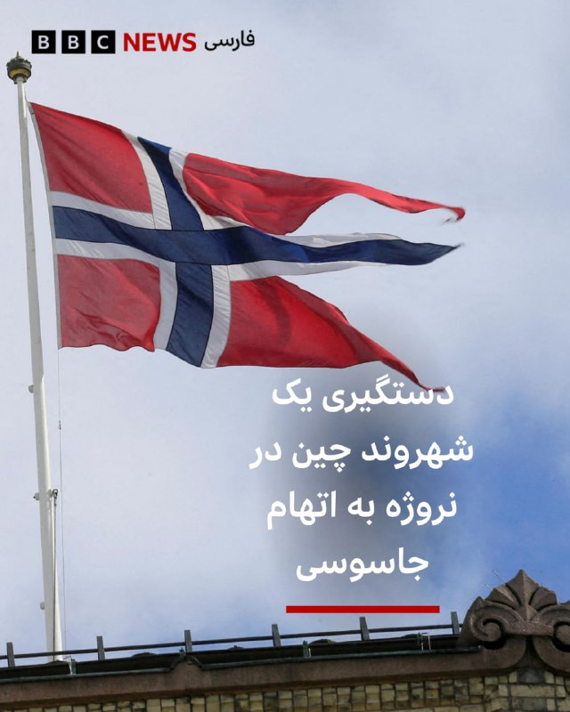

‌ ‌ ‌
مقامات نروژ می‌گویند که یک مرد چینی را به اتهام جاسوسی دستگیر کرده‌اند.

این مظنون در شمال این کشور دستگیر شده است و اکنون در بازداشت موقت به سر می‌برد.

براساس گزارش‌ها ۱۰ روز از دستگیری یک زن چینی به اتهام تاسیس شرکتی در نروژ برای دانلود داده‌ها از ماهواره‌ها در مدار قطبی می‌گذرد.

​​سرویس امنیت داخلی نروژ، چین و روسیه را به عنوان تهدیدهای اصلی جاسوسی معرفی کرده که هر دو به دنبال خرید زمین در نزدیکی تاسیسات نظامی هستند.

📷 Reuters
@BBCPersian

## BBCPersian — post 281358

  

‌ ‌ ‌ ‌
دادستان‌های پاریس می‌گویند که در حال بررسی بیش از صد مهدکودک و مدرسه ابتدایی به اتهام سوءاستفاده جسمی و جنسی هستند.

این اتهامات بیشتر شامل کسانی است که سرپرست غیرآموزشی بوده‌اند و مسئول مراقبت از کودکان قبل و بعد از مدرسه و در زمان زنگ تفریح ​​هستند.

تاکنون ۷۸ نفر از آنها از کار تعلیق شده‌اند، در حالی که یک مرد به اتهام تجاوز جنسی به سه دختر و آزار و اذیت ۹ دختر دیگر در حال محاکمه است.

امانوئل گرگوار، شهردار جدید پایتخت فرانسه، قول داده است که بررسی صلاحیت افرادی که برای سرپرستی درخواست می‌دهند را بهتر انجام دهد و آموزش‌های بهتری در مورد نحوه گزارش موارد مشکوک به بدرفتاری ارائه دهد.

📷EPA/Shutterstock
@BBCPersian

## BBCPersian — post 281357

🔻 ترامپ برای بررسی وضعیت جنگ با ایران به اتاق وضعیت کاخ‌سفید می‌رود

شبکه فاکس نوشته دونالد ترامپ برای وضعیت آخرین تحولات مرتبط با ایران روز سه‌شنبه با مشاوران امنیتی و نظامی کابینه خود در اتاق وضعیت کاخ‌سفید جلسه خواهد گذاشت.

اتاق وضعیت کاخ سفید محل جلسات بسیار مهم و معمولا مرتبط با جنگ و تحولات امنیتی در کاخ سفید است.

گزارش برنامه‌ریزی برای این جلسه را روز یکشنبه ابتدا نشریه اکسیوس گزارش کرد.

آقای ترامپ در چند روز گذشته با اظهار نارضایتی از پاسخ ایران به پیشنهادهای او، تهران را تهدید کرده که در «اسرع وقت» برای رسیدن به توافق با واشنگتن تلاش کند و گرنه به گفته آقای ترامپ ممکن است «چیزی برایش باقی نماند».

در برابر، ایران هم با پافشاری بر مواضع خود گفته «برای هر سناریویی آماده» است و به دولت آمریکا توصیه کرده که با پذیرش پیشنهادهای تهران، زمینه برای توافق و توقف جنگ را فراهم کند.

https://bbc.in/4dwYaSb
@BBCPersian

## BBCPersian — post 281356

  

‌ ‌ ‌ ‌
رواندا اعلام کرده که در بحبوحه شیوع مرگبار ویروس ابولا در جمهوری دموکراتیک کنگو، غربالگری را در مرز این کشور تشدید می‌کند.

برخی از ساکنان شهر گوما در شرق کنگو به بی‌بی‌سی گفته‌اند که فقط به رواندایی‌ها اجازه داده می‌شود که به رواندا برگردند و شهروندان کنگو اجازه ورود نمی‌یابند.

ساکنان شهر گوما نگران هستند که وضعیت اضطراری بهداشتی بر معیشت مردم نیز تأثیر بگذارد.

مقامات بهداشتی کنگو در حالی که تلاش‌ها برای مهار ابولا را افزایش داده‌اند، از استان ایتوری که مرکز شیوع این بیماری است، بازدید کرده‌اند.

سازمان بهداشت جهانی پس از شناسایی یک مورد در اوگاندا، شیوع این بیماری را یک وضعیت اضطراری بهداشت عمومی با نگرانی بین‌المللی اعلام کرده است.

📷TONY KARUMBA/AFP via Getty Images
@BBCPersian

## BBCPersian — post 281355

🔻 حوثی‌های یمن پس از کشته شدن عزالدین حداد، حمایت مجدد خود را از حماس اعلام کردند

رهبری نظامی حوثی‌های یمن، پس از کشته شدن عزالدین حداد، فرمانده ارشد واحد نظامی حماس، حمایت خود را از گروه‌های مسلح فلسطینی در غزه را مجددا اعلام کرده و متعهد به ادامه حمایت از آنها شده است.

یوسف حسن المدنی در پیام تسلیتی در تلگرام، مرگ عزالدین الحداد را ضایعه‌ای بزرگ برای جنبش فلسطین و منطقه توصیف کرد.

آقای المدنی گفت حوثی‌ها به تلاش‌های مشترک خود با حماس و گروه‌های متحد آن «تا زمان دستیابی به پیروزی» ادامه خواهند داد.

https://bbc.in/42K1LHt
@BBCPersian

## BBCPersian — post 281354

  

‌ ‌ ‌ ‌
به گزارش رسانه‌های ترکیه، پلیس استانبول یک مرد را به ظن قتل فجیع یک زن ایرانی به نام فرخنده قائم مقامی، شناسایی و بازداشت کرده است. بنابر گزارش‌ها، دو مظنون دیگر هم به ظن همکاری در این قتل بازداشت شده‌اند.

نشریه حریت ترکیه روز یکشنبه ۱۷ مه / ۲۷ اردیبهشت ضمن انتشار این خبر نوشت: «جسد تکه‌تکه‌شده فرخنده قائم‌مقامی، شهروند ایرانی که در استانبول ناپدید شده بود، در شهر کرشهیر پیدا شد. بر اساس تحقیقات، مشخص شد فرخنده قائم‌مقامی پس از مشاجره با (مرد مظنون)، با قلاده سگ خودش خفه شده و سپس جسد او داخل یک خودرو تکه‌تکه و در زمینی در منطقه موجورِ کرشهیر دفن شده است.»

آن طور که رسانه‌های ترکیه نوشته‌اند فرخنده قائم مقامی - ۶۸ ساله - با مظنون به قتل آشنا بوده و در روز حادثه به اتفاق او برای غذا خوردن بیرون رفته بودند.

حریت نوشته مرد بازداشت شده در بازجویی پلیس اعتراف کرده است که پس از مشاجره‌ای که در آخرین دیدارشان داخل خودرو رخ داد، «فرخنده قائم‌مقامی را با بند قلاده سگ او خفه کرده است».

https://bbc.in/3PIdpjb
📷hurriyet.com.tr
@BBCPersian

## BBCPersian — post 281353

🔻 افزایش بهای نفت در بازارهای صبح دوشنبه شرق آسیا

همزمان با بالا گرفتن مجدد تنش لفظی میان دونالد ترامپ و ایران، بهای نفت در بازارهای صبح دوشنبه شرق آسیا بالا رفت.

قیمت هر بشکه نفت برنت شمال صبح دوشنبه به وقت شرق آسیا به ۱۱۰ دلار رسید.

@BBCPersian

## BBCPersian — post 281343

‌ ‌ ‌
بیش از سه دهه پس از بسته شدن مرز میان آن‌ها، ترکیه و ارمنستان بار دیگر در میان تغییرات پویای منطقه‌ای به‌تدریج به سمت نزدیکی حرکت می‌کنند.

گام‌های اعتمادساز در سال‌های اخیر امیدهای محتاطانه‌ای برای عادی‌سازی ایجاد کرده است. اما پیشرفت‌های بزرگ، از جمله بازگشایی مرز زمینی و برقراری روابط دیپلماتیک، همچنان محدود باقی مانده است.

سیگنال‌های رسمی و رسانه‌ای کم ‌سر و صدای ترکیه درباره نزدیکی با ارمنستان بازتاب‌دهنده حساسیت این موضوع است.

با توجه به اینکه این روند همچنان به توافق صلح میان جمهوری آذربایجان و ارمنستان گره خورده است، باید دید آیا آنکارا و ایروان می‌توانند به‌طور مستقل پیش بروند و ژست‌های نمادین را به تغییرات پایدار تبدیل کنند یا نه.

https://bbc.in/4dhcZcH
📸GettyImages/EPA/Shutterstock/ ullstein bild via Getty Images/ Handout/Anadolu via Getty Images/ AFP via Getty Images
@BBCPersian

## idfinfarsi — post 11592

‼️ارتش اسرائیل بیش از ۳۰ زیرساخت متعلق به سازمان تروریستی حزب‌الله را در جنوب لبنان هدف قرار داد: انبار تسلیحات، مواضع دیده‌بانی و زیرساخت‌هایی که برای پیشبرد طرح‌های تروریستی علیه نیروهای ما استفاده می‌شدند

⭕️ارتش اسرائیل به عملیات خود برای رفع تهدیدها علیه شهروندان اسرائیل و نیروهای ارتش در جنوب لبنان ادامه می‌دهد.

⭕️در طول شبانه‌روز گذشته، ارتش اسرائیل بیش از ۳۰ زیرساخت متعلق به سازمان تروریستی حزب‌الله را هدف قرار داد.
⭕️از جمله اهداف مورد حمله: انبار تسلیحات، مواضع دیده‌بانی و ساختمان‌هایی بودند که تروریست‌های سازمان تروریستی حزب‌الله از آن‌ها برای پیشبرد طرح‌های تروریستی علیه نیروهای ارتش اسرائیل و شهروندان کشور اسرائیل استفاده می‌کردند.

⭕️همچنین، در حملات دقیق، شماری از تروریست‌های سازمان تروریستی حزب‌الله که در حال پیشبرد طرح‌های تروریستی علیه نیروهای ارتش اسرائیل مستقر در جنوب لبنان بودند، به هلاکت رسیدند.

## manototv — post 105583

  <a href="telegram/content/manototv_105583_1779085136.mp4" target="_blank">🎬 Download video</a>

🎬 Video

## manototv — post 105582

  <a href="telegram/content/manototv_105582_1779085136.mp4" target="_blank">🎬 Download video</a>

دونالد ترامپ تصویری بدون توضیح در شبکه اجتماعی خود منتشر کرده است که در آن، پرچم آمریکا سراسر خاورمیانه و کشورهای اطراف ایران را پوشانده و پیکان‌هایی به‌سوی داخل ایران کشیده شده‌اند.

ترامپ ساعاتی پیش از انتشار این تصویر گفته بود که زمان برای ایران رو به پایان است.

## alonews — post 120769

  <a href="telegram/content/alonews_120769_1779085137.webm" target="_blank">🎬 Download video</a>

👈بیت‌کوین به پایین‌ترین سطح دو هفته گذشته رسید

🔴بیت‌کوین ضعیف شد و به پایین‌ترین سطح خود در بیش از دو هفته گذشته رسید، زیرا ریسک‌های کلان گسترده ناشی از جنگ آمریکا و ایران معامله‌گران را وادار کرد موقعیت‌های خود را کاهش دهند.

🔴این ارز دیجیتال اصلی در روز دوشنبه تا ۷۶,۷۱۱ دلار سقوط کرد، که پایین‌ترین سطح از اول مه بود، قبل از آنکه بخشی از ضررهای خود را جبران کند. سایر توکن‌ها، از جمله اتریوم و سولانا، نیز کاهش یافتند.

✅ @AloNews خبر جنگ

## alonews — post 120768

  <a href="telegram/content/alonews_120768_1779085137.mp4" target="_blank">🎬 Download video</a>

👈صدراعظم سابق آلمان، آنگلا مرکل:
هیچ کشوری در جهان نمی‌تواند همه مشکلاتی را که با آن‌ها روبرو هستیم به تنهایی حل کند.

🔴حتی کشوری به بزرگی و قدرت ایالات متحده نیز، به نظر من، باید علاقه‌مند باشد که چند دوست در جهان داشته باشد.

✅ @AloNews خبر جنگ

## alonews — post 120767

  <a href="telegram/content/alonews_120767_1779085140.mp4" target="_blank">🎬 Download video</a>

👈صدر اعظم سابق آلمان، آنگلا مرکل:
ترامپ فردی است که با شدت بسیار زیادی اهداف خود را دنبال می‌کند.

🔴هرگز نباید افراد در چنین موقعیت‌هایی را دست کم گرفت. کسی که به موقعیتی مانند ریاست جمهوری ایالات متحده رسیده است، قدرت بسیار زیادی دارد. و به همین دلیل باید او را بسیار، بسیار جدی گرفت.

✅ @AloNews خبر جنگ

## alonews — post 120766

  <a href="telegram/content/alonews_120766_1779085142.webm" target="_blank">🎬 Download video</a>

👈قیمت نفت خام برنت ۲ دلار و ۳ سنت معادل ۱.۸۶ درصد افزایش یافت و به ۱۱۱ دلار و ۲۹ سنت در هر بشکه رسید

🔴در حالی که ابتدای معاملات تا سطح ۱۱۲ دلار پیشروی کرده بود که بالاترین قیمت در بیش از دو هفته گذشته بود.

✅ @AloNews خبر جنگ

## alonews — post 120765

  <a href="telegram/content/alonews_120765_1779085142.webm" target="_blank">🎬 Download video</a>

👈پلیس راه: جاده قدیم چالوس ۳ روز مسدود است

✅ @AloNews خبر جنگ

## alonews — post 120764

  <a href="telegram/content/alonews_120764_1779085142.webm" target="_blank">🎬 Download video</a>

👈جروزالم پست گزارش داد: نتانیاهو خواستار لغو حضور خود در برابر دادگاه طی امروز بنا به دلایل امنیتی و سیاسی شد

🔴دادستانی اسرائیل با این درخواست مخالفت کرده و جلسه را به بعد از ظهر امروز موکول کرد

✅ @AloNews خبر جنگ

## alonews — post 120763

  <a href="telegram/content/alonews_120763_1779085143.webm" target="_blank">🎬 Download video</a>

👈وقوع انفجارهای کنترل شده ناشی از عملیات خنثی‌سازی در یزد

✅ @AloNews خبر جنگ

## alonews — post 120753

  <a href="telegram/content/alonews_120753_1779085143.webm" target="_blank">🎬 Download video</a>

🔴مجموعه پوستر های ضد آمریکایی، اسرائیلی شورش جهل و جنون کمونیستی-اسلامی ۱۳۵۷ به رهبری روح‌ الله خمینی.

🔴طرح پوسترها ایده گرفته شده از کمونیست

🤔هیچ چیزی از انگلیس تو پوسترها نیست که انگلیسی بودن این آخوندها و حکومت فاسدشون رو نشون میده.

✅@AloNews

## alonews — post 120752

  <a href="telegram/content/alonews_120752_1779085143.webm" target="_blank">🎬 Download video</a>

👈روزنامه ایران: در پی محدودیت دسترسی به اینترنت، بازار خرید سیم کارت‌های عراقی در برخی مناطق مرزی غرب شکل گرفته

🔴در بعضی نقاط مرزی، سیگنال اپراتورهای عراقی تا دو کیلومتر داخل خاک ایران، قابل دریافت است

🔴 ارزانی این سیم کارت‌ها در مقایسه با هزینه فیلترشکن‌ها، از دلایل گرایش برخی به آن‌ها عنوان شده

🔴 استفاده از سیم کارت‌های خارجی می‌تواند چالش‌هایی را در حوزه نشت اطلاعات ایجاد کند

✅ @AloNews خبر جنگ

## alonews — post 120740

  <a href="telegram/content/alonews_120740_1779085144.webm" target="_blank">🎬 Download video</a>

👈نفت برنت به ۱۱۱ دلار رسید

✅ @AloNews خبر جنگ

## alonews — post 120739

  <a href="telegram/content/alonews_120739_1779085144.webm" target="_blank">🎬 Download video</a>

🔴فوری / کانال ۱۵ اسراییل به نقل از یک منبع: نتانیاهو به دلایل سیاسی و امنیتی خواستار لغو جلسه دادگاه خود در امروز شد.

✅ @AloNews خبر جنگ

---
📅 بروزرسانی: 1405/02/28 05:25
---

## VahidOOnLine — post 240731

  

♦️بامداد دوشنبه، همزمان با بازگشایی بازارها و ساعاتی پس از گزارش رهگیری حمله پهپادی بر فراز عربستان سعودی، بهای هر بشکه نفت برنت با حدود یک دلار افزایش به ۱۱۱ دلار و ۴۹ سنت رسید. بهای نفت آمریکا (وست تگزاس) نیز با ۱ دلار و ۲۲ سنت به ۱۰۶ دلار و ۶۴ سنت رسیده است.
‌🇸🇦 Indypersian

🤖 @VahidOOnLine

## VahidOOnLine — post 240730

  

آنیتا آناند، ‌وزیر خارجه کانادا، اقدام جمهوری اسلامی در هدف قرار دادن تاسیسات انرژی هسته‌ای صلح‌آمیز را غیرقابل قبول دانست و بر همبستگی کشورش با امارات متحده عربی در ارتباط با حملات پهپادی به نیروگاه هسته‌ای براکه در این کشور تاکید کرد.
او نوشت: «قطعنامه‌های آژانس بین‌المللی انرژی اتمی و قوانین بین‌المللی هر دو تاکید می‌کنند که هدف قرار دادن تأسیسات انرژی هسته‌ای صلح‌آمیز غیرقابل قبول است.»
آناند اشاره کرد که در تماس با همتای خود در امارات متحده عربی حمایت کامل خود را از این کشور ابراز داشته است، و نوشت: «کانادا از تحقیقات کامل در مورد این حملات حمایت می‌کند و از جامعه بین‌المللی می‌خواهد که آنها را به طور مشابه محکوم کند.»

‌🏁 🇬🇧 IranintlTV

🤖 @VahidOOnLine

## VahidOOnLine — post 240729

  

قیمت نفت برنت در آغاز معاملات روز دوشنبه با ۱.۲ درصد افزایش به ۱۱۰.۶۳ دلار در هر بشکه و قیمت نفت خام آمریکا با یک درصد افزایش به ۱۰۶.۴۲ دلار در هر بشکه رسید. به گزارش رویترز حملات پهپادی جدید در خلیج فارس، قیمت نفت و بازدهی اوراق قرضه را افزایش داد.
رویترز با اشاره به حملات پهپادی به امارات متحده عربی و عربستان سعودی همراه با هشدار رییس‌جمهوری آمریکا به جمهوری اسلامی و مسدود ماندن تنگه هرمز نوشت تحلیلگران کپیتال اکونومیکس هشدار دادند: «ادامه مسدود ماندن تنگه هرمز به سرعت به تحلیل رفتن ذخایر جهانی نفت منجر خواهد شد. وضعیت ذخایر می‌تواند تا پایان ژوئن سال جاری به سطح بحرانی برسد و زمینه‌ساز افزایش قیمت برنت به ۱۳۰ تا ۱۴۰ دلار در هر بشکه، اگر نه بیشتر، شود.»

‌🏁 🇬🇧 IranintlTV

🤖 @VahidOOnLine

## VahidOOnLine — post 240728

  

♦️جیمی دایمن، رئیس و مدیرعامل بانک جی‌پی‌مورگان چیس، در گفتگو با فرانسین لاکوا در برنامه «بلومبرگ اوپن اینترست» با اشاره به جنگ آمریکا و اسرائیل با جمهوری اسلامی گفت از شنیدن این ادعا که تهران تهدید فوری نبوده، خشمگین می‌شود.

دایمن گفت: «آن‌ها ۴۷ سال است که تجاوز، کشتار و قتل انجام می‌دهند.» او افزود جهان غرب نباید اجازه می‌داد جنگ‌های نیابتی ادامه پیدا کند و «باید سال‌ها پیش سر مار را می‌زد.»

رئیس جی‌پی‌مورگان با اشاره به ادامه بحران خاورمیانه گفت اکنون ریسک بیشتری وجود دارد، اما شاید فرصت بیشتری هم برای صلح ایجاد شده باشد، زیرا «مردم خواهان صلح هستند.»
‌🇸🇦 Indypersian

🤖 @VahidOOnLine

## VahidOOnLine — post 240727

  

اسماعیل کوثری، عضو کمیسیون امنیت ملی و سیاست خارجی مجلس، گفت: «اگر امارات متحده عربی به همکاری با آمریکا و اسرائیل علیه ما ادامه دهد، با شدت بیشتری با آنها برخورد خواهیم کرد.»
کوثری اضافه کرد: «امارات متحده عربی به خودی خود عددی نیست و تنها به پشتوانه آمریکا و اسرائیل توانسته است توطئه‌هایی را علیه جمهوری اسلامی رقم بزند.»
عضو کمیسیون امنیت ملی و سیاست خارجی مجلس گفت: «این‌ها همسایگان ما هستند، همیشه رعایت حال آن‌ها را کرده‌ایم و می‌خواهیم آن‌ها را از دامن اسرائیل نجات دهیم.»

‌🏁 🇬🇧 IranintlTV

🤖 @VahidOOnLine

## VahidOOnLine — post 240726

  

♦️سایت آوش در گفتگو با مهکامه شریف‌زاده، رئیس هیات مدیره «انجمن بلاکچین ایران» گزارش داده است که خسارت قطع اینترنت خطی نیست و صعودی است و با این وضعیت راه‌‌سودجویی و کلاهبرداری از تجارت‌ها هم هموار‌تر شده است. به گزارش آوش، مستندات انجمن بلاکچین ایران فاش می‌کند که چگونه رقمی نزدیک به ۷۰۰ هزار میلیارد تومان سرمایه ملی در غبار اختلالات سیستماتیک ناپدید شد. آوش می‌نویسد، در حالی که جهان بر لبه خیره‌کننده انقلاب هوش مصنوعی، وب ۳ و اقتصادهای غیرمتمرکز ایستاده است، اقتصاد دیجیتال ایران تاریک‌ترین دوران خود را سپری می‌کند.طبق برآوردهای کارشناسی در طی ۷۴ روز اختلال کمرشکن و قطعی‌های پراکنده اما هدفمند، رقمی معادل بودجه عمرانی چندین استان بزرگ کشور به سادگی دود شده و به هوا رفته است.خسارت ۷۰۰ هزار میلیارد تومانی تنها یک عدد نیست؛ این عدد یعنی نابودی فرصت‌های شغلی برای بیش از ۲ میلیون جوان متخصص که در حوزه‌های برنامه‌نویسی، بازاریابی دیجیتال و بلاکچین فعالیت می‌کردند. گزارش انجمن بلاکچین به صراحت بیان می‌کند که اینترنت یک اکوسیستم زنده است و یک لوله‌کشی خصوصی نیست. نمی‌توان به فروشنده و تولیدکننده اینترنت با پهنای باند آزاد داد، اما خریدار و مصرف‌کننده را در پشت سد فیلترینگ و کندی عمدی نگه داشت.گزارش نشان می‌دهد که گردش مالی بازار سیاه وی‌پی‌ان (فیلترشکن) در سال ۱۴۰۵ به ارقام نجومی رسیده و بودجه خانواده‌های ایرانی به جای صرف شدن در آموزش، سلامت یا کالاهای اساسی به جیب سوداگرانی می‌رود که فیلترشکن‌های بی‌کیفیت و ناامن می‌فروشند.استفاده همگانی از فیلترشکن‌ها امنیت ملی داده‌ها را به صفر رسانده است. وقتی میلیون‌ها کاربر از درگاه‌های غیررسمی برای دور زدن محدودیت‌ها استفاده می‌کنند، عملا تمام داده‌های حساس بانکی و شخصی خود را در معرض شنود و سرقت قرار می‌دهند. گزارش تاب‌آوری هشدار می‌دهد که این وضعیت، ایران را به بهشت هکرها و کلاهبرداران اینترنتی تبدیل کرده است. این گزارش هشدار می‌دهد که در صورت ادامه روند فعلی، با تبدیل شدن ایران به یک جزیره دیجیتال متروکه و قطع کامل پیوند با اقتصاد جهانی، اقتصاد دیجیتال به یک فعالیت زیرزمینی و غیررسمی تبدیل خواهد شد. این گزارش همچنین می‌گوید که حتی اگر اصلاحات قطره‌چکانی برای باز کردن مقعطی برخی پلتفرم‌ها برای فرونشاندن خشم عمومی انجام شود هم، بدون تغییر در زیرساخت‌های قانونی، فقط زوال به تاخیر می‌اندازد.
‌🇸🇦 Indypersian

🤖 @VahidOOnLine

## VahidOOnLine — post 240725

  

♦️به گزارش سایت فوتبالی، طبق قانون، فیفا به ازای هر بازیکنی که نامش در فهرست نهایی جام جهانی باشد، به باشگاهش مبلغی می‌پردازد. این در حالی است که باشگاه‌های بزرگ فوتبال ایران عمدتا در اختیار نهادهای حکومتی، شبه‌دولتی یا شرکت‌های وابسته به حکومت و سپاه هستند.
براساس این گزارش، البته هنوز فهرست تیم ملی ایران نهایی نشده و با خط خوردن چند بازیکن دیگر، درآمد باشگاه‌های آنها کمتر خواهد شد اما با در نظر گرفتن فهرست فعلی، می‌توان علی الحساب درآمد باشگاه‌ها را محاسبه کرد. با اعلام فیفا، این نهاد از یک هفته مانده به شروع جام جهانی، یعنی از ۱۵ خرداد، برای هر بازیکنی که نامش در فهرست نهایی تیم ملی کشورش قرار بگیرد، به ازای هر روز ۱۱ هزار دلار در نظر می‌گیرد.
به گزارش سایت فوتبالی: با این فرض محتمل که تیم ایران از گروه خود صعود نخواهد کرد، حضور این تیم در جام جانی در تاریخ ۶ تیر به پایان خواهد رسید. و هر یک از بازیکنان در این ۲۳ روز ۲۵۳ هزار دلار درآمد خواهند داشت.
فوتبالی می‌افزاید: در حال حاضر پرسپولیس تحت مالکیت شرکت فولاد مبارکه اصفهان که روابط نزدیکی با سپاه دارد، با پیام نیازمند، حسین کنعانی، میلاد محمدی، امیرحسین محمودی و علی علیپور پنج بازیکن در اردوی تیم دارد و با این بازیکنان، در پایان مرحله گروهی جام جهانی یک میلیون و ۲۵۰ هزار دلار درآمد خواهد داشت. از سوی دیگر اوستون اورونوف، الکسیس گندوز و ایگور سرگیف هم با حضور در فهرست تیم‌های ملی ازبکستان و الجزایر، می‌توانند تقریبا ۷۶۰ هزار دلار دیگر برای پرسپولیس درآمدزایی کنند که به این ترتیب درآمد پرسپولیس در پایان مرحله گروهی جام جهانی به حدود دو میلیون دلار خواهد رسید.
فوتبالی درباره باشگاه استقلال که تحت مالکیت «هلدینگ خلیج فارس» است که به دلیل روابط با سپاه پاسداران در فهرست تحریم‌های آمریکا قرار دارد، می‌نویسد: این تیم صالح حردانی، روزبه چشمی و امیرمحمد رزاقی‌نیا را در فهرست تیم ملی دارد اما داکنز نازون در فهرست تیم ملی هائیتی و رستم آشورماتوف و جلال‌الدین ماشاریپوف در فهرست تیم ملی ازبکستان هم هستند که تعداد ملی‌پوشان این تیم را به عدد شش می‌رسانند. با این حساب، استقلال در پایان مرحله گروهی جام جهانی بیشتر از یک و نیم میلیون دلار درآمد خواهد داشت.
تراکتور با چهار بازیکن ایرانی به نام‌های علیرضا بیرانوند، شجاع خلیل‌زاده، امیرحسین حسین‌زاده و مهدی ترابی و اودیل خامکروبکوف را در تیم ملی ازبکستان دارد. مجموع درآمد این پنج بازیکن برای تراکتور تا پایان مرحله گروهی حدود یک میلیون و ۲۵۰ هزار دلار خواهد بود.
سپاهان اصفهان در تیم ملی سیدحسین حسین‌زاده، احسان حاج‌صفی، امید نورافکن و آریا یوسفی را دارد که این تیم را صاحب درآمدی حدود یک میلیون دلاری خواهد کرد.
‌🇸🇦 Indypersian

🤖 @VahidOOnLine

## VahidOOnLine — post 240716

تاریخ ایران، فقط از جنگ‌ها و حکومت‌ها نوشته نشده؛
از خانه‌هایی هم ساخته شده که ناگهان عزادار شدند، از مادرانی که در سردخانه‌ها دنبال نشانی فرزندشان گشتند و از جوانانی که میان رویاهای ساده زندگی، با گلوله متوقف شدند.<
جاویدنامان انقلاب ملی ایرانیان:
مرتضی جهانبخش ورانلو، پوریا پرمون کلاردهی، محمدفواد صفائی، حسین رادی، هنگامه آرا، متین قربانی، محمدحسین فتح‌الله‌زاده رازلیقی و محمدامین خلاصه شعار.<
نام‌هایی که هرکدام بخشی از زخمی هستند که بر حافظه این سرزمین مانده؛ زخمی به بلندای تاریخ ایران.<
#جاویدنامان_انقلاب_ملی_ایرانیان
‌🏁 🇬🇧 IranintlTV

🤖 @VahidOOnLine

## VahidOOnLine — post 240715

  <a href="telegram/content/VahidOOnLine_240715_1779069335.mp4" target="_blank">🎬 Download video</a>

♦️در پی واژگون شدن اتوبوس حامل کارکنان مجتمع گاز پارس جنوبی صبح یکشنبه ۲۷ اردیبهشت‌ماه در جاده عسلویه ـ سیراف، شش نفر کشته و ۲۰ نفر دیگر مجروح شدند. ابراهیم عباسی، سخنگوی مجتمع گاز پارس جنوبی، به ایسنا گفت این اتوبوس در حال سفر به کرمانشاه بوده که دچار سانحه و واژگون شده است.

سخنگوی مجتمع گاز پارس جنوبی اعلام کرد آمار قربانیان و مجروحان قطعی است و حال یکی از مصدومان وخیم گزارش شده است.
‌🇸🇦 Indypersian

🤖 @VahidOOnLine

## VahidOOnLine — post 240714

  

♦️مارکو روبیو، وزیر خارجه آمریکا در مصاحبه با ان‌بی‌سی در پاسخ به مجری که از او درباره بازگشت «پروژه آزادی» (هدایت امن کشتی‌ها از تنگه هرمز از سوی ارتش آمریکا) و از سرگیری کارزار نظامی پرسید گفت: «ما پروژه آزادی را به درخواست پاکستان متوقف کردیم.» روبیو افزود: پاکستان به ما گفت اگر پروژه آزادی را متوقف کنید، ما فکر می‌کنیم که می‌توانیم به توافق برسیم.» او گفت که ما پذیرفتیم و رئیس‌جمهور هم دیپلماسی را ترجیح می‌دهد. با این حال روبیو گفت ما در حال خارج کردن ناوشکن‌ها از تنگه هرمز بودیم که دیدید رژیم ایران آنها را هدف قرار داد.
‌🇸🇦 Indypersian

🤖 @VahidOOnLine

## VahidOOnLine — post 240713

  

♦️بنیامین نتانیاهو، نخست‌وزیر اسرائیل، شامگاه یکشنبه با دونالد ترامپ، رئیس‌جمهوری آمریکا، گفت‌وگو کرد؛ همزمان گزارش‌هایی منتشر شده که احتمال دارد درگیری با جمهوری اسلامی طی هفته جاری از سر گرفته شود. یک مقام اسرائیلی به «وای‌نت» گفت مسئله حمله به مواضع رژیم ایران همچنان حل‌نشده باقی مانده و رئیس‌جمهوری آمریکا هنوز باید تصمیم نهایی را بگیرد.
این مقام افزود: «او باید شخصا با این تصمیم به جمع‌بندی برسد و اگر تصمیم به ازسرگیری درگیری بگیرد، احتمالا از اسرائیل خواسته خواهد شد که مشارکت کند.»
فاکس‌نیوز پیش‌تر در روز یکشنبه گزارش داده بود که «احتمال ازسرگیری درگیری با ایران در حال افزایش است؛ موضوعی که ناشی از ناامیدی ترامپ از تاکتیک‌های ایران و امتناع تهران از پذیرش خواسته او برای کنار گذاشتن جاه‌طلبی‌های هسته‌ای است.»
بر اساس گفته مقام‌های اطلاعاتی فعال در خاورمیانه که با این شبکه گفت‌وگو کردند، «ارزیابی غالب در ایران این است که ترامپ ممکن است بار دیگر به اقدام نظامی روی آورد و تهران اکنون عمدا راهبردی مبتنی بر فریب و تعلل را دنبال می‌کند تا با خرید زمان، هرگونه بازگشت احتمالی به درگیری را پیچیده‌تر کند.»
این مقام‌های اطلاعاتی گفتند به باور آن‌ها، حکومت ایران تصور می‌کند می‌تواند روند تحولات را کند کرده و بحران را دست‌کم دو هفته دیگر طولانی کند؛ اقدامی که از نظر سیاسی و عملیاتی، ازسرگیری کارزار نظامی را برای ترامپ دشوارتر خواهد کرد.
ترامپ روز شنبه تصویری تولیدشده با هوش مصنوعی را در شبکه اجتماعی «تروث سوشال» منتشر کرد که زیر آن نوشته شده بود: «آرامش پیش از طوفان.» این پست پس از آن منتشر شد که روزنامه نیویورک‌تایمز گزارش داد آمریکا و اسرائیل از زمان توافق آتش‌بس در ماه گذشته تاکنون، شدیدترین سطح آماده‌سازی خود را برای ازسرگیری حملات علیه رژیم ایران آغاز کرده‌اند.
بر اساس این گزارش، مشاوران ارشد ترامپ طرح‌هایی را برای بازگشت به حملات نظامی تدوین کرده‌اند.
همزمان با انتشار گزارش‌ها درباره احتمال ازسرگیری درگیری‌ها، وزیر کشور پاکستان که اخیرا نقش میانجی را بین رزیم ایران و آمریکا ایفا می‌کند، روز شنبه در تهران با مسعود پزشکیان، رئیس‌جمهوری اسلامی ایران، دیدار کرد.
‌🇸🇦 Indypersian

🤖 @VahidOOnLine

## IranIntlTV — post 337715

  

آنیتا آناند، ‌وزیر خارجه کانادا، اقدام جمهوری اسلامی در هدف قرار دادن تاسیسات انرژی هسته‌ای صلح‌آمیز را غیرقابل قبول دانست و بر همبستگی کشورش با امارات متحده عربی در ارتباط با حملات پهپادی به نیروگاه هسته‌ای براکه در این کشور تاکید کرد.
او نوشت: «قطعنامه‌های آژانس بین‌المللی انرژی اتمی و قوانین بین‌المللی هر دو تاکید می‌کنند که هدف قرار دادن تأسیسات انرژی هسته‌ای صلح‌آمیز غیرقابل قبول است.»
آناند اشاره کرد که در تماس با همتای خود در امارات متحده عربی حمایت کامل خود را از این کشور ابراز داشته است، و نوشت: «کانادا از تحقیقات کامل در مورد این حملات حمایت می‌کند و از جامعه بین‌المللی می‌خواهد که آنها را به طور مشابه محکوم کند.»

https://iranintl.com/202605188323

## IranIntlTV — post 337714

  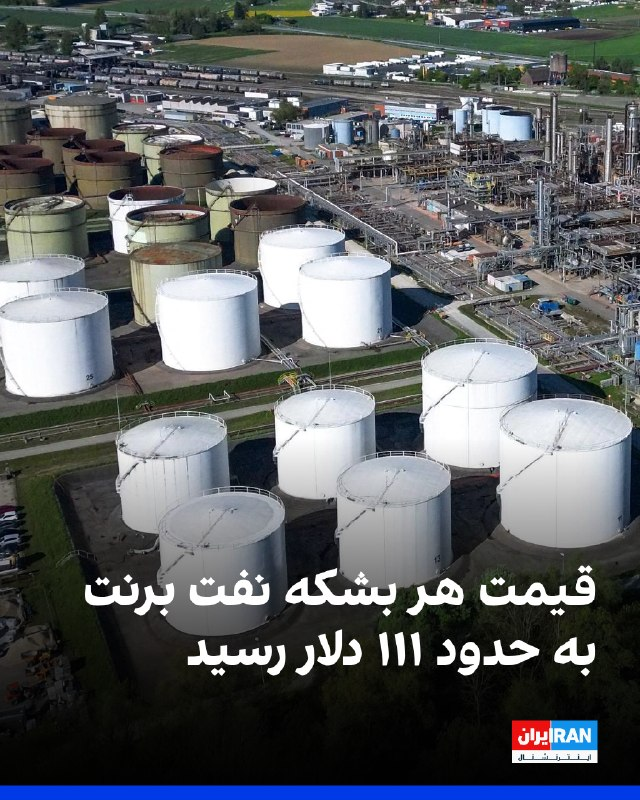

قیمت نفت برنت در آغاز معاملات روز دوشنبه با ۱.۲ درصد افزایش به ۱۱۰.۶۳ دلار در هر بشکه و قیمت نفت خام آمریکا با یک درصد افزایش به ۱۰۶.۴۲ دلار در هر بشکه رسید. به گزارش رویترز حملات پهپادی جدید در خلیج فارس، قیمت نفت و بازدهی اوراق قرضه را افزایش داد.
رویترز با اشاره به حملات پهپادی به امارات متحده عربی و عربستان سعودی همراه با هشدار رییس‌جمهوری آمریکا به جمهوری اسلامی و مسدود ماندن تنگه هرمز نوشت تحلیلگران کپیتال اکونومیکس هشدار دادند: «ادامه مسدود ماندن تنگه هرمز به سرعت به تحلیل رفتن ذخایر جهانی نفت منجر خواهد شد. وضعیت ذخایر می‌تواند تا پایان ژوئن سال جاری به سطح بحرانی برسد و زمینه‌ساز افزایش قیمت برنت به ۱۳۰ تا ۱۴۰ دلار در هر بشکه، اگر نه بیشتر، شود.»

https://iranintl.com/202605186706

## IranIntlTV — post 337713

  

اسماعیل کوثری، عضو کمیسیون امنیت ملی و سیاست خارجی مجلس، گفت: «اگر امارات متحده عربی به همکاری با آمریکا و اسرائیل علیه ما ادامه دهد، با شدت بیشتری با آنها برخورد خواهیم کرد.»
کوثری اضافه کرد: «امارات متحده عربی به خودی خود عددی نیست و تنها به پشتوانه آمریکا و اسرائیل توانسته است توطئه‌هایی را علیه جمهوری اسلامی رقم بزند.»
عضو کمیسیون امنیت ملی و سیاست خارجی مجلس گفت: «این‌ها همسایگان ما هستند، همیشه رعایت حال آن‌ها را کرده‌ایم و می‌خواهیم آن‌ها را از دامن اسرائیل نجات دهیم.»

https://iranintl.com/202605184852

## IranIntlTV — post 337712

  <a href="telegram/content/IranIntlTV_337712_1779069340.mp4" target="_blank">🎬 Download video</a>

اردلان الیاسین فر، کارشناس حکومتی، در تلویزیون جمهوری اسلامی به‌عنوان یک راه‌حل برای تهدید آمریکا در جنگ، به از کار انداختن ماهواره‌هایی همچون استارلینک اشاره می‌کند و پیشنهاد می‌دهد جمهوری اسلامی می‌تواند با ایجاد انفجاری در مدار LEO (مدار پایینی زمین) و ایجاد زباله‌های فضایی، باعث آسیب جدی به ماهواره‌های این مدار شود.
@iranintltv

## IranIntlTV — post 337703

تاریخ ایران، فقط از جنگ‌ها و حکومت‌ها نوشته نشده؛
از خانه‌هایی هم ساخته شده که ناگهان عزادار شدند، از مادرانی که در سردخانه‌ها دنبال نشانی فرزندشان گشتند و از جوانانی که میان رویاهای ساده زندگی، با گلوله متوقف شدند.
جاویدنامان انقلاب ملی ایرانیان:
مرتضی جهانبخش ورانلو، پوریا پرمون کلاردهی، محمدفواد صفائی، حسین رادی، هنگامه آرا، متین قربانی، محمدحسین فتح‌الله‌زاده رازلیقی و محمدامین خلاصه شعار.
نام‌هایی که هرکدام بخشی از زخمی هستند که بر حافظه این سرزمین مانده؛ زخمی به بلندای تاریخ ایران.
#جاویدنامان_انقلاب_ملی_ایرانیان

## FarsiVOA — post 218024

🔺هزاران نفر در مراسم نیایش «تجدید پیمان کشور ما به‌عنوان یک ملت واحد زیر نظر خدا» در واشنگتن شرکت کردند

▪️هزاران نفر روز یک‌شنبه ۲۷ اردیبهشت در محدود «نشنال مال» در واشنگتن دی‌سی، پایتخت آمریکا گرد هم آمدند تا در یک گردهمایی دعای یک‌روزه برای آمریکا شرکت کنند. این رویداد با عنوان «تجدید پیمان کشور ما به‌عنوان یک ملت واحد زیر نظر خدا» برگزار شد.

⬇️ بیشتر بخوانید:
https://ir.voanews.com/a/8151169.html
@FarsiVOA

## FarsiVOA — post 218023

🔺محاصره دریایی و آسیب‌دیدگی پالایشگاه‌های از پیش فرسوده؛ آیا بحران بنزین در ایران بدتر می‌شود؟

▪️مشکلات جمهوری اسلامی برای تامین بنزین مردم رو به‌گسترش است و به‌نظر می‌رسد رسانه‌های حکومتی سعی دارند افکار عمومی را برای وخیم‌تر شدن شرایط با استفاده از عباراتی نظیر «مدیریت مصرف» آماده و یا «مدیریت» کنند.

⬇️ بیشتر بخوانید:
https://ir.voanews.com/a/8150969.html
@FarsiVOA

## BBCPersian — post 281336

‌ ‌ ‌ ‌
حسن پایکر، مفسر سیاسی ۳۴ ساله‌ای است که تابعیت آمریکا و ترکیه را دارد و خود را یک «سوسیالیست» معرفی می‌کند.

در ماه‌های اخیر، او در ویدیوهای پخش‌ زنده‌ خود از خانه‌اش در لس‌آنجلس، با لحنی تند از سیاست داخلی و خارجی آمریکا انتقاد کرده است.

حسن پایکر از سال ۲۰۱۶ با برنامه‌هایی که صریح و گاه «بی‌پروا» اما در عین حال «سرگرم‌کننده» توصیف می‌شوند، به تدریج مخاطبان بیشتری جذب کرده است.

او در پلتفرم توییچ با نام «حسن‌ابی» (برادر بزرگتر در ترکی) شناخته می‌شود و اکنون در مجموع شبکه‌های اجتماعی مختلف حدود ۱۰ میلیون دنبال‌کننده دارد.

https://bbc.in/4eRVS2j
📸Getty Images/Reuters/ portsfile for Web Summit Qatar via Getty Images/ Bloomberg via Getty Images
@BBCPersian

## BBCPersian — post 281333

‌ ‌ ‌ ‌
دونالد ترامپ، رئیس جمهور آمریکا که در چند روز گذشته تهدیدهای خود علیه ایران را از سرگرفته و این کشور را به سرعت دادن به پاسخ خود و آمادگی برای پذیرش پیشنهادهای آمریکا فراخوانده، در شبکه اجتماعی که مالک آن است - تروث سوشال - ویدیو و گرافیک‌های متعددی علیه ایران منتشر کرده است.

چند نمونه از این پست‌ها را در ویدیو بالا ببینید. رئیس جمهور آمریکا عصر یکشنبه هم یک گرافیک جدید از نقشه ایران و منطقه در حالی که زیر هاله‌ای از پرچم آمریکا قرار گرفته بود منتشر کرد.

در این گرافیک فلش‌های متعددی به سوی ایران نشانه رفته است.

از نکات جالب این گرافیک اسامی نامتعارف و ناآشنایی است که برای مناطق و شهرهای مختلف ایران دیده می‌شود.

در گرافیک دیگری اون «نشانه رفتن» قایق‌های تندرو سپاه پاسداران را در پستی ترسیم کرده است.

https://bbc.in/4uMmqGS
@BBCPersian

## BBCPersian — post 281332

🔻 محسن رضایی: «تنگه هرمز برای تجارت باز است نه لشکرکشی»

محسن رضایی، فرمانده پیشین سپاه پاسداران در اظهاراتی جدید گفته است: «اگر ترامپ هم نفهمد که محاصره همان ادامه‌ جنگ است نظامیان دنیا که می‌دانند؛ تنها میدان نبرد سکوت کرده است.»

آقای رضایی با انتقاد از ادامه محاصره دریایی بنادر ایران توسط آمریکا گفته است: «هر چقدر محاصره دریایی ایران را طولانی‌تر کنند، آسیب به کشورهای جهان بیشتر خواهد شد. صبر ما حدی دارد و نیروهای مسلح درحال آماده‌کردن خودش است.»

آقای رضایی گفته است تنگه هرمز که بستن آن از سوی ایران به مشکل اصلی مذاکرات آتش بس میان تهران و واشنگتن تبدیل شده است: «برای تجارت باز است اما نه لشکرکشی».

این فرمانده پیشین سپاه پاسداران که اکنون مشاور ارشد نظامی فرمانده کل قوا - رهبر جمهوری اسلامی - است همچنین از احتمال حمله نظامی ظرف چند روز آینده سخن گفته است: «واقعیت این است که آمریکا در یک بن‌بست کامل گرفتار شده است. از یک طرف می‌خواهد بجنگد و حتی در دو سه روز آینده ممکن است وارد این عرصه شود، اما نظامی‌های آمریکایی به ترامپ می‌گویند که در این مسیر احتمال اسیر شدن نیروهای آمریکایی زیاد است چون آنها می‌خواهند در سواحل جنوبی وارد شوند.»

در چند روز گذشته، همزمان با اظهارات تهدید آمیز دونالد ترامپ درباره جنگ با ایران، مقام‌ها در تهران هم بارها با لحنی مقابله جویانه از آمادگی برای «هر سناریو» و مقابله با «حملات نظامی» در صورت از سر گیری جنگ آمریکا و اسرائیل علیه ایران سخن گفته‌اند.

https://bbc.in/4dtzfP5
@BBCPersian

---
📅 بروزرسانی: 1405/02/28 03:16
---

## VahidOOnLine — post 240712

♦️پیت هگست، وزیر جنگ آمریکا، شنبه از ملوانان و خدمه ناو هواپیمابر آمریکایی «یو‌اس‌اس جرالد آر فورد» پس از پایان ماموریتی ۳۳۱ روزه در ایالات متحده استقبال کرد و گفت این ناوگروه در ماموریتی «تاریخی» برای جلوگیری از دستیابی ایران به سلاح هسته‌ای نقش داشته است.

هگست در سخنرانی خود خطاب به خدمه ناوگروه رزمی ۱۲ و ناوشکن «یو‌اس‌اس ماهان» گفت: «به خاورمیانه رفتید تا بخشی از ماموریت جلوگیری از دستیابی ایران به سلاح هسته‌ای باشید؛ ماموریتی تاریخی که آن را به پایان خواهیم رساند.»

او با اشاره به طولانی بودن این ماموریت دریایی گفت خدمه ناو در این مدت مسافتی معادل سه بار دور کره زمین را طی کردند و در اروپا، کارائیب و خاورمیانه حضور داشتند.

وزیر جنگ آمریکا همچنین از خانواده‌های ملوانان قدردانی کرد و گفت خدمه ناوگروه «قدرت آمریکا را به شکلی تاریخی» به نمایش گذاشتند.

هگست در پایان این مراسم، نشان «استناد افتخار ریاست‌جمهوری» را از طرف دونالد ترامپ به ناوگروه رزمی «جرالد آر فورد» و ناوشکن «یو‌اس‌اس ماهان» اعطا کرد.
‌🇸🇦 Indypersian

🤖 @VahidOOnLine

## VahidOOnLine — post 240711

  

♦️دونالد ترامپ، رئیس‌جمهوری آمریکا، بامداد دوشنبه ۲۸ اردیبهشت‌ماه، چند تصویر و گرافیک با مضمون قدرت نظامی و فشار آمریکا علیه جمهوری اسلامی منتشر کرد.

در یکی از این تصاویر، یک پهپاد آمریکایی در حال هدف قرار دادن دو قایق با پرچم جمهوری اسلامی دیده می‌شود و روی آن نوشته شده است: «خدانگهدار! قایق‌های مثلا تندرو!»

ترامپ همچنین روی پس زمینه‌ای با پرچم آمریکا، نقشه ایران و کشورهای منطقه را منتشر کرد که در آن فلش هایی از کشورهای اطراف ایران به سمت ایران نشانه می رود.
ترامپ عصر یکشنبه ۲۷ اردیبهشت‌ماه در گفتگو با آکسیوس به تهران هشدار داده بود: «اگر پیشنهاد بهتری ارائه نکنند، آمریکا ایران را بسیار شدیدتر از قبل هدف قرار خواهد داد.»

او در ادامه تاکید کرد: «ساعت در حال تیک‌تاک است؛ بهتر است خیلی سریع حرکت کنند، وگرنه چیزی برایشان باقی نخواهد ماند.»
‌🇸🇦 Indypersian

🤖 @VahidOOnLine

## VahidOOnLine — post 240710

  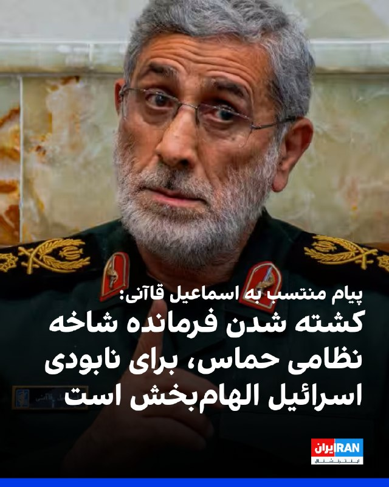

رسانه‌های جمهوری اسلامی پیامی منتسب به اسماعیل قاآنی، فرمانده نیروی قدس سپاه، را درباره کشته شدن عزالدین الحداد، فرمانده شاخه نظامی حماس، منتشر کردند. در این پیام آمده است که کشته شدن چنین چهره‌هایی «الهام‌بخش مجاهدان جوان فلسطینی» برای «نابودی» اسرائیل خواهد بود.
‌🏁 🇬🇧 IranintlTV

🤖 @VahidOOnLine

## pm_afshaa — post 90933

  <a href="telegram/content/pm_afshaa_90933_1779061568.webm" target="_blank">🎬 Download video</a>

🔴سی‌ان‌ان به نقل از منابع آگاه:
ترامپ به‌طور فزاینده‌ای از روند مذاکرات با جمهوری اسلامی و ادامه بسته بودن تنگه هرمز ناراضی و کلافه شده.

ترامپ احتمالا اوایل این هفته دوباره با تیم امنیت ملی خود درباره جنگ دیدار خواهد کرد.

پنتاگون در صورت تصمیم نهایی ترامپ، مجموعه‌ای از اهداف و سناریوهای نظامی برای حملات بیشتر آماده کرده.

💧 Rainbet.com the #1 Non-KYC Crypto Casino & Sportsbook @rainbetcom

😁 @Pm_Afshaa

## kianmeli1 — post 87458

  

🔴قیمت نفت پس از پست های تهدید حمله به ایران افزایش یافت

( بالا رفتن و پایین آمدن نفت با خبرهای هیجانی ممکن است برای شرط بندی و نوسان گیری و خرید و فروش نفت توسط دولت امریکا باشد
شاید فردا با خبر دیگری بگوید توافق نزدیک است

قبل از باز شدن بازار در کف قیمت میخرند‌ و با خبرهای هیجانی بالا میبرند تا صبح دوشنبه با بالاترین قیمت بفروشند

جنگ نعمت است برای تمام دولت ها).
https://t.me/kianmeli1

## kianmeli1 — post 87457

  <a href="telegram/content/kianmeli1_87457_1779061569.mp4" target="_blank">🎬 Download video</a>

🔴امشب، یک فروند پهپاد MQ-9 Reaper نیروی هوایی ایالات متحده که حامل چندین موشک هوا به سطح AGM-114R9X Hellfire بود و بیشتر با نام «Ginsu Flying» شناخته می‌شود، توسط نیروهای تحت حمایت جمهوری اسلامی بر فراز غرب یمن تحت کنترل حوثی‌ها سرنگون شد و لاشه آن در عکس‌ها و ویدیوها به وضوح متعلق به یک MQ-9 دیده می‌شود.

از آغاز درگیری در اواخر سال ۲۰۲۳، بیش از ۴۰ پهپاد MQ-9 Reaper، که ارزش آنها احتمالاً بیش از یک میلیارد دلار است، به دست ایران یا گروه‌های نیابتی ایران افتاده است که حداقل ۲۴ فروند از آنها بر فراز ایران و ۱۵ تا ۱۸ فروند توسط حوثی‌ها در یمن سرنگون شده‌اند.
https://t.me/kianmeli1

## IranIntlTV — post 337702

  

رسانه‌های جمهوری اسلامی پیامی منتسب به اسماعیل قاآنی، فرمانده نیروی قدس سپاه، را درباره کشته شدن عزالدین الحداد، فرمانده شاخه نظامی حماس، منتشر کردند. در این پیام آمده است که کشته شدن چنین چهره‌هایی «الهام‌بخش مجاهدان جوان فلسطینی» برای «نابودی» اسرائیل خواهد بود.
https://iranintl.com/202605176601

## FarsiVOA — post 218022

⚡️ایران در میزگردهای هفتگی شبکه‌های تلویزیونی آمریکا
@FarsiVOA

## BBCPersian — post 281331

  

‌ ‌ ‌ ‌
در پی واژگون شدن اتوبوس حامل کارکنان مجمتع گاز پارس جنوبی در عسلویه، شش نفر کشته و ۲۰ نفر مجروح شدند.

ابراهیم عباسی، سخنگوی مجتمع گاز پارس جنوبی به ایسنا گفته است این اتوبوس در حال سفر به شهر کرمانشاه بوده است که در جاده عسلویه - سیراف دچار سانحه و واژگون شده است.

https://bbc.in/4dqYKR9
📷 Irna
@BBCPersian

---
📅 بروزرسانی: 1405/02/28 02:11
---

## VahidOOnLine — post 240709

  <a href="telegram/content/VahidOOnLine_240709_1779057696.mp4" target="_blank">🎬 Download video</a>

ولودیمیر زلنسکی، رییس‌جمهوری اوکراین، یکشنبه ۲۷ اردیبهشت، با انتشار ویدیویی در ایکس از حمله گسترده پهپادی اوکراین به مناطقی در مسکو، در فاصله بیش از ۵۰۰ کیلومتری از مرزهای اوکراین خبر داد.
مقام‌های روسیه گفتند دست‌کم سه نفر کشته شدند.
پیش‌تر، زلنسکی پس از آن‌که روسیه در روزهای ۲۳ و ۲۴ اردیبهشت سنگین‌ترین حمله پهپادی و موشکی خود به کی‌یف را از آغاز جنگ انجام داد، وعده تلافی داده بود.
‌🏁 🇬🇧 IranintlTV

🤖 @VahidOOnLine

## VahidOOnLine — post 240708

♦️۲۸ اردیبهشت در تقویم رسمی ایران به نام روز بزرگداشت حکیم عمر خیام نیشابوری ثبت شده است؛ شاعر، ریاضی‌دان، ستاره‌شناس و فیلسوف برجسته ایرانی که از او به‌عنوان یکی از تاثیرگذارترین دانشمندان سده‌های میانی یاد می‌شود. خیام با تدوین گاه‌شماری جلالی و آثار علمی و ادبی خود، جایگاهی ماندگار در تاریخ علم و فرهنگ ایران و جهان به دست آورده است.

در انتهای بلوار خیام در جنوب شرقی نیشابور، باغی سرسبز قرار دارد که در قلب آن، اندیشمندی از تبار ستاره‌شناسان، شاعران و ریاضی‌دانان برجسته جهان در خاک آرمیده است. آرامگاه خیام نه‌تنها از مهم‌ترین نمادهای فرهنگی و گردشگری نیشابور محسوب می‌شود، بلکه جلوه‌ای از شکوه اندیشه، معماری و هنر است؛ بنایی که هوشنگ سیحون، معمار برجسته و نامدار، با الهام از رازورمز هستی، سروده‌های خیام و دانش ستاره‌شناسی و ریاضی او، چنان خلق کرد که پژواک سه بعد وجودی این نابغه ایرانی باشد.
آرامگاه خیام روز دوازدهم فروردین ۱۳۴۲ در مراسمی با حضور محمدرضاشاه و ⁧ شهبانو‌ فرح‌پهلوی ⁩ افتتاح شد و در سال ۱۳۵۴ در فهرست میراث ملی ایران به ثبت رسید.
‌🇸🇦 Indypersian

🤖 @VahidOOnLine

## VahidOOnLine — post 240707

  

‌ترامپ به فاصله چند دقیقه‌ چندین تصویر مرتبط با ایران را در تروث‌سوشال بازنشر کرد. ترامپ همچنین یک تصویر جدید از پرچم آمریکا را منتشر کرد که در پس‌زمینه آن نقشه خاورمیانه به مرکزیت ایران قرار دارد و از همه کشورهای همسایه فِلِش‌هایی به سمت ایران نشان داده شده است.
او همچنین چند تصویر و پویانما را بازنشر کرد که ناوها و پهپادهای آمریکایی را در حال هدف قرار دادن پهپادها و قایق‌های تندرو جمهوری اسلامی نشان می‌دهد.
ترامپ در یک پست نموداری را نیز بازنشر کرد که مدت‌زمان جنگ‌های مختلف آمریکا را نمایش می‌دهد. در این نمودار جنگ کنونی ایران با ۶ هفته به عنوان کوتاه‌مدت‌ترین و جنگ افغانستان با ۵۴۳ هفته به عنوان بلندمدت‌ترین جنگ نمایش داده شده است.
رییس‌جمهوری آمریکا همچنین دو تصویر مقایسه‌ای را بازنشر کرد که ناوگان کشتی‌های نظامی جمهوری اسلامی را در حال حرکت روی آب در زمان ریاست‌جمهوری اوباما و همین ناوگان را غرق شده در کف دریا در زمان دولت ترامپ نشان می‌دهد.

‌🏁 🇬🇧 IranintlTV

🤖 @VahidOOnLine

## mwarmonitor — post 9230

  <a href="telegram/content/mwarmonitor_9230_1779057698.mp4" target="_blank">🎬 Download video</a>

📝این مارمولکِ کثیف و فسیل‌شده‌ی نظام را هر چند وقت یک‌بار که با کمبود نفرات و قحط‌الرجال مواجه می‌شوند، مثل یک دلقک سیرک از انباری درمی‌آورند تا روی آنتن زنده با زر مفت زدنش، سوژه خنده و تفریح ما را فراهم کند. مرتیکه‌ی بی‌‌پدرومادر با وقاحتی بی‌شرمانه زل می‌زند در دوربین و می‌گوید «تنگه بازه!»؛ بله، باز است، ولی وای به حال هر کشتی و کشوری که باجِ سبیلِ شما مادر **** تروریست را ندهد، چون فوراً به سمتش شلیک می‌کنید و منطقه را به لجن می‌کشید.

🔸​این حد از وقاحت، دکانِ مظلوم‌نمایی و یکی به نعل و یکی به میخ زدن، اصلاً چیز جدیدی نیست؛ این مدل دروغ‌گوییِ کثیف و توجیه‌گریِ بی‌شرمانه، دقیقاً عین واقعیت و از صفاتِ بارز، ساختاری و ریشه‌ایِ شیعه رافضی است. جماعتی که کل هویت و تاریخش بر پایه‌ی نفاق، تقیه، باج‌خواهی و بحران‌زیستی بنا شده، حالا در قالب یک مشت آخوند و سردارِ ابلَه، از یک طرف تروریسم و موشک صادر می‌کنند و از طرف دیگر روی منبر ژست صلح‌طلبی می‌گیرند؛ حرامیانی که دروغ گفتن و خیانت در ذاتِ نجس و آیین کثیفشان است و با همین حرامزاده‌بازی‌ها دنیا را به آشوب کشیده‌اند.

@mwarmonitor

## pm_afshaa — post 90932

🔴شاهزاده رضا پهلوی : ببینید، حتی همین چند روز پیش هم اعدام‌ها تقریباً روزانه ادامه داشته
این واقعیتیه که خیلی‌ها دارن کشته میشن و جنگ واقعی‌ای که جریان داره
همون جنگیه که رژیم 47 سال پیش علیه مردم خودش شروع کرده و هنوز هم تموم نشده
هیچ آتش‌بسی هم در کار نبوده و سرکوب مردم ایران همچنان ادامه داره

💧 Rainbet.com the #1 Non-KYC Crypto Casino & Sportsbook @rainbetcom

😁 @Pm_Afshaa

## pm_afshaa — post 90931

🔴شاهزاده رضا پهلوی : با اینکه بیشتر از 70 روزه اینترنتو کامل قطع کردن و مردم هیچ راهی برای ارتباط با بیرون ندارن ولی هنوز وایسادن و کوتاه نیومدن

فقط امیدشون اینه که این همه سختی و فداکاری هدر نره و آخرش این وضعیت تموم بشه و با به زانو اومدن این رژیم، کشور آزاد بشه

💧 Rainbet.com the #1 Non-KYC Crypto Casino & Sportsbook @rainbetcom

😁 @Pm_Afshaa

## kianmeli1 — post 87456

  

🔴پست جدید ترامپ که نیاز به توضیح ندارد
https://t.me/kianmeli1

## IranIntlTV — post 337701

  <a href="telegram/content/IranIntlTV_337701_1779057700.mp4" target="_blank">🎬 Download video</a>

میلاد آفرین، زندانی سیاسی سابق، در حاشیه تجمع اعتراضی ایرانیان در لس‌آنجلس به نیلوفر منصوری، خبرنگار ایران‌اینترنشنال، گفت: «ما صدای زندانیان سیاسی هستیم. من خودم یکی از کسانی بودم که فشارها و آزارهای زندان را تجربه کردم.»

او افزود: «مردمی که امروز اینجا جمع شده‌اند، صدای شما هستند. ما کنار مردم ایران ایستاده‌ایم و می‌خواهیم هرچه زودتر از جمهوری اسلامی عبور کنیم تا زندانیان بتوانند با آرامش به زندگی خود برگردند.»

آفرین همچنین گفت: «مطمئن باشید این آخرین نبرد است.»
@iranintltv

## IranIntlTV — post 337700

  <a href="telegram/content/IranIntlTV_337700_1779057702.mp4" target="_blank">🎬 Download video</a>

موج جدید تورم و بیکاری در کشور موجب تشدید بحران معیشت و گسترش فقر در جامعه شده است.

همزمان با تعطیلی مراکز اقتصادی و رکود بازار، یک عضو هیات رییسه مجلس جمهوری اسلامی گفت شمار متقاضیان بیمه بیکاری به بیش از ۳۰۰ هزار نفر رسیده است.

گفت‌وگو با احمد علوی، استاد دانشگاه و اقتصاددان
@iranintltv

## IranIntlTV — post 337699

  <a href="https://t.me/IranintlTV/337699" target="_blank">📎 Download file</a>

🎧نسخه صوتی سیاست با مراد ویسی: حملات پهپادی سپاه و نیابتی‌ها به امارات و عربستان
@iranintlTV

## IranIntlTV — post 337698

  <a href="telegram/content/IranIntlTV_337698_1779057704.mp4" target="_blank">🎬 Download video</a>

همزمان با ادامه بن‌بست مذاکرات میان واشینگتن و تهران و احتمال از سرگیری حملات به جمهوری اسلامی، دونالد ترامپ گفت جمهوری اسلامی باید «خیلی سریع» اقدام کند وگرنه چیزی از آن باقی نخواهد ماند.

گفت‌وگو با امیر گیتی، عضو تحریریه ایران‌اینترنشنال
@iranintltv

## IranIntlTV — post 337697

  <a href="telegram/content/IranIntlTV_337697_1779057705.mp4" target="_blank">🎬 Download video</a>

ولودیمیر زلنسکی، رییس‌جمهوری اوکراین، یکشنبه ۲۷ اردیبهشت، با انتشار ویدیویی در ایکس از حمله گسترده پهپادی اوکراین به مناطقی در مسکو، در فاصله بیش از ۵۰۰ کیلومتری از مرزهای اوکراین خبر داد.
مقام‌های روسیه گفتند دست‌کم سه نفر کشته شدند.
پیش‌تر، زلنسکی پس از آن‌که روسیه در روزهای ۲۳ و ۲۴ اردیبهشت سنگین‌ترین حمله پهپادی و موشکی خود به کی‌یف را از آغاز جنگ انجام داد، وعده تلافی داده بود.

## IranIntlTV — post 337696

  <a href="telegram/content/IranIntlTV_337696_1779057706.mp4" target="_blank">🎬 Download video</a>

🔻امیر قلعه‌نویی در حالی لیست تیم ملی برای حضور در جام‌جهانی را اعلام کرد که در مصاحبه‌ای گفت شریف‌ترین بازیکنان به تیم ملی دعوت شدند. این در حالی است که بازیکنانی در لیست تیم ملی قرار گرفتند که در تجمعات حکومتی حضور داشتند.

🔹توضیحات مزدک میرزایی، ایران‌اینترنشنال در برنامه هت‌تریک

🔹تماشای نسخه کامل هت‌تریک؛👇
https://youtu.be/gw3eJ0R9R5Y

@iranintltvsport

## IranIntlTV — post 337695

  <a href="telegram/content/IranIntlTV_337695_1779057707.mp4" target="_blank">🎬 Download video</a>

مراد ویسی، تحلیل‌گر ارشد ایران‌اینترنشنال، گفت: «۱۸ سالگی برای بسیاری آغاز ورود به دانشگاه، کار و آینده‌ای پر از آرزوست. سنی که خانواده‌ها انتظار دارند ثمره سال‌ها تلاش فرزندشان را ببینند. در کشتار دی‌ماه، بسیاری از نوجوانان و جوانانی که برای زندگی‌شان هزاران برنامه و امید داشتند، جان خود را از دست دادند؛ رخدادی که تلخی آن برای جامعه و خانواده‌ها عمیق‌تر شد.»
@iranintltv

## IranIntlTV — post 337694

  

‌ترامپ به فاصله چند دقیقه‌ چندین تصویر مرتبط با ایران را در تروث‌سوشال بازنشر کرد. ترامپ همچنین یک تصویر جدید از پرچم آمریکا را منتشر کرد که در پس‌زمینه آن نقشه خاورمیانه به مرکزیت ایران قرار دارد و از همه کشورهای همسایه فِلِش‌هایی به سمت ایران نشان داده شده است.
او همچنین چند تصویر و پویانما را بازنشر کرد که ناوها و پهپادهای آمریکایی را در حال هدف قرار دادن پهپادها و قایق‌های تندرو جمهوری اسلامی نشان می‌دهد.
ترامپ در یک پست نموداری را نیز بازنشر کرد که مدت‌زمان جنگ‌های مختلف آمریکا را نمایش می‌دهد. در این نمودار جنگ کنونی ایران با ۶ هفته به عنوان کوتاه‌مدت‌ترین و جنگ افغانستان با ۵۴۳ هفته به عنوان بلندمدت‌ترین جنگ نمایش داده شده است.
رییس‌جمهوری آمریکا همچنین دو تصویر مقایسه‌ای را بازنشر کرد که ناوگان کشتی‌های نظامی جمهوری اسلامی را در حال حرکت روی آب در زمان ریاست‌جمهوری اوباما و همین ناوگان را غرق شده در کف دریا در زمان دولت ترامپ نشان می‌دهد.

https://iranintl.com/202605173898

## IranIntlTV — post 337693

  <a href="telegram/content/IranIntlTV_337693_1779057709.mp4" target="_blank">🎬 Download video</a>

مراد ویسی، تحلیل‌گر ارشد ایران‌اینترنشنال، گفت: «مردم ایران، رفاه و پیشرفت دبی را با وضعیت نامساعد اقتصادی و معیشتی ایران مقایسه می‌کنند و این تفاوت را نتیجه عملکرد متفاوت رهبران جمهوری اسلامی می‌دانند. مقامات جمهوری اسلامی و فرماندهان سپاه نیز چون عقده دبی را دارند این چنین به امارات حمله می کنند.»
@iranintltv

## Shin_Persian — post 6055

Shin ✓ @hey_itsmyturn
Sun, 17 May 2026 22:09:31 UTC

Wael Abdel Halim, A PIJ terror commander has been eliminated following the #IAF 🇮🇱 strike on an apartment in Baalbek, Easter Lebanon

فارسی

وائل عبدالحلیم، یکی از فرماندهان تروریستی جهاد اسلامی فلسطین (PIJ)، در پی حمله نیروی هوایی اسرائیل (IAF) 🇮🇱 به آپارتمانی در بعلبک، در شرق لبنان حذف شد. #IAF 🇮🇱

𝕏 · @shin_persian

## FarsiVOA — post 218021

🔺رسانه‌های آمریکایی: ترامپ روز شنبه با مشاوران ارشد امنیت ملی خود درباره ایران جلسه گذاشت؛ سه‌شنبه نیز جلسه دیگری دارد

▪️سایت خبری آکسیوس روز یک‌شنبه ۲۷ اردیبهشت گزارش داد که دونالد ترامپ، رئیس‌جمهوری آمریکا قرار است روز سه‌شنبه در «اتاق وضعیت» کاخ سفید با مشاوران ارشد امنیت ملی خود جلسه‌ای درباره ایران برگزار کند.

⬇️ بیشتر بخوانید:
https://ir.voanews.com/a/8150967.html
@FarsiVOA

## FarsiVOA — post 218020

⚡️پوشش ویژه | دعای مایک جانسون در مراسم نیایش دویست‌وپنجاهمین سالروز استقلال آمریکا
@FarsiVOA

## FarsiVOA — post 218019

⚡️منیژه حکمت، کارگردان ایرانی و مادر پگاه آهنگرانی بعد از نمایش فیلم «تمرین‌هایی برای یک انقلاب» گفت چاره‌‌ای جز امیدواری وجود ندارد.
@FarsiVOA

## FarsiVOA — post 218018

⚡️روز جهانی ارتباطات در سایه قطع اینترنت در ایران؛ گفت‌وگو با امیر رشیدی
@FarsiVOA

## FarsiVOA — post 218017

⚡️وکلای تسخیری در جمهوری اسلامی وسیله‌ای برای سرعت‌بخشیدن به اعدام‌ها؛ گفت‌وگو با محمد مقیمی
@FarsiVOA

## FarsiVOA — post 218016

⚡️گفت‌وگو با کاوه فرنام تهیه کننده فیلم «تمرین‌هایی برای یک انقلاب »
@FarsiVOA

## FarsiVOA — post 218015

⚡️خشم رو به گسترش شیعیان لبنان علیه جمهوری اسلامی در پی اقدامات حزب‌الله و ناامنی مناطقی از لبنان
@FarsiVOA

## FarsiVOA — post 218014

  

⚡️مقامات آمریکایی گفتند که دو جت ائی‌ای-۱۸جی گرولر نیروی دریایی روز یکشنبه در نمایشگاه هوایی «گانفایتر اسکایز» در یک پایگاه نیروی هوایی در ایالت آیداهو، با هم در هوا برخورد کردند. به گفته مقامات، هر چهار خدمه با موفقیت ایجکت کردند و از هواپیما بیرون پریدند.
@FarsiVOA

## FarsiVOA — post 218013

⚡️از خاموشی اینترنت مردم تا چشم حکومت به درآمدِ کابل‌های هرمز

@FarsiVOA

## Persian_Trend_Official — post 14368

  <a href="telegram/content/Persian_Trend_Official_14368_1779057711.webm" target="_blank">🎬 Download video</a>

شبتون بخیر 🙏🤍

📝 Nick
📌 @persian_trend_official
پرشین ترند | متفاوت‌ترین کانال نظامی

## Persian_Trend_Official — post 14367

  

پست قابل تأمل ‌ترامپ که لحظاتی قبل در تروث سوشال منتشر کرده است.

☆Phantom☆

📌 @persian_trend_official
پرشین ترند | متفاوت‌ترین کانال نظامی

## Persian_Trend_Official — post 14366

♨️ دوستان عزیز، با توجه به شرایط پیش‌رو، بهتر است از همین حالا برای سناریوهای اضطراری آماده باشیم. آمادگی یعنی آرامش بیشتر و آسیب کمتر برای خودمان و خانواده‌مان. 🧭

⚠️ چند مورد مهم را جدی بگیرید:

• برای دست‌کم ۱ ماه، آذوقه‌ی غذایی فاسد نشدنی و آب آشامیدنی کافی برای همه اعضای خانواده تهیه کنید. 🥫💧

• همیشه تا جای ممکن باک بنزین خودرو را پر نگه دارید. ⛽️

• اگر نوزاد یا کودک شیرخوار دارید، حتماً به اندازه کافی شیر خشک و لوازم ضروری او را از قبل تهیه کنید. 👶🍼

• اگر در خانواده سالمند یا بیماری دارید که داروی حیاتی مصرف می‌کند، از داروهای ضروری او به میزان کافی ذخیره داشته باشید. 💊

• کوله اضطراری را جدی بگیرید؛ شامل مدارک مهم، مقداری پول نقد، پاوربانک، چراغ‌قوه، باتری، داروهای شخصی، لباس گرم، وسایل بهداشتی و شارژر. 🎒🔦

• مقداری پول نقد همراه داشته باشید؛ در شرایط بحران، دسترسی به کارت بانکی یا اینترنت ممکن است مختل شود. 💵

• دارایی و پول خود را فقط در یک محل متمرکز نکنید و برای شرایط قطع دسترسی، برنامه جایگزین داشته باشید. 🏦

• با اعضای خانواده درباره سناریوهای مختلف صحبت کنید: قطع برق، قطع اینترنت، تخلیه اضطراری و محل‌های امن یا محل تجمع خانوادگی. 👨‍👩‍👧‍👦

• یک رادیوی موج متوسط یا رادیوی باتری‌خور تهیه کنید تا در صورت قطع اینترنت، بتوانید خبرها و اطلاعیه‌های ضروری را دنبال کنید. 📻

• در خانه، شیشه‌ها و پنجره‌های حساس را بررسی و تا جای ممکن محکم‌کاری کنید. در صورت نگرانی از موج انفجار، می‌توان برای کاهش پخش شدن خرده‌شیشه‌ها از چسب نواری پهن به‌صورت ضربدری روی شیشه‌ها استفاده کرد. 🪟

• مدارک مهم، شماره تماس‌های ضروری، آدرس‌ها و اطلاعات حیاتی را هم به‌صورت کاغذی و هم در گوشی ذخیره کنید. 📄📱

• برای چند هفته بی‌برقی و بی‌ارتباطی هم آماده باشید: چراغ‌قوه، پاوربانک، آب، غذا و لوازم اولیه را از قبل کنار بگذارید. ⚠️

آمادگی به معنی ترسیدن نیست؛ یعنی از خانواده‌مان بهتر محافظت کنیم. ❤️

ما در تیم پرشین ترند امیدواریم هیچ اتفاق بدی برای هیچ‌یک از هم‌وطنان‌مان رخ ندهد، اما احتیاط از امروز می‌تواند فردا نجات‌بخش باشد.

📝 Nick

📌 @persian_trend_official
پرشین ترند | متفاوت‌ترین کانال نظامی

## IranianMinds — post 20312

  <a href="telegram/content/IranianMinds_20312_1779057712.mp4" target="_blank">🎬 Download video</a>

🔴 امشب تو صداوسیما مجری و دو تا سپاهی که از ترس کونشون صورتشونو پوشونده بودن اسلحه گرفته بودن دستشون و‌ داشتن به سمت ترامپ و نتانیاهو شلیک میکردن و داشتن دعا میکردن که ایشالا تیرشون به هدف میخوره

@IranianMinds

## IranianMinds — post 20311

  <a href="telegram/content/IranianMinds_20311_1779057713.webm" target="_blank">🎬 Download video</a>

💥 با هر ثبت نام 
🅰️
🅰️
🅰️ هزار تومن جایزه بگیرید

✔️ میتونید شرط‌بندی کنید و بونوس را به موجودی واقعی تبدیل کنید

⚽️  پوشش کامل مسابقات ورزشی 

💯  پیش‌بینی با بهترین ضرایب 

⭐️ تجربه سریع و حرفه‌ای

💰پرداخت مستقیم و سریع بدون واسطه، بدون دردسر، واریز و برداشت در سریع‌ترین زمان ممکن

☑️ کانال تلگرام: 

➡️ @winro_io  

🎁 هدیه خود را با ثبت نام در سایت دریافت کنید: 

➡️ Winro.io
A27
سایت اصلی در روزهای آینده بازگشایی خواهد شد
💎

## IranianMinds — post 20310

🔴 پست جدید ترامپ : @IranianMinds

## IranianMinds — post 20309

🔴 پست جدید ترامپ : @IranianMinds

## IranianMinds — post 20308

🔴 پست جدید ترامپ : @IranianMinds

## IranianMinds — post 20307

  

🔴 پست جدید ترامپ :

@IranianMinds

## BBCPersian — post 281330

  

‌ ‌ ‌ ‌
علیرضا یوسفی، وزنه‌بردار ایرانی وزن بعلاوه ۱۱۰ کیلوگرم موفق شد در جریان مسابقات قهرمانی آسیا رکود دو ضرب جهان را بشکند.

وزنه بردار فوق سنگین ایران روز یکشنبه در حرکت دو ضرب توانست با بالا بردن ۲۶۱ کیلوگرم، ضمن کسب مدال طلای مسابقات آسیایی که اکنون در هند در حال برگزاری است، رکود جهان را بهبود ببخشد.

او پس از شکست رکود جهان روی سکو دوبنده خود را کنار زد تا نوشته روی تی‌شرت مشکی خود را - «شهدای میناب ۱۶۸» - به دوربین و حاضران در ورزشگاه نشان دهد.

او در حرکت یک ضرب سوم شد تا در مجموع صاحب مدال نقره وزن بعلاوه ۱۱۰ کیلوگرم شود.

https://bbc.in/43dSUhn
📷Nasimonline
@BBCPersian

## Dirty_Kids — post 389657

  <a href="telegram/content/Dirty_Kids_389657_1779057714.webm" target="_blank">🎬 Download video</a>

☢️خفن ترین و‌ قدیمی ترین  انالیزور  ایران ینی دکتر بت 
👍 
🔴هیچ سایت بتی دوست نداره شما کانال دکتر بت رو پیدا کنین چون خیلی سود میکنید🤷‍♂ رایگان بهترین شرط هارو براتون میذاره حتی هزار تومن هم دریافت نمیکنه روزانه میتونی از پیش بینی فوتبال باهاش پول در بیاری…

## Dirty_Kids — post 389656

  <a href="telegram/content/Dirty_Kids_389656_1779057715.webm" target="_blank">🎬 Download video</a>

☢️خفن ترین و‌ قدیمی ترین  انالیزور  ایران ینی دکتر بت 
👍

🔴هیچ سایت بتی دوست نداره شما کانال دکتر بت رو پیدا کنین چون خیلی سود میکنید🤷‍♂

رایگان بهترین شرط هارو براتون میذاره
حتی هزار تومن هم دریافت نمیکنه
روزانه میتونی از پیش بینی فوتبال باهاش پول در بیاری 👌
A27
اگ اهل پیش بینی فوتبالی این کانال اصلا از دست ندین👇

✅https://t.me/+4_ADqwB9e-QwYjlk

✅https://t.me/+4_ADqwB9e-QwYjlk

## Dirty_Kids — post 389655

  

#بخوابیم

@Dirty_Kids 👻

## Dirty_Kids — post 389654

  <a href="telegram/content/Dirty_Kids_389654_1779057715.mp4" target="_blank">🎬 Download video</a>

دوستان اگه پولتون زیادی کرده و نمیدونین باهاش چیکار کنین، کاخ گوتیک امیردشت با قیمت مفتِ 1500 میلیارد به فروش میرسه، حتما بخرین.

@Dirty_Kids 👻

## Dirty_Kids — post 389653

  

زنجیره بی‌پایانِ پیروزی‌های آخوند برشمشیر 🤭🧩

@Dirty_Kids 👻

## Dirty_Kids — post 389652

  

یه تخمش از ممه‌های دخترت بزرگتره

@Dirty_Kids 👻

## Dirty_Kids — post 389651

  <a href="telegram/content/Dirty_Kids_389651_1779057716.mp4" target="_blank">🎬 Download video</a>

شما چپولایی که کل شجاعتتون این بوده تو خونه‌های تیمی، زناتون رو با هم ضربدری عوض بدل کنید، جلوی این نسل از خایه حرف نزنید مادرجنده‌های زن و دختر خراب!

@Dirty_Kids 👻

## Dirty_Kids — post 389650

  

عکس جدید بیلی ایلیش :)

@Dirty_Kids 👻

## Dirty_Kids — post 389649

‏بدتر از خود مقوله‌ی vpn خریدن اینه که حتما باید vpn داشته باشم که بتونم دوباره بخرم

@Dirty_Kids 👻

## Dirty_Kids — post 389648

تخم ما از ممه دخترت بزرگتره

@Dirty_Kids 👻

## Dirty_Kids — post 389647

  

ترامپ در تروث‌سوشال رگباری گاییده. بیست سی‌تا پست پشت هم گذاشته تا الان. @Dirty_Kids 👻

## alonews — post 120725

  

🔥
💥اینترنت آزاد و رایگان

🌐
🚫تنها جایی که کانفیگ رایگان میزاره

⬇️
⬇️
@NetAazaadBot
@NetAazaadBot

⚠️هر ساعت 100گیگ شارژ میشه، رباتو داشته باشید تا مطلع بشید

## alonews — post 120724

  <a href="telegram/content/alonews_120724_1779057718.webm" target="_blank">🎬 Download video</a>

👈پست عجیب حسین دهباشی سازنده کلیپ تبلیغاتی حسن روحانی در سال ۱۳۹۶: حملات و ترورهای دشمن تا رهبری حسن روحانی ادامه خواهد داشت

✅ @AloNews خبر جنگ

## alonews — post 120723

  <a href="telegram/content/alonews_120723_1779057718.webm" target="_blank">🎬 Download video</a>

👈وضعیت ایران در روز ارتباطات و روابط عمومی

✅ @AloNews خبر جنگ

## alonews — post 120722

  <a href="telegram/content/alonews_120722_1779057718.webm" target="_blank">🎬 Download video</a>

👈سفیر ایالات متحده در سازمان ملل: هدف قرار دادن نیروگاه هسته‌ای براکه در امارات متحده عربی، تشدید تنش خطرناک و غیرقابل قبول است.

✅ @AloNews خبر جنگ

## alonews — post 120721

  <a href="telegram/content/alonews_120721_1779057718.webm" target="_blank">🎬 Download video</a>

👈خوش چشم: قالیباف هَوَل مذاکره نیست

✅ @AloNews خبر جنگ

## alonews — post 120720

  <a href="telegram/content/alonews_120720_1779057718.webm" target="_blank">🎬 Download video</a>

👈ترامپ بازم پست گذاشت 
✅ @AloNews خبر جنگ

<!-- MSG END -->

<!-- NAV START -->

<a href="https://github.com/benyamin-najmi/aio-downloader/blob/main/telegram/content/archive_1.md" style="display:inline-block; padding:6px 12px; margin:0 4px; background-color:#2ea44f; color:white; text-decoration:none; border-radius:4px; font-weight:bold;">صفحه بعد</a>

<!-- NAV END -->
