# خواننده تلگرام

<!-- TOP_NAV START -->

<a href="https://github.com/benyamin-najmi/aio-downloader/blob/main/telegram/content/archive_1.md" style="display:inline-block; padding:6px 12px; margin:0 4px; background-color:#2ea44f; color:white; text-decoration:none; border-radius:4px; font-weight:bold;">صفحه بعد</a>

<!-- TOP_NAV END -->

<!-- MSG START -->

---
📅 بروزرسانی: 1405/02/29 00:21
---

## VahidOOnLine — post 240865

  

عبدالقهار بلخی، سخنگوی وزارت خارجه طالبان، حملات پهپادی اخیر به «تاسیسات غیرنظامی» در امارات متحده عربی، به ویژه به نیروگاه هسته‌ای براکه را محکوم کرد.

او در شبکه اجتماعی ایکس نوشت که طالبان «نگرانی عمیق خود را از تشدید خشونت در منطقه ابراز می‌کند.»
‌🏁 🇬🇧 IranintlTV

🤖 @VahidOOnLine

## VahidOOnLine — post 240864

  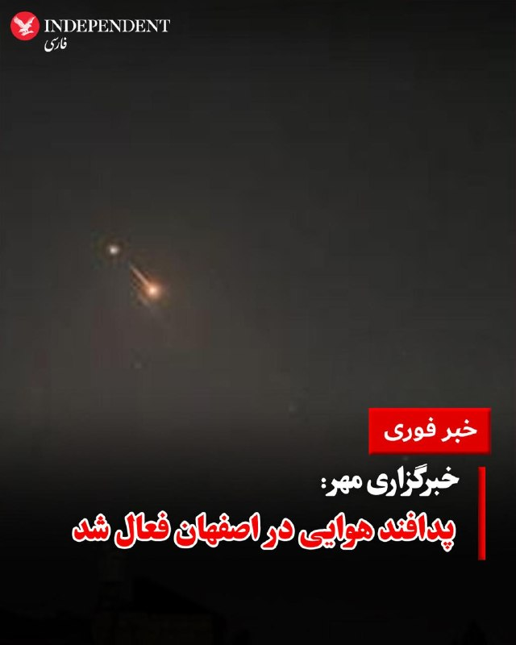

♦️خبرگزاری مهر دوشنبه شب ۲۸ اردیبهشت از فعال شدن پدافند هوایی در اصفهان خبر داد و اعلام کرد تا زمان انتشار این خبر، توضیحی درباره علت آن ارائه نشده است.
هم‌زمان، معاون سیاسی و امنیتی استاندار هرمزگان نیز فعال شدن پدافند هوایی در جزیره قشم را تایید کرد و گفت این اقدام پس از مشاهده «ریزپرنده‌ها» در آسمان قشم و برای مقابله با «اهداف متخاصم» انجام شده است.
‌🇸🇦 Indypersian

🤖 @VahidOOnLine

## VahidOOnLine — post 240863

  

رسانه‌های ایران شامگاه دوشنبه از فعال شدن پدافند هوایی در اصفهان خبر دادند.

تا زمان انتشار این خبر توضیحی درباره علت فعال شدن پدافند ارائه نشده است.
پیش‌تر خبرگزاری تسنیم نوشت: «پس از مشاهده ریزپرنده‌ها در آسمان جزیره قشم، پدافند برای نابودی اهداف متخاصم فعال شد.»
‌🏁 🇬🇧 IranintlTV

🤖 @VahidOOnLine

## VahidOOnLine — post 240862

  

آنا کلی، معاون سخنگوی کاخ سفید، در گفت‌وگو با فاکس نیوز اعلام کرد که جمهوری اسلامی اجازه نخواهد داشت اورانیوم غنی‌شده در اختیار داشته باشد و این موضوع خط قرمز دونالد ترامپ در مذاکرات است.

او گفت: «تهران نه‌تنها نباید به سلاح هسته‌ای دست پیدا کند، بلکه باید مواد غنی‌شده را نیز تحویل دهد.»

کلی افزود که ترامپ معتقد است جمهوری اسلامی به‌خوبی می‌داند که او در تهدیدهایش بلوف نمی‌زند و عملیات‌های اخیر نشان داده واشینگتن در اجرای تهدیدات خود جدی است.
‌🏁 🇬🇧 IranintlTV

🤖 @VahidOOnLine

## VahidOOnLine — post 240861

  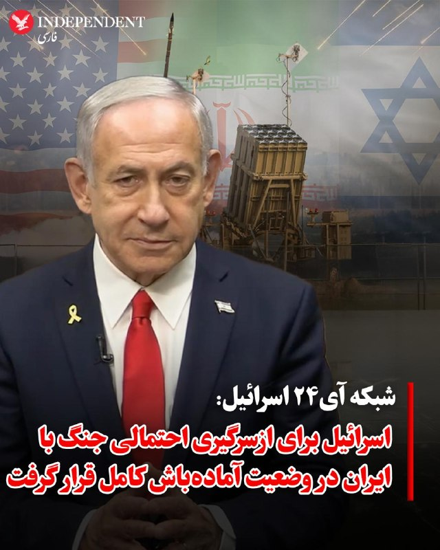

♦️شبکه خبری آی۲۴نیوز گزارش داد بنیامین نتانیاهو، نخست‌وزیر اسرائیل، روز دوشنبه ۲۸ اردیبهشت، دومین جلسه محدود کابینه امنیتی خود را ظرف ۲۴ ساعت گذشته برگزار کرده است. مقامات اسرائیلی با اشاره به وضعیت «آماده‌باش کامل» اعلام کرده‌اند که کشور خود را برای تصمیم احتمالی رئیس‌جمهوری دونالد ترامپ درباره گام‌های بعدی در قبال تهران و احتمال ازسرگیری جنگ با ایران تا پایان هفته جاری آماده می‌کنند.
این نشست‌های فشرده پی‌درپی پس از گفتگوهای تلفنی ۳۰ دقیقه‌ای روز یکشنبه نتانیاهو و ترامپ صورت می‌گیرد. بر اساس گزارش منابع آگاه، ترامپ در این تماس نخست‌وزیر اسرائیل را در جریان جزئیات سفر اخیر خود به چین قرار داده، اما این گفتگو به راه‌حل مشخصی برای مسیر پیش‌رو منجر نشده است؛ با این حال، هماهنگی‌های فشرده میان اورشلیم و واشنگتن برای تمامی سناریوهای ممکن در آستانه آنچه مقامات آن را «لحظه حقیقت» می‌نامند، ادامه دارد.
‌🇸🇦 Indypersian

🤖 @VahidOOnLine

## VahidOOnLine — post 240859

  <a href="telegram/content/VahidOOnLine_240859_1779137469.mp4" target="_blank">🎬 Download video</a>

دونالد ترامپ، رئیس‌جمهوری آمریکا، در پیامی در شبکه اجتماعی تروث سوشال نوشت:

««امیر قطر، تمیم بن حمد آل ثانی، ولیعهد عربستان سعودی، محمد بن سلمان آل سعود، و رئیس امارات متحده عربی، محمد بن زاید آل نهیان، از من خواسته‌اند حمله نظامی برنامه‌ریزی‌شده‌مان علیه جمهوری اسلامی ایران را که قرار بود فردا انجام شود، متوقف کنم؛ زیرا اکنون مذاکرات جدی در جریان است و به اعتقاد آن‌ها، به‌عنوان رهبران بزرگ و متحدان ما، توافقی حاصل خواهد شد که برای ایالات متحده آمریکا، همه کشورهای خاورمیانه و فراتر از آن بسیار قابل قبول خواهد بود.

این توافق، مهم‌تر از همه، شامل این خواهد بود که ایران هیچ سلاح هسته‌ای نداشته باشد!

بر اساس احترامم به رهبران یادشده، به وزیر جنگ، پیت هگست، رئیس ستاد مشترک نیروهای مسلح، ژنرال دنیل کین، و ارتش ایالات متحده دستور داده‌ام که حمله برنامه‌ریزی‌شده به ایران را فردا انجام ندهند؛ اما همزمان به آن‌ها دستور داده‌ام در صورتی که توافق قابل قبولی حاصل نشود، برای اجرای یک حمله کامل و گسترده علیه ایران، در هر لحظه آماده باشند.»
‌🏁 🇬🇧 ManotoTV

🤖 @VahidOOnLine

## VahidOOnLine — post 240858

  <a href="telegram/content/VahidOOnLine_240858_1779137470.mp4" target="_blank">🎬 Download video</a>

‌
خبرگزاری‌های داخل ایران گزارش دادند پدافند هوایی قشم شامگاه دوشنبه فعال شده است. مقام‌های جمهوری اسلامی توضیحی درباره علت فعالیت پدافند هوایی در این جزیره ارائه نکرده‌اند.
‌🏁 🇬🇧 ManotoTV

🤖 @VahidOOnLine

## VahidOOnLine — post 240855

  <a href="telegram/content/VahidOOnLine_240855_1779137470.mp4" target="_blank">🎬 Download video</a>

تجمع ایرانیان در لیسبون مقابل سفارت نروژ؛ اعتراض به دیدار سیاستمداران نروژی با جمهوری اسلامی
‌🏁 🇬🇧 ManotoTV

🤖 @VahidOOnLine

## VahidOOnLine — post 240854

  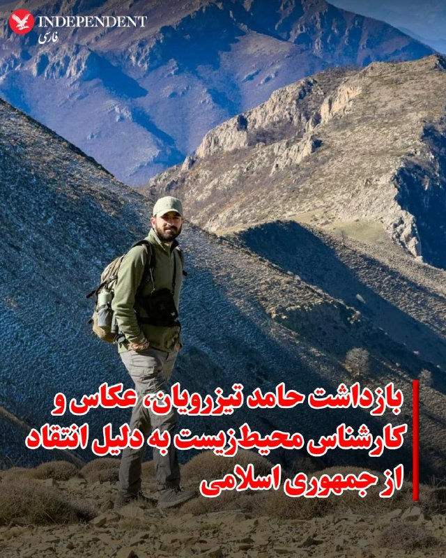

♦️اطرافیان حامد تیزرویان، عکاس و کارشناس محیط‌زیست اهل مازندران، به ایندیپندنت فارسی خبر دادند که او از ۱۴ اردیبهشت‌ماه به دست ماموران اداره اطلاعات ساری بازداشت شده و از آن زمان در زندان این شهر نگهداری می‌شود.

بر اساس اطلاعات رسیده به ایندیپندنت فارسی، انتقادهای حامد تیزرویان در صفحه اینستاگرامش از مقام‌های جمهوری اسلامی، به‌ویژه در ارتباط با سرکوب و کشتار تاریخی معترضان در جریان انقلاب ملی ایرانیان، دلیل اصلی بازداشت او بوده است. به گفته منابع مطلع، در جلسه بازپرسی نیز اتهام «اجتماع و تبانی علیه امنیت ملی» به او تفهیم شده است.

حامد تیزرویان دانشجوی مقطع دکتری مهندسی محیط‌زیست با گرایش تنوع زیستی در دانشگاه بهشتی تهران است و در سال‌های اخیر نقش مهمی در راه‌اندازی و پیشبرد کمپین‌های اجتماعی برای حفاظت از جنگل‌های هیرکانی مازندران و حیات‌وحش این منطقه ایفا کرده است.
‌🇸🇦 Indypersian

🤖 @VahidOOnLine

## VahidOOnLine — post 240853

  

♦️خبرگزاری تسنیم وابسته به سپاه پاسداران، روز دوشنبه ۲۸ اردیبهشت‌ماه به نقل از «یک منبع نزدیک به تیم مذاکره‌کننده» جمهوری اسلامی گزارش داد با وجود برخی تغییرات در متن جدید پیشنهادی آمریکا، اختلافات اساسی میان دو طرف همچنان پابرجاست و «زیاده‌خواهی و عدم واقع‌بینی آمریکایی‌ها» ادامه دارد.

این منبع به خبرگزاری تسنیم گفت آمریکا تلاش می‌کند مذاکرات مربوط به پایان جنگ را به موضوع هسته‌ای گره بزند، اما ایران با این موضوع موافق نیست و «پایان جنگ در برابر تعهدات هسته‌ای» را نخواهد پذیرفت.
به ادعای این منبع، واشنگتن پیشنهادهایی چون «ایجاد صندوق توسعه و بازسازی» را مطرح کرده است، اما جمهوری اسلامی همچنین بر پرداخت غرامت از سوی آمریکا تاکید دارد.
تسنیم به نقل از منبع خود تاکید کرد جمهوری اسلامی از مواضع خود درباره پایان جنگ و بازگرداندن اموال بلوکه‌شده ایران عقب‌نشینی نخواهد کرد و افزود وعده‌های کاغذی برای تهران کافی نیست. او گفت با وجود برخی وعده‌ها، اختلاف درباره نحوه بازگشت پول‌های بلوکه‌شده همچنان وجود دارد.
‌🇸🇦 Indypersian

🤖 @VahidOOnLine

## VahidOOnLine — post 240852

  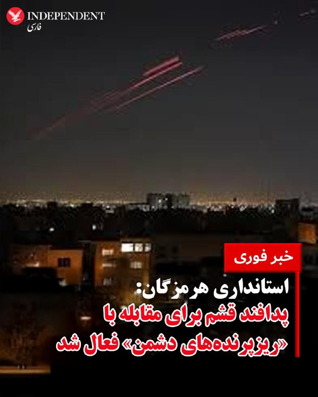

♦️معاون سیاسی، امنیتی و اجتماعی استاندار هرمزگان، دوشنبه‌شب ۲۸ اردیبهشت‌ماه فعال شدن پدافند هوایی در جزیره قشم را تایید کرد و گفت این اقدام در راستای مقابله با «ریزپرنده‌های دشمن» انجام شده است.

به گزارش خبرگزاری مهر، احمد نفیسی گفت صدایی که ساعاتی پیش در جزیره قشم شنیده شد، ناشی از فعال شدن سامانه‌های پدافندی و درگیری با ریزپرنده‌ها بوده است.

او با تاکید بر آمادگی کامل نیروهای مسلح، افزود وضعیت تحت کنترل است و شرایط جزیره قشم «کاملا پایدار» است.

پیشتر خبرگزاری تسنیم وابسته به سپاه پاسداران گزارش داده بود پدافند هوایی در جزیره قشم پس از مشاهده ریزپرنده‌ها در آسمان این منطقه فعال شده و برای مقابله با «اهداف متخاصم» وارد عمل شده است.
‌🇸🇦 Indypersian

🤖 @VahidOOnLine

## VahidOOnLine — post 240851

  

رسانه‌های ایران شامگاه دوشنبه از فعال شدن پدافند هوایی در جزیره قشم خبر دادند.

خبرگزاری تسنیم، وابسته به سپاه پاسداران، نوشت: «پس از مشاهده ریزپرنده‌ها در آسمان جزیره قشم، پدافند برای نابودی اهداف متخاصم فعال شد.»
‌🏁 🇬🇧 IranintlTV

🤖 @VahidOOnLine

## VahidOOnLine — post 240850

  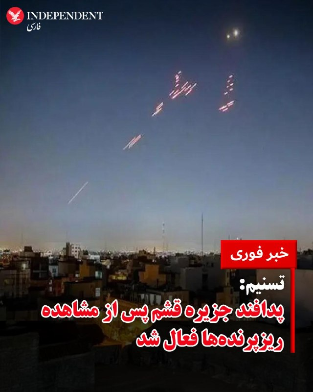

♦️خبرگزاری تسنیم وابسته به سپاه پاسداران، دوشنبه‌شب ۲۸ اردیبهشت‌ماه گزارش داد پدافند هوایی در جزیره قشم پس از مشاهده ریزپرنده‌ها در آسمان این منطقه فعال شده است.
بر اساس این گزارش، منابع مطلع به خبرنگار تسنیم گفته‌اند پدافند در جهت مقابله و نابودی «اهداف متخاصم» وارد عمل شده است.
‌🇸🇦 Indypersian

🤖 @VahidOOnLine

## VahidOOnLine — post 240849

  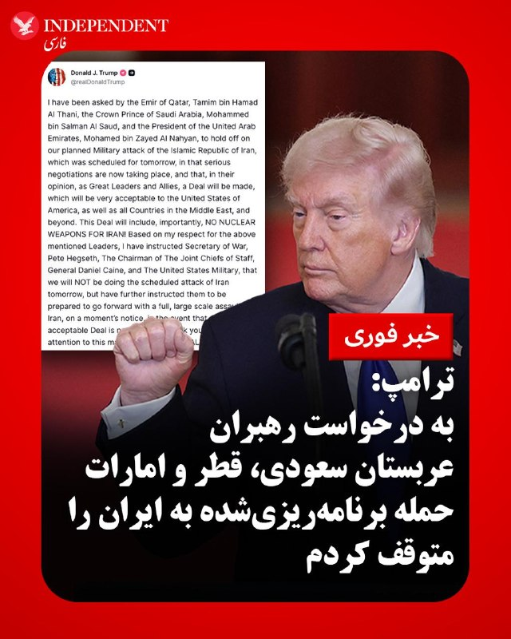

♦️دونالد ترامپ، رئیس‌جمهوری آمریکا، شامگاه دوشنبه ۲۸ اردیبهشت ماه اعلام کرد به درخواست تمیم بن حمد آل ثانی، امیر قطر، محمد بن سلمان، ولیعهد عربستان سعودی، و محمد بن زاید آل نهیان، رئیس امارات متحده عربی، حمله نظامی برنامه‌ریزی‌شده آمریکا علیه جمهوری اسلامی ایران که قرار بود روز سه‌شنبه انجام شود را متوقف کرده است.
ترامپ در پیامی در شبکه اجتماعی تروث سوشال نوشت رهبران قطر، عربستان و امارات از او خواسته‌اند این عملیات را متوقف کند، زیرا مذاکراتی «جدی» در حال انجام است و به اعتقاد آن‌ها توافقی حاصل خواهد شد که نه‌تنها برای ایالات متحده، بلکه برای کشورهای خاورمیانه و دیگر کشورها نیز قابل قبول خواهد بود.
رئیس‌جمهوری آمریکا تاکید کرد این توافق، به‌ویژه شامل این اصل خواهد بود که «ایران نباید به سلاح هسته‌ای دست پیدا کند.»
ترامپ نوشت با توجه به احترامی که برای این رهبران قائل است، به پیت هگست، وزیر جنگ آمریکا، ژنرال دنیل کین، رئیس ستاد مشترک ارتش، و نیروهای نظامی آمریکا دستور داده حمله برنامه‌ریزی‌شده علیه ایران در روز آینده انجام نشود.
او در عین حال هشدار داد به مقام‌های نظامی آمریکا دستور داده است در صورتی که توافقی «قابل قبول» حاصل نشود، برای اجرای یک حمله کامل و گسترده علیه ایران در هر لحظه آماده باشند.
ترامپ در پایان پیام خود تاکید کرد نیروهای آمریکایی باید بتوانند «در کمترین زمان ممکن» عملیات احتمالی را آغاز کنند.
‌🇸🇦 Indypersian

🤖 @VahidOOnLine

## VahidOOnLine — post 240848

  

دونالد ترامپ اعلام کرد به درخواست رهبران قطر، عربستان سعودی و امارات متحده عربی، حمله نظامی برنامه‌ریزی‌شده آمریکا به جمهوری اسلامی را که قرار بود روز سه‌شنبه انجام شود، متوقف کرده است.
او گفت در صورت عدم دستیابی به توافقی قابل قبول، آمریکا آماده اجرای حمله گسترده خواهد بود.

ترامپ گفت مذاکرات جدی در حال انجام است و رهبران این کشورها، به‌عنوان متحدان، معتقدند توافقی حاصل خواهد شد که برای آمریکا و همچنین همه کشورهای خاورمیانه و فراتر از آن بسیار قابل قبول خواهد بود. این توافق، به‌طور مهم، شامل «نبود سلاح هسته‌ای برای ایران» خواهد بود.

رییس‌جمهور آمریکا اضافه کرد: به وزیر جنگ، رییس ستاد مشترک ارتش و ارتش ایالات متحده دستور داده‌ام که حمله برنامه‌ریزی‌شده فردا به ایران انجام نخواهد شد، اما همچنین به آن‌ها دستور داده‌ام در صورتی که توافق قابل قبولی حاصل نشود، برای اجرای یک حمله گسترده و تمام‌عیار علیه ایران در کوتاه‌ترین زمان ممکن آماده باشند.
‌🏁 🇬🇧 IranintlTV

🤖 @VahidOOnLine

## mwarmonitor — post 9279

فعل شدن پدافند هوایی در اصفهان

## mwarmonitor — post 9278

  

✈️🇵🇰 هواپیمای A319 نیروی هوایی پاکستان (A-1102) که وزیر کشور پاکستان را حمل می‌کرد – وی در یک سفر رسمی دو روزه برای بررسی روابط دوجانبه و گفت‌وگوها با آمریکا به سر می‌برد – از مشهد خارج شد.

@mwarmonitor

## mwarmonitor — post 9277

📝 «نظر من را می‌پرسید؟ حمله انجام خواهد شد.»

## mwarmonitor — post 9276

🔴ترامپ می‌گوید طرح حمله به ایران را به تعویق انداخته است

📝نویسنده: باراک راوید AXIOS

🔰پرزیدنت ترامپ روز دوشنبه اعلام کرد که قصد داشته «فردا» به ایران حمله کند، اما این اقدام را به تعویق انداخته تا فرصت دیگری به مذاکرات بدهد. او ادعا کرد که این تصمیم را به درخواست چند تن از رهبران کشورهای عربی گرفته است.

🔸چرا این موضوع اهمیت دارد؟
کاخ سفید پیشنهاد صلح به‌روزرسانی‌شده‌ای را که ایران روز یکشنبه ارسال کرده بود، «ناکافی» دانست؛ موضوعی که منجر به شکل‌گیری این انتظار فزاینده — حتی در داخل کاخ سفید — شد که ترامپ در آستانه حمله قرار دارد.
ترامپ از زمان آغاز جنگ، تاکنون حداقل شش بار ضرب‌الاجل‌ها را تمدید کرده و حملات برنامه‌ریزی‌شده علیه ایران را به تعویق انداخته است.

🔸دو مقام آمریکایی به اکسیوس گفتند که انتظار می‌رفت ترامپ روز سه‌شنبه تیم امنیت ملی خود را در «اتاق وضعیت» (Situation Room) برای بررسی گزینه‌های نظامی گرد هم آورد.

🔸یک مقام ارشد آمریکایی صبح دوشنبه به اکسیوس گفت اگر ایران موضع خود را تغییر ندهد، ایالات متحده ناچار خواهد بود مذاکرات را «از طریق بمب‌ها» ادامه دهد.

📌اظهارات ترامپ
ترامپ در شبکه اجتماعی «تروث سوشال» (Truth Social) نوشت: «امیر قطر، ولیعهد عربستان سعودی و رئیس امارات متحده عربی از من خواسته‌اند که حمله نظامی برنامه‌ریزی‌شده‌مان علیه جمهوری اسلامی ایران را که برای فردا برنامه‌ریزی شده بود، به تعویق بیندازم.»
او اضافه کرد که رهبران عرب به او گفته‌اند «مذاکرات جدی در حال انجام است و به نظر آن‌ها، به عنوان رهبران و متحدانی بزرگ، توافقی حاصل خواهد شد که برای ایالات متحده آمریکا و همچنین همه کشورهای خاورمیانه و فراتر از آن بسیار قابل قبول خواهد بود.»
ترامپ ادعا کرد که این توافق تضمین خواهد کرد ایران به تسلیحات هسته‌ای دست پیدا نکند.

🔸او از زمان آغاز جنگ بارها ادعاهایی درباره پیشرفت به سوی توافق مطرح کرده، اما اخیراً هیچ گشایش (تحول) خاصی رخ نداده است.

🔹مواردی که باید زیر نظر داشت
رئیس‌جمهور آمریکا گفت که به پیت هگست (وزیر دفاع) و ژنرال دن کین (رئیس ستاد مشترک ارتش) دستور داده است که طرح‌های حمله را به حالت تعلیق درآورند، اما برای اجرای یک «حمله همه‌جانبه و گسترده به ایران، در کوتاه‌ترین زمان ممکن، در صورت عدم دست‌یابی به یک توافق قابل قبول» آماده باشند.

@mwarmonitor

## mwarmonitor — post 9275

حمله پهپادی به سلیمانیه عراق

## mwarmonitor — post 9274

🚨🚨🚨 ترامپ در شبکه اجتماعی Truth Social: از من توسط امیر قطر، تمیم بن حمد آل ثانی، ولیعهد عربستان سعودی، محمد بن سلمان آل سعود، و رئیس‌جمهور امارات متحده عربی، محمد بن زاید آل نهیان، درخواست شده است که حمله نظامی برنامه‌ریزی‌شده ما به جمهوری اسلامی ایران را…

## pm_afshaa — post 90995

  <a href="telegram/content/pm_afshaa_90995_1779137475.webm" target="_blank">🎬 Download video</a>

🔴ترامپ: مذاکرات جدی در حال حاضر برای دستیابی به توافق با ایران در جریانه.

💧 Rainbet.com the #1 Non-KYC Crypto Casino & Sportsbook @rainbetcom

😁 @Pm_Afshaa

## pm_afshaa — post 90994

فعالیت پدافند در اصفهان

💧 Rainbet.com the #1 Non-KYC Crypto Casino & Sportsbook @rainbetcom

😁 @Pm_Afshaa

## pm_afshaa — post 90993

🔴خبرنگار آکسیوس:ترامپ از زمان شروع جنگ حداقل 12 بار ضرب الاجل ها را تمدید کرده و حملات برنامه ریزی شده به ایران را به تعویق انداخته

💧 Rainbet.com the #1 Non-KYC Crypto Casino & Sportsbook @rainbetcom

😁 @Pm_Afshaa

## pm_afshaa — post 90991

🔴ترامپ: قرار بود فردا به ایران حمله کنیم، ولی رهبران قطر، عربستان و امارات ازم خواستن فعلاً متوقفش کنیم چون مذاکرات جدی در جریانه. به ارتش دستور دادم حمله فعلاً انجام نشه، ولی اگه توافق نرسیم، هر لحظه آماده حمله کامل به ایران باشن. از سمت رهبران قطر، عربستان…

## pm_afshaa — post 90990

🔴ترامپ: قرار بود فردا به ایران حمله کنیم، ولی رهبران قطر، عربستان و امارات ازم خواستن فعلاً متوقفش کنیم چون مذاکرات جدی در جریانه. به ارتش دستور دادم حمله فعلاً انجام نشه، ولی اگه توافق نرسیم، هر لحظه آماده حمله کامل به ایران باشن. از سمت رهبران قطر، عربستان…

## pm_afshaa — post 90989

  

نظامی‌نویس‌های انگلیس میگن خبری تو راهه :

💧 Rainbet.com the #1 Non-KYC Crypto Casino & Sportsbook @rainbetcom

😁 @Pm_Afshaa

## pm_afshaa — post 90987

  <a href="telegram/content/pm_afshaa_90987_1779137476.webm" target="_blank">🎬 Download video</a>

🔴خبرگزاری تسنیم: فعالیت پدافند دقایقی پیش در قشم به دلیل مقابله با ریز پرنده های آمریکایی بوده!

💧 Rainbet.com the #1 Non-KYC Crypto Casino & Sportsbook @rainbetcom

😁 @Pm_Afshaa

## pm_afshaa — post 90986

🔴ترکیه هم به جمهوری اسلامی پشت کرد

هاکان فیدان وزیر امور خارجه ترکیه:
اورانیوم غنی شده ایران باید خارج شود یا به صورت سه و نیم درصدی تغییر داده شود

💧 Rainbet.com the #1 Non-KYC Crypto Casino & Sportsbook @rainbetcom

😁 @Pm_Afshaa

## pm_afshaa — post 90985

🔴خبرآنلاین: برخی شواهد نشان می‌دهد کشورهای عربی در کنار ترامپ در حال لابی گسترده علیه جمهوری اسلامی در چین هستن

💧 Rainbet.com the #1 Non-KYC Crypto Casino & Sportsbook @rainbetcom

😁 @Pm_Afshaa

## pm_afshaa — post 90984

  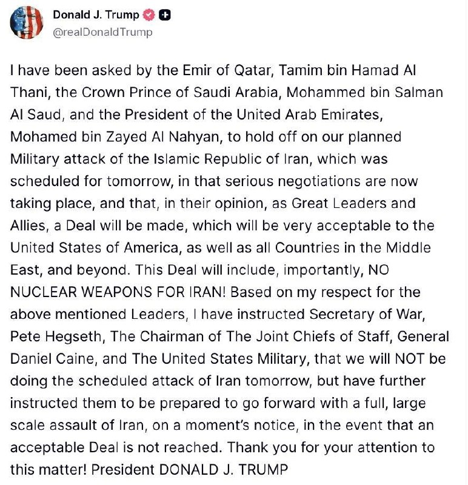

🔴ترامپ: قرار بود فردا به ایران حمله کنیم، ولی رهبران قطر، عربستان و امارات ازم خواستن فعلاً متوقفش کنیم چون مذاکرات جدی در جریانه.

به ارتش دستور دادم حمله فعلاً انجام نشه، ولی اگه توافق نرسیم، هر لحظه آماده حمله کامل به ایران باشن.

از سمت رهبران قطر، عربستان و امارات از من خواسته شد که حمله نظامی برنامه‌ریزی‌ شده‌مون علیه جمهوری اسلامی ایران رو که قرار بود فردا انجام بشه، متوقف کنم؛ چون مذاکرات جدی اکنون در حال انجامه! متحدان ما معتقدن توافقی حاصل خواهد شد که واسه ایالات متحده آمریکا، همه کشورهای خاورمیانه و فراتر از اون، بسیار قابل‌قبول خواهد بود. این توافق، مهم‌تر از همه، شامل این خواهد بود که ایران هیچ سلاح هسته‌ای نداشته باشه.
بخاطر احترامی که واسه رهبران یادشده قائلم، به وزیر جنگ، پیت هگست، رئیس ستاد مشترک ارتش، دنیل کین، و ارتش ایالات متحده دستور دادم که حمله برنامه‌ریزی‌شده به ایران رو فردا انجام ندن. ولی بهشون دستور دادم که در صورت نرسیدن به یه توافق قابل‌قبول، آماده اجرای یه حمله کامل و گسترده علیه ایران، در هر لحظه و بدون هیچ تأخیری باشن...

💧Rainbet.com the #1 Non-KYC Crypto Casino & Sportsbook @rainbetcom

😁 @Pm_Afshaa

## VahidOnline — post 75546

  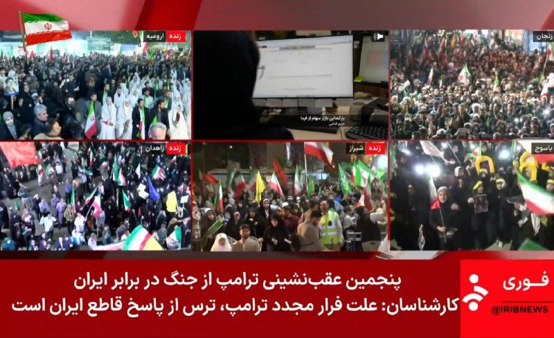

زیرنویس شبکه خبر صدا و سیمای جمهوری اسلامی

📡 @VahidOnline

## kianmeli1 — post 87474

🔴پدافند هوایی اصفهان شامگاه دوشنبه فعال شد و علت آن هنوز اعلام نشده است.
https://t.me/kianmeli1

## kianmeli1 — post 87473

  <a href="telegram/content/kianmeli1_87473_1779137478.mp4" target="_blank">🎬 Download video</a>

🔴به نظر می رسد امشب امارات حملاتی به قشم داشته است

طرفداران حکومت به خیابان آمده اند شعار مرگ بر امارات سر میدهند
https://t.me/kianmeli1

## kianmeli1 — post 87472

  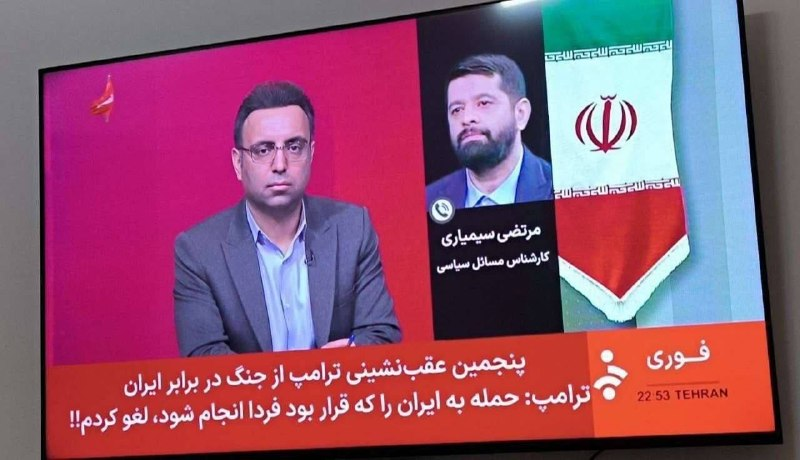

🔴زیرنویس تلویزیون جمهوری اسلامی

ترامپ برای پنجمین بار عقب نشینی کرد
https://t.me/kianmeli1

## kianmeli1 — post 87471

‏🔴خضریان: بسیاری از مسئولان ارشد نظام معتقدند که باید در برابر محاصره دریایی آمریکا، پاسخ نظامی داده شود

‏علی خضریان: آمریکا در وضعیت ضعف نظامی قرار دارد
https://t.me/kianmeli1

## kianmeli1 — post 87470

‏🔴روداو به نقل از عضو رهبری کومله زحمتکشان کردستان ایران اعلام کرد که اردوگاه «سورداش» در سلیمانیه با چهار موشک هدف حمله قرار گرفت و در پی آن دو نفر زخمی شدند
https://t.me/kianmeli1

## kianmeli1 — post 87469

‏🔴آنا کلی، معاون سخنگوی کاخ سفید، در گفت‌وگو با فاکس نیوز اعلام کرد جمهوری اسلامی اجازه نخواهد داشت اورانیوم غنی‌شده در اختیار داشته باشد و این موضوع خط قرمز دونالد ترامپ در مذاکرات است. تهران نه‌تنها نباید به سلاح هسته‌ای دست پیدا کند، بلکه باید مواد غنی‌شده را نیز تحویل دهد
https://t.me/kianmeli1

## kianmeli1 — post 87468

  <a href="telegram/content/kianmeli1_87468_1779137480.mp4" target="_blank">🎬 Download video</a>

🔴رزمایش مسلحانه زنان بسیجی در ارومیه

این کلیپ را اپوزسیون ببیند که بدون «سازماندهی سراسری مسلحانه» نمیشود یک کوچه در ایران را آزاد کرد٫ با مبارزه مدنی گاندی و ماندلا فقط کشتار بیشمار بر دستمان می ماند

جمهوری اسلامی سالهاست می گوید اگر میخواهید ایران را پس بگیرید٫ باید ابتدا از روی جنازه ما عبور کنید
https://t.me/kianmeli1

## IranIntlTV — post 337838

  

عبدالقهار بلخی، سخنگوی وزارت خارجه طالبان، حملات پهپادی اخیر به «تاسیسات غیرنظامی» در امارات متحده عربی، به ویژه به نیروگاه هسته‌ای براکه را محکوم کرد.

او در شبکه اجتماعی ایکس نوشت که طالبان «نگرانی عمیق خود را از تشدید خشونت در منطقه ابراز می‌کند.»
https://iranintl.com/202605183828

## IranIntlTV — post 337837

  

رسانه‌های ایران شامگاه دوشنبه از فعال شدن پدافند هوایی در اصفهان خبر دادند.

تا زمان انتشار این خبر توضیحی درباره علت فعال شدن پدافند ارائه نشده است.
پیش‌تر خبرگزاری تسنیم نوشت: «پس از مشاهده ریزپرنده‌ها در آسمان جزیره قشم، پدافند برای نابودی اهداف متخاصم فعال شد.»
https://iranintl.com/202605188482

## IranIntlTV — post 337836

  <a href="telegram/content/IranIntlTV_337836_1779137482.mp4" target="_blank">🎬 Download video</a>

مستند «تمرین‌هایی برای یک انقلاب» ساخته پگاه آهنگرانی در حاشیه جشنواره فیلم کن، جایزه ویژه هیات داوران رویداد مستند گلدن گلوبز را دریافت کرد.

این رویداد با همکاری بخش کن داکس، مجله ورایتی و بازار فیلم کن برگزار می‌شود.

گفت‌وگو با محمد عبدی، نویسنده و منتقد فیلم
@iranintltv

## IranIntlTV — post 337835

  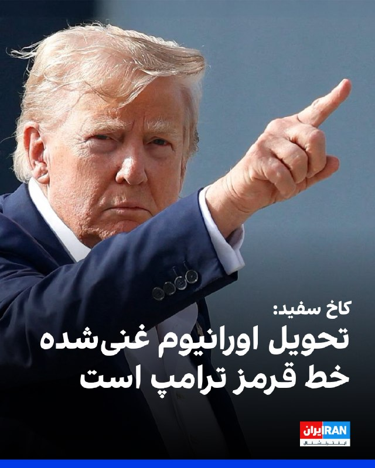

آنا کلی، معاون سخنگوی کاخ سفید، در گفت‌وگو با فاکس نیوز اعلام کرد که جمهوری اسلامی اجازه نخواهد داشت اورانیوم غنی‌شده در اختیار داشته باشد و این موضوع خط قرمز دونالد ترامپ در مذاکرات است.

او گفت: «تهران نه‌تنها نباید به سلاح هسته‌ای دست پیدا کند، بلکه باید مواد غنی‌شده را نیز تحویل دهد.»

کلی افزود که ترامپ معتقد است جمهوری اسلامی به‌خوبی می‌داند که او در تهدیدهایش بلوف نمی‌زند و عملیات‌های اخیر نشان داده واشینگتن در اجرای تهدیدات خود جدی است.
https://iranintl.com/202605188107

## IranIntlTV — post 337834

  <a href="telegram/content/IranIntlTV_337834_1779137485.mp4" target="_blank">🎬 Download video</a>

دونالد ترامپ، رییس‌جمهوری آمریکا، در تروث سوشال نوشت حمله علیه جمهوری اسلامی که برای سه‌شنبه (۲۹ اردیبهشت) برنامه‌ریزی شده بود، فعلا انجام نخواهد شد.
او همچنین نوشت که رهبران قطر، عربستان سعودی و امارات از آمریکا خواسته‌اند فعلا از اجرای عملیات نظامی علیه جمهوری اسلامی خودداری کند.

گفت‌وگو با شهرام خلدی، پژوهشگر تاریخ خاورمیانه و روابط بین‌الملل و روح‌الله رحیم‌پور، روزنامه‌نگار و تحلیل‌گر سیاسی
@iranintltv

## IranIntlTV — post 337833

  <a href="telegram/content/IranIntlTV_337833_1779137487.mp4" target="_blank">🎬 Download video</a>

دونالد ترامپ، رییس‌جمهوری آمریکا، در تروث سوشال نوشت حمله علیه جمهوری اسلامی که برای سه‌شنبه (۲۹ اردیبهشت) برنامه‌ریزی شده بود، فعلا انجام نخواهد شد.
او همچنین نوشت که رهبران قطر، عربستان سعودی و امارات از آمریکا خواسته‌اند فعلا از اجرای عملیات نظامی علیه جمهوری اسلامی خودداری کند.

گفت‌وگو با شهرام خلدی، پژوهشگر تاریخ خاورمیانه و روابط بین‌الملل و روح‌الله رحیم‌پور، روزنامه‌نگار و تحلیل‌گر سیاسی
@iranintltv

## IranIntlTV — post 337832

  <a href="https://t.me/IranintlTV/337832" target="_blank">📎 Download file</a>

🎧نسخه صوتی ‌‌‏۲۴ با فرداد فرحزاد: احتمال از سرگیری جنگ؛ ترامپ: تهران می‌داند چه اتفاقی می‌افتد
@iranintlTV

## IranIntlTV — post 337831

  <a href="https://t.me/IranintlTV/337831" target="_blank">📎 Download file</a>

🎧نسخه صوتی دومینو: اتحاد ارتش‌های مجهز در برابر اقتصادی ورشکسته
@iranintlTV

## IranIntlTV — post 337830

  <a href="telegram/content/IranIntlTV_337830_1779137489.mp4" target="_blank">🎬 Download video</a>

وای‌نت گزارش داد بنیامین نتانیاهو پس از پاسخ جمهوری اسلامی به پیشنهاد آمریکا، نشست امنیتی با حضور وزیران و مشاوران ارشد برگزار می‌کند.

دونالد ترامپ نیز در تماس با نتانیاهو گفته زمان برای جمهوری اسلامی رو به پایان است.

گفت‌وگو با گابریل گرویسمن، استراتژیست حزب جمهوری‌خواه
@iranintltv

## IranIntlTV — post 337829

  <a href="telegram/content/IranIntlTV_337829_1779137491.mp4" target="_blank">🎬 Download video</a>

مصطفی دانشگر، تحلیل‌گر سیاسی، گفت طرح مطلوب آمریکا برای جمهوری اسلامی، مدل ونزوئلا است. او افزود تصور دونالد ترامپ و ایالات متحده این است که پس از حذف و کنار زدن برخی مقام‌های جمهوری اسلامی در جریان جنگ اخیر، اکنون می‌توانند فردی را در درون ساختار حکومت پیدا کنند.
@iranintltv

## IranIntlTV — post 337828

  

رسانه‌های ایران شامگاه دوشنبه از فعال شدن پدافند هوایی در جزیره قشم خبر دادند.

خبرگزاری تسنیم، وابسته به سپاه پاسداران، نوشت: «پس از مشاهده ریزپرنده‌ها در آسمان جزیره قشم، پدافند برای نابودی اهداف متخاصم فعال شد.»
https://iranintl.com/202605184408

## Shin_Persian — post 6078

  

Shin ✓ @hey_itsmyturn
Mon, 18 May 2026 20:34:12 UTC

MehrNews confirms

فارسی

خبرگزاری مهر تأیید کرد

𝕏 · @shin_persian

## Shin_Persian — post 6077

Shin ✓ @hey_itsmyturn
Mon, 18 May 2026 20:31:15 UTC

AA activity in Isfahan right now
Isfahan Province, #Iran

فارسی

فعالیت پدافند هوایی همین الان در اصفهان
استان اصفهان، #Iran_

𝕏 · @shin_persian

## Shin_Persian — post 6074

  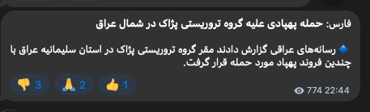

Shin ✓ @hey_itsmyturn
Mon, 18 May 2026 19:49:16 UTC

IRGC-owned Fars News claims UAV strikes on Pezhak (PJAK) "base" in Sulaymaniyah governorate of #Iraq 🇮🇶
#KRI

فارسی

خبرگزاری فارس وابسته به سپاه پاسداران (IRGC) مدعی حملات پهپادی به «پایگاه» پژاک (PJAK) در استان سلیمانیه #Iraq 🇮🇶 شد.
#KRI

𝕏 · @shin_persian

## Shin_Persian — post 6073

Shin ✓ @hey_itsmyturn
Mon, 18 May 2026 19:37:36 UTC

Explosion(s) in Erbil, KRI, #Iraq 🇮🇶

فارسی

انفجار(ها) در اربیل، اقلیم کردستان عراق، #Iraq 🇮🇶

𝕏 · @shin_persian

## ManotoTV — post 105614

  <a href="telegram/content/ManotoTV_105614_1779137494.mp4" target="_blank">🎬 Download video</a>

«سکوت نکنیم، صدای فاطمه سپهری باشیم»

## ManotoTV — post 105613

  <a href="telegram/content/ManotoTV_105613_1779137495.mp4" target="_blank">🎬 Download video</a>

دونالد ترامپ، رئیس‌جمهوری آمریکا، در پیامی در شبکه اجتماعی تروث سوشال نوشت:

««امیر قطر، تمیم بن حمد آل ثانی، ولیعهد عربستان سعودی، محمد بن سلمان آل سعود، و رئیس امارات متحده عربی، محمد بن زاید آل نهیان، از من خواسته‌اند حمله نظامی برنامه‌ریزی‌شده‌مان علیه جمهوری اسلامی ایران را که قرار بود فردا انجام شود، متوقف کنم؛ زیرا اکنون مذاکرات جدی در جریان است و به اعتقاد آن‌ها، به‌عنوان رهبران بزرگ و متحدان ما، توافقی حاصل خواهد شد که برای ایالات متحده آمریکا، همه کشورهای خاورمیانه و فراتر از آن بسیار قابل قبول خواهد بود.

این توافق، مهم‌تر از همه، شامل این خواهد بود که ایران هیچ سلاح هسته‌ای نداشته باشد!

بر اساس احترامم به رهبران یادشده، به وزیر جنگ، پیت هگست، رئیس ستاد مشترک نیروهای مسلح، ژنرال دنیل کین، و ارتش ایالات متحده دستور داده‌ام که حمله برنامه‌ریزی‌شده به ایران را فردا انجام ندهند؛ اما همزمان به آن‌ها دستور داده‌ام در صورتی که توافق قابل قبولی حاصل نشود، برای اجرای یک حمله کامل و گسترده علیه ایران، در هر لحظه آماده باشند.»

## ManotoTV — post 105612

  <a href="telegram/content/ManotoTV_105612_1779137496.mp4" target="_blank">🎬 Download video</a>

‌
خبرگزاری‌های داخل ایران گزارش دادند پدافند هوایی قشم شامگاه دوشنبه فعال شده است. مقام‌های جمهوری اسلامی توضیحی درباره علت فعالیت پدافند هوایی در این جزیره ارائه نکرده‌اند.

## ManotoTV — post 105611

  <a href="telegram/content/ManotoTV_105611_1779137497.mp4" target="_blank">🎬 Download video</a>

«رشید مظاهری به خاطر بیان عقیده_اش در بازداشت است»

## ManotoTV — post 105610

  <a href="telegram/content/ManotoTV_105610_1779137498.mp4" target="_blank">🎬 Download video</a>

«صدای فاطمه سپهری باشیم»

## ManotoTV — post 105609

  <a href="telegram/content/ManotoTV_105609_1779137499.mp4" target="_blank">🎬 Download video</a>

تجمع ایرانیان در لیسبون مقابل سفارت نروژ؛ اعتراض به دیدار سیاستمداران نروژی با جمهوری اسلامی

## FarsiVOA — post 218092

  

⚡️یک دادگاه تحت کنترل شورشیان حوثی در یمن ۱۹ نفر را به اتهام همکاری با ائتلاف تحت رهبری عربستان به اعدام محکوم کرد. حوثی‌ها مورد حمایت جمهوری اسلامی هستند و ائتلاف تحت رهبری عربستان در حمایت از دولت قانونی یمن با حوثی‌ها در جنگ بود. به گزارش آسوشیتدپرس این حکم روز یکشنبه صادر شد.
@FarsiVOA

## FarsiVOA — post 218091

  <a href="telegram/content/FarsiVOA_218091_1779137501.mp4" target="_blank">🎬 Download video</a>

⚡️امید معماریان در برنامه تفسیر خبر: خطای محاسباتی بزرگ مقامات جمهوری اسلامی درباره ترامپ ممکن است باعث شروع دوباره جنگ شود
@FarsiVOA

## FarsiVOA — post 218090

  <a href="telegram/content/FarsiVOA_218090_1779137501.mp4" target="_blank">🎬 Download video</a>

⚡️فاطمه حقیقت‌جو در برنامه تفسیر خبر: مشروعیت جمهوری اسلامی از بین رفته‌است
@FarsiVOA

## FarsiVOA — post 218089

  <a href="telegram/content/FarsiVOA_218089_1779137502.mp4" target="_blank">🎬 Download video</a>

⚡️بهزاد احمدی نیا در برنامه تفسیر خبر: جمهوری اسلامی معیشت مردم را به گروگان خود گرفته است
@FarsiVOA

## FarsiVOA — post 218088

⚡️آموزش حکومتی کار با سلاح در تلویزیون و خیابان؛ بومرنگی علیه حاکمیت جمهوری اسلامی؟
@FarsiVOA

## FarsiVOA — post 218087

  

⚡️مقامات جمهوری اسلامی از فعال شدن ضدهوایی‌ها در جزیره قشم در روز دوشنبه خبر دادند. معاون سیاسی، امنیتی و اجتماعی استاندار هرمزگان، احمد نفیسی گفت فعالیت ضدهوایی‌ها برای مقابله با «ریزپرنده‌های دشمن» بود. او در اظهاراتی که خبرگزاری فارس، وابسته به سپاه منتشر کرد، از بیان اینکه آیا حملات ادعایی پهپادها خساراتی برجای گذاشته است یا خیر خودداری کرد.
@FarsiVOA

## FarsiVOA — post 218086

⚡️عفو بین‌الملل اعلام کرد جمهوری اسلامی دست‌کم دو هزار و ۱۵۹ نفر را در سال ۲۰۲۵ میلادی اعدام کرد ‌‌و عامل اصلی جهش آمار بود
@FarsiVOA

## FarsiVOA — post 218085

⚡️روز ارتباطات در سایه خاموشی دیجیتال؛ واکنش کاربران شبکه‌های اجتماعی
@FarsiVOA

## FarsiVOA — post 218084

⚡️علی جوانمردی: جمهوری اسلامی مسئول هرگونه اقدام نظامی در ایران است
@FarsiVOA

## FarsiVOA — post 218083

⚡️در برنامه تفسیر خبر امروز، مهدی آقازمانی با کارشناسان مهمان، درباره تاکید پرزیدنت ترامپ بر نیاز شدید حکومت ایران به دستیابی به توافق با آمریکا، گفته‌های سخنگوی وزارتخارجه جمهوری اسلامی درباره ادامه مذاکرات و هشتاد روزه شدن حصر دیجیتال مردم ایران توسط جمهوری اسلامی گفتگو می‌کند
@FarsiVOA

## FarsiVOA — post 218082

  

دونالد ترامپ، رئیس‌جمهوری آمریکا، روز دوشنبه اعلام کرد که حمله نظامی برنامه‌ریزی‌شده آمریکا علیه جمهوری اسلامی که قرار بود فردا انجام شود، به درخواست رهبران قطر، عربستان سعودی و امارات متحده عربی به تعویق افتاده است.

دونالد ترامپ در پیامی در شبکه تروت سوشال نوشت که امیر قطر، تمیم بن حمد آل ثانی، ولیعهد عربستان سعودی، محمد بن سلمان، و رئیس امارات متحده عربی، محمد بن زاید آل نهیان، از او خواسته‌اند که این حمله متوقف شود، زیرا به گفته او «مذاکرات جدی» در جریان است.

رئیس‌جمهوری آمریکا گفت این رهبران بر این باورند که «توافقی حاصل خواهد شد» که نه‌تنها برای ایالات متحده بلکه برای کشورهای منطقه نیز «بسیار قابل قبول» خواهد بود.

ترامپ همچنین تأکید کرد که این توافق شامل یک اصل کلیدی خواهد بود: «هیچ سلاح هسته‌ای برای حکومت ایران.»

او افزود که «بر اساس احترام» به رهبران یادشده، به پیت هگست، وزیر جنگ آمریکا، ژنرال دنیل کین رئیس ستاد مشترک نیروهای مسلح، و ارتش آمریکا دستور داده است که حمله برنامه‌ریزی‌شده انجام نشود.

https://ir.voanews.com/a/8151342.html

## DW_Farsi — post 124856

  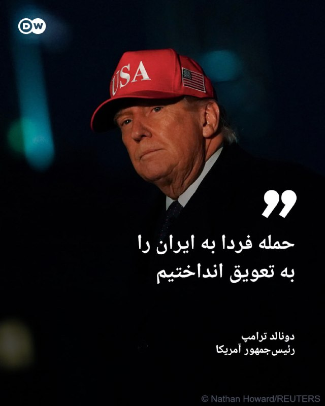

🔶 ترامپ: حمله فردا به ایران را به تعویق انداختیم

دونالد ترامپ، رئیس‌جمهور آمریکا، عصر دوشنبه، ۱۸ مه (۲۸ اردیبهشت) اعلام کرد ایالات متحده حمله نظامی "برنامه‌ریزی‌شده" علیه ایران را که قرار بود روز سه‌شنبه انجام شود، "اجرا نخواهد کرد". او این خبر را در شبکه اجتماعی تروث سوشال منتشر کرد.

ترامپ نوشت: «امیر قطر، تمیم بن حمد آل ثانی، ولیعهد عربستان محمد بن سلمان آل سعود و رئیس امارات محمد بن زاید آل نهیان از من خواستند حمله نظامی برنامه‌ریزی‌شده علیه جمهوری اسلامی ایران را که برای فردا تعیین شده بود، متوقف کنم، زیرا مذاکرات جدی اکنون در جریان است و به نظر آن‌ها، به‌عنوان رهبران و متحدان بزرگ، توافقی حاصل خواهد شد که برای ایالات متحده آمریکا، همه کشورهای خاورمیانه و فراتر از آن بسیار قابل قبول خواهد بود.»

او افزود: «این توافق، مهم‌تر از همه، شامل این خواهد بود که ایران هیچ سلاح هسته‌ای نداشته باشد.»

ترامپ همچنین گفت: «بر اساس احترامم به رهبران یادشده، به وزیر جنگ، پیت هگست، رئیس ستاد مشترک ارتش ژنرال دنیل کین و نیروهای مسلح آمریکا دستور داده‌ام که حمله برنامه‌ریزی‌شده فردا علیه ایران انجام نخواهد شد.»

@dw_farsi

## DW_Farsi — post 124855

  

🔶 آمریکا: مذاکرات به سختی پیش می‌رود و شاید بمب‌ها سخن بگویند تنش‌ها میان ایران و آمریکا روز دوشنبه همچنان بالا باقی ماند. یک مقام آمریکایی پیشنهاد متقابل اخیر ایران برای پایان دائمی جنگ را "ناکافی" توصیف کرد و گفت مذاکرات «به‌سختی پیش می‌رود». او هشدار داد…

## Persian_Trend_Official — post 14459

  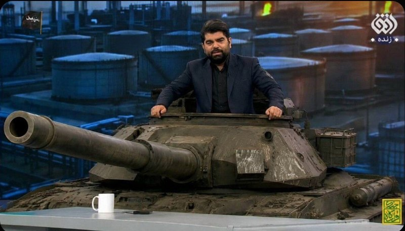

📰
📰 تو صداوسیما تانک آوردن!!!

☆Phantom☆

📌 @persian_trend_official
پرشین ترند | متفاوت‌ترین کانال نظامی

## Persian_Trend_Official — post 14458

  

فعال شدن پدافند هوایی اصفهان/مهر نیوز

☆Phantom☆

📌 @persian_trend_official
پرشین ترند | متفاوت‌ترین کانال نظامی

## Persian_Trend_Official — post 14457

  

حزب‌الله : ما یک هواپیمای جنگی اسرائیلی را با یک موشک زمین به هوا در حریم هوایی بخش غربی جنوب لبنان رهگیری کردیم.

☆Phantom☆

📌 @persian_trend_official
پرشین ترند | متفاوت‌ترین کانال نظامی

## Persian_Trend_Official — post 14456

https://youtube.com/live/7aZKWyXxQog?feature=share

## Persian_Trend_Official — post 14455

  <a href="telegram/content/Persian_Trend_Official_14455_1779137505.webm" target="_blank">🎬 Download video</a>

ایران سامانه «هرمز سیف» را برای ثبت‌نام کشتی‌های عبوری از تنگه هرمز راه‌اندازی کرد جمهوری اسلامی ایران سامانه‌ای تحت عنوان «هرمز سیف» را با هدف ارائه خدمات به کشتی‌های عبوری از تنگه هرمز راه‌اندازی کرده است. بر اساس این طرح، ناخدایان و شرکت‌های کشتیرانی می‌توانند…

## Persian_Trend_Official — post 14454

🔴 صدای انفجار در سلیمانیه عراق گویا سپاه دوباره به مقر پژاک حمله کرده

## Persian_Trend_Official — post 14453

  <a href="telegram/content/Persian_Trend_Official_14453_1779137505.webm" target="_blank">🎬 Download video</a>

💢اینم نتیجه رفتار و عملکرد دونالد ترامپ

🫆:Tony

📌 @persian_trend_official
پرشین ترند | متفاوت‌ترین کانال نظامی

## Persian_Trend_Official — post 14452

نسخه صوتی لایو امشب :

https://castbox.fm/vd/946653632

## Persian_Trend_Official — post 14451

  

🔴 صدای انفجار در سلیمانیه عراق
گویا سپاه دوباره به مقر پژاک حمله کرده

## Persian_Trend_Official — post 14450

  <a href="telegram/content/Persian_Trend_Official_14450_1779137506.mp4" target="_blank">🎬 Download video</a>

🇺🇸
🇦🇫 حداقل دو نفر کشته شده‌اند و چندین نفر دیگر در یک وضعیت تیراندازی فعال در مرکز اسلامی سن دیگو، کالیفرنیا زخمی شده‌اند. ویدیوی بالا شخصی را در یک استخر خون پس از ظاهراً تیر خوردن نشان می‌دهد.

☆Phantom☆

📌 @persian_trend_official
پرشین ترند | متفاوت‌ترین کانال نظامی

## Persian_Trend_Official — post 14449

  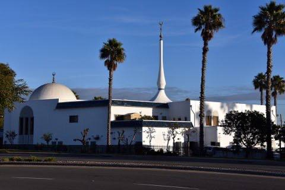

تیراندازی در یک مرکز اسلامی در آمریکا

🔸رسانه‌ها روز دوشنبه از حضور یک فرد مسلح و تیراندازی در مرکز اسلامی سن دیگو خبر می‌دهند.

🔹پلیس سن دیگو از مردم خواست که از حضور در این منطقه خودداری کنند.

☆Phantom☆

📌 @persian_trend_official
پرشین ترند | متفاوت‌ترین کانال نظامی

## Persian_Trend_Official — post 14448

  

💢از سوی امیر قطر، تمیم بن حمد آل ثانی، ولیعهد عربستان سعودی، محمد بن سلمان آل سعود، و رئیس امارات متحده عربی، محمد بن زاید آل نهیان، از من خواسته شد حمله نظامی برنامه‌ریزی‌شده ما علیه جمهوری اسلامی ایران که قرار بود فردا انجام شود را متوقف کنم، زیرا مذاکرات…

## Persian_Trend_Official — post 14446

فعال شدن پدافند قشم علیه ریزپرنده‌ها 💢 در پی فعالیت پدافند در جزیره قشم، خبرنگار تسنیم از منابع مطلع کسب اطلاع کرد که پس از مشاهده ریز پرنده‌ها در آسمان جزیره، پدافند در جهت نابودی اهداف متخاصم فعال شد. 🫆:Tony 📌 @persian_trend_official پرشین ترند | متفاوت‌ترین…

## Persian_Trend_Official — post 14445

  <a href="telegram/content/Persian_Trend_Official_14445_1779137507.webm" target="_blank">🎬 Download video</a>

فعال شدن پدافند قشم علیه ریزپرنده‌ها

💢 در پی فعالیت پدافند در جزیره قشم، خبرنگار تسنیم از منابع مطلع کسب اطلاع کرد که پس از مشاهده ریز پرنده‌ها در آسمان جزیره، پدافند در جهت نابودی اهداف متخاصم فعال شد.

🫆:Tony

📌 @persian_trend_official
پرشین ترند | متفاوت‌ترین کانال نظامی

## RadioFarda — post 157323

  <a href="https://t.me/radiofarda/157323" target="_blank">📎 Download file</a>

📻بشنوید: سرخط خبرهای بامدادی رادیوفردا، ۲۹ اردیبهشت ۱۴۰۵‌

@RadioFarda

## RadioFarda — post 157322

🔸مراسم ازدواج دسته‌جمعی روز دوشنبه برای ۱۱۰ زوج در میدان «امام حسین» تهران برگزار شد.

🔸تصاویر منتشرشده از این مراسم، خودروهای نظامی و تیربار را در فضای جشن نشان می‌دهد.

🔸کارزار حکومتی «جان‌فدا» با هدف نمایش آمادگی عمومی در مواجهه با حمله‌ زمینی احتمالی راه‌اندازی شده است.

🔸همزمان در روزهای اخیر دوره‌های آموزش استفاده از سلاح در مکان‌های عمومی نیز آغاز شده است.

🔸این مراسم در حالی برگزار شد که آتش‌بسی شکننده میان ایران، و آمریکا و اسرائیل برقرار است.

@RadioFarda

## RadioFarda — post 157321

  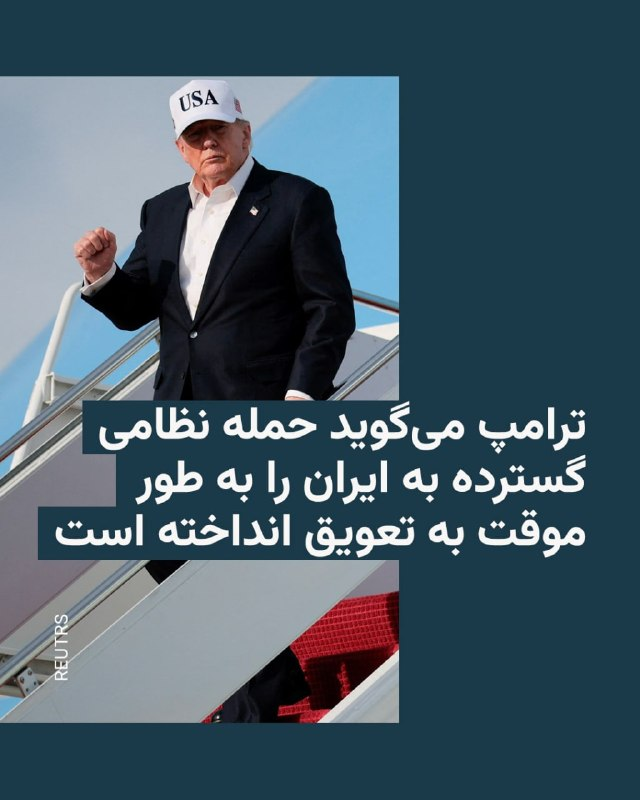

ترامپ می‌گوید حمله نظامی گسترده به ایران را به طور موقت به تعویق انداخته است

🔸دونالد ترامپ، رئیس جمهور آمریکا، روز دوشنبه در شبکه اجتماعی خود خبر داد که حمله‌ای تازه به ایران برای روز سه‌شنبه برنامه‌ریزی شده بود، اما او فعلا آن را به عقب می‌اندازد.

🔸او توضیح داده است که این حمله را به درخواست «امیر قطر، ولیعهد عربستان سعودی و رئیس جمهور امارات متحده عربی» فعلا انجام نمی‌دهد.

🔸ساعتی پیشتر، دونالد ترامپ در واکنش به پاسخ تازه تهران به پیشنهادات آمریکا گفته بود که قرار نیست امتیازی به ایران بدهد.

🔸او در ادامه تهدید کرده بود که ایران می‌داند که «خیلی زود چه اتفاقی خواهد افتاد».

🔸ایران روز دوشنبه ۲۸ اردیبهشت اعلام کرد که به پیشنهاد جدید آمریکا با هدف پایان دادن به جنگ پاسخ داده است و افزود که تبادل نظر میان طرفین همچنان ادامه دارد.

🔸حال او در پیام تازه خود نوشته است «از آنجا که مذاکراتی جدی در جریان است و از نظر رهبران و متحدان بزرگ ما توافقی حاصل خواهد شد که برای آمریکا هم بسیار قابل قبول خواهد بود»، او حمله نظامی را که برای روز سه‌شنبه برنامه‌ریزی شده بود به تعویق می‌اندازد.

@RadioFarda

## IranianMinds — post 20366

🔴 خبرگزاری مهر:

پدافند هوایی در اصفهان فعال شد.

@IranianMinds

## IranianMinds — post 20365

🔴 ترامپ:

هم‌اکنون مذاکرات جدی برای رسیدن به توافق با ایران در جریان است.

@IranianMinds

## IranianMinds — post 20364

  

🔴صداوسیما هم این وسط، ۵ بار اعلام پیروزی کرد😂😂

@IranianMinds

## IranianMinds — post 20363

🔴خبرگزاری مهر: پدافند هوایی قشم فعال شد. @IranianMinds

## BBCPersian — post 281395

  <a href="https://t.me/bbcpersian/281395" target="_blank">📎 Download file</a>

🔻پادکست برنامه جام جهان‌نما دوشنبه ۲۸ اردیبهشت ۱۴۰۵
این برنامه رادیویی را می‌توانید هر شب ساعت ۲۰ به وقت ایران، روی موج متوسط ۷۰۲ کیلوهرتز و موج کوتاه ۹۴۶۵ کیلوهرتز بشنوید.
تکرار برنامه را هم می‌توانید ساعت ۲۱:۳۰ روی موج متوسط ۷۰۲ کیلوهرتز و موج کوتاه ۵۳۹۵ کیلوهرتز گوش کنید.
@BBCPersian

## BBCPersian — post 281394

  <a href="telegram/content/BBCPersian_281394_1779137509.mp4" target="_blank">🎬 Download video</a>

🔻آخرین خبرهای مهم دوشنبه ۲۸ اردیبهشت ۱۴۰۵
@BBCPersian

## BBCPersian — post 281393

🔻دونالد ترامپ می‌گوید که قرار بود فردا به ایران حمله نظامی کند اما به درخواست امیر قطر، ولیعهد عربستان و امارات متحده عربی این حمله را به تعویق انداخته است. او در پستی در شبکه اجتماعی تروث سوشال نوشت: «از من خواسته شده است حمله نظامی برنامه‌ریزی‌شده ما علیه…

## BBCPersian — post 281392

  

🔻دونالد ترامپ می‌گوید که قرار بود فردا به ایران حمله نظامی کند اما به درخواست امیر قطر، ولیعهد عربستان و امارات متحده عربی این حمله را به تعویق انداخته است.

او در پستی در شبکه اجتماعی تروث سوشال نوشت: «از من خواسته شده است حمله نظامی برنامه‌ریزی‌شده ما علیه جمهوری اسلامی ایران را که قرار بود فردا انجام شود، به تعویق بیندازم؛ زیرا مذاکرات جدی اکنون در جریان است و به باور آن‌ها، به‌عنوان رهبران بزرگ و متحدان ما، توافقی حاصل خواهد شد که برای ایالات متحده آمریکا و همچنین همه کشورهای خاورمیانه و فراتر از آن بسیار قابل قبول خواهد بود.»

او افزود: «این توافق نکته مهمی را در برخواهد داشت: ایران سلاح هسته‌ای نخواهد داشت.»

📷 Getty Images
https://bbc.in/3PpMOY6
@BBCPersian

## Dirty_Kids — post 389705

  

خیلی از کارشناسا میگن ترامپ، خبر مذاکرات رو فقط برای پایین اوردن قیمت نفت اعلام کرده؛

قیمت نفت قبل از توییت ترامپ: 112.3 دلار
قیمت نفت بعد از توییت ترامپ: 109.7 دلار

@Dirty_Kids 👻

## Dirty_Kids — post 389704

  

صداوسیما:
ترامپ واسه پنجمین بار از جنگ مقابل ایران فرار کرد.

@Dirty_Kids 👻

## Dirty_Kids — post 389703

  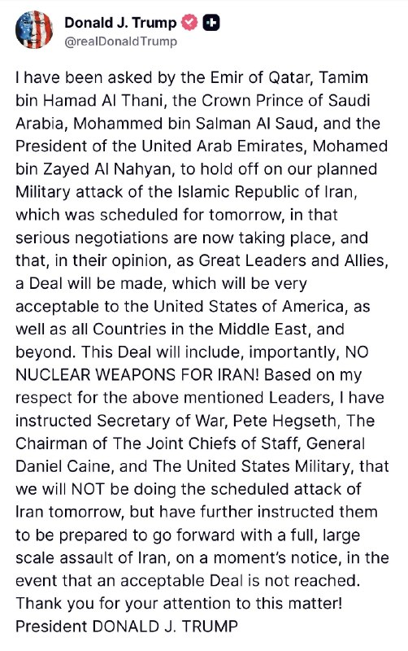

املاکی لحظاتی پیش پست زیر رو در تروث سوشا منتشر کرد:

«از طرف امیر قرمساق قطر، ولیعهد قرمدنگ عربستان سعودی و رئیس قرمپف امارات متحده عربی از من خواسته شده که حمله نظامی برنامه‌ریزی‌شده‌مون به رژیم هزارپدر روافض رو که قرار بود فردا انجام بشه، دست نگه داریم و انجام ندیم؛
چون الان مذاکرات جدی داره انجام میشه و به نظر این قرمساق‌‌ها به عنوان رهبران جاکش و متحدان ما، توافقی با روافض داره شکل می‌گیره که هم برای ایالات متحده آمریکا و هم برای همه کشورهای خاورمیانه و فراتر از اون، کاملاً قابل‌قبول خواهد بود.

این توافق و این نکته خیلی مهمیه، شامل هیچ سلاح هسته‌ای برای رژیم روافض نمیشه.

منم به خاطر احترامی که برای رهبرانی که نام بردم قائلم، به وزیر جنگ پیت هگست، رئیس ستاد مشترک ارتش ژنرال دانیال کین و ارتش ایالات متحده دستور دادم که حمله برنامه‌ریزی‌شده فردا به رژیم روافض رو انجام ندن.

اما در عین حال بهشون دستور دادم برای موقعی که یه توافق قابل‌قبول به دست نیومد، در اسرع وقت آماده باشن تا یک حمله تمام‌عیار و بزرگ رو علیه رژیم شیعه‌سانان رافضی شروع کنن.

ممنون از توجهتون به این موضوع!
رئیس‌جمهور دونالد جی. ترامپ»

@Dirty_Kids 👻

## Dirty_Kids — post 389702

  

پزشکیان نخ داد که میخوان مذاکره بکنن:

گفتگو به معنای تسلیم نیست؛
جمهوری‌اسلامی ایران با عزت و اقتدار وارد گفتگو میشه و از حقوق خودش عقب‌نشینی نمیکنه.

@Dirty_Kids 👻

## Dirty_Kids — post 389701

  <a href="telegram/content/Dirty_Kids_389701_1779137513.mp4" target="_blank">🎬 Download video</a>

صحنه‌ای از چاه فاضلاب:
ترویج کودک همسری در صدا و سیما

+ مجری بیشعور تبعیض جنسیتی میکنه
برای پسر ولیمه باید داد
دخترو اینا آخه زنده به گور میکنن

@Dirty_Kids 👻

## Dirty_Kids — post 389700

  <a href="telegram/content/Dirty_Kids_389700_1779137514.mp4" target="_blank">🎬 Download video</a>

صداوسیما یه تازه عروس و داماد رو آورده تو برنامه تلویزیون؛

بی‌بی میزنه کتلت بعد میگن تقصیر مردم بود

داماد : مهریه خانمم یه پهپاد شاهده که ایشالا بخوره تو قلب تل‌آویو

مجری: حالا اگه عروس خانم مهریه‌شو بخواد میخوای چیکار کنی؟ میدونی قیمتش چقدره؟

داماد : خخخخخ



@Dirty_Kids 👻

## Hranews — post 113024

  

میان موشک و سرکوب؛ گزارش مجموعه فعالان حقوق بشر درباره مخاصمه نظامی ایالات متحده-اسرائیل و ایران منتشر شد

💥
💥
💥
💥
💥 – امروز، مجموعه فعالان حقوق بشر در ایران گزارش جدیدی را در ۲۴۰ صفحه و دو زبان منتشر کرد که به بررسی کارزار نظامی ایالات متحده و اسرائیل در ایران در فاصله ۹ اسفند ۱۴۰۴ تا ۱۹ فروردین ۱۴۰۵ (۲۸ فوریه تا ۸ آوریل ۲۰۲۶) می‌پردازد.

این گزارش بر پایه ۱۷۷ منبع تأییدشده ــ شامل گزارش‌های منابع آزاد و شبکه میدانی مجموعه فعالان حقوق بشر در داخل کشور ــ ۶٬۳۲۴ رویداد منحصربه‌فرد شامل ۱۲٬۷۹۸ حمله مجزا را مستندسازی کرده است.
مجموعه فعالان تاکید کرد این گزارش با هدف ارائه روایت جامع از کل درگیری تهیه نشده است. یافته‌های آن صرفاً به رویدادهایی محدود می‌شود که در داده‌های این نهاد مستندسازی و راستی‌آزمایی شده‌اند.

📊 یافته‌های کلیدی گزارش
◾️ ثبت ۶٬۳۲۴ رویداد منحصربه‌فرد و ۱۲٬۷۹۸ حمله مجزا
◾️ ۷۷ درصد رویدادها شامل آسیب به غیرنظامیان یا اماکن غیرنظامی
◾️ ثبت دست‌کم ۳٬۶۳۶ مورد مرگ، از جمله ۱٬۷۰۱ غیرنظامی
◾️ کشته شدن ۳۰۷ کودک و زخمی شدن ۲٬۲۱۳ کودک
◾️ تمرکز ۴۴٫۸۵ درصدی رویدادها در استان تهران
◾️ هدف قرار گرفتن یا آسیب دیدن مدارس، مراکز درمانی، مراکز فرهنگی و زیرساخت‌های حیاتی

⚠️ الگوهای نگران‌کننده
این گزارش چندین الگوی نگران‌کننده را برجسته می‌کند، از جمله:
◾️ ضعف در راستی‌آزمایی اهداف
◾️ استفاده محدود از نظارت انسانی در برخی فناوری‌های هدف‌گیری
◾️ هشدارهای ناکافی پیش از حملات
◾️ استفاده از تسلیحات انفجاری سنگین در مناطق پرجمعیت
◾️ حملات تکراری به برخی مناطق غیرنظامی
◾️ آسیب گسترده به زیرساخت‌های غیرنظامی

🚨 این گزارش همچنین به بازداشت گسترده شهروندان در ایران اشاره دارد؛ دست‌کم ۴٬۰۲۳ نفر با اتهامات مرتبط با امنیت ملی یا جنگ بازداشت شده‌اند.

از سوی دیگر تشدید محدودیت‌های امنیتی، گسترش ایست‌های بازرسی و محدودیت‌های گسترده اینترنت از دیگر پیامدهای مستندسازی‌شده عنوان شده است.

در همین بازه زمانی، ۵۰ مورد اعدام ثبت شده که ۳۲ مورد آن با اتهامات سیاسی و امنیتی مرتبط بوده است.

📎 ادامه گزارش به زبان فارسی

📎 دانلود مستقیم فایل پی دی اف گزارش از تلگرام

📎 Complete report in English

📎Direct download of the English PDF

↘️
@hranews_bot تماس ✉️ - @Hranews کانال هرانا 🆑

## Hranews — post 113023

امیرحسین شیخ‌محمدی در کرج بازداشت شد

❗️
❗️
❗️
❗️
❗️– امیرحسین شیخ‌محمدی، دانشجوی دانشگاه آزاد کرج صبح امروز توسط نیروهای امنیتی در این شهر بازداشت شد.

#امیرحسین_شیخ‌محمدی

ادامه مطلب

↘️
@hranews_bot تماس ✉️ - @Hranews کانال هرانا 🆑

## Hranews — post 113022

اجرای حکم اعدام یک زندانی در شیراز/ صدور یک حکم اعدام و رهایی ۳ زندانی از چوبه دار

❗️
❗️
❗️
❗️
❗️– سحرگاه روز گذشته، حکم یک زندانی که پیشتر بابت اتهام قتل به اعدام محکوم شده بود، در زندان عادل آباد شیراز به اجرا درآمد. از سوی دیگر، یک متهم به قتل در تهران توسط دادگاه کیفری این استان به اعدام محکوم شد. رئیس کل دادگستری مازندران نیز اعلام کرد که سه زندانی محکوم به #اعدام در شهرهای آمل و بهشهر، با اعلام رضایت اولیای دم از چوبه دار رهایی یافتند.

#سعید_رحمانی‌راد

ادامه مطلب

↘️
@hranews_bot تماس ✉️ - @Hranews کانال هرانا 🆑

## manototv — post 105614

  <a href="telegram/content/manototv_105614_1779137516.mp4" target="_blank">🎬 Download video</a>

«سکوت نکنیم، صدای فاطمه سپهری باشیم»

## manototv — post 105613

  <a href="telegram/content/manototv_105613_1779137517.mp4" target="_blank">🎬 Download video</a>

دونالد ترامپ، رئیس‌جمهوری آمریکا، در پیامی در شبکه اجتماعی تروث سوشال نوشت:

««امیر قطر، تمیم بن حمد آل ثانی، ولیعهد عربستان سعودی، محمد بن سلمان آل سعود، و رئیس امارات متحده عربی، محمد بن زاید آل نهیان، از من خواسته‌اند حمله نظامی برنامه‌ریزی‌شده‌مان علیه جمهوری اسلامی ایران را که قرار بود فردا انجام شود، متوقف کنم؛ زیرا اکنون مذاکرات جدی در جریان است و به اعتقاد آن‌ها، به‌عنوان رهبران بزرگ و متحدان ما، توافقی حاصل خواهد شد که برای ایالات متحده آمریکا، همه کشورهای خاورمیانه و فراتر از آن بسیار قابل قبول خواهد بود.

این توافق، مهم‌تر از همه، شامل این خواهد بود که ایران هیچ سلاح هسته‌ای نداشته باشد!

بر اساس احترامم به رهبران یادشده، به وزیر جنگ، پیت هگست، رئیس ستاد مشترک نیروهای مسلح، ژنرال دنیل کین، و ارتش ایالات متحده دستور داده‌ام که حمله برنامه‌ریزی‌شده به ایران را فردا انجام ندهند؛ اما همزمان به آن‌ها دستور داده‌ام در صورتی که توافق قابل قبولی حاصل نشود، برای اجرای یک حمله کامل و گسترده علیه ایران، در هر لحظه آماده باشند.»

## manototv — post 105612

  <a href="telegram/content/manototv_105612_1779137518.mp4" target="_blank">🎬 Download video</a>

‌
خبرگزاری‌های داخل ایران گزارش دادند پدافند هوایی قشم شامگاه دوشنبه فعال شده است. مقام‌های جمهوری اسلامی توضیحی درباره علت فعالیت پدافند هوایی در این جزیره ارائه نکرده‌اند.

## manototv — post 105611

  <a href="telegram/content/manototv_105611_1779137518.mp4" target="_blank">🎬 Download video</a>

«رشید مظاهری به خاطر بیان عقیده_اش در بازداشت است»

## manototv — post 105610

  <a href="telegram/content/manototv_105610_1779137519.mp4" target="_blank">🎬 Download video</a>

«صدای فاطمه سپهری باشیم»

## manototv — post 105609

  <a href="telegram/content/manototv_105609_1779137520.mp4" target="_blank">🎬 Download video</a>

تجمع ایرانیان در لیسبون مقابل سفارت نروژ؛ اعتراض به دیدار سیاستمداران نروژی با جمهوری اسلامی

## alonews — post 120969

  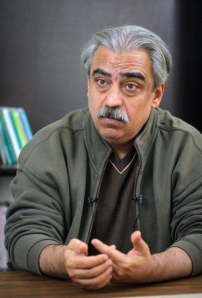

👈عوستاد خوش چشم هفته قبل: آمریکا تا ۳۰ اردیبهشت حمله میکنه

🔴ترامپ امروز: فعلا حمله نمیکنیم تا مذاکرات ادامه پیدا کنه

🔴پ.ن: عوستاد همیشه برعکس پیش بینی میکنه، سری قبلم گفت جنگ نمیشه اما فرداش شد

✅ @AloNews خبر جنگ

## alonews — post 120968

👈سخنگوی وزارت خارجه آمریکا در گفتگو با الجزیره: ترامپ برای رسیدن به توافقی غیرقابل قبول عجله نخواهد کرد

🔴خطوط قرمز رئیس‌جمهور روشن است و آن اینکه ایران نباید به سلاح هسته‌ای دست یابد.

✅ @AloNews خبر جنگ

## alonews — post 120967

  

👈این وسط تو صدا و سیما تانک آوردن

✅ @AloNews خبر جنگ

## alonews — post 120966

👈صدا و سیما: دیدید ترامپ ترسید؟

✅ @AloNews خبر جنگ

## alonews — post 120965

👈پدافند اصفهان فعال شد

✅ @AloNews خبر جنگ

## alonews — post 120964

🔴فوری/ترامپ: مذاکرات جدی برای رسیدن به توافق با ایران در حال انجام است‌‌

✅ @AloNews خبر جنگ

## alonews — post 120963

👈 اکسیوس: دو منبع آگاه گفتند که پیش از اعلامیه ترامپ، او با رهبران عربستان سعودی، قطر و امارات متحده عربی تلفنی صحبت کرده است. اما مشخص نیست که آیا هر سه رهبر او را به تعویق انداختن حملات ترغیب کرده‌اند یا خیر.

✅ @AloNews خبر جنگ

## alonews — post 120962

  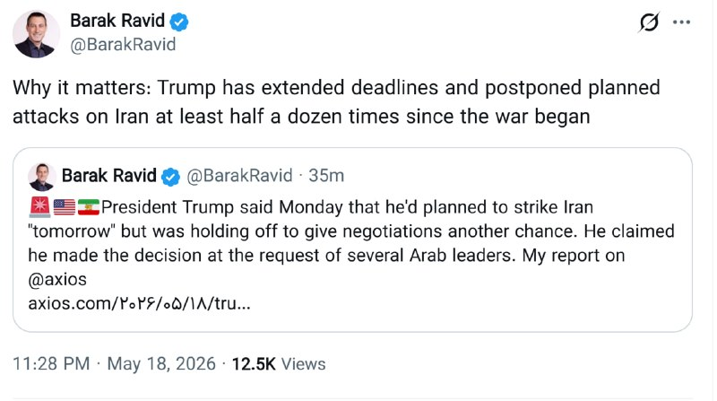

👈خبرنگار آکسیوس:
ترامپ از زمان شروع جنگ حداقل 6 بار ضرب الاجل ها را تمدید کرده و حملات برنامه ریزی شده به ایران را به تعویق انداخته است.

✅ @AloNews خبر جنگ

## alonews — post 120961

  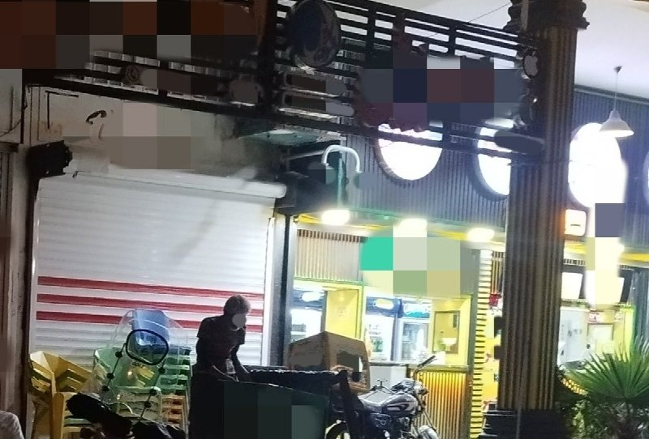

دیدم صاحب اینجا، یک ساندویچ ساده به این دوست بازیافتیمان که کمی دورتر مشغول سطل زباله بود، داد. چند دقیقه بعد که ساندویچش را خورد، در حالی که حواس کسی نبود، به کناری آمد و شروع کرد به جمع کردن میز و صندلی‌ها و رفت.
ایشان رایگان نخورد.
در شگفتم از مفت‌خورها، مال مردم‌خورهای تسبیح به دست

[@AloTweet]

## alonews — post 120960

اخبار جنگ الونیوز AloNews pinned a photo

## alonews — post 120959

  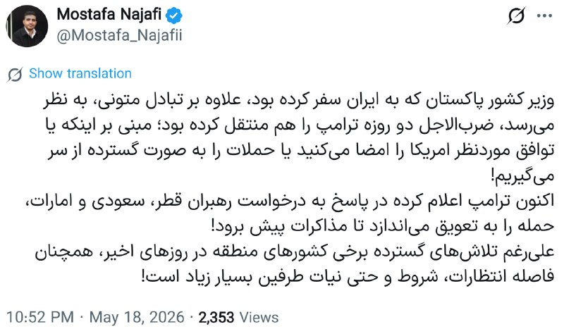

👈فیلد مارشال محسن رضایی: وزیر کشور پاکستان که به ایران سفر کرده‌ بود، علاوه بر تبادل متونی، به نظر می‌رسد، ضرب‌الاجل دو روزه‌ ترامپ را هم منتقل کرده بود؛ مبنی بر اینکه یا توافق موردنظر امریکا را امضا می‌کنید یا حملات را به صورت گسترده از سر می‌گیریم!

🔴اکنون ترامپ اعلام کرده در پاسخ به درخواست رهبران قطر، سعودی و امارات، حمله را به تعویق می‌اندازد تا مذاکرات پیش برود!

🔴علی‌رغم تلاش‌های گسترده برخی کشورهای منطقه در روزهای اخیر، همچنان فاصله انتظارات، شروط و حتی نیات طرفین بسیار زیاد است!

✅ @AloNews خبر جنگ

## alonews — post 120958

👈شنیده شدن صدای انفجار در سلیمانیه عراق 
✅ @AloNews خبر جنگ

## alonews — post 120957

  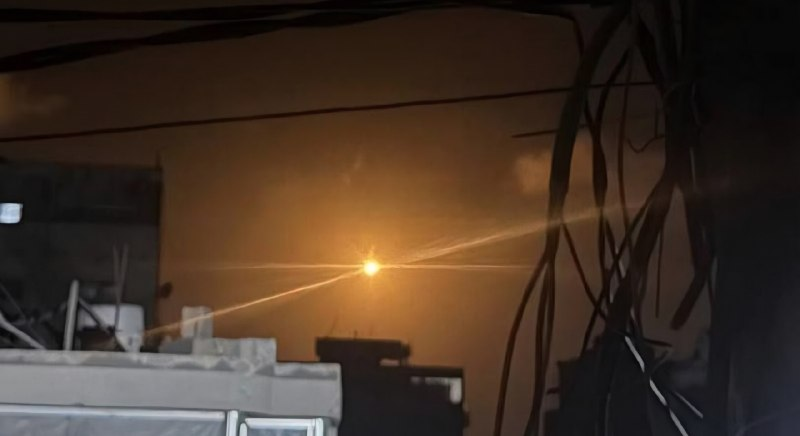

👈بمب‌های نور افکن تو غزه

✅ @AloNews خبر جنگ

## alonews — post 120956

  <a href="telegram/content/alonews_120956_1779137524.mp4" target="_blank">🎬 Download video</a>

👈تیراندازی فعال در مرکز اسلامی سن دیگو به نظر می‌رسد حمله‌ای وحشتناک باشد.

🔴 تصاویر هلی‌کوپتر نشان می‌دهد جسدی در برکه‌ای از خون بیرون ساختمان افتاده است

✅ @AloNews خبر جنگ

## alonews — post 120955

  

👈ترامپ از طریق Truth Social:
در مریلند، ۵۰۰,۰۰۰ رای پستی غیرقانونی ارسال کردند و گرفتار شدند! حالا قرار است ۵۰۰,۰۰۰ رای پستی دیگر ارسال کنند، اما هیچ‌کس نمی‌داند با ۵۰۰,۰۰۰ رای اول چه شده است.

🔴علاوه بر این، بسیاری از این آرا به دموکرات‌ها رفت، بنابراین هیچ جمهوری‌خواهی که در مریلند نامزد شده باشد شانسی ندارد! این کار توسط فرماندار فاسد ایالت، وس مور انجام شده است. او اجازه داد این اتفاق بیفتد تا مطمئن شود دموکرات‌ها پیروز می‌شوند.

🔴برای من هرگز منطقی نبود که مریلند به عنوان ایالتی خودکار دموکرات در نظر گرفته شود، اما حالا می‌فهمم چرا. مطمئنم این موضوع سال‌هاست که ادامه دارد. من از دادستان کل ایالات متحده و وزارت دادگستری می‌خواهم که فوراً تحقیقاتی در این باره انجام دهند

✅ @AloNews خبر جنگ

## alonews — post 120954

👈گفتگوی وزرای خارجه کویت و عربستان درباره آخرین تحولات در غرب آسیا

✅ @AloNews خبر جنگ

## alonews — post 120953

👈شنیده شدن صدای انفجار در سلیمانیه عراق

✅ @AloNews خبر جنگ

## alonews — post 120952

  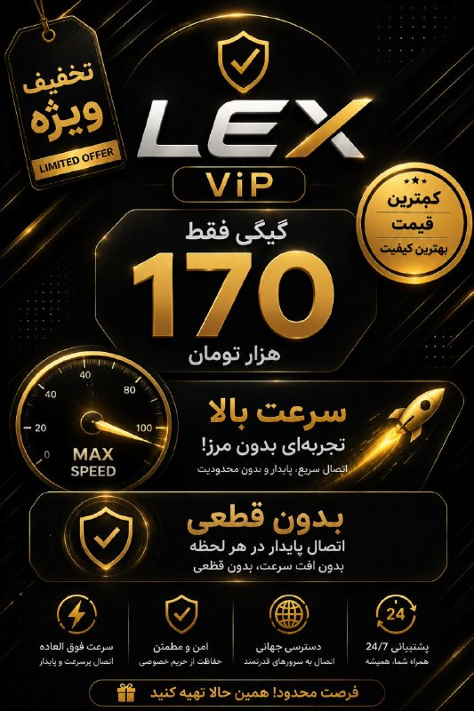

🔥تخفیف ویژه فقط به مدت 2 روز
🔥

🚀با بالاترین سرعت و کمترین قطعی

💰هر گیگ فقط و فقط 170 هزار تومان

⚡️پینگ عالی

⚡️دارای لینک ساب

⚡️پشتیبانی 24 ساعته

⚡️ بدون محدودیت کاربر و زمان و ضریب

⚡️مخصوص استفاده روزمره، هوش مصنوعی، گیم و ...

✅جهت خرید با تحویل آنی فقط به بات مراجعه کنید

✅ @Lex_Server 
👾 @LexVipBot

## alonews — post 120951

👈ترامپ: من به وزیر جنگ، رئیس ستاد مشترک و ارتش امریکا دستور داده‌ام که آماده باشند تا در صورت عدم دستیابی به توافق قابل قبول، حمله‌ای کامل و گسترده و همه‌جانبه به ایران را با کمترین هشدار ممکن انجام دهند این آخرین فرصت ایران برای توافق است

✅ @AloNews خبر جنگ

## alonews — post 120950

👈صداوسیما: ترامپ برای پنجمین بار از جنگ مقابل ایران فرار کرد.

✅ @AloNews خبر جنگ

<!-- MSG END -->

<!-- NAV START -->

<a href="https://github.com/benyamin-najmi/aio-downloader/blob/main/telegram/content/archive_1.md" style="display:inline-block; padding:6px 12px; margin:0 4px; background-color:#2ea44f; color:white; text-decoration:none; border-radius:4px; font-weight:bold;">صفحه بعد</a>

<!-- NAV END -->
