# خواننده تلگرام

<!-- TOP_NAV START -->

<a href="https://github.com/benyamin-najmi/aio-downloader/blob/main/telegram/content/archive_1.md" style="display:inline-block; padding:6px 12px; margin:0 4px; background-color:#2ea44f; color:white; text-decoration:none; border-radius:4px; font-weight:bold;">صفحه بعد</a>

<!-- TOP_NAV END -->

<!-- MSG START -->

---
📅 بروزرسانی: 1405/02/30 21:05
---

## VahidOOnLine — post 241196

  

فرماندهی مرکزی آمریکا، سنتکام، اعلام کرد نیروهای تفنگدار دریایی آمریکا از یگان اعزامی ۳۱، چهارشنبه ۳۰ اردیبهشت در دریای عمان سوار نفتکش تجاری «سلستیال سی» با پرچم جمهوری اسلامی شدند.

به نوشته سنتکام، این نفتکش مظنون بود که با حرکت به سوی یکی از بنادر ایران، محاصره دریایی آمریکا را نقض کند. نیروهای آمریکایی پس از بازرسی و دستور به خدمه برای تغییر مسیر، کشتی را آزاد کردند.

سنتکام افزود نیروهای آمریکا به اجرای کامل این محاصره ادامه می‌دهند و تاکنون ۹۱ کشتی تجاری را برای اطمینان از رعایت آن، تغییر مسیر داده‌اند.
‌🏁 🇬🇧 IranintlTV

🤖 @VahidOOnLine

## VahidOOnLine — post 241195

  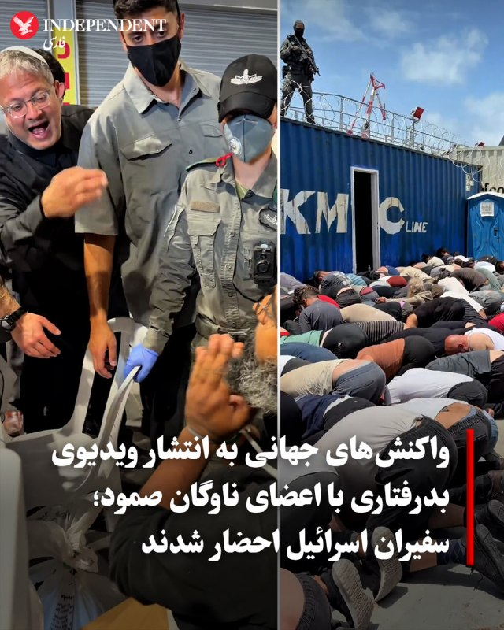

♦️ در پی انتشار ویدیویی از بدرفتاری با اعضای ناوگان صمود که برای کمک‌رسانی به نوار غزه، به آب‌های تحت کنترل اسرائیل وارد شده بودند، کشورهای اروپایی و کانادا سفیران اسرائیل را احضار کردند. ایتامار بن‌گویر، وزیر امنیت اسرائیل که خود نیز در این ویدیو در حال خنده و تکان دادن پرچم اسرائیل دیده می‌شود، این تصاویر را با توضیح «به اسرائیل خوش آمدید» منتشر کرد.

وزارت امور خارجه کشورهای کانادا، هلند، ایتالیا، فرانسه و اسپانیا در اعتراض به این اقدام و با خواسته ارائه توضیح، سفیران اسرائیل در این کشورها را احضار کردند. وزارت امور خارجه کشورهای بلژیک، آلمان و بریتانیا نیز ضمن ابراز انزجار از «سوءرفتار» با این کنشگران، خواستار ارائه توضیح از سوی مقام‌های اسرائیل شدند.

گیدئون سعار، وزیر امور خارجه اسرائیل و دفتر نخست‌وزیر این کشور هم اعتراض خود را به رفتار بن‌گویر ابراز کردند. سعار این رفتار را عامل ضربه زدن به وجهه جهانی اسرائیل دانست و دفتر نتانیاهو تاکید کرد که دستور بازگرداندن این افراد به کشورهایشان را صادر کرده است.
‌🇸🇦 Indypersian

🤖 @VahidOOnLine

## VahidOOnLine — post 241194

  

♦️مقامات جمهوری اسلامی روز چهارشنبه ۳۰ اردیبهشت اعلام کردند که بازیکنان و کادر فنی تیم ملی فوتبال ایران هنوز ویزای خود را برای شرکت در مسابقات جام جهانی در ایالات متحده دریافت نکرده‌اند.

بر اساس برنامه‌ریزی‌های انجام‌شده، اعضای تیم ملی که اکنون برای آخرین اردوی آماده‌سازی در آنتالیا به‌سر می‌برند، قصد دارند از طریق سفارت کانادا در ترکیه برای دریافت ویزا اقدام کنند.

طبق برنامه مسابقات، تیم ملی ایران باید رقابت‌های خود را در گروه «جی» در تاریخ ۲۵ خرداد در لس‌آنجلس و در برابر نیوزیلند آغاز کند و پس از آن در همان شهر به مصاف بلژیک برود. ملی‌پوشان ایران در آخرین بازی مرحله گروهی نیز در سیاتل مقابل مصر قرار خواهند گرفت.
‌🇸🇦 Indypersian

🤖 @VahidOOnLine

## VahidOOnLine — post 241193

این خالکوبی فقط یک نقش روی صورتش نیست…
زخمِ نسلی‌ست که سال‌ها درد را نفس کشید، فریاد زد، سکوت کرد، گریه کرد، شکست، ایستاد، اما فراموش نکرد.

یادِ کودکانی‌ست که جنگ و ترس را زودتر از زندگی شناختند.

او می‌خواهد مردم هر بار که به این طرح روی صورتش نگاه می‌کنند، قصه‌ی روزهایی را به یاد بیاورند که از میان آتش، ترس، درد، ناامیدی و امید عبور کردند.

اما این فقط درد نیست…
این تتو، یادآور امید و زندگی هم هست.
یادآور روزهایی که هنوز برای ساختنشان زنده‌اند.

درست است که این تتو، طرحی از «God of War» است…
اما آن را به رنگ سبز انتخاب کرده‌اند؛ به نشانه عشق، صلح، امید و زندگی.

برای اینکه حقیقت فراموش نشود،
برای اینکه نسل بعد بداند مردم از چه روزهایی عبور کردند…
و چگونه با تمام زخم‌هایشان، هنوز عاشق ایران و ایرانی ماندند.

فراموش نکنید…
وقتی انسان‌ها برای شرافت، معرفت، عشق و گذشت ارزش قائل نشوند، ارزش‌ها کم‌کم معنای خودشان را از دست می‌دهند.

اول به انسان‌ها، بعد به حیوانات و در نهایت به طبیعت و گیاهان رحم کنیم و عشق بورزیم…
شاید دنیا هم یاد بگیرد که با ما مهربان‌تر باشد.

او سوخت…
آن‌ها سوختند…

یادتان نرود…
یادمان نرود.
‌🏁 🇬🇧 ManotoTV

🤖 @VahidOOnLine

## VahidOOnLine — post 241192

  <a href="telegram/content/VahidOOnLine_241192_1779298528.mp4" target="_blank">🎬 Download video</a>

نیروی دریایی سپاه اعلام کرده طی ۲۴ ساعت گذشته ۲۶ کشتی از تنگه هرمز عبور کرده‌اند.
با این حال، رویترز می‌نویسد این روند که در ظاهر نشانه‌ای از باز شدن مسیر کشتیرانی است، در عمل می‌تواند نشانه‌ای از افزایش کنترل جمهوری‌اسلامی بر این آبراه راهبردی باشد.
تهران پیش‌تر اعلام کرده بود در صورت دریافت هزینه یا عوارض از کشتی‌های تجاری، امکان بازگشایی تنگه هرمز را بررسی خواهد کرد؛ آبراهی که حدود یک‌پنجم صادرات نفت جهان از آن عبور می‌کند.
بر اساس این گزارش و به نقل از ۲۰ منبع، جمهوری‌اسلامی اکنون ایست‌های بازرسی نظامی، بررسی کشتی‌ها، ترتیبات دیپلماتیک و در برخی موارد دریافت هزینه امنیتی برای عبور ایمن را در این مسیر اعمال کرده است.
رویترز همچنین می‌گوید تهران در عمل در حال ایجاد یک «سازوکار پیچیده و چندلایه» است که به کشتی‌ها اجازه عبور می‌دهد، اما تنها در صورتی که از سوی نیروهای جمهوری‌اسلامی تأیید شوند.
‌🏁 🇬🇧 ManotoTV

🤖 @VahidOOnLine

## VahidOOnLine — post 241191

  <a href="telegram/content/VahidOOnLine_241191_1779298529.mp4" target="_blank">🎬 Download video</a>

تیم ملی فوتبال ایران هنوز ویزای آمریکا برای جام جهانی را دریافت نکرده است.

مقام‌های ایرانی گفته‌اند بازیکنان و اعضای کادر فنی تیم ملی هنوز موفق به دریافت ویزا برای حضور در جام جهانی ۲۰۲۶ در آمریکا نشده‌اند و قرار است برای دریافت ویزا از طریق سفارت کانادا در ترکیه اقدام کنند.

تیم ملی ایران قرار است ۱۵ ژوئن در نخستین بازی خود در گروه G در لس‌آنجلس به مصاف نیوزیلند برود و سپس برابر بلژیک و مصر بازی کند.
‌🏁 🇬🇧 ManotoTV

🤖 @VahidOOnLine

## VahidOOnLine — post 241190

  <a href="telegram/content/VahidOOnLine_241190_1779298530.mp4" target="_blank">🎬 Download video</a>

دونالد ترامپ، رئیس‌جمهور آمریکا، در ادامه سخنرانی خود در آکادمی گارد ساحلی آمریکا در ایالت کنتیکت گفت این نیرو نقش مهمی در عملیات «خشم حماسی» داشته است. ترامپ گفته گارد ساحلی آمریکا در اجرای محاصره علیه ایران کمک کرده و نمونه‌ای از آن را توقیف یک نفتکش ایرانی تحریم‌شده در نزدیکی سواحل مالزی عنوان کرد؛ نفتکشی که به گفته او نفت را از جزیره خارک حمل می‌کرده است.
او خطاب به حضار گفت: «این سومین کشتی ایرانیِ تحریم‌شده است که گارد ساحلی از زمان آغاز درگیری‌ها درگیری واقعی در توقیف آن کمک کرده است.»
ترامپ افزود: «با ایران و احتمالا موارد بیشتری هم در راه است، مگر اینکه آن‌ها عاقل شوند.» او همچنین گفته او گفت: «همه‌چیزشان از بین رفته؛ نیروی دریایی‌شان نابود شده، نیروی هوایی‌شان از بین رفته، تقریباً همه‌چیز.»
ترامپ افزود: «تنها سوال این است که آیا می‌رویم و کار را تمام می‌کنیم یا آن‌ها قرار است یک توافق امضا کنند. باید ببینیم چه اتفاقی می‌افتد.»
‌🏁 🇬🇧 ManotoTV

🤖 @VahidOOnLine

## VahidOOnLine — post 241189

  <a href="telegram/content/VahidOOnLine_241189_1779298531.mp4" target="_blank">🎬 Download video</a>

اسماعیل بقائی، سخنگوی وزارت خارجه جمهوری‌اسلامی اعلام کرده روند تبادل پیام‌ها میان جمهوری‌اسلامی و آمریکا «بر اساس متن ۱۴‌بندی پیشنهادی ایران» همچنان ادامه دارد و حضور وزیر کشور پاکستان در این روند با هدف «تسهیل مبادله پیام‌ها» میان دو طرف انجام شده است. وزیر کشور پاکستان امروز برای دومین بار طی یک هفته به تهران سفر کرد. به گفته سخنگوی وزارت خارجه نظام، تمرکز تهران بر «خاتمه جنگ در تمامی جبهه‌ها از جمله لبنان»، آزادسازی پول‌های بلوکه شده ایران، و توقف «راهزنی دریایی‌» اشاره به محاصره دریایی آمریکا در تنگه هرمز است.
‌🏁 🇬🇧 ManotoTV

🤖 @VahidOOnLine

## VahidOOnLine — post 241188

یک شهروند در پیامی به ایران اینترنشنال از افزایش قیمت شدید داروهای مربوط به اختلالات روحی و روانی می‌گوید. پیام او و تصویر این ویدیو با هوش مصنوعی خوانده شده است.
‌🏁 🇬🇧 IranintlTV

🤖 @VahidOOnLine

## VahidOOnLine — post 241187

  

خبرگزاری رویترز به نقل از دو منبع اروپایی در حوزه کشتیرانی گزارش داد برخی کشتی‌هایی که تحت پوشش توافق‌های دولت‌به‌دولت نیستند، برای عبور امن از تنگه هرمز بیش از ۱۵۰ هزار دلار به مقام‌های ایرانی پرداخت می‌کنند.

رویترز همچنین نوشت اوایل ماه مه حدود هزار و ۵۰۰ کشتی با ۲۲ هزار ملوان در خلیج گرفتار شده‌اند.

بر اساس این گزارش، نفتکش «آگیوس فانوریوس ۱» پس از عبور از هرمز، شش روز در چارچوب محاصره دریایی آمریکا متوقف شد.

رویترز افزود سپاه پاسداران مدارک وابستگی کشتی‌ها را بررسی می‌کند و به شناورهای مرتبط با روسیه و چین اولویت می‌دهد.
‌🏁 🇬🇧 IranintlTV

🤖 @VahidOOnLine

## VahidOOnLine — post 241186

  <a href="telegram/content/VahidOOnLine_241186_1779298532.mp4" target="_blank">🎬 Download video</a>

⭕️ ترامپ:
ما ضربه بسیار سختی به جمهوری اسلامی زدیم، اما شاید مجبور شویم حتی سخت‌تر هم ضربه بزنیم

♦️دونالد ترامپ، رئیس‌جمهوری ایالات متحده، روز چهارشنبه ۳۰ اردیبهشت تاکید کرد که واشنگتن اجازه نخواهد داد تهران به سلاح هسته‌ای دست پیدا کند و در صورت لزوم، فشارها و اقدامات علیه ایران تشدید خواهد شد.
ترامپ که در مراسم فارغ‌التحصیلی آکادمی گارد ساحلی آمریکا سخنرانی می‌کرد با اشاره به مذاکرات و احتمال توافق با ایران گفت: «آن‌ها خیلی مشتاق رسیدن به توافق هستند، باید ببینیم چه اتفاقی می‌افتد. ما ضربه بسیار سختی به آن‌ها زدیم، اما شاید مجبور شویم حتی سخت‌تر هم ضربه بزنیم، شاید هم نه.»
رئیس‌جمهور آمریکا در ادامه با تکرار مواضع پیشین خود افزود: «ما اجازه نخواهیم داد ایران به سلاح هسته‌ای دست پیدا کند و کل خاورمیانه، اسرائیل و سراسر منطقه را منفجر کند.»
او در بخش دیگری از سخنان خود با تاکید بر این‌که نیروی دریایی و هوایی ایران از بین رفته‌اند، گفت اکنون تنها سوال این است که آیا آمریکا برای تمام کردن کار بازمی‌گردد یا جمهوری اسلامی پای امضای یک سند (توافق‌نامه) خواهد آمد.
‌🇸🇦 Indypersian

🤖 @VahidOOnLine

## VahidOOnLine — post 241185

  <a href="telegram/content/VahidOOnLine_241185_1779298534.mp4" target="_blank">🎬 Download video</a>

یک کارمند شرکت هواپیمایی «آتا» در پیامی به ایران اینترنشنال می‌گوید سه ماه است حقوق کارمندان این شرکت پرداخت نشده است. پیام مخاطب با هوش مصنوعی خوانده شده است.
‌🏁 🇬🇧 IranintlTV

🤖 @VahidOOnLine

## VahidOOnLine — post 241184

  <a href="telegram/content/VahidOOnLine_241184_1779298537.mp4" target="_blank">🎬 Download video</a>

دونالد ترامپ، رئیس‌جمهور آمریکا، در سخنرانی خود در مراسم فارغ‌التحصیلی آکادمی گارد ساحلی آمریکا در نیو لندنِ ایالت کنتیکت، بار دیگر جمهوری‌اسلامی را درباره برنامه هسته‌ای‌اش تهدید کرد و رسانه‌ها را «اخبار جعلی» خواند.
ترامپ که پشت شیشه ضدگلوله سخنرانی می‌کرد، پس از پرداختن به مسائل داخلی آمریکا، دوباره به موضوع ایران بازگشت و گفت: «ما اجازه نخواهیم داد ایران به سلاح هسته‌ای دست پیدا کند. موضوع همین‌قدر ساده است.»
او همچنین گفت جمهوری‌اسلامی «به‌شدت» خواهان توافق است و افزود: «باید ببینیم چه اتفاقی می‌افتد.»
ترامپ با اشاره به حملات آمریکا گفت: «ما ضربات بسیار سختی به آن‌ها زدیم و شاید مجبور شویم حتی شدیدتر هم ضربه بزنیم.»
‌🏁 🇬🇧 ManotoTV

🤖 @VahidOOnLine

## VahidOOnLine — post 241183

فایننشال‌تایمز: بحران خلیج
فارس شاید تازه آغاز شده باشد
بازارهای جهانی نفت همچنان امیدوارند بحران خلیج فارس به‌زودی پایان یابد، اما تحلیلگران هشدار می‌دهند اختلال‌های ناشی از «جنگ ایران»، بسته ماندن تنگه هرمز و آسیب گسترده به زیرساخت‌های انرژی، ممکن است جهان را وارد مرحله‌ای از کمبود واقعی منابع و رکود اقتصادی کند.
فایننشال‌تایمز چهارشنبه ۳۰ اردیبهشت در گزارشی تحلیلی نوشت که پس از آغاز «جنگ ایران» و سپس محاصره دریایی، اکنون مرحله تازه‌ای آغاز شده است: کمبود کالاهای حیاتی.
نفتکش‌های حامل نفت، گاز طبیعی مایع، اوره، فرآورده‌های پالایش‌شده نفتی، هیدروژن و هلیوم، از حدود ۸۰ روز قبل دیگر به شکل گسترده از تنگه هرمز عبور نکرده‌اند. کشتی‌هایی که پیش‌تر منطقه را ترک کرده بودند، عمدتا به مقصد رسیده‌اند، اما از این پس نبود محموله‌هایی که هرگز خارج نشدند، به‌تدریج محسوس خواهد شد.
این گزارش تاکید کرد که تا امروز، کمبودها بیشتر «ذهنی» بوده‌اند، اما اکنون به کمبودهای واقعی تبدیل خواهند شد. وضعیتی که به گفته تحلیلگران، در نهایت یا با سهمیه‌بندی و یا با رکود اقتصادی، مدیریت می‌شود.
پیش از این، اکسیوس گزارش داده بود که دونالد ترامپ، رییس‌جمهوری آمریکا، پس از اعلام توقف موقت حمله به ایران، گزینه‌های نظامی علیه جمهوری اسلامی را با تیم ارشد امنیت ملی خود بررسی کرد.
همزمان، جی‌دی ونس، معاون او، گفت مذاکرات پیشرفت زیادی داشته است و هیچ یک از طرفین خواهان از سرگیری جنگ نیستند.

ادامه این گزارش را اینجا
بخوانید
‌🏁 🇬🇧 IranintlTV

🤖 @VahidOOnLine

## VahidOOnLine — post 241182

  <a href="telegram/content/VahidOOnLine_241182_1779298537.mp4" target="_blank">🎬 Download video</a>

♦️دونالد ترامپ، رئیس‌جمهوری ایالات متحده، روز چهارشنبه ۳۰ اردیبهشت با تاکید بر این‌که نیروی دریایی و هوایی ایران از بین رفته‌اند، گفت اکنون تنها سوال این است که آیا آمریکا برای تمام کردن کار بازمی‌گردد یا جمهوری اسلامی پای امضای یک سند (توافق‌نامه) خواهد آمد.

ترامپ که در مراسم فارغ‌التحصیلی آکادمی گارد ساحلی آمریکا سخنرانی می‌کرد، گفت: «همه چیزِ آن‌ها از دست رفته است؛ نیروی دریایی‌شان نابود شده، نیروی هوایی‌شان از بین رفته و تقریبا همه‌چیزشان را از دست داده‌اند. اکنون تنها سوال این است که آیا ما پیش می‌رویم تا کار را تمام کنیم، یا اینکه آن‌ها یک سند را امضا خواهند کرد؟ باید ببینیم چه پیش می‌آید.»
‌🇸🇦 Indypersian

🤖 @VahidOOnLine

## VahidOOnLine — post 241181

  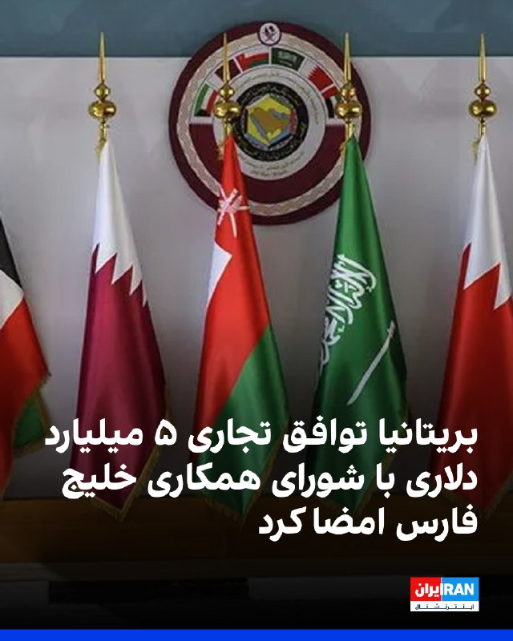

خبرگزاری رویترز گزارش داد بریتانیا چهارشنبه ۳۰ اردیبهشت اعلام کرد توافق تجاری جدیدی با شورای همکاری خلیج فارس به ارزش سالانه پنج میلیارد دلار در بلندمدت امضا کرده است؛ توافقی که در بحبوحه پیامدهای جنگ با جمهوری اسلامی، روابط اقتصادی لندن با متحدانش در منطقه را عمیق‌تر می‌کند.

شورای همکاری خلیج فارس شامل بحرین، کویت، عمان، قطر، عربستان سعودی و امارات متحده عربی است.

این توافق پس از حملات آمریکا و اسرائیل به جمهوری اسلامی در اسفند ۱۴۰۴ و حملات متقابل جمهوری اسلامی به برخی کشورهای منطقه حاصل شده؛ رخدادهایی که فشار بر عرضه انرژی و مواد غذایی را افزایش داده‌اند.

بر اساس این توافق، ۹۳ درصد تعرفه‌های کشورهای عضو شورای همکاری خلیج فارس بر کالاهای بریتانیایی حذف می‌شود و بخش‌هایی مانند خودروسازی، هوافضا، الکترونیک و صنایع غذایی از آن سود خواهند برد.
‌🏁 🇬🇧 IranintlTV

🤖 @VahidOOnLine

## VahidOOnLine — post 241180

  <a href="telegram/content/VahidOOnLine_241180_1779298541.mp4" target="_blank">🎬 Download video</a>

در پی تیراندازی افراد مسلح به نیروهای پلیس در یکی از محورهای شهرستان سراوان در استان سیستان و بلوچستان، یک مامور پلیس کشته شد.
بر اساس گزارش‌ها، سرنشینان مسلح یک خودروی سواری به سمت نیروهای امنیتی تیراندازی کردند که در نتیجه آن، ستوان سوم امیرحسین شهرکی جان خود را از دست داد.
پلیس اعلام کرده افراد مهاجم تحت تعقیب قرار گرفته‌اند و طرح‌های امنیتی و انتظامی در مناطق اطراف در حال اجراست.
‌🏁 🇬🇧 ManotoTV

🤖 @VahidOOnLine

## VahidOOnLine — post 241179

  

♦️۶ جوان اهل شهرک اکباتان تهران که در ارتباط با پرونده قتل یک بسیجی به نام آرمان علی‌وردی بازداشت شده بودند، از قتل عمد تبرئه شده و حکم اعدام دریافت نکردند.

خبرگزاری فارس روز چهارشنبه ۳۰ اردیبهشت اعلام کرد که شعبه ۱۳ دادگاه کیفری یک استان تهران که پیش‌تر حکم اعدام این شش جوان را صادر کرده بود، پس از نقض حکم در دیوان عالی، این بار با استناد به این‌که مشخص نیست ضربه منجر به کشته شدن علی‌وردی از سوی کدام‌یک از متهمان وارد شده، میلاد آرمون، علیرضا کفایی و امیرمحمد خوش‌اقبال را به اتهام «مشارکت در قتل عمد» به پرداخت دیه کامل و تحمل پنج سال حبس محکوم کرد. بر اساس این رای، علیرضا برمرزپورناک، حسین نعمتی و نوید نجاران نیز به دلیل این‌که مدرکی که ثابت کند ضربه‌ای به بدن آرمان علی‌وردی وارده کرده‌اند وجود نداشت، تبرئه شدند.

بر اساس فقه اسلامی در صدور حکم قصاص برای قتل، فقط شخصی که ضربه کشنده را وارد کرده می‌تواند با خواست اولیای دم قصاص شود. بر این اساس در صورتی که مشخص نشود ضربه کشنده دقیقا توسط چه کسی وارد شده، امکان صدور حکم قصاص وجود ندارد.
‌🇸🇦 Indypersian

🤖 @VahidOOnLine

## VahidOOnLine — post 241177

  

قیمت نفت، چهارشنبه ۳۰ اردیبهشت پس از اظهارات خوش‌بینانه دونالد ترامپ درباره مذاکرات با جمهوری اسلامی بیش از پنج درصد کاهش یافت.

بهای نفت برنت به ۱۰۵ دلار و ۷۰ سنت رسید؛ زیرا معامله‌گران به نشانه‌هایی واکنش نشان دادند که حاکی از نزدیک‌تر شدن واشینگتن و تهران به توافقی است که می‌تواند از دور تازه حملات جلوگیری کند و نگرانی‌ها درباره اختلال طولانی‌مدت عرضه در خاورمیانه را کاهش دهد.

ترامپ گفت مذاکرات با جمهوری اسلامی در «مراحل نهایی» قرار دارد، اما هشدار داد اگر تهران با توافق صلح موافقت نکند، آمریکا ممکن است حملات بیشتری انجام دهد.
‌🏁 🇬🇧 IranintlTV

🤖 @VahidOOnLine

## VahidOOnLine — post 241176

  

دونالد ترامپ گفت: «تنها سوال درباره ایران این است که آیا ما کار را تمام می‌کنیم یا آن‌ها سند را امضا می‌کنند.»
او پیش‌تر نیز درباره توافق با جمهوری اسلامی و موضوع تنگه هرمز گفت: «ما یک فرصت به این موضوع می‌دهیم. عجله‌ای ندارم. نمی‌خواهم افراد زیادی کشته شوند؛ ترجیح می‌دهم تعداد کمی کشته شوند.»
‌🏁 🇬🇧 IranintlTV

🤖 @VahidOOnLine

## mwarmonitor — post 9365

🔸سناتور لیندسی گراهام:

🔹«من معتقدم رئیس‌جمهور ترامپ کار درخشانی در تضعیف رژیم تروریستی ایران انجام داده و آن را به ضعیف‌ترین وضعیتش از سال ۱۹۷۹ رسانده است. به فرمانده کل قوا و همه کسانی که تحت فرمان او خدمت می‌کنند، دست‌مریزاد.

🔹مثل همه، من هم امیدوارم راه‌حلی دیپلماتیک برای بحران ایران پیدا شود، اما این راه‌حل باید جامع باشد تا اطمینان حاصل شود ایران دیگر بزرگ‌ترین حامی دولتی تروریسم نیست. همچنین باید واقعی باشد و مذاکرات باید قابل اعتماد انجام شوند. از تلاش همه در منطقه برای کمک به این هدف قدردانی می‌کنم.

🔹می‌شنوم که احتمال دارد فیلدمارشال پاکستان به ایران سفر کند — چه چیزی ممکن است اشتباه پیش برود؟! شاید او گزارشی از وضعیت هواپیماهای نظامی ایران که در پایگاه‌های هوایی پاکستان نگهداری می‌شوند ارائه دهد؟

🔹مثل بسیاری دیگر، من با دقت بسیار در حال دنبال کردن اتفاقاتی هستم که بار دیگر درباره تلاش برای رسیدن به توافق با رژیم ایران در حال رخ دادن است. برای همه افراد درگیر، آرزوی موفقیتی واقعی دارم.»

🔸مارک لوین ؛

🔹«لیندزی گراهام حق دارد که با تردید نگاه کند، اما در عین حال امیدوار باشد.»

@mwarmonitor

## mwarmonitor — post 9364

🔴«شبکه کان اسرائیل: نتانیاهو در تلاش است ترامپ را متقاعد کند تا چراغ سبز ازسرگیری جنگ علیه ایران را بدهد.» @mwarmonitor

## mwarmonitor — post 9363

🔴«بر اساس اسناد قضایی که روز چهارشنبه علنی شده، رائول کاسترو، رهبر پیشین کوبا، به همراه پنج نفر دیگر توسط یک هیئت منصفه فدرال آمریکا در ایالت فلوریدا کیفرخواست شده‌اند. به گزارش CBS

@mwarmonitor

## mwarmonitor — post 9362

🔴«فیننشال تایمز: OpenAI در حال آماده‌سازی برای ارائه درخواست عرضه عمومی سهام است و ممکن است این کار را از همین هفته انجام دهد. این آزمایشگاه هوش مصنوعی قصد دارد به‌زودی، احتمالاً تا ماه سپتامبر، یک عرضه اولیه سهام بسیار بزرگ و خبرساز برگزار کند.»

@mwarmonitor

## mwarmonitor — post 9361

🔴«شبکه کان اسرائیل: نتانیاهو در تلاش است ترامپ را متقاعد کند تا چراغ سبز ازسرگیری جنگ علیه ایران را بدهد.»

@mwarmonitor

## mwarmonitor — post 9360

  <a href="telegram/content/mwarmonitor_9360_1779298544.mp4" target="_blank">🎬 Download video</a>

🇺🇸اوایل امروز در دریای عمان، تفنگداران دریایی آمریکا از یگان اعزامی ۳۱ نیروی دریایی (31st Marine Expeditionary Unit) بر نفتکش تجاری Celestial Sea با پرچم ایران سوار شدند؛ این کشتی مظنون بود که قصد دارد با حرکت به‌سوی یک بندر ایرانی، تحریم دریایی آمریکا را نقض کند.

🔸نیروهای آمریکایی پس از بازرسی، این شناور را آزاد کرده و به خدمه آن دستور دادند مسیر خود را تغییر دهند.

🔹نیروهای آمریکا همچنان به اجرای کامل محاصره ادامه می‌دهند و تاکنون ۹۱ کشتی تجاری را برای اطمینان از رعایت این محاصره تغییر مسیر داده‌اند.

@mwarmonitor

## mwarmonitor — post 9359

🔴رویترز: برخی کشتی‌ها برای تضمین عبور از تنگه هرمز بیش از ۱۵۰ هزار دلار به ایران پرداخت می‌کنند.

🔸هزینه عبور کشتی‌ها از تنگه هرمز بر همه کشورها اعمال نمی‌شود.

@mwarmonitor

## mwarmonitor — post 9358

🔴ترامپ هشدار داد که درگیری‌های بیشتری در راه است مگر اینکه ایران «عاقل شود».

📝این جماعت چهل و هفت سال است که «عقل سلیم» را به جرم جاسوسی برای غرب اعدام کرده‌اند و حالا ترامپ توقع دارد پیدایش کنند؛ برای این‌ها، «عاقل شدن» یعنی خودکشی از ترس مرگ، و برای مردم یعنی تماشای یک مشت دیوانه که فرمان اتوبوسِ در حال سقوط را چسبیده‌اند و ذکر می‌گویند.

@mwarmonitor

## mwarmonitor — post 9357

🔴دموکرات‌های مجلس نمایندگان آمریکا از مارکو روبیو، وزیر امور خارجه، خواسته‌اند راهبرد پشت آنچه «شکاف‌های بی‌سابقه» در کمک‌های اروپایی می‌نامند را توضیح دهد. آن‌ها هشدار داده‌اند که تعطیل شدن آژانس توسعه بین‌المللی آمریکا (USAID) و اخراج‌های گسترده، متحدان آسیب‌پذیر را در برابر نفوذ روسیه بی‌دفاع گذاشته است.

@mwarmonitor

## mwarmonitor — post 9356

  

🇫🇷ناو هواپیمابر فرانسوی Charles de Gaulle (R91) در حال حاضر در جنوب عمان، در دریای عرب در حال حرکت است؛ این ناو چند روز پیش از خلیج عدن عبور کرده است.

@mwarmonitor

## mwarmonitor — post 9355

## mwarmonitor — post 9354

🔴 منابع دیپلماتیک به الجزیره: تعداد کشورهایی که از پیش‌نویس قطعنامه مربوط به تنگه هرمز در شورای امنیت حمایت می‌کنند به ۱۳۶ کشور رسیده است.

@mwarmonitor

## mwarmonitor — post 9353

  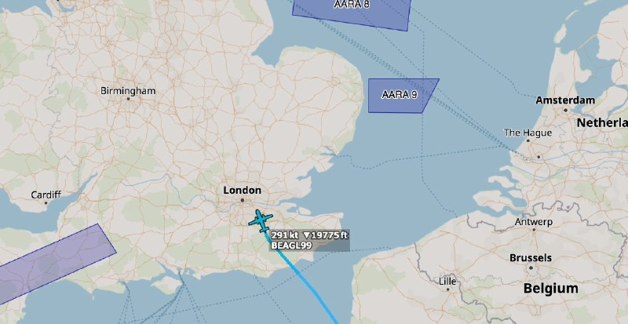

🇺🇸✈️نیروی هوایی ایالات متحده (USAF) – فرماندهی عملیات ویژه نیروی هوایی (AFSOC)

✈️دورنیه C-146A وولف‌هاوند ۱ فروند
AE68BF 16-3020 – BEAGLE 99

📌شناسهBEAGLE 99 پس از چند ماه دوری، در حال بازگشت به پایگاه RAF میلدنهال است.

@mwarmonitor

## mwarmonitor — post 9352

‼️منبع این خبر مربوط به «توافق احتمالی» که برخی رسانه‌ها مانند العربیه، ایران اینترنشنال منتشر شده توسط کانال‌های تلگرامی و واتساپی مرتبط با پاکستان بازنشر شده، تاکنون از سوی منابع رسمی پاکستان تأیید نشده است. بنابراین در حال حاضر در حد شایعه و گمانه‌زنی است و زمان صحت یا عدم صحت آن را مشخص خواهد کرد.

@mwarmonitor

## mwarmonitor — post 9351

🇺🇸 ترامپ درباره کوبا: آمریکا تحمل یک دولت یاغی را نخواهد داشت که عملیات نظامی، اطلاعاتی و تروریستی خارجیِ خصمانه را تنها در فاصله نود مایلی از ما انجام می‌دهد.

@mwarmonitor

## mwarmonitor — post 9350

  

✈️🇺🇸تحرکات سنگین نظامی آمریکا به سمت خاورمیانه همچنان ادامه دارد.

@mwarmonitor

## pm_afshaa — post 91120

  <a href="telegram/content/pm_afshaa_91120_1779298549.webm" target="_blank">🎬 Download video</a>

🔴کانال 12 اسرائیل: نتانیاهو از ترامپ خواست به فشار نظامی بر ایران ادامه بده.

💧 Rainbet.com the #1 Non-KYC Crypto Casino & Sportsbook @rainbetcom

😁 @Pm_Afshaa

## pm_afshaa — post 91119

  <a href="telegram/content/pm_afshaa_91119_1779298550.webm" target="_blank">🎬 Download video</a>

🔴سخنگوی وزارت خارجه ایران:
حضور وزیر کشور پاکستان برای تسهیل تبادل پیام‌ها و ارائه توضیحات تکمیلی جهت شفاف‌سازی متون ارسالی میان طرفین انجام می‌شود.

ایران با وجود سابقه منفی طرف مقابل در یک سال و نیم گذشته، با جدیت و حسن نیت مسیر مذاکره را دنبال می‌کند اما نسبت به عملکرد آمریکا «سوءظن شدید و منطقی» دارد.

💧 Rainbet.com the #1 Non-KYC Crypto Casino & Sportsbook @rainbetcom

😁 @Pm_Afshaa

## pm_afshaa — post 91118

  <a href="telegram/content/pm_afshaa_91118_1779298550.webm" target="_blank">🎬 Download video</a>

🔴ترامپ: ما ضربهٔ بسیار سختی به آنها وارد کردیم. ممکنه مجبور بشیم حتی سخت‌تر هم به آن‌ها ضربه بزنیم اما شاید هم نه.

ما اجازه نخواهیم داد ایران به سلاح هسته‌ای دست پیدا کنه و کل خاورمیانه رو منفجر کنه و بعد هم به اینجا بیاید و شما رو هدف قرار بده.

💧 Rainbet.com the #1 Non-KYC Crypto Casino & Sportsbook @rainbetcom

😁 @Pm_Afshaa

## pm_afshaa — post 91117

  <a href="telegram/content/pm_afshaa_91117_1779298551.mp4" target="_blank">🎬 Download video</a>

🔴ترامپ: همه چیزشون از بین رفته، تنها سوال اینه که ما بریم کار رو تموم کنیم یا قراره توافق رو امضا کنن؟ ببینیم چه اتفاقی میفته..

💧 Rainbet.com the #1 Non-KYC Crypto Casino & Sportsbook @rainbetcom

😁 @Pm_Afshaa

## pm_afshaa — post 91114

🔴ترامپ: ما در «مراحل نهایی» مذاکرات با ایران هستیم

شبکه الحدث: احتمالا طی ساعات آینده، متن توافق ایران و آمریکا نهایی میشه؛ دور بعدی مذاکرات هم باز تو پاکستانه.

💧 Rainbet.com the #1 Non-KYC Crypto Casino & Sportsbook @rainbetcom

😁 @Pm_Afshaa

## pm_afshaa — post 91113

سخنگوی وزارت خارجه : ما اورانیوم خودمونو به کسی تحویل نمیدیم و مسئله ی هسته ای ما کاملا صلح آمیزه

💧 Rainbet.com the #1 Non-KYC Crypto Casino & Sportsbook @rainbetcom

😁 @Pm_Afshaa

## pm_afshaa — post 91112

خالیباف:تحرکات آشکار و پنهان «دشمن» نشان می‌دهد که آنها به دنبال دور جدیدی از جنگ هستن

💧 Rainbet.com the #1 Non-KYC Crypto Casino & Sportsbook @rainbetcom

😁 @Pm_Afshaa

## pm_afshaa — post 91111

🔴سفیر آمریکا در سازمان ملل:
پول حکومت ایران رو به اتمام و اقتصادش درحال فروپاشیه

💧 Rainbet.com the #1 Non-KYC Crypto Casino & Sportsbook @rainbetcom

😁 @Pm_Afshaa

## pm_afshaa — post 91110

نسخه کامل گفتگو در نشست آینده تکنولوژی ایران

این نشست روز ۱۶ مه (۲۶ اردیبهشت) در محل دفتر مرکزی شرکت «اوبر» در شهر سان‌فرانسیسکو در ایالت کالیفرنیای آمریکا برگزار شد.

@OfficialRezaPahlavi

## DEJradio — post 4790

  <a href="telegram/content/DEJradio_4790_1779298554.mp4" target="_blank">🎬 Download video</a>

🔺🎥 “اینجا به ارزشی الاغ آموزش اسلحه میدن

یک شهروند از محله سرآسیاب مهرآباد تهران با ارسال ویدیویی می‌گوید اینجا به «ارزشی‌های الاغ آموزش اسلحه میدن».
توزیع و آموزش اسلحه بین هواداران حکومت‌ در شرایطی است که رژیم‌ بشار اسد و معمرقذافی نیز در واپسین ماه‌های قدرت همین کار را کرده بودند.

#الاغ #ارزشی
@DEJradio

## DEJradio — post 4789

  <a href="telegram/content/DEJradio_4789_1779298556.webm" target="_blank">🎬 Download video</a>

🔺📢 دونالد ترامپ:
در ایران خشم و ناآرامی زیادی وجود دارد

دونالد ترامپ، رییس‌جمهوری آمریکا، در یک مصاحبه گفته در ایران خشم و ناآرامی زیادی وجود دارد زیرا مردم در شرایط بدی زندگی می‌کنند و باید دید چه اتفاقی می‌افتد.

او با مقایسه جنگ‌های گذشته آمریکا در ویتنام، افغانستان و عراق گفت در آن جنگ‌ها صدها هزار نفر کشته شدند، اما در درگیری‌های اخیر، به گفته او، تنها ۱۳ نفر جان باخته‌اند و افزود: «ایران نابود شده است. چیزهای شگفت‌انگیزی خواهید دید.»

رییس‌جمهوری آمریکا درباره اقتصاد این کشور گفت سرمایه‌گذاری‌های عظیمی در حال انجام است و کارخانه‌های خودروسازی از کشورهای مختلف در حال انتقال به آمریکا هستند.
او در پاسخ به سوالی درباره وجود افراد مخالف در وزارت دادگستری و اف‌بی‌آی گفت اگر چنین افرادی باشند، آن‌ها را پیدا کرده و کنار خواهند گذاشت و افزود کشور در وضعیت خوبی قرار دارد.

#جنگ #ترامپ
@DEJradio

## DEJradio — post 4788

  <a href="telegram/content/DEJradio_4788_1779298556.mp4" target="_blank">🎬 Download video</a>

🔺🎥 حضور سنگین هواپیماهای نظامی آمریکا در فرودگاه بن‌گوریون اسرائیل.

#جنگ #حمله_نظامی
@DEJradio

## DEJradio — post 4787

  <a href="telegram/content/DEJradio_4787_1779298559.webm" target="_blank">🎬 Download video</a>

🚨
🔸 بر اساس گزارش منابع آمریکایی نیروهای سـ.ـپاه و ارتش در برخی مناطق ایران از جمله تهران، تبریز و حومه اهواز در چند منطقه درگیری شدند و به سمت حمل آتش گشودند.

شهرام سبزواری، کارشناس نظامی، در این باره توضیحاتی می‌دهد.

#ارتش #IRGCterrorists
@DEJradio

## DEJradio — post 4786

  <a href="telegram/content/DEJradio_4786_1779298560.mp4" target="_blank">🎬 Download video</a>

🔺📢 اعتراض به تهدید جنسی دختران مدرسه "شرافت" توسط ماموران امنیتی

#مدرسه_شرافت #تهدید_جنسی
@DEJradio

## DEJradio — post 4785

  <a href="telegram/content/DEJradio_4785_1779298562.webm" target="_blank">🎬 Download video</a>

🔺📌 خبرچین‌های نظام؛ کبک‌هایی با سر در برف
#یادداشت: فریبرز کرمی زند

در نهادهای اطلاعاتی جمهوری اسلامی، اعم از وزارت اطلاعات، اطلاعات سپاه، اطلاعات بسیج، حراست ادارات، حفاظت اطلاعات نیروهای مسلح و اطلاعات فراجا، قسمتی تحت عنوان «منابع و مخبرین» وجود دارد در این قسمت، پرونده افرادی نگهداری می‌شود که برای همکاری خبری و اطلاعاتی جذب شده‌اند.
در این پرونده‌ها، مشخصات کامل فردی و شغلی، حوزه فعالیت و محل نفوذ یا همان «نشانگاه» افراد ثبت می‌شود.

هر پرونده شامل بخش‌های مختلفی است، اما دو بخش آن از اهمیت ویژه‌ای برخوردار است: بخش «محصولی» و بخش «مالی» در بخش محصولی، تمامی اخبار، گزارش‌ها و اطلاعاتی که مخبر ارائه داده ثبت می‌شود و در بخش مالی، جزئیات مبالغ پرداخت‌ شده و نوع آن در قبال همان اطلاعات درج می‌گردد. برخی از مخبران در نشانگاه‌های خاص تصور می‌کنند زرنگ هستند و نمی‌خواهند مستقیماً پول نقد دریافت کنند، اما به هر شیوه ای که دریافت کنند جزئیات آن نیز در پرونده ثبت می‌شود.

حتی فرم‌های ملاقات، نحوه ارتباط، شیوه هدایت مخبر توسط افسر هادی و گزارش جلسات نیز در بخش های دیگر پرونده بایگانی می‌شود.

خلاصه اینکه مخبران نظام باید بدانند تمام جزئیات همکاری آن‌ها مو به مو ثبت و نگهداری می‌شود؛ از اخبار و گزارش‌ها گرفته تا محل ملاقات و حتی فاکتور رستورانی که جلسه در آن برگزار شده است این موارد شامل مخبران و آدم‌ فروشان خارج از کشور نیز می‌شود.

#وزارت_اطلاعات #اطلاعاتی #مخبر
@DEJradio

## DEJradio — post 4784

  <a href="telegram/content/DEJradio_4784_1779298563.webm" target="_blank">🎬 Download video</a>

🔺🎤 انتقاد از حضور جمهوری اسلامی در نهادهای حقوق بشری سازمان ملل؛

گفت‌وگو با هیلل نویر، مدیر اجرایی دیده‌بان در سازمان ملل.

#حقوق_بشر #سازمان_ملل
@DEJradio

## VahidOnline — post 75581

  <a href="telegram/content/VahidOnline_75581_1779298563.mp4" target="_blank">🎬 Download video</a>

دونالد ترامپ، رئیس‌جمهوری ایالات متحده، روز چهارشنبه ۳۰ اردیبهشت با تاکید بر این‌که نیروی دریایی و هوایی ایران از بین رفته‌اند، گفت اکنون تنها سوال این است که آیا آمریکا برای تمام کردن کار بازمی‌گردد یا جمهوری اسلامی پای امضای یک سند (توافق‌نامه) خواهد آمد.

ترامپ که در مراسم فارغ‌التحصیلی آکادمی گارد ساحلی آمریکا سخنرانی می‌کرد، گفت: «همه چیزِ آن‌ها از دست رفته است؛ نیروی دریایی‌شان نابود شده، نیروی هوایی‌شان از بین رفته و تقریبا همه‌چیزشان را از دست داده‌اند. اکنون تنها سوال این است که آیا ما پیش می‌رویم تا کار را تمام کنیم، یا اینکه آن‌ها یک سند را امضا خواهند کرد؟ باید ببینیم چه پیش می‌آید.»
@VahidOOnLine

📡 @VahidOnline

## VahidOnline — post 75580

  

قیمت نفت، چهارشنبه ۳۰ اردیبهشت پس از اظهارات خوش‌بینانه دونالد ترامپ درباره مذاکرات با جمهوری اسلامی بیش از پنج درصد کاهش یافت.

بهای نفت برنت به ۱۰۵ دلار و ۷۰ سنت رسید؛ زیرا معامله‌گران به نشانه‌هایی واکنش نشان دادند که حاکی از نزدیک‌تر شدن واشینگتن و تهران به توافقی است که می‌تواند از دور تازه حملات جلوگیری کند و نگرانی‌ها درباره اختلال طولانی‌مدت عرضه در خاورمیانه را کاهش دهد.

ترامپ گفت مذاکرات با جمهوری اسلامی در «مراحل نهایی» قرار دارد، اما هشدار داد اگر تهران با توافق صلح موافقت نکند، آمریکا ممکن است حملات بیشتری انجام دهد.
@VahidOOnLine

📡 @VahidOnline

## VahidOnline — post 75579

  

فیصل بن فرحان، وزیر خارجه عربستان سعودی، نوشت ریاض از تصمیم رییس‌جمهوری آمریکا برای دادن فرصت دوباره به مذاکرات با جمهوری اسلامی به‌منظور دستیابی به توافقی که به پایان جنگ و بازگشت امنیت و آزادی کشتیرانی در تنگه هرمز به وضعیت پیش از ۹ اسفند ۱۴۰۴ منجر شود، قدردانی می‌کند.

او همچنین از تلاش‌های مستمر پاکستان برای میانجی‌گری در این زمینه تقدیر کرد و در شبکه ایکس نوشت عربستان سعودی امیدوار است جمهوری اسلامی از این فرصت برای جلوگیری از «پیامدهای خطرناک تشدید تنش» استفاده کرده و فورا به تلاش‌ها برای پیشبرد مذاکرات پاسخ دهد.

وزیر خارجه عربستان سعودی افزود هدف از این تلاش‌ها، دستیابی به توافقی جامع است که صلح پایدار در منطقه و جهان را محقق کند.
@VahidOOnLine

📡 @VahidOnline

## VahidOnline — post 75578

  <a href="telegram/content/VahidOnline_75578_1779298565.mp4" target="_blank">🎬 Download video</a>

محمدباقر قالیباف، رئیس مجلس ایران گفت که «تحرکات آشکار و پنهان دشمن نشان می‌دهد که به موازات فشارهای اقتصادی و سیاسی از اهداف نظامی خود دست نکشیده و به دنبال دور جدیدی از جنگ و ماجراجویی جدید است.»

او این اظهارات را در سومین پیام صوتی خود مطرح کرد و با اشاره به گذشت یک ماه از آتش‌بس، فضای سیاسی پیرامون دونالد ترامپ، رئیس‌جمهور ایالات متحده را از عوامل تأثیرگذار بر تصمیم‌گیری‌های او در قبال ایران دانست.

قالیباف در این پیام، با تاکید بر تداوم فشارهای اقتصادی و سیاسی، گفت که هدف این فشارها واداشتن ایران به عقب‌نشینی است، اما به ادعای او ساختار نظامی کشور برای بازسازی توان عملیاتی خود از فرصت این دوره یک‌ماهه آتش‌بس استفاده کرده است.

در بخش دیگری از این پیام صوتی ۱۲ دقیقه‌ای، رئیس مجلس ایران با انتقاد از برخی جریان‌های سیاسی، آنان را به «نادیده گرفتن شرایط امنیتی» و تمرکز بیش از حد بر نقد دولت متهم کرد و گفت که طرح این انتقادات می‌تواند به انسجام ملی آسیب بزند.
@VahidHeadline

📡 @VahidOnline

## VahidOnline — post 75577

  <a href="telegram/content/VahidOnline_75577_1779298566.mp4" target="_blank">🎬 Download video</a>

دونالد ترامپ، رئیس‌جمهوری آمریکا، پیش از ترک واشنگتن به مقصد کانتیکت، در گفتگو با خبرنگاران در فرودگاه به تشریح وضعیت تقابل با ایران و گزینه‌های روی میز پرداخت.

او با اشاره به وضعیت داخلی ایران مدعی شد: «در حال حاضر خشم زیادی در ایران وجود دارد، زیرا مردم در شرایط بسیار بدی زندگی می‌کنند. ناآرامی و تلاطمی در آنجا جریان دارد که قبلا نظیرش را ندیده‌ایم؛ باید دید چه پیش می‌آید.»

ترامپ در پاسخ به سوال خبرنگار درباره احتمال انجام یک «توافق محدود برای تمدید آتش‌بس» گفت: «ما این شانس را امتحان می‌کنیم. من عجله‌ای ندارم؛ هرچند موضوع انتخابات میان‌دوره‌ای مطرح است، اما در حالت ایده‌آل ترجیح می‌دهم به جای افراد زیاد، آدم‌های کمتری کشته شوند.»

رئیس‌جمهوری آمریکا همچنین با ابراز تردید درباره نیت مقامات تهران گفت: «من متعجبم که آیا آن‌ها واقعا خیر و صلاح مردم خود را می‌خواهند یا خیر؛ رفتار آن‌ها نشان می‌دهد که به فکر مردم نیستند، در حالی که باید خیر و صلاح کل منطقه را در نظر بگیرند.»
@VahidOOnLine

📡 @VahidOnline

## VahidOnline — post 75574

  <a href="telegram/content/VahidOnline_75574_1779298567.mp4" target="_blank">🎬 Download video</a>

اسماعیل بقائی، سخنگوی وزارت امور خارجه جمهوری اسلامی، روز چهارشنبه ۳۰ اردیبهشت‌ماه درباره گمانه‌زنی‌ها راجع به سفر عباس عراقچی به نیویورک گفت:  «وزیر خارجه ایران برای شرکت در نشست شورای امنیت سازمان ملل درباره صلح و امنیت بین‌المللی دعوت شده، اما حضور او هنوز قطعی نیست.»

به گفته سخنگوی وزارت امور خارجه جمهوری اسلامی «این نشست به ریاست دوره‌ای چین در شورای امنیت، روز پنجم خرداد برگزار خواهد شد، اما با توجه به برنامه کاری فشرده وزیر امور خارجه»، تصمیم نهایی درباره سفر هنوز گرفته نشده است.»

این اظهارات پس از آن مطرح شد که علی خضریان، عضو کمیسیون امنیت ملی مجلس، در یک برنامه تلویزیونی نسبت به احتمال سفر عراقچی به نیویورک برای مذاکره درباره تنگه هرمز انتقاد کرده بود.
@VahidOOnLine

📡 @VahidOnline

## VahidOnline — post 75572

خبرگزاری قوه‌قضائیه گزارش داد رشید مظاهری، دروازه‌بان پیشین تیم ملی فوتبال و استقلال تهران، «هنگام تلاش برای خروج غیرقانونی از مرزهای غربی ایران بازداشت شده است.»
میزان در این گزارش رشید مظاهری را متهم کرده که «قصد داشته با تغییر چهره و پرداخت رشوه به ماموران مرزبانی از کشور خارج شود.»

قوه قضائیه به زمان بازداشت این بازیکن پیشین تیم ملی فوتبال ایران اشاره نکرده است.

رشید مظاهری پس از کشتار معترضان در ۱۸ و ۱۹ دی، با انتشار ویدیویی در پنجم اسفند، علی خامنه‌ای را مسئول کشته‌شدن معترضان معرفی کرده بود. پس از انتشار آن ویدیو، تا مدت‌ها خبری از وضعیت او منتشر نشده بود.
خبرگزاری میزان گزارش کرده که مظاهری در «بند عمومی زندان» به سر می‌برد و قرار است به اتهام‌های «پرداخت رشوه به مامور دولت»، «فعالیت تبلیغی برخلاف امنیت ملی در شرایط جنگی» و «اقدام به عبور غیرمجاز از مرز» محاکمه شود.
@VahidOOnLine

📡 @VahidOnline

## VahidOnline — post 75571

  

در میانه اختلال در مسیرهای رسمی تجارت و فشار بر زنجیره تأمین صنایع، سازمان توسعه تجارت ایران واردات برخی مواد اولیه پتروشیمی و پلیمری را از طریق رویه‌های کولبری و ملوانی مجاز اعلام کرد.

این تصمیم نشان می‌دهد بحران تأمین مواد اولیه در صنایع پایین‌دستی به مرحله‌ای رسیده که حکومت برای جبران کمبود، به مسیرهای مرزی و غیرمتعارف متوسل شده است.

اما این تصمیم پرسش‌های جدی ایجاد می‌کند. مواد اولیه پلیمری و پتروشیمی کالای مصرفی ساده نیستند؛ واردات آنها نیازمند حجم بالا، کنترل کیفیت، استاندارد، ردیابی منشأ، بیمه، حمل‌ونقل تخصصی و تسویه تجاری منظم است.
@VahidHeadline

📡 @VahidOnline

## VahidOnline — post 75570

  

سپاه پاسداران با انتشار بیانیه‌ای تهدید کرده که در صورت آغاز دوباره جنگ آمریکا و اسرائیل علیه ایران، جنگ «به فراتر از منطقه کشیده خواهد شد.»

در این بیانیه با اشاره به تهدیدهای دونالد ترامپ و مقام‌های اسرائیل برای حمله مجدد به ایران آمده: «اگر تجاوز به ایران تکرار شود جنگ منطقه‌ای که وعده داده شده بود، این بار به فراتر از منطقه کشیده خواهد شد و ضربات کوبنده ما در جاهایی که تصور آن را ندارید شما را به خاک سیاه خواهد نشاند.»

عباس عراقچی، وزیر خارجه ایران هم در واکنش به اظهارات تهدیدآمیز دونالد ترامپ، رئیس‌جمهور آمریکا، درباره احتمال از سرگیری حمله نظامی به ایران، در شبکه ایکس نوشته «با درس‌هایی که آموخته‌ایم و دانشی که به دست آورده‌ایم، مطمئن باشید بازگشت به میدان جنگ با شگفتی‌های بسیار بیشتری همراه خواهد بود.»
@VahidHeadline

📡 @VahidOnline

## VahidOnline — post 75569

  

رسانه‌های ایران روز چهارشنبه ۳۰ اردیبهشت خبر دادند که محسن نقوی، وزیر کشور پاکستان، وارد تهران شده است. او روز ۲۶ اردیبهشت نیز به ایران سفر کرده بود.

خبرگزاری ایسنا اعلام کرده که برنامه و اهداف سفر این مقام ارشد پاکستانی در ایران «مشخص نیست». خبرگزاری تسنیم نیز گزارش داده که آقای نقوی در بدو ورود به تهران با وزیر کشور ایران دیدار کرده است.
@VahidHeadline

📡 @VahidOnline

## VahidOnline — post 75568

  

رسانه‌ها در ایران از اجرای حکم اعدام قاتل الهه حسین‌نژاد، که جسد او اوایل خرداد سال گذشته در بیابان‌های اطراف تهران پیدا شد، خبر می‌دهند.

عصر چهارم خرداد ۱۴۰۴ الهه حسین‌نژاد ۲۴ ساله از سالن زیبایی که در آنجا مشغول به کار بود، بیرون آمد تا به خانه‌اش در اسلامشهر برود، اما ناپدید شد و وقتی خانواده‌اش اعلام شکایت کردند بررسی‌های تیم جنایی نشان می‌داد الهه از میدان آزادی سوار یک خودروی عبوری شده است.

جست و جوها برای یافتن الهه سرانجام پس از ۱۱ روز نتیجه داد و با دستگیری راننده خودرو به نام بهمن ۳۷ ساله و اعتراف به قتل الهه، جسد او در بیابان‌های اطراف تهران پیدا شد. متهم نیز پس از محاکمه به اعدام محکوم شد.

این قتل جنجال زیادی درباره امنیت زنان در ایران به پا کرد و تا مدت‌ها رسانه‌ها درباره آن مطالب مختلفی منتشر می‌کردند.

@VahidHeadline

📡 @VahidOnline

## VahidOnline — post 75567

  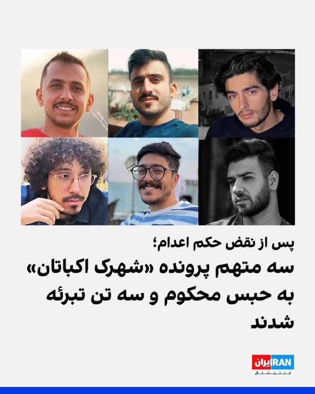

رسانه‌های حقوق بشری گزارش دادند دادگاه کیفری تهران پس از رسیدگی دوباره به پرونده شهرک اکباتان، سه معترض بازداشت‌شده در این پرونده را به دیه و پنج سال حبس محکوم و سه معترض دیگر را از اتهام مشارکت در «قتل عمد» تبرئه کرد. حکم اعدام این شش تن پیش‌تر در دیوان عالی کشور نقض شده بود.

سایت هرانا چهارشنبه ۳۰ اردیبهشت گزارش داد شعبه ۱۳ دادگاه کیفری یک استان تهران، میلاد آرمون، علیرضا کفایی و امیرمحمد خوش‌اقبال را بابت اتهام «مشارکت در قتل عمد» آرمان علی‌وردی، از نیروهای بسیج، محکوم کرد. هر یک از آن‌ها به پرداخت سهم مساوی از دیه کامل یک انسان و پنج سال حبس محکوم شده‌اند.

طبق گزارش هرانا، نوید نجاران، حسین نعمتی و علیرضا برمرزپورناک، سه متهم دیگر این پرونده، به دلیل «فقدان مدارک دال بر وارد کردن ضربه به ناحیه مشخصی از بدن علی‌وردی» از اتهام مشارکت در قتل عمد تبرئه شدند.

این حکم ۱۵ بهمن سال گذشته صادر و سه‌شنبه ۲۹ اردیبهشت به وکلای این افراد ابلاغ شده است.

این شش شهروند معترض در آبان ۱۴۰۳ از سوی همین شعبه به اعدام محکوم شده بودند.
@VahidOOnLine

📡 @VahidOnline

## IranIntlTV — post 338124

  

فرماندهی مرکزی آمریکا، سنتکام، اعلام کرد نیروهای تفنگدار دریایی آمریکا از یگان اعزامی ۳۱، چهارشنبه ۳۰ اردیبهشت در دریای عمان سوار نفتکش تجاری «سلستیال سی» با پرچم جمهوری اسلامی شدند.

به نوشته سنتکام، این نفتکش مظنون بود که با حرکت به سوی یکی از بنادر ایران، محاصره دریایی آمریکا را نقض کند. نیروهای آمریکایی پس از بازرسی و دستور به خدمه برای تغییر مسیر، کشتی را آزاد کردند.

سنتکام افزود نیروهای آمریکا به اجرای کامل این محاصره ادامه می‌دهند و تاکنون ۹۱ کشتی تجاری را برای اطمینان از رعایت آن، تغییر مسیر داده‌اند.
https://iranintl.com/202605202458

## IranIntlTV — post 338123

ترامپ: مذاکرات با تهران در مراحل نهایی است، توافق نکنند حمله می‌کنیم

دونالد ترامپ، رییس‌جمهوری آمریکا، چهارشنبه ۳۰ اردیبهشت گفت مذاکرات با جمهوری اسلامی در مراحل نهایی قرار دارد اما هم‌زمان هشدار داد که در صورت شکست مذاکرات، حملات بیشتری علیه جمهوری اسلامی انجام خواهد شد. این اظهارات هم‌زمان با سفر وزیر کشور پاکستان به تهران مطرح شد.
شش هفته پس از آنکه ترامپ عملیات «خشم حماسی» را برای برقراری آتش‌بس متوقف کرد، تاکنون پیشرفت چندانی در مذاکرات برای پایان دادن به جنگ دیده نشده است.
ترامپ دوشنبه گفت که تا آستانه صدور دستور حملات بیشتر پیش رفته، اما به درخواست رهبران عربستان سعودی، قطر و امارات متحده عربی برای دادن زمان بیشتر به مذاکرات، از آن خودداری کرده است.
فیصل بن فرحان، وزیر امور خارجه عربستان سعودی، چهارشنبه در پستی در شبکه اجتماعی ایکس نوشت ریاض از تصمیم رییس‌جمهوری آمریکا برای دادن فرصت دوباره به مذاکرات با جمهوری اسلامی به‌منظور دستیابی به توافقی که به پایان جنگ و بازگشت امنیت و آزادی کشتیرانی در تنگه هرمز به وضعیت پیش از ۹ اسفند ۱۴۰۴ منجر شود، قدردانی می‌کند.
او همچنین از تلاش‌های مستمر پاکستان برای میانجی‌گری در این زمینه تقدیر کرد و در شبکه ایکس نوشت عربستان سعودی امیدوار است جمهوری اسلامی از این فرصت برای جلوگیری از «پیامدهای خطرناک تشدید تنش» استفاده کرده و فورا به تلاش‌ها برای پیشبرد مذاکرات پاسخ دهد.
وزیر امور خارجه عربستان سعودی افزود هدف از این تلاش‌ها، دستیابی به توافقی جامع است که صلح پایدار در منطقه و جهان را محقق کند.
تشدید فعالیت‌های میانجیگرانه پاکستان
این اظهارات هم‌زمان با سفر محسن نقوی، وزیر کشور پاکستان به تهران صورت گرفته است. او در جریان این سفر چهارشنبه با محمدباقر قالیباف، رییس مجلس شورای اسلامی و رییس هیات مذاکره‌کننده جمهوری اسلامی با آمریکا و نیز احمد وحیدی، فرمانده کل سپاه پاسداران، دیدار و گفت‌وگو کرد.
در پی این سفر، برخی از رسانه‌های منطقه گزارش دادند که کار بر روی نهایی‌سازی متن توافق میان واشینگتن و تهران با جدیت در حال انجام است.
الحدث به‌نقل از منابع آگاه که نام آنها را اعلام نکرد، گزارش داد که دور بعدی مذاکرات پس از مراسم حج در اسلام‌آباد برگزار خواهد شد.
الحدث همچنین افزود ممکن است فرمانده کل ارتش پاکستان پنج‌شنبه ۳۱ اردیبهشت برای اعلام نهایی شدن متن توافق به ایران سفر کند.
شبکه العربیه نیز گزارش داد که ایالات متحده خواسته‌های خود در خصوص مساله هسته‌ای و امنیت ناوبری در تنگه هرمز را سختگیرانه‌تر کرده اما در عین حال بر سر چند موضوع اقتصادی و کاهش تحریم‌های اعمال‌شده علیه جمهوری اسلامی انعطاف‌هایی محدود از خود نشان داده است.
به‌گزارش العربیه ایالات متحده به پاکستان اطلاع داده است که در زمینه برنامه هسته‌ای و تنگه هرمز هیچ امتیازی نخواهد داد.
در مقابل جمهوری اسلامی نیز همچنان تضمین‌های آمریکا درباره هرگونه حمله احتمالی در آینده را ناکافی می‌داند.
جزییات بیشتر را اینجا بخوانید
@iranintltv

## IranIntlTV — post 338122

یک شهروند در پیامی به ایران اینترنشنال از افزایش قیمت شدید داروهای مربوط به اختلالات روحی و روانی می‌گوید. پیام او و تصویر این ویدیو با هوش مصنوعی خوانده شده است.

## IranIntlTV — post 338121

  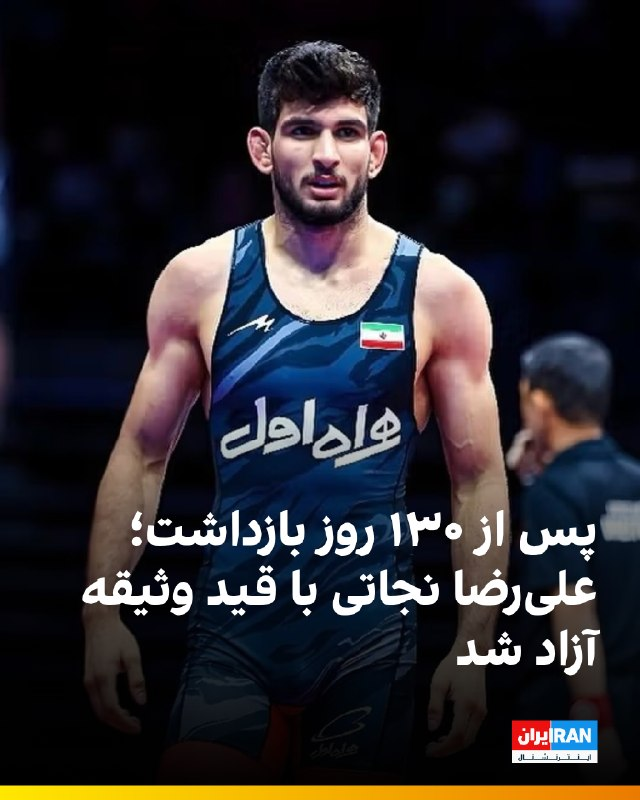

🔻ایران اینترنشنال دریافته است که علیرضا نجاتی، قهرمان پیشین کشتی، پس از ۱۳۰ روز بازداشت با قید وثیقه آزاد شده است. او در روز ۱۹ دی ۱۴۰۴ و در پی حمایت از انقلاب ملی ایرانیان بازداشت شد.

🔹نجاتی ۵۰ روز از دوران بازداشت خود را در سلول انفرادی بوده و در این مدت تحت شکنجه و ضرب‌وشتم قرار گرفته است.

🔹قاضی انصاری که یکی از دو حکم اعدام صالح محمدی را صادر کرده بود، مسئول رسیدگی به پرونده علیرضا نجاتی است.

🔹پیش‌تر جهان‌پهلوان رسول خادم، قهرمان پیشین کشتی المپیک، با انتشار یک استوری در اینستاگرام خواهان آزادی علیرضا نجاتی شده بود.

@iranintltvsport

## IranIntlTV — post 338120

  

خبرگزاری رویترز به نقل از دو منبع اروپایی در حوزه کشتیرانی گزارش داد برخی کشتی‌هایی که تحت پوشش توافق‌های دولت‌به‌دولت نیستند، برای عبور امن از تنگه هرمز بیش از ۱۵۰ هزار دلار به مقام‌های ایرانی پرداخت می‌کنند.

رویترز همچنین نوشت اوایل ماه مه حدود هزار و ۵۰۰ کشتی با ۲۲ هزار ملوان در خلیج گرفتار شده‌اند.

بر اساس این گزارش، نفتکش «آگیوس فانوریوس ۱» پس از عبور از هرمز، شش روز در چارچوب محاصره دریایی آمریکا متوقف شد.

رویترز افزود سپاه پاسداران مدارک وابستگی کشتی‌ها را بررسی می‌کند و به شناورهای مرتبط با روسیه و چین اولویت می‌دهد.
https://iranintl.com/202605207586

## IranIntlTV — post 338119

پوشش آزاد در قاب حکومت؛
واقعیت یا شو تبلیغاتی؟

چهار دهه پس از آنکه جمهوری اسلامی حجاب اجباری را به یکی از اصلی‌ترین ستون‌های هویتی و ایدئولوژیک خود تبدیل کرد، اکنون همان حکومت در مراسم و تجمع‌های رسمی، زنانی با پوشش اختیاری را مقابل دوربین‌های رسانه‌های حکومتی به نمایش می‌گذارد.
تصاویری که برای بسیاری نه نشانه تغییر، بلکه بخشی از پروژه‌ای تبلیغاتی برای بازسازی چهره حکومت به شمار می‌رود.
زن بی‌حجاب؛ قاب تازه تبلیغات حکومتی
از زمان آغاز جنگ و برگزاری راهپیمایی‌ها و تجمع‌های شبانه حامیان حکومت، این نمایش رسانه‌ای پررنگ‌تر شده است؛ تصاویری که هم برای مخاطب داخلی طراحی شده‌اند و هم برای بازتاب در رسانه‌های خارجی.
در این قاب‌ها، زنانی دیده می‌شوند که بدون حجاب اجباری در مراسم حضور دارند، اما به‌عنوان حامیان جمهوری اسلامی معرفی می‌شوند؛ روایتی که حکومت می‌کوشد از طریق آن نشان دهد حتی بخشی از زنانی که به پوشش اجباری پایبند نیستند نیز همچنان در کنار نظام ایستاده‌اند.
این چرخش تبلیغاتی در حالی رخ می‌دهد که جمهوری اسلامی طی سال‌ها حجاب را یکی از خطوط قرمز ایدئولوژیک خود معرفی کرده بود. علی خامنه‌ای نیز بارها در سخنرانی‌هایش «کشف حجاب» را نه فقط یک ناهنجاری اجتماعی، بلکه «حرام شرعی و سیاسی» توصیف کرده و آن را بخشی از پروژه مقابله با جمهوری اسلامی دانسته بود.
حکومتی که طی ۴۷ سال گذشته زنان را به‌دلیل نوع پوشش با بازداشت، شلاق، زندان و انواع فشارهای امنیتی و قضایی مواجه کرده و در مواردی نیز برخوردهای مرتبط با حجاب به جان‌باختن زنان انجامیده، اکنون در رسانه‌های رسمی خود زنانی با پوشش اختیاری را به‌عنوان حامیان نظام نمایش می‌دهد.
جزییات بیشتر را اینجا بخوانید
@iranintltv

## IranIntlTV — post 338118

  <a href="telegram/content/IranIntlTV_338118_1779298572.mp4" target="_blank">🎬 Download video</a>

یک کارمند شرکت هواپیمایی «آتا» در پیامی به ایران اینترنشنال می‌گوید سه ماه است حقوق کارمندان این شرکت پرداخت نشده است. پیام مخاطب با هوش مصنوعی خوانده شده است.

## IranIntlTV — post 338117

هزینه ماهانه درمان یک بیمار مبتلا به سرطان دست‌کم ۱۰ میلیون تومان است

پیام‌های رسیده به ایران‌اینترنشنال حاکی از فشار فزاینده هزینه‌های درمان و کمبود دارو به شهروندان در کنار بحران معیشتی است. برخی بیماران برای تامین هزینه دارو و آزمایش ناچار به قرض گرفتن پول شده‌اند، برخی قید درمان را زده‌اند و بسیاری، زیر بار گرانی‌ها فرسوده شده‌اند.
شهروندی که خود را کارمند اورژانس اجتماعی معرفی کرد، از موج بزرگ رهاشدن بیماران اعصاب و روان و سالمندان از سوی خانواده‌ها خبر داد.
او گفت با توجه به گرانی داروهای اعصاب و روان و پیدا نشدن داروها، به نظر می‌رسد شماری از خانواده‌ها دیگر توان نگهداری بیماران و سالمندان را ندارند و آن‌ها را به امید مراقبت‌های دولتی و عمومی، رها می‌کنند.
شهروندی از شیراز یادآوری کرد هزینه بخشی از درمان و داروهای یک بیمار مبتلا به سرطان ماهانه ۱۰ میلیون تومان است.
به گفته او، داروهای براتیگا و زولادکس تحت پوشش بیمه هستند، اما بیمه فقط حدود ۳۰ درصد مبلغ آن‌ها را پرداخت می‌کند.
در پی افزایش هزینه‌های درمان، مهدی پیرصالحی، رییس سازمان غذا و دارو، در مصاحبه با خبرگزاری ایلنا گفت قیمت دارو به‌دلیل تورم و افزایش قیمت سایر کالاها در حال رشد است؛ بنابراین بیمه‌ها باید این پوشش را فراهم کنند.
او وعده داد برای رفع کمبودهای دارویی، «مذاکراتی با بانک مرکزی» انجام شده و وعده‌هایی برای تامین ارز و ریال به شرکت‌های دارویی و تجهیزات پزشکی داده شده است.
شهروندی از کرمانشاه نوشت: «خرج دارو و درمان مادر بیمارم هر روز بیشتر می‌شود. فردا باید ۱۱۰ میلیون تومان به بیمارستان پرداخت کنم. فقط برای تامین هزینه‌های درمان مادرم، مجبورم در ۲۴ ساعت، ۴۸ ساعت کار کنم.»
شهروندی نیز یادآوری کرد پدرش پارکینسون دارد و هر ماه با بیمه، حدود ۴۰ تا ۵۰ میلیون تومان هزینه درمانش می‌شود.
@iranintltv

## IranIntlTV — post 338116

فایننشال‌تایمز: بحران خلیج فارس شاید تازه آغاز شده باشد
بازارهای جهانی نفت همچنان امیدوارند بحران خلیج فارس به‌زودی پایان یابد، اما تحلیلگران هشدار می‌دهند اختلال‌های ناشی از «جنگ ایران»، بسته ماندن تنگه هرمز و آسیب گسترده به زیرساخت‌های انرژی، ممکن است جهان را وارد مرحله‌ای از کمبود واقعی منابع و رکود اقتصادی کند.
فایننشال‌تایمز چهارشنبه ۳۰ اردیبهشت در گزارشی تحلیلی نوشت که پس از آغاز «جنگ ایران» و سپس محاصره دریایی، اکنون مرحله تازه‌ای آغاز شده است: کمبود کالاهای حیاتی.
نفتکش‌های حامل نفت، گاز طبیعی مایع، اوره، فرآورده‌های پالایش‌شده نفتی، هیدروژن و هلیوم، از حدود ۸۰ روز قبل دیگر به شکل گسترده از تنگه هرمز عبور نکرده‌اند. کشتی‌هایی که پیش‌تر منطقه را ترک کرده بودند، عمدتا به مقصد رسیده‌اند، اما از این پس نبود محموله‌هایی که هرگز خارج نشدند، به‌تدریج محسوس خواهد شد.
این گزارش تاکید کرد که تا امروز، کمبودها بیشتر «ذهنی» بوده‌اند، اما اکنون به کمبودهای واقعی تبدیل خواهند شد. وضعیتی که به گفته تحلیلگران، در نهایت یا با سهمیه‌بندی و یا با رکود اقتصادی، مدیریت می‌شود.

جزییات بیشتر را اینجا بخوانید
@iranintltv

## IranIntlTV — post 338115

  <a href="https://t.me/IranintlTV/338115" target="_blank">📎 Download file</a>

🎧نسخه صوتی اخبار شبانگاهی | چهارشنبه ۳۰ اردیبهشت
@iranintlTV

## IranIntlTV — post 338113

  

خبرگزاری رویترز گزارش داد بریتانیا چهارشنبه ۳۰ اردیبهشت اعلام کرد توافق تجاری جدیدی با شورای همکاری خلیج فارس به ارزش سالانه پنج میلیارد دلار در بلندمدت امضا کرده است؛ توافقی که در بحبوحه پیامدهای جنگ با جمهوری اسلامی، روابط اقتصادی لندن با متحدانش در منطقه را عمیق‌تر می‌کند.

شورای همکاری خلیج فارس شامل بحرین، کویت، عمان، قطر، عربستان سعودی و امارات متحده عربی است.

این توافق پس از حملات آمریکا و اسرائیل به جمهوری اسلامی در اسفند ۱۴۰۴ و حملات متقابل جمهوری اسلامی به برخی کشورهای منطقه حاصل شده؛ رخدادهایی که فشار بر عرضه انرژی و مواد غذایی را افزایش داده‌اند.

بر اساس این توافق، ۹۳ درصد تعرفه‌های کشورهای عضو شورای همکاری خلیج فارس بر کالاهای بریتانیایی حذف می‌شود و بخش‌هایی مانند خودروسازی، هوافضا، الکترونیک و صنایع غذایی از آن سود خواهند برد.
https://iranintl.com/202605209023

## IranIntlTV — post 338112

  <a href="telegram/content/IranIntlTV_338112_1779298576.mp4" target="_blank">🎬 Download video</a>

تیتراول با نیوشا صارمی، چهارشنبه ۳۰ اردیبهشت
@iranintltv

## IranIntlTV — post 338111

  <a href="telegram/content/IranIntlTV_338111_1779298578.mp4" target="_blank">🎬 Download video</a>

در حالی که رسانه عربی الحدث مدعی شده فرمانده ارتش پاکستان ممکن است فردا برای اعلام نهایی شدن متن توافق به ایران سفر کند، سپاه پاسداران با صدور بیانیه‌ای تهدید کرد در صورت حمله دوباره آمریکا و اسرائیل، جنگ را به فراتر از منطقه خواهد کشاند.

گزارشی از مجتبا پورمحسن
@iranintltv

## IranIntlTV — post 338110

  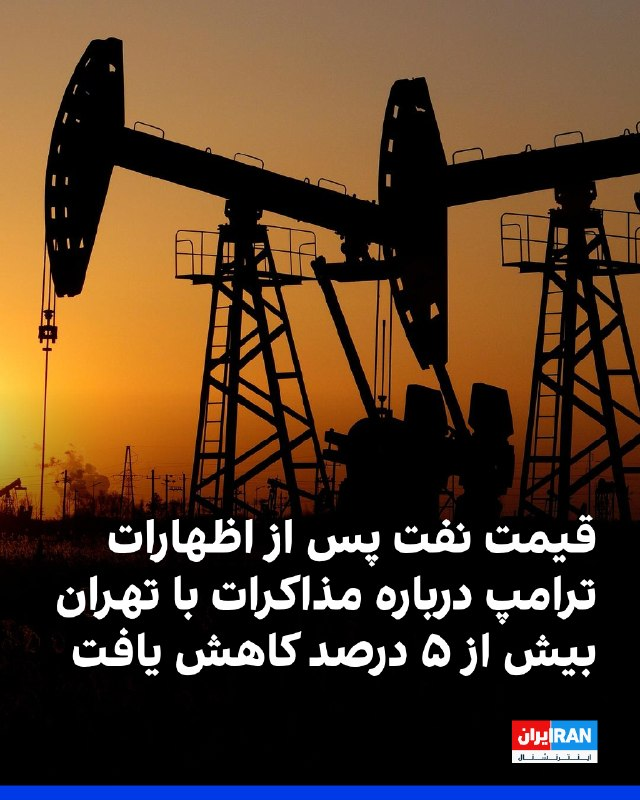

قیمت نفت، چهارشنبه ۳۰ اردیبهشت پس از اظهارات خوش‌بینانه دونالد ترامپ درباره مذاکرات با جمهوری اسلامی بیش از پنج درصد کاهش یافت.

بهای نفت برنت به ۱۰۵ دلار و ۷۰ سنت رسید؛ زیرا معامله‌گران به نشانه‌هایی واکنش نشان دادند که حاکی از نزدیک‌تر شدن واشینگتن و تهران به توافقی است که می‌تواند از دور تازه حملات جلوگیری کند و نگرانی‌ها درباره اختلال طولانی‌مدت عرضه در خاورمیانه را کاهش دهد.

ترامپ گفت مذاکرات با جمهوری اسلامی در «مراحل نهایی» قرار دارد، اما هشدار داد اگر تهران با توافق صلح موافقت نکند، آمریکا ممکن است حملات بیشتری انجام دهد.
https://iranintl.com/202605203209

## IranIntlTV — post 338109

  <a href="telegram/content/IranIntlTV_338109_1779298581.mp4" target="_blank">🎬 Download video</a>

دونالد ترامپ گفت جمهوری اسلامی فرصت چندانی برای توافق ندارد.

او افزود وضعیت مردم در ایران خوب نیست و خشم بزرگی از جمهوری اسلامی وجود دارد.

گفت‌وگو با جمشید برزگر، روزنامه‌نگار و تحلیل‌گر سیاسی
@iranintltv

## IranIntlTV — post 338108

  

دونالد ترامپ گفت: «تنها سوال درباره ایران این است که آیا ما کار را تمام می‌کنیم یا آن‌ها سند را امضا می‌کنند.»
او پیش‌تر نیز درباره توافق با جمهوری اسلامی و موضوع تنگه هرمز گفت: «ما یک فرصت به این موضوع می‌دهیم. عجله‌ای ندارم. نمی‌خواهم افراد زیادی کشته شوند؛ ترجیح می‌دهم تعداد کمی کشته شوند.»
https://iranintl.com/202605203059

## IranIntlTV — post 338107

  <a href="telegram/content/IranIntlTV_338107_1779298584.mp4" target="_blank">🎬 Download video</a>

یک شهروند در پیامی به ایران اینترنشنال با اشاره به دوگانگی شیوه زندگی و سخنان مسئولان جمهوری اسلامی می‌گوید: «من هم یک زندگی معمولی می‌خواهم اما مادرم معصومه ابتکار نیست.» پیام مخاطب با هوش مصنوعی خوانده شده است.

## IranIntlTV — post 338106

  

ابراهیم رضایی، سخنگوی کمیسیون امنیت ملی مجلس، گفت کشورهای منطقه به همان اندازه مهلتی که ترامپ برای حمله بعدی تعیین کرده، فرصت دارند نیروهای آمریکایی را به‌طور دائم اخراج کنند و بعدا گلایه‌ای نداشته باشند.

رضایی افزود برنامه جمهوری اسلامی برای «ورشکستگی سیاسی و اقتصادی» ترامپ، از مسیر برخی کشورهای منطقه دنبال می‌شود.
https://iranintl.com/202605208322

## IranIntlTV — post 338105

  

فیصل بن فرحان، وزیر خارجه عربستان سعودی، نوشت ریاض از تصمیم رییس‌جمهوری آمریکا برای دادن فرصت دوباره به مذاکرات با جمهوری اسلامی به‌منظور دستیابی به توافقی که به پایان جنگ و بازگشت امنیت و آزادی کشتیرانی در تنگه هرمز به وضعیت پیش از ۹ اسفند ۱۴۰۴ منجر شود، قدردانی می‌کند.

او همچنین از تلاش‌های مستمر پاکستان برای میانجی‌گری در این زمینه تقدیر کرد و در شبکه ایکس نوشت عربستان سعودی امیدوار است جمهوری اسلامی از این فرصت برای جلوگیری از «پیامدهای خطرناک تشدید تنش» استفاده کرده و فورا به تلاش‌ها برای پیشبرد مذاکرات پاسخ دهد.

وزیر خارجه عربستان سعودی افزود هدف از این تلاش‌ها، دستیابی به توافقی جامع است که صلح پایدار در منطقه و جهان را محقق کند.
https://iranintl.com/202605208600

## IranIntlTV — post 338104

  

بر اساس گزارش‌های رسیده به ایران‌اینترنشنال، مهدی مهمدی کرتلائی، ۱۶ ساله، در شامگاه ۱۹ دی و هم‌زمان با فراخوان شاهزاده، در محدوده شوشتر و روستای عقیلی در استان خوزستان، با شلیک گلوله جنگی نیروهای حکومتی کشته شد.

بنا بر این گزارش، پیکر او پس از دریافت پول و گرفتن تعهد از خانواده تحویل داده شد و صبح شنبه ۲۰ دی، در شرایط امنیتی و با حضور شمار محدودی از بستگان به خاک سپرده شد
https://iranintl.com/202605209075

## Shin_Persian — post 6116

  <a href="telegram/content/Shin_Persian_6116_1779298589.mp4" target="_blank">🎬 Download video</a>

U.S. Central Command ✓ @CENTCOM Wed, 20 May 2026 16:59:47 UTC Earlier today in the Gulf of Oman, U.S. Marines from the 31st Marine Expeditionary Unit boarded M/T Celestial Sea, an Iranian-flagged commercial oil tanker suspected of attempting to violate the…

## Shin_Persian — post 6115

U.S. Central Command ✓ @CENTCOM
Wed, 20 May 2026 16:59:47 UTC

Earlier today in the Gulf of Oman, U.S. Marines from the 31st Marine Expeditionary Unit boarded M/T Celestial Sea, an Iranian-flagged commercial oil tanker suspected of attempting to violate the U.S. blockade by transiting toward an Iranian port. American forces released the vessel after searching and directing the ship’s crew to alter course.

U.S. forces continue to fully enforce the blockade and have now redirected 91 commercial ships to ensure compliance.

فارسی

امروز در اوایل وقت در دریای عمان، تفنگداران دریایی ایالات متحده از واحد ۳۱ اعزامی تفنگداران دریایی، وارد نفت‌کش تجاری M/T Celestial Sea شدند؛ این کشتی با پرچم ایران مظنون به تلاش برای نقض محاصره ایالات متحده از طریق عبور به سمت یک بندر ایرانی بود. نیروهای آمریکایی پس از بازرسی و هدایت خدمه کشتی برای تغییر مسیر، شناور را آزاد کردند.

نیروهای ایالات متحده به اجرای کامل محاصره ادامه می‌دهند و تاکنون ۹۱ کشتی تجاری را برای اطمینان از انطباق با قوانین تغییر مسیر داده‌اند.

𝕏 · @shin_persian

## Shin_Persian — post 6114

  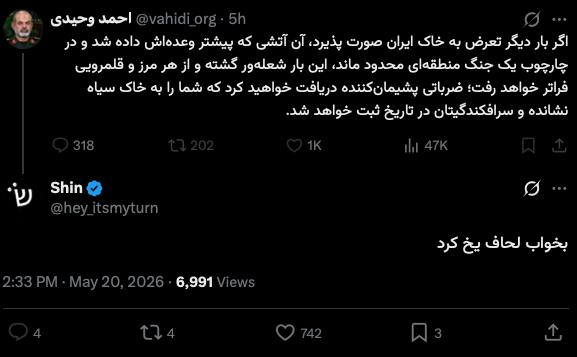

سردار مادرجنده بی جنبه :( بلاک کرد

## ManotoTV — post 105699

  <a href="telegram/content/ManotoTV_105699_1779298592.mp4" target="_blank">🎬 Download video</a>

‌
سنتکام، ستاد فرماندهی مرکزی آمریکا، با انتشار ویدیویی اعلام کرد تفنگداران دریایی آمریکا در خلیج عمان یک نفتکش تجاری با پرچم ایران را متوقف و بازرسی کرده‌اند.

به گفته سنتکام، نیروهای «واحد اعزامی سی‌ویک تفنگداران دریایی آمریکا» ساعاتی پیش سوار نفتکش «سلستیال سی» شدند؛ کشتی‌ای که به تلاش برای نقض محاصره دریایی آمریکا و حرکت به‌سوی یکی از بنادر ایران مظنون بوده است.

سنتکام اعلام کرد نیروهای آمریکایی پس از بازرسی کامل نفتکش، به خدمه دستور تغییر مسیر دادند و سپس کشتی را آزاد کردند.

در بیانیه سنتکام آمده است نیروهای آمریکا همچنان «به‌طور کامل» محاصره دریایی را اجرا می‌کنند و تاکنون مسیر ۹۱ کشتی تجاری را برای اطمینان از رعایت این محدودیت‌ها تغییر داده‌اند.

## ManotoTV — post 105698

این خالکوبی فقط یک نقش روی صورتش نیست…
زخمِ نسلی‌ست که سال‌ها درد را نفس کشید، فریاد زد، سکوت کرد، گریه کرد، شکست، ایستاد، اما فراموش نکرد.

یادِ کودکانی‌ست که جنگ و ترس را زودتر از زندگی شناختند.

او می‌خواهد مردم هر بار که به این طرح روی صورتش نگاه می‌کنند، قصه‌ی روزهایی را به یاد بیاورند که از میان آتش، ترس، درد، ناامیدی و امید عبور کردند.

اما این فقط درد نیست…
این تتو، یادآور امید و زندگی هم هست.
یادآور روزهایی که هنوز برای ساختنشان زنده‌اند.

درست است که این تتو، طرحی از «God of War» است…
اما آن را به رنگ سبز انتخاب کرده‌اند؛ به نشانه عشق، صلح، امید و زندگی.

برای اینکه حقیقت فراموش نشود،
برای اینکه نسل بعد بداند مردم از چه روزهایی عبور کردند…
و چگونه با تمام زخم‌هایشان، هنوز عاشق ایران و ایرانی ماندند.

فراموش نکنید…
وقتی انسان‌ها برای شرافت، معرفت، عشق و گذشت ارزش قائل نشوند، ارزش‌ها کم‌کم معنای خودشان را از دست می‌دهند.

اول به انسان‌ها، بعد به حیوانات و در نهایت به طبیعت و گیاهان رحم کنیم و عشق بورزیم…
شاید دنیا هم یاد بگیرد که با ما مهربان‌تر باشد.

او سوخت…
آن‌ها سوختند…

یادتان نرود…
یادمان نرود.

## ManotoTV — post 105697

  <a href="telegram/content/ManotoTV_105697_1779298593.mp4" target="_blank">🎬 Download video</a>

نیروی دریایی سپاه اعلام کرده طی ۲۴ ساعت گذشته ۲۶ کشتی از تنگه هرمز عبور کرده‌اند.
با این حال، رویترز می‌نویسد این روند که در ظاهر نشانه‌ای از باز شدن مسیر کشتیرانی است، در عمل می‌تواند نشانه‌ای از افزایش کنترل جمهوری‌اسلامی بر این آبراه راهبردی باشد.
تهران پیش‌تر اعلام کرده بود در صورت دریافت هزینه یا عوارض از کشتی‌های تجاری، امکان بازگشایی تنگه هرمز را بررسی خواهد کرد؛ آبراهی که حدود یک‌پنجم صادرات نفت جهان از آن عبور می‌کند.
بر اساس این گزارش و به نقل از ۲۰ منبع، جمهوری‌اسلامی اکنون ایست‌های بازرسی نظامی، بررسی کشتی‌ها، ترتیبات دیپلماتیک و در برخی موارد دریافت هزینه امنیتی برای عبور ایمن را در این مسیر اعمال کرده است.
رویترز همچنین می‌گوید تهران در عمل در حال ایجاد یک «سازوکار پیچیده و چندلایه» است که به کشتی‌ها اجازه عبور می‌دهد، اما تنها در صورتی که از سوی نیروهای جمهوری‌اسلامی تأیید شوند.

## ManotoTV — post 105696

  <a href="telegram/content/ManotoTV_105696_1779298594.mp4" target="_blank">🎬 Download video</a>

تیم ملی فوتبال ایران هنوز ویزای آمریکا برای جام جهانی را دریافت نکرده است.

مقام‌های ایرانی گفته‌اند بازیکنان و اعضای کادر فنی تیم ملی هنوز موفق به دریافت ویزا برای حضور در جام جهانی ۲۰۲۶ در آمریکا نشده‌اند و قرار است برای دریافت ویزا از طریق سفارت کانادا در ترکیه اقدام کنند.

تیم ملی ایران قرار است ۱۵ ژوئن در نخستین بازی خود در گروه G در لس‌آنجلس به مصاف نیوزیلند برود و سپس برابر بلژیک و مصر بازی کند.

## ManotoTV — post 105695

  <a href="telegram/content/ManotoTV_105695_1779298595.mp4" target="_blank">🎬 Download video</a>

دونالد ترامپ، رئیس‌جمهور آمریکا، در ادامه سخنرانی خود در آکادمی گارد ساحلی آمریکا در ایالت کنتیکت گفت این نیرو نقش مهمی در عملیات «خشم حماسی» داشته است. ترامپ گفته گارد ساحلی آمریکا در اجرای محاصره علیه ایران کمک کرده و نمونه‌ای از آن را توقیف یک نفتکش ایرانی تحریم‌شده در نزدیکی سواحل مالزی عنوان کرد؛ نفتکشی که به گفته او نفت را از جزیره خارک حمل می‌کرده است.
او خطاب به حضار گفت: «این سومین کشتی ایرانیِ تحریم‌شده است که گارد ساحلی از زمان آغاز درگیری‌ها درگیری واقعی در توقیف آن کمک کرده است.»
ترامپ افزود: «با ایران و احتمالا موارد بیشتری هم در راه است، مگر اینکه آن‌ها عاقل شوند.» او همچنین گفته او گفت: «همه‌چیزشان از بین رفته؛ نیروی دریایی‌شان نابود شده، نیروی هوایی‌شان از بین رفته، تقریباً همه‌چیز.»
ترامپ افزود: «تنها سوال این است که آیا می‌رویم و کار را تمام می‌کنیم یا آن‌ها قرار است یک توافق امضا کنند. باید ببینیم چه اتفاقی می‌افتد.»

## ManotoTV — post 105694

  <a href="telegram/content/ManotoTV_105694_1779298595.mp4" target="_blank">🎬 Download video</a>

اسماعیل بقائی، سخنگوی وزارت خارجه جمهوری‌اسلامی اعلام کرده روند تبادل پیام‌ها میان جمهوری‌اسلامی و آمریکا «بر اساس متن ۱۴‌بندی پیشنهادی ایران» همچنان ادامه دارد و حضور وزیر کشور پاکستان در این روند با هدف «تسهیل مبادله پیام‌ها» میان دو طرف انجام شده است. وزیر کشور پاکستان امروز برای دومین بار طی یک هفته به تهران سفر کرد. به گفته سخنگوی وزارت خارجه نظام، تمرکز تهران بر «خاتمه جنگ در تمامی جبهه‌ها از جمله لبنان»، آزادسازی پول‌های بلوکه شده ایران، و توقف «راهزنی دریایی‌» اشاره به محاصره دریایی آمریکا در تنگه هرمز است.

## ManotoTV — post 105693

  <a href="telegram/content/ManotoTV_105693_1779298596.mp4" target="_blank">🎬 Download video</a>

دونالد ترامپ، رئیس‌جمهور آمریکا، در سخنرانی خود در مراسم فارغ‌التحصیلی آکادمی گارد ساحلی آمریکا در نیو لندنِ ایالت کنتیکت، بار دیگر جمهوری‌اسلامی را درباره برنامه هسته‌ای‌اش تهدید کرد و رسانه‌ها را «اخبار جعلی» خواند.
ترامپ که پشت شیشه ضدگلوله سخنرانی می‌کرد، پس از پرداختن به مسائل داخلی آمریکا، دوباره به موضوع ایران بازگشت و گفت: «ما اجازه نخواهیم داد ایران به سلاح هسته‌ای دست پیدا کند. موضوع همین‌قدر ساده است.»
او همچنین گفت جمهوری‌اسلامی «به‌شدت» خواهان توافق است و افزود: «باید ببینیم چه اتفاقی می‌افتد.»
ترامپ با اشاره به حملات آمریکا گفت: «ما ضربات بسیار سختی به آن‌ها زدیم و شاید مجبور شویم حتی شدیدتر هم ضربه بزنیم.»

## ManotoTV — post 105692

  <a href="telegram/content/ManotoTV_105692_1779298597.mp4" target="_blank">🎬 Download video</a>

در پی تیراندازی افراد مسلح به نیروهای پلیس در یکی از محورهای شهرستان سراوان در استان سیستان و بلوچستان، یک مامور پلیس کشته شد.
بر اساس گزارش‌ها، سرنشینان مسلح یک خودروی سواری به سمت نیروهای امنیتی تیراندازی کردند که در نتیجه آن، ستوان سوم امیرحسین شهرکی جان خود را از دست داد.
پلیس اعلام کرده افراد مهاجم تحت تعقیب قرار گرفته‌اند و طرح‌های امنیتی و انتظامی در مناطق اطراف در حال اجراست.

## ManotoTV — post 105691

  <a href="telegram/content/ManotoTV_105691_1779298598.mp4" target="_blank">🎬 Download video</a>

وزیر خارجه عربستان از تصمیم ترامپ برای تعویق حمله به ایران استقبال کرد.

فیصل بن فرحان، وزیر خارجه عربستان سعودی، در پیامی در شبکه اکس نوشت کشورش از تصمیم دونالد ترامپ برای دادن زمان بیشتر به مذاکرات با تهران استقبال می‌کند و ریاض از «فرصت دادن به دیپلماسی» برای پایان جنگ و بازگرداندن امنیت و آزادی کشتیرانی در تنگه هرمز حمایت می‌کند.

بن فرحان همچنین از جمهوری اسلامی خواست «فوراً» به تلاش‌ها برای پیشبرد مذاکرات و دستیابی به توافقی جامع پاسخ دهد.

## ManotoTV — post 105690

  <a href="telegram/content/ManotoTV_105690_1779298598.mp4" target="_blank">🎬 Download video</a>

انفجار خودروی متعلق به سازمان حمل‌ونقل نیویورک در نزدیکی وال‌استریت، باعث وحشت و فرار عابران شد.

ویدیوهای منتشرشده نشان می‌دهد این خودرو پس از آتش‌گرفتن، مقابل ساختمان مرکزی «ام‌تی‌ای» در منهتن به گلوله‌ای از آتش تبدیل شد.

آتش‌نشانی نیویورک اعلام کرد این حادثه تلفاتی نداشته و علت آن در دست بررسی است.

## ManotoTV — post 105689

  <a href="telegram/content/ManotoTV_105689_1779298600.mp4" target="_blank">🎬 Download video</a>

‌
الجزیره به نقل از «منابع دیپلماتیک» گزارش داد شمار کشورهای حامی پیش‌نویس قطعنامه درباره تنگه هرمز به ۱۳۶ کشور رسیده است.

پیش‌نویس این قطعنامه از جمهوری اسلامی می‌خواهد حملات و مین‌گذاری در تنگه هرمز را متوقف کند، اما دیپلمات‌ها می‌گویند در صورت مطرح شدن برای رأی‌گیری، احتمالاً با وتوی چین و روسیه روبه‌رو خواهد شد.

چین و روسیه ماه گذشته نیز قطعنامه مشابهی را که با حمایت آمریکا ارائه شده بود، وتو کرده بودند و آن را جانبدارانه علیه جمهوری اسلامی دانستند.

## ManotoTV — post 105688

  <a href="telegram/content/ManotoTV_105688_1779298601.mp4" target="_blank">🎬 Download video</a>

فرانسه پس از انتشار ویدیویی از برخورد با فعالان ناوگان امدادی عازم غزه، سفیر اسرائیل را احضار می‌کند. ایتالیا نیز پیش‌تر اقدام مشابهی انجام داده بود.
ژان‌نوئل بارو، وزیر خارجه فرانسه، رفتار ایتامار بن‌گویر، وزیر امنیت ملی اسرائیل از جناح راست افراطی، با فعالان بین‌المللی را «غیرقابل قبول» توصیف کرد و گفت پاریس خواهان توضیح رسمی از اسرائیل است.
این واکنش‌ها پس از انتشار ویدیویی از سوی بن‌گویر مطرح شد که او را در محل نگهداری فعالان «فلوتیلا گلوبال سومود» نشان می‌دهد؛ کاروانی متشکل از ده‌ها قایق و صدها فعال از کشورهای مختلف که چند روز پیش در آب‌های بین‌المللی، حدود ۲۵۰ مایل دریایی از غزه، توسط نیروی دریایی اسرائیل متوقف شد.
اسرائیل این کاروان را «تحریک‌آمیز» و حامی حماس توصیف کرده و فعالان را به بندر اشدود منتقل کرده است.
در ویدیوی منتشرشده، بن‌گویر در حالی که پرچم اسرائیل در دست دارد، مقابل فعالان دست‌بندزده می‌گوید: «به اسرائیل خوش آمدید، ما صاحب‌خانه‌ایم» و آن‌ها را «حامی تروریسم» می‌خواند. او همچنین از بنیامین نتانیاهو خواسته این افراد «برای مدت طولانی» در زندان نگهداری شوند.
این ویدیو در چند ساعت نخست بیش از ۱.۷ میلیون بار دیده شد و موجی از واکنش‌های تند را در اسرائیل و خارج از این کشور به‌دنبال داشت.
برخی مقام‌های اسرائیلی، از جمله گیدئون ساعر، وزیر خارجه اسرائیل، رفتار بن‌گویر را آسیب‌زننده به وجهه اسرائیل دانسته‌اند. دفتر نتانیاهو نیز با دفاع از توقیف ناوگان، اعلام کرده نحوه برخورد بن‌گویر «با ارزش‌ها و هنجارهای اسرائیل همخوانی ندارد» و خواستار اخراج سریع فعالان شده است.

## ManotoTV — post 105687

  <a href="telegram/content/ManotoTV_105687_1779298602.mp4" target="_blank">🎬 Download video</a>

‌
دونالد ترامپ، رئیس‌جمهوری آمریکا، با اشاره به وضعیت داخلی ایران گفت مطمئن نیست مقام‌های جمهوری اسلامی «خیر و صلاح مردم» را بخواهند.

ترامپ گفت: «بعضی از کارهایی که با من می‌کنند نشان می‌دهد که خیر مردم را نمی‌خواهند، در حالی که باید خیر مردم را بخواهند.»

او همچنین از افزایش نارضایتی عمومی در ایران سخن گفت و افزود: «الان خشم زیادی در ایران وجود دارد، چون مردم در شرایط بسیار بدی زندگی می‌کنند.»

رئیس‌جمهوری آمریکا همچنین گفت در ایران «ناآرامی و التهاب زیادی» وجود دارد که به گفته او، مشابه آن پیش‌تر دیده نشده است.

## ManotoTV — post 105686

  <a href="telegram/content/ManotoTV_105686_1779298604.mp4" target="_blank">🎬 Download video</a>

محمدباقر قالیباف، رئیس مجلس شورای اسلامی، در آنچه رسانه‌های حکومتی «سومین فایل صوتی» توصیف کرده‌اند از جمله گفته «تحرکات آشکار و پنهان دشمن نشان می‌دهد که طرف مقابل به‌دنبال آغاز دور جدیدی از جنگ است.»

## ManotoTV — post 105685

  <a href="telegram/content/ManotoTV_105685_1779298605.mp4" target="_blank">🎬 Download video</a>

مدیرعامل شرکت ملی نفت ابوظبی، اعلام کرده است امارات متحده عربی اجرای طرح ساخت یک خط لوله جدید برای دور زدن تنگه هرمز را پیش برده و این پروژه اکنون ۵۰ درصد پیشرفت داشته است.
در حال حاضر خط لوله عملیاتی امارات، خط لوله حبشان–فجیره است که از میادین نفتی حبشان در جنوب‌غرب ابوظبی تا بندر فجیره در دریای عمان امتداد دارد.
این خط لوله در حال حاضر توان انتقال تا ۱.۸ میلیون بشکه نفت در روز را دارد. تاسیسات نفتی فجیره از زمان آغاز جنگ چندین بار هدف حملات پهپادی منتسب به ایران قرار گرفته است.
بر اساس اعلام مقامات اماراتی، خط لوله جدید قرار است ظرفیت کل صادرات نفت این کشور را تا سال آینده دو برابر کند.

## FarsiVOA — post 218241

پیام صریح بغداد به گروه‌های مسلح: هیچ حمله‌ای از خاک عراق تحمل نمی‌شود

## FarsiVOA — post 218240

  <a href="telegram/content/FarsiVOA_218240_1779298606.mp4" target="_blank">🎬 Download video</a>

فرماندهی مرکزی ایالات متحده، سنتکام، از بازرسی یک نفتکش مظنون به تلاش برای نقض محاصره دریایی آمریکا با حرکت به سمت یک بندر ایرانی خبر داد.

بنا بر گزارش سنتکام، ساعاتی پیش در خلیج عمان، تفنگداران دریایی ایالات متحده، بر عرشه نفتکش تجاری «ام/تی سلستیال سی» که پرچم ایران داشت و مظنون به تلاش برای نقض محاصره دریایی علیه جمهوری اسلامی بود فرود آمدند.

نیروهای آمریکایی پس از بازرسی و دستور به خدمه کشتی برای تغییر مسیر، کشتی را آزاد کردند.

سنتکام با تاکید بر اجرای محاصره دریایی اعلام کرد تاکنون ۹۱ کشتی تجاری را مجبور به تغییر مسیر کرده‌اند.

## FarsiVOA — post 218239

گفت‌وگو با محمد قائدی، مدرس روابط بین‌الملل، درباره دوگانه جنگ و مذاکره در اظهارات مقام‌های آمریکا و جمهوری اسلامی

## FarsiVOA — post 218238

رئیس جمهوری آمریکا روز چهارشنبه ۳۰ اردیبهشت سخنران اصلی مراسم دانش‌آموختگی آکادمی گارد ساحلی در شهر نیو لاندن، ایالت کنتیکت، بود. صدای آمریکا بخشی از این سخنرانی را به صورت مستفیم و با ترجمه همزمان پژواک کیومرثی پخش کرد.

## FarsiVOA — post 218237

گفت‌وگو با خالد عزیزی،‌ سخنگوی حزب دموکرات کردستان ایران، درباره ادامه حملات جمهوری اسلامی به مواضع احزاب کُرد در عراق.

## FarsiVOA — post 218236

ایران روزگاری کشوری بود که صدای بازی کودکان در کوچه‌ها بخشی از هویت روزمره‌اش بود. اما اکنون آمارهای رسمی از کاهش شدید نرخ باروری، پیرشدن جمعیت و بسته‌شدن پنجره جمعیتی خبر می‌دهند.

## FarsiVOA — post 218235

در گفت‌وگو با رضا تقی‌زاده، تحلیلگر روابط بین‌الملل، به حمله پهپادی به نیروگاه هسته‌ای امارات و محکومیت آن از سوی همه اعضای شورای امنیت از جمله روسیه و چین پرداختیم و پرسیدیم آیا این اجماع می‌تواند به تعریف خط قرمزی جدید و شکل‌گیری ائتلافی جدید علیه جمهوری اسلامی و نیروهای نیابتی‌اش بیانجامد؟

## FarsiVOA — post 218234

در گفت‌وگو با شاهین مدرس، تحلیلگر مطالعات امنیتی، به هشدارپرزیدنت ترامپ درباره بازگشت گزینه نظامی، تهدیدهای حکومت ایران و سپاه پاسداران پرداختیم و بررسی کردیم این پیام‌های متقابل چه تأثیری بر محاسبات بازیگران منطقه‌ای و مسیر تنش در روزهای پیش‌رو خواهد گذاشت

## FarsiVOA — post 218233

🔺پرزیدنت ترامپ درباره عملیات نظامی علیه رژيم ایران: یا توافق امضا می‌شود یا کار را تمام می‌کنیم

▪️رئیس جمهوری آمریکا روز چهارشنبه ۳۰ اردیبهشت در مراسم دانش‌آموختگی آکادمی گارد ساحلی در شهر نیو لاندن، ایالت کنتیکت، درباره اقدام آتی ایالات متحده در قبال جمهوری اسلامی و عملیات نظامی علیه رژيم ایران گفت: «یا توافق امضا می‌شود یا کار را تمام می‌کنیم.»

⬇️ بیشتر بخوانید:

https://ir.voanews.com/a/trump-coast-guard-academy/8152031.html/?nocach=1

## FarsiVOA — post 218232

🔺سنتکام درباره محاصره دریایی جمهوری اسلامی: ۹۰ کشتی را وادار به تغییر مسیر و ۴ کشتی را غیر فعال کردیم

▪️سنتکام در یک به‌روز‌رسانی تازه درباره محاصره دریایی جمهوری اسلامی، از افزایش تعداد شناورهایی که در جریان این عملیات وادار به تغییر مسیر شده و یا از کار افتاده‌اند، خبر داد.

⬇️ بیشتر بخوانید:

https://ir.voanews.com/a/ship-patrol-strait-of-hormuz-attack-helicopter/8151990.html/?nocach=1

## FarsiVOA — post 218231

  <a href="telegram/content/FarsiVOA_218231_1779298609.mp4" target="_blank">🎬 Download video</a>

ارتش اسرائیل تصاویری از «سواستفاده‌ سازمان تروریستی حماس از جمعیت غیرنظامی و کودکان» در غزه منتشر کرده است.

در ویدیوهای منتشر شده از دوربین پهپاد ارتش اسرائیل، یک نیروی حماس دیده می‌شود که در محوطه یک مدرسه در نوار غزه به کودکان سلاح داده و کودکان با این سلاح‌ها بازی می‌کنند

ارتش اسرائیل در بیانیه خود اعلام کرد «این مستندات نشان‌دهنده سواستفاده‌ نظام‌مند و بی‌رحمانه سازمان تروریستی حماس از جمعیت غیرنظامی به‌عنوان سپر انسانی است، در حالی که این اقدامات نقض قوانین بین‌المللی به شمار می‌رود.»

این ویدیو بی‌صدا است.

## FarsiVOA — post 218225

📷نیروی دریایی ایالات متحده تصاویری از کهکشان راه شیری بر فراز عرشه کشتی فرماندهی و کنترل یواس‌اس مونت ویتنی (ال‌سی‌سی ۲۰) منتشر کرده که در دریای مدیترانه در حرکت است.

مونت ویتنی در حال انجام ماموریت در منطقه عملیات ناوگان ششم ایالات متحده برای آمادگی نیروی دریایی این کشور در اروپا-آفریقا و دفاع از منافع آمریکا و متحدانش در این منطقه است.

## FarsiVOA — post 218224

دونالد ترامپ، رئیس‌ جمهوری آمریکا، روز چهارشنبه ۳۰ اردیبهشت گفت که قصد او در مورد مساله ایران این است که افراد کمتری کشته شوند. او با این‌حال تاکید کرد که مطمئن نیست رژیم جمهوری اسلامی تا چه اندازه به فکر مردم ایران است.

## FarsiVOA — post 218223

🔺پرزیدنت ترامپ: در ایران شرایط زندگی بسیار بد و میزان خشم و نارضایتی بی‌سابقه است؛ تنگه هرمز باز خواهد شد

▪️پرزیدنت ترامپ گفت: «الان در ایران خشم زیادی وجود دارد چون مردم وضعیت زندگی بسیار بدی دارند. ناآرامی زیادی هست که قبلاً این‌قدر ندیده بودیم و خواهیم دید چه اتفاقی می‌افتد.»

⬇️ بیشتر بخوانید:

https://ir.voanews.com/a/iran-trump-us-people-hormuz/8152001.html/?nocach=1

## DW_Farsi — post 124937

  

🔶 قالیباف: دشمن به دنبال ماجراجویی تازه و دور جدیدی از حملات است

محمدباقر قالیباف، رئیس مجلس شورای اسلامی روز چهارشنبه ۳۰ اردیبهشت گفت با وجود آن‌که حدود یک ماه است در جبهه‌های نبرد نظامی آتش متوقف شده، نشانه‌های موجود حاکی از آن است که "دشمن از اهداف نظامی خود عقب ننشسته" و هم‌زمان با تداوم فشارهای اقتصادی و سیاسی، در فکر "ماجراجویی تازه و دور جدیدی از حملات" است.

قالیباف گفت واشنگتن هنوز تصور می‌کند می‌تواند با ادامه محاصره و فشار اقتصادی، و هم‌زمان با افزایش فشار در میدان نظامی، تهران را وادار کند در مذاکرات به خواسته‌های آن تن دهد.

او افزود هدف این فشار ترکیبی آن است که ایران در میدان دیپلماسی به "زیاده‌خواهی‌های" طرف مقابل پاسخ مثبت بدهد.

رئیس مجلس گفت در برابر چنین طرحی، ایران باید هم آمادگی خود را برای پاسخ "مقتدرانه و موثر" به هر حمله احتمالی تقویت کند و هم تاب‌آوری اقتصادی را بالا ببرد "تا دشمن از خطای محاسباتی خارج شود و از تسلیم‌کردن ایران ناامید بماند".

@dw_farsi

## DW_Farsi — post 124936

  

🔶 سپاه: ۲۶ کشتی در ۲۴ ساعت گذشته با هماهنگی ما از تنگه هرمز عبور کردند

بر اساس بیانیه منتشرشده از سوی نیروی دریایی سپاه، در ۲۴ ساعت گذشته ۲۶ شناور تجاری از تنگه هرمز عبور کرده‌اند و این عبور با "هماهنگی" و "تامین امنیت" از سوی نیروی دریایی سپاه انجام شده است.

در این بیانیه آمده است در میان این شناورها، نفتکش‌ها، کشتی‌های کانتینری و دیگر کشتی‌های تجاری حضور داشته‌اند.

این موضع‌گیری در ادامه تاکیدهای پیشین تهران بر این موضوع مطرح شده که کشتی‌های عبوری از تنگه هرمز باید مجوز لازم را از نیروهای مسلح ایران دریافت کنند.

جمهوری اسلامی از ۲۴ فروردین ۱۴۰۵، با وجود آتش‌بس، همچنان زیر محاصره دریایی آمریکا قرار دارد و بر همین اساس، عبور کشتی‌ها از این مسیر را تحت نظارت و کنترل خود تعریف می‌کند.

هم‌زمان، کره‌جنوبی اعلام کرده یکی از نفتکش‌هایش از تنگه هرمز عبور کرده است؛ رخدادی که از آن به‌عنوان نخستین عبور یک کشتی کره‌ای از زمان آغاز جنگ یاد شده است.

این تحول می‌تواند نشانه‌ای از تلاش تدریجی برای ازسرگیری بخشی از تردد تجاری در این آبراه باشد.

@dw_farsi

## DW_Farsi — post 124935

  

🔶 ترامپ: نتانیاهو هر کاری بخواهم انجام می‌دهد؛ برای توافق با ایران عجله‌ای ندارم

دونالد ترامپ، رئیس‌جمهور آمریکا روز چهارشنبه ۲۰ ماه مه در گفت‌وگو با خبرنگاران، در پاسخ به پرسشی درباره موضع خود در قبال اقدام احتمالی اسرائیل علیه ایران، گفت بنیامین نتانیاهو "هر کاری" او بخواهد انجام خواهد داد.

او همچنین تأکید کرد برای رسیدن به توافق با ایران عجله‌ای ندارد و گفت ترجیح می‌دهد به جای کشته شدن افراد بیشتر، راه‌حلی پیدا شود که تنش را کاهش دهد.

ترامپ در پاسخ به پرسشی درباره احتمال یک توافق محدود با ایران که فقط به باز شدن تنگه هرمز و تمدید آتش‌بس منجر شود، گفت برای رسیدن به توافق هیچ شتابی ندارد.

او گفت تنگه هرمز باید فورا باز شود، اما در عین حال افزود که می‌خواهد به این روند "یک فرصت" بدهد و تحت فشار زمان، از جمله به‌دلیل انتخابات میان‌دوره‌ای، تصمیم‌گیری نمی‌کند.

ترامپ در روزهای اخیر زمان‌بندی‌های متفاوتی برای رسیدن به یک راه‌حل دیپلماتیک مطرح کرده است. او پیش‌تر گفته بود ممکن است دو یا سه روز صبر کند یا برای "مدتی محدود" منتظر بماند.

@dw_farsi

## DW_Farsi — post 124934

  <a href="telegram/content/DW_Farsi_124934_1779298614.mp4" target="_blank">🎬 Download video</a>

🎥 هشدار به کاربران ایرانی؛ این برنامه‌ها را نصب نکنید!

اپلیکیشن‌های جعلی اندرویدی کاربران ایرانی را در محیط تلگرام هدف قرار داده‌اند.
این اپلیکیشن‌ها به عنوان وی‌پی‌ان، ابزارهای مرتبط با استارلینک یا فیلترشکن برای قربانیان ارسال می‌شوند و همراه با پیام‌هایی دوستانه.
در اینجا نحوه محافظت در مقابل چنین بدافزارهایی را آورده‌ایم.

@dw_farsi

## DW_Farsi — post 124933

  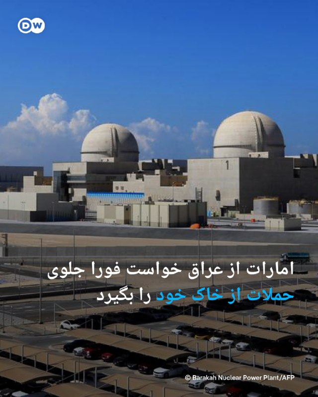

🔶 امارات از عراق خواست فورا جلوی حملات از خاک خود را بگیرد

امارات متحده عربی روز چهارشنبه ۲۰ مه از عراق خواست فورا مانع هرگونه اقدام خصمانه از خاک خود شود.

وزارت خارجه امارات در بیانیه‌ای اعلام کرد ابوظبی بر این باور است که پهپادی که یکشنبه به یک ژنراتور برق در نزدیکی نیروگاه هسته‌ای براکه در اطراف ابوظبی اصابت کرد، از خاک عراق به پرواز درآمده بود.

وزارت خارجه امارات تاکید کرد عراق باید بدون شرط و در کوتاه‌ترین زمان ممکن از هرگونه اقدام خصمانه‌ای که از خاک این کشور منشأ می‌گیرد جلوگیری کند. در این بیانیه آمده است تهدیدهای موجود باید "سریع، فوری و مسئولانه" مهار شوند.

در حمله روز یکشنبه، یک پهپاد به یک ژنراتور برق در نزدیکی نیروگاه هسته‌ای براکه اصابت کرد.

این حمله که هیچ گروهی مسئولیت آن را به عهده نگرفت، باعث آتش‌سوزی شد، اما هیچ زخمی یا نشت پرتوی در پی نداشت. مقام‌های اماراتی همچنین گفتند دو پهپاد دیگر نیز رهگیری شده‌اند.

@dw_farsi

## DW_Farsi — post 124932

  

🔶 فرانسه: هنوز شواهد قطعی از مین‌گذاری در تنگه هرمز وجود ندارد

به گزارش خبرگزاری رویترز، کاترین ووترن، وزیر دفاع فرانسه، روز چهارشنبه ۲۰ مه (۳۰ اردیبهشت) گفت، هیچ "قطعیتی" درباره گزارش‌های مربوط به مین‌گذاری در تنگه هرمز وجود ندارد، اما پاریس خود را برای احتمال اعزام توان مین‌روبی آماده می‌کند.

او گفت فرانسه در حال آماده‌سازی برای سناریویی است که در آن، پاکسازی مین‌ها در قالب یک ماموریت احتمالی به رهبری فرانسه و بریتانیا انجام شود.

ووترن گفت فرانسه ناچار است برای ضرورت احتمالی پاکسازی مین‌ها آماده باشد و در صورت لزوم، شناورهای مین‌روب می‌توانند به منطقه اعزام شوند. رویترز پیش‌تر نیز گزارش داده بود که فرانسه، هلند و بلژیک از توان مین‌روبی برخوردارند و این ظرفیت می‌تواند برای امن‌سازی عبور و مرور در هرمز به کار گرفته شود.

این موضع پس از آن مطرح شد که برخی گزارش‌های رسانه‌ای در آمریکا، به نقل از مقام‌هایی که نامشان فاش نشد، مدعی شده بودند دست‌کم ۱۰ مین در منطقه شناسایی شده است. با این حال، مقام‌های فرانسوی گفته‌اند هنوز نمی‌توان درباره وجود مین‌ها با اطمینان سخن گفت.

@dw_farsi

## DW_Farsi — post 124931

🔶 کاهش تعهدات نظامی آمریکا به ناتو در شرایط بحران‌ و جنگ

تصمیم آمریکا درباره کاهش نیروها و تجهیزات خود برای حمایت از ناتو در شرایط بحران قرار است روز جمعه، ۱ خرداد (۲۱ مه)، به‌طور رسمی در بروکسل به متحدان ناتو اعلام شود.

این تغییر در قالب سازوکار "مدل نیروهای ناتو" انجام می‌شود؛ سازوکاری که در آن کشورهای عضو مشخص می‌کنند چه نیروهایی در صورت جنگ یا بحران بزرگ فعال خواهند شد.

پنتاگون تصمیم گرفته سهم خود از این نیروهای قابل‌استفاده را به‌طور قابل توجهی کاهش دهد، هرچند جزئیات دقیق آن هنوز اعلام نشده است.

وزارت دفاع آمریکا اما تاکید کرده است که "چتر هسته‌ای" این کشور برای دفاع از اعضای ناتو همچنان پابرجا خواهد ماند.

اقدام کاهش نیروهای آمریکایی در شرایط جنگ و بحران در راستای سیاست دونالد ترامپ، رئیس‌جمهور آمریکا انجام می‌شود که بارها تاکید کرده کشورهای اروپایی باید مسئولیت اصلی امنیت قاره خود را بر عهده بگیرند.

مارک روته، دبیر کل ناتو در بروکسل گفته است که تصمیم آمریکا قابل انتظار بوده و بخشی از تلاش برای کاهش وابستگی بیش از حد ائتلاف به یک متحد خاص است.

با این حال، این تغییر نگرانی‌هایی را در اروپا ایجاد کرده است؛ به‌ویژه در شرایطی که برخی کشورها احتمال کاهش تعهدات آمریکا و حتی عقب‌نشینی گسترده‌تر نظامی را مطرح می‌کنند.

در ماه‌های اخیر دولت ترامپ حدود ۵ هزار نیروی آمریکایی را از اروپا خارج کرده و اعزام یک تیپ نظامی به لهستان را نیز لغو کرده است؛ تصمیمی که با انتقاد برخی قانون‌گذاران آمریکایی مواجه شده است.

در مجموع، این تحولات نشان‌دهنده فشارهای فزاینده بر پیمان ناتو و اختلاف نظر میان آمریکا و متحدان اروپایی درباره تقسیم مسئولیت‌های دفاعی است.

دونالد ترامپ در آخرین دیدار خود با مارک روته، دبیرکل ناتو، در کاخ سفید اعلام کرد که از این پیمان "کاملا ناامید" است. در این دیدار همچنین درباره جنگ آمریکا و اسرائیل علیه ایران گفت‌وگو شد؛ جنگی که اعضای ناتو در آن مشارکت فعال نداشتند.

ترامپ پس از این ملاقات در شبکه اجتماعی "تروث سوشال" نوشت ناتو در زمان نیاز کنار آمریکا نبوده و در صورت نیاز دوباره نیز همراه نخواهد بود.

ترامپ بارها ناتو را "ببر کاغذی" توصیف کرده و حتی تهدید به خروج آمریکا از این پیمان کرده است. پیمان آتلانتیک شمالی (ناتو) ۳۲ عضو دارد و ایالات متحده یکی از بنیان‌گذاران آن به شمار می‌رود.

@dw_farsi

## DW_Farsi — post 124930

  <a href="telegram/content/DW_Farsi_124930_1779298617.mp4" target="_blank">🎬 Download video</a>

🎥 تاکسی‌های پرنده؛ آینده حمل‌ونقل یا رویایی دوردست؟

شرکت‌های چینی، آمریکایی و بریتانیایی وارد رقابت ساخت تاکسی‌های پرنده شده‌اند.
این هواپیماهای برقی که می‌توانند به طور عمودی از زمین بلند شوند، حالا به‌دنبال ورود به خیابان‌های هوایی هستند.
آیا آسمان شهرها واقعاً به‌زودی پر از تاکسی‌های هوایی می‌شود؟
@dw_farsi

## Persian_Trend_Official — post 14541

🔴 کانال ۱۲ اسرائیل: اختلافات آمریکا و اسرائیل بر سر ایران تقریباً از بین رفته است

کانال ۱۲ اسرائیل گزارش داد مقام‌های اسرائیلی معتقدند تقریباً هیچ اختلاف مهمی میان تل‌آویو و واشینگتن درباره خواسته‌های مطرح‌شده از ایران در مذاکرات جاری باقی نمانده است.

بر اساس این گزارش:

▪️ با این حال تردیدهای جدی درباره احتمال پذیرش این شروط از سوی تهران وجود دارد
▪️ ایران تنها به بخشی از پیشنهادها پاسخ داده و درباره سایر مطالبات زمان‌کشی می‌کند
▪️ اسرائیل مذاکرات را تلاش ایران برای خرید زمان و طولانی‌کردن روند گفت‌وگوها می‌داند

در ادامه آمده:

▪️ بازگشت احتمالی به گزینه نظامی به‌طور جدی در حال بررسی است
▪️ و گفته می‌شود مقدمات چنین اقدامی از هم‌اکنون در حال آماده‌سازی است

🫆:Tony

📌 @persian_trend_official
پرشین ترند | متفاوت‌ترین کانال نظامی

## Persian_Trend_Official — post 14540

💢سخنگوی وزارت خارجه: تبادل پیام‌ها بین طرف ایرانی و آمریکایی براساس متن ۱۴بندی ایران ادامه دارد

▪️حضور وزیر کشور پاکستان برای تسهیل مبادلۀ پیام‌هاست.

🫆:Tony

📌 @persian_trend_official
پرشین ترند | متفاوت‌ترین کانال نظامی

## Persian_Trend_Official — post 14539

🔴 رویترز: برخی کشتی‌ها برای عبور از تنگه هرمز به ایران پول پرداخت می‌کنند

💢خبرگزاری رویترز گزارش داد برخی کشتی‌ها برای تضمین عبور امن از تنگه هرمز، مبالغی بیش از ۱۵۰ هزار دلار به ایران پرداخت می‌کنند.

بر اساس این گزارش:

▪️ این پرداخت‌ها با هدف جلوگیری از توقیف یا ایجاد مشکل در مسیر عبور انجام می‌شود

🫆:Tony

📌 @persian_trend_official
پرشین ترند | متفاوت‌ترین کانال نظامی

## Persian_Trend_Official — post 14538

❤️ اگر از مخاطبان پرشین ترند هستید و تلگرام پرمیوم دارید،
با بوست کردن کانال کمک بزرگی به رشد و دیده‌شدن بیشتر پرشین ترند می‌کنید.
این بوست‌ها باعث می‌شود امکانات بیشتری برای انتشار محتوا، استوری و قابلیت‌های ویژه کانال فعال شود و در شرایط فعلی، به ادامه پوشش سریع و تحلیل‌های روزانه کمک زیادی می‌کند.
🙏 اگر مایل بودید، از طریق لینک زیر کانال را بوست کنید:
https://t.me/boost/persian_trend_official
📌 @persian_trend_official
پرشین ترند | متفاوت‌ترین کانال نظامی

## Persian_Trend_Official — post 14537

  <a href="telegram/content/Persian_Trend_Official_14537_1779298620.mp4" target="_blank">🎬 Download video</a>

🔴ترامپ :

💢ما به آنها ضربه‌ای بسیار سخت زدیم. ممکن است مجبور شویم حتی سخت‌تر ضربه بزنیم — اما شاید هم نه.

🫆:Tony

📌 @persian_trend_official
پرشین ترند | متفاوت‌ترین کانال نظامی

## Persian_Trend_Official — post 14536

  <a href="telegram/content/Persian_Trend_Official_14536_1779298621.mp4" target="_blank">🎬 Download video</a>

💢ترامپ :

💢همه چیز آنها از بین رفته است. تنها سوال این است که آیا ما می‌رویم و آن را تمام می‌کنیم، یا آن‌ها قرار است یک سند را امضا کنند؟

💢خاهیم دید چه اتفاقی می افتد

🫆:Tony

📌 @persian_trend_official
پرشین ترند | متفاوت‌ترین کانال نظامی

## Persian_Trend_Official — post 14535

🔴 حمله مسلحانه در سراوان؛ یک نیروی امنیتی ایران کشته شد

💢رسانه‌های ایرانی از وقوع حمله مسلحانه توسط عناصر تروریستی در شهر سراوان واقع در استان سیستان و بلوچستان خبر دادند.

بر اساس گزارش‌های اولیه:

▪️ در این حمله یک نیروی امنیتی ایران کشته شده است

▪️ جزئیات بیشتری درباره تعداد مهاجمان یا تلفات احتمالی منتشر نشده

▪️ نیروهای امنیتی عملیات تعقیب عاملان حمله را آغاز کرده‌اند

🫆:Tony

📌 @persian_trend_official
پرشین ترند | متفاوت‌ترین کانال نظامی

## Persian_Trend_Official — post 14534

  

خداروشکر دارن توافق میکنن 😄 درجریانید که ... دلمون برای توافق های پر هیجان عراقچی با ویتکاف تنگ شده ! از توجه شما به این موضوع متشکرم الیاس فرخ

## Persian_Trend_Official — post 14533

  

خداروشکر دارن توافق میکنن 😄

درجریانید که ...

دلمون برای توافق های پر هیجان عراقچی با ویتکاف تنگ شده !

از توجه شما به این موضوع متشکرم
الیاس فرخ

## Persian_Trend_Official — post 14532

💢سخنگوی وزارت امور خارجه : ما نمی‌توانیم به ایالات متحده و اسرائیل اجازه عبور از هرمز را بدهیم 💢وقتی ما خواستار آزادی دارایی‌های مسدود شده خود هستیم، منظورمان دسترسی به آنها به عنوان حق ماست. 💢استفاده صلح‌آمیز از انرژی هسته‌ای یک مطالبه نیست، بلکه حقی است…

## Persian_Trend_Official — post 14531

💢سخنگوی وزارت امور خارجه : ما نمی‌توانیم به ایالات متحده و اسرائیل اجازه عبور از هرمز را بدهیم

💢وقتی ما خواستار آزادی دارایی‌های مسدود شده خود هستیم، منظورمان دسترسی به آنها به عنوان حق ماست.

💢استفاده صلح‌آمیز از انرژی هسته‌ای یک مطالبه نیست، بلکه حقی است که توسط پیمان منع گسترش سلاح‌های هسته‌ای تضمین شده است.

💢وقتی در مورد تحریم‌های یکجانبه آمریکا صحبت می‌کنیم، این یک مطالبه نیست، بلکه بخشی از حقوق ماست.

💢ما با عمان، دیگر کشور ساحلی، همکاری می‌کنیم تا عبور ایمن کشتی‌ها از تنگه هرمز را تضمین کنیم.

💢ما نمی‌توانیم به ایالات متحده و اسرائیل اجازه عبور از هرمز را بدهیم، زیرا این امر بر امنیت ملی ما تأثیر خواهد گذاشت.

💢ما با چندین کشور در تماس نزدیک هستیم تا اطمینان حاصل کنیم که کشتی‌های آنها می‌توانند بدون هیچ حادثه‌ای از تنگه هرمز عبور کنند.

💢ما برای صادرات و واردات خود به تنگه هرمز متکی هستیم، بنابراین انگیزه داریم که از امنیت آن اطمینان حاصل کنیم.

🫆:Tony

📌 @persian_trend_official
پرشین ترند | متفاوت‌ترین کانال نظامی

## Persian_Trend_Official — post 14530

  <a href="telegram/content/Persian_Trend_Official_14530_1779298625.mp4" target="_blank">🎬 Download video</a>

💢ترامپ :

الان تو اسرائیل ۹۹٪ طرفدار دارم.

▪️می‌تونم برای نخست‌وزیری کاندید شم، شاید بعد این ماجرا برم اسرائیل واسه نخست‌وزیری

🫆:Tony

📌 @persian_trend_official
پرشین ترند | متفاوت‌ترین کانال نظامی

## Persian_Trend_Official — post 14529

  <a href="telegram/content/Persian_Trend_Official_14529_1779298626.webm" target="_blank">🎬 Download video</a>

⭕️ادعای العربیه:

💢کار برای نهایی‌سازی متن توافق بین واشنگتن و تهران در حال انجام است.

💢فرمانده ارتش پاکستان ممکن است فردا برای اعلام نسخه نهایی توافق از ایران دیدار کند.

💢ممکن است طی ساعات آینده از نهایی شدن نسخه نهایی توافق بین آمریکا و ایران خبر داده شود.

▪️دور جدیدی از مذاکرات بعد از فصل حج در اسلام‌آباد برگزار خواهد شد.

🫆:Tony

📌 @persian_trend_official
پرشین ترند | متفاوت‌ترین کانال نظامی

## RadioFarda — post 157396

  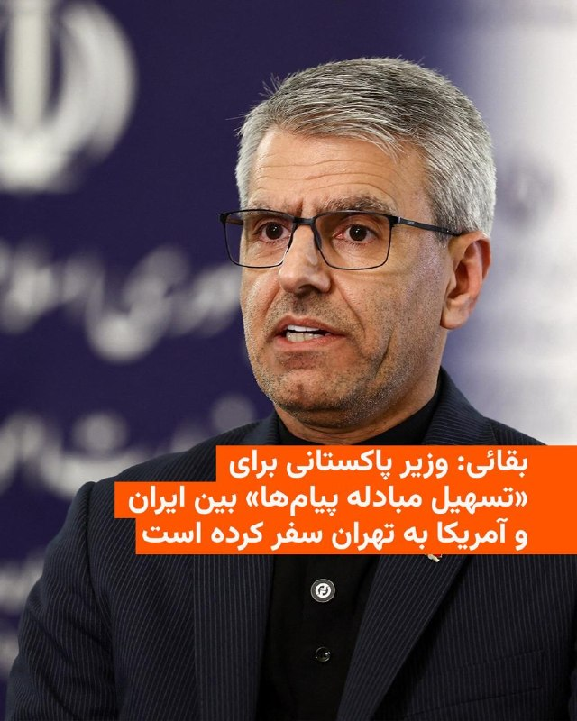

🔸سخنگوی وزارت خارجه ایران روز چهارشنبه گفت که سفر دوباره وزیر کشور پاکستان در ایران برای «تسهیل مبادله پیام‌ها» بین تهران و واشینگتن انجام شده است.

🔸اسماعیل بقائی مدعی شد که تبادل پیام‌ها بین ایران و آمریکا «براساس متن ۱۴ بندی ایران» ادامه دارد اما به جزئیات بیشتری اشاره نکرد.

🔸محسن نقوی، وزیر کشور پاکستان، که روز ۲۶ اردیبهشت به ایران رفته و با مقام‌های ارشد جمهوری اسلامی دیدار کرده بود، بعد از چهار روز بار دیگر وارد تهران شده است.

🔸این در حالی است که رئیس‌جمهور آمریکا ساعتی پیش اعلام کرد مذاکره با ایران در «مراحل پایانی» قرار دارد و افزود اگر ایران سند توافق را امضا نکند، ایالات متحده حملات نظامی را از سر خواهد گرفت.

@RadioFarda

## RadioFarda — post 157395

  

🔸دونالد ترامپ، رئیس‌جمهور آمریکا، روز چهارشنبه با تکرار دوباره این ادعا که نیروی دریایی و نیروی هوایی ایران نابود شده‌اند، اعلام کرد تنها پرسش باقی‌مانده این است که آیا آمریکا برای «تمام کردن کار» بازخواهد گشت یا ایران توافق پایان دادن به جنگ را امضا خواهد کرد.

🔸او در سخنرانی خود در مراسم فارغ‌التحصیلی آکادمی گارد ساحلی آمریکا درباره ایران گفت: «همه‌چیز از بین رفته است. نیروی دریایی‌شان از بین رفته. نیروی هوایی‌شان از بین رفته. تقریباً همه‌چیز. تنها سؤال این است که آیا ما برمی‌گردیم و کار را تمام می‌کنیم؟ آیا آنها قرار است سندی را امضا کنند؟ ببینیم چه اتفاقی می‌افتد.»

🔸رئیس‌جمهور ایالات متحده روز دوشنبه خبر داد که دستور حمله به ایران در روز سه‌شنبه را به درخواست رهبران چند کشور منطقه لغو کرده تا به روند دیپلماتیک برای رسیدن به توافق با ایران فرصت جدیدی دهد.

🔸او در عین حال روز سه‌شنبه گفت که ایران تنها چند روز فرصت دارد تا با آمریکا به توافق برسد و در غیر این صورت شاید لازم باشد ضربه نظامی بزرگ دیگری به این کشور وارد شود.

@RadioFarda

## RadioFarda — post 157394

  <a href="https://t.me/radiofarda/157394" target="_blank">📎 Download file</a>

🔸 در این کافه فردا به آموزش استفاده از اسلحه در صدا و سیما، تبریک روز ارتباطات توسط پزشکیان در دوران قطعی اینترنت در ایران، تحلیل‌های یک کارشناس صدا و سیما در مورد یک عکس ساخته شده توسط هوش مصنوعی و تغییرات پیش رو در روند پذیرش فیلم‌ها در اسکار می‌پردازیم.

🔸 برای تماس با ما می‌توانید به شناسه کافه فردا در تلگرام صوت و متن بفرستید.

📻 کافه فردا

## RadioFarda — post 157393

🔸دونالد ترامپ، رئیس‌جمهور آمریکا، روز چهارشنبه به خبرنگاران گفت که برای پایان دادن به جنگ با ایران هیچ عجله‌ای ندارد. 🔸او درباره آتش‌بس شکننده فعلی و چشم‌انداز توافق پایان جنگ گفت: «ما باید تنگه هرمز را باز کنیم. تنگه باید فورا باز شود. به همین دلیل این مسیر…

## RadioFarda — post 157392

  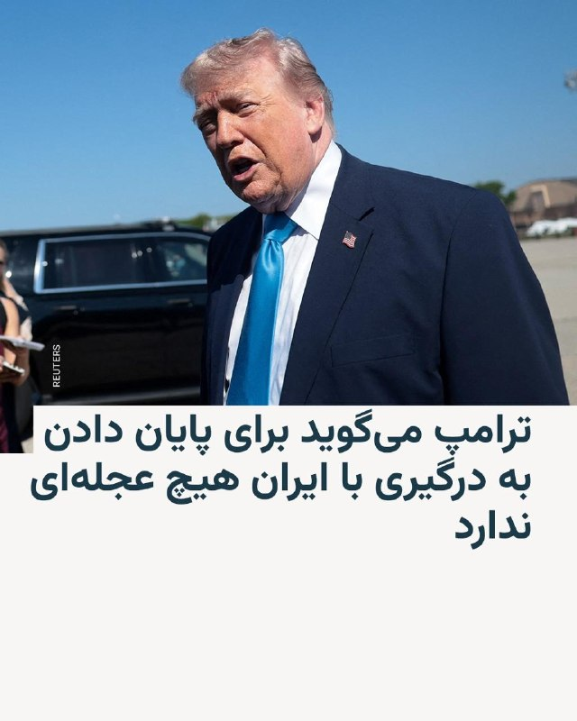

🔸دونالد ترامپ، رئیس‌جمهور آمریکا، روز چهارشنبه به خبرنگاران گفت که برای پایان دادن به جنگ با ایران هیچ عجله‌ای ندارد.

🔸او درباره آتش‌بس شکننده فعلی و چشم‌انداز توافق پایان جنگ گفت: «ما باید تنگه هرمز را باز کنیم. تنگه باید فورا باز شود. به همین دلیل این مسیر را امتحان می‌کنیم.»

🔸ترامپ با اشاره به انتخابات میاندوره‌ای کنگره آمریکا و تأثیر احتمالی آن بر تصمیمات او درباره ایران تأکید کرد: «من هیچ عجله‌ای ندارم... ترجیحم آن است که افراد کمتری کشته شوند.»

🔸رئیس‌جمهور آمریکا در ادامه گفت که برای او کامل کردن مأموریت درباره ایران مهم‌تر از تعیین زمان برای خاتمه دادن به درگیری است.

@RadioFarda

## IranianMinds — post 20464

🔴دقایقی پیش افراد مسلح در خودرویی، به سمت یک خودروی پلیس در جاده‌ای در شهرستان سراوان تیراندازی کردند که منجر به کشته شدن ستوان سوم امیر‌حسین شهرکی شد.

@IranianMinds

## IranianMinds — post 20463

🔴 العربیه :

ممکن است طی ساعات آینده از نهایی شدن نسخه نهایی توافق بین آمریکا و ایران خبر داده شود.

@IranianMinds

## IranianMinds — post 20462

🔴 ترامپ : برا جنگ عجله ندارم. رژیم ایران رو عوض کردم و بهشون فرصت میدم فکر کنن @IranianMinds

## IranianMinds — post 20461

🔴 ترامپ :

برا جنگ عجله ندارم. رژیم ایران رو عوض کردم و بهشون فرصت میدم فکر کنن

@IranianMinds

## IranianMinds — post 20460

  <a href="telegram/content/IranianMinds_20460_1779298629.mp4" target="_blank">🎬 Download video</a>

🔴 دونالد ترامپ :

«هرگز، هرگز تسلیم نشوید. هر اتفاقی که بیفتد، مهم نیست در چه جایگاهی از زندگی باشید یا در چه شرایطی قرار داشته باشید، به پیش رفتن ادامه دهید.

همیشه رو به جلو حرکت کنید. هرگز از پیش رفتن باز نایستید.

به مبارزه ادامه دهید و کاری کنید که طرف مقابل زودتر از شما تسلیم شود. بگذارید آن‌ها کنار بکشند. اگر به مسیر خود ادامه دهید، آن‌ها در نهایت تسلیم خواهند شد.»

@IranianMinds

## IranianMinds — post 20459

🔴 مارک روته، دبیرکل ناتو:

«بسیاری از کشورهای عضو ائتلاف در حال انتقال منابع نظامی به منطقه تنگه هرمز هستند»

@IranianMinds

## IranianMinds — post 20458

✅ (فقط ۲۰۰ هزار تومن)🥺 🌱 قیمت اقتصادی + پشتیبانی حرفه‌ای 🚀 سریع و پایدار، بدون قطعی 🦋پشتیبانی واقعی، همیشه در دسترس ربات ما🌴 📩 @dayaconfigbot کانال ما🌳 📩 @dayavpn

## IranianMinds — post 20457

  <a href="telegram/content/IranianMinds_20457_1779298632.mp4" target="_blank">🎬 Download video</a>

🔴 ترامپ :

«ونزوئلا بیست سال پیش واقعاً کشور بسیار خوبی بود؛ اما مسیر اشتباهی را در پیش گرفت.

همان مسیری را رفت که بعضی‌ها دوست دارند این کشور را به آن سمت ببرند برخی دیوانه‌ها می‌خواهند این کشور را به‌شدت به سمت چپ ببرند و آن را نابود کنند.»

@IranianMinds

## IranianMinds — post 20456

  <a href="telegram/content/IranianMinds_20456_1779298634.mp4" target="_blank">🎬 Download video</a>

🔴 ترامپ درباره ایران :

«ما ضربه بسیار سختی به آن‌ها وارد کردیم. ممکن است مجبور شویم حتی ضربه سخت‌تری هم وارد کنیم اما شاید هم نه.

ما اجازه نخواهیم داد ایران به سلاح هسته‌ای دست پیدا کند و تمام خاورمیانه را منفجر کند و بعد سراغ شما بیاید.»

@IranianMinds

## IranianMinds — post 20455

  

✅ (فقط ۲۰۰ هزار تومن)🥺

🌱 قیمت اقتصادی + پشتیبانی حرفه‌ای

🚀 سریع و پایدار، بدون قطعی
🦋پشتیبانی واقعی، همیشه در دسترس

ربات ما🌴
📩 @dayaconfigbot

کانال ما🌳
📩 @dayavpn

## IranianMinds — post 20454

  <a href="telegram/content/IranianMinds_20454_1779298638.mp4" target="_blank">🎬 Download video</a>

🔴آمریکا تعداد زیادی هواپیمای سوخت‌رسان را به فرودگاه بن‌گوریون اسرائیل منتقل کرد.

@IranianMinds

## IranianMinds — post 20453

  

🔴 ترامپ درباره کوبا :

ایالات متحده یک رژیم تروریستی را در نود مایلی خود تحمل نمیکند ، بنظر من وقت آن رسیده که مردم کوبا هم به آزادی که ۱۰۰ سال پیش برای آن جنگیده بودند برسند.

@IranianMinds

## IranianMinds — post 20452

نسخه کامل گفتگو در نشست آینده تکنولوژی ایران

این نشست روز ۱۶ مه (۲۶ اردیبهشت) در محل دفتر مرکزی شرکت «اوبر» در شهر سان‌فرانسیسکو در ایالت کالیفرنیای آمریکا برگزار شد.

@OfficialRezaPahlavi

## IranianMinds — post 20451

🔴 سخنگوی وزارت خارجه :

ما اورانیوم خودمونو به کسی تحویل نمیدیم و مسئله ی هسته ای ما کاملا صلح آمیزه.

@IranianMinds

## IranianMinds — post 20450

🔴 الحدث : دور بعدی مذاکرات پس از حج در اسلام آباد برگزار خواهد شد. @IranianMinds

## IranianMinds — post 20449

🔴 الحدث : احتمالا توافق ایران‌ و آمریکا تا ساعات آینده نهایی میشه. منظور متن توافق برای مذاکرات هست @IranianMinds

## IranianMinds — post 20448

🔴 الحدث :

دور بعدی مذاکرات پس از حج در اسلام آباد برگزار خواهد شد.

@IranianMinds

## IranianMinds — post 20447

🔴 الحدث : احتمالا توافق ایران‌ و آمریکا تا ساعات آینده نهایی میشه. منظور متن توافق برای مذاکرات هست @IranianMinds

## IranianMinds — post 20446

🔴 الحدث :

احتمالا توافق ایران‌ و آمریکا تا ساعات آینده نهایی میشه.

منظور متن توافق برای مذاکرات هست

@IranianMinds

## IranianMinds — post 20445

  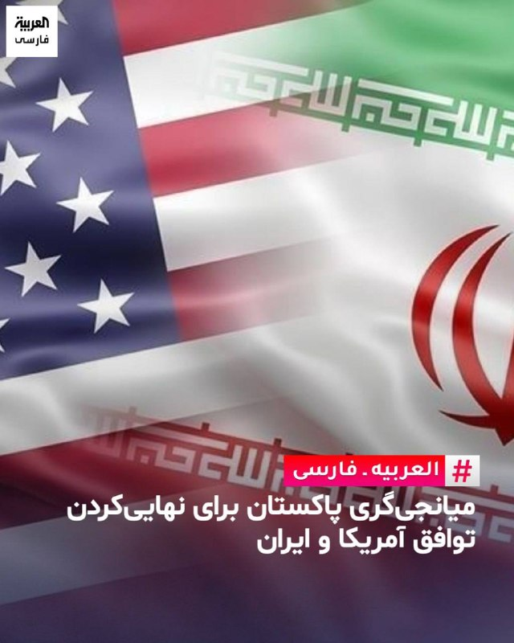

🔴 العربیه:

فرمانده ارتش پاکستان احتمالا فردا برای اعلام نسخه نهایی توافق از ایران دیدار کنه.

@IranianMinds

## BBCPersian — post 281628

  <a href="telegram/content/BBCPersian_281628_1779298642.mp4" target="_blank">🎬 Download video</a>

ایتامار بن‌ گویر، وزیر امنیت ملی اسرائیل که به عنوان یک چهره سیاسی راست افراطی شناخته می‌شود، در شبکه اجتماعی ایکس ویدیویی از اعضای بازداشت شده کاروان کمک‌رسانی به غزه منتشر کرده است که نشان می‌دهد آنها با دست بسته رو به زمین زانو زده‌اند.
 
در بخش‌هایی از این ویدیو رفتار خشونت‌آمیز با آنها دیده می‌شود و بن‌گویر در حالی که پرچم بزرگی از اسرائیل را در دست دارد، به زبان عبری به آن‌ها می‌گوید: «به اسرائیل خوش آمدید، این ما هستیم که صاحب اختیاریم.»
 
گیدئون ساعر، وزیر خارجه اسرائیل به طور علنی از انتشار این ویدیو انتقاد کرده و این اقدام را «نمایشی شرم‌آور» توصیف کرد. او گفت ایتامار بن‌گویر «نمایانگر چهره واقعی اسرائیل نیست.»
 
انتشار این ویدیو واکنش‌های زیادی را در پی داشت از جمله جورجا ملونی، نخست‌وزیر ایتالیا، نیز این اقدام را محکوم کرده و خواستار عذرخواهی شده است.

@bbcpersian

## BBCPersian — post 281627

  <a href="https://t.me/bbcpersian/281627" target="_blank">📎 Download file</a>

امروز در برنامه رادیویی جام‌جهان‌نما می‌شنوید:

روایت نیویورک‌تایمز از اهداف آمریکا و اسرائیل در آغاز جنگ؛ این روزنامه می‌گوید بمباران اطراف خانه محمود احمدی‌نژاد، با هدف آزاد کردن او از حصر خانگی و بازگرداندنش به قدرت انجام شده بود. این گزارش تا چه اندازه قابل باور است و چه تصویری از اهداف پشت پرده جنگ ارائه می‌دهد؟

حرف‌وحدیث‌ها درباره نقش گروه‌های کرد ایرانی در عراق در آغاز جنگ ۳۹ روزه؛ گزارش بی‌بی‌سی فارسی نشان می‌دهد آمریکا به برخی از این گروه‌ها کمک مالی کرده بود تا وارد ایران شوند.

چین و روسیه بدون اشاره مستقیم به تنگه هرمز، اختلال در زنجیره تأمین و تجارت جهانی را محکوم کردند. آیا پکن و مسکو در حال فاصله گرفتن از تهران‌اند؟

و سپاه پاسداران هشدار داده اگر دوباره جنگی آغاز شود، پاسخ ایران «فراتر از منطقه» خواهد بود.این تهدیدتا چه حد جدی است؟

برنامه رادیویی جام جهان‌نما هر شب ساعت ۲۰ به وقت ایران، روی موج متوسط ۷۰۲ کیلوهرتز و موج کوتاه ۹۴۶۵ کیلوهرتز پخش می‌شود و تکرار آن را هم می‌توانید ساعت ۲۱:۳۰ روی موج متوسط ۷۰۲ کیلوهرتز و موج کوتاه ۵۳۹۵ کیلوهرتز گوش کنید.

## BBCPersian — post 281625

🔻ترامپ: مذاکرات با ایران به مراحل پایانی رسیده اگر توافق نکند حمله می‌کنیم

دونالد ترامپ، رئیس‌جمهور آمریکا، روز چهارشنبه گفت که مذاکرات با ایران به مراحل پایانی رسیده، اما هشدار داد اگر تهران با توافق موافقت نکند، حملات بیشتری انجام خواهد شد.

شش هفته پس از آن‌که او عملیات «خشم حماسی» را برای برقراری آتش‌بس متوقف کرد، گفت‌وگوها برای پایان دادن به جنگ تاکنون پیشرفت اندکی داشته است.

آقای ترامپ این هفته گفته بودکه تا آستانه صدور دستور حملات بیشتر پیش رفته است، اما برای دادن فرصت بیشتر به مذاکرات از این اقدام خودداری کرده است.

او امروز به خبرنگاران گفت: «ما در مراحل پایانی [مذاکرات] با ایران هستیم. خواهیم دید چه اتفاقی می‌افتد. یا به توافق می‌رسیم یا کارهایی خواهیم کرد که کمی ناخوشایند خواهد بود، اما امیدوارم به آنجا نکشد.»

رئیس‌جمهور آمریکا افزود: «ما این فرصت را می‌دهیم. عجله‌ای ندارم. ترجیح می‌دهم افراد کمتری کشته شوند تا تعداد زیادی. این موضوع می‌تواند به هر دو شکل پیش برود.»

حکومت ایران در مقابل، دونالد ترامپ را به تلاش برای ازسرگیری جنگ متهم کرد و هشدار داد که در صورت هرگونه حمله، فراتر از خاورمیانه پاسخ خواهد داد.

https://bbc.in/436bsAl
@BBCPersian

## BBCPersian — post 281624

  

🔻شعبه ۱۳ دادگاه کیفری تهران احکام ۶ متهم در پرونده موسوم به «اکباتان» را صادر کرده است.

بر اساس رای دادگاه که سایت امتداد منتشر کرده است، میلاد آرمون، علیرضا کفایی و امیرمحمد خوش اقبال به ۵ سال حبس و دیه محکوم شده‌اند.

این سه متهم به همراه حسین نعمتی با اتهام «ﻣﺸﺎرﮐﺖ در اﯾﺮاد ﺻﺪﻣﺎت و ﺟﺮاﺣﺎت ﻏﯿﺮ ﻣﺆﺛﺮ در ﻓﻮت» ﺑﻪ ﭘﺮداﺧﺖ دﯾﻪ ﺻﺪﻣﺎت به خانواده آرمان علی وردی محکوم شده‌اند.

آرمان علی‌وردی، طلبه بسیجی بود که طبق گزارش‌ها روز ۴ آبان سال ۱۴۰۱ در جریان اعتراضات سراسری در شهرک اکباتان مورد ضرب و جرح قرار گرفت و دو روز بعد در بیمارستان جان باخت.

سه متهم دیگر؛ نوید نجاران، علیرضا برمز پورناک و حسین نعمتی از اتهامات تبرئه شدند.

علیرضا برمز پورناک و نوید نجاران از اتهامات قبلی «مشارکت در قتل عمد ‌ایراد صدمات غیرموثر در فوت» و همچنین حسین نعمتی از اتهام «مشارکت در قتل»، تبرئه شده‌اند.

در پرونده موسوم به شهرک اکباتان این شش نفر به اتهام کشتن آرمان علی‌وردی، در جریان اعتراضات سال ۱۴۰۱، بازداشت شدند.

📷UGC
@BBCPersian

## BBCPersian — post 281623

  <a href="telegram/content/BBCPersian_281623_1779298645.mp4" target="_blank">🎬 Download video</a>

🔻دوربین همراه یکی از افسران پلیس کالامازوی ایالت میشیگان، ویدیویی را از عملیات نجات کودکی که در میان شعله‌های آتش در خانه‌ای گرفتار شده بود ثبت کرده است.

افسر پلیس پس از رسیدن به محل حادثه، از مادر کودک در حالیکه بر لبه پنجره ایستاده بود، خواست پنجره را با لگد بشکند و کودک را به سمت او پرتاب کند.

کودک و مادرش پس از عملیات نجات برای اطمینان از سلامتشان به بیمارستان منتقل شدند. به گفته مقام‌ها، هیچ‌کدام آسیبی ندیده‌اند و علت آتش‌سوزی هنوز در دست بررسی است.

https://bbc.in/436bsAl
@BBCPersian

## BBCPersian — post 281622

  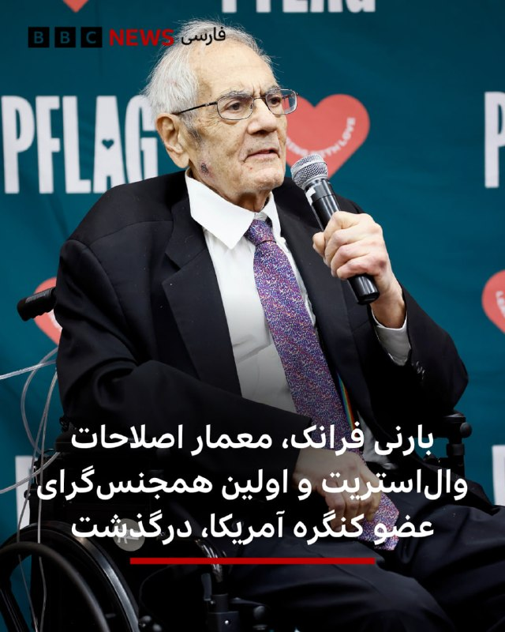

🔻بارنی فرانک نماینده سابق کنگره آمریکا از حزب دموکرات، که به‌عنوان یکی از اولین نمایندگان کنگره آمریکا به‌صورت آشکار هویت هم‌جنس‌گرایانه خود را آشکار کرد، در هشتاد و شش سالگی درگذشت. 

او به‌عنوان یکی از چهره‌های اثرگذار در پیشبرد حقوق جامعه ال‌جی‌بی‌تی و از معماران اصلاحات مالی پس از بحران ۲۰۰۸ شناخته می‌شود.

او پیش از سه دهه نمایندگی بخش جنوبی ایالت ماساچوست را در مجلس نمایندگان ایالات متحده آمریکا بر عهده داشت و در این مدت به یکی از چهره‌های شناخته‌شده و جنجالی سیاست آمریکا تبدیل شد.

آقای فرانک در تاریخ کنگره آمریکا به‌عنوان نخستین عضو این نهاد شناخته می‌شود که وارد یک ازدواج همجنس‌گرایانه شد؛ کاری که در زمان خود بازتاب گسترده‌ای داشت و جایگاه او را به‌عنوان یکی از چهره‌های پیشرو در جنبش حقوق ال‌جی‌بی‌تی ثبت کرد.

بارنی فرانک در طول دوران فعالیت سیاسی خود، هم‌زمان به‌خاطر رویکردهای صریح و گاه جنجالی‌اش در حوزه اقتصاد و سیاست اجتماعی شناخته می‌شد و جایگاهی متمایز در میان قانون‌گذاران هم‌عصر خود داشت.

📷Getty Images
@BBCPersian

## BBCPersian — post 281621

🔻وزیر خارجه اسرائیل ویدئوی جنجالی بن‌گویر درباره فعالان غزه را «شرم‌آور» خواند

گیدئون ساعر، وزیر خارجه اسرائیل، به‌طور علنی از وزیر امنیت ملی راست‌افراطی کشورش به دلیل انتشار ویدیوی تحقیرآمیز فعالان بین‌المللی بازداشت‌شده کاروان کمک‌رسانی به غزه، انتقاد کرده است.

او این اقدام را «نمایشی شرم‌آور» توصیف کرد و گفت ایتامار بن‌گویر «مایانگر چهره واقعی اسرائیل نیست.»

در این ویدیو ده‌ها فعال دیده می‌شوند که با دستان بسته روی زمین زانو زده‌اند.

بن‌گویر در حالی که پرچم بزرگی از اسرائیل را در دست دارد، به زبان عبری به آن‌ها می‌گوید: «به اسرائیل خوش آمدید، این ما هستیم که صاحب اختیاریم.»

انتشار این ویدئو واکنش‌های زیادی را در پی داشت از جمله جورجا ملونی، نخست‌وزیر ایتالیا، نیز این اقدام را محکوم کرده و خواستار عذرخواهی شده است.

https://bbc.in/3PtqVqU
@BBCPersian

## BBCPersian — post 281620

🔻قدردانی عربستان از ترامپ برای دادن زمان بیشتر به ایران

شاهزاده فیصل بن فرحان، وزیر امور خارجه عربستان سعودی، روز چهارشنبه گفت که کشورش از تصمیم دونالد ترامپ برای دادن زمان بیشتر به مذاکرات با ایران برای رسیدن به توافق، قدردانی می‌کند.

دونالد ترامپ، رئیس‌جمهوری آمریکا، اوایل این هفته گفت که عربستان سعودی، امارات متحده عربی و قطر از او خواسته‌اند که حمله برنامه‌ریزی شده آمریکا به ایران را به تعویق بیندازد تا زمان بیشتری برای مذاکرات فراهم شود.

پیش از این سپاه پاسداران با انتشار بیانیه‌ای تهدید کرد که در صورت آغاز دوباره جنگ آمریکا و اسرائیل علیه ایران، جنگ «به فراتر از منطقه کشیده خواهد شد.»

https://bbc.in/3PtqVqU
@BBCPersian

## BBCPersian — post 281619

🔻وزیر ارتباطات ایران: شبکه ملی اطلاعات در امتداد اینترنت جهانی است، نه جایگزینش

ستار هاشمی، وزیر ارتباطات و فناوری اطلاعات ایران، در مراسمی به مناسبت روز جهانی ارتباطات گفت: «اینکه گفته می‌شود شبکه ملی اطلاعات قرار است جایگزین اینترنت جهانی و دسترسی آزاد به اطلاعات شود، برداشت نادرستی است.»

او تاکید کرد: «شبکه ملی اطلاعات، در امتداد دسترسی بین‌الملل به اینترنت است، نه جایگزین آن.»

آقای هاشمی گفت: «استقلال شبکه به معنای قطع ارتباط با جهان نیست و نمی‌توان جامعه را از دسترسی به دانش، خدمات و ظرفیت‌های بین‌المللی محروم کرد.»

او در این جلسه با اشاره به کارکرد شبکه ملی اطلاعات در دوران جنگ گفت که به دلیل «توسعه زیرساخت‌های شبکه ملی اطلاعات و گسترش مویرگی ارتباطی در سراسر کشور»، خدمات بانکی، بهداشتی و درمانی، آموزشی و خدمات عمومی کشور «متوقف نشد.»

به گفته وزیر ارتباطات، در طول جنگ اخیر، «بیش از ۵۰۰ سایت ارتباطی کشور آسیب دید اما مردم اختلال گسترده‌ای در دریافت خدمات احساس نکردند.»

این در حالی است که در طول جنگ اخیر آمریکا و اسرائیل با ایران، گزارش‌هایی مبنی بر اختلال در دسترسی به خدمات بانکی و اداری منتشر شد.

ستار هاشمی با اشاره به قطع اینترنت جهانی که بیش از ۸۰ روز از آن می‌گذرد گفت: «برخی محدودیت‌ها در شرایط خاص و با تصمیم مراجع ذی‌صلاح اعمال شد، اما استمرار این وضعیت به‌تدریج می‌تواند به شبکه ملی اطلاعات نیز آسیب وارد کند.»

با شروع حملات آمریکا و اسرائیل به ایران، دسترسی عمومی به اینترنت جهانی در کشور قطع شد و تاکنون ادامه دارد. قطع دسترسی عمومی به اینترنت خسارت‌های بسیاری را به اقتصاد ایران وارد کرده است و مسئولان و کارشناسان بارها درباره آسیب‌های غیرقابل جبران آن هشدار داده‌اند.

https://bbc.in/3PtqVqU
@BBCPersian

## BBCPersian — post 281618

  <a href="telegram/content/BBCPersian_281618_1779298648.mp4" target="_blank">🎬 Download video</a>

دانشجویان دانشگاه هنگ‌کنگ که برترین دانشکده حقوق این شهر است، در گفت‌وگو با بی‌بی‌سی فاش کرده‌اند که متوجه شده‌اند از عکس‌هایشان برای تولید تصاویر هرزه‌نگاری با استفاده از هوش مصنوعی استفاده شده و این موضوع به شدت آنها را شوکه کرده است.
 
این دانشجویان زن تصمیم گرفته‌اند این موضوع را علنی کنند تا به این شکل، این رنج و تجربه شخصی را به تلاشی گسترده‌تر برای پاسخ‌گویی و اصلاحات قانونی تبدیل کنند.

@bbcpersian

## BBCPersian — post 281617

  

🔻محمدباقر قالیباف، رئیس مجلس ایران گفت که «تحرکات آشکار و پنهان دشمن نشان می‌دهد که به موازات فشارهای اقتصادی و سیاسی از اهداف نظامی خود دست نکشیده و به دنبال دور جدیدی از جنگ و ماجراجویی جدید است.»

او این اظهارات را در سومین پیام صوتی خود مطرح کرد و با اشاره به گذشت یک ماه از آتش‌بس، فضای سیاسی پیرامون دونالد ترامپ، رئیس‌جمهور ایالات متحده را از عوامل تأثیرگذار بر تصمیم‌گیری‌های او در قبال ایران دانست.

آقای قالیباف در این پیام، با تاکید بر تداوم فشارهای اقتصادی و سیاسی، گفت که هدف این فشارها واداشتن ایران به عقب‌نشینی است، اما به ادعای او ساختار نظامی کشور برای بازسازی توان عملیاتی خود از فرصت این دوره یک‌ماهه آتش‌بس استفاده کرده است.

در بخش دیگری از این پیام صوتی ۱۲ دقیقه‌ای، رئیس مجلس ایران با انتقاد از برخی جریان‌های سیاسی، آنان را به «نادیده گرفتن شرایط امنیتی» و تمرکز بیش از حد بر نقد دولت متهم کرد و گفت که طرح این انتقادات می‌تواند به انسجام ملی آسیب بزند.

قالیباف برای مذاکرات با آمریکا روز ۱۱ آوریل ۲۰۲۶ به پاکستان رفت و هیئت ایرانی را در گفت‌وگوهای اسلام‌آباد، هدایت کرد.

📷ISNA
@BBCPersian

## idfinfarsi — post 11613

  <a href="telegram/content/idfinfarsi_11613_1779298651.mp4" target="_blank">🎬 Download video</a>

‼️ارتش اسرائیل افشا می‌کند: سازمان‌های تروریستی در نوار غزه چگونه از کودکان به‌عنوان سپر انسانی برای تروریسم استفاده می‌کنند

⭕️در چارچوب فعالیت‌های معمول پهپادی نیروهای ارتش اسرائیل در منطقه خط زرد، مشخص شد که سازمان‌های تروریستی فعال در نوار غزه به‌شکل بی‌رحمانه و سوءاستفاده‌گرانه از کودکان به‌عنوان سپر انسانی برای اقدامات تروریستی استفاده می‌کنند.

⭕️در یکی از این فعالیت‌ها، ارتش اسرائیل شناسایی کرد که سازمان‌های تروریستی در غزه در حال انتقال تسلیحات از مکانی به مکان دیگر هستند، در حالی که تلاش می‌کنند این تسلیحات را پنهان کنند.
⭕️در فعالیتی دیگر، یک تروریست از سازمان تروریستی حماس شناسایی شد که در محوطه یک مدرسه در نوار غزه به کودکان سلاح می‌داد و مشاهده شد که کودکان با این سلاح‌ها «بازی» می‌کنند.

⭕️این مستندات به موارد دیگری می‌پیوندد که نشان‌دهنده سوءاستفاده‌ نظام‌مند و بی‌رحمانه سازمان تروریستی حماس از جمعیت غیرنظامی به‌عنوان سپر انسانی است، در حالی که این اقدامات نقض قوانین بین‌المللی به شمار می‌رود.

## Dirty_Kids — post 389826

هوش مصنوعی بله:

@Dirty_Kids 👻

## Dirty_Kids — post 389825

  <a href="telegram/content/Dirty_Kids_389825_1779298653.mp4" target="_blank">🎬 Download video</a>

با اون برنامه اى كه با هلال احمر درآورد و اون چاپلوسى كه براى ج.ا كرد، انتظار ديگه اى نميرفت, يجورى حرف ميزنه انگار تويه دادگاه عادلانه محاكمه شده نه دادگاه ج.ا

@Dirty_Kids 👻

## Dirty_Kids — post 389824

  

طنز ماجرا اینجاست که یک حرومزاده به اسم محسن سازگارا دست راست خمینی و موسس سپاه میگه نه به پهلوی و از دموکراسی بگو (:

@Dirty_Kids 👻

## Dirty_Kids — post 389823

  <a href="https://t.me/Dirty_Kids/389823" target="_blank">📎 Download file</a>

✅ اپلیکیشن اندروید سایت جهانی دربی بت

💰اولین سایت جهانی با امکان شارژ و برداشت ریالی(کارت به کارت)

🔗 برای ورود فیلترشکن روی کشور مناسب قرار دهید مانند فنلاند و المان و....

😀Telegram Channel
👇
https://t.me/+bcynkEgSW2dlYTc0

## Dirty_Kids — post 389822

  

😤دنبال یه سایت شرط بندی بین المللی بودی که به ایرانیا خدمات بده؟!
⛔

👍دربی بت همون انتخاب  100%

💎ویژگی های سایت جهانی Derby Bet:

⬅️امکان شارژ امن با کارت بانکی

⬅️واریز اول دوبل شارژ می شوید(بونوس۱۰۰٪)

⬅️پر اپشن ترین سایت فعال در ایران

⬅️تسویه حساب کمتر از 5 دقیقه

⬅️برگشت بخشی از باخت به صورت هفتگی

🚨کد هدیه ثبت نام:GG007

⚠️برای دانلود اپلکیشن کلیک کنید
👉

🔔کانال دربی بت :

🪙https://t.me/+bcynkEgSW2dlYTc0

## Dirty_Kids — post 389818

جنده ننه توعه هرشب تو خیابون صیغه میشه

ذهن مریض تو که سیو کردی اینارو فقط که ناخواسته باعث شادی و خاطره بازی ما میشه

[شبی که ابرام رییسی سقط شد]

@Dirty_Kids 👻

## Dirty_Kids — post 389817

  <a href="telegram/content/Dirty_Kids_389817_1779298657.mp4" target="_blank">🎬 Download video</a>

ترامپ:
الان ایران نیروی دریایی، نیروی هوایی و همه چیزشو از دست داده تقریبا.
تنها سوال اینه که بریم کار رو تموم کنیم یا توافق رو امضا میکنن؟
ببینیم چه اتفاقی میفته.

@Dirty_Kids 👻

## Dirty_Kids — post 389816

  <a href="telegram/content/Dirty_Kids_389816_1779298659.mp4" target="_blank">🎬 Download video</a>

اجرای آهنگ "Delalım" توسط ایلکا حسابی سر و صدا به پا کرد

@Dirty_Kids 👻

## Dirty_Kids — post 389815

  

🌪وقتی اینترنت طوفانیه... کافیه بادبان ها رو بکشی تا

⚫️با بالاترین کیفیت ممکن
⚡️ 

⚫️100 هزار تومان شارژ هدیه 
🎁

⚫️پایین ترین قیمت گیگی 250
🌐 

⚫️و ارائه پورسانت %10 در ازای هر معرفی
💼

بتونی یه اتصال پایدار با پشتیبانی 24 ساعته داشته باشی
🚀

بادبان راهتو باز می‌کنه
⛵️

G30

🛡@BadBan_VPN | کانال 

🤖@BadBan_VPNBot | ربات 

📞@BadBan_VPNSupport | پشتیبانی

## Dirty_Kids — post 389814

#فوری قیمت نفت آمریکا بیش از ۷٪ کاهش یافته و به ۹۷ دلار در هر بشکه رسیده است پس از آنکه رئیس‌جمهور ترامپ گفت آمریکا در «مراحل نهایی» مذاکرات با ایران است. @Dirty_Kids 👻

## Dirty_Kids — post 389813

  

#فوری

قیمت نفت آمریکا بیش از ۷٪ کاهش یافته و به ۹۷ دلار در هر بشکه رسیده است پس از آنکه رئیس‌جمهور ترامپ گفت آمریکا در «مراحل نهایی» مذاکرات با ایران است.

@Dirty_Kids 👻

## Dirty_Kids — post 389812

  <a href="telegram/content/Dirty_Kids_389812_1779298662.mp4" target="_blank">🎬 Download video</a>

مصباح: اطاعت از احمدی‌نژاد اطاعت از خداست.🙂 پ‌ن: جنگ قدرت یا چی؟ 😉 @Dirty_Kids 👻

## Dirty_Kids — post 389811

  

مصباح: اطاعت از احمدی‌نژاد اطاعت از خداست.🙂

پ‌ن: جنگ قدرت یا چی؟ 😉

@Dirty_Kids 👻

## Dirty_Kids — post 389810

  <a href="telegram/content/Dirty_Kids_389810_1779298663.mp4" target="_blank">🎬 Download video</a>

“من الان تو اسرائیل ۹۹٪ محبوبیت دارم. می‌تونم برای نخست‌وزیری کاندیدا بشم. شاید بعد از اینکه [ریاست جمهوریم تموم شد]، برم اسرائیل و برای نخست‌وزیری نامزد بشم!”

@Dirty_Kids 👻

## Dirty_Kids — post 389809

  <a href="telegram/content/Dirty_Kids_389809_1779298664.mp4" target="_blank">🎬 Download video</a>

عرزشیا زدن به سیم آخر
چند روز دیگه رقص میله هم برامون میرن

@Dirty_Kids 👻

## Dirty_Kids — post 389808

  

اکانت رسمی تلگرام داخل اپلیکیشن ایکس، تو یه اقدام خیلی منطقی عکس مارک زاکربرگ (مالک فیسبوک و اینستاگرام) رو پست کرده نوشته:

من میتونم از متاورس (جهان مجازی) اینو سفارش بدم؟

@Dirty_Kids 👻

## Hranews — post 113065

جرائم مواد مخدر؛ یک زندانی در زندان ساری اعدام شد

❗️
❗️
❗️
❗️
❗️ – سحرگاه روز یکشنبه ۱۳ اردیبهشت ماه، حکم یک زندانی که پیشتر بابت اتهامات مرتبط با جرائم مواد مخدر به #اعدام محکوم شده بود، در زندان ساری به اجرا در آمد.

ادامه مطلب

#یحیی_سبحانی

↘️
@hranews_bot تماس ✉️ -  @Hranews  کانال هرانا 🆑

## Hranews — post 113064

ضبط تجهیزات استارلینک؛ یک شهروند در هرمزگان بازداشت شد

❗️
❗️
❗️
❗️
❗️– فرماندهی انتظامی شهرستان خمیر واقع در استان هرمزگان در اطلاعیه‌ای از بازداشت یک شهروند در این شهرستان و ضبط تجهیزات اینترنت ماهواره‌ای استارلینک از وی خبر داد.

ادامه مطلب

↘️
@hranews_bot تماس ✉️ - @Hranews کانال هرانا 🆑

## Hranews — post 113063

بازماندگان از تحصیل بیشترین سهم از آمار خودکشی در خراسان شمالی را دارند

❗️
❗️
❗️
❗️
❗️– معاون اجتماعی و پیشگیری از وقوع جرم دادگستری خراسان شمالی اعلام کرد که طی پنج سال اخیر، بازماندگان از تحصیل، بالاترین سهم را در میان موارد #خودکشی در این استان به خود اختصاص داده‌اند.

ادامه مطلب

↘️
@hranews_bot تماس ✉️ - @Hranews کانال هرانا 🆑

## manototv — post 105699

  <a href="telegram/content/manototv_105699_1779298667.mp4" target="_blank">🎬 Download video</a>

‌
سنتکام، ستاد فرماندهی مرکزی آمریکا، با انتشار ویدیویی اعلام کرد تفنگداران دریایی آمریکا در خلیج عمان یک نفتکش تجاری با پرچم ایران را متوقف و بازرسی کرده‌اند.

به گفته سنتکام، نیروهای «واحد اعزامی سی‌ویک تفنگداران دریایی آمریکا» ساعاتی پیش سوار نفتکش «سلستیال سی» شدند؛ کشتی‌ای که به تلاش برای نقض محاصره دریایی آمریکا و حرکت به‌سوی یکی از بنادر ایران مظنون بوده است.

سنتکام اعلام کرد نیروهای آمریکایی پس از بازرسی کامل نفتکش، به خدمه دستور تغییر مسیر دادند و سپس کشتی را آزاد کردند.

در بیانیه سنتکام آمده است نیروهای آمریکا همچنان «به‌طور کامل» محاصره دریایی را اجرا می‌کنند و تاکنون مسیر ۹۱ کشتی تجاری را برای اطمینان از رعایت این محدودیت‌ها تغییر داده‌اند.

## manototv — post 105698

این خالکوبی فقط یک نقش روی صورتش نیست…
زخمِ نسلی‌ست که سال‌ها درد را نفس کشید، فریاد زد، سکوت کرد، گریه کرد، شکست، ایستاد، اما فراموش نکرد.

یادِ کودکانی‌ست که جنگ و ترس را زودتر از زندگی شناختند.

او می‌خواهد مردم هر بار که به این طرح روی صورتش نگاه می‌کنند، قصه‌ی روزهایی را به یاد بیاورند که از میان آتش، ترس، درد، ناامیدی و امید عبور کردند.

اما این فقط درد نیست…
این تتو، یادآور امید و زندگی هم هست.
یادآور روزهایی که هنوز برای ساختنشان زنده‌اند.

درست است که این تتو، طرحی از «God of War» است…
اما آن را به رنگ سبز انتخاب کرده‌اند؛ به نشانه عشق، صلح، امید و زندگی.

برای اینکه حقیقت فراموش نشود،
برای اینکه نسل بعد بداند مردم از چه روزهایی عبور کردند…
و چگونه با تمام زخم‌هایشان، هنوز عاشق ایران و ایرانی ماندند.

فراموش نکنید…
وقتی انسان‌ها برای شرافت، معرفت، عشق و گذشت ارزش قائل نشوند، ارزش‌ها کم‌کم معنای خودشان را از دست می‌دهند.

اول به انسان‌ها، بعد به حیوانات و در نهایت به طبیعت و گیاهان رحم کنیم و عشق بورزیم…
شاید دنیا هم یاد بگیرد که با ما مهربان‌تر باشد.

او سوخت…
آن‌ها سوختند…

یادتان نرود…
یادمان نرود.

## manototv — post 105697

  <a href="telegram/content/manototv_105697_1779298668.mp4" target="_blank">🎬 Download video</a>

نیروی دریایی سپاه اعلام کرده طی ۲۴ ساعت گذشته ۲۶ کشتی از تنگه هرمز عبور کرده‌اند.
با این حال، رویترز می‌نویسد این روند که در ظاهر نشانه‌ای از باز شدن مسیر کشتیرانی است، در عمل می‌تواند نشانه‌ای از افزایش کنترل جمهوری‌اسلامی بر این آبراه راهبردی باشد.
تهران پیش‌تر اعلام کرده بود در صورت دریافت هزینه یا عوارض از کشتی‌های تجاری، امکان بازگشایی تنگه هرمز را بررسی خواهد کرد؛ آبراهی که حدود یک‌پنجم صادرات نفت جهان از آن عبور می‌کند.
بر اساس این گزارش و به نقل از ۲۰ منبع، جمهوری‌اسلامی اکنون ایست‌های بازرسی نظامی، بررسی کشتی‌ها، ترتیبات دیپلماتیک و در برخی موارد دریافت هزینه امنیتی برای عبور ایمن را در این مسیر اعمال کرده است.
رویترز همچنین می‌گوید تهران در عمل در حال ایجاد یک «سازوکار پیچیده و چندلایه» است که به کشتی‌ها اجازه عبور می‌دهد، اما تنها در صورتی که از سوی نیروهای جمهوری‌اسلامی تأیید شوند.

## manototv — post 105696

  <a href="telegram/content/manototv_105696_1779298669.mp4" target="_blank">🎬 Download video</a>

تیم ملی فوتبال ایران هنوز ویزای آمریکا برای جام جهانی را دریافت نکرده است.

مقام‌های ایرانی گفته‌اند بازیکنان و اعضای کادر فنی تیم ملی هنوز موفق به دریافت ویزا برای حضور در جام جهانی ۲۰۲۶ در آمریکا نشده‌اند و قرار است برای دریافت ویزا از طریق سفارت کانادا در ترکیه اقدام کنند.

تیم ملی ایران قرار است ۱۵ ژوئن در نخستین بازی خود در گروه G در لس‌آنجلس به مصاف نیوزیلند برود و سپس برابر بلژیک و مصر بازی کند.

## manototv — post 105695

  <a href="telegram/content/manototv_105695_1779298670.mp4" target="_blank">🎬 Download video</a>

دونالد ترامپ، رئیس‌جمهور آمریکا، در ادامه سخنرانی خود در آکادمی گارد ساحلی آمریکا در ایالت کنتیکت گفت این نیرو نقش مهمی در عملیات «خشم حماسی» داشته است. ترامپ گفته گارد ساحلی آمریکا در اجرای محاصره علیه ایران کمک کرده و نمونه‌ای از آن را توقیف یک نفتکش ایرانی تحریم‌شده در نزدیکی سواحل مالزی عنوان کرد؛ نفتکشی که به گفته او نفت را از جزیره خارک حمل می‌کرده است.
او خطاب به حضار گفت: «این سومین کشتی ایرانیِ تحریم‌شده است که گارد ساحلی از زمان آغاز درگیری‌ها درگیری واقعی در توقیف آن کمک کرده است.»
ترامپ افزود: «با ایران و احتمالا موارد بیشتری هم در راه است، مگر اینکه آن‌ها عاقل شوند.» او همچنین گفته او گفت: «همه‌چیزشان از بین رفته؛ نیروی دریایی‌شان نابود شده، نیروی هوایی‌شان از بین رفته، تقریباً همه‌چیز.»
ترامپ افزود: «تنها سوال این است که آیا می‌رویم و کار را تمام می‌کنیم یا آن‌ها قرار است یک توافق امضا کنند. باید ببینیم چه اتفاقی می‌افتد.»

## manototv — post 105694

  <a href="telegram/content/manototv_105694_1779298670.mp4" target="_blank">🎬 Download video</a>

اسماعیل بقائی، سخنگوی وزارت خارجه جمهوری‌اسلامی اعلام کرده روند تبادل پیام‌ها میان جمهوری‌اسلامی و آمریکا «بر اساس متن ۱۴‌بندی پیشنهادی ایران» همچنان ادامه دارد و حضور وزیر کشور پاکستان در این روند با هدف «تسهیل مبادله پیام‌ها» میان دو طرف انجام شده است. وزیر کشور پاکستان امروز برای دومین بار طی یک هفته به تهران سفر کرد. به گفته سخنگوی وزارت خارجه نظام، تمرکز تهران بر «خاتمه جنگ در تمامی جبهه‌ها از جمله لبنان»، آزادسازی پول‌های بلوکه شده ایران، و توقف «راهزنی دریایی‌» اشاره به محاصره دریایی آمریکا در تنگه هرمز است.

## manototv — post 105693

  <a href="telegram/content/manototv_105693_1779298671.mp4" target="_blank">🎬 Download video</a>

دونالد ترامپ، رئیس‌جمهور آمریکا، در سخنرانی خود در مراسم فارغ‌التحصیلی آکادمی گارد ساحلی آمریکا در نیو لندنِ ایالت کنتیکت، بار دیگر جمهوری‌اسلامی را درباره برنامه هسته‌ای‌اش تهدید کرد و رسانه‌ها را «اخبار جعلی» خواند.
ترامپ که پشت شیشه ضدگلوله سخنرانی می‌کرد، پس از پرداختن به مسائل داخلی آمریکا، دوباره به موضوع ایران بازگشت و گفت: «ما اجازه نخواهیم داد ایران به سلاح هسته‌ای دست پیدا کند. موضوع همین‌قدر ساده است.»
او همچنین گفت جمهوری‌اسلامی «به‌شدت» خواهان توافق است و افزود: «باید ببینیم چه اتفاقی می‌افتد.»
ترامپ با اشاره به حملات آمریکا گفت: «ما ضربات بسیار سختی به آن‌ها زدیم و شاید مجبور شویم حتی شدیدتر هم ضربه بزنیم.»

## manototv — post 105692

  <a href="telegram/content/manototv_105692_1779298672.mp4" target="_blank">🎬 Download video</a>

در پی تیراندازی افراد مسلح به نیروهای پلیس در یکی از محورهای شهرستان سراوان در استان سیستان و بلوچستان، یک مامور پلیس کشته شد.
بر اساس گزارش‌ها، سرنشینان مسلح یک خودروی سواری به سمت نیروهای امنیتی تیراندازی کردند که در نتیجه آن، ستوان سوم امیرحسین شهرکی جان خود را از دست داد.
پلیس اعلام کرده افراد مهاجم تحت تعقیب قرار گرفته‌اند و طرح‌های امنیتی و انتظامی در مناطق اطراف در حال اجراست.

## manototv — post 105691

  <a href="telegram/content/manototv_105691_1779298672.mp4" target="_blank">🎬 Download video</a>

وزیر خارجه عربستان از تصمیم ترامپ برای تعویق حمله به ایران استقبال کرد.

فیصل بن فرحان، وزیر خارجه عربستان سعودی، در پیامی در شبکه اکس نوشت کشورش از تصمیم دونالد ترامپ برای دادن زمان بیشتر به مذاکرات با تهران استقبال می‌کند و ریاض از «فرصت دادن به دیپلماسی» برای پایان جنگ و بازگرداندن امنیت و آزادی کشتیرانی در تنگه هرمز حمایت می‌کند.

بن فرحان همچنین از جمهوری اسلامی خواست «فوراً» به تلاش‌ها برای پیشبرد مذاکرات و دستیابی به توافقی جامع پاسخ دهد.

## manototv — post 105690

  <a href="telegram/content/manototv_105690_1779298673.mp4" target="_blank">🎬 Download video</a>

انفجار خودروی متعلق به سازمان حمل‌ونقل نیویورک در نزدیکی وال‌استریت، باعث وحشت و فرار عابران شد.

ویدیوهای منتشرشده نشان می‌دهد این خودرو پس از آتش‌گرفتن، مقابل ساختمان مرکزی «ام‌تی‌ای» در منهتن به گلوله‌ای از آتش تبدیل شد.

آتش‌نشانی نیویورک اعلام کرد این حادثه تلفاتی نداشته و علت آن در دست بررسی است.

## manototv — post 105689

  <a href="telegram/content/manototv_105689_1779298676.mp4" target="_blank">🎬 Download video</a>

‌
الجزیره به نقل از «منابع دیپلماتیک» گزارش داد شمار کشورهای حامی پیش‌نویس قطعنامه درباره تنگه هرمز به ۱۳۶ کشور رسیده است.

پیش‌نویس این قطعنامه از جمهوری اسلامی می‌خواهد حملات و مین‌گذاری در تنگه هرمز را متوقف کند، اما دیپلمات‌ها می‌گویند در صورت مطرح شدن برای رأی‌گیری، احتمالاً با وتوی چین و روسیه روبه‌رو خواهد شد.

چین و روسیه ماه گذشته نیز قطعنامه مشابهی را که با حمایت آمریکا ارائه شده بود، وتو کرده بودند و آن را جانبدارانه علیه جمهوری اسلامی دانستند.

## manototv — post 105688

  <a href="telegram/content/manototv_105688_1779298676.mp4" target="_blank">🎬 Download video</a>

فرانسه پس از انتشار ویدیویی از برخورد با فعالان ناوگان امدادی عازم غزه، سفیر اسرائیل را احضار می‌کند. ایتالیا نیز پیش‌تر اقدام مشابهی انجام داده بود.
ژان‌نوئل بارو، وزیر خارجه فرانسه، رفتار ایتامار بن‌گویر، وزیر امنیت ملی اسرائیل از جناح راست افراطی، با فعالان بین‌المللی را «غیرقابل قبول» توصیف کرد و گفت پاریس خواهان توضیح رسمی از اسرائیل است.
این واکنش‌ها پس از انتشار ویدیویی از سوی بن‌گویر مطرح شد که او را در محل نگهداری فعالان «فلوتیلا گلوبال سومود» نشان می‌دهد؛ کاروانی متشکل از ده‌ها قایق و صدها فعال از کشورهای مختلف که چند روز پیش در آب‌های بین‌المللی، حدود ۲۵۰ مایل دریایی از غزه، توسط نیروی دریایی اسرائیل متوقف شد.
اسرائیل این کاروان را «تحریک‌آمیز» و حامی حماس توصیف کرده و فعالان را به بندر اشدود منتقل کرده است.
در ویدیوی منتشرشده، بن‌گویر در حالی که پرچم اسرائیل در دست دارد، مقابل فعالان دست‌بندزده می‌گوید: «به اسرائیل خوش آمدید، ما صاحب‌خانه‌ایم» و آن‌ها را «حامی تروریسم» می‌خواند. او همچنین از بنیامین نتانیاهو خواسته این افراد «برای مدت طولانی» در زندان نگهداری شوند.
این ویدیو در چند ساعت نخست بیش از ۱.۷ میلیون بار دیده شد و موجی از واکنش‌های تند را در اسرائیل و خارج از این کشور به‌دنبال داشت.
برخی مقام‌های اسرائیلی، از جمله گیدئون ساعر، وزیر خارجه اسرائیل، رفتار بن‌گویر را آسیب‌زننده به وجهه اسرائیل دانسته‌اند. دفتر نتانیاهو نیز با دفاع از توقیف ناوگان، اعلام کرده نحوه برخورد بن‌گویر «با ارزش‌ها و هنجارهای اسرائیل همخوانی ندارد» و خواستار اخراج سریع فعالان شده است.

## manototv — post 105687

  <a href="telegram/content/manototv_105687_1779298678.mp4" target="_blank">🎬 Download video</a>

‌
دونالد ترامپ، رئیس‌جمهوری آمریکا، با اشاره به وضعیت داخلی ایران گفت مطمئن نیست مقام‌های جمهوری اسلامی «خیر و صلاح مردم» را بخواهند.

ترامپ گفت: «بعضی از کارهایی که با من می‌کنند نشان می‌دهد که خیر مردم را نمی‌خواهند، در حالی که باید خیر مردم را بخواهند.»

او همچنین از افزایش نارضایتی عمومی در ایران سخن گفت و افزود: «الان خشم زیادی در ایران وجود دارد، چون مردم در شرایط بسیار بدی زندگی می‌کنند.»

رئیس‌جمهوری آمریکا همچنین گفت در ایران «ناآرامی و التهاب زیادی» وجود دارد که به گفته او، مشابه آن پیش‌تر دیده نشده است.

## manototv — post 105686

  <a href="telegram/content/manototv_105686_1779298680.mp4" target="_blank">🎬 Download video</a>

محمدباقر قالیباف، رئیس مجلس شورای اسلامی، در آنچه رسانه‌های حکومتی «سومین فایل صوتی» توصیف کرده‌اند از جمله گفته «تحرکات آشکار و پنهان دشمن نشان می‌دهد که طرف مقابل به‌دنبال آغاز دور جدیدی از جنگ است.»

## manototv — post 105685

  <a href="telegram/content/manototv_105685_1779298681.mp4" target="_blank">🎬 Download video</a>

مدیرعامل شرکت ملی نفت ابوظبی، اعلام کرده است امارات متحده عربی اجرای طرح ساخت یک خط لوله جدید برای دور زدن تنگه هرمز را پیش برده و این پروژه اکنون ۵۰ درصد پیشرفت داشته است.
در حال حاضر خط لوله عملیاتی امارات، خط لوله حبشان–فجیره است که از میادین نفتی حبشان در جنوب‌غرب ابوظبی تا بندر فجیره در دریای عمان امتداد دارد.
این خط لوله در حال حاضر توان انتقال تا ۱.۸ میلیون بشکه نفت در روز را دارد. تاسیسات نفتی فجیره از زمان آغاز جنگ چندین بار هدف حملات پهپادی منتسب به ایران قرار گرفته است.
بر اساس اعلام مقامات اماراتی، خط لوله جدید قرار است ظرفیت کل صادرات نفت این کشور را تا سال آینده دو برابر کند.

## alonews — post 121383

  <a href="telegram/content/alonews_121383_1779298682.webm" target="_blank">🎬 Download video</a>

👈سخنگوی وزارت خارجه: در این مرحله متمرکز هستیم بر خاتمه جنگ در همه جبهه‌ها، از جمله لبنان

✅ @AloNews خبر جنگ

## alonews — post 121382

  <a href="telegram/content/alonews_121382_1779298682.webm" target="_blank">🎬 Download video</a>

👈طبق گزارش کانال ۱۵ اسرائیل به نقل از منابع، پیشرفت‌هایی در پیش‌نویس یادداشت تفاهم و اصول بین ایران و ایالات متحده وجود دارد، اگرچه شکاف‌هایی باقی مانده است.

🔴 در همین حال، اسرائیل هماهنگی نظامی با آمریکایی‌ها را در پیش‌بینی حمله احتمالی ترامپ حفظ می‌کند، به طوری که نتانیاهو مستقیماً با ترامپ صحبت می‌کند و گفت‌وگوها در سطح نظامی با سنتکام ادامه دارد.

✅ @AloNews خبر جنگ

## alonews — post 121381

  <a href="telegram/content/alonews_121381_1779298682.webm" target="_blank">🎬 Download video</a>

👈واکنش رئیس کمیسیون امنیت ملی در پاسخ به حرفای به ترامپ: ایران شگفتی‌های زیادی برای آمریکا دارد؛ برای هر سناریو آماده هستیم

✅ @AloNews خبر جنگ

## alonews — post 121380

  <a href="telegram/content/alonews_121380_1779298682.webm" target="_blank">🎬 Download video</a>

👈سناتور لیندزی گراهام: شنیده‌ام که فیلد مارشال پاکستان ممکن است به ایران سفر کند - چه چیزی ممکن است اشتباه پیش برود؟! شاید او وضعیت هواپیماهای نظامی ایران را که در پایگاه‌های هوایی پاکستان مستقر هستند، گزارش دهد؟

🔴مانند بسیاری دیگر، من از نزدیک شاهد اتفاقات مربوط به تلاش دیگری برای دستیابی به توافق با رژیم ایران هستم. برای همه افراد درگیر آرزوی موفقیت واقعی دارم.

✅ @AloNews خبر جنگ

## alonews — post 121379

  <a href="telegram/content/alonews_121379_1779298683.webm" target="_blank">🎬 Download video</a>

👈یه مقام ارشد اسرائیلی : اطرافیان ترامپ دارن روش فشار میارن که به توافق برسه

🔴 نتانیاهو هم باهاش درباره این موضوع صحبت کرده، و از نظر ترامپ گزینه حمله وجود داره که فقط بحث زمانشه

✅ @AloNews خبر جنگ

## alonews — post 121378

  <a href="telegram/content/alonews_121378_1779298683.webm" target="_blank">🎬 Download video</a>

👈سازمان رادیو و تلویزیون اسرائیل: نتانیاهو تلاش می‌کند تا ترامپ را به دادن چراغ سبز برای ازسرگیری حملات به ایران متقاعد سازد

✅ @AloNews خبر جنگ

## alonews — post 121377

  <a href="telegram/content/alonews_121377_1779298683.webm" target="_blank">🎬 Download video</a>

👈اکسیوس گزارش می‌دهد که رئیس جمهور ترامپ و نخست وزیر نتانیاهو دیشب تماس تلفنی پرتنشی داشتند و در مورد مسیر پیش رو در مورد ایران اختلاف نظر داشتند.

🔴طبق گزارش‌ها، سفیر اسرائیل در واشنگتن به اعضای کنگره گفته است که نتانیاهو از مکالمه مربوطه خارج شده است.

✅ @AloNews خبر جنگ

## alonews — post 121376

  <a href="telegram/content/alonews_121376_1779298683.webm" target="_blank">🎬 Download video</a>

👈فرماندهی مرکزی ایالات متحده :
اوایل امروز در خلیج عمان، تفنگداران دریایی ایالات متحده از واحد ۳۱ اعزامی دریایی، نفتکش M/T Celestial Sea با پرچم ایران را که مظنون به تلاش برای نقض تحریم‌های ایالات متحده با حرکت به سمت یک بندر ایرانی بود، توقیف کردند.

🔴نیروهای آمریکایی پس از بازرسی کشتی و دستور تغییر مسیر به خدمه، آن را آزاد کردند

✅ @AloNews خبر جنگ

## alonews — post 121375

  <a href="telegram/content/alonews_121375_1779298684.webm" target="_blank">🎬 Download video</a>

👈سخنگوی وزارت خارجه: اگر روند [مذاکرات] بر اساس مطالبات به‌حق ایران پیش برود، می‌توانیم بگوییم که دیپلماسی توفیق داشته است.

🔴 در غیر این صورت، اگر طرف مقابل کماکان اصرار کند بر زیاده‌خواهی و خواسته‌های نامشروعش، قاعدتاً توفیقی نخواهیم داشت

🔴همان‌طور که مقام‌های مختلف کشور نیز اعلام کرده‌اند، از جمله رئیس محترم هیئت مذاکره‌کننده، دکتر قالیباف، ما برای هر سناریویی باید همواره آماده باشیم؛ در عین اینکه دیپلماسی هم، به‌عنوان ادامه مبارزه مردم ایران برای احقاق حقوق و منافع ملی‌شان، باید حداکثر استفاده را از آن ببریم.

✅ @AloNews خبر جنگ

## alonews — post 121374

  <a href="telegram/content/alonews_121374_1779298684.webm" target="_blank">🎬 Download video</a>

👈واکنش سخنگوی وزارت خارجه به تهدیدات اخیر ترامپ: اولتیماتوم‌ها در برابر ایران مضحک است

✅ @AloNwws خبر جنگ

## alonews — post 121373

  <a href="telegram/content/alonews_121373_1779298684.webm" target="_blank">🎬 Download video</a>

👈سخنگوی وزارت خارجه: درحال بررسی نقطه نظرات تیم آمریکایی هستیم و حضور تیم پاکستانی برای تسهیل این پیام هاست

🔴 استفاده از ادبیات «اولتیماتوم و ضرب‌الاجل» علیه جمهوری اسلامی ایران مضحک است و چنین فشارهایی هرگز کارگر نخواهد بود.

🔴 ایران فارغ از رفتارهای تهدیدآمیز و انواع فشارهای سیاسی و نظامی، مسیر خود را برای تأمین منافع ملی و احقاق حقوق حقه خود با جدیت پیش می‌برد.

🔴 تمرکز اصلی تهران صرفاً بر اهداف و منافع ملی است و این‌گونه لفاظی‌های تهدیدآمیز تأثیری در تصمیم‌گیری‌ها و سیاست‌های کلان کشور ندارد.

✅ @AloNews خبر جنگ

## alonews — post 121372

  <a href="telegram/content/alonews_121372_1779298684.webm" target="_blank">🎬 Download video</a>

👈کانال ۱۲ اسرائیل: مقامات اسرائیلی معتقدند تقریباً هیچ شکافی بین اسرائیل و آمریکا در مورد خواسته‌های مطرح شده به ایران در مذاکرات جاری باقی نمانده است، اگرچه شک و تردیدهای عمده‌ای درباره اینکه آیا تهران واقعاً می‌تواند تحت فشار قرار گیرد تا آن‌ها را بپذیرد، وجود دارد.

🔴ایران همچنان فقط به بخش‌هایی از پیشنهادات پاسخ می‌دهد و در مورد خواسته‌های باقی‌مانده تأخیر می‌کند، و اسرائیل مذاکرات را تلاشی از سوی تهران برای خرید زمان و کش دادن روند می‌داند. بازگشت احتمالی به اقدام نظامی به طور جدی در پس‌زمینه در نظر گرفته شده است و گفته می‌شود آماده‌سازی‌ها نیز در حال انجام است.

✅ @AloNews خبر جنگ

## alonews — post 121371

  <a href="telegram/content/alonews_121371_1779298684.mp4" target="_blank">🎬 Download video</a>

👈فرماندهی مرکزی ایالات متحده:
اوایل امروز در خلیج عمان، تفنگداران دریایی ایالات متحده از واحد تفنگداران دریایی ۳۱ام بر روی کشتی نفتکش تجاری پرچم‌دار ایران M/T Celestial Sea سوار شدند که مظنون به تلاش برای نقض محاصره ایالات متحده با عبور به سمت یک بندر ایرانی بود.

🔴نیروهای آمریکایی پس از بازرسی و هدایت خدمه کشتی برای تغییر مسیر، کشتی را آزاد کردند.

🔴نیروهای ایالات متحده به اجرای کامل محاصره ادامه می‌دهند و تاکنون ۹۱ کشتی تجاری را برای اطمینان از رعایت قوانین هدایت کرده‌اند

✅ @AloNews خبر جنگ

## alonews — post 121370

  <a href="telegram/content/alonews_121370_1779298688.webm" target="_blank">🎬 Download video</a>

👈سخنگوی وزارت خارجه پاکستان:
حضور وزیر کشور پاکستان برای تسهیل تبادل پیام‌ها و ارائه توضیحات تکمیلی جهت شفاف‌سازی متون ارسالی میان طرفین انجام می‌شود.

🔴 ایران با وجود سابقه منفی طرف مقابل در یک سال و نیم گذشته، با جدیت و حسن نیت مسیر مذاکره را دنبال می‌کند اما نسبت به عملکرد آمریکا «سوءظن شدید و منطقی» دارد.

✅ @AloNews خبر جنگ

## alonews — post 121369

  <a href="telegram/content/alonews_121369_1779298688.webm" target="_blank">🎬 Download video</a>

👈داده‌های تازه کلودفلر رادار نشان می‌دهد ترافیک اینترنت ایران طی ۲۴ ساعت گذشته افزایش محسوسی داشته است

✅ @AloNews خبر جنگ

## alonews — post 121368

  <a href="telegram/content/alonews_121368_1779298688.webm" target="_blank">🎬 Download video</a>

👈سخنگوی وزارت خارجه: تبادل پیام‌ها بین طرف ایرانی و آمریکایی براساس متن ۱۴بندی ایران ادامه دارد.

🔴حضور وزیر کشور پاکستان برای تسهیل مبادلۀ پیام‌هاست

✅ @AloNews خبر جنگ

## alonews — post 121367

  <a href="telegram/content/alonews_121367_1779298689.webm" target="_blank">🎬 Download video</a>

👈ادعای ای ۲۴ نیوز به نقل از بک منبع آگاه: پیشرفت‌هایی در گفتگو با ایرانی‌ها درباره «یادداشت تفاهم و اصول» که زیرساخت مذاکرات را می‌سازد، وجود دارد. اما اختلافات هنوز زیاد است

✅ @AloNews خبر جنگ

## alonews — post 121365

  <a href="telegram/content/alonews_121365_1779298689.mp4" target="_blank">🎬 Download video</a>

👈ترامپ : جنگ های بیشتری در راهه مگر اینکه ایران عاقل بشه - گارد ساحلی سه تا کشتی ایرانی رو گرفته

✅ @AloNews خبر جنگ

## alonews — post 121364

  <a href="telegram/content/alonews_121364_1779298691.mp4" target="_blank">🎬 Download video</a>

👈ترامپ: هرگز تسلیم نشوید. هر اتفاقی بیفتد، مهم نیست کجا در زندگی هستید یا در چه وضعیتی قرار دارید، به پیش رفتن ادامه دهید.

🔴همیشه به جلو حرکت کنید. هرگز از پیش رفتن دست نکشید.

🔴به مبارزه ادامه دهید و بگذارید دشمن اول تسلیم شود. بگذارید آنها تسلیم شوند. اگر شما ادامه دهید، آنها تسلیم خواهند شد.

✅ @AloNews خبر جنگ

## alonews — post 121363

  <a href="telegram/content/alonews_121363_1779298694.mp4" target="_blank">🎬 Download video</a>

👈ترامپ: ونزوئلا ۲۰ سال پیش کشور واقعاً بزرگی بود — اما مسیر اشتباهی را رفت.

🔴این مسیری است که آن‌ها دوست دارند این کشور را به آن سمت ببرند — برخی دیوانه‌ها می‌خواهند این کشور را به سمت چپ بسیار شدید ببرند و آن را نابود کنند

✅ @AloNews خبر جنگ

<!-- MSG END -->

<!-- NAV START -->

<a href="https://github.com/benyamin-najmi/aio-downloader/blob/main/telegram/content/archive_1.md" style="display:inline-block; padding:6px 12px; margin:0 4px; background-color:#2ea44f; color:white; text-decoration:none; border-radius:4px; font-weight:bold;">صفحه بعد</a>

<!-- NAV END -->
