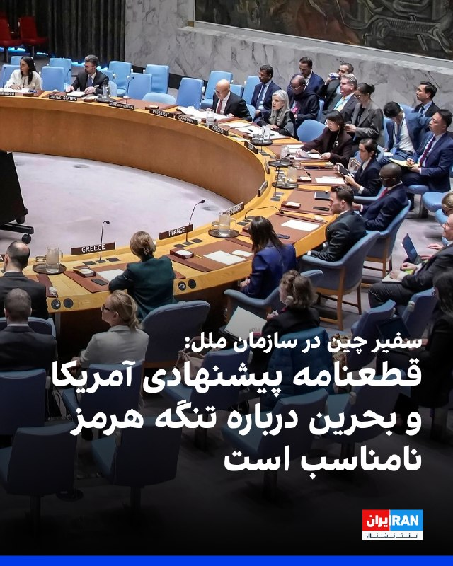
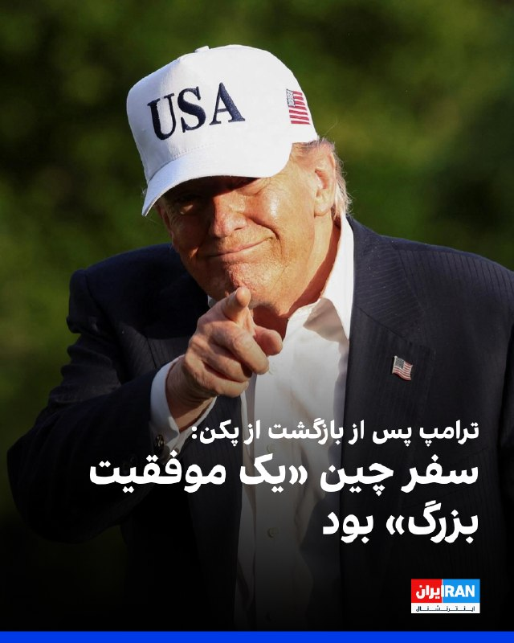
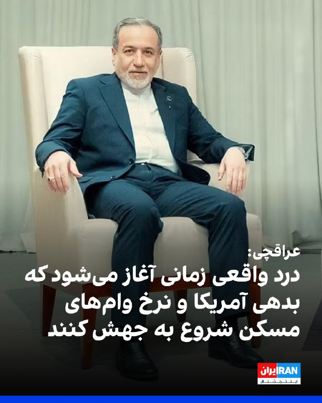
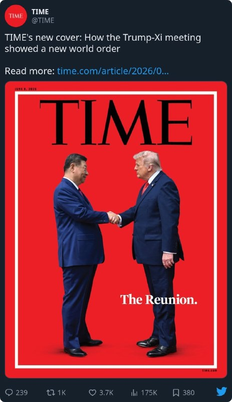

# خواننده تلگرام

<!-- TOP_NAV START -->

<a href="https://github.com/benyamin-najmi/aio-downloader/blob/main/telegram/content/archive_1.md" style="display:inline-block; padding:6px 12px; margin:0 4px; background-color:#2ea44f; color:white; text-decoration:none; border-radius:4px; font-weight:bold;">صفحه بعد</a>

<!-- TOP_NAV END -->

<!-- MSG START -->

---
📅 بروزرسانی: 1405/02/26 03:41
---

## VahidOOnLine — post 240395

  

ترامپ پس از بازگشت از سفر چین در محوطه کاخ سفید به خبرنگاران گفت این سفر «یک موفقیت بزرگ» بوده است. او تاکید کرد «توافق‌های تجاری فوق‌العاده‌ای» حاصل شده و افزود اتفاقات مهمی رخ داده که به‌زودی اعلام خواهد شد. ترامپ این سفر را «یک لحظه تاریخی» توصیف کرد.
‌🏁 🇬🇧 IranintlTV

🤖 @VahidOOnLine

## VahidOOnLine — post 240394

  

♦️دونالد ترامپ، رئیس‌جمهوری ایالات متحده در گفتگو با شبکه خبری فاکس نیوز گفت: «ما پنج بار به توافق با رژیم ایران نزدیک شدیم و هر بار در آستانه دستیابی به آن بودیم، اما روز بعد طوری رفتار می‌کردند که انگار اصلا گفتگویی نداشته‌ایم.»
او در این مصاحبه افزود: «آن‌ها به خوبی می‌دانند که ما از نظر نظامی چقدر قوی هستیم. سپس، به درخواست یک گروه بسیار خوب از پاکستان که بسیار به ایران نزدیک هستند، من آن گام نهایی را برنداشتم. آن‌ها گفتند آیا می‌توانید متوقفش کنید؟ ما می‌خواهیم توافق کنیم؛ و ما واقعا چارچوب یک توافق را داشتیم؛ بدون سلاح هسته‌ای. آن‌ها قرار بود همه چیزهایی را که می‌خواستیم، حتی غبار هسته‌ای را به ما تحویل دهند. اما هر بار که به توافق می‌رسیدیم، روز بعد مثل این بود که اصلا چنین گفتگویی نداشته‌ایم. این اتفاق حدود پنج بار تکرار شده است. مشکلی در آن‌ها وجود دارد؛ آن‌ها واقعا دیوانه‌اند.»
‌🇸🇦 Indypersian

🤖 @VahidOOnLine

## VahidOOnLine — post 240393

  

♦️ایلان ماسک، میلیاردر مشهور آمریکایی، مالک پلتفرم اکس و بنیان‌گذار تسلا و اسپیس‌ایکس، با انتشار عبارتی کوتاه در حساب کاربری خود در اکس نوشت: «اینستاگرام برنامه‌ای برای دختران است.»
در روزهای گذشته، برخی از مشهورترین مدیران ارشد آمریکایی، از جمله ایلان ماسک، دونالد ترامپ را در سفر رسمی و تاریخی‌اش به چین همراهی کرده‌اند.
‌🇸🇦 Indypersian

🤖 @VahidOOnLine

## VahidOOnLine — post 240392

  

سفیر چین در سازمان ملل از پیش‌نویس قطعنامه پیشنهادی آمریکا و بحرین درباره تنگه هرمز انتقاد کرد و گفت «هم محتوا و هم زمان آن نامناسب است» و کمکی به کاهش تنش‌ها با جمهوری اسلامی نخواهد کرد.
این پیش‌نویس از تهران می‌خواهد حملات و فعالیت‌های مین‌گذاری در تنگه هرمز را متوقف کند. چین و روسیه ماه گذشته نیز قطعنامه مشابهی را با این استدلال که جمهوری اسلامی را ناعادلانه هدف قرار می‌دهد، مسدود کرده بودند.

‌🏁 🇬🇧 IranintlTV

🤖 @VahidOOnLine

## VahidOOnLine — post 240391

  

سفیر چین در سازمان ملل از پیش‌نویس قطعنامه پیشنهادی آمریکا و بحرین درباره تنگه هرمز انتقاد کرد و گفت «هم محتوا و هم زمان آن نامناسب است» و کمکی به کاهش تنش‌ها با جمهوری اسلامی نخواهد کرد.
این پیش‌نویس از تهران می‌خواهد حملات و فعالیت‌های مین‌گذاری در تنگه هرمز را متوقف کند. چین و روسیه ماه گذشته نیز قطعنامه مشابهی را با این استدلال که جمهوری اسلامی را ناعادلانه هدف قرار می‌دهد، مسدود کرده بودند.

‌🏁 🇬🇧 IranintlTV

🤖 @VahidOOnLine

## VahidOOnLine — post 240390

  

سفیر چین در سازمان ملل از پیش‌نویس قطعنامه پیشنهادی آمریکا و بحرین درباره تنگه هرمز انتقاد کرد و گفت «هم محتوا و هم زمان آن نامناسب است» و کمکی به کاهش تنش‌ها با جمهوری اسلامی نخواهد کرد.
این پیش‌نویس از تهران می‌خواهد حملات و فعالیت‌های مین‌گذاری در تنگه هرمز را متوقف کند. چین و روسیه ماه گذشته نیز قطعنامه مشابهی را با این استدلال که جمهوری اسلامی را ناعادلانه هدف قرار می‌دهد، مسدود کرده بودند.

‌🏁 🇬🇧 IranintlTV

🤖 @VahidOOnLine

## pm_afshaa — post 90825

  <a href="telegram/content/pm_afshaa_90825_1778890309.webm" target="_blank">🎬 Download video</a>

🔴ترامپ: افزایش قیمت‌ بنزین مرتبط با جنگ ایران «درد کوتاه‌مدت» است که بسیار کمتر از چیزی است که مردم انتظار داشتن.

وقتی به کسی میگید که باید کمی بیشتر برای بنزین در یک دوره بسیار کوتاه بپردازید، چون میخوایم جلوی تهدید تکه‌تکه شدن توسط یک دیوانه، یک فرد دیوانه رو بگیریم، و آنها دیوانه هستن با استفاده از سلاح‌های هسته‌ای، همه میگن که این خوب است.

💧 Rainbet.com the #1 Non-KYC Crypto Casino & Sportsbook @rainbetcom

😁 @Pm_Afshaa

## pm_afshaa — post 90824

  <a href="telegram/content/pm_afshaa_90824_1778890310.mp4" target="_blank">🎬 Download video</a>

🔴دونالد ترامپ: ما بر روی سایت‌های هسته‌ای ایران 9 تا دوربین در فضا داریم. ما نام یک شخص رو میخونیم، اگه اسمش محمد باشه که اکثر آنها محمد هستن، شما میتونید حدود 50 درصد درست حدس بزنید.

خلاصه اینکه، هر کسی که به آنجا نزدیک میشه، ما یک تگ داریم.

💧 Rainbet.com the #1 Non-KYC Crypto Casino & Sportsbook @rainbetcom

😁 @Pm_Afshaa

## pm_afshaa — post 90823

  <a href="telegram/content/pm_afshaa_90823_1778890312.webm" target="_blank">🎬 Download video</a>

🔴ترامپ: ایران سال‌ها و سال‌ها جهان رو با تنگه هرمز به گروگان گرفته، آنها در گذشته تنگه رو بسته‌اند، از آن به عنوان سلاح استفاده می‌کنن ولی از آن به عنوان سلاح علیه من استفاده نمی‌کنن.

شی جین‌پینگ، رئیس جمهور چین دیشب با خنده بهم گفت: خب، اونا تنگه رو میبندن، بعد تو هم اونا رو می‌بندی.

💧 Rainbet.com the #1 Non-KYC Crypto Casino & Sportsbook @rainbetcom

😁 @Pm_Afshaa

## pm_afshaa — post 90822

  <a href="telegram/content/pm_afshaa_90822_1778890313.webm" target="_blank">🎬 Download video</a>

🔴ترامپ در مورد سفر خود به چین:
این یک موفقیت بزرگ بود. فوق‌العاده بود و ما قراردادهای بزرگی بستیم.

ما قراردادهای تجاری بزرگی انجام دادیم و رابطه‌ای عالی داریم. اتفاقات زیادی افتاده ث و شما در مورد آن‌ها خواهید شنید. فکر میکنم این واقعاً یک لحظه تاریخی بود.

💧 Rainbet.com the #1 Non-KYC Crypto Casino & Sportsbook @rainbetcom

😁 @Pm_Afshaa

## pm_afshaa — post 90821

  <a href="telegram/content/pm_afshaa_90821_1778890314.mp4" target="_blank">🎬 Download video</a>

🔴مجری: چطور چین این هفته 3 نفتکش پر از نفت ایران رو بیرون برد؟

ترامپ: چون ما اجازه دادیم این اتفاق بیفته.

💧 Rainbet.com the #1 Non-KYC Crypto Casino & Sportsbook @rainbetcom

😁 @Pm_Afshaa

## pm_afshaa — post 90820

🎙️مجری: آمریکایی‌ها میخوان بدونن چه زمانی تمام میشه؟

ترامپ: جنگ ویتنام 19 سال طول کشید، عراق حدود 10 سال، کره 7 سال، یکی دیگه 14 سال، یکی دیگه 12 سال، یکی دیگر 9 سال و ما فقط دو و نیم ماهه که اونجا (جنگ ایران) هستیم.

💧 Rainbet.com the #1 Non-KYC Crypto Casino & Sportsbook @rainbetcom

😁 @Pm_Afshaa

## pm_afshaa — post 90819

  <a href="telegram/content/pm_afshaa_90819_1778890316.webm" target="_blank">🎬 Download video</a>

🔴دونالد ترامپ: ایران دیگه برگی برای بازی نداره و تنها چیزی که دارن یه رسانه فیکه؛ خودشونم میدونن ما از نظر نظامی چقدر دست بالا رو داریم.

بعد یه گروه محترم از پاکستان که به ایران نزدیکن، ازم خواستن اون ضربه نهایی رو نزنم؛ گفتن میتونیم توافق کنیم، ما هم تقریباً به چارچوب توافق رسیده بودیم، اما بدون سلاح هسته‌ای. قرار بود حتی مواد هسته‌ای رو هم تحویل بدن، هر چیزی که میخواستیم، ولی هر بار توافق میکنن، فرداش انگار نه انگار همچین حرفی شده؛ این داستان حدود پنج بار تکرار شده… یه مشکلی دارن واقعاً... دیوونه‌ان. و دقیقاً به خاطر همین نمی‌تونن سلاح هسته‌ای داشته باشن!

💧 Rainbet.com the #1 Non-KYC Crypto Casino & Sportsbook @rainbetcom

😁 @Pm_Afshaa

## pm_afshaa — post 90818

  <a href="telegram/content/pm_afshaa_90818_1778890316.mp4" target="_blank">🎬 Download video</a>

🎙️مجری‌‌‌‌: فکر می کنید ایران به زودی تسلیم خواهد شد؟

ترامپ: من شک ندارم.

🎙️مجری: تحمل درد (مقاومت) ایران رو دست کم گرفتید؟

ترامپ: من چیزی رو دست کم نگرفتم، میتونستم ظرف دو روز پل‌ها و ظرفیت برق آنها رو نابود کنم.

💧 Rainbet.com the #1 Non-KYC Crypto Casino & Sportsbook @rainbetcom

😁 @Pm_Afshaa

## pm_afshaa — post 90817

  <a href="telegram/content/pm_afshaa_90817_1778890318.webm" target="_blank">🎬 Download video</a>

🔴ترامپ: به چین گفتم که آمریکا در پرونده ایران یا تامین امنیت کشتیرانی در تنگه هرمز به هیچ کمکی نیاز نداره.

رئیس جمهور چین با من موافقه که ایران نباید سلاح هسته‌ای داشته باشه. چین برای تامین 40 درصد نفت خود به تنگه هرمز وابسته‌س.

تنگه هرمز باز خواهد شد و ما تضمین خواهیم کرد که آنها سلاح هسته‌ای نداشته باشن و جهان پایدار بمونه.

💧 Rainbet.com the #1 Non-KYC Crypto Casino & Sportsbook @rainbetcom

😁 @Pm_Afshaa

## IranIntlTV — post 337401

  

ترامپ پس از بازگشت از سفر چین در محوطه کاخ سفید به خبرنگاران گفت این سفر «یک موفقیت بزرگ» بوده است. او تاکید کرد «توافق‌های تجاری فوق‌العاده‌ای» حاصل شده و افزود اتفاقات مهمی رخ داده که به‌زودی اعلام خواهد شد. ترامپ این سفر را «یک لحظه تاریخی» توصیف کرد.
https://iranintl.com/202605154748

## IranIntlTV — post 337398

  

سفیر چین در سازمان ملل از پیش‌نویس قطعنامه پیشنهادی آمریکا و بحرین درباره تنگه هرمز انتقاد کرد و گفت «هم محتوا و هم زمان آن نامناسب است» و کمکی به کاهش تنش‌ها با جمهوری اسلامی نخواهد کرد.
این پیش‌نویس از تهران می‌خواهد حملات و فعالیت‌های مین‌گذاری در تنگه هرمز را متوقف کند. چین و روسیه ماه گذشته نیز قطعنامه مشابهی را با این استدلال که جمهوری اسلامی را ناعادلانه هدف قرار می‌دهد، مسدود کرده بودند.

https://iranintl.com/202605154459

## FarsiVOA — post 217865

  

⚡️دونالد ترامپ، رئیس‌جمهوری آمریکا، در مصاحبه‌ای با فاکس‌نیوز گفت ایالات متحده می‌تواند پل‌ها و نیروگاه‌ها در ایران را «در دو روز» منهدم کند.
آقای ترامپ در پاسخ به برت بایر،‌ مجری فاکس‌نیوز که با توجه به شرایط حاضر از رئیس‌جمهوری آمریکا پرسید که آیا آستانه تحمل درد جمهوری اسلامی را دست‌‌کم گرفته است؟ گفت: «من هیچ چیزی را دست کم نگرفتم. ما به طرز باورنکردنی به آنها ضربه زدیم.»
آقای ترامپ گفت: «ببینید، ما پل‌هایشان را باقی گذاشتیم. ظرفیت تولید برقشان را باقی گذاشتیم. می‌توانیم همه آن‌ها را ظرف دو روز، فقط دو روز، کاملاً از بین ببریم.»
آقای ترامپ افزود به تاسیسات حساس انرژی جزیره خارک نیز آمریکا حمله نکرد: «ما جزیره خارک را هم باقی گذاشتیم،..من گفتم بزنیدش، اما نه شیرهایی را که نفت از آن‌ها خارج می‌شود، چون اگر آن‌ها را بزنید، یعنی مقداری نفت از دست خواهد رفت.»
@FarsiVOA

## FarsiVOA — post 217864

⚡️طرح ممنوعیت اقامت بستگان مقام‌های جمهوری اسلامی در خاک آمریکا؛ گفت‌وگو با کیانوش رزاقی
@FarsiVOA

## FarsiVOA — post 217863

⚡️موضع‌گیری شش کشور عربی علیه جمهوری اسلامی در نامه‌ای به شورای امنیت؛ گفت‌وگو با مجید گلپور
@FarsiVOA

## BBCPersian — post 281158

  

‌ ‌ ‌ ‌
دونالد ترامپ، رئیس جمهور آمریکا، می‌گوید که تعلیق ۲۰ ساله برنامه هسته‌ای ایران را می‌پذیرد، که به نظر می‌رسد یک تغییر اساسی در موضع او مبنی بر برچیده شدن کامل برنامه هسته‌ای ایران باشد.

آقای ترامپ در هواپیمای ریاست جمهور و پس از سفر به پکن گفته است که این تعلیق باید «۲۰ سال واقعی» باشد.

پیشتر، او از ایران خواسته بود که غنی‌سازی اورانیوم را به طور دائم متوقف کند و از دستیابی به سلاح‌های هسته‌ای برای همیشه جلوگیری شود.

اما او همچنین گفت که صبرش در قبال ایران رو به پایان است و هیچ نشانه‌ای از پیشرفت در مذاکرات وجود ندارد.

اخیرا ایران پیشنهادات آمریکا برای رسیدن به توافق را رد کرده بود و پس آن هم واشنگتن پیشنهادات تهران را قابل قبول ندانست.

https://bbc.in/4uedXw9
📷 Reuters
@BBCPersian

---
📅 بروزرسانی: 1405/02/26 02:45
---

## VahidOOnLine — post 240389

♦️دونالد ترامپ، رئیس‌جمهوری آمریکا، بامداد شنبه ۲۶ اردیبهشت پس از پایان سفر رسمی خود به چین وارد پایگاه مشترک اندروز در نزدیکی واشنگتن شد.
پکن در دو روز گذشته میزبان دیدار تاریخی دونالد ترامپ و شی جین‌پینگ، رئیس‌جمهوری چین، بود؛ سفری که با استقبال رسمی گسترده و گفتگو درباره روابط اقتصادی، تجاری و تنش‌های منطقه‌ای همراه بود.
‌🇸🇦 Indypersian

🤖 @VahidOOnLine

## VahidOOnLine — post 240388

♦️حساب رسمی کاخ سفید، روز جمعه ۲۵ اردیبهشت، با انتشار تصاویری از سفر دونالد ترامپ به چین اعلام کرد رئیس‌جمهوری آمریکا از «معبد آسمان» در پکن بازدید کرده است.
پکن در دو روز گذشته میزبان دیدار تاریخی دونالد ترامپ، رئیس‌جمهوری آمریکا، و شی جین‌پینگ، رئیس‌جمهوری چین، بود؛ دیداری که با استقبال رسمی گسترده و گفتگو درباره مسائل اقتصادی، تجاری و تنش‌های منطقه‌ای همراه بود.
‌🇸🇦 Indypersian

🤖 @VahidOOnLine

## VahidOOnLine — post 240387

  <a href="telegram/content/VahidOOnLine_240387_1778886942.mp4" target="_blank">🎬 Download video</a>

دادستان‌های آمریکا اعلام کردند یک شهروند عراقی به اتهام طراحی حمله تروریستی به یک کنیسه مشهور در نیویورک و حمایت از گروه‌های مورد حمایت جمهوری اسلامی بازداشت و متهم شده است.

محمد باقر سعد داوود الساعدی، ۳۲ ساله، روز جمعه در دادگاهی در منهتن حاضر شد و مقام‌های آمریکایی او را به «توطئه برای ارائه حمایت مادی به سازمان‌های تروریستی خارجی» از جمله سپاه پاسداران و گروه کتائب حزب‌الله عراق متهم کردند.

بر اساس اسناد دادگاه، الساعدی از فرماندهان کتائب حزب‌الله معرفی شده و متهم است از ماه مارس در طراحی، اجرا و تبلیغ حدود ۱۸ حمله علیه منافع آمریکا و اسرائیل در اروپا نقش داشته است.

دادستان‌ها می‌گویند او برای انجام حمله به یک کنیسه در نیویورک، با فردی که در واقع مامور مخفی اف‌بی‌آی بوده تماس گرفته و تصاویر، نقشه‌ها و اطلاعات مربوط به محل حمله را در اختیار او قرار داده است. به گفته مقام‌های آمریکایی، او همچنین تصاویری از مراکز یهودیان در لس‌آنجلس و اسکاتسدیل آریزونا ارسال کرده بود.

در یکی از مکالمات ضبط‌شده، الساعدی درباره هزینه «انجام عملیات بمب‌گذاری» در آمریکا پرس‌وجو کرده و گفته بود: «ما برایش یک معبد یهودیان یا یک مرکز یهودیان فراهم می‌کنیم.»

دادستان‌ها می‌گویند او با مامور مخفی بر سر پرداخت ۱۰ هزار دلار رمزارز برای اجرای حمله توافق کرده و سه هزار دلار به‌عنوان پیش‌پرداخت ارسال کرده بود. بر اساس این گزارش، الساعدی بعدتر در ترکیه بازداشت و به اف‌بی‌آی تحویل داده شد.

پلیس نیویورک اعلام کرد این پرونده «تهدیدهای جهانی ناشی از جمهوری اسلامی و گروه‌های نیابتی‌اش» را آشکار می‌کند. مقام‌های آمریکایی همچنین گفتند با همکاری نهادهای امنیتی، طرح حمله به کنیسه‌ای در منهتن خنثی شده است.

در اسناد دادگاه همچنین تصاویری از دیدار الساعدی با قاسم سلیمانی، فرمانده پیشین نیروی قدس سپاه پاسداران، منتشر شده است.
‌🏁 🇬🇧 ManotoTV

🤖 @VahidOOnLine

## VahidOOnLine — post 240386

  

♦️عباس عراقچی، وزیر امور خارجه جمهوری اسلامی، در واکنش به افزایش قیمت انرژی در آمریکا، با انتشار پیامی در اکس نوشت آمریکایی‌ها مجبور شده‌اند «هزینه‌های سرسام‌آور جنگ انتخابی علیه ایران» را تحمل کنند.
او در این پیام نوشت: «فعلا افزایش قیمت بنزین و حباب بازار سهام را کنار بگذارید. درد واقعی زمانی آغاز می‌شود که بدهی آمریکا و نرخ وام‌های مسکن شروع به افزایش کنند.»
عراقچی همچنین مدعی شد میزان ناتوانی در بازپرداخت وام خودرو در آمریکا به بالاترین سطح خود در بیش از ۳۰ سال گذشته رسیده و افزود: «تمام این‌ها قابل اجتناب بود.»
‌🇸🇦 Indypersian

🤖 @VahidOOnLine

## VahidOOnLine — post 240385

  

عباس عراقچی، وزیر خارجه جمهوری اسلامی، در واکنش به بالا رفتن قیمت انرژی در آمریکا، در ایکس نوشت: «در حال حاضر، افزایش قیمت بنزین و حباب بازار سهام را کنار بگذارید. درد واقعی زمانی آغاز می‌شود که بدهی آمریکا و نرخ وام‌های مسکن شروع به جهش کنند.»
او نوشت همین حالا هم میزان ناتوانی در بازپرداخت وام خودرو به بالاترین سطح خود در بیش از ۳۰ سال گذشته رسیده است، اما تمام این‌ها قابل اجتناب بود.

‌🏁 🇬🇧 IranintlTV

🤖 @VahidOOnLine

## IranIntlTV — post 337397

  <a href="telegram/content/IranIntlTV_337397_1778886944.mp4" target="_blank">🎬 Download video</a>

عکس یادگاری سرمایه‌داری و کمونیسم در پکن، برای تهران تصویری آرامش‌بخش نبود؛ سفر ترامپ به چین نشان داد جمهوری اسلامی در اوج ضعف، بیش از آن‌که بازیگر میز قدرت‌ها باشد، به کارتی در دست واشینگتن و پکن تبدیل شده است.

آرین ریسباف گزارش می‌دهد.
@iranintltv

## IranIntlTV — post 337396

  

عباس عراقچی، وزیر خارجه جمهوری اسلامی، در واکنش به بالا رفتن قیمت انرژی در آمریکا، در ایکس نوشت: «در حال حاضر، افزایش قیمت بنزین و حباب بازار سهام را کنار بگذارید. درد واقعی زمانی آغاز می‌شود که بدهی آمریکا و نرخ وام‌های مسکن شروع به جهش کنند.»
او نوشت همین حالا هم میزان ناتوانی در بازپرداخت وام خودرو به بالاترین سطح خود در بیش از ۳۰ سال گذشته رسیده است، اما تمام این‌ها قابل اجتناب بود.

https://iranintl.com/202605157120

## IranIntlTV — post 337395

  <a href="telegram/content/IranIntlTV_337395_1778886946.mp4" target="_blank">🎬 Download video</a>

امارات متحده عربی اعلام کرد پروژه خط لوله جدید نفت برای دور زدن تنگه هرمز را با سرعت بیشتری پیش خواهد برد.

به گفته مقام‌های ابوظبی، این خط لوله تا سال ۲۰۲۷ ظرفیت صادرات نفت از بندر فجیره را دو برابر می‌کند.

گفت‌وگو با علی دادپی، اقتصاددان
@iranintltv

## ManotoTV — post 105502

  <a href="telegram/content/ManotoTV_105502_1778886947.mp4" target="_blank">🎬 Download video</a>

دادستان‌های آمریکا اعلام کردند یک شهروند عراقی به اتهام طراحی حمله تروریستی به یک کنیسه مشهور در نیویورک و حمایت از گروه‌های مورد حمایت جمهوری اسلامی بازداشت و متهم شده است.

محمد باقر سعد داوود الساعدی، ۳۲ ساله، روز جمعه در دادگاهی در منهتن حاضر شد و مقام‌های آمریکایی او را به «توطئه برای ارائه حمایت مادی به سازمان‌های تروریستی خارجی» از جمله سپاه پاسداران و گروه کتائب حزب‌الله عراق متهم کردند.

بر اساس اسناد دادگاه، الساعدی از فرماندهان کتائب حزب‌الله معرفی شده و متهم است از ماه مارس در طراحی، اجرا و تبلیغ حدود ۱۸ حمله علیه منافع آمریکا و اسرائیل در اروپا نقش داشته است.

دادستان‌ها می‌گویند او برای انجام حمله به یک کنیسه در نیویورک، با فردی که در واقع مامور مخفی اف‌بی‌آی بوده تماس گرفته و تصاویر، نقشه‌ها و اطلاعات مربوط به محل حمله را در اختیار او قرار داده است. به گفته مقام‌های آمریکایی، او همچنین تصاویری از مراکز یهودیان در لس‌آنجلس و اسکاتسدیل آریزونا ارسال کرده بود.

در یکی از مکالمات ضبط‌شده، الساعدی درباره هزینه «انجام عملیات بمب‌گذاری» در آمریکا پرس‌وجو کرده و گفته بود: «ما برایش یک معبد یهودیان یا یک مرکز یهودیان فراهم می‌کنیم.»

دادستان‌ها می‌گویند او با مامور مخفی بر سر پرداخت ۱۰ هزار دلار رمزارز برای اجرای حمله توافق کرده و سه هزار دلار به‌عنوان پیش‌پرداخت ارسال کرده بود. بر اساس این گزارش، الساعدی بعدتر در ترکیه بازداشت و به اف‌بی‌آی تحویل داده شد.

پلیس نیویورک اعلام کرد این پرونده «تهدیدهای جهانی ناشی از جمهوری اسلامی و گروه‌های نیابتی‌اش» را آشکار می‌کند. مقام‌های آمریکایی همچنین گفتند با همکاری نهادهای امنیتی، طرح حمله به کنیسه‌ای در منهتن خنثی شده است.

در اسناد دادگاه همچنین تصاویری از دیدار الساعدی با قاسم سلیمانی، فرمانده پیشین نیروی قدس سپاه پاسداران، منتشر شده است.

## FarsiVOA — post 217862

🔺ترامپ: مقامات جمهوری اسلامی دیوانه‌‌اند و به‌همین دلیل نباید سلاح هسته‌ای داشته باشند؛ پس از هر توافقی وانمود می‌کنند هیچ مذاکره‌ای نشده است

◾️دونالد ترامپ، رئیس‌جمهوری آمریکا، در مصاحبه‌ای با فاکس‌نیوز گفت ایالات متحده می‌تواند پل‌ها و نیروگاه‌ها در ایران را «در دو روز» منهدم کند.

⬇️ بیشتر بخوانید:
https://ir.voanews.com/a/8150501.html
@FarsiVOA

## Persian_Trend_Official — post 14225

  <a href="telegram/content/Persian_Trend_Official_14225_1778886948.mp4" target="_blank">🎬 Download video</a>

شبتون بخیر ❤️🔥

📝 Nick
📌 @persian_trend_official
پرشین ترند | متفاوت‌ترین کانال نظامی

## Persian_Trend_Official — post 14224

  

🔴محمدباقر السعدی، رهبر حزب‌الله عراق توسط FBI دستگیر شد

🔹السعدی به دلیل فعالیت‌هایش با گردان‌های حزب‌الله عراق و سپاه پاسداران ایران با شش اتهام روبرو است

💢اداره تحقیقات فدرال آمریکا اعلام کرد «محمد السعدی» که از او به‌عنوان یک هدف باارزش مرتبط با تروریسم بین‌المللی یاد شده، بازداشت و به آمریکا منتقل شده است.

🔻بر اساس بیانیه اف‌بی‌آی:

▪️ السعدی و همدستانش متهم به برنامه‌ریزی، هماهنگی و پذیرش مسئولیت دست‌کم ۲۰ حمله تروریستی در اروپا و کانادا هستند
▪️ مقام‌های آمریکایی مدعی‌اند این شبکه در حال برنامه‌ریزی حملات آینده علیه آمریکا نیز بوده است
▪️ از جمله اهداف احتمالی، مراکز و نهادهای یهودی در نیویورک، کالیفرنیا و آریزونا عنوان شده‌اند

💢اف‌بی‌آی این بازداشت را بخشی از اقدامات دولت ترامپ برای مقابله با تروریسم توصیف کرده است.

🫆:Tony

📌 @persian_trend_official
پرشین ترند | متفاوت‌ترین کانال نظامی

## IranianMinds — post 20219

  <a href="telegram/content/IranianMinds_20219_1778886949.mp4" target="_blank">🎬 Download video</a>

عباس یه بار فقط بگو بله مامان 😭

🔴 جاوید نام عباس کشاورز ۳۹ ساله اهل روستای لفمجان لاهیجان پدر ارشا ۱۲ ساله …

او در شب ۱۹ دی ۱۴۰۴ در جریان اعتراضات در شهر رشت، در محدوده میدان صیقلان، با شلیک مستقیم گلوله کشته شد.

جاویدنامان فراموش نمیشوند.

@IranianMinds

## IranianMinds — post 20218

فقط کافیه مرغ از خیابون رد کنی و‌پولت چند برابر کنی
💵👌

## IranianMinds — post 20217

  <a href="telegram/content/IranianMinds_20217_1778886950.mp4" target="_blank">🎬 Download video</a>

بچه ها اسم این بازی عبور مرغ از خیابون  هست ویدئو نگاه کنید خیلی راحت 8 میلیون ازش سود گرفتیم😍

😤اگ توم دوس داری خیلی راحت از بازی های انلاین پول در بیاری حتما عضو کازینو شبانه شو
✅

توی کازینو شبانه بهت اموزش میدیم از بازی های انلاین پول دربیاری👌

کازینو شبانه راهی برای چند برابر کردن سرمایت 🤷‍♂

کسب درامد انلاین با یه ادم حرفه ای یاد بگیر و‌ پول دربیار 
💵
ae25
🎯همین حالا عضو شو و شروع کن👇
https://t.me/+OS-QBvyDO4M2ZGY0
https://t.me/+OS-QBvyDO4M2ZGY0

## IranianMinds — post 20216

🔴 کانال ۱۳ اسرائیل:

برآوردها حاکی از آن است که ترامپ چراغ سبز برای حمله محدود به مواضع رژیم ملاها را خواهد داد

@IranianMinds

## IranianMinds — post 20215

🔴 سازمان ملل: نگرانیم، چون ممکنه منطقه بازم دچار تنش و درگیری بشه

@IranianMinds

## IranianMinds — post 20214

  

🔴جلد جدید مجله تایم:

چگونه دیدار ترامپ و شی، یک نظم نوین جهانی را به نمایش گذاشت.

@IranianMinds

## BBCPersian — post 281157

  

‌ ‌ ‌ ‌
دولت ایالات متحده به دنبال مجازات اعدام برای مظنونی است که سال گذشته به قتل دو نفر از کارکنان سفارت اسرائیل در واشنگتن متهم شده است.

جینین پیرو، دادستان ناحیه کلمبیا، روز جمعه درخواست مجازات اعدام برای سه مورد از مجموع ۱۳ اتهام علیه الیاس رودریگز ۳۱ ساله را ارائه کرد. پس از محدودیت‌های اعمال‌شده در دوره جو بایدن، رئیس جمهور سابق آمریکا، دونالد ترامپ، از مجازات اعدام فدرال حمایت کرد.

مقام‌های قضایی آمریکا ادعا می‌کنند که رودریگز پیش از شلیک در خارج از موزه یهودیان پایتخت به سمت زوج یارون لیشینسکی، ۳۰ ساله، و سارا لین میلگریم، ۲۶ ساله، فریاد زده بود «فلسطین را آزاد کنید.»

آقای رودریگز پس از این حمله دستگیر شد و در دادگاه خود را بی‌گناه دانسته است.

اگر رودریگز به اتهام قتل یک مقام خارجی، شلیک با اسلحه گرم در حین جرم خشونت‌آمیز و قتل از طریق استفاده از اسلحه گرم مجرم شناخته شود، دادستان ناحیه کلمبیا برای او درخواست اعدام خواهد کرد.

https://bbc.in/496s8el
📷 X/Reuters
@BBCPersian

## Dirty_Kids — post 389538

  <a href="telegram/content/Dirty_Kids_389538_1778886952.webm" target="_blank">🎬 Download video</a>

☢️خفن ترین و‌ قدیمی ترین  انالیزور  ایران ینی دکتر بت 
👍 
🔴هیچ سایت بتی دوست نداره شما کانال دکتر بت رو پیدا کنین چون خیلی سود میکنید🤷‍♂ رایگان بهترین شرط هارو براتون میذاره حتی هزار تومن هم دریافت نمیکنه روزانه میتونی از پیش بینی فوتبال باهاش پول در بیاری…

## Dirty_Kids — post 389537

  <a href="telegram/content/Dirty_Kids_389537_1778886953.webm" target="_blank">🎬 Download video</a>

☢️خفن ترین و‌ قدیمی ترین  انالیزور  ایران ینی دکتر بت 
👍

🔴هیچ سایت بتی دوست نداره شما کانال دکتر بت رو پیدا کنین چون خیلی سود میکنید🤷‍♂

رایگان بهترین شرط هارو براتون میذاره
حتی هزار تومن هم دریافت نمیکنه
روزانه میتونی از پیش بینی فوتبال باهاش پول در بیاری 👌
A25
اگ اهل پیش بینی فوتبالی این کانال اصلا از دست ندین👇

✅https://t.me/+4_ADqwB9e-QwYjlk

✅https://t.me/+4_ADqwB9e-QwYjlk

## Dirty_Kids — post 389536

  

#بخوابیم

@Dirty_Kids 👻

## Dirty_Kids — post 389535

  

بانو ناتالیا بیش از ۲۰ نفر از اعضای حماس رو به هلاکت رسونده تو غزه

@Dirty_Kids 👻

## Dirty_Kids — post 389534

  <a href="telegram/content/Dirty_Kids_389534_1778886954.mp4" target="_blank">🎬 Download video</a>

عمو مانوک؛ اخلاق رضاشاه

@Dirty_Kids 👻

## Dirty_Kids — post 389533

  

پاتو لیس بزن گه اضافه نخور 😂😂

@Dirty_Kids 👻

## Dirty_Kids — post 389532

  <a href="telegram/content/Dirty_Kids_389532_1778886956.mp4" target="_blank">🎬 Download video</a>

املاکی در مصاحبه با Bret Baier مجری برنامه Special Report شبکه فاکس نیوز در خصوص خواری که رژیم کسمغز روافض در مذاکرات ازش گاییدن فرموده که:

«ما واقعاً به نوعی از پایه‌های یک توافق رسیده بودیم. بدون سلاح هسته‌ای.

اون‌هزارپدرای قحبه‌ قرار بود غبار هسته‌ای رو به ما تحویل بدن، همه چیو، هر چیزی که ما می‌خواستیم.

و هر بار که توافقی می‌کنن، این پدرخرابا روز بعدش به جوری رفتار می‌کنن که انگار ما از اساس همچی گفتگویی نداشتیم، و این اتفاق حدود پنج بار رخ داده.

یک مشکلی در این مادرقحبه‌های رافضی وجود داره، در واقع این حرومیا دیونه میوونه‌اند. [علاوه بر کسمغزی،خدعه‌زاده‌ان شیر خدا. اما خب دو بار گاییدی‌شون و فهمیدن اون ممه رو لولو خورد]

و می‌دونید چیه؟ به همین دلیل، این جاکش‌پدرا‌ نباید سلاح هسته‌ای داشته باشن»



@Dirty_Kids 👻

## Dirty_Kids — post 389529

این بانو که یکم حشری‌طور میزنه امروز حاشیه ساز بوده

یه عده دفاع میکنن ازش
یه عده هیت میدن

@Dirty_Kids 👻

## manototv — post 105502

  <a href="telegram/content/manototv_105502_1778886956.mp4" target="_blank">🎬 Download video</a>

دادستان‌های آمریکا اعلام کردند یک شهروند عراقی به اتهام طراحی حمله تروریستی به یک کنیسه مشهور در نیویورک و حمایت از گروه‌های مورد حمایت جمهوری اسلامی بازداشت و متهم شده است.

محمد باقر سعد داوود الساعدی، ۳۲ ساله، روز جمعه در دادگاهی در منهتن حاضر شد و مقام‌های آمریکایی او را به «توطئه برای ارائه حمایت مادی به سازمان‌های تروریستی خارجی» از جمله سپاه پاسداران و گروه کتائب حزب‌الله عراق متهم کردند.

بر اساس اسناد دادگاه، الساعدی از فرماندهان کتائب حزب‌الله معرفی شده و متهم است از ماه مارس در طراحی، اجرا و تبلیغ حدود ۱۸ حمله علیه منافع آمریکا و اسرائیل در اروپا نقش داشته است.

دادستان‌ها می‌گویند او برای انجام حمله به یک کنیسه در نیویورک، با فردی که در واقع مامور مخفی اف‌بی‌آی بوده تماس گرفته و تصاویر، نقشه‌ها و اطلاعات مربوط به محل حمله را در اختیار او قرار داده است. به گفته مقام‌های آمریکایی، او همچنین تصاویری از مراکز یهودیان در لس‌آنجلس و اسکاتسدیل آریزونا ارسال کرده بود.

در یکی از مکالمات ضبط‌شده، الساعدی درباره هزینه «انجام عملیات بمب‌گذاری» در آمریکا پرس‌وجو کرده و گفته بود: «ما برایش یک معبد یهودیان یا یک مرکز یهودیان فراهم می‌کنیم.»

دادستان‌ها می‌گویند او با مامور مخفی بر سر پرداخت ۱۰ هزار دلار رمزارز برای اجرای حمله توافق کرده و سه هزار دلار به‌عنوان پیش‌پرداخت ارسال کرده بود. بر اساس این گزارش، الساعدی بعدتر در ترکیه بازداشت و به اف‌بی‌آی تحویل داده شد.

پلیس نیویورک اعلام کرد این پرونده «تهدیدهای جهانی ناشی از جمهوری اسلامی و گروه‌های نیابتی‌اش» را آشکار می‌کند. مقام‌های آمریکایی همچنین گفتند با همکاری نهادهای امنیتی، طرح حمله به کنیسه‌ای در منهتن خنثی شده است.

در اسناد دادگاه همچنین تصاویری از دیدار الساعدی با قاسم سلیمانی، فرمانده پیشین نیروی قدس سپاه پاسداران، منتشر شده است.

## alonews — post 120300

  <a href="telegram/content/alonews_120300_1778886957.mp4" target="_blank">🎬 Download video</a>

👈رئیس جمهور ترامپ در مورد ایران:
ما نه تا دوربین مختلف توی اون سایت داریم و دقت به قدری بالاست که ما می توانیم نام یک شخص را هم بخوانیم.

🔴اگر اسمش محمد است ، بیشترشان محمد هستند ؛ شما می توانید حدود 50 درصد درست حدس بزنید.

🔴هر کسي که به اون فضا نزديک بشه ، ما میفهمیم

✅ @AloNews خبر جنگ

## alonews — post 120299

  <a href="telegram/content/alonews_120299_1778886959.mp4" target="_blank">🎬 Download video</a>

👈ترامپ: گفتم گرد و غبار هسته ای را می گیریم ایران گفت: "شما می توانید آن را داشته باشید. اونا گفتن ، " ما نمیتونیم تحملش کنیم. ما توانایی مصرف آن را نداریم. گفتم: "چرا؟ اونا گفتن چون خيلي ضربه خورده"

🔴برت بایر فاکس: چرا این کافی نیست اگر هدف شما این بود که آنها را عقب بیندازید ؟

🔴ترامپ: از نظر روابط عمومی به اندازه کافی خوب نیست‌‌

✅ @AloNews خبر جنگ

## alonews — post 120298

  <a href="telegram/content/alonews_120298_1778886960.mp4" target="_blank">🎬 Download video</a>

👈برت بایر از فاکس: فکر می کنید ایران به زودی تسلیم خواهد شد ؟

🔴ترامپ: بله ، من هیچ شکی ندارم.‌‌

✅ @AloNews خبر جنگ

## alonews — post 120297

  <a href="telegram/content/alonews_120297_1778886961.mp4" target="_blank">🎬 Download video</a>

👈رئیس جمهور ترامپ در مورد ایران:
ایران سالهاست که جهان را با تنگه هرمز نگه داشته است. اونا در گذشته تنگه رو بسته بودن اونا ازش به عنوان سلاح استفاده ميکنن اونا ازش به عنوان سلاح با من استفاده نميکنن

🔴رئیس جمهور شی دیشب با لبخند گفت: "خب ، آنها تنگه را می بندند ، و بعد شما آنها را می بندید."‌‌

✅ @AloNews خبر جنگ

## alonews — post 120296

  <a href="telegram/content/alonews_120296_1778886963.mp4" target="_blank">🎬 Download video</a>

👈برت بایر از فاکس: آیا تاب آوری ایران را دست کم گرفتید ؟

🔴ترامپ: چیزی را دست کم نگرفتم ما می توانیم پل ها و ظرفیت برق آنها را در دو روز از بین ببریم.‌‌

✅ @AloNews خبر جنگ

## alonews — post 120295

  <a href="telegram/content/alonews_120295_1778886965.mp4" target="_blank">🎬 Download video</a>

👈ترامپ : ویتنام ۱۹ سال طول کشید، عراق حدود ۱۰ سال، کره ۷ سال، یکی دیگه ۱۴ سال، یکی ۱۲ سال، یکی هم ۹ سال
- ما فقط دو ماه و نیم اونجا بودیم
- چین هم این هفته سه تا نفتکش پر از نفت ایران رو برد، چون ما اجازه دادیم این اتفاق بیفته،شما اجازه دادید

✅ @AloNews خبر جنگ

## alonews — post 120294

  <a href="telegram/content/alonews_120294_1778886966.webm" target="_blank">🎬 Download video</a>

👈ترامپ به فاکس نیوز: چین جرات اقدام علیه تایوان را در دوران قدرت من نخواهد داشت‌‌

🔴پکن از عدم نیاز واشنگتن به هیچ کمکی در پرونده ایران یا ایمن سازی ناوبری در تنگه هرمز خبر داد‌‌

🔴چین برای تامین 40 درصد منابع نفتی خود به تنگه هرمز تکیه می کند‌‌

🔴خب، به هر حال ما به یک راه‌حل خواهیم رسید. بنابراین یا این مسئله به‌صورت خشونت‌آمیز حل می‌شود یا بدون خشونت. و من خیلی ترجیح می‌دهم که بدون خشونت باشد

✅ @AloNews خبر جنگ

## alonews — post 120293

  <a href="telegram/content/alonews_120293_1778886966.webm" target="_blank">🎬 Download video</a>

👈پک ۱۰عددی کاندوم با افزایش قیمت به ۴۸۰هزار تومان رسیده!

🔴دولت باید به اینجور چیزا سوبسید بده تا همه بتونن استفاده کنن اما.....

✅ @AloNews خبر جنگ

<!-- MSG END -->

<!-- NAV START -->

<a href="https://github.com/benyamin-najmi/aio-downloader/blob/main/telegram/content/archive_1.md" style="display:inline-block; padding:6px 12px; margin:0 4px; background-color:#2ea44f; color:white; text-decoration:none; border-radius:4px; font-weight:bold;">صفحه بعد</a>

<!-- NAV END -->
