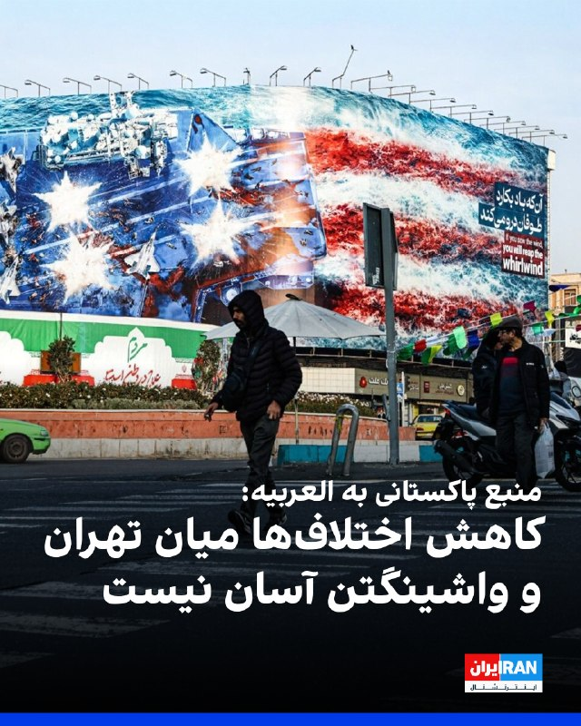
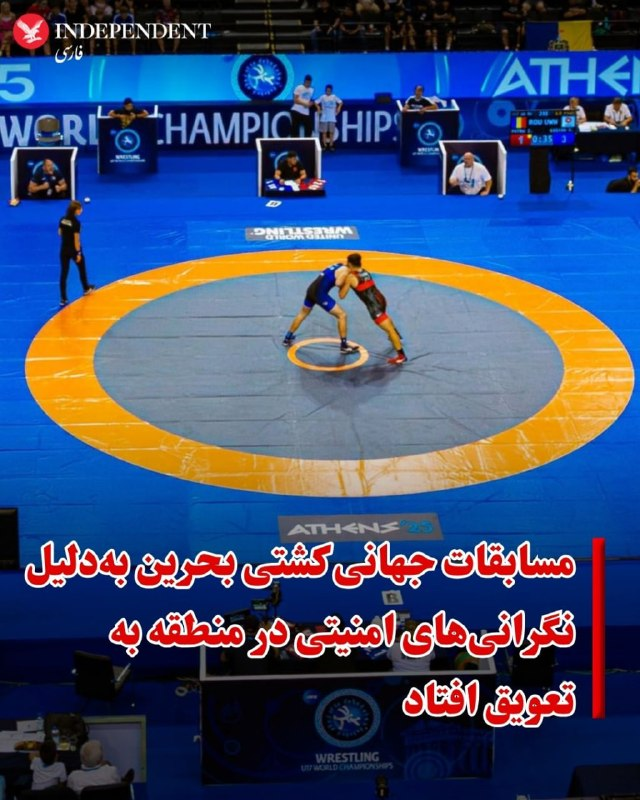
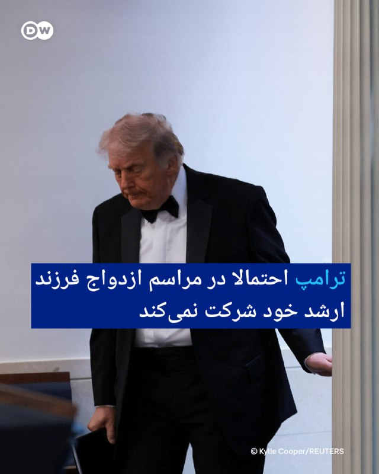
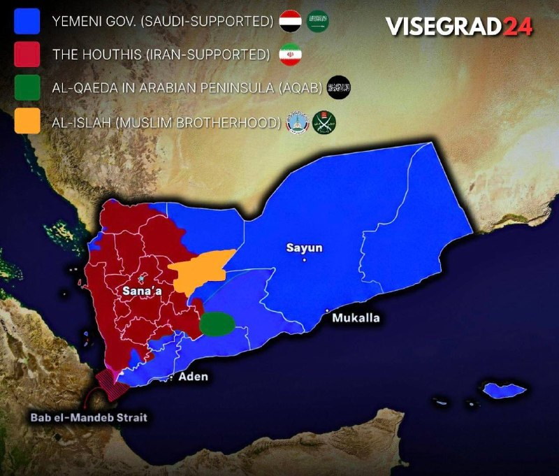
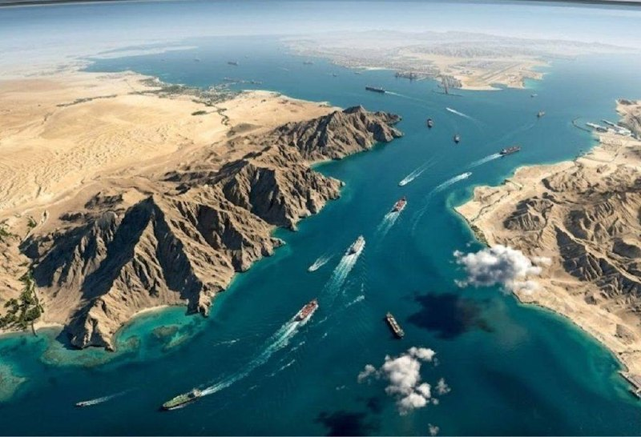
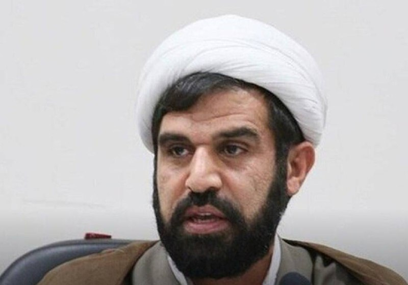
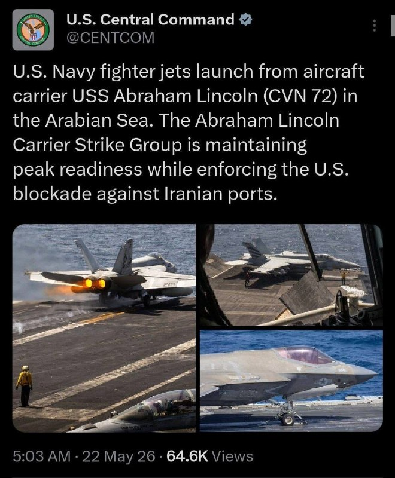
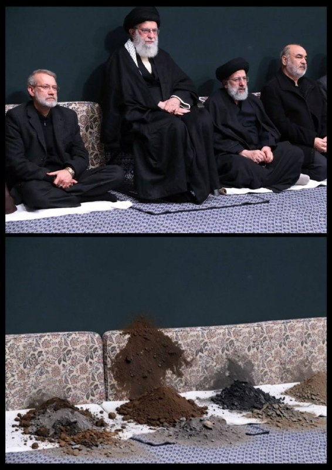
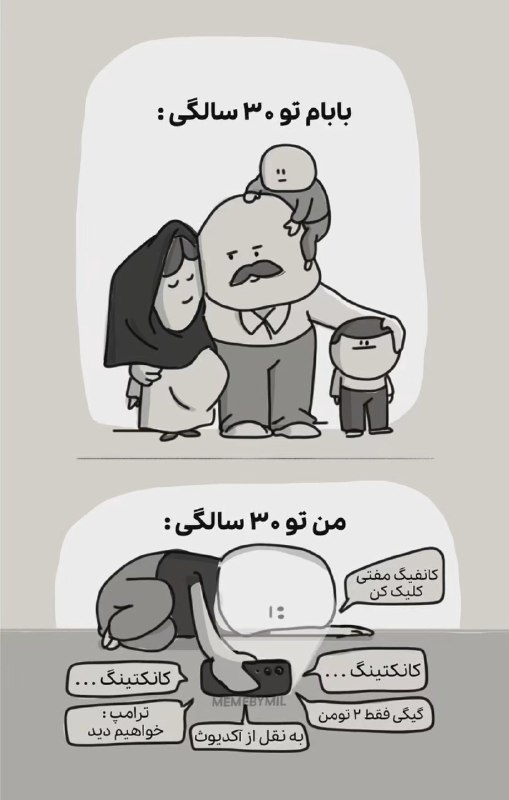

# خواننده تلگرام

<!-- TOP_NAV START -->

<a href="https://github.com/benyamin-najmi/aio-downloader/blob/main/telegram/content/archive_1.md" style="display:inline-block; padding:6px 12px; margin:0 4px; background-color:#2ea44f; color:white; text-decoration:none; border-radius:4px; font-weight:bold;">صفحه بعد</a>

<!-- TOP_NAV END -->

<!-- MSG START -->

---
📅 بروزرسانی: 1405/03/01 15:53
---

## VahidOOnLine — post 241512

اطلاعیه منوتو درباره پایان پخش برنامه‌ها
‌🏁 🇬🇧 ManotoTV

🤖 @VahidOOnLine

## VahidOOnLine — post 241511

  

♦️اسماعیل بقایی، سخنگوی وزارت امور خارجه جمهوری اسلامی روز جمعه اول خردادماه با انتشار پیامی در اکس، از انتقاد فرانک اشتاینمایر، رئیس جمهوری آلمان از جنگ استقبال کرد.

اشتاینمایر، رئیس جمهوری آلمان یک روز پیش از این به یکی از رسانه‌های آلمان گفته بود که جنگ آمریکا و اسرائیل با جمهوری اسلامی «غیرضروی» و «قابل اجتناب» بود.

این دومین بار است که رئیس جمهوری آلمان، مواضعی متفاوت با موضع صدراعظم این کشور در قبال جنگ آمریکا و اسرائیل با جمهوری اسلامی اتخاذ می‌کند. پیش از این و در روزهای نخستین جنگ اخیر، اشتاینمایر، برخلاف فردریش مرتس، از حمله اسرائیل و آمریکا به ایران انتقاد کرده بود.
‌🇸🇦 Indypersian

🤖 @VahidOOnLine

## VahidOOnLine — post 241510

  <a href="telegram/content/VahidOOnLine_241510_1779452622.mp4" target="_blank">🎬 Download video</a>

یک شهروند در پیامی به ایران اینترنشنال از گرانی‌ اجناس و خوراکی‌ها گفت. بازخوانی پیام او و ساخت تصویر با هوش مصنوعی انجام گرفته است.
‌🏁 🇬🇧 IranintlTV

🤖 @VahidOOnLine

## VahidOOnLine — post 241509

  <a href="telegram/content/VahidOOnLine_241509_1779452624.mp4" target="_blank">🎬 Download video</a>

مارکو روبیو، وزیر خارجه آمریکا، در نشست خبری مشترک با مارک روته، دبیرکل ناتو، گفت تلاش جمهوری اسلامی برای ایجاد نظام عوارض‌گیری در یک آبراه بین‌المللی قابل قبول نیست و نباید اجازه داده شود چنین اقدامی در تنگه هرمز رخ دهد.

روبیو در این نشست که در حاشیه نشست وزیران خارجه ناتو در سوئد برگزار شد، گفت آمریکا می‌کوشد این موضوع را از مسیر سازمان ملل پیگیری کند و به نتیجه برساند. او افزود تقریبا همه کشورهایی که در این نشست حضور داشتند، از قطعنامه مربوط به این موضوع حمایت کرده‌اند یا به احتمال زیاد به آن خواهند پیوست.
‌🏁 🇬🇧 ManotoTV

🤖 @VahidOOnLine

## VahidOOnLine — post 241508

  <a href="telegram/content/VahidOOnLine_241508_1779452625.mp4" target="_blank">🎬 Download video</a>

پریتی پتل، وزیر خارجه سایه بریتانیا، در سخنانی در مجلس عوام این کشور گفت هرچه از برنامه هسته‌ای جمهوری اسلامی باقی مانده، باید برچیده شود و اورانیوم غنی‌شده موجود نیز باید از ایران خارج شود.

به گزارش متن رسمی نشست مجلس عوام بریتانیا، این سخنان روز پنجشنبه ۳۱ اردیبهشت در جریان جلسه‌ای درباره خاورمیانه مطرح شد. او گفت اورانیوم غنی‌شده‌ای که جمهوری اسلامی اکنون در اختیار دارد باید خارج شود و باید از چگونگی سوءاستفاده جمهوری اسلامی از توافق سال ۱۳۹۴ درس گرفت.

پتل از دولت بریتانیا خواست روشن کند آیا این موضع، موضع رسمی دولت نیز هست یا نه. او گفت شفافیت دولت درباره این موضوع «بسیار مهم» است و سپس پرسید موضع دولت در قبال توان موشکی و نظامی ایران چیست.
‌🏁 🇬🇧 ManotoTV

🤖 @VahidOOnLine

## VahidOOnLine — post 241507

روایت شما از زندگی در آتش‌بس- جمعه ۱ خرداد ۱۴۰۵

🔹 از کرمانشاه: من دانشجوی دندان‌پزشکی هستم. کلاس‌ها به‌صورت مجازی شده و درس‌های عملی را اصلاً نمی‌توانیم به‌طور مجازی یاد بگیریم. به ما می‌گویند وسیله بگیرید خودتان در خانه انجام بدهید. همه وسیله‌ها قیمتش چند برابر شده.
🔹 در مشهد فقر و فلاکت بیداد می‌کند. متأسفانه ۷۰٪ واحدهای اقامتی این شهر و بیشتر هتل‌ها خالی از مسافرند و تعدیل نیرو کرده‌اند و آژانس‌های مسافرتی یکی پس از دیگری در حال جمع کردن هستند، هیچ‌کس هم به فکر نیست.
🔹 از مشهد پیام می‌دم. یه قانون مسخره گذاشتن کافه‌ها و گیم‌سنترها باید ساعت ۱۱ شب به خاطر انرژی ببندن. کسی نیست بهشون بگه بیشتر مشتری‌های ما تایم شب میان. مغازه ما رو بدون اخطار پلمپ کردن. چند نفر از مغازه نون می‌خوردن، گفتن باید ۷۲ ساعت پلمپ باشید.
🔹 سفره مردم قربانی سیاستی می‌شود که پایانش معلوم نیست.
🔹 خواهش می‌کنم صدای ما دانشجوهای کارشناسی باشید. ما آموزش حضوری می‌خواهیم و از آموزش مجازی هیچ بهره‌ای نمی‌بریم.
🔹 این‌همه فیلم و سند از جنایات علیه مردم ایران منتشر شده، از قتل‌عام ۱۸ و ۱۹ دی تا احکام اعدام و تجاوز به زندانیان و... پس سازمان‌های بین‌المللی حقوق بشر کجایند؟ خجالت بکشید.
🔹 به‌خاطر جنگ و گرانی اجناس و مواد اولیه و بی‌پولی مردم، ورشکست شدم و مجبور شدم کارگاه تولیدی را ببندم و چند کارگر بیکار شدند. تمام دستگاه‌ها را نصف قیمت فروختم چون توانایی پرداخت اجاره نداشتم. اقتصاد ایران رسماً ورشکسته است. خدا بهمون کمک کنه.
🔹 آیا می‌دانید اگر هر روز یک دونه چیپس بخرید، کل حقوق ماهیانه‌تان به باد می‌رود؟ تو فقط بشین و تماشا کن.
🔹 ناامید دشمن است. هیچ کشوری با زور نتوانسته به مردمش حکومت کند. خون‌هایی که دادیم قطعاً پایمال نخواهد شد. به امید پیروزی.
🔹 از خوی پیام می‌دم. از اول گفتم تا آخر هم می‌گم ایران با یک رهبر وطن‌پرست مثل شاهزاده پهلوی ایران می‌شود.
‌🏁 🇬🇧 IranintlTV

🤖 @VahidOOnLine

## VahidOOnLine — post 241506

  

شبکه العربیه به نقل از یک منبع پاکستانی گزارش داد کاهش اختلاف‌ها در گفت‌وگوهای جاری میان آمریکا و جمهوری اسلامی آسان نیست، زیرا هر یک از دو طرف خواسته‌های بالایی دارند.

این منبع افزود آمریکا و حکومت ایران بر مواضع خود درباره اورانیوم پافشاری می‌کنند و تاکید کرد موضوع اصلی مذاکرات از ابتدا نحوه برخورد با پرونده اورانیوم بوده و همچنان همین مسئله محور گفت‌وگوها است.

به گفته این منبع، یک توافق موقت میان آمریکا و ایران می‌تواند آتش‌بس را تضمین کند.

العربیه نوشت که رییس ستاد کل ارتش پاکستان برای سفر به تهران، در انتظار نتایج گفت‌وگوهای وزیر کشور پاکستان در تهران است.
‌🏁 🇬🇧 IranintlTV

🤖 @VahidOOnLine

## VahidOOnLine — post 241505

  

♦️نهاد بین‌المللی ناظر بر وضعیت اینترنت، نت‌بلاکس، صبح جمعه اول خرداد اعلام کرد قطع گسترده اینترنت در ایران وارد هشتاد‌وچهارمین روز خود شده و بیش از هزار و ۹۹۲ ساعت است که دسترسی کاربران در ایران به شبکه‌های بین‌المللی همچنان قطع است.

این نهاد ناظر بر اینترنت نوشت با ادامه این وضعیت، شکاف‌های اجتماعی و اقتصادی عمیق‌تر می‌شود و هر ساعت از قطع اینترنت، ارتباط با جهان خارج را بیش از پیش به جایگاه، همراهی با حکومت و برخورداری از امتیاز وابسته می‌کند.
 این وضعیت در حالی ادامه دارد که علی یزدی‌خواه، نایب‌رئیس کمیسیون فرهنگی مجلس شورای اسلامی روز پنجشنبه ۳۱ با تأکید بر اینکه کشور در شرایط جنگی قرار دارد گفت: «در شرایط فعلی تصمیمی برای بازگشایی اینترنت جهانی وجود ندارد.»
‌🇸🇦 Indypersian

🤖 @VahidOOnLine

## VahidOOnLine — post 241504

  <a href="telegram/content/VahidOOnLine_241504_1779452627.mp4" target="_blank">🎬 Download video</a>

ویدیوی ارسالی یک شهروند به ایران اینترنشنال نشان می‌دهد روز جمعه در پی بحران سوخت و شلوغی جایگاه‌های سوخت در شهرهای ایران در قشم صف طولانی بنزین شکل گرفته است.
‌🏁 🇬🇧 IranintlTV

🤖 @VahidOOnLine

## VahidOOnLine — post 241503

  <a href="telegram/content/VahidOOnLine_241503_1779452629.mp4" target="_blank">🎬 Download video</a>

یک کارمند کارخانه لاستیک کرمان در پیامی به ایران اینترنشنال از کاهش شمار نیروهای این شرکت و کم شدن شیفت‌های آن در پی بحران اقتصادی شدید خبر داد. پیام او با هوش مصنوعی خوانده شده است.
‌🏁 🇬🇧 IranintlTV

🤖 @VahidOOnLine

## VahidOOnLine — post 241502

  

محمدجواد حاج‌علی‌اکبری، امام جمعه تهران، گفت نیروهای مسلح جمهوری اسلامی آماده‌تر از همیشه و دست به ماشه هستند و اگر دشمنان «دست به کار احمقانه‌ای بزنند»، این بار «موشک‌های جدیدی را تجربه خواهند کرد که فکرش را نکرده‌اند» و اسرائیل نیز «نفسش به شماره خواهد افتاد».

او در خطبه‌های نماز جمعه تهدید کرد در صورت تشدید درگیری‌ها، به جای «جنگ منطقه‌ای»، جنگ «فرامنطقه‌ای» رخ خواهد داد و به جای محدود شدن تنگه هرمز، باب‌المندب نیز بسته خواهد شد.

حاج‌علی‌اکبری افزود اگر زیرساخت‌های جمهوری اسلامی هدف قرار گیرد، «از تمام حامیان دشمن در منطقه، زیرساخت‌زدایی خواهد شد».
‌🏁 🇬🇧 IranintlTV

🤖 @VahidOOnLine

## VahidOOnLine — post 241501

  

شورای اتحادیه اروپا اعلام کرد چارچوب حقوقی تحریم‌های این اتحادیه علیه جمهوری اسلامی را گسترش داده تا افراد و نهادهای دخیل در مختل کردن عبور قانونی کشتی‌ها در تنگه هرمز را هدف تحریم قرار دهد.

این تحریم‌ها شامل مسدود شدن دارایی‌ها، ممنوعیت سفر و همکاری مالی و اقتصادی شرکت‌ها و شهروندان اروپایی با افراد و نهادهای تحریم‌شده است.

شورای اتحادیه اروپا تاکید کرد که اقدام‌های جمهوری اسلامی علیه کشتی‌ها در تنگه هرمز مغایر حقوق بین‌الملل است.
‌🏁 🇬🇧 IranintlTV

🤖 @VahidOOnLine

## VahidOOnLine — post 241500

روایت شما از زندگی در آتش‌بس- جمعه ۱ خرداد ۱۴۰۵

🔹 از شیراز پیام می‌دم. ۲ ماه بیکاریم. گرانی بیداد می‌کنه. ترامپ عزیز کار را تموم کن.
🔹 یه دندون‌پزشکی ساده نمیشه رفت اونقدر که هزینه‌هامون بالاست. خسته شدیم از این حکومت نکبتی اسلامی.
🔹 از کاشان هستم. تعدیل نیروها خیلی شده و گرونی هم سر به فلک کشیده، تا حدی که دیگه مرغ هم نمیشه خرید و کارگرهای بدبخت با این همه قسط و بدهی دارن تعدیل هم می‌شن.
🔹 شاید بتوان برای مدتی بر سر نیزه تکیه کرد، اما هرگز نمی‌توان بر روی آن نشست و حکومت کرد. قابل توجه آنانی که فکر می‌کنند می‌توانند بر سریر خون بنشینند و حکومت کنند. حکومتی که مشروعیتش را از دست بدهد، همه چیزش را باخته است.
🔹 از چابهار پیام می‌دم. امروز (۱ خرداد) رفتم مغازه واسه خواهرم ۴ تا چیپس مزمز گرفتم، جمع کل شد یک میلیون و صد هزار تومان.
🔹 از اراک، شهرستان کمیجان پیام می‌دهم. وضعیت نانوایی‌ها خیلی خراب است. در نبود آرد، نان به صورت سهمیه‌ای شده، صف‌های طولانی تشکیل می‌شود و بعضی نانوایی‌ها تعطیل هستند. نبود آرد این وضعیت را ساخته است. صدای ما را به گوش جهان برسانید.
🔹 از شهسوار مازندران. اوضاع خیلی داغونه. مایحتاج زندگی رو به زور و هر روز با یه قیمت جدید تهیه می‌کنیم. به ریال پول درمیاریم، به دلار داریم خرج می‌کنیم. جاوید شاه.
🔹 در بازار تهران بیشتر رستوران‌ها و فست‌فودی‌ها فروششون به صفر رسیده. یک پرس قرمه‌سبزی شده ۸۰۰ هزار تومان.
🔹 برق شهرک‌های صنعتی رو به علت کمبود برق قطع می‌کنن. کشوری که محاصره اقتصادی و تحریم هست، به جای حمایت از کارخونه‌ها برق‌شون رو قطع می‌کنه که باعث گرونی و تورم و بیکاری بیشتر خواهد شد.
🔹 اینترنت باز بشه، بازار بورس و تجارت به‌صورت رسمی باز بشه، دلار میشه ۵۰۰ تومن. فقط نمی‌دونم تا کی با بسته نگه داشتن می‌تونن قیمت رو کنترل کنن؟
‌🏁 🇬🇧 IranintlTV

🤖 @VahidOOnLine

## VahidOOnLine — post 241499

  

♦️سازمان جهانی کشتی روز جمعه، یکم خرداد از تعویق مسابقات جهانی در بحرین خبر داد.

این سازمان در بیانیه‌ای مشترک با کمیته المپیک بحرین و فدراسیون کشتی این کشور اعلام کرد که مسابقات جهانی که قرار بود در روزهای دوم تا دهم آبان‌ماه ۱۴۰۵ در بحرین برگزار شود، به دلیل جنگ ایران که بر کشورهای حاشیه خلیج فارس اثر گذاشته فعلا به تعویق می‌افتد.

سازمان جهانی کشتی اعلام کرده اسن که این تصمیم به دلیل عدم قطعیت مداوم پیرامون درگیری‌های در حال وقوع در منطقه خلیج فارس و تأثیر گسترده‌تر آن بر ثبات منطقه‌ای و سفرهای بین‌المللی گرفته شده است.

در این بیانیه تأکید شده است که هدف از اعلام زودهنگام این تصمیم آن بوده است که فرصت کافی برای انتخاب میزبانی دیگر برای مسابقات جهانی کشتی در سال جاری میلادی فراهم شود.

بحرین که میزبان یکی از بزرگ‌ترین پایگاه‌های نظامی آمریکا در منطقه است، ازجمله کشورهای حاشیه خلیج فارس است که از آغاز جنگ آمریکا و اسرائیل علیه جمهوری اسلامی چندین بار هدف حملات سپاه پاسداران قرار گرفت.
‌🇸🇦 Indypersian

🤖 @VahidOOnLine

## VahidOOnLine — post 241498

  <a href="telegram/content/VahidOOnLine_241498_1779452633.mp4" target="_blank">🎬 Download video</a>

تصویر رسیده به ایران اینترنشنال نشان می‌دهد بستگان و خانواده سعید یعقوبی، از جوانان اعدام‌شده در پرونده مشهور به «خانه اصفهان» بر سر مزارش برگزار شد. این پرونده بر سر مرگ یک مامور انتظامی و دو بسیجی در اعتراضات سال ۱۴۰۱ در محله «خانه اصفهان» تشکیل و در آن صالح میرهاشمی و مجید کاظمی نیز اعدام شده بودند.
‌🏁 🇬🇧 IranintlTV

🤖 @VahidOOnLine

## mwarmonitor — post 9472

🔴«محمدباقر قالیباف، رئیس هیئت مذاکره‌کننده ایران، با صدور حکمی اسماعیل بقایی را به‌عنوان سخنگوی هیئت مذاکره‌کننده منصوب کرد.»

@mwarmonitor

## mwarmonitor — post 9471

🔸مارکو روبیو می‌گوید به دبیرکل NATO گفته است که این ائتلاف باید در نشست پیشِ‌روی آنکارا متعهد شود به‌سرعت ظرفیت تولیدات دفاعی را افزایش دهد، پایه صنعتی دفاعی فرا‌آتلانتیکی را گسترش دهد و تعهدات مربوط به هزینه‌های دفاعی را به توانمندی‌های واقعی رزمی تبدیل کند.

@mwarmonitor

## mwarmonitor — post 9470

  <a href="telegram/content/mwarmonitor_9470_1779452635.mp4" target="_blank">🎬 Download video</a>

🔴گفت‌وگوهای آمریکا و ایران همچنان در جریان است و نشانه‌هایی از خوش‌بینی محتاطانه وجود دارد که نشان می‌دهد دو طرف ممکن است در نهایت به یک توافق دست پیدا کنند.

🔸هم‌زمان، ایران در حال ادامه تلاش‌ها برای نمایش قدرت در اطراف تنگه هرمز است و بنا بر گزارش‌ها می‌کوشد یک سامانه جدید برای دریافت عوارض در این منطقه ایجاد کند.

🔹رئیس‌جمهور ترامپ می‌گوید هرگونه دریافت عوارض در این آبراه غیرقابل‌قبول است و تأکید می‌کند که نباید به ایران اجازه داده شود به سلاح هسته‌ای دست یابد؛ در غیر این صورت آمریکا ناچار خواهد شد «اقدامی بسیار شدید» انجام دهد. – فاکس‌نیوز

@mwarmonitor

## mwarmonitor — post 9469

🚨 خبرنگار الجزیره: شورای اروپا تحریم‌های خود علیه ایران را گسترش داده و افراد و نهادهایی را نیز شامل کرده است که به تهدید کشتیرانی در خاورمیانه متهم هستند.

@mwarmonitor

## mwarmonitor — post 9468

🔴 منبع پاکستانی به الجزیره:
«آمریکا و ایران درگیر و اسیر مواضع سخت‌گیرانه و سقف‌های بالای خواسته‌های خود درباره اورانیوم، بستن تنگه هرمز و محاصره بنادر هستند.»

@mwarmonitor

## mwarmonitor — post 9467

📝 اظهار نظر تو شرایط فعلی بیشتر شبیه به شرط‌بندی روی مسابقات اسب‌دوانی است تا تحلیل سیاسی؛ با این حال، نظر من همچنان مانند گذشته است: توافقی در کار نخواهد بود و جنگ شروع خواهد شد.

@mwarmonitor

## pm_afshaa — post 91189

  <a href="telegram/content/pm_afshaa_91189_1779452636.webm" target="_blank">🎬 Download video</a>

🔴شبکه منوتو دوباره خدافظی کرد و از پایان پخش و اتمام فعالیتش خبر داد :

💧 Rainbet.com the #1 Non-KYC Crypto Casino & Sportsbook @rainbetcom

😁 @Pm_Afshaa

## pm_afshaa — post 91188

  <a href="telegram/content/pm_afshaa_91188_1779452637.webm" target="_blank">🎬 Download video</a>

🔴فاکس نیوز: مذاکرات بین آمریکا و ایران با نشانه هایی از خوش بینی محتاطانه هنوز در جریان است.

💧 Rainbet.com the #1 Non-KYC Crypto Casino & Sportsbook @rainbetcom

😁 @Pm_Afshaa

## pm_afshaa — post 91187

  <a href="telegram/content/pm_afshaa_91187_1779452638.webm" target="_blank">🎬 Download video</a>

🔴العربیه: اسلام‌آباد به شدت رو چین برای کمک به پیشبرد یک توافق احتمالی بین آمریکا و ایران حساب میکنه و انتظار میره شهباز شریف، نخست‌وزیر پاکستان، تو مرحله‌‌ی بعدی به چین سفر کنه.

💧 Rainbet.com the #1 Non-KYC Crypto Casino & Sportsbook @rainbetcom

😁 @Pm_Afshaa

## pm_afshaa — post 91186

  <a href="telegram/content/pm_afshaa_91186_1779452638.webm" target="_blank">🎬 Download video</a>

🔴وال‌استریت ژورنال:
میلیاردها دلار رمزارز از طریق بایننس به شبکه‌های مالی مرتبط با جمهوری اسلامی و سپاه منتقل شده و این روند ادامه داره.

طبق این گزارش، بابک زنجانی طی دو سال حدود 850 میلیون دلار تراکنش در بایننس داشته که گفته میشه صرف تامین مالی ساختار نظامی جمهوری اسلامی شده باشه.

وزارت دادگستری آمریکا تحقیقاتی رو درباره استفاده جمهوری اسلامی از پلتفرم بایننس به‌منظور دور زدن احتمالی تحریم‌ها آغاز کرده.

💧 Rainbet.com the #1 Non-KYC Crypto Casino & Sportsbook @rainbetcom

😁 @Pm_Afshaa

## pm_afshaa — post 91185

  <a href="telegram/content/pm_afshaa_91185_1779452639.webm" target="_blank">🎬 Download video</a>

🔴الجزیره به نقل از منبع پاکستانی:
اصرار آمریکا و ایران بر بالا بردن سقف خواسته‌هایشان درباره اورانیوم و تنگه هرمز، به بن‌بست در مذاکرات منجر شده.

💧 Rainbet.com the #1 Non-KYC Crypto Casino & Sportsbook @rainbetcom

😁 @Pm_Afshaa

## pm_afshaa — post 91184

  <a href="telegram/content/pm_afshaa_91184_1779452639.webm" target="_blank">🎬 Download video</a>

🔴رویترز به نقل از یک منبع پاکستانی:
نگرانی وجود داره که صبر ترامپ در حال تمام شدن است، اما ما در تلاشیم تا سرعت انتقال پیام بین دو طرف رو افزایش بدیم.

💧 Rainbet.com the #1 Non-KYC Crypto Casino & Sportsbook @rainbetcom

😁 @Pm_Afshaa

## DEJradio — post 4837

  <a href="telegram/content/DEJradio_4837_1779452640.webm" target="_blank">🎬 Download video</a>

🔺🎤 تهدیدات سپاه پاسداران در سایه جنگ؛

گفت‌وگو با شایان سمیعی، کارشناس امنیت ملی

#جنگ #IRGCterrorists
@DEJradio

## IranIntlTV — post 338408

  <a href="https://t.me/IranintlTV/338408" target="_blank">📎 Download file</a>

🎧نسخه صوتی اخبار نیم‌روزی | جمعه ۱ خرداد
@iranintlTV

## IranIntlTV — post 338407

  <a href="telegram/content/IranIntlTV_338407_1779452641.mp4" target="_blank">🎬 Download video</a>

وزارت امور خارجه آمریکا اعلام کرد ۹ نفر را در لبنان به اتهام پیشبرد پروژه‌های حزب‌الله تحریم کرده است. در میان افراد تحریم‌شده، نام سفیر جمهوری اسلامی در بیروت و سه نماینده فراکسیون حزب‌الله در پارلمان لبنان دیده می‌شود.
جزییات بیشتر با می فرحات، خبرنگار ایران‌اینترنشنال
@iranintltv

## IranIntlTV — post 338406

  <a href="telegram/content/IranIntlTV_338406_1779452642.mp4" target="_blank">🎬 Download video</a>

یک شهروند در پیامی به ایران اینترنشنال از گرانی‌ اجناس و خوراکی‌ها گفت. بازخوانی پیام او و ساخت تصویر با هوش مصنوعی انجام گرفته است.

## IranIntlTV — post 338405

  <a href="telegram/content/IranIntlTV_338405_1779452644.mp4" target="_blank">🎬 Download video</a>

نهادهای حقوق بشری نسبت به وضعیت غلامرضا خانی‌ شکرآب، ورزشکار و زندانی سیاسی، که با اتهام «جاسوسی» بازداشت شده، هشدار داده‌اند. او به‌طور ناگهانی از بند امنیتی زندان اوین به سلول انفرادی در زندان قزل‌حصار منتقل شده است.
گفت‌وگو با رضا حاجی‌حسینی، روزنامه‌نگار
@iranintltv

## IranIntlTV — post 338404

🔻قطع اینترنت در ایران چگونه تصویر افکار عمومی را در فضای آنلاین تحریف می‌کند؟

🖋آرش سهرابی

در حالی که ۸۴ روز از قطع سراسری اینترنت در ایران می‌گذرد، فضای آنلاین و بخش نظرات درباره ایران بیش از آن‌که بازتابی واقعی از افکار عمومی باشد، تصویری محدود و کنترل‌شده را نشان می‌دهد. فضایی که زیر سایه دسترسی گزینشی و امتیاز اقتصادی کاربران، عملیات سایبری و ترس، شکل گرفته است.

خیابان‌ها و بخش نظرات آنلاین در ایران، بیش از پیش یک تصویر مشابه را بازتاب می‌دهند: «وحدت، مقاومت و وفاداری ...»

راهپیمایی‌های شبانه نیز تصاویر لازم را تولید می‌کنند: پرچم‌ها، پوسترها و جمعیت‌های سازمان‌دهی‌ شده.

هم‌زمان، زیر بسیاری از پست‌های مرتبط با ایران در شبکه‌های اجتماعی، موجی از حمایت از جمهوری اسلامی، تمجید از مواضع نظامی حکومت و حمله به منتقدان دیده می‌شود. همراه با پیام‌هایی در ستایش علی خامنه‌ای و جانشین هنوز دیده نشده‌اش، مجتبی خامنه‌ای.

اما آن‌چه در صفحه نمایش دیده نمی‌شود، جمعیتی است که پیش از آغاز بحث، از این فضا حذف شده‌اند.

اکنون پرسش فقط این نیست که مردم در اینترنت چه می‌گویند. سوال این است که چه کسانی امکان اتصال و اجازه، امنیت یا انگیزه صحبت کردن دارند.
میدان عمومی با آدم‌های حذف‌شده

بحران اخیر با یک قطع ناگهانی اینترنت آغاز نشد. در جریان خیزش دی‌ماه، اینترنت در ۱۹ دی ۱۴۰۴ قطع شد و تا ۹ بهمن همان سال به‌شدت محدود باقی ماند.

پس از آغاز حملات آمریکا و اسرائیل در ۹ اسفند ۱۴۰۴ نیز حکومت بار دیگر محدودیت‌های گسترده اینترنتی را اعمال کرد. محدودیت‌هایی که اکنون به پایان سومین ماه خود نزدیک می‌شوند.

در شرایط عادی، بخش نظرات در فضای آنلاین - با همه نقص‌هایش - محل برخورد دیدگاه‌های مختلف است، اما قطع اینترنت، ترکیب این فضا را تغییر می‌دهد.

بسیاری از کاربران عادی به استفاده از سرویس‌های داخلی محدود می‌شوند و برخی دیگر ناچارند استفاده از ابزارهای دور زدن فیلترینگ را محدود و جیره‌بندی کنند.
کسب‌وکارها ارتباط خود را با مشتریان از دست می‌دهند. دانشجویان به منابع آموزشی دسترسی ندارند و خانواده‌ها در خارج از کشور برای برقراری تماس روزمره با نزدیکان خود دچار مشکل می‌شوند.

در مقابل، کاربران نزدیک به حکومت، نهادهای مورد تایید و حساب‌های دارای دسترسی ویژه، همچنان در پلتفرم‌های جهانی فعال باقی می‌مانند.

این نابرابری پنهان هم نمانده است. دولت جمهوری اسلامی اسفند ۱۴۰۴ اعلام کرد برای برخی کاربران که توانایی «انتقال بهتر پیام» را دارند، دسترسی ویژه اینترنتی فراهم کرده است.

سخنگوی دولت از اصطلاح «سیم‌کارت سفید» استفاده نکرد، اما گفت این دسترسی به کسانی داده می‌شود که «می‌توانند پیام را بهتر منتقل کنند».

این همان «نمونه کنترل‌شده» است؛ نه کشوری که آزادانه سخن می‌گوید، بلکه جمعیتی محدودتر که هنوز اجازه سخن گفتن در فضای بیرونی را دارد.
وفاداری اجباری برای بازگشت به اینترنت

شاید مهم‌ترین بخش ماجرا فقط این نباشد که چه کسانی به اینترنت دسترسی دارند، بلکه این باشد که برخی افراد برای باز پس گرفتن دسترسی خود، چه کارهایی باید انجام دهند.

برخی ایرانیان که سیم‌کارت یا اینترنتشان به‌دلیل فعالیت آنلاین علیه جمهوری اسلامی مسدود شده، گفته‌اند از آن‌ها خواسته شده است برای بازگشت دسترسی، تعهدنامه دست‌نویس ارائه کنند، ضامن معرفی کنند و تولیداتی در حمایت از حکومت منتشر کنند.
همچنین از افراد خواسته شده نشانی منزل و محل کار، اطلاعات حساب بانکی، تصویر کارت بانکی و لینک حساب‌های شبکه‌های اجتماعی خود را ارائه دهند.

به ایشان هشدار داده شده است از انتشار مطالبی که به «امنیت روانی، اجتماعی یا سیاسی کشور» آسیب می‌زند، خودداری کنند و به برخی افراد گفته‌اند موظف‌اند دست‌کم ۲۰ پست در حمایت از جمهوری اسلامی منتشر و تصویر آن‌ها را به‌عنوان مدرک ارسال کنند.
به ایشان تاکید شده است این پست‌ها نباید یک‌باره منتشر شوند، بلکه باید با فاصله زمانی گذاشته شوند تا فعالیتشان طبیعی به نظر برسد.

🔗ادامه این گزارش را اینجا بخوانید
@iranintltv

## IranIntlTV — post 338403

🔻شهرداری سیاتل پیش از آغاز جام جهانی ۲۰۲۶، پرچم جمهوری اسلامی را روی ستون مونوریل این شهر نقاشی کرد اما شماری از ایرانیان ساکن سیاتل، نماد جمهوری اسلامی روی این پرچم را پاک کردند و نشان شیر و خورشید را جایگزین کردند.

🔹در روزهای گذشته، گزارش‌هایی درباره احتمال ممنوعیت ورود پرچم شیر و خورشید به ورزشگاه‌های میزبان جام جهانی، واکنش‌هایی را میان ایرانیان و فعالان سیاسی برانگیخته است.

🔹در پی انقلاب شیر و خورشید، ایرانیان خارج از کشور با در دست داشتن پرچم شیر و خورشید حمایت خود را از این انقلاب اعلام کردند.

@iranintltvsport

## IranIntlTV — post 338402

روایت شما از زندگی در آتش‌بس- جمعه ۱ خرداد ۱۴۰۵

🔹 از کرمانشاه: من دانشجوی دندان‌پزشکی هستم. کلاس‌ها به‌صورت مجازی شده و درس‌های عملی را اصلاً نمی‌توانیم به‌طور مجازی یاد بگیریم. به ما می‌گویند وسیله بگیرید خودتان در خانه انجام بدهید. همه وسیله‌ها قیمتش چند برابر شده.
🔹 در مشهد فقر و فلاکت بیداد می‌کند. متأسفانه ۷۰٪ واحدهای اقامتی این شهر و بیشتر هتل‌ها خالی از مسافرند و تعدیل نیرو کرده‌اند و آژانس‌های مسافرتی یکی پس از دیگری در حال جمع کردن هستند، هیچ‌کس هم به فکر نیست.
🔹 از مشهد پیام می‌دم. یه قانون مسخره گذاشتن کافه‌ها و گیم‌سنترها باید ساعت ۱۱ شب به خاطر انرژی ببندن. کسی نیست بهشون بگه بیشتر مشتری‌های ما تایم شب میان. مغازه ما رو بدون اخطار پلمپ کردن. چند نفر از مغازه نون می‌خوردن، گفتن باید ۷۲ ساعت پلمپ باشید.
🔹 سفره مردم قربانی سیاستی می‌شود که پایانش معلوم نیست.
🔹 خواهش می‌کنم صدای ما دانشجوهای کارشناسی باشید. ما آموزش حضوری می‌خواهیم و از آموزش مجازی هیچ بهره‌ای نمی‌بریم.
🔹 این‌همه فیلم و سند از جنایات علیه مردم ایران منتشر شده، از قتل‌عام ۱۸ و ۱۹ دی تا احکام اعدام و تجاوز به زندانیان و... پس سازمان‌های بین‌المللی حقوق بشر کجایند؟ خجالت بکشید.
🔹 به‌خاطر جنگ و گرانی اجناس و مواد اولیه و بی‌پولی مردم، ورشکست شدم و مجبور شدم کارگاه تولیدی را ببندم و چند کارگر بیکار شدند. تمام دستگاه‌ها را نصف قیمت فروختم چون توانایی پرداخت اجاره نداشتم. اقتصاد ایران رسماً ورشکسته است. خدا بهمون کمک کنه.
🔹 آیا می‌دانید اگر هر روز یک دونه چیپس بخرید، کل حقوق ماهیانه‌تان به باد می‌رود؟ تو فقط بشین و تماشا کن.
🔹 ناامید دشمن است. هیچ کشوری با زور نتوانسته به مردمش حکومت کند. خون‌هایی که دادیم قطعاً پایمال نخواهد شد. به امید پیروزی.
🔹 از خوی پیام می‌دم. از اول گفتم تا آخر هم می‌گم ایران با یک رهبر وطن‌پرست مثل شاهزاده پهلوی ایران می‌شود.

## IranIntlTV — post 338401

  <a href="telegram/content/IranIntlTV_338401_1779452645.mp4" target="_blank">🎬 Download video</a>

نشریه وال‌استریت ژورنال در گزارشی تحقیقی به بررسی نحوه تامین مالی سپاه پاسداران پرداخته و از انجام تراکنش‌هایی به ارزش ۸۵۰ میلیون دلار از سوی بابک زنجانی در بازه دو ساله از طریق صرافی رمزارزی بایننس برای این نهاد نظامی خبر داده است.
گفت‌وگو با علی شیرازی، عضو تحریریه ایران‌اینترنشنال
@iranintltv

## IranIntlTV — post 338400

  

شبکه العربیه به نقل از یک منبع پاکستانی گزارش داد کاهش اختلاف‌ها در گفت‌وگوهای جاری میان آمریکا و جمهوری اسلامی آسان نیست، زیرا هر یک از دو طرف خواسته‌های بالایی دارند.

این منبع افزود آمریکا و حکومت ایران بر مواضع خود درباره اورانیوم پافشاری می‌کنند و تاکید کرد موضوع اصلی مذاکرات از ابتدا نحوه برخورد با پرونده اورانیوم بوده و همچنان همین مسئله محور گفت‌وگوها است.

به گفته این منبع، یک توافق موقت میان آمریکا و ایران می‌تواند آتش‌بس را تضمین کند.

العربیه نوشت که رییس ستاد کل ارتش پاکستان برای سفر به تهران، در انتظار نتایج گفت‌وگوهای وزیر کشور پاکستان در تهران است.
https://iranintl.com/202605223977

## IranIntlTV — post 338399

  <a href="telegram/content/IranIntlTV_338399_1779452648.mp4" target="_blank">🎬 Download video</a>

مخاطبان ایران‌اینترنشنال در پیام‌هایی از ادامه روند اخراج و تعدیل نیرو در کارخانه‌ها، پالایشگاه‌ها، شرکت‌های هواپیمایی و تاکسی‌های اینترنتی خبر می‌دهند.
گفت‌وگو با احمد علوی، استاد دانشگاه و اقتصاددان
@iranintltv

## IranIntlTV — post 338398

🔻بندر خَصَب، راه فرار جمهوری اسلامی از محاصره دریایی؟

🖋فرناز داوری

در میانه آتش‌بس شکننده و محاصره دریایی در تنگه هرمز، بندر خَصَب در عمان به یکی از مسیرهای حیاتی برای رساندن کالا به ایران تبدیل شده است. بندری که با قایق‌های «شوتی»، ماهیگیران و گردشگران شناخته می‌شد، حالا گذرگاهی پرهزینه اما مهم برای دور زدن محاصره بنادر جنوبی ایران شده است.

تا پیش از آغاز جنگ آمریکا و اسرائیل علیه جمهوری اسلامی، بخشی از رفت‌وآمدهای دریایی میان خصب و سواحل جنوبی ایران، به قایق‌های تندرو اختصاص داشت. قایق‌هایی که در ادبیات محلی به «شوتی» معروف‌ هستند و سال‌ها در مسیرهای غیررسمی میان عمان و جنوب ایران، رفت‌وآمد کرده‌اند.

این قایق‌ها معمولا به صورت گروهی حرکت می‌کردند و در زمانی کوتاه خود را از آب‌های عمان به قشم یا دیگر نقاط ساحلی ایران می‌رساندند.

این مسیر پیش از این بیشتر برای دادوستدهای غیررسمی و قاچاق خرد شناخته می‌شد. سیگار ایرانی، مشروبات الکلی و حشیش، از ایران به عمان منتقل می‌شد و در مسیر بازگشت، کالاهای مصرفی، لوازم خانگی و اجناس لوکس، از عمان به ایران می‌رسید.

حضور قایق‌های ماهیگیری ایرانی نیز در اطراف خصب همیشه بخشی از تصویر معمول این منطقه بود.
بندر خصب کجاست؟

خصب مرکز استان مُسندَم در کشور عمان است. منطقه‌ای برون‌بومی در شمال این کشور که از خاک اصلی عمان جدا مانده و میان آن و دیگر بخش‌های عمان، خاک امارات متحده عربی قرار دارد.

این موقعیت جغرافیایی، خصب را به نقطه‌ای کم‌نظیر در دهانه تنگه هرمز تبدیل کرده است.

بندری کوچک در فاصله حدود ۳۵ کیلومتری ایران، میان کوه‌های خشک و آبدره‌هایی که تا پیش از جنگ، بیشتر مقصد قایق‌های تفریحی و تورهای دریایی بودند.

اما محدودیت‌های دریایی، کارکرد این مسیر را تغییر داده است.

با بسته شدن مسیرهای اصلی در تنگه هرمز به روی کشتی‌های ایرانی و کشتی‌های مرتبط با جمهوری اسلامی، خصب از یک مسیر فرعی و محلی به یکی از راه‌های جایگزین برای رساندن کالا به ایران تبدیل شده است. کالاهایی که پیش از این از مسیرهای معمول تجاری و از بنادر امارات متحده عربی به ایران می‌رفتند، اکنون در بخشی از شبکه حمل‌ونقل، از مسیر عمان و بندر خصب عبور داده می‌شوند.
انتقال کالا به ایران چگونه انجام می‌شود؟

یک بازرگان مطلع به ایران‌اینترنشنال گفت پس از آتش‌بس، روند انتقال کالا به این شکل انجام می‌شود که بارهای به مقصد ایران، ابتدا با کشتی‌هایی با پرچم کشورهایی غیر از ایران، از بنادر امارات به خصب منتقل می‌شوند. سپس این محموله‌ها در اسکله خصب روی شناورهای ایرانی تخلیه می‌شوند و این شناورها، خارج از مسیرهای اصلی تحت کنترل، بار را به بنادر ایران می‌رسانند.

به گفته این بازرگان، بخش مهمی از این انتقال با شناورهای «لندینگ کرافت» انجام می‌شود.

این شناورها به‌دلیل امکان حرکت در آب‌های کم‌عمق و پهلوگیری در اسکله‌های کوچک، برای چنین مسیری مناسب‌ هستند و برخی از آن‌ها می‌توانند صدها تن تا حدود هزار تن بار حمل کنند و ظرفیت جابه‌جایی کانتینر، خودرو و محموله‌های سنگین‌تر را نیز دارند.

محموله‌هایی که از این مسیر به ایران می‌رسند، محدود به یک نوع کالا نیستند.

به گفته منابع تجاری، از خودرو و قطعات یدکی گرفته تا لوازم خانگی، تجهیزات مصرفی، کالاهای بهداشتی و حتی برخی اقلام مرتبط با فرآورده‌های نفتی می‌تواند در این مسیر جابه‌جا شود.
رفتن از این مسیر چه هزینه‌ای دارد؟

استفاده از این مسیر هزینه سنگینی دارد.

یک بازرگان به ایران‌اینترنشنال گفت انتقال کالا از مسیر خصب، در مقایسه با مسیری که پیش‌تر از امارات به خرمشهر استفاده می‌شد، حدود شش برابر گران‌تر است.

🔗ادامه این گزارش را اینجا بخوانید
@iranintltv

## IranIntlTV — post 338397

  <a href="telegram/content/IranIntlTV_338397_1779452649.mp4" target="_blank">🎬 Download video</a>

ویدیوی ارسالی یک شهروند به ایران اینترنشنال نشان می‌دهد روز جمعه در پی بحران سوخت و شلوغی جایگاه‌های سوخت در شهرهای ایران در قشم صف طولانی بنزین شکل گرفته است.

## IranIntlTV — post 338396

  <a href="telegram/content/IranIntlTV_338396_1779452651.mp4" target="_blank">🎬 Download video</a>

یک کارمند کارخانه لاستیک کرمان در پیامی به ایران اینترنشنال از کاهش شمار نیروهای این شرکت و کم شدن شیفت‌های آن در پی بحران اقتصادی شدید خبر داد. پیام او با هوش مصنوعی خوانده شده است.

## IranIntlTV — post 338395

  

محمدجواد حاج‌علی‌اکبری، امام جمعه تهران، گفت نیروهای مسلح جمهوری اسلامی آماده‌تر از همیشه و دست به ماشه هستند و اگر دشمنان «دست به کار احمقانه‌ای بزنند»، این بار «موشک‌های جدیدی را تجربه خواهند کرد که فکرش را نکرده‌اند» و اسرائیل نیز «نفسش به شماره خواهد افتاد».

او در خطبه‌های نماز جمعه تهدید کرد در صورت تشدید درگیری‌ها، به جای «جنگ منطقه‌ای»، جنگ «فرامنطقه‌ای» رخ خواهد داد و به جای محدود شدن تنگه هرمز، باب‌المندب نیز بسته خواهد شد.

حاج‌علی‌اکبری افزود اگر زیرساخت‌های جمهوری اسلامی هدف قرار گیرد، «از تمام حامیان دشمن در منطقه، زیرساخت‌زدایی خواهد شد».
https://iranintl.com/202605225939

## IranIntlTV — post 338394

  

شورای اتحادیه اروپا اعلام کرد چارچوب حقوقی تحریم‌های این اتحادیه علیه جمهوری اسلامی را گسترش داده تا افراد و نهادهای دخیل در مختل کردن عبور قانونی کشتی‌ها در تنگه هرمز را هدف تحریم قرار دهد.

این تحریم‌ها شامل مسدود شدن دارایی‌ها، ممنوعیت سفر و همکاری مالی و اقتصادی شرکت‌ها و شهروندان اروپایی با افراد و نهادهای تحریم‌شده است.

شورای اتحادیه اروپا تاکید کرد که اقدام‌های جمهوری اسلامی علیه کشتی‌ها در تنگه هرمز مغایر حقوق بین‌الملل است.
https://iranintl.com/202605226607

## IranIntlTV — post 338393

  <a href="telegram/content/IranIntlTV_338393_1779452654.mp4" target="_blank">🎬 Download video</a>

سرخط خبرهای جمعه ۱ خرداد
@iranintltv

## IranIntlTV — post 338392

  <a href="telegram/content/IranIntlTV_338392_1779452655.mp4" target="_blank">🎬 Download video</a>

با نزدیک شدن به جام جهانی ۲۰۲۶، هزینه‌های مرتبط با میزبانی این رویداد در تورنتو از مرز یک میلیارد دلار عبور کرده است. این در حالی است که آماده‌سازی برای برگزاری یکی از بزرگ‌ترین رویدادهای ورزشی جهان همچنان ادامه دارد و فشار بر بودجه عمومی افزایش یافته است.
مهسا مرتضوی، خبرنگار ایران‌اینترنشنال، گزارش می‌دهد
@iranintltv

## IranIntlTV — post 338391

روایت شما از زندگی در آتش‌بس- جمعه ۱ خرداد ۱۴۰۵

🔹 از شیراز پیام می‌دم. ۲ ماه بیکاریم. گرانی بیداد می‌کنه. ترامپ عزیز کار را تموم کن.
🔹 یه دندون‌پزشکی ساده نمیشه رفت اونقدر که هزینه‌هامون بالاست. خسته شدیم از این حکومت نکبتی اسلامی.
🔹 از کاشان هستم. تعدیل نیروها خیلی شده و گرونی هم سر به فلک کشیده، تا حدی که دیگه مرغ هم نمیشه خرید و کارگرهای بدبخت با این همه قسط و بدهی دارن تعدیل هم می‌شن.
🔹 شاید بتوان برای مدتی بر سر نیزه تکیه کرد، اما هرگز نمی‌توان بر روی آن نشست و حکومت کرد. قابل توجه آنانی که فکر می‌کنند می‌توانند بر سریر خون بنشینند و حکومت کنند. حکومتی که مشروعیتش را از دست بدهد، همه چیزش را باخته است.
🔹 از چابهار پیام می‌دم. امروز (۱ خرداد) رفتم مغازه واسه خواهرم ۴ تا چیپس مزمز گرفتم، جمع کل شد یک میلیون و صد هزار تومان.
🔹 از اراک، شهرستان کمیجان پیام می‌دهم. وضعیت نانوایی‌ها خیلی خراب است. در نبود آرد، نان به صورت سهمیه‌ای شده، صف‌های طولانی تشکیل می‌شود و بعضی نانوایی‌ها تعطیل هستند. نبود آرد این وضعیت را ساخته است. صدای ما را به گوش جهان برسانید.
🔹 از شهسوار مازندران. اوضاع خیلی داغونه. مایحتاج زندگی رو به زور و هر روز با یه قیمت جدید تهیه می‌کنیم. به ریال پول درمیاریم، به دلار داریم خرج می‌کنیم. جاوید شاه.
🔹 در بازار تهران بیشتر رستوران‌ها و فست‌فودی‌ها فروششون به صفر رسیده. یک پرس قرمه‌سبزی شده ۸۰۰ هزار تومان.
🔹 برق شهرک‌های صنعتی رو به علت کمبود برق قطع می‌کنن. کشوری که محاصره اقتصادی و تحریم هست، به جای حمایت از کارخونه‌ها برق‌شون رو قطع می‌کنه که باعث گرونی و تورم و بیکاری بیشتر خواهد شد.
🔹 اینترنت باز بشه، بازار بورس و تجارت به‌صورت رسمی باز بشه، دلار میشه ۵۰۰ تومن. فقط نمی‌دونم تا کی با بسته نگه داشتن می‌تونن قیمت رو کنترل کنن؟

## IranIntlTV — post 338390

  <a href="telegram/content/IranIntlTV_338390_1779452656.mp4" target="_blank">🎬 Download video</a>

مارکو روبیو، وزیر خارجه آمریکا، در دومین روز نشست وزیران خارجه کشورهای عضو ناتو در هلسینبرگ سوئد، هشدار داد هرگونه اقدام جمهوری اسلامی درباره محدودیت تردد یا دریافت عوارض در تنگه هرمز، می‌تواند روند رسیدن به توافق را با خطر مواجه کند.
گفت‌وگو با علی‌حسین قاضی‌زاده، عضو تحریریه ایران‌اینترنشنال
@iranintltv

## IranIntlTV — post 338389

  <a href="telegram/content/IranIntlTV_338389_1779452658.mp4" target="_blank">🎬 Download video</a>

تصویر رسیده به ایران اینترنشنال نشان می‌دهد بستگان و خانواده سعید یعقوبی، از جوانان اعدام‌شده در پرونده مشهور به «خانه اصفهان» بر سر مزارش برگزار شد. این پرونده بر سر مرگ یک مامور انتظامی و دو بسیجی در اعتراضات سال ۱۴۰۱ در محله «خانه اصفهان» تشکیل و در آن صالح میرهاشمی و مجید کاظمی نیز اعدام شده بودند.

## Shin_Persian — post 6134

Shin ✓ @hey_itsmyturn
Fri, 22 May 2026 11:37:26 UTC

Jet activity over Baghdad
#Iraq 🇮🇶

فارسی

فعالیت جنگنده‌ها بر فراز بغداد
#Iraq 🇮🇶

𝕏 · @shin_persian

## Shin_Persian — post 6133

Shin ✓ @hey_itsmyturn
Fri, 22 May 2026 10:53:22 UTC

Middle East: [European] Council extends EU legal framework to target those involved in Iran’s actions impeding lawful transit passage and freedom of navigation

The Council decided today to extend the scope of EU’s restrictive measures originally established to address Tehran’s military support for Russia’s war of aggression against Ukraine and various armed groups in the Middle East and the Red Sea region. The amended sanctions framework will now also target individuals and entities involved in Iran’s actions and policies threatening the freedom of navigation in the Middle East.The decision delivers on the political agreement reached by EU ministers at the Foreign Affairs Council on 21 April 2026.Iran’s actions against vessels transiting through the Strait of Hormuz are contrary to international law. Such actions infringe upon established rights of both transit and innocent passage through international straits.Thanks to the amended legal framework, the EU will now be able to introduce further restrictive measures in response to Iran’s actions undermining the freedom of navigation in the Strait of Hormuz. Such restrictive measures consist of travel restrictions that prohibit listed individual and entities from entering or transiting through EU territories, and an asset freeze. In addition, EU citizens and companies are forbidden from making funds, financial assets or economic resources available to listed individual and entities.

#Iran #EU
(Source: https://www.consilium.europa.eu/en/press/press-releases/2026/05/22/middle-east-council-extends-eu-legal-framework-to-target-those-involved-in-iran-s-actions-impeding-lawful-transit-passage-and-freedom-of-navigation/)

ترجمه فارسی در بخش نظرات

𝕏 · @shin_persian

## ManotoTV — post 105741

اطلاعیه منوتو درباره پایان پخش برنامه‌ها

## ManotoTV — post 105740

  <a href="telegram/content/ManotoTV_105740_1779452660.mp4" target="_blank">🎬 Download video</a>

مارکو روبیو، وزیر خارجه آمریکا، در نشست خبری مشترک با مارک روته، دبیرکل ناتو، گفت تلاش جمهوری اسلامی برای ایجاد نظام عوارض‌گیری در یک آبراه بین‌المللی قابل قبول نیست و نباید اجازه داده شود چنین اقدامی در تنگه هرمز رخ دهد.

روبیو در این نشست که در حاشیه نشست وزیران خارجه ناتو در سوئد برگزار شد، گفت آمریکا می‌کوشد این موضوع را از مسیر سازمان ملل پیگیری کند و به نتیجه برساند. او افزود تقریبا همه کشورهایی که در این نشست حضور داشتند، از قطعنامه مربوط به این موضوع حمایت کرده‌اند یا به احتمال زیاد به آن خواهند پیوست.

## ManotoTV — post 105739

  <a href="telegram/content/ManotoTV_105739_1779452661.mp4" target="_blank">🎬 Download video</a>

پریتی پتل، وزیر خارجه سایه بریتانیا، در سخنانی در مجلس عوام این کشور گفت هرچه از برنامه هسته‌ای جمهوری اسلامی باقی مانده، باید برچیده شود و اورانیوم غنی‌شده موجود نیز باید از ایران خارج شود.

به گزارش متن رسمی نشست مجلس عوام بریتانیا، این سخنان روز پنجشنبه ۳۱ اردیبهشت در جریان جلسه‌ای درباره خاورمیانه مطرح شد. او گفت اورانیوم غنی‌شده‌ای که جمهوری اسلامی اکنون در اختیار دارد باید خارج شود و باید از چگونگی سوءاستفاده جمهوری اسلامی از توافق سال ۱۳۹۴ درس گرفت.

پتل از دولت بریتانیا خواست روشن کند آیا این موضع، موضع رسمی دولت نیز هست یا نه. او گفت شفافیت دولت درباره این موضوع «بسیار مهم» است و سپس پرسید موضع دولت در قبال توان موشکی و نظامی ایران چیست.

## FarsiVOA — post 218355

  

ارتش اسرائیل اعلام کرد که روز پنجشنبه ۳۱ اردیبهشت، پنج عضو حزب‌الله را پس از آنکه وارد یک مرکز فرماندهی متعلق به این گروه شدند، هدف حمله قرار داده است.

بر اساس اعلام ارتش، این افراد در شمال منطقه تحت کنترل در جنوب لبنان شناسایی شده و پس از یک حمله هوایی کشته شده‌اند.

ارتش اسرائیل همچنین اعلام کرد که طی ۲۴ ساعت گذشته، انبارهای تسلیحاتی حزب‌الله و دیگر «زیرساخت‌های تروریستی» در لبنان را هدف قرار داده‌ و چندین عضو دیگر که تهدید محسوب می‌شدند را از پای درآورده است.

صبح روز جمعه اول خرداد نیز ارتش اسرائیل از هدف قرار دادن دو فرد مسلح مشکوک پیش از نزدیک شدن به مرز این کشور با لبنان، خبر داده بود.

ایالات متحده، اسرائیل و شماری دیگر از کشورها حزب‌الله لبنان را در فهرست گروه‌های تروریستی قرار داده‌اند.
@FarsiVOA

## FarsiVOA — post 218354

  

کشورهای عرب حوزه خلیج فارس از جامعه جهانی خواستند که طرح جمهوری اسلامی برای مدیریت تنگه هرمز را رد کنند.

به گزارش بلومبرگ، در میانه مذاکرات دیپلماتیک سازمان بین‌المللی دریانوردی با ایران و عمان پیرامون بازگرداندن آزادی تردد و امنیت کامل کشتیرانی در این آبراه راهبردی، کشورهای عرب حوزه خلیج فارس طی نامه‌های به اعضای این نهاد زیرمجموعه سازمان ملل، نسبت به طرح جمهوری اسلامی موسوم به «نهاد مدیریت آبراه خلیج فارس» هشدار دادند.

پنج کشور عربستان، امارات، بحرین، کویت و قطر در نامه خود گفته‌اند که به رسمیت شناختن مسیر پیشنهادی جمهوری اسلامی می‌تواند یک «سابقه خطرناک» ایجاد کند.

سفیر ایران در فرانسه روز گذشته تأیید کرد که تهران با عمان درباره اعمال دائمی عوارض عبور در حال مذاکره است.
@FarsiVOA

## FarsiVOA — post 218353

🔺روبیو: ناتو باید برای همه طرف‌ها مفید باشد

▪️وزیر امور خارجه آمریکا اعلام کرد ناتو باید برای همه طرف‌های عضو این ائتلاف مفید باشد و افزود انتظار دارد نشست جاری ناتو زمینه‌ساز اجلاس رهبران این سازمان در آنکارا، ترکیه در اواخر سال جاری میلادی شود.

▪️مارکو روبیو، روز جمعه گفت: «مثل هر ائتلافی، باید برای همه کسانی که در آن درگیر هستند خوب باشد. باید درک روشنی از این باشد که انتظارات چیست.»

▪️پیشتر دونالد ترامپ، رئیس‌جمهور آمریکا با انتقاد شدید از اعضای ناتو به دلیل این‌که برای کمک به عملیات نظامی آمریکا و اسرائیل تلاش بیشتری نکرده‌اند، تأکید کرده که آمریکا نیازی به کمک ناتو در آن عملیات نداشته است اما خودداری آن از کمک خیلی مسائل را روشن کرد.

⬇️ بیشتر بخوانید:
https://ir.voanews.com/a/8152737.html

## FarsiVOA — post 218352

🔺قرقاش: برنامه هسته‌ای ایران قبلاً نگرانی دوم یا سوم ما بود، اما اکنون نگرانی اول ماست

▪️مشاور دیپلماتیک رئیس‌ امارات متحده عربی، اعلام کرد که وقتی جمهوری اسلامی قادر است از هر سلاحی که دارد استفاده کند، برنامه اتمی‌اش از نگرانی دوم و سوم به نگرانی نخست ما تبدیل می‌شود.

▪️انور قرقاش تصریح کرد که کشورش خواهان یک راه‌حل سیاسی برای بحران کنونی در منطقه است، اما نگران است «که یک راه‌حل سیاسی خود باعث ایجاد پیچیدگی‌های بیشتر در منطقه شود.»

▪️او همچنین یادآور شد که «هرگونه کنترل بر تنگه هرمز یک سابقه بسیار خطرناک ایجاد می‌کند و این کنترل در دست حکومت ایران سیاسی خواهد شد.»

⬇️ بیشتر بخوانید:
https://ir.voanews.com/a/8152735.html

## FarsiVOA — post 218351

🔺۸۴ روز قطعی اینترنت؛ ایران و شکاف‌های عمیق اجتماعی و اقتصادی

▪️قطعی اینترنت در ایران وارد هشتاد و چهارمین روز خود شد و دسترسی شهروندان به شبکه‌های بین‌المللی عملاً برای بیش از ۱۹۹۲ ساعت قطع شده است.

▪️این وضعیت به گفته نت‌بلاکس زمینه‌ساز تعمیق شکاف‌های اقتصادی و اجتماعی بوده است. چرا که هرگونه ارتباط با جهان خارج، مشروط به جایگاه، همسویی (هم‌صدایی با حکومت) و داشتن امتیاز ویژه شده است.

▪️قطع دسترسی عادی به اینترنت، عملاً جامعه را به دو دسته تقسیم کرده است؛ یک اقلیت برخوردار که پول یا نفوذ دارند و ارتباطشان با جهان حفظ می‌شود، و یک اکثریت محروم، که بدنه اصلی جامعه و کسب‌وکار‌های خرد را شامل می‌شود و متأثر از قطع دسترسی در انزوای کامل قرار می‌گیرند.

⬇️ بیشتر بخوانید:
https://ir.voanews.com/a/8152734.html

## FarsiVOA — post 218350

🔺مدیر عامل آبفا: پولی برای کاهش تلفات آب وجود ندارد

▪️مدیرعامل شرکت مهندسی آب و فاضلاب ایران از هدرفت «۱۲ درصدی» آب در شبکه «فرسوده» انتقال و توزیع در کشور خبر داد و اعلام کرد اعتبارات لازم برای کاهش تلفات آب وجود ندارد.

▪️این مقام آبفا گفت اگر بخواهیم فقط یک درصد از هدررفت آب در شبکه را کاهش دهیم، سالانه حدود ۲۱ همت اعتبار نیاز خواهد بود؛ رقمی که با توجه به تورم، در سال‌های آینده افزایش نیز پیدا می‌کند.

▪️مقامات جمهوری اسلامی بارها شهروندان را به استفاده بی‌رویه در مصرف آب شرب متهم کرده و سال گذشته قطعی و جیره‌بندی آب در بخش گسترده‌ای از کشور اجرا شد.

▪️طبق ارزیابی‌های بین‌المللی ایران رتبه ۱۳ را در بین کشورهای جهان از منظر تنش آبی دارد.

⬇️ بیشتر بخوانید:
https://ir.voanews.com/a/8152733.html

## DW_Farsi — post 125007

🔶 وال‌استریت ژورنال از کمک بابک زنجانی به نقض تحریم‌ها خبر داد

وال‌استریت ژورنال گزارش داده بابک زنجانی، فعال اقتصادی تحریم‌شده ایرانی، با استفاده از شبکه‌ای از حساب‌ها در بایننس، دست‌کم ۸۵۰ میلیون دلار تراکنش را طی دو سال انجام داده است؛ تراکنش‌هایی که در گزارش‌های داخلی بایننس بارها مشکوک تشخیص داده شدند، اما حساب اصلی او ماه‌ها پس از هشدارهای داخلی همچنان فعال ماند.

این نشریه می‌نویسد این پول‌ها بخشی از میلیاردها دلار جریان مالی رمزارزی بوده‌اند که در سال‌های منتهی به جنگ اخیر، به شبکه‌های تامین مالی سپاه پاسداران متصل بوده‌اند.

بر اساس این گزارش، بخش عمده این تراکنش‌ها از طریق یک حساب اصلی و چند حساب دیگر که به خواهر، شریک عاطفی و مدیر شرکت زنجانی مرتبط بوده‌اند انجام شده است.

بررسی‌های داخلی بایننس نشان داده که این حساب‌ها از یک مجموعه دستگاه مشترک استفاده می‌کرده‌اند؛ الگویی که از نگاه تیم‌های تطبیق این صرافی، نشانه‌ای از تلاش برای دور زدن تحریم‌های آمریکا علیه جمهوری اسلامی بوده است.
@dw_farsi

## DW_Farsi — post 125006

🔶 وزارت خارجه جمهوری اسلامی تحریم سفیر خود در لبنان را محکوم کرد

وزارت امور خارجه جمهوری اسلامی، تحریم‌های اعلام‌شده از سوی ایالات متحده علیه محمدرضا رئوف شیبانی، سفیر خود در لبنان را محکوم کرد.

وزارت خارجه در بیانیه خود مدعی شده است که این اقدام وزارت خزانه‌داری آمریکا "غیرقانونی و غیرموجه" است. در این بیانیه همچنین گفته شده که این اقدام، "نمونه دیگری از رفتار قانون‌گریزانه و بی‌اعتنایی حاکمیت آمریکا به اصول بنیادین حقوق بین‌الملل و منشور سازمان ملل متحد است".

وزارت خارجه جمهوری اسلامی همچنین تحریم نمایندگان حزب‌الله را نشان‌دهنده "همدستی" آمریکا با اسرائیل توصیف کرد.

لبنان پیش از این در ماه مارس، سفیر معرفی‌شده جمهوری اسلامی در آن کشور را "عنصر نامطلوب" خوانده بود.

پیش از این یک منبع دیپلماتیک جمهوری اسلامی به خبرگزاری فرانسه گفته بود، سفیر جمهوری اسلامی علی‌رغم دستور ترک خاک لبنان، این کشور را ترک نخواهد کرد. این منبع که خواست ناشناس بماند به این خبرگزاری گفته بود: «سفیر، طبق خواست نبیه بری، رئیس پارلمان و حزب‌الله، لبنان را ترک نخواهد کرد.»

تنش بین جمهوری اسلامی و لبنان زمانی بالا گرفت که وزارت خارجه لبنان، از سفیر ایران در این کشور خواسته بود ظرف چند روز آینده لبنان را ترک کند.

در ادامه این تنش‌ها وزارت خارجه لبنان اعتبارنامه محمدرضا رئوف شیبانی، سفیر ایران را باطل کرد و توفیق صمدی خوشخو، کاردار ایران در بیروت نیز احضار شد.

یوسف رجی، وزیر امور خارجه لبنان در این رابطه در شبکه اجتماعی ایکس نوشته بود: «به دبیر کل وزارت امور خارجه دستور دادم، کاردار ایران در لبنان را احضار کند تا او را از تصمیمِ لغو رسمی سفیر تعیین‌شده ایران مطلع سازد.» رجی در پیام خود محمدرضا رئوف شیبانی را "عنصر نامطلوب" اعلام کرده و گفته بود، او باید حداکثر تا ۲۹ مارس (۹ فروردین) خاک لبنان را ترک کند.»
@dw_farsi

## DW_Farsi — post 124996

📸 چرا موهای فضانوردان نمی‌ریزد؟
هر یکشنبه صبح سوفی آدنو، فضانورد فرانسوی آژانس فضایی اروپا، ویدیوهای کوتاهی از ایستگاه فضایی بین‌المللی منتشر می‌کند. این خلبان آزمایشی هلیکوپتر که ۴۳ سال دارد، در این ویدیوها برای دنبال‌کنندگانش در شبکه‌های اجتماعی، پدیده‌های فیزیکی در شرایط بی‌وزنی را توضیح می‌دهد. گاهی موضوع دربارهٔ قطره‌های شناور آب است، گاهی رفتار فرفره‌ها در بی‌وزنی، و گاهی هم این پرسش که در فضا چگونه می‌توان اجسام را وزن کرد.

اما یک پدیدهٔ فیزیکی را می‌توان مستقیماً در ظاهر خود او هم مشاهده کرد: موهای بلند و بور او معمولاً آزادانه اطراف سرش در اهتزاز هستند. آدنو دومین زن فرانسوی است که به فضا رفته و نخستین فضانورد زنی نیست که موهایش را باز می‌گذارد؛ اما او عمداً این مدل مو را به نمایش می‌گذارد.

او در یک ارتباط زندهٔ ویدیویی با خبرنگاران اروپایی در روز چهارشنبه ۲۰ مه (۳۰ اردیبهشت) ، دربارهٔ اثری شگفت‌انگیز توضیح داد که مرتباً تجربه می‌کند: "موها نمی‌ریزند". اما چرا موهای فضانوردان نمی‌ریزند؟
@dw_farsi

## DW_Farsi — post 124995

  

🔶 ترامپ احتمالا در مراسم ازدواج فرزند ارشد خود شرکت نمی‌کند

دونالد ترامپ، رئیس‌ جمهور ایالات متحده آمریکا، در پاسخ به پرسشی در خصوص احتمال حضور خود در مراسم عروسی پسرش در این آخر هفته، با اشاره به مشغله‌های شدید خود گفت: «به پسرم گفتم الآن زمان‌بندی مناسبی برای من نیست؛ مساله‌ای به نام ایران و مسائل دیگر را در دست دارم. این از آن مواردی است که اگر در عروسی شرکت کنم، از سوی رسانه‌های اخبار جعلی، سلاخی می‌شوم و اگر شرکت نکنم هم باز من را می‌کشند.»

ترامپ با بیان اینکه این مراسم بسیار کوچک و خصوصی خواهد بود، گفت با این حال تلاش می‌کند در آن شرکت کند.

دونالد ترامپ جونیور، پسر ارشد رئیس ‌جمهور ایالات متحده قرار است آخر این هفته در جزیره‌ای کوچک در باهاما با بتینا اندرسون ازدواج کند.

بر اساس اعلام برخی منابع خبری، میزبانان برای حفظ حریم خصوصی و نیز صمیمی نگاه داشتن مراسم، فهرست مهمانان خود را به کمتر از ۵۰ نفر محدود کرده‌اند. گفته می‌شود تنها اعضای درجه‌یک خانواده و نزدیک‌ترین دوستان این زوج در مراسم حضور خواهند داشت.
@dw_farsi

## DW_Farsi — post 124994

🔶 روبیو: در مذاکرات با ایران "اندکی پیشرفت" حاصل شده است

مارکو روبیو، وزیر امور خارجه ایالات متحده آمریکا به خبرنگاران حاضر در نشست وزرای خارجه ناتو در سوئد گفت که در مذاکرات برای پایان دادن به جنگ در ایران "اندکی پیشرفت" به دست آمده است.

او در کنفرانس خبری در هلسینبوری گفت: «اندکی پیشرفت حاصل شده است. نمی‌خواهم در آن اغراق کنم. کمی حرکت ایجاد شده و این خوب است.»

وزیر خارجه آمریکا با تاکید بر این که ایالات متحده همچنان اصرار دارد که ایران هرگز به جنگ‌افزار هسته‌ای دست نیابد و کنترل تنگه هرمز را واگذار کند، افزود که جمهوری اسلامی "تلاش می‌کرد عمان را متقاعد کند به آن‌ها بپیوندد تا سامانه‌ای برای دریافت پول از کشتی‌هایی که از این آبراه مسدودشده عبور می‌کنند، ایجاد شود."

او با اشاره به این موضوع گفت: «هیچ کشوری در جهان نباید آن طرح را بپذیرد.»

روبیو همچنین با اشاره به اختلافات ترامپ و برخی از اعضای ناتو گفت که ناراحتی ترامپ از متحدان آمریکا به دلیل نبود حمایت در جنگ ایران باید "مورد رسیدگی قرار گیرد".

او افزود: «دیدگاه‌های رئیس‌ جمهور، صادقانه بگویم ناامیدی او، از برخی از متحدان ما در ناتو و واکنش آن‌ها به عملیات ما در خاورمیانه کاملا مستند است؛ این موضوع باید مورد رسیدگی قرار گیرد، اما حل یا رسیدگی آن [در نشست امروز] مطرح نخواهد شد.»

روبیو همچنین با اشاره به این که "جابه‌جایی نیروها از سوی واشنگتن در اروپا با هدف تنبیه متحدان به دلیل نبود حمایت درباره ایران انجام نشده است" گفت: «ایالات متحده همچنان تعهدات جهانی دارد که باید از نظر استقرار نیروهای خود به آن‌ها عمل کند، و این موضوع دائما ما را ملزم می‌کند دوباره بررسی کنیم که نیروها را کجا مستقر کنیم. این یک اقدام تنبیهی نیست، فقط چیزی است که ادامه دارد.»
@dw_farsi

## DW_Farsi — post 124993

🔶 دیدار دوباره وزیر کشور پاکستان با عراقچی

سفارت پاکستان در ایران روز جمعه ۲۲ مه (اول خرداد) از دیدار دوباره محسن نقوی، وزیر کشور پاکستان با عباس عراقچی، وزیر خارجه جمهوری اسلامی در تهران خبر داد.

خبرگزاری فارس، بر اساس اعلام سفارت پاکستان در تهران گزارش داد، "وزیر کشور پاکستان برای بررسی پیشنهادهایی جهت حل اختلافات دیدار کرده است".

روز گذشته سیدمحسن نقوی برای دومین بار در هفته جاری به تهران سفر کرده و روز گذشته نیز با عراقچی دیدار و گفت‌وگو کرده بود.

اسماعیل بقائی سخنگوی، وزارت امور خارجه جمهوری اسلامی چهارشنبه شب در یک گفت‌وگوی تلوزیونی گفت: «تبادل پیام‌ها همچنان بین ایران و آمریکااز طریق واسطه پاکستانی ادامه دارد و بر اساس همان متن اولیه ۱۴ بندی ایران تبادل پیام‌ها چند نوبت انجام شده است. نقطه نظرات طرف آمریکایی را دریافت کردیم و در حال بررسی است.»

بقایی گفته بود: «حضور وزیر کشور پاکستان برای تسهیل این تبادل پیام‌هاست.»

سخنگوی وزارت امور خارجه جمهوری اسلامی با اشاره به جزئیات فنی این مذاکرات گفت: «خیلی وقت‌ها طرف‌های واسطه ترجیح می‌دهند همراه با متونی که تبادل می‌شود خودشان هم حضور داشته باشند و کمک کنند، اگر جایی لازم است توضیحی داده شود و اگر لازم است با هر یک از طرفین تماسی بگیرند و برای روشن شدن برخی نکات این کار را انجام دهند.»

وزیر کشور پاکستان در هفته جاری در نخستین سفر خود به تهران با مسعود پزشکیان، رئیس ‌دولت جمهوری اسلامی، محمدباقر قالیباف، رئیس مجلس شورای اسلامی، اسکندر مومنی، وزیر کشور نیز دیدار و گفت‌وگو کرده بود.
@dw_farsi

## Persian_Trend_Official — post 14663

  <a href="telegram/content/Persian_Trend_Official_14663_1779452664.mp4" target="_blank">🎬 Download video</a>

⭕️ پست اینستاگرامی‌ بنیامین نتانیاهو:

ما اسرائیل کوچک را به قدرتمندترین کشور خاورمیانه تبدیل کردیم 🇮🇱💪

هنوز کارمان تمام نشده است.

📝 Nick

📌 @persian_trend_official
پرشین ترند | متفاوت‌ترین کانال نظامی

## Persian_Trend_Official — post 14662

  <a href="telegram/content/Persian_Trend_Official_14662_1779452666.mp4" target="_blank">🎬 Download video</a>

تصاویری از 
🌊
🌊
🇮🇷

👩‍💻:PhantomDirective
✅

🆔 @persian_trend_official
پرشین ترند | متفاوت‌ترین کانال نظامی

​​​​​​​

## Persian_Trend_Official — post 14661

  

🔴 احتمال گسترش جنگ به باب‌المندب و زیرساخت‌های انرژی عربستان

💢با توجه به آخرین وضعیت میدانی یمن و مناطق تحت کنترل گروه‌های مختلف، تحلیلگران هشدار می‌دهند در صورت بازگشت جنگ گسترده و حمله به زیرساخت‌ها، احتمال ورود مستقیم انصارالله به مرحله جدیدی از درگیری‌ها بسیار بالاست.

سناریوهای محتمل شامل:

▪️ بستن تنگه باب‌المندب از سوی انصارالله
▪️ حملات موشکی و پهپادی به بندر «ینبع» عربستان
▪️ هدف قرار گرفتن خط لوله شرق به غرب عربستان که نفت را به دریای سرخ منتقل می‌کند

همچنین این احتمال مطرح شده که:

▪️ ائتلاف عربی برای جلوگیری از تهدیدات دریایی و انرژی، عملیات زمینی علیه سواحل تحت کنترل انصارالله را آغاز کند

تنگه باب‌المندب یکی از مهم‌ترین گذرگاه‌های تجارت و انرژی جهان محسوب می‌شود و هرگونه اختلال در آن می‌تواند تأثیر گسترده‌ای بر بازار جهانی نفت و حمل‌ونقل دریایی داشته باشد.

🫆:Tony

📌 @persian_trend_official
پرشین ترند | متفاوت‌ترین کانال نظامی

## Persian_Trend_Official — post 14660

🔴وزیر خارجه انگلیس:

💢از مذاکراتی که ایالات متحده در حال حاضر با ایران انجام می‌دهد، حمایت می‌کنیم.

🫆:Tony

📌 @persian_trend_official
پرشین ترند | متفاوت‌ترین کانال نظامی

## Persian_Trend_Official — post 14659

  

🔴 اسماعیل بقایی: حمله آمریکا و اسرائیل به ایران نقض آشکار منشور سازمان ملل بود

💢اسماعیل بقایی اعلام کرد بحران کنونی منطقه و جهان، نتیجه مستقیم خروج «غیرقانونی و خودسرانه» آمریکا از توافق هسته‌ای در مه ۲۰۱۸ است.
▪️ این جنگ قابل اجتناب بود و باید از وقوع آن جلوگیری می‌شد
▪️ منشور سازمان ملل مفهومی به نام «جنگ ضروری» را به رسمیت نمی‌شناسد
▪️ هیچ کشوری حق ندارد بر اساس تصمیمات یک‌جانبه و خودسرانه علیه یک کشور مستقل از زور استفاده کند
بقایی همچنین تأکید کرد:
▪️ حمله آمریکا و اسرائیل به ایران را نمی‌توان صرفاً «جنگی غیرضروری» توصیف کرد
▪️ این اقدام نقض صریح بند ۴ ماده ۲ منشور سازمان ملل و یک عمل آشکار تجاوزکارانه علیه یک کشور مستقل بوده است
▪️ هر کشوری که به قوانین بین‌المللی و منشور سازمان ملل احترام می‌گذارد، باید این اقدام را محکوم و عاملان آن را پاسخگو کند

🫆:Tony

📌 @persian_trend_official
پرشین ترند | متفاوت‌ترین کانال نظامی

## Persian_Trend_Official — post 14658

  

⭕️عبور 35 کشتی با هماهنگی نیروی دریایی سپاه از تنگهٔ هرمز

💢نیروی دریایی سپاه: در شبانه‌روز گذشته 35 کشتی اعم از نفتکش، کانتینربر و سایر کشتی های تجاری پس از کسب مجوز با هماهنگی و تامین امنیت نیروی دریایی سپاه از تنگهٔ هرمز عبور کردند.

🫆:Tony

📌 @persian_trend_official
پرشین ترند | متفاوت‌ترین کانال نظامی

## Persian_Trend_Official — post 14657

  

⭕️ پزشکیان:

💢 با استفاده از ظرفیت فضای مجازی می‌توان واقعیت‌ها را به مردم منتقل کرد؛ رسانه‌های صهیونیستی اجازه نمی‌دهند افکار عمومی واقعیت‌ها را ببیند

💢 وی با تأکید بر نقش روابط عمومی‌ها در افزایش آگاهی عمومی گفت: با استفاده از ظرفیت فضای مجازی، روابط عمومی‌ها می‌توانند واقعیت‌ها را به مردم منتقل کنند؛ چراکه رسانه‌های صهیونیستی اجازه دیدن واقعیت‌ها را به افکار عمومی نمی‌دهند.

🫆:Tony

📌 @persian_trend_official
پرشین ترند | متفاوت‌ترین کانال نظامی

## Persian_Trend_Official — post 14656

  <a href="telegram/content/Persian_Trend_Official_14656_1779452670.mp4" target="_blank">🎬 Download video</a>

🔴حمید رسایی هم تلویحا وجود یا عاملیت داشتن مجتبی خامنه‌ای در تصمیم‌گیری‌ها رو زیر سوال برد

💢مجلس پلمب شده است / حرفم را در خیابان می‌زنم

💢حمید رسایی،نماينده ٤ درصدي مجلس در جریان یکی از تجمع‌های شبانه مدعی شد دبیر شورای امنیت ملی در نامه‌ای خبر داده برگزاری جلسات صحن علنی مجلس به مصلحت نیست و در واقع مجلس پلمب شده است.

💢رسایی همچنین ادعا کرد چنین دستوری باید هم مصوبه شورای عالی امنیت ملی باشد و هم تاییدیه رهبری را داشته باشد اما چنین مصوبه‌ای وجود ندارد؛ کجای قانون اساسی آمده که دبیر شورای امنیت ملی می‌تواند برای نماینده مجلس تصمیم بگیرد؟

🫆:Tony

📌 @persian_trend_official
پرشین ترند | متفاوت‌ترین کانال نظامی

## Persian_Trend_Official — post 14655

  <a href="telegram/content/Persian_Trend_Official_14655_1779452672.mp4" target="_blank">🎬 Download video</a>

🔴ارتش اسرائیل

💢نیروهای تیپ ۵۵۱ تروریست‌های حزب‌الله را در حال ورود به مقر این سازمان شناسایی کرده و آن‌ها را به هلاکت رساندند

⭕️نیروهای تیم رزمی تیپ ۵۵۱ تحت فرماندهی لشکر ۱۴۶، روز گذشته (پنج‌شنبه) پنج تروریست از سازمان تروریستی حزب‌الله را شناسایی کردند که وارد مقر این سازمان در شمال خط دفاعی مقدم در جنوب لبنان شده بودند. در یک واکنش سریع، این نیروها نیروی هوایی را هدایت کردند که ساختمان را مورد حمله قرار داده و تروریست‌ها را به هلاکت رساند.

🫆:Tony

📌 @persian_trend_official
پرشین ترند | متفاوت‌ترین کانال نظامی

## Persian_Trend_Official — post 14654

  

💢مارکو روبیو: ایالات متحده و ایران در مذاکرات صلح پیشرفت محدودی داشته‌اند

💢روبیو، وزیر امور خارجه ایالات متحده در جریان نشست وزرای امور خارجه ناتو گفت: «پیشرفت‌هایی حاصل شده است. نمی‌خواهم اغراق کنم، اما حرکت‌هایی رو به جلو وجود دارد و این خوب است.»

💢به گفته وی، موضوع غنی‌سازی اورانیوم همچنان یک موضوع مهم در مذاکرات با ایران است.

🫆:Tony

📌 @persian_trend_official
پرشین ترند | متفاوت‌ترین کانال نظامی

## RadioFarda — post 157452

  <a href="https://t.me/radiofarda/157452" target="_blank">📎 Download file</a>

📻بشنوید: ساعت ۱۴ با رادیوفردا، اول خرداد ۱۴۰۵‌

@Radiofarda

## RadioFarda — post 157451

ریزپرنده‌های «ضد ردیابی»؛ از اولین استفاده در جنگ اوکراین تا به‌کارگیری توسط حزب‌الله

🔸۲۹ اردیبهشت، یک پهپاد چارگرد مسلح که از مرز جنوبی لبنان وارد اسرائیل شد، یک سرباز اسرائیلی به‌سرعت از تپه‌ای نزدیک بالا رفت و تلاش کرد با یک تکه فلز قراضه کابل فیبر نوری کنترل این کوادکوپتر را قطع کند.

🔸این صحنه که عکاسان خبری آن را در مرز به‌شدت نظامی‌شده ثبت کردند، تا امروز روشن‌ترین نمونه از استفادهٔ نیروهای حزب‌الله مورد حمایت ایران از پهپادهای فیبر نوری به شمار می‌رود؛ ریزپرنده‌هایی که نخستین‌بار روسیه از آن‌ها استفاده کرد و حالا در جنگ اوکراین به‌طور گسترده به کار گرفته می‌شود.

🔸این ماجرا همچنین نشان داد که حتی پیشرفته‌ترین ارتش‌های جهان هم در برابر نوآوری‌های ساده و کم‌هزینه در فناوری پهپادها آسیب‌پذیرند.
در یک ماه گذشته، شبه‌نظامیان حزب‌الله با استفاده از پهپادهای انتحاری که با کابل‌های فیبر نوری چند کیلومتری هدایت می‌شوند، سه سرباز ارتش اسرائیل و یک غیرنظامی اسرائیلی را کشته‌اند.

🔸در واکنش، بنیامین نتانیاهو، نخست‌وزیر اسرائیل، از تشکیل تیمی برای مقابله با تهدید پهپادهای کابلی خبر داد. اسرائیل در حالی بودجه‌ای «نامحدود» در اختیار این گروه قرار داده که در داخل کشور، به‌دلیل نبود آمادگی در برابر سلاحی که نخستین‌بار در سال ۲۰۲۴ ظاهر شد، انتقادها رو به افزایش است.

🔸گزارش‌ها حاکی است که ارتش اسرائیل پیش‌تر پیشنهادهای کی‌یف برای آموزش نیروهای اسرائیلی در زمینهٔ مقابله با پهپادها را رد کرده بود، اما نتانیاهو هفته گذشته ادعا کرد سال‌ها پیش از بحران کنونی دربارهٔ تهدید چارگردهای مسلح هشدار داده بود.

🔸 گزارش کامل را در وب‌سایت رادیوفردا بخوانید.

@RadioFarda

## RadioFarda — post 157450

  

📷 Photo

## RadioFarda — post 157449

🔸انور قرقاش، مشاور رئیس امارات متحده عربی در امور خارجی، می‌گوید هرگونه تغییر در وضعیت تنگه هرمز پیامدهای جدی برای منطقه و حتی اروپا خواهد داشت و هرگونه کنترل بر تنگه هرمز «سابقه‌ای خطرناک» ایجاد خواهد کرد. 🔸انور قرقاش که روز جمعه یکم خرداد در نشست امنیتی…

## RadioFarda — post 157448

  

🔸انور قرقاش، مشاور رئیس امارات متحده عربی در امور خارجی، می‌گوید هرگونه تغییر در وضعیت تنگه هرمز پیامدهای جدی برای منطقه و حتی اروپا خواهد داشت و هرگونه کنترل بر تنگه هرمز «سابقه‌ای خطرناک» ایجاد خواهد کرد.

🔸انور قرقاش که روز جمعه یکم خرداد در نشست امنیتی گلوبسک در پراگ سخن می‌گفت، همچنین به‌نمایندگی از ابوظبی از اروپایی‌ها خواست این موضوع را نه مشکلی دوردست، بلکه مسئله‌ای مرتبط با انرژی و تجارت خود بدانند.

🔸او همچنین گفت شانس دستیابی آمریکا و ایران به توافقی که به باز شدن مسیر تنگه هرمز منجر شود «پنجاه پنجاه» است و افزود مقامات جمهوری اسلامی طی سال‌های گذشته فرصت‌های زیادی را از دست داده‌اند، «زیرا معمولاً توان و اهرم‌های خود را بیش از اندازه واقعی برآورد می‌کنند». او ابراز امیدواری کرد که «این بار چنین اشتباهی تکرار نشود».

🔸قرقاش در عین حال تأکید کرد که هرگونه کنترل بر تنگه هرمز «سابقه‌ای خطرناک» ایجاد می‌کند و مدعی شد این موضوع در دست ایران «سیاسی خواهد شد».

@RadioFarda

## IranianMinds — post 20529

  

🔴 ترامپ ترسید

حسنعلی امیری نماینده مجلس:

طرح جایزه برای کشتن ترامپ به زودی تصویب میشه.

@IranianMinds

## IranianMinds — post 20528

  

🔴سنتکام:

گروه رزمی ناو هواپیمابر آبراهام لینکلن در بالاترین سطح آمادگی عملیاتی قرار دارد.

@IranianMinds

## IranianMinds — post 20527

  

🔴 ترامپ:

«کولبرت بالاخره از CBS کنار رفت. شگفت‌انگیزه که این‌قدر دوام آورد! هیچ استعداد، هیچ رتبه‌بندی، هیچ زندگی. مثل یک مرده بود.

می‌شد هر کسی رو از خیابون بیاری و بهتر از این آدم مزخرف بود. خدا رو شکر که بالاخره رفت!»

@IranianMinds

## IranianMinds — post 20525

🔴 عمر اصلان، چپ‌ گرای حامی فلسطین که تو ناوگان صمود توسط اسرائیل بازداشت شده بود :

چون من شبیه کیانو ریوز ( جان ویک ) بودم، سربازای اسرائیلی ترسیدن ازم و ۶ نفری بهم حمله کردن و کتکم زدن.

@IranianMinds

## IranianMinds — post 20524

⭕️ ثبت نام کن ۵۰۰ هزارتومان جایزه بگیر
نیازی هم به واریز نیست
تنها سایت مورد #تایید ما با بونوس های واقعی:

🌐 Winro.io 
🌐

## IranianMinds — post 20523

  

⭕️ رایگان بدون واریز شرط های فوتبالی ببند از همون اول موجودی 500 هزارتومانه
❌

🎉 500 هزارتومن رایگان فقط با ثبت نام بدون هیچگونه واریزی!

💳 پرداخت مستقیم و سریع بدون واسطه، بدون دردسر، واریز و برداشت در سریع‌ترین زمان ممکن

⌛ پشتیبانی 24 ساعته

🌐 Winro.io

🌐 Winro.io
کانال بونوس های رایگان r1

📱 @winro_io

## IranianMinds — post 20520

  

اکانت اسرائیل به فارسی:

چرخ روزگار… از پارسال تا امسال.

@IranianMinds

## BBCPersian — post 281788

  <a href="telegram/content/BBCPersian_281788_1779452678.mp4" target="_blank">🎬 Download video</a>

🔻جمعیتی خشمگین بخشی از یک بیمارستان مخصوص بیماران ابولا را در شرق جمهوری دموکراتیک کنگو، در آفریقا به آتش کشیدند.

این اقدام پس از آن صورت گرفت که بیمارستان پیکر یک مرد جوان را که گمان می‌‌رفت بر اثر ویروس ابولا جان باخته است، به خانواده و دوستان او تحویل نداد.

یک سیاستمدار محلی به بی‌بی‌سی گفت برخی از بستگان قربانی، وجود این ویروس را که تاکنون بیش از ۱۳۰ نفر را در شرق کنگو به کام مرگ کشانده، باور ندارند.

در جریان ناآرامی‌ها، پلیس برای متفرق کردن جمعیت تیرهای هوایی شلیک کرد.

کارشناسان می‌گویند پیکر افرادی که بر اثر ابولا جان می‌بازند به‌شدت عفونی است و مقام‌های مسئول برای جلوگیری از گسترش این ویروس ناگزیرند اجساد را خود دفن ایمن کنند.

سازمان جهانی بهداشت نیز توصیه می‌کند قربانیان ابولا با رعایت اصول «تدفین ایمن و همراه با حفظ کرامت» به خاک سپرده شوند؛ به‌گونه‌ای که تیم‌های آموزش‌دیده با استفاده از تجهیزات حفاظتی، مسئولیت جابه‌جایی اجساد را بر عهده بگیرند.
@BBCPersian

## BBCPersian — post 281787

  <a href="telegram/content/BBCPersian_281787_1779452679.mp4" target="_blank">🎬 Download video</a>

🔻عباس علی‌آبادی، وزیر نیروی ایران، جمعه، اول خرداد ۱۴۰۵، در سفرش به استان مرکزی و در مراسم افتتاح فاز نخست نیروگاه خورشیدی ۱۳۰ مگاواتی متانول کاوه در ساوه گفت: «علیرغم بارش‌های بسیار خوب، وضعیت آب در استان‌های مرکزی و تهران همچنان وضعیت ضعیف است.»

وزیر نیرو همچنین با اشاره به سیاست‌های جدید مدیریت انرژی اعلام کرد در تامین برق و توسعه ظرفیت‌های جدید، استان‌هایی در اولویت خواهند بود که الگوی مصرف بهینه‌تری داشته باشند. او در ادامه گفت که مدیریت مصرف و سازگاری با شرایط اقلیمی، نقش مهمی در پایداری خدمات آب و انرژی و هدایت سرمایه‌گذاری‌های آینده خواهد داشت.

https://bbc.in/4uXXyMd
@BBCPersian

## BBCPersian — post 281786

🔻خطبه‌های نماز جمعه در شهرهای مختلف ایران با هشدار به آمریکا و اسرائیل اقامه شد

امامان جمعه در شهرهای مختلف ایران در خطبه‌های امروز نماز جمعه به آمریکا و اسرائیل درباره احتمال حمله مجدد هشدار دادند.

در تهران، محمد جواد حاج علی اکبری، امام جمعه موقت پایتخت، خطاب به آمریکا و اسرائیل گفت: «اگر دست به کار احمقانه‌ای بزنید، این بار ایران دیگری خواهید دید و موشک‌های جدیدی را تجربه خواهیم کرد که فکرش را نکردید.»

احمد علم‌الهدی، امام جمعه مشهد، هم با هشدارهای پی‌ در‌ پی به آمریکا و اسرائیل گفت: «یکی از آثار جنگ اخیر این بود که تکنولوژی ارزان قیمت پهپادی و موشکی ایران توانست با تکنولوژی پرهزینه و گران قیمت آمریکا رقابت و مقابله کند و اکنون همه مشتری صنایع دفاعی ایران شده‌اند. امروز ایران به عنوان ابرقدرت چهارم به دنیا معرفی شده است.»

عبدالحسین غبیشاوی، امام جمعه آبادان‌، از مهمترین شهرهای نفتی ایران هشدار داد: «نیروهای مسلح در صورت بروز جنگی دیگر علیه کشور، هیچ خط قرمزی را رعایت نخواهند کرد.»

محمدنبی موسوی فرد، امام جمعه اهواز، مرکز استان خوزستان تهدید کرد که در جنگ احتمالی بعدی «عربستان، امارات، کویت و بحرین را با خاک یکسان خواهیم کرد.»

مجتبی میردامادی، امام جمعه اصفهان هم گفت: «آینده درخشان منطقه خلیج فارس بدون آمریکاست و آن‌ها هیچ جایی در خلیج فارس جز در قعر آب هایش ندارند».

او در ادامه با اشاره به وضعیت اقتصادی ایران گفت که «برای این وضعیت اقتصادی و گران شدن ساعتی و دقیقه‌ای اجناس، شرمنده مردم هستیم.»

https://bbc.in/4v3pH4G
@BBCPersian

## BBCPersian — post 281785

  

🔻جعبه‌ای حاوی دو گرمک «نادر و فوق‌العاده» در یک حراجی در ژاپن با قیمت رکوردشکن ۳۶ هزار و ۵۰۰ دلار فروخته شد.

خریدار، یک عمده‌فروش میوه است؛ قرار است این گرمک‌های گران‌قیمت پیش از آغاز مراسم‌ چشیدن گرمک‌ها در هفته آینده، در فروشگاهی در توکیو به نمایش گذاشته شود.

این گرمک‌ها که در یوباری، واقع در جزیره شمالی هوکایدو، کشت می‌شوند، به‌دلیل گوشت نارنجی آبدارشان شناخته می‌شوند و در ژاپن اغلب به‌عنوان هدیه‌ای گران‌بها اهدا می‌شوند.

📸EPA
@BBCPersian

## BBCPersian — post 281784

🔻دبیرکل ناتو: در مسیر تقویت این ائتلاف و کاهش وابستگی به آمریکا هستیم

مارک روته، دبیرکل ناتو، به خبرنگاران گفت که این ائتلاف در مسیر تقویت قرار دارد و همزمان به‌تدریج وابستگی خود به ایالات متحده را کاهش می‌دهد.

آقای روته این اظهارات را همزمان با گردهمایی وزیران خارجه ناتو در سوئد مطرح کرد و گفت این تغییر به آمریکا امکان خواهد داد تمرکز بیشتری بر اولویت‌های دیگر خود (در خارج از نانو) داشته باشد و همزمان اعضای اروپایی ناتو هم بودجه‌های دفاعی خود را افزایش دهند.

او افزود که این اقدام برای متعادل کردن میزان هزینه‌هایی که ایالات متحده در ناتو می کند «ضروری است.»

اظهارات او در حالی مطرح شد که آمریکا اخیرا از برخی از اعضای ناتو به دلیل اجازه ندادن به استفاده از پایگاه‌های نظامی‌شان در جریان جنگ آمریکا و اسرائیل با ایران انتقاد کرده بود.

آقای روته گفت متحدان اروپایی در چارچوب تعهدات دوجانبه، انتظارات آمریکا درباره دسترسی به پایگاه‌های نظامی را برآورده می‌کنند.

او همچنین به تلاش‌های متحدان اروپایی در تنگه هرمز اشاره کرد و گفت: «ما به‌عنوان متحدان اروپایی می‌توانیم حداکثر کمک ممکن را به ایالات متحده ارائه کنیم.»

https://bbc.in/4v3pH4G
@BBCPersian

## BBCPersian — post 281783

🔻آمریکا فروش ۱۴ میلیارد دلار تسلیحات به تایوان را «به‌دلیل جنگ ایران» متوقف کرد

آمریکا فروش ۱۴ میلیارد دلاری تسلیحات به تایوان را موقتاً متوقف کرده است تا مطمئن شود که برای جنگ احتمالی با ایران ذخایر کافی سلاح و مهمات در اختیار دارد.

https://bbc.in/3PFzHC1
@BBCPersian

## BBCPersian — post 281782

🔻سپاه: ۳۵ کشتی در شبانه‌روز گذشته با هماهنگی نیروی دریایی سپاه از تنگه هرمز عبور کردند

سپاه پاسداران می‌گوید با هماهنگی صورت گرفته با نیروی دریایی‌اش «طی شبانه روز گذشته ۳۵ فروند کشتی اعم از نفتکش، کانتینربر و سایر کشتی‌های تجاری پس از کسب مجوز» از تنگه هرمز عبور کرده‌اند.

روابط عمومی سپاه در اطلاعیه‌اش گفته «نیروی دریایی سپاه یک آبراه ایمن برای کشتیرانی و استمرار تجارت جهانی ایجاد» کرده است.

روز گذشته نهاد مدیریت آبراه خلیج‌فارس که توسط جمهوری اسلامی ایجاد شده با انتشار نقشه‌ای «محدوده نظارتی مدیریت تنگه هرمز» را اعلام کرد.

طبق این اعلام، این محدوده از «خط اتصال کوه مبارک در ایران و جنوب فجیره در امارات در شرق تنگه» تا «خط اتصال انتهای جزیره قشم در ایران و ام‌القیوین در امارات در غرب تنگه» تعریف شده است.

https://bbc.in/4v3pH4G
@BBCPersian

## BBCPersian — post 281781

🔻مشاور رئیس امارات: توافق ایران و آمریکا باید به مسائل ریشه‌ای بپردازد

مشاور دیپلماتیک رئیس امارات متحده عربی می‌گوید که هر توافقی بین ایران و آمریکا «باید به مسائل ریشه‌ای» بپردازد.

انور قرقاش هشدار داد که دور تازه‌ای از درگیری میان ایالات متحده و ایران، وضعیت را بیش از پیش پیچیده خواهد کرد.

آقای قرقاش گفت: «هرگونه راه‌ حل سیاسی هم باید به مسائل ریشه‌ای بپردازد، به‌ شکلی که خود زمینه‌ساز بحران‌ها و پیچیدگی‌های جدید در آینده نشود.»

ایران بعد از حملات آمریکا و اسرائیل و آغاز جنگ، امارات و شماری دیگر از کشورهای منطقه را که ایالات متحده در آنها پایگاه دارد، هدف حملات پهپادی و موشکی قرار داد.

از آنزمان تنش بین ایران و امارات تشدید شده است و دو طرف اتهامات و انتقادات تندی علیه یکدیگر مطرح کرده‌اند.

تهران امارات را متهم کرده است که «شریک فعال» آمریکا و اسرائیل در حمله به ایران بوده است؛ امارات هم در پاسخ ایران را به «تلاش برای توجیه» حملاتش به آن کشور متهم کرده است.

در پی انتشار گزارش‌هایی مبنی بر حمله مستقیم امارات به ایران در جریان جنگ اخیر، امارات متحده عربی اعلام کرد همه اقداماتش در چارچوب تدابیر دفاعی با هدف حفاظت از حاکمیت، غیرنظامیان و زیرساخت‌های حیاتی‌ بوده است.

https://bbc.in/4v3pH4G
@BBCPersian

## BBCPersian — post 281780

  <a href="telegram/content/BBCPersian_281780_1779452682.mp4" target="_blank">🎬 Download video</a>

🔻بیش از ۱۰۰ نفر در پی شیوع آخرین نوع ویروس ابولا در جمهوری دموکراتیک کنگو جان خود را از دست داده‌اند.
همچنین در همسایگی آن کشور، در اوگاندا هم مرگ یک نفر گزارش شده است.

سازمان جهانی بهداشت هشدار داده که شیوع این ویروس ممکن است سریع‌تر از آنچه در ابتدا تصور می‌شد در حال گسترش باشد.
بی‌بی‌سی با ساکنان استان ایتوری در شرق جمهوری دموکراتیک کنگو گفتگو کرده تا دریابد آن‌ها چگونه با این ویروس خطرناک که دائما هم در حال گسترش است مقابله می‌کنند.

https://bbc.in/4uXRUK1

@BBCPersian

## idfinfarsi — post 11625

‼️نیروهای تیم رزمی تیپ شمالی که در شمال نوار غزه فعالیت می‌کنند، روز گذشته (پنج‌شنبه) یک تروریست را شناسایی کردند که از خط زرد عبور کرده و به‌گونه‌ای به سمت نیروها نزدیک شد که تهدیدی فوری محسوب می‌شد.

🔻در رویدادی دیگر طی شب (جمعه)، نیروهای تیم رزمی تیپ ۱۸۸ که در جنوب نوار غزه فعالیت می‌کنند، یک تروریست را شناسایی کردند که از خط زرد عبور کرده و به سمت نیروها نزدیک شد به‌گونه‌ای که تهدیدی فوری به‌شمار می‌رفت.

🔻بلافاصله پس از شناسایی‌ها، نیروها این تروریست‌ها را به هلاکت رساندند تا تهدید برطرف شود.

🔻علاوه بر این، نیروهای تیپ آتش ۴۵۴ که در شمال نوار غزه فعالیت می‌کنند، طی شب (جمعه) یک تروریست را که به‌صورت مشکوک در محدوده خط زرد فعالیت می‌کرد و تهدیدی فوری برای نیروها به‌شمار می‌رفت، شناسایی کردند. بلافاصله پس از شناسایی، نیروها این تروریست را از هوا مورد حمله قرار داده و به هلاکت رساندند.

⭕️نیروهای ارتش اسرائیل تحت فرماندهی جنوب، مطابق با توافق در منطقه مستقر هستند و به فعالیت خود برای رفع هرگونه تهدید فوری ادامه خواهند داد.

## idfinfarsi — post 11623

  <a href="telegram/content/idfinfarsi_11623_1779452684.mp4" target="_blank">🎬 Download video</a>

‼️ویدئو را تماشا کنید: نیروهای تیپ ۵۵۱ تروریست‌های حزب‌الله را در حال ورود به مقر این سازمان شناسایی کرده و آن‌ها را به هلاکت رساندند

⭕️نیروهای تیم رزمی تیپ ۵۵۱ تحت فرماندهی لشکر ۱۴۶، روز گذشته (پنج‌شنبه) پنج تروریست از سازمان تروریستی حزب‌الله را شناسایی کردند که وارد مقر این سازمان در شمال خط دفاعی مقدم در جنوب لبنان شده بودند. در یک واکنش سریع، این نیروها نیروی هوایی را هدایت کردند که ساختمان را مورد حمله قرار داده و تروریست‌ها را به هلاکت رساند.

⭕️در طول ۲۴ ساعت گذشته، انبارهای تسلیحات و زیرساخت‌های تروریستی مورد استفاده سازمان تروریستی حزب‌الله هدف قرار گرفتند و تروریست‌های دیگری که تهدیدی برای نیروهای ما بودند نیز به هلاکت رسیدند.

🔻ارتش اسرائیل به فعالیت خود برای رفع تهدیدها علیه نیروهای ارتش اسرائیل و غیرنظامیان کشور ادامه خواهد داد.

## Dirty_Kids — post 389938

  <a href="telegram/content/Dirty_Kids_389938_1779452685.mp4" target="_blank">🎬 Download video</a>

پرفورمنس هنرمند ایرانی در خیابان؛
پیاز می‌فروشد و رنده می‌کند…
تا مردم،
بر وضعیتی که در آن زندگی می‌کنیم، اشک بریزند.

@Dirty_Kids 👻

## Dirty_Kids — post 389936

این زن مسلمان چپگرای طرفدار فلسطین، مد اسلامی را با سبک پانک هاردکور ترکیب کرده است و قفل مرحله جدیدی از بیماری روانی را باز کرده 🤣🤣🤣

غرب رسماً به دارالمجانین تبدیل شده

@Dirty_Kids 👻

## Dirty_Kids — post 389935

  <a href="https://t.me/Dirty_Kids/389935" target="_blank">📎 Download file</a>

📱 اپلیکیشن اندروید بدون فیلتر ریتزوبت

➖➖➖➖➖

🔹 ثبت نام آسان 
✅
🔹 رابط کاربری بسیار راحت و سریع 
✅
🔹 درگاه پرداخت کارت به کارت 
✅
🔹 درگاه پرداخت دلاری سریع 
✅
🔹 بونوس ۱۰۰ درصدی اولین واریز 
✅
🔹 بونوس ۱۰۰ درصدی واریز یکشنبه ها 
✅

➖➖➖➖➖
🌐 https://RitzoBet.com

⚡️ @RitzoBet_ir

## Dirty_Kids — post 389934

  

⚠️ برای #شرطبندی های فوتبال از سایت معتبر و بین المللی استفاده کنید ✅

سایت #ریتزوبت ، چهار سال هستش داخل ایران فعالیت میکنه 
✅

لایسنس بین المللی داره ، روش های شارژ و برداشت متنوع داره و بونوس 100% ورزشی و کش بک های جذاب
💎

⏪ اپلیکیشن بدون فیلتر ریتزوبت 
📱
⏩
R1

✅ لینک بدون‌ فیلتر ریتزوبت
🤣

🆔 @RitzoBet_ir 
🇮🇷

## Dirty_Kids — post 389933

  

این کسیه که بهش اس‌ام‌اس دادید خشخاش نکاره

@Dirty_Kids 👻

## Dirty_Kids — post 389932

هیتلر سقوط کرد شما چقدر بد سقوط‌اید جاکشا

@Dirty_Kids 👻

## Dirty_Kids — post 389930

  <a href="telegram/content/Dirty_Kids_389930_1779452688.mp4" target="_blank">🎬 Download video</a>

به «چشم کوری» ترامپ امشب آره!

@Dirty_Kids 👻

## Dirty_Kids — post 389929

  

🌪وقتی اینترنت طوفانیه فقط کافیه بادبان ها رو بکشی

⚫️100 هزار تومان تخفیف خرید اول 
🎁

⚫️پایین ترین قیمت گیگی 180 هزار تومان
🌐 

⚫️پورسانت %10 دائمی برای هر معرفی
💼

با بادبان، میتونی یه اتصال سریع، پایدار و امن
همراه با پشتیبانی ۲۴ ساعته داشته باشی
🚀

🛒کد تخفیف: badban4k

بادبان راهتو باز می‌کنه
⛵️
R1

🛡@BadBan_VPN | کانال 

🤖@BadBan_VPNBot | ربات 

📞@BadBan_VPNSupport | پشتیبانی

## Dirty_Kids — post 389928

  <a href="telegram/content/Dirty_Kids_389928_1779452690.mp4" target="_blank">🎬 Download video</a>

این چه سمیه اینترنشنال گذاشته؟ 😐😂😂😂😂 داداش دوبله کار میکنه فکر کنم

@Dirty_Kids 👻

## Hranews — post 113092

اموال ۷ شهروند در استان ایلام توقیف شد

❗️
❗️
❗️
❗️
❗️– رئیس کل دادگستری استان ایلام از #توقیف_اموال هفت شهروند در این استان خبر داد. وی این افراد را به “جاسوسی و همکاری با رژیم صهیونیستی” متهم کرده است.

ادامه مطلب

↘️
@hranews_bot تماس ✉️ - @Hranews کانال هرانا 🆑

## Hranews — post 113091

  

غزل مرزبان به بیش از ۹ سال حبس محکوم شد

❗️
❗️
❗️
❗️
❗️– غزل مرزبان، نوکیش مسیحی محبوس در زندان اوین، با حکم قاضی ایمان افشاری به ۹ سال و هشت ماه حبس محکوم شد.

به گزارش خبرگزاری هرانا، ارگان خبری مجموعه فعالان حقوق بشر در ایران، غزل مرزبان به حبس محکوم شد.

بر اساس حکمی که توسط شعبه ۲۶ دادگاه انقلاب تهران، به ریاست قاضی ایمان افشاری صادر و به خانم مرزبان ابلاغ شده، وی به ۹ سال و هشت ماه حبس محکوم شده است.

#غزل_مرزبان

ادامه مطلب

↘️
@hranews_bot تماس ✉️ - @Hranews کانال هرانا 🆑

## Hranews — post 113090

  

گزارش ماهانه؛ نگاهی اجمالی به وضعیت حقوق بشر – اردیبهشت ماه ۱۴۰۵

❗️
❗️
❗️
❗️
❗️– آنچه در پی می‌آید گزارش ماهانه و اجمالی از وضعیت حقوق بشر در ایران در دوره زمانی اردیبهشت ماه ۱۴۰۵ است که به همت نهاد آمار، نشر و آثار مجموعه فعالان حقوق بشر در ایران تهیه شده است، این گزارش، تصویری گسترده و تکان‌دهنده از نقض حقوق بشر در ابعاد مختلف ارائه می‌دهد. از اجرای حکم اعدام تا نقض آزادی‌های فردی و اجتماعی، از خشونت نظامی و قضایی تا مشکلات کارگری و اعتراضات، همگی نشان‌دهنده چالش‌های جدی در زمینه رعایت حقوق بشر در ایران هستند. این گزارش همچنین بر میزان بالای اعدام‌ها، بازداشت‌ها، و محکومیت‌های سنگین بر اساس اتهامات مختلف تاکید دارد و نشان می‌دهد که این رویدادها در سراسر کشور گسترده‌اند.

خلاصه اجرایی

در طول اردیبهشت ماه ۱۴۰۵، شاهد گستره‌ای از نقض‌های #حقوق_بشر در سراسر ایران بودیم. با ارزیابی‌های دقیق و گزارش‌های دریافتی، مجموعاً صدها مورد نقض حقوق بشر شناسایی و ثبت شده است که شامل نقض حقوق زندانیان، آزادی بیان، حقوق کودک، خشونت‌های خانگی، خشونت مبتنی بر جنسیت، بهداشت و محیط زیست، حقوق کار، و خشونت نظامی و قضایی می‌شود.

یافته‌های کلیدی این گزارش عبارت‌اند از:
⚫️ اجرای حکم اعدام در مواردی که فرآیندهای عدالتی منصفانه رعایت نشده است.

⚫️ سرکوب گسترده آزادی بیان و بازداشت‌های خودسرانه.

⚫️ افزایش نگران‌کننده خشونت علیه زنان.

⚫️ تداوم نقض حقوق کار و شرایط کاری ناعادلانه.

⚫️ استفاده بی‌رویه از زور توسط نیروهای انتظامی و امنیتی

دوره گزارش‌دهی این گزارش اردیبهشت ۱۴۰۵ است و تعداد کل موارد نقض گزارش شده بیانگر یک وضعیت نگران‌کننده و فوریت برای توجه جامعه بین‌المللی و دولت ایران به این مسائل است.

ادامه مطلب

↘️
@hranews_bot تماس ✉️ - @Hranews کانال هرانا 🆑

## manototv — post 105741

اطلاعیه منوتو درباره پایان پخش برنامه‌ها

## manototv — post 105740

  <a href="telegram/content/manototv_105740_1779452692.mp4" target="_blank">🎬 Download video</a>

مارکو روبیو، وزیر خارجه آمریکا، در نشست خبری مشترک با مارک روته، دبیرکل ناتو، گفت تلاش جمهوری اسلامی برای ایجاد نظام عوارض‌گیری در یک آبراه بین‌المللی قابل قبول نیست و نباید اجازه داده شود چنین اقدامی در تنگه هرمز رخ دهد.

روبیو در این نشست که در حاشیه نشست وزیران خارجه ناتو در سوئد برگزار شد، گفت آمریکا می‌کوشد این موضوع را از مسیر سازمان ملل پیگیری کند و به نتیجه برساند. او افزود تقریبا همه کشورهایی که در این نشست حضور داشتند، از قطعنامه مربوط به این موضوع حمایت کرده‌اند یا به احتمال زیاد به آن خواهند پیوست.

## manototv — post 105739

  <a href="telegram/content/manototv_105739_1779452693.mp4" target="_blank">🎬 Download video</a>

پریتی پتل، وزیر خارجه سایه بریتانیا، در سخنانی در مجلس عوام این کشور گفت هرچه از برنامه هسته‌ای جمهوری اسلامی باقی مانده، باید برچیده شود و اورانیوم غنی‌شده موجود نیز باید از ایران خارج شود.

به گزارش متن رسمی نشست مجلس عوام بریتانیا، این سخنان روز پنجشنبه ۳۱ اردیبهشت در جریان جلسه‌ای درباره خاورمیانه مطرح شد. او گفت اورانیوم غنی‌شده‌ای که جمهوری اسلامی اکنون در اختیار دارد باید خارج شود و باید از چگونگی سوءاستفاده جمهوری اسلامی از توافق سال ۱۳۹۴ درس گرفت.

پتل از دولت بریتانیا خواست روشن کند آیا این موضع، موضع رسمی دولت نیز هست یا نه. او گفت شفافیت دولت درباره این موضوع «بسیار مهم» است و سپس پرسید موضع دولت در قبال توان موشکی و نظامی ایران چیست.

## alonews — post 121768

  <a href="telegram/content/alonews_121768_1779452694.webm" target="_blank">🎬 Download video</a>

🔴فوری/الحدث: عاصم منیر، فرمانده ارتش پاکستان در راه تهران است.

✅ @AloNews خبر جنگ

## alonews — post 121767

  <a href="telegram/content/alonews_121767_1779452695.webm" target="_blank">🎬 Download video</a>

👈پاکستان: سفر عاصم منیر به ایران را تأیید یا تکذیب نمی‌کنیم

🔴سخنگوی وزارت خارجه پاکستان درباره گزارش‌ها مربوط به سفر فرمانده ارتش این کشور به ایران سکوت کرد.

وی در پاسخ به پرسشی درباره سفر فیلد مارشال عاصم منیر، رئیس نیروهای دفاعی و رئیس ستاد ارتش پاکستان به ایران گفت:

🔴ما نه می‌توانیم این گزارش‌ها را تأیید کنیم و نه رد.

✅ @AloNews خبر جنگ

## alonews — post 121766

  

فکت تلخ:

[@AloTweet]

## alonews — post 121765

  <a href="telegram/content/alonews_121765_1779452695.webm" target="_blank">🎬 Download video</a>

👈صداوسیما:
حکم قالیباف رئیس هیئت مذاکره کننده

🔴 اسماعیل بقایی سخنگوی وزارت خارجه، سخنگوی هیئت مذاکراتی شد

✅ @AloNews خبر جنگ

## alonews — post 121764

  

قیمت استثنایی گیگی
9️⃣
8️⃣
1️⃣

تحویل زیر یک دقیقه
✅
دارای لینک سابسکریشن جهت دیدن حجم و کنترل مصرف
✅
بدون قطعی 
✅
بدون محدودیت کاربر و زمان
✅
جمینایو چت جی بی تی و... کامل اوکیه با سرورامون
✅

🏪پشتیبانی کامل
✅
شروع فعالیت از سال 2022 
✅
پرداخت ریالی
✅

ضریب و این چیزا ندارن و تا آخرین مگابایت برای پشتیبانیش درختمتیم
🥂

💤این تخفیف فقط تا ۱۲ شب فعاله
💤

⭐️ @Napsternetiran_bot
〰️〰️〰️〰️〰️〰️〰️

🔶 @Napsternetvirani

## alonews — post 121763

  <a href="telegram/content/alonews_121763_1779452696.mp4" target="_blank">🎬 Download video</a>

👈فعال آلمانی حاضر در ناوگان «صمود»:
در زمان بازداشت هر روز من را کتک میزدند و آب و غذا نمیدادند

✅ @AloNews خبر جنگ

## alonews — post 121762

  <a href="telegram/content/alonews_121762_1779452697.webm" target="_blank">🎬 Download video</a>

👈ترامپ پس از اطلاع از لغو برنامه چرخش نیروها به لهستان توسط پنتاگون، از وزیر جنگ پیت هگستث سوال کرد، طبق گزارش WSJ.

🔴ترامپ در تماس اخیر به هگستث گفت که ایالات متحده نباید به لهستان به دلیل رابطه نزدیکش با کاخ سفید بدرفتاری کند.

🔴این اقدام برخی مقامات را شگفت‌زده کرد زیرا این آلمان بود، نه لهستان، که رویکرد آمریکا در جنگ با ایران را نقد کرده بود.

🔴کمی بعد، ترامپ برنامه‌هایی برای اعزام ۵۰۰۰ نیروی اضافی آمریکایی به لهستان اعلام کرد

✅ @AloNews خبر جنگ

## alonews — post 121761

  <a href="telegram/content/alonews_121761_1779452697.webm" target="_blank">🎬 Download video</a>

👈وال‌استریت ژورنال: ترامپ شخصا خواستار اعزام نیروهای بیشتر به لهستان شد

✅ @AloNews خبر جنگ

## alonews — post 121760

  <a href="telegram/content/alonews_121760_1779452697.webm" target="_blank">🎬 Download video</a>

🔴فوری / فاکس نیوز: مذاکرات بین ایالات متحده و ایران همچنان در جریان است، با نشانه‌هایی از خوش‌بینی محتاطانه که هر دو طرف ممکن است در نهایت به توافق برسند

✅ @AloNews خبر جنگ

## alonews — post 121759

  <a href="telegram/content/alonews_121759_1779452697.webm" target="_blank">🎬 Download video</a>

👈 بحرین، کویت، قطر، عربستان و امارات تو یه بیانیه مشترک گفتن کنترل ایران روی تنگه هرمز رو قبول نداریم

🔴 محکومش میکنیم و از کشتی‌ها میخوایم با «سازمان تنگه خلیج فارس» تماس نگیرن

✅ @AloNews خبر جنگ

## alonews — post 121758

  <a href="telegram/content/alonews_121758_1779452697.mp4" target="_blank">🎬 Download video</a>

👈ارتش دفاعی اسرائیل اعلام کرد دیروز تیپ ۵۵۱ که تحت فرماندهی لشکر ۱۴۶ در جنوب لبنان فعالیت می‌کند، پنج مبارز حزب‌الله را که وارد ساختمانی در شهر منصوری شده بودند، شناسایی کرد.

🔴 این مبارزان سپس توسط حملات هوایی اسرائیل کشته شدند

✅ @AloNews خبر جنگ

## alonews — post 121757

  <a href="telegram/content/alonews_121757_1779452699.webm" target="_blank">🎬 Download video</a>

👈حسنعلی امیری عضو مجلس: طرح جایزه برای کشتن ترامپ در حال تصویبه!

✅ @AloNews خبر جنگ

## alonews — post 121756

  <a href="telegram/content/alonews_121756_1779452699.webm" target="_blank">🎬 Download video</a>

👈بلومبرگ: تداوم مسدودی هرمز، رکودی مشابه بحران ۲۰۰۸ را ممکن است ایجاد کند

🔴 تنش بین ترامپ و ایران بر سر ذخایر اورانیوم و تنگه هرمز پیامدهای خطرناکی ایجاد کرده است. این پیامدها شامل قیمت نفت می شود و خطر رکودی مشابه رکود ۲۰۰۸ را تهدید می کند.

✅ @AloNews خبر جنگ

## alonews — post 121755

  <a href="telegram/content/alonews_121755_1779452699.webm" target="_blank">🎬 Download video</a>

👈امیرحسین ثابتی: دور جدید جنگ در پیش است؛ شاید هم شروع حمله از سوی ایران باشد

🔴گر از همین فردا بخواهیم به دشمن حمله کنیم و در حین جنگ نیز هیچ موشک و پهپاد جدیدی نسازیم، تا دو سال به صورت شبانه روز میتوانیم آنها را بمباران کنیم و هیچ مشکلی از این جهت وجود ندارد

✅ @AloNews خبر جنگ

## alonews — post 121754

  <a href="telegram/content/alonews_121754_1779452699.webm" target="_blank">🎬 Download video</a>

👈حملات هوایی اسرائیل به دیر قانون النهر در جنوب لبنان شش نفر را کشت، از جمله دو امدادگر و یک دختر، در حالی که شش نفر دیگر زخمی شدند که در میان آنها سه امدادگر و یک زن بودند، طبق گزارش خبرگزاری ملی لبنان

✅ @AloNews خبر جنگ

## alonews — post 121753

  <a href="telegram/content/alonews_121753_1779452700.webm" target="_blank">🎬 Download video</a>

👈وریر خارجه انگلیس: از مذاکراتی که ایالات متحده در حال حاضر با ایران انجام می‌دهد، حمایت می‌کنیم.

✅ @AloNews خبر جنگ

## alonews — post 121752

  <a href="telegram/content/alonews_121752_1779452700.webm" target="_blank">🎬 Download video</a>

👈اتحادیه اروپا : به خاطر بستن تنگه هرمز توسط ایران، یه بسته تحریمی جدید علیه تهران اعمال کردیم 
✅ @AloNews خبر جنگ

## alonews — post 121751

  <a href="telegram/content/alonews_121751_1779452700.webm" target="_blank">🎬 Download video</a>

👈دانشگاه پیام نور از تصمیم قبلی خود برای برگزاری آزمون‌های حضوری عقب‌نشینی و اعلام کرد: آزمون‌های نیم‌سال جاری (سال ۱۴۰۵) به صورت غیرحضوری برگزار خواهد شد.

✅ @AloNews خبر جنگ

## alonews — post 121750

  <a href="telegram/content/alonews_121750_1779452700.webm" target="_blank">🎬 Download video</a>

👈خضریان، عضو کمیسیون امنیت ملی مجلس: جمهوری اسلامی در خصوص خروج اورانیوم از ایران هیچ مصالحه‌ای انجام نخواهد داد

✅ @AloNews خبر جنگ

## alonews — post 121749

  <a href="telegram/content/alonews_121749_1779452700.webm" target="_blank">🎬 Download video</a>

👈ترامپ از طریق Truth Social: کولبرت بالاخره در CBS تمام شد. شگفت‌آور است که این همه دوام آورد! هیچ استعدادی، هیچ رتبه‌ای، هیچ زندگی‌ای نداشت. او مثل یک مرده بود.

🔴می‌توانستید هر کسی را از خیابان بردارید و بهتر از این آدم بی‌ادب باشد. خدا را شکر که بالاخره رفت!

✅ @AloNews خبر جنگ

<!-- MSG END -->

<!-- NAV START -->

<a href="https://github.com/benyamin-najmi/aio-downloader/blob/main/telegram/content/archive_1.md" style="display:inline-block; padding:6px 12px; margin:0 4px; background-color:#2ea44f; color:white; text-decoration:none; border-radius:4px; font-weight:bold;">صفحه بعد</a>

<!-- NAV END -->
